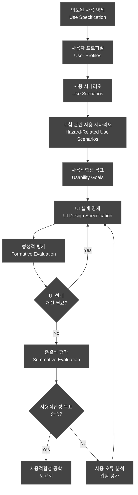
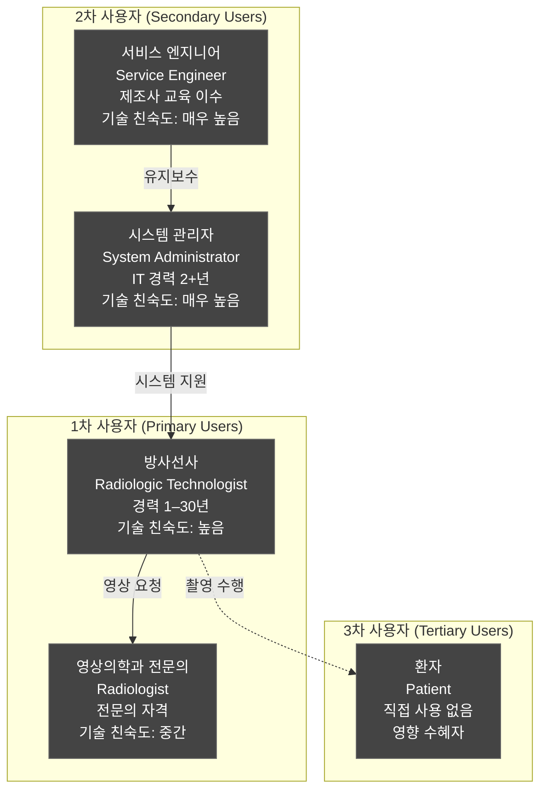
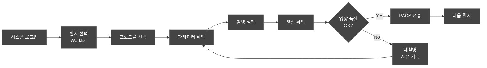
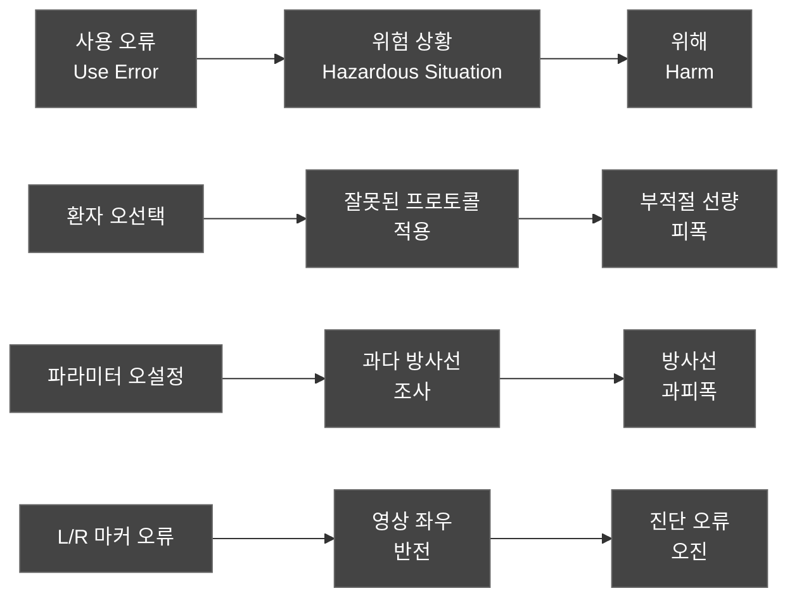
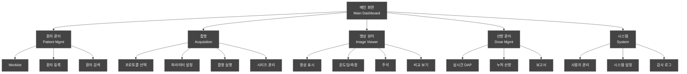
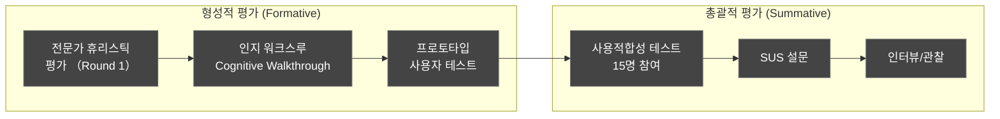
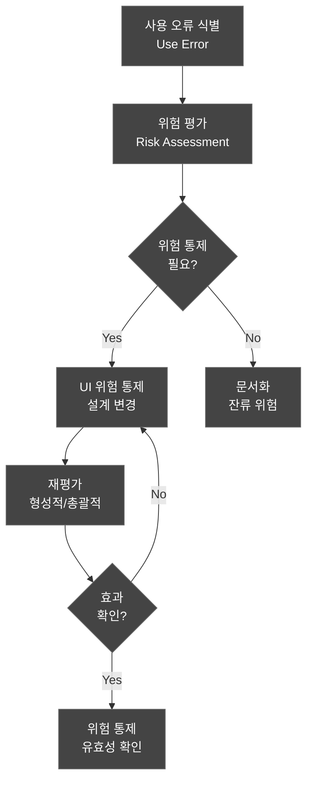
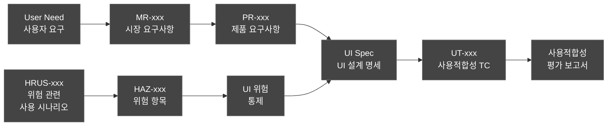

# 사용적합성 공학 파일 (Usability Engineering File)
## HnVue Console SW

---

## 문서 메타데이터 (Document Metadata)

| 항목 | 내용 |
|------|------|
| **문서 ID** | UEF-XRAY-GUI-001 |
| **문서명** | HnVue Console SW 사용적합성 공학 파일 |
| **버전** | v1.0 |
| **작성일** | 2026-03-18 |
| **작성자** | Human Factors Engineering (HFE) 팀 |
| **검토자** | 임상 자문위원, QA 팀장 |
| **승인자** | 의료기기 RA/QA 책임자 |
| **상태** | 승인됨 (Approved) |
| **기준 규격** | IEC 62366-1:2015+AMD1:2020, FDA Human Factors Guidance, IEC 62366-2 (TR) |

### 개정 이력 (Revision History)

| 버전 | 날짜 | 변경 내용 | 작성자 |
|------|------|----------|--------|
| v1.0 | 2026-03-18 | 최초 작성 — IEC 62366-1 전체 프로세스 적용 | HFE 팀 |

---

## 목차 (Table of Contents)

1. 목적 및 범위
2. 참조 규격
3. 사용적합성 공학 프로세스 개요
4. 의도된 사용 명세 (Use Specification)
5. 사용자 프로파일 (User Profiles)
6. 사용 시나리오 (Use Scenarios)
7. 위험 관련 사용 시나리오 (Hazard-Related Use Scenarios)
8. 사용적합성 목표 (Usability Goals)
9. UI 설계 명세 (UI Design Specification)
10. 사용적합성 평가 계획 (Usability Evaluation Plan)
11. 사용 오류 분석 (Use Error Analysis)
12. 추적성 (Traceability)

---

## 1. 목적 및 범위 (Purpose and Scope)

### 1.1 목적 (Purpose)

본 문서는 HnVue Console SW에 대한 **사용적합성 공학 파일 (Usability Engineering File, UEF)**로서, IEC 62366-1:2015+AMD1:2020의 전체 사용적합성 공학 프로세스 산출물을 통합 관리한다.

**핵심 목표**:
1. **사용 오류로 인한 환자 위해 방지**: 방사선 과피폭, 환자 오인, 영상 좌우 반전 등 안전 관련 사용 오류 식별 및 완화
2. **IEC 62366-1 프로세스 준수**: 의도된 사용 명세 → 사용 시나리오 → 위험 분석 → UI 설계 → 평가의 전 과정 문서화
3. **FDA HFE Guidance 충족**: 510(k) 제출 시 Human Factors Engineering 증거 제공
4. **사용자 중심 설계 (User-Centered Design)**: 방사선사, 영상의학과 전문의의 실제 업무 환경 반영

### 1.2 범위 (Scope)

| 구분 | 내용 |
|------|------|
| **대상** | HnVue Console SW v1.x Phase 1 |
| **인터페이스** | GUI (그래픽 사용자 인터페이스) 전체 |
| **사용자** | 방사선사, 영상의학과 전문의, 시스템 관리자 |
| **환경** | 병원 촬영실, 판독실, 관리실 |

---

## 2. 참조 규격 (Referenced Standards)

| 규격 | 제목 | 적용 |
|------|------|------|
| IEC 62366-1:2015+AMD1:2020 | 의료기기 사용적합성 공학 | 전체 프레임워크 |
| IEC 62366-2:2016 (TR) | 사용적합성 공학 가이드 | 방법론 참조 |
| FDA HFE Guidance (2016) | Human Factors Engineering for Medical Devices | FDA 제출 요건 |
| AAMI HE75:2009/(R)2018 | Human Factors Engineering | 설계 지침 |
| ISO 14971:2019 | 위험 관리 | 사용 오류 위험 연계 |
| IEC 62304:2006+AMD1:2015 | SW 생명주기 프로세스 | SW 개발 연계 |

---

## 3. 사용적합성 공학 프로세스 개요 (Usability Engineering Process)

### 3.1 IEC 62366-1 프로세스 흐름

### 3.2 프로세스 산출물

| IEC 62366-1 절 | 산출물 | 본 문서 섹션 |
|---------------|--------|-------------|
| §5.1 | 의도된 사용 명세 | 4장 |
| §5.2 | 사용자 인터페이스 특성 식별 | 4장, 5장 |
| §5.3 | 알려진 또는 예측 가능한 위해 식별 | 7장 |
| §5.4 | 위험 관련 사용 시나리오 식별 | 7장 |
| §5.5 | 사용적합성 목표 수립 | 8장 |
| §5.6 | UI 설계 및 구현 | 9장 |
| §5.7 | 사용적합성 평가 | 10장 |
| §5.8 | 사용 오류 및 잔류 위험 문서화 | 11장 |

---

## 4. 의도된 사용 명세 (Use Specification)

### 4.1 의도된 사용 (Intended Use)

HnVue Console SW는 **의료용 진단 X-Ray 촬영장치의 GUI Console Software**로서, 방사선사가 환자 선택, 촬영 프로토콜 설정, X-Ray 촬영 실행, 영상 확인 및 PACS 전송을 수행하는 데 사용된다.

### 4.2 사용 환경 (Use Environment)

| 환경 | 특성 | UI 영향 |
|------|------|---------|
| **촬영실 (X-Ray Room)** | 조명 변동 (일반/촬영 중 감소), 소음, 환자 이동 | 고대비 디스플레이, 대형 버튼, 터치 지원 |
| **판독실 (Reading Room)** | 저조도, 조용, 의료용 모니터 | DICOM GSDF 준수, 정밀 윈도잉 |
| **관리실 (Admin Office)** | 일반 사무 환경 | 표준 데스크탑 인터페이스 |
| **이동형 (Mobile)** | 병실/수술실 이동 촬영 | 터치 최적화, 최소 단계 워크플로우 |

### 4.3 사용 빈도 (Frequency of Use)

| 사용자 | 사용 빈도 | 1회 세션 시간 | 일일 사용 횟수 |
|--------|----------|-------------|--------------|
| 방사선사 | 매일 (교대 근무) | 8–12시간 연속 | 40–80회 촬영 |
| 영상의학과 전문의 | 필요 시 (판독) | 가변 (영상 확인) | 10–30회 확인 |
| 시스템 관리자 | 주 1–2회 | 30분~1시간 | 불규칙 |

---

## 5. 사용자 프로파일 (User Profiles)

### 5.1 주요 사용자 프로파일

### 5.2 방사선사 프로파일 상세

| 항목 | 내용 |
|------|------|
| **역할** | 촬영 계획, 실행, 영상 품질 관리, PACS 전송 |
| **교육 수준** | 방사선학과 학사 이상, 면허 보유 |
| **경력 범위** | 신입 (1년) ~ 경력 (30년) |
| **기술 친숙도** | 디지털 X-Ray 시스템, PACS 사용 경험 |
| **신체적 특성** | 장갑 착용 시 터치 사용, 서서 작업 가능 |
| **인지 부하** | 다수 환자 순차 처리, 응급 대응 시 높음 |
| **핵심 과업** | 환자 선택 → 프로토콜 설정 → 촬영 → 영상 확인 → 전송 |

### 5.3 영상의학과 전문의 프로파일 상세

| 항목 | 내용 |
|------|------|
| **역할** | 영상 판독, 진단, 영상 품질 최종 확인 |
| **교육 수준** | 의학박사, 영상의학과 전문의 |
| **기술 친숙도** | PACS Viewer 능숙, 새 시스템 적응 시간 필요 |
| **핵심 과업** | 영상 조회 → 윈도잉/측정 → 판독 |

---

## 6. 사용 시나리오 (Use Scenarios)

### 6.1 일반 사용 시나리오

### 6.2 사용 시나리오 목록

| 시나리오 ID | 시나리오명 | 사용자 | 위험 관련 | 빈도 |
|------------|----------|--------|---------|------|
| US-001 | 표준 흉부 PA/LAT 촬영 | 방사선사 | Yes | 매우 높음 |
| US-002 | 응급 환자 즉시 촬영 | 방사선사 | Yes | 높음 |
| US-003 | 소아 환자 촬영 | 방사선사 | Yes (선량) | 중간 |
| US-004 | 촬영 영상 품질 확인/재촬영 판단 | 방사선사 | Yes | 높음 |
| US-005 | Worklist에서 환자 검색/선택 | 방사선사 | Yes (오인) | 매우 높음 |
| US-006 | DICOM 영상 PACS 전송 | 방사선사 | No | 높음 |
| US-007 | 영상 윈도잉/측정 (판독) | 전문의 | Yes (진단) | 높음 |
| US-008 | 선량 보고서 확인 | 방사선사 | Yes | 중간 |
| US-009 | 시스템 설정/사용자 관리 | 관리자 | No | 낮음 |
| US-010 | 네트워크 장애 시 오프라인 촬영 | 방사선사 | Yes | 낮음 |
| US-011 | 촬영 프로토콜 커스터마이징 | 방사선사 | Yes (선량) | 낮음 |
| US-012 | 여러 환자 연속 촬영 (바쁜 외래) | 방사선사 | Yes (오인) | 높음 |

---

## 7. 위험 관련 사용 시나리오 (Hazard-Related Use Scenarios)

### 7.1 사용 오류 → 위해 경로

### 7.2 위험 관련 사용 시나리오 상세

| HRUS-ID | 사용 오류 | 위험 상황 | 잠재적 위해 | 심각도 | 관련 HAZ | UI 완화 조치 |
|---------|----------|----------|------------|--------|---------|-------------|
| HRUS-001 | Worklist에서 잘못된 환자 선택 (이름 유사) | 다른 환자 프로토콜 적용 | 부적절 선량, 오진 | Critical | HAZ-001 | 환자 확인 팝업, 사진 표시, 2차 확인 |
| HRUS-002 | 소아 프로토콜 미선택 (성인용 사용) | 소아에 과다 선량 조사 | 방사선 과피폭 | Critical | HAZ-002 | 나이 기반 자동 프로토콜 제안, 경고 |
| HRUS-003 | kVp/mAs 수동 설정 오류 | 과다 또는 과소 방사선 조사 | 과피폭 또는 재촬영 | High | HAZ-003 | 범위 제한, 시각적 게이지, DRL 경고 |
| HRUS-004 | 촬영 부위 L/R 마커 미표시 | 영상 좌우 혼동 | 진단 오류, 수술 부위 오류 | Critical | HAZ-004 | 강제 L/R 선택, 미선택 시 경고 |
| HRUS-005 | 촬영 중 다른 환자 데이터 화면 | 영상-환자 불일치 | 오진, 치료 오류 | High | HAZ-005 | 촬영 모드 잠금, 환자 전환 차단 |
| HRUS-006 | 재촬영 시 누적 선량 미확인 | 불필요한 추가 피폭 | 누적 방사선 피폭 | High | HAZ-006 | 누적 선량 실시간 표시, DRL 초과 경고 |
| HRUS-007 | 윈도잉 오류로 영상 판독 오류 | 병변 미발견 또는 오인 | 진단 누락, 오진 | Medium | HAZ-007 | 자동 프리셋, GSDF 보정, 리셋 버튼 |
| HRUS-008 | PACS 전송 실패 미인지 | 영상 유실, 재촬영 필요 | 추가 피폭, 진단 지연 | High | HAZ-008 | 전송 상태 아이콘, 실패 시 알림, 자동 재시도 |

### 7.3 사용 오류 심각도 매트릭스

| 발생 가능성 \ 심각도 | 경미 (Minor) | 중대 (Serious) | 치명적 (Critical) |
|---------------------|-------------|---------------|-----------------|
| **빈번 (Frequent)** | Medium | High | **Critical** |
| **가끔 (Occasional)** | Low | Medium | High |
| **드문 (Rare)** | Low | Low | Medium |

---

## 8. 사용적합성 목표 (Usability Goals)

### 8.1 정량적 목표

| 목표 ID | 지표 | 목표값 | 측정 방법 |
|---------|------|--------|----------|
| UG-001 | 표준 촬영 과업 성공률 | ≥ 98% | 총괄적 평가 |
| UG-002 | 안전-필수 과업 성공률 (환자 확인, L/R 마커) | 100% | 총괄적 평가 |
| UG-003 | 치명적 사용 오류 발생률 | 0건 | 총괄적 평가 |
| UG-004 | 표준 촬영 사이클 시간 (환자선택→전송) | ≤ 90초 | 과업 타이머 |
| UG-005 | SUS 점수 (System Usability Scale) | ≥ 78 (Good) | SUS 설문 |
| UG-006 | 학습 시간 (기본 기능 숙지) | ≤ 2시간 | 교육 후 테스트 |
| UG-007 | 사용자 만족도 | ≥ 4.0/5.0 | Likert 척도 |

### 8.2 정성적 목표

1. 방사선사가 추가 교육 없이 기본 촬영 워크플로우 수행 가능
2. 응급 상황에서 최소 3 클릭 이내 촬영 시작 가능
3. 시각적 피드백을 통해 시스템 상태 즉시 인지 가능
4. 색상/아이콘만으로 안전-필수 정보 구별 가능

---

## 9. UI 설계 명세 (UI Design Specification)

### 9.1 정보 구조 (Information Architecture)

### 9.2 안전-필수 UI 요소 색상 체계

| UI 요소 | 색상 | 의미 | 예시 |
|---------|------|------|------|
| **방사선 경고** | 🔴 Red (#FF0000) | 즉시 주의 필요 | DRL 초과, 과피폭 경고 |
| **주의/확인** | 🟡 Amber (#FFA500) | 확인 필요 | 재촬영 권고, 파라미터 이상 |
| **정상/완료** | 🟢 Green (#00AA00) | 정상 상태 | 촬영 완료, 전송 성공 |
| **정보** | 🔵 Blue (#0066CC) | 참고 정보 | 환자 정보, 시스템 상태 |
| **비활성** | ⚪ Gray (#999999) | 사용 불가/대기 | 비활성 버튼, 대기 상태 |

### 9.3 알림 계층 (Notification Hierarchy)

| 수준 | 유형 | 표시 방법 | 사용자 조치 | 예시 |
|------|------|----------|------------|------|
| 1 (Critical) | 모달 알림 + 오디오 | 화면 전체 차단 팝업 + 경고음 | 확인 필수 | 방사선 과피폭 경고 |
| 2 (Warning) | 모달 알림 | 팝업, 배경 어둡게 | 확인/취소 선택 | 파라미터 범위 초과 |
| 3 (Caution) | 인라인 배너 | 화면 상단 노란 배너 | 무시 가능 | DRL 근접 알림 |
| 4 (Info) | 토스트 알림 | 화면 우하단 자동 소멸 | 무시 가능 | 전송 완료 알림 |

### 9.4 촬영 화면 레이아웃 원칙

| 영역 | 위치 | 내용 | 설계 원칙 |
|------|------|------|----------|
| **환자 정보 바** | 상단 고정 | 이름, ID, 나이, 성별 | 항상 표시, 큰 글자, 색상 강조 |
| **촬영 파라미터** | 좌측 패널 | kVp, mAs, SID, 프로토콜 | 수치 명확, 범위 시각화 |
| **영상 표시** | 중앙 (최대) | 촬영 영상 실시간 | 최대 면적, GSDF 보정 |
| **선량 정보** | 우측 하단 | DAP, 누적 선량, DRL 상태 | 실시간 업데이트, 색상 코딩 |
| **동작 버튼** | 하단 바 | 촬영, 전송, 재촬영, 거부 | 대형 터치 버튼 (최소 44×44px) |

---

## 10. 사용적합성 평가 계획 (Usability Evaluation Plan)

### 10.1 평가 전략

### 10.2 형성적 평가 (Formative Evaluation)

#### 10.2.1 전문가 휴리스틱 평가 (Heuristic Evaluation)

| 항목 | 내용 |
|------|------|
| **평가자** | HFE 전문가 3명, 임상 전문가 2명 |
| **시기** | 프로토타입 단계 (M4) |
| **기준** | Nielsen 10 Heuristics + 의료기기 특화 기준 |
| **산출물** | 발견 사항 목록, 심각도 등급, 권고 사항 |

**의료기기 특화 휴리스틱**:
1. 환자 식별 정보가 항상 명확하게 표시되는가?
2. 안전-필수 조작에 확인 단계가 있는가?
3. 오류 상태에서 안전한 기본값으로 복귀하는가?
4. 선량 정보가 실시간으로 정확하게 표시되는가?

#### 10.2.2 인지 워크스루 (Cognitive Walkthrough)

| 시나리오 | 사용자 | 평가 포커스 |
|----------|--------|------------|
| 표준 흉부 촬영 | 신입 방사선사 | 학습성, 첫 사용 효율 |
| 응급 촬영 | 숙련 방사선사 | 긴급 상황 효율, 오류 방지 |
| 소아 촬영 | 중간 경력 방사선사 | 선량 안전 기능 인지 |
| 시스템 관리 | 시스템 관리자 | 관리 기능 접근성 |

### 10.3 총괄적 평가 (Summative Evaluation)

#### 10.3.1 사용적합성 테스트 계획

| 항목 | 내용 |
|------|------|
| **참여자** | 방사선사 10명, 전문의 3명, 관리자 2명 (총 15명) |
| **경력 분포** | 신입 (1-3년) 5명, 중간 (3-10년) 5명, 경력 (10+년) 5명 |
| **환경** | 시뮬레이션 임상 환경 (밸리데이션 환경 공용) |
| **시기** | Phase 1 M10 (밸리데이션과 동시) |
| **기록 방법** | 화면 녹화, Think-Aloud, 관찰자 메모 |

#### 10.3.2 총괄적 평가 과업 목록

| 과업 ID | 과업명 | 안전-필수 | 합격 기준 |
|---------|--------|---------|----------|
| UT-001 | 시스템 로그인 | No | 성공률 100% |
| UT-002 | Worklist에서 환자 선택 | Yes | 정확한 환자 선택 100% |
| UT-003 | 흉부 PA 프로토콜 설정 | Yes | 올바른 프로토콜 100% |
| UT-004 | 파라미터 확인 후 촬영 실행 | Yes | 안전 파라미터 확인 100% |
| UT-005 | 촬영 영상 품질 확인 | Yes | 품질 판단 정확도 ≥ 90% |
| UT-006 | 재촬영 결정 및 실행 | Yes | 올바른 판단 100% |
| UT-007 | L/R 마커 적용 | Yes | 올바른 적용 100% |
| UT-008 | 선량 정보 확인 (DAP) | Yes | 정확한 확인 ≥ 95% |
| UT-009 | PACS 전송 및 확인 | No | 성공적 전송 100% |
| UT-010 | 영상 윈도잉 조절 | No | 적절한 윈도잉 ≥ 90% |
| UT-011 | 영상 측정 (거리) | No | 정확한 측정 ≥ 90% |
| UT-012 | 응급 환자 촬영 (3클릭 이내) | Yes | ≤ 3 클릭, ≤ 15초 |
| UT-013 | DRL 초과 경고 대응 | Yes | 올바른 대응 100% |
| UT-014 | 시스템 설정 변경 | No | 성공률 ≥ 90% |
| UT-015 | 감사 로그 조회 | No | 조회 성공 100% |

---

## 11. 사용 오류 분석 (Use Error Analysis)

### 11.1 사용 오류 → 위험 통제 흐름

### 11.2 사용 오류 분류

| 오류 유형 | 설명 | 예시 | 빈도 예상 |
|----------|------|------|----------|
| **인지 오류 (Perception Error)** | 정보를 잘못 인식 | 환자 이름 혼동 | Medium |
| **판단 오류 (Cognition Error)** | 잘못된 결정 | 재촬영 불필요한데 실행 | Low |
| **조작 오류 (Action Error)** | 잘못된 동작 | 잘못된 버튼 클릭 | Medium |
| **기억 오류 (Memory Error)** | 단계 누락 | L/R 마커 미적용 | Medium |
| **위반 (Violation)** | 의도적 절차 무시 | 확인 팝업 무시 클릭 | Low |

### 11.3 FMEA 연계

사용 오류 분석 결과는 DOC-009 FMEA (FMEA-XRAY-GUI-001)의 사용 오류 관련 항목과 연계된다:

| HRUS-ID | 관련 FMEA 항목 | RPN (초기) | UI 위험 통제 후 RPN |
|---------|---------------|-----------|-------------------|
| HRUS-001 | FMEA-PM-001 | 320 | 48 |
| HRUS-002 | FMEA-WF-003 | 280 | 36 |
| HRUS-003 | FMEA-WF-005 | 240 | 32 |
| HRUS-004 | FMEA-IP-002 | 300 | 40 |
| HRUS-005 | FMEA-PM-004 | 200 | 24 |
| HRUS-006 | FMEA-DM-001 | 180 | 28 |

---

## 12. 추적성 (Traceability)

### 12.1 추적성 체인

### 12.2 추적성 매트릭스 (요약)

| 사용자 요구 | MR | PR | UI Spec | UT TC | HRUS |
|------------|-----|-----|---------|-------|------|
| 빠른 환자 선택 | MR-001–003 | PR-001–003 | Worklist UI | UT-002 | HRUS-001 |
| 안전한 촬영 | MR-010–015 | PR-010–015 | Acquisition UI | UT-003–006 | HRUS-002–005 |
| 정확한 영상 | MR-020–027 | PR-020–027 | Viewer UI | UT-005, 010–011 | HRUS-007 |
| 선량 관리 | MR-040–044 | PR-040–044 | Dose Panel | UT-008, 013 | HRUS-006 |
| 쉬운 관리 | MR-060–063 | PR-060–063 | Admin UI | UT-014–015 | — |

---

*문서 끝 (End of Document)*
