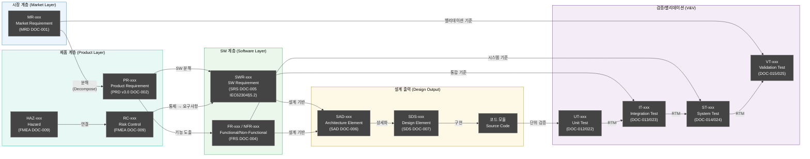
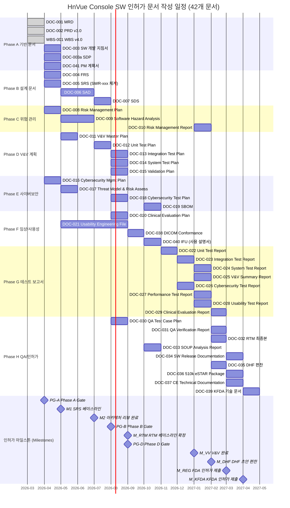
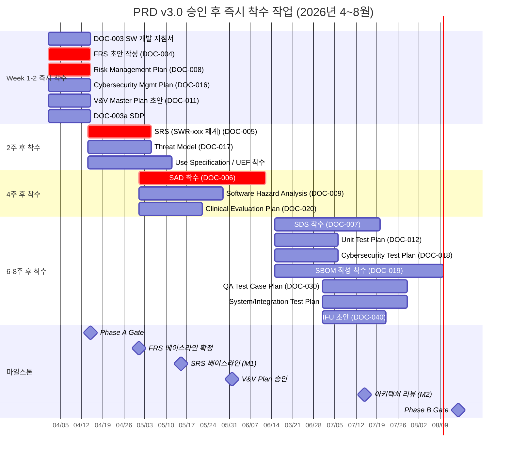
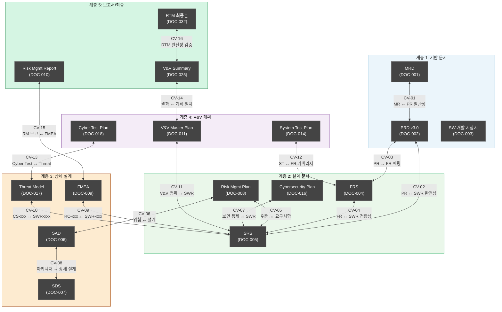
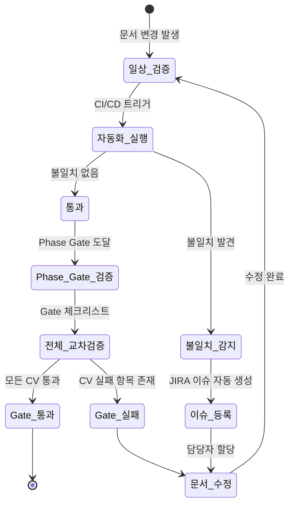
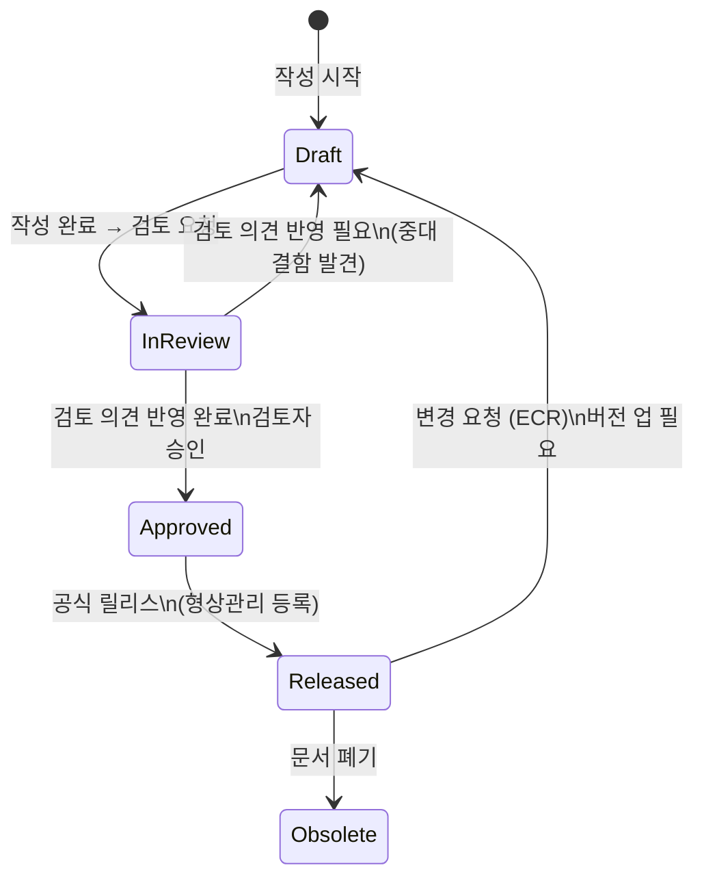

# HnVue Console SW 인허가 문서 작성 마스터 플랜
# Document Master Plan (DMP) v1.0

> **문서 ID**: DMP-XRAY-GUI-001
> **버전**: v1.0
> **작성일**: 2026-03-27
> **최종 개정일**: 2026-03-27
> **적용 제품**: HnVue HnVue Console SW
> **적용 규격**: IEC 62304, IEC 62366, ISO 14971, ISO 13485, FDA 21 CFR 820.30, FDA Section 524B, EU MDR 2017/745
> **인허가 대상**: FDA 510(k) / CE MDR / KFDA (식약처)
> **SW Safety Class**: IEC 62304 Class B

---

## 문서 개정 이력 (Revision History)

| 버전 | 일자 | 개정 내용 | 작성자 |
|------|------|-----------|--------|
| v1.0 | 2026-03-27 | 최초 작성 | — |

---

## 1. 개요 (Overview)

### 1.1 목적 (Purpose)

본 문서(Document Master Plan, DMP)는 **HnVue** HnVue Console SW의 **FDA 510(k) / CE MDR / KFDA 인허가**를 위한 전체 문서 작성 계획을 정의한다.

구체적으로 다음 사항을 다룬다:
- 인허가 제출에 필요한 **전체 문서 목록 및 분류 체계** (42개)
- 각 문서의 **작성 순서, 의존관계, 목표 일정**
- **문서 간 ID 체계** (MR-xxx → PR-xxx → SWR-xxx) 및 추적성 구조
- 문서 **검토/승인 프로세스** 및 상태 관리
- **문서 간 교차 검증 (Cross-Verification)** 방법 및 자동화
- **Phase Gate** 기준 및 체크리스트
- **DHF (Design History File) 편찬** 계획

### 1.2 적용 범위 (Scope)

| 항목 | 내용 |
|------|------|
| **제품명** | HnVue HnVue Console SW |
| **SW Safety Class** | IEC 62304 Class B |
| **인허가 대상 시장** | 미국 (FDA 510(k)), 유럽 (CE MDR), 한국 (KFDA 식약처) |
| **개발 Phase** | Phase 1 (M1-M12 핵심 기능, 인허가 대상) / Phase 2 (M13-M24 AI/Cloud 고도화) |
| **문서 총 수** | 42개 (Phase A~H) |
| **요구사항 계층** | MR → PR → SWR (3단계) |
| **문서 언어** | 한국어 (기술 용어 영문 병기) |

### 1.3 적용 규격 (Applicable Standards)

| 규격 | 내용 | 적용 문서 |
|------|------|----------|
| **IEC 62304:2006+AMD1:2015** | Medical Device Software Lifecycle Processes | SDP, SRS, SAD, SDS, V&V |
| **IEC 62366-1:2015+AMD1:2020** | Usability Engineering for Medical Devices | UEF, Usability Test Reports |
| **ISO 14971:2019** | Risk Management for Medical Devices | Risk Management File |
| **ISO 13485:2016** | Quality Management Systems | SDP, QA 문서 전반 |
| **FDA 21 CFR Part 820.30** | Design Controls (Quality System Regulation) | DHF, Design Reviews |
| **FDA Section 524B** | Cybersecurity in Medical Devices | Cybersecurity Plan, SBOM |
| **EU MDR 2017/745** | CE Marking — Medical Device Regulation | CE Technical File |
| **FDA eSTAR** | Electronic Submission Template (2023+) | 510(k) Submission |
| **DICOM PS3.x** | Digital Imaging and Communications in Medicine | DICOM Conformance Statement |
| **IHE Radiology Technical Framework** | IHE 방사선 기술 프레임워크 | Workflow 설계 문서 |

---

## 2. 인허가 문서 체계도 (Document Architecture)

### 2.1 전체 문서 관계도 (Full Document Relationship Map — 42개)

```mermaid
flowchart TD
    classDef default fill:#444,stroke:#666,color:#fff
    MRD["MRD\nMarket Requirements Document\nDOC-001"]
    PRD["PRD v3.0\nProduct Requirements Doc\nDOC-002"]
    SDG["SW 개발 지침서\nSW Development Guideline\nDOC-003"]
    SDP_DOC["SDP\nSW Development Plan\nDOC-003a"]
    FRS["FRS\nFunctional Requirements Specification\nDOC-004"]
    SRS["SRS\nSoftware Requirements Specification\nDOC-005"]
    SAD["SAD\nSoftware Architecture Design\nDOC-006"]
    SDS["SDS\nSoftware Design Specification\nDOC-007"]
    RMP["Risk Management Plan\nISO 14971 — DOC-008"]
    FMEA["Software Hazard Analysis\nFMEA / FTA — DOC-009"]
    RMR["Risk Management Report\nDOC-010"]
    VVP["V&V Master Plan\nDOC-011"]
    UTP["Unit Test Plan — DOC-012"]
    ITP["Integration Test Plan — DOC-013"]
    STP["System Test Plan — DOC-014"]
    VALP["Validation Plan — DOC-015"]
    CMP["Cybersecurity Mgmt Plan\nFDA 524B — DOC-016"]
    TMA["Threat Model & Risk\nAssessment — DOC-017"]
    CTP["Cybersecurity Test Plan\nDOC-018"]
    SBOM["SBOM\nDOC-019"]
    CEP["Clinical Evaluation Plan\nDOC-020"]
    UEF["Usability Engineering\nFile (IEC 62366) — DOC-021"]
    UTR["Unit Test Report — DOC-022"]
    ITR["Integration Test Report — DOC-023"]
    STR["System Test Report — DOC-024"]
    VVR["V&V Summary Report — DOC-025"]
    CTR["Cybersecurity Test Report\nDOC-026"]
    PTR["Performance Test Report\nDOC-027"]
    USR["Usability Test Report\nDOC-028"]
    CER["Clinical Evaluation Report\nDOC-029"]
    QTP["QA Test Case Plan — DOC-030"]
    QVR["QA Verification Report\nDOC-031"]
    RTM["RTM 최종본\nDOC-032"]
    SOUP["SOUP Analysis Report\nDOC-033"]
    RLS["SW Release Documentation\nDOC-034"]
    DHF["Design History File\nDHF — DOC-035"]
    ESTAR["510k / eSTAR Package\nDOC-036"]
    CE["CE Technical Documentation\nDOC-037"]
    WBS["WBS v4.0\nWork Breakdown Structure\nWBS-001"]
    DCS["DICOM Conformance\nStatement — DOC-038"]
    KFDA_DOC["KFDA 기술 문서\nKFDA Technical File\nDOC-039"]
    IFU["사용 설명서\nInstructions for Use (IFU)\nDOC-040"]
    PM_PLAN["PM 계획서\nProject Management Plan\nDOC-041"]

    MRD --> PRD
    MRD --> WBS
    SDG --> SDP_DOC
    SDP_DOC --> FRS
    PRD --> FRS
    FRS --> SRS
    SRS --> SAD
    SAD --> SDS

    MRD --> RMP
    PRD --> RMP
    RMP --> FMEA
    FMEA --> RMR

    FRS --> VVP
    RMP --> VVP
    VVP --> UTP
    VVP --> ITP
    VVP --> STP
    VVP --> VALP
    VALP --> CEP
    VALP --> UEF

    UTP --> UTR
    ITP --> ITR
    STP --> STR
    UTR --> VVR
    ITR --> VVR
    STR --> VVR
    RMR --> VVR

    PRD --> CMP
    CMP --> TMA
    TMA --> CTP
    CTP --> CTR
    PRD --> SBOM
    SBOM --> CTR

    VALP --> USR
    CEP --> CER
    VVP --> PTR
    STP --> QTP
    QTP --> QVR

    MRD --> RTM
    PRD --> RTM
    FRS --> RTM
    SDS --> RTM
    VVR --> RTM
    FMEA --> RTM
    SOUP --> RTM

    SRS --> DCS
    PRD --> IFU

    MRD --> DHF
    PRD --> DHF
    FRS --> DHF
    SAD --> DHF
    SDS --> DHF
    VVR --> DHF
    RTM --> DHF
    RMR --> DHF
    CTR --> DHF
    SBOM --> DHF
    UEF --> DHF
    CER --> DHF
    QVR --> DHF
    RLS --> DHF
    DCS --> DHF
    IFU --> DHF

    DHF --> ESTAR
    DHF --> CE
    DHF --> KFDA_DOC

    WBS --> PM_PLAN

    style MRD fill:#EBF5FB,stroke:#2980B9,color:#000
    style PRD fill:#EBF5FB,stroke:#2980B9,color:#000
    style FRS fill:#EBF5FB,stroke:#2980B9,color:#000
    style SRS fill:#EBF5FB,stroke:#2980B9,color:#000
    style SDG fill:#E8F8F5,stroke:#1ABC9C,color:#000
    style SDP_DOC fill:#E8F8F5,stroke:#1ABC9C,color:#000
    style DHF fill:#FDEDEC,stroke:#C0392B,color:#000
    style ESTAR fill:#D5F5E3,stroke:#1E8449,color:#000
    style CE fill:#D5F5E3,stroke:#1E8449,color:#000
    style KFDA_DOC fill:#D5F5E3,stroke:#1E8449,color:#000
    style RTM fill:#FEF9E7,stroke:#B7950B,color:#000
    style RMP fill:#FDEBD0,stroke:#A04000,color:#000
    style FMEA fill:#FDEBD0,stroke:#A04000,color:#000
    style VVP fill:#F4ECF7,stroke:#7D3C98,color:#000
    style CMP fill:#FDEDEC,stroke:#C0392B,color:#000
    style SBOM fill:#FDEDEC,stroke:#C0392B,color:#000
    style WBS fill:#EAF7EA,stroke:#27AE60,color:#000
    style DCS fill:#F0E6FF,stroke:#8E44AD,color:#000
    style IFU fill:#F0E6FF,stroke:#8E44AD,color:#000
```



---

### 2.2 Phase별 문서 흐름도 (Phase A~H Document Flow)

```mermaid
flowchart LR
    classDef default fill:#444,stroke:#666,color:#fff
    subgraph A["Phase A\n기반 문서 (Foundation)"]
        direction TB
        MRD["MRD"]
        PRD_V3["PRD v3.0"]
        WBS_V4["WBS v4.0"]
        SDG_A["SW 개발 지침서"]
        SDP_A["SDP"]
        PM_A["PM 계획서"]
    end

    subgraph B["Phase B\n상세 설계 문서 (Design)"]
        direction TB
        FRS_B["FRS"]
        SRS_B["SRS"]
        SAD_B["SAD"]
        SDS_B["SDS"]
    end

    subgraph C["Phase C\n위험 관리 (Risk Mgmt)"]
        direction TB
        RMP_C["Risk Mgmt Plan"]
        FMEA_C["FMEA / FTA"]
        RMR_C["Risk Mgmt Report"]
    end

    subgraph D["Phase D\nV&V 계획 (V&V Plan)"]
        direction TB
        VVP_D["V&V Master Plan"]
        UTP_D["Unit Test Plan"]
        ITP_D["Integration Test Plan"]
        STP_D["System Test Plan"]
        VALP_D["Validation Plan"]
    end

    subgraph E["Phase E\n사이버보안 (Cybersecurity)"]
        direction TB
        CMP_E["Cybersecurity Plan"]
        SBOM_E["SBOM"]
        TMA_E["Threat Model"]
        CTP_E["Cyber Test Plan"]
    end

    subgraph F["Phase F\n임상/사용성 (Clinical/UX)"]
        direction TB
        CEP_F["Clinical Eval Plan"]
        UEF_F["Usability File"]
        IFU_F["IFU"]
        DCS_F["DICOM Conformance"]
    end

    subgraph G["Phase G\n테스트 보고서 (Test Reports)"]
        direction TB
        VVR_G["V&V Summary Report"]
        CTR_G["Cyber Test Report"]
        USR_G["Usability Test Report"]
        CER_G["Clinical Eval Report"]
        PTR_G["Performance Report"]
    end

    subgraph H["Phase H\nQA 및 인허가 (QA & Regulatory)"]
        direction TB
        RTM_H["RTM 최종본"]
        DHF_H["DHF"]
        ESTAR_H["510(k) / eSTAR"]
        CE_H["CE Technical Doc"]
        KFDA_H["KFDA 기술 문서"]
    end

    A --> B
    A --> C
    B --> D
    C --> D
    B --> E
    D --> F
    D --> G
    E --> G
    F --> G
    G --> H

    style A fill:#EBF5FB,stroke:#2980B9,color:#000
    style B fill:#EAF7EA,stroke:#27AE60,color:#000
    style C fill:#FDEBD0,stroke:#A04000,color:#000
    style D fill:#F4ECF7,stroke:#7D3C98,color:#000
    style E fill:#FDEDEC,stroke:#C0392B,color:#000
    style F fill:#FEF9E7,stroke:#B7950B,color:#000
    style G fill:#EBF5FB,stroke:#2980B9,color:#000
    style H fill:#D5F5E3,stroke:#1E8449,color:#000
```



---

## 3. 문서 목록 및 작성 순서

### 3.1 Phase A: 기반 문서 (Foundation Documents)

> 현재 완료 예정 — 후속 모든 문서의 기반이 되는 핵심 문서.

| Phase | 문서 ID | 문서명 | 의존 문서 | 담당 | 목표 일정 | 인허가 제출 포함 |
|-------|---------|--------|----------|------|----------|----------------|
| A | **DOC-001** | MRD (Market Requirements Document) | — | PM/마케팅 | 2026-03 ✅완료 | ✅ (DHF Design Input) |
| A | **DOC-002** | PRD v3.0 (Product Requirements Document) — MR→PR→SWR 3단계 계층 적용 | DOC-001 | PM/SE | 2026-03 ✅완료 | ✅ (DHF Design Input, eSTAR) |
| A | **WBS-001** | WBS v4.0 (Work Breakdown Structure) — Milestone 통합 | DOC-001, DOC-002 | PM | 2026-03 ✅완료 | ✅ (DHF Design Plan) |
| A | **DOC-003** | SW 개발 지침서 (Software Development Guideline) — **신규** | DOC-002 | Dev Lead/QA | 2026-04 | ✅ (DHF QMS, IEC 62304) |
| A | **DOC-003a** | SDP (Software Development Plan) — **신규** | DOC-003 | PM/Dev Lead | 2026-04 | ✅ (DHF QMS, IEC 62304 §5.1) |
| A | **DOC-041** | PM 계획서 (Project Management Plan) — **신규** | DOC-001, WBS-001 | PM | 2026-04 | — (내부 관리) |

> **DOC-003 vs DOC-003a 구분**:
> - **DOC-003 (SW 개발 지침서)**: 코딩 표준, 형상관리 정책, 브랜치 전략 등 **기술적 기준**
> - **DOC-003a (SDP)**: IEC 62304 §5.1 요구 — 개발 활동 계획, 인도물, 일정, 자원 등 **프로세스 계획**

---

### 3.2 Phase B: 상세 설계 문서 (Detailed Design Documents)

> MRD/PRD 승인 후 즉시 착수. SRS는 PRD v3.0의 SWR-xxx 체계 기반으로 작성

| Phase | 문서 ID | 문서명 | 의존 문서 | 담당 | 목표 일정 | 인허가 제출 포함 |
|-------|---------|--------|----------|------|----------|----------------|
| B | **DOC-004** | FRS (Functional Requirements Specification) | DOC-002, DOC-003 | SE | 2026-05 | ✅ (DHF DI, eSTAR) |
| B | **DOC-005** | SRS (Software Requirements Specification) — SWR-xxx 체계, IEC 62304 §5.2 | DOC-002, DOC-004 | SE | 2026-05 | ✅ (DHF DI, eSTAR 필수) |
| B | **DOC-006** | SAD (Software Architecture Design) | DOC-004, DOC-005 | Lead Dev | 2026-06 | ✅ (DHF DO, eSTAR) |
| B | **DOC-007** | SDS (Software Design Specification) | DOC-006 | Dev Team | 2026-07 | ✅ (DHF DO) |

---

### 3.3 Phase C: 위험 관리 문서 (Risk Management Documents)

> SRS 작성과 병행 시작

| Phase | 문서 ID | 문서명 | 의존 문서 | 담당 | 목표 일정 | 인허가 제출 포함 |
|-------|---------|--------|----------|------|----------|----------------|
| C | **DOC-008** | Risk Management Plan (ISO 14971) | DOC-002 | QA/SE | 2026-05 | ✅ (DHF RM, eSTAR) |
| C | **DOC-009** | Software Hazard Analysis (FMEA/FTA) | DOC-004, DOC-005, DOC-008 | SE/QA | 2026-06 | ✅ (DHF RM, eSTAR) |
| C | **DOC-010** | Risk Management Report | DOC-008, DOC-009 | QA | 2027-01 | ✅ (DHF RM, eSTAR) |

---

### 3.4 Phase D: V&V 계획 문서 (Verification & Validation Plan Documents)

> 상세 설계 시작과 병행 — 테스트 계획은 설계 전에 수립

| Phase | 문서 ID | 문서명 | 의존 문서 | 담당 | 목표 일정 | 인허가 제출 포함 |
|-------|---------|--------|----------|------|----------|----------------|
| D | **DOC-011** | V&V Master Plan | DOC-004, DOC-005, DOC-008 | QA/SE | 2026-05 | ✅ (DHF DV, eSTAR) |
| D | **DOC-012** | Unit Test Plan | DOC-006, DOC-007 | Dev/QA | 2026-07 | ✅ (DHF DV) |
| D | **DOC-013** | Integration Test Plan | DOC-006, DOC-011 | QA | 2026-08 | ✅ (DHF DV) |
| D | **DOC-014** | System Test Plan | DOC-004, DOC-011 | QA | 2026-08 | ✅ (DHF DV, eSTAR) |
| D | **DOC-015** | Validation Plan (Usability + Clinical) | DOC-011, DOC-020, DOC-021 | QA/Clinical | 2026-08 | ✅ (DHF DAL, eSTAR) |

---

### 3.5 Phase E: 사이버보안 문서 (Cybersecurity Documents)

> FDA Section 524B 의무 제출 — SRS 완성 후 즉시 착수

| Phase | 문서 ID | 문서명 | 의존 문서 | 담당 | 목표 일정 | 인허가 제출 포함 |
|-------|---------|--------|----------|------|----------|----------------|
| E | **DOC-016** | Cybersecurity Management Plan | DOC-002, DOC-008 | Security | 2026-05 | ✅ (DHF DP, eSTAR 필수) |
| E | **DOC-017** | Threat Model & Risk Assessment (STRIDE) | DOC-005, DOC-016 | Security | 2026-06 | ✅ (DHF RM, eSTAR) |
| E | **DOC-018** | Cybersecurity Test Plan | DOC-016, DOC-017 | Security/QA | 2026-08 | ✅ (DHF DV, eSTAR) |
| E | **DOC-019** | SBOM (Software Bill of Materials) | 구현 완료 후 | Dev/Security | 2026-10 | ✅ (eSTAR 법적 필수) |

---

### 3.6 Phase F: 임상/사용성 평가 문서 (Clinical & Usability Documents)

> 설계 초기부터 병행.

| Phase | 문서 ID | 문서명 | 의존 문서 | 담당 | 목표 일정 | 인허가 제출 포함 |
|-------|---------|--------|----------|------|----------|----------------|
| F | **DOC-020** | Clinical Evaluation Plan | DOC-004, DOC-008 | Clinical/RA | 2026-08 | ✅ (DHF DAL, CE MDR 필수) |
| F | **DOC-021** | Usability Engineering File (IEC 62366) | DOC-002, Use Specification | UX/QA | 2026-09 | ✅ (DHF DAL, eSTAR/CE) |
| F | **DOC-038** | DICOM Conformance Statement — **신규** | DOC-005, DOC-006 | Dev/SE | 2026-09 | ✅ (DHF, CE MDR/FDA) |
| F | **DOC-040** | 사용 설명서 / Instructions for Use (IFU) — **신규** | DOC-002, DOC-021 | UX/RA | 2026-10 | ✅ (CE MDR Annex I 필수) |

---

### 3.7 Phase G: 테스트 실행 및 보고서 (Test Execution & Reports)

> 구현 완료 후 테스트 실행

| Phase | 문서 ID | 문서명 | 의존 문서 | 담당 | 목표 일정 | 인허가 제출 포함 |
|-------|---------|--------|----------|------|----------|----------------|
| G | **DOC-022** | Unit Test Report | DOC-012, 구현 완료 | Dev/QA | 2026-12 | ✅ (DHF DV) |
| G | **DOC-023** | Integration Test Report | DOC-013, DOC-022 | QA | 2026-12 | ✅ (DHF DV, eSTAR) |
| G | **DOC-024** | System Test Report | DOC-014, DOC-023 | QA | 2027-01 | ✅ (DHF DV, eSTAR) |
| G | **DOC-025** | V&V Summary Report | DOC-022~024, DOC-010 | QA | 2027-01 | ✅ (DHF DV, eSTAR 필수) |
| G | **DOC-026** | Cybersecurity Test Report | DOC-018, 침투 테스트 | Security | 2026-12 | ✅ (DHF DV, eSTAR) |
| G | **DOC-027** | Performance Test Report | DOC-014, 성능 테스트 | QA/Dev | 2027-01 | ✅ (DHF DAL) |
| G | **DOC-028** | Usability Test Report (Summative) | DOC-021, DOC-015 | UX/Clinical | 2027-01 | ✅ (DHF DAL, eSTAR/CE) |
| G | **DOC-029** | Clinical Evaluation Report | DOC-020, DOC-028 | Clinical/RA | 2027-02 | ✅ (DHF DAL, CE MDR 필수) |

---

### 3.8 Phase H: QA 및 최종 인허가 (QA & Final Regulatory)

> 모든 테스트 완료 후 최종 편찬 및 인허가 제출 준비.

| Phase | 문서 ID | 문서명 | 의존 문서 | 담당 | 목표 일정 | 인허가 제출 포함 |
|-------|---------|--------|----------|------|----------|----------------|
| H | **DOC-030** | QA Test Case Plan | DOC-011, DOC-014 | QA | 2026-08 | ✅ (DHF DV) |
| H | **DOC-031** | QA Verification Report & Checklist | DOC-030, 테스트 완료 | QA | 2027-02 | ✅ (DHF DV) |
| H | **DOC-032** | Requirements Traceability Matrix (RTM) 최종본 | 모든 DOC | QA/SE | 2027-02 | ✅ (DHF TM, eSTAR 필수) |
| H | **DOC-033** | SOUP/OTS Analysis Report | 구현 완료 | Dev/Security | 2026-10 | ✅ (DHF RM, eSTAR) |
| H | **DOC-034** | Software Release Documentation | DOC-025, DOC-032 | Dev/QA | 2027-03 | ✅ (DHF DT) |
| H | **DOC-035** | Design History File (DHF) | 모든 DOC | RA/QA | 2027-02 | ✅ (FDA 21 CFR 820.30) |
| H | **DOC-036** | 510(k) Technical File / eSTAR Package | DOC-035 | RA | 2027-03 | ✅ (FDA 510(k) 제출) |
| H | **DOC-037** | CE Technical Documentation | DOC-035 | RA | 2027-03 | ✅ (CE MDR 제출) |
| H | **DOC-039** | KFDA 기술 문서 (식약처 기술 문서) — **신규** | DOC-035 | RA | 2027-04 | ✅ (KFDA 식약처 제출) |

---

## 4. 추적성 체계 정의 (Traceability System)

### 4.1 문서 ID 체계 (MR→PR→SWR 3단계)

| ID 접두어 | 계층 | 예시 | 생성 문서 |
|----------|------|------|---------|
| **MR-xxx** | Market Requirement (시장 요구사항) | MR-001 | MRD (DOC-001) |
| **PR-xxx** | Product Requirement (제품 요구사항) — 시스템 수준 Design Input | PR-001 | PRD v3.0 (DOC-002) |
| **SWR-xxx** | Software Requirement (소프트웨어 요구사항) — IEC 62304 §5.2 | SWR-001 | SRS (DOC-005) |
| **FR-xxx** | Functional Requirement (기능 요구사항) | FR-001 | FRS (DOC-004) |
| **NFR-xxx** | Non-Functional Requirement (비기능 요구사항) | NFR-001 | PRD/SRS |
| **HAZ-xxx** | Hazard Identification (위험 식별) | HAZ-001 | FMEA (DOC-009) |
| **RC-xxx** | Risk Control Measure (위험 통제 조치) | RC-001 | FMEA (DOC-009) |
| **SAD-xxx** | Architecture Design Element (아키텍처 설계 요소) | SAD-001 | SAD (DOC-006) |
| **SDS-xxx** | Detailed Design Element (상세 설계 요소) | SDS-001 | SDS (DOC-007) |
| **TC-xxx** | Test Case (테스트 케이스) — 공통 접두어 | TC-001 | 각 Test Plan |
| **UT-xxx** | Unit Test Case | UT-001 | Unit Test Plan (DOC-012) |
| **IT-xxx** | Integration Test Case | IT-001 | Integration Test Plan (DOC-013) |
| **ST-xxx** | System Test Case | ST-001 | System Test Plan (DOC-014) |
| **VT-xxx** | Validation Test Case | VT-001 | Validation Plan (DOC-015) |
| **CS-xxx** | Cybersecurity Control (사이버보안 통제) | CS-001 | Cybersecurity Plan (DOC-016) |

### 4.2 3단계 요구사항 분해 체계 (MR → PR → SWR)

```
[Market Layer]        MR-010  촬영 워크플로우 단순화
                         │
[Product Layer]       PR-010  단일 화면 촬영 워크플로우 (시스템 수준)
                      PR-011  응급 촬영 접근성 (3단계 이내)
                      PR-012  UI 반응성 (≤ 200ms)
                         │
[SW Requirement]      SWR-010  WorkflowEngine 상태 머신 구현
                      SWR-011  EmergencyMode 진입 API
                      SWR-012  UI Thread 응답 시간 제약
                         │
[Design Output]       SAD-101  WorkflowEngine Architecture
                      SDS-201  State Machine Specification
                         │
[Verification]        UT-010, IT-010, ST-010, VT-010
```

### 4.3 RTM 컬럼 구조 (MR→PR→SWR 반영)

| HAZ ID | MR ID | PR ID | SWR ID | FR/NFR ID | SAD Ref | SDS Ref | Code Module | UT ID | IT ID | ST ID | VT ID | Pass/Fail | Risk Status |
|--------|-------|-------|--------|-----------|---------|---------|-------------|-------|-------|-------|-------|-----------|-------------|
| HAZ-001 | MR-010 | PR-010 | SWR-010 | FR-001 | SAD-101 | SDS-201 | WorkflowEngine | UT-001 | IT-001 | ST-001 | VT-001 | Pass | Residual Acceptable |

### 4.4 추적성 체인 시각화 (MR → PR → SWR)



### 4.5 MR → PR → SWR 연결 예시

```
MR-010 (촬영 워크플로우 단순화)
  └─► PR-010 (단일 화면 워크플로우 — 시스템 수준)
        └─► SWR-010 (WorkflowEngine 상태 머신)
        └─► SWR-011 (화면 전환 ≤ 3단계)
  └─► PR-011 (응급 촬영 3단계 이내 접근 — 시스템 수준)
        └─► SWR-015 (EmergencyMode 진입 API)
        └─► SWR-016 (응급 촬영 단축키 정의)
  └─► PR-012 (UI 반응 시간 ≤ 200ms — 시스템 수준)
        └─► NFR-001 (UI Thread 응답 시간 제약)
        └─► SWR-020 (UI 비동기 처리 아키텍처)

MR-040 (선량 관리 — 과다 방사선 노출 방지)
  └─► PR-040 (DAP 실시간 모니터링 — 시스템 수준)
        └─► SWR-040 (DAP 센서 인터페이스)
        └─► SWR-041 (제한값 초과 시 인터록)
  └─► HAZ-001 (과다 방사선 노출)
        └─► RC-001 (Dose Limit 인터록)
        └─► SWR-042 (하드웨어 인터록 연동 SW)

SWR-010 → SAD-101 (WorkflowEngine Architecture)
         → SDS-201 (State Machine Specification)
         → UT-010 (Unit Test: State Transition)
         → IT-010 (Integration: GUI ↔ WorkflowEngine)
         → ST-010 (System Test: End-to-End Workflow)
         → VT-010 (Validation: Usability Scenario 1)
```

---

## 5. 작성 일정 (Document Production Schedule)

### 5.1 전체 인허가 문서 Gantt Chart



### 5.2 PRD 승인 후 즉시 착수 작업 (2026년 4~8월)



---

## 6. 교차 검증 체계 (Cross-Verification System)

### 6.1 교차 검증 개요

문서 간 **불일치(Inconsistency)**는 인허가 심사 지연 및 거절의 주요 원인이다. 체계적인 교차 검증 프로세스를 통해 문서 간 일관성을 보장한다.

**교차 검증 원칙:**
1. **상위 → 하위 일관성**: 상위 문서의 요구사항이 하위 문서에 완전히 반영되어야 함
2. **좌우 일관성**: 동일 계층의 문서 간 상충되는 내용이 없어야 함
3. **추적성 완전성**: 모든 MR-xxx → PR-xxx → SWR-xxx 체인이 단절 없이 연결되어야 함
4. **위험-요구사항 정합성**: 모든 HAZ-xxx에 대한 RC-xxx가 SWR-xxx에 반영되어야 함

### 6.2 교차 검증 관계도 (Cross-Verification Map)



### 6.3 교차 검증 매트릭스 (Cross-Verification Matrix)

| CV ID | 검증 쌍 | 검증 항목 | 검증 방법 | 담당 | 주기 |
|-------|---------|---------|----------|------|------|
| **CV-01** | MRD ↔ PRD v3.0 | 모든 MR-xxx에 대응하는 PR-xxx 존재 여부 | RTM 조회, 수동 검토 | PM/SE | PRD 업데이트 시 |
| **CV-02** | PRD ↔ SRS | 모든 PR-xxx에 대응하는 SWR-xxx 존재 여부 | RTM 자동화 스크립트 | SE/QA | SRS 업데이트 시 |
| **CV-03** | PRD ↔ FRS | PR-xxx 기능 요구사항 ↔ FR-xxx 완전 매핑 | 매핑 테이블 검토 | SE | FRS 베이스라인 |
| **CV-04** | FRS ↔ SRS | FR-xxx ↔ SWR-xxx 양방향 완전성 | 자동화 스크립트 | SE | 월 1회 + 변경 시 |
| **CV-05** | Risk MP ↔ SRS | 모든 위험 통제(RC-xxx)가 SWR-xxx에 반영 | FMEA-SRS 교차 검토 | QA/SE | FMEA 업데이트 시 |
| **CV-06** | Risk MP ↔ SAD | 위험 통제 아키텍처 반영 여부 | 설계 리뷰 | Lead Dev/QA | 아키텍처 리뷰 |
| **CV-07** | Cyber MP ↔ SRS | 모든 CS-xxx가 SWR-xxx에 반영 | 보안 리뷰 | Security/SE | 월 1회 |
| **CV-08** | SAD ↔ SDS | 아키텍처 컴포넌트 ↔ 상세 설계 일치 | 설계 검토 | Lead Dev | SDS 베이스라인 |
| **CV-09** | FMEA ↔ SRS | 모든 RC-xxx ↔ SWR-xxx 매핑 완전성 | RTM 자동화 | QA/SE | FMEA 변경 시 |
| **CV-10** | Threat Model ↔ SRS | 모든 CS-xxx ↔ SWR-xxx 매핑 | 보안 RTM | Security | 월 1회 |
| **CV-11** | V&V Plan ↔ SRS | V&V 범위가 모든 SWR-xxx 커버 | 커버리지 분석 | QA | V&V Plan 승인 전 |
| **CV-12** | System Test ↔ FRS | 모든 FR-xxx에 ST-xxx 존재 | 테스트 커버리지 | QA | System Test Plan 승인 전 |
| **CV-13** | Cyber Test ↔ Threat Model | 모든 위협 시나리오에 테스트 케이스 존재 | 매핑 검토 | Security | Cyber Test Plan 승인 전 |
| **CV-14** | V&V Report ↔ V&V Plan | 계획된 모든 테스트 실행 결과 존재 | 자동화 비교 | QA | V&V Report 작성 전 |
| **CV-15** | Risk Mgmt Report ↔ FMEA | FMEA의 모든 위험 항목 RMR에 반영 | 수동 검토 | QA | RMR 작성 전 |
| **CV-16** | RTM ↔ V&V Report | RTM의 모든 항목 테스트 결과 존재 | RTM 자동화 | QA/SE | DHF 편찬 전 |

### 6.4 자동화 검증 도구 (Automated Verification Tools)

| 도구 | 목적 | 대상 문서 쌍 | 구현 방법 |
|------|------|------------|---------|
| **RTM Consistency Checker** | MR→PR→SWR 체인 단절 탐지 | DOC-001, 002, 005, 032 | Python 스크립트, CI/CD 연동 |
| **Coverage Analyzer** | FR/SWR 대비 테스트 케이스 커버리지 | DOC-004/005 ↔ 012~015 | JIRA/TestRail 리포트 |
| **Risk-Requirement Mapper** | RC-xxx ↔ SWR-xxx 미매핑 탐지 | DOC-009 ↔ DOC-005 | Python 스크립트 |
| **SBOM Diff Tool** | SBOM 변경 시 SOUP 보고서 자동 알림 | DOC-019 ↔ DOC-033 | GitHub Actions 연동 |
| **Doc Delta Reporter** | 문서 개정 시 영향 문서 자동 목록화 | 전체 문서 | DMS 연동 스크립트 |

### 6.5 교차 검증 실행 주기



---

## 7. Phase Gate 체계 (Phase Gate System)

### 7.1 Phase Gate 개요

각 Phase 완료 시 **공식 Gate Review**를 통해 다음 단계 진행 여부를 결정한다. Gate를 통과하지 못하면 해당 Phase로 되돌아가 결함을 수정해야 한다.

```mermaid
flowchart LR
    classDef default fill:#444,stroke:#666,color:#fff
    PA["Phase A\n기반 문서"] -->|"Gate A"| PB["Phase B\n설계"]
    PB -->|"Gate B"| PC_PD["Phase C+D\n위험/V&V 계획"]
    PC_PD -->|"Gate C/D"| PE_PF["Phase E+F\n사이버보안/임상"]
    PE_PF -->|"Gate E/F"| PG["Phase G\n테스트 실행"]
    PG -->|"Gate G"| PH["Phase H\nQA/인허가"]
    PH -->|"Gate H\n최종 인허가"| REG["인허가 제출\nRegulatory Submission"]

    style PA fill:#EBF5FB,stroke:#2980B9,color:#000
    style PB fill:#EAF7EA,stroke:#27AE60,color:#000
    style PC_PD fill:#FDEBD0,stroke:#A04000,color:#000
    style PE_PF fill:#FDEDEC,stroke:#C0392B,color:#000
    style PG fill:#F4ECF7,stroke:#7D3C98,color:#000
    style PH fill:#D5F5E3,stroke:#1E8449,color:#000
    style REG fill:#D5F5E3,stroke:#1E8449,color:#000
```



### 7.2 Phase Gate A 체크리스트 (기반 문서 완료)

> **통과 기준**: 아래 항목 모두 "✅ 완료" 상태

| # | 항목 | 대응 문서 | 기준 | 완료 여부 |
|---|------|---------|------|---------|
| A-01 | MRD Released 상태 | DOC-001 | Released | ☐ |
| A-02 | PRD v3.0 MR→PR→SWR 3단계 ID 체계 적용 완료 | DOC-002 | PR-xxx 할당 완료 | ☐ |
| A-03 | WBS v4.0 Milestone 포함 승인 | WBS-001 | Released | ☐ |
| A-04 | SW 개발 지침서 (DOC-003) Draft 이상 | DOC-003 | ≥ Draft | ☐ |
| A-05 | SDP (DOC-003a) IEC 62304 §5.1 항목 완비 | DOC-003a | IEC 62304 §5.1 체크 | ☐ |
| A-06 | PM 계획서 (DOC-041) 승인 | DOC-041 | Approved | ☐ |
| A-07 | 모든 MR-xxx에 PR-xxx 매핑 완료 (CV-01 통과) | RTM 초안 | 100% 매핑 | ☐ |
| A-08 | 개발 환경 (형상관리, CI/CD) 구축 완료 | — | 인프라 검수 | ☐ |

### 7.3 Phase Gate B 체크리스트 (설계 문서 완료)

| # | 항목 | 대응 문서 | 기준 | 완료 여부 |
|---|------|---------|------|---------|
| B-01 | FRS (DOC-004) Approved | DOC-004 | Approved | ☐ |
| B-02 | SRS (DOC-005) SWR-xxx 체계 완비, IEC 62304 §5.2 준수 | DOC-005 | Released | ☐ |
| B-03 | SAD (DOC-006) 아키텍처 리뷰 완료 | DOC-006 | Approved | ☐ |
| B-04 | SDS (DOC-007) Approved | DOC-007 | Approved | ☐ |
| B-05 | FR-xxx ↔ SWR-xxx 교차 검증 통과 (CV-03, CV-04) | RTM | 100% 커버 | ☐ |
| B-06 | SAD ↔ SDS 일관성 검증 통과 (CV-08) | SAD/SDS | 불일치 0건 | ☐ |
| B-07 | SRS 코딩 표준 준수 항목 DOC-003 연계 확인 | DOC-003/005 | 교차 검토 완료 | ☐ |

### 7.4 Phase Gate C/D 체크리스트 (위험관리/V&V 계획 완료)

| # | 항목 | 대응 문서 | 기준 | 완료 여부 |
|---|------|---------|------|---------|
| C-01 | Risk Management Plan (DOC-008) Released | DOC-008 | Released | ☐ |
| C-02 | FMEA (DOC-009) 초안 완료, 모든 SWR-xxx 위험 분석 | DOC-009 | Draft | ☐ |
| C-03 | 모든 RC-xxx ↔ SWR-xxx 매핑 (CV-09 통과) | FMEA/SRS | 100% | ☐ |
| D-01 | V&V Master Plan (DOC-011) Released | DOC-011 | Released | ☐ |
| D-02 | V&V 범위 ≥ 모든 SWR-xxx 커버 (CV-11 통과) | DOC-011/005 | 100% 커버 | ☐ |
| D-03 | System Test Plan (DOC-014) Approved | DOC-014 | Approved | ☐ |
| D-04 | RTM 베이스라인 확정 (MR→PR→SWR→SAD→SDS) | DOC-032 | 베이스라인 | ☐ |

### 7.5 Phase Gate G 체크리스트 (테스트 완료)

| # | 항목 | 대응 문서 | 기준 | 완료 여부 |
|---|------|---------|------|---------|
| G-01 | V&V Summary Report (DOC-025) 모든 테스트 Pass | DOC-025 | Pass Rate ≥ 98% | ☐ |
| G-02 | Cybersecurity Test Report (DOC-026) 미해결 Critical 없음 | DOC-026 | Critical: 0건 | ☐ |
| G-03 | Usability Test Report (DOC-028) 사용 오류 잔여 위험 허용 수준 | DOC-028 | 잔여 위험 허용 | ☐ |
| G-04 | V&V Report ↔ V&V Plan 일치 (CV-14 통과) | DOC-011/025 | 100% 일치 | ☐ |
| G-05 | SBOM (DOC-019) 최신 버전 유지 | DOC-019 | 최종 빌드 기준 | ☐ |
| G-06 | Unresolved Anomaly 목록 확정 및 위험 허용 결정 | DOC-034 | RA 승인 완료 | ☐ |

### 7.6 Phase Gate H 체크리스트 (인허가 제출 준비)

| # | 항목 | 대응 문서 | 기준 | 완료 여부 |
|---|------|---------|------|---------|
| H-01 | RTM 최종본 (DOC-032) Released, 단절 체인 0건 | DOC-032 | Released | ☐ |
| H-02 | DHF (DOC-035) 모든 필수 문서 포함 확인 | DOC-035 | Completeness ✅ | ☐ |
| H-03 | Risk Management Report (DOC-010) 최종 잔여 위험 허용 | DOC-010 | Released | ☐ |
| H-04 | QA Verification Report (DOC-031) 통과 | DOC-031 | Released | ☐ |
| H-05 | 510(k) eSTAR 제출 패키지 RA 최종 검토 완료 | DOC-036 | RA 승인 | ☐ |
| H-06 | CE Technical Doc (DOC-037) Notified Body 검토 준비 | DOC-037 | RA 승인 | ☐ |
| H-07 | KFDA 기술 문서 (DOC-039) 식약처 요건 확인 | DOC-039 | RA 승인 | ☐ |
| H-08 | Pre-submission (Q-Sub) 미팅 완료 또는 불필요 확인 | — | 기록 존재 | ☐ |

---

## 8. 문서 검토/승인 프로세스 (Document Review & Approval Process)

### 8.1 문서 상태 관리



**문서 상태 정의:**

| 상태 | 설명 | 행위 허용 |
|------|------|---------:|
| **Draft** | 작성 중 | 편집 가능, 검토 요청 가능 |
| **In Review** | 검토 중 | 편집 금지, 의견 제출 가능 |
| **Approved** | 검토자/승인자 승인 완료 | 편집 금지, 참조 가능 |
| **Released** | 공식 릴리스, 형상관리 등록 | 편집 금지, 변경 시 ECR 필요 |
| **Obsolete** | 폐기 | 참조 금지 |

### 8.2 역할 정의 (RACI)

| 역할 | 약어 | 설명 |
|------|------|------|
| **작성자** | Author | 문서 초안 작성, 검토 의견 반영 |
| **기술 검토자** | Tech Reviewer | 기술적 정확성 검토, 설계/코딩 팀 |
| **규제 검토자** | RA Reviewer | 규제 요구사항 준수 검토, RA 담당 |
| **QA 검토자** | QA Reviewer | 품질 기준 충족 여부 검토 |
| **교차 검증자** | CV Reviewer | 문서 간 일관성 검토 |
| **승인자** | Approver | 최종 승인, 매니지먼트 레벨 |

### 8.3 문서 유형별 검토/승인 매트릭스

| 문서 유형 | 작성자 | 기술 검토 | 규제 검토 | QA 검토 | 교차 검증 | 최종 승인 |
|----------|--------|---------|---------|---------|---------|---------|
| MRD / PRD v3.0 | PM/마케팅 | SE Lead | RA | QA | CV-01 통과 | 프로젝트 책임자 |
| SW 개발 지침서 / SDP | Dev Lead/PM | SE Lead | RA | QA | — | Dev Lead/PM |
| FRS / SRS | SE | Dev Lead | RA | QA | CV-03, CV-04 | SE Lead |
| SAD / SDS | Dev Lead | SE/Dev | RA | QA | CV-08 | CTO/Dev Lead |
| Risk Management | QA/SE | SE Lead | RA | QA | CV-05, CV-09 | QA Manager |
| V&V Plan | QA | Dev Lead | RA | QA | CV-11 | QA Manager |
| Cybersecurity Plan | Security | Dev Lead | RA | QA | CV-07, CV-10 | Security Lead |
| Test Reports | QA/Dev | QA Lead | RA | — | CV-14 | QA Manager |
| DHF | RA | SE Lead | RA | QA | CV-16 | Quality Director |
| 510(k) / CE / KFDA File | RA | SE Lead | External RA | QA | 전체 CV | CEO/Quality Director |

### 8.4 검토 SLA (Service Level Agreement)

| 문서 중요도 | 검토 완료 목표 | 승인 완료 목표 |
|-----------|--------------|--------------|
| **Critical** (DHF, eSTAR, V&V Report) | 5 영업일 | 10 영업일 |
| **High** (FRS, SAD, Risk Mgmt, SDP) | 5 영업일 | 7 영업일 |
| **Medium** (Test Plans, SDS, SDG) | 3 영업일 | 5 영업일 |
| **Low** (기타 지원 문서) | 2 영업일 | 3 영업일 |

---

## 9. 문서 상태 관리 매트릭스 (Document Status Matrix -- 42개)

### 9.1 Phase A: 기반 문서 (6개)

| 문서 ID | 문서명 | 담당 | 목표일 | 현재 상태 |
|--------|--------|------|-------|----------|
| DOC-001 | MRD | PM/마케팅 | 2026-03 | ✅ Released |
| DOC-002 | PRD v3.0 | PM/SE | 2026-03 | ✅ Released |
| WBS-001 | WBS v4.0 | PM | 2026-03 | ✅ Released |
| DOC-003 | SW 개발 지침서 | Dev Lead/QA | 2026-04 | ⬜ 미착수 |
| DOC-003a | SDP | PM/Dev Lead | 2026-04 | ⬜ 미착수 |
| DOC-041 | PM 계획서 | PM | 2026-04 | ⬜ 미착수 |

### 9.2 Phase B: 상세 설계 문서 (4개)

| 문서 ID | 문서명 | 담당 | 목표일 | 현재 상태 |
|--------|--------|------|-------|----------|
| DOC-004 | FRS | SE | 2026-05 | 📝 Draft 예정 |
| DOC-005 | SRS | SE | 2026-05 | 📝 Draft 예정 |
| DOC-006 | SAD | Lead Dev | 2026-07 | ⬜ 미착수 |
| DOC-007 | SDS | Dev Team | 2026-08 | ⬜ 미착수 |

### 9.3 Phase C: 위험 관리 (3개)

| 문서 ID | 문서명 | 담당 | 목표일 | 현재 상태 |
|--------|--------|------|-------|----------|
| DOC-008 | Risk Management Plan | QA/SE | 2026-05 | 📝 Draft 예정 |
| DOC-009 | Software Hazard Analysis (FMEA/FTA) | SE/QA | 2026-07 | ⬜ 미착수 |
| DOC-010 | Risk Management Report | QA | 2027-01 | ⬜ 미착수 |

### 9.4 Phase D: V&V 계획 (5개)

| 문서 ID | 문서명 | 담당 | 목표일 | 현재 상태 |
|--------|--------|------|-------|----------|
| DOC-011 | V&V Master Plan | QA/SE | 2026-05 | 📝 Draft 예정 |
| DOC-012 | Unit Test Plan | Dev/QA | 2026-07 | ⬜ 미착수 |
| DOC-013 | Integration Test Plan | QA | 2026-08 | ⬜ 미착수 |
| DOC-014 | System Test Plan | QA | 2026-08 | ⬜ 미착수 |
| DOC-015 | Validation Plan | QA/Clinical | 2026-08 | ⬜ 미착수 |

### 9.5 Phase E: 사이버보안 (4개)

| 문서 ID | 문서명 | 담당 | 목표일 | 현재 상태 |
|--------|--------|------|-------|----------|
| DOC-016 | Cybersecurity Management Plan | Security | 2026-05 | 📝 Draft 예정 |
| DOC-017 | Threat Model & Risk Assessment | Security | 2026-06 | ⬜ 미착수 |
| DOC-018 | Cybersecurity Test Plan | Security/QA | 2026-08 | ⬜ 미착수 |
| DOC-019 | SBOM | Dev/Security | 2026-10 | ⬜ 미착수 |

### 9.6 Phase F: 임상/사용성 (4개)

| 문서 ID | 문서명 | 담당 | 목표일 | 현재 상태 |
|--------|--------|------|-------|----------|
| DOC-020 | Clinical Evaluation Plan | Clinical/RA | 2026-08 | ⬜ 미착수 |
| DOC-021 | Usability Engineering File | UX/QA | 2026-09 | ⬜ 미착수 |
| DOC-038 | DICOM Conformance Statement | Dev/SE | 2026-09 | ⬜ 미착수 |
| DOC-040 | 사용 설명서 (IFU) | UX/RA | 2026-10 | ⬜ 미착수 |

### 9.7 Phase G: 테스트 보고서 (8개)

| 문서 ID | 문서명 | 담당 | 목표일 | 현재 상태 |
|--------|--------|------|-------|----------|
| DOC-022 | Unit Test Report | Dev/QA | 2026-12 | ⬜ 미착수 |
| DOC-023 | Integration Test Report | QA | 2026-12 | ⬜ 미착수 |
| DOC-024 | System Test Report | QA | 2027-01 | ⬜ 미착수 |
| DOC-025 | V&V Summary Report | QA | 2027-01 | ⬜ 미착수 |
| DOC-026 | Cybersecurity Test Report | Security | 2026-12 | ⬜ 미착수 |
| DOC-027 | Performance Test Report | QA/Dev | 2027-01 | ⬜ 미착수 |
| DOC-028 | Usability Test Report (Summative) | UX/Clinical | 2027-01 | ⬜ 미착수 |
| DOC-029 | Clinical Evaluation Report | Clinical/RA | 2027-02 | ⬜ 미착수 |

### 9.8 Phase H: QA 및 인허가 (9개)

| 문서 ID | 문서명 | 담당 | 목표일 | 현재 상태 |
|--------|--------|------|-------|----------|
| DOC-030 | QA Test Case Plan | QA | 2026-08 | ⬜ 미착수 |
| DOC-031 | QA Verification Report & Checklist | QA | 2027-02 | ⬜ 미착수 |
| DOC-032 | RTM 최종본 | QA/SE | 2027-02 | ⬜ 미착수 |
| DOC-033 | SOUP/OTS Analysis Report | Dev/Security | 2026-10 | ⬜ 미착수 |
| DOC-034 | Software Release Documentation | Dev/QA | 2027-03 | ⬜ 미착수 |
| DOC-035 | Design History File (DHF) | RA/QA | 2027-02 | ⬜ 미착수 |
| DOC-036 | 510(k) / eSTAR Package | RA | 2027-03 | ⬜ 미착수 |
| DOC-037 | CE Technical Documentation | RA | 2027-03 | ⬜ 미착수 |
| DOC-039 | KFDA 기술 문서 (식약처) | RA | 2027-04 | ⬜ 미착수 |

**총 문서 수: 42개** (Phase A: 6개, Phase B: 4개, Phase C: 3개, Phase D: 5개, Phase E: 4개, Phase F: 4개, Phase G: 8개, Phase H: 9개, WBS: 별도 관리)

---

## 10. 인허가별 제출 문서 매핑 (Regulatory Submission Mapping)

### 10.1 FDA 510(k) / eSTAR 제출 문서

| 문서 ID | 문서명 | eSTAR 섹션 | 필수 여부 |
|--------|--------|-----------|---------|
| DOC-002/005 | SRS (Software Description) | SW Description | ✅ 필수 |
| DOC-008/009/010 | Risk Management File | Risk Management | ✅ 필수 |
| DOC-005 | SRS (SWR-xxx 추적성 포함) | SW Requirements | ✅ 필수 |
| DOC-006 | SAD (Architecture Diagram) | Architecture | ✅ 필수 |
| DOC-025 | V&V Summary Report | SW Testing | ✅ 필수 |
| DOC-019 | SBOM | Cybersecurity | ✅ 법적 필수 |
| DOC-016 | Cybersecurity Plan | Cybersecurity | ✅ 필수 |
| DOC-032 | RTM (MR→PR→SWR 완전 추적성) | Traceability | ✅ 권장 |
| DOC-034 | SW Release Documentation | SW Version History | ✅ 필수 |
| DOC-003a | SDP (IEC 62304 §5.1) | SW Dev Environment | ✅ 권장 |
| DOC-033 | SOUP Analysis | SW Testing | ✅ 권장 |

### 10.2 CE MDR (EU) 제출 문서

| 문서 ID | 문서명 | Technical Documentation 섹션 | 필수 여부 |
|--------|--------|------------------------------|---------|
| DOC-002/004/005 | 설계 및 제조 정보 | Annex II, Section 3.10 | ✅ 필수 |
| DOC-008/009/010 | Risk Management File (ISO 14971) | Annex II, Section 3.5 | ✅ 필수 |
| DOC-025 | V&V 결과 | Annex II, Section 6 | ✅ 필수 |
| DOC-021 | Usability Engineering File (IEC 62366) | Annex II, Section 6.1 | ✅ 필수 |
| DOC-029 | Clinical Evaluation Report | Annex XIV | ✅ 필수 |
| DOC-028 | Usability Test Report (Summative) | Annex II, Section 6.2 | ✅ 필수 |
| DOC-040 | IFU (사용 설명서) | Annex I, Chapter III | ✅ 필수 |
| DOC-038 | DICOM Conformance Statement | Annex II | ✅ 권장 |
| DOC-019 | SBOM | Annex II | ✅ 권장 |

### 10.3 KFDA (식약처) 제출 문서

| 문서 ID | 문서명 | 기술 문서 섹션 | 필수 여부 |
|--------|--------|-------------|---------|
| DOC-039 | KFDA 기술 문서 | 전체 | ✅ 필수 |
| DOC-002/004/005 | 설계 문서 (MR→PR→SWR 추적성) | 소프트웨어 설계 | ✅ 필수 |
| DOC-008/009/010 | 위험 관리 파일 | 위험 관리 | ✅ 필수 |
| DOC-025 | V&V 결과 | 성능 시험 | ✅ 필수 |
| DOC-021 | 사용성 엔지니어링 파일 | 사용성 | ✅ 필수 |
| DOC-040 | 사용 설명서 (IFU, 한국어) | 첨부 문서 | ✅ 필수 |

---

## 11. 문서 관리 지침 (Document Control Guidelines)

### 11.1 문서 파일명 규칙

```
[문서 ID]_[제품 코드]_[문서 약칭]_v[버전]_[날짜].[확장자]
예시: DOC-004_XRAY-GUI_FRS_v1.0_20260501.docx
      DOC-003_XRAY-GUI_SDG_v1.0_20260401.docx
      DOC-003a_XRAY-GUI_SDP_v1.0_20260401.docx
```

### 11.2 버전 관리 규칙

| 변경 유형 | 버전 변경 | 예시 |
|---------|---------|------|
| 마이너 수정 (오탈자, 서식) | x.y → x.(y+1) | v1.0 → v1.1 |
| 내용 추가/수정 (검토 의견) | x.y → x.(y+1) | v1.1 → v1.2 (Draft 중) |
| 베이스라인 확정 (Released) | x.0 | v1.2 → v1.0 (Released) |
| 주요 개정 (ECR 발행) | (x+1).0 | v1.0 → v2.0 |

### 11.3 문서 보관 위치

| 단계 | 위치 | 도구 |
|------|------|------|
| **초안 작성** | 개인 PC / 공유 드라이브 | MS Word, 마크다운 |
| **검토 중** | Gitea Issues / 공유 드라이브 | 버전 비교, 코멘트 |
| **승인 후 (Released)** | Gitea 형상관리 시스템 | Tag 기반 버전 관리 |
| **교차 검증 결과** | CI/CD 파이프라인 산출물 | 자동화 리포트 |
| **DHF 편찬** | 전자 DHF 시스템 또는 공식 DMS | 접근 통제, 감사 추적 |

#### 11.3.1 Gitea 리포지토리 폴더 구조 (docs/)

| 폴더 | Phase 매핑 | 보관 문서 | 비고 |
|------|-----------|----------|------|
| `planning/` | Phase A (기획) + Phase B (설계) | DOC-001 (MRD), DOC-002 (PRD), DOC-004 (FRS), DOC-005 (SRS), DOC-006 (SAD), DOC-007 (SDS) | 설계 핵심 문서 |
| `management/` | Phase A (관리) | DMP-001 (DMP), DOC-003 (SDG), DOC-003a (SDP), DOC-016 (Cyber Plan), DOC-041 (PM Plan), WBS-001 (WBS) | 프로젝트 관리 문서 |
| `risk/` | Phase C | DOC-008 (Risk Plan), DOC-009 (FMEA), DOC-010 (RMR), DOC-017 (Threat Model) | 위험 관리 문서 |
| `testing/` | Phase D·E·F·G | DOC-012~014 (Test Plans), DOC-018 (Cyber Test Plan), DOC-021 (Usability), DOC-022~028 (Test Reports), DOC-030~031 (QA) | 시험 계획 및 보고서 |
| `verification/` | Phase D·G | DOC-011 (VV Master Plan), DOC-015 (Validation Plan), DOC-025 (VV Summary), DOC-029 (CER), DOC-032 (RTM), DOC-033 (SOUP), CVR-001/002 | 검증·확인 문서 |
| `regulatory/` | Phase F·H | DOC-019 (SBOM), DOC-020 (Clinical Eval), DOC-034 (Release), DOC-035 (DHF), DOC-036 (510k), DOC-037 (CE), DOC-038 (DICOM), DOC-039 (KFDA), DOC-040 (IFU) | 인허가 제출 문서 |
| `planning/archive/` | — | 구버전 문서, opus4_6 초안 | 아카이브 전용 |

> **Note**: 폴더 분류는 문서의 주요 용도 기준이며, 문서 번호(DOC-xxx)는 Phase 기반 일련번호를 유지한다.

### 11.4 신규 문서 번호 예약

| 예약 ID | 용도 | 비고 |
|--------|------|------|
| DOC-003 | SW 개발 지침서 (Software Development Guideline) | — |
| DOC-003a | SDP (Software Development Plan) | — |
| DOC-038 | DICOM Conformance Statement | — |
| DOC-039 | KFDA 기술 문서 (식약처) | — |
| DOC-040 | IFU (사용 설명서) | — |
| DOC-041 | PM 계획서 (Project Management Plan) | — |
| DOC-042~049 | 향후 확장 예비 번호 | Phase 2 (AI/Cloud) |

---

## 12. 리스크 및 대응 방안 (Risk & Mitigation)

| 리스크 | 영향도 | 발생 가능성 | 대응 방안 |
|--------|--------|-----------|---------|
| FRS 작성 지연 → 모든 후속 문서 지연 | 높음 | 중간 | FRS를 최우선 착수, 전담 SE 배정 |
| RTM 미완성 (MR→PR→SWR 단절)으로 인허가 거절 | 높음 | 높음 | RTM 자동화 스크립트 조기 구축, CV-01~04 주간 실행 |
| SBOM 자동화 미구축 → 수동 작업 부담 | 중간 | 중간 | CI/CD에 SBOM 자동 생성 파이프라인 Phase A Gate 전 완료 |
| Cybersecurity Test 환경 구축 지연 | 높음 | 중간 | 테스트 환경 구축을 2026-08 이전 완료 목표 |
| Clinical Evaluation 근거 부족 (CE MDR) | 높음 | 중간 | 동등성 기기 조기 식별, 문헌 검색 즉시 착수 |
| DHF 편찬 시 문서 누락 | 높음 | 중간 | DHF 체크리스트 매월 업데이트, RA 전담 |
| 교차 검증 미수행으로 인한 불일치 누적 | 높음 | 중간 | CV 자동화 도구 Phase A Gate 전 구축, 주간 실행 |
| DOC-003 (SDG) 미작성으로 IEC 62304 부적합 | 중간 | 낮음 | Phase A Gate에 SDG Released 조건 포함 |
| KFDA 별도 임상 요구사항 발생 | 중간 | 중간 | 식약처 사전 상담 (Pre-submission) 2026-06 이전 완료 |
| 인허가 기관 추가 요청으로 일정 지연 | 중간 | 높음 | 60일 버퍼 일정 확보, FDA Q-Sub 미팅 2026-09 신청 |

---

## 부록 A. 전체 문서 목록 인덱스 (42개)

| 문서 ID | 문서명 (한국어) | 문서명 (영문) | Phase | 담당 | 목표일 | 상태 |
|--------|--------------|------------|-------|------|-------|------|
| DOC-001 | 시장 요구사항 문서 | Market Requirements Document (MRD) | A | PM/마케팅 | 2026-03 | ✅ Released |
| DOC-002 | 제품 요구사항 문서 | Product Requirements Document (PRD) **v3.0** | A | PM/SE | 2026-03 | ✅ Released |
| WBS-001 | 작업 분해 구조 | Work Breakdown Structure (WBS) **v4.0** | A | PM | 2026-03 | ✅ Released |
| DOC-003 | SW 개발 지침서 | Software Development Guideline (SDG) | A | Dev Lead/QA | 2026-04 | ⬜ 미착수 |
| DOC-003a | SW 개발 계획서 | Software Development Plan (SDP) | A | PM/Dev Lead | 2026-04 | ⬜ 미착수 |
| DOC-041 | PM 계획서 | Project Management Plan (PMP) | A | PM | 2026-04 | ⬜ 미착수 |
| DOC-004 | 기능 요구사항 명세서 | Functional Requirements Specification (FRS) | B | SE | 2026-05 | 📝 Draft 예정 |
| DOC-005 | SW 요구사항 명세서 | Software Requirements Specification (SRS) | B | SE | 2026-05 | 📝 Draft 예정 |
| DOC-006 | SW 아키텍처 설계서 | Software Architecture Design (SAD) | B | Lead Dev | 2026-07 | ⬜ 미착수 |
| DOC-007 | SW 상세 설계서 | Software Design Specification (SDS) | B | Dev Team | 2026-08 | ⬜ 미착수 |
| DOC-008 | 위험 관리 계획서 | Risk Management Plan (ISO 14971) | C | QA/SE | 2026-05 | 📝 Draft 예정 |
| DOC-009 | SW 위험 분석 | Software Hazard Analysis (FMEA/FTA) | C | SE/QA | 2026-07 | ⬜ 미착수 |
| DOC-010 | 위험 관리 보고서 | Risk Management Report | C | QA | 2027-01 | ⬜ 미착수 |
| DOC-011 | V&V 마스터 플랜 | V&V Master Plan | D | QA/SE | 2026-05 | 📝 Draft 예정 |
| DOC-012 | 단위 테스트 계획서 | Unit Test Plan | D | Dev/QA | 2026-07 | ⬜ 미착수 |
| DOC-013 | 통합 테스트 계획서 | Integration Test Plan | D | QA | 2026-08 | ⬜ 미착수 |
| DOC-014 | 시스템 테스트 계획서 | System Test Plan | D | QA | 2026-08 | ⬜ 미착수 |
| DOC-015 | 밸리데이션 계획서 | Validation Plan | D | QA/Clinical | 2026-08 | ⬜ 미착수 |
| DOC-016 | 사이버보안 관리 계획서 | Cybersecurity Management Plan | E | Security | 2026-05 | 📝 Draft 예정 |
| DOC-017 | 위협 모델 및 위험 평가 | Threat Model & Risk Assessment (STRIDE) | E | Security | 2026-06 | ⬜ 미착수 |
| DOC-018 | 사이버보안 테스트 계획서 | Cybersecurity Test Plan | E | Security/QA | 2026-08 | ⬜ 미착수 |
| DOC-019 | SW 자재 목록 | Software Bill of Materials (SBOM) | E | Dev/Security | 2026-10 | ⬜ 미착수 |
| DOC-020 | 임상 평가 계획서 | Clinical Evaluation Plan | F | Clinical/RA | 2026-08 | ⬜ 미착수 |
| DOC-021 | 사용성 엔지니어링 파일 | Usability Engineering File (UEF, IEC 62366) | F | UX/QA | 2026-09 | ⬜ 미착수 |
| DOC-038 | DICOM 적합성 선언서 | DICOM Conformance Statement | F | Dev/SE | 2026-09 | ⬜ 미착수 |
| DOC-040 | 사용 설명서 | Instructions for Use (IFU) | F | UX/RA | 2026-10 | ⬜ 미착수 |
| DOC-022 | 단위 테스트 보고서 | Unit Test Report | G | Dev/QA | 2026-12 | ⬜ 미착수 |
| DOC-023 | 통합 테스트 보고서 | Integration Test Report | G | QA | 2026-12 | ⬜ 미착수 |
| DOC-024 | 시스템 테스트 보고서 | System Test Report | G | QA | 2027-01 | ⬜ 미착수 |
| DOC-025 | V&V 종합 보고서 | V&V Summary Report | G | QA | 2027-01 | ⬜ 미착수 |
| DOC-026 | 사이버보안 테스트 보고서 | Cybersecurity Test Report | G | Security | 2026-12 | ⬜ 미착수 |
| DOC-027 | 성능 테스트 보고서 | Performance Test Report | G | QA/Dev | 2027-01 | ⬜ 미착수 |
| DOC-028 | 사용성 평가 보고서 | Usability Test Report (Summative) | G | UX/Clinical | 2027-01 | ⬜ 미착수 |
| DOC-029 | 임상 평가 보고서 | Clinical Evaluation Report | G | Clinical/RA | 2027-02 | ⬜ 미착수 |
| DOC-030 | QA 테스트 케이스 계획서 | QA Test Case Plan | H | QA | 2026-08 | ⬜ 미착수 |
| DOC-031 | QA 검증 보고서 | QA Verification Report & Checklist | H | QA | 2027-02 | ⬜ 미착수 |
| DOC-032 | 요구사항 추적성 매트릭스 | Requirements Traceability Matrix (RTM) | H | QA/SE | 2027-02 | ⬜ 미착수 |
| DOC-033 | SOUP/OTS 분석 보고서 | SOUP/OTS Analysis Report | H | Dev/Security | 2026-10 | ⬜ 미착수 |
| DOC-034 | SW 릴리스 문서 | Software Release Documentation | H | Dev/QA | 2027-03 | ⬜ 미착수 |
| DOC-035 | 설계 이력 파일 | Design History File (DHF) | H | RA/QA | 2027-02 | ⬜ 미착수 |
| DOC-036 | 510(k) 기술 파일 | 510(k) Technical File / eSTAR Package | H | RA | 2027-03 | ⬜ 미착수 |
| DOC-037 | CE 기술 문서 | CE Technical Documentation | H | RA | 2027-03 | ⬜ 미착수 |
| DOC-039 | KFDA 기술 문서 | KFDA Technical File (식약처 인허가) | H | RA | 2027-04 | ⬜ 미착수 |

**총 문서 수: 42개**
- Phase A: 6개 (완료 3개, 신규 3개)
- Phase B: 4개
- Phase C: 3개
- Phase D: 5개
- Phase E: 4개
- Phase F: 4개 (신규 2개 포함)
- Phase G: 8개
- Phase H: 9개 (신규 1개 포함)
- WBS: 별도 관리

---

## 부록 B. 인허가 제출 체크리스트 요약

### FDA 510(k) / eSTAR 최소 제출 요구사항 체크리스트

| # | 항목 | 대응 문서 | 완료 여부 |
|---|------|---------|---------|
| 1 | Software description | DOC-002/005 | ☐ |
| 2 | Risk management (ISO 14971) | DOC-008/009/010 | ☐ |
| 3 | Software requirements (SWR-xxx 추적성 포함) | DOC-005, DOC-032 | ☐ |
| 4 | System & SW architecture diagram | DOC-006 | ☐ |
| 5 | SW testing summary (V&V) | DOC-025 | ☐ |
| 6 | SW version history | DOC-034 | ☐ |
| 7 | Unresolved anomalies list | DOC-034 참조 | ☐ |
| 8 | SBOM (법적 필수, 2023+) | DOC-019 | ☐ |
| 9 | Cybersecurity documentation | DOC-016/018/026 | ☐ |
| 10 | SDP (IEC 62304 §5.1) | DOC-003a | ☐ |

### CE MDR 최소 요구사항 체크리스트

| # | 항목 | 대응 문서 | 완료 여부 |
|---|------|---------|---------|
| 1 | 설계 및 제조 정보 | DOC-004/005/006/007 | ☐ |
| 2 | 위험 관리 파일 | DOC-008/009/010 | ☐ |
| 3 | 임상 평가 보고서 | DOC-029 | ☐ |
| 4 | 사용성 엔지니어링 파일 | DOC-021 | ☐ |
| 5 | 사용성 요약 평가 보고서 | DOC-028 | ☐ |
| 6 | V&V 결과 | DOC-025 | ☐ |
| 7 | IFU (사용 설명서) | DOC-040 | ☐ |
| 8 | EU 대리인 지정 | — | ☐ |

### KFDA (식약처) 체크리스트

| # | 항목 | 대응 문서 | 완료 여부 |
|---|------|---------|---------|
| 1 | 소프트웨어 설계 문서 (MR→PR→SWR) | DOC-002/004/005 | ☐ |
| 2 | 위험 관리 파일 | DOC-008/009/010 | ☐ |
| 3 | 성능 시험 결과 | DOC-025 | ☐ |
| 4 | 사용 설명서 (한국어) | DOC-040 | ☐ |
| 5 | KFDA 기술 문서 편찬 | DOC-039 | ☐ |
| 6 | 식약처 사전 상담 완료 기록 | — | ☐ |

---

> **Note 1**: 본 DMP는 WBS v4.0 (WBS-XRAY-GUI-001)과 연동하여 관리된다.
>
> **Note 2**: 모든 문서 ID (DOC-xxx)는 본 DMP의 부록 A 인덱스를 기준으로 한다. ID 신규 예약은 DMP 개정을 통해서만 가능하다.
>
> **Note 3**: 인허가 일정은 개발 일정 및 규제 기관 응답 시간에 따라 변경될 수 있다. 각 Phase Gate에서 일정 재검토를 수행한다.
>
> **Note 4**: FDA pre-submission meeting (Q-Sub) 활용을 적극 검토할 것. 510(k) 제출 전 최소 6개월 전 Q-Sub 신청 권장 (목표: 2026-09).
>
> **Note 5**: KFDA (식약처) 제출 시 FDA 510(k) 동등성 기기 인정 여부를 2026-06 이전 사전 확인하여 별도 임상 요구사항 파악 필요.
>
> **Note 6**: §6 교차 검증 자동화 도구는 Phase A Gate (2026-04-15) 이전에 기본 버전 구축 완료를 목표로 한다.
>
> **Note 7**: 본 문서의 Mermaid 차트는 GitLab/GitHub 마크다운 렌더러 또는 Mermaid Live Editor(mermaid.live)에서 렌더링하여 확인한다.
