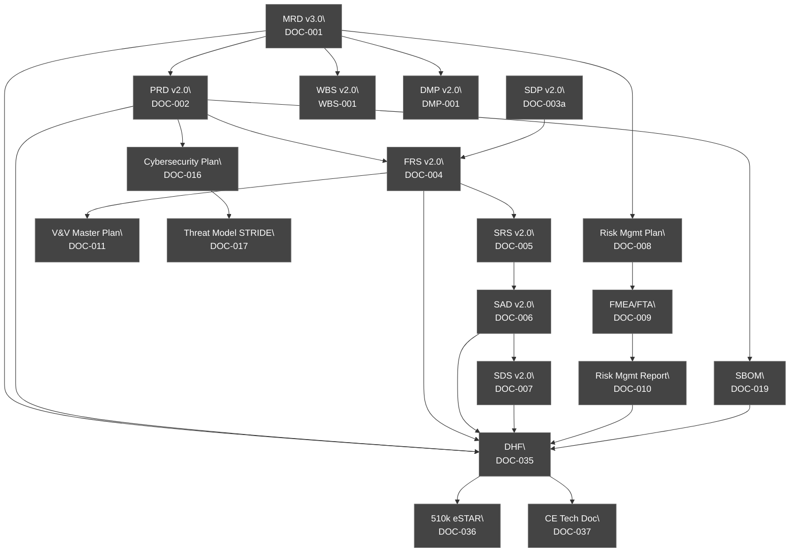
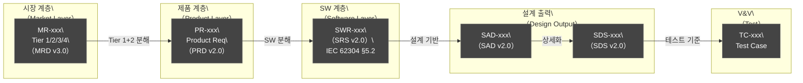
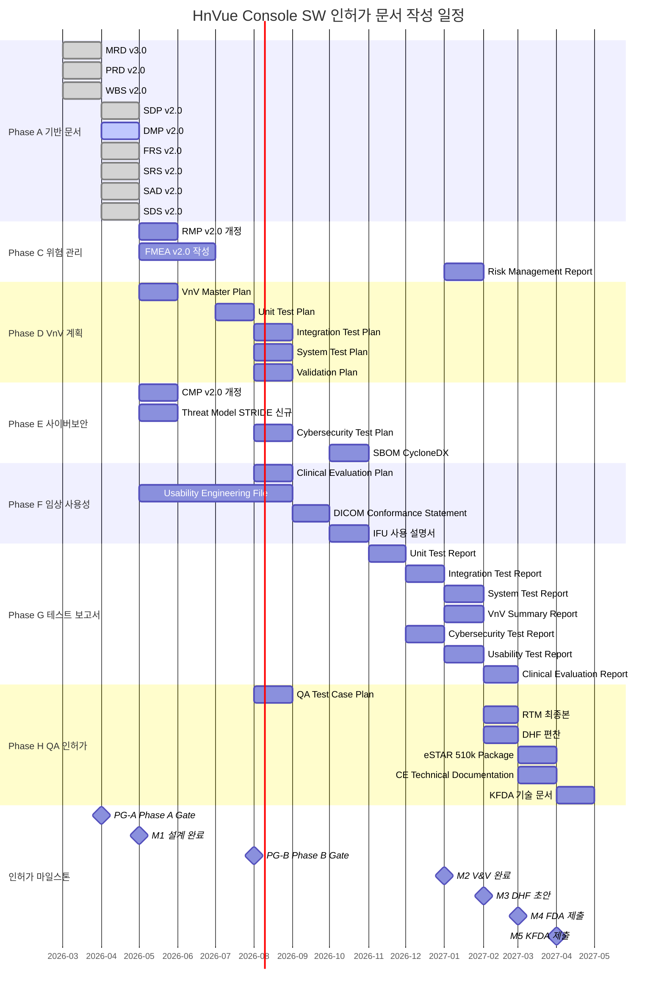

# HnVue Console SW 인허가 문서 작성 마스터 플랜
# Document Master Plan (DMP) v2.0

| 항목 | 내용 |
|------|------|
| **문서 ID** | DMP-XRAY-GUI-001 |
| **버전** | v2.0 |
| **작성일** | 2026-04-03 |
| **최종 개정일** | 2026-04-03 |
| **적용 제품** | HnVue Console SW |
| **적용 규격** | IEC 62304, IEC 62366, ISO 14971, ISO 13485, FDA 21 CFR 820.30, FDA Section 524B, EU MDR 2017/745, IEC 81001-5-1 |
| **인허가 대상** | FDA 510(k) / CE MDR / KFDA (식약처) |
| **SW Safety Class** | IEC 62304 Class B |

---

## 문서 개정 이력 (Revision History)

| 버전 | 일자 | 개정 내용 | 작성자 |
|------|------|-----------|--------|
| v1.0 | 2026-03-27 | 최초 작성 | — |
| v2.0 | 2026-04-03 | 전체 문서 목록 현행 버전으로 업데이트 (MRD v3.0, PRD v2.0, FRS v2.0, SRS v2.0, SAD v2.0, SDS v2.0); 4-Tier 우선순위 체계 설명 추가 (P1–P4 제거); Phase별 개정 로드맵 포함; 동기화 스크립트 (scripts/sync_docs.py) 사용법 포함; 문서 정합성 현황 테이블 추가; IEC 81001-5-1 인시던트 대응 규격 추가; 보완 3건 반영 문서 명시 | — |

---

## 목차

1. [개요 (Overview)](#1-개요)
2. [4-Tier 우선순위 체계 설명](#2-4-tier-우선순위-체계-설명)
3. [인허가 문서 체계도 (Document Architecture)](#3-인허가-문서-체계도)
4. [현행 문서 목록 및 버전 현황](#4-현행-문서-목록-및-버전-현황)
5. [문서 정합성 현황 테이블](#5-문서-정합성-현황-테이블)
6. [문서 작성 순서 (Phase A–H)](#6-문서-작성-순서-phase-ah)
7. [Phase별 개정 로드맵](#7-phase별-개정-로드맵)
8. [추적성 체계 정의](#8-추적성-체계-정의)
9. [작성 일정](#9-작성-일정)
10. [교차 검증 체계](#10-교차-검증-체계)
11. [동기화 스크립트 사용법 (scripts/sync_docs.py)](#11-동기화-스크립트-사용법)
12. [Phase Gate 기준 및 체크리스트](#12-phase-gate-기준-및-체크리스트)
- [부록 A. 약어 및 용어 정의](#부록-a-약어-및-용어-정의)

---

## 1. 개요 (Overview)

### 1.1 목적 (Purpose)

본 문서(Document Master Plan, DMP)는 HnVue Console SW의 **FDA 510(k) / CE MDR / KFDA 인허가**를 위한 전체 문서 작성 계획을 정의한다.

v2.0에서는 다음 사항이 개정되었다:
- **4-Tier 우선순위 체계** 전면 반영 (기존 P1–P4 폐기)
- **현행 문서 버전** 업데이트 (MRD v3.0, PRD v2.0, FRS v2.0, SRS v2.0, SAD v2.0, SDS v2.0)
- **보완 3건 반영 문서** 명시: 인시던트 대응 (IEC 81001-5-1), SW 업데이트 (FDA 524B), STRIDE 위협 모델링
- **Phase별 개정 로드맵** 포함
- **동기화 스크립트** (scripts/sync_docs.py) 사용법 추가
- **문서 정합성 현황 테이블** 추가

### 1.2 적용 범위 (Scope)

| 항목 | 내용 |
|------|------|
| **제품명** | HnVue Console SW |
| **SW Safety Class** | IEC 62304 Class B |
| **인허가 대상 시장** | 미국 (FDA 510(k)), 유럽 (CE MDR), 한국 (KFDA 식약처) |
| **개발 Phase** | Phase 1 (Tier 1+2 기능, 인허가 대상) / Phase 2 (Tier 3 기능) |
| **문서 총 수** | 42개 (Phase A–H) |
| **요구사항 계층** | MR → PR → SWR (3단계, 4-Tier 체계) |
| **문서 언어** | 한국어 (기술 용어 영문 병기) |
| **우선순위 체계** | Tier 1/2/3/4 (MRD v3.0 기준) |

### 1.3 적용 규격 (Applicable Standards)

| 규격 | 내용 | 적용 문서 |
|------|------|----------|
| **IEC 62304:2006+AMD1:2015** | Medical Device Software Lifecycle Processes | SDP, SRS, SAD, SDS, V&V |
| **IEC 62366-1:2015+AMD1:2020** | Usability Engineering for Medical Devices | UEF, Usability Test Reports |
| **IEC 81001-5-1:2021** | Health SW Security — Incident Response | Cybersecurity Plan, Incident Response |
| **ISO 14971:2019** | Risk Management for Medical Devices | Risk Management File |
| **ISO 13485:2016** | Quality Management Systems | SDP, QA 문서 전반 |
| **FDA 21 CFR Part 820.30** | Design Controls | DHF, Design Reviews |
| **FDA Section 524B** | Cybersecurity in Medical Devices | Cybersecurity Plan, SBOM, SW Update |
| **EU MDR 2017/745** | CE Marking — Medical Device Regulation | CE Technical File |
| **DICOM PS3.x** | DICOM Standard | DICOM Conformance Statement |

---

## 2. 4-Tier 우선순위 체계 설명

### 2.1 Tier 분류 기준 (MRD v3.0 기준)

v2.0부터 기존 P1–P4 분류를 폐기하고 4-Tier 체계를 전면 적용한다.

| Tier | 의미 | 기준 | Phase 배정 |
|------|------|------|-----------|
| **Tier 1** | 없으면 인허가 불가 | MFDS 2등급/FDA 510(k)/IEC 62304 필수 | Phase 1 필수 |
| **Tier 2** | 없으면 팔 수 없다 | feel-DRCS 기본 기능 동등 + 고객 최소 기대 | Phase 1 필수 |
| **Tier 3** | 있으면 좋고 | EConsole1 FDA K231225 미포함, 경쟁 차별화 | Phase 2+ |
| **Tier 4** | 비현실적/과도 | 2명 조직 비현실적, 비즈니스 모델 불일치 | Phase 3+ 또는 영구 보류 |

> **v1.0 P1–P4와의 매핑:** 구 P1 → 신 Tier 1+2, 구 P2 → 신 Tier 2+3, 구 P3 → 신 Tier 3+4, 구 P4 → 신 Tier 4 (일부 변동 있음, MRD v3.0 §2 참조)

### 2.2 Tier 1 MR 목록 (인허가 필수 — Phase 1)

| MR ID | 요구사항명 | 주요 연관 문서 |
|-------|-----------|--------------|
| MR-019 | DICOM 3.0 필수 서비스 | SAD v2.0, SDS v2.0, FRS v2.0 |
| MR-020 | IHE SWF 프로파일 | SAD v2.0, SDS v2.0 |
| MR-033 | RBAC (역할 기반 접근 제어) | SAD v2.0, SDS v2.0 |
| MR-034 | PHI 암호화 (AES-256) | SAD v2.0, SDS v2.0 |
| MR-035 | 감사 로그 (Audit Log) | SAD v2.0, SDS v2.0 |
| MR-036 | SBOM | CI/CD 파이프라인 |
| MR-037 | CVD + 인시던트 대응 | SAD v2.0 SAD-INC-1100 |
| MR-039 | SW 무결성 + 업데이트 | SAD v2.0 SAD-UPD-1200 |
| MR-050 | IEC 62304 Class B + STRIDE 위협 모델링 | DOC-017 Threat Model |
| MR-051 | IEC 62366 사용성 공학 | DOC-021 UEF |
| MR-052 | ISO 13485 / 21 CFR 820 | 전체 DHF |
| MR-053 | 규제 승인 획득 | DOC-036 eSTAR |
| MR-054 | DICOM Conformance Statement | DOC-038 |

### 2.3 Tier 2 MR 목록 (시장 진입 필수 — Phase 1)

| MR ID | 요구사항명 | 주요 연관 문서 |
|-------|-----------|--------------|
| MR-001 | MWL 자동 조회 | SAD v2.0 SAD-PM-100 |
| MR-002 | PACS 전송 30초 이내 | SAD v2.0 SAD-WF-200 |
| MR-003 | Window/Level 조정 | SAD v2.0 SAD-IP-300 |
| MR-004 | Zoom/Pan 기능 | SAD v2.0 SAD-IP-300 |
| MR-005 | 영상 회전/반전 | SAD v2.0 SAD-IP-300 |
| MR-006 | 시스템 설정 UI | SAD v2.0 SAD-SA-600 |
| MR-007 | DAP 실시간 표시 | SAD v2.0 SAD-DM-400 |
| MR-008 | DRL 알림 | SAD v2.0 SAD-DM-400 |
| MR-072 | CD/DVD Burning | SAD v2.0 SAD-CD-1000 |

---

## 3. 인허가 문서 체계도 (Document Architecture)

### 3.1 전체 문서 관계도



---

## 4. 현행 문서 목록 및 버전 현황

### 4.1 현행 버전 일람 (2026-04-03 기준)

| Phase | 문서 ID | 문서명 | **현행 버전** | 상태 | 비고 |
|-------|---------|--------|:---:|------|------|
| A | **DOC-001** | MRD | **v3.0** | 완료 ✅ | 4-Tier 체계, MR-072 추가 |
| A | **DOC-002** | PRD | **v2.0** | 완료 ✅ | 4-Tier 반영 |
| A | **WBS-001** | WBS | **v2.0** | 완료 ✅ | Tier 1/2 기준 재분해 |
| A | **DMP-001** | DMP (본 문서) | **v2.0** | 작성 중 | 4-Tier 반영 |
| A | **DOC-003a** | SDP | **v2.0** | 완료 ✅ | CI/CD, STRIDE, 인시던트 대응 포함 |
| B | **DOC-004** | FRS | **v2.0** | 완료 ✅ | 4-Tier, MR-072, 보완 3건 |
| B | **DOC-005** | SRS | **v2.0** | 완료 ✅ | 4-Tier, MR-072, 보완 3건 |
| B | **DOC-006** | SAD | **v2.0** | 완료 ✅ | 4-Tier, CD/INC/UPD 모듈 추가 |
| B | **DOC-007** | SDS | **v2.0** | 완료 ✅ | 4-Tier, 신규 모듈 상세 설계 |
| C | **DOC-008** | Risk Management Plan | v1.0 | 예정 | 4-Tier 반영 개정 예정 |
| C | **DOC-009** | FMEA/FTA | v1.0 | 예정 | STRIDE 연계 예정 |
| D | **DOC-011** | V&V Master Plan | v1.0 | 예정 | — |
| E | **DOC-016** | Cybersecurity Mgmt Plan | v1.0 | 예정 | IEC 81001-5-1 반영 예정 |
| E | **DOC-017** | Threat Model (STRIDE) | — | 예정 | MR-050 근거 |
| E | **DOC-019** | SBOM | — | 예정 | CycloneDX 형식 |
| H | **DOC-035** | DHF | — | 예정 | — |
| H | **DOC-036** | 510(k) eSTAR | — | 예정 | — |

---

## 5. 문서 정합성 현황 테이블

다음 테이블은 주요 문서 간 상호 참조 버전의 정합성을 나타낸다.

| 문서 | 참조하는 MRD 버전 | 참조하는 PRD 버전 | 4-Tier 반영 | MR-072 반영 | 보완 3건 반영 |
|------|:---:|:---:|:---:|:---:|:---:|
| MRD v3.0 | — | — | ✅ | ✅ | ✅ |
| PRD v2.0 | v3.0 | — | ✅ | ✅ | ✅ |
| FRS v2.0 | v3.0 | v2.0 | ✅ | ✅ | ✅ |
| SRS v2.0 | v3.0 | v2.0 | ✅ | ✅ | ✅ |
| SAD v2.0 | v3.0 | v2.0 | ✅ | ✅ | ✅ |
| SDS v2.0 | v3.0 | v2.0 | ✅ | ✅ | ✅ |
| DMP v2.0 (본 문서) | v3.0 | v2.0 | ✅ | ✅ | ✅ |
| SDP v2.0 | v3.0 | v2.0 | ✅ | ✅ | ✅ |
| WBS v2.0 | v3.0 | v2.0 | ✅ | ✅ | ✅ |
| DOC-008 RMP v1.0 | v2.0 | v2.0 | ❌ 개정 필요 | ❌ | ❌ |
| DOC-016 CMP v1.0 | v2.0 | v2.0 | ❌ 개정 필요 | ❌ | ❌ |

> **정합성 불일치 해소 방법**: `scripts/sync_docs.py`를 실행하여 버전 불일치 항목을 자동 탐지하고 개정 목록을 생성한다 (§11 참조).

---

## 6. 문서 작성 순서 (Phase A–H)

### 6.1 Phase A: 기반 문서 (Foundation Documents)

| Phase | 문서 ID | 문서명 | 현행 버전 | 목표 일정 | 비고 |
|-------|---------|--------|:---:|----------|------|
| A | DOC-001 | MRD | **v3.0** ✅ | 완료 | 4-Tier 체계 적용 |
| A | DOC-002 | PRD v2.0 | **v2.0** ✅ | 완료 | |
| A | WBS-001 | WBS v2.0 | **v2.0** ✅ | 완료 | Tier 1/2 기준 재분해 |
| A | DMP-001 | DMP v2.0 | **v2.0** | 2026-04 | 본 문서 |
| A | DOC-003a | SDP v2.0 | **v2.0** ✅ | 완료 | CI/CD+STRIDE+인시던트 |
| A | DOC-041 | PM 계획서 | v1.0 | 2026-04 | |

### 6.2 Phase B: 상세 설계 문서

| Phase | 문서 ID | 문서명 | 현행 버전 | 목표 일정 | 비고 |
|-------|---------|--------|:---:|----------|------|
| B | DOC-004 | FRS v2.0 | **v2.0** ✅ | 완료 | |
| B | DOC-005 | SRS v2.0 | **v2.0** ✅ | 완료 | |
| B | DOC-006 | SAD v2.0 | **v2.0** ✅ | 완료 | |
| B | DOC-007 | SDS v2.0 | **v2.0** ✅ | 완료 | |

### 6.3 Phase C: 위험 관리 문서

| Phase | 문서 ID | 문서명 | 현행 버전 | 목표 일정 | 비고 |
|-------|---------|--------|:---:|----------|------|
| C | DOC-008 | Risk Management Plan | v1.0 | 2026-05 | 4-Tier+MR-072 반영 개정 |
| C | DOC-009 | FMEA/FTA | — | 2026-06 | STRIDE 결과 연계 |
| C | DOC-010 | Risk Management Report | — | 2027-01 | |

### 6.4 Phase D: V&V 계획 문서

| Phase | 문서 ID | 문서명 | 현행 버전 | 목표 일정 |
|-------|---------|--------|:---:|----------|
| D | DOC-011 | V&V Master Plan | v1.0 | 2026-05 |
| D | DOC-012 | Unit Test Plan | — | 2026-07 |
| D | DOC-013 | Integration Test Plan | — | 2026-08 |
| D | DOC-014 | System Test Plan | — | 2026-08 |
| D | DOC-015 | Validation Plan | — | 2026-08 |

### 6.5 Phase E: 사이버보안 문서

| Phase | 문서 ID | 문서명 | 현행 버전 | 목표 일정 | 비고 |
|-------|---------|--------|:---:|----------|------|
| E | DOC-016 | Cybersecurity Management Plan | v1.0 | 2026-05 | IEC 81001-5-1 반영 개정 필요 |
| E | DOC-017 | Threat Model & Risk Assessment (STRIDE) | — | 2026-06 | MR-050 근거 신규 작성 |
| E | DOC-018 | Cybersecurity Test Plan | — | 2026-08 | |
| E | DOC-019 | SBOM | — | 2026-10 | CycloneDX 형식 |

### 6.6 Phase F: 임상/사용성 평가 문서

| Phase | 문서 ID | 문서명 | 목표 일정 |
|-------|---------|--------|----------|
| F | DOC-020 | Clinical Evaluation Plan | 2026-08 |
| F | DOC-021 | Usability Engineering File (IEC 62366) | 2026-09 |
| F | DOC-038 | DICOM Conformance Statement | 2026-09 |
| F | DOC-040 | 사용 설명서 (IFU) | 2026-10 |

### 6.7 Phase G: 테스트 실행 및 보고서

| Phase | 문서 ID | 문서명 | 목표 일정 |
|-------|---------|--------|----------|
| G | DOC-022 | Unit Test Report | 2026-12 |
| G | DOC-023 | Integration Test Report | 2026-12 |
| G | DOC-024 | System Test Report | 2027-01 |
| G | DOC-025 | V&V Summary Report | 2027-01 |
| G | DOC-026 | Cybersecurity Test Report | 2026-12 |
| G | DOC-027 | Performance Test Report | 2027-01 |
| G | DOC-028 | Usability Test Report (Summative) | 2027-01 |
| G | DOC-029 | Clinical Evaluation Report | 2027-02 |

### 6.8 Phase H: QA 및 최종 인허가

| Phase | 문서 ID | 문서명 | 목표 일정 |
|-------|---------|--------|----------|
| H | DOC-030 | QA Test Case Plan | 2026-08 |
| H | DOC-031 | QA Verification Report | 2027-02 |
| H | DOC-032 | RTM 최종본 | 2027-02 |
| H | DOC-033 | SOUP/OTS Analysis Report | 2026-10 |
| H | DOC-034 | Software Release Documentation | 2027-03 |
| H | DOC-035 | Design History File (DHF) | 2027-02 |
| H | DOC-036 | 510(k) eSTAR Package | 2027-03 |
| H | DOC-037 | CE Technical Documentation | 2027-03 |
| H | DOC-039 | KFDA 기술 문서 | 2027-04 |

---

## 7. Phase별 개정 로드맵

### 7.1 개정 로드맵 개요

4-Tier 체계 전환에 따른 각 Phase별 문서 개정 로드맵이다.

```mermaid
flowchart LR
    classDef default fill:#444,stroke:#666,color:#fff

    subgraph P1["Phase 1 완료\\n（2026-04）"]
        MRD3["MRD v3.0 ✅"]
        PRD2["PRD v2.0 ✅"]
        FRS2["FRS v2.0 ✅"]
        SRS2["SRS v2.0 ✅"]
        SAD2["SAD v2.0 ✅"]
        SDS2["SDS v2.0 ✅"]
        SDP2["SDP v2.0 ✅"]
        WBS2["WBS v2.0 ✅"]
        DMP2["DMP v2.0 ✅"]
    end

    subgraph P2["다음 개정 대상\\n（2026-05–06）"]
        RMP2["DOC-008 RMP\\nv1.0 → v2.0 필요\\n4-Tier 반영"]
        CMP2["DOC-016 CMP\\nv1.0 → v2.0 필요\\nIEC 81001-5-1"]
        TMA_NEW["DOC-017 Threat Model\\n신규 작성\\nSTRIDE 기반"]
    end

    subgraph P3["이후 개정 대상\\n（2026-07+）"]
        VVP2["DOC-011 V&V\\n신규 작성"]
        SBOM_NEW["DOC-019 SBOM\\nCycloneDX 신규"]
    end

    P1 --> P2 --> P3
```



### 7.2 개정 우선순위

| 우선순위 | 문서 | 이유 | 목표 완료 |
|---------|------|------|----------|
| 1순위 | DOC-008 RMP v2.0 | FMEA 작성 전 필수, 4-Tier 반영 | 2026-05-15 |
| 1순위 | DOC-016 CMP v2.0 | IEC 81001-5-1 (인시던트 대응) 반영 | 2026-05-15 |
| 1순위 | DOC-017 TMA (신규) | MR-050 STRIDE, FDA 524B 필수 | 2026-06-01 |
| 2순위 | DOC-011 V&V Plan | 구현 착수 전 필수 | 2026-06-01 |
| 2순위 | DOC-009 FMEA v2.0 | 4-Tier 기반 위험 분석 | 2026-06-15 |
| 3순위 | DOC-019 SBOM | 구현 완료 후 생성 | 2026-10 |

---

## 8. 추적성 체계 정의

### 8.1 문서 ID 체계 (4-Tier 적용)

| ID 접두어 | 계층 | 예시 | 생성 문서 |
|----------|------|------|------------|
| **MR-xxx** | Market Requirement (시장 요구사항) | MR-001 | MRD v3.0 (DOC-001) |
| **PR-xxx** | Product Requirement (제품 요구사항) | PR-001 | PRD v2.0 (DOC-002) |
| **SWR-xxx** | Software Requirement | SWR-001 | SRS v2.0 (DOC-005) |
| **SAD-xxx** | Architecture Design Element | SAD-PM-100 | SAD v2.0 (DOC-006) |
| **SDS-xxx** | Detailed Design Element | SDS-PM-101 | SDS v2.0 (DOC-007) |
| **TC-xxx** | Test Case | TC-001 | 각 Test Plan |
| **HAZ-xxx** | Hazard Identification | HAZ-001 | FMEA (DOC-009) |
| **RC-xxx** | Risk Control Measure | RC-001 | FMEA (DOC-009) |

### 8.2 4-Tier 요구사항 추적성 체인



---

## 9. 작성 일정

### 9.1 전체 인허가 문서 Gantt Chart



---

## 10. 교차 검증 체계

### 10.1 교차 검증 매트릭스 (v2.0 신규 항목 포함)

| CV ID | 검증 쌍 | 검증 항목 | 검증 방법 | 주기 |
|-------|---------|---------|----------|------|
| **CV-01** | MRD v3.0 ↔ PRD v2.0 | 모든 MR에 대응 PR 존재 여부 (Tier 1+2 필수) | RTM 조회 | PRD 업데이트 시 |
| **CV-02** | PRD v2.0 ↔ SRS v2.0 | 모든 PR에 대응 SWR 존재 여부 | sync_docs.py | SRS 업데이트 시 |
| **CV-03** | PRD v2.0 ↔ FRS v2.0 | PR-xxx ↔ FR-xxx 완전 매핑 | 매핑 테이블 | 월 1회 |
| **CV-04** | FRS v2.0 ↔ SRS v2.0 | FR-xxx ↔ SWR-xxx 양방향 완전성 | sync_docs.py | 변경 시 |
| **CV-05** | SAD v2.0 ↔ SDS v2.0 | 아키텍처 컴포넌트 ↔ 상세 설계 일치 | 설계 검토 | SDS 베이스라인 |
| **CV-06** | MRD v3.0 ↔ SAD v2.0 | Tier 1+2 MR 전체가 SAD 모듈에 반영됨 | 매핑 테이블 | SAD 개정 시 |
| **CV-07** | DOC-017 Threat Model ↔ SRS v2.0 | 모든 STRIDE 위협 시나리오 → SWR 반영 | 보안 RTM | 월 1회 |
| **CV-08** | MR-072 ↔ SAD-CD-1000 | CD Burning 요구사항 설계 반영 | 수동 검토 | SAD 개정 시 |
| **CV-09** | MR-037 ↔ SAD-INC-1100 | 인시던트 대응 요구사항 설계 반영 | 수동 검토 | SAD 개정 시 |
| **CV-10** | MR-039 ↔ SAD-UPD-1200 | SW 업데이트 요구사항 설계 반영 | 수동 검토 | SAD 개정 시 |

---

## 11. 동기화 스크립트 사용법

### 11.1 scripts/sync_docs.py 개요

`scripts/sync_docs.py`는 문서 간 버전 정합성을 자동으로 검사하고, 개정 필요 항목을 보고하는 스크립트이다.

**위치:** `console-gui/scripts/sync_docs.py`

### 11.2 사용 방법

```bash
# 전체 문서 정합성 검사
python scripts/sync_docs.py --check-all

# 특정 문서 간 교차 검증
python scripts/sync_docs.py --check-pair DOC-001 DOC-002

# 버전 불일치 보고서 생성
python scripts/sync_docs.py --report --output docs/management/sync_report.md

# 4-Tier 체계 반영 누락 확인
python scripts/sync_docs.py --check-tier

# MR ID 추적성 체인 검증 (MR-xxx → SWR-xxx)
python scripts/sync_docs.py --trace-mr MR-072

# 개정 필요 문서 목록 출력
python scripts/sync_docs.py --list-outdated
```

### 11.3 스크립트 주요 기능

| 기능 | 명령 옵션 | 설명 |
|------|----------|------|
| 버전 정합성 검사 | `--check-all` | 모든 문서의 상호 참조 버전 확인 |
| 4-Tier 반영 확인 | `--check-tier` | P1-P4 잔존 여부 확인, Tier 1/2/3/4 미반영 문서 탐지 |
| MR 추적성 검증 | `--trace-mr MR-xxx` | MR → PR → SWR → SAD → SDS 추적성 체인 검증 |
| 개정 목록 생성 | `--list-outdated` | 버전 불일치 문서 목록 및 개정 권고 출력 |
| 정합성 보고서 | `--report` | Markdown 형식 보고서 생성 |
| CI 통합 | `--ci` | CI 파이프라인에서 실행 (불일치 시 exit 1) |

### 11.4 CI/CD 통합

```yaml
# .github/workflows/docs-sync.yml
- name: 문서 정합성 검사
  run: python scripts/sync_docs.py --check-all --ci
  # 불일치 발견 시 PR 블로킹
```

---

## 12. Phase Gate 기준 및 체크리스트

### 12.1 Phase Gate 기준 (4-Tier 반영)

| Phase Gate | 명칭 | 4-Tier 관련 기준 | 기타 기준 |
|------------|------|----------------|----------|
| **PG-A** | 기반 문서 게이트 | MRD v3.0 4-Tier 체계 확정, WBS Tier 1/2 분해 완료 | SDP, DMP 완성 |
| **PG-B** | 설계 문서 게이트 | Tier 1+2 전체 MR이 SAD/SDS 모듈에 매핑됨 | FRS/SRS/SAD/SDS 완성 |
| **PG-C** | V&V 계획 게이트 | Tier 1+2 전체 SWR에 TC 존재 | 위험 관리, V&V 계획 완성 |
| **PG-D** | 구현 완료 게이트 | Tier 1 기능 100% 구현, Tier 2 기능 100% 구현 | UT 커버리지 ≥80% |
| **PG-E** | V&V 완료 게이트 | Tier 1+2 전체 TC 통과, Critical 결함 0건 | 보안 테스트 완료 |
| **PG-F** | 인허가 게이트 | RTM 완전성, DHF 완성 | eSTAR/KFDA 패키지 |

### 12.2 PG-A (기반 문서 게이트) 체크리스트

- [ ] MRD v3.0 — 4-Tier 체계 적용 완료
- [ ] PRD v2.0 — MR-072 (CD Burning) 포함
- [ ] WBS v2.0 — Tier 1/2 기준 작업 분해
- [ ] DMP v2.0 — 현행 버전 일람 업데이트
- [ ] SDP v2.0 — CI/CD, STRIDE, 인시던트 대응 포함
- [ ] FRS v2.0, SRS v2.0 — 4-Tier + 보완 3건 반영
- [ ] SAD v2.0 — CD/INC/UPD 모듈 추가
- [ ] SDS v2.0 — 신규 모듈 상세 설계
- [ ] sync_docs.py — 버전 정합성 검사 통과

---

## 부록 A. 약어 및 용어 정의

| 약어 | 풀 네임 |
|------|---------|
| DMP | Document Master Plan (문서 마스터 플랜) |
| DHF | Design History File (설계 이력 파일) |
| Tier 1 | 없으면 인허가 불가 (MRD v3.0 기준) |
| Tier 2 | 없으면 팔 수 없다 (시장 진입 필수) |
| RTM | Requirements Traceability Matrix (요구사항 추적성 매트릭스) |
| STRIDE | Spoofing/Tampering/Repudiation/Information Disclosure/DoS/Elevation of Privilege |
| IEC 81001-5-1 | 의료 SW 보안 — 인시던트 대응 규격 |
| FDA 524B | FDA 사이버보안 요구사항 (2023) |
| SBOM | Software Bill of Materials |
| CycloneDX | SBOM 표준 형식 |
| sync_docs.py | 문서 정합성 검사 자동화 스크립트 |
| PG | Phase Gate (단계 게이트) |
