# SW 제품개발 지침서 (Software Development Guideline)
## RadiConsole™ GUI Console SW

---

| 항목 | 내용 |
|------|------|
| **문서 ID** | DOC-RADI-GL-001 |
| **문서명** | SW 제품개발 지침서 (Software Development Guideline) |
| **버전** | v1.0 |
| **작성일** | 2026-03-16 |
| **작성자** | SW 개발팀 |
| **승인자** | 품질보증팀장 / R&D 센터장 |
| **상태** | 초안 (Draft) |
| **기준 규격** | IEC 62304:2006+AMD1:2015, ISO 14971:2019, IEC 62366-1:2015, FDA 21 CFR 820.30, ISO 13485:2016 |
| **적용 제품** | RadiConsole™ GUI Console SW |
| **SW Safety Class** | IEC 62304 Class B |

---

### 개정 이력 (Revision History)

| 버전 | 날짜 | 변경 내용 | 변경자 | 승인자 |
|------|------|-----------|--------|--------|
| v0.1 | 2026-01-10 | 초안 작성 | SW개발팀 | — |
| v0.2 | 2026-02-20 | 규격 참조 갱신, 사이버보안 섹션 추가 | SW개발팀 | QA팀장 |
| v1.0 | 2026-03-16 | 최초 공식 버전 발행 | SW개발팀 | R&D센터장 |

---

## 목차 (Table of Contents)

1. [목적 및 적용범위](#1-목적-및-적용범위)
2. [참조 규격 및 표준](#2-참조-규격-및-표준)
3. [SW 개발 생명주기 모델](#3-sw-개발-생명주기-모델)
4. [SW 안전 분류](#4-sw-안전-분류)
5. [요구사항 관리 지침](#5-요구사항-관리-지침)
6. [설계 제어 지침](#6-설계-제어-지침)
7. [소프트웨어 아키텍처 설계 지침](#7-소프트웨어-아키텍처-설계-지침)
8. [구현 지침](#8-구현-지침)
9. [위험 관리 연계 지침](#9-위험-관리-연계-지침)
10. [검증 및 밸리데이션 지침](#10-검증-및-밸리데이션-지침)
11. [사이버보안 개발 지침](#11-사이버보안-개발-지침)
12. [문서화 지침](#12-문서화-지침)
13. [변경 관리 및 유지보수](#13-변경-관리-및-유지보수)
14. [교육 및 자격](#14-교육-및-자격)
- [부록 A: 문서 산출물 매트릭스](#부록-a-문서-산출물-매트릭스)
- [부록 B: Phase Gate 검토 체크리스트](#부록-b-phase-gate-검토-체크리스트)
- [부록 C: 약어 및 용어 정의](#부록-c-약어-및-용어-정의)

---

## 1. 목적 및 적용범위

### 1.1 목적 (Purpose)

본 지침서는 RadiConsole™ GUI Console SW의 제품개발 전 단계에 걸쳐 IEC 62304 Class B 소프트웨어 개발 표준을 준수하는 **체계적이고 반복 가능한(repeatable)** 개발 프로세스를 정의한다.

구체적인 목적은 다음과 같다:

1. **규제 준수 (Regulatory Compliance)**: IEC 62304, ISO 14971, FDA 21 CFR 820.30, ISO 13485, FDA Section 524B 등 의료기기 소프트웨어 관련 국제 규격 및 규정의 요구사항을 체계적으로 이행한다.
2. **품질 일관성 (Quality Consistency)**: 전체 개발팀이 동일한 기준과 절차를 따름으로써 산출물의 품질과 일관성을 확보한다.
3. **추적성 확보 (Traceability)**: 시장 요구사항(Market Requirement)부터 V&V 결과까지 완전한 추적성 체인을 유지하여 규제 기관 심사에 대응한다.
4. **위험 관리 통합 (Risk Management Integration)**: ISO 14971 기반 위험 관리 활동을 SW 개발 프로세스 전반에 통합하여 환자 안전을 보장한다.
5. **인허가 지원 (Regulatory Submission Support)**: FDA 510(k), CE MDR, 식약처(KFDA) 인허가에 필요한 Technical File 및 Design History File(DHF) 구성을 지원한다.

### 1.2 적용범위 (Scope)

본 지침서는 다음에 적용된다:

| 구분 | 내용 |
|------|------|
| **대상 제품** | RadiConsole™ GUI Console SW |
| **용도** | 의료용 진단 X-Ray 촬영장치의 GUI Console Software |
| **적용 팀** | SW 개발팀, QA팀, 시스템 엔지니어링팀, RA파트 |
| **개발 단계** | Phase 1 (M1–M12): 핵심 기능 개발, Phase 2 (M13–M24): AI/Cloud 기능 확장 |
| **인허가 대상** | FDA 510(k) (미국), CE MDR (유럽), KFDA 식약처 (국내) |
| **SW Safety Class** | IEC 62304 Class B |

#### 적용 도메인 (Domain Categories)

| 도메인 코드 | 명칭 | 설명 |
|------------|------|------|
| **PM** | Patient Management | 환자 관리 기능 |
| **WF** | Acquisition Workflow | 촬영 워크플로우 |
| **IP** | Image Display & Processing | 영상 표시 및 처리 |
| **DM** | Dose Management | 선량 관리 |
| **DC** | DICOM/Communication | DICOM/통신 |
| **SA** | System Administration | 시스템 관리 |
| **CS** | Cybersecurity | 사이버보안 |
| **AI** | AI Integration | AI 통합 (Phase 2) |

### 1.3 적용 제외 (Exclusions)

- RadiConsole™과 연결되는 X-Ray 발생장치(Generator)의 펌웨어
- 병원 PACS/RIS 서버 소프트웨어
- Phase 2에서 별도 지침서로 관리되는 AI 알고리즘 개발 (단, 인터페이스 사양 포함)

---

## 2. 참조 규격 및 표준

### 2.1 필수 참조 규격 (Mandatory Standards)

| 규격 번호 | 제목 | 적용 사항 |
|----------|------|----------|
| **IEC 62304:2006+AMD1:2015** | Medical device software — Software life cycle processes | SW 개발 생명주기 전반, Class B 요구사항 |
| **ISO 14971:2019** | Medical devices — Application of risk management | 위험 관리 전 프로세스 |
| **IEC 62366-1:2015+AMD1:2020** | Medical devices — Usability engineering | 사용성 공학, UI 설계 |
| **FDA 21 CFR Part 820** | Quality System Regulation (Design Controls: §820.30) | 설계 제어, 설계 이력 파일 |
| **FDA Section 524B** | Cybersecurity Requirements for Medical Devices | 사이버보안, SBOM |
| **ISO 13485:2016** | Quality management systems for medical devices | 품질 경영 시스템 |
| **EU MDR 2017/745** | EU Medical Device Regulation | CE 마킹, 임상 평가 |

### 2.2 보조 참조 규격 (Supporting Standards)

| 규격 번호 | 제목 | 적용 사항 |
|----------|------|----------|
| **DICOM PS3.x** | Digital Imaging and Communications in Medicine | DICOM 통신 표준 |
| **IHE Radiology TF** | IHE Radiology Technical Framework | 방사선 워크플로우 |
| **NIST SP 800-53** | Security and Privacy Controls | 사이버보안 제어 |
| **OWASP Top 10** | Web Application Security Risks | 보안 취약점 관리 |
| **ISO/IEC 27001** | Information Security Management | 정보보안 관리 |
| **FDA Guidance (2023)** | Cybersecurity in Medical Devices (Final Guidance) | 사이버보안 제출 자료 |

### 2.3 규격 적용 관계도

```mermaid
graph TD
    A[IEC 62304<br/>SW 생명주기] --> B[SW 개발 프로세스]
    C[ISO 14971<br/>위험 관리] --> B
    D[IEC 62366<br/>사용성 공학] --> B
    E[FDA 21 CFR 820.30<br/>설계 제어] --> B
    F[ISO 13485<br/>품질 경영] --> B
    G[FDA 524B<br/>사이버보안] --> B
    B --> H[RadiConsole™<br/>SW 개발]
    H --> I[FDA 510(k)]
    H --> J[CE MDR]
    H --> K[KFDA 식약처]

    style A fill:#4472C4,color:#fff
    style C fill:#ED7D31,color:#fff
    style D fill:#70AD47,color:#fff
    style E fill:#FFC000,color:#000
    style F fill:#5B9BD5,color:#fff
    style G fill:#FF0000,color:#fff
    style H fill:#404040,color:#fff
    style I fill:#92D050,color:#000
    style J fill:#92D050,color:#000
    style K fill:#92D050,color:#000
```

---

## 3. SW 개발 생명주기 모델

### 3.1 개요 (Overview)

RadiConsole™ SW 개발은 **V-Model** 기반의 생명주기 모델을 채택한다. V-Model은 좌측 하향 경로(개발)와 우측 상향 경로(테스트)로 구성되며, 각 개발 단계는 대응하는 검증/밸리데이션 단계와 직접 연결된다.

IEC 62304 Class B 요구사항에 따라 다음 생명주기 활동이 수행된다:
- SW 개발 계획 (§5.1)
- SW 요구사항 분석 (§5.2)
- SW 아키텍처 설계 (§5.3)
- SW 상세 설계 (§5.4)
- SW 구현 및 단위 검증 (§5.5, §5.6)
- SW 통합 및 통합 테스트 (§5.7)
- SW 시스템 테스트 (§5.8)
- SW 릴리스 (§5.8.7)

### 3.2 V-Model 생명주기 다이어그램

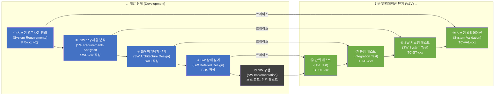

### 3.3 Phase별 입출력 산출물 (Phase I/O Deliverables)

#### Phase 1: 시스템 요구사항 정의

| 구분 | 내용 |
|------|------|
| **입력 (Input)** | MRD (Market Requirements Document), 이해관계자 요구사항, 위험 관리 계획 |
| **활동** | 시스템 요구사항 도출, 초기 위험 식별, SOUP 식별 |
| **출력 (Output)** | PRD v1.0 (PR-xxx), 초기 위험 목록, 개발 계획서 |
| **Phase Gate** | PRD 검토 회의(Design Review #1) 통과 |

#### Phase 2: SW 요구사항 분석

| 구분 | 내용 |
|------|------|
| **입력** | PRD, 위험 통제 요구사항, Regulatory 요구사항 |
| **활동** | SW 요구사항 도출 (SWR-xxx), 인터페이스 요구사항 정의, 사용성 요구사항 통합 |
| **출력** | SRS/FRS (SWR-xxx), SW 위험 분석 초안 |
| **Phase Gate** | SRS 검토 회의(Design Review #2) 통과 |

#### Phase 3: SW 아키텍처 설계

| 구분 | 내용 |
|------|------|
| **입력** | SRS, SOUP 목록, 위험 통제 요구사항 |
| **활동** | 아키텍처 설계, SOUP 평가, 인터페이스 정의, 위험 통제 구현 |
| **출력** | SAD (Software Architecture Document), SOUP 목록 v1.0 |
| **Phase Gate** | 아키텍처 검토 회의(Design Review #3) 통과 |

#### Phase 4: SW 상세 설계

| 구분 | 내용 |
|------|------|
| **입력** | SAD, SRS |
| **활동** | 모듈 설계, 상세 인터페이스 정의, 단위 테스트 계획 |
| **출력** | SDS (Software Design Specification), 단위 테스트 계획 |
| **Phase Gate** | 상세 설계 검토 회의(Design Review #4) 통과 |

#### Phase 5: 구현 및 단위 테스트

| 구분 | 내용 |
|------|------|
| **입력** | SDS, 코딩 표준, 단위 테스트 계획 |
| **활동** | 소스 코드 작성, 코드 리뷰, 단위 테스트 실행 |
| **출력** | 소스 코드 (형상 관리), 단위 테스트 결과 보고서 |
| **Phase Gate** | 코드 리뷰 완료, 단위 테스트 Pass |

#### Phase 6: 통합 테스트

| 구분 | 내용 |
|------|------|
| **입력** | 단위 테스트 완료 모듈, 통합 테스트 계획 |
| **활동** | SW 모듈 통합, 인터페이스 테스트, SOUP 통합 검증 |
| **출력** | 통합 테스트 결과 보고서 |
| **Phase Gate** | 모든 TC-IT Pass, 미결 결함 없음 |

#### Phase 7: 시스템 테스트 및 밸리데이션

| 구분 | 내용 |
|------|------|
| **입력** | 통합 완료 SW, 시스템 테스트/밸리데이션 계획 |
| **활동** | 기능 테스트, 성능 테스트, 사용성 테스트, 보안 테스트, 밸리데이션 |
| **출력** | SW 시스템 테스트 보고서, 밸리데이션 보고서 |
| **Phase Gate** | 모든 TC-VAL Pass, Critical/Major 결함 Zero |

### 3.4 Phase Gate 검토 기준 (Phase Gate Review Criteria)

각 Phase Gate는 다음 기준을 모두 충족해야 통과한다:

| 기준 | 세부 내용 |
|------|----------|
| **완전성 (Completeness)** | 해당 Phase 산출물 100% 완성 |
| **추적성 (Traceability)** | 상위 요구사항과의 추적성 100% 확보 |
| **검토 완료 (Review)** | Peer Review 및 QA 검토 완료, 모든 지적사항 해결 |
| **위험 관리 (Risk)** | 새로 식별된 위험 항목 Risk Management File에 등록 완료 |
| **결함 기준 (Defects)** | Critical/Blocker 결함 Zero |
| **서명 (Approval)** | 개발팀장, QA팀장, (해당 시) RA파트장 서명 |

---

## 4. SW 안전 분류

### 4.1 IEC 62304 안전 분류 기준

IEC 62304는 SW의 잠재적 위험 수준에 따라 세 가지 안전 분류를 정의한다:

| 분류 | 정의 | 주요 위험 수준 | 요구 프로세스 수준 |
|------|------|--------------|-----------------|
| **Class A** | SW 결함이 부상(injury)을 초래하지 않음 | 비안전 관련 | 기본 수준 |
| **Class B** | SW 결함이 경미하거나 중등도 부상(non-serious injury) 가능성 | 중간 수준 | 강화된 수준 |
| **Class C** | SW 결함이 사망 또는 중대한 부상(serious injury/death) 가능성 | 높은 수준 | 최고 수준 |

### 4.2 RadiConsole™의 Class B 근거

RadiConsole™ GUI Console SW는 **IEC 62304 Class B**로 분류된다. 분류 근거는 다음과 같다:

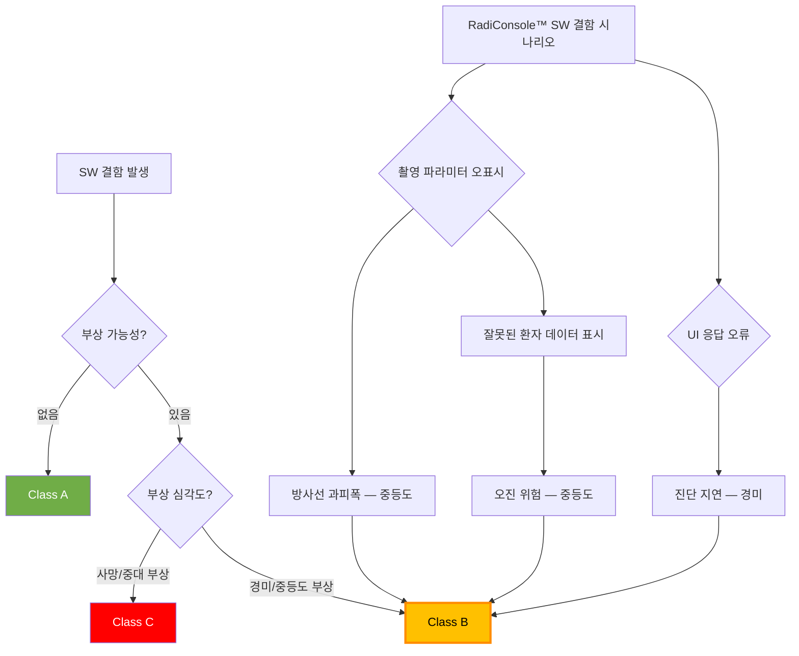

#### Class B 분류 근거 상세

| 기능 도메인 | 잠재적 결함 시나리오 | 최대 위험 심각도 | 분류 근거 |
|------------|-------------------|----------------|----------|
| **WF** 촬영 워크플로우 | 촬영 프로토콜 파라미터 오표시 → 방사선 과피폭 | 중등도 부상 | Class B |
| **PM** 환자 관리 | 환자 정보 혼동 → 오진 가능성 | 중등도 | Class B |
| **IP** 영상 처리 | 영상 품질 저하 표시 → 재촬영 없이 오진 | 중등도 | Class B |
| **DM** 선량 관리 | 선량 초과 경고 미표시 → 불필요한 피폭 | 중등도 | Class B |
| **DC** DICOM 통신 | 데이터 전송 오류 → 영상 손실 | 중등도 | Class B |
| **CS** 사이버보안 | 무단 접근 → 환자 데이터 유출 | 중등도 | Class B |

> **결론**: 모든 도메인의 최대 위험 심각도가 중등도(Moderate Injury)를 초과하지 않으므로 **IEC 62304 Class B** 분류 적용.

### 4.3 Class별 요구 프로세스 비교

| IEC 62304 요구사항 | Class A | Class B | Class C | RadiConsole™ 적용 |
|-------------------|---------|---------|---------|-----------------|
| SW 개발 계획 (§5.1) | ✓ | ✓ | ✓ | ✓ |
| SW 요구사항 (§5.2) | ✓ | ✓ | ✓ | ✓ |
| SW 아키텍처 설계 (§5.3) | — | ✓ | ✓ | ✓ |
| SW 상세 설계 (§5.4) | — | — | ✓ | — (권고 적용) |
| SW 유닛 구현 (§5.5) | ✓ | ✓ | ✓ | ✓ |
| SW 유닛 검증 (§5.6) | — | ✓ | ✓ | ✓ |
| SW 통합/테스트 (§5.7) | ✓ | ✓ | ✓ | ✓ |
| SW 시스템 테스트 (§5.8) | ✓ | ✓ | ✓ | ✓ |
| SOUP 관리 (§8) | ✓ | ✓ | ✓ | ✓ |
| 형상 관리 (§8.1) | ✓ | ✓ | ✓ | ✓ |
| 문제 해결 (§9) | ✓ | ✓ | ✓ | ✓ |
| Statement Coverage | — | 필수 | 필수 | ✓ (목표: 85%) |
| Branch Coverage | — | 권고 | 필수 | ✓ (목표: 75%) |
| MC/DC Coverage | — | — | 필수 | — |

---

## 5. 요구사항 관리 지침

### 5.1 요구사항 계층 구조 (Requirements Hierarchy)

RadiConsole™ 프로젝트는 3단계 요구사항 계층 구조를 사용한다:

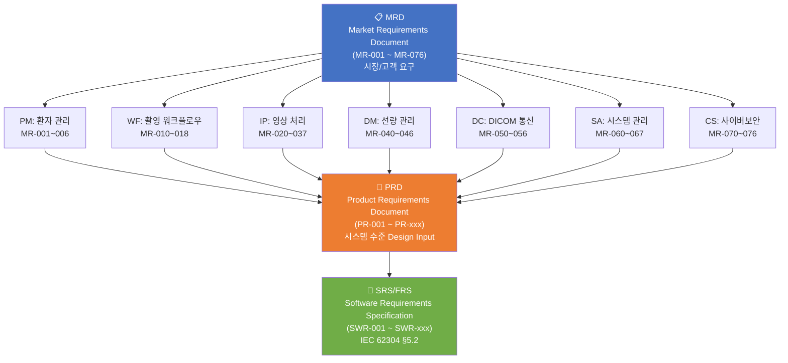

### 5.2 요구사항 작성 규칙 (SMART Principle)

모든 요구사항은 **SMART 원칙**을 준수하여 작성한다:

| SMART 요소 | 정의 | 나쁜 예 | 좋은 예 |
|-----------|------|--------|--------|
| **S**pecific (구체적) | 명확하고 단일한 의미 | "영상이 빠르게 표시되어야 함" | "영상 로드 시간은 3초 이내여야 함" |
| **M**easurable (측정 가능) | 정량적 합격/불합격 기준 | "시스템이 안정적이어야 함" | "시스템 가용성은 99.5% 이상이어야 함" |
| **A**chievable (달성 가능) | 기술적/자원적으로 실현 가능 | "응답시간 0ms" | "UI 응답시간 100ms 이내" |
| **R**elevant (관련성) | 상위 요구사항에 추적 가능 | 고아(orphan) 요구사항 | MR-xxx 또는 PR-xxx 참조 포함 |
| **T**estable (테스트 가능) | 테스트 케이스 작성 가능 | "사용하기 쉬어야 함" | "SUS 점수 70점 이상 달성해야 함" |

#### 요구사항 ID 체계

| ID 유형 | 형식 | 예시 | 설명 |
|--------|------|------|------|
| **MR-xxx** | MR-[도메인코드][숫자] | MR-010 | 시장 요구사항 |
| **PR-xxx** | PR-[도메인코드]-[숫자] | PR-WF-010 | 제품 요구사항 |
| **SWR-xxx** | SWR-[도메인코드]-[숫자] | SWR-WF-010 | SW 요구사항 |
| **HAZ-xxx** | HAZ-[숫자] | HAZ-001 | 위험 ID |
| **RC-xxx** | RC-[숫자] | RC-001 | 위험 통제 |
| **TC-xxx** | TC-[유형]-[숫자] | TC-UT-001 | 테스트 케이스 |

#### 요구사항 속성 템플릿

```
요구사항 ID: SWR-WF-010
제목: 촬영 프로토콜 선택 기능
설명: 시스템은 사용자가 부위별(Body Part) 및 뷰(View)별 촬영 프로토콜을
      선택할 수 있는 UI를 제공해야 한다.
우선순위: 필수 (SHALL)
출처: PR-WF-010 ← MR-010
위험 연계: HAZ-003 (잘못된 프로토콜 선택 → 과피폭)
테스트: TC-ST-WF-010
검증 방법: 기능 테스트 (Functional Test)
상태: 승인됨 (Approved)
버전: v1.0
```

### 5.3 추적성 관리 (Traceability Management)

#### 추적성 체인 (Traceability Chain)

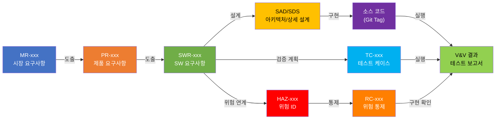

#### 추적성 매트릭스 (Traceability Matrix) 관리

- 추적성 매트릭스는 **JIRA** 또는 전용 요구사항 관리 도구(Polarion, Doors)에서 관리한다.
- **양방향 추적성(Bi-directional Traceability)**: 상위→하위 및 하위→상위 모두 추적 가능해야 한다.
- 격주 추적성 점검 보고서를 QA팀에 제출한다.
- 고아 요구사항(Orphan Requirement) 및 미검증 요구사항(Untested Requirement) 현황을 관리한다.

### 5.4 변경 관리 프로세스 (Requirements Change Management)

요구사항 변경은 반드시 공식적인 변경 관리 프로세스를 통해 처리한다:

1. **변경 요청 (Change Request, CR)**: CR 양식 작성 및 등록 (JIRA CR 티켓)
2. **영향 분석 (Impact Analysis)**: 변경이 미치는 하위 요구사항, 설계, 테스트, 위험 관리에 대한 영향 평가
3. **CCB 검토 (Change Control Board Review)**: CCB(변경관리위원회) 승인/반려 결정
4. **구현 및 검증**: 승인된 변경 사항 반영 및 재검증
5. **이력 관리**: 변경 이력 문서화

---

## 6. 설계 제어 지침

### 6.1 FDA 21 CFR 820.30 Design Controls 개요

FDA 21 CFR 820.30은 의료기기 소프트웨어 설계의 전 과정에 대한 통제 요구사항을 정의한다. RadiConsole™은 다음 Design Controls 프로세스를 준수한다:

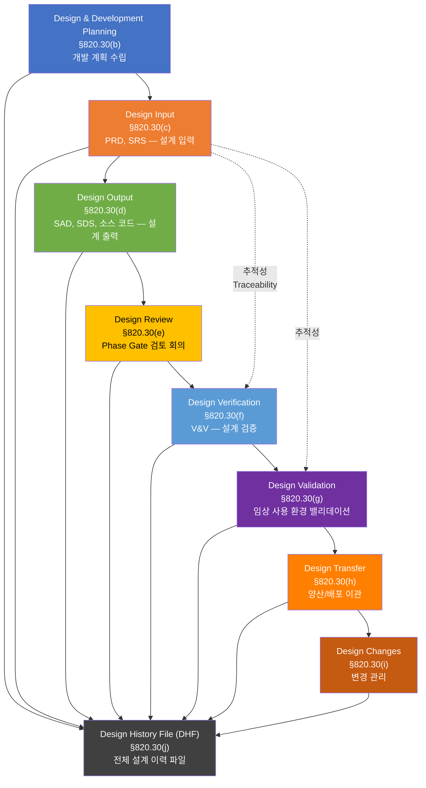

### 6.2 Design Input (설계 입력)

**관련 규정**: FDA 21 CFR §820.30(c)

설계 입력은 제품의 기능적, 성능적, 인터페이스 요구사항을 포함하며 다음 문서로 구성된다:

| 문서 | ID | 내용 |
|-----|-----|------|
| 시장 요구사항 문서 | MRD | 고객/시장 요구사항 (MR-001~076) |
| 제품 요구사항 문서 | PRD | 시스템 수준 요구사항 (PR-xxx) |
| SW 요구사항 사양서 | SRS | SW 기능/비기능 요구사항 (SWR-xxx) |
| 인터페이스 요구사항 | IRS | 외부 시스템 인터페이스 정의 |

**Design Input 승인 기준**:
- 모든 MR-xxx에 대한 PR-xxx 추적성 100%
- QA팀 검토 및 승인 서명 완료
- 위험 관리 계획에 반영 완료

### 6.3 Design Output (설계 출력)

**관련 규정**: FDA 21 CFR §820.30(d)

| 설계 출력 산출물 | 설명 | 담당 |
|---------------|------|------|
| SAD (SW Architecture Document) | 시스템 아키텍처, 주요 컴포넌트, 인터페이스 | 수석 아키텍트 |
| SDS (SW Design Specification) | 모듈 상세 설계, 알고리즘, 데이터 구조 | 각 모듈 담당자 |
| 소스 코드 | 구현된 코드 (Git 형상 관리) | 개발자 |
| 인터페이스 제어 문서 (ICD) | 외부 시스템 인터페이스 상세 사양 | 시스템 엔지니어 |
| 빌드 스크립트 및 배포 패키지 | 빌드/배포 절차 | DevOps 담당자 |

### 6.4 Design Review (설계 검토)

**관련 규정**: FDA 21 CFR §820.30(e)

각 Phase Gate에서 공식 Design Review를 수행한다:

| 검토 단계 | 검토 내용 | 참가자 |
|----------|----------|--------|
| **DR#1** 요구사항 검토 | PRD/SRS 완전성, 추적성, 위험 커버리지 | PM, QA, RA파트, 임상 담당 |
| **DR#2** 아키텍처 검토 | SAD 완성도, SOUP 평가, 보안 아키텍처 | 수석 아키텍트, QA, 보안 담당 |
| **DR#3** 상세 설계 검토 | SDS 완성도, 코딩 표준 준수 | 개발팀, QA |
| **DR#4** 구현 검토 | 코드 리뷰, 단위 테스트 결과 | 개발팀, QA |
| **DR#5** V&V 검토 | 테스트 결과, 결함 현황, 추적성 확인 | 개발팀, QA, RA파트 |

### 6.5 Design Verification (설계 검증)

**관련 규정**: FDA 21 CFR §820.30(f)

Design Verification은 설계 출력이 설계 입력 요구사항을 충족하는지 확인한다. 검증 방법:

- **검사 (Inspection)**: 문서 검토, 코드 리뷰
- **시연 (Demonstration)**: 기능 작동 시연
- **테스트 (Test)**: 단위/통합/시스템 테스트
- **분석 (Analysis)**: 정적 분석, 수학적 분석

### 6.6 Design Validation (설계 밸리데이션)

**관련 규정**: FDA 21 CFR §820.30(g)

Design Validation은 최종 완성품이 의도된 사용자 요구사항을 충족하는지 실제 사용 환경 또는 시뮬레이션 환경에서 확인한다.

- **사용자 참여 밸리데이션**: 방사선사, 방사선과 의사 참여 임상 시나리오 테스트
- **사용성 밸리데이션**: IEC 62366 기반 형성적/총괄적 사용성 평가
- **엣지 케이스 테스트**: 비정상 운영 조건 (네트워크 단절, 전원 이상 등)

### 6.7 Design Transfer (설계 이관)

**관련 규정**: FDA 21 CFR §820.30(h)

| 이관 항목 | 내용 | 책임자 |
|----------|------|--------|
| 릴리스 패키지 | 최종 빌드, 설치 패키지 | DevOps |
| 설치 및 운영 매뉴얼 | IFU (Instructions for Use) | 기술문서팀 |
| 서비스 매뉴얼 | 유지보수 절차 | 서비스팀 |
| DHF 최종본 | 전체 설계 이력 파일 | QA팀 |
| SW Bill of Materials (SBOM) | SOUP 포함 모든 SW 구성요소 목록 | 개발팀 |

---

## 7. 소프트웨어 아키텍처 설계 지침

### 7.1 아키텍처 설계 원칙

RadiConsole™ SW 아키텍처는 다음 원칙에 따라 설계한다:

| 원칙 | 설명 | 구현 방법 |
|------|------|----------|
| **모듈성 (Modularity)** | 기능 단위로 독립 모듈화 | 도메인별(PM, WF, IP 등) 모듈 분리 |
| **계층화 (Layered)** | 역할에 따른 계층 분리 | Presentation / Business Logic / Data Access 계층 |
| **단일 책임 (SRP)** | 모듈은 단일 책임만 보유 | 각 모듈의 책임 범위 명확히 문서화 |
| **낮은 결합도 (Loose Coupling)** | 모듈 간 의존성 최소화 | 인터페이스 기반 통신, 이벤트 버스 활용 |
| **높은 응집도 (High Cohesion)** | 관련 기능을 동일 모듈에 집중 | 도메인 기반 모듈 구성 |
| **방어적 프로그래밍** | 오류 전파 방지 | 입력 유효성 검사, 예외 처리 |

### 7.2 RadiConsole™ SW 계층 아키텍처

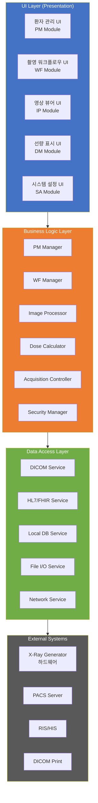

### 7.3 SOUP (Software of Unknown Provenance) 관리

**SOUP**는 현재 개발 중인 SW를 위해 개발되지 않은 소프트웨어 구성요소로, 오픈소스 라이브러리, 상용 컴포넌트(OTS), 운영체제 등이 포함된다.

#### SOUP 관리 절차

| 단계 | 활동 | 담당 |
|------|------|------|
| **식별** | 사용 SOUP 목록 작성 | 개발자 |
| **평가** | 기능성, 안정성, 라이선스, 유지보수 가능성 평가 | 개발팀 + QA |
| **위험 분석** | SOUP 관련 위험 식별 및 평가 | QA + 위험 관리 담당 |
| **검증** | SOUP 기능 검증 테스트 수행 | QA |
| **모니터링** | 취약점 공지, 업데이트 추적 | DevSecOps |

#### SOUP 목록 (예시)

| SOUP 명칭 | 버전 | 라이선스 | 용도 | 위험 수준 |
|----------|------|----------|------|----------|
| Qt Framework | 6.4.x | LGPL v3 | UI 프레임워크 | 중간 |
| dcmtk (DCMTK) | 3.6.x | BSD | DICOM 처리 | 높음 |
| OpenCV | 4.7.x | Apache 2.0 | 영상 처리 | 중간 |
| SQLite | 3.40.x | Public Domain | 로컬 데이터베이스 | 낮음 |
| OpenSSL | 3.0.x | Apache 2.0 | 암호화/TLS | 높음 |
| Log4cpp | 1.1.x | LGPL | 로깅 | 낮음 |

### 7.4 인터페이스 정의 지침 (Interface Definition)

모든 내부 및 외부 인터페이스는 **Interface Control Document(ICD)**에 정의한다:

| 인터페이스 유형 | 정의 항목 |
|--------------|----------|
| **소프트웨어-소프트웨어 (SW-SW)** | API 사양, 데이터 형식, 프로토콜, 타이밍 |
| **소프트웨어-하드웨어 (SW-HW)** | 통신 프로토콜, 명령어 집합, 응답 시간 |
| **소프트웨어-사용자 (SW-User)** | UI 사양, 입력/출력 형식 |
| **소프트웨어-네트워크 (SW-Network)** | DICOM 서비스 클래스, HL7 메시지, 포트, 암호화 |

---

## 8. 구현 지침

### 8.1 코딩 표준 (Coding Standards)

#### 8.1.1 일반 코딩 원칙

| 원칙 | 내용 |
|------|------|
| **가독성** | 자가 문서화(self-documenting) 코드 작성, 복잡한 로직에 주석 필수 |
| **단순성** | 함수/메서드는 단일 기능만 수행 (함수 길이 50줄 이내 권고) |
| **방어적 프로그래밍** | 모든 입력 값 유효성 검사, NULL 포인터 검사 |
| **오류 처리** | 오류 코드/예외는 반드시 처리, 무시(silently ignore) 금지 |
| **매직 넘버** | 하드코딩된 숫자/문자열 금지, 명명된 상수 사용 |
| **전역 변수** | 전역 상태 변수 최소화, Singleton 패턴 남용 금지 |

#### 8.1.2 C++ 코딩 표준

```
표준: MISRA C++:2008 (의료기기 소프트웨어 적용)
컴파일러 경고: -Wall -Wextra -Werror (모든 경고를 오류로 처리)
메모리 관리: 동적 할당 최소화, RAII 패턴 적용
스마트 포인터: std::unique_ptr, std::shared_ptr 사용 (raw pointer 최소화)
멀티스레딩: std::mutex, std::atomic 사용, 데드락 방지
예외 처리: 예외 사용 여부 프로젝트 단위 결정 (의료기기는 금지 권고)
```

#### 8.1.3 C# 코딩 표준 (보조 도구 적용 시)

```
표준: Microsoft C# 코딩 규칙
네이밍: PascalCase (클래스/메서드), camelCase (지역변수/매개변수)
LINQ: 의료 데이터 처리에는 명시적 루프 권고 (성능 예측 가능성)
Null 안전: Nullable 참조 타입 활성화 (#nullable enable)
비동기: async/await 패턴 일관적 적용
```

#### 8.1.4 Python 코딩 표준 (테스트/도구 적용 시)

```
표준: PEP 8
타입 힌트: 모든 함수 서명에 타입 힌트 필수
독스트링: Google 스타일 독스트링 사용
테스트: pytest 기반 단위 테스트
정적 분석: mypy, flake8, black 적용
```

### 8.2 코드 리뷰 기준 (Code Review Criteria)

IEC 62304 §5.5.4 요구에 따라 모든 소스 코드는 동료 검토(Peer Review)를 거친다:

| 검토 항목 | 기준 |
|----------|------|
| **기능적 정확성** | 설계 사양(SDS) 요구사항 충족 여부 |
| **코딩 표준 준수** | MISRA/PEP8 등 프로젝트 코딩 표준 준수 |
| **오류 처리** | 예외/오류 상황 처리 완결성 |
| **보안** | OWASP Top 10, 입력 검증, 암호화 적절성 |
| **성능** | 메모리 누수, 불필요한 연산, UI 응답 시간 |
| **테스트 가능성** | 단위 테스트 작성 가능 구조 |
| **SOUP 사용** | 승인된 SOUP 버전 사용, 미승인 라이브러리 금지 |

**코드 리뷰 절차**:
1. 개발자 Pull Request(PR) 생성
2. 자동화 정적 분석 도구 실행 (SonarQube, Coverity)
3. 동료 개발자 1명 이상 리뷰 완료
4. QA 담당자 리뷰 (Critical 기능 해당 시)
5. 모든 지적사항 해결 후 Merge 승인

### 8.3 형상 관리 (Configuration Management)

**관련 규격**: IEC 62304 §8.1

| 항목 | 내용 |
|------|------|
| **형상 관리 도구** | Git (GitLab/GitHub Enterprise) |
| **브랜치 전략** | Git Flow (main, develop, feature/*, release/*, hotfix/*) |
| **버전 체계** | Semantic Versioning — MAJOR.MINOR.PATCH (예: v1.2.3) |
| **형상 항목** | 소스 코드, 테스트 스크립트, 빌드 스크립트, 문서 |
| **기준선 (Baseline)** | Phase Gate 완료 시 베이스라인 태그 생성 |
| **변경 관리** | 모든 변경은 CR 티켓 연결 필수 |
| **감사 추적** | Commit 메시지에 CR/Issue ID 포함 필수 (예: `[CR-042] Fix dose display`) |

### 8.4 빌드 및 배포 관리

| 항목 | 내용 |
|------|------|
| **CI/CD 도구** | Jenkins / GitLab CI |
| **빌드 재현성** | 동일 소스에서 동일 바이너리 생성 보장 |
| **코드 서명** | 릴리스 바이너리 디지털 서명 필수 |
| **취약점 스캔** | 빌드 시 자동 SBOM 생성 및 CVE 스캔 |
| **아티팩트 저장** | Artifactory에 버전별 빌드 아티팩트 보관 |

---

## 9. 위험 관리 연계 지침

### 9.1 ISO 14971 연계 프로세스 개요

SW 개발 생명주기의 각 단계에서 ISO 14971 위험 관리 활동을 수행한다:

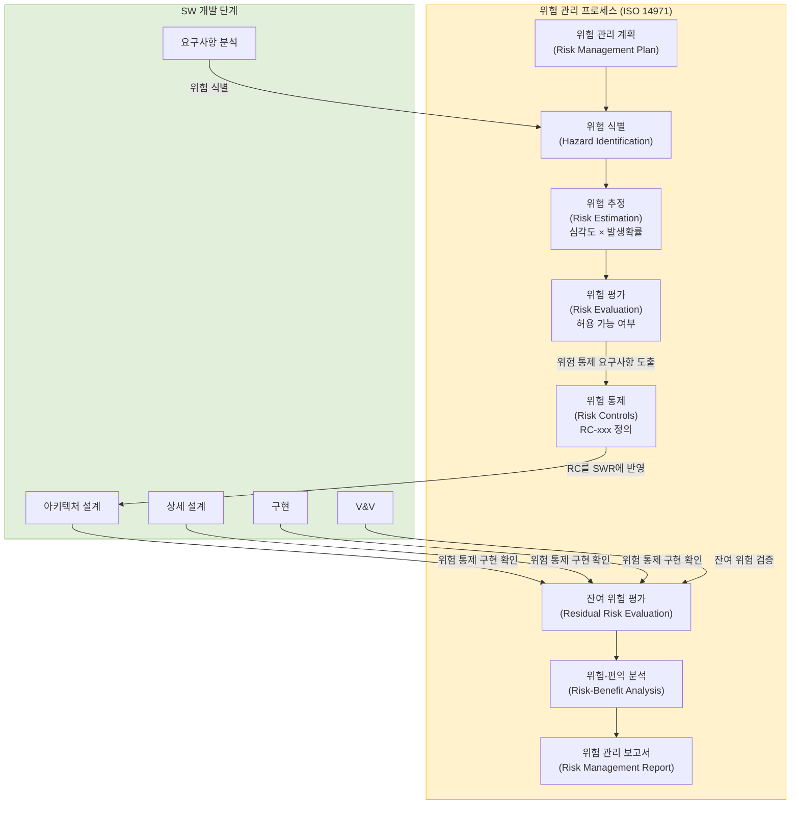

### 9.2 SW 위험 분석 방법

#### 9.2.1 SW FMEA (Failure Mode and Effects Analysis)

SW FMEA는 소프트웨어 컴포넌트의 잠재적 고장 모드가 시스템에 미치는 영향을 체계적으로 분석한다.

**SW FMEA 수행 절차**:
1. 분석 대상 SW 컴포넌트 식별
2. 각 컴포넌트의 잠재적 고장 모드 도출
3. 고장 효과(Effect) 및 심각도(Severity) 평가
4. 고장 원인(Cause) 및 발생 가능성(Occurrence) 평가
5. 현재 통제 조치 및 검출 가능성(Detectability) 평가
6. 위험 우선순위(RPN = S × O × D) 산출
7. 위험 통제 조치 정의 및 적용

**SW FMEA 예시 (촬영 워크플로우)**:

| 컴포넌트 | 고장 모드 | 영향 | HAZ-ID | 심각도 | 위험 통제 (RC-ID) |
|---------|---------|------|--------|--------|-----------------|
| WF Manager | 잘못된 촬영 프로토콜 적용 | 과피폭 | HAZ-003 | S3 | RC-003: 프로토콜 확인 팝업 |
| PM Manager | 환자 정보 혼동 | 오진 | HAZ-007 | S3 | RC-007: 환자 ID 이중 확인 |
| Image Processor | 영상 좌우 반전 | 오진 | HAZ-012 | S3 | RC-012: 방향 마커 표시 |

#### 9.2.2 FTA (Fault Tree Analysis)

FTA는 Top-Level 위해(Harm)가 발생하는 원인을 AND/OR 논리 게이트 트리로 분석한다.

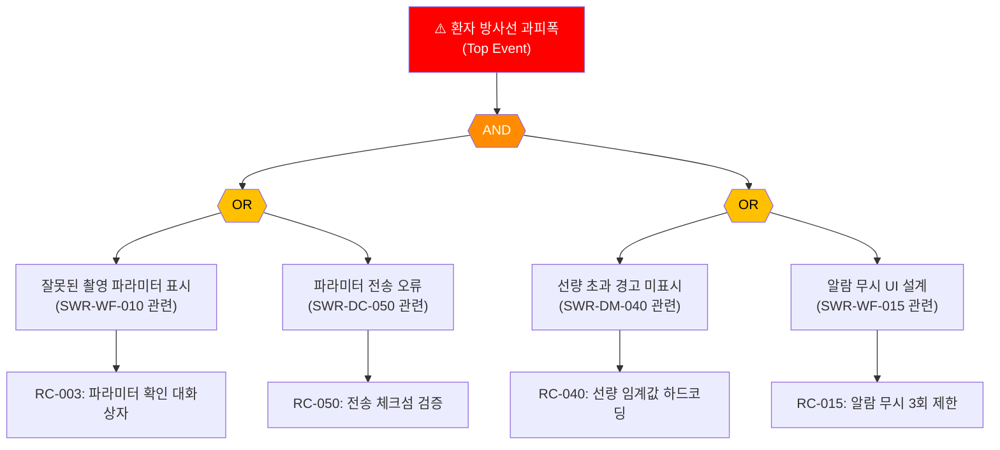

### 9.3 위험 심각도/발생확률 분류

**심각도(Severity) 분류**:

| 등급 | 명칭 | 설명 | 예시 |
|------|------|------|------|
| S1 | Negligible | 무시 가능 | 불편함 (Discomfort) |
| S2 | Minor | 경미 | 일시적 부상 |
| S3 | Serious | 중대 | 영구 손상 또는 중등도 부상 |
| S4 | Critical | 치명 | 사망 또는 심각한 부상 |

**발생확률(Probability) 분류**:

| 등급 | 명칭 | 발생 빈도 |
|------|------|----------|
| P1 | Improbable | < 10⁻⁶ |
| P2 | Remote | 10⁻⁶ ~ 10⁻⁴ |
| P3 | Occasional | 10⁻⁴ ~ 10⁻² |
| P4 | Probable | > 10⁻² |

### 9.4 위험 관리 파일 구성 (Risk Management File)

ISO 14971 §4.4에 따라 위험 관리 파일을 구성한다:

| 문서 | 내용 |
|-----|------|
| 위험 관리 계획서 | 위험 관리 범위, 책임, 기준, 주기 정의 |
| 위험 분석 보고서 | HAZ-xxx 목록, FMEA, FTA 결과 |
| 위험 평가 보고서 | 위험 허용 기준 대비 평가 결과 |
| 위험 통제 계획 | RC-xxx 목록, 구현 방법, 담당자 |
| 잔여 위험 평가 보고서 | 통제 후 잔여 위험 수준 평가 |
| 위험-편익 분석 보고서 | 전체 잔여 위험의 편익 대비 평가 |
| 위험 관리 보고서 | 위험 관리 활동 전체 요약 |

---

## 10. 검증 및 밸리데이션 지침

### 10.1 V&V 체계 개요 (V&V Framework)

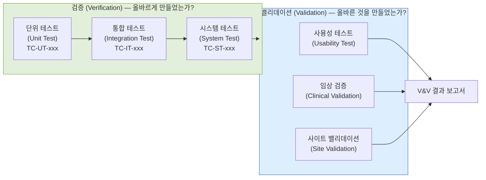

### 10.2 테스트 유형별 지침

#### 10.2.1 단위 테스트 (Unit Test)

| 항목 | 기준 |
|------|------|
| **대상** | 모든 SW 모듈의 독립적 함수/메서드 |
| **프레임워크** | Google Test (C++), NUnit (C#), pytest (Python) |
| **커버리지 목표** | Statement Coverage ≥ 85%, Branch Coverage ≥ 75% |
| **Pass 기준** | 모든 테스트 케이스 PASS, 커버리지 목표 달성 |
| **자동화** | CI/CD 파이프라인에서 자동 실행 |
| **Mock/Stub** | 하드웨어 의존성은 Mock 객체로 대체 |

#### 10.2.2 통합 테스트 (Integration Test)

| 항목 | 기준 |
|------|------|
| **대상** | 모듈 간 인터페이스, SW-HW 인터페이스 |
| **방법** | 점진적 통합 (Bottom-up 접근) |
| **SOUP 검증** | 모든 SOUP 컴포넌트 통합 테스트 포함 |
| **Pass 기준** | 모든 TC-IT PASS, 인터페이스 오류 Zero |

#### 10.2.3 시스템 테스트 (System Test)

| 테스트 유형 | 내용 | Pass 기준 |
|-----------|------|----------|
| **기능 테스트** | SWR-xxx 100% 커버 | 모든 기능 요구사항 충족 |
| **성능 테스트** | 응답 시간, 처리량 | 성능 SWR 목표 달성 |
| **부하 테스트** | 최대 부하 조건 (100명 동시 접속) | 성능 저하 < 20% |
| **스트레스 테스트** | 과부하 조건에서 안전 복구 | 데이터 손실 없는 복구 |
| **호환성 테스트** | 운영체제, 브라우저, 해상도 | 지원 환경 100% 정상 동작 |
| **회귀 테스트** | 변경 후 기존 기능 이상 없음 | 회귀 테스트 스위트 전체 PASS |

#### 10.2.4 밸리데이션 테스트 (Validation Test)

| 테스트 유형 | 내용 |
|-----------|------|
| **임상 시나리오 테스트** | 실제 환자 케이스 기반 종단 시나리오 (End-to-End) |
| **사용성 밸리데이션** | IEC 62366 기반, 방사선사 10명 이상 참여 |
| **환경 테스트** | 온도, 습도, 전자기 적합성 (EMC) 환경 |
| **사이버보안 밸리데이션** | 침투 테스트(Penetration Test) 결과 포함 |

### 10.3 테스트 환경 구성 (Test Environment)

| 환경 | 목적 | 구성 |
|------|------|------|
| **개발 환경 (DEV)** | 단위/통합 테스트 | 개발자 PC + 가상 하드웨어 Mock |
| **QA 환경 (QA)** | 시스템 테스트 | 전용 테스트 서버 + 실제 X-Ray 장비 또는 시뮬레이터 |
| **스테이징 환경 (STG)** | 밸리데이션 테스트 | 실제 병원 환경과 동일 구성 |
| **격리 환경 (ISO)** | 사이버보안 테스트 | 네트워크 격리, 침투 테스트 전용 |

### 10.4 결함 관리 (Defect Management)

| 심각도 | 정의 | 목표 해결 시간 | 릴리스 기준 |
|--------|------|--------------|-----------|
| **Critical (S1)** | 시스템 사용 불가, 환자 안전 위협 | 24시간 이내 | 0건 |
| **Major (S2)** | 주요 기능 장애, 회피 방법 없음 | 1주일 이내 | 0건 |
| **Minor (S3)** | 기능 장애, 회피 방법 있음 | 다음 릴리스 | 5건 이하 |
| **Trivial (S4)** | 경미한 UI/UX 이슈 | 계획 릴리스 | 관리 중 |

---

## 11. 사이버보안 개발 지침

### 11.1 Secure SDLC (Secure Software Development Lifecycle)

FDA Section 524B 및 FDA Cybersecurity Final Guidance(2023)에 따라 RadiConsole™은 **Secure SDLC**를 전 개발 단계에 통합한다:

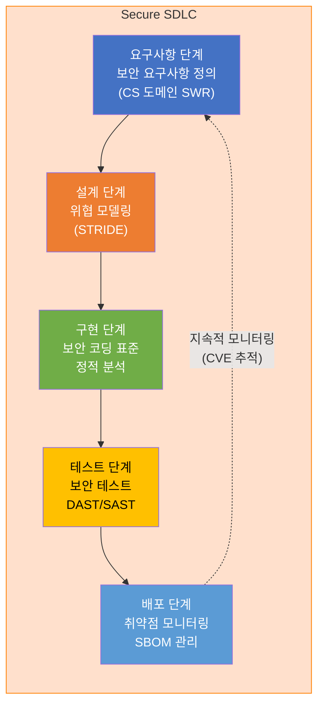

### 11.2 STRIDE 위협 모델링

STRIDE 방법론을 적용하여 RadiConsole™의 보안 위협을 체계적으로 분석한다:

| 위협 유형 | 설명 | RadiConsole™ 적용 예 | 대응 통제 |
|----------|------|-------------------|----------|
| **S**poofing (위장) | 신원 위조 | 비인가 사용자가 관리자로 위장 | MFA, 강력한 인증 |
| **T**ampering (변조) | 데이터 변조 | 전송 중 환자 데이터 변조 | TLS 1.3 암호화, 무결성 검사 |
| **R**epudiation (부인) | 행위 부인 | 촬영 행위 로그 삭제/변조 | 변조 불가 감사 로그 |
| **I**nformation Disclosure (정보 노출) | 민감 정보 유출 | 환자 PHI 노출 | 암호화, 접근 제어 |
| **D**enial of Service (서비스 거부) | 시스템 마비 | 네트워크 공격으로 촬영 불가 | 속도 제한, 이중화 |
| **E**levation of Privilege (권한 상승) | 권한 취득 | 일반 사용자가 관리자 기능 접근 | RBAC, 최소 권한 원칙 |

### 11.3 보안 아키텍처 요구사항

#### 인증 및 접근 제어

| 요구사항 | 구현 방법 | SWR 참조 |
|---------|---------|----------|
| 강력한 인증 | MFA (다중 인증) 지원, 패스워드 복잡도 정책 | SWR-CS-070 |
| 역할 기반 접근 제어 (RBAC) | 방사선사/의사/관리자 역할 분리 | SWR-CS-071 |
| 세션 관리 | 세션 타임아웃(15분), 자동 잠금 | SWR-CS-072 |
| 감사 로그 | 모든 임상 행위 타임스탬프 로그 (변조 불가) | SWR-CS-073 |

#### 데이터 보호

| 요구사항 | 구현 방법 |
|---------|---------|
| 전송 중 암호화 | TLS 1.3 이상 (DICOM TLS 포함) |
| 저장 데이터 암호화 | AES-256 (환자 PHI, 인증 정보) |
| 키 관리 | 하드웨어 기반 키 저장 (HSM 또는 TPM) |
| 패스워드 저장 | bcrypt/Argon2 해시 (평문 저장 절대 금지) |

### 11.4 보안 코딩 표준

| 규칙 | 내용 |
|------|------|
| **입력 유효성 검사** | 모든 외부 입력 화이트리스트 기반 검증 |
| **SQL 인젝션 방지** | PreparedStatement/Parameterized Query 사용 |
| **버퍼 오버플로우** | 안전한 문자열 함수 사용 (strncpy, snprintf) |
| **경쟁 조건** | Critical Section 적절한 잠금(Lock) |
| **민감 데이터 처리** | 메모리에서 사용 후 즉시 0으로 초기화 |
| **에러 메시지** | 시스템 내부 정보 노출 금지 (사용자에게 제네릭 오류 표시) |
| **의존성 보안** | 알려진 취약점(CVE) 있는 SOUP 버전 사용 금지 |

### 11.5 SBOM (Software Bill of Materials)

FDA Section 524B에 따라 SBOM을 유지관리한다:

- **SBOM 형식**: SPDX 또는 CycloneDX
- **포함 항목**: 모든 SOUP 컴포넌트 (버전, 라이선스, 출처, 취약점 현황)
- **갱신 주기**: 릴리스 시마다 갱신, CVE 발견 시 즉시 업데이트
- **배포**: FDA 심사 시 SBOM 제출 필수

### 11.6 침투 테스트 (Penetration Test) 기준

| 항목 | 기준 |
|------|------|
| **수행 주기** | 최초 릴리스 전 필수, 이후 연간 1회 이상 |
| **범위** | 네트워크 인터페이스, API, 사용자 인증, DICOM 통신 |
| **방법론** | OWASP Testing Guide, PTES (Penetration Testing Execution Standard) |
| **수행 주체** | 독립적 외부 보안 전문기관 권고 |
| **결과 처리** | Critical/High 취약점 릴리스 전 해결 필수 |

---

## 12. 문서화 지침

### 12.1 필수 산출물 목록

IEC 62304 Class B 및 FDA 21 CFR 820.30 요구사항에 따른 필수 문서 37종:

| # | 문서 ID | 문서명 | 규격 요구 | Phase |
|---|--------|--------|----------|-------|
| 1 | DOC-RADI-GL-001 | SW 제품개발 지침서 | IEC 62304 §4.3 | 착수 |
| 2 | DOC-RADI-PLAN-001 | SW 개발 계획서 (SWDP) | IEC 62304 §5.1 | 착수 |
| 3 | DOC-RADI-RMPLAN-001 | 위험 관리 계획서 | ISO 14971 §4.4 | 착수 |
| 4 | DOC-RADI-QMP-001 | SW 품질 관리 계획서 | ISO 13485 §7.3 | 착수 |
| 5 | DOC-RADI-MRD-001 | 시장 요구사항 문서 (MRD) | FDA §820.30(c) | 요구사항 |
| 6 | DOC-RADI-PRD-001 | 제품 요구사항 문서 (PRD) | FDA §820.30(c) | 요구사항 |
| 7 | DOC-RADI-SRS-001 | SW 요구사항 사양서 (SRS) | IEC 62304 §5.2 | 요구사항 |
| 8 | DOC-RADI-FRS-001 | 기능 요구사항 사양서 (FRS) | IEC 62304 §5.2 | 요구사항 |
| 9 | DOC-RADI-IRS-001 | 인터페이스 요구사항 사양서 (IRS) | IEC 62304 §5.2 | 요구사항 |
| 10 | DOC-RADI-URS-001 | 사용성 요구사항 사양서 (URS) | IEC 62366 §5.6 | 요구사항 |
| 11 | DOC-RADI-SAD-001 | SW 아키텍처 설계서 (SAD) | IEC 62304 §5.3 | 설계 |
| 12 | DOC-RADI-SDS-001 | SW 상세 설계서 (SDS) | IEC 62304 §5.4 | 설계 |
| 13 | DOC-RADI-ICD-001 | 인터페이스 제어 문서 (ICD) | IEC 62304 §5.3 | 설계 |
| 14 | DOC-RADI-SOUP-001 | SOUP 목록 및 평가서 | IEC 62304 §8.1 | 설계 |
| 15 | DOC-RADI-SBOM-001 | 소프트웨어 BOM (SBOM) | FDA 524B | 설계 |
| 16 | DOC-RADI-CM-001 | 형상 관리 계획서 | IEC 62304 §8.1 | 설계 |
| 17 | DOC-RADI-CS-001 | 코딩 표준서 | IEC 62304 §5.5 | 구현 |
| 18 | DOC-RADI-CR-001 | 코드 리뷰 기록 | IEC 62304 §5.5 | 구현 |
| 19 | DOC-RADI-UTPLAN-001 | 단위 테스트 계획서 | IEC 62304 §5.6 | 테스트 |
| 20 | DOC-RADI-UTRPT-001 | 단위 테스트 결과 보고서 | IEC 62304 §5.6 | 테스트 |
| 21 | DOC-RADI-ITPLAN-001 | 통합 테스트 계획서 | IEC 62304 §5.7 | 테스트 |
| 22 | DOC-RADI-ITRPT-001 | 통합 테스트 결과 보고서 | IEC 62304 §5.7 | 테스트 |
| 23 | DOC-RADI-STPLAN-001 | 시스템 테스트 계획서 | IEC 62304 §5.8 | 테스트 |
| 24 | DOC-RADI-STRPT-001 | 시스템 테스트 결과 보고서 | IEC 62304 §5.8 | 테스트 |
| 25 | DOC-RADI-VALPLAN-001 | 밸리데이션 계획서 | FDA §820.30(g) | 밸리데이션 |
| 26 | DOC-RADI-VALRPT-001 | 밸리데이션 보고서 | FDA §820.30(g) | 밸리데이션 |
| 27 | DOC-RADI-USVAL-001 | 사용성 밸리데이션 보고서 | IEC 62366 §5.9 | 밸리데이션 |
| 28 | DOC-RADI-RA-001 | 위험 분석 보고서 | ISO 14971 §5 | 위험 관리 |
| 29 | DOC-RADI-FMEA-001 | SW FMEA 보고서 | ISO 14971 §5 | 위험 관리 |
| 30 | DOC-RADI-FTA-001 | FTA 보고서 | ISO 14971 §5 | 위험 관리 |
| 31 | DOC-RADI-RMR-001 | 위험 관리 보고서 | ISO 14971 §9 | 위험 관리 |
| 32 | DOC-RADI-TM-001 | 추적성 매트릭스 | IEC 62304 §5.1 | 전 단계 |
| 33 | DOC-RADI-SECPLAN-001 | 사이버보안 계획서 | FDA 524B | 보안 |
| 34 | DOC-RADI-PENTEST-001 | 침투 테스트 보고서 | FDA 524B | 보안 |
| 35 | DOC-RADI-IFU-001 | 사용 설명서 (IFU) | EU MDR Annex I | 릴리스 |
| 36 | DOC-RADI-REL-001 | 릴리스 노트 | IEC 62304 §5.8 | 릴리스 |
| 37 | DOC-RADI-DHF-001 | 설계 이력 파일 목록 (DHF Index) | FDA §820.30(j) | 릴리스 |

### 12.2 문서 메타데이터 표준

모든 문서는 다음 메타데이터를 문서 첫 페이지 또는 헤더 섹션에 포함해야 한다:

```markdown
| 항목        | 내용                          |
|-------------|-------------------------------|
| 문서 ID     | DOC-RADI-XXX-NNN              |
| 문서명      | [문서 제목]                   |
| 버전        | vX.Y                          |
| 작성일      | YYYY-MM-DD                    |
| 작성자      | [이름], [직책]                |
| 검토자      | [이름], [직책]                |
| 승인자      | [이름], [직책]                |
| 상태        | 초안/검토중/승인됨/폐기       |
| 기준 규격   | [적용 규격 목록]              |
| 개정 이력   | v0.1 YYYY-MM-DD [변경 내용]   |
```

### 12.3 문서 검토/승인 프로세스

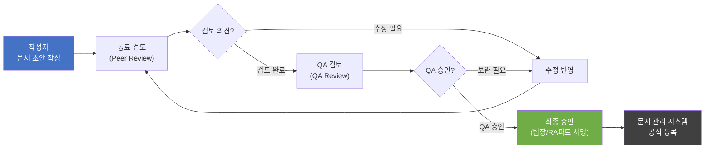

### 12.4 DHF (Design History File) 편찬 지침

FDA §820.30(j)에 따라 DHF는 제품 설계의 완전한 역사를 포함해야 한다:

**DHF 구성 원칙**:
- 모든 37개 필수 문서 포함
- 각 문서의 최종 승인본 및 개정 이력 보관
- Phase Gate 검토 회의록 포함
- 모든 설계 변경(DCO: Design Change Order) 기록 포함
- 전자적 서명은 FDA 21 CFR Part 11 준수

**DHF 구조**:

```
DHF/
├── 00_DHF_Index.xlsx
├── 01_Planning/
│   ├── SW_Development_Plan.pdf
│   ├── Risk_Management_Plan.pdf
│   └── Quality_Management_Plan.pdf
├── 02_Requirements/
│   ├── MRD_v2.0.pdf
│   ├── PRD_v1.0.pdf
│   └── SRS_FRS_v1.0.pdf
├── 03_Design/
│   ├── SAD_v1.0.pdf
│   ├── SDS_v1.0.pdf
│   └── SOUP_List.xlsx
├── 04_Implementation/
│   ├── Code_Review_Records/
│   └── Build_Artifacts/
├── 05_Testing/
│   ├── Test_Plans/
│   └── Test_Reports/
├── 06_Risk_Management/
│   ├── Risk_Analysis_Report.pdf
│   └── Risk_Management_Report.pdf
├── 07_Cybersecurity/
│   ├── Security_Plan.pdf
│   └── PenTest_Report.pdf
└── 08_Release/
    ├── IFU.pdf
    ├── Release_Notes.pdf
    └── DHF_Index_Final.xlsx
```

---

## 13. 변경 관리 및 유지보수

### 13.1 변경 요청 프로세스 (Change Request Process)

모든 설계 변경은 공식 변경 관리 프로세스를 통해 처리한다:

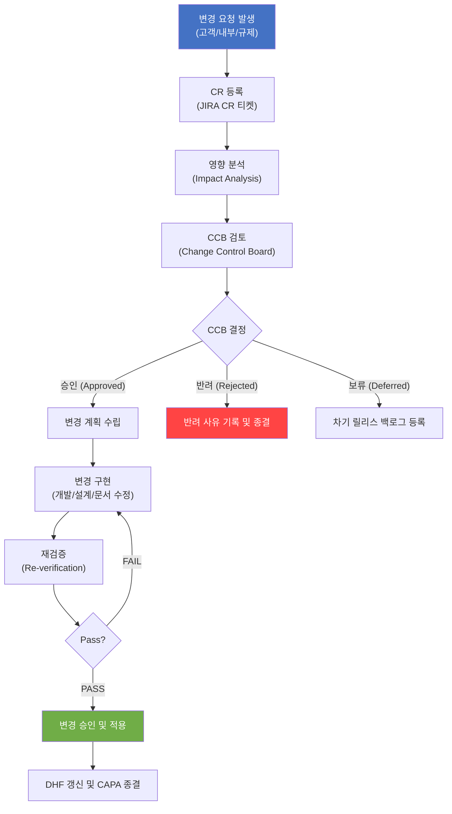

### 13.2 영향 분석 방법 (Impact Analysis)

변경 요청 접수 후 3 영업일 이내 영향 분석을 완료한다:

| 분석 항목 | 분석 내용 |
|----------|----------|
| **요구사항 영향** | 변경이 SWR-xxx에 미치는 영향 (추가/수정/삭제) |
| **설계 영향** | SAD/SDS 수정 필요 범위 |
| **코드 영향** | 수정 필요 모듈, 예상 공수 |
| **테스트 영향** | 재테스트 범위 (회귀 테스트 포함) |
| **위험 영향** | 새로운 위험 또는 기존 위험 수준 변화 |
| **규제 영향** | 인허가 변경 신청 필요 여부 (PMA Supplement, 510(k) 변경) |
| **일정 영향** | 릴리스 일정에 미치는 영향 |

### 13.3 릴리스 관리 (Release Management)

| 릴리스 유형 | 버전 체계 | 조건 | 인허가 대응 |
|-----------|---------|------|-----------|
| **Major Release** | vX.0.0 | 주요 기능 추가 | 510(k) 재심사 검토 |
| **Minor Release** | vX.Y.0 | 기능 개선, 보안 패치 포함 | 내부 검토 |
| **Patch Release** | vX.Y.Z | 버그 수정, 긴급 보안 패치 | 내부 검토 (긴급 시 사전 통보) |
| **Hotfix** | vX.Y.Z-HF | Critical 결함/보안 취약점 긴급 수정 | FDA CAPA 연계 |

**릴리스 체크리스트**:
- [ ] 모든 Phase Gate 통과
- [ ] V&V 테스트 100% Pass (Critical/Major 결함 Zero)
- [ ] 보안 취약점 스캔 Clean
- [ ] SBOM 최신화 완료
- [ ] DHF 최종 검토 및 승인
- [ ] IFU/릴리스 노트 승인
- [ ] 형상 관리 태그 및 베이스라인 생성

---

## 14. 교육 및 자격

### 14.1 개발팀 교육 요구사항 (Training Requirements)

ISO 13485 §6.2에 따라 의료기기 SW 개발에 참여하는 모든 인원은 관련 교육을 이수해야 한다:

| 역할 | 필수 교육 | 권장 교육 | 갱신 주기 |
|------|---------|---------|----------|
| **SW 개발자** | IEC 62304 기초, 의료기기 SW 개발 규정, 보안 코딩 | MISRA C++, OWASP | 2년 |
| **QA 엔지니어** | IEC 62304 전체, ISO 14971, FDA 21 CFR 820 | 의료기기 검증 방법론 | 2년 |
| **시스템 아키텍트** | IEC 62304 §5.3, SOUP 관리, 사이버보안 아키텍처 | TOGAF, ISO 27001 | 3년 |
| **규제 담당자** | FDA 510(k), CE MDR, KFDA 인허가 절차 | ISO 13485 내부감사 | 2년 |
| **프로젝트 매니저** | 의료기기 규제 개요, ISO 13485 §7.3 | PMP, PRINCE2 | 3년 |

### 14.2 교육 이수 기록 관리

- 모든 교육 이수 기록은 HR 시스템에 보관 (수료증 사본 포함)
- 교육 이수 현황은 연 2회 QA팀이 점검
- 신규 입사자는 프로젝트 참여 전 필수 교육 이수 완료 필요
- 규격 개정 시 해당 규격 관련 인원 대상 추가 교육 실시

### 14.3 자격 관리 (Competency Management)

| 자격 요건 | 기준 |
|---------|------|
| **SW 개발자** | 관련 분야 학사 이상 또는 동등 경력 3년 이상 |
| **수석 개발자** | 의료기기 SW 개발 경력 5년 이상 |
| **QA 엔지니어** | 의료기기 QA 경력 3년 이상, ISO 13485 인식 교육 이수 |
| **위험 관리 담당자** | ISO 14971 교육 이수, 의료기기 RA 경력 2년 이상 |

---

## 부록 A: 문서 산출물 매트릭스

### IEC 62304 Class별 필수 산출물

| 산출물 | IEC 62304 조항 | Class A | Class B | Class C | 비고 |
|--------|--------------|---------|---------|---------|------|
| SW 개발 계획 | §5.1 | ✓ | ✓ | ✓ | |
| SW 요구사항 목록 | §5.2 | ✓ | ✓ | ✓ | |
| SW 아키텍처 문서 | §5.3 | — | ✓ | ✓ | Class B 이상 |
| SW 상세 설계 문서 | §5.4 | — | — | ✓ | Class C만 |
| SW 구현 기록 | §5.5 | ✓ | ✓ | ✓ | |
| SW 유닛 검증 기록 | §5.6 | — | ✓ | ✓ | Class B 이상 |
| SW 통합 테스트 기록 | §5.7 | ✓ | ✓ | ✓ | |
| SW 시스템 테스트 기록 | §5.8 | ✓ | ✓ | ✓ | |
| SOUP 관리 기록 | §8.1 | ✓ | ✓ | ✓ | |
| 형상 관리 기록 | §8.1 | ✓ | ✓ | ✓ | |
| 문제 해결 기록 | §9 | ✓ | ✓ | ✓ | |
| Statement Coverage | §5.6 | — | ✓ | ✓ | Class B 이상 |
| Branch Coverage | §5.6 | — | 권고 | ✓ | Class C 필수 |
| MC/DC Coverage | §5.6 | — | — | ✓ | Class C만 |

### FDA 21 CFR 820.30 필수 산출물

| 산출물 | 조항 | RadiConsole™ 문서 ID |
|--------|------|-------------------|
| 설계 개발 계획 | §820.30(b) | DOC-RADI-PLAN-001 |
| 설계 입력 문서 | §820.30(c) | DOC-RADI-PRD-001, SRS-001 |
| 설계 출력 문서 | §820.30(d) | DOC-RADI-SAD-001, SDS-001 |
| 설계 검토 기록 | §820.30(e) | DR 회의록 |
| 설계 검증 기록 | §820.30(f) | DOC-RADI-STRPT-001 |
| 설계 밸리데이션 기록 | §820.30(g) | DOC-RADI-VALRPT-001 |
| 설계 이관 기록 | §820.30(h) | DOC-RADI-REL-001 |
| 설계 변경 기록 | §820.30(i) | CR/DCO 이력 |
| 설계 이력 파일 | §820.30(j) | DOC-RADI-DHF-001 |

---

## 부록 B: Phase Gate 검토 체크리스트

### DR#1 요구사항 검토 (Requirements Review) 체크리스트

| # | 점검 항목 | 판정 | 비고 |
|---|----------|------|------|
| 1 | 모든 MR-xxx에 대한 PR-xxx 추적성이 확보되었는가? | ☐ Pass ☐ Fail | |
| 2 | SWR-xxx가 SMART 원칙에 부합하는가? | ☐ Pass ☐ Fail | |
| 3 | 모든 규제 요구사항(IEC 62304, FDA 등)이 SWR에 반영되었는가? | ☐ Pass ☐ Fail | |
| 4 | 사이버보안 요구사항(CS 도메인)이 충분히 정의되었는가? | ☐ Pass ☐ Fail | |
| 5 | 초기 위험 목록이 작성되고 MRD/PRD와 연결되었는가? | ☐ Pass ☐ Fail | |
| 6 | 사용성 요구사항이 IEC 62366에 따라 정의되었는가? | ☐ Pass ☐ Fail | |
| 7 | DICOM 표준 및 IHE 프로파일 준수 요구사항이 포함되었는가? | ☐ Pass ☐ Fail | |
| 8 | 요구사항 검토 회의에 PM, QA, RA파트, 임상 담당자가 참석했는가? | ☐ Pass ☐ Fail | |
| **Gate 결정** | ☐ 통과 (Pass) ☐ 조건부 통과 ☐ 재검토 필요 | | |
| **서명** | 팀장: __________ QA: __________ | | |

### DR#2 아키텍처 검토 (Architecture Review) 체크리스트

| # | 점검 항목 | 판정 | 비고 |
|---|----------|------|------|
| 1 | SAD가 모든 SWR-xxx를 설계적으로 다루고 있는가? | ☐ Pass ☐ Fail | |
| 2 | SOUP 목록이 완성되고 위험 평가가 완료되었는가? | ☐ Pass ☐ Fail | |
| 3 | 모든 외부 인터페이스(DICOM, HL7 등)가 정의되었는가? | ☐ Pass ☐ Fail | |
| 4 | 보안 아키텍처(인증, 암호화, RBAC)가 적절히 설계되었는가? | ☐ Pass ☐ Fail | |
| 5 | STRIDE 위협 모델링이 수행되었는가? | ☐ Pass ☐ Fail | |
| 6 | 아키텍처가 성능/확장성 요구사항을 충족하는가? | ☐ Pass ☐ Fail | |
| 7 | 단일 장애점(SPOF)이 식별되고 대응 방안이 있는가? | ☐ Pass ☐ Fail | |
| **Gate 결정** | ☐ 통과 ☐ 조건부 통과 ☐ 재검토 필요 | | |
| **서명** | 아키텍트: __________ QA: __________ | | |

### DR#3 상세 설계 검토 (Detailed Design Review) 체크리스트

| # | 점검 항목 | 판정 | 비고 |
|---|----------|------|------|
| 1 | SDS가 SAD와 정합성이 있는가? | ☐ Pass ☐ Fail | |
| 2 | 위험 통제(RC-xxx)가 설계에 반영되었는가? | ☐ Pass ☐ Fail | |
| 3 | 단위 테스트 계획이 작성되었는가? | ☐ Pass ☐ Fail | |
| 4 | 코딩 표준이 정의되고 팀에 공유되었는가? | ☐ Pass ☐ Fail | |
| 5 | 각 모듈의 책임 범위가 명확히 정의되었는가? | ☐ Pass ☐ Fail | |
| **Gate 결정** | ☐ 통과 ☐ 조건부 통과 ☐ 재검토 필요 | | |

### DR#4 코드 검토 (Code Review) 체크리스트

| # | 점검 항목 | 판정 | 비고 |
|---|----------|------|------|
| 1 | 모든 소스 코드가 코드 리뷰를 완료했는가? | ☐ Pass ☐ Fail | |
| 2 | 정적 분석 도구(SonarQube)에서 Critical 이슈가 없는가? | ☐ Pass ☐ Fail | |
| 3 | 단위 테스트 Statement Coverage ≥ 85% 달성했는가? | ☐ Pass ☐ Fail | |
| 4 | SOUP 버전이 승인 목록과 일치하는가? | ☐ Pass ☐ Fail | |
| 5 | 보안 코딩 위반 사항이 없는가? | ☐ Pass ☐ Fail | |
| **Gate 결정** | ☐ 통과 ☐ 조건부 통과 ☐ 재검토 필요 | | |

### DR#5 V&V 검토 (V&V Review) 체크리스트

| # | 점검 항목 | 판정 | 비고 |
|---|----------|------|------|
| 1 | 모든 TC-xxx가 실행되고 Pass 결과가 기록되었는가? | ☐ Pass ☐ Fail | |
| 2 | Critical/Major 결함이 Zero인가? | ☐ Pass ☐ Fail | |
| 3 | 모든 SWR-xxx에 대한 테스트 추적성이 확보되었는가? | ☐ Pass ☐ Fail | |
| 4 | 위험 통제(RC-xxx)의 효과가 테스트로 검증되었는가? | ☐ Pass ☐ Fail | |
| 5 | 사용성 밸리데이션 결과가 합격 기준을 충족하는가? | ☐ Pass ☐ Fail | |
| 6 | 침투 테스트에서 Critical/High 취약점이 없는가? | ☐ Pass ☐ Fail | |
| 7 | SBOM이 최신화되었는가? | ☐ Pass ☐ Fail | |
| 8 | DHF가 완성되고 승인되었는가? | ☐ Pass ☐ Fail | |
| **Gate 결정** | ☐ 통과 ☐ 조건부 통과 ☐ 재검토 필요 | | |
| **서명** | 개발팀장: __ QA팀장: __ RA파트장: __ | | |

---

## 부록 C: 약어 및 용어 정의

| 약어 | 영문 전체 | 한국어 |
|------|----------|--------|
| **CCB** | Change Control Board | 변경관리위원회 |
| **CAPA** | Corrective and Preventive Action | 시정 및 예방 조치 |
| **CI/CD** | Continuous Integration/Continuous Deployment | 지속적 통합/배포 |
| **CVE** | Common Vulnerabilities and Exposures | 공통 취약점 및 노출 |
| **DCO** | Design Change Order | 설계 변경 지시 |
| **DAST** | Dynamic Application Security Testing | 동적 애플리케이션 보안 테스트 |
| **DHF** | Design History File | 설계 이력 파일 |
| **DICOM** | Digital Imaging and Communications in Medicine | 의료영상 정보 디지털 통신 표준 |
| **FMEA** | Failure Mode and Effects Analysis | 고장 모드 영향 분석 |
| **FRS** | Functional Requirements Specification | 기능 요구사항 사양서 |
| **FTA** | Fault Tree Analysis | 결함 수 분석 |
| **HIS** | Hospital Information System | 병원 정보 시스템 |
| **ICD** | Interface Control Document | 인터페이스 제어 문서 |
| **IEC** | International Electrotechnical Commission | 국제전기기술위원회 |
| **IFU** | Instructions for Use | 사용 설명서 |
| **IHE** | Integrating the Healthcare Enterprise | 의료기업 통합 |
| **ISO** | International Organization for Standardization | 국제표준화기구 |
| **KFDA** | Korea Food and Drug Administration | 식품의약품안전처 |
| **MC/DC** | Modified Condition/Decision Coverage | 수정 조건/결정 커버리지 |
| **MDR** | Medical Device Regulation | 의료기기 규정 |
| **MFA** | Multi-Factor Authentication | 다중 인증 |
| **MRD** | Market Requirements Document | 시장 요구사항 문서 |
| **OWASP** | Open Web Application Security Project | 오픈 웹 애플리케이션 보안 프로젝트 |
| **PACS** | Picture Archiving and Communication System | 의료영상 저장 전송 시스템 |
| **PHI** | Protected Health Information | 보호 대상 건강 정보 |
| **PRD** | Product Requirements Document | 제품 요구사항 문서 |
| **QMS** | Quality Management System | 품질 경영 시스템 |
| **RBAC** | Role-Based Access Control | 역할 기반 접근 제어 |
| **RIS** | Radiology Information System | 방사선 정보 시스템 |
| **RPN** | Risk Priority Number | 위험 우선순위 숫자 |
| **SAD** | Software Architecture Document | 소프트웨어 아키텍처 문서 |
| **SAST** | Static Application Security Testing | 정적 애플리케이션 보안 테스트 |
| **SBOM** | Software Bill of Materials | 소프트웨어 구성 목록 |
| **SDS** | Software Design Specification | 소프트웨어 설계 사양서 |
| **SDLC** | Software Development Lifecycle | 소프트웨어 개발 생명주기 |
| **SOUP** | Software of Unknown Provenance | 출처 불명 소프트웨어 |
| **SRS** | Software Requirements Specification | 소프트웨어 요구사항 사양서 |
| **STRIDE** | Spoofing/Tampering/Repudiation/Information Disclosure/DoS/Elevation | 보안 위협 분류 모델 |
| **SWR** | Software Requirement | 소프트웨어 요구사항 |
| **TC** | Test Case | 테스트 케이스 |
| **TLS** | Transport Layer Security | 전송 계층 보안 |
| **URS** | User Requirements Specification | 사용자 요구사항 사양서 |
| **V&V** | Verification and Validation | 검증 및 밸리데이션 |

---

*본 문서는 RadiConsole™ GUI Console SW 개발팀의 공식 지침서입니다.*  
*문서에 관한 문의사항은 SW 개발팀 또는 QA팀에 연락하시기 바랍니다.*

---

**문서 끝 (End of Document)**  
DOC-RADI-GL-001 v1.0 | RadiConsole™ SW 제품개발 지침서
