# SW 개발 업무 절차서 (Software Development Procedure, SDP)

| 항목 | 내용 |
|------|------|
| **문서 ID** | DOC-003a (SDP-RC-001) |
| **문서 제목** | RadiConsole™ GUI Console SW 개발 업무 절차서 |
| **버전** | v1.0 |
| **작성일** | 2026-03-16 |
| **작성자** | SW 개발팀 |
| **검토자** | QA 팀장, RA 팀장, SE 팀장 |
| **승인자** | 개발본부장 |
| **상태** | Released |
| **기준 규격** | IEC 62304:2006+AMD1:2015, ISO 14971:2019, ISO 13485:2016 |
| **IEC 62304 적용** | §5.1 Software Development Planning (SDP) |
| **보안 등급** | 사내 기밀 (Confidential) |

---

## 개정 이력 (Revision History)

| 버전 | 날짜 | 변경 내용 | 변경자 | 승인자 |
|------|------|-----------|--------|--------|
| v0.1 | 2026-01-10 | 초안 작성 | SW개발팀 | - |
| v0.5 | 2026-02-14 | 내부 검토 반영 | SW개발팀 | QA팀장 |
| v1.0 | 2026-03-16 | 최초 공식 릴리스 | SW개발팀 | 개발본부장 |
| v1.1 | 2026-03-31 | 교차 검증 보완: (1) 문서 ID DOC-003a 병기 및 IEC 62304 §5.1 명시, (2) 마일스톤 기반 일정표 섹션 추가 (DMP-001 동기화), (3) 개발 도구 버전 번호 기재 (DOC-006 SAD 연계) | SW개발팀 | - |

---

## 목차 (Table of Contents)

1. 목적 (Purpose)
2. 적용범위 (Scope)
3. 참조 문서 (References)
4. 조직 및 역할 정의 (Organization & Roles)
5. SW 개발 프로세스 흐름 (Development Process Flow)
5a. 마일스톤 기반 개발 일정표 (Milestone-based Development Schedule)
6. 요구사항 분석 절차 (Requirements Analysis Procedure)
7. 아키텍처 및 상세 설계 절차 (Architecture & Detailed Design Procedure)
8. 구현 절차 (Implementation Procedure)
9. 검증 절차 (Verification Procedure)
10. 밸리데이션 절차 (Validation Procedure)
11. 위험 관리 연계 절차 (Risk Management Integration Procedure)
12. 사이버보안 절차 (Cybersecurity Procedure)
13. 릴리스 관리 절차 (Release Management Procedure)
14. 변경 관리 절차 (Change Management Procedure)
15. 문서 관리 절차 (Document Management Procedure)
16. 교육 및 역량 관리 (Training & Competency Management)
- 부록 A: RACI 매트릭스
- 부록 B: Phase Gate 체크리스트
- 부록 C: 문서 양식 목록
- 부록 D: 약어 정의

---

## 1. 목적 (Purpose)

### 1.1 문서 목적

본 절차서는 **RadiConsole™ GUI Console SW** (이하 "대상 SW") 개발 프로젝트에서 수행하는 모든 소프트웨어 개발 활동의 표준 절차 (Standard Procedure)를 정의한다. 

본 문서는 다음 사항을 목적으로 한다:

1. **IEC 62304 §5.1 Software Development Planning** 요구사항을 충족하는 개발 계획 및 절차 수립
2. 개발팀 구성원이 일관된 방식으로 개발 활동을 수행할 수 있도록 명확한 업무 지침 제공
3. FDA 21 CFR 820.30 Design Controls, ISO 13485 QMS 요구사항에 부합하는 품질 보증 체계 구축
4. 의료기기 소프트웨어로서의 안전성 (Safety), 효과성 (Effectiveness), 보안성 (Security) 확보
5. 규제기관 (FDA, CE MDR, KFDA 식약처) 제출용 기술 문서 (Technical File / Design History File) 작성 근거 마련

### 1.2 IEC 62304 §5.1 적합성 선언

본 절차서는 IEC 62304:2006+AMD1:2015 §5.1 Software Development Planning의 다음 요구사항을 충족한다:

| IEC 62304 §5.1 요구사항 | 본 문서 적용 절 |
|-------------------------|----------------|
| §5.1.1 SW 개발 계획 수립 | §5, §6 |
| §5.1.2 위험 관리 계획 참조 | §11 |
| §5.1.3 검증 계획 | §9, §10 |
| §5.1.4 형상 관리 계획 | §8.1 |
| §5.1.5 문서 관리 계획 | §15 |
| §5.1.6 SOUP (Third-party Software) 관리 | §7.4 |
| §5.1.7 사이버보안 계획 | §12 |
| §5.1.8 프로세스 표준 및 방법 | 전체 절 |

---

## 2. 적용범위 (Scope)

### 2.1 적용 제품

| 항목 | 내용 |
|------|------|
| **제품명** | RadiConsole™ GUI Console SW |
| **용도** | 의료용 진단 X-Ray 촬영장치의 GUI Console Software |
| **디바이스 분류** | 의료기기 소프트웨어 (Software as a Medical Device 구성요소) |
| **SW Safety Class** | **Class B** (IEC 62304 기준: 중대하지 않은 부상 가능) |
| **운영체제** | Windows 10/11 LTSC (64-bit) |
| **아키텍처** | .NET 8.0 + WPF, Electron (향후 검토) |

### 2.2 SW Safety Class B 근거

IEC 62304 §4.3에 따른 SW 안전 분류 (Safety Classification) 근거:

```
위험 시나리오 분석:
- 소프트웨어 결함 → 잘못된 촬영 파라미터 표시
- 결과: 재촬영 필요 (환자 추가 방사선 노출 가능)
- 심각도: 경미한 부상 (Minor Injury) 수준
- ∴ SW Safety Class B (Class C로 상향 가능 여부는 HAZ 분석 재검토)
```

> **주의**: SOUP 분석 및 위험 관리 활동 결과에 따라 Class C로 재분류될 수 있으며, 이 경우 본 절차서 전면 개정이 필요하다.

### 2.3 적용 규격 (Applicable Standards)

| 규격 | 버전 | 적용 영역 |
|------|------|-----------|
| IEC 62304 | 2006+AMD1:2015 | SW 수명주기 프로세스 |
| IEC 62366-1 | 2015+AMD1:2020 | 사용성 엔지니어링 |
| ISO 14971 | 2019 | 위험 관리 |
| ISO 13485 | 2016 | 품질 경영 시스템 |
| FDA 21 CFR Part 820.30 | 현행 | 설계 관리 |
| FDA Section 524B | 현행 | 사이버보안 |
| EU MDR | 2017/745 | 유럽 의료기기 규정 |
| DICOM PS3.x | 현행 | DICOM 통신 |

### 2.4 적용 제외 범위

- X-Ray 촬영 장비 펌웨어 (Firmware) — 별도 절차서 적용
- 클라우드 백엔드 서비스 (Phase 2) — 별도 SDP 수립 예정
- 제3자 납품 SOUP 자체 개발 — 공급업체 관리 절차 적용

---

## 3. 참조 문서 (References)

### 3.1 외부 규격 (External Standards)

| 번호 | 문서명 | 발행 기관 |
|------|--------|-----------|
| [REF-01] | IEC 62304:2006+AMD1:2015 Medical device software — Software life cycle processes | IEC |
| [REF-02] | IEC 62366-1:2015+AMD1:2020 Medical devices — Usability engineering | IEC |
| [REF-03] | ISO 14971:2019 Medical devices — Risk management | ISO |
| [REF-04] | ISO 13485:2016 Medical devices — Quality management systems | ISO |
| [REF-05] | FDA 21 CFR Part 820 Quality System Regulation | FDA |
| [REF-06] | FDA Guidance: Cybersecurity in Medical Devices (2023) | FDA |
| [REF-07] | FDA Guidance: Software as a Medical Device (SaMD) | FDA |
| [REF-08] | EU MDR 2017/745 | EU |
| [REF-09] | NIST SP 800-53 Security Controls | NIST |
| [REF-10] | IHE Radiology Technical Framework | IHE |

### 3.2 내부 문서 (Internal Documents)

| 번호 | 문서 ID | 문서명 |
|------|---------|--------|
| [INT-01] | MRD-RC-001 | 시장 요구사항 명세서 (Market Requirements Document) |
| [INT-02] | PRD-RC-001 | 제품 요구사항 명세서 (Product Requirements Document) |
| [INT-03] | SRS-RC-001 | SW 요구사항 명세서 (Software Requirements Specification) |
| [INT-04] | SAD-RC-001 | SW 아키텍처 설계서 (Software Architecture Design) |
| [INT-05] | SDS-RC-001 | SW 상세 설계서 (Software Detailed Design Specification) |
| [INT-06] | STP-RC-001 | SW 테스트 계획서 (Software Test Plan) |
| [INT-07] | RMP-RC-001 | 위험 관리 계획서 (Risk Management Plan) |
| [INT-08] | FMEA-RC-001 | 소프트웨어 FMEA 보고서 |
| [INT-09] | SBOM-RC-001 | SOUP/SBOM 목록 |
| [INT-10] | QMP-001 | 품질 관리 계획서 (Quality Management Plan) |

---

## 4. 조직 및 역할 정의 (Organization & Roles)

### 4.1 프로젝트 조직도 (Project Organization Chart)

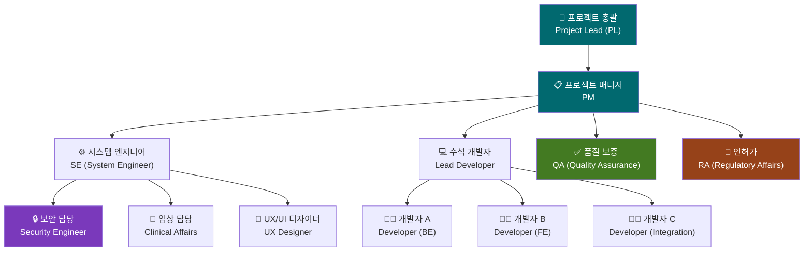

### 4.2 역할별 책임 정의 (Role Definitions)

#### 4.2.1 프로젝트 매니저 (PM)
- 전체 개발 일정, 자원, 예산 관리
- Phase Gate 회의 주관 및 Go/No-Go 결정
- 이해관계자 커뮤니케이션 관리
- 위험 (Project Risk) 식별 및 대응 계획 수립
- 규제 제출 일정 조율

#### 4.2.2 시스템 엔지니어 (SE)
- 시스템 요구사항 (System Requirements)과 SW 요구사항 (SWR) 연계
- 인터페이스 정의 (Hardware-Software Interface)
- 시스템 수준 통합 테스트 감독
- SOUP 평가 및 승인
- 기술 표준 및 코딩 가이드라인 수립

#### 4.2.3 수석 개발자 (Lead Developer)
- SW 아키텍처 설계 및 기술 결정 (Technical Decision)
- 코드 리뷰 최종 승인
- 기술 부채 (Technical Debt) 관리
- 개발자 멘토링 및 기술 지원
- CI/CD 파이프라인 구축 및 유지

#### 4.2.4 개발자 (Developer)
- 할당된 SW 모듈 설계, 구현, 단위 테스트 수행
- 코드 리뷰 참여
- 기술 문서 초안 작성
- 결함 (Defect) 수정 및 루트 코즈 분석

#### 4.2.5 QA (Quality Assurance)
- 테스트 계획 수립 및 테스트 케이스 작성
- 통합/시스템 테스트 수행 및 결과 평가
- 결함 관리 시스템 운영
- 품질 지표 (Quality Metrics) 추적 및 보고
- 감사 (Audit) 및 검사 (Inspection) 수행

#### 4.2.6 RA (Regulatory Affairs)
- 규제 요구사항 해석 및 준수 여부 평가
- 기술 문서 (Technical Documentation) 검토
- 규제기관 제출 자료 작성 지원
- 규격 변경 사항 모니터링 및 영향 분석

#### 4.2.7 보안 담당 (Security Engineer)
- 위협 모델링 (Threat Modeling) 수행
- 보안 설계 검토 (Security Design Review)
- 보안 테스트 계획 및 수행
- SBOM (Software Bill of Materials) 생성 및 관리
- 취약점 (Vulnerability) 모니터링 및 대응

#### 4.2.8 임상 담당 (Clinical Affairs)
- 임상 평가 계획 수립 및 수행
- 의료진 인터뷰 및 사용성 연구 참여
- 임상 데이터 분석 및 보고서 작성
- 규제 제출용 임상 증거 (Clinical Evidence) 패키지 작성

#### 4.2.9 UX 디자이너 (UX Designer)
- 사용자 인터페이스 설계 및 프로토타입 제작
- 사용성 테스트 (Usability Test) 계획 및 진행
- IEC 62366 사용성 엔지니어링 파일 관리
- 접근성 (Accessibility) 요구사항 반영

### 4.3 RACI 매트릭스 (상세 RACI는 부록 A 참조)

> 약어: R=Responsible(실행), A=Accountable(책임), C=Consulted(자문), I=Informed(통보)

| 활동 | PM | SE | Lead Dev | Dev | QA | RA | Security | Clinical | UX |
|------|----|----|----------|-----|----|----|----------|----------|----|
| 요구사항 작성 | A | R | C | C | C | C | C | C | C |
| 아키텍처 설계 | I | A | R | C | C | C | C | I | C |
| 상세 설계 | I | C | A | R | C | I | C | I | R |
| 구현 | I | C | A | R | I | I | C | I | I |
| 코드 리뷰 | I | C | A | R | C | I | R | I | I |
| 단위 테스트 | I | I | A | R | C | I | I | I | I |
| 통합 테스트 | I | C | C | R | A | I | C | I | I |
| 시스템 테스트 | I | C | C | C | A | C | R | C | C |
| 사용성 테스트 | I | I | I | I | C | C | I | C | A/R |
| 위험 분석 (FMEA) | I | A | C | C | C | C | C | C | I |
| 보안 테스트 | I | C | C | C | C | I | A/R | I | I |
| 릴리스 승인 | A | C | C | I | R | R | C | C | I |

---

## 5. SW 개발 프로세스 흐름 (Development Process Flow)

### 5.1 전체 개발 수명주기 흐름도

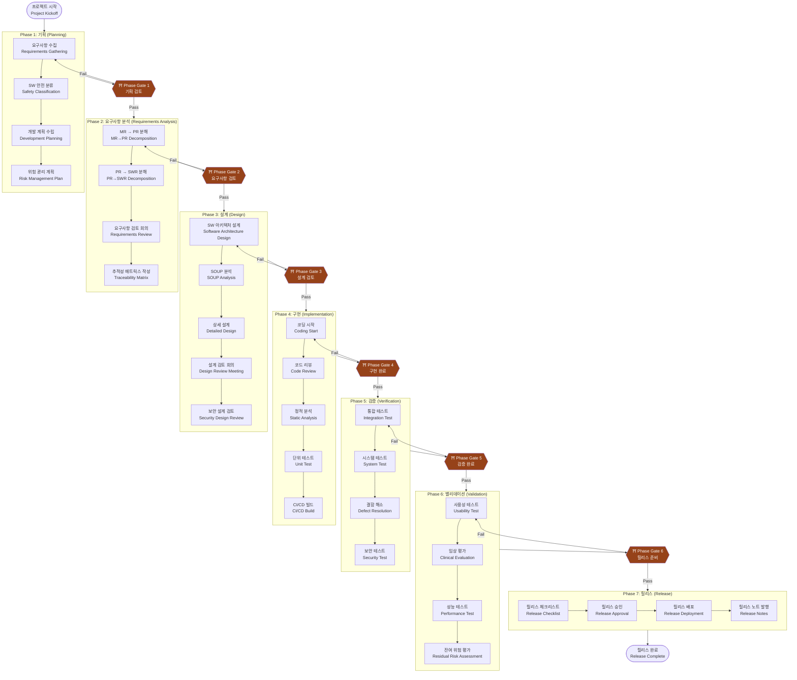

### 5.2 Phase Gate 정의 (Phase Gate Definitions)

| Phase Gate | 명칭 | 주관자 | 참석자 | 주요 심사 항목 |
|------------|------|--------|--------|----------------|
| PG-1 | 기획 검토 (Planning Review) | PM | PM, SE, QA, RA | 개발 계획 완성도, 자원 적절성, 일정 타당성 |
| PG-2 | 요구사항 검토 (Requirements Review) | SE | PM, SE, LD, QA, RA, Clinical | SWR 완성도, 추적성, 위험 연계 |
| PG-3 | 설계 검토 (Design Review) | Lead Dev | PM, SE, LD, QA, Security | 아키텍처 적절성, SOUP 승인, 보안 설계 |
| PG-4 | 구현 완료 검토 (Code Complete Review) | Lead Dev | PM, LD, QA | 코드 커버리지, 정적 분석 결과, UT 통과율 |
| PG-5 | 검증 완료 검토 (Verification Review) | QA | PM, QA, RA, Security | 테스트 결과, 결함 해소 상태, 보안 테스트 결과 |
| PG-6 | 릴리스 준비 검토 (Release Readiness Review) | PM | PM, QA, RA, Clinical, Security | 밸리데이션 결과, 위험 수용성, 규제 준수 |

### 5.3 각 단계별 입력/출력/활동/검토 기준

#### 5.3.1 Phase 2: 요구사항 분석

| 항목 | 내용 |
|------|------|
| **입력 (Input)** | MRD (MR-001~076), PRD 초안, 위험 관리 계획서, 기존 시스템 분석 결과 |
| **활동 (Activity)** | MR→PR 분해, PR→SWR 분해, 요구사항 검토 회의, 추적성 매트릭스 작성 |
| **출력 (Output)** | 확정된 SRS (SWR-xxx), 요구사항 추적성 매트릭스 (RTM) |
| **검토/승인 기준** | 모든 MR이 최소 1개 SWR로 추적, 모호한 요구사항 0건, QA/RA 서명 완료 |

#### 5.3.2 Phase 3: 설계

| 항목 | 내용 |
|------|------|
| **입력 (Input)** | 확정된 SRS, 위험 관리 보고서 초안, SOUP 후보 목록 |
| **활동 (Activity)** | 아키텍처 설계, SOUP 분석, 상세 설계, 설계 검토 회의 |
| **출력 (Output)** | SAD, SDS, SOUP 분석 보고서, 업데이트된 RTM |
| **검토/승인 기준** | 모든 SWR이 설계에 반영, SOUP 승인 완료, 보안 설계 검토 완료 |

#### 5.3.3 Phase 4: 구현

| 항목 | 내용 |
|------|------|
| **입력 (Input)** | 확정된 SAD/SDS, 코딩 가이드라인, 정적 분석 룰셋 |
| **활동 (Activity)** | 코딩, 코드 리뷰, 정적 분석, 단위 테스트, CI/CD 빌드 |
| **출력 (Output)** | 소스 코드 (버전 관리), 단위 테스트 결과, 정적 분석 보고서 |
| **검토/승인 기준** | UT 커버리지 ≥80%, 정적 분석 Critical 결함 0건, 코드 리뷰 승인 완료 |

#### 5.3.4 Phase 5: 검증

| 항목 | 내용 |
|------|------|
| **입력 (Input)** | 빌드된 SW, 테스트 계획서, 테스트 케이스 |
| **활동 (Activity)** | 통합 테스트, 시스템 테스트, 결함 수정, 보안 테스트 |
| **출력 (Output)** | 테스트 결과 보고서, 결함 목록, 보안 테스트 보고서 |
| **검토/승인 기준** | 모든 TC 실행, Critical/Major 결함 0건, 보안 취약점 High 이상 0건 |

---

## 5a. 마일스톤 기반 개발 일정표 (Milestone-based Development Schedule)

> **참조 문서**: DMP-001 (Document Master Plan v1.0) — 본 일정은 DMP-001과 동기화되며, Phase Gate 변경 시 상호 개정한다.

### 5a.1 전체 프로젝트 마일스톤 (Project Milestones)

| 마일스톤 ID | 마일스톤명 | 목표 일자 | 연계 Phase Gate | 주요 완료 기준 |
|------------|-----------|-----------|----------------|---------------|
| **PG-A** | Phase A Gate — 기반 문서 완료 | 2026-04-15 | PG-1 (기획 검토) | MRD, PRD v3.0, WBS, SDP(DOC-003a), SW 개발 지침서 완료 |
| **M1** | FRS 베이스라인 확정 | 2026-05-01 | PG-2 (요구사항 검토) | FRS(DOC-004) 승인 완료 |
| **M2** | SRS 베이스라인 (SWR-xxx 체계) | 2026-05-15 | PG-2 | SRS(DOC-005) 확정, RTM 초안 |
| **M3** | V&V Plan 승인 | 2026-06-01 | — | V&V Master Plan(DOC-011) 서명 완료 |
| **M4** | 아키텍처 리뷰 완료 | 2026-07-15 | PG-3 (설계 검토) | SAD(DOC-006) 리뷰 및 서명 완료 |
| **PG-B** | Phase B Gate — 설계 문서 완료 | 2026-08-15 | PG-3 | SAD, SDS, SOUP 분석, 보안 설계 완료 |
| **M_RTM** | RTM 베이스라인 확정 | 2026-09-01 | PG-D | MR→PR→SWR→TC 완전 추적성 확보 |
| **PG-D** | Phase D Gate — V&V 계획 완료 | 2026-09-01 | PG-4 | 전체 테스트 계획서 승인 완료 |
| **M_VV** | V&V 완료 | 2027-01-01 | PG-5 (검증 완료) | 통합/시스템 테스트 완료, Critical 결함 0건 |
| **M_DHF** | DHF 초안 편찬 | 2027-02-01 | PG-6 (릴리스 준비) | Design History File 패키지 완성 |
| **M_REG** | FDA 510(k) 인허가 제출 | 2027-03-01 | — | eSTAR 패키지 규제기관 제출 |
| **M_KFDA** | KFDA 식약처 인허가 제출 | 2027-04-01 | — | 식약처 기술문서 제출 |

### 5a.2 Phase별 문서 작성 일정 (Document Production Schedule by Phase)

| Phase | 문서 ID | 문서명 | 목표 일정 | 상태 |
|-------|---------|--------|-----------|------|
| **A** | DOC-001 | MRD (Market Requirements Document) | 2026-03 | 완료 ✅ |
| **A** | DOC-002 | PRD v3.0 (Product Requirements Document) | 2026-03 | 완료 ✅ |
| **A** | WBS-001 | WBS v4.0 (Work Breakdown Structure) | 2026-03 | 완료 ✅ |
| **A** | DOC-003 | SW 개발 지침서 (Software Development Guideline) | 2026-04 | 진행 중 |
| **A** | DOC-003a | SDP (본 문서, IEC 62304 §5.1) | 2026-04 | 진행 중 |
| **A** | DOC-041 | PM 계획서 (Project Management Plan) | 2026-04 | 진행 중 |
| **B** | DOC-004 | FRS (Functional Requirements Specification) | 2026-05 | 예정 |
| **B** | DOC-005 | SRS (Software Requirements Specification) | 2026-05 | 예정 |
| **B** | DOC-006 | SAD (Software Architecture Design) | 2026-06 | 예정 |
| **B** | DOC-007 | SDS (Software Design Specification) | 2026-07 | 예정 |
| **C** | DOC-008 | Risk Management Plan (ISO 14971) | 2026-05 | 예정 |
| **C** | DOC-009 | Software Hazard Analysis (FMEA/FTA) | 2026-06 | 예정 |
| **C** | DOC-010 | Risk Management Report | 2027-01 | 예정 |
| **D** | DOC-011 | V&V Master Plan | 2026-05 | 예정 |
| **D** | DOC-012 | Unit Test Plan | 2026-07 | 예정 |
| **D** | DOC-013 | Integration Test Plan | 2026-08 | 예정 |
| **D** | DOC-014 | System Test Plan | 2026-08 | 예정 |
| **E** | DOC-016 | Cybersecurity Management Plan | 2026-05 | 예정 |
| **E** | DOC-019 | SBOM (Software Bill of Materials) | 2026-10 | 예정 |
| **G** | DOC-022 | Unit Test Report | 2026-12 | 예정 |
| **G** | DOC-023 | Integration Test Report | 2026-12 | 예정 |
| **G** | DOC-024 | System Test Report | 2027-01 | 예정 |
| **G** | DOC-025 | V&V Summary Report | 2027-01 | 예정 |
| **H** | DOC-034 | Software Release Documentation | 2027-03 | 예정 |
| **H** | DOC-035 | Design History File (DHF) | 2027-02 | 예정 |
| **H** | DOC-036 | 510(k) Technical File / eSTAR Package | 2027-03 | 예정 |

### 5a.3 즉시 착수 작업 일정 (Immediate Action Plan, 2026년 4~8월)

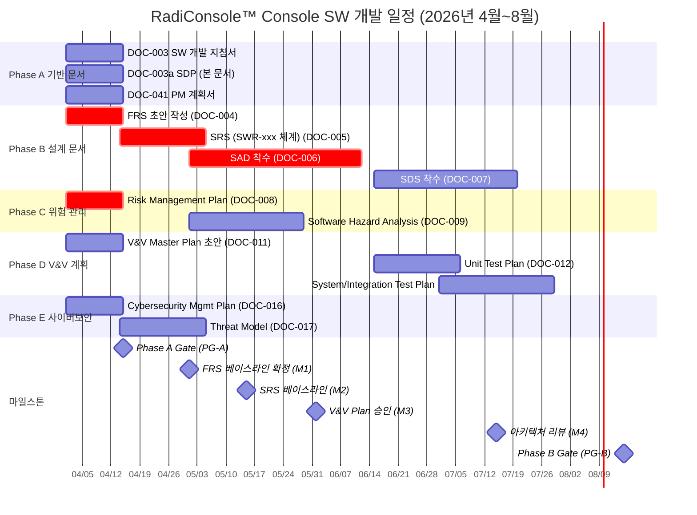

> **DMP-001 동기화 주의**: 본 일정표는 DMP-001 (Document Master Plan) 문서의 기준 일정을 반영한다. 실제 개발 진행 상황 및 Phase Gate 결과에 따라 일정이 변경될 수 있으며, 변경 시 DMP-001과 동시 개정이 필요하다.

---

## 6. 요구사항 분석 절차 (Requirements Analysis Procedure)

### 6.1 MR → PR → SWR 분해 절차

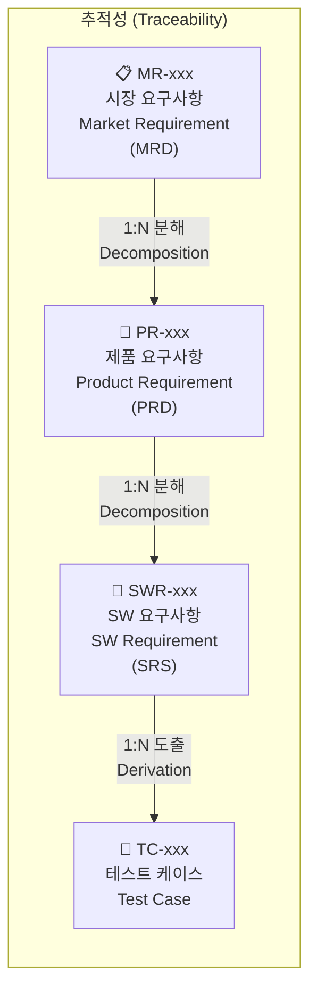

#### 6.1.1 MR → PR 분해 절차

**입력**: MRD (MR-001~076)  
**활동**:
1. 각 MR을 분석하여 시스템 수준 설계 요구사항 (System Design Requirements)으로 분해
2. PR-xxx 번호 부여 (범주별: PM/WF/IP/DM/DC/SA/CS)
3. 각 PR에 대해 수용 기준 (Acceptance Criteria) 정의
4. PR ↔ MR 양방향 추적 링크 설정

**출력**: PRD (PR-xxx 목록, 수용 기준 포함)  
**검토**: SE 검토 및 PM 승인

#### 6.1.2 PR → SWR 분해 절차

**입력**: 확정된 PRD  
**활동**:
1. 각 PR을 소프트웨어 수준에서 구현 가능한 SWR로 분해
2. SWR-xxx 번호 부여
3. 각 SWR에 대해 명확성 (Clarity), 검증 가능성 (Verifiability), 완전성 (Completeness) 검토
4. SW Safety Class 관련 SWR 식별 및 표시

**출력**: SRS (SWR-xxx 목록)  
**검토**: SE, Lead Developer 검토, QA 승인

#### 6.1.3 요구사항 품질 기준 (Requirements Quality Criteria)

| 기준 | 설명 | 확인 방법 |
|------|------|-----------|
| 명확성 (Clear) | 단일 해석만 가능 | 동료 검토 |
| 완전성 (Complete) | 모든 조건/상태 포함 | 검토 체크리스트 |
| 일관성 (Consistent) | 상충 요구사항 없음 | 요구사항 교차 검토 |
| 추적 가능성 (Traceable) | 상위 요구사항과 연결 | RTM 확인 |
| 검증 가능성 (Verifiable) | 테스트 케이스 도출 가능 | 테스트 엔지니어 검토 |
| 현실성 (Feasible) | 기술/일정/비용 내 구현 가능 | 기술 검토 |

### 6.2 요구사항 검토 회의 절차 (Requirements Review Meeting Procedure)

**입력**: SRS 초안, RTM 초안  
**활동**:
1. 회의 주관: SE
2. 참석자: PM, SE, Lead Dev, QA, RA, Clinical (필요 시 UX)
3. 회의 전 배포: 검토 자료 48시간 전 사전 배포
4. 검토 항목:
   - 요구사항 완전성 및 명확성 검토
   - 위험 관리 연계 확인 (HAZ ↔ SWR 추적)
   - 규제 요구사항 반영 여부 확인
5. 결함 (Issue) 기록 및 추적
6. 회의록 작성 및 배포 (24시간 이내)

**출력**: 확정된 SRS, 회의록, 결함 추적 목록  
**검토/승인**: QA 서명, RA 검토 완료

### 6.3 추적성 관리 절차 (Traceability Management Procedure)

**입력**: MRD, PRD, SRS, SAD/SDS, 테스트 케이스  
**활동**:
1. RTM (Requirements Traceability Matrix) 도구: Jira / Excel (병행 관리)
2. 추적 방향: 순방향 (Forward Trace: MR → TC) + 역방향 (Backward Trace: TC → MR)
3. RTM 업데이트 주기: 각 Phase Gate 이전 필수 업데이트
4. 고아 요구사항 (Orphan Requirement) 확인: 추적 불가 요구사항 Zero 목표
5. 갭 분석 (Gap Analysis): 테스트 미커버리지 요구사항 식별 및 조치

**출력**: 업데이트된 RTM  
**검토**: QA 검토, SE 승인

### 6.4 요구사항 변경 통제 절차 (Requirements Change Control Procedure)

```mermaid
flowchart TD
    A["변경 요청 접수\nChange Request (CR)"] --> B["영향 분석\nImpact Analysis"]
    B --> C{영향 범위\nImpact Scope}
    C -->|"Minor\n(현 Phase 내)"|  D["변경 승인\nChange Approval\n(SE + QA)"]
    C -->|"Major\n(다른 Phase 영향)"| E["CCB 회의\nChange Control Board"]
    E --> F{CCB 결정}
    F -->|Approved| G["SRS 업데이트\nUpdate SRS"]
    F -->|Rejected| H["CR 기각\nReject CR"]
    D --> G
    G --> I["RTM 업데이트\nUpdate RTM"]
    I --> J["영향 받는\n산출물 업데이트\nUpdate Artifacts"]
    J --> K["재검증 범위 결정\nRe-verification Scope"]
    K --> END["변경 완료\nChange Complete"]

    style E fill:#964219,color:#fff
    style F fill:#964219,color:#fff
```

**변경 요청 분류**:
- **Minor Change**: 문서 수정, 명확화 수준, 기능 범위 불변
- **Major Change**: 기능 추가/삭제, 아키텍처 변경, 안전 관련 요구사항 변경
- **Emergency Change**: 안전 관련 결함 즉시 수정, 별도 긴급 ECO (Engineering Change Order) 절차 적용

---

## 7. 아키텍처 및 상세 설계 절차 (Architecture & Detailed Design Procedure)

### 7.1 SAD (Software Architecture Design) 작성 절차

**입력**: 확정된 SRS, SOUP 후보 목록, 위험 관리 보고서  
**활동**:
1. Lead Developer 주도, SE 참여
2. 아키텍처 스타일 선택 및 근거 문서화
3. SW 컴포넌트 (Component) 분해 및 인터페이스 정의
4. 데이터 흐름 (Data Flow) 및 통신 프로토콜 정의
5. DICOM / HL7 인터페이스 아키텍처 정의
6. 보안 아키텍처 (Security Architecture) 정의
7. 성능 / 확장성 (Scalability) 고려사항 문서화

**출력**: SAD (SAD-RC-001)  
**검토/승인**: Design Review Meeting (DRM) → SE 승인 → QA 검토

### 7.2 SDS (Software Detailed Design Specification) 작성 절차

**입력**: SAD, 코딩 가이드라인  
**활동**:
1. 각 SW 모듈별 상세 설계 문서 작성 (담당 개발자)
2. 클래스 다이어그램 (Class Diagram), 시퀀스 다이어그램 (Sequence Diagram) 작성
3. DB 스키마 (Database Schema) 정의 (해당 시)
4. 인터페이스 명세 (Interface Specification) 작성
5. 오류 처리 (Error Handling) 로직 정의

**출력**: SDS (SDS-RC-001)  
**검토/승인**: 코드 리뷰 착수 전 Lead Developer 검토 완료

### 7.3 설계 검토 (Design Review) 절차

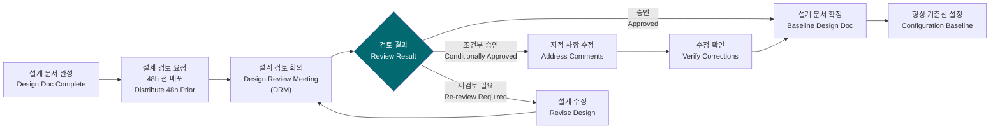

**설계 검토 항목**:
- [ ] 모든 SWR이 설계에 반영되었는가?
- [ ] 인터페이스 정의가 완전하고 명확한가?
- [ ] SOUP 사용이 적절히 문서화되었는가?
- [ ] 보안 설계 요소가 포함되었는가?
- [ ] 위험 통제 조치 (Risk Control)가 설계에 반영되었는가?
- [ ] 단위 테스트 가능한 모듈 구조인가?

### 7.4 SOUP (Software of Unknown Provenance) 분석 절차

**입력**: SOUP 후보 목록, 제조사 제공 문서  
**활동**:
1. SOUP 식별 (오픈소스, 상용 라이브러리 포함)
2. 각 SOUP에 대해 다음 항목 분석:
   - SW 설명 및 버전 정보
   - 제조사 / 개발 조직
   - 의도된 용도 (Intended Use)
   - 알려진 이상 작동 (Anomalous Behavior) 목록
   - 업데이트 및 패치 정책
   - 라이선스 (License) 검토
3. 위험 기여도 (Risk Contribution) 평가
4. SBOM 등록 (SBOM-RC-001 업데이트)
5. SOUP 승인 (SE 서명)

**출력**: SOUP 분석 보고서, 업데이트된 SBOM  
**검토/승인**: SE 검토 및 QA 승인

---

## 8. 구현 절차 (Implementation Procedure)

### 8.1 형상 관리 – Git 브랜치 전략 (Configuration Management – Git Branch Strategy)

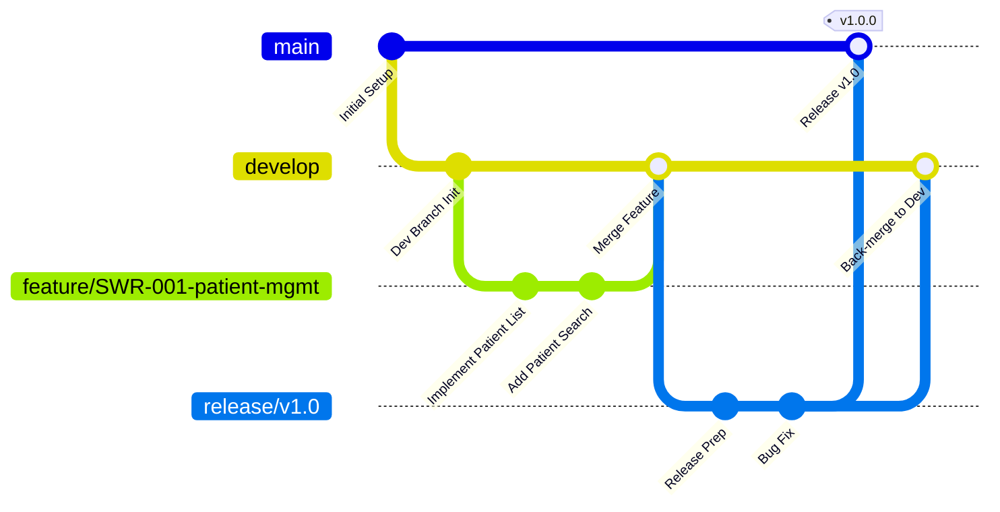

**브랜치 규칙**:

| 브랜치 | 목적 | 보호 규칙 | 명명 규칙 |
|--------|------|-----------|-----------|
| `main` | 릴리스된 코드 | PR 필수, 2인 승인, CI 통과 | - |
| `develop` | 통합 개발 브랜치 | PR 필수, 1인 승인, CI 통과 | - |
| `feature/*` | 기능 개발 | - | `feature/SWR-xxx-description` |
| `bugfix/*` | 결함 수정 | - | `bugfix/BUG-xxx-description` |
| `release/*` | 릴리스 준비 | PR 필수, QA 승인 | `release/vX.Y.Z` |
| `hotfix/*` | 긴급 수정 | PR 필수, 즉시 main/develop 반영 | `hotfix/vX.Y.Z-description` |

**커밋 메시지 규칙**:
```
[TYPE] SWR-xxx: 변경 내용 요약

타입: feat(기능), fix(수정), refactor(리팩터링), 
      test(테스트), docs(문서), style(스타일), chore(기타)

예시: [feat] SWR-011-001: 환자 목록 필터 기능 구현
```

### 8.2 코드 리뷰 절차 (Code Review Procedure)

**입력**: 완성된 기능 브랜치 코드  
**활동**:
1. 개발자가 Pull Request (PR) 생성
2. PR 설명에 포함 사항:
   - 구현된 SWR 번호
   - 변경 내용 요약
   - 테스트 수행 결과
   - 스크린샷 (UI 변경 시)
3. 리뷰어 지정: Lead Developer (필수) + 동료 개발자 1인
4. 리뷰 기준:
   - 코딩 가이드라인 준수 여부
   - 설계 명세 (SDS) 부합 여부
   - 에러 처리 적절성
   - 보안 취약점 (OWASP Top 10 기준)
   - 단위 테스트 존재 및 적절성
5. 리뷰 완료 후 CI/CD 자동 통과 시 Merge 허용

**출력**: 병합된 코드, PR 기록 (감사 추적 목적 보존)  
**검토/승인**: Lead Developer 최종 승인

### 8.3 정적 분석 도구 사용 (Static Analysis Tool Usage)

| 도구 (Tool) | 버전 (Version) | 적용 범위 | 사용 기준 | 임계값 (Threshold) |
|-------------|----------------|-----------|-----------|-------------------|
| **SonarQube** | 10.x LTS | 전체 코드베이스 | CI/CD 자동 실행 | Critical: 0건, High: 5건 이하 |
| **Roslyn Analyzers** | .NET SDK 내장 | C# / .NET 코드 | 개발 IDE 통합 | Warning 수준 이상 해소 필수 |
| **Clang-Tidy** | LLVM 17.x | C++ 코드 (Qt 기반) | Pre-commit hook, CI | 경고 수준 이상 해소 필수 |
| **PVS-Studio** | 7.x | C++ 코드 전체 | 주 1회 실행 | Critical: 0건 |
| **StyleCop** | 1.2.x | 코드 스타일 | Pre-commit hook | 전체 통과 필수 |
| **OWASP Dependency Check** | 9.x | 라이브러리 취약점 | 주 1회 스캔 | Critical CVE 0건 |
| **Bandit** (Python 스크립트) | 1.7.x | Python 도구 | 커밋 시 자동 | High: 0건 |

**정적 분석 결함 처리 절차**:
1. CI/CD 파이프라인에서 Critical 결함 발생 → 빌드 즉시 실패 처리
2. High 결함 → 5건 초과 시 빌드 실패
3. 결함 예외 처리 (Suppression) → Lead Developer + QA 공동 승인 필요
4. 월별 정적 분석 추세 보고서 작성 → QA 보고

### 8.4 Build/CI 파이프라인 (Build/CI Pipeline)

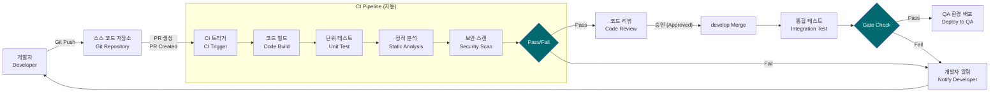

**빌드 환경**:
- **CI 서버**: GitHub Actions / Jenkins (Jenkins LTS 2.x)
- **빌드 도구**: CMake 3.25+, MSBuild (Visual Studio 2022), .NET CLI 8.x
- **컴파일러**: MSVC 2022 (v19.3x) / GCC 12.x (크로스플랫폼 지원)
- **표준**: C++17
- **아티팩트 저장소**: Azure Artifacts / JFrog Artifactory
- **빌드 번호 규칙**: `MAJOR.MINOR.PATCH.BUILD` (예: `1.0.0.2350`)

### 8.5 개발 도구 목록 (Development Tool Inventory)

> **참조**: DOC-006 SAD (Software Architecture Design) v1.0 — 아래 개발 도구 및 SOUP 버전은 SAD의 기술 스택 가이드를 기준으로 한다.

#### 8.5.1 핵심 개발 도구 (Core Development Tools)

| 도구 유형 | 도구명 | 버전 | 용도 |
|-----------|--------|------|------|
| **IDE** | Qt Creator | 12.x | C++/Qt GUI 개발 |
| **IDE (보조)** | Visual Studio | 2022 (v17.x) | C++/C# 코드 편집, 정적 분석 |
| **빌드 시스템** | CMake | 3.25+ | 크로스플랫폼 빌드 스크립트 |
| **컴파일러** | MSVC (Visual Studio 2022) | v19.3x (C++17) | Windows 네이티브 빌드 |
| **컴파일러 (대안)** | GCC | 12.x | 크로스플랫폼 빌드 |
| **형상 관리** | Git | 2.x | 소스 코드 버전 관리 |
| **CI/CD** | GitHub Actions | N/A | 자동 빌드, 테스트 파이프라인 |
| **CI/CD (보조)** | Jenkins | LTS 2.x | 온프레미스 CI/CD |
| **컴테이너** | Docker | 24.x+ | 빌드/테스트 환경 격리 |
| **이슈 트래커** | Jira | 클라우드 | 결함/SWR 추적 |
| **코드 리뷰** | GitHub Pull Request | N/A | 코드 리뷰 워크플로우 |

#### 8.5.2 SOUP (Software of Unknown Provenance) 도구 목록

> **참조**: IEC 62304 §5.3.3, DOC-006 SAD v1.0 §7.1 SOUP 목록

| SOUP ID | 이름 | 버전 | 제조사/커뮤니티 | 용도 | Safety Class 기여 | 라이선스 |
|---------|------|------|----------------|------|-----------------|----------|
| SOUP-001 | Qt Framework | **6.6 LTS** | Qt Group | GUI 프레임워크, 이벤트 루프, 네트워킹 | Class B | LGPL 3.0 (상용) |
| SOUP-002 | DCMTK | **3.6.8** | OFFIS e.V. | DICOM 프로토콜 스택 | Class B | OFFIS Source License |
| SOUP-003 | OpenCV | **4.9.x** | OpenCV Foundation | 영상 처리 알고리즘 | Class A | Apache 2.0 |
| SOUP-004 | SQLite | **3.45.x** | D. Richard Hipp | 로컬 데이터베이스 | Class B | Public Domain |
| SOUP-005 | OpenSSL | **3.3.x** | OpenSSL Foundation | 암호화, TLS | Class B | Apache 2.0 |
| SOUP-006 | zlib | **1.3.x** | zlib team | 데이터 압축 | Class A | zlib License |
| SOUP-007 | Boost.Asio | **1.84.x** | Boost | 비동기 네트워킹 | Class B | BSL-1.0 |

#### 8.5.3 테스트 도구 (Test Tools)

| 도구명 | 버전 | 용도 |
|--------|------|------|
| Google Test (gtest) | 1.14.x | C++ 단위 테스트 프레임워크 |
| Coverlet | 6.x | .NET 코드 커버리지 측정 |
| Microsoft Threat Modeling Tool (TMT) | 2022 | 위협 모델링 |
| Valgrind | 3.2x | 메모리 누수 검사 (Linux) |
| AddressSanitizer (ASan) | GCC/LLVM 내장 | 메모리 오류 검사 |
| Syft | 1.x | SBOM 자동 생성 (CycloneDX 형식) |

---

## 9. 검증 절차 (Verification Procedure)

### 9.1 단위 테스트 실행 절차 (Unit Test Execution Procedure)

**입력**: 구현된 SW 모듈, SDS  
**활동**:
1. 각 개발자가 담당 모듈에 대한 단위 테스트 작성
2. 테스트 프레임워크: **xUnit** (.NET), **Jest** (JS)
3. 커버리지 측정 도구: **Coverlet** (Line Coverage + Branch Coverage)
4. CI/CD에서 자동 실행 (커밋마다)
5. 커버리지 리포트 자동 생성

**출력**: 단위 테스트 결과 보고서, 커버리지 리포트  
**검토/승인**: Lead Developer 검토, QA 확인  

**커버리지 목표**:

| 모듈 유형 | Line Coverage | Branch Coverage |
|-----------|--------------|-----------------|
| 안전 관련 모듈 (Safety-related) | ≥90% | ≥85% |
| 일반 모듈 | ≥80% | ≥70% |
| SOUP Wrapper | ≥75% | ≥65% |

### 9.2 통합 테스트 실행 절차 (Integration Test Execution Procedure)

**입력**: 통합 빌드, 통합 테스트 케이스, 테스트 환경  
**활동**:
1. QA팀 주도 (Lead Developer 지원)
2. 테스트 환경: 실제 HW 또는 시뮬레이터 환경
3. 인터페이스별 통합 테스트:
   - DICOM 인터페이스 (PACS, Modality Worklist)
   - HW 컨트롤러 통신 (Detector, Generator)
   - 데이터베이스 연동
4. 테스트 케이스 실행 및 결과 기록
5. 발견된 결함 → BUG-xxx 등록

**출력**: 통합 테스트 결과 보고서, 결함 목록  
**검토/승인**: QA 팀장 검토

### 9.3 시스템 테스트 실행 절차 (System Test Execution Procedure)

**입력**: 통합 완료된 SW, 시스템 테스트 케이스, 완전한 테스트 환경  
**활동**:
1. QA팀 단독 수행 (독립성 확보)
2. 테스트 환경: 운영 환경과 동일한 HW/SW 구성
3. 기능 테스트 (Functional Test): 모든 SWR 커버
4. 비기능 테스트 (Non-functional Test): 성능, 응답시간, 안정성
5. 회귀 테스트 (Regression Test): 변경 영향 범위 재검증
6. 테스트 결과 보고서 작성

**출력**: 시스템 테스트 결과 보고서, RTM 업데이트  
**검토/승인**: QA 팀장, RA 검토 후 Phase Gate 6 진입

### 9.4 결함 관리 절차 (Bug Triage Procedure)

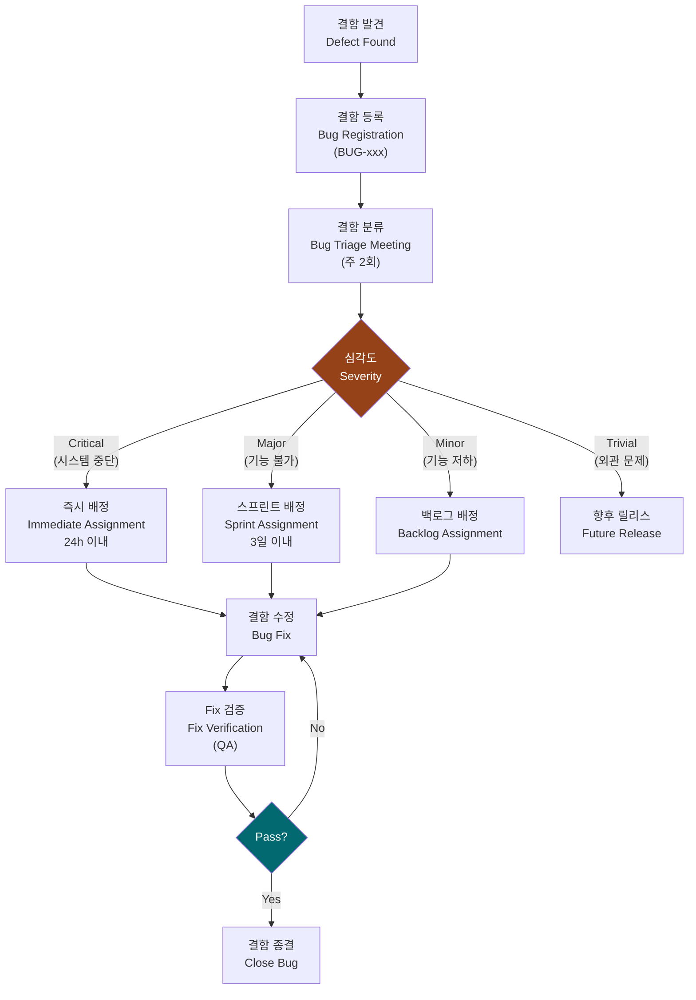

**결함 분류 기준**:

| 심각도 | 정의 | 해결 기한 |
|--------|------|-----------|
| Critical | 시스템 중단, 데이터 손실, 안전 위협 | 24시간 이내 |
| Major | 주요 기능 동작 불가 | 3 업무일 이내 |
| Minor | 기능 저하, 회피 방법 존재 | 현 스프린트 |
| Trivial | 외관 문제, 오탈자 | 향후 릴리스 |

**릴리스 허용 기준**: Critical 0건, Major 0건 (또는 사전 승인된 예외 처리)

---

## 10. 밸리데이션 절차 (Validation Procedure)

### 10.1 사용성 테스트 절차 (Usability Test Procedure, IEC 62366)

**입력**: 사용성 엔지니어링 파일, 사용자 인터페이스 사양, 사용 오류 위험 분석 결과  
**활동**:
1. UX 디자이너 + Clinical Affairs 공동 주관
2. 테스트 대상 사용자: 방사선사 (Radiologic Technologist), 영상의학과 의사
3. 테스트 유형:
   - **형성적 평가 (Formative Evaluation)**: 개발 중 반복 수행 (Phase 3~4)
   - **총괄적 평가 (Summative Evaluation)**: 릴리스 전 최종 수행 (Phase 6)
4. 테스트 시나리오: 대표적 사용 시나리오 (Task Analysis 기반)
5. 참가자: 최소 15명 (다양한 경험 수준)
6. 평가 항목: 효율성, 효과성, 만족도, 오류율

**출력**: 사용성 테스트 보고서 (IEC 62366 §5.9 요구사항 충족)  
**검토/승인**: Clinical Affairs 검토, RA 최종 승인

### 10.2 임상 평가 절차 (Clinical Evaluation Procedure)

**입력**: 시스템 테스트 완료된 SW, 임상 사용 시나리오  
**활동**:
1. Clinical Affairs 주도
2. 임상 현장에서 실제 의료진 참여 평가
3. 평가 항목:
   - 진단 워크플로우 지원 적절성
   - 영상 표시 품질 (Image Display Quality)
   - 선량 정보 표시 정확성
   - DICOM 연동 안정성
4. 평가 결과 문서화 (임상 평가 보고서)

**출력**: 임상 평가 보고서  
**검토/승인**: 의료진 서명, RA 검토

### 10.3 성능 테스트 절차 (Performance Test Procedure)

| 테스트 항목 | 목표 기준 | 측정 방법 |
|-------------|-----------|-----------|
| 애플리케이션 시작 시간 | ≤10초 | 자동화 측정 |
| 환자 목록 로드 (500명) | ≤3초 | 자동화 측정 |
| 영상 표시 시간 (1장) | ≤2초 | 자동화 측정 |
| DICOM 전송 속도 | ≥10MB/s | 네트워크 측정 |
| CPU 평균 사용률 (대기) | ≤10% | 성능 모니터 |
| 메모리 사용량 (대기) | ≤500MB | 메모리 프로파일 |
| 장시간 운영 안정성 | 72시간 무중단 | Soak Test |

---

## 11. 위험 관리 연계 절차 (Risk Management Integration Procedure)

### 11.1 FMEA/FTA 수행 절차

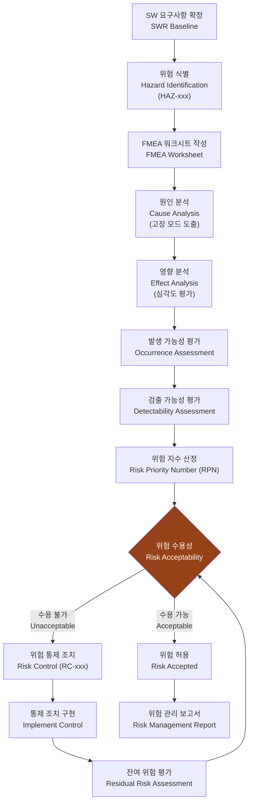

**FMEA 수행 주기**:
- 초기 FMEA: SW 아키텍처 설계 완료 후
- 갱신 FMEA: 요구사항 변경, 설계 변경, 중요 결함 발생 시

**FTA (Fault Tree Analysis) 적용 기준**:
- Safety-critical 기능 (안전 관련 SWR) 에 대해 FTA 수행
- Top-level 이벤트: 환자 위해 사건 (Patient Harm Event)

### 11.2 위험 통제 조치 구현 절차

**입력**: 위험 관리 보고서, 위험 통제 조치 목록 (RC-xxx)  
**활동**:
1. 각 RC-xxx에 대해 구현 담당자 지정
2. 구현 방식 결정 (설계 변경, 코드 변경, 경고 메시지, 사용 지침)
3. 구현 후 SDS에 반영 및 RTM 업데이트
4. 구현 검증: 해당 TC-xxx 실행으로 효과 확인

**출력**: RC 구현 확인서, 업데이트된 RTM  
**검토/승인**: SE 검토, QA 승인

### 11.3 잔여 위험 평가 절차 (Residual Risk Assessment Procedure)

**입력**: 위험 통제 조치 구현 완료 결과  
**활동**:
1. 통제 조치 적용 후 잔여 위험 재평가
2. 허용 기준: ISO 14971 부속서 C 기준 적용
3. 편익-위험 분석 (Benefit-Risk Analysis) 수행
4. 전체 잔여 위험 합산 허용성 판단
5. 최종 위험 관리 보고서 (Risk Management Report) 작성

**출력**: 잔여 위험 평가 보고서  
**검토/승인**: SE, QA, RA 공동 승인

---

## 12. 사이버보안 절차 (Cybersecurity Procedure)

### 12.1 위협 모델링 절차 (Threat Modeling Procedure)

```mermaid
flowchart LR
    A["시스템 범위 정의\nDefine System Scope"] --> B["데이터 흐름도 작성\nCreate DFD\n(Data Flow Diagram)"]
    B --> C["신뢰 경계 식별\nIdentify Trust Boundaries"]
    C --> D["STRIDE 분석\nSTRIDE Analysis"]
    
    subgraph STRIDE
        S["Spoofing\n신원 위장"]
        T["Tampering\n데이터 변조"]
        R["Repudiation\n부인 방지"]
        I["Information Disclosure\n정보 노출"]
        D2["Denial of Service\n서비스 거부"]
        E["Elevation of Privilege\n권한 상승"]
    end
    
    D --> STRIDE
    STRIDE --> F["위협 등급 평가\nThreat Rating\n(DREAD / CVSS)"]
    F --> G["대응 방안 도출\nCountermeasure Design"]
    G --> H["위협 모델 문서화\nDocument Threat Model"]
```

**위협 모델링 도구**: Microsoft Threat Modeling Tool (TMT)  
**수행 주기**: 아키텍처 설계 완료 후 (PG-3 이전), 주요 변경 시 재수행

### 12.2 보안 테스트 절차 (Security Test Procedure)

| 테스트 유형 | 도구 | 수행 시점 | 기준 |
|-------------|------|-----------|------|
| 정적 보안 분석 (SAST) | SonarQube Security, Checkmarx | CI/CD 자동 | Critical 0건 |
| 동적 보안 분석 (DAST) | OWASP ZAP | 시스템 테스트 | High 이상 0건 |
| 의존성 취약점 스캔 | OWASP Dependency Check, Snyk | 주 1회 | Critical CVE 0건 |
| 침투 테스트 (Pen Test) | 전문 보안팀 외부 의뢰 | 릴리스 전 1회 | High 이상 0건 |
| 암호화 검증 | 수동 검토 | 설계 검토 시 | FIPS 140-2 준수 |
| 인증/인가 테스트 | 수동/자동 | 시스템 테스트 | 취약점 0건 |

### 12.3 SBOM (Software Bill of Materials) 생성 절차

**입력**: 전체 소스 코드, 빌드 결과물  
**활동**:
1. SBOM 생성 도구: **Syft** (자동화), **CycloneDX** 형식 출력
2. 포함 항목: 라이브러리명, 버전, 라이선스, 공급업체, CVE 연계
3. SBOM 생성 시점: 릴리스 빌드마다 자동 생성
4. 저장 위치: 버전 관리 저장소 (릴리스 태그와 연계)
5. FDA Section 524B 요구사항 부합 여부 검토

**출력**: SBOM 파일 (CycloneDX JSON 형식, SBOM-RC-xxx)  
**검토/승인**: Security Engineer 검토, RA 최종 확인

### 12.4 취약점 관리 절차 (Vulnerability Management Procedure)

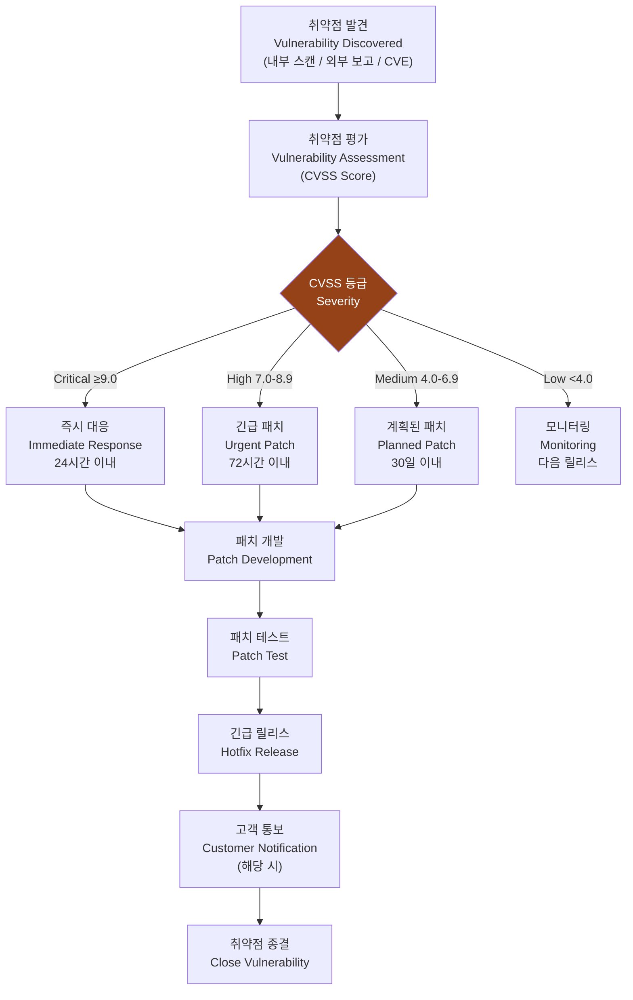

**취약점 정보 소스**:
- NVD (National Vulnerability Database)
- GitHub Security Advisories
- 제조사 보안 게시판
- ICS-CERT 의료기기 사이버보안 경보

---

## 13. 릴리스 관리 절차 (Release Management Procedure)

### 13.1 릴리스 준비 체크리스트 (Release Readiness Checklist)

**입력**: 모든 Phase Gate 통과 확인, 밸리데이션 완료 보고서  
**활동**: Phase Gate 6 (PG-6) 회의에서 다음 체크리스트 검토

#### 기술 준비 (Technical Readiness)
- [ ] 모든 계획된 기능 구현 완료
- [ ] Critical / Major 결함 0건
- [ ] UT 커버리지 목표 달성 (≥80%)
- [ ] 정적 분석 임계값 준수 (Critical 0건)
- [ ] 보안 테스트 통과 (High CVE 0건)
- [ ] 성능 목표 달성

#### 문서 준비 (Documentation Readiness)
- [ ] SRS 최종 확정 버전
- [ ] SAD/SDS 최종 확정 버전
- [ ] SBOM 생성 완료
- [ ] SOUP 목록 최신화
- [ ] 위험 관리 보고서 완료
- [ ] 사용성 테스트 보고서 완료
- [ ] 릴리스 노트 초안 완성

#### 규제 준비 (Regulatory Readiness)
- [ ] RA 최종 검토 완료
- [ ] FDA/CE 제출 관련 이슈 없음
- [ ] DHF (Design History File) 패키지 완성
- [ ] 적합성 선언서 (DoC) 업데이트

**출력**: 완성된 릴리스 체크리스트  
**검토/승인**: PM, QA, RA 공동 서명

### 13.2 릴리스 승인 프로세스 (Release Approval Process)

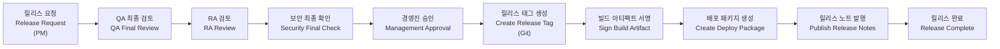

**릴리스 승인 권한**:

| 릴리스 유형 | 승인 필요 인원 |
|-------------|----------------|
| Major Release (vX.0.0) | PM + QA + RA + 개발본부장 |
| Minor Release (vX.Y.0) | PM + QA + RA |
| Patch Release (vX.Y.Z) | PM + QA |
| Hotfix Release | PM + QA (긴급 승인) |

### 13.3 릴리스 노트 작성 기준 (Release Notes Writing Criteria)

**필수 포함 항목**:
1. 릴리스 버전 및 날짜
2. 변경 사항 요약:
   - 신규 기능 (New Features)
   - 개선 사항 (Improvements)
   - 버그 수정 (Bug Fixes)
   - 보안 패치 (Security Patches)
3. 알려진 문제 (Known Issues)
4. 설치/업그레이드 지침
5. 호환성 정보 (Compatibility Information)
6. SOUP 변경 이력 (해당 시)

---

## 14. 변경 관리 절차 (Change Management Procedure)

### 14.1 변경 요청 (ECR) 프로세스

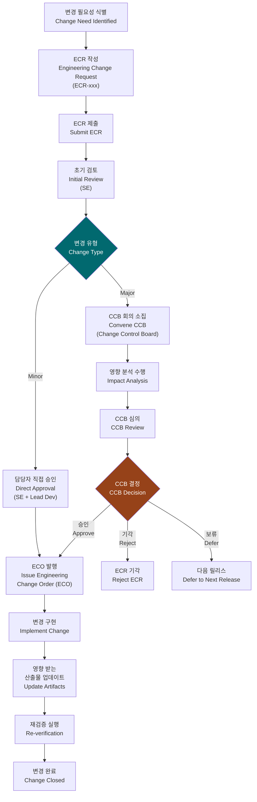

### 14.2 영향 분석 절차 (Impact Analysis Procedure)

**입력**: ECR, 현행 SRS/SAD/SDS, RTM  
**활동**:
1. 변경 내용 분석:
   - 영향 받는 SWR 식별
   - 영향 받는 설계 요소 식별
   - 영향 받는 테스트 케이스 식별
   - 위험 관리에 미치는 영향 평가
   - 사이버보안에 미치는 영향 평가
2. 변경 구현 공수 (Effort) 추정
3. 일정 영향 평가

**출력**: 영향 분석 보고서 (ECR 첨부)  
**검토**: SE, Lead Developer, QA

### 14.3 변경 후 재검증 범위 결정

| 변경 유형 | 재검증 범위 |
|-----------|-------------|
| 버그 수정 (Non-functional) | 해당 TC 재실행 + 회귀 테스트 |
| UI 레이아웃 변경 | UI 관련 TC + 사용성 평가 |
| 비즈니스 로직 변경 | 관련 TC + 통합 테스트 일부 |
| 아키텍처 변경 | 전체 통합 + 시스템 테스트 |
| 안전 관련 기능 변경 | 전체 재검증 + 위험 관리 재수행 |
| SOUP 버전 업데이트 | SOUP 분석 + 영향 범위 재검증 |

---

## 15. 문서 관리 절차 (Document Management Procedure)

### 15.1 문서 작성, 검토, 승인 프로세스

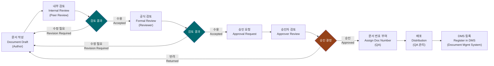

### 15.2 문서 번호 체계 (Document Numbering System)

**체계**: `[TYPE]-[PRODUCT]-[SEQ]`

| 문서 유형 | 접두어 | 예시 |
|-----------|--------|------|
| SW Development Procedure | SDP | SDP-RC-001 |
| Software Requirements Specification | SRS | SRS-RC-001 |
| Software Architecture Design | SAD | SAD-RC-001 |
| Software Detailed Design Specification | SDS | SDS-RC-001 |
| Software Test Plan | STP | STP-RC-001 |
| Software Test Report | STR | STR-RC-001 |
| Risk Management Plan | RMP | RMP-RC-001 |
| Risk Management Report | RMR | RMR-RC-001 |
| FMEA Report | FMEA | FMEA-RC-001 |
| SBOM / SOUP List | SBOM | SBOM-RC-001 |
| Usability Engineering File | UEF | UEF-RC-001 |
| Engineering Change Request | ECR | ECR-RC-001 |
| Engineering Change Order | ECO | ECO-RC-001 |

**버전 규칙**:
- `vX.0`: Major Release (전면 개정)
- `vX.Y`: Minor Update (일부 내용 수정)
- `vX.Y Draft`: 검토 중인 초안

### 15.3 개정 관리 (Revision Management)

**개정 이력 필수 기록 사항**:
1. 버전 번호
2. 개정 날짜
3. 변경 내용 요약
4. 변경자 이름
5. 승인자 이름

**개정 기준**:
- 내용 오류 수정 → 소수점 버전 증가 (v1.0 → v1.1)
- 규격 개정 반영 → 소수점 버전 증가
- 프로세스 전면 변경 → 주 버전 증가 (v1.0 → v2.0)

**문서 보관 기간**: 최종 제품 판매 중단 후 10년 (FDA 21 CFR 820.180 준수)

---

## 16. 교육 및 역량 관리 (Training & Competency Management)

### 16.1 필수 교육 과정 (Mandatory Training Courses)

| 교육 과정 | 대상 | 주기 | 소요 시간 | 평가 방법 |
|-----------|------|------|-----------|-----------|
| IEC 62304 기초 과정 | 전 개발팀 | 입사 시 + 3년마다 | 8시간 | 필기 시험 (70점 이상) |
| ISO 14971 위험 관리 | SE, Lead Dev, QA | 입사 시 + 3년마다 | 8시간 | 필기 시험 |
| DICOM 기초 | 전 개발팀 | 입사 시 | 4시간 | 실습 평가 |
| 사이버보안 기초 | 전 개발팀 | 입사 시 + 1년마다 | 4시간 | 퀴즈 (80점 이상) |
| 의료기기 규정 개요 | 전 팀원 | 입사 시 + 2년마다 | 4시간 | 출석 확인 |
| 안전한 코딩 가이드라인 | 개발자 | 입사 시 + 1년마다 | 4시간 | 코드 실습 평가 |
| GxP 문서화 | QA, RA | 입사 시 + 2년마다 | 4시간 | 필기 시험 |
| IEC 62366 사용성 | UX, Clinical | 입사 시 + 3년마다 | 8시간 | 케이스 스터디 |

### 16.2 역량 평가 기준 (Competency Assessment Criteria)

#### 개발자 (Developer) 역량 요건

| 역량 영역 | 최소 요건 | 평가 방법 |
|-----------|-----------|-----------|
| 프로그래밍 (C#, .NET) | 실무 경력 2년 이상 또는 교육 이수 | 코드 리뷰 + 기술 면접 |
| 의료기기 SW 개발 이해 | IEC 62304 교육 이수 | 교육 수료증 |
| 단위 테스트 작성 | UT 프레임워크 사용 가능 | 실습 평가 |
| 형상 관리 (Git) | Git 기본 사용 가능 | 실습 평가 |
| DICOM 기초 | DICOM 교육 이수 | 교육 수료증 |

#### QA 역량 요건

| 역량 영역 | 최소 요건 | 평가 방법 |
|-----------|-----------|-----------|
| 의료기기 품질 관리 | ISO 13485 이해 | 교육 이수 + 면접 |
| 테스트 설계 | ISTQB 자격 또는 동등 경력 | 자격증 또는 경력 검증 |
| 결함 관리 | Jira 사용 가능 | 실습 평가 |
| 위험 기반 테스팅 | 교육 이수 | 교육 수료증 |

#### 역량 갭 (Competency Gap) 관리

1. 연간 역량 평가 수행 (1월)
2. 역량 갭 식별 → 교육 계획 수립
3. 교육 이수 후 재평가
4. 역량 평가 기록 보관 (HR 시스템 + 개인 교육 파일)

---

## 부록 A: RACI 매트릭스 (Appendix A: RACI Matrix)

> R=Responsible, A=Accountable, C=Consulted, I=Informed

| 번호 | 활동 (Activity) | PM | SE | Lead Dev | Dev | QA | RA | Security | Clinical | UX |
|------|-----------------|----|----|----------|-----|----|----|----------|----------|----|
| 1 | 개발 계획 수립 | A | C | C | I | C | C | I | I | I |
| 2 | SW 안전 분류 결정 | I | A | C | I | C | R | I | C | I |
| 3 | MR → PR 분해 | I | A/R | C | I | C | C | I | C | I |
| 4 | PR → SWR 분해 | I | A | R | C | C | C | I | I | C |
| 5 | 요구사항 검토 회의 | C | A | R | C | R | C | C | C | C |
| 6 | RTM 작성 | I | C | C | I | A/R | C | I | I | I |
| 7 | 요구사항 변경 승인 | A | R | C | I | C | C | C | I | I |
| 8 | SW 아키텍처 설계 | I | A | R | C | C | I | C | I | C |
| 9 | SOUP 분석 | I | A | R | C | C | I | C | I | I |
| 10 | 상세 설계 | I | C | A | R | C | I | C | I | R |
| 11 | 설계 검토 회의 | C | A | R | C | R | C | C | I | C |
| 12 | 보안 설계 검토 | I | A | C | C | C | I | R | I | I |
| 13 | 코딩 | I | I | A | R | I | I | C | I | I |
| 14 | 코드 리뷰 | I | C | A | R | C | I | C | I | I |
| 15 | 정적 분석 실행 | I | I | A | R | C | I | C | I | I |
| 16 | CI/CD 관리 | I | C | A | R | C | I | C | I | I |
| 17 | 단위 테스트 작성/실행 | I | I | A | R | C | I | I | I | I |
| 18 | 통합 테스트 수행 | I | C | C | R | A | I | C | I | I |
| 19 | 시스템 테스트 수행 | I | C | I | I | A/R | C | C | I | I |
| 20 | 결함 트리아지 | I | C | C | C | A/R | I | C | I | I |
| 21 | 결함 수정 | I | I | A | R | C | I | I | I | I |
| 22 | 사용성 테스트 계획 | I | C | I | I | C | C | I | C | A/R |
| 23 | 사용성 테스트 수행 | I | I | I | I | C | C | I | R | A |
| 24 | 임상 평가 수행 | I | I | I | I | C | C | I | A/R | I |
| 25 | 성능 테스트 수행 | I | C | C | C | A/R | I | I | I | I |
| 26 | FMEA 수행 | I | A | C | C | C | C | C | C | I |
| 27 | 위험 통제 조치 구현 | I | A | C | R | C | C | C | I | I |
| 28 | 잔여 위험 평가 | I | A | C | I | R | R | C | C | I |
| 29 | 위협 모델링 | I | A | C | C | C | I | R | I | I |
| 30 | SBOM 생성 | I | C | C | R | C | C | A/R | I | I |
| 31 | 보안 테스트 수행 | I | C | C | I | C | I | A/R | I | I |
| 32 | 취약점 대응 | A | C | C | R | C | C | R | I | I |
| 33 | 릴리스 체크리스트 검토 | A | C | C | I | R | R | C | C | I |
| 34 | 릴리스 승인 | A | C | I | I | R | R | C | I | I |
| 35 | 릴리스 노트 작성 | R | C | C | C | C | C | C | I | I |
| 36 | ECR 작성 | R | C | C | C | C | C | C | C | C |
| 37 | 영향 분석 수행 | I | A | R | C | C | C | C | I | I |
| 38 | CCB 회의 주관 | A | R | C | I | C | C | C | I | I |
| 39 | 변경 후 재검증 수행 | I | C | C | R | A/R | C | C | I | I |
| 40 | 문서 작성 (일반) | I | C | C | R | C | C | C | C | C |
| 41 | 문서 검토 | C | C | C | C | A | R | C | C | C |
| 42 | 문서 승인 | A | C | I | I | R | R | I | I | I |
| 43 | 교육 계획 수립 | A | C | C | I | R | C | C | C | C |
| 44 | 역량 평가 수행 | A | C | C | I | R | I | C | I | I |

---

## 부록 B: Phase Gate 체크리스트 (Appendix B: Phase Gate Checklist)

### PG-1: 기획 검토 체크리스트

| # | 확인 항목 | Pass/Fail | 비고 |
|---|-----------|-----------|------|
| 1 | 개발 계획서 (SDP) 초안 완성 | | |
| 2 | 프로젝트 조직 및 역할 정의 완료 | | |
| 3 | 개발 일정 수립 (마일스톤 포함) | | |
| 4 | 위험 관리 계획서 (RMP) 승인 | | |
| 5 | SW 안전 분류 결정 (Class B 확인) | | |
| 6 | 형상 관리 환경 구축 완료 | | |
| 7 | 개발 도구 및 환경 준비 완료 | | |
| 8 | 자원 (인력, 예산, 장비) 확보 확인 | | |

### PG-2: 요구사항 검토 체크리스트

| # | 확인 항목 | Pass/Fail | 비고 |
|---|-----------|-----------|------|
| 1 | 모든 MR에 대한 SWR 분해 완료 | | |
| 2 | 각 SWR에 수용 기준 정의 | | |
| 3 | 고아 SWR (Orphan SWR) 0건 | | |
| 4 | SWR 품질 기준 100% 충족 | | |
| 5 | RTM 초안 완성 | | |
| 6 | 요구사항 검토 회의 완료 및 서명 | | |
| 7 | Safety-critical SWR 식별 및 표시 | | |
| 8 | 규제 요구사항 반영 확인 (RA 서명) | | |
| 9 | 사이버보안 요구사항 포함 확인 | | |
| 10 | 위험 관리 보고서와 연계 확인 | | |

### PG-3: 설계 검토 체크리스트

| # | 확인 항목 | Pass/Fail | 비고 |
|---|-----------|-----------|------|
| 1 | SAD 완성 및 검토 서명 | | |
| 2 | 모든 SWR이 설계에 반영 | | |
| 3 | SOUP 목록 및 분석 완료 | | |
| 4 | SOUP 승인 (SE 서명) | | |
| 5 | 보안 아키텍처 설계 완료 | | |
| 6 | 위협 모델링 수행 완료 | | |
| 7 | SDS 초안 완성 (모든 모듈) | | |
| 8 | 단위 테스트 계획 수립 | | |
| 9 | 코딩 가이드라인 배포 | | |
| 10 | 설계 검토 회의 완료 및 서명 | | |

### PG-4: 구현 완료 체크리스트

| # | 확인 항목 | Pass/Fail | 비고 |
|---|-----------|-----------|------|
| 1 | 모든 계획된 기능 구현 완료 | | |
| 2 | UT 커버리지 ≥80% | | |
| 3 | 정적 분석 Critical 결함 0건 | | |
| 4 | 모든 코드 리뷰 완료 | | |
| 5 | CI/CD 빌드 성공 | | |
| 6 | OWASP Dependency Check 통과 | | |
| 7 | SDS 최종 확정 버전 | | |
| 8 | 개발 관련 결함 Major 이상 0건 | | |

### PG-5: 검증 완료 체크리스트

| # | 확인 항목 | Pass/Fail | 비고 |
|---|-----------|-----------|------|
| 1 | 모든 TC 실행 완료 | | |
| 2 | TC 통과율 ≥98% | | |
| 3 | Critical/Major 결함 0건 (또는 예외 처리 승인) | | |
| 4 | 보안 테스트 High 이상 취약점 0건 | | |
| 5 | 침투 테스트 완료 | | |
| 6 | RTM 최종 업데이트 완료 | | |
| 7 | 테스트 결과 보고서 작성 완료 | | |
| 8 | SBOM 최신화 완료 | | |

### PG-6: 릴리스 준비 체크리스트

| # | 확인 항목 | Pass/Fail | 비고 |
|---|-----------|-----------|------|
| 1 | 사용성 테스트 (Summative) 완료 | | |
| 2 | 임상 평가 완료 | | |
| 3 | 잔여 위험 평가 완료 및 수용 | | |
| 4 | 위험 관리 보고서 최종 서명 | | |
| 5 | DHF 패키지 완성 | | |
| 6 | RA 최종 검토 완료 | | |
| 7 | 릴리스 노트 완성 | | |
| 8 | 경영진 승인 획득 | | |
| 9 | 배포 패키지 생성 완료 | | |
| 10 | 고객 지원 팀 교육 완료 | | |

---

## 부록 C: 문서 양식 목록 (Appendix C: Document Template List)

| 양식 ID | 양식명 | 사용 절차 | 위치 |
|---------|--------|-----------|------|
| TMPL-SRS-001 | SW 요구사항 명세서 양식 | §6 | DMS/Templates |
| TMPL-SAD-001 | SW 아키텍처 설계서 양식 | §7.1 | DMS/Templates |
| TMPL-SDS-001 | SW 상세 설계서 양식 | §7.2 | DMS/Templates |
| TMPL-SOUP-001 | SOUP 분석 양식 | §7.4 | DMS/Templates |
| TMPL-RTM-001 | 요구사항 추적성 매트릭스 | §6.3 | DMS/Templates |
| TMPL-FMEA-001 | SW FMEA 워크시트 | §11.1 | DMS/Templates |
| TMPL-TC-001 | 테스트 케이스 양식 | §9 | DMS/Templates |
| TMPL-BGRPT-001 | 결함 보고서 양식 | §9.4 | DMS/Templates |
| TMPL-ECR-001 | 변경 요청 양식 | §14.1 | DMS/Templates |
| TMPL-ECO-001 | 변경 지시서 양식 | §14.1 | DMS/Templates |
| TMPL-RELNOTE-001 | 릴리스 노트 양식 | §13.3 | DMS/Templates |
| TMPL-THRMOD-001 | 위협 모델링 양식 | §12.1 | DMS/Templates |
| TMPL-MREVIEW-001 | 검토 회의록 양식 | §6.2, §7.3 | DMS/Templates |
| TMPL-TRAINING-001 | 교육 기록 양식 | §16 | DMS/Templates |

---

## 부록 D: 약어 정의 (Appendix D: Abbreviations & Definitions)

| 약어 | 영문 전체 | 한국어 |
|------|-----------|--------|
| AI | Artificial Intelligence | 인공지능 |
| CCB | Change Control Board | 변경 통제 위원회 |
| CE | Conformité Européenne | 유럽 적합성 인증 |
| CI/CD | Continuous Integration / Continuous Delivery | 지속적 통합/배포 |
| CLI | Command Line Interface | 명령줄 인터페이스 |
| CVE | Common Vulnerabilities and Exposures | 공통 취약점 및 노출 |
| CVSS | Common Vulnerability Scoring System | 공통 취약점 점수 시스템 |
| DAST | Dynamic Application Security Testing | 동적 애플리케이션 보안 테스트 |
| DFD | Data Flow Diagram | 데이터 흐름도 |
| DHF | Design History File | 설계 이력 파일 |
| DICOM | Digital Imaging and Communications in Medicine | 의료 디지털 영상 및 통신 |
| DMS | Document Management System | 문서 관리 시스템 |
| DoC | Declaration of Conformity | 적합성 선언서 |
| ECO | Engineering Change Order | 변경 지시서 |
| ECR | Engineering Change Request | 변경 요청서 |
| FMEA | Failure Mode and Effects Analysis | 고장 모드 영향 분석 |
| FTA | Fault Tree Analysis | 결함 트리 분석 |
| GUI | Graphical User Interface | 그래픽 사용자 인터페이스 |
| HAZ | Hazard | 위험원 |
| HL7 | Health Level 7 | 의료 정보 표준 |
| IEC | International Electrotechnical Commission | 국제전기기술위원회 |
| ISO | International Organization for Standardization | 국제표준화기구 |
| KFDA | Korea Food and Drug Administration | 식품의약품안전처 |
| MDR | Medical Device Regulation | 의료기기 규정 |
| MR | Market Requirement | 시장 요구사항 |
| MRD | Market Requirements Document | 시장 요구사항 명세서 |
| NIST | National Institute of Standards and Technology | 미국 국립표준기술연구소 |
| NVD | National Vulnerability Database | 국가 취약점 데이터베이스 |
| PACS | Picture Archiving and Communication System | 의료영상 저장전송 시스템 |
| PM | Project Manager | 프로젝트 매니저 |
| PR | Product Requirement | 제품 요구사항 |
| PRD | Product Requirements Document | 제품 요구사항 명세서 |
| QA | Quality Assurance | 품질 보증 |
| QMS | Quality Management System | 품질 관리 시스템 |
| RA | Regulatory Affairs | 인허가 |
| RACI | Responsible, Accountable, Consulted, Informed | 역할 및 책임 매트릭스 |
| RC | Risk Control | 위험 통제 |
| RMP | Risk Management Plan | 위험 관리 계획서 |
| RPN | Risk Priority Number | 위험 우선순위 번호 |
| RTM | Requirements Traceability Matrix | 요구사항 추적성 매트릭스 |
| SAD | Software Architecture Design | SW 아키텍처 설계서 |
| SaMD | Software as a Medical Device | 의료기기 소프트웨어 |
| SAST | Static Application Security Testing | 정적 애플리케이션 보안 테스트 |
| SBOM | Software Bill of Materials | SW 자재 명세서 |
| SDP | Software Development Procedure/Plan | SW 개발 업무 절차서 |
| SDS | Software Detailed Design Specification | SW 상세 설계서 |
| SE | System Engineer | 시스템 엔지니어 |
| SOUP | Software of Unknown Provenance | 출처 불명 소프트웨어 |
| SRS | Software Requirements Specification | SW 요구사항 명세서 |
| STP | Software Test Plan | SW 테스트 계획서 |
| STR | Software Test Report | SW 테스트 보고서 |
| SWR | Software Requirement | SW 요구사항 |
| TC | Test Case | 테스트 케이스 |
| UT | Unit Test | 단위 테스트 |
| UX | User Experience | 사용자 경험 |
| V&V | Verification and Validation | 검증 및 밸리데이션 |

---

*본 문서는 RadiConsole™ GUI Console SW 개발 프로젝트의 공식 절차서입니다. 무단 배포를 금합니다.*

*© 2026 RadiConsole Development Team. All Rights Reserved.*

*문서 ID: DOC-003a (SDP-RC-001) | 버전: v1.1 | 작성일: 2026-03-16 | 최종 수정: 2026-03-31*
