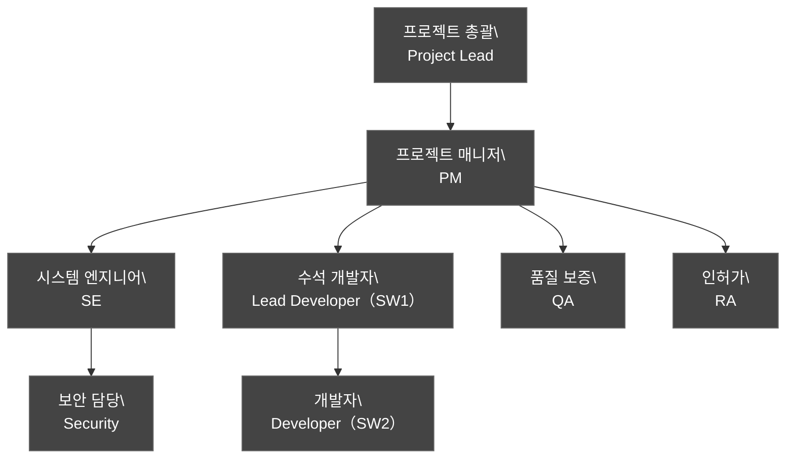
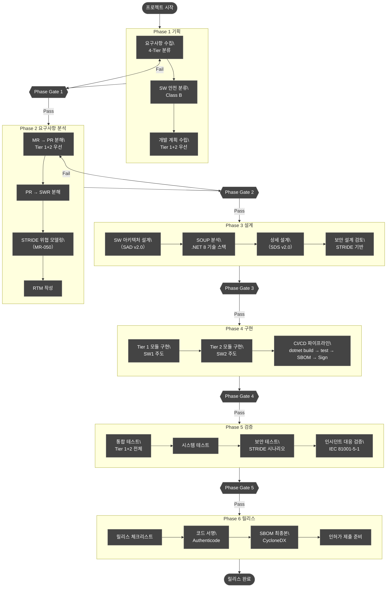
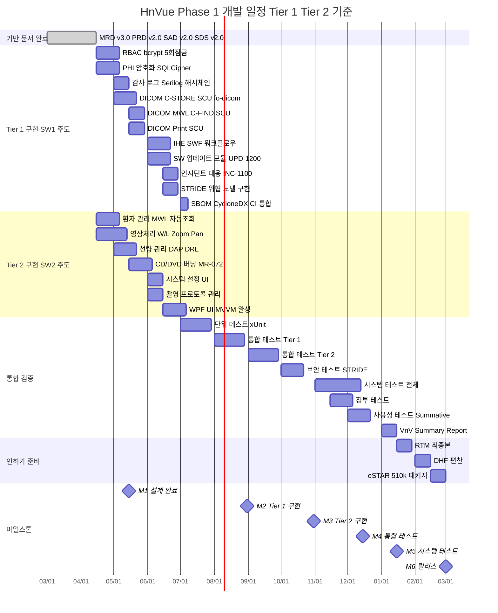
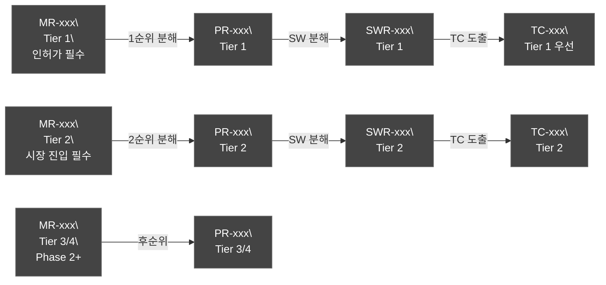
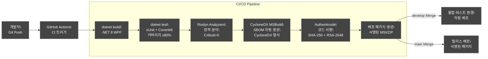
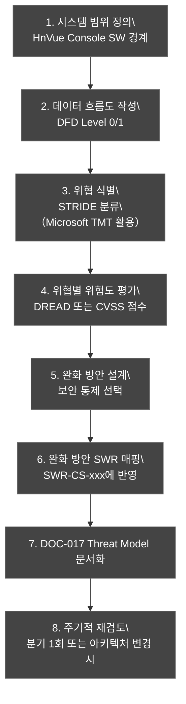
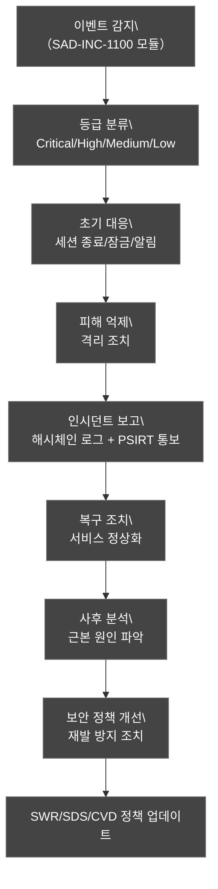

# SW 개발 업무 절차서 (Software Development Procedure, SDP)

| 항목 | 내용 |
|------|------|
| **문서 ID** | DOC-003a (SDP-RC-001) |
| **문서 제목** | HnVue Console SW 개발 업무 절차서 |
| **버전** | v2.0 |
| **작성일** | 2026-04-03 |
| **작성자** | SW 개발팀 |
| **검토자** | QA 팀장, RA 팀장, SE 팀장 |
| **승인자** | 개발본부장 |
| **상태** | Draft |
| **기준 규격** | IEC 62304:2006+AMD1:2015, ISO 14971:2019, ISO 13485:2016, IEC 81001-5-1:2021 |
| **IEC 62304 적용** | §5.1 Software Development Planning (SDP) |
| **보안 등급** | 사내 기밀 (Confidential) |

---

## 개정 이력 (Revision History)

| 버전 | 날짜 | 변경 내용 | 변경자 | 승인자 |
|------|------|-----------|--------|--------|
| v0.1 | 2026-01-10 | 초안 작성 | SW개발팀 | — |
| v0.5 | 2026-02-14 | 내부 검토 반영 | SW개발팀 | QA팀장 |
| v1.0 | 2026-03-16 | 최초 공식 릴리스 | SW개발팀 | 개발본부장 |
| v1.1 | 2026-03-31 | 교차 검증 보완, 문서 ID DOC-003a 병기, 마일스톤 섹션 추가 | SW개발팀 | — |
| v2.0 | 2026-04-03 | 4-Tier 체계 반영 (P1–P4 제거); Phase 1 마일스톤 Tier 1+2 기준 구체화; 도구 체인 확정 (WPF .NET 8, fo-dicom 5.x, SQLCipher, Serilog, xUnit, CycloneDX); CI/CD 파이프라인 dotnet build → test → CycloneDX SBOM → Code Signing 정의; STRIDE 위협 모델링 프로세스 추가; 인시던트 대응 프로세스 (IEC 81001-5-1) 추가; 참조 문서 버전 업데이트 (MRD v3.0, PRD v2.0, FRS v2.0, SRS v2.0, SAD v2.0, SDS v2.0) | SW개발팀 | — |

---

## 목차

1. [목적 (Purpose)](#1-목적)
2. [적용범위 (Scope)](#2-적용범위)
3. [참조 문서 (References)](#3-참조-문서)
4. [조직 및 역할 정의 (Organization and Roles)](#4-조직-및-역할-정의)
5. [SW 개발 프로세스 흐름 (Development Process Flow)](#5-sw-개발-프로세스-흐름)
6. [마일스톤 기반 개발 일정표 (Tier 1+2 기준)](#6-마일스톤-기반-개발-일정표)
7. [요구사항 분석 절차](#7-요구사항-분석-절차)
8. [아키텍처 및 상세 설계 절차](#8-아키텍처-및-상세-설계-절차)
9. [구현 절차 — 도구 체인 및 CI/CD](#9-구현-절차--도구-체인-및-cicd)
10. [검증 절차 (Verification Procedure)](#10-검증-절차)
11. [밸리데이션 절차 (Validation Procedure)](#11-밸리데이션-절차)
12. [위험 관리 연계 절차](#12-위험-관리-연계-절차)
13. [사이버보안 절차 — STRIDE 위협 모델링](#13-사이버보안-절차--stride-위협-모델링)
14. [인시던트 대응 프로세스 (IEC 81001-5-1)](#14-인시던트-대응-프로세스)
15. [릴리스 관리 절차](#15-릴리스-관리-절차)
16. [변경 관리 절차](#16-변경-관리-절차)
17. [문서 관리 절차](#17-문서-관리-절차)
- [부록 A. RACI 매트릭스](#부록-a-raci-매트릭스)
- [부록 B. Phase Gate 체크리스트](#부록-b-phase-gate-체크리스트)
- [부록 C. 약어 정의](#부록-c-약어-정의)

---

## 1. 목적 (Purpose)

### 1.1 문서 목적

본 절차서는 HnVue Console SW 개발 프로젝트에서 수행하는 모든 소프트웨어 개발 활동의 표준 절차를 정의한다.

v2.0에서 추가된 핵심 목적:
1. **4-Tier 우선순위 체계** 기반 Phase 1 개발 활동 계획 (Tier 1 + Tier 2 완전 구현)
2. **확정 기술 스택** (WPF .NET 8, fo-dicom 5.x, SQLCipher, Serilog, xUnit, CycloneDX) 기반 구현 절차
3. **CI/CD 파이프라인** 정의: `dotnet build → test → CycloneDX SBOM → Code Signing`
4. **STRIDE 위협 모델링 프로세스** 수립 (MR-050, FDA 524B)
5. **인시던트 대응 프로세스** 수립 (MR-037, IEC 81001-5-1 §8.11)

### 1.2 IEC 62304 §5.1 적합성 선언

| IEC 62304 §5.1 요구사항 | 본 문서 적용 절 |
|-------------------------|----------------|
| §5.1.1 SW 개발 계획 수립 | §5, §6 |
| §5.1.2 위험 관리 계획 참조 | §12 |
| §5.1.3 검증 계획 | §10 |
| §5.1.4 형상 관리 계획 | §9.1 |
| §5.1.5 문서 관리 계획 | §17 |
| §5.1.6 SOUP 관리 | §8.4 |
| §5.1.7 사이버보안 계획 | §13 |
| §5.1.8 프로세스 표준 | 전체 |

---

## 2. 적용범위 (Scope)

### 2.1 적용 제품

| 항목 | 내용 |
|------|------|
| **제품명** | HnVue Console SW |
| **용도** | 의료용 진단 X-Ray 촬영장치의 콘솔 소프트웨어 |
| **SW Safety Class** | Class B (IEC 62304) |
| **운영체제** | Windows 10/11 LTSC (64-bit) |
| **기술 스택** | WPF .NET 8 + fo-dicom 5.x + SQLCipher + Serilog + xUnit |
| **개발 인원** | SW 2명 |

### 2.2 4-Tier 우선순위 체계

v2.0부터 P1–P4 분류를 폐기하고 4-Tier 체계를 전면 적용한다.

| Tier | 의미 | Phase 배정 |
|------|------|-----------|
| **Tier 1** | 없으면 인허가 불가 | Phase 1 필수 완전 구현 |
| **Tier 2** | 없으면 팔 수 없다 | Phase 1 필수 완전 구현 |
| **Tier 3** | 있으면 좋고 | Phase 2+ |
| **Tier 4** | 비현실적/과도 | Phase 3+ 또는 영구 보류 |

### 2.3 적용 규격

| 규격 | 버전 | 적용 영역 |
|------|------|----------|
| IEC 62304 | 2006+AMD1:2015 | SW 수명주기 |
| IEC 62366-1 | 2015+AMD1:2020 | 사용성 엔지니어링 |
| IEC 81001-5-1 | 2021 | 인시던트 대응 |
| ISO 14971 | 2019 | 위험 관리 |
| ISO 13485 | 2016 | 품질 관리 |
| FDA 21 CFR Part 820.30 | 현행 | 설계 관리 |
| FDA Section 524B | 현행 | 사이버보안 |

---

## 3. 참조 문서 (References)

### 3.1 내부 문서 (현행 버전)

| 번호 | 문서 ID | 문서명 | 버전 |
|------|---------|--------|:---:|
| [INT-01] | MRD-XRAY-GUI-001 | Market Requirements Document | **v3.0** |
| [INT-02] | PRD-XRAY-GUI-001 | Product Requirements Document | **v2.0** |
| [INT-03] | FRS-XRAY-GUI-001 | Functional Requirements Specification | **v2.0** |
| [INT-04] | SRS-XRAY-GUI-001 | Software Requirements Specification | **v2.0** |
| [INT-05] | SAD-XRAY-GUI-001 | Software Architecture Design | **v2.0** |
| [INT-06] | SDS-XRAY-GUI-001 | Software Design Specification | **v2.0** |
| [INT-07] | DMP-XRAY-GUI-001 | Document Master Plan | **v2.0** |
| [INT-08] | WBS-XRAY-GUI-001 | Work Breakdown Structure | **v2.0** |
| [INT-09] | RMP-XRAY-GUI-001 | Risk Management Plan | v1.0 |
| [INT-10] | DOC-001a | MR 상세 설명서 Part 1 — Tier 1 | v1.0 |
| [INT-11] | DOC-001b | MR 상세 설명서 Part 2 — Tier 2/3/4 | v1.0 |

---

## 4. 조직 및 역할 정의

### 4.1 프로젝트 조직도 (SW 2명 체계)



> **2명 체계 주의:** SW 개발자는 Lead Developer (SW1)와 Developer (SW2) 2명이다. Tier 3/4 기능은 2명 조직의 현실적 용량을 감안하여 Phase 2+로 이관되었다.

### 4.2 역할별 책임

| 역할 | 주요 책임 |
|------|----------|
| **Lead Developer (SW1)** | 아키텍처 결정, 코드 리뷰 승인, CI/CD 파이프라인, Tier 1 모듈 구현 |
| **Developer (SW2)** | Tier 2 모듈 구현, 단위 테스트 작성, 정적 분석 |
| **SE** | 요구사항 분석, STRIDE 위협 모델링, SOUP 평가 |
| **QA** | 테스트 계획, 통합/시스템 테스트, 결함 관리 |
| **RA** | 규제 요구사항 해석, DHF 검토, 인허가 제출 |
| **Security** | 위협 모델링, 보안 설계 검토, 인시던트 대응 |

---

## 5. SW 개발 프로세스 흐름

### 5.1 전체 개발 수명주기 흐름도



---

## 6. 마일스톤 기반 개발 일정표 (Tier 1+2 기준)

### 6.1 Phase 1 마일스톤 (Tier 1+2 기준, SW 2명)

| 마일스톤 ID | 명칭 | 목표 일자 | Tier 1 완료 기준 | Tier 2 완료 기준 |
|------------|------|----------|-----------------|-----------------|
| **M1** | 설계 완료 | 2026-05-15 | Tier 1 SWR 전체 SAD/SDS 반영 | Tier 2 SWR 전체 SAD/SDS 반영 |
| **M2** | Tier 1 구현 | 2026-08-31 | MR-019/020/033/034/035/036/037/039/050/051 구현 완료 | — |
| **M3** | Tier 2 구현 | 2026-10-31 | — | MR-001/002/003–013/072 구현 완료 |
| **M4** | 통합 테스트 | 2026-12-15 | Tier 1 IT 전체 통과 | Tier 2 IT 전체 통과 |
| **M5** | 시스템 테스트 | 2027-01-15 | Tier 1 ST 전체 통과 | Tier 2 ST 전체 통과 |
| **M6** | 릴리스 | 2027-03-01 | DHF, eSTAR, KFDA 제출 준비 완료 | — |

### 6.2 Phase 1 상세 Gantt (24 – 36 MM 기준, SW 2명)



---

## 7. 요구사항 분석 절차

### 7.1 4-Tier 기반 MR → SWR 분해 절차



**분해 우선순위:**
1. Tier 1 MR 전체 → PR → SWR 완전 분해 (인허가 직결)
2. Tier 2 MR 전체 → PR → SWR 완전 분해 (Phase 1 필수)
3. Tier 3/4 MR → 백로그 등록 (Phase 2+ 계획)

### 7.2 추적성 관리

- **도구:** Jira + Excel RTM 병행 관리
- **sync_docs.py** 스크립트로 자동 검증 (§6.4 참조)
- 추적 방향: 순방향 (MR → TC) + 역방향 (TC → MR)
- 고아 요구사항 Zero 목표

---

## 8. 아키텍처 및 상세 설계 절차

### 8.1 SAD v2.0 작성 절차

**핵심 변경 (v2.0):**
1. Tier 1+2 MR을 SAD 모듈에 명시적 매핑
2. 신규 모듈 3개 추가: CDDVDBurning (MR-072), IncidentResponse (MR-037), SWUpdate (MR-039)
3. 기술 스택 확정: WPF .NET 8 + fo-dicom 5.x + SQLCipher + Serilog

### 8.2 SOUP 분석 절차 (v2.0 확정 목록)

| SOUP ID | 이름 | 버전 | 용도 | Safety Class |
|---------|------|------|------|:---:|
| SOUP-001 | WPF / .NET 8 | 8.0 LTS | GUI, 런타임 | B |
| SOUP-002 | fo-dicom | 5.x | DICOM C-STORE/MWL/Print | B |
| SOUP-003 | SQLCipher | 4.x | AES-256 암호화 SQLite | B |
| SOUP-004 | Serilog | 3.x | 구조화 로깅 + 해시체인 | B |
| SOUP-005 | xUnit | 2.x | 단위 테스트 | A |
| SOUP-006 | CycloneDX MSBuild | 2.x | SBOM 자동 생성 | A |
| SOUP-007 | EF Core | 8.x | ORM | B |
| SOUP-008 | BCrypt.Net | 4.x | 패스워드 해싱 (비용=12) | B |
| SOUP-009 | Windows IMAPI2 | OS 내장 | CD/DVD 굽기 | A |

---

## 9. 구현 절차 — 도구 체인 및 CI/CD

### 9.1 확정 기술 스택 (v2.0)

| 도구 유형 | 도구명 | 버전 | 용도 |
|-----------|--------|------|------|
| **언어/프레임워크** | WPF / .NET 8 | 8.0 LTS | GUI 애플리케이션 |
| **DICOM 라이브러리** | fo-dicom | 5.x | C-STORE, MWL, Print SCU |
| **DB 암호화** | SQLCipher | 4.x | PHI AES-256 암호화 |
| **로깅** | Serilog | 3.x | 감사 로그 + 해시체인 |
| **단위 테스트** | xUnit | 2.x | TDD, 커버리지 ≥80% |
| **SBOM 생성** | CycloneDX MSBuild | 2.x | CI/CD 자동 SBOM |
| **IDE** | Visual Studio | 2022 | C#/.NET 개발 |
| **형상 관리** | Git | 2.x | 버전 관리 |
| **CI/CD** | GitHub Actions | N/A | 자동 빌드/테스트/서명 |
| **정적 분석** | Roslyn Analyzers | SDK 내장 | 코드 품질 |
| **코드 서명** | Authenticode | OS 내장 | SW 업데이트 패키지 서명 |
| **위협 모델링** | Microsoft TMT | 2022 | STRIDE 분석 |

### 9.2 Git 브랜치 전략

| 브랜치 | 목적 | 보호 규칙 | 명명 규칙 |
|--------|------|----------|----------|
| `main` | 릴리스 코드 | PR 필수, 2인 승인, CI 통과 | — |
| `develop` | 통합 개발 | PR 필수, 1인 승인, CI 통과 | — |
| `feature/*` | 기능 개발 | — | `feature/SWR-xxx-description` |
| `bugfix/*` | 결함 수정 | — | `bugfix/BUG-xxx-description` |
| `release/*` | 릴리스 준비 | PR 필수, QA 승인 | `release/vX.Y.Z` |
| `hotfix/*` | 긴급 수정 | PR 필수 | `hotfix/vX.Y.Z-description` |

**커밋 메시지 규칙:**
```
[TYPE] SWR-xxx: 변경 내용 요약

TYPE: feat / fix / refactor / test / docs / chore
예시: [feat] SWR-CS-001: bcrypt 패스워드 해싱 구현 (비용=12)
```

### 9.3 CI/CD 파이프라인 (v2.0 확정)



**파이프라인 단계별 상세:**

| 단계 | 명령 | 성공 기준 | 실패 시 처리 |
|------|------|---------|------------|
| Build | `dotnet build --configuration Release` | 빌드 오류 0건 | PR 블로킹 |
| Test | `dotnet test --collect:"XPlat Code Coverage"` | 커버리지 ≥80%, 테스트 실패 0건 | PR 블로킹 |
| Analyze | Roslyn Analyzers | Critical 결함 0건 | PR 블로킹 |
| SBOM | `dotnet CycloneDX` | SBOM JSON 생성 성공 | 경고 발생 |
| Sign | Authenticode `signtool sign` | 서명 검증 통과 | 릴리스 블로킹 |

### 9.4 코드 리뷰 기준

- PR 설명 포함: 구현된 SWR 번호, 변경 내용, 테스트 결과
- 리뷰어: Lead Developer 필수 + Developer 1인
- 리뷰 기준:
  - Tier 1 요구사항 충족 여부
  - IEC 62304 §5.5.3 코딩 표준 준수
  - 보안 취약점 (OWASP Top 10)
  - 단위 테스트 존재 및 커버리지

---

## 10. 검증 절차 (Verification Procedure)

### 10.1 단위 테스트 (xUnit)

**커버리지 목표:**

| 모듈 유형 | Line Coverage | Branch Coverage |
|----------|:---:|:---:|
| Safety-Critical (Tier 1) | ≥85% | ≥80% |
| Tier 2 | ≥80% | ≥75% |
| UI 코드 | ≥60% | — |

**Tier 1 필수 단위 테스트:**
- SecurityModule: bcrypt 해싱, 5회 잠금, RBAC 전체 역할
- DICOMCommunication: fo-dicom C-STORE, MWL C-FIND, Print SCU
- SWUpdate: 코드 서명 검증, 해시 검증, 롤백 시나리오
- IncidentResponse: Critical/High/Medium/Low 등급 분류
- AuditService: HMAC-SHA256 해시체인 생성 및 검증

### 10.2 통합 테스트 (Tier 1+2 기준)

| 테스트 영역 | Tier 1 시나리오 | Tier 2 시나리오 |
|-----------|---------------|---------------|
| DICOM | C-STORE 전송 성공/실패/재시도 | MWL 자동조회, Print SCU |
| 보안 | bcrypt 로그인, 5회 잠금, RBAC | 자동 잠금 15분 |
| 워크플로우 | IHE SWF 전체 흐름 | Generator + FPD SDK |
| CD 굽기 | — | MR-072 IMAPI2 테스트 |
| SW 업데이트 | 서명 검증, 롤백 테스트 | — |
| 인시던트 | Critical 이벤트 자동 대응 | — |

---

## 11. 밸리데이션 절차 (Validation Procedure)

### 11.1 사용성 테스트 (IEC 62366)

- **Formative Evaluation:** 설계 초기 Prototype 기반 사용성 평가
- **Summative Evaluation:** 최종 제품 기반 방사선사 10명 이상 참여
- **Critical Task:** 촬영 워크플로우 (Tier 1+2 전체), CD 굽기 (MR-072)

### 11.2 성능 테스트

| 항목 | 요구사항 | 측정 방법 |
|------|---------|----------|
| PACS 전송 시간 | ≤30초 (MR-002) | 영상 수신 → C-STORE 완료 시간 측정 |
| UI 응답 시간 | ≤200ms | 버튼 클릭 → 화면 반응 측정 |
| 로그인 시간 | ≤3초 (bcrypt 포함) | 로그인 버튼 → 메인 화면 시간 측정 |

---

## 12. 위험 관리 연계 절차

### 12.1 FMEA 연계

- IEC 62304 §5.3.6에 따라 Safety-Critical 모듈 식별 후 FMEA 수행
- Tier 1 MR의 모든 HAZ-xxx에 RC-xxx 연결, SWR-xxx에 반영
- 4-Tier 체계에서 Tier 1 기능의 위험 통제가 최우선

### 12.2 잔여 위험 평가

- V&V 완료 후 잔여 위험 수용 가능성 평가 (ISO 14971 §9)
- Tier 1 기능의 Critical 결함 0건이 Phase Gate 통과 기준

---

## 13. 사이버보안 절차 — STRIDE 위협 모델링

### 13.1 STRIDE 위협 모델링 프로세스 (MR-050)



### 13.2 STRIDE 위협별 HnVue 보안 통제

| STRIDE | 위협 | 보안 통제 | SWR |
|--------|------|----------|-----|
| **S** Spoofing | 공격자 관리자 위장 | bcrypt + 5회 잠금 + LDAP MFA | SWR-CS-001 |
| **T** Tampering | DICOM 영상 위변조 | TLS 1.3 + 감사 로그 해시체인 | SWR-CS-051 |
| **R** Repudiation | 촬영 행위 부인 | Serilog HMAC-SHA256 해시체인 | SWR-CS-035 |
| **I** Info Disclosure | PHI 탈취 | SQLCipher AES-256 + TLS 1.3 | SWR-CS-031 |
| **D** Denial of Service | DICOM 네트워크 폭주 | 연결 타임아웃 + 재시도 제한 | SWR-DC-030 |
| **E** Elevation of Privilege | 일반→관리자 권한 탈취 | RBAC + JWT 토큰 검증 | SWR-CS-015 |

### 13.3 사이버보안 테스트 계획

| 테스트 유형 | 대상 | 도구 | 빈도 |
|-----------|------|------|------|
| 침투 테스트 | HnVue 전체 | Burp Suite, Metasploit | 릴리스 전 1회 |
| 취약점 스캔 | SOUP 전체 | OWASP Dependency Check | 주 1회 (CI 자동) |
| 코드 보안 검토 | 보안 모듈 | Roslyn + 수동 검토 | PR마다 |
| SBOM 검증 | NuGet 패키지 전체 | CycloneDX | CI 자동 |
| CVE 모니터링 | SBOM 기반 | NVD API | 주 1회 자동 |

---

## 14. 인시던트 대응 프로세스 (IEC 81001-5-1)

### 14.1 IEC 81001-5-1 §8.11 기반 프로세스

HnVue는 IEC 81001-5-1:2021 §8.11 "Incident Management" 요구사항을 충족하기 위한 인시던트 대응 프로세스를 운영한다.



### 14.2 인시던트 등급별 대응 절차

| 등급 | 기준 | 초기 대응 시간 | 주요 조치 |
|------|------|:---:|----------|
| **Critical** | SW 위변조, 무단 관리자 접근 | 즉시 | 세션 즉시 종료, 시스템 잠금, 관리자 팝업, PSIRT 보고 |
| **High** | 5회 로그인 실패 반복, 비정상 DICOM 트래픽 | 5분 이내 | 계정 잠금, 보안 경보, 관리자 알림 |
| **Medium** | CVE 탐지 (CVSS ≥7), 비정상 파일 접근 | 1시간 이내 | 감사 로그 기록, 관리자 통보 |
| **Low** | 일반 오류, 단순 실패 | 다음 근무일 | 감사 로그 기록만 |

### 14.3 CVD (Coordinated Vulnerability Disclosure) 정책

1. **제보 접수:** 보안 취약점 제보 채널 (PSIRT 이메일) 운영
2. **분석 및 검증:** 제보 접수 후 10 영업일 이내 초기 분석
3. **패치 개발:** Critical/High는 90일 이내 패치 제공 (FDA 524B 준수)
4. **공개:** 패치 배포 후 제보자와 협력하여 취약점 공개
5. **SBOM 업데이트:** 영향받는 구성요소 SBOM 갱신 및 재배포

### 14.4 PSIRT 연락처 및 보고 채널

| 채널 | 대상 | 내용 |
|------|------|------|
| 내부 PSIRT 이메일 | Critical/High 인시던트 | 인시던트 레코드 전송 |
| 시스템 팝업 | 현장 관리자 | 즉시 대응 요구 |
| 감사 로그 | 해시체인 보호 | 모든 등급 기록 |
| 규제기관 보고 | FDA/KFDA | Critical 시 30일 이내 |

---

## 15. 릴리스 관리 절차

### 15.1 릴리스 빌드 절차

```
1. dotnet build --configuration Release
2. dotnet test (커버리지 ≥80% 확인)
3. CycloneDX SBOM 생성 (CycloneDX 형식)
4. Authenticode 코드 서명 (signtool sign /sha1 <thumbprint>)
5. 서명 검증 (signtool verify /pa /v)
6. 배포 패키지 생성 (Installer + SBOM 번들)
7. 릴리스 노트 작성 (변경 사항, SWR 매핑)
```

### 15.2 릴리스 버전 체계

```
MAJOR.MINOR.PATCH.BUILD
예: 1.0.0.2350
  MAJOR: 대형 아키텍처 변경 (Tier 전환 포함)
  MINOR: Tier 1/2 기능 추가
  PATCH: 버그 수정, 보안 패치
  BUILD: CI 자동 빌드 번호
```

---

## 16. 변경 관리 절차

### 16.1 변경 분류

| 변경 유형 | 기준 | 승인 절차 |
|----------|------|----------|
| Minor | 문서 수정, 명확화, 기능 범위 불변 | SE + QA 승인 |
| Major | 기능 추가/삭제, 아키텍처 변경, Tier 재분류 | CCB 회의 |
| Emergency | 안전/보안 결함 즉시 수정 | Lead Developer 즉시, 사후 CCB 보고 |

### 16.2 Tier 변경 통제

Tier 분류 변경 (예: Tier 3 → Tier 2 격상)은 반드시 CCB 승인 후 MRD/PRD/WBS 동시 개정이 필요하다. sync_docs.py를 활용하여 변경 영향 범위를 자동으로 탐지한다.

---

## 17. 문서 관리 절차

### 17.1 문서 버전 관리

- **형상 관리 도구:** Git (docs/ 하위 모든 문서)
- **버전 체계:** vMAJOR.MINOR (예: v2.0)
- **개정 이력:** 각 문서 상단 개정 이력 테이블 필수 기재
- **정합성 검사:** sync_docs.py로 문서 간 버전 참조 자동 검증

### 17.2 문서 개정 절차

```
1. 변경 필요 식별 (요구사항 변경, 규격 변경, 결함 등)
2. 영향 분석 (sync_docs.py --trace-mr 활용)
3. 초안 작성 (담당자)
4. 검토 (SE + QA, 필요 시 RA)
5. 승인 (개발본부장 또는 위임된 리드)
6. Git 커밋 (브랜치 → PR → 머지)
7. 정합성 재확인 (sync_docs.py --check-all)
```

---

## 부록 A. RACI 매트릭스

| 활동 | PM | SE | Lead Dev | Dev | QA | RA | Security |
|------|:---:|:---:|:---:|:---:|:---:|:---:|:---:|
| 4-Tier 분류 | A | R | C | C | C | C | C |
| 요구사항 분석 | A | R | C | C | C | C | C |
| STRIDE 위협 모델링 | I | A | C | C | C | C | R |
| 아키텍처 설계 (SAD v2.0) | I | A | R | C | C | C | C |
| 상세 설계 (SDS v2.0) | I | C | A | R | C | I | C |
| Tier 1 구현 | I | C | A | C | I | I | C |
| Tier 2 구현 | I | C | C | A | I | I | C |
| CI/CD 파이프라인 | I | C | A | R | C | I | C |
| 인시던트 대응 모듈 | I | C | C | R | I | I | A |
| SW 업데이트 모듈 | I | C | A | R | C | I | C |
| 코드 서명 | I | C | A | C | C | I | R |
| SBOM 생성 | I | C | A | R | C | I | C |
| 보안 테스트 | I | C | C | C | C | I | A/R |
| 인시던트 대응 훈련 | I | C | C | C | I | I | A/R |
| 릴리스 승인 | A | C | C | I | R | R | C |

---

## 부록 B. Phase Gate 체크리스트

### PG-2 (요구사항 검토) — v2.0 추가 항목

- [ ] Tier 1 MR 전체 → SWR 완전 추적성 확인
- [ ] MR-072 CD Burning → SWR-WF-032–034 연결 확인
- [ ] MR-037 인시던트 대응 → SWR-CS-086–087 연결 확인
- [ ] MR-039 SW 업데이트 → SWR-SA-076–077, SWR-CS-084–085 연결 확인
- [ ] MR-050 STRIDE → SWR-NF-RG-060 연결 확인
- [ ] P1–P4 잔존 여부 검사 (sync_docs.py --check-tier 통과)

### PG-3 (설계 검토) — v2.0 추가 항목

- [ ] SAD-CD-1000 CDDVDBurning 설계 완성 및 IMAPI2 인터페이스 명시
- [ ] SAD-INC-1100 IncidentResponse 설계 완성 및 IEC 81001-5-1 §8.11 매핑
- [ ] SAD-UPD-1200 SWUpdate 설계 완성 및 Authenticode + 롤백 흐름 명시
- [ ] STRIDE 위협 모델 → 보안 통제 설계 반영 확인
- [ ] fo-dicom 5.x C-STORE/MWL/Print SCU 설계 상세화

### PG-4 (구현 완료) — v2.0 추가 항목

- [ ] dotnet build 성공 (릴리스 빌드)
- [ ] xUnit 테스트 통과, 커버리지 ≥80%
- [ ] Roslyn Analyzers Critical 결함 0건
- [ ] CycloneDX SBOM 생성 완료
- [ ] Authenticode 코드 서명 검증 통과
- [ ] 인시던트 대응 모듈 (SAD-INC-1100) 단위 테스트 통과
- [ ] SW 업데이트 모듈 (SAD-UPD-1200) 롤백 시나리오 테스트 통과

---

## 부록 C. 약어 정의

| 약어 | 풀 네임 |
|------|---------|
| SDP | Software Development Procedure (소프트웨어 개발 업무 절차서) |
| Tier 1 | 없으면 인허가 불가 (MRD v3.0 기준) |
| Tier 2 | 없으면 팔 수 없다 (시장 진입 필수) |
| STRIDE | Spoofing/Tampering/Repudiation/Information Disclosure/DoS/Elevation of Privilege |
| IEC 81001-5-1 | Health SW Security — 인시던트 대응 규격 (2021) |
| CVD | Coordinated Vulnerability Disclosure |
| PSIRT | Product Security Incident Response Team |
| SBOM | Software Bill of Materials |
| CycloneDX | SBOM 표준 형식 (OWASP) |
| fo-dicom | .NET DICOM 라이브러리 (v5.x) |
| SQLCipher | AES-256 암호화 SQLite 확장 |
| Serilog | .NET 구조화 로깅 라이브러리 |
| xUnit | .NET 단위 테스트 프레임워크 |
| Authenticode | Microsoft 코드 서명 표준 |
| IMAPI2 | Image Mastering API v2 (Windows CD/DVD 굽기 API) |
| CI/CD | Continuous Integration/Continuous Deployment |
| RACI | Responsible/Accountable/Consulted/Informed |
| CCB | Change Control Board (변경 통제 위원회) |
