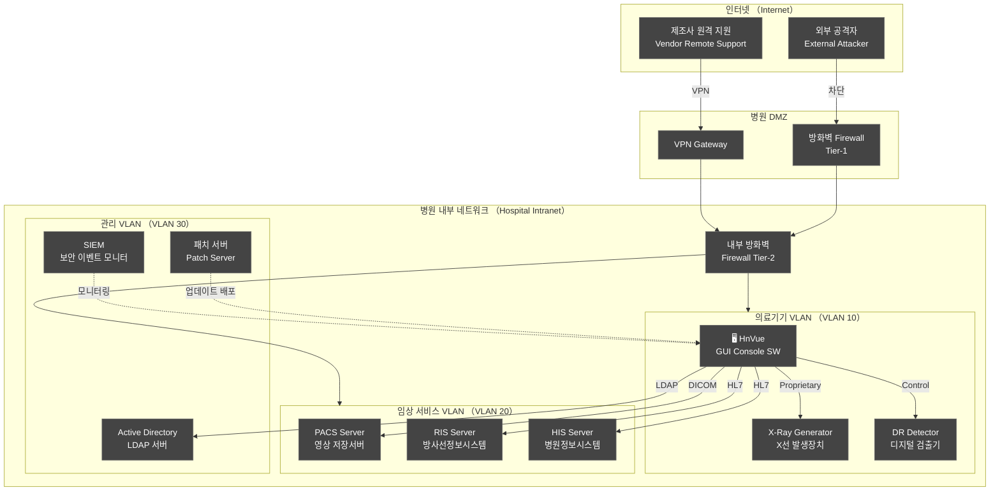
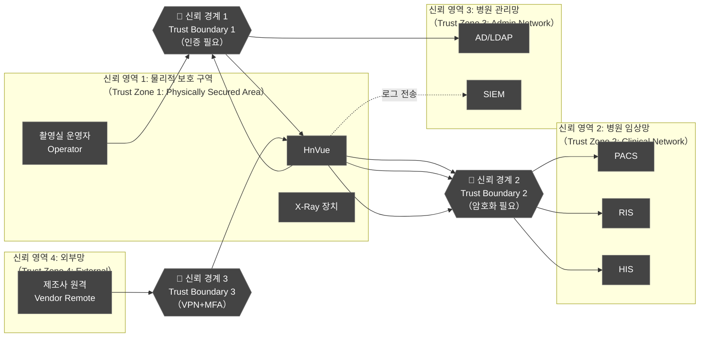
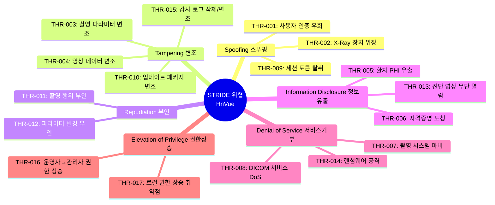
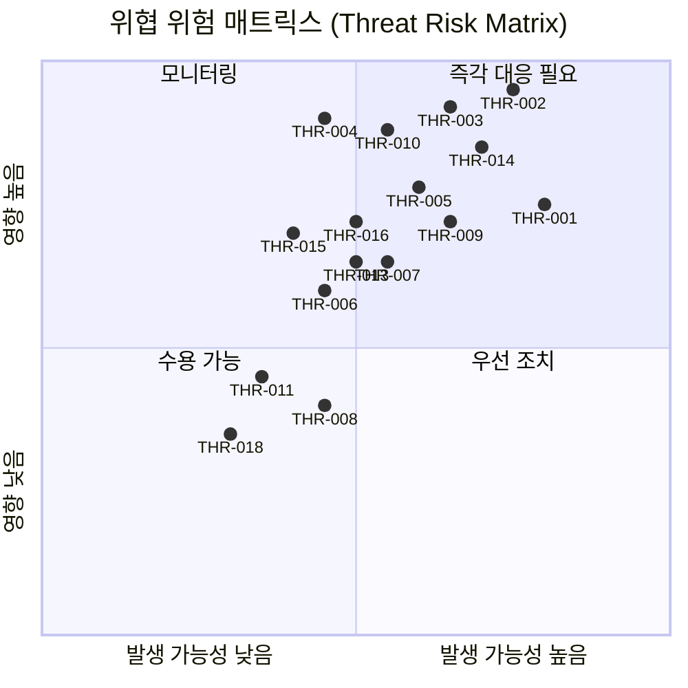
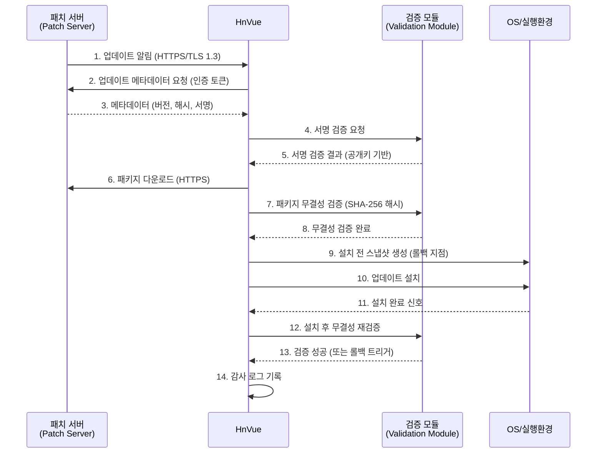
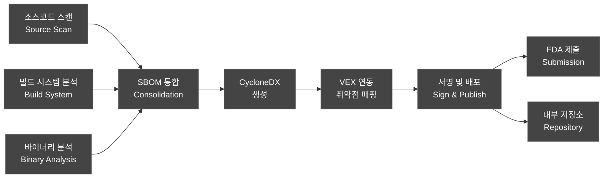
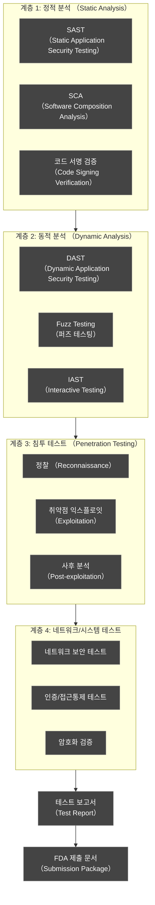
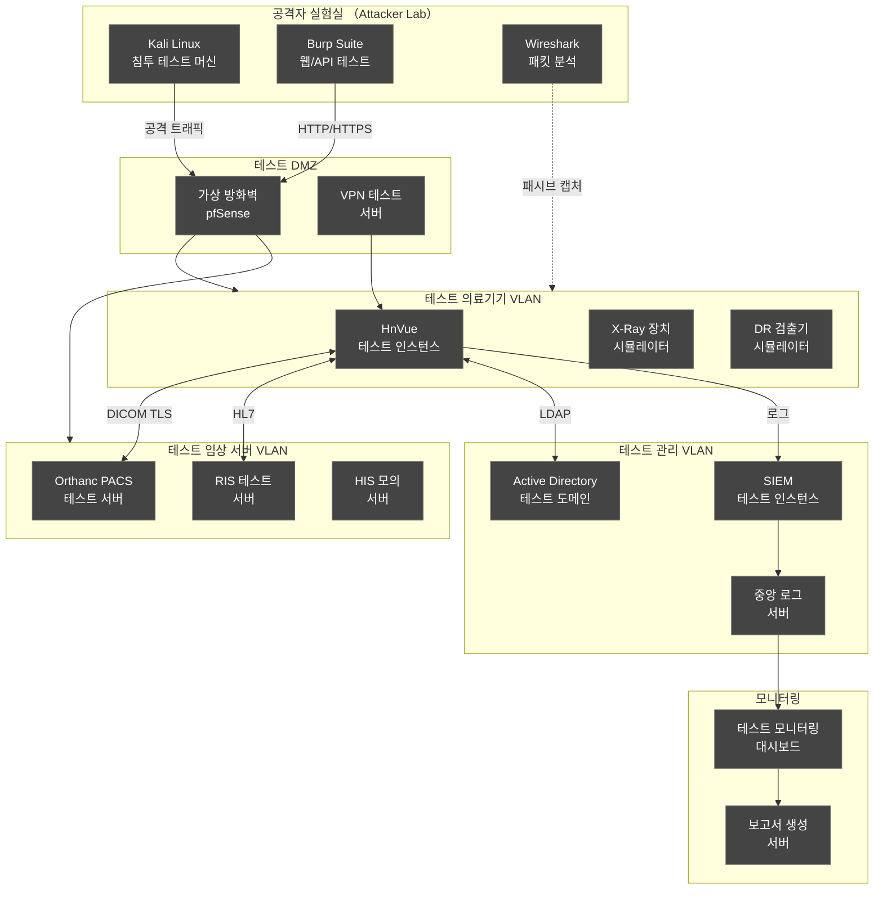
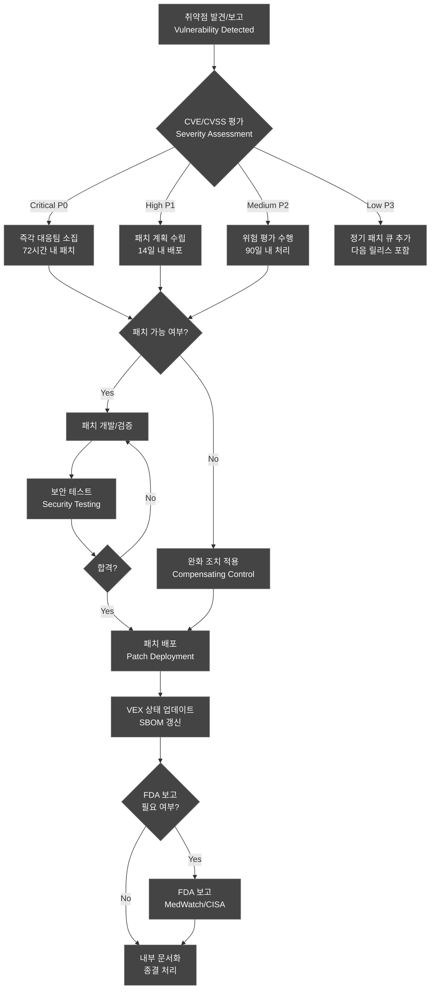
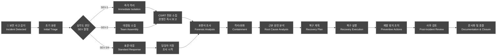

# 사이버보안 관리 계획서 (Cybersecurity Management Plan)

---

## 문서 메타데이터 (Document Metadata)

| 항목 | 내용 |
|------|------|
| **문서 ID** | CMP-XRAY-GUI-001 |
| **문서명** | HnVue GUI Console SW 사이버보안 관리 계획서 |
| **버전** | v1.0 |
| **작성일** | 2026-03-16 |
| **작성자** | 사이버보안 팀 (Cybersecurity Team) |
| **검토자** | QA 팀장, SW 아키텍트 |
| **승인자** | 의료기기 RA/QA 책임자 |
| **상태** | 승인됨 (Approved) |
| **기준 규격** | FDA Section 524B, FDA Premarket Cybersecurity Guidance (2023), NIST CSF, IEC 81001-5-1, AAMI TIR57 |

### 개정 이력 (Revision History)

| 버전 | 날짜 | 변경 내용 | 작성자 |
|------|------|----------|--------|
| v1.0 | 2026-03-16 | 최초 작성 — FDA Section 524B 요구사항 기반 초안 | 사이버보안 팀 |

---

## 1. 목적 및 범위 (Purpose and Scope)

### 1.1 목적 (Purpose)

본 문서는 HnVue GUI Console SW(이하 "제품")에 대한 사이버보안 관리 계획(Cybersecurity Management Plan, CMP)을 수립함으로써 다음 목적을 달성하기 위해 작성되었다.

1. **FDA Section 524B (Omnibus 법안, 2022) 준수**: 의료기기 사이버보안 요구사항 충족을 위한 체계적 관리 계획 문서화
2. **FDA Premarket Cybersecurity Guidance (2023) 적용**: SBOM 제출, 취약점 공개 정책(VDP), 지속적 사이버보안 모니터링 이행
3. **환자 안전 보호**: 사이버 공격으로 인한 방사선 피폭 오류, 진단 오류 등 환자 위해(Patient Harm) 예방
4. **운영 연속성 확보**: 방사선 촬영 워크플로우의 가용성(Availability) 및 무결성(Integrity) 보장
5. **규제 제출 근거 마련**: 510(k) 제출 시 사이버보안 문서 패키지 구성

### 1.2 범위 (Scope)

본 계획의 적용 범위는 아래와 같다.

**대상 제품**:
- HnVue GUI Console SW v1.x (IEC 62304 Class B)
- 운영 플랫폼: Windows 10/11 IoT Enterprise (의료기기 전용)
- 연결 인터페이스: DICOM (PACS/RIS), HL7 (HIS), X-Ray Generator Control, LDAP/AD

**범위 내 (In Scope)**:
- GUI 애플리케이션 소프트웨어 및 임베디드 구성요소
- 병원 내부 네트워크(Intranet) 연결 인터페이스
- 제3자 라이브러리 및 오픈소스 구성요소 (SBOM 관리)
- 소프트웨어 업데이트 메커니즘

**범위 외 (Out of Scope)**:
- 병원 IT 인프라 보안 (방화벽, 네트워크 장비)
- X-Ray 발생장치 하드웨어 자체 보안
- Phase 2 클라우드(AI/Cloud) 기능 (별도 CMP 수립 예정)

### 1.3 Cyber Device 분류 근거 (Cyber Device Classification Rationale)

FDA Section 524B에 따르면 아래 조건을 충족하는 의료기기는 "Cyber Device"로 분류된다:

> *"a device that includes software validated, installed, or authorized by the sponsor as a device or in a device; or a device that has the ability to connect to the internet"*

HnVue은 다음 근거에 의해 Cyber Device로 분류된다:

| 분류 기준 | 해당 여부 | 근거 |
|----------|---------|------|
| 인터넷 연결 가능성 | ✅ 해당 | 병원 네트워크를 통한 PACS/RIS 서버 연결 |
| 소프트웨어 포함 | ✅ 해당 | GUI Console SW 자체가 의료기기 소프트웨어 (SaMD) |
| 네트워크 연결 | ✅ 해당 | DICOM Network, HL7 인터페이스 |
| 원격 접속 가능성 | ✅ 해당 | VPN 기반 원격 서비스 지원 |

따라서 본 제품은 FDA Section 524B §3544B(a)(1)에 따른 Cyber Device로서 사이버보안 계획서 제출 의무가 있다.

---

## 2. 참조 규격 (Referenced Standards and Guidance)

| 규격/지침 | 제목 | 적용 섹션 |
|----------|------|----------|
| **FDA Section 524B** | Ensuring Cybersecurity of Medical Devices (FD&C Act §3544B) | 전체 |
| **FDA Premarket Cybersecurity Guidance (2023)** | Cybersecurity in Medical Devices: Quality System Considerations and Content of Premarket Submissions | SBOM, 위협 모델링, VDP |
| **NIST Cybersecurity Framework (CSF) 2.0** | NIST CSF — Identify, Protect, Detect, Respond, Recover | 보안 통제 매핑 |
| **NIST SP 800-30 r1** | Guide for Conducting Risk Assessments | 위험 평가 방법론 |
| **NIST SP 800-53 r5** | Security and Privacy Controls for Information Systems | 보안 통제 선택 |
| **IEC 81001-5-1:2021** | Health Software — Cybersecurity for Network-Connected Devices | 제품 보안 요구사항 |
| **AAMI TIR57:2016** | Principles for Medical Device Security — Risk Management | 의료기기 사이버보안 위험 관리 |
| **IEC 62443-4-2** | Security for Industrial Automation — Component Security Level | 컴포넌트 보안 수준 |
| **MITRE ATT&CK for ICS** | Adversarial Tactics, Techniques & Common Knowledge | 공격 기법 분류 |
| **ISO/IEC 29147:2018** | Information Technology — Vulnerability Disclosure | 취약점 공개 정책 |
| **ISO/IEC 30111:2019** | Information Technology — Vulnerability Handling Processes | 취약점 처리 절차 |
| **IEC 62304:2006+AMD1:2015** | Medical Device Software — Software Life Cycle Processes | SW 수명주기 연계 |
| **ISO 14971:2019** | Medical Devices — Risk Management | 위험 관리 연계 |

---

## 3. 제품 보안 아키텍처 (Product Security Architecture)

### 3.1 네트워크 토폴로지 (Network Topology)

HnVue은 병원 내부 네트워크(Hospital Intranet)에 배치되며, 인터넷(Internet)과는 직접 연결되지 않는다. 단, 병원 네트워크가 인터넷에 연결될 수 있어 간접적 위협 경로가 존재한다.



### 3.2 보안 경계 (Trust Boundary) 정의

신뢰 경계(Trust Boundary)는 데이터 또는 제어 흐름이 서로 다른 신뢰 수준(Trust Level)의 보안 영역을 교차하는 지점으로 정의된다.



**신뢰 경계별 보안 통제 요약**:

| 신뢰 경계 | 교차 지점 | 적용 통제 |
|----------|----------|---------|
| TB-1 | 운영자 ↔ HnVue | 사용자 인증 (MFA), RBAC, 세션 타임아웃 |
| TB-2 | HnVue ↔ 임상 서버 | TLS 1.2+ 암호화, 서버 인증서 검증, DICOM TLS |
| TB-3 | 외부 원격 ↔ HnVue | VPN 터널, MFA, 접속 로그, 시간 제한 |
| TB-4 | X-Ray 장치 ↔ HnVue | 전용 프로토콜 서명 검증, 물리적 네트워크 분리 |

### 3.3 데이터 흐름도 (Data Flow Diagram, DFD) with 보안 영역

```mermaid
flowchart TD
    classDef default fill:#444,stroke:#666,color:#fff
    subgraph External["외부 엔티티 （External Entities）"]
        OP_USER["운영자/방사선사<br/>（Operator/Radiographer）"]
        ADMIN_USER["시스템 관리자<br/>（System Administrator）"]
        VENDOR_ENG["제조사 엔지니어<br/>（Vendor Engineer）"]
    end

    subgraph RC_Process["HnVue 처리 프로세스"]
        P1["P1: 사용자 인증<br/>（Authentication）"]
        P2["P2: 환자 정보 처리<br/>（Patient Data Processing）"]
        P3["P3: 촬영 파라미터 제어<br/>（Acquisition Control）"]
        P4["P4: 영상 처리/표시<br/>（Image Processing）"]
        P5["P5: 감사 로그 기록<br/>（Audit Logging）"]
        P6["P6: 소프트웨어 업데이트<br/>（SW Update）"]
    end

    subgraph Datastores["데이터 저장소 （Data Stores）"]
        DS1[（"DS1: 로컬 DB<br/>（Local Config DB）"）]
        DS2[（"DS2: 세션 토큰<br/>（Session Store）"）]
        DS3[（"DS3: 감사 로그<br/>（Audit Log - 불변）"）]
        DS4[（"DS4: 임시 영상 캐시<br/>（Image Cache）"）]
    end

    subgraph External_Systems["외부 시스템 （External Systems）"]
        AD_SRV["AD/LDAP 서버"]
        PACS_SRV["PACS 서버"]
        RIS_SRV["RIS 서버"]
        XRAY_DEV["X-Ray 발생장치"]
        PATCH_SRV["패치 서버"]
    end

    OP_USER -->|"자격증명 입력<br/>[암호화 전송]"| P1
    ADMIN_USER -->|"관리자 자격증명<br/>[MFA]"| P1
    VENDOR_ENG -->|"VPN+MFA 인증"| P1

    P1 <-->|"LDAP/SAML<br/>[TLS 1.3]"| AD_SRV
    P1 -->|"세션 토큰 발급<br/>[AES-256 암호화]"| DS2
    DS2 -->|"토큰 검증"| P2
    DS2 -->|"토큰 검증"| P3
    DS2 -->|"토큰 검증"| P4

    P2 <-->|"HL7 v2.x<br/>[TLS 1.2+]"| RIS_SRV
    P2 -->|"환자 정보<br/>[암호화 저장]"| DS1

    P3 -->|"kVp/mAs 파라미터<br/>[서명 검증]"| XRAY_DEV
    XRAY_DEV -->|"촬영 완료 신호"| P3

    P4 <-->|"DICOM<br/>[DICOM TLS]"| PACS_SRV
    P4 -->|"영상 임시 저장<br/>[AES-256]"| DS4

    P1 -->|"이벤트 기록"| P5
    P2 -->|"이벤트 기록"| P5
    P3 -->|"이벤트 기록"| P5
    P4 -->|"이벤트 기록"| P5
    P5 -->|"불변 로그<br/>[서명+암호화]"| DS3

    P6 <-->|"업데이트 패키지<br/>[코드 서명 검증]"| PATCH_SRV
    P6 -->|"업데이트 실행<br/>[무결성 확인]"| DS1

    style TB1 fill:#ff6b6b,color:#fff
    style TB2 fill:#ff6b6b,color:#fff
```

---

## 4. 위협 모델링 (Threat Modeling)

### 4.1 방법론 (Methodology)

본 위협 모델링은 **STRIDE** 방법론을 적용하며, Microsoft Threat Modeling Tool과 AAMI TIR57의 의료기기 특화 접근 방식을 결합한다.

**STRIDE 분류**:
- **S**poofing (스푸핑): 인증된 사용자/장치로 위장
- **T**ampering (변조): 데이터 또는 프로그램 무단 변경
- **R**epudiation (부인): 행위 수행 사실 부인
- **I**nformation Disclosure (정보 유출): 무단 정보 노출
- **D**enial of Service (서비스 거부): 시스템 가용성 저하
- **E**levation of Privilege (권한 상승): 무단 권한 획득

### 4.2 자산 식별 (Asset Identification)

| 자산 ID | 자산명 | 자산 분류 | 보안 속성 | 중요도 |
|--------|-------|----------|---------|------|
| AST-001 | 환자 개인정보 (PHI) | 데이터 | 기밀성, 무결성 | Critical |
| AST-002 | 촬영 파라미터 (kVp/mAs) | 설정 데이터 | 무결성, 가용성 | Critical |
| AST-003 | DICOM 영상 데이터 | 진단 데이터 | 기밀성, 무결성 | Critical |
| AST-004 | 사용자 인증 정보 (자격증명) | 보안 자산 | 기밀성 | High |
| AST-005 | 감사 로그 | 법적 증거 | 무결성, 가용성 | High |
| AST-006 | 소프트웨어 업데이트 패키지 | 실행 코드 | 무결성 | High |
| AST-007 | 시스템 구성 정보 | 설정 | 기밀성, 무결성 | Medium |
| AST-008 | 네트워크 통신 채널 | 인프라 | 무결성, 가용성 | High |
| AST-009 | 세션 토큰 | 보안 자산 | 기밀성 | High |
| AST-010 | 선량 계산 알고리즘 | 임상 로직 | 무결성 | Critical |

### 4.3 STRIDE 위협 분류 차트



### 4.4 위협 목록 (Threat Register)

| THREAT ID | STRIDE 분류 | 위협 설명 | 대상 자산 | 공격 벡터 | 예상 영향 | 초기 심각도 |
|-----------|------------|----------|----------|----------|---------|-----------|
| THR-001 | Spoofing | 사용자 인증 우회 (Authentication Bypass) | AST-004, 시스템 접근 | 무차별 대입(Brute Force), 기본 비밀번호 사용, 자격증명 재사용 | 무단 시스템 접근, 환자 데이터 노출 | **High** |
| THR-002 | Tampering | 촬영 파라미터 변조 (Acquisition Parameter Tampering) | AST-002 (kVp/mAs) | 네트워크 MitM, 메모리 변조, 버퍼 오버플로우 | 환자 과피폭/저피폭, 진단 오류 | **Critical** |
| THR-003 | Tampering | DICOM 영상 데이터 변조 (DICOM Image Tampering) | AST-003 | MitM 공격, DICOM 프로토콜 취약점 악용 | 오진단, 부적절한 치료 결정 | **Critical** |
| THR-004 | Spoofing | X-Ray 장치 위장 공격 (Device Impersonation) | AST-008 | ARP 스푸핑, 악성 장치 네트워크 연결 | 잘못된 제어 명령 전달, 환자 위해 | **Critical** |
| THR-005 | Information Disclosure | 환자 PHI 무단 유출 (PHI Data Breach) | AST-001 | 암호화되지 않은 네트워크 통신, SQL 인젝션 | HIPAA/개인정보 위반, 환자 프라이버시 침해 | **High** |
| THR-006 | Information Disclosure | 자격증명 도청 (Credential Eavesdropping) | AST-004 | 네트워크 패킷 캡처, 평문 전송 프로토콜 | 계정 탈취, 시스템 무단 접근 | **High** |
| THR-007 | Denial of Service | 촬영 시스템 서비스 거부 (Imaging System DoS) | AST-008, 가용성 | 네트워크 플러딩, 프로세스 고갈 공격 | 촬영 불가, 응급 환자 진료 지연 | **High** |
| THR-008 | Denial of Service | DICOM 서비스 거부 공격 (DICOM DoS) | PACS 연결 | 대량 DICOM 요청, 연결 고갈 | 영상 저장 불가, 진단 지연 | **Medium** |
| THR-009 | Spoofing | 세션 토큰 탈취 (Session Hijacking) | AST-009 | XSS, 네트워크 스니핑, 토큰 예측 | 인증된 사용자로 위장, 무단 조작 | **High** |
| THR-010 | Tampering | 소프트웨어 업데이트 변조 (Update Package Tampering) | AST-006 | 공급망 공격(Supply Chain Attack), MitM | 악성 코드 설치, 시스템 완전 장악 | **Critical** |
| THR-011 | Repudiation | 촬영 행위 부인 (Action Repudiation) | AST-005 | 로그 삭제, 타임스탬프 변조 | 의료사고 책임 불명확, 법적 분쟁 | **Medium** |
| THR-012 | Repudiation | 파라미터 변경 부인 (Parameter Change Repudiation) | AST-005 | 감사 로그 미기록, 로그 위변조 | 사고 원인 추적 불가 | **Medium** |
| THR-013 | Information Disclosure | 진단 영상 무단 열람 (Unauthorized Image Access) | AST-003 | 취약한 접근 통제, 직접 파일 시스템 접근 | 환자 프라이버시 침해, 의료법 위반 | **High** |
| THR-014 | Denial of Service | 랜섬웨어 공격 (Ransomware Attack) | 전체 시스템 | 피싱 이메일, 악성 USB, 취약점 익스플로잇 | 시스템 완전 마비, 환자 진료 불가 | **Critical** |
| THR-015 | Tampering | 감사 로그 변조/삭제 (Audit Log Tampering) | AST-005 | 관리자 권한 남용, 직접 파일 접근 | 포렌식 증거 훼손, 사고 원인 불명 | **High** |
| THR-016 | Elevation of Privilege | 운영자 권한 상승 (Privilege Escalation) | 권한 체계 | OS 취약점, 설정 오류, 로컬 익스플로잇 | 관리 기능 무단 접근, 시스템 구성 변경 | **High** |
| THR-017 | Elevation of Privilege | 로컬 권한 상승 취약점 (Local Privilege Escalation) | OS 및 SW | CVE 취약점, 설정 오류 | 루트/관리자 권한 획득 | **High** |
| THR-018 | Information Disclosure | 선량 알고리즘 역공학 (Algorithm Reverse Engineering) | AST-010 | 바이너리 분석, 메모리 덤프 | 지적재산 유출, 알고리즘 위변조 취약점 파악 | **Medium** |

### 4.5 잔류 위험 분류 (Residual Risk Classification)



---

## 5. 보안 통제 조치 (Security Controls)

### 5.1 접근 통제 (Access Control — RBAC)

역할 기반 접근 통제(Role-Based Access Control, RBAC) 정책을 적용하여 최소 권한 원칙(Principle of Least Privilege)을 구현한다.

**역할 정의 (Role Definitions)**:

| 역할 (Role) | 역할 ID | 권한 범위 | 대응 위협 |
|-----------|--------|---------|---------|
| 방사선사 (Radiographer) | ROLE-001 | 환자 조회, 촬영 실행, 영상 확인 | THR-001, THR-016 |
| 방사선사 리더 (Senior Radiographer) | ROLE-002 | ROLE-001 + 촬영 프로토콜 편집 | THR-001, THR-002 |
| 시스템 관리자 (System Admin) | ROLE-003 | 사용자 관리, 시스템 구성, 로그 조회 | THR-015, THR-016 |
| 보안 감사자 (Security Auditor) | ROLE-004 | 감사 로그 읽기 전용 | THR-011, THR-012 |
| 제조사 서비스 엔지니어 (Service Engineer) | ROLE-005 | 진단 기능 (시간 제한, 원격 감독 필요) | THR-004, THR-010 |

**다중 인증 (Multi-Factor Authentication, MFA) 적용 범위**:

| 접근 유형 | MFA 요구 | 인증 방법 |
|---------|--------|---------|
| 로컬 로그인 (일반 운영) | 권고 | 비밀번호 + 스마트카드 |
| 관리자 기능 접근 | 필수 | 비밀번호 + OTP |
| 원격 접근 (VPN) | 필수 | 인증서 + OTP |
| 서비스 엔지니어 접근 | 필수 | VPN + 인증서 + 감독자 승인 |

### 5.2 인증 및 세션 관리 (Authentication and Session Management)

| 통제 항목 | 구현 사항 | 관련 표준 |
|---------|---------|---------|
| 비밀번호 복잡성 | 최소 12자, 대/소문자/숫자/특수문자 포함 | NIST SP 800-63B |
| 계정 잠금 | 5회 연속 실패 시 30분 잠금 | NIST SP 800-63B |
| 세션 타임아웃 | 비활성 15분 후 자동 로그아웃 | IEC 81001-5-1 |
| 동시 세션 제한 | 역할별 최대 1개 활성 세션 | 내부 정책 |
| 세션 토큰 | 128비트 이상 무작위 토큰, HTTPS Only | OWASP ASVS |
| 비밀번호 저장 | bcrypt (cost factor ≥ 12) + salt | NIST SP 800-132 |
| 강제 비밀번호 변경 | 90일 주기, 초기 로그인 시 변경 필수 | ISO 27001 |

### 5.3 데이터 암호화 (Data Encryption)

**저장 데이터 (Data at Rest)**:

| 데이터 유형 | 암호화 알고리즘 | 키 관리 |
|----------|-------------|------|
| 환자 PHI (로컬 DB) | AES-256-GCM | OS 키 저장소 (Windows DPAPI) |
| 영상 캐시 (임시) | AES-256-CBC | 세션 키 (세션 종료 시 삭제) |
| 구성 파일 | AES-256-GCM | 하드웨어 바인딩 키 |
| 감사 로그 | AES-256-GCM + HMAC-SHA256 서명 | 분리된 서명 키 |

**전송 데이터 (Data in Transit)**:

| 통신 채널 | 프로토콜 | 최소 버전 | 인증서 |
|---------|--------|---------|------|
| DICOM 네트워크 | DICOM TLS | TLS 1.2 | 상호 인증 (Mutual TLS) |
| HL7 메시지 | MLLP over TLS | TLS 1.2 | 서버 인증서 |
| LDAP/AD | LDAPS | TLS 1.2 | CA 서명 인증서 |
| 원격 VPN | IPSec/IKEv2 | — | PKI 인증서 |
| 업데이트 다운로드 | HTTPS | TLS 1.3 | 인증서 피닝 (Certificate Pinning) |

### 5.4 감사 추적 (Audit Trail)

감사 로그는 불변성(Immutability)을 보장하며, 법적 증거 능력을 확보한다.

**감사 이벤트 범위**:

| 이벤트 분류 | 기록 항목 |
|----------|---------|
| 인증 이벤트 | 로그인 성공/실패, 로그아웃, 계정 잠금 |
| 환자 데이터 접근 | 조회, 수정, 삭제 (대상 환자 ID 포함) |
| 촬영 파라미터 | 모든 kVp/mAs 설정 변경 (변경 전/후 값 기록) |
| 영상 처리 | PACS 전송, 영상 수정, 출력 |
| 시스템 관리 | 사용자 계정 생성/수정/삭제, 권한 변경 |
| 소프트웨어 업데이트 | 업데이트 설치 시작/완료/실패 |
| 보안 이벤트 | 인증 실패, 권한 위반, 무결성 오류 |

**감사 로그 보안**:
- 로그 파일에 HMAC-SHA256 서명 적용
- 로그 저장 전 AES-256 암호화
- 별도 WORM (Write Once Read Many) 스토리지에 오프로드
- 최소 3년 보관 (FDA 요구사항)

### 5.5 네트워크 보안 (Network Security)

| 통제 항목 | 구현 사항 |
|---------|---------|
| VLAN 분리 | 의료기기 전용 VLAN (VLAN 10) 격리 |
| 방화벽 정책 | 최소 허용 규칙 (Default-Deny) |
| 포트 제한 | 필요 포트만 개방 (DICOM 104/4104, HL7 2575) |
| IDS/IPS 연계 | 병원 SIEM에 보안 이벤트 실시간 전송 |
| USB 포트 제한 | 서비스 목적 외 USB 비활성화 (그룹 정책) |
| 불필요 서비스 제거 | 불필요 OS 서비스, 포트 비활성화 |

### 5.6 소프트웨어 무결성 (Software Integrity)

| 통제 항목 | 구현 사항 |
|---------|---------|
| 코드 서명 (Code Signing) | EV 코드 서명 인증서 적용, SHA-256 서명 |
| Secure Boot | UEFI Secure Boot 활성화 |
| 실행 파일 화이트리스트 | Windows AppLocker 정책 적용 |
| 무결성 검증 | 시작 시 핵심 바이너리 해시 검증 |
| 메모리 보호 | ASLR, DEP/NX 활성화 |
| 안티멀웨어 | 의료기기 승인 AV 솔루션 (성능 영향 최소화) |

### 5.7 소프트웨어 업데이트 메커니즘 (OTA Update Security)



---

## 6. SBOM (Software Bill of Materials) 관리 계획

### 6.1 SBOM 개요 (SBOM Overview)

FDA Premarket Cybersecurity Guidance (2023)는 "Software Bill of Materials (SBOM)"을 사전 제출 요구사항으로 명시한다. HnVue의 SBOM은 다음 원칙에 따라 관리된다.

### 6.2 SBOM 형식 (SBOM Format)

**채택 형식**: **CycloneDX v1.5** (JSON/XML)

채택 근거:
- FDA 권고 형식 중 하나 (SPDX, CycloneDX, SWID Tags)
- 의료기기 취약점 보고에 최적화된 VEX (Vulnerability Exploitability eXchange) 지원
- NTIA (National Telecommunications and Information Administration) 최소 요소 충족

**SBOM 최소 필수 요소 (NTIA Minimum Elements)**:

| 요소 | 설명 | CycloneDX 필드 |
|-----|-----|--------------|
| 공급자명 | 컴포넌트 공급자 | `supplier.name` |
| 컴포넌트명 | 컴포넌트 식별명 | `name` |
| 버전 | 컴포넌트 버전 | `version` |
| 기타 고유 식별자 | CPE, PURL 등 | `cpe`, `purl` |
| 의존성 관계 | 컴포넌트 간 의존성 | `dependencies` |
| SBOM 작성자 | SBOM 생성 주체 | `metadata.author` |
| 타임스탬프 | SBOM 생성 시각 | `metadata.timestamp` |

### 6.3 구성요소 목록 작성 방법 (Component Inventory Process)



**주요 SW 구성요소 분류**:

| 분류 | 예시 구성요소 | 관리 방법 |
|-----|------------|---------|
| 운영 플랫폼 | Windows 10 IoT Enterprise | Microsoft 보안 업데이트 추적 |
| 애플리케이션 프레임워크 | .NET 8.0, Qt 6.x | 공급사 취약점 공지 구독 |
| DICOM 라이브러리 | fo-dicom, dcm4che | CVE 모니터링 |
| 영상 처리 | OpenCV, ITK | NVD 모니터링 |
| 보안 라이브러리 | OpenSSL 3.x, BouncyCastle | CVE/CERT 우선 모니터링 |
| 데이터베이스 | SQLite 3.x | 취약점 공지 구독 |
| 기타 오픈소스 | Log4Net, Newtonsoft.Json 등 | SCA 도구 자동 스캔 |

### 6.4 취약점 모니터링 (Vulnerability Monitoring)

| 모니터링 소스 | 주기 | 자동화 |
|------------|-----|------|
| NVD (National Vulnerability Database) | 일 1회 자동 | ✅ SCA 도구 연동 |
| CISA KEV (Known Exploited Vulnerabilities) | 일 1회 자동 | ✅ 자동 알림 |
| ICS-CERT 의료기기 보안 공지 | 주 1회 검토 | 부분 자동화 |
| 공급사 보안 공지 | 개별 구독 | 이메일 알림 |
| GitHub Security Advisories | 커밋 시 자동 | ✅ CI/CD 연동 |

### 6.5 SBOM 업데이트 주기 (SBOM Update Cycle)

| 트리거 | 업데이트 유형 | 처리 기한 |
|------|------------|--------|
| 소프트웨어 릴리스 | 전체 SBOM 갱신 | 릴리스 전 |
| 신규 취약점 발견 | VEX 상태 업데이트 | 5 영업일 이내 |
| 의존성 업데이트 | 해당 컴포넌트 갱신 | 업데이트 당일 |
| 연간 정기 검토 | 전체 정확성 검증 | 연 1회 |

---

## 7. 사이버보안 테스트 전략 (Cybersecurity Testing Strategy)

### 7.1 테스트 전략 개요

사이버보안 테스트는 FDA Premarket Cybersecurity Guidance의 "Testing to support a reasonable assurance of cybersecurity" 요구에 따라 다층적(Multi-layered) 접근 방식을 적용한다.



### 7.2 정적 분석 (SAST — Static Application Security Testing)

| 항목 | 내용 |
|-----|-----|
| **도구** | SonarQube (엔터프라이즈), Checkmarx CX-SAST, Fortify SCA |
| **분석 언어** | C#, C++, Python (Phase 2) |
| **점검 규칙셋** | CWE Top 25, OWASP Top 10, CERT C/C++ |
| **수행 시점** | CI/CD 파이프라인 (PR 머지 전 자동 실행) |
| **합격 기준** | Critical/High 취약점 0개, Medium 취약점 허용 기준 이하 |
| **보고 주기** | 스프린트별 (2주 주기) |

**주요 점검 항목**:
- SQL 인젝션 (CWE-89)
- 버퍼 오버플로우 (CWE-120, CWE-122)
- 하드코딩된 자격증명 (CWE-798)
- 경쟁 조건 (CWE-362)
- 정수 오버플로우 (CWE-190)
- 부적절한 입력 검증 (CWE-20)
- 암호화 알고리즘 취약성 (CWE-327)

### 7.3 동적 분석 (DAST — Dynamic Application Security Testing)

| 항목 | 내용 |
|-----|-----|
| **도구** | OWASP ZAP, Burp Suite Professional |
| **대상** | 관리 웹 인터페이스, REST API 엔드포인트 |
| **수행 시점** | 통합 테스트 단계, 릴리스 후보(RC) 빌드 |
| **점검 항목** | 인증 우회, 세션 관리, 입력 유효성, API 보안 |
| **합격 기준** | Critical/High 발견 0개 (릴리스 전 해결) |

### 7.4 퍼즈 테스트 (Fuzz Testing)

| 항목 | 내용 |
|-----|-----|
| **도구** | AFL++ (American Fuzzy Lop), libFuzzer, boofuzz (프로토콜 퍼즈) |
| **대상 인터페이스** | DICOM 파서, HL7 파서, 파일 입력 처리기, 네트워크 프로토콜 핸들러 |
| **퍼즈 전략** | 구조 기반 퍼즈(Structure-aware Fuzzing), 돌연변이 기반(Mutation-based) |
| **수행 기간** | 최소 72시간 연속 실행 (릴리스 후보 빌드) |
| **합격 기준** | 크래시(Crash) 0건, 예외 처리 누락 0건 |

**DICOM 퍼즈 테스트 중점 항목**:
- 비정상 DICOM 태그 값
- 과도한 DICOM 오브젝트 크기
- 잘못된 Transfer Syntax
- 악의적 DICOM 메타데이터

### 7.5 침투 테스트 범위 (Penetration Testing Scope)

| 테스트 영역 | 세부 항목 | 빈도 |
|----------|---------|-----|
| 네트워크 침투 | VLAN 탈출, 측면 이동(Lateral Movement) | 연 1회 |
| 인증/인가 | RBAC 우회, 권한 상승, 세션 공격 | 주요 릴리스마다 |
| 애플리케이션 | 입력 조작, API 공격, 파일 업로드 악용 | 주요 릴리스마다 |
| 장치 통신 | MitM, ARP 스푸핑, 프로토콜 공격 | 연 1회 |
| 물리적 보안 | USB 공격, 부팅 조작, 디버그 포트 | 초기 제품 출시 전 |
| 소셜 엔지니어링 | 피싱 시뮬레이션 | 연 1회 (운영팀 대상) |

**침투 테스트 방법론**: PTES (Penetration Testing Execution Standard) + OWASP Testing Guide

### 7.6 네트워크 보안 테스트

| 테스트 항목 | 도구 | 합격 기준 |
|----------|-----|---------|
| 포트 스캔 | Nmap, Masscan | 허가된 포트만 개방 |
| TLS 구성 검증 | testssl.sh, SSLyze | TLS 1.2 이상, 안전한 암호 스위트 |
| 인증서 검증 | OpenSSL, Wireshark | 유효 인증서, 만료 없음 |
| DICOM 보안 | DICOM Inspector | DICOM TLS 활성화 확인 |
| 트래픽 분석 | Wireshark, tcpdump | 평문 민감 데이터 없음 |

---

## 8. 사이버보안 테스트 환경 구축 (Cybersecurity Test Environment)

### 8.1 테스트 환경 원칙

- **격리 원칙**: 운영 네트워크(Production)와 완전히 격리된 독립 테스트 환경
- **재현성**: 모든 테스트 결과 재현 가능한 구성 관리
- **리얼리즘**: 실제 병원 네트워크 환경을 최대한 모사

### 8.2 테스트 환경 구성도



### 8.3 공격 시뮬레이션 도구 (Attack Simulation Tools)

| 도구 | 용도 | 대상 테스트 |
|-----|-----|-----------|
| Metasploit Framework | 취약점 익스플로잇 프레임워크 | 침투 테스트 |
| Kali Linux (공격 OS) | 종합 침투 테스트 플랫폼 | 전반 |
| Wireshark + tcpdump | 네트워크 패킷 분석 | 암호화 검증 |
| Nmap / Masscan | 포트/서비스 스캔 | 네트워크 보안 |
| Hydra / John the Ripper | 패스워드 크래킹 | 인증 강도 |
| AFL++ / boofuzz | 프로토콜 퍼즈 테스팅 | DICOM/HL7 파서 |
| DICOM Inspector | DICOM 트래픽 분석 | DICOM 보안 |
| Ettercap / Bettercap | MitM 공격 시뮬레이션 | 통신 보안 |
| testssl.sh | TLS/SSL 구성 분석 | 암호화 검증 |
| OpenSCAP | 보안 정책 준수 점검 | OS 경화 검증 |

---

## 9. 취약점 관리 및 패치 전략 (Vulnerability Management and Patch Strategy)

### 9.1 취약점 수집 프로세스 (Vulnerability Collection)

| 소스 | 수집 방법 | 처리 우선순위 |
|-----|---------|------------|
| NVD (nvd.nist.gov) | API 자동 수집 (일 1회) | CVSS ≥ 7.0 즉시 검토 |
| CISA KEV Catalog | RSS 피드 구독 | 전체 항목 즉시 검토 |
| ICS-CERT/CERT-CC | 이메일 구독 | 의료기기 관련 항목 |
| GitHub Dependabot | CI/CD 자동 알림 | 심각도별 처리 |
| 버그 바운티/VDP | 취약점 공개 정책 | 접수 즉시 분류 |
| 내부 테스트 | SAST/DAST/펜테스트 결과 | 심각도별 처리 |

### 9.2 심각도 분류 (CVSS-Based Severity Classification)

| CVSS 점수 | 심각도 | 등급 | 패치 기한 | 임시 완화 조치 |
|---------|------|-----|---------|------------|
| 9.0 – 10.0 | Critical (치명적) | P0 | **72시간 이내** | 즉각 격리/운영 중단 검토 |
| 7.0 – 8.9 | High (높음) | P1 | **14일 이내** | 즉각 완화 조치 적용 |
| 4.0 – 6.9 | Medium (중간) | P2 | **90일 이내** | 위험 평가 후 계획 수립 |
| 0.1 – 3.9 | Low (낮음) | P3 | **정기 패치 주기** | 다음 정기 업데이트에 포함 |

### 9.3 취약점 처리 절차 (Vulnerability Handling Process)



### 9.4 패치 배포 정책 (Patch Deployment Policy)

| 패치 유형 | 배포 방법 | 검증 요구사항 | FDA 보고 |
|---------|---------|------------|--------|
| 긴급 보안 패치 (P0) | 즉각 Out-of-Band 배포 | 회귀 테스트 + 보안 테스트 | 필요 시 |
| 보안 패치 (P1/P2) | 정기 업데이트 주기 | 전체 회귀 테스트 + 보안 테스트 | 510(k) 변경 검토 |
| 기능 업데이트 | 정기 릴리스 (분기) | 전체 V&V | 중요 변경 시 |
| OS 패치 | 분기별 유지보수 | 호환성 테스트 | 해당 없음 |

---

## 10. 인시던트 대응 계획 (Incident Response Plan)

### 10.1 CSIRT 구성 (Cybersecurity Incident Response Team)

| 역할 | 담당 | 책임 |
|-----|-----|-----|
| CSIRT 리더 | CISO/보안책임자 | 전체 대응 총괄, 경영진 보고 |
| 기술 분석가 | 보안 엔지니어 | 사고 분석, 포렌식, 완화 조치 |
| SW 개발 리드 | 수석 SW 엔지니어 | 패치 개발, 긴급 수정 |
| QA/RA 담당자 | 규제 업무 담당자 | FDA 보고 의무 평가 및 제출 |
| 고객 지원 | Field Service | 영향받은 고객 통보 및 지원 |
| 법무 담당자 | 법무팀 | 법적 의무, 보험 보고 |

### 10.2 사고 분류 (Incident Classification)

| 등급 | 설명 | 예시 |
|-----|-----|-----|
| SEV-1 (Critical) | 환자 안전 직접 위해 위험 | 촬영 파라미터 변조 성공, 랜섬웨어 감염 |
| SEV-2 (High) | 광범위한 서비스 중단 또는 데이터 침해 | PHI 대량 유출, PACS 연결 불가 |
| SEV-3 (Medium) | 제한적 서비스 영향 또는 잠재적 취약점 | 인증 실패 급증, 취약점 발견 |
| SEV-4 (Low) | 경미한 보안 이상 | 단일 인증 실패, 정책 위반 |

### 10.3 사고 대응 절차 (Incident Response Procedure)



### 10.4 FDA 보고 의무 (FDA Reporting Obligations)

FDA Section 524B 및 21 CFR Part 803에 따른 보고 의무:

| 보고 유형 | 보고 조건 | 기한 | 보고 경로 |
|---------|---------|-----|---------|
| MDR (Medical Device Report) | 사이버 공격으로 인한 환자 위해 또는 사망 | 30일 (사망 5일) | FDA MedWatch (3500A) |
| 즉각 보고 | 환자 사망 또는 심각한 위해 발생 | 5 영업일 | FDA 직접 보고 |
| CISA 보고 | 주요 인프라 사이버 사고 | 72시간 | CISA (Cyber Incident Reporting) |
| 자발적 보고 | 잠재적 위험 취약점 발견 | 즉시 권고 | FDA CDRH |

**FDA 보고 판단 기준**:
1. 사이버 사고가 장치의 안전성 또는 효과성에 영향을 미쳤는가?
2. 환자 위해(Patient Harm)가 발생했거나 발생 가능성이 있는가?
3. 의도된 용도(Intended Use)에 영향이 있는가?

---

## 11. 시판 후 사이버보안 관리 (Post-Market Cybersecurity Management)

### 11.1 지속적 모니터링 (Continuous Monitoring)

FDA Guidance의 "Postmarket Management of Cybersecurity" 원칙에 따라 제품 생애주기 전반에 걸친 지속적 모니터링을 수행한다.

| 모니터링 활동 | 주기 | 담당 |
|------------|-----|-----|
| CVE/SBOM 자동 스캔 | 일 1회 | 자동화 시스템 |
| 보안 이벤트 로그 검토 | 주 1회 | 보안 팀 |
| CISA KEV 신규 항목 검토 | 일 1회 | 보안 팀 |
| SBOM 정확성 검증 | 분기 1회 | SW 엔지니어링 |
| 위협 인텔리전스 검토 | 월 1회 | 보안 팀 |
| 침투 테스트 | 연 1회 | 외부 전문 업체 |
| 보안 아키텍처 검토 | 연 1회 | 아키텍처 팀 |

### 11.2 취약점 공개 정책 (Vulnerability Disclosure Policy, VDP)

ISO/IEC 29147 및 FDA 권고에 따른 VDP를 수립하여 보안 연구자 및 이해관계자가 취약점을 책임 있게 보고할 수 있는 채널을 제공한다.

**VDP 핵심 원칙**:
1. **안전한 항구 (Safe Harbor)**: 선의의 취약점 보고자에 대한 법적 보호
2. **명확한 범위**: 보고 대상 제품 및 허용 테스트 범위 명시
3. **응답 기한**: 취약점 접수 후 5 영업일 이내 초기 응답
4. **해결 기한**: 심각도에 따른 목표 해결 기한 공표
5. **공개 조정**: 패치 완료 후 조율된 공개 (Coordinated Disclosure)

**보고 채널**: security@[company].com (PGP 암호화 지원)

### 11.3 보안 업데이트 계획 (Security Update Plan)

| 업데이트 유형 | 주기 | 배포 방법 |
|------------|-----|---------|
| 긴급 보안 패치 | 필요 시 즉각 | 병원 IT 조정 후 즉시 배포 |
| 정기 보안 업데이트 | 분기별 | 예약된 유지보수 윈도우 |
| OS 보안 패치 | 분기별 | 검증 후 배포 |
| 주요 기능 업데이트 | 연 1-2회 | 510(k) 변경 검토 후 배포 |

### 11.4 End-of-Support (EoS) 정책

| 항목 | 정책 |
|-----|-----|
| 지원 기간 | 제품 출시 후 최소 5년 |
| EoS 사전 공지 | 지원 종료 12개월 전 서면 통보 |
| EoS 후 보안 위험 | 취약점 위험 평가 수행 및 고객 통보 |
| 업그레이드 경로 | 상위 버전으로의 마이그레이션 가이드 제공 |
| 레거시 지원 연장 | 환자 안전 관련 Critical 취약점에 한해 연장 지원 검토 |
| FDA 요구사항 | EoS 후 중요 보안 취약점 발견 시 FDA와 협의 |

---

## 부록 A: STRIDE 위협 목록 전체 (Appendix A: Complete STRIDE Threat Register)

| THREAT ID | STRIDE | 위협명 | 대상 자산 | 공격 벡터 | 영향 | CVSS 기반 심각도 | 대응 통제 | 잔류 위험 |
|-----------|--------|--------|---------|---------|-----|--------------|---------|---------|
| THR-001 | Spoofing | 사용자 인증 우회 (Authentication Bypass) | AST-004 (자격증명) | Brute Force, 기본 패스워드 | 무단 시스템 접근 | **High** (7.5) | MFA, 계정 잠금, 강력한 패스워드 정책 | Low |
| THR-002 | Tampering | 촬영 파라미터 변조 (Acquisition Parameter Tampering) | AST-002 (kVp/mAs) | MitM, 메모리 변조 | 환자 과피폭/저피폭, 진단 오류 | **Critical** (9.8) | TLS, 파라미터 서명 검증, 범위 체크 | Medium |
| THR-003 | Tampering | DICOM 영상 변조 (DICOM Image Tampering) | AST-003 (영상) | MitM, DICOM 취약점 | 오진단, 잘못된 치료 | **Critical** (9.1) | DICOM TLS, 영상 해시 검증 | Low |
| THR-004 | Spoofing | X-Ray 장치 위장 (Device Impersonation) | AST-008 (통신) | ARP 스푸핑, 악성 장치 연결 | 잘못된 제어, 환자 위해 | **Critical** (9.0) | 장치 인증서, 전용 VLAN | Low |
| THR-005 | Info. Disclosure | 환자 PHI 유출 (PHI Data Breach) | AST-001 (PHI) | 평문 전송, SQL Injection | HIPAA 위반, 프라이버시 침해 | **High** (8.5) | AES-256, TLS 전송, 입력 유효성 | Low |
| THR-006 | Info. Disclosure | 자격증명 도청 (Credential Eavesdropping) | AST-004 (자격증명) | 패킷 캡처, 평문 프로토콜 | 계정 탈취 | **High** (7.8) | TLS 1.2+, LDAPS, 인증서 검증 | Low |
| THR-007 | DoS | 촬영 시스템 서비스 거부 (Imaging System DoS) | 가용성 | 네트워크 플러딩, 프로세스 고갈 | 촬영 불가, 응급 환자 지연 | **High** (7.5) | Rate Limiting, IDS, VLAN 분리 | Medium |
| THR-008 | DoS | DICOM 서비스 거부 (DICOM DoS) | PACS 연결 | 대량 DICOM C-STORE | 영상 저장 불가 | **Medium** (6.5) | Connection Limit, Timeout 설정 | Low |
| THR-009 | Spoofing | 세션 하이재킹 (Session Hijacking) | AST-009 (세션) | 토큰 탈취, 네트워크 스니핑 | 인증된 사용자 위장 | **High** (7.5) | 128비트 토큰, HTTPS Only, 타임아웃 | Low |
| THR-010 | Tampering | 업데이트 패키지 변조 (Update Tampering) | AST-006 (SW) | 공급망 공격, MitM | 악성 코드 설치, 시스템 장악 | **Critical** (9.5) | 코드 서명, 해시 검증, HTTPS | Low |
| THR-011 | Repudiation | 촬영 행위 부인 (Repudiation of Actions) | AST-005 (감사로그) | 로그 삭제, 타임스탬프 변조 | 의료사고 책임 불명 | **Medium** (5.5) | 불변 로그, HMAC 서명, WORM | Low |
| THR-012 | Repudiation | 파라미터 변경 부인 (Parameter Change Repudiation) | AST-005 (감사로그) | 감사 로그 미기록 | 사고 원인 추적 불가 | **Medium** (5.0) | 모든 변경 이벤트 로깅 | Low |
| THR-013 | Info. Disclosure | 진단 영상 무단 열람 (Unauthorized Image Access) | AST-003 (영상) | 취약한 RBAC, 파일 시스템 접근 | 프라이버시 침해, 의료법 위반 | **High** (7.0) | RBAC 강화, 파일 암호화 | Low |
| THR-014 | DoS | 랜섬웨어 공격 (Ransomware) | 전체 시스템 | 피싱, USB, 취약점 익스플로잇 | 전체 시스템 마비 | **Critical** (9.8) | 안티멀웨어, 백업, EDR, VLAN | Medium |
| THR-015 | Tampering | 감사 로그 변조 (Audit Log Tampering) | AST-005 (감사로그) | 관리자 권한 남용, 직접 파일 접근 | 포렌식 증거 훼손 | **High** (7.2) | HMAC 서명, WORM 저장, 접근 통제 | Low |
| THR-016 | EoP | 운영자→관리자 권한 상승 (Privilege Escalation) | 권한 체계 | OS 취약점, 설정 오류 | 관리 기능 무단 접근 | **High** (8.0) | 최소 권한, 정기 패치, 취약점 스캔 | Low |
| THR-017 | EoP | 로컬 권한 상승 (Local Privilege Escalation) | OS 및 SW | CVE 취약점, 설정 오류 | 루트 권한 획득 | **High** (7.8) | 정기 패치, SAST, OS 경화 | Low |
| THR-018 | Info. Disclosure | 선량 알고리즘 역공학 (Algorithm Reverse Engineering) | AST-010 (알고리즘) | 바이너리 분석, 메모리 덤프 | IP 유출, 알고리즘 취약점 노출 | **Medium** (5.3) | 코드 난독화, Secure Boot, 메모리 보호 | Low |

---

## 부록 B: SBOM 양식 템플릿 (Appendix B: SBOM Template — CycloneDX v1.5)

```json
{
  "bomFormat": "CycloneDX",
  "specVersion": "1.5",
  "serialNumber": "urn:uuid:[UUID]",
  "version": 1,
  "metadata": {
    "timestamp": "2026-03-16T00:00:00Z",
    "tools": [
      {
        "vendor": "[SCA Tool Vendor]",
        "name": "[SCA Tool Name]",
        "version": "x.y.z"
      }
    ],
    "authors": [
      {
        "name": "HnVue Cybersecurity Team",
        "email": "security@[company].com"
      }
    ],
    "component": {
      "type": "application",
      "bom-ref": "hnvue-gui-sw",
      "supplier": {
        "name": "[Company Name]"
      },
      "name": "HnVue GUI Console SW",
      "version": "1.0.0",
      "description": "Medical X-Ray Imaging Console Software",
      "licenses": [
        {
          "license": {
            "id": "Proprietary"
          }
        }
      ],
      "externalReferences": [
        {
          "type": "website",
          "url": "https://[company].com/hnvue"
        }
      ]
    }
  },
  "components": [
    {
      "type": "library",
      "bom-ref": "comp-001",
      "supplier": {
        "name": "Microsoft"
      },
      "name": "Microsoft .NET Runtime",
      "version": "8.0.x",
      "purl": "pkg:nuget/.NETRuntime@8.0.x",
      "cpe": "cpe:2.3:a:microsoft:.net_runtime:8.0.x:*:*:*:*:*:*:*",
      "licenses": [
        {
          "license": {
            "id": "MIT"
          }
        }
      ],
      "hashes": [
        {
          "alg": "SHA-256",
          "content": "[SHA-256 HASH]"
        }
      ]
    },
    {
      "type": "library",
      "bom-ref": "comp-002",
      "supplier": {
        "name": "OpenSSL Project"
      },
      "name": "OpenSSL",
      "version": "3.x.x",
      "purl": "pkg:generic/openssl@3.x.x",
      "cpe": "cpe:2.3:a:openssl:openssl:3.x.x:*:*:*:*:*:*:*",
      "licenses": [
        {
          "license": {
            "id": "Apache-2.0"
          }
        }
      ]
    },
    {
      "type": "library",
      "bom-ref": "comp-003",
      "name": "fo-dicom",
      "version": "5.x.x",
      "purl": "pkg:nuget/fo-dicom@5.x.x",
      "licenses": [
        {
          "license": {
            "id": "MS-PL"
          }
        }
      ]
    }
  ],
  "dependencies": [
    {
      "ref": "hnvue-gui-sw",
      "dependsOn": [
        "comp-001",
        "comp-002",
        "comp-003"
      ]
    }
  ],
  "vulnerabilities": [
    {
      "bom-ref": "vuln-001",
      "id": "CVE-YYYY-NNNNN",
      "source": {
        "name": "NVD",
        "url": "https://nvd.nist.gov/vuln/detail/CVE-YYYY-NNNNN"
      },
      "ratings": [
        {
          "source": {
            "name": "NVD"
          },
          "score": 0.0,
          "severity": "none",
          "method": "CVSSv3",
          "vector": "CVSS:3.1/AV:N/AC:L/PR:N/UI:N/S:U/C:N/I:N/A:N"
        }
      ],
      "affects": [
        {
          "ref": "comp-001",
          "versions": [
            {
              "version": "8.0.x",
              "status": "unaffected"
            }
          ]
        }
      ]
    }
  ]
}
```

**SBOM 구성요소 등록 양식 (Excel/CSV 형식)**:

| 필드명 | 설명 | 예시 |
|--------|------|------|
| Component ID | 내부 고유 식별자 | COMP-001 |
| Name | 컴포넌트명 | OpenSSL |
| Version | 버전 | 3.2.1 |
| Supplier | 공급자/개발자 | OpenSSL Project |
| License | 오픈소스 라이선스 | Apache-2.0 |
| PURL | Package URL | pkg:generic/openssl@3.2.1 |
| CPE | Common Platform Enumeration | cpe:2.3:a:openssl:openssl:3.2.1:*:*:*:*:*:*:* |
| SHA-256 Hash | 파일 해시 | abc123... |
| Usage | 사용 목적 | TLS/암호화 라이브러리 |
| Category | 분류 | Security Library |
| Last Reviewed | 최종 검토일 | 2026-03-16 |
| CVE Status | 최신 CVE 상태 | No known CVEs |
| VEX Status | VEX 상태 | not_affected |

---

## 부록 C: 침투 테스트 체크리스트 (Appendix C: Penetration Testing Checklist)

### C.1 사전 준비 (Pre-engagement)

- [ ] 테스트 범위(Scope) 문서화 및 서면 승인
- [ ] 테스트 환경 격리 확인 (운영 환경과 분리)
- [ ] 테스트 계정 및 자격증명 준비
- [ ] 긴급 연락망 및 중단 절차 확인
- [ ] 법적 승인서 서명 완료
- [ ] 시작 전 시스템 스냅샷/백업 생성

### C.2 정찰 및 열거 (Reconnaissance & Enumeration)

- [ ] **포트 스캔**: 모든 개방 포트 식별 (Nmap -sV -sC)
- [ ] **서비스 열거**: 실행 중인 서비스 버전 식별
- [ ] **OS 지문 식별**: OS 버전 및 패치 레벨 확인
- [ ] **네트워크 토폴로지 매핑**: VLAN 구조, 라우팅 경로
- [ ] **DICOM 서비스 열거**: DICOM Echo (C-ECHO), SCU/SCP 역할 확인
- [ ] **HL7 엔드포인트 식별**: MLLP 포트 확인

### C.3 인증/접근 통제 테스트 (Authentication & Access Control)

- [ ] **기본 자격증명 테스트**: 공장 초기화 상태 기본 계정 확인
- [ ] **무차별 대입 공격**: 계정 잠금 동작 확인 (5회 실패 시 잠금)
- [ ] **세션 토큰 검사**: 토큰 엔트로피, 예측 가능성 테스트
- [ ] **세션 타임아웃 확인**: 비활성 15분 후 자동 로그아웃 동작
- [ ] **RBAC 경계 테스트**: 하위 권한 계정으로 상위 권한 기능 접근 시도
- [ ] **수평적 권한 상승**: 동일 역할 간 타 사용자 데이터 접근 시도
- [ ] **수직적 권한 상승**: 하위 역할에서 상위 역할 기능 접근 시도
- [ ] **MFA 우회 시도**: 알려진 MFA 우회 기법 적용
- [ ] **비밀번호 정책 검증**: 복잡성 요구사항 준수 확인

### C.4 네트워크 보안 테스트 (Network Security)

- [ ] **MitM 공격 시뮬레이션**: ARP 스푸핑, ARP 포이즈닝 (Ettercap)
- [ ] **TLS 구성 검증**: testssl.sh로 취약 암호 스위트, 프로토콜 버전 확인
- [ ] **인증서 검증**: 만료 인증서, 자체 서명 인증서, 호스트명 불일치
- [ ] **DICOM TLS 검증**: DICOM 통신 암호화 여부 (Wireshark)
- [ ] **HL7 통신 암호화**: HL7 MLLP 암호화 확인
- [ ] **VLAN 탈출 시도**: VLAN Hopping 공격 시뮬레이션
- [ ] **방화벽 규칙 검증**: 허가되지 않은 포트 접근 차단 확인
- [ ] **평문 전송 데이터**: 민감 데이터 평문 전송 여부 (tcpdump)
- [ ] **DoS 내성 테스트**: 대량 연결 요청 처리 능력 (제한적 범위 내)

### C.5 애플리케이션 보안 테스트 (Application Security)

- [ ] **입력 유효성 검증**: SQL 인젝션, 커맨드 인젝션, XPath 인젝션
- [ ] **파일 처리 테스트**: 악성 DICOM 파일, 오버사이즈 파일 처리
- [ ] **API 보안 테스트**: REST API 인증, 권한 부여, 입력 검증
- [ ] **에러 처리 검사**: 스택 추적, 민감 정보 노출 여부
- [ ] **메모리 안전성**: 버퍼 오버플로우, Use-After-Free (AFL++)
- [ ] **DICOM 파서 퍼즈**: 비정상 DICOM 데이터 파싱 동작
- [ ] **HL7 파서 퍼즈**: 비정상 HL7 메시지 처리 동작

### C.6 시스템/OS 보안 테스트 (System Security)

- [ ] **OS 패치 레벨**: 미패치 OS 취약점 식별 (OpenVAS, Nessus)
- [ ] **불필요 서비스**: 비활성화되지 않은 서비스 확인
- [ ] **파일 시스템 권한**: 민감 파일의 과도한 권한 확인
- [ ] **레지스트리 보안** (Windows): 민감 정보 평문 저장 여부
- [ ] **Secure Boot 확인**: UEFI Secure Boot 활성화 상태
- [ ] **USB 포트 제한**: 인가되지 않은 USB 저장장치 차단 확인
- [ ] **안티멀웨어 동작**: EICAR 테스트 파일을 이용한 탐지 확인

### C.7 소프트웨어 무결성 테스트 (Software Integrity)

- [ ] **코드 서명 검증**: 모든 실행 파일의 서명 확인
- [ ] **업데이트 메커니즘 테스트**: 변조된 업데이트 패키지 설치 시도
- [ ] **바이너리 변조 감지**: 핵심 바이너리 변조 후 탐지 동작 확인
- [ ] **설정 파일 변조**: 중요 설정 파일 변조 시 동작 확인

### C.8 감사 로그 테스트 (Audit Log Testing)

- [ ] **로그 완전성**: 모든 보안 이벤트 기록 여부
- [ ] **로그 불변성**: 로그 파일 삭제/변조 시도 및 탐지 확인
- [ ] **타임스탬프 정확성**: NTP 동기화 및 타임스탬프 정확도
- [ ] **로그 무결성 검증**: HMAC 서명 검증 동작 확인

### C.9 보고 (Reporting)

- [ ] 발견 취약점 목록 작성 (심각도, CVSS 점수, PoC 포함)
- [ ] 재현 절차 문서화
- [ ] 권고 사항 작성 (단기/중기/장기 조치)
- [ ] 경영진 요약 보고서 작성
- [ ] 재테스트(Re-test) 일정 수립

---

## 부록 D: 사이버보안 테스트 보고서 양식 (Appendix D: Cybersecurity Test Report Template)

---

### 사이버보안 테스트 보고서 (Cybersecurity Test Report)

**문서 번호**: CTR-XRAY-GUI-[YYYYMMDD]  
**보고서 유형**: [ ] SAST  [ ] DAST  [ ] 침투 테스트  [ ] 퍼즈 테스트  [ ] 네트워크 보안  
**제품명**: HnVue GUI Console SW  
**테스트 대상 버전**: v___________  
**테스트 기간**: __________ ~ __________  
**테스트 수행자**: __________  
**보고서 작성일**: __________  
**분류**: [ ] 대외비  [ ] 내부용  [ ] FDA 제출용  

---

#### D.1 경영진 요약 (Executive Summary)

| 항목 | 내용 |
|-----|-----|
| 전체 평가 결과 | [ ] PASS  [ ] FAIL  [ ] CONDITIONAL PASS |
| Critical 발견 건수 | ___ 건 |
| High 발견 건수 | ___ 건 |
| Medium 발견 건수 | ___ 건 |
| Low 발견 건수 | ___ 건 |
| 해결 완료 건수 | ___ 건 |
| 미해결 건수 | ___ 건 |

---

#### D.2 테스트 범위 (Test Scope)

| 항목 | 내용 |
|-----|-----|
| 테스트 대상 시스템 | |
| 테스트 환경 | [ ] 격리 테스트 환경  [ ] 스테이징  [ ] 운영 (특별 승인) |
| 포함 항목 (In Scope) | |
| 제외 항목 (Out of Scope) | |
| 사용 도구 | |
| 제약 사항 | |

---

#### D.3 발견 취약점 목록 (Vulnerability Findings)

| Finding ID | 취약점명 | 심각도 | CVSS 점수 | CWE ID | 발견 위치 | 상태 |
|-----------|---------|------|---------|--------|---------|-----|
| FIND-001 | | Critical | | | | Open |
| FIND-002 | | High | | | | Open |
| FIND-003 | | Medium | | | | Open |

---

#### D.4 발견 취약점 상세 (Detailed Findings)

**[FIND-XXX] 취약점명**

| 항목 | 내용 |
|-----|-----|
| Finding ID | FIND-XXX |
| 취약점명 | |
| 심각도 | Critical / High / Medium / Low |
| CVSS 3.1 점수 | |
| CVSS 벡터 | CVSS:3.1/AV:?/AC:?/PR:?/UI:?/S:?/C:?/I:?/A:? |
| CWE | CWE-XXX: |
| 대상 컴포넌트 | |
| 발견 방법 | |
| 취약점 설명 | |
| 재현 절차 (PoC) | 1. ... 2. ... 3. ... |
| 영향 (Impact) | |
| 권고 조치 (Recommendation) | |
| 참조 | |
| 발견일 | |
| 목표 해결 기한 | |
| 해결 상태 | Open / In Progress / Resolved / Accepted Risk |

---

#### D.5 테스트 결과 통계 (Test Statistics)

```
심각도별 발견 현황:
Critical: ████████ N건
High:     ██████   N건
Medium:   ████     N건
Low:      ██       N건

해결 현황:
해결 완료:  N건 (N%)
진행 중:    N건 (N%)
미해결:     N건 (N%)
위험 수용:  N건 (N%)
```

---

#### D.6 준수 매핑 (Compliance Mapping)

| 요구사항 | 규격 | 테스트 결과 | 비고 |
|---------|-----|----------|-----|
| 암호화 전송 (TLS 1.2+) | IEC 81001-5-1 §8.6 | [ ] Pass [ ] Fail | |
| 접근 통제 (RBAC) | NIST SP 800-53 AC-2 | [ ] Pass [ ] Fail | |
| 감사 로그 | NIST SP 800-53 AU-3 | [ ] Pass [ ] Fail | |
| 비밀번호 정책 | NIST SP 800-63B | [ ] Pass [ ] Fail | |
| 코드 서명 | FDA Premarket Guidance | [ ] Pass [ ] Fail | |
| SBOM 완전성 | FDA Section 524B | [ ] Pass [ ] Fail | |
| 세션 관리 | OWASP ASVS L2 | [ ] Pass [ ] Fail | |

---

#### D.7 권고 사항 및 후속 조치 (Recommendations & Follow-up)

**단기 조치 (30일 이내)**:
1. 
2. 

**중기 조치 (90일 이내)**:
1. 
2. 

**장기 조치 (다음 릴리스)**:
1. 
2. 

---

#### D.8 서명 (Signatures)

| 역할 | 성명 | 서명 | 날짜 |
|-----|-----|-----|-----|
| 테스트 수행자 | | | |
| 기술 검토자 | | | |
| QA 승인자 | | | |
| RA/사이버보안 책임자 | | | |

---

*본 보고서는 FDA Section 524B 및 FDA Premarket Cybersecurity Guidance (2023) 요구사항에 따라 작성되었으며, 510(k) 사전 제출 패키지에 포함될 수 있습니다.*

---

**문서 끝 (End of Document)**  
CMP-XRAY-GUI-001 v1.0 | HnVue GUI Console SW 사이버보안 관리 계획서  
© [Company Name] — 대외비 (Confidential)
