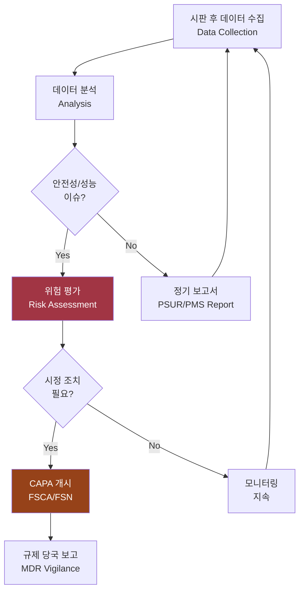
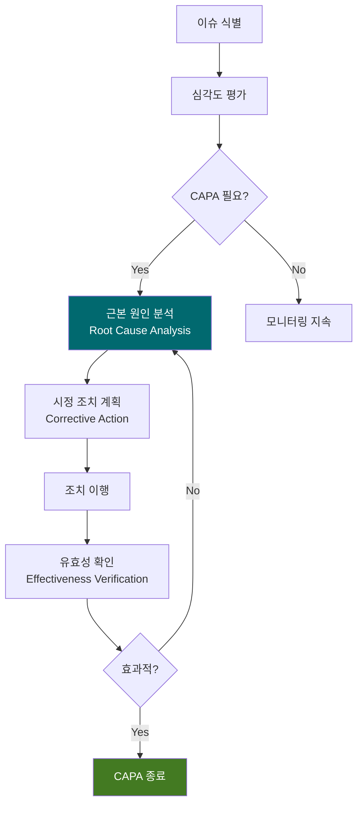

# 시판 후 관리 계획서 (Post-Market Surveillance Plan)
## RadiConsole™ GUI Console SW

---

## 문서 메타데이터 (Document Metadata)

| 항목 | 내용 |
|------|------|
| **문서 ID** | PMS-XRAY-GUI-001 |
| **문서명** | RadiConsole™ GUI Console SW 시판 후 관리 계획서 |
| **버전** | v1.0 |
| **작성일** | 2026-03-18 |
| **작성자** | 품질 관리 팀 (Quality Management Team) |
| **승인자** | 의료기기 RA/QA 책임자 |
| **상태** | 승인됨 (Approved) |
| **기준 규격** | EU MDR 2017/745 Article 83-85, FDA 21 CFR 803/806, FDA Section 524B |

---

## 1. 목적 및 범위 (Purpose and Scope)

### 1.1 목적

본 문서는 RadiConsole™ GUI Console SW의 **시판 후 관리 (Post-Market Surveillance, PMS)** 활동을 계획하며, EU MDR Article 83-85 및 FDA 시판 후 요구사항을 준수한다.

### 1.2 PMS 프로세스

---

## 2. PMS 데이터 수집 (Data Collection)

### 2.1 데이터 소스

| 소스 | 유형 | 수집 주기 | 담당 |
|------|------|----------|------|
| 고객 불만 (Complaints) | 사용자 보고, 서비스 요청 | 실시간 | CS 팀 |
| 유해 사례 (Adverse Events) | 환자 위해, 아차 사고 | 실시간 | RA/QA |
| 사이버보안 이벤트 | CVE, 보안 사고, SBOM 업데이트 | 주 1회 | 보안팀 |
| 소프트웨어 결함 | 버그 리포트, 크래시 로그 | 실시간 | 개발팀 |
| 임상 피드백 | 사용성 피드백, 기능 요청 | 분기별 | PM |
| 문헌 검토 | 학술 논문, 기술 보고서 | 반기별 | RA |
| 유사 제품 정보 | 경쟁사 리콜, 안전 정보 | 분기별 | RA |

### 2.2 CVE 모니터링 (사이버보안 PMS)

FDA Section 524B에 따라 사이버보안 시판 후 관리:

| 활동 | 주기 | 기준 |
|------|------|------|
| NVD/MITRE CVE 스캔 | 주 1회 | SBOM 전 구성요소 |
| CISA ICS-CERT 알림 | 실시간 | 의료기기 관련 |
| 공급자 보안 공지 | 수시 | Class B SOUP |
| SBOM 갱신 | 패치 적용 시 | 변경 관리 |

---

## 3. 시판 후 보고 (Reporting)

### 3.1 규제 당국 보고

| 보고 유형 | 대상 | 시기 | 기준 |
|----------|------|------|------|
| **MDR Serious Incident** | EU 관할 당국 | 15일 이내 | MDR Article 87 |
| **FDA MDR Report** | FDA | 30일 이내 | 21 CFR 803 |
| **KFDA 이상 사례** | 식약처 | 15일 이내 | 의료기기법 |
| **Field Safety Corrective Action** | EU Notified Body | 즉시 | MDR Article 89 |
| **Cybersecurity Vulnerability** | FDA/CISA | 발견 즉시 | Section 524B |

### 3.2 정기 보고서

| 보고서 | 주기 | 대상 |
|--------|------|------|
| PSUR (Periodic Safety Update Report) | 연 1회 | EU 관할 당국 |
| PMS Report | 연 1회 | 내부 품질 시스템 |
| 사이버보안 현황 보고 | 분기별 | 내부 경영진 |

---

## 4. CAPA 프로세스 (Corrective and Preventive Action)

---

## 5. 소프트웨어 업데이트 관리 (Software Update Management)

| 업데이트 유형 | 절차 | 규제 영향 |
|-------------|------|----------|
| **보안 패치** (Critical CVE) | 긴급 릴리스, 48시간 이내 | 변경 통지 (Letter to File) |
| **버그 수정** (Defect Fix) | 정기 릴리스 (분기별) | 변경 기록 관리 |
| **기능 업데이트** (Feature) | 주요 릴리스 | 보충 510(k) 검토 필요 |
| **사이버보안 업데이트** | SBOM 기반 분석 후 릴리스 | FDA Section 524B 보고 |

---

## 6. 성능 지표 (KPI)

| 지표 | 목표 | 측정 주기 |
|------|------|----------|
| 고객 불만 건수 | 감소 추세 | 월별 |
| 평균 불만 해결 시간 | ≤ 5 영업일 | 월별 |
| Critical CVE 대응 시간 | ≤ 48시간 | 수시 |
| FSCA 발생 건수 | 0건 | 연간 |
| 사용자 만족도 | ≥ 4.0/5.0 | 반기별 |

---

*문서 끝 (End of Document)*
