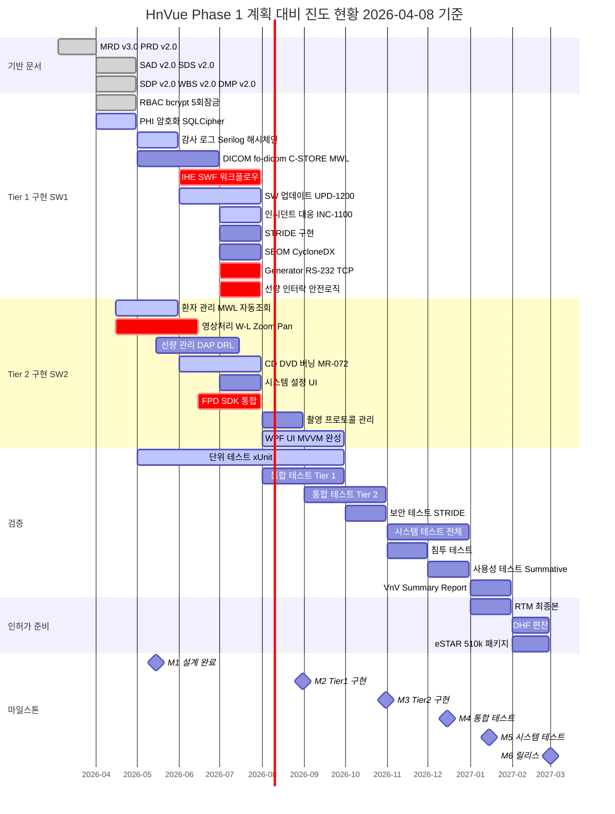

# HnVue Console SW — 계획 대비 진도 현황 보고서

| 항목 | 내용 |
|------|------|
| **문서 ID** | PROGRESS-001 |
| **버전** | v1.0 |
| **기준일** | 2026-04-08 |
| **작성 근거** | WBS-001 v2.0, ANALYSIS-001 v1.1, ANALYSIS-003 v1.0, CHANGELOG 1.0.0 |
| **목적** | WBS v2.0 기준 계획 대비 현재 진행 상황 파악 및 잔여 MM 산출 |

---

## 문서 개정 이력

| 버전 | 일자 | 변경 내용 | 작성자 |
|------|------|----------|--------|
| v1.0 | 2026-04-08 | 최초 작성 — WBS v2.0 대비 현황 분석 | MoAI |

---

## 1. 계획 요약 (WBS v2.0 기준, 변경 없음)

### 1.1 기본 전제

| 항목 | 계획 값 |
|------|---------|
| **개발 인원** | SW 2명 (SW1: Lead, SW2: Developer) |
| **Phase 1 기간** | 12개월 (2026-03 ~ 2027-03) |
| **총 MM** | 24 ~ 36 MM |
| **개발 전략** | Phase 1 (Tier 1 + Tier 2) -> Phase 2 (Tier 3) |

### 1.2 마일스톤 일정 (원본, 변경 없음)

| MS ID | Milestone | 목표 시기 | 상태 |
|-------|-----------|----------|------|
| **M1** | 설계 완료 | 2026-05-15 | 진행중 |
| **M2** | Tier 1 구현 | 2026-08-31 | 미착수 (일부 선행) |
| **M3** | Tier 2 구현 | 2026-10-31 | 미착수 (일부 선행) |
| **M4** | 통합 테스트 | 2026-12-15 | 미착수 |
| **M5** | 시스템 테스트 | 2027-01-15 | 미착수 |
| **M6** | 릴리스 | 2027-03-01 | 미착수 |

---

## 2. 현재 시점 요약 (2026-04-08)

### 2.1 경과 시간

| 항목 | 값 |
|------|-----|
| 프로젝트 시작 | 2026-03-04 |
| 기준일 | 2026-04-08 |
| 경과 기간 | 5주 (약 1.15개월) |
| 소진 MM | 2.3 MM (2명 x 1.15개월) |
| 남은 기간 (M6 까지) | 10.85개월 |
| 남은 MM (M6 까지) | 21.7 MM (2명 x 10.85개월) |

### 2.2 핵심 성과 지표

| 지표 | 현재 값 | 비고 |
|------|---------|------|
| 프로덕션 모듈 | 17개 | 전체 모듈 구조 완성 |
| 소스 파일 (.cs) | 331개 | src/ 디렉토리 |
| 테스트 수 | 1,135개 | 단위 1,117 + 통합 18 |
| 코드 커버리지 | 85%+ 전체, 90%+ 안전임계 | Coverlet 기준 |
| 규제 문서 | 216개 | IEC 62304/FDA/CE/KFDA |
| 기능 구현 완성도 | ~45% | ANALYSIS-003 기준 |
| 인터페이스 계약 이행 | 17% (4/24) | SAD Section 6 기준 |
| WBS 작업 완료율 | ~30-35% | 추정 |
| 아키텍처 품질 | A (우수) | Clean Architecture 완벽 준수 |

---

## 3. WBS 섹션별 계획 대비 현황

### 3.0 표준/규정 관리

| 항목 | 계획 시기 | 진척률 | 상태 | 비고 |
|------|----------|--------|------|------|
| Tier 체계 적용 | 2026-03~04 | 100% | DONE | MRD v3.0 4-Tier 체계 확립 |
| 규격 Gap 분석 | 2026-03~04 | 80% | 진행중 | ANALYSIS-001/003 완료, 교정 계획 수립 |
| 규격 교육 | 2026-04~05 | 30% | 지연 없음 | M1 전 완료 목표 |
| 준수 체크리스트 | 2026-04~05 | 50% | 진행중 | 프레임워크 구축 완료 |

**섹션 진척률: 65%**

### 3.1 프로젝트 관리

| 항목 | 계획 시기 | 진척률 | 상태 | 비고 |
|------|----------|--------|------|------|
| SDP v2.0 | 2026-03~04 | 100% | DONE | DOC-003/003a |
| 품질 보증 | 2026-03~04 | 80% | 진행중 | QA 인프라 (SonarCloud, Stryker) 구축 완료 |
| 형상 관리 | 2026-03~04 | 90% | 거의 완료 | DOC-042 CMP v1.0 발행, 6팀 Worktree 운영 |
| 위험 관리 | 2026-04~06 | 60% | 진행중 | RMP/FMEA 프레임워크 존재, v2.0 업데이트 필요 |
| 일정/자원 관리 | 2026-03~04 | 100% | DONE | WBS v2.0, DMP v2.0 |

**섹션 진척률: 86%**

### 3.2 요구사항 분석

| 항목 | 계획 시기 | 진척률 | 상태 | 비고 |
|------|----------|--------|------|------|
| Tier 1 MR 분석 | 2026-03 | 100% | DONE | MRD v3.0 — 36사 딥리서치 기반 |
| Tier 2 MR 분석 | 2026-03 | 100% | DONE | MRD v3.0 완료 |
| STRIDE 위협 모델링 | 2026-04~05 | 60% | 진행중 | DOC-017 프레임워크 존재, 상세 시나리오 보완 필요 |
| RTM 작성 | 2026-04~05 | 70% | 진행중 | MR->PR->SWR->TC 구조 완성, TC 매핑 미완 |

**섹션 진척률: 83%**

### 3.3 아키텍처 설계

| 항목 | 계획 시기 | 진척률 | 상태 | 비고 |
|------|----------|--------|------|------|
| SAD v2.0 | 2026-04 | 100% | DONE | 6계층 Clean Architecture, 12개 모듈 설계 |
| CD/DVD Burning 설계 | 2026-04 | 100% | DONE | SAD-CD-1000 |
| Incident Response 설계 | 2026-04 | 100% | DONE | SAD-INC-1100 |
| SW Update 설계 | 2026-04 | 100% | DONE | SAD-UPD-1200 |

**섹션 진척률: 100%**

### 3.4 상세 설계

| 항목 | 계획 시기 | 진척률 | 상태 | 비고 |
|------|----------|--------|------|------|
| SDS v2.0 | 2026-04 | 100% | DONE | 12개 모듈 클래스 설계 |
| 모듈별 클래스 설계 | 2026-04~05 | 85% | 거의 완료 | UI.Contracts 인터페이스 70% 정의 |
| 시퀀스 다이어그램 | 2026-04~05 | 60% | 진행중 | 핵심 플로우 정의, HW 연동 시퀀스 미완 |

**섹션 진척률: 82%**

### 3.5 구현 — Tier 1 (SW1 담당)

| WBS ID | 작업 항목 | 계획 시기 | 진척률 | 상태 | 비고 |
|--------|----------|----------|--------|------|------|
| 5.1.1 | RBAC 4역할 | 2026-04 | 90% | 거의 완료 | 구현 완료, RBAC 강제 적용 미완 (GAP-SA-001) |
| 5.1.2 | bcrypt cost=12 | 2026-04 | 100% | DONE | |
| 5.1.3 | 5회 실패 잠금 | 2026-04 | 100% | DONE | |
| 5.1.4 | PHI 암호화 SQLCipher | 2026-04 | 60% | 진행중 | SQLCipher 통합 완료, AES-256-GCM 미구현 (GAP-CS-001) |
| 5.1.5 | TLS 1.3 | 2026-04 | 20% | 지연 | DICOM TLS 미구현 (GAP-DC-001) |
| 5.1.6 | 감사 로그 HMAC-SHA256 | 2026-05 | 70% | 선행 착수 | 해시체인 구현, IHE ATNA 미완 (GAP-CS-002) |
| 5.1.7 | SBOM CycloneDX CI | 2026-07 | 30% | 미착수 (계획상 정시) | 프레임워크만 존재 (GAP-CY-001) |
| 5.1.8 | fo-dicom C-STORE SCU | 2026-05 | 50% | 계획상 정시 | 래퍼 존재, 멀티벤더 미검증 |
| 5.1.9 | fo-dicom MWL C-FIND | 2026-05 | 40% | 계획상 정시 | 기본 구현 존재 |
| 5.1.10 | fo-dicom Print SCU | 2026-05 | 30% | 계획상 정시 | 기본 구조만 |
| 5.1.11 | IHE SWF 상태머신 | 2026-06 | 30% | 미착수 (계획상 정시) | 상태머신 존재, HW 어댑터 미연결 (GAP-WF-001) |
| 5.1.12 | 인시던트 대응 | 2026-06 | 65% | 선행 착수 | 비교적 완성도 높음 |
| 5.1.13 | CVD/CVE 모니터링 | 2026-06 | 40% | 미착수 (계획상 정시) | 프레임워크 존재 |
| 5.1.14 | SW 업데이트 Authenticode | 2026-06 | 65% | 선행 착수 | 서명 검증 구현 |
| 5.1.15 | SW 업데이트 SHA-256 | 2026-06 | 80% | 선행 착수 | 해시 검증 구현 |
| 5.1.16 | SW 업데이트 자동 롤백 | 2026-06 | 60% | 선행 착수 | 백업/복원 기본 구현 |
| 5.1.17 | STRIDE 보안 통제 | 2026-07 | 40% | 미착수 (계획상 정시) | 위협 모델 존재, 구현 미시작 |
| 5.1.18 | Generator RS-232/TCP | 2026-07 | 5% | 미착수 (계획상 정시) | 스텁만 존재 (GAP-WF-001) |
| 5.1.19 | 선량 인터락 안전로직 | 2026-07 | 20% | 미착수 (계획상 정시) | 기본 모델만 (GAP-DM-001) |
| 5.1.20 | 세션 자동잠금 JWT 15분 | 2026-04 | 90% | 거의 완료 | JWT Denylist 구현 |
| WP-T1-ERR | 에러 처리 매트릭스 | 2026-06 | 50% | 선행 착수 | Result<T> 패턴 적용, Polly/워치독 미구현 |

**Tier 1 가중 평균 진척률: ~48%**
**계획 대비 판정: 정상** (대부분 항목이 계획 시기 이전이거나 정시)

### 3.6 구현 — Tier 2 (SW2 담당)

| WBS ID | 작업 항목 | 계획 시기 | 진척률 | 상태 | 비고 |
|--------|----------|----------|--------|------|------|
| 5.2.1 | MWL 자동 조회 | 2026-04~05 | 40% | 진행중 | 기본 구현 존재, C-FIND 미완 (GAP-PM-001) |
| 5.2.2 | PACS 전송 30초 이내 | 2026-04~05 | 40% | 진행중 | 비동기 파이프라인 기본 구조 |
| 5.2.3 | 영상 W/L 자동/수동 | 2026-04~05 | 30% | 지연 | Stub 수준 (GAP-IP-001) |
| 5.2.4 | 영상 Zoom/Pan | 2026-04~05 | 30% | 지연 | Stub 수준 |
| 5.2.5 | 영상 회전/반전 | 2026-04~05 | 25% | 지연 | Stub 수준 |
| 5.2.6 | 시스템 설정 UI | 2026-07 | 25% | 미착수 (계획상 정시) | 인터페이스만 (GAP-SA-002) |
| 5.2.7 | DAP 실시간 표시 | 2026-05~06 | 30% | 계획상 정시 | 모델 존재, UI 미완 |
| 5.2.8 | DRL 경고 알림 | 2026-05~06 | 20% | 계획상 정시 | 미구현 (GAP-DM-001) |
| 5.2.9 | FPD SDK 통합 | 2026-06~07 | 20% | 미착수 (계획상 정시) | 스텁만 (GAP-WF-002) |
| 5.2.10 | CD/DVD 버닝 IMAPI2 | 2026-06~07 | 55% | 선행 착수 | 기본 기능 구현 |
| 5.2.11 | CD/DVD 뷰어 번들 | 2026-06~07 | 30% | 미착수 (계획상 정시) | 통합 불명확 |
| 5.2.12 | CD/DVD AES-256 | 2026-06~07 | 20% | 미착수 (계획상 정시) | |
| 5.2.13 | CD/DVD 감사 로그 | 2026-06~07 | 40% | 미착수 (계획상 정시) | |
| 5.2.14 | 촬영 프로토콜 관리 | 2026-08 | 10% | 미착수 (계획상 정시) | |
| 5.2.15 | 자동 로그인 잠금 | 2026-08 | 80% | 선행 착수 | JWT 15분 자동 만료 구현 |
| 5.2.16 | WPF MVVM 프레임워크 | 2026-08~09 | 70% | 선행 착수 | CommunityToolkit.Mvvm, DI 완성 |
| 5.2.17 | 환자 검색 기능 | 2026-08 | 40% | 선행 착수 | PatientManagement 50% |
| 5.2.18 | DICOM RDSR 생성/전송 | 2026-05~06 | 30% | 계획상 정시 | 기본 모델 존재 |

**Tier 2 가중 평균 진척률: ~34%**
**계획 대비 판정: 영상처리(5.2.3~5.2.5) 지연 주의, 나머지 정시**

### 3.7 검증

| WBS ID | 작업 항목 | 계획 시기 | 진척률 | 상태 | 비고 |
|--------|----------|----------|--------|------|------|
| 7.1.1 | xUnit 단위 Tier 1 | 2026-05~08 | 60% | 선행 착수 | 1,117개 단위 테스트 |
| 7.1.2 | xUnit 단위 Tier 2 | 2026-06~08 | 40% | 선행 착수 | |
| 7.1.3 | Coverlet 커버리지 80%+ | 2026-08 | 90% | 선행 달성 | 이미 85%+ 달성 |
| 7.2.1 | 통합 테스트 Tier 1 | 2026-08~10 | 10% | 미착수 (계획상 정시) | 18개 통합 테스트 |
| 7.2.2 | 통합 테스트 Tier 2 | 2026-09~11 | 5% | 미착수 (계획상 정시) | |
| 7.2.3 | 보안 테스트 STRIDE | 2026-10 | 0% | 미착수 (계획상 정시) | |
| 7.2.4 | 인시던트 대응 검증 | 2026-10 | 0% | 미착수 (계획상 정시) | |
| 7.2.5 | SW 업데이트 검증 | 2026-10 | 20% | 선행 착수 | 기본 시나리오 테스트 존재 |
| 7.2.6 | CD 버닝 검증 | 2026-10 | 0% | 미착수 (계획상 정시) | |
| 7.3.1 | 시스템 테스트 E2E | 2026-11~12 | 0% | 미착수 (계획상 정시) | |
| 7.3.2 | 성능 테스트 | 2026-11~12 | 0% | 미착수 (계획상 정시) | |
| 7.3.3 | 침투 테스트 | 2026-11 | 0% | 미착수 (계획상 정시) | |
| 7.3.4 | 사용성 테스트 | 2026-12 | 0% | 미착수 (계획상 정시) | |

**섹션 진척률: 검증 계획 대비 ~20% (선행 테스트 활동 포함)**
**계획 대비 판정: 정상** (계획상 대부분 7~12월 일정)

### 3.8~3.11 시스템 테스트/위험 관리/인허가/릴리스

| 섹션 | 계획 시기 | 진척률 | 상태 |
|------|----------|--------|------|
| 시스템 테스트/밸리데이션 | 2026-11~2027-01 | 0% | 미착수 (계획상 정시) |
| 위험 관리 (FMEA/FTA/SOUP) | 2026-06~10 | 40% | 프레임워크 수립, 상세 분석 미착수 |
| 인허가 (DHF/RTM/eSTAR) | 2027-01~03 | 15% | 문서 프레임워크만 |
| 릴리스 (빌드/서명/배포) | 2027-02~03 | 5% | CI/CD 기본 구조만 |

---

## 4. MM 산출 현황

### 4.1 계획 MM (WBS v2.0 원본, 변경 없음)

| 구분 | 최소 MM | 최대 MM | 기간 |
|------|---------|---------|------|
| Phase 1 전체 | 24 MM | 36 MM | 12개월 (2026-03 ~ 2027-03) |
| 월간 MM | 2.0 MM/월 | 3.0 MM/월 | SW 2명 기준 |

### 4.2 소진 MM (2026-04-08 기준)

| 항목 | 값 |
|------|-----|
| 경과 기간 | 2026-03-04 ~ 2026-04-08 (5주, 1.15개월) |
| 투입 인원 | 2명 |
| **소진 MM** | **2.3 MM** |
| 계획 대비 소진률 | 2.3 / 24 = 9.6% (최소 기준) |
| 계획 대비 소진률 | 2.3 / 36 = 6.4% (최대 기준) |

### 4.3 잔여 MM (현시점 기준)

| 항목 | 최소 기준 | 최대 기준 |
|------|----------|----------|
| 총 계획 MM | 24 MM | 36 MM |
| 소진 MM | 2.3 MM | 2.3 MM |
| **잔여 MM** | **21.7 MM** | **33.7 MM** |
| 잔여 기간 | 10.85개월 (2026-04-08 ~ 2027-03-01) |
| 잔여 월간 필요 MM | 2.0 MM/월 | 3.1 MM/월 |

### 4.4 WBS 섹션별 MM 분배 추정 (잔여 작업 기준)

| WBS 섹션 | 완료율 | 잔여 비중 | 잔여 추정 MM (최소) | 잔여 추정 MM (최대) |
|----------|--------|----------|-------------------|-------------------|
| 0. 표준/규정 관리 | 65% | 2% | 0.4 | 0.7 |
| 1. 프로젝트 관리 | 86% | 1% | 0.2 | 0.3 |
| 2. 요구사항 분석 | 83% | 1% | 0.2 | 0.4 |
| 3. 아키텍처 설계 | 100% | 0% | 0.0 | 0.0 |
| 4. 상세 설계 | 82% | 1% | 0.3 | 0.5 |
| 5. 구현 Tier 1 | 48% | 20% | 4.3 | 6.7 |
| 6. 구현 Tier 2 | 34% | 20% | 4.3 | 6.7 |
| 7. 검증 | 20% | 25% | 5.4 | 8.4 |
| 8. 시스템 테스트 | 0% | 12% | 2.6 | 4.0 |
| 9. 위험 관리 | 40% | 5% | 1.1 | 1.7 |
| 10. 인허가 | 15% | 10% | 2.2 | 3.4 |
| 11. 릴리스 | 5% | 3% | 0.7 | 1.0 |
| **합계** | — | **100%** | **21.7 MM** | **33.7 MM** |

---

## 5. 마일스톤별 달성 전망

### M1: 설계 완료 (2026-05-15, D-37)

| 완료 기준 (DR#2) | 현재 상태 | 전망 |
|-----------------|----------|------|
| Tier 1 SWR 전체 SAD/SDS 반영 확인 | SAD v2.0, SDS v2.0 완료 | ON TRACK |
| Tier 2 SWR 전체 SAD/SDS 반영 확인 | SAD v2.0, SDS v2.0 완료 | ON TRACK |
| FRS v2.0 베이스라인 | FRS v2.0 발행 완료 | DONE |
| SRS v2.0 승인 | SRS v2.0 발행 완료 | DONE |
| STRIDE 위협 모델 완성 | DOC-017 프레임워크 존재, 상세화 필요 | AT RISK |
| Cybersecurity Plan 승인 | DOC-016 v1.0 완료 | DONE |

**M1 종합 전망: ON TRACK (STRIDE 상세화 37일 내 완료 필요)**

### M2: Tier 1 구현 (2026-08-31, D-145)

| 핵심 완료 기준 | 현재 진척 | 잔여 작업량 | 전망 |
|-------------|---------|-----------|------|
| RBAC/PHI/감사 로그 | 70% | 보안 핵심 기능 보완 | ON TRACK |
| DICOM fo-dicom | 45% | C-STORE/MWL/Print 완성 | ON TRACK |
| IHE SWF 워크플로우 | 30% | Generator 어댑터 핵심 | AT RISK |
| 인시던트 대응 | 65% | 보완 작업 | ON TRACK |
| SW 업데이트 | 65% | 코드 서명/롤백 검증 | ON TRACK |
| STRIDE 구현 | 40% | 보안 통제 구현 | ON TRACK |
| Generator 통신 | 5% | RS-232/TCP 전체 구현 필요 | AT RISK |
| 선량 인터락 | 20% | 안전 로직 전체 구현 필요 | AT RISK |

**M2 종합 전망: AT RISK**
- Generator/Detector HW 어댑터가 최대 리스크
- 하드웨어 의존 항목 3건 (5.1.11, 5.1.18, 5.1.19) 집중 관리 필요

### M3: Tier 2 구현 (2026-10-31, D-206)

| 핵심 완료 기준 | 현재 진척 | 전망 |
|-------------|---------|------|
| MWL/PACS 전송 | 40% | ON TRACK |
| 영상처리 W/L/Zoom | 28% | AT RISK (핵심 기능 Stub) |
| 선량 관리 DAP | 25% | ON TRACK (시간 여유) |
| CD/DVD 버닝 | 40% | ON TRACK |
| 시스템 설정 UI | 25% | ON TRACK (시간 여유) |
| WPF UI MVVM | 70% | ON TRACK |
| FPD SDK 통합 | 20% | AT RISK (HW 의존) |

**M3 종합 전망: AT RISK**
- 영상처리 파이프라인(Imaging)과 FPD SDK가 핵심 리스크

### M4~M6 전망

| MS | 전망 | 근거 |
|-----|------|------|
| M4 (통합 테스트) | WATCH | M2/M3 완료 여부에 종속 |
| M5 (시스템 테스트) | WATCH | M4 완료 + 외부 침투 테스트 일정 확보 필요 |
| M6 (릴리스) | WATCH | 전체 파이프라인 정상 진행 시 달성 가능 |

---

## 6. 핵심 리스크 및 주의 항목

### 6.1 CRITICAL 리스크 (일정 지연 가능성 높음)

| 리스크 ID | 항목 | 영향 | 완화 방안 |
|-----------|------|------|----------|
| **RISK-001** | Generator RS-232/TCP 어댑터 미구현 | M2 차단, 실제 촬영 불가 | 5월 중 프로토콜 분석 + 시뮬레이터 우선 구현 |
| **RISK-002** | FPD Detector SDK 미구현 | M2/M3 차단, 이미지 수집 불가 | 벤더 SDK 확보 + 어댑터 패턴 개발 병행 |
| **RISK-003** | 영상처리 파이프라인 Stub | M3 차단, 핵심 사용자 기능 부재 | fo-dicom 기반 DICOM 파싱 우선 구현 |
| **RISK-004** | PHI AES-256-GCM 미구현 | 인허가 차단 (HIPAA/GDPR) | M2 전 구현 필수 |

### 6.2 HIGH 주의 항목

| 항목 | 현재 상태 | 조치 필요 시점 |
|------|----------|--------------|
| IHE ATNA 감사 추적 미완 | 70% (Merkle 체인 미완) | M2 전 (2026-08) |
| SAD 인터페이스 계약 이행 17% | 24개 중 4개만 구현 | M3 전 (2026-10) |
| 테스트 계획 이행률 21% | 175개 TC 중 37개만 구현 | M4 전 (2026-12) |
| DOC-042 CMP 승인 미완 | Draft 상태 | M1 전 (2026-05) |

---

## 7. 계획 대비 현황 요약 대시보드

```
계획 진행률 (시간 경과): ████░░░░░░░░░░░░░░░░ 9.6% (1.15/12개월)
MM 소진률:              ██░░░░░░░░░░░░░░░░░░ 9.6% (2.3/24 MM)

WBS 작업 완료율:        ██████░░░░░░░░░░░░░░ 30-35%
기능 구현 완성도:       █████████░░░░░░░░░░░ 45%
아키텍처/설계:          ██████████████████░░ 90%+
Tier 1 구현:            ██████████░░░░░░░░░░ 48%
Tier 2 구현:            ███████░░░░░░░░░░░░░ 34%
검증:                   ████░░░░░░░░░░░░░░░░ 20%
인허가:                 ███░░░░░░░░░░░░░░░░░ 15%
```

**종합 판정:**
- 설계/문서화/아키텍처: **계획 대비 선행** (예상보다 빠름)
- Tier 1 구현: **계획 대비 정시~약간 선행** (보안/업데이트/인시던트 선행 착수)
- Tier 2 구현: **영상처리 부분 지연 주의**, 나머지 정시
- 검증: **선행 착수** (1,135개 테스트, 85%+ 커버리지 조기 달성)
- **하드웨어 연동 (Generator/Detector/FPD)이 프로젝트 최대 리스크**

---

## 8. 계획 대비 진도 Gantt Chart (2026-04-08 기준)

### 8.1 Phase 1 전체 Gantt — 계획 vs 현황



### 8.2 Gantt 범례

| 표시 | 의미 |
|------|------|
| **done** (진한 색) | 완료된 작업 |
| **active** (밝은 색) | 진행중인 작업 (착수 완료, 부분 구현) |
| **crit** (빨간 색) | AT RISK — 지연 또는 차단 위험 항목 |
| (기본 색) | 미착수 (계획상 정시) |
| **todayMarker** (빨간 세로선) | 오늘 (2026-04-08) |

### 8.3 핵심 읽기 포인트

1. **빨간 세로선(today) 왼쪽에 done/active가 없는 항목** = 아직 착수 안 해도 되는 항목 (정상)
2. **빨간 세로선과 겹치는 active 항목** = 현재 진행중 (PHI 암호화, 감사 로그, MWL 등)
3. **crit 표시 항목 4건** = 프로젝트 최대 리스크
   - IHE SWF 워크플로우 (Generator HW 어댑터 의존)
   - Generator RS-232/TCP (하드웨어 미확보)
   - 영상처리 W-L Zoom Pan (Stub 수준)
   - FPD SDK 통합 (벤더 SDK 미확보)

---

## 9. 다음 보고 시점

| 보고 시점 | 기준일 | 확인 항목 |
|----------|--------|----------|
| PROGRESS-001 v1.1 | 2026-05-01 | M1 준비 상태, STRIDE 완성도 |
| PROGRESS-001 v1.2 | 2026-05-15 | M1 달성 여부, DR#2 결과 |
| PROGRESS-001 v2.0 | 2026-07-01 | 중간 점검, Tier 1 진척, HW 어댑터 진도 |

---

*이 문서는 WBS-001 v2.0의 원래 일정과 MM을 변경하지 않으며, 현 시점에서의 계획 대비 진행 상황만을 보고합니다.*
*다음 업데이트 시 구현 진척에 따라 전망(ON TRACK/AT RISK/WATCH)이 조정됩니다.*
