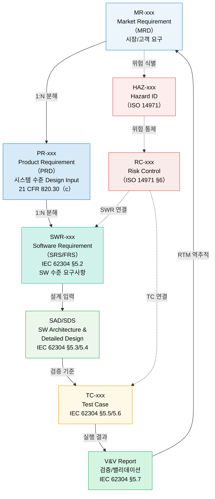
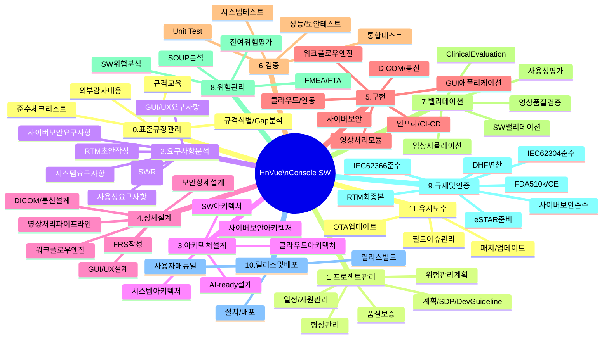
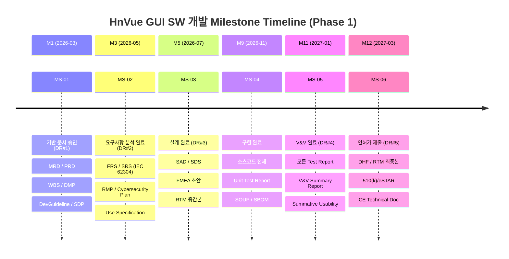
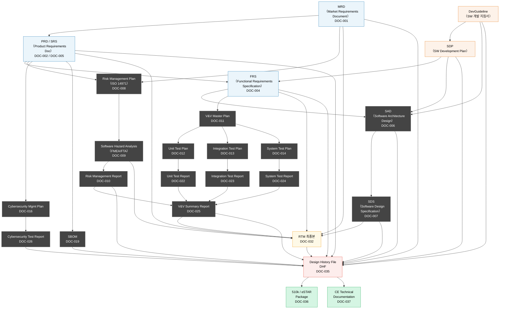
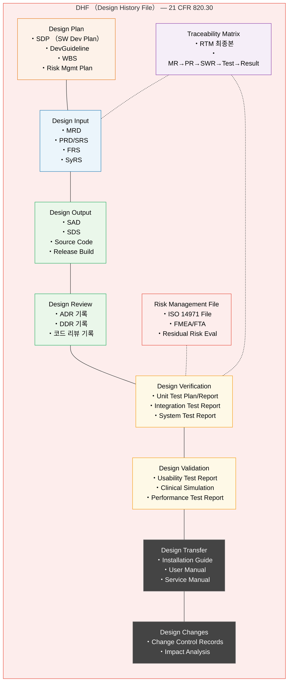
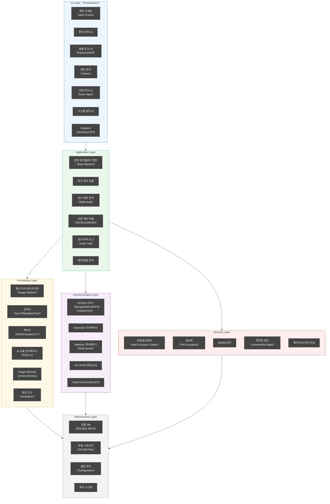
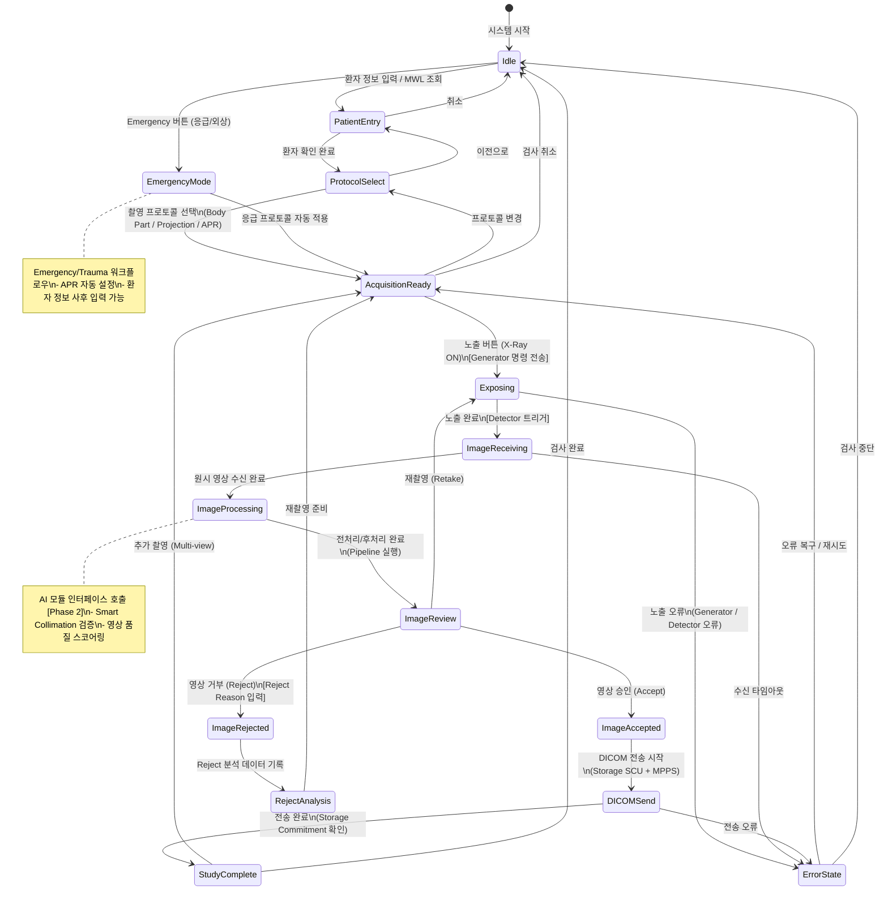
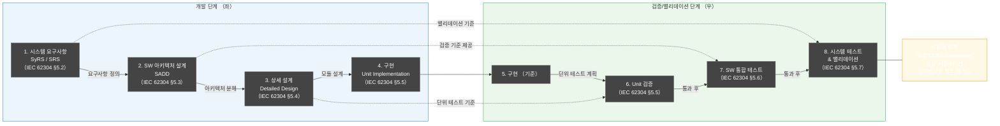

# HnVue Console SW 개발 WBS

> **문서 ID**: WBS-XRAY-GUI-001
> **버전**: v1.0
> **작성일**: 2026-03-27
> **최종 개정일**: 2026-03-27
> **기준 규격**: IEC 62304:2006+AMD1:2015 (Medical Device SW Lifecycle), IEC 62366-1:2015+AMD1:2020 (Usability Engineering), IEC 60601-1-3 (Radiation Safety), ISO 14971:2019 (Risk Management), ISO 13485:2016 (QMS), FDA 21 CFR Part 820.30 (Design Controls), FDA Section 524B (Cybersecurity), EU MDR 2017/745
> **SW Safety Class**: Class B (IEC 62304 기준)
> **개발 전략**: Phase 1 (핵심 기능 M1-M12) → Phase 2 (고도화/AI 통합 M13-M24)
> **경쟁사 벤치마크**: Carestream ImageView, Siemens syngo FLC, Canon CXDI Control NE, Fujifilm FDX Console, OR Technology dicomPACS DX-R
> **ID 체계**: MR-xxx (MRD) → PR-xxx (PRD) → SWR-xxx (SRS/FRS) — 3단계 계층

---

## 문서 개정 이력

| 버전 | 일자 | 개정 내용 | 작성자 |
|------|------|-----------|--------|
| v1.0 | 2026-03-27 | 최초 작성 | — |

---

## 개발 범위 및 Phase 정의

| Phase | 기간 (목표) | 핵심 기능 | 비고 |
|-------|-----------|-----------|------|
| **Phase 1** | M1 ~ M12 | 촬영 워크플로우, 영상 표시/기본 처리, DICOM 핵심 서비스, 환자 관리, 선량 관리, 사이버보안 기본, 사용성 엔지니어링 | 시장 출시(FDA 510(k) / CE) 대상 |
| **Phase 2** | M13 ~ M24 | AI 통합, 고급 영상처리, Analytics Dashboard, Cloud Connectivity, OTA 업데이트, HL7/FHIR 심화 | 경쟁력 강화 및 플랫폼 확장 |

---

## ID 체계 계층 구조



---

## Milestone 정의

| MS ID | Milestone | 목표 시기 | 주요 산출물 | Phase Gate | 관련 규격 |
|-------|-----------|----------|-----------|-----------|---------|
| **MS-01** | 기반 문서 승인 (Foundation Approval) | M1 | MRD, PRD, WBS, DMP, DevGuideline, SDP | DR#1 (계획 검토) | IEC 62304 §5.1, FDA 820.30(c) |
| **MS-02** | 요구사항 분석 완료 (Requirements Baseline) | M3 | FRS (IEC 62304), SRS, RMP, Cybersecurity Plan, Use Specification | DR#2 (설계 입력 검토) | IEC 62304 §5.2, ISO 14971 §4, IEC 62366 §5.2 |
| **MS-03** | 설계 완료 (Design Freeze) | M5 | SAD, SDS, FMEA, Cybersecurity Architecture, RTM 중간본 | DR#3 (설계 출력 검토) | IEC 62304 §5.3/5.4, FDA 820.30(d/e) |
| **MS-04** | 구현 완료 (Code Freeze) | M9 | 소스코드 전체, Unit Test Report, SOUP/SBOM, 코드 커버리지 ≥80% | — | IEC 62304 §5.5/5.6 |
| **MS-05** | V&V 완료 (V&V Complete) | M11 | 모든 Test Report (UT/IT/ST), V&V Summary Report, Summative Usability Report | DR#4 (검증/밸리데이션 검토) | IEC 62304 §5.7, IEC 62366 §5.9, FDA 820.30(f/g) |
| **MS-06** | 인허가 제출 (Regulatory Submission) | M12 | DHF, RTM 최종본, 510(k)/eSTAR, CE Technical Documentation, SBOM 최종본 | DR#5 (인허가 게이트) | FDA 820.30(j), EU MDR 2017/745 Art.61 |

---

## Phase Gate 프로세스

```mermaid
flowchart LR
    classDef default fill:#444,stroke:#666,color:#fff
    subgraph DR1["DR#1 — 계획 검토\n（M1 종료）"]
        direction TB
        D1A["✅ MRD 승인"]
        D1B["✅ PRD 승인"]
        D1C["✅ WBS 승인"]
        D1D["✅ DevGuideline 승인"]
        D1E["✅ SDP 승인"]
        D1F["✅ DMP 승인"]
    end

    subgraph DR2["DR#2 — 설계 입력 검토\n（M3 종료）"]
        direction TB
        D2A["✅ FRS 베이스라인 확정"]
        D2B["✅ SRS 승인"]
        D2C["✅ RMP 승인"]
        D2D["✅ Use Specification 승인"]
        D2E["✅ Cybersecurity Plan 승인"]
    end

    subgraph DR3["DR#3 — 설계 출력 검토\n（M5 종료）"]
        direction TB
        D3A["✅ SAD 승인"]
        D3B["✅ SDS 승인"]
        D3C["✅ FMEA 초안 완성"]
        D3D["✅ RTM 중간본 승인"]
        D3E["✅ Formative Usability 완료"]
    end

    subgraph DR4["DR#4 — 검증/밸리데이션 검토\n（M11 종료）"]
        direction TB
        D4A["✅ Unit/통합/시스템 Test 통과"]
        D4B["✅ V&V Summary Report 완성"]
        D4C["✅ Summative Usability 통과"]
        D4D["✅ 침투 테스트 완료"]
        D4E["✅ 잔여위험 수용 가능"]
    end

    subgraph DR5["DR#5 — 인허가 게이트\n（M12 종료）"]
        direction TB
        D5A["✅ DHF 최종 승인"]
        D5B["✅ RTM 최종본 검증"]
        D5C["✅ eSTAR/510（k） 패키지 완성"]
        D5D["✅ CE Technical Doc 완성"]
        D5E["✅ SBOM 최종본 제출"]
    end

    MS1([MS-01\n기반 문서 승인]) --> DR1
    DR1 --> MS2([MS-02\n요구사항 완료])
    MS2 --> DR2
    DR2 --> MS3([MS-03\n설계 완료])
    MS3 --> DR3
    DR3 --> MS4([MS-04\n구현 완료])
    MS4 --> MS5([MS-05\nV&V 완료])
    MS5 --> DR4
    DR4 --> MS6([MS-06\n인허가 제출])
    MS6 --> DR5

    style DR1 fill:#EBF5FB,stroke:#2980B9
    style DR2 fill:#D6EAF8,stroke:#2980B9
    style DR3 fill:#EAF7EA,stroke:#27AE60
    style DR4 fill:#FEF9E7,stroke:#F39C12
    style DR5 fill:#FDEDEC,stroke:#E74C3C
```



---

## 전체 WBS 구조 (Mindmap)



---

## Milestone Timeline



---

## Phase 1/Phase 2 개발 로드맵 — Gantt (Milestone 표시)

```mermaid
gantt
    title HnVue Console SW 개발 로드맵 (Phase 1 + Phase 2) — Milestone & Critical Path
    dateFormat  YYYY-MM
    axisFormat  %Y-%m

    section 📋 Phase 1 - 기반 문서 (Critical)
    MRD / PRD 확정                :crit, p1_mrd, 2026-03, 1M
    WBS / DMP 작성               :crit, p1_wbs, 2026-03, 1M
    DevGuideline 작성 (신규)                :crit, p1_dg,  2026-03, 1M
    SW 개발 절차서 SDP 작성 (신규)          :crit, p1_sdp, 2026-03, 1M

    section 📋 Phase 1 - 요구사항 (Critical)
    요구사항 분석 (FRS/SRS — IEC 62304 §5.2) :crit, p1_req, 2026-03, 2M
    IEC 62366 Use Specification              :p1_ue,  2026-04, 1M
    사이버보안 요구사항 (FDA 524B)           :p1_cs,  2026-04, 1M
    RTM 초안 작성 (MR→PR→SWR)              :crit, p1_rtm, 2026-04, 1M
    Risk Management Plan (ISO 14971)         :crit, p1_rmp, 2026-04, 1M

    section 📋 Phase 1 - 설계 (Critical)
    FRS 작성 베이스라인 확정                 :crit, p1_frs, 2026-05, 1M
    시스템/SW 아키텍처 설계 (SAD)           :crit, p1_arch,2026-05, 2M
    GUI/UX 상세 설계 & Wireframe             :p1_ui,  2026-06, 2M
    영상처리/DICOM 상세 설계                :p1_img, 2026-06, 2M
    SDS 작성 및 FMEA 초안                   :crit, p1_sds, 2026-07, 1M

    section 📋 Phase 1 - V&V 계획 문서
    V&V Master Plan (DOC-011)                :p1_vvp, 2026-05, 1M
    Cybersecurity Mgmt Plan (DOC-016)        :p1_cmp, 2026-05, 1M
    Unit/Integration/System Test Plans       :p1_tp,  2026-07, 2M
    Cybersecurity Test Plan (DOC-018)        :p1_cstp,2026-08, 1M
    Clinical Evaluation Plan (DOC-020)       :p1_cep, 2026-08, 1M

    section 📋 Phase 1 - 구현 (Critical)
    GUI 핵심 모듈 구현                       :crit, p1_dev1,2026-08, 3M
    영상처리/Viewer 구현                    :crit, p1_dev2,2026-08, 3M
    DICOM 서비스 구현                        :crit, p1_dev3,2026-09, 2M
    사이버보안 모듈 구현                    :p1_dev4,2026-09, 2M
    Dose Management 구현                     :p1_dev5,2026-10, 1M
    SBOM 작성 및 SOUP Analysis              :p1_sbom,2026-10, 1M

    section 📋 Phase 1 - 검증/보고서 (Critical)
    Unit/통합 테스트 실행                    :crit, p1_test,2026-11, 2M
    Cybersecurity 침투 테스트               :p1_pen, 2026-11, 1M
    사용성 평가 Summative                   :p1_ue2, 2026-12, 1M
    SW V&V 실행                              :crit, p1_vv,  2027-01, 1M
    V&V Summary Report 작성                  :crit, p1_vvr, 2027-01, 1M

    section 📋 Phase 1 - DHF/인허가 (Critical)
    RTM 최종본 작성 및 검증 (DOC-032)       :crit, p1_rtmf,2027-02, 1M
    DHF 편찬 (DOC-035)                       :crit, p1_dhf, 2027-02, 1M
    규제 문서 패키지 완성                    :crit, p1_reg, 2027-02, 1M
    eSTAR/510(k) 제출 준비 (DOC-036)        :crit, p1_estar,2027-03, 1M

    section 🏁 Milestone — Phase 1
    MS-01: 기반 문서 승인 (DR#1)            :milestone, ms01, 2026-03, 0d
    MS-02: 요구사항 완료 (DR#2)             :milestone, ms02, 2026-05, 0d
    MS-03: 설계 완료 (DR#3)                 :milestone, ms03, 2026-07, 0d
    MS-04: 구현 완료                         :milestone, ms04, 2026-11, 0d
    MS-05: V&V 완료 (DR#4)                  :milestone, ms05, 2027-01, 0d
    MS-06: 인허가 제출 (DR#5)               :milestone, ms06, 2027-03, 0d

    section 🚀 Phase 2 - AI/고도화
    AI 모듈 인터페이스 정의                  :p2_ai1, 2027-04, 2M
    Smart Image Processing 구현              :p2_img, 2027-06, 3M
    AI 통합 (Smart Positioning 등)           :p2_ai2, 2027-07, 3M
    Cloud Connectivity 구현                  :p2_cld, 2027-07, 3M
    Analytics Dashboard 구현                 :p2_ana, 2027-09, 2M
    OTA Update 아키텍처 구현                 :p2_ota, 2027-10, 2M
    HL7/FHIR 심화 연동                      :p2_hl7, 2027-10, 2M
    Phase 2 통합/검증                        :p2_test,2027-11, 3M
    AI 임상 유효성 검증                      :p2_val, 2028-01, 2M
    Phase 2 규제 업데이트                    :p2_reg, 2028-02, 1M

    section 🏁 Milestone — Phase 2
    MS-P2-1: AI 통합 완료                   :milestone, msp21, 2027-10, 0d
    MS-P2-2: Phase 2 릴리스                 :milestone, msp22, 2028-03, 0d
```

---

## 인허가 문서 체계도 (Document Hierarchy)

> 인허가 제출에 포함되는 핵심 문서들과 그 참조 관계를 나타낸 다이어그램



---

## DHF (Design History File) 구성 다이어그램



---

## SW 아키텍처 블록 다이어그램



---

## 촬영 워크플로우 State Machine



---

## V-Model 검증/밸리데이션 흐름



---

## 0. 표준 및 규정 관리 (Standards & Regulatory Management)

> **목적**: 프로젝트 전체에 걸쳐 적용 규격을 체계적으로 관리하고 외부 감사에 대응
> **DHF 포함 문서**: 준수 체크리스트 → DHF-DC (Design Changes/Compliance)

| WBS ID | 작업 항목 | 산출물 | 관련 MS | Phase Gate | 규격 조항 | DHF 포함 | Phase |
|--------|----------|--------|---------|-----------|---------|---------|-------|
| 0.1 | 적용 규격 목록 식별 | Applicable Standards List | MS-01 | DR#1 | IEC 62304 §4.3, ISO 13485 §7.3.2 | ✅ DHF-DC | P1 |
| 0.2 | 규격별 Gap Analysis 수행 | Gap Analysis Report (IEC 62304/62366/14971/FDA) | MS-01 | DR#1 | IEC 62304 전체, ISO 14971 §4 | ✅ DHF-DC | P1 |
| 0.3 | 규격 교육 계획 수립 | 규격 교육 계획서 | MS-01 | DR#1 | ISO 13485 §6.2.2 | — | P1 |
| 0.4 | IEC 62304 교육 수행 | 교육 이수 기록 | MS-01 | DR#1 | IEC 62304 §4.4 | — | P1 |
| 0.5 | IEC 62366/ISO 14971 교육 수행 | 교육 이수 기록 | MS-01 | DR#1 | IEC 62366 §4, ISO 14971 §3 | — | P1 |
| 0.6 | FDA 510(k)/eSTAR 가이던스 교육 수행 | 교육 이수 기록 | MS-01 | DR#1 | FDA 21 CFR 807 Subpart E | — | P1 |
| 0.7 | IEC 62304 준수 체크리스트 작성 | IEC 62304 Compliance Checklist | MS-06 | DR#5 | IEC 62304 전 조항 | ✅ DHF-DC | P1 |
| 0.8 | IEC 62366 준수 체크리스트 작성 | IEC 62366 Compliance Checklist | MS-06 | DR#5 | IEC 62366 §4~§5 | ✅ DHF-DC | P1 |
| 0.9 | ISO 14971 준수 체크리스트 작성 | ISO 14971 Compliance Checklist | MS-06 | DR#5 | ISO 14971 §4~§9 | ✅ DHF-DC | P1 |
| 0.10 | FDA 21 CFR 820.30 준수 체크리스트 작성 | FDA Design Control Checklist | MS-06 | DR#5 | FDA 21 CFR 820.30(a)~(j) | ✅ DHF-DC | P1 |
| 0.11 | FDA Section 524B (사이버보안) 준수 체크리스트 | Cybersecurity Compliance Checklist | MS-06 | DR#5 | FDA Section 524B | ✅ DHF-DC | P1 |
| 0.12 | EU MDR 2017/745 요구사항 매핑 | EU MDR Technical Documentation Checklist | MS-06 | DR#5 | EU MDR 2017/745 Annex I | ✅ DHF-DC | P1 |
| 0.13 | 외부 감사 대응 계획 수립 | Audit Readiness Plan | MS-06 | DR#5 | ISO 13485 §8.2.2 | ✅ DHF-DC | P1 |
| 0.14 | 내부 규정 준수 감사 수행 | Internal Audit Report | MS-05 | DR#4 | ISO 13485 §8.2.2, IEC 62304 §4 | ✅ DHF-DC | P1 |
| 0.15 | 외부 감사 대응 실행 (인허가 전) | External Audit Response Package | MS-06 | DR#5 | ISO 13485 §8.2.2 | ✅ DHF-DC | P1 |

---

## 1. 프로젝트 관리 (Project Management)

> **DHF 포함 문서**: PMP, SDP, DevGuideline, Risk Management Plan, Cybersecurity Management Plan, WBS

| WBS ID | 작업 항목 | 산출물 | 인허가 문서 ID | 관련 MS | Phase Gate | 규격 조항 | DHF 포함 | Phase |
|--------|----------|--------|--------------|---------|-----------|---------|---------|-------|
| 1.1 | 프로젝트 계획 수립 | 프로젝트 관리 계획서 (PMP) | — | MS-01 | DR#1 | IEC 62304 §5.1, FDA 820.30(b) | ✅ DHF-DP | P1 |
| 1.2 | **SW 개발 계획서 작성 (SDP)** | SW Development Plan (SDP) | — | MS-01 | DR#1 | IEC 62304 §5.1.1 | ✅ DHF-DP | P1 |
| 1.3 | **SW 개발 지침서 작성 (DevGuideline)** | SW Development Guideline | — | MS-01 | DR#1 | IEC 62304 §4.4, ISO 13485 §7.3.1 | ✅ DHF-DP | P1 |
| 1.4 | DevGuideline — 코딩 표준 정의 | Coding Standard (C++/C#/Qt 기반) | — | MS-01 | DR#1 | IEC 62304 §5.5.3, MISRA-C 등 | ✅ DHF-DP | P1 |
| 1.5 | DevGuideline — 코드 리뷰 프로세스 정의 | Code Review Procedure | — | MS-01 | DR#1 | IEC 62304 §5.5.3 | ✅ DHF-DP | P1 |
| 1.6 | DevGuideline — 형상관리 절차 정의 | Configuration Management Procedure | — | MS-01 | DR#1 | IEC 62304 §8 | ✅ DHF-DP | P1 |
| 1.7 | DevGuideline — 문제해결 절차 정의 | Problem Resolution Procedure | — | MS-01 | DR#1 | IEC 62304 §9 | ✅ DHF-DP | P1 |
| 1.8 | SDP — SW 개발 방법론 정의 | SW Development Methodology Section | — | MS-01 | DR#1 | IEC 62304 §5.1.1 | ✅ DHF-DP | P1 |
| 1.9 | SDP — SW 라이프사이클 활동 계획 | Lifecycle Activity Plan | — | MS-01 | DR#1 | IEC 62304 §5.1 | ✅ DHF-DP | P1 |
| 1.10 | SDP — 도구/환경 선정 및 검증 계획 | Tool Qualification Plan | — | MS-01 | DR#1 | IEC 62304 §5.1.4 | ✅ DHF-DP | P1 |
| 1.11 | SW 유지보수 계획 수립 | SW Maintenance Plan | — | MS-01 | DR#1 | IEC 62304 §6.1 | ✅ DHF-DP | P1 |
| 1.12 | 위험관리 계획 수립 | Risk Management Plan | DOC-008 | MS-01 | DR#1 | ISO 14971 §4.4, FDA 820.30(g) | ✅ DHF-RM | P1 |
| 1.13 | 사이버보안 관리 계획 수립 | Cybersecurity Management Plan | DOC-016 | MS-01 | DR#1 | FDA Section 524B | ✅ DHF-DP | P1 |
| 1.14 | 일정 및 자원 관리 | WBS / 간트차트 / 자원배분표 | WBS-XRAY-GUI-001 | MS-01 | DR#1 | IEC 62304 §5.1.1 | ✅ DHF-DP | P1 |
| 1.15 | 정기 기술 리뷰 및 마일스톤 관리 | 회의록 / 리뷰 보고서 | — | MS-01–06 | DR#1–5 | IEC 62304 §5.1.6 | ✅ DHF-DR | P1 |
| 1.16 | 품질보증 계획 수립 | SW Quality Assurance Plan (SQAP) | — | MS-01 | DR#1 | ISO 13485 §8, IEC 62304 §4 | ✅ DHF-DP | P1 |
| 1.17 | Phase 2 전환 계획 수립 | Phase 2 Transition Plan | — | — | — | — | — | P1/P2 |

---

## 2. 요구사항 분석 (Requirements Analysis)

### 2.1 시스템 요구사항 (System Requirements)

> **DHF 포함 문서**: SyRS → DHF-DI (Design Input)
> **ID 체계**: MR-xxx → PR-xxx (시스템 수준 분해)

| WBS ID | 작업 항목 | 산출물 | 인허가 문서 ID | 관련 MS | Phase Gate | 규격 조항 | DHF 포함 | Phase |
|--------|----------|--------|--------------|---------|-----------|---------|---------|-------|
| 2.1.1 | 시스템 요구사항 분석 | System Requirements Specification (SyRS) | DOC-005 참조 | MS-02 | DR#2 | IEC 62304 §5.2, FDA 820.30(c) | ✅ DHF-DI | P1 |
| 2.1.2 | X-ray 발생장치(Generator) 인터페이스 요구사항 정의 | Generator Interface Spec | DOC-004 참조 | MS-02 | DR#2 | IEC 62304 §5.2.1 | ✅ DHF-DI | P1 |
| 2.1.3 | 영상검출기(Detector) 인터페이스 요구사항 정의 | Detector Interface Spec | DOC-004 참조 | MS-02 | DR#2 | IEC 62304 §5.2.1 | ✅ DHF-DI | P1 |
| 2.1.4 | 규제 요구사항 식별 | Regulatory Requirements Matrix | — | MS-02 | DR#2 | IEC 60601-1-3, FDA 510(k)/CE | ✅ DHF-DI | P1 |
| 2.1.5 | IHE Scheduled Workflow Profile 요구사항 분석 | IHE Profile Requirements | DOC-004 참조 | MS-02 | DR#2 | IHE RAD TF-1 §3 | ✅ DHF-DI | P1 |

---

### 2.2 SW 요구사항 (SW Requirements — IEC 62304 §5.2)

> **DHF 포함 문서**: SRS/PRD → DHF-DI
> **ID 체계**: PR-xxx → SWR-xxx (SW 수준 분해)

| WBS ID | 작업 항목 | 산출물 | 인허가 문서 ID | 관련 MS | Phase Gate | 규격 조항 | DHF 포함 | Phase |
|--------|----------|--------|--------------|---------|-----------|---------|---------|-------|
| 2.2.1 | SW 요구사항 분석 | Software Requirements Specification (SRS) | DOC-005 | MS-02 | DR#2 | IEC 62304 §5.2 | ✅ DHF-DI | P1 |
| 2.2.2 | GUI 기능 요구사항 정의 (SWR-PM/WF 계열) | GUI Functional Requirements Spec | DOC-004 | MS-02 | DR#2 | IEC 62304 §5.2.2 | ✅ DHF-DI | P1 |
| 2.2.3 | 영상처리 요구사항 정의 (SWR-IP 계열) | Image Processing Requirements | DOC-004 | MS-02 | DR#2 | IEC 62304 §5.2.2 | ✅ DHF-DI | P1 |
| 2.2.4 | DICOM 통신 요구사항 정의 (SWR-DC 계열) | DICOM Conformance Statement (초안) | — | MS-02 | DR#2 | DICOM PS3.1, IEC 62304 §5.2 | ✅ DHF-DI | P1 |
| 2.2.5 | PACS/RIS/HIS 연동 요구사항 | Integration Requirements Spec | DOC-004 | MS-02 | DR#2 | IHE RAD TF-2, HL7 v2.x | ✅ DHF-DI | P1 |
| 2.2.6 | 안전성 요구사항 정의 (SWR-SA 계열) | Safety Requirements Spec | DOC-004 | MS-02 | DR#2 | IEC 62304 §5.2.4, ISO 14971 §6 | ✅ DHF-DI | P1 |
| 2.2.7 | 선량 관리 요구사항 정의 (SWR-DM 계열) | Dose Management Requirements | DOC-004 | MS-02 | DR#2 | IEC 60601-1-3, DICOM PS3.3 | ✅ DHF-DI | P1 |
| 2.2.8 | 워크플로우 요구사항 정의 (SWR-WF 계열) | Workflow Requirements Spec | DOC-004 | MS-02 | DR#2 | IEC 62304 §5.2, IHE SWF.b | ✅ DHF-DI | P1 |
| 2.2.9 | Reject Analysis 요구사항 정의 | Reject Analysis Requirements | DOC-004 | MS-02 | DR#2 | IEC 62304 §5.2 | ✅ DHF-DI | P1 |
| 2.2.10 | 요구사항 추적성 매트릭스 작성 (MR→PR→SWR) | Requirements Traceability Matrix (RTM) 초안 | DOC-032 | MS-02 | DR#2 | IEC 62304 §5.1.1 | ✅ DHF-TM | P1 |
| 2.2.11 | AI 통합 요구사항 정의 (Phase 2 대비) | AI Integration Requirements | — | — | — | FDA AI/ML SaMD 가이던스 | — | P2 |
| 2.2.12 | 클라우드/원격 진단 요구사항 정의 | Cloud & Remote Requirements | — | — | — | FDA Section 524B | — | P2 |

---

### 2.3 사이버보안 요구사항 (Cybersecurity Requirements — FDA Section 524B)

> **DHF 포함 문서**: Cybersecurity Requirements → DHF-DI

| WBS ID | 작업 항목 | 산출물 | 인허가 문서 ID | 관련 MS | Phase Gate | 규격 조항 | DHF 포함 | Phase |
|--------|----------|--------|--------------|---------|-----------|---------|---------|-------|
| 2.3.1 | 사이버보안 요구사항 정의 | Cybersecurity Requirements Spec | DOC-016 참조 | MS-02 | DR#2 | FDA Section 524B §3524(b) | ✅ DHF-DI | P1 |
| 2.3.2 | Threat Modeling 수행 | Threat Model Document (STRIDE) | DOC-017 | MS-02 | DR#2 | FDA Cybersecurity Guidance 2023 | ✅ DHF-DI | P1 |
| 2.3.3 | 인증/접근 제어 요구사항 정의 | Authentication & Access Control Spec | DOC-016 참조 | MS-02 | DR#2 | FDA Section 524B, HIPAA §164.312 | ✅ DHF-DI | P1 |
| 2.3.4 | 암호화 요구사항 정의 | Encryption Requirements | DOC-016 참조 | MS-02 | DR#2 | NIST SP 800-111, AES-256, TLS 1.3 | ✅ DHF-DI | P1 |
| 2.3.5 | 감사 로깅 요구사항 정의 | Audit Logging Requirements | DOC-016 참조 | MS-02 | DR#2 | IEC 62304 §8.3, HIPAA §164.312(b) | ✅ DHF-DI | P1 |
| 2.3.6 | 취약점 관리 계획 수립 | Vulnerability Management Plan | DOC-016 참조 | MS-02 | DR#2 | FDA Section 524B §3524(b)(2)(B) | ✅ DHF-DI | P1 |
| 2.3.7 | SBOM 요구사항 정의 | SBOM Requirements | DOC-019 | MS-02 | DR#2 | FDA Section 524B §3524(b)(1)(D) | ✅ DHF-DI | P1 |

---

### 2.4 사용성 엔지니어링 요구사항 (Usability Engineering — IEC 62366)

> **DHF 포함 문서**: Use Specification, Usability Evaluation Plan → DHF-DI, DHF-DV

| WBS ID | 작업 항목 | 산출물 | 인허가 문서 ID | 관련 MS | Phase Gate | 규격 조항 | DHF 포함 | Phase |
|--------|----------|--------|--------------|---------|-----------|---------|---------|-------|
| 2.4.1 | 사용자 특성 및 사용 환경 분석 | User Profile & Context of Use | DOC-021 참조 | MS-02 | DR#2 | IEC 62366-1 §5.1 | ✅ DHF-DI | P1 |
| 2.4.2 | Use Specification 작성 | Use Specification Document | DOC-021 참조 | MS-02 | DR#2 | IEC 62366-1 §5.2 | ✅ DHF-DI | P1 |
| 2.4.3 | Use Error Analysis (잠재적 사용 오류 식별) | Use Error Risk Analysis | DOC-021 참조 | MS-02 | DR#2 | IEC 62366-1 §5.3 | ✅ DHF-DI | P1 |
| 2.4.4 | Hazard-related Use Scenario 정의 | Hazardous Use Scenario List | DOC-009 참조 | MS-02 | DR#2 | IEC 62366-1 §5.4, ISO 14971 §5 | ✅ DHF-DI | P1 |
| 2.4.5 | UI Evaluation Plan 수립 | Usability Evaluation Plan | DOC-015 참조 | MS-02 | DR#2 | IEC 62366-1 §5.7/5.9 | ✅ DHF-DV | P1 |
| 2.4.6 | 접근성(Accessibility) 요구사항 정의 | Accessibility Requirements Spec | DOC-004 참조 | MS-02 | DR#2 | IEC 62366-1 §5.1 | ✅ DHF-DI | P1 |
| 2.4.7 | 다국어 지원 요구사항 정의 | Localization Requirements | DOC-004 참조 | MS-02 | DR#2 | IEC 62366-1 §5.1 | ✅ DHF-DI | P1 |

---

### 2.5 추적성 매트릭스 작업 (RTM — IEC 62304 §5.1.1)

> **DHF 포함 문서**: RTM → DHF-TM (Traceability Matrix)
> **ID 체계**: MR-xxx → PR-xxx → SWR-xxx → TC-xxx (4단계 완전 추적)

| WBS ID | 작업 항목 | 산출물 | 인허가 문서 ID | 관련 MS | Phase Gate | 규격 조항 | DHF 포함 | Phase |
|--------|----------|--------|--------------|---------|-----------|---------|---------|-------|
| 2.5.1 | RTM 초안 작성 (MR→PR→SWR 3단계 매핑) | RTM 초안 (MR-xxx → PR-xxx → SWR-xxx) | DOC-032 초안 | MS-02 | DR#2 | IEC 62304 §5.1.1, FDA 820.30(f) | ✅ DHF-TM | P1 |
| 2.5.2 | MRD → PRD(SRS) 추적성 검증 | MRD-PRD 추적성 검증 보고서 | DOC-032 참조 | MS-02 | DR#2 | IEC 62304 §5.2.6 | ✅ DHF-TM | P1 |
| 2.5.3 | 위험분석 → 요구사항 연결 검증 | 위험-요구사항 연결 검증 보고서 | DOC-032, DOC-009 참조 | MS-02 | DR#2 | ISO 14971 §6.2, IEC 62304 §7.1 | ✅ DHF-TM | P1 |
| 2.5.4 | RTM 중간본 업데이트 (설계 단계 반영) | RTM 중간본 (→SAD/SDS 매핑 추가) | DOC-032 중간본 | MS-03 | DR#3 | IEC 62304 §5.3.5, FDA 820.30(e) | ✅ DHF-TM | P1 |
| 2.5.5 | RTM 테스트 ID 매핑 (검증 단계) | RTM (→UT/IT/ST/VT 매핑 TC-xxx 연결) | DOC-032 업데이트 | MS-05 | DR#4 | IEC 62304 §5.5.5, §5.6.5 | ✅ DHF-TM | P1 |

---

## 3. 아키텍처 설계 (Architecture Design)

### 3.1 시스템 아키텍처 (System Architecture)

> **DHF 포함 문서**: System Architecture Document → DHF-DO (Design Output)

| WBS ID | 작업 항목 | 산출물 | 인허가 문서 ID | 관련 MS | Phase Gate | 규격 조항 | DHF 포함 | Phase |
|--------|----------|--------|--------------|---------|-----------|---------|---------|-------|
| 3.1.1 | 전체 시스템 아키텍처 설계 | System Architecture Document | DOC-006 | MS-03 | DR#3 | IEC 62304 §5.3, FDA 820.30(d) | ✅ DHF-DO | P1 |
| 3.1.2 | SW-HW 인터페이스 정의 | SW-HW Interface Document | DOC-006 참조 | MS-03 | DR#3 | IEC 62304 §5.3.2 | ✅ DHF-DO | P1 |
| 3.1.3 | 통신 프로토콜 설계 | Communication Protocol Spec | DOC-006 참조 | MS-03 | DR#3 | DICOM PS3.8, HL7 v2.x | ✅ DHF-DO | P1 |
| 3.1.4 | Multi-vendor Detector 지원 아키텍처 | Multi-vendor Support Architecture | DOC-006 참조 | MS-03 | DR#3 | IEC 62304 §5.3.1 | ✅ DHF-DO | P1 |

---

### 3.2 SW 아키텍처 (SW Architecture — IEC 62304 §5.3)

> **DHF 포함 문서**: SADD → DHF-DO

| WBS ID | 작업 항목 | 산출물 | 인허가 문서 ID | 관련 MS | Phase Gate | 규격 조항 | DHF 포함 | Phase |
|--------|----------|--------|--------------|---------|-----------|---------|---------|-------|
| 3.2.1 | SW 아키텍처 설계 | SW Architecture Design Document (SADD) | DOC-006 | MS-03 | DR#3 | IEC 62304 §5.3.1 | ✅ DHF-DO | P1 |
| 3.2.2 | GUI 프레임워크 선정 및 설계 | GUI Architecture Spec | DOC-006 참조 | MS-03 | DR#3 | IEC 62304 §5.3.2 | ✅ DHF-DO | P1 |
| 3.2.3 | 영상처리 파이프라인 아키텍처 설계 | Image Pipeline Architecture | DOC-006 참조 | MS-03 | DR#3 | IEC 62304 §5.3.1 | ✅ DHF-DO | P1 |
| 3.2.4 | 촬영 워크플로우 엔진 아키텍처 | Workflow Engine Architecture | DOC-006 참조 | MS-03 | DR#3 | IEC 62304 §5.3.2 | ✅ DHF-DO | P1 |
| 3.2.5 | DB 스키마 설계 | Database Design Document | DOC-007 참조 | MS-03 | DR#3 | IEC 62304 §5.3.1 | ✅ DHF-DO | P1 |
| 3.2.6 | DICOM 모듈 아키텍처 설계 | DICOM Module Architecture | DOC-006 참조 | MS-03 | DR#3 | DICOM PS3.1, IEC 62304 §5.3 | ✅ DHF-DO | P1 |
| 3.2.7 | 안전 관련 SW 아키텍처 분석 | Safety Architecture Analysis | DOC-006, DOC-009 참조 | MS-03 | DR#3 | IEC 62304 §5.3.3, ISO 14971 §6 | ✅ DHF-DO | P1 |
| 3.2.8 | Single-screen Workflow 아키텍처 설계 | Single-screen Architecture Spec | DOC-006 참조 | MS-03 | DR#3 | IEC 62304 §5.3 | ✅ DHF-DO | P1 |
| 3.2.9 | 다국어(Localization) 아키텍처 설계 | L10n Architecture Design | DOC-007 참조 | MS-03 | DR#3 | IEC 62304 §5.3 | ✅ DHF-DO | P1 |

---

### 3.3 AI-ready 아키텍처 (Phase 2 대비)

| WBS ID | 작업 항목 | 산출물 | 인허가 문서 ID | 관련 MS | Phase Gate | 규격 조항 | DHF 포함 | Phase |
|--------|----------|--------|--------------|---------|-----------|---------|---------|-------|
| 3.3.1 | AI-ready 아키텍처 설계 | AI Integration Architecture Document | DOC-006 참조 | — | — | FDA AI/ML SaMD 가이던스 | — | P1/P2 |
| 3.3.2 | AI 모듈 인터페이스 정의 | AI Module Interface Spec (API) | DOC-006 참조 | — | — | IEC 62304 §5.3 | — | P1/P2 |
| 3.3.3 | Smart Image Processing Pipeline 설계 | Smart Pipeline Architecture | — | — | — | FDA AI/ML SaMD | — | P2 |
| 3.3.4 | AI 결과 UI 통합 설계 | AI Result UI Architecture | — | — | — | IEC 62366, FDA AI/ML | — | P2 |

---

### 3.4 사이버보안 아키텍처 (Cybersecurity Architecture)

> **DHF 포함 문서**: Cybersecurity Architecture → DHF-DO

| WBS ID | 작업 항목 | 산출물 | 인허가 문서 ID | 관련 MS | Phase Gate | 규격 조항 | DHF 포함 | Phase |
|--------|----------|--------|--------------|---------|-----------|---------|---------|-------|
| 3.4.1 | 사이버보안 아키텍처 설계 | Cybersecurity Architecture Document | DOC-016 참조 | MS-03 | DR#3 | FDA Section 524B, NIST SP 800-53 | ✅ DHF-DO | P1 |
| 3.4.2 | 인증/접근 제어 아키텍처 설계 | Auth & Access Control Architecture | DOC-016 참조 | MS-03 | DR#3 | FDA Section 524B §3524(b) | ✅ DHF-DO | P1 |
| 3.4.3 | 암호화 아키텍처 설계 | Encryption Architecture | DOC-016 참조 | MS-03 | DR#3 | NIST SP 800-111, AES-256, TLS 1.3 | ✅ DHF-DO | P1 |
| 3.4.4 | 감사 로깅 아키텍처 설계 | Audit Logging Architecture | DOC-016 참조 | MS-03 | DR#3 | HIPAA §164.312(b) | ✅ DHF-DO | P1 |
| 3.4.5 | OTA 업데이트 아키텍처 설계 | OTA Update Architecture | DOC-016 참조 | — | — | FDA Section 524B, NIST SP 800-147B | — | P2 |

---

### 3.5 클라우드 및 확장성 아키텍처 (Phase 2)

| WBS ID | 작업 항목 | 산출물 | 인허가 문서 ID | 관련 MS | Phase Gate | 규격 조항 | DHF 포함 | Phase |
|--------|----------|--------|--------------|---------|-----------|---------|---------|-------|
| 3.5.1 | Cloud Connectivity 아키텍처 설계 | Cloud Architecture Document | — | — | — | FDA Section 524B | — | P2 |
| 3.5.2 | Remote Diagnostics/Support 아키텍처 | Remote Diagnostics Architecture | — | — | — | IEC 62304 §6 | — | P2 |
| 3.5.3 | Analytics Dashboard 아키텍처 설계 | Analytics Architecture | — | — | — | IEC 62304 §5.3 | — | P2 |
| 3.5.4 | 확장성(Scalability) 설계 | Scalability Design Document | — | — | — | IEC 62304 §5.3 | — | P2 |

---

## 4. 상세 설계 (Detailed Design)

### 4.0 FRS 작성 (Functional Requirements Specification — IEC 62304)

> **DHF 포함 문서**: FRS → DHF-DI (Design Input), eSTAR 제출 포함

| WBS ID | 작업 항목 | 산출물 | 인허가 문서 ID | 관련 MS | Phase Gate | 규격 조항 | DHF 포함 | Phase |
|--------|----------|--------|--------------|---------|-----------|---------|---------|-------|
| 4.0.1 | FRS 초안 작성 (SWR-xxx 체계 적용) | FRS 초안 (SWR-PM/WF/IP/DM/DC/SA/CS 체계) | DOC-004 | MS-02 | DR#2 | IEC 62304 §5.2, FDA 820.30(c) | ✅ DHF-DI | P1 |
| 4.0.2 | FRS — 촬영 워크플로우 기능 요구사항 상세화 | FRS 섹션: 워크플로우 (SWR-WF) | DOC-004 | MS-02 | DR#2 | IEC 62304 §5.2.2 | ✅ DHF-DI | P1 |
| 4.0.3 | FRS — 영상처리 기능 요구사항 상세화 | FRS 섹션: 영상처리 (SWR-IP) | DOC-004 | MS-02 | DR#2 | IEC 62304 §5.2.2 | ✅ DHF-DI | P1 |
| 4.0.4 | FRS — DICOM 통신 기능 요구사항 상세화 | FRS 섹션: DICOM/통신 (SWR-DC) | DOC-004 | MS-02 | DR#2 | DICOM PS3.1, IEC 62304 §5.2 | ✅ DHF-DI | P1 |
| 4.0.5 | FRS — 보안 기능 요구사항 상세화 | FRS 섹션: 보안/사이버보안 (SWR-CS) | DOC-004 | MS-02 | DR#2 | FDA Section 524B §3524(b) | ✅ DHF-DI | P1 |
| 4.0.6 | FRS ↔ PRD 추적성 검증 (PR-xxx ↔ SWR-xxx) | FRS-PRD 매핑 검증 보고서 | DOC-004, DOC-032 | MS-02 | DR#2 | IEC 62304 §5.2.6 | ✅ DHF-TM | P1 |
| 4.0.7 | FRS 검토 및 승인 | 승인된 FRS 베이스라인 | DOC-004 | MS-02 | DR#2 | IEC 62304 §5.2.7, FDA 820.30(c) | ✅ DHF-DI | P1 |

---

### 4.1 GUI/UX 상세 설계 (GUI/UX Detailed Design — IEC 62366 기반)

> **DHF 포함 문서**: UI Wireframe, User Interface Specification → DHF-DO

| WBS ID | 작업 항목 | 산출물 | 인허가 문서 ID | 관련 MS | Phase Gate | 규격 조항 | DHF 포함 | Phase |
|--------|----------|--------|--------------|---------|-----------|---------|---------|-------|
| 4.1.1 | UI/UX 화면 설계 (Wireframe/Mockup) | UI Wireframe / Interactive Mockup | DOC-007 참조 | MS-03 | DR#3 | IEC 62304 §5.4, IEC 62366-1 §5.6 | ✅ DHF-DO | P1 |
| 4.1.2 | Single-screen Workflow 화면 설계 | Single-screen UI Spec | DOC-007 참조 | MS-03 | DR#3 | IEC 62366-1 §5.6 | ✅ DHF-DO | P1 |
| 4.1.3 | 터치스크린 최적화 설계 | Touch-optimized UI Spec | DOC-007 참조 | MS-03 | DR#3 | IEC 62366-1 §5.6 | ✅ DHF-DO | P1 |
| 4.1.4 | 환자 정보 관리 화면 설계 | Patient Management UI Spec | DOC-007 참조 | MS-03 | DR#3 | IEC 62366-1 §5.6, HIPAA §164.514 | ✅ DHF-DO | P1 |
| 4.1.5 | 촬영 조건 설정 UI 설계 | Acquisition Parameter UI Spec | DOC-007 참조 | MS-03 | DR#3 | IEC 62366-1 §5.6 | ✅ DHF-DO | P1 |
| 4.1.6 | 영상 뷰어 UI 설계 | Image Viewer UI Spec | DOC-007 참조 | MS-03 | DR#3 | IEC 62304 §5.4, IEC 62366-1 §5.6 | ✅ DHF-DO | P1 |
| 4.1.7 | Emergency/Trauma 워크플로우 UI 설계 | Emergency UI Spec | DOC-007 참조 | MS-03 | DR#3 | IEC 62366-1 §5.5 (Safety-related) | ✅ DHF-DO | P1 |
| 4.1.8 | 선량 관리 UI 설계 | Dose Management UI Spec | DOC-007 참조 | MS-03 | DR#3 | IEC 60601-1-3, IEC 62366-1 §5.6 | ✅ DHF-DO | P1 |
| 4.1.9 | Reject Analysis UI 설계 | Reject Analysis UI Spec | DOC-007 참조 | MS-03 | DR#3 | IEC 62366-1 §5.6 | ✅ DHF-DO | P1 |
| 4.1.10 | 다국어(L10n) UI 설계 | Localization UI Spec | DOC-007 참조 | MS-03 | DR#3 | IEC 62366-1 §5.1 | ✅ DHF-DO | P1 |
| 4.1.11 | 접근성(Accessibility) UI 설계 | Accessibility UI Spec | DOC-007 참조 | MS-03 | DR#3 | IEC 62366-1 §5.1 | ✅ DHF-DO | P1 |
| 4.1.12 | Formative Usability 평가 수행 | Formative Evaluation Report | DOC-021 참조 | MS-03 | DR#3 | IEC 62366-1 §5.7 | ✅ DHF-DV | P1 |
| 4.1.13 | User Interface Specification 완성 | User Interface Specification | DOC-007 | MS-03 | DR#3 | IEC 62366-1 §5.6 | ✅ DHF-DO | P1 |
| 4.1.14 | Analytics Dashboard UI 설계 | Analytics Dashboard UI Spec | — | — | — | IEC 62366-1 §5.6 | — | P2 |

---

### 4.2 영상처리 상세 설계 (Image Processing Detailed Design)

> **DHF 포함 문서**: Image Processing Algorithm Design → DHF-DO

| WBS ID | 작업 항목 | 산출물 | 인허가 문서 ID | 관련 MS | Phase Gate | 규격 조항 | DHF 포함 | Phase |
|--------|----------|--------|--------------|---------|-----------|---------|---------|-------|
| 4.2.1 | 전처리 알고리즘 상세 설계 | Pre-processing Algorithm Design | DOC-007 참조 | MS-03 | DR#3 | IEC 62304 §5.4.1 | ✅ DHF-DO | P1 |
| 4.2.2 | Noise Reduction 알고리즘 설계 | Noise Reduction Design Doc | DOC-007 참조 | MS-03 | DR#3 | IEC 62304 §5.4 | ✅ DHF-DO | P1 |
| 4.2.3 | Edge Enhancement 알고리즘 설계 | Edge Enhancement Design Doc | DOC-007 참조 | MS-03 | DR#3 | IEC 62304 §5.4 | ✅ DHF-DO | P1 |
| 4.2.4 | Scatter Correction 알고리즘 설계 | Scatter Correction Design Doc | DOC-007 참조 | MS-03 | DR#3 | IEC 60601-1-3, IEC 62304 §5.4 | ✅ DHF-DO | P1 |
| 4.2.5 | LUT 및 Window/Level 설계 | LUT/W-L Design Document | DOC-007 참조 | MS-03 | DR#3 | IEC 62304 §5.4.2 | ✅ DHF-DO | P1 |
| 4.2.6 | Zoom/Pan/Rotate/Flip 설계 | Image Transform Design | DOC-007 참조 | MS-03 | DR#3 | IEC 62304 §5.4 | ✅ DHF-DO | P1 |
| 4.2.7 | 측정 도구 설계 (거리/각도/면적/HU) | Measurement Tool Design | DOC-007 참조 | MS-03 | DR#3 | IEC 62304 §5.4, DICOM PS3.3 | ✅ DHF-DO | P1 |
| 4.2.8 | Auto-trimming 설계 | Auto-trimming Design Doc | DOC-007 참조 | MS-03 | DR#3 | IEC 62304 §5.4 | ✅ DHF-DO | P1 |
| 4.2.9 | Image Stitching 설계 (Long Bone/Spine) | Image Stitching Design Doc | DOC-007 참조 | MS-03 | DR#3 | IEC 62304 §5.4 | ✅ DHF-DO | P1 |
| 4.2.10 | AI 기반 Image Processing 설계 | AI Image Processing Design | — | — | — | FDA AI/ML SaMD | — | P2 |
| 4.2.11 | Dual Energy / Tomosynthesis 지원 설계 | Advanced Modality Design | — | — | — | IEC 62304 §5.4 | — | P2 |

---

### 4.3 워크플로우 엔진 상세 설계 (Workflow Engine Detailed Design)

| WBS ID | 작업 항목 | 산출물 | 인허가 문서 ID | 관련 MS | Phase Gate | 규격 조항 | DHF 포함 | Phase |
|--------|----------|--------|--------------|---------|-----------|---------|---------|-------|
| 4.3.1 | 촬영 워크플로우 State Machine 상세 설계 | Workflow State Machine Spec | DOC-007 참조 | MS-03 | DR#3 | IEC 62304 §5.4.1 | ✅ DHF-DO | P1 |
| 4.3.2 | Emergency/Trauma 워크플로우 설계 | Emergency Workflow Spec | DOC-007 참조 | MS-03 | DR#3 | IEC 62366-1 §5.5, ISO 14971 §6 | ✅ DHF-DO | P1 |
| 4.3.3 | Multi-study 동시 지원 설계 | Multi-study Session Design | DOC-007 참조 | MS-03 | DR#3 | IEC 62304 §5.4 | ✅ DHF-DO | P1 |
| 4.3.4 | APR (Anatomical Programming Region) 설계 | APR Database Design | DOC-007 참조 | MS-03 | DR#3 | IEC 62304 §5.4.2 | ✅ DHF-DO | P1 |
| 4.3.5 | Reject Analysis 워크플로우 설계 | Reject Analysis Workflow Spec | DOC-007 참조 | MS-03 | DR#3 | IEC 62304 §5.4 | ✅ DHF-DO | P1 |
| 4.3.6 | AI-enabled Workflow Orchestrator 설계 | AI Workflow Design | — | — | — | FDA AI/ML SaMD | — | P2 |

---

### 4.4 DICOM 및 통신 상세 설계 (DICOM & Communication Detailed Design)

| WBS ID | 작업 항목 | 산출물 | 인허가 문서 ID | 관련 MS | Phase Gate | 규격 조항 | DHF 포함 | Phase |
|--------|----------|--------|--------------|---------|-----------|---------|---------|-------|
| 4.4.1 | DICOM Storage SCU 상세 설계 | DICOM Storage Design | DOC-007 참조 | MS-03 | DR#3 | DICOM PS3.4 §B | ✅ DHF-DO | P1 |
| 4.4.2 | DICOM Modality Worklist SCU 설계 | MWL Design Document | DOC-007 참조 | MS-03 | DR#3 | DICOM PS3.4 §K | ✅ DHF-DO | P1 |
| 4.4.3 | DICOM MPPS SCU 상세 설계 | MPPS Design Document | DOC-007 참조 | MS-03 | DR#3 | DICOM PS3.4 §F | ✅ DHF-DO | P1 |
| 4.4.4 | DICOM Print SCU 상세 설계 | Print Design Document | DOC-007 참조 | MS-03 | DR#3 | DICOM PS3.4 §H | ✅ DHF-DO | P1 |
| 4.4.5 | DICOM Storage Commitment 설계 | Storage Commitment Design | DOC-007 참조 | MS-03 | DR#3 | DICOM PS3.4 §J | ✅ DHF-DO | P1 |
| 4.4.6 | DICOM Query/Retrieve SCU 설계 | Q/R Design Document | DOC-007 참조 | MS-03 | DR#3 | DICOM PS3.4 §C | ✅ DHF-DO | P1 |
| 4.4.7 | IHE Scheduled Workflow Profile 설계 | IHE SWF Implementation Guide | DOC-007 참조 | MS-03 | DR#3 | IHE RAD TF-2 §3.4 | ✅ DHF-DO | P1 |
| 4.4.8 | Generator 인터페이스 상세 설계 | Generator IF Detailed Design | DOC-007 참조 | MS-03 | DR#3 | IEC 62304 §5.4, IEC 60601-1 | ✅ DHF-DO | P1 |
| 4.4.9 | Detector 통신 인터페이스 상세 설계 | Detector IF Detailed Design | DOC-007 참조 | MS-03 | DR#3 | IEC 62304 §5.4.2 | ✅ DHF-DO | P1 |
| 4.4.10 | HL7/FHIR 연동 상세 설계 | HL7/FHIR Integration Design | DOC-007 참조 | MS-03 | DR#3 | HL7 v2.5, FHIR R4 | ✅ DHF-DO | P1/P2 |
| 4.4.11 | Cloud Connectivity 상세 설계 | Cloud Interface Design | — | — | — | FDA Section 524B | — | P2 |

---

### 4.5 보안 상세 설계 (Security Detailed Design)

> **DHF 포함 문서**: 모든 보안 설계 문서 → DHF-DO

| WBS ID | 작업 항목 | 산출물 | 인허가 문서 ID | 관련 MS | Phase Gate | 규격 조항 | DHF 포함 | Phase |
|--------|----------|--------|--------------|---------|-----------|---------|---------|-------|
| 4.5.1 | 인증/접근 제어 상세 설계 | Auth & AC Detailed Design | DOC-016 참조 | MS-03 | DR#3 | FDA Section 524B, NIST SP 800-63B | ✅ DHF-DO | P1 |
| 4.5.2 | 암호화 상세 설계 | Encryption Detailed Design | DOC-016 참조 | MS-03 | DR#3 | FIPS 140-2, NIST SP 800-111 | ✅ DHF-DO | P1 |
| 4.5.3 | 감사 로깅 상세 설계 | Audit Log Detailed Design | DOC-016 참조 | MS-03 | DR#3 | HIPAA §164.312(b), IEC 62304 §8.3 | ✅ DHF-DO | P1 |
| 4.5.4 | SBOM 작성 계획 수립 | SBOM Creation Plan | DOC-019 참조 | MS-03 | DR#3 | FDA Section 524B §3524(b)(1)(D) | ✅ DHF-DO | P1 |
| 4.5.5 | OTA 업데이트 보안 상세 설계 | OTA Security Design | DOC-016 참조 | — | — | NIST SP 800-147B, IEC 62304 §8 | — | P2 |
| 4.5.6 | 에러 핸들링 및 로깅 설계 | Error Handling Design Spec | DOC-007 참조 | MS-03 | DR#3 | IEC 62304 §5.4.3 | ✅ DHF-DO | P1 |
| 4.5.7 | SW 모듈 인터페이스 설계 | Module Interface Spec (API) | DOC-007 참조 | MS-03 | DR#3 | IEC 62304 §5.4.2 | ✅ DHF-DO | P1 |

---

## 5. 구현 (Implementation)

### 5.1 GUI 애플리케이션 구현 (GUI Application Implementation)

| WBS ID | 작업 항목 | 산출물 | 인허가 문서 ID | 관련 MS | Phase Gate | 규격 조항 | DHF 포함 | Phase |
|--------|----------|--------|--------------|---------|-----------|---------|---------|-------|
| 5.1.1 | 메인 프레임 및 네비게이션 구현 | 소스코드 (C++/C#/Qt) | — | MS-04 | — | IEC 62304 §5.5 | ✅ DHF-DO | P1 |
| 5.1.2 | 환자 정보 관리 모듈 구현 | 소스코드 | — | MS-04 | — | IEC 62304 §5.5.1 | ✅ DHF-DO | P1 |
| 5.1.3 | 촬영 조건 설정 UI 구현 | 소스코드 | — | MS-04 | — | IEC 62304 §5.5 | ✅ DHF-DO | P1 |
| 5.1.4 | 터치스크린 최적화 UI 구현 | 소스코드 | — | MS-04 | — | IEC 62366-1 §5.6 | ✅ DHF-DO | P1 |
| 5.1.5 | 다국어(Localization) 모듈 구현 | 소스코드 + 언어 리소스 | — | MS-04 | — | IEC 62304 §5.5 | ✅ DHF-DO | P1 |
| 5.1.6 | 접근성(Accessibility) 기능 구현 | 소스코드 | — | MS-04 | — | IEC 62366-1 §5.1 | ✅ DHF-DO | P1 |
| 5.1.7 | 에러/알람 관리 모듈 구현 | 소스코드 | — | MS-04 | — | IEC 62304 §5.5.4 | ✅ DHF-DO | P1 |
| 5.1.8 | 시스템 설정 및 캘리브레이션 UI | 소스코드 | — | MS-04 | — | IEC 62304 §5.5 | ✅ DHF-DO | P1 |
| 5.1.9 | APR 데이터베이스 관리 UI | 소스코드 | — | MS-04 | — | IEC 62304 §5.5 | ✅ DHF-DO | P1 |
| 5.1.10 | Analytics Dashboard UI 구현 | 소스코드 | — | — | — | IEC 62304 §5.5 | — | P2 |

---

### 5.2 영상처리 모듈 구현 (Image Processing Module)

| WBS ID | 작업 항목 | 산출물 | 인허가 문서 ID | 관련 MS | Phase Gate | 규격 조항 | DHF 포함 | Phase |
|--------|----------|--------|--------------|---------|-----------|---------|---------|-------|
| 5.2.1 | 영상 전처리 모듈 구현 | 소스코드 (C++) | — | MS-04 | — | IEC 62304 §5.5.1 | ✅ DHF-DO | P1 |
| 5.2.2 | Noise Reduction 모듈 구현 | 소스코드 | — | MS-04 | — | IEC 62304 §5.5 | ✅ DHF-DO | P1 |
| 5.2.3 | Edge Enhancement 모듈 구현 | 소스코드 | — | MS-04 | — | IEC 62304 §5.5 | ✅ DHF-DO | P1 |
| 5.2.4 | Scatter Correction 모듈 구현 | 소스코드 | — | MS-04 | — | IEC 62304 §5.5 | ✅ DHF-DO | P1 |
| 5.2.5 | LUT/Window/Level 모듈 구현 | 소스코드 | — | MS-04 | — | IEC 62304 §5.5 | ✅ DHF-DO | P1 |
| 5.2.6 | 영상 뷰어 구현 | 소스코드 | — | MS-04 | — | IEC 62304 §5.5 | ✅ DHF-DO | P1 |
| 5.2.7 | 측정 도구 구현 (Annotation) | 소스코드 | — | MS-04 | — | IEC 62304 §5.5 | ✅ DHF-DO | P1 |
| 5.2.8 | Auto-trimming 모듈 구현 | 소스코드 | — | MS-04 | — | IEC 62304 §5.5 | ✅ DHF-DO | P1 |
| 5.2.9 | Image Stitching 모듈 구현 | 소스코드 | — | MS-04 | — | IEC 62304 §5.5 | ✅ DHF-DO | P1 |
| 5.2.10 | AI Image Processing 인터페이스 구현 | 소스코드 (AI Bridge) | — | — | — | FDA AI/ML SaMD | — | P2 |
| 5.2.11 | Smart Noise Cancellation (AI) 구현 | 소스코드 + AI 모델 | — | — | — | FDA AI/ML SaMD | — | P2 |

---

### 5.3 촬영 워크플로우 엔진 구현 (Workflow Engine)

| WBS ID | 작업 항목 | 산출물 | 인허가 문서 ID | 관련 MS | Phase Gate | 규격 조항 | DHF 포함 | Phase |
|--------|----------|--------|--------------|---------|-----------|---------|---------|-------|
| 5.3.1 | 촬영 워크플로우 State Machine 구현 | 소스코드 | — | MS-04 | — | IEC 62304 §5.5.1 | ✅ DHF-DO | P1 |
| 5.3.2 | Emergency/Trauma 워크플로우 구현 | 소스코드 | — | MS-04 | — | IEC 62304 §5.5, IEC 62366-1 §5.5 | ✅ DHF-DO | P1 |
| 5.3.3 | Multi-study 동시 세션 관리 구현 | 소스코드 | — | MS-04 | — | IEC 62304 §5.5 | ✅ DHF-DO | P1 |
| 5.3.4 | Reject Analysis 모듈 구현 | 소스코드 | — | MS-04 | — | IEC 62304 §5.5 | ✅ DHF-DO | P1 |
| 5.3.5 | 선량 관리 모듈 구현 | 소스코드 | — | MS-04 | — | IEC 60601-1-3, DICOM PS3.3 | ✅ DHF-DO | P1 |
| 5.3.6 | 로깅 및 감사추적 구현 | 소스코드 | — | MS-04 | — | IEC 62304 §8.3, HIPAA §164.312 | ✅ DHF-DO | P1 |
| 5.3.7 | AI-enabled Workflow Orchestrator 구현 | 소스코드 | — | — | — | FDA AI/ML SaMD | — | P2 |

---

### 5.4 DICOM 및 통신 구현 (DICOM & Communication)

| WBS ID | 작업 항목 | 산출물 | 인허가 문서 ID | 관련 MS | Phase Gate | 규격 조항 | DHF 포함 | Phase |
|--------|----------|--------|--------------|---------|-----------|---------|---------|-------|
| 5.4.1 | DICOM Storage SCU 구현 | 소스코드 | — | MS-04 | — | DICOM PS3.4 §B | ✅ DHF-DO | P1 |
| 5.4.2 | DICOM Modality Worklist SCU 구현 | 소스코드 | — | MS-04 | — | DICOM PS3.4 §K | ✅ DHF-DO | P1 |
| 5.4.3 | DICOM MPPS SCU 구현 | 소스코드 | — | MS-04 | — | DICOM PS3.4 §F | ✅ DHF-DO | P1 |
| 5.4.4 | DICOM Print SCU 구현 | 소스코드 | — | MS-04 | — | DICOM PS3.4 §H | ✅ DHF-DO | P1 |
| 5.4.5 | DICOM Storage Commitment 구현 | 소스코드 | — | MS-04 | — | DICOM PS3.4 §J | ✅ DHF-DO | P1 |
| 5.4.6 | DICOM Query/Retrieve SCU 구현 | 소스코드 | — | MS-04 | — | DICOM PS3.4 §C | ✅ DHF-DO | P1 |
| 5.4.7 | IHE Scheduled Workflow Profile 구현 | 소스코드 | — | MS-04 | — | IHE RAD TF-2 §3.4 | ✅ DHF-DO | P1 |
| 5.4.8 | Generator 인터페이스 드라이버 구현 | 소스코드 | — | MS-04 | — | IEC 62304 §5.5, IEC 60601-1 | ✅ DHF-DO | P1 |
| 5.4.9 | Detector 통신 드라이버 구현 | 소스코드 | — | MS-04 | — | IEC 62304 §5.5.1 | ✅ DHF-DO | P1 |
| 5.4.10 | HL7/FHIR 연동 모듈 구현 | 소스코드 | — | MS-04 | — | HL7 v2.5, FHIR R4 | ✅ DHF-DO | P1/P2 |
| 5.4.11 | Cloud Connectivity 모듈 구현 | 소스코드 | — | — | — | FDA Section 524B | — | P2 |
| 5.4.12 | Remote Diagnostics/Support 모듈 구현 | 소스코드 | — | — | — | IEC 62304 §6 | — | P2 |

---

### 5.5 사이버보안 모듈 구현 (Cybersecurity Modules)

| WBS ID | 작업 항목 | 산출물 | 인허가 문서 ID | 관련 MS | Phase Gate | 규격 조항 | DHF 포함 | Phase |
|--------|----------|--------|--------------|---------|-----------|---------|---------|-------|
| 5.5.1 | 사용자 인증 모듈 구현 | 소스코드 | — | MS-04 | — | FDA Section 524B, NIST SP 800-63B | ✅ DHF-DO | P1 |
| 5.5.2 | 역할 기반 접근 제어(RBAC) 구현 | 소스코드 | — | MS-04 | — | HIPAA §164.312(a), NIST SP 800-53 | ✅ DHF-DO | P1 |
| 5.5.3 | PHI 암호화 구현 (at-rest) | 소스코드 | — | MS-04 | — | FIPS 140-2, AES-256 | ✅ DHF-DO | P1 |
| 5.5.4 | 통신 암호화 구현 (in-transit) | 소스코드 | — | MS-04 | — | TLS 1.3, NIST SP 800-52r2 | ✅ DHF-DO | P1 |
| 5.5.5 | 감사 로그 모듈 구현 | 소스코드 | — | MS-04 | — | HIPAA §164.312(b), IEC 62304 §8.3 | ✅ DHF-DO | P1 |
| 5.5.6 | SBOM 생성 및 관리 도구 구현 | SBOM (CycloneDX/SPDX) | DOC-019 | MS-04 | — | FDA Section 524B §3524(b)(1)(D) | ✅ DHF-DO | P1 |
| 5.5.7 | 패치/업데이트 관리 메커니즘 구현 | 소스코드 | — | MS-04 | — | IEC 62304 §6.2, FDA Section 524B | ✅ DHF-DO | P1 |
| 5.5.8 | OTA Update 모듈 구현 | 소스코드 | — | — | — | NIST SP 800-147B | — | P2 |
| 5.5.9 | 취약점 스캔 통합 (CI/CD) | 취약점 스캔 설정 | — | MS-04 | — | FDA Section 524B, OWASP | ✅ DHF-DO | P1 |

---

### 5.6 인프라 및 CI/CD 구현 (Infrastructure & CI/CD)

| WBS ID | 작업 항목 | 산출물 | 인허가 문서 ID | 관련 MS | Phase Gate | 규격 조항 | DHF 포함 | Phase |
|--------|----------|--------|--------------|---------|-----------|---------|---------|-------|
| 5.6.1 | CI/CD 파이프라인 구축 | CI/CD 설정파일 | — | MS-04 | — | IEC 62304 §5.1.4 | — | P1 |
| 5.6.2 | 빌드 시스템 구성 | CMake/MSBuild 설정 | — | MS-04 | — | IEC 62304 §5.5.3 | — | P1 |
| 5.6.3 | 정적 분석 도구 연동 | 정적분석 설정 | — | MS-04 | — | IEC 62304 §5.5.3 (Class B) | — | P1 |
| 5.6.4 | 코드 커버리지 도구 연동 | 커버리지 설정 | — | MS-04 | — | IEC 62304 §5.5.5 (Class B ≥80%) | — | P1 |
| 5.6.5 | 취약점 자동 스캔 연동 | SAST/DAST 설정 | DOC-018 참조 | MS-04 | — | FDA Section 524B, OWASP ASVS | — | P1 |
| 5.6.6 | 자동화된 Unit Test 실행 연동 | 테스트 자동화 설정 | — | MS-04 | — | IEC 62304 §5.5.5 | — | P1 |

---

## 6. 검증 (Verification)

### 6.1 SW Unit 검증 (Unit Verification — IEC 62304 §5.5)

> **DHF 포함 문서**: Unit Test Plan/Report → DHF-DV

| WBS ID | 작업 항목 | 산출물 | 인허가 문서 ID | 관련 MS | Phase Gate | 규격 조항 | DHF 포함 | Phase |
|--------|----------|--------|--------------|---------|-----------|---------|---------|-------|
| 6.1.1 | Unit Test 프레임워크 구축 | 테스트 환경 설정 | DOC-012 참조 | MS-04 | — | IEC 62304 §5.5.2 | — | P1 |
| 6.1.2 | GUI 모듈 Unit Test 작성 및 실행 | 테스트 코드 / 결과 보고서 | DOC-022 | MS-04 | — | IEC 62304 §5.5.3, §5.5.5 | ✅ DHF-DV | P1 |
| 6.1.3 | 영상처리 모듈 Unit Test 작성 및 실행 | 테스트 코드 / 결과 보고서 | DOC-022 | MS-04 | — | IEC 62304 §5.5.3 | ✅ DHF-DV | P1 |
| 6.1.4 | 워크플로우 엔진 Unit Test 작성 및 실행 | 테스트 코드 / 결과 보고서 | DOC-022 | MS-04 | — | IEC 62304 §5.5.3 | ✅ DHF-DV | P1 |
| 6.1.5 | DICOM 모듈 Unit Test 작성 및 실행 | 테스트 코드 / 결과 보고서 | DOC-022 | MS-04 | — | IEC 62304 §5.5.3, DICOM PS3.4 | ✅ DHF-DV | P1 |
| 6.1.6 | 통신 드라이버 Unit Test 작성 및 실행 | 테스트 코드 / 결과 보고서 | DOC-022 | MS-04 | — | IEC 62304 §5.5.4 | ✅ DHF-DV | P1 |
| 6.1.7 | 선량 계산 모듈 Unit Test 작성 및 실행 | 테스트 코드 / 결과 보고서 | DOC-022 | MS-04 | — | IEC 60601-1-3, IEC 62304 §5.5.3 | ✅ DHF-DV | P1 |
| 6.1.8 | 사이버보안 모듈 Unit Test | 테스트 코드 / 결과 보고서 | DOC-022 | MS-04 | — | IEC 62304 §5.5.3, FDA Section 524B | ✅ DHF-DV | P1 |
| 6.1.9 | AI 모듈 Unit Test | 테스트 코드 / 결과 보고서 | DOC-022 | — | — | FDA AI/ML SaMD | — | P2 |
| 6.1.10 | SW 코드 커버리지 분석 | 커버리지 리포트 | DOC-025 참조 | MS-04 | — | IEC 62304 §5.5.5 (Class B: ≥80%) | ✅ DHF-DV | P1 |

---

### 6.2 SW 통합 테스트 (SW Integration Test — IEC 62304 §5.6)

> **DHF 포함 문서**: Integration Test Plan/Report → DHF-DV

| WBS ID | 작업 항목 | 산출물 | 인허가 문서 ID | 관련 MS | Phase Gate | 규격 조항 | DHF 포함 | Phase |
|--------|----------|--------|--------------|---------|-----------|---------|---------|-------|
| 6.2.1 | SW 통합 테스트 계획 수립 | Integration Test Plan | DOC-013 | MS-04 | — | IEC 62304 §5.6.1 | ✅ DHF-DV | P1 |
| 6.2.2 | GUI ↔ 워크플로우 엔진 통합 테스트 | 테스트 결과 보고서 | DOC-023 | MS-05 | DR#4 | IEC 62304 §5.6.4 | ✅ DHF-DV | P1 |
| 6.2.3 | GUI ↔ 영상처리 파이프라인 통합 테스트 | 테스트 결과 보고서 | DOC-023 | MS-05 | DR#4 | IEC 62304 §5.6.4 | ✅ DHF-DV | P1 |
| 6.2.4 | GUI ↔ DICOM 서비스 통합 테스트 | 테스트 결과 보고서 | DOC-023 | MS-05 | DR#4 | IEC 62304 §5.6.4, DICOM PS3.4 | ✅ DHF-DV | P1 |
| 6.2.5 | GUI ↔ 사이버보안 모듈 통합 테스트 | 테스트 결과 보고서 | DOC-023 | MS-05 | DR#4 | IEC 62304 §5.6.4, FDA Section 524B | ✅ DHF-DV | P1 |
| 6.2.6 | End-to-End 촬영 워크플로우 테스트 | 테스트 결과 보고서 | DOC-023 | MS-05 | DR#4 | IEC 62304 §5.6.3 | ✅ DHF-DV | P1 |
| 6.2.7 | Emergency 워크플로우 통합 테스트 | 테스트 결과 보고서 | DOC-023 | MS-05 | DR#4 | IEC 62366-1 §5.5, IEC 62304 §5.6 | ✅ DHF-DV | P1 |

---

### 6.3 시스템 통합 테스트 (System Integration Test)

> **DHF 포함 문서**: System Test Plan/Report → DHF-DV

| WBS ID | 작업 항목 | 산출물 | 인허가 문서 ID | 관련 MS | Phase Gate | 규격 조항 | DHF 포함 | Phase |
|--------|----------|--------|--------------|---------|-----------|---------|---------|-------|
| 6.3.1 | 시스템 통합 테스트 계획 수립 | System Integration Test Plan | DOC-014 | MS-04 | — | IEC 62304 §5.6.1, FDA 820.30(f) | ✅ DHF-DV | P1 |
| 6.3.2 | Console ↔ Generator 통합 테스트 | 테스트 결과 보고서 | DOC-024 | MS-05 | DR#4 | IEC 62304 §5.6.4, IEC 60601-1 | ✅ DHF-DV | P1 |
| 6.3.3 | Console ↔ Detector 통합 테스트 | 테스트 결과 보고서 | DOC-024 | MS-05 | DR#4 | IEC 62304 §5.6.4 | ✅ DHF-DV | P1 |
| 6.3.4 | Console ↔ PACS 통합 테스트 | 테스트 결과 보고서 | DOC-024 | MS-05 | DR#4 | DICOM PS3.4, IHE RAD TF | ✅ DHF-DV | P1 |
| 6.3.5 | 전체 시스템 통합 테스트 | 테스트 결과 보고서 | DOC-024 | MS-05 | DR#4 | IEC 62304 §5.7.1 | ✅ DHF-DV | P1 |
| 6.3.6 | DICOM 상호운용성 테스트 | DICOM Interop Test Report | DOC-024 참조 | MS-05 | DR#4 | DICOM PS3.4, IHE ITI TF | ✅ DHF-DV | P1 |
| 6.3.7 | IHE 프로파일 준수 테스트 | IHE Conformance Test Report | DOC-024 참조 | MS-05 | DR#4 | IHE RAD TF-1 §3 | ✅ DHF-DV | P1 |

---

### 6.4 성능 및 보안 테스트 (Performance & Security Test)

> **DHF 포함 문서**: Cybersecurity Test Plan & Report → DHF-DV

| WBS ID | 작업 항목 | 산출물 | 인허가 문서 ID | 관련 MS | Phase Gate | 규격 조항 | DHF 포함 | Phase |
|--------|----------|--------|--------------|---------|-----------|---------|---------|-------|
| 6.4.1 | 성능 테스트 (영상 처리 속도/처리량) | Performance Test Report | DOC-027 | MS-05 | DR#4 | IEC 62304 §5.6.3 | ✅ DHF-DV | P1 |
| 6.4.2 | 부하/스트레스 테스트 | Load/Stress Test Report | DOC-027 참조 | MS-05 | DR#4 | IEC 62304 §5.6.3 | ✅ DHF-DV | P1 |
| 6.4.3 | 사이버보안 취약점 스캔 | Vulnerability Scan Report | DOC-026 | MS-05 | DR#4 | FDA Section 524B, OWASP ASVS | ✅ DHF-DV | P1 |
| 6.4.4 | 침투 테스트 (Penetration Test) | Penetration Test Report | DOC-026 참조 | MS-05 | DR#4 | FDA Section 524B §3524(b)(2)(B) | ✅ DHF-DV | P1 |
| 6.4.5 | 다국어 UI 기능 테스트 | Localization Test Report | — | MS-05 | — | IEC 62366-1 §5.9 | — | P1 |
| 6.4.6 | Cybersecurity Test Plan 작성 | Cybersecurity Test Plan | DOC-018 | MS-04 | — | FDA Section 524B, STRIDE 기반 | ✅ DHF-DV | P1 |
| 6.4.7 | Cybersecurity Test Report 작성 | Cybersecurity Test Report | DOC-026 | MS-05 | DR#4 | FDA Section 524B §3524(b)(2)(B) | ✅ DHF-DV | P1 |

---

## 7. 밸리데이션 (Validation)

> **DHF 포함 문서**: V&V Master Plan, Validation Reports → DHF-DAL (Design Validation)

| WBS ID | 작업 항목 | 산출물 | 인허가 문서 ID | 관련 MS | Phase Gate | 규격 조항 | DHF 포함 | Phase |
|--------|----------|--------|--------------|---------|-----------|---------|---------|-------|
| 7.1 | SW 밸리데이션 계획 수립 | SW Validation Plan / V&V Master Plan | DOC-011 | MS-02 | DR#2 | IEC 62304 §5.7.1, FDA 820.30(g) | ✅ DHF-DAL | P1 |
| 7.2 | 사용 적합성 Summative 평가 | Summative Usability Test Report | DOC-028 | MS-05 | DR#4 | IEC 62366-1 §5.9, FDA 820.30(g) | ✅ DHF-DAL | P1 |
| 7.3 | 영상 품질 검증 | Image Quality Test Report | DOC-027 참조 | MS-05 | DR#4 | IEC 60601-1-3, IEC 62304 §5.7 | ✅ DHF-DAL | P1 |
| 7.4 | 성능 시험 (부하/스트레스) | Performance Test Report | DOC-027 | MS-05 | DR#4 | IEC 62304 §5.7.2 | ✅ DHF-DAL | P1 |
| 7.5 | 선량 정확성 밸리데이션 | Dose Accuracy Validation Report | DOC-025 참조 | MS-05 | DR#4 | IEC 60601-1-3, IEC 62304 §5.7 | ✅ DHF-DAL | P1 |
| 7.6 | 안전성 밸리데이션 | Safety Validation Report | DOC-025 참조 | MS-05 | DR#4 | ISO 14971 §7, IEC 62304 §5.7.4 | ✅ DHF-DAL | P1 |
| 7.7 | 사이버보안 침투 테스트 결과 검토 | Cybersecurity Validation Report | DOC-026 | MS-05 | DR#4 | FDA Section 524B §3524(b)(2)(B) | ✅ DHF-DAL | P1 |
| 7.8 | 임상 시뮬레이션 테스트 | Clinical Simulation Report | DOC-029 | MS-05 | DR#4 | IEC 62366-1 §5.8, FDA 820.30(g) | ✅ DHF-DAL | P1 |
| 7.9 | Regression Test 수행 | Regression Test Report | DOC-025 참조 | MS-05 | DR#4 | IEC 62304 §5.7.2 | ✅ DHF-DAL | P1 |
| 7.10 | V&V Master Plan 작성 | V&V Master Plan | DOC-011 | MS-02 | DR#2 | IEC 62304 §5.7.1, FDA 820.30(f) | ✅ DHF-DAL | P1 |
| 7.11 | V&V Summary Report 작성 | V&V Summary Report | DOC-025 | MS-05 | DR#4 | IEC 62304 §5.7.5, FDA 820.30(g) | ✅ DHF-DAL | P1 |
| 7.12 | Clinical Evaluation Plan 작성 | Clinical Evaluation Plan | DOC-020 | MS-02 | DR#2 | EU MDR 2017/745 Annex XIV | ✅ DHF-DAL | P1 |
| 7.13 | Clinical Evaluation Report 작성 | Clinical Evaluation Report | DOC-029 | MS-05 | DR#4 | EU MDR 2017/745 Annex XIV §1(d) | ✅ DHF-DAL | P1 |
| 7.14 | AI 기능 임상 유효성 검증 | AI Clinical Validation Report | — | — | — | FDA AI/ML SaMD 가이던스 | — | P2 |

---

## 8. 위험관리 (Risk Management)

> **DHF 포함 문서**: 전체 Risk Management File (ISO 14971) → DHF-RM

| WBS ID | 작업 항목 | 산출물 | 인허가 문서 ID | 관련 MS | Phase Gate | 규격 조항 | DHF 포함 | Phase |
|--------|----------|--------|--------------|---------|-----------|---------|---------|-------|
| 8.1 | 위험 식별 및 분석 | Hazard Analysis (FMEA/FTA) | DOC-009 | MS-02 | DR#2 | ISO 14971 §4~§5, IEC 62304 §7.1 | ✅ DHF-RM | P1 |
| 8.2 | SW 위험 분석 | SW Hazard Analysis | DOC-009 | MS-03 | DR#3 | IEC 62304 §7.1, ISO 14971 §6 | ✅ DHF-RM | P1 |
| 8.3 | 사용성 위험 분석 (Use Error) | Use Error Risk Analysis | DOC-009 참조 | MS-02 | DR#2 | IEC 62366-1 §5.3, ISO 14971 §5 | ✅ DHF-RM | P1 |
| 8.4 | 사이버보안 위험 분석 | Cybersecurity Risk Analysis | DOC-017 | MS-02 | DR#2 | FDA Section 524B, NIST SP 800-30 | ✅ DHF-RM | P1 |
| 8.5 | 위험 통제 조치 구현 | Risk Control Measures (RC-xxx) | DOC-009 참조 | MS-03 | DR#3 | ISO 14971 §6, IEC 62304 §7.4 | ✅ DHF-RM | P1 |
| 8.6 | 잔여 위험 평가 | Residual Risk Evaluation | DOC-010 | MS-05 | DR#4 | ISO 14971 §7, §9 | ✅ DHF-RM | P1 |
| 8.7 | 위험관리 보고서 작성 | Risk Management Report | DOC-010 | MS-05 | DR#4 | ISO 14971 §9, FDA 820.30(g) | ✅ DHF-RM | P1 |
| 8.8 | SOUP/OTS 분석 | SOUP Analysis Report | DOC-033 | MS-04 | — | IEC 62304 §8.1.2, §5.3.3 | ✅ DHF-RM | P1 |
| 8.9 | SOUP Analysis 상세화 | SOUP Analysis 상세 보고서 (라이선스/CVE 이력) | DOC-033 | MS-04 | — | IEC 62304 §8.1.2, FDA Section 524B | ✅ DHF-RM | P1 |
| 8.10 | AI 알고리즘 위험 분석 | AI Risk Analysis | — | — | — | FDA AI/ML SaMD, ISO 14971 §4 | — | P2 |

---

## 9. 규제 및 인증 (Regulatory & Compliance)

### 9.1 IEC 62304 준수 (Medical Device SW Lifecycle)

> **DHF 포함 문서**: Compliance Checklists → DHF-DC

| WBS ID | 작업 항목 | 산출물 | 인허가 문서 ID | 관련 MS | Phase Gate | 규격 조항 | DHF 포함 | Phase |
|--------|----------|--------|--------------|---------|-----------|---------|---------|-------|
| 9.1.1 | IEC 62304 Gap Analysis | Gap Analysis Report | — | MS-01 | DR#1 | IEC 62304 §4 | ✅ DHF-DC | P1 |
| 9.1.2 | SW 변경 관리 프로세스 수립 | Change Control Procedure | — | MS-01 | DR#1 | IEC 62304 §8.2 | ✅ DHF-DC | P1 |
| 9.1.3 | 문제해결 프로세스 수립 | Problem Resolution Procedure | — | MS-01 | DR#1 | IEC 62304 §9 | ✅ DHF-DC | P1 |
| 9.1.4 | 추적성 매트릭스 완성 (MR→PR→SWR→TC) | Final Traceability Matrix | DOC-032 최종본 | MS-06 | DR#5 | IEC 62304 §5.1.1, FDA 820.30(f) | ✅ DHF-TM | P1 |
| 9.1.5 | SW 릴리스 문서 작성 | SW Release Documentation | DOC-034 | MS-06 | DR#5 | IEC 62304 §5.8 | ✅ DHF-DT | P1 |
| 9.1.6 | IEC 62304 준수성 체크리스트 완성 | Compliance Checklist | — | MS-06 | DR#5 | IEC 62304 전 조항 | ✅ DHF-DC | P1 |

---

### 9.2 IEC 62366 준수 (Usability Engineering)

| WBS ID | 작업 항목 | 산출물 | 인허가 문서 ID | 관련 MS | Phase Gate | 규격 조항 | DHF 포함 | Phase |
|--------|----------|--------|--------------|---------|-----------|---------|---------|-------|
| 9.2.1 | IEC 62366 Gap Analysis | Usability Gap Analysis | — | MS-01 | DR#1 | IEC 62366-1 §4 | ✅ DHF-DC | P1 |
| 9.2.2 | 사용성 엔지니어링 파일 완성 | Usability Engineering File (UEF) | DOC-021 | MS-06 | DR#5 | IEC 62366-1 §4.1, FDA 820.30(g) | ✅ DHF-DAL | P1 |
| 9.2.3 | 사용성 평가 결과 통합 | Usability Evaluation Summary | DOC-028 | MS-06 | DR#5 | IEC 62366-1 §5.9.2 | ✅ DHF-DAL | P1 |

---

### 9.3 FDA 사이버보안 준수 (FDA Section 524B)

| WBS ID | 작업 항목 | 산출물 | 인허가 문서 ID | 관련 MS | Phase Gate | 규격 조항 | DHF 포함 | Phase |
|--------|----------|--------|--------------|---------|-----------|---------|---------|-------|
| 9.3.1 | FDA 사이버보안 가이던스 준수성 분석 | Cybersecurity Compliance Report | DOC-016 참조 | MS-06 | DR#5 | FDA Section 524B 전체 | ✅ DHF-DC | P1 |
| 9.3.2 | SBOM 최종 제출본 작성 | Final SBOM | DOC-019 | MS-06 | DR#5 | FDA Section 524B §3524(b)(1)(D) | ✅ DHF-DC | P1 |
| 9.3.3 | 취약점 공개 정책 수립 | Coordinated Vulnerability Disclosure (CVD) Policy | DOC-016 참조 | MS-06 | DR#5 | FDA Section 524B §3524(b)(2)(C) | ✅ DHF-DC | P1 |
| 9.3.4 | Postmarket Cybersecurity Management Plan | Cybersecurity Postmarket Plan | DOC-016 참조 | MS-06 | DR#5 | FDA Section 524B §3524(b)(2)(D) | ✅ DHF-DC | P1 |

---

### 9.4 추적성 매트릭스 최종 작업 (RTM 최종본)

> **DHF 포함 문서**: RTM 최종본 → DHF-TM, eSTAR 제출 포함

| WBS ID | 작업 항목 | 산출물 | 인허가 문서 ID | 관련 MS | Phase Gate | 규격 조항 | DHF 포함 | Phase |
|--------|----------|--------|--------------|---------|-----------|---------|---------|-------|
| 9.4.1 | RTM 최종본 작성 및 검증 | RTM 최종본 (MR→PR→SWR→SAD→TC→V&V 완전 추적 체인) | DOC-032 | MS-06 | DR#5 | IEC 62304 §5.1.1, FDA 820.30(f) | ✅ DHF-TM | P1 |
| 9.4.2 | RTM 검증 (역방향 추적 포함) | RTM 검증 보고서 | DOC-032 참조 | MS-06 | DR#5 | IEC 62304 §5.2.6, FDA 820.30(e) | ✅ DHF-TM | P1 |
| 9.4.3 | DHF 편찬 (Design History File) | DHF 편찬본 | DOC-035 | MS-06 | DR#5 | FDA 21 CFR 820.30(j) | ✅ DHF 전체 | P1 |
| 9.4.4 | DHF 검토 및 승인 | 승인된 DHF | DOC-035 | MS-06 | DR#5 | FDA 21 CFR 820.30(j) | ✅ DHF 전체 | P1 |
| 9.4.5 | eSTAR 제출 패키지 준비 | eSTAR 패키지 초안 | DOC-036 | MS-06 | DR#5 | FDA 21 CFR 807 Subpart E | ✅ DHF 참조 | P1 |

---

### 9.5 인증 제출 (Regulatory Submission)

| WBS ID | 작업 항목 | 산출물 | 인허가 문서 ID | 관련 MS | Phase Gate | 규격 조항 | DHF 포함 | Phase |
|--------|----------|--------|--------------|---------|-----------|---------|---------|-------|
| 9.5.1 | 기술문서 패키지 작성 (FDA 510(k)) | 510(k) Submission Package | DOC-036 | MS-06 | DR#5 | FDA 21 CFR 807.92, eSTAR 포맷 | ✅ DHF 참조 | P1 |
| 9.5.2 | CE Technical File 작성 | CE Technical File | DOC-037 | MS-06 | DR#5 | EU MDR 2017/745 Annex II/III | ✅ DHF 참조 | P1 |
| 9.5.3 | DICOM Conformance Statement 최종본 | DICOM Conformance Statement | — | MS-06 | DR#5 | DICOM PS3.2 | ✅ DHF-DO | P1 |
| 9.5.4 | QA Test Case Plan 작성 | QA Test Case Plan | DOC-030 | MS-05 | DR#4 | ISO 13485 §8.2.4, IEC 62304 §5.6 | ✅ DHF-DV | P1 |
| 9.5.5 | QA Verification Report & Checklist 작성 | QA Verification Report | DOC-031 | MS-06 | DR#5 | ISO 13485 §8.2.4, FDA 820.80 | ✅ DHF-DV | P1 |

---

## 10. 릴리스 및 배포 (Release & Deployment)

> **DHF 포함 문서**: Release Build, Installation Guide, User Manual → DHF-DT (Design Transfer)

| WBS ID | 작업 항목 | 산출물 | 인허가 문서 ID | 관련 MS | Phase Gate | 규격 조항 | DHF 포함 | Phase |
|--------|----------|--------|--------------|---------|-----------|---------|---------|-------|
| 10.1 | Phase 1 릴리스 빌드 생성 | Release Build (Installer) | DOC-034 | MS-06 | DR#5 | IEC 62304 §5.8, FDA 820.30(h) | ✅ DHF-DT | P1 |
| 10.2 | 설치 및 배포 가이드 작성 | Installation & Deployment Guide | DOC-034 참조 | MS-06 | DR#5 | IEC 62304 §5.8.3 | ✅ DHF-DT | P1 |
| 10.3 | 사용자 매뉴얼 작성 | User Manual (다국어 버전) | DOC-034 참조 | MS-06 | DR#5 | IEC 62366-1 §5.9.3, FDA 820.181 | ✅ DHF-DT | P1 |
| 10.4 | 서비스/유지보수 매뉴얼 작성 | Service Manual | DOC-034 참조 | MS-06 | DR#5 | IEC 62304 §6.1 | ✅ DHF-DT | P1 |
| 10.5 | 교육 자료 작성 | Training Materials | DOC-034 참조 | MS-06 | DR#5 | IEC 62366-1 §5.9.3 | ✅ DHF-DT | P1 |
| 10.6 | 필드 배포 및 초기 운영 지원 | Deployment Report | — | MS-06 | — | IEC 62304 §5.8 | — | P1 |
| 10.7 | Phase 2 릴리스 빌드 생성 | Release Build Phase 2 | — | — | — | IEC 62304 §5.8 | — | P2 |
| 10.8 | OTA Update 배포 관리 | OTA Deployment Report | — | — | — | IEC 62304 §6.2, FDA Section 524B | — | P2 |

---

## 11. 유지보수 (Maintenance)

| WBS ID | 작업 항목 | 산출물 | 인허가 문서 ID | 관련 MS | Phase Gate | 규격 조항 | DHF 포함 | Phase |
|--------|----------|--------|--------------|---------|-----------|---------|---------|-------|
| 11.1 | 필드 이슈 추적 및 관리 | Issue Tracking (Gitea Issues) | — | — | — | IEC 62304 §6.2.1, §9 | ✅ DHF-DC | P1 |
| 11.2 | 패치/업데이트 릴리스 프로세스 | Patch Release Procedure | — | — | — | IEC 62304 §6.2.4 | ✅ DHF-DC | P1 |
| 11.3 | 변경 영향 분석 | Change Impact Analysis | — | — | — | IEC 62304 §8.2, FDA 820.30(i) | ✅ DHF-DC | P1 |
| 11.4 | 유지보수 Regression Test | Regression Test Report | — | — | — | IEC 62304 §6.2.5 | ✅ DHF-DV | P1 |
| 11.5 | 사이버보안 취약점 모니터링 및 대응 | Vulnerability Response Report | DOC-016 참조 | — | — | FDA Section 524B §3524(b)(2)(B) | ✅ DHF-DC | P1 |
| 11.6 | SBOM 지속 업데이트 | Updated SBOM | DOC-019 | — | — | FDA Section 524B §3524(b)(1)(D) | ✅ DHF-DC | P1 |
| 11.7 | Postmarket Surveillance 보고 | Postmarket Report | — | — | — | EU MDR 2017/745 Art.83, FDA MDR | ✅ DHF-DC | P1 |
| 11.8 | OTA 업데이트 운영 | OTA Operations Log | — | — | — | IEC 62304 §6.2, FDA Section 524B | — | P2 |

---

## Gitea 브랜치 전략 (GUI SW 최적화)

```
main (release — 서명된 배포 빌드)
├── develop (통합 개발 브랜치)
│   │
│   ├── Phase 1 기능 브랜치
│   ├── feature/gui-main-frame          (메인 프레임 & 네비게이션)
│   ├── feature/gui-patient-mgmt        (환자 정보 관리)
│   ├── feature/gui-acquisition-ui      (촬영 조건 설정 UI)
│   ├── feature/gui-image-viewer        (영상 뷰어)
│   ├── feature/gui-emergency-workflow  (응급 워크플로우)
│   ├── feature/gui-dose-mgmt           (선량 관리 UI)
│   ├── feature/gui-reject-analysis     (Reject Analysis)
│   ├── feature/gui-localization        (다국어 지원)
│   ├── feature/gui-accessibility       (접근성)
│   ├── feature/workflow-engine         (촬영 워크플로우 State Machine)
│   ├── feature/image-processing        (영상처리 파이프라인)
│   ├── feature/image-stitching         (Image Stitching)
│   ├── feature/dicom-storage           (DICOM Storage SCU)
│   ├── feature/dicom-worklist          (DICOM MWL SCU)
│   ├── feature/dicom-mpps              (DICOM MPPS SCU)
│   ├── feature/dicom-print             (DICOM Print SCU)
│   ├── feature/dicom-storage-commit    (Storage Commitment)
│   ├── feature/dicom-query-retrieve    (Q/R SCU)
│   ├── feature/generator-interface     (Generator 통신)
│   ├── feature/detector-interface      (Detector 통신 — Multi-vendor)
│   ├── feature/hl7-fhir-integration    (HL7/FHIR 연동)
│   ├── feature/security-auth           (인증/접근 제어)
│   ├── feature/security-encryption     (암호화)
│   ├── feature/security-audit-log      (감사 로그)
│   ├── feature/security-sbom           (SBOM 생성)
│   ├── feature/security-patch-mgmt     (패치 관리)
│   ├── feature/doc-frs                 (FRS 작성)
│   ├── feature/doc-vv-plan             (V&V Master Plan)
│   ├── feature/doc-rtm                 (RTM 작성/갱신)
│   ├── feature/doc-sdp                 (SDP 작성)
│   ├── feature/doc-devguideline        (DevGuideline 작성)
│   ├── feature/standards-gap-analysis  (Gap Analysis)
│   │
│   └── Phase 2 기능 브랜치
│       ├── feature/ai-image-processing (AI 기반 영상처리)
│       ├── feature/ai-smart-workflow   (AI Workflow Orchestrator)
│       ├── feature/cloud-connectivity  (Cloud Connectivity)
│       ├── feature/analytics-dashboard (Analytics Dashboard)
│       └── feature/ota-update          (OTA Update)
│
├── release/v1.0-phase1    (Phase 1 릴리스 후보)
├── release/v2.0-phase2    (Phase 2 릴리스 후보)
├── hotfix/xxx             (긴급 패치)
└── test/integration       (통합 테스트 전용)
```

---

## WBS 요약 (Summary)

| 대분류 | Phase 1 작업 수 | Phase 2 작업 수 | 합계 | 핵심 관심사 |
|--------|----------------|----------------|------|------------|
| 0. 표준/규정 관리 (신규) | 15 | 0 | 15 | Gap Analysis, 교육, 체크리스트, 외부 감사 대응 |
| 1. 프로젝트 관리 | 16 | 1 | 17 | SDP(신규), DevGuideline(신규), PMP, Cybersecurity Plan, DHF-DP |
| 2. 요구사항 분석 | 29 | 4 | 33 | MR→PR→SWR 계층 ID 체계, SRS, IEC 62366, FDA 524B, RTM |
| 3. 아키텍처 설계 | 13 | 8 | 21 | SADD, AI-ready, 사이버보안, 클라우드 |
| 4. 상세 설계 | 41 | 5 | 46 | FRS(SWR 체계 적용), GUI/UX, 영상처리, DICOM, 보안 |
| 5. 구현 | 44 | 9 | 53 | GUI, 영상처리, DICOM, 사이버보안, CI/CD |
| 6. 검증 | 24 | 1 | 25 | Unit/통합/시스템 테스트, Cybersecurity Test |
| 7. 밸리데이션 | 13 | 1 | 14 | V&V Plan/Report, Clinical Evaluation |
| 8. 위험관리 | 9 | 1 | 10 | FMEA/FTA, SOUP 상세화 |
| 9. 규제/인증 | 21 | 0 | 21 | RTM 최종본, DHF 편찬, eSTAR, QA |
| 10. 릴리스 | 6 | 2 | 8 | 빌드, 문서, 배포, DHF-DT |
| 11. 유지보수 | 7 | 1 | 8 | 필드 이슈, CVE 모니터링, SBOM 업데이트 |
| **합계** | **238** | **33** | **271** | |

---

## Appendix: 적용 규격 조항 빠른 참조

| 규격 | 주요 조항 | 해당 WBS |
|------|---------|--------|
| IEC 62304:2006+AMD1:2015 | §5.1 SW 개발 계획 | WBS 1, 2 |
| | §5.2 SW 요구사항 분석 | WBS 2, 4.0 |
| | §5.3 SW 아키텍처 설계 | WBS 3 |
| | §5.4 SW 상세 설계 | WBS 4 |
| | §5.5 SW 구현 및 단위 검증 | WBS 5, 6.1 |
| | §5.6 SW 통합 및 통합 테스트 | WBS 6.2, 6.3 |
| | §5.7 SW 시스템 테스트 | WBS 6.4, 7 |
| | §5.8 SW 릴리스 | WBS 10 |
| | §6 SW 유지보수 | WBS 11 |
| | §7 SW 위험관리 | WBS 8 |
| | §8 SW 형상관리 | WBS 1.6 |
| | §9 SW 문제해결 | WBS 1.7, 11 |
| IEC 62366-1:2015+AMD1:2020 | §5.1 사용 명세 | WBS 2.4 |
| | §5.2–5.4 사용자 분석 | WBS 2.4 |
| | §5.5 안전 관련 Use Scenario | WBS 4.1.7 |
| | §5.6 UI 설계 | WBS 4.1 |
| | §5.7 Formative 평가 | WBS 4.1.12 |
| | §5.9 Summative 평가 | WBS 7.2 |
| ISO 14971:2019 | §4 위험관리 계획 | WBS 1.12, 8.1 |
| | §5 위험 분석 | WBS 8.1–8.3 |
| | §6 위험 평가 및 통제 | WBS 8.5 |
| | §7 잔여 위험 | WBS 8.6 |
| | §9 Risk Management Report | WBS 8.7 |
| FDA 21 CFR 820.30 | §(b) Design Control Plan | WBS 1.1 |
| | §(c) Design Input | WBS 2, 4.0 |
| | §(d) Design Output | WBS 3, 4 |
| | §(e) Design Review | WBS 4.1.12, 1.15 |
| | §(f) Design Verification | WBS 6 |
| | §(g) Design Validation | WBS 7 |
| | §(h) Design Transfer | WBS 10 |
| | §(i) Design Changes | WBS 11.3 |
| | §(j) Design History File | WBS 9.4.3 |
| FDA Section 524B | §3524(b)(1)(D) SBOM | WBS 2.3.7, 5.5.6, 9.3.2 |
| | §3524(b)(2)(B) 침투 테스트 | WBS 6.4.4, 7.7 |
| | §3524(b)(2)(C) CVD Policy | WBS 9.3.3 |
| | §3524(b)(2)(D) Postmarket Plan | WBS 9.3.4 |
| EU MDR 2017/745 | Annex I GSPR | WBS 0.12 |
| | Annex XIV Clinical Eval | WBS 7.12, 7.13 |
| | Art.83 Postmarket Surveillance | WBS 11.7 |

---

> **Note 1**: 본 WBS는 IEC 62304 Class B 기준으로 작성되었습니다.
>
> **Note 2**: 인허가 문서 ID (DOC-xxx)는 Document Master Plan (DMP-XRAY-GUI-001)과 연동됩니다.
>
> **Note 3**: DHF 포함 여부 컬럼의 코드: DHF-DP(Design Plan), DHF-DI(Design Input), DHF-DO(Design Output), DHF-DR(Design Review), DHF-DV(Design Verification), DHF-DAL(Design Validation), DHF-DT(Design Transfer), DHF-DC(Design Changes), DHF-RM(Risk Management), DHF-TM(Traceability Matrix)
>
> **Note 4**: WBS 0 (표준/규정 관리), WBS 1.3–1.10 (DevGuideline/SDP 세부 작업)은 MS-01 (기반 문서 승인) 및 DR#1 (계획 검토) 게이트 조건에 직접 연결됩니다.
>
> **Note 5**: Phase Gate (DR#1–DR#5)는 FDA 21 CFR 820.30 Design Review 요구사항과 매핑됩니다. 각 게이트에서 독립 검토자(Independent Reviewer)의 서명이 필요합니다.
>
> **Note 6**: Milestone MS-01–MS-06의 목표 시기(M1–M12)는 2026-03 시작 기준입니다. MS-01(M1) = 2026-03, MS-02(M3) = 2026-05, MS-03(M5) = 2026-07, MS-04(M9) = 2026-11, MS-05(M11) = 2027-01, MS-06(M12) = 2027-03.
>
> **Note 7**: Phase 2 항목은 Phase 1 출시 이후 착수 예정이며, 시장 피드백 및 규제 환경 변화에 따라 일정과 범위가 조정될 수 있습니다.
>
> **Note 8**: AI 기능(Phase 2)은 FDA AI/ML-based Software as a Medical Device (SaMD) 가이던스를 별도 검토해야 합니다.
