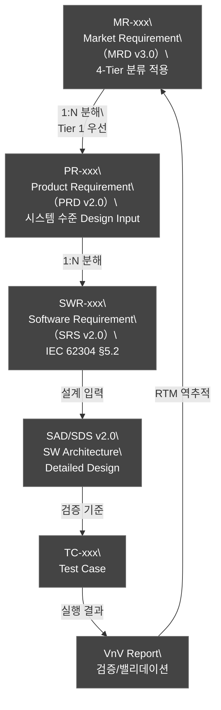
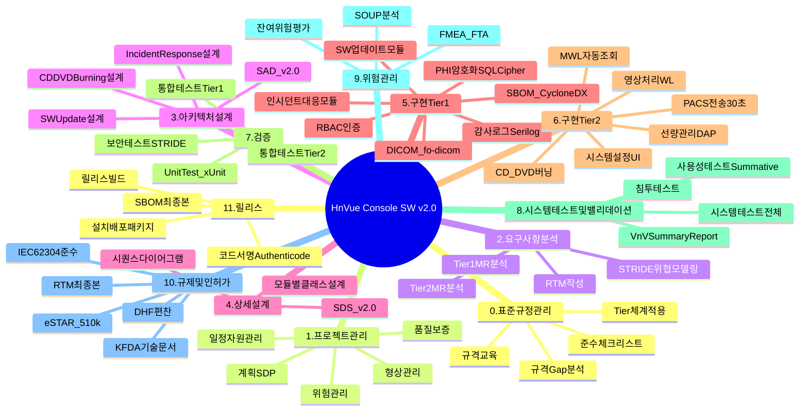
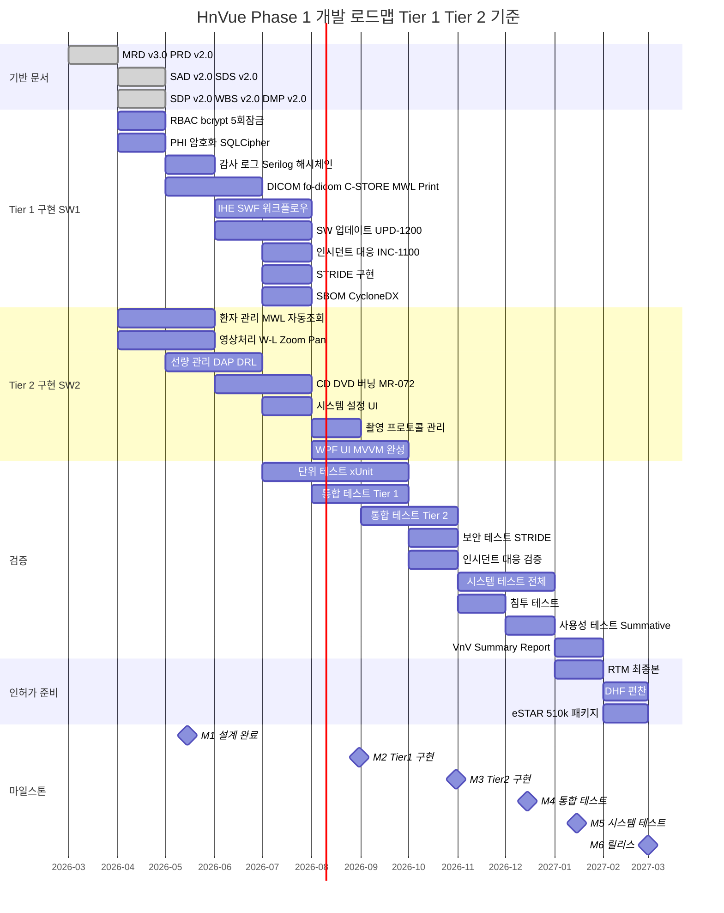
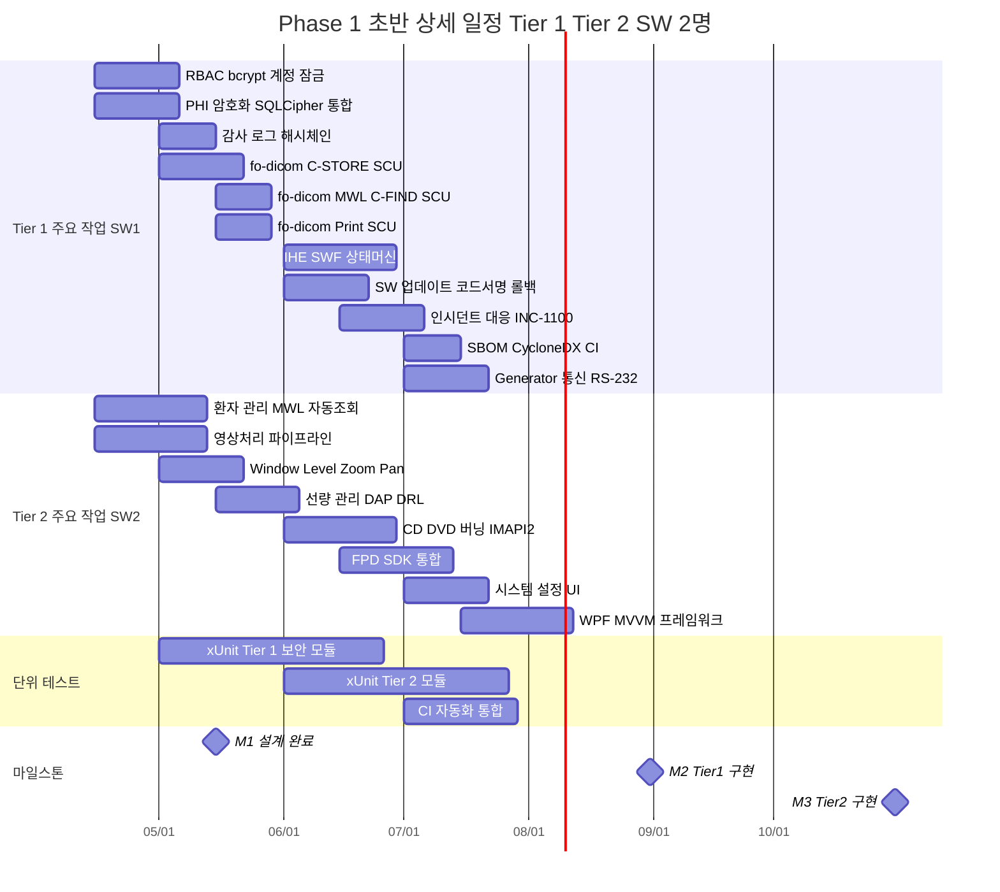
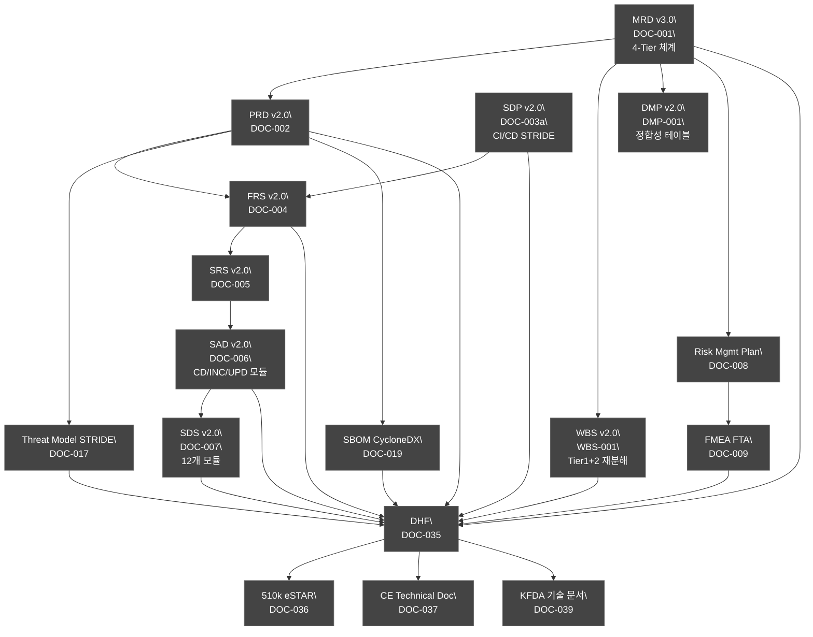

# HnVue Console SW 개발 WBS

| 항목 | 내용 |
|------|------|
| **문서 ID** | WBS-XRAY-GUI-001 |
| **버전** | v2.0 |
| **작성일** | 2026-04-03 |
| **최종 개정일** | 2026-04-03 |
| **기준 규격** | IEC 62304:2006+AMD1:2015, IEC 62366-1:2015+AMD1:2020, ISO 14971:2019, ISO 13485:2016, FDA 21 CFR Part 820.30, FDA Section 524B, EU MDR 2017/745, IEC 81001-5-1:2021 |
| **SW Safety Class** | Class B (IEC 62304) |
| **우선순위 체계** | 4-Tier (Tier 1/2/3/4) — MRD v3.0 기준 |
| **개발 전략** | Phase 1 (Tier 1+2 기능) → Phase 2 (Tier 3 기능) |
| **개발 인원** | SW 2명 (24 – 36 MM 기준) |
| **참조 문서** | MRD v3.0, PRD v2.0, SAD v2.0, SDP v2.0, DMP v2.0 |

---

## 문서 개정 이력

| 버전 | 일자 | 개정 내용 | 작성자 |
|------|------|-----------|--------|
| v1.0 | 2026-03-27 | 최초 작성 | — |
| v2.0 | 2026-04-03 | 4-Tier 우선순위 체계 반영 (P1–P4 제거); Phase 1 작업을 Tier 1/Tier 2 기준으로 재분해; Gantt 차트 Phase 1 상세화 (24 – 36 MM, SW 2명); 마일스톤 6개 추가 (M1 설계완료, M2 Tier1구현, M3 Tier2구현, M4 통합테스트, M5 시스템테스트, M6 릴리스); CD/DVD Burning (MR-072), 인시던트 대응 (MR-037), SW 업데이트 (MR-039) 작업 항목 추가; Gantt 문법 준수 (이모지 금지, 괄호 금지, em dash 금지) | — |

---

## 목차

1. [개발 범위 및 Phase 정의](#1-개발-범위-및-phase-정의)
2. [4-Tier 우선순위 체계 및 마일스톤](#2-4-tier-우선순위-체계-및-마일스톤)
3. [Milestone 정의 (v2.0)](#3-milestone-정의-v20)
4. [Phase Gate 프로세스](#4-phase-gate-프로세스)
5. [WBS 구조 Mindmap](#5-wbs-구조-mindmap)
6. [Phase 1 Gantt Chart (Tier 1+2 상세)](#6-phase-1-gantt-chart-tier-12-상세)
7. [WBS 상세 작업 항목 (Tier 1/2 기준 재분해)](#7-wbs-상세-작업-항목)
8. [인허가 문서 체계도](#8-인허가-문서-체계도)
- [부록 A. 약어 및 용어 정의](#부록-a-약어-및-용어-정의)

---

## 1. 개발 범위 및 Phase 정의

| Phase | 기간 | Tier 범위 | 핵심 기능 | 비고 |
|-------|------|----------|----------|------|
| **Phase 1** | M1 – M12 | Tier 1 + Tier 2 | 촬영 워크플로우, DICOM C-STORE/MWL/Print, RBAC, PHI 암호화, 감사 로그, SBOM, 인시던트 대응, SW 업데이트, CD/DVD 버닝, 선량 관리, 사용성 엔지니어링 | 시장 출시 (FDA 510(k) / CE / KFDA) |
| **Phase 2** | M13 – M24 | Tier 3 | AI 통합, 고급 영상처리, Analytics Dashboard, Cloud Connectivity, MPPS, Storage Commitment, Q/R SCU | 경쟁력 강화 |

---

## 2. 4-Tier 우선순위 체계 및 마일스톤

### 2.1 ID 체계 계층 구조

### 2.2 4-Tier 분류 기준

| Tier | 의미 | Phase 1 포함 | 예시 MR |
|------|------|:---:|---------|
| **Tier 1** | 없으면 인허가 불가 | 필수 | MR-019/020/033/034/035/036/037/039/050 |
| **Tier 2** | 없으면 팔 수 없다 | 필수 | MR-001/002/003/004/007/072 |
| **Tier 3** | 있으면 좋고 | Phase 2+ | MR-015/016/017 |
| **Tier 4** | 비현실적/과도 | 보류 | MR-060/061 |

---

## 3. Milestone 정의 (v2.0)

| MS ID | Milestone | 목표 시기 | Tier 1 완료 기준 | Tier 2 완료 기준 | Phase Gate |
|-------|-----------|----------|-----------------|-----------------|-----------|
| **M1** | 설계 완료 | 2026-05-15 | Tier 1 SWR 전체 SAD/SDS 반영 확인 | Tier 2 SWR 전체 SAD/SDS 반영 확인 | DR#2 설계 입력 검토 |
| **M2** | Tier 1 구현 | 2026-08-31 | RBAC/PHI암호화/감사로그/DICOM/IHE SWF/인시던트/SW업데이트/STRIDE 구현 완료 | — | DR#3 설계 출력 검토 |
| **M3** | Tier 2 구현 | 2026-10-31 | — | MWL/PACS전송/W-L/Zoom/DAP/CD버닝/시스템설정 구현 완료 | — |
| **M4** | 통합 테스트 | 2026-12-15 | Tier 1 통합 테스트 전체 통과 | Tier 2 통합 테스트 전체 통과 | DR#4 검증 완료 검토 |
| **M5** | 시스템 테스트 | 2027-01-15 | Tier 1 시스템 테스트 전체 통과 | Tier 2 시스템 테스트 전체 통과 | DR#4 검증/밸리데이션 |
| **M6** | 릴리스 | 2027-03-01 | DHF 완성, eSTAR 제출 준비 완료 | — | DR#5 인허가 게이트 |

---

## 4. Phase Gate 프로세스

---

## 5. WBS 구조 Mindmap

---

## 6. Phase 1 Gantt Chart (Tier 1+2 상세)

### 6.1 Phase 1 전체 Gantt (24 – 36 MM, SW 2명)

### 6.2 Phase 1 초반 상세 Gantt (2026년 4월 – 2026년 10월)

---

## 7. WBS 상세 작업 항목

### 7.1 Tier 1 작업 항목 (인허가 필수)

> **목표:** Phase 1에서 완전 구현. Tier 1 미완성 시 인허가 불가.

| WBS ID | 작업 항목 | MR 연계 | 담당 | 관련 SAD 모듈 | Phase Gate | Phase |
|--------|----------|---------|------|--------------|-----------|-------|
| 5.1.1 | RBAC 구현 (4역할: Radiographer/Radiologist/Admin/Service) | MR-033 | SW1 | SAD-CS-700 | M2 | P1 |
| 5.1.2 | bcrypt 패스워드 해싱 (비용=12) 구현 | MR-033 | SW1 | SAD-CS-700 | M2 | P1 |
| 5.1.3 | 5회 연속 실패 계정 잠금 구현 | MR-033 | SW1 | SAD-CS-700 | M2 | P1 |
| 5.1.4 | PHI 암호화 — SQLCipher AES-256 적용 | MR-034 | SW1 | SAD-DB-900 | M2 | P1 |
| 5.1.5 | TLS 1.3 네트워크 암호화 적용 | MR-034 | SW1 | SAD-DC-500 | M2 | P1 |
| 5.1.6 | 감사 로그 — Serilog HMAC-SHA256 해시체인 구현 | MR-035 | SW1 | SAD-CS-700 | M2 | P1 |
| 5.1.7 | SBOM — CycloneDX MSBuild CI 통합 | MR-036 | SW1 | CI/CD | M2 | P1 |
| 5.1.8 | fo-dicom 5.x C-STORE SCU 구현 | MR-019 | SW1 | SAD-DC-500 | M2 | P1 |
| 5.1.9 | fo-dicom 5.x MWL C-FIND SCU 구현 | MR-019 | SW1 | SAD-DC-500 | M2 | P1 |
| 5.1.10 | fo-dicom 5.x Print SCU 구현 | MR-019 | SW1 | SAD-DC-500 | M2 | P1 |
| 5.1.11 | IHE SWF 촬영 워크플로우 상태머신 구현 | MR-020 | SW1 | SAD-WF-200 | M2 | P1 |
| 5.1.12 | 인시던트 대응 모듈 구현 (IEC 81001-5-1) | MR-037 | SW1 | SAD-INC-1100 | M2 | P1 |
| 5.1.13 | CVD 프로세스 + CVE 모니터링 구현 | MR-037 | SW1 | SAD-INC-1100 | M2 | P1 |
| 5.1.14 | SW 업데이트 모듈 — Authenticode 코드 서명 검증 | MR-039 | SW1 | SAD-UPD-1200 | M2 | P1 |
| 5.1.15 | SW 업데이트 모듈 — SHA-256 해시 검증 구현 | MR-039 | SW1 | SAD-UPD-1200 | M2 | P1 |
| 5.1.16 | SW 업데이트 모듈 — 자동 롤백 구현 | MR-039 | SW1 | SAD-UPD-1200 | M2 | P1 |
| 5.1.17 | STRIDE 위협 모델 기반 보안 통제 구현 | MR-050 | SW1 | SAD-CS-700 | M2 | P1 |
| 5.1.18 | Generator 통신 인터페이스 (RS-232/TCP) | MR-020 | SW1 | SAD-WF-200 | M2 | P1 |
| 5.1.19 | 선량 인터락 안전 로직 구현 | MR-020 | SW1 | SAD-DM-400 | M2 | P1 |
| 5.1.20 | 세션 자동 잠금 (JWT 15분) | MR-033 | SW1 | SAD-CS-700 | M2 | P1 |
| WP-T1-ERR | 에러 처리 매트릭스 구현 — 안전 상태 전환 + Polly 재시도 + 워치독 | MR-031, MR-044 | SW1 | SDS 13장 | M2 | P1 |

### 7.2 Tier 2 작업 항목 (시장 진입 필수)

> **목표:** Phase 1에서 완전 구현. Tier 2 미완성 시 시장 진입 불가.

| WBS ID | 작업 항목 | MR 연계 | 담당 | 관련 SAD 모듈 | Phase Gate | Phase |
|--------|----------|---------|------|--------------|-----------|-------|
| 5.2.1 | MWL 자동 조회 (10초 주기 폴링) | MR-001 | SW2 | SAD-PM-100 | M3 | P1 |
| 5.2.2 | PACS 전송 30초 이내 (비동기 파이프라인) | MR-002 | SW2 | SAD-WF-200 | M3 | P1 |
| 5.2.3 | 영상 W/L 자동/수동 조정 | MR-003 | SW2 | SAD-IP-300 | M3 | P1 |
| 5.2.4 | 영상 Zoom/Pan 기능 | MR-004 | SW2 | SAD-IP-300 | M3 | P1 |
| 5.2.5 | 영상 회전/반전 기능 | MR-005 | SW2 | SAD-IP-300 | M3 | P1 |
| 5.2.6 | 시스템 설정 UI (DICOM AE Title, 네트워크) | MR-006 | SW2 | SAD-SA-600 | M3 | P1 |
| 5.2.7 | DAP 실시간 표시 (선량 지시계) | MR-007 | SW2 | SAD-DM-400 | M3 | P1 |
| 5.2.8 | DRL 경고 알림 (촬영 전 인터락) | MR-008 | SW2 | SAD-DM-400 | M3 | P1 |
| 5.2.9 | FPD SDK 통합 (GigE/USB3 영상 수신) | MR-010 | SW2 | SAD-IP-300 | M3 | P1 |
| 5.2.10 | **CD/DVD 버닝 — IMAPI2 기반 구현** | **MR-072** | SW2 | SAD-CD-1000 | M3 | P1 |
| 5.2.11 | CD/DVD 버닝 — DICOM Viewer 번들 패키징 | MR-072 | SW2 | SAD-CD-1000 | M3 | P1 |
| 5.2.12 | CD/DVD 버닝 — AES-256 암호화 적용 | MR-072 | SW2 | SAD-CD-1000 | M3 | P1 |
| 5.2.13 | CD/DVD 버닝 — 감사 로그 연동 | MR-072 | SW2 | SAD-CD-1000 | M3 | P1 |
| 5.2.14 | 촬영 프로토콜 관리 (라이브러리 편집) | MR-013 | SW2 | SAD-SA-600 | M3 | P1 |
| 5.2.15 | 자동 로그인 잠금 (15분 비활동) | MR-011 | SW2 | SAD-CS-700 | M3 | P1 |
| 5.2.16 | WPF MVVM 프레임워크 완성 | MR-051 | SW2 | SAD-UI-800 | M3 | P1 |
| 5.2.17 | 환자 검색 기능 (이름/ID/날짜 필터) | MR-014 | SW2 | SAD-PM-100 | M3 | P1 |
| 5.2.18 | DICOM RDSR 생성 및 전송 | MR-007 | SW2 | SAD-DM-400 | M3 | P1 |

### 7.3 검증 작업 항목 (Tier 1+2 기준)

| WBS ID | 작업 항목 | 대상 Tier | 담당 | Phase Gate | Phase |
|--------|----------|----------|------|-----------|-------|
| 7.1.1 | xUnit 단위 테스트 — Tier 1 모듈 전체 | Tier 1 | SW1+SW2 | M2 | P1 |
| 7.1.2 | xUnit 단위 테스트 — Tier 2 모듈 전체 | Tier 2 | SW1+SW2 | M3 | P1 |
| 7.1.3 | Coverlet 커버리지 ≥80% 달성 | Tier 1+2 | SW1+SW2 | M2 | P1 |
| 7.2.1 | 통합 테스트 — Tier 1 (DICOM, 보안, 워크플로우) | Tier 1 | QA | M4 | P1 |
| 7.2.2 | 통합 테스트 — Tier 2 (MWL, CD 버닝, 선량) | Tier 2 | QA | M4 | P1 |
| 7.2.3 | 보안 테스트 — STRIDE 6개 시나리오 | Tier 1 | Security | M4 | P1 |
| 7.2.4 | 인시던트 대응 검증 — Critical 이벤트 시뮬레이션 | Tier 1 | Security | M4 | P1 |
| 7.2.5 | SW 업데이트 검증 — 서명 검증/롤백 시나리오 | Tier 1 | QA | M4 | P1 |
| 7.2.6 | CD 버닝 검증 — 실제 미디어 굽기/무결성 확인 | Tier 2 | QA | M4 | P1 |
| 7.3.1 | 시스템 테스트 — End-to-End 촬영 워크플로우 | Tier 1+2 | QA | M5 | P1 |
| 7.3.2 | 성능 테스트 — PACS 전송 30초 이내 검증 | Tier 2 | QA | M5 | P1 |
| 7.3.3 | 침투 테스트 — 외부 보안 전문가 | Tier 1 | Security | M5 | P1 |
| 7.3.4 | 사용성 테스트 Summative (방사선사 10명+) | Tier 1+2 | QA/UX | M5 | P1 |

### 7.4 인허가/DHF 작업 항목

| WBS ID | 작업 항목 | 인허가 문서 ID | 담당 | Phase Gate | Phase |
|--------|----------|--------------|------|-----------|-------|
| 9.1 | DICOM Conformance Statement 작성 | DOC-038 | Dev/SE | M4 | P1 |
| 9.2 | RTM 최종본 작성 및 검증 | DOC-032 | QA/SE | M5 | P1 |
| 9.3 | SBOM 최종본 제출 (CycloneDX 형식) | DOC-019 | Dev/Security | M5 | P1 |
| 9.4 | V&V Summary Report 작성 | DOC-025 | QA | M5 | P1 |
| 9.5 | DHF 편찬 | DOC-035 | RA/QA | M6 | P1 |
| 9.6 | eSTAR 510(k) 패키지 완성 | DOC-036 | RA | M6 | P1 |
| 9.7 | CE Technical Documentation | DOC-037 | RA | M6 | P1 |
| 9.8 | KFDA 기술 문서 | DOC-039 | RA | M6 | P1 |
| 9.9 | IEC 62304 준수 체크리스트 완성 | — | QA | M6 | P1 |
| 9.10 | IEC 81001-5-1 인시던트 대응 준수 체크리스트 | — | Security | M6 | P1 |

---

## 8. 인허가 문서 체계도

---

## 부록 A. 약어 및 용어 정의

| 약어 | 풀 네임 |
|------|---------|
| WBS | Work Breakdown Structure (작업 분해 구조) |
| Tier 1 | 없으면 인허가 불가 (MRD v3.0 기준) |
| Tier 2 | 없으면 팔 수 없다 (시장 진입 필수) |
| MS | Milestone (마일스톤) |
| DR | Design Review (설계 검토) |
| DHF | Design History File (설계 이력 파일) |
| RTM | Requirements Traceability Matrix |
| SBOM | Software Bill of Materials |
| CycloneDX | SBOM 표준 형식 |
| STRIDE | Spoofing/Tampering/Repudiation/Information Disclosure/DoS/Elevation of Privilege |
| IEC 81001-5-1 | 의료 SW 보안 — 인시던트 대응 규격 |
| FDA 524B | FDA 사이버보안 요구사항 |
| IMAPI2 | Image Mastering API v2 (CD/DVD 굽기) |
| fo-dicom | .NET DICOM 라이브러리 (v5.x) |
| SQLCipher | AES-256 암호화 SQLite |
| Serilog | .NET 구조화 로깅 (감사 로그 해시체인) |
| xUnit | .NET 단위 테스트 프레임워크 |
| Authenticode | Microsoft 코드 서명 표준 |
| MM | Man-Month (인월) |
| SW1 | Lead Developer (수석 개발자) |
| SW2 | Developer (개발자) |
