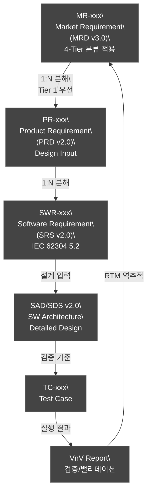
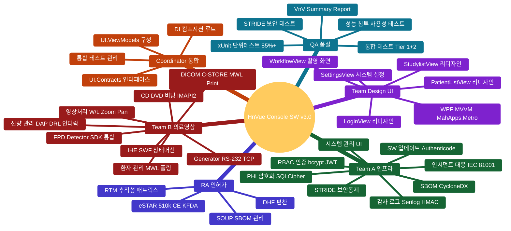
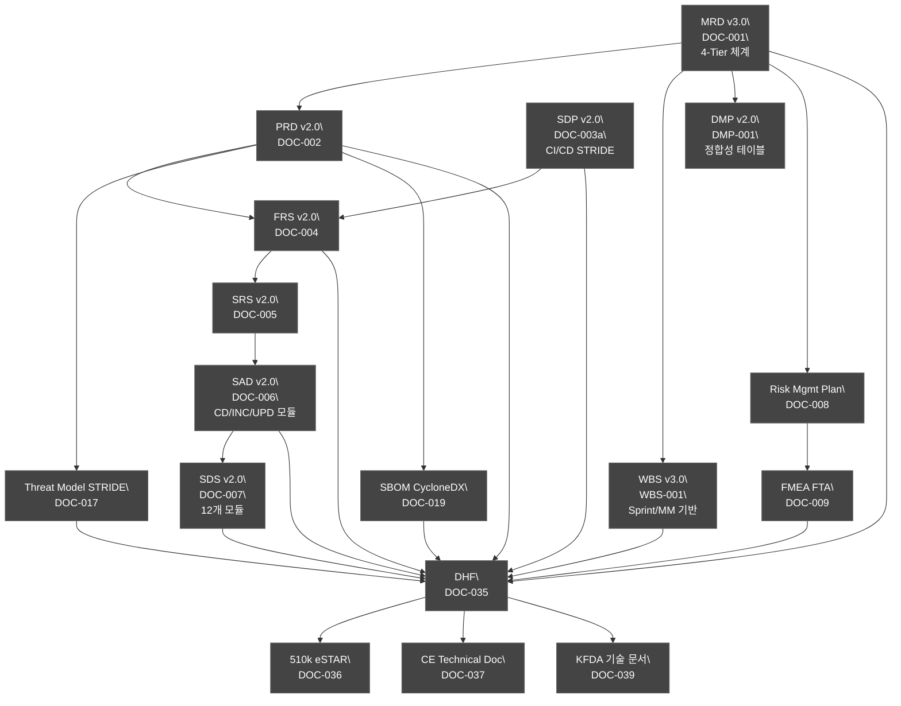

# HnVue Console SW 개발 WBS

| 항목 | 내용 |
|------|------|
| **문서 ID** | WBS-XRAY-GUI-001 |
| **버전** | v3.1 |
| **작성일** | 2026-04-03 |
| **최종 개정일** | 2026-04-10 |
| **기준 규격** | IEC 62304:2006+AMD1:2015, IEC 62366-1:2015+AMD1:2020, ISO 14971:2019, ISO 13485:2016, FDA 21 CFR Part 820.30, FDA Section 524B, EU MDR 2017/745, IEC 81001-5-1:2021 |
| **Software Safety Class** | Class B (IEC 62304) |
| **우선순위 체계** | 4-Tier (Tier 1/2/3/4) -- MRD v3.0 기준 |
| **개발 전략** | Phase 1 (Tier 1+2 기능) -> Phase 2 (Tier 3 기능) |
| **개발 인원** | Software 2명 (24 -- 36 MM 기준) |
| **일정 단위** | Sprint (1 Sprint = 0.5 MM), 총 24 Sprint / 12M |
| **참조 문서** | MRD v3.0, PRD v2.0, SAD v2.0, SDP v2.0, DMP v2.0 |
| **약어 규칙** | SW, HW, GUI, API, DB, UI, UX, OS 등은 풀 네임 사용 |

---

## 문서 개정 이력

| 버전 | 일자 | 개정 내용 | 작성자 |
|------|------|-----------|--------|
| v1.0 | 2026-03-27 | 최초 작성 | -- |
| v2.0 | 2026-04-03 | 4-Tier 우선순위 체계 반영; Phase 1 Tier 1/2 기준 재분해; Gantt Chart 상세화; 마일스톤 6개 추가 | -- |
| v3.0 | 2026-04-10 | Gantt 팀 단위 재구성; MM 배분 명시 (31.5 MM); 마인드맵 색상 개선 | MoAI |
| **v3.1** | **2026-04-10** | **전면 개정**: (1) 파일명/내용 버전 정합성 수정 (v2.0 파일 -> v3.0 파일); (2) Sprint/MM 기반 일정 체계로 전환 (YYYY-MM 완전 제거); (3) 통합 마일스톤 I1-I4 신설 (팀 간 Integration 체크포인트); (4) QA/RA 게이트 작업을 마일스톤별로 분산 배치; (5) Gantt 색상 범례 적용 기준 명확화; (6) AI 에이전트 작업 세션(Sprint/DISPATCH) 기반 일정 관리 체계 도입; (7) 기존 v2.0은 docs/archive/로 이동 | MoAI |

---

## 목차

1. [개발 범위 및 Phase 정의](#1-개발-범위-및-phase-정의)
2. [4-Tier 우선순위 체계 및 마일스톤](#2-4-tier-우선순위-체계-및-마일스톤)
3. [Sprint 체계 및 마일스톤 정의](#3-sprint-체계-및-마일스톤-정의)
4. [Phase Gate 프로세스](#4-phase-gate-프로세스)
5. [WBS 구조 Mindmap](#5-wbs-구조-mindmap)
6. [Phase 1 Gantt Chart -- Sprint/MM 기반](#6-phase-1-gantt-chart----sprintmm-기반)
7. [WBS 상세 작업 항목 (Tier 1/2 기준 재분해)](#7-wbs-상세-작업-항목)
8. [인허가 문서 체계도](#8-인허가-문서-체계도)
- [부록 A. 약어 및 용어 정의](#부록-a-약어-및-용어-정의)

---

## 1. 개발 범위 및 Phase 정의

| Phase | 기간 | Tier 범위 | 핵심 기능 | 비고 |
|-------|------|----------|----------|------|
| **Phase 1** | S01 -- S24 (12M, 24--36 MM) | Tier 1 + Tier 2 | 촬영 워크플로우, DICOM C-STORE/MWL/Print, RBAC, PHI 암호화, 감사 로그, SBOM, 인시던트 대응, SW 업데이트, CD/DVD 버닝, 선량 관리, 사용성 엔지니어링 | 시장 출시 (FDA 510(k) / CE / KFDA) |
| **Phase 2** | S25 -- S48 (12M) | Tier 3 | AI 통합, 고급 영상처리, Analytics Dashboard, Cloud Connectivity, MPPS, Storage Commitment, Q/R SCU | 경쟁력 강화 |

---

## 2. 4-Tier 우선순위 체계 및 마일스톤

### 2.1 ID 체계 계층 구조

### 2.2 4-Tier 분류 기준

| Tier | 의미 | Phase 1 포함 | 예시 MR |
|------|------|:---:|---------|
| **Tier 1** | 없으면 인허가 불가 | 필수 | MR-019/020/033/034/035/036/037/039/050 |
| **Tier 2** | 없으면 팔 수 없다 | 필수 | MR-001/002/003/004/007/072 |
| **Tier 3** | 있으면 좋고 | Phase 2+ | MR-015/016/017 |
| **Tier 4** | 비현실적/과도 | 보류 | MR-060/061 |

---

## 3. Sprint 체계 및 마일스톤 정의

### 3.1 Sprint 정의

- **1 Sprint = 0.5 MM** (AI 에이전트 1 작업 세션 단위)
- **1개월 = 2 Sprint** (SW 2명 기준 월 2.0 MM 투입)
- **Phase 1 총량**: 24 Sprint = 12개월 = 24--36 MM

### 3.2 Sprint-마일스톤 매핑

| Sprint 구간 | 누적 MM | 마일스톤 | 핵심 기준 |
|------------|---------|----------|----------|
| **S01--S05** | 0 -- 5.0 | **M1** 설계 완료 | SWR 전체 SAD/SDS 반영, STRIDE 완성 |
| S05 직후 | 5.0 | **I1** DI 통합 검증 | App.xaml.cs Null Stub -> 실 Repo 교체 검증 |
| **S06--S12** | 5.0 -- 12.0 | **M2** Tier 1 구현 | RBAC/PHI/DICOM/IHE/인시던트/업데이트/STRIDE |
| S12 직후 | 12.0 | **I2** Tier 1 통합 빌드 | 솔루션 빌드 + 전체 통합테스트 Green |
| **S13--S16** | 12.0 -- 16.0 | **M3** Tier 2 구현 | MWL/영상처리/선량/CD버닝/UI완성 |
| S16 직후 | 16.0 | **I3** Tier 2 통합 빌드 | 전체 기능 통합 + UI 연동 검증 |
| **S17--S19** | 16.0 -- 19.0 | **M4** 통합 테스트 | Tier 1+2 통합 테스트 전체 통과 |
| S19 직후 | 19.0 | **I4** 릴리스 후보 빌드 | RC 빌드 + 전체 회귀 테스트 |
| **S20--S21** | 19.0 -- 21.0 | **M5** 시스템 테스트 | E2E/침투/사용성 테스트 통과 |
| **S22--S24** | 21.0 -- 24.0 | **M6** 릴리스 | DHF 완성, eSTAR 제출 |

### 3.3 통합 마일스톤 상세 (I1--I4)

| ID | 통합 마일스톤 | 시점 (MM) | 참여 팀 | 검증 내용 | 완료 기준 |
|----|-------------|----------|---------|----------|----------|
| **I1** | DI 통합 검증 | 5.0 MM | Coordinator, Team A, Team B | App.xaml.cs Null Stub 6개 -> 실 Repository DI 교체 | 솔루션 빌드 0 error, DI 통합테스트 Green |
| **I2** | Tier 1 통합 빌드 | 12.0 MM | 전체 6팀 | Tier 1 전체 모듈 통합 빌드 + 통합테스트 | 0 error, 0 fail, 커버리지 85%+ |
| **I3** | Tier 2 통합 빌드 | 16.0 MM | 전체 6팀 | Tier 1+2 전체 기능 통합 + UI 연동 | 전체 회귀테스트 통과, UI E2E 기본 통과 |
| **I4** | 릴리스 후보 빌드 | 19.0 MM | 전체 + QA | Release Candidate 빌드 검증 | RC 빌드 서명, 전체 회귀 Green, 릴리스 체크리스트 80%+ |

### 3.4 마일스톤별 QA 게이트 작업

| 마일스톤 | QA 작업 | 배분 MM |
|----------|---------|---------|
| **M1** (설계완료) | 테스트 전략 수립, CI 파이프라인 완성, 커버리지 도구 설정 | 0.5 |
| **I1** (DI통합) | DI 통합테스트 실행, 커버리지 베이스라인 측정 | 0.25 |
| **M2** (Tier1) | Tier 1 단위테스트 85%+, STRIDE 6시나리오 보안테스트, 정적분석 | 1.0 |
| **I2** (Tier1통합) | 솔루션 전체 빌드 검증, 통합테스트 실행, Roslyn 분석 | 0.25 |
| **M3** (Tier2) | Tier 2 단위테스트 85%+, 성능 벤치마크 (PACS 30초), 뮤테이션 테스트 | 0.75 |
| **I3** (Tier2통합) | 전체 회귀테스트, 커버리지 85%+ 확인, Architecture 규칙 검증 | 0.25 |
| **M4** (통합테스트) | 통합테스트 전체 통과, STRIDE 6시나리오 실행, SW 업데이트/CD 버닝 검증 | 0.5 |
| **I4** (RC빌드) | RC 빌드 검증, DOC-034 릴리스 체크리스트 실행 | 0.25 |
| **M5** (시스템테스트) | E2E 촬영 워크플로우, 침투 테스트, 사용성 Summative (방사선사 10명+) | 0.5 |
| **M6** (릴리스) | VnV Summary Report 완성, 릴리스 최종 승인 | 0.25 |
| | **QA 합계** | **4.5 MM** |

### 3.5 마일스톤별 RA 게이트 작업

| 마일스톤 | RA 작업 | 배분 MM |
|----------|---------|---------|
| **M1** (설계완료) | RTM 초안 작성 (SWR -> TC 매핑), STRIDE 위협모델 검토, DOC-042 CMP 완성 | 0.5 |
| **M2** (Tier1) | RTM 중간본 (Tier 1 SWR 100% 매핑), SOUP 분석 완료, SBOM 갱신 | 0.5 |
| **M3** (Tier2) | RTM 갱신 (Tier 2 SWR 매핑), FRS/SRS 추적성 검증, FMEA 검토 | 0.25 |
| **M4** (통합테스트) | 잔여위험 평가, FMEA 최종본, RMR 갱신, SBOM 최종 검증 | 0.25 |
| **I4** (RC빌드) | DHF 편찬 시작, eSTAR 초안, IEC 62304 준수 체크리스트 | 0.25 |
| **M5** (시스템테스트) | V&V Summary 검토, RTM 최종본 승인, Known Anomalies 0건 확인 | 0.25 |
| **M6** (릴리스) | DHF 완성, eSTAR 510(k) 패키지, CE Technical Doc, KFDA 문서 | 1.0 |
| | **RA 합계** | **3.0 MM** |

---

## 4. Phase Gate 프로세스

---

## 5. WBS 구조 Mindmap

---

## 6. Phase 1 Gantt Chart -- Sprint/MM 기반

### 6.1 Gantt 색상 범례

| 범례 | Mermaid 마커 | 렌더링 색상 | 의미 | 적용 기준 |
|------|-------------|------------|------|----------|
| 완료 | `:done` | **회색** (#bbb) 채움 | 구현 + 테스트 통과 확인 | Git 커밋 + 테스트 Green |
| 진행 | `:active` | **파란색** (#409EFF) 채움 | 현재 Sprint에서 작업중 | DISPATCH 발행 상태 |
| 차단 | `:crit` | **빨간색** (#ff3860) 채움 | 외부 의존 또는 일정 위험 | HW/벤더 미확보, 일정 지연 |
| 계획 | (마커 없음) | **연파란색** (#78c1f3) 채움 | 미착수 | Sprint 미도래 |
| 마일스톤 | `:milestone` | **마름모** 기호 | Phase Gate 또는 통합 체크포인트 | M1-M6, I1-I4 |

> **범례 해석**: 채움 색상은 해당 작업 바(bar)의 배경색이며, Mermaid 기본 테마 기준입니다. 각 상태 마커는 작업의 현재 진행 상태를 나타냅니다.

### 6.2 Team별 MM 배분 -- 총 31.5 MM / SW 2명 / 24 Sprint

| Team | 배분 MM | 비율 | 모듈 영역 |
|------|---------|------|----------|
| Team A -- 인프라 | 8.5 MM | 27% | Common, Data, Security, Update, SystemAdmin |
| Team B -- 의료영상 | 9.0 MM | 29% | Dicom, Detector, Imaging, Dose, Incident, Workflow, PatientManagement, CDBurning |
| Team Design -- UI | 4.5 MM | 14% | HnVue.UI Views/Styles/Components/Converters |
| Coordinator -- 통합 | 2.0 MM | 6% | UI.Contracts, UI.ViewModels, App |
| QA -- 품질 | 4.5 MM | 14% | CI/CD, 테스트 자동화, 커버리지, 검증 |
| RA -- 인허가 | 3.0 MM | 10% | RTM, DHF, eSTAR, 규제문서 |

### 6.3 Phase 1 전체 Gantt -- Sprint/MM 기반

> **읽는 법**: 축은 Sprint 번호(S01--S24)이며, 각 Sprint = 0.5 MM입니다. 바(bar)의 채움 색상은 6.1 범례를 참조하세요.

```mermaid
gantt
    title HnVue Phase 1 -- Sprint/MM 기반 로드맵
    dateFormat X
    axisFormat S%s

    section Team A 인프라 8.5MM
    RBAC bcrypt 잠금 1.0MM           :done, a1, 1, 2
    PHI 암호화 SQLCipher 1.0MM       :active, a2, 1, 2
    감사 로그 해시체인 0.5MM         :done, a3, 3, 1
    SW 업데이트 UPD 1.0MM            :active, a4, 5, 2
    인시던트 대응 INC 0.5MM          :active, a5, 5, 1
    SBOM CycloneDX 0.5MM             :active, a6, 7, 1
    STRIDE 보안통제 1.0MM            :a7, 7, 2
    TLS 1.3 네트워크 1.0MM           :a8, 9, 2
    세션 잠금 JWT 0.5MM              :a9, 9, 1
    에러 매트릭스 0.5MM              :a10, 10, 1
    시스템 관리 1.0MM                :a11, 11, 2

    section Team B 의료영상 9.0MM
    DICOM C-STORE 1.0MM              :done, b1, 1, 2
    DICOM MWL C-FIND 0.5MM           :done, b2, 1, 1
    영상처리 파이프라인 1.0MM        :done, b3, 1, 2
    IHE SWF 상태머신 1.0MM           :done, b4, 3, 2
    DICOM Print SCU 0.5MM            :b5, 4, 1
    선량 관리 DAP 0.5MM              :active, b6, 5, 1
    CD DVD 버닝 IMAPI2 1.0MM         :active, b7, 5, 2
    환자 관리 MWL 0.5MM              :active, b8, 6, 1
    FPD SDK 통합 1.0MM               :crit, b9, 7, 2
    Generator RS-232 1.0MM           :crit, b10, 8, 2
    선량 인터락 0.5MM                :b11, 10, 1
    DICOM RDSR 0.5MM                 :b12, 10, 1

    section Team Design UI 4.5MM
    Login PatientListView 0.5MM      :done, d1, 1, 1
    StudylistView 리디자인 0.5MM     :active, d2, 3, 1
    WPF MVVM 프레임워크 1.5MM        :active, d3, 4, 3
    시스템 설정 UI 0.5MM             :d4, 7, 1
    촬영 프로토콜 관리 0.5MM         :d5, 9, 1
    나머지 화면 구현 1.0MM           :d6, 11, 2

    section Coordinator 통합 2.0MM
    DI Null Stub 교체 0.5MM          :active, c1, 3, 1
    UI.Contracts 관리 0.5MM          :c2, 7, 1
    Integration Tests 1.0MM          :c3, 13, 2

    section QA 품질 4.5MM
    CI 파이프라인 테스트전략 0.5MM   :active, q0, 3, 1
    DI 통합테스트 0.25MM             :q0a, 5, 1
    xUnit Tier1 단위테스트 1.0MM     :active, q1, 4, 4
    Tier1 정적분석 STRIDE 0.5MM      :q1a, 11, 1
    xUnit Tier2 단위테스트 0.75MM    :q2, 13, 3
    성능 벤치마크 0.25MM             :q2a, 16, 1
    통합테스트 Tier1+2 0.5MM         :q3, 17, 2
    RC 빌드 검증 0.25MM              :q3a, 19, 1
    시스템 테스트 E2E 0.5MM          :q4, 20, 1
    침투 테스트 0.5MM                :q5, 20, 1
    사용성 Summative 0.5MM           :q6, 21, 1
    VnV Summary Report 0.25MM        :q7, 22, 1

    section RA 인허가 3.0MM
    RTM 초안 STRIDE 검토 0.5MM       :r0, 4, 1
    RTM 중간본 SOUP SBOM 0.5MM       :r1, 11, 1
    RTM 갱신 FRS SRS 검증 0.25MM     :r2, 15, 1
    FMEA 잔여위험 SBOM 0.25MM        :r3, 18, 1
    DHF 시작 eSTAR 초안 0.25MM       :r4, 19, 1
    VnV RTM 최종본 0.25MM            :r5, 20, 1
    DHF 완성 eSTAR 패키지 1.0MM      :r6, 22, 2

    section 마일스톤
    M1 설계 완료                     :milestone, m1, 5, 0
    I1 DI 통합 검증                  :milestone, i1, 5, 0
    M2 Tier1 구현                    :milestone, m2, 12, 0
    I2 Tier1 통합 빌드               :milestone, i2, 12, 0
    M3 Tier2 구현                    :milestone, m3, 16, 0
    I3 Tier2 통합 빌드               :milestone, i3, 16, 0
    M4 통합 테스트                   :milestone, m4, 19, 0
    I4 RC 빌드                       :milestone, i4, 19, 0
    M5 시스템 테스트                  :milestone, m5, 21, 0
    M6 릴리스                        :milestone, m6, 24, 0
```

### 6.4 Phase 1 초반 상세 Gantt -- S01-S12 (현재 진행 구간)

```mermaid
gantt
    title Phase 1 초반 상세 S01-S12 현재 진행 구간
    dateFormat X
    axisFormat S%s

    section Team A 인프라
    RBAC bcrypt 잠금 1.0MM           :done, a1, 1, 2
    PHI 암호화 SQLCipher 1.0MM       :active, a2, 1, 2
    감사 로그 해시체인 0.5MM         :done, a3, 3, 1
    SW 업데이트 코드서명 롤백 1.0MM  :active, a4, 5, 2
    인시던트 대응 INC 0.5MM          :active, a5, 5, 1
    SBOM CycloneDX 0.5MM             :active, a6, 7, 1
    STRIDE 보안통제 1.0MM            :a7, 7, 2

    section Team B 의료영상
    DICOM C-STORE MWL 1.5MM          :done, b1, 1, 2
    영상처리 파이프라인 1.0MM        :done, b2, 1, 2
    IHE SWF 상태머신 1.0MM           :done, b3, 3, 2
    DICOM Print SCU 0.5MM            :b4, 4, 1
    선량 관리 DAP DRL 0.5MM          :active, b5, 5, 1
    CD DVD 버닝 IMAPI2 1.0MM         :active, b6, 5, 2
    환자 관리 MWL 0.5MM              :active, b7, 6, 1
    FPD SDK 통합 1.0MM               :crit, b8, 7, 2
    Generator RS-232 1.0MM           :crit, b9, 8, 2

    section Team Design UI
    Login PatientListView 0.5MM      :done, d1, 1, 1
    StudylistView 리디자인 0.5MM     :active, d2, 3, 1
    WPF MVVM 프레임워크 1.5MM        :active, d3, 4, 3

    section Coordinator 통합
    DI Null Stub 교체 0.5MM          :active, c1, 3, 1

    section QA 품질
    CI 파이프라인 테스트전략 0.5MM   :active, q0, 3, 1
    DI 통합테스트 0.25MM             :q0a, 5, 1
    xUnit Tier1 단위테스트 1.0MM     :active, q1, 4, 4

    section RA 인허가
    RTM 초안 STRIDE 검토 0.5MM       :r0, 4, 1

    section 마일스톤
    M1 설계 완료                     :milestone, m1, 5, 0
    I1 DI 통합 검증                  :milestone, i1, 5, 0
    M2 Tier1 구현                    :milestone, m2, 12, 0
    I2 Tier1 통합 빌드               :milestone, i2, 12, 0
```

### 6.5 현재 진행 현황 (S03 기준, 1.5M차, 소진 3.0 MM)

| 항목 | 계획 | 실적 | 판정 |
|------|------|------|------|
| **경과** | S24 (12M) | S03 (1.5M, 12.5%) | -- |
| **소진 MM** | 24--36 MM | 3.0 MM (12.5%) | -- |
| **기능 완성도** | 100% @S24 | ~48% @S03 | **선행** |
| **다음 마일스톤** | M1 @S05 (5.0 MM) | 잔여 2.0 MM | **ON TRACK** |
| **MM 효율** | 1.0배 (계획) | 3.8배 (AI 병행) | -- |

---

## 7. WBS 상세 작업 항목

### 7.1 Tier 1 작업 항목 (인허가 필수)

> **목표:** Phase 1에서 완전 구현. Tier 1 미완성 시 인허가 불가.

| WBS ID | 작업 항목 | MR 연계 | 담당 팀 | 관련 SAD 모듈 | Phase Gate | Sprint |
|--------|----------|---------|---------|--------------|-----------|--------|
| 5.1.1 | RBAC 구현 (4역할: Radiographer/Radiologist/Admin/Service) | MR-033 | Team A | SAD-CS-700 | M2 | S01-S02 |
| 5.1.2 | bcrypt 패스워드 해싱 (비용=12) 구현 | MR-033 | Team A | SAD-CS-700 | M2 | S01-S02 |
| 5.1.3 | 5회 연속 실패 계정 잠금 구현 | MR-033 | Team A | SAD-CS-700 | M2 | S01-S02 |
| 5.1.4 | PHI 암호화 -- SQLCipher AES-256 적용 | MR-034 | Team A | SAD-DB-900 | M2 | S01-S02 |
| 5.1.5 | TLS 1.3 네트워크 암호화 적용 | MR-034 | Team A | SAD-DC-500 | M2 | S09-S10 |
| 5.1.6 | 감사 로그 -- Serilog HMAC-SHA256 해시체인 구현 | MR-035 | Team A | SAD-CS-700 | M2 | S03 |
| 5.1.7 | SBOM -- CycloneDX MSBuild CI 통합 | MR-036 | Team A | CI/CD | M2 | S07 |
| 5.1.8 | fo-dicom 5.x C-STORE SCU 구현 | MR-019 | Team B | SAD-DC-500 | M2 | S01-S02 |
| 5.1.9 | fo-dicom 5.x MWL C-FIND SCU 구현 | MR-019 | Team B | SAD-DC-500 | M2 | S01-S02 |
| 5.1.10 | fo-dicom 5.x Print SCU 구현 | MR-019 | Team B | SAD-DC-500 | M2 | S04 |
| 5.1.11 | IHE SWF 촬영 워크플로우 상태머신 구현 | MR-020 | Team B | SAD-WF-200 | M2 | S03-S04 |
| 5.1.12 | 인시던트 대응 모듈 구현 (IEC 81001-5-1) | MR-037 | Team A | SAD-INC-1100 | M2 | S05-S06 |
| 5.1.13 | CVD 프로세스 + CVE 모니터링 구현 | MR-037 | Team A | SAD-INC-1100 | M2 | S05-S06 |
| 5.1.14 | SW 업데이트 모듈 -- Authenticode 코드 서명 검증 | MR-039 | Team A | SAD-UPD-1200 | M2 | S05-S06 |
| 5.1.15 | SW 업데이트 모듈 -- SHA-256 해시 검증 구현 | MR-039 | Team A | SAD-UPD-1200 | M2 | S05-S06 |
| 5.1.16 | SW 업데이트 모듈 -- 자동 롤백 구현 | MR-039 | Team A | SAD-UPD-1200 | M2 | S05-S06 |
| 5.1.17 | STRIDE 위협 모델 기반 보안 통제 구현 | MR-050 | Team A | SAD-CS-700 | M2 | S07-S08 |
| 5.1.18 | Generator 통신 인터페이스 (RS-232/TCP) | MR-020 | Team B | SAD-WF-200 | M2 | S08-S09 |
| 5.1.19 | 선량 인터락 안전 로직 구현 | MR-020 | Team B | SAD-DM-400 | M2 | S10 |
| 5.1.20 | 세션 자동 잠금 (JWT 15분) | MR-033 | Team A | SAD-CS-700 | M2 | S09 |
| WP-T1-ERR | 에러 처리 매트릭스 구현 -- 안전 상태 전환 + Polly 재시도 + 워치독 | MR-031, MR-044 | Team A | SDS 13장 | M2 | S10 |

### 7.2 Tier 2 작업 항목 (시장 진입 필수)

> **목표:** Phase 1에서 완전 구현. Tier 2 미완성 시 시장 진입 불가.

| WBS ID | 작업 항목 | MR 연계 | 담당 팀 | 관련 SAD 모듈 | Phase Gate | Sprint |
|--------|----------|---------|---------|--------------|-----------|--------|
| 5.2.1 | MWL 자동 조회 (10초 주기 폴링) | MR-001 | Team B | SAD-PM-100 | M3 | S06 |
| 5.2.2 | PACS 전송 30초 이내 (비동기 파이프라인) | MR-002 | Team B | SAD-WF-200 | M3 | S06 |
| 5.2.3 | 영상 W/L 자동/수동 조정 | MR-003 | Team B | SAD-IP-300 | M3 | S01-S02 |
| 5.2.4 | 영상 Zoom/Pan 기능 | MR-004 | Team B | SAD-IP-300 | M3 | S01-S02 |
| 5.2.5 | 영상 회전/반전 기능 | MR-005 | Team B | SAD-IP-300 | M3 | S01-S02 |
| 5.2.6 | 시스템 설정 UI (DICOM AE Title, 네트워크) | MR-006 | Design | SAD-SA-600 | M3 | S07 |
| 5.2.7 | DAP 실시간 표시 (선량 지시계) | MR-007 | Team B | SAD-DM-400 | M3 | S05 |
| 5.2.8 | DRL 경고 알림 (촬영 전 인터락) | MR-008 | Team B | SAD-DM-400 | M3 | S05 |
| 5.2.9 | FPD SDK 통합 (GigE/USB3 영상 수신) | MR-010 | Team B | SAD-IP-300 | M3 | S07-S08 |
| 5.2.10 | **CD/DVD 버닝 -- IMAPI2 기반 구현** | **MR-072** | Team B | SAD-CD-1000 | M3 | S05-S06 |
| 5.2.11 | CD/DVD 버닝 -- DICOM Viewer 번들 패키징 | MR-072 | Team B | SAD-CD-1000 | M3 | S05-S06 |
| 5.2.12 | CD/DVD 버닝 -- AES-256 암호화 적용 | MR-072 | Team B | SAD-CD-1000 | M3 | S05-S06 |
| 5.2.13 | CD/DVD 버닝 -- 감사 로그 연동 | MR-072 | Team B | SAD-CD-1000 | M3 | S05-S06 |
| 5.2.14 | 촬영 프로토콜 관리 (라이브러리 편집) | MR-013 | Design | SAD-SA-600 | M3 | S09 |
| 5.2.15 | 자동 로그인 잠금 (15분 비활동) | MR-011 | Team A | SAD-CS-700 | M3 | S09 |
| 5.2.16 | WPF MVVM 프레임워크 완성 | MR-051 | Design | SAD-UI-800 | M3 | S04-S06 |
| 5.2.17 | 환자 검색 기능 (이름/ID/날짜 필터) | MR-014 | Team B | SAD-PM-100 | M3 | S06 |
| 5.2.18 | DICOM RDSR 생성 및 전송 | MR-007 | Team B | SAD-DM-400 | M3 | S10 |

### 7.3 검증 작업 항목 (Sprint 배분)

| WBS ID | 작업 항목 | 대상 Tier | 담당 팀 | Phase Gate | Sprint |
|--------|----------|----------|---------|-----------|--------|
| 7.1.1 | xUnit 단위 테스트 -- Tier 1 모듈 전체 | Tier 1 | QA | M2 | S04-S07 |
| 7.1.2 | xUnit 단위 테스트 -- Tier 2 모듈 전체 | Tier 2 | QA | M3 | S13-S15 |
| 7.1.3 | Coverlet 커버리지 >= 85% 달성 | Tier 1+2 | QA | I3 | S04-S16 |
| 7.2.1 | 통합 테스트 -- Tier 1 (DICOM, 보안, 워크플로우) | Tier 1 | QA | M4 | S17-S18 |
| 7.2.2 | 통합 테스트 -- Tier 2 (MWL, CD 버닝, 선량) | Tier 2 | QA | M4 | S17-S18 |
| 7.2.3 | 보안 테스트 -- STRIDE 6개 시나리오 | Tier 1 | QA | M2 | S11 |
| 7.2.4 | 인시던트 대응 검증 -- Critical 이벤트 시뮬레이션 | Tier 1 | QA | M4 | S17-S18 |
| 7.2.5 | SW 업데이트 검증 -- 서명 검증/롤백 시나리오 | Tier 1 | QA | M4 | S17-S18 |
| 7.2.6 | CD 버닝 검증 -- 실제 미디어 굽기/무결성 확인 | Tier 2 | QA | M4 | S17-S18 |
| 7.3.1 | 시스템 테스트 -- End-to-End 촬영 워크플로우 | Tier 1+2 | QA | M5 | S20 |
| 7.3.2 | 성능 테스트 -- PACS 전송 30초 이내 검증 | Tier 2 | QA | M3 | S16 |
| 7.3.3 | 침투 테스트 -- 외부 보안 전문가 | Tier 1 | QA | M5 | S20 |
| 7.3.4 | 사용성 테스트 Summative (방사선사 10명+) | Tier 1+2 | QA | M5 | S21 |

### 7.4 인허가/DHF 작업 항목 (Sprint 배분)

| WBS ID | 작업 항목 | 인허가 문서 ID | 담당 팀 | Phase Gate | Sprint |
|--------|----------|--------------|---------|-----------|--------|
| 9.1 | DICOM Conformance Statement 작성 | DOC-038 | Team B | M4 | S17 |
| 9.2 | RTM 최종본 작성 및 검증 | DOC-032 | RA | M5 | S20 |
| 9.3 | SBOM 최종본 제출 (CycloneDX 형식) | DOC-019 | RA | M4 | S18 |
| 9.4 | V&V Summary Report 작성 | DOC-025 | QA | M5 | S22 |
| 9.5 | DHF 편찬 | DOC-035 | RA | M6 | S22-S23 |
| 9.6 | eSTAR 510(k) 패키지 완성 | DOC-036 | RA | M6 | S23-S24 |
| 9.7 | CE Technical Documentation | DOC-037 | RA | M6 | S23-S24 |
| 9.8 | KFDA 기술 문서 | DOC-039 | RA | M6 | S23-S24 |
| 9.9 | IEC 62304 준수 체크리스트 완성 | -- | QA | M6 | S22 |
| 9.10 | IEC 81001-5-1 인시던트 대응 준수 체크리스트 | -- | QA | M6 | S22 |

---

## 8. 인허가 문서 체계도

---

## 부록 A. 약어 및 용어 정의

| 약어 | 풀 네임 |
|------|---------|
| WBS | Work Breakdown Structure (작업 분해 구조) |
| Tier 1 | 없으면 인허가 불가 (MRD v3.0 기준) |
| Tier 2 | 없으면 팔 수 없다 (시장 진입 필수) |
| MS | Milestone (마일스톤) |
| DR | Design Review (설계 검토) |
| DHF | Design History File (설계 이력 파일) |
| RTM | Requirements Traceability Matrix |
| SBOM | Software Bill of Materials |
| CycloneDX | SBOM 표준 형식 |
| STRIDE | Spoofing/Tampering/Repudiation/Information Disclosure/DoS/Elevation of Privilege |
| IEC 81001-5-1 | 의료 SW 보안 -- 인시던트 대응 규격 |
| FDA 524B | FDA 사이버보안 요구사항 |
| IMAPI2 | Image Mastering API v2 (CD/DVD 굽기) |
| fo-dicom | .NET DICOM 라이브러리 (v5.x) |
| SQLCipher | AES-256 암호화 SQLite |
| Serilog | .NET 구조화 로깅 (감사 로그 해시체인) |
| xUnit | .NET 단위 테스트 프레임워크 |
| Authenticode | Microsoft 코드 서명 표준 |
| MM | Man-Month (인월) |
| Sprint | 작업 세션 단위 (1 Sprint = 0.5 MM) |
| SW1 | Lead Developer (수석 개발자) |
| SW2 | Developer (개발자) |
| DISPATCH | AI 에이전트 팀별 작업 지시서 |
| I1--I4 | Integration Milestone (통합 마일스톤) |
| RC | Release Candidate (릴리스 후보) |
