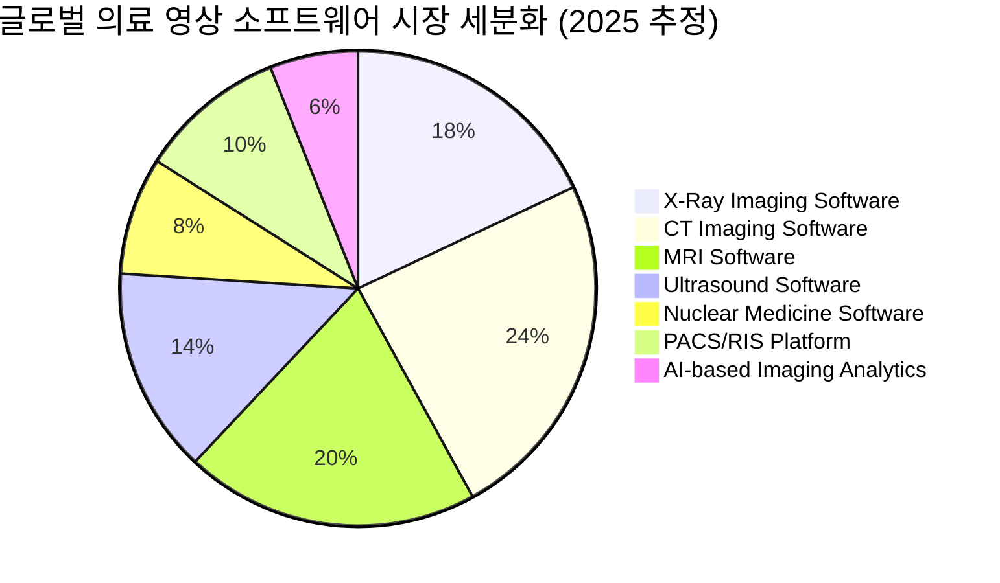
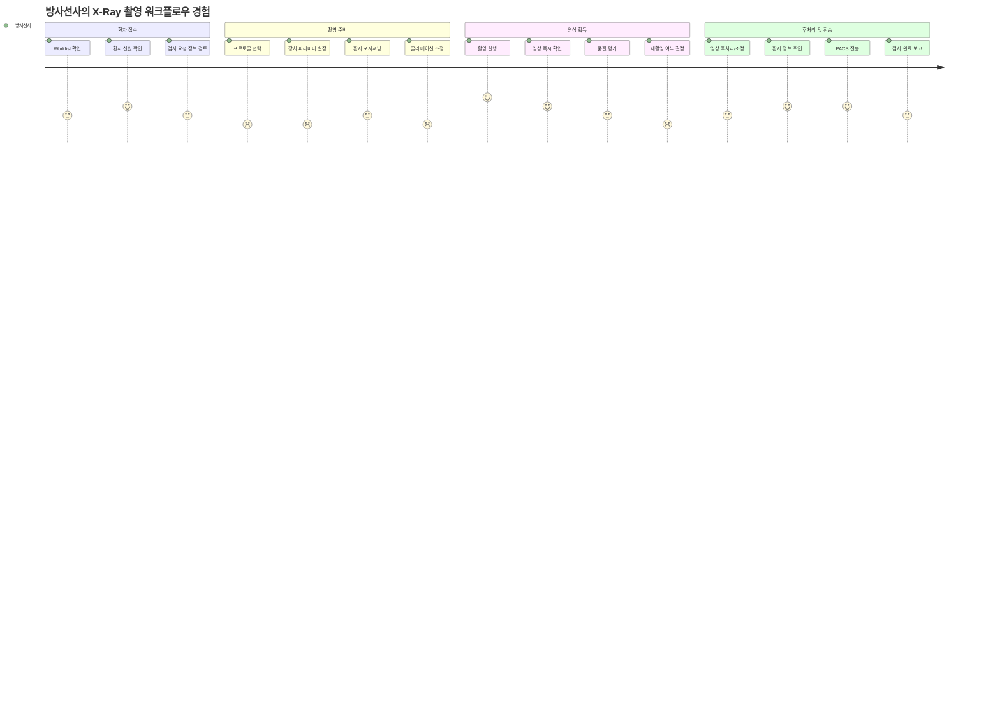
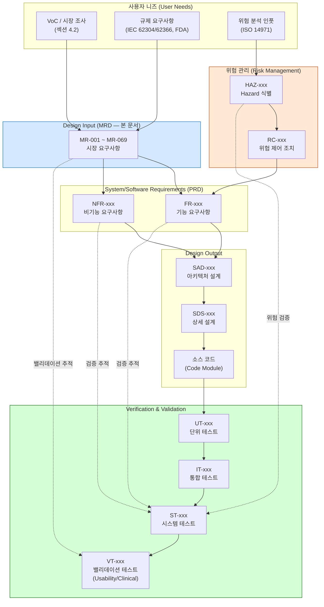
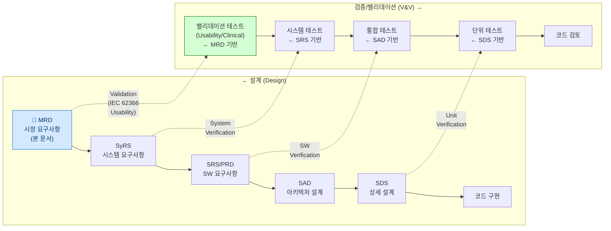
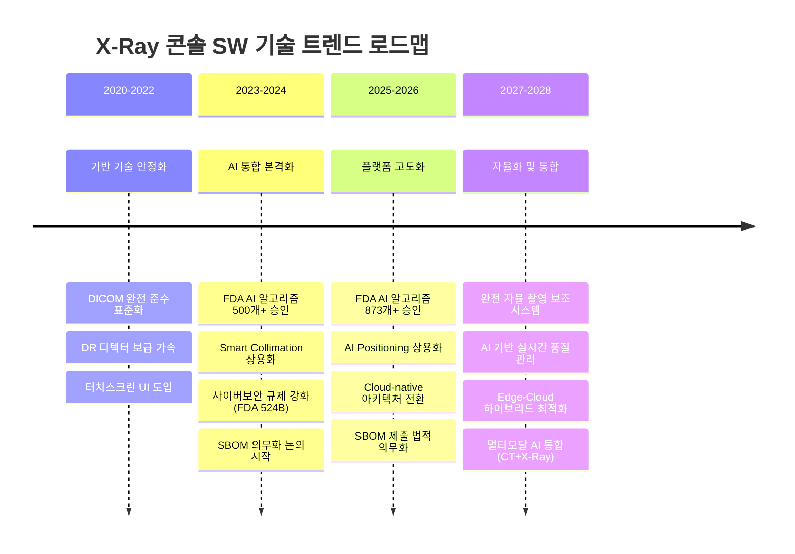
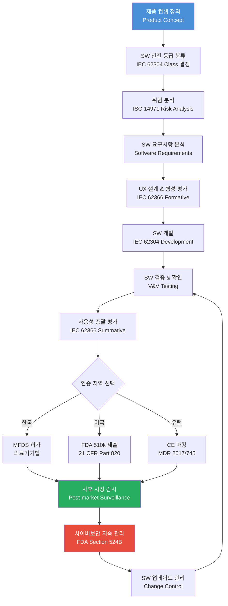
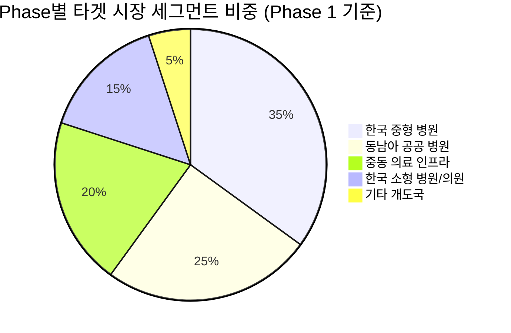
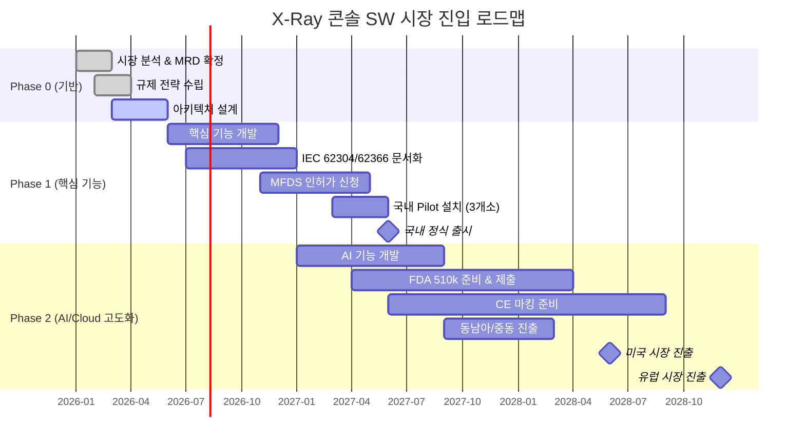

# Market Requirements Document (MRD)
## HnVue Console SW

---

| 항목 | 내용 |
|------|------|
| **문서 ID** | MRD-XRAY-GUI-001 |
| **버전** | v1.2 |
| **작성일** | 2026년 3월 16일 |
| **상태** | 검토 중 (Under Review) |
| **분류** | 대외비 (Confidential) |
| **작성자** | 전략마케팅본부 |
| **검토자** | 개발팀, 마케팅팀, RA파트 |

---

## 개정 이력 (Revision History)

| 버전 | 날짜 | 개정자 | 개정 내용 |
|------|------|--------|---------|
| v1.0 | 2026-03-27 | 전략마케팅본부 | 최초 작성 |
| v1.1 | 2026-03-27 | 전략마케팅본부 | 우선순위 체계 4단계(P1-P4) 재분류, 체크박스 선택 형식 도입, 규제-위험 기반 분류 기준 적용 |
| v1.2 | 2026-03-30 | 전략마케팅본부 | 시장 분석 팩트 데이터 업데이트(다중 출처), Console SW 전문 ISV 분석(국내 6사/국제 8사) 추가, 경쟁사 분석 확장(Samsung, DRTECH, Vieworks 추가), 기술 트렌드 최신화, 시장 조사 기반 신규 요구사항 7건 추가(MR-063~069), 기존 요구사항 3건 변경(MR-014/023/049), 총 62→69개 |

---

## 우선순위 분류 체계 (Priority Classification)

본 문서는 규제-위험 기반 4단계 우선순위 체계를 적용합니다.

| 등급 | 명칭 | 정의 | 선택 |
|------|------|------|------|
| **P1** | Regulatory Mandatory | 법규/인증 필수. 미충족 시 시판 불가 | ☑ 고정 |
| **P2** | Safety-Critical | ISO 14971 위험분석 기반 위험 제어 수단 | ☑ 고정 |
| **P3** | Clinically Important | 임상 워크플로우/진단 품질에 중요 | ☐ 선택 가능 |
| **P4** | Desirable | UX 향상/경쟁력 기능. 차기 릴리스 연기 가능 | ☐ 선택 가능 |

**분류 기준**: 규제 필수 → P1 | 위험 제어 수단 → P2 | 임상 중요도 높음 → P3 | 기타 → P4

---

## 기준 규격 (Reference Standards)

| 규격 | 제목 |
|------|------|
| IEC 62304:2006+AMD1:2015 | Medical Device Software – Software Lifecycle Processes |
| IEC 62366-1:2015+AMD1:2020 | Medical Devices – Usability Engineering |
| ISO 14971:2019 | Medical Devices – Application of Risk Management |
| ISO 13485:2016 | Medical Devices – Quality Management Systems (7.3 Design and Development) |
| FDA 21 CFR 820.30 | Design Controls |
| FDA Section 524B FD&C Act | Cybersecurity in Medical Devices (2023) |
| DICOM PS3.x | Digital Imaging and Communications in Medicine |
| IHE Radiology Technical Framework | Scheduled Workflow (SWF) Profile |
| HIPAA | Health Insurance Portability and Accountability Act |
| GDPR | General Data Protection Regulation (EU) |
| MDR 2017/745 | EU Medical Device Regulation |

---

## 목차

1. [Executive Summary](#1-executive-summary)
2. [시장 분석 (Market Analysis)](#2-시장-분석-market-analysis)
3. [경쟁 분석 (Competitive Analysis)](#3-경쟁-분석-competitive-analysis)
4. [고객 분석 (Customer Analysis)](#4-고객-분석-customer-analysis)
4a. [Design Input Baseline](#4a-design-input-baseline)
5. [시장 요구사항 (Market Requirements)](#5-시장-요구사항-market-requirements)
6. [기술 트렌드 및 시사점](#6-기술-트렌드-및-시사점)
7. [규제 환경 (Regulatory Landscape)](#7-규제-환경-regulatory-landscape)
8. [진입 전략 (Go-to-Market Strategy)](#8-진입-전략-go-to-market-strategy)
9. [성공 지표 (KPIs)](#9-성공-지표-kpis)
- [부록 A: 약어 및 용어 정의](#부록-a-약어-및-용어-정의)
- [부록 B: 참고 문헌 및 출처](#부록-b-참고-문헌-및-출처)
- [부록 C: 시장 요구사항 요약 매트릭스](#부록-c-시장-요구사항-요약-매트릭스)
- [부록 D: MRD-PRD 추적성 매트릭스 요약](#부록-d-mrd-prd-추적성-매트릭스-요약)
- [부록 E: MR-위험관리 연결 매트릭스](#부록-e-mr-위험관리-연결-매트릭스)

---

## 1. Executive Summary

### 1.1 제품 개요

본 문서는 의료용 진단 X-Ray 촬영장치에 탑재되는 **HnVue Console SW (이하 "콘솔 SW")**의 시장 요구사항을 정의한다. 콘솔 SW는 방사선사(Radiographer)가 X-Ray 촬영을 수행하는 전 과정—환자 등록, 검사 프로토콜 선택, 촬영 파라미터 설정, 영상 획득 및 후처리, PACS/RIS 전송—을 통합적으로 제어하는 핵심 사용자 인터페이스 소프트웨어이다.

콘솔 SW는 단순한 장치 제어 인터페이스를 넘어, 임상 워크플로우 최적화, AI 기반 영상 품질 향상, 사이버보안 내재화, 규제 준수 자동화를 구현하는 **디지털 헬스케어 플랫폼**으로 진화하고 있다.

### 1.2 시장 기회

| 시장 세그먼트 | 2025년 규모 | 2031~2035년 전망 | CAGR |
|--------------|-----------|----------------|------|
| Medical Imaging Software | USD 8.74B | USD 13.90B (2031) | 8.02% |
| X-Ray System | USD 12.2B | USD 16.7B (2035) | 3.2% |
| Digital Radiography Equipment | USD 3.2B (2024) | USD 5.5B (2033) | 6.5% |
| X-Ray Imaging Software | — | — | ~14% (2026–2033) |

> **출처:** Mordor Intelligence, Future Market Insights, LinkedIn Market Analysis (2024–2025)

세계 X-Ray 시스템 시장에서 의료용 X-Ray 기기가 전체 시장의 **33.2%**를 차지하며, 디지털 전환 가속화와 AI 통합 수요가 소프트웨어 시장의 성장을 견인하고 있다. 특히 X-Ray Imaging Software 분야는 CAGR 약 14%의 고성장이 예측되어, 하드웨어 대비 소프트웨어 영역에서의 부가가치 창출 기회가 크다.

### 1.3 핵심 가치 제안 (Value Proposition)

후발주자로서의 경쟁 열위를 극복하고 시장 차별화를 달성하기 위한 3대 핵심 가치를 다음과 같이 정의한다:

**① 직관적 워크플로우 (Intuitive Workflow)**
> 방사선사의 인지 부하를 최소화하고, 교육 시간 50% 단축을 목표로 하는 UX-first 설계

**② AI-Ready 플랫폼 (AI-Integrated Platform)**
> Smart Positioning, Auto Collimation, Noise Cancellation 등 AI 기능의 점진적 통합이 가능한 모듈형 아키텍처

**③ 오픈 인터오퍼러빌리티 (Open Interoperability)**
> Multi-vendor DR 디텍터 지원, DICOM/PACS/RIS/HIS 완전 연동, Cloud-native 확장성으로 벤더 락인(lock-in) 최소화

---

## 2. 시장 분석 (Market Analysis)

### 2.1 시장 규모 및 성장률

#### 2.1.1 글로벌 디지털 방사선 촬영(DR) 시장 (다중 출처 비교)

시장 정의 범위에 따라 수치 차이가 존재하므로 다중 출처를 교차 비교하여 제시한다.

| 출처 | 2024 | 2025 | 2030+ | CAGR | 범위 |
|------|------|------|-------|------|------|
| 360iResearch | $10.78B | $11.98B | $19.84B (2030) | 10.69% | Digital Radiology (광의) |
| ResearchAndMarkets | $6.48B | $6.99B | $10.13B (2030) | 7.72% | Digital Radiography |
| Precedence Research | -- | $2.76B | $5.11B (2035) | 6.35% | Digital Radiography (협의) |
| Mordor Intelligence | -- | $3.66B | $4.58B (2030) | 4.60% | X-Ray 장비 + SW |

> **참고**: 시장 정의 범위에 따라 수치 차이 존재. SW 전용 세그먼트 CAGR ~6.6%로 전체 시장 대비 고성장.

#### 2.1.2 AI 기반 X-Ray 영상 SW (고성장 세부 시장)

| 출처 | 2024 | 전망 | CAGR |
|------|------|------|------|
| IMARC Group | $242M | $949.6M (2033) | 15.58% |
| Straits Research | -- | $2,218M (2032) | 21.60% |

AI 기반 X-Ray 영상 SW는 전체 시장 대비 2~3배 높은 성장률을 보이며, 당사 제품의 AI 통합 전략의 근거가 된다.

#### 2.1.3 X-Ray 시스템 시장

X-Ray System 전체 시장은 2025년 **USD 12.2B**에서 2035년 **USD 16.7B**으로 확대되며 CAGR **3.2%**의 안정적 성장을 보인다 (출처: Future Market Insights). 이 중 의료용 X-Ray 기기가 전체의 **33.2%**를 점유한다.



### 2.2 시장 세분화 (Market Segmentation)

#### 2.2.1 병원 규모별 세분화

| 세그먼트 | 정의 | 시장 비중 | 주요 니즈 | 타겟 우선순위 |
|---------|------|---------|---------|------------|
| **대형 종합병원** | 500병상 이상 | 35% | 고급 기능, 통합성, 고성능 | 2순위 |
| **중형 병원** | 100~499병상 | 30% | 가성비, 사용 편의성, 신뢰성 | 1순위 |
| **소형 병원/의원** | 100병상 미만 | 20% | 저비용, 간편 설치, 최소 교육 | 1순위 |
| **검진센터/클리닉** | 전문 검진 기관 | 15% | 워크플로우 특화, 높은 처리량 | 2순위 |

#### 2.2.2 지역별 세분화

| 지역 | 시장 점유율 | 성장 전망 |
|------|------------|----------|
| 북미 | ~40% | AI 조기 도입, 정밀의료 |
| 유럽 | ~30% | DR 보급 확대, GDPR |
| 아시아태평양 | ~20% | **최고 성장률** -- 인프라 확장 |
| 기타 | ~10% | 신흥시장 기회 |

| 지역 | 성장 동인 | 시장 특성 | 진입 전략 |
|------|---------|---------|---------|
| **아시아태평양** | 고령화, 의료 인프라 확충 | 가격 민감도 높음, 빠른 디지털화 | 현지화 + 가격경쟁력 |
| **북미** | AI 도입, 인력 부족 해소 | 규제 엄격, 고가 수용 | AI 기능 차별화 |
| **유럽** | 의료 표준화, GDPR | CE 마킹 필수, 데이터 보안 | 규제 준수 강조 |
| **중동/아프리카** | 의료 인프라 투자 | 개도국 특수, 내구성 중시 | 보급형 전략 |
| **중남미** | 의료 접근성 확대 | 비용 절감 수요 | 유연한 가격 모델 |

### 2.3 성장 동인 (Growth Drivers)

1. **디지털 전환 가속화**: 필름/CR 기반 시스템의 DR 전환 수요 지속
2. **AI 기술 통합**: FDA 승인 AI 알고리즘 873개+ (2025년 기준), 방사선과가 78% 차지
3. **인구 고령화**: 65세 이상 인구 증가로 영상 촬영 수요 증가
4. **의료 인력 부족**: 자동화/AI를 통한 생산성 향상 필요
5. **만성질환 증가**: 폐렴, 골절, 암 등 X-Ray 진단 수요 증가
6. **클라우드/원격의료**: 원격 판독 및 클라우드 기반 워크플로우 확산
7. **정부 투자**: 개발도상국의 의료 인프라 현대화 정책

### 2.4 성장 억제 요인 (Growth Restraints)

1. **높은 규제 장벽**: IEC 62304, IEC 62366, FDA 510(k), CE 마킹 등 복잡한 인증 요구
2. **높은 초기 투자**: 하드웨어-소프트웨어 통합 솔루션의 높은 도입 비용
3. **사이버보안 위협**: 의료기기 사이버공격 증가 및 규제 강화
4. **기존 시스템 호환성**: 레거시 PACS/RIS 시스템과의 통합 복잡성
5. **인재 부족**: 의료 SW 전문 개발 인력 확보의 어려움
6. **시장 과점**: 상위 4~5개 글로벌 벤더의 높은 시장 점유율

---

## 3. 경쟁 분석 (Competitive Analysis)

### 3.1 주요 경쟁사 개요

#### 3.1.1 Carestream Health — ImageView (Eclipse Engine)

Carestream은 독자적인 AI 기반 **Eclipse Engine**을 핵심으로 하는 ImageView 콘솔 SW를 제공한다. Single-screen 워크플로우 설계로 방사선사의 화면 전환을 최소화하고, Analytics Intelligence 대시보드를 통해 부서 운영 데이터를 실시간 모니터링할 수 있다. Cross-product 공통 UI 전략으로 교육 시간을 대폭 절감하며, Domain Authentication/Single Sign-On으로 보안 표준을 준수한다. AI 기능으로는 Smart Noise Cancellation, Smart DR Workflow가 탑재되어 있으며, Dual Energy 및 Digital Tomosynthesis를 지원하여 고급 촬영 모드를 확보하고 있다.

#### 3.1.2 Siemens Healthineers — syngo FLC (YSIO X.pree / Ysio Max)

Siemens의 syngo FLC는 업계 최고 수준의 **AI 통합 깊이**를 자랑한다. myExam IQ를 통한 AI 이미지 최적화, Virtual Collimation 및 Auto Thorax Collimation으로 조작 편의성을 극대화했다. 1,000개 이상의 장기 프로그램과 200개 이상의 소아 전용 프로그램으로 임상 커버리지가 폭넓다. Camera-based functionalities로 환자 자동 감지 및 위치 보조 기능을 제공하며, DiamondView MAX 후처리로 영상 품질을 향상시킨다. MAXalign 기술은 자동 정렬 보조로 방사선사의 물리적 부담을 줄인다. FDA 승인 AI 알고리즘 **80개**를 보유한 업계 2위 수준이다.

#### 3.1.3 Canon Medical — CXDI Control Software NE

Canon은 **직관적인 터치스크린 조작**을 강점으로 한다. "Pinch to zoom" 등 스마트폰에 익숙한 제스처 UI를 의료 환경에 적용하여 사용 편의성을 높였다. Scatter Correction 및 Advanced Edge Enhancement로 영상 품질을 보완하고, 자동 Image Stitching(최대 4장)으로 전신 촬영을 지원한다. Windows 11 기반으로 최신 OS 환경에서 운영되며, IHE/DICOM 3.0을 완전히 준수한다. Reject Analysis 기능으로 재촬영률 관리가 가능하고, RDSR 및 MPPS 기반 유연한 선량 보고를 제공한다. FDA 승인 AI 35개를 확보하고 있다.

#### 3.1.4 Fujifilm — Console Advance / FDX Console

Fujifilm은 **25년 이상의 CR 시스템 경험**을 기반으로 구축된 신뢰성이 강점이다. Auto-trimming, 색상 코딩 상태 표시로 간결한 워크플로우를 구현했으며, 작업 단계를 최소화한 린(Lean) 워크플로우 설계를 채택하고 있다. 다만 AI 기능 통합 및 고급 분석 기능에서는 경쟁사 대비 상대적으로 제한적이다.

#### 3.1.5 OR Technology — dicomPACS DX-R

OR Technology는 **독립 소프트웨어 벤더(ISV)** 관점에서 멀티벤더 호환성을 극대화한 솔루션이다. 400개 이상의 촬영 부위 프로토콜을 제공하고, 스마트폰 원격 제어 앱으로 운영 편의성을 높인다. ADPC, AIAA, MFLA, ANF 등 고급 이미지 처리 알고리즘을 탑재하며, 다국어 GUI와 멀티미디어 X-ray 포지셔닝 가이드로 교육 기능을 내재화했다. OR Dose Inspector를 통한 통합 선량 관리 기능이 차별화 포인트이다.

#### 3.1.6 Philips Healthcare — Radiology Workflow Suite

Philips는 **전사적 방사선과 워크플로우 통합**에 강점을 가진다. AI-enabled Workflow Orchestrator로 전체 영상 프로세스를 자동화하고, Radiology Operations Command Center를 통해 멀티사이트 운영을 지원한다. 검증된 교육 시간 단축 효과(33~40%)를 공식 자료로 제시하며, 듀얼 모니터 지원 및 Interactive Multimedia Reporting으로 판독 워크플로우를 고도화한다. FDA 승인 AI **42개**를 보유하고 있다.

### 3.1a Console SW 전문 업체 분석 (Independent Software Vendors)

시스템 제조사 외에 Console SW를 전문으로 개발/공급하는 독립 업체(ISV)들이 존재하며, 멀티벤더 호환성과 유연한 라이선스 모델로 차별화됨.

#### 국제 ISV

| 업체 | 제품명 | 국가 | 핵심 특징 | 멀티벤더 | AI | 설치기반 |
|------|--------|------|-----------|:--------:|:--:|----------|
| OR Technology | dicomPACS DX-R 2.0 | 독일 | GLI(가상산란격자), 스마트폰 원격제어, OEM 화이트라벨 | ◎ | ○ | 7,000+ |
| Examion | X-AQS | 독일 | 모듈형 인증 SW, CR/DR 범용, ISO 13485 | ◎ | △ | 7,000+ |
| medical ECONET | meX+ Console | 독일 | 모바일 올인원, 노트북 기반, 자동 최적화 | ○ | △ | -- |
| digipaX | digipaX 3 | 독일 | DICOM 뷰어+촬영, 경량 솔루션 | ◎ | △ | -- |
| iCRco | XC Software | 미국 | ICE 4세대 처리, 자동 포지셔닝 | ○ | △ | -- |
| Radmedix | AccuVue/G3 Acuity | 미국 | 클라우드 PACS 통합, AWC 처리 | ○ | △ | -- |
| Konica Minolta | Ultra DR / ImagePilot | 일본 | 전체 이미지 체인 제어, IGF 소프트 산란보정 | ○ | ○ | -- |
| Agfa HealthCare | MUSICA | 벨기에 | 업계 표준 영상처리 엔진, ScanXR AI 통합 | ◎ | ◎ | -- |

#### 국내 ISV / 디텍터+SW 업체

| 업체 | 제품명 | 핵심 특징 | 멀티벤더 | AI | FDA/CE/KFDA | 설치기반 |
|------|--------|-----------|:--------:|:--:|:-----------:|----------|
| DRTECH (디알텍) | EConsole1 / XConsole | TFT+셀레늄 자체기술, 60개국 수출 | △ | ○ (DEPAI) | ✅ | 8,000+ |
| Rayence (레이언스) | Xmaru View V1 | 세계최초 TFT+CMOS 내재화, EMR Bridge | △ | △ | ✅ | -- |
| Vieworks (뷰웍스) | VXvue | PureImpact 후처리, 8개국어, 터치UI | △ | △ | ✅ | -- |
| JPI Healthcare | ExamVue Duo | 그리드 세계1위→DR 통합, 클라우드 PACS | ○ | △ | ✅ | -- |
| DRGEM | RADMAX | 레트로핏 호환, 임베디드 AI | ○ | ○ | ✅ | -- |
| Samsung (삼성) | S-Vue + Smart Control | S-Vue 45% 선량절감, Lunit AI 통합 | △ | ◎ | ✅ | -- |

> **범례**: ◎ 우수 | ○ 보통 | △ 제한/미지원

#### Console SW 시장 구조 분석

| 구분 | 시스템 벤더 (OEM) | ISV (독립 SW) | 디텍터+SW 업체 |
|------|-------------------|---------------|----------------|
| 대표 | Siemens, GE, Philips, Canon, Fujifilm | OR Tech, Examion, digipaX | DRTECH, Rayence, Vieworks |
| 비즈니스 모델 | 시스템 번들 (Lock-in) | 라이선스/OEM | 디텍터 번들 |
| 멀티벤더 | ✗ 자사 전용 | ✓ 다사 호환 | △ 자사 우선 |
| 가격 경쟁력 | 고가 | 중저가 | 중가 |
| AI 통합 | ◎ 자체 개발 | ○ 외부 연동 | ○ 파트너십 |
| 시장 기회 | 대형 병원 | 중소 병원, 레트로핏 | 교체 수요 |

### 3.2 경쟁사 기능 비교 매트릭스

| 기능 카테고리 | Carestream | Siemens | Canon | Fujifilm | OR Tech | Philips | Samsung (S-Vue) | DRTECH (XConsole) | Vieworks (VXvue) | **HnVue (Target)** |
|------------|:---------:|:-------:|:-----:|:--------:|:-------:|:-------:|:-------:|:-------:|:-------:|:-------:|
| **AI 기반 이미지 최적화** | ◎ | ◎ | ○ | △ | ○ | ◎ | ◎ | ○ | △ | **◎** |
| **Smart Positioning** | ○ | ◎ | △ | △ | △ | ○ | ◎ | △ | △ | **◎** |
| **Auto Collimation** | ○ | ◎ | ○ | △ | △ | ○ | ◎ | △ | △ | **○** |
| **터치스크린 UI** | ○ | ○ | ◎ | ○ | ◎ | ○ | ◎ | ○ | ◎ | **◎** |
| **워크플로우 단일화** | ◎ | ○ | ◎ | ◎ | ○ | ◎ | ◎ | ○ | ○ | **◎** |
| **DICOM/IHE 완전 준수** | ◎ | ◎ | ◎ | ◎ | ◎ | ◎ | ◎ | ◎ | ◎ | **◎** |
| **선량 관리 (Dose Mgmt)** | ○ | ◎ | ◎ | ○ | ◎ | ◎ | ◎ | ○ | ○ | **◎** |
| **멀티벤더 디텍터 지원** | △ | △ | △ | △ | ◎ | △ | △ | △ | △ | **◎** |
| **Remote Control/App** | △ | △ | △ | △ | ◎ | △ | △ | △ | △ | **○** |
| **Analytics Dashboard** | ◎ | ○ | ○ | △ | △ | ◎ | ○ | △ | △ | **◎** |
| **다국어 지원** | ○ | ◎ | ○ | ○ | ◎ | ◎ | ○ | ◎ | ○ | **◎** |
| **소아 전용 프로토콜** | ○ | ◎ | ○ | ○ | ○ | ○ | ○ | △ | △ | **○** |
| **Image Stitching** | △ | ○ | ◎ | △ | ○ | △ | ○ | ◎ | ○ | **◎** |
| **Reject Analysis** | ○ | ○ | ◎ | ○ | ○ | ○ | ○ | ○ | ○ | **◎** |
| **Cloud 연동** | ○ | ○ | △ | △ | △ | ◎ | ○ | △ | △ | **○** |
| **사이버보안 내재화** | ◎ | ◎ | ○ | ○ | ○ | ◎ | ◎ | ○ | ○ | **◎** |
| **FDA AI 승인 수** | N/A | 80개 | 35개 | N/A | N/A | 42개 | N/A | N/A | N/A | **--** |

> ◎ 우수 | ○ 표준 | △ 미흡/부재

### 3.3 경쟁사 강점/약점 분석

| 경쟁사 | 핵심 강점 | 핵심 약점 | 기회/위협 |
|-------|---------|---------|---------|
| **Carestream** | AI 엔진, 단일화 UI, Analytics | 하드웨어 생태계 축소 | 소프트웨어 독립 솔루션 추진 중 |
| **Siemens** | 최고 수준 AI, 광범위 프로토콜, 브랜드 파워 | 높은 가격, 복잡한 설정 | 중소병원 침투 제한 |
| **Canon** | 직관적 터치 UI, DR 하드웨어 강점 | AI 기능 제한, Cloud 미흡 | 아시아 시장 점유율 강화 |
| **Fujifilm** | 오랜 업력, 신뢰성, 심플 UX | 혁신 속도 느림, AI 부족 | 레거시 고객 기반 유지 의존 |
| **OR Technology** | 멀티벤더, 다국어, 저가 | 브랜드 인지도 낮음, 규모 작음 | 독립 SW 시장 틈새 |
| **Philips** | 워크플로우 통합, 멀티사이트, 클라우드 | 높은 TCO, 복잡한 구현 | 대형 병원 네트워크 의존 |

### 3.4 경쟁사 포지셔닝 맵

```mermaid
quadrantChart
    title 경쟁사 포지셔닝 맵 (기능성 vs 사용성)
    x-axis 낮은 사용성 --> 높은 사용성
    y-axis 낮은 기능성 --> 높은 기능성
    quadrant-1 고기능/고사용성 (Market Leader)
    quadrant-2 고기능/저사용성 (Expert Tool)
    quadrant-3 저기능/저사용성 (Legacy)
    quadrant-4 저기능/고사용성 (Simple & Easy)
    Siemens: [0.35, 0.90]
    Carestream: [0.65, 0.75]
    Philips: [0.50, 0.80]
    Samsung: [0.55, 0.75]
    Canon: [0.75, 0.60]
    Fujifilm: [0.70, 0.45]
    OR Technology: [0.60, 0.55]
    DRTECH: [0.60, 0.45]
    Vieworks: [0.60, 0.40]
    HnVue Target: [0.80, 0.82]
```

> **전략적 포지셔닝**: 당사 제품(HnVue)은 ISV 유연성(멀티벤더 호환) + OEM급 기능성을 결합한 **우상단 포지셔닝**을 목표로 한다. Samsung(0.55, 0.75)과 ISV 클러스터(0.60, 0.40~0.55) 대비 사용성과 기능성 모두에서 우위를 확보하는 것이 핵심 전략이다.

---

## 4. 고객 분석 (Customer Analysis)

### 4.1 주요 사용자 페르소나 (User Personas)

#### 페르소나 1: 방사선사 (Radiographer/Technologist) — Primary User

| 항목 | 내용 |
|------|------|
| **직책** | 방사선사, 방사선기사 |
| **주요 업무** | 환자 포지셔닝, 촬영 파라미터 설정, 영상 품질 확인, PACS 전송 |
| **사용 빈도** | 하루 수십~수백 회 (주 사용자) |
| **기술 수준** | 중간 (의료기기 조작 숙련, IT 전문성 비전문) |
| **근무 환경** | 촬영실, 이동형 촬영, 응급실 |

**핵심 니즈:**
- 빠른 환자 회전율 지원 (검사당 소요 시간 최소화)
- 직관적이고 실수 방지(Error-proof) 인터페이스
- 영상 품질 즉각 확인 및 재촬영 최소화
- 신체적 부담 최소화 (67~83% 기술자가 업무 관련 통증 보고)

**Pain Points:**
- 다중 시스템(PACS, EMR, Viewer) 간 전환으로 인한 클릭 피로(Click Fatigue)
- 잘못된 body part/projection 선택으로 인한 프로토콜 오류
- 이전 영상 조회 지연
- Safety alarm 무시 경향 (경고 과다로 인한 alarm fatigue)
- 과도한 교육 시간 요구

**기대사항:**
- 1~3 클릭으로 완료되는 핵심 워크플로우
- AI 기반 프로토콜 자동 추천
- 즉각적인 시스템 상태 피드백
- 모바일/터치 친화적 인터페이스

---

#### 페르소나 2: 영상의학과 전문의 (Radiologist) — Secondary User

| 항목 | 내용 |
|------|------|
| **직책** | 영상의학과 전문의, 영상의학 전공의 |
| **주요 업무** | 영상 판독, 품질 검토, 프로토콜 설정 승인 |
| **사용 빈도** | 간헐적 (품질 검토, 프로토콜 관리 시) |
| **기술 수준** | 높음 (임상 전문, SW 조작 경험 다양) |

**핵심 니즈:**
- 고품질 영상 일관성 보장
- 판독 효율성 향상 (PACS 연동 원활)
- 재촬영 사유 분석 데이터 접근
- 프로토콜 표준화 및 원격 관리

**Pain Points:**
- 기술자-판독의 간 커뮤니케이션 단절
- 영상 라우팅 오류 (잘못된 worklist 전달)
- 보고서 최종화 지연
- 영상 품질 편차

**기대사항:**
- 실시간 영상 품질 지표 모니터링
- Reject Analysis 보고서 자동 생성
- 표준화된 프로토콜 중앙 관리
- PACS/RIS 완벽 연동

---

#### 페르소나 3: 의료기관 관리자 (Administrator) — Tertiary User

| 항목 | 내용 |
|------|------|
| **직책** | 방사선과장, 의료정보팀, 구매팀, CISO |
| **주요 업무** | 시스템 도입 결정, 운영 효율 모니터링, 예산 관리, 보안 정책 |
| **사용 빈도** | 낮음 (보고서, 대시보드 조회 중심) |

**핵심 니즈:**
- 투자 대비 효율성(ROI) 입증 데이터
- 사이버보안 컴플라이언스 준수
- 멀티사이트 중앙 관리
- Total Cost of Ownership(TCO) 최소화

**Pain Points:**
- 워크플로우 메트릭 가시성 부족
- 사이버보안 취약점 관리 어려움
- 벤더 종속(Lock-in) 리스크
- 복잡한 라이선싱 구조

**기대사항:**
- 운영 분석 대시보드
- 자동화된 규제 준수 보고
- 유연한 라이선싱 및 업그레이드 경로
- 강력한 접근 권한 관리(RBAC)

---

#### 페르소나 4: 서비스 엔지니어 (Service Engineer) — Support User

| 항목 | 내용 |
|------|------|
| **직책** | 현장 서비스 엔지니어, 의료기기 유지보수 전문가 |
| **주요 업무** | 설치/설정, 교정(Calibration), 장애 진단, 소프트웨어 업데이트 |
| **사용 빈도** | 설치 시, 정기 점검 시, 장애 발생 시 |

**핵심 니즈:**
- 간편한 설치 및 구성 도구
- 원격 진단 및 지원 기능
- 체계적인 로그 및 오류 정보
- 교정(Calibration) 워크플로우 효율화

**Pain Points:**
- 복잡한 초기 설정 프로세스
- 원격 지원 기능 부재
- 진단 정보 접근 어려움
- 소프트웨어 업데이트 배포 복잡성

**기대사항:**
- 직관적인 서비스 모드 UI
- 원격 모니터링 및 진단
- 자동화된 소프트웨어 업데이트
- 상세한 시스템 로그 및 이벤트 추적

### 4.2 Voice of Customer (VoC) 데이터

| VoC 출처 | 핵심 인사이트 | 시장 요구사항 영향 |
|---------|------------|---------------|
| GE Healthcare 연구 | 67~83% X-Ray 기술자가 업무 관련 통증/불편 보고 | 물리적 부담 최소화 UI 필수 |
| Nielsen 10 Heuristics 평가 | 평균 RIS 사용성 65.41%, 문제율 26.35% | 사용성 표준 충족 최소 75% 이상 목표 |
| 워크플로우 연구 | 다중 플랫폼 전환, Click Fatigue 주요 불만 | 단일화 워크플로우 필수 |
| 현장 조사 | Alarm Fatigue로 인한 안전 경고 무시 | 스마트 알림 시스템 필요 |
| Philips 자체 연구 | AI 기반 인터페이스로 교육시간 33~40% 절감 | AI 도입 시 교육비용 ROI 입증 |

### 4.3 방사선사의 촬영 워크플로우 경험 맵 (Journey Map)



> **여정 만족도 점수 (1=매우 불만족, 5=매우 만족)**: 프로토콜 선택, 파라미터 설정, 콜리메이션 조정, 재촬영 결정 단계에서 낮은 만족도를 보이며, 이 단계의 UX 개선이 전체 경험 향상의 핵심이다.

---

## 4a. Design Input Baseline

> **FDA 21 CFR 820.30 Design Controls 및 ISO 13485:2016 7.3 Design and Development 요건에 따라 MRD가 Design Input의 최상위 출발점임을 명시한다.**

### 4a.1 MRD의 Design History File(DHF) 내 위치

FDA 21 CFR 820.30(c) Design Input 조항에 따라, 본 MRD(Market Requirements Document)는 콘솔 SW 개발 프로세스의 **Design Input 기반 문서(Design Input Baseline Document)**로 지정된다. 모든 후속 설계 산출물—SyRS, SRS/PRD, SAD, SDS—은 본 MRD의 MR-xxx 항목에서 양방향 추적(Bidirectional Traceability)이 가능해야 한다.

### 4a.2 추적성 흐름도 (Traceability Flow)



### 4a.3 V-Model에서 MRD의 위치



### 4a.4 Design Input 분류 정의

본 MRD의 각 MR 항목은 다음 6가지 Design Input 분류 중 하나 이상으로 분류된다:

| 분류 | 영문 | 정의 |
|------|------|------|
| **기능** | Functional | 시스템이 수행해야 할 특정 기능 또는 동작 |
| **성능** | Performance | 응답 시간, 처리량, 정확도 등 정량적 성능 목표 |
| **인터페이스** | Interface | 외부 시스템, 하드웨어, 표준과의 연결 요건 |
| **안전성** | Safety | 환자/사용자 안전 보호, 위험 방지 관련 요건 |
| **규제** | Regulatory | 법적 인증, 표준 준수, 규제 요건 |
| **사용성** | Usability | 사용자 인터페이스, 사용 편의성, 사용 오류 방지 |

### 4a.5 검증 및 밸리데이션 방법 정의

| 방법 | 적용 기준 |
|------|---------|
| **Test (시험)** | 소프트웨어를 실행하여 출력값이 요구사항을 충족하는지 측정 |
| **Inspection (검사)** | 코드 리뷰, 문서 검토, 체크리스트 기반 적합성 확인 |
| **Analysis (분석)** | 계산, 시뮬레이션, 모델링을 통한 간접 검증 |
| **Demonstration (시연)** | 정해진 절차에 따라 기능을 시연하여 동작 확인 |
| **Usability Test (사용성 시험)** | 실제 사용자(방사선사 등)가 시나리오 기반 수행 평가 |
| **Clinical Simulation (임상 시뮬레이션)** | 임상 환경과 유사한 조건에서 기능 검증 |
| **Performance Test (성능 시험)** | 부하, 응답 시간, 처리량 등 정량적 성능 측정 |
| **N/A** | 밸리데이션 불필요 (주로 기술적/규제적 요건) |

---

## 5. 시장 요구사항 (Market Requirements)

> **우선순위 기준**
> - **Must (필수)**: 시장 진입 최소 요건, 미충족 시 판매 불가
> - **Should (권장)**: 경쟁력 확보를 위한 중요 기능
> - **Could (선택)**: 차별화 요소, 추후 단계에서 구현

> **컬럼 안내**
> - **연결 PRD ID**: 해당 MR이 분해되는 FR-xxx / NFR-xxx 식별자
> - **검증 방법 (VM)**: Test / Inspection / Analysis / Demonstration
> - **밸리데이션 방법 (Val)**: Usability Test / Clinical Simulation / Performance Test / N/A
> - **위험 참조 (Risk Ref)**: 관련 Hazard 카테고리 (HAZ)
> - **DI 분류**: Design Input 분류 — Functional(기능) / Performance(성능) / Interface(인터페이스) / Safety(안전성) / Regulatory(규제) / Usability(사용성)

### 5.1 카테고리 1: 워크플로우 효율성 (Workflow Efficiency)

| MR ID | 카테고리 | 요구사항 | 우선순위 | DI 분류 | 연결 PRD ID | 검증 방법 | 밸리데이션 방법 | 위험 참조 | 근거/출처 |
|-------|---------|---------|---------|---------|-----------|---------|-------------|---------|---------|
| MR-001 | 워크플로우 | DICOM Modality Worklist(MWL)를 통해 HIS/RIS에서 환자 검사 목록을 자동으로 가져와야 하며, 수동 데이터 입력을 최소화해야 한다 | ☐ P3 | Interface, Functional | FR-WF-001, FR-WF-002, NFR-RG-001 | Test | Clinical Simulation | HAZ-WF-001 (환자 정보 오입력) | DICOM 표준; 입력 오류 방지 |
| MR-002 | 워크플로우 | 촬영 완료부터 PACS 영상 확인 가능까지 소요 시간이 30초 이내여야 한다 | ☐ P3 | Performance | FR-WF-003, NFR-EX-001 | Performance Test | Performance Test | HAZ-WF-002 (진단 지연) | 임상 워크플로우 효율성; VoC 요구 |
| MR-003 | 워크플로우 | 한 환자의 일반적인 X-Ray 촬영 워크플로우(환자 선택 → 프로토콜 선택 → 촬영 → 전송)를 최대 5 클릭 이내로 완료할 수 있어야 한다 | ☐ P3 | Usability | FR-WF-004, NFR-UX-001 | Test | Usability Test | HAZ-UX-001 (조작 오류) | Click Fatigue 해소; Carestream 벤치마크 |
| MR-004 | 워크플로우 | 200개 이상의 표준 촬영 프로토콜(Body Part + Projection 조합)을 사전 정의하여 제공해야 한다 | ☐ P3 | Functional | FR-WF-005, FR-WF-006 | Inspection | Clinical Simulation | HAZ-WF-003 (프로토콜 오선택) | OR Technology 400개+ 대비 기본 커버리지 |
| MR-005 | 워크플로우 | 자주 사용하는 프로토콜에 대한 즐겨찾기(Favorites) 기능 및 사용자 맞춤형 프로토콜 설정이 가능해야 한다 | ☐ P3 | Usability | FR-WF-007, NFR-UX-002 | Test | Usability Test | HAZ-WF-003 (프로토콜 오선택) | 방사선사 개인화 니즈; UX 향상 |
| MR-006 | 워크플로우 | 이전 촬영 영상을 현재 촬영 화면과 나란히 비교(Prior Image Comparison)할 수 있어야 한다 | ☐ P3 | Functional | FR-WF-008 | Test | Clinical Simulation | HAZ-IP-001 (진단 오류) | 영상의학과 의사 니즈; Siemens 벤치마크 |
| MR-007 | 워크플로우 | 응급(STAT) 검사 우선순위 처리 기능을 지원해야 한다 | ☐ P3 | Functional, Safety | FR-WF-009, FR-SF-001 | Test | Clinical Simulation | HAZ-WF-004 (응급 처리 지연) | 응급 임상 환경 필수 기능 |
| MR-008 | 워크플로우 | 이동형 장치(Mobile X-Ray)를 위한 무선 연결 기반 동일 워크플로우를 지원해야 한다 | ☐ P4 | Functional, Interface | FR-WF-010, FR-DC-001 | Test | Clinical Simulation | HAZ-WF-005 (연결 단절) | 응급실, 중환자실 이동 촬영 수요 |
| MR-009 | 워크플로우 | 촬영 완료 후 MPPS(Modality Performed Procedure Step)를 자동으로 RIS/HIS에 보고해야 한다 | ☐ P3 | Interface, Functional | FR-WF-011, FR-DC-002 | Test | N/A | HAZ-WF-001 (환자 정보 오류) | DICOM 표준; IHE Scheduled Workflow 준수 |
| MR-010 | 워크플로우 | 다중 디텍터(Multi-detector) 환경에서 각 디텍터의 상태를 실시간으로 표시하고 선택할 수 있어야 한다 | ☐ P3 | Functional, Interface | FR-WF-012, FR-DC-003 | Test | Demonstration | HAZ-HW-001 (디텍터 오선택) | 멀티룸 운영 환경; OR Technology 벤치마크 |
| MR-065 | 워크플로우 | [NEW v1.2] **3D 카메라 기반 환자 감지**: 카메라를 통한 자동 환자 위치/자세 감지 및 촬영 파라미터 자동 설정. Siemens Camera-based detection, Shimadzu SR5 광학 카메라, Samsung Vision Assist 경쟁 기능 | ☐ P4 | Functional | TBD | Test | Clinical Simulation | HAZ-AI-001 (AI 오진단 보조) | Siemens Camera-based detection; Shimadzu SR5; Samsung Vision Assist 경쟁 분석 |
| MR-066 | 워크플로우 | [NEW v1.2] **실시간 영상 품질 QA 알림**: 촬영 직후 이미지 회전, 프로토콜 불일치, FOV 클리핑 등 자동 검출 및 경고. GE Intelligent Protocol Check 유사 기능 | ☐ P3 | Functional | TBD | Test | Clinical Simulation | HAZ-IP-001 (진단 오류) | GE Intelligent Protocol Check 경쟁 분석 |

### 5.2 카테고리 2: 영상 품질 (Image Quality)

| MR ID | 카테고리 | 요구사항 | 우선순위 | DI 분류 | 연결 PRD ID | 검증 방법 | 밸리데이션 방법 | 위험 참조 | 근거/출처 |
|-------|---------|---------|---------|---------|-----------|---------|-------------|---------|---------|
| MR-011 | 영상 품질 | 자동 이미지 최적화(Auto Image Processing)를 기본으로 제공하여 일관된 진단 품질의 영상을 보장해야 한다 | ☐ P3 | Functional, Performance | FR-IP-001, FR-IP-002 | Test | Clinical Simulation | HAZ-IP-001 (진단 오류) | Carestream Eclipse Engine; Siemens DiamondView 벤치마크 |
| MR-012 | 영상 품질 | Window/Level, Zoom, Pan 등 기본 영상 조작 기능을 촬영 직후 즉시 사용할 수 있어야 한다 | ☐ P3 | Functional, Usability | FR-IP-003, NFR-UX-003 | Test | Usability Test | HAZ-IP-001 (진단 오류) | 방사선사 기본 니즈 |
| MR-013 | 영상 품질 | Edge Enhancement, Noise Reduction 등 후처리 알고리즘을 적용하고 사전 설정(Preset)으로 저장할 수 있어야 한다 | ☐ P3 | Functional | FR-IP-004, FR-IP-005 | Test | Clinical Simulation | HAZ-IP-001 (진단 오류) | Canon Advanced Edge Enhancement; Carestream Noise Cancellation |
| MR-014 | 영상 품질 | [MOD v1.2] AI 기반 노이즈 캔슬레이션(Smart Noise Cancellation)을 통해 낮은 선량에서도 진단 품질을 유지할 수 있어야 한다. Samsung S-Vue 45% 선량절감, GE Critical Care Suite 등 경쟁 강화에 따라 Phase 1 고려 필요 | ☐ P3 | Functional, Performance | FR-IP-006, FR-AI-001 | Test | Clinical Simulation | HAZ-DM-001 (과다 선량), HAZ-IP-001 | Carestream AI 기능; 선량 최소화 트렌드; Samsung S-Vue 45% 선량절감 경쟁 분석 |
| MR-015 | 영상 품질 | 전신 촬영을 위한 이미지 스티칭(Image Stitching) 기능을 지원해야 한다 (최소 2장 이상) | ☐ P4 | Functional | FR-IP-007 | Test | Clinical Simulation | HAZ-IP-002 (스티칭 오류) | Canon 4장 스티칭; 정형외과, 척추 전문 클리닉 수요 |
| MR-016 | 영상 품질 | 방사선 재촬영(Reject) 시 사유를 기록하고, 이를 집계한 Reject Analysis 보고서를 제공해야 한다 | ☑ P2 | Functional | FR-IP-008, FR-IP-009 | Test | N/A | HAZ-DM-001 (과다 선량) | Canon 벤치마크; 품질 관리 필수; IHE 권고 |
| MR-017 | 영상 품질 | Scatter Correction 기능을 통해 산란 방사선으로 인한 영상 열화를 보정할 수 있어야 한다 | ☑ P2 | Functional | FR-IP-010 | Test | Clinical Simulation | HAZ-IP-001 (진단 오류) | Canon Scatter Correction 벤치마크 |
| MR-018 | 영상 품질 | 영상 품질 지표(SNR, MTF 등)를 자동으로 측정하고 기준치 미달 시 경고를 제공해야 한다 | ☑ P2 | Functional, Performance | FR-IP-011, FR-AI-002 | Test | N/A | HAZ-IP-001 (진단 오류) | 품질 자동화; AI Analytics |
| MR-063 | 영상 품질 | [NEW v1.2] **가상 산란 격자 (Virtual Grid / Gridless Imaging)**: 물리적 산란방지 격자 없이 소프트웨어 기반 산란선 제거. OR Tech GLI, Canon Scatter Correction, Samsung SimGrid 등 경쟁사 보유 기능 | ☐ P3 | Functional | TBD | Test | Clinical Simulation | HAZ-IP-001 (진단 오류) | OR Tech GLI; Canon Scatter Correction; Samsung SimGrid 경쟁 분석 |
| MR-064 | 영상 품질 | [NEW v1.2] **골 억제 영상 (Bone Suppression)**: 흉부 X선에서 골 구조 억제하여 연조직 병변 가시성 향상. Samsung S-Vue Bone Suppression, GE 유사 기능 보유 | ☐ P4 | Functional | TBD | Test | Clinical Simulation | HAZ-IP-001 (진단 오류) | Samsung S-Vue Bone Suppression; GE 경쟁 분석 |

### 5.3 카테고리 3: 통합/연동성 (Integration & Interoperability)

| MR ID | 카테고리 | 요구사항 | 우선순위 | DI 분류 | 연결 PRD ID | 검증 방법 | 밸리데이션 방법 | 위험 참조 | 근거/출처 |
|-------|---------|---------|---------|---------|-----------|---------|-------------|---------|---------|
| MR-019 | 통합/연동 | DICOM 3.0 표준의 다음 서비스를 필수 지원해야 한다: Storage SCU (C-STORE), MWL SCU, MPPS, Storage Commitment, Query/Retrieve SCU | ☑ P1 | Interface, Regulatory | FR-DC-004, FR-DC-005, FR-DC-006, NFR-RG-002 | Test | N/A | HAZ-WF-001 (환자 정보 오류) | DICOM 표준; Canon, Siemens 벤치마크 |
| MR-020 | 통합/연동 | IHE Scheduled Workflow (SWF) 프로파일을 준수해야 한다 | ☑ P1 | Interface, Regulatory | FR-DC-007, NFR-RG-003 | Inspection | N/A | HAZ-WF-001 (환자 정보 오류) | IHE 표준; 병원 구매 요구사항 |
| MR-021 | 통합/연동 | 주요 PACS 시스템(최소 3개 벤더 이상)과의 상호운용성을 검증된 상태로 제공해야 한다 | ☐ P3 | Interface | FR-DC-008 | Test | N/A | HAZ-WF-002 (진단 지연) | 병원 구매 요구사항; OR Technology 멀티벤더 벤치마크 |
| MR-022 | 통합/연동 | HL7 FHIR 기반 EMR/HIS 연동 인터페이스를 제공해야 한다 | ☐ P4 | Interface | FR-DC-009 | Test | N/A | HAZ-WF-001 (환자 정보 오류) | 디지털 전환 트렌드; 병원 통합 요구 |
| MR-023 | 통합/연동 | [MOD v1.2] 주요 DR 디텍터 제조사(최소 5개 벤더)의 디텍터와 호환되어야 한다 (Multi-vendor Detector Support). 멀티벤더 지원을 5개 이상 제조사로 확대 (기존 3개→5개). ISV 경쟁사 OR Tech, Examion은 모든 제조사 호환 지원 | ☑ P2 | Interface | FR-DC-010 | Test | Demonstration | HAZ-HW-001 (디텍터 오선택) | OR Technology 강점 벤치마크; 벤더 락인 방지; ISV 경쟁사 분석 — 멀티벤더가 핵심 차별화 |
| MR-024 | 통합/연동 | DICOM Print Management를 통한 필름 출력을 지원해야 한다 | ☐ P3 | Interface | FR-DC-011 | Test | N/A | N/A | 일부 지역 아직 필름 출력 요구 |
| MR-025 | 통합/연동 | DICOM Worklist를 통해 Radiology Information System(RIS)으로부터 검사 일정을 자동 수신해야 한다 | ☐ P3 | Interface, Functional | FR-DC-012, FR-WF-001 | Test | N/A | HAZ-WF-001 (환자 정보 오류) | DICOM 표준 MWL; IHE 프로파일 |
| MR-026 | 통합/연동 | RESTful API를 통한 외부 시스템 연동 인터페이스를 제공해야 한다 | ☐ P4 | Interface | FR-DC-013, NFR-EX-002 | Test | N/A | HAZ-CS-001 (비인가 접근) | Cloud/AI 통합 확장성; 미래 지향적 아키텍처 |
| MR-067 | 통합/연동 | [NEW v1.2] **OEM 화이트라벨 SDK**: 타사 시스템 제조사에 Console SW를 OEM으로 공급하기 위한 화이트라벨/리브랜딩 SDK 제공. OR Tech OEM 모델 참조 | ☐ P4 | Interface | TBD | Test | Demonstration | HAZ-CS-001 (비인가 접근) | OR Tech OEM 비즈니스 모델 경쟁 분석 |

### 5.4 카테고리 4: 안전성 및 선량 관리 (Safety & Dose Management)

| MR ID | 카테고리 | 요구사항 | 우선순위 | DI 분류 | 연결 PRD ID | 검증 방법 | 밸리데이션 방법 | 위험 참조 | 근거/출처 |
|-------|---------|---------|---------|---------|-----------|---------|-------------|---------|---------|
| MR-027 | 선량 관리 | DICOM Radiation Dose Structured Report (RDSR)를 생성하여 PACS/DRL 시스템으로 전송해야 한다 | ☑ P1 | Safety, Interface, Regulatory | FR-DM-001, FR-DC-014, NFR-RG-004 | Test | N/A | HAZ-DM-001 (과다 선량), HAZ-DM-002 (선량 미보고) | Canon RDSR 지원; 규제 요구 (EU 방사선 방호 지침) |
| MR-028 | 선량 관리 | 환자 개별 선량 이력을 기록하고 DRL(Diagnostic Reference Level) 초과 시 경고를 제공해야 한다 | ☑ P2 | Safety, Functional | FR-DM-002, FR-DM-003, FR-SF-002 | Test | Clinical Simulation | HAZ-DM-001 (과다 선량) | OR Dose Inspector 벤치마크; 환자 안전 |
| MR-029 | 선량 관리 | 촬영 전 예상 선량 정보를 화면에 표시해야 한다 | ☑ P2 | Safety, Usability | FR-DM-004, NFR-UX-004 | Test | Usability Test | HAZ-DM-001 (과다 선량) | 방사선사 인식 제고; 안전 요건 |
| MR-030 | 선량 관리 | 소아 환자에 대한 별도 선량 프로토콜 및 DRL 기준을 적용해야 한다 | ☑ P2 | Safety, Functional | FR-DM-005, FR-SF-003 | Test | Clinical Simulation | HAZ-DM-003 (소아 과다 선량) | Siemens 200개+ 소아 프로토콜 벤치마크; 소아 방호 규정 |
| MR-031 | 선량 관리 | AEC(Automatic Exposure Control) 파라미터를 콘솔 SW에서 모니터링하고 설정할 수 있어야 한다 | ☑ P2 | Safety, Functional | FR-DM-006, FR-SF-004 | Test | Demonstration | HAZ-DM-001 (과다 선량) | 자동화 선량 관리; 기본 안전 기능 |
| MR-032 | 선량 관리 | 선량 트렌드 분석 및 기관별/장치별 선량 통계 보고서를 제공해야 한다 | ☑ P2 | Functional, Regulatory | FR-DM-007 | Test | N/A | HAZ-DM-002 (선량 미보고) | OR Dose Inspector; 규제 보고 효율화 |

### 5.5 카테고리 5: 사이버보안 (Cybersecurity)

| MR ID | 카테고리 | 요구사항 | 우선순위 | DI 분류 | 연결 PRD ID | 검증 방법 | 밸리데이션 방법 | 위험 참조 | 근거/출처 |
|-------|---------|---------|---------|---------|-----------|---------|-------------|---------|---------|
| MR-033 | 사이버보안 | Role-Based Access Control(RBAC)을 통한 사용자 권한 관리를 제공해야 한다 | ☑ P1 | Safety, Regulatory | FR-CS-001, NFR-SC-001 | Test | N/A | HAZ-CS-001 (비인가 접근), HAZ-CS-002 (PHI 노출) | FDA Cybersecurity Guidance (Section 524B); Carestream SSO 벤치마크 |
| MR-034 | 사이버보안 | 모든 PHI(Protected Health Information) 데이터를 전송 및 저장 시 AES-256 이상의 암호화로 보호해야 한다 | ☑ P1 | Safety, Regulatory | FR-CS-002, NFR-SC-002 | Test, Analysis | N/A | HAZ-CS-002 (PHI 노출) | FDA 524B; HIPAA; GDPR |
| MR-035 | 사이버보안 | 모든 사용자 액세스 및 시스템 이벤트에 대한 감사 로그(Audit Log)를 생성하고 최소 1년 이상 보관해야 한다 | ☑ P1 | Safety, Regulatory | FR-CS-003, NFR-SC-003 | Test, Inspection | N/A | HAZ-CS-003 (감사 추적 불가) | FDA 사이버보안 가이드라인; Audit Logging 요건 |
| MR-036 | 사이버보안 | 소프트웨어 구성요소 목록(SBOM: Software Bill of Materials)을 생성하고 제출할 수 있어야 한다 | ☑ P1 | Regulatory | NFR-SC-004, NFR-RG-005 | Inspection | N/A | HAZ-CS-004 (취약한 컴포넌트) | FDA 524B SBOM 법적 요건 (2024~) |
| MR-037 | 사이버보안 | 취약점 공개 정책(CVD: Coordinated Vulnerability Disclosure) 프로세스를 갖추어야 한다 | ☑ P1 | Regulatory | NFR-SC-005, NFR-RG-006 | Inspection | N/A | HAZ-CS-004 (취약한 컴포넌트) | FDA Postmarket Cybersecurity Guidance |
| MR-038 | 사이버보안 | 도메인 인증(Active Directory/LDAP) 및 Single Sign-On(SSO) 연동을 지원해야 한다 | ☑ P2 | Interface, Safety | FR-CS-004, NFR-SC-006 | Test | N/A | HAZ-CS-001 (비인가 접근) | Carestream 벤치마크; 병원 IT 운영 효율화 |
| MR-039 | 사이버보안 | 소프트웨어 무결성 검증(Code Signing, Integrity Check)을 통해 무단 변조를 방지해야 한다 | ☑ P1 | Safety, Regulatory | FR-CS-005, NFR-SC-007 | Test, Analysis | N/A | HAZ-CS-005 (SW 변조) | FDA 사이버보안; 의료기기 보안 표준 |
| MR-040 | 사이버보안 | 네트워크 격리(Network Segmentation) 환경에서도 핵심 기능이 작동해야 한다 | ☑ P2 | Functional, Safety | FR-CS-006, NFR-EX-003 | Test | Demonstration | HAZ-CS-006 (네트워크 장애) | 병원 보안 정책; 오프라인 운영 연속성 |

### 5.6 카테고리 6: 사용성 (UX/UI)

| MR ID | 카테고리 | 요구사항 | 우선순위 | DI 분류 | 연결 PRD ID | 검증 방법 | 밸리데이션 방법 | 위험 참조 | 근거/출처 |
|-------|---------|---------|---------|---------|-----------|---------|-------------|---------|---------|
| MR-041 | UX/UI | 터치스크린 기반 운영을 기본으로 지원하고, 마우스/키보드 운영도 병행 지원해야 한다 | ☐ P3 | Usability | FR-UX-001, NFR-UX-005 | Test | Usability Test | HAZ-UX-001 (조작 오류) | Canon 터치스크린; OR Technology; 현장 환경 다양성 |
| MR-042 | UX/UI | Nielsen 10 휴리스틱 기반 사용성 평가에서 75점 이상 (100점 기준)을 달성해야 한다 | ☐ P3 | Usability, Performance | NFR-UX-006 | Test | Usability Test | HAZ-UX-001 (조작 오류), HAZ-UX-002 (사용 오류) | 현재 평균 65.41% 수준 개선 목표; VoC 연구 |
| MR-043 | UX/UI | 방사선사가 처음 시스템을 접한 후 기본 촬영 워크플로우를 4시간 이내에 독립 수행할 수 있어야 한다 | ☐ P3 | Usability, Performance | NFR-UX-007 | Test | Usability Test | HAZ-UX-002 (사용 오류) | Philips 교육시간 33~40% 절감 벤치마크 |
| MR-044 | UX/UI | 시스템 상태(연결 상태, 촬영 준비 상태, 오류 상태)를 색상 및 아이콘으로 즉각 인지 가능하도록 표시해야 한다 | ☑ P2 | Usability, Safety | FR-UX-002, NFR-UX-008 | Test | Usability Test | HAZ-UX-003 (상태 오인지), HAZ-SF-001 | Nielsen 사용성 연구; 시스템 상태 피드백 부족 문제 |
| MR-045 | UX/UI | 다국어(최소 한국어, 영어, 중국어, 스페인어) 인터페이스를 지원해야 한다 | ☐ P4 | Usability | FR-UX-003 | Inspection | N/A | HAZ-UX-002 (사용 오류) | OR Technology, Siemens 벤치마크; 글로벌 시장 진출 |
| MR-046 | UX/UI | 주요 촬영 부위별 멀티미디어 포지셔닝 가이드를 제공해야 한다 | ☐ P3 | Usability | FR-UX-004 | Inspection | Usability Test | HAZ-UX-002 (사용 오류) | OR Technology 포지셔닝 가이드 벤치마크; 신입 교육 지원 |
| MR-047 | UX/UI | 화면 구성을 사용자별/역할별로 커스터마이징할 수 있어야 한다 | ☐ P4 | Usability | FR-UX-005, NFR-UX-009 | Test | Usability Test | HAZ-UX-001 (조작 오류) | Nielsen 연구; 사용자 수준별 뷰 부재 문제 해결 |
| MR-048 | UX/UI | 오류 메시지는 문제 원인과 해결 방법을 명확히 안내해야 하며, 기술적 코드만 표시해서는 안 된다 | ☑ P2 | Usability, Safety | FR-UX-006, NFR-UX-010 | Test | Usability Test | HAZ-UX-003 (상태 오인지) | Nielsen 사용성 연구; 부적절한 에러 메시지 문제 |
| MR-049 | UX/UI | [MOD v1.2] 스마트폰/태블릿 기반 원격 제어 앱을 통해 콘솔의 기본 기능을 원격 조작할 수 있어야 한다. OR Tech 스마트폰 원격제어앱 상용화 확인. 경쟁 대응 필요 | ☐ P4 | Functional, Usability | FR-UX-007, FR-AI-003 | Test | Usability Test | HAZ-CS-001 (비인가 접근) | OR Technology 원격 제어 앱 벤치마크; OR Tech 상용화 확인 |
| MR-068 | 사용성 | [NEW v1.2] **EMR Bridge 직접 연동**: EMR 시스템에서 직접 X선 영상을 열람할 수 있는 브릿지 소프트웨어 제공. Rayence EMR Bridge 참조 | ☐ P3 | Interface | TBD | Test | Demonstration | HAZ-WF-001 (환자 정보 오류) | Rayence EMR Bridge 기능 경쟁 분석 |

### 5.7 카테고리 7: 규제 준수 (Regulatory Compliance)

| MR ID | 카테고리 | 요구사항 | 우선순위 | DI 분류 | 연결 PRD ID | 검증 방법 | 밸리데이션 방법 | 위험 참조 | 근거/출처 |
|-------|---------|---------|---------|---------|-----------|---------|-------------|---------|---------|
| MR-050 | 규제 준수 | IEC 62304 Class B에 따른 소프트웨어 수명주기 프로세스를 준수하여 개발되어야 한다 | ☑ P1 | Regulatory | NFR-RG-007 | Inspection | N/A | N/A | IEC 62304; FDA, CE 인증 요건 |
| MR-051 | 규제 준수 | IEC 62366-1에 따른 사용성 공학 프로세스를 적용하여 Use Specification, Summative Evaluation을 문서화해야 한다 | ☑ P1 | Regulatory, Usability | NFR-RG-008 | Inspection | Usability Test | HAZ-UX-001, HAZ-UX-002 | IEC 62366; FDA, CE 인증 요건 |
| MR-052 | 규제 준수 | FDA 21 CFR Part 820 (QSR)/ISO 13485 기반 품질 관리 시스템하에 개발 및 검증되어야 한다 | ☑ P1 | Regulatory | NFR-RG-009 | Inspection | N/A | N/A | FDA 510(k) 제출 요건 |
| MR-053 | 규제 준수 | 모든 시장 출시 전 해당 지역 규제 승인(FDA 510(k), CE 마킹, MFDS 허가)을 획득해야 한다 | ☑ P1 | Regulatory | NFR-RG-010 | Inspection | N/A | N/A | 의료기기 법규 |
| MR-054 | 규제 준수 | DICOM Conformance Statement를 작성하여 공개해야 한다 | ☑ P1 | Regulatory, Interface | NFR-RG-011 | Inspection | N/A | N/A | Canon 벤치마크; 병원 구매 요구사항 |
| MR-055 | 규제 준수 | GDPR 및 HIPAA에 따른 개인정보 보호 기능(데이터 익명화, 삭제권, 접근 로그)을 제공해야 한다 | ☑ P1 | Regulatory, Safety | FR-CS-007, NFR-RG-012 | Test, Inspection | N/A | HAZ-CS-002 (PHI 노출) | EU/미국 데이터 보호법 |

### 5.8 카테고리 8: 확장성 및 AI-Readiness

| MR ID | 카테고리 | 요구사항 | 우선순위 | DI 분류 | 연결 PRD ID | 검증 방법 | 밸리데이션 방법 | 위험 참조 | 근거/출처 |
|-------|---------|---------|---------|---------|-----------|---------|-------------|---------|---------|
| MR-056 | AI-Readiness | AI 알고리즘 플러그인 아키텍처를 제공하여 제3자 FDA 승인 AI 모듈을 통합할 수 있어야 한다 | ☐ P4 | Functional | FR-AI-004, NFR-EX-004 | Test | Demonstration | HAZ-AI-001 (AI 오진단 보조) | FDA AI 승인 873개+; AI 생태계 확장 전략 |
| MR-057 | AI-Readiness | AI 기반 자동 콜리메이션(Auto Collimation) 기능을 1단계 이후 통합 가능한 아키텍처로 설계해야 한다 | ☐ P4 | Functional | FR-AI-005, NFR-EX-005 | Analysis | Demonstration | HAZ-DM-001 (과다 선량) | Siemens Auto Collimation 벤치마크 |
| MR-058 | AI-Readiness | AI 기반 환자 포지셔닝 보조 기능을 향후 통합 가능한 인터페이스를 설계해야 한다 | ☐ P4 | Functional | FR-AI-006, NFR-EX-006 | Analysis | N/A | HAZ-AI-001 (AI 오진단 보조) | Siemens Smart Positioning 벤치마크 |
| MR-059 | 확장성 | 마이크로서비스 또는 모듈형 아키텍처를 채택하여 기능별 독립 배포 및 업데이트가 가능해야 한다 | ☐ P4 | Functional | NFR-EX-007 | Inspection | N/A | HAZ-CS-005 (SW 변조) | Cloud-native 트렌드; 유지보수 효율화 |
| MR-060 | 확장성 | Cloud 기반 배포 옵션(SaaS, Hybrid)을 지원해야 한다 | ☐ P4 | Functional, Interface | NFR-EX-008 | Test | N/A | HAZ-CS-001 (비인가 접근) | Philips 클라우드 벤치마크; 미래 시장 요구 |
| MR-061 | 확장성 | 운영 데이터(처리량, 오류율, 선량 통계)를 API로 외부 Analytics 플랫폼에 제공할 수 있어야 한다 | ☐ P4 | Functional, Interface | FR-AI-007, NFR-EX-009 | Test | N/A | HAZ-CS-001 (비인가 접근) | Carestream Analytics Intelligence; 데이터 기반 운영 |
| MR-062 | 확장성 | 부서/사이트 단위의 중앙 집중식 설정 관리(Centralized Configuration Management)를 지원해야 한다 | ☐ P4 | Functional | NFR-EX-010 | Test | Demonstration | HAZ-CS-001 (비인가 접근) | Philips 멀티사이트 벤치마크; 대형 병원 운영 효율화 |
| MR-069 | 확장성 | [NEW v1.2] **레트로핏 호환 모드**: 기존 아날로그/CR 시스템을 DR로 전환하는 레트로핏 시장 지원. DRGEM RADMAX 레트로핏 모델 참조 | ☐ P3 | Functional | TBD | Test | Demonstration | HAZ-HW-001 (디텍터 오선택) | DRGEM 레트로핏 시장 경쟁 분석 |

---

## 6. 기술 트렌드 및 시사점

### 6.1 AI 통합 트렌드

2025년 중반 기준, FDA 승인 AI/ML 기반 의료기기 알고리즘은 **873개 이상**에 달하며, 이 중 방사선과(Radiology) 분야가 **78%** 이상을 차지한다. 주요 벤더별 FDA 승인 AI 알고리즘 보유 현황은 **GE(96개, 업계 1위)**, Siemens(80개), Philips(42개), Canon(35개)이다.

#### 주요 벤더 AI 솔루션 사례

- **GE Healthcare Critical Care Suite 2.0**: 흉부 X-Ray에서 기흉, 기관내관 위치 등 Critical finding 자동 감지 및 알림. FDA 승인 96개 AI 알고리즘으로 업계 최다.
- **Samsung CXR Assist**: Lunit AI 통합, 흉부 X-Ray 자동 판독 보조. S-Vue 영상처리와 결합하여 45% 선량 절감 달성.
- **Fujifilm Intelligent Automation**: 자동 워크플로우 최적화, REiLI AI 플랫폼 기반 영상 분석. 워크플로우 자동화에 초점.

#### 3D 카메라 통합 트렌드

최신 트렌드로 3D 카메라를 활용한 환자 자동 인식 및 포지셔닝이 부상하고 있다:

- **Shimadzu SR5**: 3D 카메라 기반 환자 체형 자동 감지, 촬영 파라미터 자동 설정
- **Samsung Vision Assist**: 3D 카메라를 통한 환자 위치/체형 자동 인식, AI 기반 촬영 보조

#### AI 적용 분야

X-Ray 콘솔 SW에서 AI가 가장 적극적으로 적용되고 있는 분야는 다음과 같다:

- **Smart Positioning**: 카메라 기반 환자 자동 감지 및 포지셔닝 보조
- **Smart Collimation**: AI 기반 자동 콜리메이션 조정으로 방사선 피폭 최소화
- **Smart Technique**: 환자 체형(크기) 기반 촬영 파라미터 자동 설정
- **AI Noise Cancellation**: 저선량 촬영에서 영상 품질 유지
- **Triage/Priority Scoring**: 영상 판독 우선순위 자동 분류 (Pneumothorax 자동 감지 등)
- **Automated QC**: 영상 품질 자동 검사 및 피드백
- **3D Camera Integration**: 3D 카메라 기반 환자 자동 인식 및 촬영 보조 (신규 트렌드)

### 6.2 Cloud-native 아키텍처 동향

의료기기 소프트웨어는 기존의 On-premise 단독 설치형에서 **Cloud-native Hybrid** 모델로 이동하고 있다. 클라우드 기반 PACS/RIS의 확산과 함께, 콘솔 SW도 클라우드 연동 API, 마이크로서비스 아키텍처, 컨테이너화(Docker/Kubernetes) 기반 배포를 채택하는 추세다. 이는 소프트웨어 업데이트 배포 속도 개선, 원격 지원, 멀티사이트 중앙 관리를 가능하게 한다.

### 6.3 사이버보안 강화 추세

FDA의 2023/2024년 사이버보안 가이드라인 강화(Section 524B 신설), EU의 NIS2 지침, 의료기기 대상 랜섬웨어 공격 급증 등으로 인해 의료기기 SW의 사이버보안은 규제 필수 요소가 되었다. SBOM 제출이 법적 의무화되었고, 지속적인 취약점 모니터링 및 패치 관리가 필수화되고 있다.

### 6.4 Multi-vendor 호환성 요구 증가

병원들은 단일 벤더 Lock-in을 회피하고 비용 최적화를 위해 Multi-vendor 환경을 점차 선호한다. 콘솔 SW가 자사 디텍터만 지원하는 폐쇄형 구조로는 경쟁이 어려워지고 있다. 특히 중소 병원은 가격이 저렴한 타사 디텍터를 채택하면서 소프트웨어 호환성을 주요 구매 기준으로 삼는 추세다.

### 6.5 기술 트렌드 발전 로드맵



---

## 7. 규제 환경 (Regulatory Landscape)

### 7.1 주요 규제 표준 개요

#### 7.1.1 IEC 62304 — 의료기기 소프트웨어 수명주기

X-Ray 콘솔 SW는 **Class B** (중등도 위해성)로 분류 가능하며, 다음의 8단계 소프트웨어 개발 프로세스를 준수해야 한다:

1. **SW Development Planning (5.1)**: 개발 계획 수립
2. **SW Requirements Analysis (5.2)**: 소프트웨어 요구사항 분석
3. **SW Architectural Design (5.3)**: 시스템 아키텍처 설계
4. **SW Detailed Design (5.4)**: 상세 설계
5. **SW Unit Implementation & Verification (5.5)**: 단위 구현 및 검증 (코드 커버리지 ≥80% 권장)
6. **SW Integration & Integration Testing (5.6)**: 통합 및 통합 테스트
7. **SW System Testing (5.7)**: 시스템 테스트
8. **SW Release (5.8)**: 소프트웨어 릴리즈

#### 7.1.2 IEC 62366 — 사용성 공학 (Usability Engineering)

- Use Specification 정의 (의도된 사용자, 환경, 사용 특성)
- User Interface 특성 및 잠재적 사용 오류(Use Error) 식별
- 위해 관련 사용 시나리오(Hazard-related Use Scenarios) 분석
- User Interface Specification 작성
- 형성 평가(Formative Evaluation) 수행
- **총괄 평가(Summative Evaluation)** 최종 수행 및 문서화

#### 7.1.3 FDA 510(k) / 21 CFR Part 820 / ISO 13485:2016

미국 시장 진입을 위한 FDA 510(k) Pre-market Notification이 필요하다. FDA 21 CFR 820.30 (Design Controls) 및 ISO 13485:2016 섹션 7.3 (Design and Development) 기반 품질 관리 시스템 구축이 전제된다. 본 MRD는 21 CFR 820.30(c) Design Input 요건을 충족하는 기초 문서로 활용된다.

#### 7.1.4 FDA 사이버보안 가이던스 (Section 524B, FD&C Act)

2023년 시행된 Section 524B에 따라 다음이 의무화되었다:
- **SBOM (Software Bill of Materials)** 제출
- 사이버보안 모니터링 계획
- 취약점 공개 및 패치 정책
- 인증 및 접근 제어 메커니즘

#### 7.1.5 DICOM 적합성 및 IHE 프로파일

DICOM Conformance Statement 작성 공개는 병원 구매 의사결정의 핵심 요소이다. IHE Scheduled Workflow (SWF) 프로파일 준수는 실질적인 시장 진입 요건으로 간주된다.

### 7.2 규제 인증 프로세스



### 7.3 지역별 규제 요약

| 지역 | 규제 기관 | 주요 요건 | 예상 소요 기간 |
|------|---------|---------|------------|
| **한국** | MFDS (식품의약품안전처) | 의료기기법, GMP 심사 | 6~12개월 |
| **미국** | FDA | 510(k), 21 CFR Part 820, 사이버보안 | 12~18개월 |
| **EU** | BSI, TÜV 등 (Notified Body) | MDR 2017/745, IVDR, CE 마킹 | 18~24개월 |
| **중국** | NMPA | 3등급 의료기기 등록 | 24~36개월 |
| **일본** | PMDA | 薬機法, 제3류 의료기기 | 12~18개월 |

---

## 8. 진입 전략 (Go-to-Market Strategy)

### 8.1 후발주자 차별화 전략

상위 5개 글로벌 벤더가 시장을 과점하고 있는 상황에서, 후발주자로서의 시장 진입 전략은 **틈새 집중 → 점진적 확장**의 원칙을 따른다.

**3대 차별화 축:**

| 차별화 축 | 전략 방향 | KPI |
|---------|---------|-----|
| **UX 우위** | 경쟁사 대비 30% 빠른 워크플로우, 50% 짧은 교육시간 | 사용성 평가 점수, NPS |
| **오픈 플랫폼** | Multi-vendor 디텍터, 개방형 API, 타사 AI 모듈 연동 | 연동 벤더 수, API 사용률 |
| **TCO 최적화** | 라이선스/유지보수 비용 경쟁사 대비 20~30% 절감 | Deal win rate, TCO 비교 |

### 8.2 Phase 1: 핵심 기능으로 시장 진입 (Year 1~2)

**목표**: 중소 병원 및 개도국 시장에 신뢰성 있는 기본 기능으로 진입

**핵심 기능 세트:**
- 표준 X-Ray 촬영 워크플로우 (MR-001~010)
- DICOM 완전 준수 + IHE SWF (MR-019~025)
- 기본 이미지 처리 (MR-011~013)
- 선량 관리 기초 (MR-027~031)
- 사이버보안 기본 (MR-033~039)
- 규제 준수 (MR-050~055)

**타겟 시장:**
- 한국 중형 병원 (100~499병상)
- 동남아시아 및 중동 개도국 공공 병원

### 8.3 Phase 2: AI, Analytics, Cloud로 차별화 (Year 3~4)

**목표**: AI 기능 통합 및 데이터 기반 운영으로 경쟁 포지션 격상

**추가 기능 세트:**
- AI Smart Noise Cancellation (MR-014)
- AI Auto Collimation (MR-057)
- Image Stitching (MR-015)
- Analytics Dashboard (MR-061)
- 멀티사이트 중앙 관리 (MR-062)
- Cloud Hybrid 배포 (MR-060)
- Remote Control App (MR-049)
- 멀티벤더 디텍터 확장 (MR-023)

**타겟 시장 확장:**
- 대형 종합병원 및 검진 체인
- 유럽/미국 CE/FDA 인증 후 선진국 시장 진입

### 8.4 타겟 시장 세그먼트 우선순위



### 8.5 가격 전략 방향

| 가격 모델 | 설명 | 타겟 |
|---------|-----|------|
| **Perpetual License + Maintenance** | 초기 라이선스 + 연간 유지보수 | 공공 병원, 보수적 IT 정책 기관 |
| **Subscription (SaaS)** | 월/연 구독 기반 | Cloud 친화적 기관, 검진 체인 |
| **Hardware Bundle** | 디텍터 하드웨어와 묶음 가격 | 신규 구축 병원 |
| **Freemium → Premium** | 기본 기능 무료, AI 기능 유료 | 소규모 의원, 개도국 시장 |

### 8.6 Phase별 시장 진입 로드맵



---

## 9. 성공 지표 (KPIs)

### 9.1 시장 점유율 목표

| 기간 | 지표 | 목표 | 측정 방법 |
|------|------|------|---------| 
| Year 1 (2027) | 국내 신규 DR 시스템 콘솔 SW 점유율 | 3% | 설치 대수 기준 |
| Year 2 (2028) | 국내 시장 점유율 | 7% | 설치 대수 기준 |
| Year 3 (2029) | 아태 지역 시장 점유율 | 2% | 매출 기준 |
| Year 5 (2031) | 글로벌 콘솔 SW 시장 점유율 | 1% | 매출 기준 (~USD 140M) |

### 9.2 고객 만족도 지표

| KPI | 정의 | 목표치 | 측정 주기 |
|-----|-----|-------|---------|
| **NPS (Net Promoter Score)** | 고객 추천 의향 | ≥ 45 | 반기 |
| **사용성 점수** | Nielsen Heuristics 기반 평가 | ≥ 75/100 | 제품 출시 전 |
| **교육 완료 시간** | 방사선사 기본 워크플로우 독립 수행까지 시간 | ≤ 4시간 | 신규 고객 설치 시 |
| **고객 지원 티켓 수** | 월평균 사용성 관련 지원 요청 | ≤ 2건/사이트/월 | 월간 |
| **재구매/갱신율** | 구독/유지보수 계약 갱신율 | ≥ 90% | 연간 |

### 9.3 기술 성능 지표

| KPI | 정의 | 목표치 | 비고 |
|-----|-----|-------|------|
| **시스템 가용성** | 연간 가동 시간 비율 | ≥ 99.5% | Downtime ≤ 44시간/년 |
| **영상 전송 시간** | 촬영 완료 ~ PACS 도달 | ≤ 30초 | MR-002 기준 |
| **MWL 로딩 시간** | Worklist 수신 응답 시간 | ≤ 3초 | |
| **소프트웨어 재시작 시간** | 비정상 종료 후 재기동 | ≤ 60초 | |
| **보안 패치 배포 시간** | 취약점 발견 후 패치 배포 | ≤ 30일 (Critical) | FDA 524B |
| **Reject Rate 감소** | AI 도입 후 재촬영률 감소 | ≥ 15% 감소 | Phase 2 AI 도입 후 |
| **선량 DRL 초과율** | DRL 기준 초과 촬영 비율 | ≤ 5% | |

### 9.4 비즈니스 성과 지표

| KPI | Year 1 목표 | Year 3 목표 | Year 5 목표 |
|-----|-----------|-----------|-----------| 
| **누적 설치 사이트 수** | 30개소 | 200개소 | 800개소 |
| **연간 반복 수익 (ARR)** | USD 500K | USD 5M | USD 30M |
| **매출 성장률** | — | ≥ 80% YoY | ≥ 40% YoY |
| **파트너 채널 수** | 3개국 | 10개국 | 25개국 |

---

## 변경 추적 (Change Tracking — v1.2)

### 신규 요구사항 (New Requirements)

| ID | 카테고리 | 설명 | 우선순위 | 근거 |
|----|----------|------|----------|------|
| MR-063 | 영상 품질 | 가상 산란 격자 (Virtual Grid) | ☐ P3 | OR Tech GLI, Canon Scatter Correction, Samsung SimGrid 경쟁 분석 |
| MR-064 | 영상 품질 | 골 억제 영상 (Bone Suppression) | ☐ P4 | Samsung S-Vue, GE 기능 대응 |
| MR-065 | 워크플로우 | 3D 카메라 기반 환자 감지 | ☐ P4 | Siemens, Shimadzu, Samsung 트렌드 |
| MR-066 | 워크플로우 | 실시간 영상 품질 QA 알림 | ☐ P3 | GE Intelligent Protocol Check 대응 |
| MR-067 | 통합/연동 | OEM 화이트라벨 SDK | ☐ P4 | OR Tech OEM 비즈니스 모델 참조 |
| MR-068 | 사용성 | EMR Bridge 직접 연동 | ☐ P3 | Rayence EMR Bridge 기능 대응 |
| MR-069 | 확장성 | 레트로핏 호환 모드 | ☐ P3 | DRGEM 레트로핏 시장 분석 |

### 변경 요구사항 (Modified Requirements)

| ID | 변경 내용 | 이전 | 이후 | 근거 |
|----|----------|------|------|------|
| MR-023 | 우선순위 상향, 범위 확대 | ☐ P3, 3개 제조사 | ☑ P2, 5개 제조사 | ISV 경쟁사 분석 — 멀티벤더가 핵심 차별화 |
| MR-014 | 우선순위 상향 | ☐ P4 | ☐ P3 | Samsung 45% 선량절감 등 경쟁 강화 |
| MR-049 | 근거 보강 | — | OR Tech 상용화 확인 | 경쟁사 기능 검증 |

---

## 부록 (Appendix)

### 부록 A: 약어 및 용어 정의

| 약어 | 전체 명칭 | 설명 |
|-----|---------|------|
| AEC | Automatic Exposure Control | 자동 노출 제어 |
| CAGR | Compound Annual Growth Rate | 연평균 성장률 |
| CVD | Coordinated Vulnerability Disclosure | 조율된 취약점 공개 |
| DHF | Design History File | 설계 이력 파일 (21 CFR 820.30) |
| DI | Design Input | 설계 입력 (21 CFR 820.30(c)) |
| DICOM | Digital Imaging and Communications in Medicine | 의료 영상 통신 표준 |
| DRL | Diagnostic Reference Level | 진단 참조 수준 |
| DR | Digital Radiography | 디지털 방사선 촬영 |
| EMR | Electronic Medical Record | 전자 의무기록 |
| FHIR | Fast Healthcare Interoperability Resources | HL7 기반 의료 데이터 교환 표준 |
| FR | Functional Requirement | 기능 요구사항 (PRD) |
| GDPR | General Data Protection Regulation | EU 일반 개인정보보호규정 |
| GUI | Graphical User Interface | 그래픽 사용자 인터페이스 |
| HAZ | Hazard | 위험 요소 식별자 (위험 관리) |
| HIS | Hospital Information System | 병원 정보 시스템 |
| IHE | Integrating the Healthcare Enterprise | 의료 기업 통합 |
| MPPS | Modality Performed Procedure Step | 장치 수행 절차 단계 |
| MR | Market Requirement | 시장 요구사항 (MRD) |
| MWL | Modality Worklist | 장치 작업 목록 |
| NFR | Non-Functional Requirement | 비기능 요구사항 (PRD) |
| PACS | Picture Archiving and Communication System | 의료 영상 저장 전송 시스템 |
| PHI | Protected Health Information | 보호 대상 건강 정보 |
| RBAC | Role-Based Access Control | 역할 기반 접근 제어 |
| RC | Risk Control | 위험 제어 조치 |
| RDSR | Radiation Dose Structured Report | 방사선 선량 구조화 보고서 |
| RIS | Radiology Information System | 방사선과 정보 시스템 |
| RTM | Requirements Traceability Matrix | 요구사항 추적성 매트릭스 |
| SAD | Software Architecture Design | 소프트웨어 아키텍처 설계 |
| SBOM | Software Bill of Materials | 소프트웨어 구성요소 목록 |
| SDS | Software Design Specification | 소프트웨어 상세 설계 |
| SNR | Signal-to-Noise Ratio | 신호 대 잡음비 |
| SSO | Single Sign-On | 단일 인증 |
| SyRS | System Requirements Specification | 시스템 요구사항 명세서 |
| TCO | Total Cost of Ownership | 총 소유 비용 |
| UX | User Experience | 사용자 경험 |
| VoC | Voice of Customer | 고객의 소리 |
| V&V | Verification and Validation | 검증 및 밸리데이션 |

---

### 부록 B: 참고 문헌 및 출처

| # | 출처 | 내용 | 비고 |
|---|-----|------|------|
| 1 | Mordor Intelligence | Medical Imaging Software Market Report 2025~2031 | CAGR 8.02% |
| 2 | Future Market Insights | X-Ray System Market 2025~2035 | CAGR 3.2% |
| 3 | LinkedIn Market Analysis | Digital Radiography Equipment Market 2024~2033 | CAGR 6.5% |
| 4 | GE Healthcare | Radiographer Ergonomics Study | 67~83% 통증 보고 |
| 5 | FDA | AI/ML-Based SaMD Action Plan 2025 | 873개+ 승인 알고리즘 |
| 6 | Carestream Health | ImageView/Eclipse Engine Product Documentation | 경쟁사 분석 |
| 7 | Siemens Healthineers | syngo FLC / YSIO X.pree Product Documentation | 경쟁사 분석 |
| 8 | Canon Medical | CXDI Control Software NE Documentation | 경쟁사 분석 |
| 9 | Fujifilm | Console Advance / FDX Console Product Documentation | 경쟁사 분석 |
| 10 | OR Technology | dicomPACS DX-R Documentation | 경쟁사 분석 |
| 11 | Philips Healthcare | Radiology Workflow Suite Documentation | 경쟁사 분석 |
| 12 | IEC | IEC 62304:2006+AMD1:2015 Medical Device Software | 규제 표준 |
| 13 | IEC | IEC 62366-1:2015+AMD1:2020 Usability Engineering | 규제 표준 |
| 14 | FDA | 21 CFR Part 820 Quality System Regulation (Design Controls 820.30) | 규제 표준 |
| 15 | FDA | Section 524B FD&C Act Cybersecurity Guidance 2023 | 규제 표준 |
| 16 | ISO | ISO 13485:2016 Medical Devices — Quality Management Systems | 규제 표준 |
| 17 | ISO | ISO 14971:2019 Medical Devices — Risk Management | 규제 표준 |
| 18 | NEMA | DICOM Standard PS3.x | 기술 표준 |
| 19 | IHE | IHE Radiology Technical Framework, SWF Profile | 기술 표준 |
| 20 | Nielsen Norman Group | Nielsen 10 Usability Heuristics | UX 표준 |
| 21 | RIS Usability Study | 3개 병원 RIS 사용성 평가 연구 (Nielsen 기반) | 사용성 벤치마크 |
| 22 | Philips Healthcare | Radiology Workflow ROI Study (교육시간 33~40% 절감) | ROI 벤치마크 |

---

### 부록 C: 시장 요구사항 요약 매트릭스

| 카테고리 | ☑ P1 | ☑ P2 | ☐ P3 | ☐ P4 | 합계 |
|---------|:----:|:----:|:----:|:----:|:----:|
| 워크플로우 효율성 | 0 | 0 | 10 | 2 | **12** |
| 영상 품질 | 0 | 3 | 5 | 2 | **10** |
| 통합/연동성 | 2 | 1 | 3 | 3 | **9** |
| 안전성/선량 관리 | 1 | 5 | 0 | 0 | **6** |
| 사이버보안 | 6 | 2 | 0 | 0 | **8** |
| 사용성 (UX/UI) | 0 | 2 | 5 | 3 | **10** |
| 규제 준수 | 6 | 0 | 0 | 0 | **6** |
| 확장성/AI-Readiness | 0 | 0 | 1 | 7 | **8** |
| **합계** | **15** | **13** | **24** | **17** | **69** |

---

### 부록 D: MRD-PRD 추적성 매트릭스 요약

> MRD의 각 MR-xxx 항목이 분해되어 PRD의 FR-xxx/NFR-xxx로 연결되는 매핑을 요약한다. PRD 개발 시 본 매핑을 기반으로 역방향 추적이 가능해야 한다.

#### D.1 워크플로우 효율성 (FR-WF-xxx)

| MR ID | 연결 FR/NFR ID | 설명 요약 |
|-------|-------------|---------|
| MR-001 | FR-WF-001, FR-WF-002, NFR-RG-001 | MWL 자동 조회, 수동 입력 최소화, DICOM 준수 |
| MR-002 | FR-WF-003, NFR-EX-001 | 촬영→PACS 30초 이내 전송 성능 |
| MR-003 | FR-WF-004, NFR-UX-001 | 5 클릭 이내 워크플로우 완료 |
| MR-004 | FR-WF-005, FR-WF-006 | 200개 이상 표준 프로토콜 제공 |
| MR-005 | FR-WF-007, NFR-UX-002 | 즐겨찾기, 사용자 맞춤 프로토콜 |
| MR-006 | FR-WF-008 | Prior Image Comparison |
| MR-007 | FR-WF-009, FR-SF-001 | STAT 응급 우선 처리 |
| MR-008 | FR-WF-010, FR-DC-001 | 이동형 장치 무선 워크플로우 |
| MR-009 | FR-WF-011, FR-DC-002 | MPPS 자동 보고 |
| MR-010 | FR-WF-012, FR-DC-003 | 멀티 디텍터 실시간 상태 |

#### D.2 영상 품질 (FR-IP-xxx) 및 AI (FR-AI-xxx)

| MR ID | 연결 FR/NFR ID | 설명 요약 |
|-------|-------------|---------|
| MR-011 | FR-IP-001, FR-IP-002 | 자동 이미지 최적화 |
| MR-012 | FR-IP-003, NFR-UX-003 | W/L, Zoom, Pan 즉시 사용 |
| MR-013 | FR-IP-004, FR-IP-005 | Edge Enhancement, Noise Reduction, Preset |
| MR-014 | FR-IP-006, FR-AI-001 | AI 노이즈 캔슬레이션 |
| MR-015 | FR-IP-007 | Image Stitching (2장 이상) |
| MR-016 | FR-IP-008, FR-IP-009 | Reject Analysis 기록 및 보고서 |
| MR-017 | FR-IP-010 | Scatter Correction |
| MR-018 | FR-IP-011, FR-AI-002 | SNR/MTF 자동 측정 및 경고 |

#### D.3 통합/연동성 (FR-DC-xxx)

| MR ID | 연결 FR/NFR ID | 설명 요약 |
|-------|-------------|---------|
| MR-019 | FR-DC-004~006, NFR-RG-002 | DICOM 3.0 핵심 서비스 일체 |
| MR-020 | FR-DC-007, NFR-RG-003 | IHE SWF 프로파일 준수 |
| MR-021 | FR-DC-008 | PACS 3개 벤더 이상 상호운용성 |
| MR-022 | FR-DC-009 | HL7 FHIR EMR/HIS 연동 |
| MR-023 | FR-DC-010 | 멀티벤더 DR 디텍터 지원 |
| MR-024 | FR-DC-011 | DICOM Print Management |
| MR-025 | FR-DC-012, FR-WF-001 | RIS → MWL 자동 수신 |
| MR-026 | FR-DC-013, NFR-EX-002 | RESTful API 외부 연동 |

#### D.4 안전성/선량 관리 (FR-DM-xxx, FR-SF-xxx)

| MR ID | 연결 FR/NFR ID | 설명 요약 |
|-------|-------------|---------|
| MR-027 | FR-DM-001, FR-DC-014, NFR-RG-004 | RDSR 생성 및 전송 |
| MR-028 | FR-DM-002, FR-DM-003, FR-SF-002 | 선량 이력 기록, DRL 초과 경고 |
| MR-029 | FR-DM-004, NFR-UX-004 | 촬영 전 예상 선량 표시 |
| MR-030 | FR-DM-005, FR-SF-003 | 소아 선량 프로토콜 및 DRL |
| MR-031 | FR-DM-006, FR-SF-004 | AEC 모니터링 및 설정 |
| MR-032 | FR-DM-007 | 선량 트렌드 통계 보고서 |

#### D.5 사이버보안 (FR-CS-xxx, NFR-SC-xxx)

| MR ID | 연결 FR/NFR ID | 설명 요약 |
|-------|-------------|---------|
| MR-033 | FR-CS-001, NFR-SC-001 | RBAC 사용자 권한 관리 |
| MR-034 | FR-CS-002, NFR-SC-002 | AES-256 PHI 암호화 |
| MR-035 | FR-CS-003, NFR-SC-003 | 감사 로그 1년 이상 보관 |
| MR-036 | NFR-SC-004, NFR-RG-005 | SBOM 생성 및 제출 |
| MR-037 | NFR-SC-005, NFR-RG-006 | CVD 프로세스 |
| MR-038 | FR-CS-004, NFR-SC-006 | AD/LDAP, SSO 연동 |
| MR-039 | FR-CS-005, NFR-SC-007 | Code Signing, Integrity Check |
| MR-040 | FR-CS-006, NFR-EX-003 | 네트워크 격리 환경 동작 |

#### D.6 사용성 (FR-UX-xxx, NFR-UX-xxx)

| MR ID | 연결 FR/NFR ID | 설명 요약 |
|-------|-------------|---------|
| MR-041 | FR-UX-001, NFR-UX-005 | 터치스크린 + 마우스/키보드 지원 |
| MR-042 | NFR-UX-006 | Nielsen 사용성 75점 이상 |
| MR-043 | NFR-UX-007 | 4시간 이내 독립 수행 교육 |
| MR-044 | FR-UX-002, NFR-UX-008 | 시스템 상태 즉각 인지 UI |
| MR-045 | FR-UX-003 | 4개 언어 이상 다국어 지원 |
| MR-046 | FR-UX-004 | 멀티미디어 포지셔닝 가이드 |
| MR-047 | FR-UX-005, NFR-UX-009 | 역할별 화면 커스터마이징 |
| MR-048 | FR-UX-006, NFR-UX-010 | 명확한 오류 메시지 안내 |
| MR-049 | FR-UX-007, FR-AI-003 | 원격 제어 앱 |

#### D.7 규제 준수 (NFR-RG-xxx)

| MR ID | 연결 FR/NFR ID | 설명 요약 |
|-------|-------------|---------|
| MR-050 | NFR-RG-007 | IEC 62304 Class B 수명주기 준수 |
| MR-051 | NFR-RG-008 | IEC 62366-1 사용성 공학 프로세스 |
| MR-052 | NFR-RG-009 | FDA 21 CFR 820.30 / ISO 13485 품질 관리 |
| MR-053 | NFR-RG-010 | FDA/CE/MFDS 규제 인증 취득 |
| MR-054 | NFR-RG-011 | DICOM Conformance Statement 공개 |
| MR-055 | FR-CS-007, NFR-RG-012 | GDPR/HIPAA 개인정보 보호 기능 |

#### D.8 확장성/AI (FR-AI-xxx, NFR-EX-xxx)

| MR ID | 연결 FR/NFR ID | 설명 요약 |
|-------|-------------|---------|
| MR-056 | FR-AI-004, NFR-EX-004 | AI 플러그인 아키텍처 |
| MR-057 | FR-AI-005, NFR-EX-005 | AI Auto Collimation 통합 가능 설계 |
| MR-058 | FR-AI-006, NFR-EX-006 | AI 포지셔닝 보조 인터페이스 |
| MR-059 | NFR-EX-007 | 마이크로서비스/모듈형 아키텍처 |
| MR-060 | NFR-EX-008 | Cloud/SaaS/Hybrid 배포 |
| MR-061 | FR-AI-007, NFR-EX-009 | 운영 데이터 Analytics API |
| MR-062 | NFR-EX-010 | 중앙 집중식 설정 관리 |

---

### 부록 E: MR-위험관리 연결 매트릭스

> ISO 14971 위험 관리 프로세스와의 연결을 위해, 각 MR 항목에 관련된 잠재적 Hazard(위험 요소) 카테고리를 매핑한다. 위험 관리 파일(Risk Management File) 작성 시 본 매트릭스를 기준으로 상세 FMEA/FTA를 수행한다.

#### E.1 Hazard 카테고리 정의

| HAZ 카테고리 | 위험 요소 설명 | 잠재적 위해 결과 | 관련 MR |
|-----------|------------|--------------|--------|
| **HAZ-WF-001** | 환자 정보 오입력/오매칭 | 잘못된 환자에게 결과 전송, 진단 오류 | MR-001, 009, 019~022, 024, 025 |
| **HAZ-WF-002** | 검사 처리 지연 | 진단 지연, 응급 상황 악화 | MR-002, 021 |
| **HAZ-WF-003** | 프로토콜 오선택 | 부적절한 촬영 파라미터, 재촬영 필요 | MR-004, 005 |
| **HAZ-WF-004** | 응급 검사 처리 지연 | 응급 환자 치료 지연 | MR-007 |
| **HAZ-WF-005** | 이동형 장치 연결 단절 | 촬영 중단, 환자 재촬영 노출 | MR-008 |
| **HAZ-IP-001** | 영상 품질 저하 → 진단 오류 | 오진, 병변 미발견 | MR-011~014, 017, 018 |
| **HAZ-IP-002** | 이미지 스티칭 오류 | 해부학적 오정보 제공 | MR-015 |
| **HAZ-DM-001** | 과다 방사선 선량 노출 | 환자 방사선 피해 (확정적/확률적) | MR-014, 016, 027~032, 057 |
| **HAZ-DM-002** | 선량 데이터 미보고/누락 | 규제 위반, 환자 안전 데이터 손실 | MR-027, 032 |
| **HAZ-DM-003** | 소아 선량 과다 노출 | 소아 방사선 피해 (성인 대비 고감수성) | MR-030 |
| **HAZ-CS-001** | 비인가 접근 | PHI 노출, 시스템 조작 | MR-026, 033, 038, 040, 049, 060~062 |
| **HAZ-CS-002** | PHI 데이터 노출 | 환자 개인정보 침해, HIPAA/GDPR 위반 | MR-034, 035, 055 |
| **HAZ-CS-003** | 감사 추적 불가 | 보안 사고 조사 불가, 규제 위반 | MR-035 |
| **HAZ-CS-004** | 취약한 SW 컴포넌트 | 사이버 공격 취약점 노출 | MR-036, 037 |
| **HAZ-CS-005** | SW 무단 변조 | 의도하지 않은 동작, 안전 기능 손상 | MR-039, 059 |
| **HAZ-CS-006** | 네트워크 장애 | 촬영 불가, 임상 워크플로우 중단 | MR-040 |
| **HAZ-UX-001** | 조작 오류 (Use Error) | 잘못된 파라미터 설정, 재촬영 | MR-003, 005, 041, 047 |
| **HAZ-UX-002** | 사용 오류 (Use Error) | 절차 미준수, 안전 경고 무시 | MR-042, 043, 045, 046 |
| **HAZ-UX-003** | 시스템 상태 오인지 | 오류 상태 미인지, 부적절한 조치 | MR-044, 048 |
| **HAZ-HW-001** | 디텍터 오선택/오설정 | 영상 획득 실패, 재촬영 필요 | MR-010, 023 |
| **HAZ-SF-001** | 안전 기능 비동작 | 방사선 과다 조사 가능성 | MR-044 |
| **HAZ-AI-001** | AI 오진단 보조 출력 | 임상의 판단 오류 유발 가능성 | MR-056, 058 |

#### E.2 MR별 위험 연결 요약

| MR ID | 카테고리 | 관련 HAZ | 위험 수준 (초기 추정) | 필수 위험 제어 |
|-------|---------|---------|--------------|------------|
| MR-001 | 워크플로우 | HAZ-WF-001 | High | 환자 식별 이중 확인, MWL 데이터 검증 |
| MR-002 | 워크플로우 | HAZ-WF-002 | Medium | 전송 타임아웃 알림, 재시도 메커니즘 |
| MR-003 | 워크플로우 | HAZ-UX-001 | Medium | 확인 단계 UI, Undo 기능 |
| MR-007 | 워크플로우 | HAZ-WF-004 | High | STAT 플래그 시각적 강조, 자동 우선순위 정렬 |
| MR-011 | 영상 품질 | HAZ-IP-001 | High | IQ 기준치 검증, 품질 경고 시스템 |
| MR-014 | 영상 품질 | HAZ-DM-001, HAZ-IP-001 | High | AI 알고리즘 임상 검증, 성능 모니터링 |
| MR-027 | 선량 관리 | HAZ-DM-001, HAZ-DM-002 | High | RDSR 자동 생성 및 전송 실패 알림 |
| MR-028 | 선량 관리 | HAZ-DM-001 | High | DRL 초과 시 강제 확인 단계 |
| MR-030 | 선량 관리 | HAZ-DM-003 | Critical | 소아 프로토콜 자동 적용, 이중 확인 |
| MR-033 | 사이버보안 | HAZ-CS-001, HAZ-CS-002 | High | RBAC 강제, 최소 권한 원칙 |
| MR-034 | 사이버보안 | HAZ-CS-002 | High | AES-256 암호화 구현 검증 |
| MR-039 | 사이버보안 | HAZ-CS-005 | High | Code Signing 필수, 변조 감지 |
| MR-042 | UX/UI | HAZ-UX-001, HAZ-UX-002 | High | IEC 62366 총괄 평가 필수 |
| MR-044 | UX/UI | HAZ-UX-003, HAZ-SF-001 | High | 색상 + 아이콘 + 음성 알림 복합 피드백 |
| MR-056 | AI | HAZ-AI-001 | High | AI 출력 신뢰도 표시, 의사결정 보조 명시 |

---

*본 문서는 MRD-XRAY-GUI-001 v1.0이며, 2026년 3월 27일 기준으로 작성되었습니다. 시장 상황, 규제 변화, 기술 트렌드에 따라 주기적인 업데이트가 필요합니다.*

*문의: 전략마케팅본부 | 최종 검토: 개발팀, 마케팅팀, RA파트*
