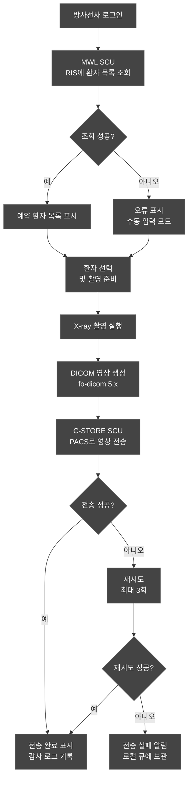
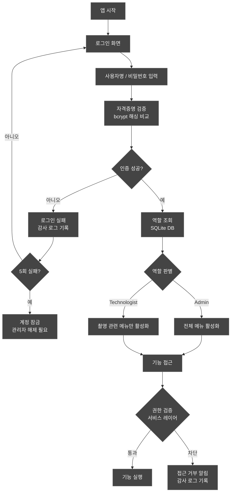
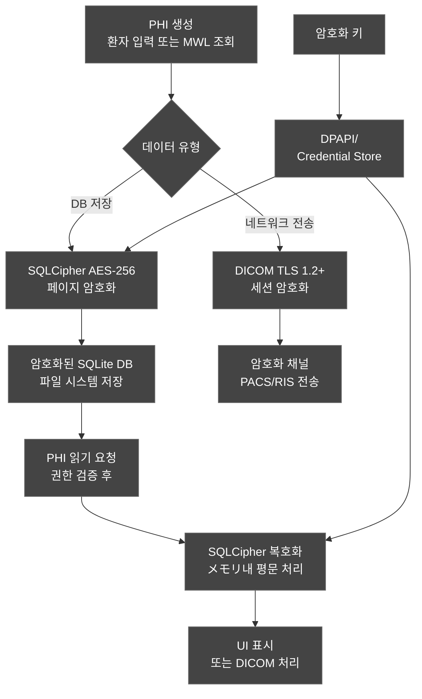
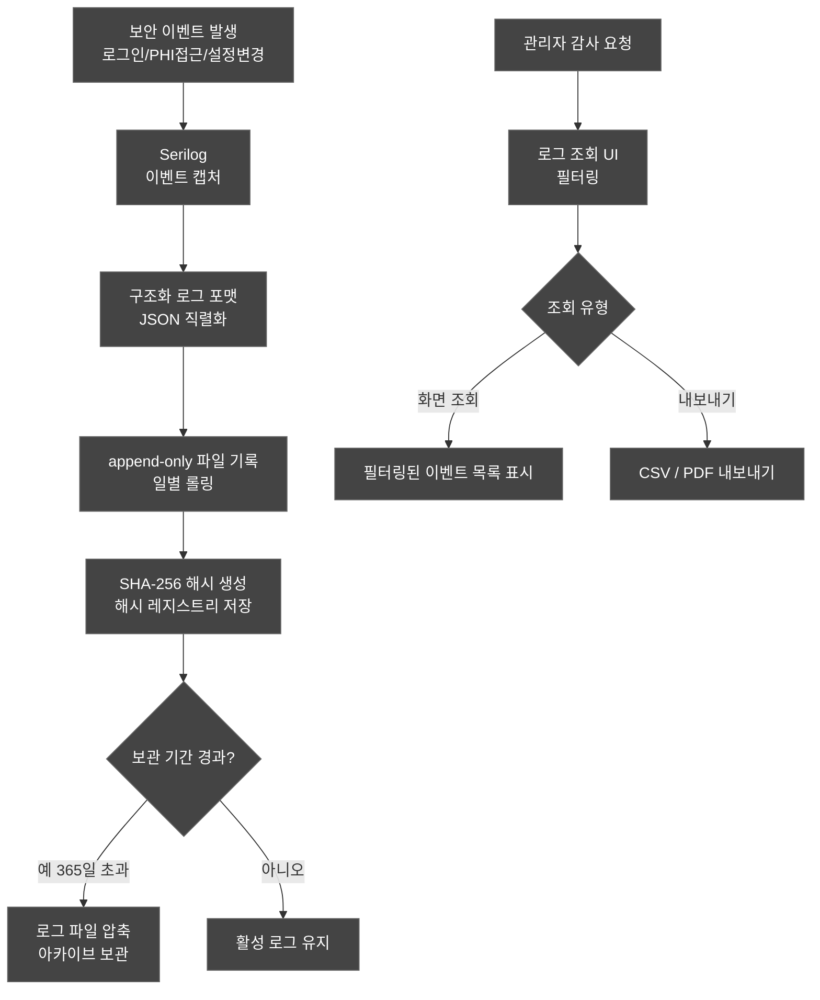
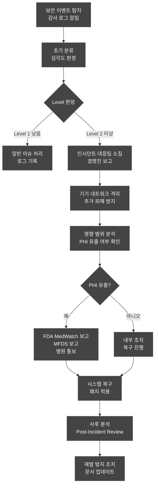
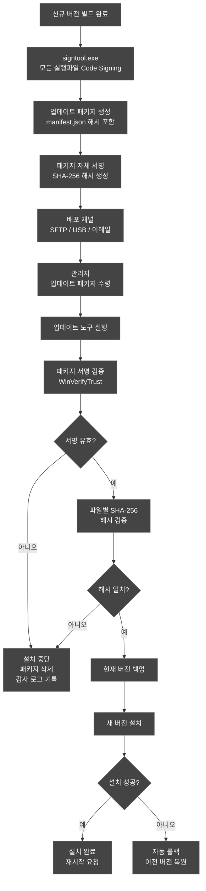

# MR 상세 설명서 Part 1 — Tier 1 (인허가 필수 요건)

| 항목 | 내용 |
|---|---|
| **문서 ID** | DOC-001a |
| **버전** | v1.0 |
| **날짜** | 2026-04-02 |
| **제품** | HnVue (X-ray 촬영 콘솔 SW) |
| **목적** | Tier 1(인허가 필수) MR 13개에 대한 상세 기능 정의 및 구현 가이드 제공 |
| **기술 스택** | WPF .NET 8, fo-dicom 5.x, SQLite, Serilog |
| **규제 등급** | IEC 62304 Class B, FDA §524B cyber device |
| **작성 인원** | SW 2명 |

---

## 목차

1. [MR-019: DICOM 3.0 필수 서비스](#mr-019-dicom-30-필수-서비스)
2. [MR-020: IHE SWF 프로파일](#mr-020-ihe-swf-프로파일)
3. [MR-033: RBAC (역할 기반 접근 제어)](#mr-033-rbac-역할-기반-접근-제어)
4. [MR-034: PHI 암호화 (AES-256)](#mr-034-phi-암호화-aes-256)
5. [MR-035: 감사 로그 (Audit Log)](#mr-035-감사-로그-audit-log)
6. [MR-036: SBOM (소프트웨어 구성 목록)](#mr-036-sbom-소프트웨어-구성-목록)
7. [MR-037: CVD + 인시던트 대응](#mr-037-cvd--인시던트-대응)
8. [MR-039: SW 무결성 검증 + 업데이트 메커니즘](#mr-039-sw-무결성-검증--업데이트-메커니즘)
9. [MR-050: IEC 62304 Class B + 위협 모델링](#mr-050-iec-62304-class-b--위협-모델링)
10. [MR-051: IEC 62366 사용성 공학](#mr-051-iec-62366-사용성-공학)
11. [MR-052: ISO 13485 / 21 CFR 820](#mr-052-iso-13485--21-cfr-820)
12. [MR-053: 규제 승인 획득](#mr-053-규제-승인-획득)
13. [MR-054: DICOM Conformance Statement](#mr-054-dicom-conformance-statement)

---

### MR-019: DICOM 3.0 필수 서비스
**Tier**: Tier 1 (인허가 필수)  
**카테고리**: DICOM 통신 / 인터페이스

#### 왜 필요한가 (Why)
- **규제 근거**:
  - **MFDS 기술문서**: 「의료기기 소프트웨어 허가·신고·심사 가이드라인」에서 인터페이스 명세 제출 필수 — DICOM 통신 방식 및 지원 서비스 목록 기재 요구
  - **FDA 510(k) 실질적 동등성(Substantial Equivalence)**: 기존 허가 기기(predicate)와 동등한 DICOM 인터페이스 구현 증명 필요 (21 CFR 807.87(f))
  - **IEC 62304 §5.2**: SW 요구사항 명세에 외부 인터페이스(DICOM 서비스) 정의 필수
  - **IEC 62304 §5.3**: SW 아키텍처 설계에 DICOM 서비스 컴포넌트 구조 명시 필요
- **인허가 영향**: DICOM C-STORE SCU 및 MWL SCU가 없으면 PACS 연동 불가 → 병원 환경에서 동작하지 않는 기기로 판정 → MFDS 기술문서 및 FDA 510(k) 모두 거절 가능

#### 무엇인가 (What)
- **기능 정의**: HnVue이 병원 PACS/RIS와 DICOM 표준 프로토콜로 통신하는 기능이다. 촬영된 영상을 PACS에 전송하고(C-STORE), RIS로부터 촬영 예약 환자 목록을 조회하며(MWL), 촬영 진행 상태를 PACS에 보고한다(MPPS). Storage Commitment으로 PACS의 영상 보관 확인을 수신하고, Query/Retrieve SCU로 기존 영상을 조회·다운로드한다.
- **구현 범위 (Phase 1 최소)**:
  - **C-STORE SCU**: 촬영 완료 영상을 PACS로 전송 (필수)
  - **MWL SCU (C-FIND)**: RIS/PACS에서 예약 환자 목록 조회 (필수)
  - **Print SCU**: DICOM Print 서비스 (feel-DRCS 기존 기기와 기능 동등성 확보용)
- **제외 범위 (Phase 1 제외)**:
  - **MPPS (Modality Performed Procedure Step)**: Phase 2에서 구현 (feel-DRCS에서도 옵션 기능)
  - **Storage Commitment SCU**: Phase 2에서 구현
  - **Query/Retrieve SCU (C-FIND/C-MOVE/C-GET)**: Phase 2에서 구현

#### 어떻게 동작하는가 (How)
- **사용 시나리오**:
  1. 방사선사가 HnVue을 실행하면 자동으로 MWL SCU가 RIS에 당일 예약 환자 목록을 조회한다.
  2. 방사선사가 목록에서 환자를 선택하면 환자 정보(Patient ID, Accession Number 등)가 자동으로 채워진다.
  3. 촬영 완료 후 영상이 DICOM 형식으로 생성되고, C-STORE SCU가 설정된 PACS AE Title로 영상을 자동 전송한다.
  4. PACS 전송 성공/실패 상태가 UI에 표시된다.
- **기술 동작**:
  - **fo-dicom 5.x** 라이브러리의 `DicomClient`를 사용하여 C-STORE, C-FIND 요청을 구현한다.
  - MWL 조회: `DicomCFindRequest`에 `ScheduledProcedureStepSequence`를 포함하여 RIS AE Title로 전송, 응답을 파싱하여 환자 목록 ViewModel에 바인딩한다.
  - C-STORE: `DicomStoreRequest`로 DICOM 파일을 PACS AE Title로 전송, `DicomStatus.Success` 응답 수신 시 전송 완료 처리한다.
  - 연결 실패 시 재시도 로직(최대 3회, 지수 백오프) 적용 및 감사 로그 기록.
  - DICOM TLS 연결 지원 (MR-034 PHI 암호화와 연계).

#### 워크플로우



#### 인허가 제출물 연결
- **MFDS 기술문서**: 「소프트웨어 상세 설명서」 중 인터페이스 명세 섹션에 지원 DICOM 서비스 목록 기재
- **FDA 510(k)**: Predicate device 비교표에 DICOM 기능 동등성 증명 항목으로 포함
- **IEC 62304 산출물**: SW 요구사항 명세(SRS), SW 아키텍처 설계서에 DICOM 서비스 인터페이스 명세 반영
- **DICOM Conformance Statement** (MR-054): 지원 SOP Class, Transfer Syntax, AE Title 정보 포함하여 별도 제출

---

### MR-020: IHE SWF 프로파일
**Tier**: Tier 1 (인허가 필수)  
**카테고리**: 상호운용성 / IHE 프로파일

#### 왜 필요한가 (Why)
- **규제 근거**:
  - **MFDS 기술문서**: 의료기기 SW 심사 시 상호운용성 표준 준수 여부를 확인하며, IHE 프로파일 준수는 국제 표준 정합성의 근거로 활용됨
  - **FDA 510(k)**: FDA는 DICOM PS3 및 IHE Radiology Technical Framework를 상호운용성 표준으로 참조하며, IHE SWF 준수는 predicate 동등성 주장을 강화함 (FDA Guidance "Design Considerations for Pivotal Clinical Investigations")
  - **IEC 62304 §5.2.2**: 외부 인터페이스 요구사항 명세에 IHE 트랜잭션 참조 포함 권장
- **인허가 영향**: IHE SWF 미준수 시 병원 IT 환경과의 상호운용성 결여를 이유로 MFDS 심사에서 추가 소명 요구 가능; 유럽 CE 마킹 심사에서도 IHE 준수는 상호운용성 선언의 핵심 근거임

#### 무엇인가 (What)
- **기능 정의**: IHE(Integrating the Healthcare Enterprise) Radiology Technical Framework의 Scheduled Workflow(SWF) 프로파일에 정의된 트랜잭션 순서와 액터 역할을 준수한다. HnVue은 SWF 프로파일에서 Modality 액터 역할을 수행하며, Ordering/Scheduling 시스템(RIS)과 Image Manager/Archive(PACS) 간의 표준화된 워크플로우를 따른다.
- **구현 범위 (Phase 1 최소)**:
  - **SWF Basic 준수**: MWL 조회(RAD-5 트랜잭션) + 영상 저장(RAD-8 트랜잭션) 구현
  - Modality 액터로서의 동작: MWL SCU(RAD-5) → 영상 획득 → C-STORE SCU(RAD-8)
  - IHE 테스트 도구(Gazelle) 기반 적합성 테스트 항목 확인
- **제외 범위 (Phase 1 제외)**:
  - **MPPS 관련 트랜잭션** (RAD-6, RAD-7): Phase 2에서 구현 (SWF MPPS Option)
  - **Storage Commitment 트랜잭션** (RAD-10): Phase 2에서 구현
  - IHE Connectathon 공식 참가: Phase 2 이후 검토

#### 어떻게 동작하는가 (How)
- **사용 시나리오**:
  1. 방사선사가 RIS에서 촬영 예약을 생성하면 HnVue이 MWL(RAD-5)로 조회한다.
  2. 환자 선택 후 촬영을 진행하면 HnVue이 SWF 트랜잭션 순서에 따라 영상을 PACS에 전송한다.
  3. 전체 워크플로우가 IHE SWF에 정의된 순서를 벗어나지 않아, 어떤 IHE 호환 PACS/RIS와도 정상 동작한다.
- **기술 동작**:
  - **RAD-5 (MWL Query)**: `DicomCFindRequest`로 `ModalityWorklistInformationModelFind` SOP Class 사용, 요청/응답 Dataset은 IHE SWF Profile Table에 정의된 필수 속성 포함
  - **RAD-8 (Store Images)**: `DicomStoreRequest`로 `DigitalXRayImageStorageForPresentation` SOP Class 사용
  - IHE 프로파일 준수 여부는 Gazelle EVS Client 또는 동등 도구로 자가 검증 수행
  - 각 트랜잭션 실행 시 IHE 액터 명칭(Acquisition Modality, Image Manager 등)을 로그에 기록

#### 워크플로우


#### 인허가 제출물 연결
- **MFDS 기술문서**: 상호운용성 표준 준수 섹션에 IHE SWF 프로파일 준수 선언 및 지원 트랜잭션 목록 기재
- **FDA 510(k) 실질적 동등성 비교표**: IHE SWF 지원 여부를 predicate 대비 동등성 항목으로 포함
- **DICOM Conformance Statement** (MR-054): IHE Integration Statement 섹션에 SWF 프로파일 준수 선언
- **IHE Integration Statement**: IHE 형식의 별도 Integration Statement 문서 작성하여 MFDS 제출 패키지에 포함

---

### MR-033: RBAC (역할 기반 접근 제어)
**Tier**: Tier 1 (인허가 필수)  
**카테고리**: 사이버보안 / 접근 제어

#### 왜 필요한가 (Why)
- **규제 근거**:
  - **FDA §524B (Ensuring Cybersecurity of Medical Devices)**: "reasonable assurance that the device and related systems are cybersecure" 요구; 사용자 인증 및 권한 부여는 NIST SP 800-53 AC 계열 통제에 해당하며 FDA 사이버보안 제출물의 핵심 항목
  - **MFDS 사이버보안 가이드라인 (2023)**: 35개 사이버보안 항목 중 "사용자 인증 및 접근 통제" 항목 — 역할 기반 접근 제어(RBAC) 구현 명시 요구
  - **IEC 81001-5-1 §8.2 (Authentication and Access Control)**: 의료 SW 보안 기술 요구사항으로 사용자 역할 기반 권한 분리 명시
  - **IEC 62304 §5.2**: SW 요구사항에 보안 요구사항(접근 제어) 명세 필수
- **인허가 영향**: RBAC 미구현 시 FDA 사이버보안 제출물(SBD, Security Bill of Design) 누락으로 510(k) 처리 지연; MFDS 사이버보안 35개 항목 불충족으로 기술문서 보완 요청 발생

#### 무엇인가 (What)
- **기능 정의**: 사용자의 역할(Role)에 따라 HnVue의 기능 및 데이터에 대한 접근 권한을 제한하는 시스템이다. 각 사용자는 하나 이상의 역할에 할당되며, 역할에 정의된 권한 집합(Permission Set)만 행사할 수 있다. 권한 없는 기능 접근 시 UI 레벨 및 서비스 레벨 모두에서 차단된다.
- **구현 범위 (Phase 1 최소)**:
  - **Admin 역할**: 사용자 계정 관리, 시스템 설정, 모든 기능 접근, 감사 로그 조회
  - **Technologist(방사선사) 역할**: 환자 목록 조회(MWL), 촬영 실행, 영상 전송, 본인 작업 내역 조회 (시스템 설정 접근 불가)
  - 로그인 시 역할 기반 UI 메뉴 동적 렌더링 (권한 없는 메뉴 숨김 또는 비활성화)
  - 세션 타임아웃 기능 (비활성 시 자동 잠금)
- **제외 범위 (Phase 1 제외)**:
  - **Physician(의사) 역할**: Phase 2에서 추가 (영상 판독 연계 기능과 함께)
  - 다중 역할 동시 부여, 세분화된 권한 커스터마이징
  - LDAP/Active Directory 연동 (Phase 2)

#### 어떻게 동작하는가 (How)
- **사용 시나리오**:
  - **방사선사**: 로그인 후 MWL 조회, 환자 선택, 촬영, 영상 전송 메뉴만 활성화됨. "시스템 설정" 메뉴는 보이지 않거나 클릭 불가.
  - **관리자**: 로그인 후 전체 메뉴 접근 가능. "사용자 관리" 메뉴에서 방사선사 계정 생성/수정/삭제 가능.
  - 방사선사가 직접 URL 또는 단축키로 관리자 기능에 접근 시도해도 서비스 레이어에서 권한 검증 후 차단.
- **기술 동작**:
  - 사용자 정보 및 역할 매핑을 SQLite DB에 암호화 저장 (MR-034 연계)
  - WPF MVVM 패턴: `ICommand.CanExecute()` 및 `Visibility` 바인딩으로 UI 레벨 제어
  - 서비스 레이어에 `[RequireRole("Admin")]` 어트리뷰트 또는 동등 검증 로직 적용
  - 비밀번호: bcrypt 해싱(work factor ≥ 12) 적용, 평문 저장 금지
  - 세션 토큰은 메모리에만 유지, 앱 재시작 시 재로그인 필요

#### 워크플로우



#### 인허가 제출물 연결
- **FDA 510(k) 사이버보안 제출물 (SBD)**: RBAC 구현을 접근 제어 통제 항목으로 기술
- **MFDS 기술문서 사이버보안 섹션**: 35개 항목 체크리스트 중 "사용자 인증 및 접근 통제" 항목 근거 자료
- **IEC 62304 SW 요구사항 명세 (SRS)**: 보안 요구사항 섹션에 RBAC 요구사항 기재
- **IEC 81001-5-1 보안 위험 관리 문서**: RBAC를 인증 및 접근 제어 보안 통제로 등록

---

### MR-034: PHI 암호화 (AES-256)
**Tier**: Tier 1 (인허가 필수)  
**카테고리**: 사이버보안 / 데이터 보호

#### 왜 필요한가 (Why)
- **규제 근거**:
  - **FDA §524B "Confidentiality"**: 기기 내 환자 데이터의 기밀성 보장을 사이버보안 설계 요구사항으로 명시
  - **MFDS 사이버보안 가이드라인 (2023)**: 35개 항목 중 "데이터 보호" — 저장 데이터 및 전송 데이터 암호화 명시 요구
  - **HIPAA Technical Safeguard (45 CFR §164.312)**: PHI 저장 시 암호화(Addressable) 및 전송 시 암호화(Required) 규정; 미국 병원 납품 시 HIPAA 준수 계약상 의무
  - **IEC 81001-5-1 §8.4 (Cryptography)**: 암호화 알고리즘, 키 관리, TLS 버전 요구사항 명시
- **인허가 영향**: PHI 암호화 미구현 시 FDA SBD에 "Confidentiality" 통제 누락으로 510(k) 보완 요청; MFDS 사이버보안 항목 미충족; 미국 병원 납품 계약에서 HIPAA BA Agreement 체결 불가

#### 무엇인가 (What)
- **기능 정의**: 환자 개인건강정보(PHI: 이름, 생년월일, Patient ID, 영상 등)를 저장 시와 전송 시 모두 암호화하여 보호한다. 저장 데이터는 AES-256-CBC 또는 AES-256-GCM으로 암호화하고, 네트워크 전송 데이터는 TLS 1.2 이상으로 보호한다. 암호화 키는 OS 보안 저장소에 관리한다.
- **구현 범위 (Phase 1 최소)**:
  - **SQLite DB 암호화**: SQLCipher(AES-256-CBC) 또는 Microsoft.Data.Sqlite + 동등 암호화 확장 적용 — DB 파일 전체 암호화
  - **DICOM TLS**: fo-dicom 5.x의 TLS 지원을 활성화하여 C-STORE, MWL 등 DICOM 통신 암호화 (TLS 1.2+, TLS 1.3 권장)
  - 암호화 키를 Windows Data Protection API(DPAPI) 또는 Windows Credential Store에 저장
  - 설정 파일(appsettings.json) 내 민감 정보(PACS IP, 비밀번호 등) 암호화
- **제외 범위 (Phase 1 제외)**:
  - HSM(Hardware Security Module) 연동: Phase 2 이후 고위험 환경 요구 시
  - 키 순환(Key Rotation) 자동화: Phase 2

#### 어떻게 동작하는가 (How)
- **사용 시나리오**:
  - 방사선사가 환자를 선택하고 촬영을 진행하면 모든 PHI는 DB 저장 전 자동으로 암호화된다.
  - 촬영 완료 후 영상이 PACS로 전송될 때 DICOM TLS가 자동으로 활성화되어 네트워크 구간에서 평문 노출이 없다.
  - 관리자나 방사선사는 암호화 동작을 직접 제어하지 않으며, 시스템이 투명하게 처리한다.
  - 시스템 점검 시 관리자가 암호화 상태(DB 암호화 여부, TLS 연결 상태)를 시스템 정보 화면에서 확인할 수 있다.
- **기술 동작**:
  - SQLCipher: 연결 문자열에 `Password=<암호화키>` 포함, DB 파일은 AES-256으로 페이지 단위 암호화
  - 암호화 키 도출: PBKDF2 (HMAC-SHA256, 반복 횟수 ≥ 100,000) 사용
  - DICOM TLS: `DicomServiceOptions.TlsSettings`에 서버 인증서, 클라이언트 인증서 설정
  - TLS 프로토콜: TLS 1.2 최소, TLS 1.0/1.1 비활성화, 취약 Cipher Suite(RC4, DES, 3DES) 비활성화
  - 설정 파일: Microsoft.Extensions.Configuration의 `ProtectedConfigurationProvider` 또는 환경 변수 기반 민감 정보 분리

#### 워크플로우



#### 인허가 제출물 연결
- **FDA 510(k) SBD (Security Bill of Design)**: Confidentiality 통제 항목에 AES-256 저장 암호화, TLS 1.2+ 전송 암호화 기재
- **MFDS 기술문서 사이버보안 섹션**: 35개 항목 중 "데이터 보호" 항목 — 암호화 알고리즘, 키 길이, TLS 버전 명시
- **IEC 81001-5-1 보안 위험 관리 문서**: 암호화 통제를 데이터 기밀성 위협에 대한 대응 통제로 등록
- **IEC 62304 SW 요구사항 명세 (SRS)**: PHI 암호화 요구사항 기재

---

### MR-035: 감사 로그 (Audit Log)
**Tier**: Tier 1 (인허가 필수)  
**카테고리**: 사이버보안 / 추적성

#### 왜 필요한가 (Why)
- **규제 근거**:
  - **FDA §524B**: "the device and related systems are cybersecure" 요구에 포함된 모니터링 및 감사(Monitoring & Audit) 통제; NIST SP 800-53 AU 계열 요구사항
  - **MFDS 사이버보안 가이드라인 (2023)**: 35개 항목 중 "사용자 인증" 영역에서 로그인/로그아웃 및 보안 이벤트 기록 요구
  - **IEC 81001-5-1 Clause 7.3 (Audit Logging)**: 보안 관련 이벤트(인증 실패, 권한 초과 접근, 설정 변경 등)에 대한 감사 로그 생성, 보호, 보관 요구
  - **HIPAA 45 CFR §164.312(b)**: Activity Review — PHI 접근에 대한 감사 통제 요구
- **인허가 영향**: 감사 로그 미구현 시 FDA SBD의 Audit 통제 누락으로 510(k) 보완 요청; IEC 81001-5-1 §7.3 불충족으로 CE 마킹 심사에서 지적; MFDS 사이버보안 항목 체크리스트 미통과

#### 무엇인가 (What)
- **기능 정의**: 시스템 내에서 발생하는 모든 보안 관련 이벤트를 구조화된 형식으로 자동 기록하고, 변조를 방지하며, 규정된 기간 이상 보관한다. 기록된 로그는 관리자가 조회하고 감사에 활용할 수 있다.
- **구현 범위 (Phase 1 최소)**:
  - **로그인 / 로그아웃**: 성공, 실패(사유 포함), 계정 잠금 이벤트
  - **PHI 접근**: 환자 정보 조회, 영상 열람, 영상 전송(C-STORE) 이벤트
  - **시스템 설정 변경**: PACS 설정, 사용자 계정 생성/수정/삭제, 역할 변경
  - **로그 보관**: 최소 1년 이상 (규제 요구 시 3년까지)
  - **변조 방지**: append-only 기록, 로그 파일 해시 체인 또는 WORM 전략
  - **관리자 조회 UI**: 날짜, 사용자, 이벤트 유형 필터링 기능
- **제외 범위 (Phase 1 제외)**:
  - 중앙 SIEM(Security Information and Event Management) 연동: Phase 2
  - ATNA(Audit Trail and Node Authentication) IHE 프로파일 준수: Phase 2

#### 어떻게 동작하는가 (How)
- **사용 시나리오**:
  - 방사선사가 로그인 시 자동으로 로그인 이벤트가 기록된다.
  - 환자 영상을 PACS로 전송하면 "User: jsmith, Action: C-STORE, PatientID: P12345, Timestamp: 2026-04-02T07:23:00Z, Result: Success" 형식으로 기록된다.
  - 관리자가 퇴근 후 비인가 접근 시도 여부를 확인하려면 감사 로그 UI에서 날짜 범위와 이벤트 유형(로그인 실패)으로 필터링한다.
  - 외부 감사(MFDS 실사, 병원 보안 감사) 시 관리자가 로그를 CSV/PDF로 내보낸다.
- **기술 동작**:
  - **Serilog** 라이브러리 사용: `WriteTo.File()` sink로 JSON 구조화 로그 기록
  - 로그 항목 필수 필드: `timestamp`, `userId`, `sessionId`, `eventType`, `resourceType`, `resourceId`, `outcome`, `ipAddress`
  - append-only 보장: 로그 파일에 쓰기 권한만 부여, 수정/삭제 권한 제거; 파일별 SHA-256 해시를 별도 해시 레지스트리에 저장
  - 보관 정책: Serilog `RollingInterval.Day`로 일별 파일 생성, 365일 경과 파일 자동 압축 보관
  - 로그 조회 UI: `LogViewer` ViewModel에서 구조화 로그 파싱, `ICollectionView` 필터링 적용

#### 워크플로우



#### 인허가 제출물 연결
- **FDA 510(k) SBD**: Audit 통제 항목에 감사 로그 이벤트 목록, 보관 기간, 변조 방지 방법 기재
- **MFDS 기술문서 사이버보안 섹션**: 35개 항목 중 로그인/보안 이벤트 기록 항목 근거 자료
- **IEC 81001-5-1 보안 위험 관리 문서**: Audit Logging을 모니터링 보안 통제로 등록 (Clause 7.3)
- **IEC 62304 SW 요구사항 명세 (SRS)**: 감사 로그 요구사항 기재

---

### MR-036: SBOM (소프트웨어 구성 목록)
**Tier**: Tier 1 (인허가 필수)  
**카테고리**: 사이버보안 / 공급망 보안

#### 왜 필요한가 (Why)
- **규제 근거**:
  - **FDA §524B(b)(1)**: "a software bill of materials (SBOM), including commercial, open-source, and off-the-shelf software components" — 법률에 SBOM 제출이 명시적으로 요구됨 (2023년 3월 29일 이후 신규 제출 적용)
  - **MFDS 2024 사이버보안 가이드라인**: SBOM 생성 및 제출을 사이버보안 기술문서의 필수 항목으로 포함
  - **IEC 62304 §8.1.2 (SOUP 관리)**: 사용된 SOUP(Software of Unknown Provenance) 목록 관리 및 위험 분석 요구 — SBOM은 이를 자동화하는 수단
- **인허가 영향**: SBOM 미제출 시 FDA §524B 법적 요건 직접 위반으로 510(k) 제출 불가 (자동 거절 사유); MFDS 기술문서 보완 요청

#### 무엇인가 (What)
- **기능 정의**: HnVue을 구성하는 모든 소프트웨어 컴포넌트(NuGet 패키지, 오픈소스 라이브러리, 타사 SOUP)의 목록을 기계 가독 형식(CycloneDX 또는 SPDX)으로 자동 생성한다. 각 컴포넌트의 이름, 버전, 공급자, 라이선스, 알려진 취약점(CVE) 정보를 포함한다.
- **구현 범위 (Phase 1 최소)**:
  - **CycloneDX for .NET CLI** (`cyclonedx-dotnet`) 빌드 파이프라인 통합 — 빌드 시 자동으로 SBOM.json 생성
  - 생성 형식: CycloneDX JSON (FDA 선호 형식) 및 SPDX JSON 동시 생성
  - NVD(National Vulnerability Database) API 연동으로 SBOM 컴포넌트별 CVE 조회 및 취약점 보고서 생성
  - 제출용 SBOM 문서: 빌드 버전과 연계된 SBOM 파일 버전 관리
- **제외 범위 (Phase 1 제외)**:
  - 실시간 CVE 모니터링 대시보드: Phase 2
  - SBOM 자동 업데이트 알림 시스템: Phase 2

#### 어떻게 동작하는가 (How)
- **사용 시나리오**:
  - CI/CD 파이프라인(또는 로컬 빌드 스크립트)에서 빌드 완료 후 `cyclonedx-dotnet` 명령이 자동 실행되어 SBOM.json 파일을 생성한다.
  - 릴리스 담당자가 SBOM 파일과 취약점 보고서를 확인하여 심각 취약점(CVSS 7.0+) 여부를 판단한다.
  - 인허가 제출 시 해당 버전의 SBOM 파일을 FDA/MFDS 제출 패키지에 포함한다.
- **기술 동작**:
  - 빌드 스크립트에 `dotnet CycloneDX ./HnVue.sln -o ./sbom/ -j` 명령 추가
  - 생성된 `bom.json`을 SPDX 변환 도구(`spdx-tools`)로 SPDX JSON으로도 변환
  - NVD API (api.nvd.nist.gov)로 각 컴포넌트 CVE 조회 및 취약점 CSV 보고서 생성
  - SBOM 파일명 규칙: `HnVue_v{version}_SBOM_{date}.json`으로 버전-날짜 연계 보관

#### 인허가 제출물 연결
- **FDA §524B(b)(1) SBOM 제출**: CycloneDX JSON 형식 SBOM 파일을 510(k) 사이버보안 섹션에 첨부
- **MFDS 기술문서 SBOM 섹션**: CycloneDX 또는 SPDX 형식 SBOM 파일 및 취약점 현황 보고서 제출
- **IEC 62304 SOUP 목록**: SBOM에서 SOUP 항목을 필터링하여 IEC 62304 §8.1.2 요구 SOUP 목록으로 활용
- **CVD 프로세스 (MR-037)**: SBOM 기반 취약점 식별 결과가 CVD/인시던트 대응 프로세스의 입력값이 됨

---

### MR-037: CVD + 인시던트 대응
**Tier**: Tier 1 (인허가 필수)  
**카테고리**: 사이버보안 / 취약점 관리

#### 왜 필요한가 (Why)
- **규제 근거**:
  - **FDA §524B(b)(3)**: 판매 후 사이버보안을 위한 프로세스 요구 — "a process to coordinate the disclosure and deployment of patches and updates" 및 "a process for coordinated vulnerability disclosure" 명시
  - **IEC 81001-5-1 Clause 8 (Incident Management)**: 보안 인시던트 탐지, 분류, 대응, 복구, 사후 분석 절차 요구
  - **ISO/IEC 29147**: 취약점 공개(Coordinated Vulnerability Disclosure) 절차 표준
  - **MFDS 사이버보안 가이드라인**: 판매 후 관리 항목에 취약점 관리 및 패치 배포 프로세스 기재 요구
- **인허가 영향**: CVD 정책 및 인시던트 대응 계획 미제출 시 FDA §524B(b)(3) 요건 직접 불충족으로 510(k) 보완 요청; MFDS 판매 후 관리 계획 불충족

#### 무엇인가 (What)
- **기능 정의**: (1) **CVD(Coordinated Vulnerability Disclosure) 프로세스**: 외부 보안 연구자 또는 고객이 발견한 취약점을 접수, 분석, 패치 개발, 공개하는 절차. (2) **보안 인시던트 대응 계획**: 실제 사이버 보안 사고(해킹, 데이터 유출, 악성코드 감염 등) 발생 시 탐지-격리-복구-보고하는 절차. 두 가지 모두 SW 기능보다는 프로세스/문서 산출물이 핵심이다.
- **구현 범위 (Phase 1 최소)**:
  - **CVD 정책 문서**: 취약점 신고 접수 채널(이메일/보안 포털), 대응 SLA(수신 확인 3일, 초기 평가 14일, 패치 배포 90일), 신고자 보호 정책
  - **인시던트 대응 절차서**: 탐지, 분류(심각도 기준), 격리, 복구, 규제기관 보고(FDA MedWatch/MFDS), 사후 분석 단계별 절차
  - **연락처 체계**: security@[회사도메인] 전용 보안 연락 채널 개설
- **제외 범위 (Phase 1 제외)**:
  - 자동화된 취약점 모니터링 도구(Dependabot, Snyk 등) 연동: Phase 2
  - 버그 바운티 프로그램 공식 운영: Phase 2

#### 어떻게 동작하는가 (How)
- **사용 시나리오 (CVD)**:
  1. 외부 보안 연구자가 HnVue에서 취약점을 발견하고 security@[회사도메인]으로 신고한다.
  2. 보안 담당자가 3영업일 내 수신 확인 이메일을 발송하고 추적 번호를 부여한다.
  3. SW 팀이 14일 내 취약점을 검증하고 심각도(CVSS 점수)를 평가한다.
  4. 패치를 개발하고 테스트 후 안전한 업데이트(MR-039)로 배포한다.
  5. 패치 배포 후 CVE 번호를 부여받고 공개 취약점 공지를 발행한다.
- **사용 시나리오 (인시던트)**:
  1. 모니터링 중 비정상 접근 또는 데이터 유출 징후를 탐지한다.
  2. 심각도 분류 후 Level 2 이상이면 기기를 네트워크에서 격리한다.
  3. 영향 범위를 분석하고 복구 조치를 수행한다.
  4. PHI 유출이 확인되면 FDA MedWatch 및 MFDS에 규정 기한 내 보고한다.
  5. 사후 분석(Post-Incident Review)을 통해 재발 방지 조치를 문서화한다.

#### 워크플로우 (CVD 프로세스)

```mermaid
flowchart TD
    A[외부 연구자\n취약점 발견] --> B[security@도메인\n취약점 신고]
    B --> C[수신 확인 발송\n추적 번호 부여\n3영업일 이내]
    C --> D[취약점 검증\nCVSS 심각도 평가\n14일 이내]
    D --> E{심각도 판정}
    E -- Critical CVSS 9+ --> F[즉시 패치 개발\n긴급 업데이트 배포]
    E -- High CVSS 7-8.9 --> G[30일 내 패치 배포]
    E -- Medium Low --> H[정기 릴리스\n패치 포함]
    F --> I[패치 배포\n신고자 통보]
    G --> I
    H --> I
    I --> J[CVE 번호 취득\n공개 취약점 공지 발행]

style A fill:#444,stroke:#666,color:#fff
style B fill:#444,stroke:#666,color:#fff
style C fill:#444,stroke:#666,color:#fff
style D fill:#444,stroke:#666,color:#fff
style E fill:#444,stroke:#666,color:#fff
style F fill:#444,stroke:#666,color:#fff
style G fill:#444,stroke:#666,color:#fff
style H fill:#444,stroke:#666,color:#fff
style I fill:#444,stroke:#666,color:#fff
style J fill:#444,stroke:#666,color:#fff
```

#### 워크플로우 (인시던트 대응 프로세스)



#### 인허가 제출물 연결
- **FDA §524B(b)(3) 사이버보안 제출물**: CVD 정책 문서 및 인시던트 대응 계획서를 510(k) 패키지에 포함
- **MFDS 기술문서 판매 후 관리 섹션**: 취약점 관리 및 인시던트 대응 프로세스 기재
- **IEC 81001-5-1 §8 산출물**: 인시던트 대응 절차서를 보안 위험 관리 문서에 포함
- **CVD 공개 웹페이지**: 회사 웹사이트에 보안 연락처 및 CVD 정책 공개 (FDA/MFDS 투명성 요구)

---

### MR-039: SW 무결성 검증 + 업데이트 메커니즘
**Tier**: Tier 1 (인허가 필수)  
**카테고리**: 사이버보안 / 기기 무결성

#### 왜 필요한가 (Why)
- **규제 근거**:
  - **FDA §524B(b)(2)**: "a process to provide updates and patches to the operating system and medical device software" — 안전한 업데이트 메커니즘 법적 요구
  - **MFDS 사이버보안 가이드라인**: "기기 무결성" 항목 — SW 변조 방지 및 업데이트 무결성 검증 요구
  - **IEC 81001-5-1 §8.3 (Integrity)**: SW 실행 파일의 무결성 보장, 변조된 SW 탐지 메커니즘 요구
  - **IEC 62304 §6.2.5**: SW 변경(업데이트) 시 검증 및 릴리스 절차 준수 요구
- **인허가 영향**: Code Signing 및 안전한 업데이트 메커니즘 미구현 시 FDA §524B(b)(2) 직접 불충족; MFDS "기기 무결성" 항목 미통과로 기술문서 보완 요청

#### 무엇인가 (What)
- **기능 정의**: (1) **Code Signing**: 빌드된 실행 파일(.exe, .dll)에 코드 서명 인증서로 디지털 서명하여, 실행 시 서명 검증을 통해 변조 여부를 탐지한다. (2) **안전한 업데이트 메커니즘**: 서명된 업데이트 패키지를 배포하고, 설치 전 서명 검증 후 적용하며, 검증 실패 또는 설치 오류 시 이전 버전으로 롤백한다.
- **구현 범위 (Phase 1 최소)**:
  - **Code Signing**: EV Code Signing 인증서(Microsoft SmartScreen 신뢰)로 모든 배포 실행 파일 서명
  - **업데이트 패키지 서명**: 업데이트 패키지(.zip/.msi) 자체를 Code Signing 인증서로 서명 + SHA-256 해시 매니페스트 포함
  - **설치 전 무결성 검증**: 업데이트 설치 시 서명 검증 + 해시 검증 수행, 실패 시 설치 중단
  - **롤백 메커니즘**: 업데이트 적용 전 현재 버전 백업, 설치 실패 시 자동 복원
- **제외 범위 (Phase 1 제외)**:
  - 자동 업데이트 서버(OTA): Phase 2 (Phase 1에서는 수동 업데이트 패키지 배포)
  - Secure Boot / TPM 연동: Phase 2 이후 하드웨어 의존성 환경에서 검토

#### 어떻게 동작하는가 (How)
- **사용 시나리오**:
  - **Code Signing**: 빌드 엔지니어가 릴리스 빌드를 완료하면 CI 파이프라인이 자동으로 `signtool.exe`를 실행하여 모든 실행 파일에 서명한다. 병원 설치 시 Windows SmartScreen이 서명을 확인하고 "검증된 게시자" 표시를 보여준다.
  - **업데이트**: 관리자가 새 버전 업데이트 패키지를 수령하면 HnVue 업데이트 도구를 실행한다. 도구가 패키지 서명과 해시를 검증하고, 현재 버전을 백업한 후, 새 버전을 설치한다. 검증 실패 시 "무결성 검증 실패 — 설치가 중단되었습니다"를 표시하고 패키지를 삭제한다.
- **기술 동작**:
  - **Code Signing**: `signtool.exe sign /tr http://timestamp.sectigo.com /td sha256 /fd sha256 /a <파일들>` — 타임스탬프 포함하여 인증서 만료 후에도 서명 유효
  - **업데이트 패키지**: 업데이트 .zip 내 `manifest.json`에 각 파일의 SHA-256 해시 목록 포함, manifest.json 자체는 공개키 서명
  - **서명 검증**: `AuthenticodeSignatureHelper` 또는 P/Invoke `WinVerifyTrust()` API로 설치 전 검증
  - **롤백**: 현재 설치 디렉토리를 `%PROGRAMDATA%\HnVue\Backup\v{current_version}\`에 복사 후 업데이트 시작; 실패 시 백업 디렉토리에서 복원

#### 워크플로우



#### 인허가 제출물 연결
- **FDA §524B(b)(2) 사이버보안 제출물**: Code Signing 방법, 업데이트 패키지 무결성 검증 프로세스, 롤백 메커니즘 기재
- **MFDS 기술문서 "기기 무결성" 섹션**: 디지털 서명 알고리즘(SHA-256), 인증서 종류(EV Code Signing), 검증 방법 기재
- **IEC 81001-5-1 §8.3 산출물**: SW 무결성 통제를 보안 위험 관리 문서에 등록
- **IEC 62304 §6.2.5 SW 변경 절차**: 업데이트 프로세스를 SW 유지보수 절차에 포함

---

### MR-050: IEC 62304 Class B + 위협 모델링
**Tier**: Tier 1 (인허가 필수)  
**카테고리**: 규제 프로세스 / SW 수명주기

#### 왜 필요한가 (Why)
- **규제 근거**:
  - **MFDS**: 「의료기기 소프트웨어 허가·신고·심사 가이드라인」에서 IEC 62304 준수를 SW Class에 따라 필수 적용; Class B는 전체 수명주기 프로세스 문서화 필요
  - **FDA**: FDA Guidance "Software as a Medical Device (SaMD): Clinical Evaluation" 및 "Content of Premarket Submissions for Device Software Functions"에서 IEC 62304 준수를 사실상의 표준(recognized standard)으로 인정
  - **CE MDR**: 유럽 MDR Annex I GSPR 17항에서 IEC 62304 준수 요구
  - **IEC 81001-5-1 Clause 5 (Threat Modeling)**: 의료 SW의 사이버보안 위협 모델링(STRIDE 방법론 권장) 산출물 요구
- **인허가 영향**: IEC 62304 SW 수명주기 프로세스 산출물이 없으면 MFDS, FDA, CE 마킹 모든 인허가 경로가 차단됨. 위협 모델링 산출물 부재 시 IEC 81001-5-1 불충족으로 FDA 사이버보안 제출물 미완성

#### 무엇인가 (What)
- **기능 정의**: HnVue SW 개발 전 과정에 IEC 62304 Class B 수명주기 프로세스를 적용하고, 그 산출물(계획서, 요구사항 명세, 설계서, 검증 계획/보고서, 유지보수 계획 등)을 문서화한다. 별도로 STRIDE 방법론을 적용하여 시스템의 모든 인터페이스와 데이터 흐름에 대한 위협을 식별하고, 각 위협에 대한 보안 통제를 매핑한다.
- **구현 범위 (Phase 1 최소)**:
  - **IEC 62304 산출물**:
    - SW 개발 계획서 (SWDP): 수명주기 모델, 인원, 도구, 형상 관리 방법 기술
    - SW 요구사항 명세 (SRS): 기능/비기능/인터페이스/보안 요구사항
    - SW 아키텍처 설계서: 컴포넌트 구조, 인터페이스, SOUP 목록
    - SW 검증 계획 및 보고서: 단위/통합/시스템 테스트 케이스 및 결과
    - SW 릴리스 레코드: 버전별 검증 완료 증적
  - **위협 모델링 산출물**:
    - DFD(Data Flow Diagram): 시스템 경계 및 데이터 흐름 다이어그램
    - STRIDE 위협 분석 테이블: 각 인터페이스별 Spoofing, Tampering, Repudiation, Information Disclosure, Denial of Service, Elevation of Privilege 위협 식별
    - 위협-통제 매핑 테이블: 각 위협에 대한 MR-033~039 보안 통제 연결

#### 어떻게 동작하는가 (How)
- **사용 시나리오**:
  - SW 팀 2명이 IEC 62304 프로세스 체계에 따라 문서를 작성하고, 검토하며, 변경 관리 도구(Git, Jira 등)로 이력을 관리한다.
  - 위협 모델링은 아키텍처 설계 완료 후 수행하며, STRIDE 테이블 작성 → 검토 → 보안 통제 매핑 순서로 진행한다.
  - 각 산출물은 버전 관리되며, MFDS/FDA 제출 시 최신 승인 버전이 제출된다.
- **기술 동작**: SW 기능 구현이 아닌 문서 및 프로세스 산출물. 위협 모델링 도구로 Microsoft Threat Modeling Tool 또는 OWASP Threat Dragon 활용 가능.

#### 인허가 제출물 연결
- **MFDS 기술문서 SW 개발 프로세스 섹션**: IEC 62304 각 절차별 산출물 목록 및 참조 포함
- **FDA 510(k) SW 문서 섹션**: "Content of Premarket Submissions for Device Software Functions" 가이드라인에 따른 SW 산출물 패키지 제출 (Level of Concern: Moderate — Class B에 해당)
- **CE MDR 기술 문서 Annex I GSPR 17**: IEC 62304 준수 선언 및 산출물 증적
- **IEC 81001-5-1 위협 모델링 산출물**: FDA SBD 및 MFDS 사이버보안 섹션에 위협 모델링 결과 첨부

---

### MR-051: IEC 62366 사용성 공학
**Tier**: Tier 1 (인허가 필수)  
**카테고리**: 규제 프로세스 / 사용성

#### 왜 필요한가 (Why)
- **규제 근거**:
  - **MFDS**: 「의료기기 사용성 시험 가이드라인」에서 의료기기 SW에 IEC 62366-1 적용 권장 (Class B 이상 필수에 준함); Human Factors Engineering 계획 및 보고서 제출 요구
  - **FDA**: FDA Guidance "Applying Human Factors and Usability Engineering to Medical Devices" (2016)에서 IEC 62366 준수를 표준 참조; HFE 산출물을 510(k) 제출에 포함 요구
  - **IEC 62366-1:2015**: 의료기기 사용성 공학 국제 표준 — Use Specification, Formative Evaluation, Summative Evaluation 요구
- **인허가 영향**: 사용성 공학 산출물(Use Specification, Summative Evaluation) 미제출 시 MFDS 및 FDA 심사에서 Human Factors 섹션 보완 요청; 방사선사의 사용 오류로 인한 안전 위해가 발생할 경우 인허가 철회 근거가 됨

#### 무엇인가 (What)
- **기능 정의**: IEC 62366-1 프로세스에 따라 HnVue의 의도된 사용 방식을 정의하고, 잠재적 사용 오류를 분석하며, 대표 사용자(방사선사)를 대상으로 사용성 평가를 수행하여 안전하고 효과적인 UI를 보장한다.
- **구현 범위 (Phase 1 최소)**:
  - **Use Specification (의도된 사용 명세)**: 의도된 사용자(방사선사), 의도된 사용 환경(방사선실), 의도된 용도(X-ray 촬영 콘솔 조작) 정의
  - **사용 관련 위험 분석**: 잠재적 사용 오류(잘못된 환자 선택, 촬영 파라미터 오설정 등)와 안전 위해 연결
  - **Summative Usability Evaluation (총괄 평가)**: 대표 사용자(방사선사 3인 이상) 대상 실사용 테스트; 핵심 사용 시나리오(Critical Tasks)에서 사용 오류 발생률 측정 및 안전성 판단
- **제외 범위 (Phase 1 제외)**:
  - 광범위한 Formative Evaluation 다중 라운드: Phase 1에서는 1-2회 내부 Formative 평가로 축소 가능
  - 시선 추적, 생체 신호 측정 등 고급 사용성 측정: Phase 2

#### 어떻게 동작하는가 (How)
- **사용 시나리오**: 개발 단계에서 방사선사 3명을 모집하여 HnVue 프로토타입으로 실제 촬영 워크플로우(MWL 조회 → 환자 선택 → 파라미터 설정 → 촬영 → 영상 확인)를 수행하게 한다. 사용 오류 발생 시 원인을 분석하고 UI를 개선한다. 최종 평가 결과를 Summative Evaluation Report에 기록한다.
- **기술 동작**: SW 기능 구현이 아닌 사용성 프로세스 산출물. 평가 도구로 화면 녹화 소프트웨어 및 관찰 체크리스트 활용.

#### 인허가 제출물 연결
- **MFDS 기술문서 사용성 섹션**: Use Specification, 사용 관련 위험 분석, Summative Evaluation Report 제출
- **FDA 510(k) Human Factors 섹션**: HFE 계획, Formative/Summative Evaluation 요약, 안전성 결론 제출
- **IEC 62304 연계**: 사용 관련 위험 분석 결과를 SW 위험 분석(IEC 62304 §7.1)의 입력으로 활용

---

### MR-052: ISO 13485 / 21 CFR 820
**Tier**: Tier 1 (인허가 필수)  
**카테고리**: 규제 프로세스 / 품질경영시스템

#### 왜 필요한가 (Why)
- **규제 근거**:
  - **MFDS**: 의료기기 제조업 허가의 전제 조건으로 ISO 13485 기반 QMS 구축 및 운영 증명 필요; 「의료기기 제조 및 품질관리 기준」(GMP 고시)
  - **FDA**: 21 CFR Part 820 (Quality System Regulation, QSR) 준수 필수 — 설계 관리(Design Controls, §820.30), 문서 관리, 기록 관리 등 포함; 2024년부터 ISO 13485:2016을 QSR 요건으로 사실상 통합
  - **CE MDR**: 유럽 MDR Article 10(9)에서 QMS 구축 및 유지 요구; Notified Body가 QMS 감사 수행
- **인허가 영향**: QMS 미구축 시 MFDS 제조업 허가 불가 → 모든 제품 허가 신청 불가; FDA QSR 미준수 시 Warning Letter, 제품 리콜, 판매 중지 행정 조치 가능

#### 무엇인가 (What)
- **기능 정의**: ISO 13485 및 21 CFR Part 820 요건에 따라 HnVue의 설계-개발-검증-밸리데이션 전 과정을 품질경영시스템(QMS) 하에서 수행하고, 설계 이력 파일(DHF: Design History File)을 구축한다.
- **구현 범위 (Phase 1 최소)**:
  - **설계 관리 (Design Controls)**: 설계 입력(Design Input), 설계 출력(Design Output), 설계 검토(Design Review), 설계 검증(Design Verification), 설계 밸리데이션(Design Validation) 각 단계 수행 및 문서화
  - **DHF (Design History File)**: 설계 이력의 모든 산출물을 DHF로 편철 관리
  - **문서 관리**: 모든 산출물의 버전 관리, 승인 이력, 배포 관리
  - **기록 관리**: 테스트 결과, 검토 회의록, 변경 이력 등 품질 기록 보관 (최소 10년)
- **제외 범위 (Phase 1 제외)**:
  - 전사 QMS 인증(ISO 13485 인증 획득): Phase 2 (Phase 1에서는 QMS 구축 및 운영에 집중)
  - CAPA(Corrective and Preventive Action) 시스템 자동화: Phase 2

#### 어떻게 동작하는가 (How)
- **사용 시나리오**: SW 팀 2명이 설계 단계마다 지정된 QMS 양식으로 산출물을 작성하고, 동료 검토 후 승인을 받는다. 모든 문서는 버전 관리 시스템(Git 또는 문서 관리 도구)에서 추적 가능하게 관리된다.
- **기술 동작**: SW 기능 구현이 아닌 QMS 프로세스 및 산출물 관리.

#### 인허가 제출물 연결
- **MFDS 제조업 허가**: QMS 구축 증빙(절차서, 기록 등) 제출; GMP 실사 대비
- **FDA 510(k) Design Controls 섹션**: DHF에서 설계 검증/밸리데이션 증적 추출하여 제출
- **CE MDR Technical Documentation**: QMS 운영 현황 및 DHF를 Notified Body에 제출
- **IEC 62304 연계**: IEC 62304 SW 수명주기 산출물이 QMS DHF의 핵심 구성요소

---

### MR-053: 규제 승인 획득
**Tier**: Tier 1 (인허가 필수)  
**카테고리**: 규제 승인 / 시장 진입

#### 왜 필요한가 (Why)
- **규제 근거**:
  - **MFDS**: 「의료기기법」 제6조 — 의료기기를 제조하여 판매하려면 MFDS 허가를 받아야 함 (법적 의무)
  - **FDA**: 21 CFR Part 807 — 의료기기를 미국 시장에 판매하려면 510(k) 또는 PMA를 통한 FDA 사전 시장 허가 필요
  - **CE MDR**: EU Regulation 2017/745 — 유럽 시장 판매 시 CE 마킹 필수
- **인허가 영향**: 규제 승인 없이 판매 시 의료기기법 위반으로 형사처벌, 제품 압수, 영업정지 등 제재 가능

#### 무엇인가 (What)
- **기능 정의**: MFDS, FDA, CE 마킹의 인허가 신청부터 승인까지의 전체 프로세스를 관리하고, 각 단계에서 요구하는 기술문서 및 행정 서류를 준비 및 제출한다.
- **구현 범위 (Phase 1 최소)**:
  - **MFDS 의료기기 허가 신청**: 기술문서 패키지(MR-050~054 산출물 포함) 작성 및 제출
  - **FDA 510(k) 제출**: 실질적 동등성 비교, SW 문서, 사이버보안 문서 포함 510(k) 패키지 제출
  - 허가 심사 대응: 보완 요청(Deficiency Letter) 수신 시 기한 내 응답
- **제외 범위 (Phase 1 제외)**:
  - **CE 마킹**: Phase 2에서 Notified Body 선정 및 MDR 제출 (Phase 1은 한국·미국 시장 우선)
  - 일본 PMDA, 중국 NMPA 등 기타 국가 인허가: Phase 3 이후

#### 어떻게 동작하는가 (How)
- **사용 시나리오**: 개발 완료 후 QMS 하에서 최종 설계 검증/밸리데이션을 수행하고, 각 규제기관 요건에 맞는 기술문서 패키지를 편철하여 온라인 제출 시스템(MFDS e-dmas, FDA CDRH eSTAR)으로 제출한다.
- **기술 동작**: 규제 프로세스 및 문서 제출 — SW 기능 구현 없음.

#### 인허가 제출물 연결
- **MFDS 기술문서 패키지**: DOC-001~007 시리즈 + SBOM + 사이버보안 문서 포함
- **FDA 510(k) 패키지**: Cover Letter, Device Description, SW Documentation (per 2023 guidance), Cybersecurity (SBD, SBOM) 포함
- **CE MDR Technical Documentation**: Annex II/III 요건에 따른 기술 문서 (Phase 2)

---

### MR-054: DICOM Conformance Statement
**Tier**: Tier 1 (인허가 필수)  
**카테고리**: DICOM / 문서 산출물

#### 왜 필요한가 (Why)
- **규제 근거**:
  - **MFDS 기술문서**: 의료기기 SW 허가 심사 시 DICOM 통신을 사용하는 기기는 DICOM Conformance Statement 제출 요구; 「의료기기 소프트웨어 허가·신고·심사 가이드라인」
  - **DICOM PS3.2 (Conformance)**: DICOM 표준 자체에서 DICOM을 구현하는 기기는 Conformance Statement를 작성하여 공개할 것을 요구 (PS3.2 Annex A 템플릿)
  - **FDA 510(k)**: SW 상호운용성 문서로서 DICOM Conformance Statement 제출 권장 (FDA SW Guidance 2023)
- **인허가 영향**: Conformance Statement 미제출 시 MFDS 기술문서 보완 요청; 병원 구매 시 의료 IT 부서에서 Conformance Statement를 필수 제출 서류로 요구하므로 상업적 판매 장애

#### 무엇인가 (What)
- **기능 정의**: HnVue이 구현한 DICOM 서비스(SOP Class, 트랜잭션, Transfer Syntax, 보안 옵션 등)를 DICOM PS3.2 Annex A 표준 템플릿에 맞춰 기술한 공식 문서다. PACS 벤더, 병원 IT 부서, 규제기관이 HnVue과의 DICOM 연동 가능 여부를 판단하는 기준 문서가 된다.
- **구현 범위 (Phase 1 최소)**:
  - **Conformance Statement 문서 작성**: DICOM PS3.2 Annex A 구조에 따라 작성
    - Application Entity (AE) 명세: AE Title, 지원 역할(SCU/SCP), 관련 SOP Class
    - 지원 SOP Class 목록: Digital X-Ray Image Storage, MWL SOP Class, Print SCU 등
    - 지원 Transfer Syntax: Explicit VR Little Endian, JPEG 2000, JPEG Lossless 등
    - 보안 프로파일: DICOM TLS (MR-034 연계)
    - IHE Integration Statement 섹션 포함 (MR-020 연계)
  - Phase 1 구현 범위(MR-019)에 맞추어 구현된 서비스만 기재 (미구현 서비스 기재 금지)
- **제외 범위 (Phase 1 제외)**:
  - Phase 2에서 추가되는 MPPS, Q/R, Storage Commitment는 Phase 2 Conformance Statement 개정 시 추가

#### 어떻게 동작하는가 (How)
- **사용 시나리오**:
  - 병원 구매 담당자가 "HnVue이 우리 PACS(Vendor X)와 연동되는가?" 확인 시 Conformance Statement를 제공한다.
  - 병원 IT 엔지니어가 Conformance Statement를 보고 PACS AE Title, 포트, SOP Class 설정을 구성한다.
  - MFDS/FDA 심사관이 DICOM 구현 범위를 확인 시 Conformance Statement를 참조한다.
- **기술 동작**: SW 기능 구현이 아닌 문서 산출물. 최신 구현 상태와 Conformance Statement 내용이 항상 일치하도록 버전 관리 필요.

#### 인허가 제출물 연결
- **MFDS 기술문서**: 인터페이스 명세 섹션에 Conformance Statement 전문 또는 요약 포함 및 첨부
- **FDA 510(k) SW 문서**: 상호운용성 및 인터페이스 섹션에 Conformance Statement 첨부
- **IHE Integration Statement**: Conformance Statement 내 IHE Integration Statement 섹션으로 IHE SWF 프로파일 준수 선언 (MR-020 연계)
- **상업 영업 자료**: 병원·PACS 벤더 대상 기술 자료로 공개 배포

---

*문서 끝*

| 버전 | 날짜 | 변경 내용 | 작성자 |
|---|---|---|---|
| v1.0 | 2026-04-02 | 최초 작성 — Tier 1 MR 13개 (MR-019, 020, 033~037, 039, 050~054) | HnVue SW팀 |
