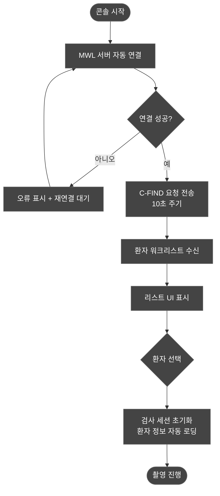
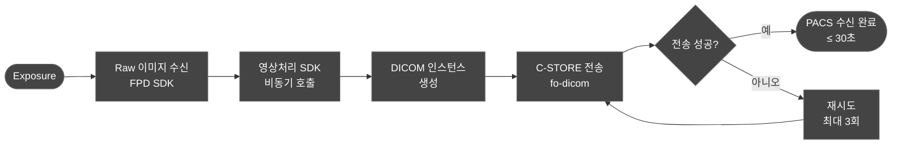
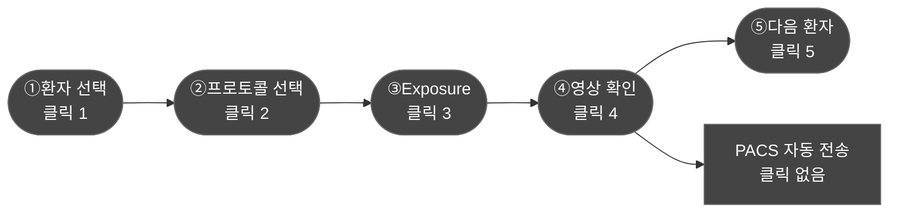
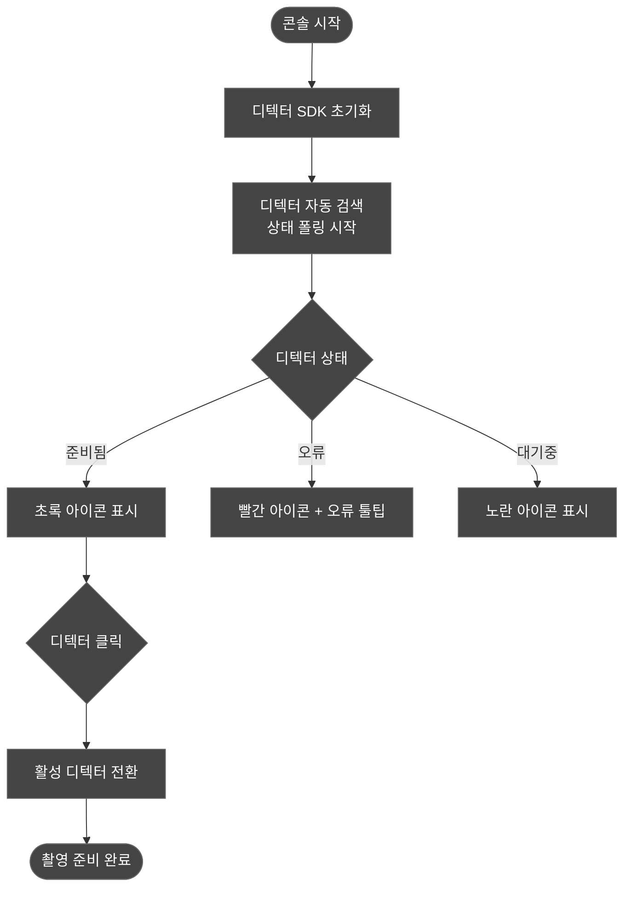
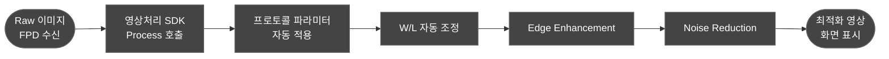
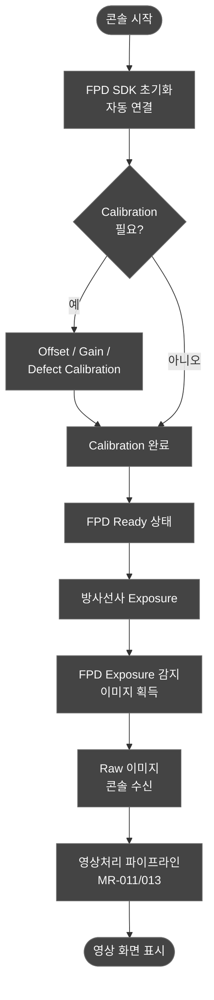
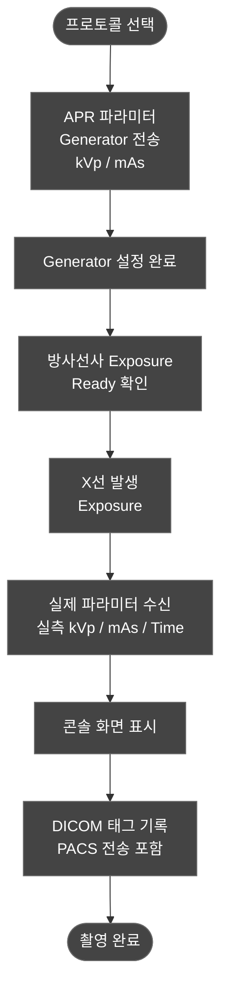
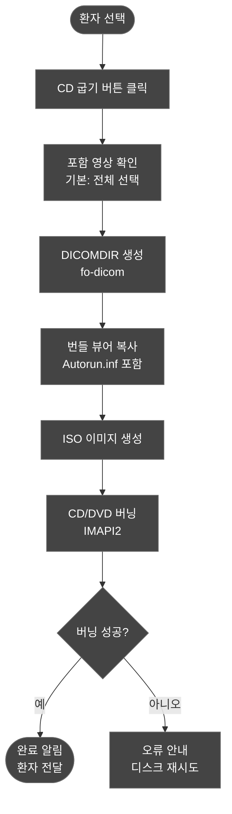

# DOC-001b: Market Requirements 상세 설명서 — Tier 2 + Tier 3/4

| 항목 | 내용 |
|------|------|
| **문서 ID** | DOC-001b |
| **제목** | MR 상세 설명서 Part 2 — Tier 2 + Tier 3/4 |
| **버전** | v1.0 |
| **작성일** | 2026-04-02 |
| **제품** | RadiConsole™ (X-ray 촬영 콘솔 SW) |
| **기술 스택** | WPF .NET 8, fo-dicom 5.x, SQLite, Serilog |
| **규제 등급** | IEC 62304 Class B |
| **관련 문서** | DOC-001a (Tier 1 MR), FDA K231225 (Predicate) |

---

## 개요

본 문서는 RadiConsole™의 Market Requirements(MR)를 Tier 2(시장 진입 필수, Phase 1 포함), Tier 3(있으면 좋고, Phase 2+), Tier 4(비현실적 또는 제외)로 분류하여 상세 기술한다.

- **Tier 2**: 17개 MR — 각 MR당 Why/What/How/워크플로우/PRD 연결 포인트 상세 기술
- **Tier 3**: 25개 MR — 각 MR당 3–5줄 간략 기술
- **Tier 4**: 13개 MR + 제외 4개 — 각 2줄 이내 최소 기술

현재 대체 대상: feel-DRCS (IMFOU) / Predicate: FDA K231225 (DRTECH EConsole1)

---

## 목차

1. [Tier 2 — 시장 진입 필수 (17개)](#tier-2)
2. [Tier 3 — Phase 2+ (25개)](#tier-3)
3. [Tier 4 — 비현실적 (13개) + 제외 (4개)](#tier-4)

---

## Tier 2 — 시장 진입 필수 (17개) {#tier-2}

> Phase 1 MVP에 반드시 포함되어야 하는 기능. feel-DRCS 또는 predicate EConsole1과의 동등성 확보 및 병원 임상 워크플로우 지원에 필수.

---

### MR-001: MWL 자동 조회
**Tier**: Tier 2 (시장 진입 필수)  
**카테고리**: DICOM 통신 / 환자 관리

#### 왜 필요한가 (Why)
- **시장 근거**: feel-DRCS의 핵심 기능으로, 국내 병원 RIS/HIS 연동 없이는 임상 워크플로우 진입 자체가 불가. Xmaru, VXvue, EConsole1 모두 DICOM MWL SCU를 기본 지원함.
- **고객 기대**: 병원 방사선과는 매일 수십~수백 건의 검사를 처리하며, 환자 정보를 수동 입력하면 오타·오입력으로 인한 검사 오류(Wrong Patient)가 발생한다. MWL 자동 조회는 환자 안전 및 운영 효율성의 기본 전제.

#### 무엇인가 (What)
- **기능 정의**: 콘솔 소프트웨어가 DICOM MWL SCU(Modality Worklist Service Class User) 역할을 수행하여 병원 HIS/RIS의 MWL SCP에서 당일 촬영 예약 목록을 자동으로 가져와 UI에 표시한다. 방사선사는 목록에서 환자를 선택하는 것만으로 검사를 시작할 수 있다.
- **구현 범위 (Phase 1 최소)**: MWL SCU C-FIND 요청/응답, 조회 결과 리스트 표시, 환자 선택 후 검사 세션 초기화, 10초 주기 자동 폴링, 수동 새로고침 버튼.
- **제외 범위**: 고급 필터(날짜 범위 검색, 검사 코드 필터), 예약 취소/변경 반영 알림, 복수 MWL 서버 동시 연결은 Phase 2+로 이관.

#### 어떻게 동작하는가 (How)
- **사용 시나리오**: 방사선사가 콘솔을 시작하면 MWL 서버에 자동 연결되며, 당일 촬영 예약 환자 목록이 화면 좌측 패널에 표시된다. 방사선사는 해당 환자 행을 클릭하여 선택하면 환자 정보(이름, ID, 생년월일, 검사 부위 등)가 자동으로 검사 세션에 로딩된다.
- **기술 동작**: fo-dicom의 `DicomClient`를 활용하여 C-FIND-RQ를 10초 주기로 전송. 응답 데이터셋에서 PatientName(0010,0010), PatientID(0010,0020), StudyInstanceUID(0020,000D), ScheduledProcedureStepDescription(0040,0007) 등 핵심 태그를 파싱하여 `WorklistItem` 뷰모델 컬렉션에 바인딩. 네트워크 오류 시 Serilog로 로그 기록 후 재연결 타이머 동작.

#### 워크플로우

#### PRD 연결 포인트
- PRD에서 MWL 서버 설정 화면(IP, Port, AE Title) UI 명세 필요.
- 워크리스트 테이블 컬럼 구성(이름, 환자ID, 생년월일, 검사부위, 예약시간) 및 정렬 기준 정의.
- 네트워크 단절 시 사용자 안내 메시지 규격(MR-048 연계).
- fo-dicom QueryRetrieveLevel = STUDY 또는 SCHEDULED 설정값을 병원 RIS 벤더별로 조정 가능한 설정 항목으로 노출할지 여부 결정 필요.

---

### MR-002: PACS 전송 30초 이내
**Tier**: Tier 2 (시장 진입 필수)  
**카테고리**: 성능 / DICOM 통신

#### 왜 필요한가 (Why)
- **시장 근거**: feel-DRCS가 동등한 전송 성능을 제공하며, 응급·외래 병원 환경에서는 "촬영 후 즉시 판독 가능" 상태가 구매 기준이 됨. 전송 지연이 길면 방사선사의 대기 시간 증가 및 검사 처리량 저하.
- **고객 기대**: 흉부 PA 한 장 촬영 후 판독의가 PACS에서 영상을 확인하는 데 30초를 넘으면 워크플로우 병목으로 인식됨. 특히 응급실 연동 병원에서 SLA 기준으로 명시.

#### 무엇인가 (What)
- **기능 정의**: 검출기(FPD)로부터 Raw 이미지를 수신한 시점부터 PACS 서버에서 C-STORE 수신 완료 응답을 받기까지의 전체 경과 시간이 30초 이내여야 한다. 이 시간에는 영상처리 SDK 호출, DICOM 인스턴스 생성, 네트워크 전송이 포함된다.
- **구현 범위 (Phase 1 최소)**: C-STORE SCU 구현(fo-dicom), 비동기 전송 파이프라인, 전송 상태 표시(진행바 또는 상태 아이콘), 전송 실패 시 자동 재시도(3회), 전송 시간 Serilog 로깅.
- **제외 범위**: 전송 성능 대시보드, 다중 PACS 동시 전송(Phase 2+), QoS 우선순위 설정.

#### 어떻게 동작하는가 (How)
- **사용 시나리오**: 방사선사가 Exposure 버튼을 누르면 촬영이 진행되고, 영상처리가 완료되면 화면에 영상이 표시됨과 동시에 PACS 전송이 백그라운드에서 자동 시작된다. 화면 우하단의 전송 상태 아이콘이 "전송 중 → 완료" 로 변경되며 30초 이내에 완료되어야 한다.
- **기술 동작**: Raw 이미지 수신 → 영상처리 SDK 비동기 호출(Task.Run) → DICOM 인스턴스 생성(fo-dicom Dataset 빌드, 필수 태그 삽입) → DicomClient C-STORE 요청 → 응답 수신 후 상태 업데이트. 전체 파이프라인은 async/await 체인으로 구성하여 UI 블로킹 방지.

#### 워크플로우

#### PRD 연결 포인트
- PRD에서 성능 요구사항 섹션에 "30초 이내" 를 정량 수치로 명기하고, 측정 기준(시작점: FPD Raw 수신 완료, 종료점: C-STORE Response 수신)을 정의해야 함.
- PACS 서버 설정 화면(IP, Port, AE Title, Called AE Title) UI 명세 필요.
- 전송 실패 시 사용자 알림 방식 및 재전송 수동 트리거 UI 규격 필요(MR-048 연계).
- 네트워크 속도에 따른 성능 변동 범위와 테스트 환경 조건(100Mbps LAN 기준) 명기.

---

### MR-003: 5 클릭 이내 워크플로우
**Tier**: Tier 2 (시장 진입 필수)  
**카테고리**: UX / 워크플로우

#### 왜 필요한가 (Why)
- **시장 근거**: feel-DRCS와 VXvue 모두 최소 클릭 워크플로우를 판매 포인트로 강조. 방사선사 피로도 감소와 처리 속도 향상이 구매 결정 요인으로 직결됨.
- **고객 기대**: 하루 100건 이상 촬영하는 방사선사 입장에서 불필요한 클릭·화면 전환은 누적 피로를 유발. "환자 선택부터 PACS 전송까지 5클릭"은 경쟁사 비교 시 구체적 수치로 제시 가능한 차별점.

#### 무엇인가 (What)
- **기능 정의**: 방사선사가 MWL 목록에서 환자를 선택한 후 프로토콜 선택 → 촬영(Exposure) → 영상 확인 → PACS 전송 확인까지 총 5번의 클릭 이내에 완료되도록 UI 흐름을 설계한다. 전송은 자동으로 이루어지는 경우 4클릭도 달성 가능.
- **구현 범위 (Phase 1 최소)**: 메인 워크플로우 화면 단일 페이지 구성, 프로토콜 선택 퀵버튼(즐겨찾기 없이도 상위 표시), Exposure 버튼 원터치, 자동 PACS 전송(전송 버튼 생략 가능).
- **제외 범위**: 화면 커스터마이징(MR-047), 터치스크린 최적화(MR-041)는 Phase 2+.

#### 어떻게 동작하는가 (How)
- **사용 시나리오**: ①환자 선택(클릭1) → ②프로토콜 선택(클릭2) → ③Exposure(클릭3) → ④영상 확인(OK 클릭4) → ⑤다음 환자 이동(클릭5). PACS 전송은 ④ 이후 자동으로 이루어져 별도 클릭 불필요.
- **기술 동작**: WPF MVVM 패턴에서 메인 WindowViewModel이 단일 상태 머신으로 동작. 각 스텝 전환은 Command 바인딩으로 처리. 불필요한 Modal 다이얼로그를 제거하고 인라인 상태 변환으로 화면 이탈 최소화.

#### 워크플로우

#### PRD 연결 포인트
- PRD 사용성 요구사항 섹션에 "주요 워크플로우 5클릭 이내" 를 정량 기준으로 명기.
- 화면 레이아웃 설계 시 메인 워크플로우가 단일 화면에서 완결되는 구조 요구.
- UX 검증 항목: 실제 방사선사 대상 클릭 횟수 측정 테스트 시나리오 정의 필요.
- 자동 PACS 전송 활성화 기본값(default ON) 및 수동 전환 옵션 여부 결정.

---

### MR-004: 50개+ 촬영 프로토콜
**Tier**: Tier 2 (시장 진입 필수)  
**카테고리**: 프로토콜 관리 / 콘텐츠

#### 왜 필요한가 (Why)
- **시장 근거**: feel-DRCS에는 신체 부위별 기본 프로토콜이 사전 탑재되어 있어 납품 즉시 사용 가능. 경쟁사 대비 "설치 후 바로 쓸 수 있는가"가 중소 병원 구매 결정의 중요 기준.
- **고객 기대**: 병원 방사선과는 납품 시 프로토콜을 직접 입력하는 작업에 인력·시간을 투입하기 어려움. 사전 정의된 50개+ 프로토콜이 있으면 도입 초기 부담 최소화.

#### 무엇인가 (What)
- **기능 정의**: Chest PA, Chest Lat, Hand AP, Hand Lat, Knee AP, Knee Lat, Spine L-AP, Abdomen AP 등 임상에서 빈번히 사용되는 Body Part + Projection 조합 50개 이상을 소프트웨어에 기본 탑재한다. 각 프로토콜에는 권장 kVp/mAs 범위, 영상처리 파라미터, SID 기본값이 포함된다.
- **구현 범위 (Phase 1 최소)**: SQLite `protocols` 테이블에 50개 이상 사전 정의 레코드, UI 프로토콜 선택 화면(Body Part 그룹 → Projection 선택), 프로토콜 로딩 시 APR 파라미터 자동 적용.
- **제외 범위**: 사용자 정의 프로토콜 추가/편집 UI(Phase 2+로 이관 가능, DB 직접 편집으로 임시 대응), 프로토콜 가져오기/내보내기(Phase 2+).

#### 어떻게 동작하는가 (How)
- **사용 시나리오**: 방사선사가 촬영 화면에서 신체 부위 그룹(흉부, 상지, 하지, 척추, 복부 등)을 선택하면 해당 그룹의 Projection 버튼 목록이 표시된다. "흉부 PA" 버튼을 클릭하면 해당 프로토콜의 kVp, mAs, 영상처리 파라미터가 자동으로 로딩된다.
- **기술 동작**: 앱 시작 시 SQLite `protocols` 테이블 전체를 메모리로 로딩하여 `ObservableCollection<Protocol>` 구성. 프로토콜 선택 시 해당 레코드의 파라미터를 Generator 통신 모듈 및 영상처리 SDK에 전달. 프로토콜 데이터는 앱 배포 시 migrations로 초기 데이터 시딩.

#### PRD 연결 포인트
- PRD에 기본 탑재 프로토콜 목록(Body Part × Projection 매트릭스) 부록으로 첨부.
- 각 프로토콜의 기본 파라미터(kVp 범위, mAs 범위) 임상 검토 필요 → 방사선사 또는 의학물리사 검토.
- Phase 1에서 프로토콜 편집 UI 제외 시, 병원 커스터마이징 지원 방법(DB 파일 교체, 설정 도구 제공 등) 명기 필요.
- SQLite 스키마(protocols 테이블) 컬럼 정의를 SW 아키텍처 문서에 기술.

---

### MR-010: 다중 디텍터 상태 표시
**Tier**: Tier 2 (시장 진입 필수)  
**카테고리**: 디텍터 관리 / UX

#### 왜 필요한가 (Why)
- **시장 근거**: feel-DRCS, Xmaru, VXvue 모두 다중 디텍터(테이블+스탠드, 무선+유선 혼용) 환경을 지원하며, 디텍터 상태 표시는 기본 UI 요소. 디텍터 선택 실수는 촬영 실패 → 재촬영으로 이어져 방사선 피폭 증가.
- **고객 기대**: 방사선실에 디텍터가 2개 이상인 경우(테이블 + 업라이트), 현재 어느 디텍터가 활성화되어 있는지 한눈에 파악해야 함. 상태 불명확 시 방사선사 혼란 및 촬영 오류 유발.

#### 무엇인가 (What)
- **기능 정의**: 연결된 FPD 디텍터들의 실시간 상태(연결됨/준비됨/충전 중/오류/연결 끊김)를 메인 화면에 아이콘 + 색상으로 표시하고, 클릭으로 활성 디텍터를 전환할 수 있다.
- **구현 범위 (Phase 1 최소)**: 최대 4개 디텍터 상태 표시, 상태 아이콘(연결/준비/오류), 클릭으로 활성 디텍터 선택, 상태 폴링 주기(5초), 오류 발생 시 툴팁으로 오류 코드 표시.
- **제외 범위**: 디텍터 배터리 잔량 상세 그래프(Phase 2+), 디텍터 이력 관리, 자동 디텍터 전환(Exposure 감지 기반).

#### 어떻게 동작하는가 (How)
- **사용 시나리오**: 메인 화면 상단 패널에 디텍터 1(테이블), 디텍터 2(업라이트)가 아이콘으로 표시됨. 초록색=준비됨, 노란색=대기/충전, 빨간색=오류. 방사선사가 업라이트 촬영을 위해 디텍터 2 아이콘을 클릭하면 해당 디텍터가 활성화되어 다음 Exposure에서 사용됨.
- **기술 동작**: FPD SDK의 상태 이벤트 콜백을 구독하여 `DetectorViewModel.Status` 프로퍼티 업데이트. WPF DataTrigger로 Status 값에 따라 아이콘 색상 자동 변환. 활성 디텍터 전환은 `AcquisitionService.ActiveDetector` 프로퍼티 변경으로 처리.

#### 워크플로우

#### PRD 연결 포인트
- PRD에서 디텍터 상태 아이콘 색상 기준표 및 상태 명칭 정의.
- 최대 지원 디텍터 수(Phase 1: 4개) 명기.
- 오류 상태별 사용자 안내 메시지 규격(MR-048 연계).
- 디텍터 상태 변경 시 사운드/진동 알림 여부 결정.

---

### MR-011: 자동 영상 최적화
**Tier**: Tier 2 (시장 진입 필수)  
**카테고리**: 영상처리 / 화질

#### 왜 필요한가 (Why)
- **시장 근거**: feel-DRCS의 FS-MLW(Multi-Level Window) 자동 최적화 알고리즘은 구매자들이 feel-DRCS를 선택하는 핵심 이유 중 하나. 동등한 자동 최적화 없이는 "영상이 어둡다", "대비가 맞지 않는다"는 임상 피드백이 즉각 발생.
- **고객 기대**: 방사선사는 매 촬영마다 수동으로 W/L을 조절하지 않아도 영상이 자동으로 최적화되기를 기대. 특히 비숙련 방사선사의 경우 자동 최적화가 없으면 진단 가능한 영상 생성이 어려움.

#### 무엇인가 (What)
- **기능 정의**: FPD에서 수신된 Raw 이미지를 외부 영상처리 SDK에 전달하여 자동 W/L(Window/Level), Contrast 조정, Edge Enhancement, Noise Reduction이 적용된 최적화 영상을 반환받아 화면에 표시한다. 최적화 파라미터는 프로토콜별로 사전 설정된 값을 사용한다.
- **구현 범위 (Phase 1 최소)**: 외부 영상처리 SDK 연동, 프로토콜별 기본 파라미터 자동 적용, 최적화 영상 화면 표시, 처리 시간 측정(성능 지표).
- **제외 범위**: 사용자 정의 최적화 파라미터 편집 UI(Phase 2+), A/B 비교 표시(Phase 2+).

#### 어떻게 동작하는가 (How)
- **사용 시나리오**: 방사선사가 Exposure 후 1-2초 내에 최적화된 영상이 화면에 자동 표시된다. 별도 조작 없이 진단에 적합한 수준의 영상 품질이 제공되며, 필요 시 수동 W/L 조정(MR-012)으로 추가 조절 가능.
- **기술 동작**: Raw 16-bit 이미지 버퍼 → SDK Process() 호출(비동기) → 프로토콜 파라미터(WindowCenter, WindowWidth, EdgeStrength, NoiseLevel) 전달 → SDK 반환 8-bit 또는 16-bit 최적화 영상 → WPF WriteableBitmap에 렌더링.

#### 워크플로우

#### PRD 연결 포인트
- PRD에서 "자동 최적화 처리 시간 ≤ 2초"를 성능 요구사항으로 명기.
- 외부 영상처리 SDK 벤더 및 라이선스 계약 정보를 아키텍처 문서에 명기(SDK 이름, 버전, 라이선스 방식).
- 프로토콜별 기본 최적화 파라미터 테이블(Window Center/Width 초기값)을 부록으로 첨부.
- SDK 장애 시 폴백 처리(Raw 이미지 직접 표시) 여부 결정 필요.

---

### MR-012: W/L, Zoom, Pan 기본 조작
**Tier**: Tier 2 (시장 진입 필수)  
**카테고리**: 영상 뷰어 / UX

#### 왜 필요한가 (Why)
- **시장 근거**: 모든 콘솔 SW(feel-DRCS, Xmaru, VXvue, EConsole1)의 기본 기능. DICOM 뷰어로서 최소 요건이며, 없을 경우 "뷰어 기능도 없는 콘솔"로 평가받아 판매 자체가 불가.
- **고객 기대**: 방사선사가 촬영 직후 영상을 화면에서 확인하며 기본적인 조작(확대, 이동, W/L 조절)을 수행하는 것은 임상 기본 요건. 판독실 PACS와는 달리 콘솔에서의 조작은 "즉시 확인" 수준이면 충분.

#### 무엇인가 (What)
- **기능 정의**: 촬영된 영상을 화면에서 확인할 때 Window/Level 조절(마우스 우클릭 드래그), 확대/축소(마우스 휠), 이동(마우스 좌클릭 드래그), Flip(수평/수직 반전), Rotate(90° 단위 회전), Invert(흑백 반전) 기능을 제공한다.
- **구현 범위 (Phase 1 최소)**: W/L 조절(마우스 드래그), Zoom In/Out(휠), Pan(드래그), Flip H/V, Rotate 90°, Invert, Fit-to-Window 버튼.
- **제외 범위**: 자유 회전(임의 각도), 고급 측정 도구(거리, 각도 — Phase 2+), 멀티 레이아웃 뷰(Phase 2+).

#### 어떻게 동작하는가 (How)
- **사용 시나리오**: 촬영 후 영상이 표시되면 방사선사가 마우스 우클릭 드래그로 W/L을 조절하여 원하는 조직 대비를 얻는다. 마우스 휠로 확대 후 좌클릭 드래그로 관심 부위로 이동. 화면 버튼으로 Flip, Rotate, Invert 적용.
- **기술 동작**: WPF `Canvas` + `TransformGroup`(ScaleTransform, TranslateTransform, RotateTransform) 조합으로 변환 처리. W/L은 MouseMove 델타값을 WindowCenter/WindowWidth 변경에 매핑하여 실시간 렌더링. WriteableBitmap의 픽셀 LUT 변환으로 W/L 적용.

#### PRD 연결 포인트
- PRD에서 마우스 제스처 매핑표(우클릭=W/L, 휠=Zoom, 좌클릭=Pan) 명기 및 키보드 단축키 정의.
- 영상 조작 초기화(Reset) 버튼 UI 요구사항 명기.
- W/L 조절 감도(마우스 1px 이동당 WW/WC 변화량) 기본값 및 사용자 설정 가능 여부.
- Fit-to-Window 자동 적용 시점(영상 로드 시 자동 적용 여부) 결정.

---

### MR-013: Edge Enhancement, Noise Reduction 등
**Tier**: Tier 2 (시장 진입 필수)  
**카테고리**: 영상처리 / 화질

#### 왜 필요한가 (Why)
- **시장 근거**: feel-DRCS의 FS-MLW 알고리즘은 Edge Enhancement와 Noise Reduction을 프로토콜별로 최적화하여 영상 진단 품질을 보장함. 외부 SDK를 통해 동등한 기능을 제공하지 못하면 영상 품질 비교에서 열위.
- **고객 기대**: 임상 방사선사와 판독의는 손뼈, 흉추 등 미세 구조 검출을 위해 Edge Enhancement가 적용된 영상을 기대. Noise가 과도하면 저선량 프로토콜 적용이 불가능.

#### 무엇인가 (What)
- **기능 정의**: 외부 영상처리 SDK의 후처리 필터(Edge Enhancement, Noise Reduction, Unsharp Masking 등)를 촬영 프로토콜별로 사전 설정된 파라미터로 자동 적용한다. 방사선사는 프로토콜 선택만으로 해당 신체 부위에 최적화된 필터가 자동으로 적용된다.
- **구현 범위 (Phase 1 최소)**: SDK를 통한 Edge Enhancement 파라미터 적용, Noise Reduction 파라미터 적용, 프로토콜 테이블에 필터 파라미터 컬럼 추가, 영상 처리 후 결과 화면 표시.
- **제외 범위**: 방사선사가 실시간으로 필터 파라미터를 슬라이더로 조절하는 UI(Phase 2+), 필터 비교 A/B 뷰(Phase 2+).

#### 어떻게 동작하는가 (How)
- **사용 시나리오**: 방사선사가 "손 AP" 프로토콜을 선택하면, 해당 프로토콜에 정의된 High Edge Enhancement, Low Noise Reduction 파라미터가 SDK에 전달되어 촬영 후 자동 적용됨. 별도 조작 없이 진단에 적합한 영상 품질 제공.
- **기술 동작**: SQLite `protocols` 테이블의 `edge_strength`, `noise_level`, `unsharp_radius` 등 컬럼 값을 읽어 SDK Process() 함수에 파라미터 구조체로 전달. MR-011(자동 영상 최적화)과 동일 처리 파이프라인 내에서 연계 실행.

#### PRD 연결 포인트
- PRD에서 MR-011과 MR-013을 "영상처리 파이프라인" 하나의 섹션으로 통합하여 처리 순서(W/L → Edge → Noise → Invert) 명기.
- SDK 지원 필터 목록 및 파라미터 범위를 부록으로 첨부(SDK 벤더 문서 기반).
- 프로토콜별 기본 필터 파라미터 임상 검토 프로세스 정의(의학물리사 Sign-off 필요 여부).

---

### MR-021: PACS 상호운용성
**Tier**: Tier 2 (시장 진입 필수)  
**카테고리**: DICOM 통신 / 호환성

#### 왜 필요한가 (Why)
- **시장 근거**: 병원 구매 담당자와 의료정보팀은 기존 PACS와의 호환성을 반드시 확인한다. 호환성 검증 없이 납품 시 현장 연동 실패 → 클레임·반품으로 이어짐. feel-DRCS, EConsole1 모두 DICOM Conformance Statement를 제공하여 호환성을 사전 보장.
- **고객 기대**: "우리 병원 PACS(InfinittPACS)와 되나요?" 라는 질문에 검증 이력으로 답할 수 있어야 영업 장벽 제거. 3개 이상 PACS 벤더 검증은 국내 병원 시장 커버리지 기준.

#### 무엇인가 (What)
- **기능 정의**: RadiConsole™이 DICOM Conformance Statement를 공식 발행하고, 국내 주요 PACS 벤더(InfinittPACS, Maroview, DCM4CHEE 오픈소스) 최소 3개와 C-STORE, C-FIND, C-MOVE 서비스 상호운용성 테스트를 수행하여 검증 보고서를 작성한다.
- **구현 범위 (Phase 1 최소)**: DICOM Conformance Statement 문서 작성(fo-dicom 기반), DCM4CHEE(오픈소스)와 개발환경 연동 검증, 추가 1-2개 상용 PACS와 테스트(InfinittPACS 또는 Maroview), 상호운용성 테스트 보고서 작성.
- **제외 범위**: 전 세계 모든 PACS 벤더 검증(Phase 2+), DICOM TLS 암호화 검증(Phase 2+).

#### 어떻게 동작하는가 (How)
- **사용 시나리오**: 병원 IT 담당자에게 DICOM Conformance Statement 문서를 제공하여 자사 PACS와의 호환성을 사전 검토할 수 있도록 함. 납품 전 현장 테스트를 통해 연동 이슈를 사전 확인.
- **기술 동작**: fo-dicom 라이브러리의 표준 DICOM 서비스(C-STORE SCU, C-FIND SCU, C-ECHO SCU)를 기반으로 구현. 각 PACS 벤더별 특이 설정(Encoding, Transfer Syntax, Called AE Title 형식 등)을 설정 파일로 분리하여 현장 조정 가능.

#### PRD 연결 포인트
- PRD에 DICOM Conformance Statement를 공식 문서 산출물로 명시(IEC 62304 요구사항 포함).
- 지원 DICOM 서비스 목록(SCU/SCP 역할, SOP Class 목록) PRD 부록으로 첨부.
- 상호운용성 테스트 계획(테스트 환경, PACS 벤더 목록, 테스트 케이스)을 별도 테스트 계획 문서로 작성.

---

### MR-023: 자사 FPD 통합
**Tier**: Tier 2 (시장 진입 필수)  
**카테고리**: 하드웨어 통합 / 핵심 기능

#### 왜 필요한가 (Why)
- **시장 근거**: RadiConsole™의 핵심 비즈니스 모델은 자사 FPD 디텍터 + 콘솔 SW 번들 패키지 판매. FPD 없이 콘솔만 판매할 경우 경쟁 우위 소멸. 자사 FPD 연동이 곧 제품의 존재 이유.
- **고객 기대**: FPD + 콘솔 패키지로 구매하는 병원은 "한 벤더에서 하드웨어와 소프트웨어를 모두 지원받는다"는 편의성을 기대. 연동 문제는 AS 비용 증가로 직결.

#### 무엇인가 (What)
- **기능 정의**: 자사 FPD 디텍터와 전용 SDK를 통해 직접 통신하여 Calibration(Offset/Gain/Defect), Exposure 트리거, Raw 이미지 수신의 전체 이미지 획득 사이클을 구현한다. 자사 FPD의 전체 기능(배터리 상태, 무선 품질 등)을 콘솔에서 제어·모니터링한다.
- **구현 범위 (Phase 1 최소)**: 자사 FPD SDK 연동, Offset/Gain/Defect Calibration 실행 기능, Exposure 준비 신호 수신 및 트리거, Raw 이미지 수신 및 버퍼링, 연결 상태 모니터링.
- **제외 범위**: 타사 FPD 드라이버 지원(MR-022, Tier 4), 무선 FPD 전용 고급 기능(Phase 2+).

#### 어떻게 동작하는가 (How)
- **사용 시나리오**: 콘솔 시작 시 자사 FPD와 자동 연결. 방사선사가 촬영 준비 시 FPD 상태가 "Ready" 로 표시되며, X선 발생 후 FPD가 자동으로 이미지를 획득하여 콘솔로 전송. 콘솔은 이를 수신하여 영상처리 파이프라인에 전달.
- **기술 동작**: 자사 FPD SDK DLL 참조, SDK 이벤트 콜백(OnConnected, OnExposureDetected, OnImageReady)을 구독. Raw 이미지 데이터(16-bit 배열)를 수신하여 영상처리 모듈로 전달. Calibration은 Offset Frame(차단 촬영), Gain Frame(평판 촬영), Defect Map 적용 순으로 수행.

#### 워크플로우

#### PRD 연결 포인트
- PRD에서 지원 자사 FPD 모델 목록(모델명, 해상도, 인터페이스 방식) 명기.
- Calibration 주기 및 트리거 조건(시작 시 자동, 수동 실행, 주기적 자동)을 사용자 설정으로 제공할지 여부 결정.
- FPD SDK 버전 의존성 관리 정책(SDK 업데이트 시 콘솔 재검증 프로세스) 명기.
- FPD 연결 실패 시 오프라인 모드(수동 입력) 지원 여부 결정.

---

### MR-024: DICOM Print
**Tier**: Tier 2 (시장 진입 필수)  
**카테고리**: DICOM 통신 / 출력

#### 왜 필요한가 (Why)
- **시장 근거**: feel-DRCS의 기본 기능 목록에 DICOM Print가 포함됨. 한국 일부 중소 병원 및 의원에서 아직 DICOM 프린터를 보유하고 필름 출력을 요구하는 경우가 존재. 영업 현장에서 "DICOM Print 되나요?" 질문이 빈번.
- **고객 기대**: 필름 프린터 보유 병원에서 기존 워크플로우(촬영 후 필름 출력)를 유지하려는 요구. PACS 없이 운영되는 소규모 시설에서는 필름이 유일한 저장 수단인 경우도 있음.

#### 무엇인가 (What)
- **기능 정의**: fo-dicom의 DICOM Print SCU를 구현하여 DICOM 호환 필름 프린터(Dry Imager 등)에 영상을 출력한다. N-CREATE, N-SET, N-ACTION을 사용하는 Basic Grayscale Print Management SOP를 지원한다.
- **구현 범위 (Phase 1 최소)**: Basic Grayscale Print Management SOP SCU 구현, 프린터 설정(IP, Port, AE Title), 필름 사이즈/레이아웃 선택(14×17, 10×12, 8×10), 인쇄 미리보기.
- **제외 범위**: Color Print, 고급 어노테이션 인쇄, 다중 이미지 레이아웃 편집(Phase 2+).

#### 어떻게 동작하는가 (How)
- **사용 시나리오**: 영상 확인 후 방사선사가 "인쇄" 버튼 클릭 → 필름 사이즈/레이아웃 선택 → 인쇄 실행. 프린터 상태(Ready/Busy/Error) 표시 후 인쇄 완료 알림.
- **기술 동작**: fo-dicom `DicomClient`를 사용하여 N-CREATE(Film Session/Box 생성) → N-SET(이미지 데이터 설정) → N-ACTION(인쇄 실행) 순서로 DICOM Print 트랜잭션 수행.

#### PRD 연결 포인트
- PRD에서 지원 필름 사이즈 및 레이아웃 목록 명기.
- DICOM Conformance Statement에 Print SCU SOP Class 포함(MR-021 연계).
- 프린터 부재 시(PACS 전용 운영 병원) Print 기능을 UI에서 숨기는 설정 옵션 여부 결정.

---

### MR-025: DICOM Worklist (RIS)
**Tier**: Tier 2 (시장 진입 필수)  
**카테고리**: DICOM 통신 / 워크플로우

#### 왜 필요한가 (Why)
- **시장 근거**: feel-DRCS의 기본 기능으로, RIS와의 연동은 방사선 정보 시스템을 보유한 중소 이상 병원의 기본 요구사항. MWL SCU 구현(MR-001)의 연장선이지만 RIS 특화 워크플로우(검사 일정 자동 수신, 검사 완료 상태 피드백)를 별도로 정의.
- **고객 기대**: RIS를 보유한 병원에서는 검사실 배정, 우선순위 변경 등을 RIS에서 관리하며, 콘솔이 이를 실시간으로 반영하기를 기대.

#### 무엇인가 (What)
- **기능 정의**: MR-001(MWL 자동 조회)과 동일한 DICOM MWL SCU 기술을 기반으로, RIS 특화 워크플로우인 "검사 일정 자동 수신 + 검사 완료 상태 업데이트(MPPS 연계)" 를 지원한다. Phase 1에서는 MWL SCU 기반 조회만 구현하며 MPPS(MR-009)는 Phase 2+.
- **구현 범위 (Phase 1 최소)**: MR-001과 공유 구현(MWL SCU C-FIND), RIS AE Title 별도 설정 항목, RIS 연동 테스트(병원별 RIS 벤더 확인).
- **제외 범위**: MPPS(MR-009, Phase 2+), RIS에 검사 결과 자동 통보.

#### 어떻게 동작하는가 (How)
- **사용 시나리오**: RIS에서 검사가 예약되면 콘솔 워크리스트에 자동으로 표시. 방사선사가 해당 검사를 선택하여 촬영. RIS의 검사 상태는 MPPS가 구현되기 전까지 수동으로 업데이트.
- **기술 동작**: MR-001 MWL SCU 모듈을 공유하되, 설정 파일에서 HIS AE Title과 RIS AE Title을 구분하여 연결 대상 선택 가능하도록 구성. `appsettings.json`에 `WorklistSource: "HIS" | "RIS" | "BOTH"` 설정 추가.

#### PRD 연결 포인트
- PRD에서 MR-001과 MR-025를 "DICOM Worklist" 단일 기능으로 통합하되, 설정 섹션에서 HIS/RIS 구분 명기.
- 국내 주요 RIS 벤더(INFINITT RIS, Maroview RIS 등) 연동 테스트 계획 포함.
- MPPS 미구현 시 병원 운영 영향도 분석(검사 완료 상태를 RIS에 수동 입력해야 하는 병원 프로세스 파악).

---

### MR-031: AEC 모니터링
**Tier**: Tier 2 (시장 진입 필수)  
**카테고리**: Generator 통합 / 촬영 파라미터

#### 왜 필요한가 (Why)
- **시장 근거**: feel-DRCS는 Generator와 연동하여 kVp, mAs, mA, Time 파라미터를 콘솔에서 표시·설정하는 기능을 기본 제공. Generator 연동 없이는 "콘솔에서 촬영 파라미터를 확인도 못 한다"는 비교 열위 발생.
- **고객 기대**: 방사선사가 프로토콜을 선택하면 권장 kVp/mAs가 Generator에 자동으로 설정되고, 실제 사용된 Exposure 파라미터가 콘솔에 표시되어야 함. 이는 선량 관리 및 품질보증(QA)의 기본 데이터.

#### 무엇인가 (What)
- **기능 정의**: Generator와 시리얼(RS-232/RS-485) 또는 이더넷 통신으로 연결하여 AEC(Automatic Exposure Control) 파라미터(kVp, mAs, mA, Exposure Time)를 콘솔에서 모니터링하고, 프로토콜에 사전 정의된 APR(Anatomical Programmed Radiography) 값을 Generator에 전송한다.
- **구현 범위 (Phase 1 최소)**: Generator 통신 드라이버(자사 Generator 또는 표준 인터페이스), 실제 Exposure 파라미터 수신 및 화면 표시, APR 값 Generator 전송, Exposure 완료 신호 수신.
- **제외 범위**: 타사 Generator 프로토콜 지원(Phase 2+), AEC 자동 최적화 알고리즘(Phase 2+).

#### 어떻게 동작하는가 (How)
- **사용 시나리오**: 방사선사가 "흉부 PA" 프로토콜을 선택하면 콘솔이 Generator에 80kVp/12mAs APR 값을 자동 전송. Generator 패널에 해당 값이 설정됨. 촬영 후 실제 사용된 파라미터(예: 78kVp/11.2mAs)가 콘솔에 표시되어 영상과 함께 기록됨.
- **기술 동작**: SerialPort 또는 TcpClient를 통해 Generator와 연결. Generator 벤더별 프로토콜(ASCII 커맨드 또는 바이너리 프레임)로 APR 전송 및 Exposure 완료 이벤트 수신. 수신된 파라미터는 DICOM 태그(0018,0060 kVp, 0018,1152 Exposure 등)에 기록하여 PACS 전송 시 포함.

#### 워크플로우

#### PRD 연결 포인트
- PRD에서 Phase 1 지원 Generator 모델 목록(자사 Generator 우선) 명기.
- Generator 통신 인터페이스(시리얼 vs 이더넷) 및 프로토콜 규격을 아키텍처 문서에 기술.
- Exposure 파라미터가 기록되는 DICOM 태그 목록(0018,0060 kVp 등) 명기(IEC 62304 추적성).
- Generator 연결 실패 시 콘솔 동작 정의(수동 파라미터 입력 폴백 또는 촬영 차단).

---

### MR-044: 시스템 상태 표시
**Tier**: Tier 2 (시장 진입 필수)  
**카테고리**: UX / 안전 / 모니터링

#### 왜 필요한가 (Why)
- **시장 근거**: 방사선사가 촬영 전 장비 상태를 즉시 파악하지 못하면 촬영 실패 → 재촬영으로 이어져 방사선 피폭이 증가. IEC 62366(사용성) 요구사항으로 중요 상태 정보의 명확한 표시가 요구됨.
- **고객 기대**: "PACS 연결이 끊어진 상태에서 촬영하면 영상을 잃어버린다"는 우려. 시스템 상태 표시는 방사선사의 기본 안전장치.

#### 무엇인가 (What)
- **기능 정의**: 메인 화면의 상태 표시줄에 FPD 디텍터 연결 상태, Generator 연결 상태, PACS 연결 상태, MWL 서버 연결 상태, 시스템 에러를 색상(초록/노란/빨강) + 아이콘 + 텍스트로 실시간 표시한다.
- **구현 범위 (Phase 1 최소)**: 4개 연결 상태 아이콘(FPD, Generator, PACS, MWL), 상태별 색상 코딩, 에러 발생 시 상태 표시줄 강조 + 팝업 알림, 상태 변경 시 Serilog 로그 기록.
- **제외 범위**: 상태 이력 대시보드(Phase 2+), 원격 모니터링(Phase 2+), 사운드 알림 커스터마이징.

#### 어떻게 동작하는가 (How)
- **사용 시나리오**: 방사선사가 촬영 전 화면 하단 상태 표시줄을 한눈에 확인. 모든 아이콘이 초록색이면 정상 촬영 가능. 빨간색 아이콘이 있으면 해당 항목을 클릭하여 오류 상세 및 해결 방법(MR-048 연계)을 확인.
- **기술 동작**: 각 서비스(FPD, Generator, PACS, MWL) 연결 상태를 `StatusViewModel`의 `ObservableProperty`로 관리. 각 서비스의 상태 이벤트를 구독하여 뷰모델 업데이트. WPF DataTrigger로 상태값에 따라 아이콘 색상 자동 변환.

#### PRD 연결 포인트
- PRD에서 상태 표시줄 UI 레이아웃 및 색상 코딩 기준(초록=정상, 노랑=경고, 빨강=오류) 명기.
- 각 연결 상태의 "경고" 조건 정의(예: PACS 응답 지연 시 노랑 → 연결 끊김 시 빨강).
- 촬영 불가 상태(FPD 연결 끊김, Generator 오류)에서 Exposure 버튼 비활성화 여부 결정.
- IEC 62366 사용성 평가 항목으로 상태 표시 명확성 테스트 케이스 포함.

---

### MR-045: 한/영 2개 언어
**Tier**: Tier 2 (시장 진입 필수)  
**카테고리**: 국제화 / UX

#### 왜 필요한가 (Why)
- **시장 근거**: 국내 MFDS 허가(한국어 UI 필수) + FDA 510(k) 제출(영어 UI 필수) 이중 대응 필요. Predicate EConsole1(FDA K231225)도 영어/한국어 2개 언어를 지원하여 동등성 기준으로 요구됨.
- **고객 기대**: 국내 납품 시 전체 UI 한국어 표시 필수. 수출·FDA 제출 시 영어 전환 가능해야 함. 외국인 방사선사가 있는 병원(국제 병원, 외국인 환자 비중 높은 병원)에서 영어 지원 요구.

#### 무엇인가 (What)
- **기능 정의**: 설정 화면에서 언어를 한국어/영어로 전환하면 전체 UI(메뉴, 버튼, 레이블, 상태 메시지, 오류 메시지)가 해당 언어로 즉시 전환된다. 콘솔 재시작 없이 런타임 전환 가능하거나 재시작으로 적용.
- **구현 범위 (Phase 1 최소)**: .NET WPF 리소스 파일(.resx) 기반 한국어/영어 문자열 분리, 언어 설정 화면, 설정 저장(SQLite 또는 appsettings.json), 다음 시작 시 설정 언어로 로드.
- **제외 범위**: 런타임 즉시 전환(재시작 방식으로 대체 가능), 3개 이상 언어(Phase 2+), RTL 언어 지원.

#### 어떻게 동작하는가 (How)
- **사용 시나리오**: 관리자 설정 화면에서 언어 드롭다운(한국어/English)을 선택하고 저장. 다음 콘솔 시작 시 선택된 언어로 전체 UI가 표시됨.
- **기술 동작**: `ResourceDictionary`에 언어별 문자열 파일(ko-KR.resx, en-US.resx) 분리. `CultureInfo.CurrentUICulture` 설정으로 리소스 로딩. 모든 UI 문자열을 리소스 키로만 참조하여 하드코딩 금지. 설정값을 SQLite `settings` 테이블의 `language` 컬럼에 저장.

#### PRD 연결 포인트
- PRD에서 지원 언어 목록(ko-KR, en-US) 및 전환 방식(재시작 필요 여부) 명기.
- 번역 대상 문자열 목록 관리 프로세스 정의(개발팀이 resx 관리, 번역가 검토).
- 오류 메시지 다국어 지원을 MR-048과 통합하여 단일 리소스 파일로 관리.
- FDA 510(k) 제출 시 영어 UI 스크린샷 필요 → QA 테스트 시 영어 UI 검증 시나리오 포함.

---

### MR-048: 오류 메시지 안내
**Tier**: Tier 2 (시장 진입 필수)  
**카테고리**: UX / 사용성 / 안전

#### 왜 필요한가 (Why)
- **시장 근거**: IEC 62366(의료기기 사용성 엔지니어링) 요구사항으로, 사용자가 오류 상황에서 올바른 조치를 취하지 못하면 안전 위험이 발생할 수 있음. "Error Code: 0x8004" 만 표시되는 콘솔은 방사선사 혼란을 야기하여 사용성 불합격 원인.
- **고객 기대**: 방사선사(비기술 직군)가 오류 발생 시 IT 담당자 호출 없이 스스로 해결할 수 있는 안내가 필요. "PACS 연결 오류 — 네트워크 케이블을 확인하세요" 수준의 명확한 안내 요구.

#### 무엇인가 (What)
- **기능 정의**: 시스템에서 오류가 발생할 때 단순 에러 코드가 아닌, 오류 원인(What happened)과 해결 방법(What to do)을 포함한 사용자 친화적 메시지를 한국어/영어로 표시한다. 오류 메시지는 코드별로 관리되는 메시지 테이블에서 조회하여 표시.
- **구현 범위 (Phase 1 최소)**: 오류 메시지 리소스 테이블(오류 코드 → 한/영 원인+해결방법), 오류 다이얼로그 UI(오류 아이콘, 제목, 상세 설명, 해결 방법, 확인 버튼), Serilog 상세 로그 기록(기술적 세부사항), 오류 코드 표시(로그 참조용).
- **제외 범위**: 자동 문제 해결(Phase 2+), 원격 지원 연계(Phase 2+), 오류 동영상 안내(Phase 2+).

#### 어떻게 동작하는가 (How)
- **사용 시나리오**: PACS 전송 실패 시 "영상 전송 실패 — PACS 서버(IP: 192.168.1.100)에 연결할 수 없습니다. 네트워크 연결과 PACS 서버 상태를 확인하세요. 문제가 지속되면 IT 담당자에게 문의하세요." 와 같은 메시지가 표시됨.
- **기술 동작**: 각 서비스 모듈에서 예외 발생 시 `ErrorCode` 열거형으로 래핑하여 `ErrorService.Show(ErrorCode)`를 호출. `ErrorMessageRepository`에서 코드에 매핑된 현재 언어의 메시지 문자열을 조회하여 `ErrorDialog` 표시. 동시에 Serilog에 스택 트레이스 포함 상세 로그 기록.

#### PRD 연결 포인트
- PRD에 주요 오류 시나리오별 메시지 예시 표(오류 코드, 원인, 해결 방법) 부록으로 첨부.
- IEC 62366 사용성 평가: 오류 메시지 이해도 테스트(방사선사 대상 형성 평가) 계획 포함.
- 오류 메시지 리소스 관리를 MR-045(다국어) 리소스 파일과 통합.
- Serilog 로그 레벨 정책(Debug/Info/Warning/Error/Fatal) 및 로그 파일 보존 기간 정의.

---

### MR-072: CD/DVD Burning with DICOM Viewer
**Tier**: Tier 2 (시장 진입 필수)  
**카테고리**: 환자 미디어 / 출력

#### 왜 필요한가 (Why)
- **시장 근거**: feel-DRCS와 Xmaru V1의 기본 기능. 한국 병원에서 환자가 타 병원으로 전원하거나 검사 결과를 지참할 때 CD 배포가 일반적 방식. 일부 병원에서는 보험 청구를 위해 영상 CD 제공이 필수.
- **고객 기대**: 방사선사가 콘솔에서 환자를 선택하고 버튼 하나로 CD를 구울 수 있어야 함. 환자가 CD를 집에서 열어볼 수 있도록 자동실행 DICOM 뷰어 포함 필수.

#### 무엇인가 (What)
- **기능 정의**: 선택한 환자의 DICOM 영상을 DICOMDIR 구조로 정리하고, 자동실행(Autorun) 경량 DICOM 뷰어를 함께 포함하여 CD/DVD에 굽는다. 환자가 CD를 PC에 넣으면 뷰어가 자동 실행되어 영상을 볼 수 있다.
- **구현 범위 (Phase 1 최소)**: DICOMDIR 생성(fo-dicom), 번들 경량 DICOM 뷰어(오픈소스 또는 자체 개발, 실행파일 형태), ISO 이미지 생성, CD/DVD 버닝(Windows IMAPI2 또는 써드파티 라이브러리), 진행 상태 표시.
- **제외 범위**: USB 미디어 출력(Phase 2+), 암호화 CD(Phase 2+), QR코드 기반 클라우드 링크(Phase 2+).

#### 어떻게 동작하는가 (How)
- **사용 시나리오**: 방사선사가 환자 목록에서 해당 환자를 선택 → "CD 굽기" 버튼 클릭 → 포함할 영상 확인(기본: 전체 선택) → "굽기 시작" → 진행 표시줄 → 완료 알림. CD를 환자에게 전달.
- **기술 동작**: 선택된 DICOM 인스턴스를 임시 폴더에 복사 → fo-dicom으로 DICOMDIR 파일 생성 → 번들 뷰어 실행파일과 Autorun.inf를 임시 폴더에 복사 → ISO 이미지 생성 → Windows IMAPI2 COM 인터페이스로 CD/DVD 버닝 → 임시 파일 정리.

#### 워크플로우

#### PRD 연결 포인트
- PRD에서 번들 DICOM 뷰어 선정 기준(오픈소스 라이선스 검토, 용량 제한, Windows 11 호환) 명기.
- DICOMDIR 포함 DICOM 태그 목록(환자 정보, StudyDescription 등) 정의.
- CD 버닝 실패 시(디스크 불량, 드라이브 없음) 폴백 옵션(USB 저장 또는 파일 저장) 여부 결정.
- 환자 정보 CD 포함에 따른 개인정보 보호 고지(환자 동의서 연계) 프로세스 정의.

---

## Tier 3 — Phase 2+ (25개) {#tier-3}

> 임상적으로 유용하나 Phase 1 MVP에서는 제외. 경쟁사 우위 확보 또는 특정 고객 세그먼트 대응을 위해 Phase 2+에서 구현.

---

### MR-005: 즐겨찾기 프로토콜
**Tier**: Tier 3 (있으면 좋고, Phase 2+)
- **Why**: 방사선사가 자주 사용하는 프로토콜을 즐겨찾기로 지정하여 빠르게 접근.
- **What**: 프로토콜에 별표(★) 표시, 즐겨찾기 필터 뷰 제공.
- **Phase 2+ 이유**: feel-DRCS에도 기본 없음. MR-004의 50개 프로토콜 목록으로 Phase 1 커버 가능. 편의 기능으로 분류.

---

### MR-006: Prior Image Comparison
**Tier**: Tier 3 (있으면 좋고, Phase 2+)
- **Why**: 동일 환자의 이전 영상과 현재 영상을 나란히 비교하여 변화 추이 파악.
- **What**: 좌우 분할 뷰에서 이전/현재 영상 동기화 스크롤·W/L 적용.
- **Phase 2+ 이유**: PACS 뷰어에서도 동일 기능 제공 가능하여 콘솔 필수 요건 아님. PACS에서 Prior 이미지를 가져오는 C-MOVE 구현 추가 필요.

---

### MR-007: STAT 우선순위
**Tier**: Tier 3 (있으면 좋고, Phase 2+)
- **Why**: 응급 환자 검사를 워크리스트 상단에 강조 표시하여 우선 처리.
- **What**: STAT 태그 환자를 빨간색/상단 배치, 알림음 지원.
- **Phase 2+ 이유**: MWL 워크리스트 정렬/필터로 응급 검사를 상단 배치하는 것으로 Phase 1 대체 가능. RIS에서 STAT 플래그 전송 연동 추가 개발 필요.

---

### MR-008: 무선 연결
**Tier**: Tier 3 (있으면 좋고, Phase 2+)
- **Why**: 이동형(Mobile) X-ray 장비에서 디텍터와 콘솔이 Wi-Fi로 연결되어 자유로운 이동 촬영 지원.
- **What**: 무선 FPD(Wi-Fi/Bluetooth) 연결, 신호 강도 표시, 자동 재연결.
- **Phase 2+ 이유**: Phase 1은 고정형 X-ray 시스템 대상. 무선 FPD SDK, Wi-Fi 안정성 검증, IEC 60601-1-2 EMC 추가 검증 등 상당한 추가 개발 필요.

---

### MR-009: MPPS
**Tier**: Tier 3 (있으면 좋고, Phase 2+)
- **Why**: 검사 시작/완료 상태를 DICOM MPPS(Modality Performed Procedure Step) 메시지로 RIS/HIS에 자동 통보.
- **What**: N-CREATE/N-SET MPPS SCU 구현, 검사 상태(In Progress/Completed/Discontinued) 자동 전송.
- **Phase 2+ 이유**: feel-DRCS에서도 옵션으로 제공(기본 아님). 병원 운영상 수동 입력으로 대체 가능. MR-025(RIS 연동) 이후 단계로 구현.

---

### MR-015: Image Stitching
**Tier**: Tier 3 (있으면 좋고, Phase 2+)
- **Why**: 척추 전장 영상 등 복수 영상을 이어 붙여 긴 해부학적 구조를 한 화면에 표시.
- **What**: 복수 촬영 영상을 자동 정렬·이음매 보정하여 합성 이미지 생성.
- **Phase 2+ 이유**: EConsole1에 있으나 feel-DRCS 기본 아님. 영상처리 복잡도 높음. 전장 척추 영상 수요가 있는 고급 병원 대상으로 Phase 2+ 차별화 기능으로 개발.

---

### MR-016: Reject Analysis
**Tier**: Tier 3 (있으면 좋고, Phase 2+)
- **Why**: 재촬영(reject) 사유를 기록·분석하여 방사선사 교육 및 품질 개선에 활용.
- **What**: 재촬영 이유 선택(포지셔닝, 노출, 움직임 등), 재촬영률 통계 리포트.
- **Phase 2+ 이유**: Xmaru에만 있는 기능. 규제 필수 아님. 품질 관리 프로그램이 있는 중대형 병원 대상 기능으로 Phase 2+에서 차별화.

---

### MR-017: Scatter Correction
**Tier**: Tier 3 (있으면 좋고, Phase 2+)
- **Why**: 산란선(Scatter) 제거 알고리즘을 소프트웨어로 적용하여 그리드(Grid) 없이도 고품질 영상 획득.
- **What**: 소프트웨어 기반 Scatter 추정 및 제거 알고리즘 적용.
- **Phase 2+ 이유**: 고급 영상처리 알고리즘으로 외부 SDK 추가 기능이거나 별도 연구 개발 필요. Phase 1 영상 품질은 물리적 그리드로 확보.

---

### MR-018: SNR/MTF 자동 측정
**Tier**: Tier 3 (있으면 좋고, Phase 2+)
- **Why**: 팬텀(Phantom) 촬영 결과에서 SNR(Signal-to-Noise Ratio), MTF(Modulation Transfer Function)를 자동 계산하여 시스템 성능 주기 검증.
- **What**: 팬텀 자동 인식, ROI 설정, SNR/MTF 계산 및 보고서 생성.
- **Phase 2+ 이유**: QA 도구로 촬영 필수 기능 아님. 의학물리사가 별도 QA 도구로 수행 가능. Phase 2+ QA 모듈로 통합 개발.

---

### MR-027: RDSR
**Tier**: Tier 3 (있으면 좋고, Phase 2+)
- **Why**: DICOM Radiation Dose Structured Report 생성으로 선량 정보를 표준화된 형식으로 PACS/선량 관리 시스템에 전송.
- **What**: RDSR 생성(DICOM SR TID 10011), PACS 또는 선량 레지스트리로 전송.
- **Phase 2+ 이유**: feel-DRCS, EConsole1 미포함. MFDS 현행 필수 요건 아님. MR-028, 029, 030, 032의 선행 조건으로 Phase 2 선량 관리 기능 묶음으로 구현.

---

### MR-028: DRL 경고
**Tier**: Tier 3 (있으면 좋고, Phase 2+)
- **Why**: 국가 진단참고준위(DRL) 초과 시 방사선사에게 경고 표시하여 불필요한 피폭 방지.
- **What**: 프로토콜별 DRL 기준값 설정, 실측 선량 초과 시 경고 팝업.
- **Phase 2+ 이유**: RDSR(MR-027) 구현 선행 필요. MFDS 현행 의무 아님. 선량 관리 프로그램 묶음으로 Phase 2+에서 개발.

---

### MR-029: 촬영 전 예상 선량
**Tier**: Tier 3 (있으면 좋고, Phase 2+)
- **Why**: 프로토콜 선택 후 촬영 전에 예상 환자 입사선량을 표시하여 방사선사의 선량 인식 제고.
- **What**: APR 파라미터 기반 예상 DAP(Dose-Area Product) 또는 ESD 계산·표시.
- **Phase 2+ 이유**: RDSR 및 Generator 선량 데이터(MR-031 고도화) 전제. 알고리즘 임상 검증 필요. Phase 2+ 선량 관리 모듈로 포함.

---

### MR-030: 소아 선량 프로토콜
**Tier**: Tier 3 (있으면 좋고, Phase 2+)
- **Why**: 소아는 성인 대비 방사선 감수성이 높아 연령/체중별 저선량 프로토콜 별도 관리 필요.
- **What**: 연령별(신생아, 영아, 소아, 청소년) 프로토콜 세트, 소아 DRL 기준값 적용.
- **Phase 2+ 이유**: 소아 전문 병원(소아과, 어린이 병원) 타겟 기능. 임상 전문가 검토 필요. Phase 2+ 선량 관리 묶음으로 개발.

---

### MR-032: 선량 트렌드 보고서
**Tier**: Tier 3 (있으면 좋고, Phase 2+)
- **Why**: 기간별 선량 통계(환자당 평균, 프로토콜별, 방사선사별)를 리포트로 제공하여 품질 보증.
- **What**: 기간/프로토콜/방사선사별 선량 트렌드 차트 및 PDF 리포트 출력.
- **Phase 2+ 이유**: RDSR(MR-027) 데이터 축적 선행 필요. 보고서 생성 엔진 별도 개발 필요. 병원 품질 보증 프로그램 대응 기능으로 Phase 2+.

---

### MR-038: SSO/AD
**Tier**: Tier 3 (있으면 좋고, Phase 2+)
- **Why**: 대형 병원의 Active Directory(AD)와 통합하여 병원 계정으로 콘솔 로그인(Single Sign-On) 지원.
- **What**: LDAP/AD 인증 연동, 역할 기반 접근 제어(RBAC) 통합.
- **Phase 2+ 이유**: 100병상 이상 대형 병원 전용 요구사항. 중소 병원(Phase 1 주 타겟)은 로컬 계정으로 충분. AD 연동 구현 복잡도 및 병원별 AD 설정 다양성으로 Phase 2+.

---

### MR-040: 네트워크 격리
**Tier**: Tier 3 (있으면 좋고, Phase 2+)
- **Why**: 네트워크 연결 없이 독립적으로 동작하는 오프라인 모드 지원(재해복구, 네트워크 점검 상황).
- **What**: 오프라인 모드에서 로컬 저장, 네트워크 복구 후 자동 PACS 동기화.
- **Phase 2+ 이유**: Phase 1 타겟 병원은 안정된 유선 네트워크 환경. 오프라인 큐 관리, 충돌 해결 로직 등 추가 개발 필요. Phase 2+ 엔터프라이즈 기능으로 분류.

---

### MR-041: 터치스크린
**Tier**: Tier 3 (있으면 좋고, Phase 2+)
- **Why**: 터치스크린 모니터에서 손가락으로 직접 영상 조작 및 환자 선택.
- **What**: 멀티터치 제스처(핀치 줌, 스와이프), 터치 최적화 버튼 크기.
- **Phase 2+ 이유**: VXvue에서만 지원하는 차별화 기능. Phase 1은 마우스/키보드 환경 대상. 터치 UX 재설계 및 디바이스 호환성 검증 추가 필요.

---

### MR-042: Nielsen 75점
**Tier**: Tier 3 (있으면 좋고, Phase 2+)
- **Why**: Nielsen Usability Heuristics 기반 75점 이상 사용성 점수 달성(정량적 UX 품질 목표).
- **What**: 전문 UX 평가자 대상 휴리스틱 평가, 개선 사이클 반복.
- **Phase 2+ 이유**: Phase 1은 "임상 사용 가능한 기본 사용성" 목표. 정량 UX 목표는 Phase 2에서 사용자 테스트 결과를 기반으로 설정. IEC 62366 형성 평가와 연계.

---

### MR-043: 4시간 독립 수행
**Tier**: Tier 3 (있으면 좋고, Phase 2+)
- **Why**: 방사선사가 별도 교육 없이 4시간 이내에 콘솔을 독립적으로 운용할 수 있는 자가 학습성 달성.
- **What**: 인앱 튜토리얼, 컨텍스트 도움말, 사용자 매뉴얼 통합.
- **Phase 2+ 이유**: Phase 1은 교육 매뉴얼 + 현장 교육으로 대응. 인앱 온보딩 튜토리얼은 Phase 2+ UX 개선 과제. 교육 효과 측정 프로그램 전제.

---

### MR-047: 화면 커스터마이징
**Tier**: Tier 3 (있으면 좋고, Phase 2+)
- **Why**: 방사선사별로 선호하는 화면 레이아웃(패널 크기, 단축버튼 위치)을 저장·복원.
- **What**: 드래그앤드롭 레이아웃 편집, 사용자별 프로파일 저장.
- **Phase 2+ 이유**: Phase 1은 단일 고정 레이아웃으로 시작. 커스터마이징 엔진(WPF Docking Library 등) 도입 시 유지보수 복잡도 증가. 고급 사용자 기능으로 Phase 2+.

---

### MR-055: GDPR/HIPAA
**Tier**: Tier 3 (있으면 좋고, Phase 2+)
- **Why**: 유럽(GDPR) 또는 미국(HIPAA) 수출 시 환자 개인정보 보호 규정 준수 필요.
- **What**: 데이터 암호화(AES-256), 감사 로그, 데이터 최소화, 삭제 요청 처리.
- **Phase 2+ 이유**: Phase 1은 국내 MFDS 허가 + FDA 510(k) 대상. GDPR/HIPAA 준수는 유럽·미국 본격 진출 시 적용. Phase 2+ 글로벌 컴플라이언스 과제.

---

### MR-066: 실시간 QA 알림
**Tier**: Tier 3 (있으면 좋고, Phase 2+)
- **Why**: 촬영 직후 자동으로 영상 품질(노출 지표, 노이즈 레벨)을 평가하여 재촬영 필요 여부를 즉시 알림.
- **What**: EI(Exposure Index) 기준 초과 시 경고, 자동 QA 점수 표시.
- **Phase 2+ 이유**: 고급 QA 기능으로 MR-018(SNR/MTF) 연계. 임상 기준값 설정 및 검증 필요. Phase 2+ QA 모듈로 통합.

---

### MR-068: EMR Bridge
**Tier**: Tier 3 (있으면 좋고, Phase 2+)
- **Why**: 전자의무기록(EMR) 시스템과 직접 연동하여 촬영 결과를 EMR에 자동 기록.
- **What**: HL7 v2 또는 FHIR 기반 EMR 연동, 검사 결과 자동 전송.
- **Phase 2+ 이유**: EMR 벤더별 인터페이스가 상이하여 별도 커스터마이징 개발 필요. HL7/FHIR 엔진 도입으로 개발 공수 상당. Phase 2+ 통합 연동 기능으로 분류.

---

### MR-070: Auto Labeling
**Tier**: Tier 3 (있으면 좋고, Phase 2+)
- **Why**: 영상에 자동으로 해부학적 레이블(L/R 마커, 촬영 방향 텍스트)을 삽입.
- **What**: 규칙 기반 또는 AI 기반 자동 레이블 삽입, DICOM 번인(Burn-in) 또는 오버레이.
- **Phase 2+ 이유**: VXvue에만 있는 기능. 규칙 기반 구현은 가능하나 예외 케이스 처리 복잡. Phase 1은 수동 레이블 삽입으로 대체 가능.

---

### MR-071: Auto Crop
**Tier**: Tier 3 (있으면 좋고, Phase 2+)
- **Why**: 콜리메이터(Collimator) 영역 외의 불필요한 영역을 자동으로 크롭하여 영상 저장 용량 및 전송 시간 감소.
- **What**: 콜리메이터 경계 자동 감지, 크롭 적용 후 PACS 전송.
- **Phase 2+ 이유**: VXvue에만 있는 기능. 콜리메이터 감지 알고리즘이 영상처리 SDK에 포함되어 있어야 구현 가능. Phase 2+ 영상처리 SDK 고도화 시 포함.

---

## Tier 4 — 비현실적 (13개) + 제외 (4개) {#tier-4}

> Phase 1~2 로드맵에서 제외. 2명 조직 현실, 비즈니스 모델, 기술적 의존성을 고려한 결정.

---

### MR-014: AI 기반 자동 포지셔닝 가이드
**Tier**: Tier 4 (비현실적)
- **사유**: AI 모델 개발·학습 데이터 확보 및 임상 검증에 수천 시간 이상 소요. 2명 조직 비현실적.

---

### MR-022: 타사 FPD 범용 드라이버
**Tier**: Tier 4 (비현실적)
- **사유**: 타사 FPD SDK는 각 벤더별 NDA 계약 및 개별 드라이버 개발 필요. 번들 판매 비즈니스 모델과 불일치.

---

### MR-026: 클라우드 PACS 연동
**Tier**: Tier 4 (비현실적)
- **사유**: 클라우드 PACS API 연동은 DICOM over HTTP/DICOMweb 구현 및 보안 인증체계 추가 개발 필요. Phase 1 타겟(온프레미스 병원)과 불일치.

---

### MR-046: VR/AR 영상 표시
**Tier**: Tier 4 (비현실적)
- **사유**: VR/AR 하드웨어 종속성 및 3D 렌더링 엔진 개발 필요. 2D X-ray 콘솔 제품 범위 초과.

---

### MR-049: 음성 명령 인터페이스
**Tier**: Tier 4 (비현실적)
- **사유**: 음성 인식 엔진 통합, 임상 소음 환경(기계음, 대화) 대응 튜닝, 방사선실 감염관리 규정상 마이크 설치 제약. 2명 조직 비현실적.

---

### MR-056: 블록체인 기반 감사 로그
**Tier**: Tier 4 (비현실적)
- **사유**: 블록체인 인프라 구축·운영 비용 및 복잡도가 의료기기 감사 로그 요구수준을 과도하게 초과. Serilog + SQLite 감사 로그로 충분.

---

### MR-057: 양자 암호화
**Tier**: Tier 4 (비현실적)
- **사유**: 상용 양자암호 인프라 미성숙, 도입 비용 현실적으로 불가. TLS 1.3 기반 표준 암호화로 충분.

---

### MR-058: 뇌-컴퓨터 인터페이스
**Tier**: Tier 4 (비현실적)
- **사유**: 연구 단계 기술로 의료기기 인허가 경로 미정립. 제품 로드맵 범위 완전 초과.

---

### MR-060: 자율주행 이동형 X-ray 로봇
**Tier**: Tier 4 (비현실적)
- **사유**: 로봇공학, 자율주행 알고리즘, 의료로봇 별도 인허가 필요. SW 콘솔 개발 범위 완전 초과.

---

### MR-061: 실시간 방사선 생물학적 효과 예측
**Tier**: Tier 4 (비현실적)
- **사유**: 방사선 생물학적 모델 임상 검증에 수년 소요, 의학적 주장으로 별도 인허가 경로 필요. 2명 조직 비현실적.

---

### MR-063: 범용 의료기기 통합 플랫폼
**Tier**: Tier 4 (비현실적)
- **사유**: X-ray 콘솔 제품 정의를 초과하는 플랫폼 개발 범위. 별도 비즈니스 유닛 수준의 투자 필요.

---

### MR-064: 자연어 처리 기반 자동 판독
**Tier**: Tier 4 (비현실적)
- **사유**: AI 판독 소프트웨어는 별도 의료기기(SaMD) 인허가 필요, 방사선과 전문의 법적 책임 이슈. 콘솔 SW 범위 초과.

---

### MR-069: 홀로그램 영상 표시
**Tier**: Tier 4 (비현실적)
- **사유**: 홀로그램 디스플레이 하드웨어 종속성 및 렌더링 파이프라인 개발 필요. 2명 조직 비현실적이며 상용 하드웨어 미성숙.

---

## 제외 항목 (4개)

---

### MR-059: 3D 단층 촬영(Tomosynthesis)
**Tier**: 제외
- **사유**: Tomosynthesis는 별도 하드웨어(선형 이동 X-ray 튜브) 및 3D 재구성 알고리즘이 필요한 독립 제품 범주. RadiConsole™(2D 디지털 방사선 콘솔) 제품 정의 외부.

---

### MR-062: CT/MRI 영상 통합 뷰어
**Tier**: 제외
- **사유**: CT/MRI는 X-ray 콘솔의 제품 범위 외부. PACS 뷰어 영역이며, X-ray 콘솔에 통합 시 제품 정의 모호화 및 별도 인허가 필요.

---

### MR-065: 실시간 스트리밍 원격 판독
**Tier**: 제외
- **사유**: 원격 판독은 텔레라디올로지(Teleradiology) 서비스 영역으로 별도 인허가, 의료법 규정, 통신 인프라가 필요. 콘솔 SW 범위 초과.

---

### MR-067: 환자 자가 검사 키오스크
**Tier**: 제외
- **사유**: 방사선사 없이 환자가 직접 X-ray를 촬영하는 키오스크는 의료법상 허용되지 않는 사용 시나리오(의사/방사선사 감독 필수). 제품 안전성 및 법적 요건 충족 불가.

---

*문서 끝 — DOC-001b v1.0*
