# 의료용 진단 X-Ray 촬영장치 GUI Console SW
# Product Requirements Document (PRD)

---

| 항목 | 내용 |
|------|------|
| **문서 ID** | PRD-XRAY-GUI-001 |
| **버전** | v1.0 |
| **작성일** | 2026-03-27 |
| **개정일** | 2026-03-27 |
| **작성자** | 제품 관리팀 |
| **승인자** | (승인 대기) |
| **상태** | Draft |
| **분류** | 내부 기밀 (Confidential) |
| **기준 규격** | FDA 21 CFR 820.30, ISO 13485:2016 Clause 7.3, IEC 62304:2006+A1:2015, ISO 14971:2019 |

---

## 개정 이력 (Revision History)

| 버전 | 날짜 | 작성자 | 변경 내용 |
|------|------|--------|-----------|
| v1.0 | 2026-03-27 | 제품팀 | 최초 작성 |

---

## 목차

1. [제품 개요 (Product Overview)](#1-제품-개요)
2. [사용자 요구사항 (User Requirements)](#2-사용자-요구사항)
3. [제품 요구사항 (Product Requirements)](#3-제품-요구사항)
4. [비기능 제품 요구사항 (Non-Functional Product Requirements)](#4-비기능-제품-요구사항)
5. [인터페이스 요구사항 (Interface Requirements)](#5-인터페이스-요구사항)
6. [설계 제약사항 (Design Constraints)](#6-설계-제약사항)
7. [품질 요구사항 (Quality Requirements)](#7-품질-요구사항)
8. [릴리스 계획 (Release Plan)](#8-릴리스-계획)
9. [위험 요소 및 완화 방안 (Risk & Mitigation)](#9-위험-요소-및-완화-방안)
10. [검증 전략 (Verification & Validation Strategy)](#10-검증-전략)
11. [위험 관련 요구사항 연결 (Safety-Critical Requirements Mapping)](#11-위험-관련-요구사항-연결)
12. [Design Input/Output 매핑 (Design Control Mapping)](#12-design-inputoutput-매핑)
- [부록 A. 요구사항 추적성 매트릭스 (RTM)](#부록-a-요구사항-추적성-매트릭스-rtm)
- [부록 B. 약어 및 용어 정의 (Glossary)](#부록-b-약어-및-용어-정의)
- [부록 C. 경쟁사 벤치마크 참조](#부록-c-경쟁사-벤치마크-참조)

---

## 요구사항 ID 체계 안내 (Requirement ID Schema)

### 계층적 3단계 ID 체계 (3-Tier Hierarchical ID Schema)

본 문서는 MRD → PRD → SRS/FRS의 3단계 추적성 체계를 도입하여 IEC 62304 §5.2, FDA 21 CFR 820.30 Design Controls, ISO 14971 연계 요구사항을 완전히 충족한다.

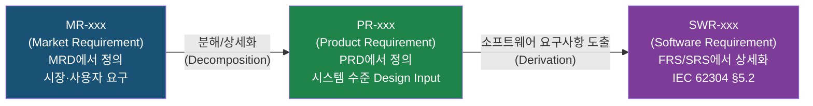

**각 계층의 역할:**

| 계층 | ID 접두사 | 문서 | 역할 | FDA/IEC 참조 |
|------|----------|------|------|-------------|
| 시장 요구사항 | MR-xxx | MRD | 사용자/시장 니즈, 규제 요구 | 21 CFR 820.30(a) User Needs |
| 제품 요구사항 | PR-xxx | PRD (이 문서) | 시스템 수준 Design Input, 수용 기준 포함 | 21 CFR 820.30(c) Design Input |
| 소프트웨어 요구사항 | SWR-xxx | FRS/SRS | SW 구현 수준 상세 요구사항 | IEC 62304 §5.2, 21 CFR 820.30(d) Design Output |

**기능 제품 요구사항 (Functional Product Requirements):**

| 접두사 | 범주 | 영문명 |
|--------|------|--------|
| PR-PM-xxx | 환자 관리 | Patient Management |
| PR-WF-xxx | 촬영 워크플로우 | Acquisition Workflow |
| PR-IP-xxx | 영상 표시/처리 | Image Display & Processing |
| PR-DM-xxx | 선량 관리 | Dose Management |
| PR-DC-xxx | DICOM/통신 | DICOM/Communication |
| PR-SA-xxx | 시스템 관리 | System Administration |
| PR-CS-xxx | 사이버보안 | Cybersecurity |
| PR-AI-xxx | AI 통합 (Phase 2) | AI Integration |

**비기능 제품 요구사항 (Non-Functional Product Requirements):**

| 접두사 | 범주 | 영문명 |
|--------|------|--------|
| PR-NF-PF-xxx | 성능 | Performance |
| PR-NF-RL-xxx | 신뢰성 | Reliability |
| PR-NF-UX-xxx | 사용성 | Usability |
| PR-NF-CP-xxx | 호환성 | Compatibility |
| PR-NF-SC-xxx | 보안 | Security |
| PR-NF-MT-xxx | 유지보수성 | Maintainability |
| PR-NF-RG-xxx | 규제 준수 | Regulatory Compliance |

**요구사항 테이블 컬럼 설명:**

| 컬럼 | 설명 |
|------|------|
| **ID** | PR-xxx (Product Requirement ID) |
| **출처 MR** | MRD의 MR-xxx ID (역추적용, Backward Traceability) |
| **요구사항명** | 기능/요구사항 명칭 |
| **상세 설명** | PR 수준의 기능 설명 (What, 구현 방법 아님) |
| **우선순위** | P0 (필수) / P1 (중요) / P2 (희망) |
| **Phase** | 구현 대상 Phase (1 / 1.5 / 2) |
| **수용 기준** | PR 수준 Acceptance Criteria (시스템 검증 기준) |
| **파생 SWR** | 이 PR에서 파생되는 SWR-xxx ID (FRS/SRS에서 상세 정의 예정) |
| **검증 수준** | T=Test / I=Inspection / A=Analysis / D=Demonstration |
| **위험 참조** | 관련 위험 ID (HAZ-RAD / HAZ-SW / HAZ-SEC / HAZ-DATA) |

**ID 매핑 테이블:**

| ID 범위 |
|--------------|
| PR-PM-001~006 |
| PR-WF-010~018 |
| PR-IP-020~037 |
| PR-DM-040~046 |
| PR-DC-050~056 |
| PR-SA-060~067 |
| PR-CS-070~076 |
| PR-NF-PF-001~008 |
| PR-NF-RL-010~015 |
| PR-NF-UX-020~026 |
| PR-NF-CP-030~035 |
| PR-NF-SC-040~045 |
| PR-NF-MT-050~054 |
| PR-NF-RG-060~065 |

---

## 1. 제품 개요 (Product Overview)

### 1.1 제품 정보

| 항목 | 내용 |
|------|------|
| **제품명** | RadiConsole™ GUI Console SW |
| **버전** | v1.0 (Phase 1) / v2.0 (Phase 2) |
| **대상 플랫폼** | Windows 10 / Windows 11 (64-bit) |
| **하드웨어 대상** | 의료용 진단 고정식·이동식 DR(Digital Radiography) X-Ray 촬영장치 |
| **규제 분류** | 의료기기 소프트웨어 (IEC 62304 Class B) |
| **MRD 참조** | MRD-XRAY-GUI-001 v2.0 |
| **DHF 참조** | DHF-XRAY-GUI-001 |

### 1.2 제품 비전 (Product Vision)

> **"방사선사의 임상 워크플로우를 단순화하고, 진단 품질을 극대화하며, 환자 안전을 최우선으로 하는 직관적 콘솔 소프트웨어"**

의료용 디지털 방사선 촬영(Digital Radiography, DR) 장비의 운영 소프트웨어는 방사선사(Radiologic Technologist, RT)와 하드웨어(Generator, Detector) 사이의 핵심 인터페이스이다. 현재 시장의 주요 경쟁사(Carestream, Siemens Healthineers, Canon Medical, Fujifilm)는 복잡한 워크플로우와 높은 교육 비용을 요구하는 반면, 본 제품은 **최소 클릭 수(표준 검사 ≤5회), 4시간 내 기본 교육 완료, SUS 점수 ≥70**을 달성하는 직관적 UX를 핵심 차별점으로 삼는다.

### 1.3 비즈니스 목표 (Business Goals)

1. **시장 진입**: 출시 후 24개월 내 국내 DR 콘솔 SW 시장 점유율 10% 달성
2. **고객 만족**: SUS(System Usability Scale) 점수 ≥70, 교육 소요 시간 ≤4시간
3. **규제 준수**: FDA 510(k) / CE MDR / KFDA 인허가 획득
4. **플랫폼 확장성**: Multi-vendor Detector/Generator 지원으로 OEM 파트너십 확보
5. **AI 기반 성장**: Phase 2에서 AI 기능 통합을 통한 프리미엄 라이선스 수익 창출

### 1.4 범위 (Scope)

#### In-Scope (포함 범위)

| 범주 | 상세 |
|------|------|
| 환자 관리 | 환자 등록/조회/수정, DICOM Worklist 연동, 응급 등록 |
| 촬영 워크플로우 | APR 관리, 촬영 순서 제어, 기기 통신 |
| 영상 표시·처리 | 실시간 영상 표시, 기본 영상 처리 파이프라인, 뷰어 도구 |
| 선량 관리 | DAP 표시, RDSR 생성, DRL 비교, 거부 영상 분석 |
| DICOM 통신 | Storage SCU, MWL SCU, MPPS SCU, Print SCU 등 |
| 시스템 관리 | 사용자 관리(RBAC), 시스템 설정, 캘리브레이션 UI |
| 사이버보안 | 인증, 세션 관리, TLS 암호화, Audit Trail |
| 규제 준수 문서 | IEC 62304 산출물, IEC 62366 Usability, ISO 14971 연계 |

#### Out-of-Scope (제외 범위)

| 항목 | 제외 이유 |
|------|-----------|
| PACS/RIS 서버 소프트웨어 | 별도 시스템 (연동만 지원) |
| AI 기반 영상 진단 보조 (CAD) | Phase 2에서 별도 PRD로 관리 |
| Fluoroscopy / CT / MRI 제어 | 타 모달리티, 별도 제품 |
| 클라우드 스토리지 직접 전송 | Phase 2 기능 |
| 모바일 앱 (iOS/Android) | Phase 2 기능 |
| 원격 판독 플랫폼 | 외부 서비스 연동에 한정 |
| HIS/EMR 자체 모듈 | HL7/FHIR 인터페이스만 지원 |

### 1.5 Phase 구분

| Phase | 버전 | 목표 기간 | 핵심 내용 |
|-------|------|-----------|-----------|
| **Phase 1** | v1.0 | 출시 후 12개월 | 핵심 촬영 워크플로우, DICOM 필수 서비스, 기본 영상 처리, 선량 관리 |
| **Phase 1.5** | v1.5 | 이후 6개월 | 안정화, Image Stitching, Reject Analysis 강화, 성능 최적화 |
| **Phase 2** | v2.0 | 이후 12개월 | AI Smart Positioning, AI Noise Cancellation, Analytics Dashboard, 클라우드 연동 |

---

## 2. 사용자 요구사항 (User Requirements)

### 2.1 사용자 페르소나 (User Personas)

#### 페르소나 1: 방사선사 (Radiologic Technologist, RT)

| 항목 | 내용 |
|------|------|
| **역할** | 1차 사용자, 촬영 수행 담당 |
| **기술 수준** | 중급 IT 리터러시 (의료기기 전문성 보유) |
| **주요 목표** | 정확하고 신속한 영상 획득, 환자 안전 확보 |
| **Pain Points** | 복잡한 프로토콜 선택, 과도한 클릭 수, 이전 영상 조회 지연 |
| **사용 빈도** | 1일 40~150 검사 (고용량 병원 기준) |
| **환경** | 방사선 방어 구역 (납 유리 너머), 터치스크린 또는 마우스+키보드 |

#### 페르소나 2: 의학물리사 / 방사선사 선임 (Chief RT / Medical Physicist)

| 항목 | 내용 |
|------|------|
| **역할** | 시스템 설정, 프로토콜 관리, QC 담당 |
| **기술 수준** | 고급 IT 리터러시, DICOM/의료기기 지식 보유 |
| **주요 목표** | 선량 최적화, 프로토콜 표준화, QC 수행 |
| **Pain Points** | 캘리브레이션 복잡성, 선량 보고서 수동 작성 |
| **사용 빈도** | 월 1~4회 설정 변경, 일 1~2회 QC |

#### 페르소나 3: IT/바이오메디컬 엔지니어 (BMET)

| 항목 | 내용 |
|------|------|
| **역할** | 시스템 유지보수, 네트워크/DICOM 설정 |
| **기술 수준** | 고급 IT 전문가 |
| **주요 목표** | 시스템 안정성 유지, 업데이트 관리, 문제 진단 |
| **Pain Points** | 원격 진단 부재, 로그 접근 어려움 |
| **사용 빈도** | 주 1회 점검, 필요 시 수시 |

#### 페르소나 4: 영상의학과 의사 (Radiologist)

| 항목 | 내용 |
|------|------|
| **역할** | 촬영 결과 확인, 재촬영 요청 (제한적 접근) |
| **기술 수준** | 기본 GUI 조작 |
| **주요 목표** | 진단 품질 영상 신속 수신 |
| **Pain Points** | 콘솔-PACS 간 영상 전달 지연 |
| **사용 빈도** | 간헐적 (필요 시) |

### 2.2 Use Case 정의

```mermaid
flowchart TD
    RT([방사선사<br/>Radiologic Technologist])
    CRT([선임 방사선사<br/>Chief RT])
    BMET([BMET<br/>엔지니어])
    RAD([영상의학과 의사<br/>Radiologist])

    subgraph UC_PATIENT["환자 관리"]
        UC1[UC-01: 환자 등록]
        UC2[UC-02: Worklist 조회]
        UC3[UC-03: 응급 환자 등록]
        UC4[UC-04: 환자 검색]
    end

    subgraph UC_ACQ["촬영 워크플로우"]
        UC5[UC-05: 프로토콜 선택]
        UC6[UC-06: 촬영 조건 설정]
        UC7[UC-07: 촬영 실행]
        UC8[UC-08: 영상 수신 확인]
        UC9[UC-09: Emergency 촬영]
    end

    subgraph UC_IMAGE["영상 관리"]
        UC10[UC-10: 영상 표시 및 처리]
        UC11[UC-11: 영상 전송(PACS)]
        UC12[UC-12: 이전 영상 조회]
        UC13[UC-13: 영상 인쇄]
    end

    subgraph UC_DOSE["선량 관리"]
        UC14[UC-14: 선량 모니터링]
        UC15[UC-15: RDSR 생성/전송]
        UC16[UC-16: Reject Analysis]
    end

    subgraph UC_ADMIN["시스템 관리"]
        UC17[UC-17: 프로토콜 편집]
        UC18[UC-18: 캘리브레이션]
        UC19[UC-19: 사용자 관리]
        UC20[UC-20: 시스템 설정]
        UC21[UC-21: 감사 로그 조회]
    end

    RT --> UC1 & UC2 & UC3 & UC4
    RT --> UC5 & UC6 & UC7 & UC8 & UC9
    RT --> UC10 & UC11 & UC12 & UC13
    RT --> UC14
    CRT --> UC15 & UC16 & UC17 & UC18 & UC19
    BMET --> UC18 & UC20 & UC21
    RAD --> UC10 & UC12
```

### 2.3 User Journey Diagram

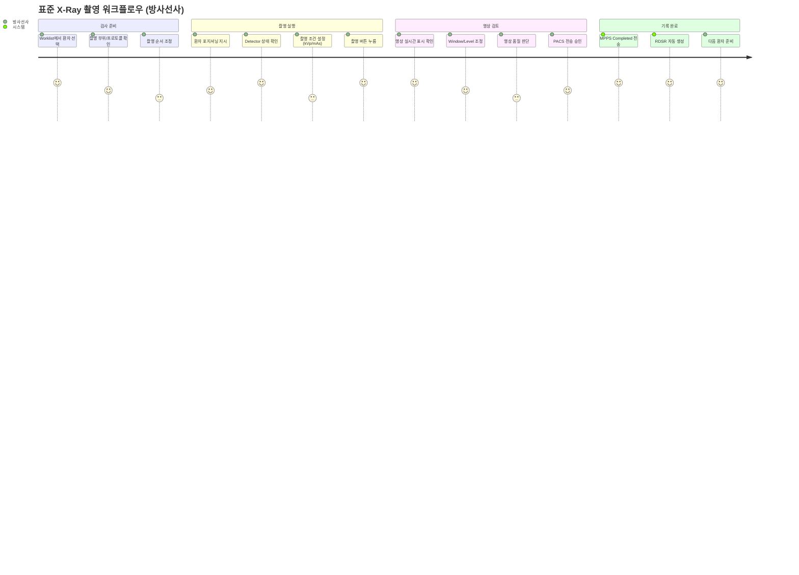

### 2.4 User Stories

#### 방사선사 (Radiologic Technologist)

| ID | User Story | 우선순위 | Phase |
|----|-----------|---------|-------|
| US-001 | As a 방사선사, I want to select a patient from the DICOM Worklist in one tap, so that I can start the exam without manual data entry. | P0 | 1 |
| US-002 | As a 방사선사, I want the system to automatically apply the correct imaging protocol based on the selected body part, so that I minimize protocol selection errors. | P0 | 1 |
| US-003 | As a 방사선사, I want to see the acquired image within 1 second of exposure, so that I can assess image quality and decide on retakes immediately. | P0 | 1 |
| US-004 | As a 방사선사, I want a one-touch emergency registration mode, so that I can quickly start imaging for trauma patients without entering full demographic data. | P0 | 1 |
| US-005 | As a 방사선사, I want the system to display real-time detector status (Ready/Busy/Error), so that I can identify equipment issues before exposure. | P0 | 1 |
| US-006 | As a 방사선사, I want to adjust Window/Level, Zoom, and Pan with touch gestures, so that I can review images naturally and efficiently. | P0 | 1 |
| US-007 | As a 방사선사, I want the system to warn me when the exposure dose exceeds the DRL, so that I can take corrective action to protect the patient. | P0 | 1 |
| US-008 | As a 방사선사, I want to suspend and resume an exam session, so that I can handle interruptions (emergency calls, equipment swaps) without losing data. | P1 | 1 |
| US-009 | As a 방사선사, I want automatic image stitching for full spine/leg-length studies (up to 4 images), so that I can produce panoramic images without manual alignment. | P1 | 1.5 |
| US-010 | As a 방사선사, I want the system to automatically log rejected images with rejection reason, so that dose and quality metrics are maintained accurately. | P1 | 1.5 |

#### 선임 방사선사 / 의학물리사

| ID | User Story | 우선순위 | Phase |
|----|-----------|---------|-------|
| US-011 | As a 선임 방사선사, I want to create and edit organ programs (APR) with custom kVp/mAs defaults, so that imaging protocols are standardized across the department. | P0 | 1 |
| US-012 | As a 의학물리사, I want to view daily dose reports and compare against DRLs, so that I can identify outliers and optimize radiation protection. | P0 | 1 |
| US-013 | As a 의학물리사, I want the system to generate RDSR automatically after each exam, so that dose data is transmitted to the dose registry without manual effort. | P0 | 1 |
| US-014 | As a 선임 방사선사, I want to review rejected image statistics by technologist/body part, so that I can identify training needs and reduce retake rates. | P1 | 1.5 |

#### BMET 엔지니어

| ID | User Story | 우선순위 | Phase |
|----|-----------|---------|-------|
| US-015 | As a BMET, I want to perform Gain/Offset calibration through a guided wizard UI, so that detector calibration is accurate and repeatable. | P0 | 1 |
| US-016 | As a BMET, I want to access system logs filtered by severity level, so that I can quickly diagnose issues without sifting through irrelevant entries. | P0 | 1 |
| US-017 | As a BMET, I want to configure DICOM network settings (AE Title, IP, port) through a GUI, so that PACS/RIS integration is straightforward. | P0 | 1 |
| US-018 | As a BMET, I want the software to support remote diagnostic access, so that issues can be resolved without an on-site visit when possible. | P1 | 2 |

---

## 3. 제품 요구사항 (Product Requirements)

> **계층 구조**: 본 섹션의 모든 요구사항은 **PR-xxx (Product Requirement)** 로 정의되며, FDA 21 CFR 820.30(c) **Design Input** 으로 기능한다. 각 PR은 하위 소프트웨어 요구사항(SWR-xxx)으로 파생되며, SWR의 상세 정의는 별도 FRS(Functional Requirements Specification) / SRS(Software Requirements Specification) 문서에서 수행된다.
>
> **테이블 형식**: ID | 출처 MR | 요구사항명 | 상세 설명 | 우선순위 | Phase | 수용 기준 | 파생 SWR | 검증 수준 | 위험 참조
>
> **검증 수준**: T=Test(테스트), I=Inspection(검사), A=Analysis(분석), D=Demonstration(시연)

### 3.1 환자 관리 (Patient Management) — PR-PM

| ID | 출처 MR | 요구사항명 | 상세 설명 | 우선순위 | Phase | 수용 기준 | 파생 SWR | 검증 수준 | 위험 참조 |
|-------|---------|--------|-----------|---------|-------|-----------|-----------|-----------| -----------|
| PR-PM-001 | MR-001 | 환자 수동 등록 | 성명, 환자 ID, 생년월일, 성별, 검사 의뢰 정보를 수동 입력하여 새 환자 레코드 생성 | P0 | 1 | 필수 필드(환자 ID, 성명, 성별) 미입력 시 저장 불가; 중복 ID 감지 시 경고 표시 | SWR-PM-001~004 | T, I | HAZ-DATA |
| PR-PM-002 | MR-001 | 환자 정보 조회·수정 | 등록된 환자 정보를 조회하고 허가된 사용자가 수정 가능 | P0 | 1 | 수정 완료 후 Audit Trail에 변경자·시각·변경 내용 기록 | SWR-PM-010~013 | T, I | HAZ-DATA, HAZ-SEC |
| PR-PM-003 | MR-001 | DICOM MWL 자동 불러오기 | RIS/HIS에서 DICOM Modality Worklist를 조회하여 검사 목록 자동 표시 | P0 | 1 | MWL C-FIND 성공 시 ≤3초 내 목록 표시; 실패 시 에러 메시지 및 수동 입력 대체 경로 제공 | SWR-PM-020~024 | T, A | HAZ-DATA |
| PR-PM-004 | MR-001 | 응급 환자 빠른 등록 | 최소 정보(임시 ID 자동 생성, 성별, 나이 추정)만으로 즉시 촬영 가능한 응급 등록 모드 | P0 | 1 | 화면 진입부터 촬영 준비 완료까지 ≤30초; 이후 정식 정보로 업데이트 가능 | SWR-PM-030~033 | T, D | HAZ-RAD, HAZ-DATA |
| PR-PM-005 | MR-001 | 환자 검색 | 환자 ID, 성명(부분 일치), 검사 날짜(범위)로 검색 | P0 | 1 | 검색 결과 반환 ≤0.5초; 1,000건 이상 DB에서 정상 동작 | SWR-PM-040~043 | T, A | — |
| PR-PM-006 | MR-001 | 환자 삭제 (GDPR/개인정보) | 허가된 관리자만 환자 레코드 삭제 가능; 삭제 전 확인 대화상자 표시 | P1 | 1 | 삭제 시 연관 DICOM 파일 처리 정책(아카이브/삭제) 선택 가능; Audit Trail에 기록 | SWR-PM-050~053 | T, I | HAZ-DATA, HAZ-SEC |

### 3.2 촬영 워크플로우 (Acquisition Workflow) — PR-WF

| ID | 출처 MR | 요구사항명 | 상세 설명 | 우선순위 | Phase | 수용 기준 | 파생 SWR | 검증 수준 | 위험 참조 |
|-------|---------|--------|-----------|---------|-------|-----------|-----------|-----------| -----------|
| PR-WF-010 | MR-002 | APR 프로토콜 관리 | 신체 부위별 표준 촬영 프로토콜(kVp, mAs, Focus, Grid, AEC chamber) 저장·적용 | P0 | 1 | 프로토콜 선택 후 모든 파라미터가 1초 내 Generator/Detector에 자동 적용 | SWR-WF-010, SWR-WF-011, SWR-WF-012 | T, D | HAZ-RAD |
| PR-WF-011 | MR-002 | 촬영 순서 설정·변경 | 다중 Projection(뷰)의 촬영 순서를 드래그&드롭으로 재정렬 | P0 | 1 | 순서 변경 후 즉시 시각적 반영; DICOM MPPS에 올바른 순서로 기록 | SWR-WF-013, SWR-WF-014 | T, I | HAZ-DATA |
| PR-WF-012 | MR-002 | 촬영 조건 설정 | kVp, mAs(또는 mA + 시간), AEC 모드(chamber 선택), 포커스(large/small), SID 입력 | P0 | 1 | 범위 초과 값 입력 시 즉시 경고; Generator로 설정값 전송 확인 응답 수신 | SWR-WF-015, SWR-WF-016, SWR-WF-017 | T, A | HAZ-RAD |
| PR-WF-013 | MR-002 | Generator 통신 및 제어 | Serial/Ethernet 기반 Generator 프로토콜 구현; 촬영 준비(Ready) 신호 수신, 노출 실행, 노출 완료(Exposure End) 이벤트 처리 | P0 | 1 | 노출 시작 명령 후 ≤200ms 내 Generator 응답 수신; 타임아웃 시 에러 코드 표시 | SWR-WF-018, SWR-WF-019, SWR-WF-020 | T, A | HAZ-RAD, HAZ-SW |
| PR-WF-014 | MR-002 | Detector 상태 모니터링 | Detector 연결 상태(Connected/Disconnected), 준비 상태(Ready/Busy/Error), 배터리(무선), 온도 표시 | P0 | 1 | 상태 변경 시 ≤1초 내 GUI 업데이트; Critical 오류 시 경고음 + 시각적 알림 | SWR-WF-021, SWR-WF-022 | T, D | HAZ-RAD, HAZ-SW |
| PR-WF-015 | MR-002 | 촬영 실행 및 영상 수신 | Exposure 버튼(소프트웨어) 또는 외부 핸드스위치 입력 처리; Detector에서 Raw 영상 수신 | P0 | 1 | 영상 수신 후 처리된 영상 GUI 표시까지 ≤1초; 영상 수신 실패 시 재시도 옵션 제공 | SWR-WF-023, SWR-WF-024, SWR-WF-025 | T, A | HAZ-RAD, HAZ-SW |
| PR-WF-016 | MR-002 | Emergency/Trauma 워크플로우 | 별도 Trauma 템플릿(다중 부위 연속 촬영)을 원탭으로 실행; 촬영 중 부위 추가 가능 | P0 | 1 | Trauma 모드 진입 ≤2 터치; 각 촬영 결과 즉시 표시 후 다음 촬영으로 자동 진행 | SWR-WF-026, SWR-WF-027 | T, D | HAZ-RAD |
| PR-WF-017 | MR-002 | Multi-study 지원 | 동일 환자의 복수 검사(study)를 하나의 세션에서 연속 수행 | P1 | 1 | Study 전환 시 이전 Study 데이터 보존; DICOM Series 분리 정확도 100% | SWR-WF-028, SWR-WF-029 | T, I | HAZ-DATA |
| PR-WF-018 | MR-002 | Suspend/Resume Exam | 진행 중인 검사를 일시 중단하고 나중에 재개; 다른 긴급 환자 처리 후 복귀 | P1 | 1 | Suspend 시 모든 상태(촬영 순서, 획득 영상) 저장; Resume 시 동일 상태로 복귀 | SWR-WF-030, SWR-WF-031 | T, D | HAZ-DATA |

#### 3.2.1 촬영 워크플로우 상태 머신 (State Machine)

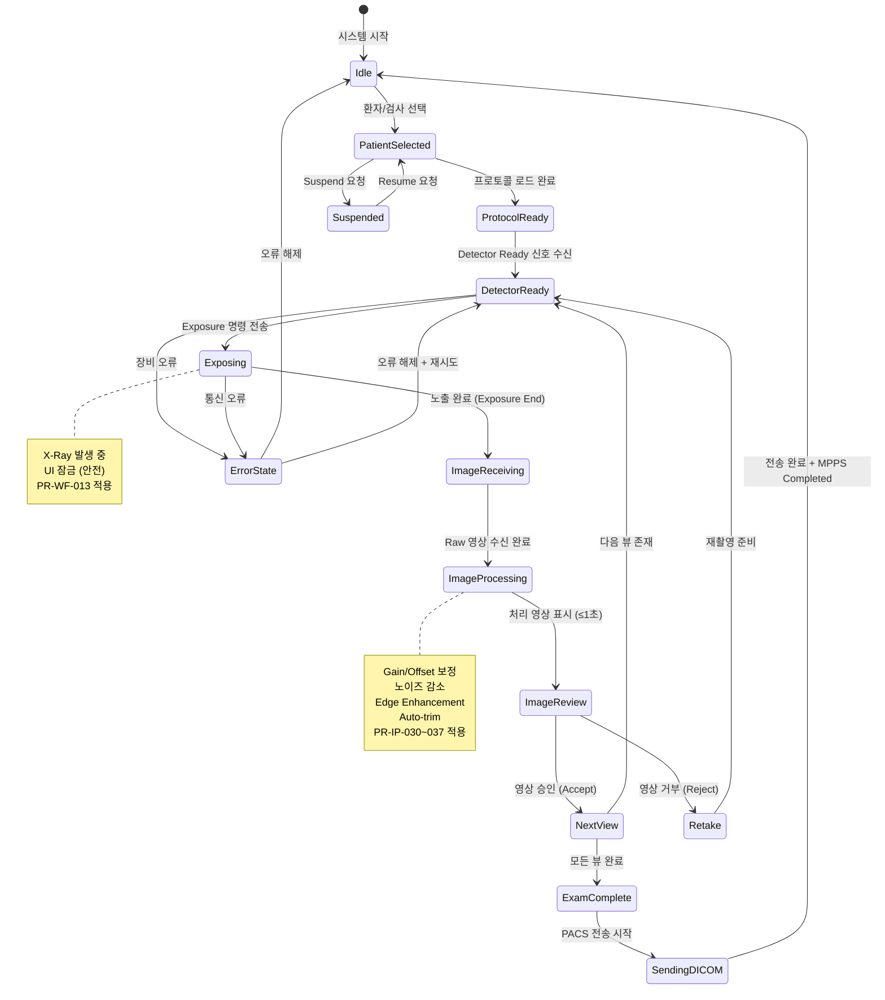

### 3.3 영상 표시 및 처리 (Image Display & Processing) — PR-IP

| ID | 출처 MR | 요구사항명 | 상세 설명 | 우선순위 | Phase | 수용 기준 | 파생 SWR | 검증 수준 | 위험 참조 |
|-------|---------|--------|-----------|---------|-------|-----------|-----------|-----------| -----------|
| PR-IP-020 | MR-003 | 실시간 영상 표시 | 촬영 완료 후 Full Resolution 처리 영상을 ≤1초 내 표시 | P0 | 1 | 5MP 영상 기준 표시 지연 ≤1000ms; Frame drop 없이 렌더링 | SWR-IP-020, SWR-IP-021 | T, A | HAZ-RAD, HAZ-SW |
| PR-IP-021 | MR-003 | Window/Level 조정 | 마우스 드래그, 터치 제스처, 숫자 직접 입력으로 W/L 조정 | P0 | 1 | 조정 시 ≤100ms 내 영상 갱신; 사전 설정 프리셋(Bone, Chest, Soft Tissue) 제공 | SWR-IP-022, SWR-IP-023 | T, D | — |
| PR-IP-022 | MR-003 | Zoom | 마우스 휠, 핀치-투-줌 제스처, 버튼으로 50%~2000% 확대/축소 | P0 | 1 | 확대 시 보간(bicubic) 적용; Fit-to-Screen, 1:1 단축키 제공 | SWR-IP-024, SWR-IP-025 | T, D | — |
| PR-IP-023 | MR-003 | Pan | 마우스 드래그, 터치 슬라이드로 영상 이동 | P0 | 1 | 영상 경계 밖으로 이동 방지 옵션; 부드러운 이동(jitter 없음) | SWR-IP-026 | T, D | — |
| PR-IP-024 | MR-003 | Rotation | 0°/90°/180°/270° 및 자유 회전(free rotation ±360°) | P0 | 1 | 회전 후 영상 품질 유지; Flip(수평/수직) 포함 | SWR-IP-027, SWR-IP-028 | T, D | — |
| PR-IP-025 | MR-003 | Image Stitching | 동일 검사의 최대 4장 영상을 자동으로 이어붙여 파노라마 영상 생성 (전척추, 하지 전장) | P1 | 1.5 | 정합 오차 ≤1mm (기준 팬텀); 스티칭 완료 시간 ≤10초 | SWR-IP-029, SWR-IP-030, SWR-IP-031 | T, A | — |
| PR-IP-026 | MR-003 | 거리 측정 | 두 점 간 거리를 캘리브레이션된 픽셀 크기 기준으로 측정 (mm 단위) | P0 | 1 | 측정 결과 ±1% 이내 정확도 (DICOM Pixel Spacing 기준) | SWR-IP-032, SWR-IP-033 | T, A | HAZ-SW |
| PR-IP-027 | MR-003 | 각도 측정 | 두 선분 사이 각도 측정 | P1 | 1 | 0.1° 단위 표시 | SWR-IP-034 | T, A | — |
| PR-IP-028 | MR-003 | 면적 측정 | ROI(관심 영역) 내 면적 및 평균 픽셀값(Hounsfield 유사값) 측정 | P1 | 1 | 원형/다각형 ROI 지원; 면적 cm² 단위 표시 | SWR-IP-035, SWR-IP-036 | T, A | — |
| PR-IP-029 | MR-003 | Annotation | 텍스트 레이블, 화살표, 원/사각형 도형 오버레이; 영상과 함께 DICOM에 저장 | P1 | 1 | Annotation 포함 DICOM Presentation State(PR) 저장; 편집/삭제 가능 | SWR-IP-037, SWR-IP-038 | T, I | HAZ-DATA |
| PR-IP-030 | MR-003 | Gain/Offset 보정 | Flat Field Correction: 각 픽셀에 획득된 Gain/Offset 맵 적용 | P0 | 1 | 보정 후 VNUE(Variation in Non-Uniformity) ≤1%; 보정 미적용 Raw 영상과 비교 표시 가능 | SWR-IP-039, SWR-IP-040 | T, A | HAZ-RAD, HAZ-SW |
| PR-IP-031 | MR-003 | 노이즈 감소 (Noise Reduction) | 주파수 기반 또는 딥러닝 기반 노이즈 제거 필터 | P0 | 1 | SNR 향상 ≥3dB (vs. 미적용); 처리 시간 ≤500ms | SWR-IP-041, SWR-IP-042 | T, A | HAZ-RAD |
| PR-IP-032 | MR-003 | Edge Enhancement | 소형 구조물(Small Structure), 골 세부(Bone Detail), 카테터(Catheter) 모드별 Edge Enhancement 알고리즘 | P0 | 1 | 각 모드별 강도 5단계 조절; 적용/미적용 토글 가능 | SWR-IP-043, SWR-IP-044 | T, D | — |
| PR-IP-033 | MR-003 | Scatter Correction | 그리드(Grid) 없이 획득한 영상에서 산란선 제거 (SW 기반) | P1 | 1.5 | 산란선 보정 후 Contrast Ratio 향상 ≥10%; 처리 시간 ≤1초 | SWR-IP-045, SWR-IP-046 | T, A | HAZ-RAD |
| PR-IP-034 | MR-003 | Auto-trimming/Cropping | 조사야(照射野) 바깥 영역 자동 인식 및 트리밍 | P0 | 1 | 조사야 경계 인식 정확도 ≥95%; 수동 조정 가능 | SWR-IP-047, SWR-IP-048 | T, A | — |
| PR-IP-035 | MR-003 | Black Mask (Automatic Shutters) | 조사야 외부 영역을 검은색으로 마스킹하여 과도한 밝기 제거 | P0 | 1 | 마스크 적용/해제 토글; 마스크 경계 수동 조정 가능 | SWR-IP-049 | T, D | — |
| PR-IP-036 | MR-003 | Contrast Optimization | 히스토그램 분석 기반 자동 Contrast 최적화 (CLAHE 등) | P0 | 1 | 자동 최적화 후 수동 Fine-tuning 가능; "Original" 복원 버튼 제공 | SWR-IP-050, SWR-IP-051 | T, D | — |
| PR-IP-037 | MR-003 | Brightness Control | 전체 밝기(Offset) 조정 | P0 | 1 | -100%~+100% 범위; 슬라이더 + 숫자 입력 | SWR-IP-052 | T, D | — |

#### 3.3.1 영상 처리 파이프라인 (Image Processing Pipeline)

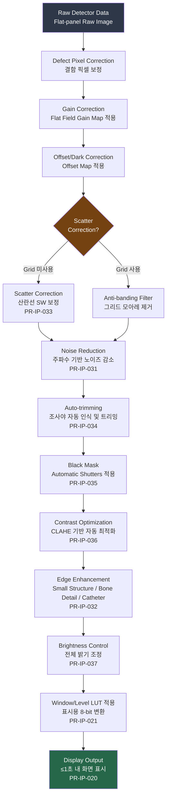

### 3.4 선량 관리 (Dose Management) — PR-DM

| ID | 출처 MR | 요구사항명 | 상세 설명 | 우선순위 | Phase | 수용 기준 | 파생 SWR | 검증 수준 | 위험 참조 |
|-------|---------|--------|-----------|---------|-------|-----------|-----------|-----------| -----------|
| PR-DM-040 | MR-004 | DAP 표시·기록 | DAP 미터에서 수신한 DAP(Dose Area Product) 값을 매 노출마다 화면 표시 및 DB 기록 | P0 | 1 | 노출 후 ≤2초 내 DAP 값 표시; μGy·cm² 단위 | SWR-DM-040, SWR-DM-041 | T, A | HAZ-RAD |
| PR-DM-041 | MR-004 | ESD 계산 | kVp, mAs, Focus-Skin Distance(FSD), 부위 두께 기반 ESD(Entrance Surface Dose) 추정 계산 | P0 | 1 | 계산 방법 및 불확도(±20%) 사용자에게 고지 | SWR-DM-042, SWR-DM-043 | T, A | HAZ-RAD |
| PR-DM-042 | MR-004 | RDSR 생성 | 검사 완료 후 IEC 60601-2-54 및 DICOM TID-10011 기반 RDSR(Radiation Dose Structured Report) 자동 생성 | P0 | 1 | DICOM Conformance에 정의된 IOD 완전성 100%; Dose Registry(PACS/RIS)로 자동 전송 | SWR-DM-044, SWR-DM-045, SWR-DM-046 | T, I | HAZ-RAD, HAZ-DATA |
| PR-DM-043 | MR-004 | Exposure Index 모니터링 | IEC 62494-1 기반 EI(Exposure Index) 및 DI(Deviation Index) 계산 및 표시 | P0 | 1 | DI ±2 이상 시 색상 경고(황색/적색); 각 뷰별 EI 값 저장 | SWR-DM-047, SWR-DM-048 | T, A | HAZ-RAD |
| PR-DM-044 | MR-004 | DRL 비교 | 국가별 진단참고준위(DRL) 데이터베이스 내장; 검사별 선량과 비교하여 초과 시 경고 | P0 | 1 | 한국 NCRP DRL 기준 내장; 병원 자체 DRL 설정 가능 | SWR-DM-049, SWR-DM-050 | T, A | HAZ-RAD |
| PR-DM-045 | MR-004 | 전자 X-ray 로그북 | 모든 노출 데이터(환자 ID, 날짜, 부위, kVp, mAs, DAP, EI)를 자동 기록하는 전자 선량 일지 | P0 | 1 | CSV/PDF 형식 내보내기 지원; 날짜 범위·기술자별 필터링 | SWR-DM-051, SWR-DM-052 | T, I | HAZ-RAD, HAZ-DATA |
| PR-DM-046 | MR-004 | Reject Analysis | 거부된 영상의 원인(Positioning Error, Motion, Over/Under-exposure 등)을 기록하고 통계 리포트 생성 | P1 | 1.5 | 거부 원인 카테고리 ≥10종; 주간/월간 리포트 자동 생성; 기술자별 거부율 비교 | SWR-DM-053, SWR-DM-054, SWR-DM-055 | T, A | HAZ-RAD |

### 3.5 DICOM 통신 (DICOM Services) — PR-DC

| ID | 출처 MR | 요구사항명 | 상세 설명 | 우선순위 | Phase | 수용 기준 | 파생 SWR | 검증 수준 | 위험 참조 |
|-------|---------|--------|-----------|---------|-------|-----------|-----------|-----------| -----------|
| PR-DC-050 | MR-005 | Storage SCU (C-STORE) | 획득 영상을 PACS/Storage Server로 C-STORE 전송 | P0 | 1 | 전송 성공률 ≥99.9%; 전송 실패 시 자동 재시도(최대 3회) + 로컬 임시 저장 | SWR-DC-050, SWR-DC-051, SWR-DC-052 | T, A | HAZ-DATA |
| PR-DC-051 | MR-005 | MWL SCU | RIS에서 C-FIND로 오늘의 검사 목록 조회; 자동 새로 고침(설정 가능 주기) | P0 | 1 | C-FIND 응답 ≤3초; 필터(날짜, AE Title, Modality) 지원 | SWR-DC-053, SWR-DC-054 | T, A | HAZ-DATA |
| PR-DC-052 | MR-005 | MPPS SCU | 검사 시작(In-Progress) 및 완료(Completed)/취소(Discontinued) 상태를 RIS로 전송 | P0 | 1 | 상태 변경 후 ≤5초 내 MPPS N-CREATE/N-SET 전송 | SWR-DC-055, SWR-DC-056 | T, A | HAZ-DATA |
| PR-DC-053 | MR-005 | Storage Commitment SCU | PACS가 영상을 안전하게 저장했음을 확인받는 N-ACTION/N-EVENT-REPORT 구현 | P0 | 1 | Commitment 확인 후 로컬 임시 파일 삭제 옵션 활성화 | SWR-DC-057, SWR-DC-058 | T, I | HAZ-DATA |
| PR-DC-054 | MR-005 | Print SCU | DICOM Basic Grayscale Print 서비스를 통한 필름 인쇄 | P1 | 1 | 인쇄 큐 관리; 1~N Up 레이아웃 지원 | SWR-DC-059, SWR-DC-060 | T, D | — |
| PR-DC-055 | MR-005 | Query/Retrieve SCU | PACS에서 이전 영상 조회(C-FIND) 및 가져오기(C-MOVE/C-GET) | P1 | 1 | 조회 결과 썸네일 표시; 비교 뷰어에서 표시 | SWR-DC-061, SWR-DC-062 | T, D | — |
| PR-DC-056 | MR-005 | DICOM TLS | DICOM 통신 채널에 TLS 1.2 이상 암호화 적용 | P0 | 1 | TLS 핸드셰이크 성공 확인; 인증서 만료 30일 전 관리자 경고 | SWR-DC-063, SWR-DC-064 | T, I | HAZ-SEC |

#### 3.5.1 DICOM 통신 흐름 (Sequence Diagram)

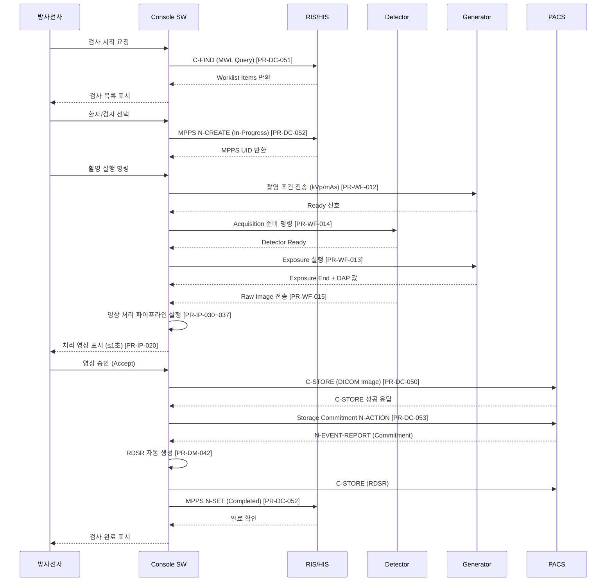

### 3.6 시스템 관리 (System Administration) — PR-SA

| ID | 출처 MR | 요구사항명 | 상세 설명 | 우선순위 | Phase | 수용 기준 | 파생 SWR | 검증 수준 | 위험 참조 |
|-------|---------|--------|-----------|---------|-------|-----------|-----------|-----------| -----------|
| PR-SA-060 | MR-006 | 사용자 관리 (RBAC) | 역할별 접근 제어: Administrator, Technologist, Physician, Service 역할 정의; 역할별 기능 접근 권한 설정 | P0 | 1 | Administrator만 사용자 추가/삭제 가능; 권한 없는 메뉴 비활성화 또는 숨김 | SWR-SA-060, SWR-SA-061, SWR-SA-062 | T, I | HAZ-SEC |
| PR-SA-061 | MR-006 | Organ Program/Exam Set 편집기 | 신체 부위별 촬영 프로토콜(kVp, mAs, Focus, AEC, 영상 처리 설정) 편집 GUI 제공 | P0 | 1 | 변경 사항 저장 즉시 적용; 이전 버전으로 롤백 가능; Import/Export(XML) 지원 | SWR-SA-063, SWR-SA-064 | T, D | HAZ-RAD |
| PR-SA-062 | MR-006 | 시스템 설정 | 네트워크 설정(IP, Gateway, DNS), DICOM AE 설정, 날짜/시간, 언어, 화면 표시 설정 GUI | P0 | 1 | 설정 변경 후 재시작 필요 항목 명시; 설정 파일 백업/복원 기능 | SWR-SA-065, SWR-SA-066 | T, D | HAZ-DATA |
| PR-SA-063 | MR-006 | 캘리브레이션 UI | Gain/Offset 캘리브레이션 위자드: 다크 영상 획득 → 플랫 영상 획득 → 보정 맵 계산 → 저장 | P0 | 1 | 위자드 완료 후 보정 품질 지표(VNUE) 자동 계산 및 Pass/Fail 판정 | SWR-SA-067, SWR-SA-068, SWR-SA-069 | T, A | HAZ-RAD, HAZ-SW |
| PR-SA-064 | MR-006 | Defect Pixel Map 관리 | 결함 픽셀 자동 감지 및 수동 추가/제거; 결함 픽셀 맵 시각화 | P1 | 1 | 결함 픽셀 수 및 분포 통계 표시 | SWR-SA-070, SWR-SA-071 | T, A | HAZ-RAD |
| PR-SA-065 | MR-006 | Audit Trail | 모든 임상·설정·보안 관련 이벤트(로그인/로그아웃, 설정 변경, 영상 승인/거부, 데이터 전송)를 타임스탬프와 함께 기록 | P0 | 1 | IHE ATNA 프로파일 준수; 감사 로그 변조 방지(append-only 저장); 90일 이상 보관 | SWR-SA-072, SWR-SA-073 | T, I | HAZ-SEC, HAZ-DATA |
| PR-SA-066 | MR-006 | 로깅 시스템 | Error, Warning, Info, Debug 4단계 로그 수준; 구조화된 로그 파일 출력 | P0 | 1 | 로그 파일 자동 순환(최대 500MB, 30일); Log Level 런타임 변경 가능 | SWR-SA-074, SWR-SA-075 | T, I | HAZ-SW |
| PR-SA-067 | MR-006 | SW 업데이트 관리 | 서명된 업데이트 패키지 검증 후 설치; 롤백 지원 | P1 | 1 | 업데이트 전 DB/설정 자동 백업; 서명 검증 실패 시 설치 차단 | SWR-SA-076, SWR-SA-077 | T, I | HAZ-SEC, HAZ-SW |

### 3.7 사이버보안 (Cybersecurity) — PR-CS

| ID | 출처 MR | 요구사항명 | 상세 설명 | 우선순위 | Phase | 수용 기준 | 파생 SWR | 검증 수준 | 위험 참조 |
|-------|---------|--------|-----------|---------|-------|-----------|-----------|-----------| -----------|
| PR-CS-070 | MR-007 | 로컬 사용자 인증 | 사용자명/비밀번호 기반 로컬 인증; 비밀번호 해시(bcrypt/Argon2) 저장 | P0 | 1 | 로그인 실패 5회 시 계정 잠금(30분 또는 관리자 해제); 마지막 로그인 정보 표시 | SWR-CS-070, SWR-CS-071, SWR-CS-072 | T, I | HAZ-SEC |
| PR-CS-071 | MR-007 | Domain 인증 (SSO) | Active Directory / LDAP 기반 도메인 인증 지원 | P1 | 1.5 | Kerberos/NTLM 지원; SSO 실패 시 로컬 계정으로 폴백 옵션 | SWR-CS-073, SWR-CS-074 | T, D | HAZ-SEC |
| PR-CS-072 | MR-007 | 세션 관리 | 비활성 시간(설정 가능, 기본 15분) 경과 후 자동 로그아웃; 촬영 중 세션 만료 방지 | P0 | 1 | 세션 만료 3분 전 경고; 촬영 진행 중 화면 잠금 모드(Quick PIN)로 전환 | SWR-CS-075, SWR-CS-076, SWR-CS-077 | T, D | HAZ-SEC, HAZ-RAD |
| PR-CS-073 | MR-007 | DICOM TLS 암호화 | 모든 DICOM 네트워크 통신에 TLS 1.2 이상 적용 | P0 | 1 | 인증서 기반 상호 인증(mTLS) 옵션; 암호화 비활성화 시 관리자 확인 필요 | SWR-CS-078, SWR-CS-079 | T, I | HAZ-SEC |
| PR-CS-074 | MR-007 | PHI 보호 | 로컬 DB의 PHI 필드 암호화(AES-256); 스크린샷/화면 녹화 방지 | P0 | 1 | DB 암호화 키 분리 저장; 복호화는 애플리케이션 내부에서만 수행 | SWR-CS-080, SWR-CS-081 | T, I | HAZ-SEC |
| PR-CS-075 | MR-007 | SBOM 관리 | 모든 Third-party 소프트웨어 컴포넌트 목록(SBOM) 생성 및 취약점 모니터링 | P0 | 1 | SPDX 또는 CycloneDX 형식 SBOM 생성; CVE 발견 시 30일 내 패치 계획 수립 | SWR-CS-082, SWR-CS-083 | T, I | HAZ-SEC |
| PR-CS-076 | MR-007 | Secure Boot / SW 무결성 | 애플리케이션 실행 전 코드 서명 검증; 변조 감지 시 실행 차단 | P0 | 1 | 코드 서명 인증서 EV(Extended Validation) 등급 사용; 검증 실패 로그 기록 | SWR-CS-084, SWR-CS-085 | T, I | HAZ-SEC, HAZ-SW |

---

## 4. 비기능 제품 요구사항 (Non-Functional Product Requirements)

> **계층 구조**: 본 섹션의 모든 요구사항은 **PR-NF-xxx (Non-Functional Product Requirement)** 로 정의되며, §3의 기능 제품 요구사항(PR-xxx)과 동일하게 FDA 21 CFR 820.30(c) **Design Input** 으로 기능한다.
>
> **테이블 형식**: ID | 출처 MR | 카테고리 | 요구사항 | 기준치 | 우선순위 | Phase | 파생 SWR | 검증 수준 | 위험 참조

### 4.1 성능 (Performance) — PR-NF-PF

| ID | 출처 MR | 카테고리 | 요구사항 | 기준치 | 우선순위 | Phase | 파생 SWR | 검증 수준 | 위험 참조 |
|--------|---------|---------|---------|--------|---------|-------|----------|-----------|-----------|
| PR-NF-PF-001 | MR-002, MR-003 | 성능 | 영상 표시 지연 | ≤1,000ms (Full Resolution, 5MP) | P0 | 1 | SWR-NF-PF-001 | T, A | HAZ-RAD |
| PR-NF-PF-002 | MR-001 | 성능 | 환자 검색 응답 | ≤500ms (10,000건 DB 기준) | P0 | 1 | SWR-NF-PF-002 | T, A | — |
| PR-NF-PF-003 | MR-005 | 성능 | DICOM 전송 속도 | ≥100 Mbps (Gigabit 환경) | P0 | 1 | SWR-NF-PF-003 | T, A | HAZ-DATA |
| PR-NF-PF-004 | MR-002, MR-003 | 성능 | GUI 응답 시간 | ≤200ms (버튼/터치 입력 → 피드백) | P0 | 1 | SWR-NF-PF-004 | T, A | — |
| PR-NF-PF-005 | MR-006 | 성능 | 시스템 부팅 시간 | ≤60초 (BIOS POST 이후 → 로그인 화면) | P0 | 1 | SWR-NF-PF-005 | T | — |
| PR-NF-PF-006 | MR-002 | 성능 | 동시 처리 | 최소 3개 Study 병렬 관리 | P1 | 1 | SWR-NF-PF-006 | T, A | HAZ-SW |
| PR-NF-PF-007 | MR-005 | 성능 | MWL 새로 고침 | ≤3초 내 Worklist 업데이트 | P0 | 1 | SWR-NF-PF-007 | T, A | — |
| PR-NF-PF-008 | MR-003 | 성능 | Image Stitching | ≤10초 (4장 5MP 기준) | P1 | 1.5 | SWR-NF-PF-008 | T, A | — |

> **벤치마크 참조**: Siemens YSIO X.pree (syngo FLC) 영상 표시 ≤800ms, Canon CXDI NE 터치 응답 ≤150ms 대비 동등 이상 성능 목표

### 4.2 신뢰성 (Reliability) — PR-NF-RL

| ID | 출처 MR | 카테고리 | 요구사항 | 기준치 | 우선순위 | Phase | 파생 SWR | 검증 수준 | 위험 참조 |
|--------|---------|---------|---------|--------|---------|-------|----------|-----------|-----------|
| PR-NF-RL-010 | MR-002 | 신뢰성 | 시스템 가용성 | ≥99.9% (운영 시간 기준, 계획된 유지보수 제외) | P0 | 1 | SWR-NF-RL-010 | T, A | HAZ-SW |
| PR-NF-RL-011 | MR-002 | 신뢰성 | MTBF | ≥10,000시간 (SW 장애 기준) | P0 | 1 | SWR-NF-RL-011 | A | HAZ-SW |
| PR-NF-RL-012 | MR-002, MR-005 | 신뢰성 | 데이터 무결성 | 촬영 데이터 손실 허용 0건 (전원 차단 시 Write-ahead logging 적용) | P0 | 1 | SWR-NF-RL-012 | T, A | HAZ-DATA |
| PR-NF-RL-013 | MR-002 | 신뢰성 | 자동 복구 | SW 크래시 시 ≤30초 내 자동 재시작; 마지막 안정 상태로 복귀 | P0 | 1 | SWR-NF-RL-013 | T, D | HAZ-SW |
| PR-NF-RL-014 | MR-005 | 신뢰성 | Graceful Degradation | 네트워크 연결 실패 시 로컬 저장 후 재연결 시 자동 전송 | P0 | 1 | SWR-NF-RL-014 | T, D | HAZ-DATA |
| PR-NF-RL-015 | MR-002 | 신뢰성 | 장기 운영 안정성 | 72시간 연속 운영 후 메모리 누수 없음 (Heap 증가 ≤10MB/24h) | P1 | 1 | SWR-NF-RL-015 | T, A | HAZ-SW |

### 4.3 사용성 (Usability) — PR-NF-UX

| ID | 출처 MR | 카테고리 | 요구사항 | 기준치 | 우선순위 | Phase | 파생 SWR | 검증 수준 | 위험 참조 |
|--------|---------|---------|---------|--------|---------|-------|----------|-----------|-----------|
| PR-NF-UX-020 | MR-001, MR-002 | 사용성 | 교육 시간 | 기본 운영 ≤4시간 (Philips 교육 시간 33% 절감 벤치마크 기준) | P0 | 1 | SWR-NF-UX-020 | D, A | — |
| PR-NF-UX-021 | MR-002 | 사용성 | 표준 검사 클릭 수 | Worklist 선택 → 촬영 완료 ≤5회 터치/클릭 | P0 | 1 | SWR-NF-UX-021 | T, D | HAZ-RAD |
| PR-NF-UX-022 | MR-002 | 사용성 | 터치스크린 최적화 | 최소 터치 타겟 크기 44×44px (Apple HIG / WCAG 2.1 기준) | P0 | 1 | SWR-NF-UX-022 | I | — |
| PR-NF-UX-023 | MR-001 | 사용성 | 다국어 지원 | 한국어, 영어 (Phase 1); 중국어, 일본어 추가 (Phase 2) | P0 | 1 | SWR-NF-UX-023 | T, I | — |
| PR-NF-UX-024 | MR-001 | 사용성 | SUS 점수 | ≥70점 (Summative Usability Test, 방사선사 10명 이상 참여) | P0 | 1 | SWR-NF-UX-024 | D, A | — |
| PR-NF-UX-025 | MR-002 | 사용성 | 오류 복구 | 사용자 오류 후 ≤3단계 내 정상 상태 복귀 가능 | P0 | 1 | SWR-NF-UX-025 | T, D | HAZ-RAD |
| PR-NF-UX-026 | MR-002 | 사용성 | 응급 접근성 | Emergency 모드 진입 ≤2회 터치 (최상위 화면 어디서나) | P0 | 1 | SWR-NF-UX-026 | T, D | HAZ-RAD |

### 4.4 호환성 (Compatibility) — PR-NF-CP

| ID | 출처 MR | 카테고리 | 요구사항 | 기준치 | 우선순위 | Phase | 파생 SWR | 검증 수준 | 위험 참조 |
|--------|---------|---------|---------|--------|---------|-------|----------|-----------|-----------|
| PR-NF-CP-030 | MR-006 | 호환성 | 운영체제 | Windows 10 LTSC 2021 / Windows 11 (64-bit) | P0 | 1 | SWR-NF-CP-030 | T, I | HAZ-SW |
| PR-NF-CP-031 | MR-002 | 호환성 | Multi-vendor Detector | FPD 제조사 ≥3개 벤더 지원 (Canon, Fujifilm, Vieworks 등) via 표준 API | P0 | 1 | SWR-NF-CP-031 | T, D | HAZ-RAD |
| PR-NF-CP-032 | MR-002 | 호환성 | Multi-vendor Generator | Generator 제조사 ≥3개 벤더 지원 via Serial/Ethernet 프로토콜 | P0 | 1 | SWR-NF-CP-032 | T, D | HAZ-RAD |
| PR-NF-CP-033 | MR-005 | 호환성 | PACS 호환성 | 주요 5개 벤더 PACS와 호환 검증 (Sectra, Fujifilm Synapse, Infinitt, Maroview, Impax) | P0 | 1 | SWR-NF-CP-033 | T, D | HAZ-DATA |
| PR-NF-CP-034 | MR-003 | 호환성 | 모니터 해상도 | 3MP(2048×1536) 이상 의료용 모니터 지원; 4K(3840×2160) 지원 | P0 | 1 | SWR-NF-CP-034 | T, I | — |
| PR-NF-CP-035 | MR-005 | 호환성 | DICOM 표준 | DICOM 2023a 이상 준수; IHE Scheduled Workflow Profile 지원 | P0 | 1 | SWR-NF-CP-035 | T, I | HAZ-DATA |

### 4.5 보안 (Security) — PR-NF-SC

| ID | 출처 MR | 카테고리 | 요구사항 | 기준치 | 우선순위 | Phase | 파생 SWR | 검증 수준 | 위험 참조 |
|--------|---------|---------|---------|--------|---------|-------|----------|-----------|-----------|
| PR-NF-SC-040 | MR-007 | 보안 | 규제 준수 | FDA Section 524B FD&C Act, HIPAA Security Rule | P0 | 1 | SWR-NF-SC-040 | I, A | HAZ-SEC |
| PR-NF-SC-041 | MR-007 | 보안 | 암호화 전송 | TLS 1.2 이상 (TLS 1.0/1.1 비활성화) | P0 | 1 | SWR-NF-SC-041 | T, I | HAZ-SEC |
| PR-NF-SC-042 | MR-007 | 보안 | 비밀번호 정책 | 최소 8자, 대소문자+숫자+특수문자 조합; 90일 만료; 이전 5개 비밀번호 재사용 금지 | P0 | 1 | SWR-NF-SC-042 | T, I | HAZ-SEC |
| PR-NF-SC-043 | MR-007 | 보안 | 접근 제어 | RBAC; 최소 권한 원칙(Principle of Least Privilege) | P0 | 1 | SWR-NF-SC-043 | T, I | HAZ-SEC |
| PR-NF-SC-044 | MR-007 | 보안 | 취약점 관리 | 배포 전 SAST/DAST 도구 통과; Critical/High CVE 0건 | P0 | 1 | SWR-NF-SC-044 | T, A | HAZ-SEC |
| PR-NF-SC-045 | MR-007 | 보안 | Audit Log 보관 | ≥90일 보관; IHE ATNA 프로파일 준수 | P0 | 1 | SWR-NF-SC-045 | T, I | HAZ-SEC |

### 4.6 유지보수성 (Maintainability) — PR-NF-MT

| ID | 출처 MR | 카테고리 | 요구사항 | 기준치 | 우선순위 | Phase | 파생 SWR | 검증 수준 | 위험 참조 |
|--------|---------|---------|---------|--------|---------|-------|----------|-----------|-----------|
| PR-NF-MT-050 | MR-006 | 유지보수성 | 모듈식 아키텍처 | 각 서브시스템(환자관리, 촬영, 영상처리, DICOM)이 독립 모듈로 분리 | P0 | 1 | SWR-NF-MT-050 | I, A | HAZ-SW |
| PR-NF-MT-051 | MR-006 | 유지보수성 | 코드 커버리지 | ≥80% 라인 커버리지 (IEC 62304 Class B) | P0 | 1 | SWR-NF-MT-051 | T, A | HAZ-SW |
| PR-NF-MT-052 | MR-006 | 유지보수성 | API 문서화 | 내부 API 100% 문서화 (XML Doc Comments + Swagger/OpenAPI) | P1 | 1 | SWR-NF-MT-052 | I | — |
| PR-NF-MT-053 | MR-006 | 유지보수성 | 원격 진단 | VPN 기반 원격 접속을 통한 로그 수집, 설정 변경 지원 (Phase 1.5) | P1 | 1.5 | SWR-NF-MT-053 | T, D | HAZ-SEC |
| PR-NF-MT-054 | MR-006 | 유지보수성 | 빌드 자동화 | CI/CD 파이프라인 (GitHub Actions + NUnit/Google Test) | P0 | 1 | SWR-NF-MT-054 | I, D | — |

### 4.7 규제 준수 (Regulatory Compliance) — PR-NF-RG

| ID | 출처 MR | 카테고리 | 요구사항 | 기준치 | 우선순위 | Phase | 파생 SWR | 검증 수준 | 위험 참조 |
|--------|---------|---------|---------|--------|---------|-------|----------|-----------|-----------|
| PR-NF-RG-060 | MR-002 | 규제 준수 | IEC 62304 적합성 | Class B 전 단계 산출물 완비 (SDP, SRS, SAD, SDS, UT, IT, ST, V&V Reports) | P0 | 1 | SWR-NF-RG-060 | I, A | HAZ-SW |
| PR-NF-RG-061 | MR-001, MR-002 | 규제 준수 | ISO 14971 연계 | 전체 PR/PR-NF에 위험 참조(HAZ-xxx) 매핑; Risk Control Measure 역추적 가능 | P0 | 1 | SWR-NF-RG-061 | I, A | HAZ-RAD, HAZ-SW |
| PR-NF-RG-062 | MR-001 | 규제 준수 | IEC 62366 Usability | Summative Usability Test 완료 및 보고서 제출; 안전 관련 Task 완료율 ≥95% | P0 | 1 | SWR-NF-RG-062 | D, A | HAZ-RAD |
| PR-NF-RG-063 | MR-007 | 규제 준수 | FDA 21 CFR 820.30 | Design Controls 전 단계 완비 (Design Input → Output → Verification → Validation → Transfer) | P0 | 1 | SWR-NF-RG-063 | I, A | HAZ-SW |
| PR-NF-RG-064 | MR-004 | 규제 준수 | DICOM Conformance | DICOM Conformance Statement 문서 작성 및 유지; PS 3.2 준수 | P0 | 1 | SWR-NF-RG-064 | I | HAZ-DATA |
| PR-NF-RG-065 | MR-007 | 규제 준수 | FDA 510(k) 추적성 | SRS의 모든 요구사항이 System Test 결과로 역추적 가능; RTM 완전성 100% | P0 | 1 | SWR-NF-RG-065 | I, A | — |

---

## 5. 인터페이스 요구사항 (Interface Requirements)

### 5.1 하드웨어 인터페이스 (Hardware Interfaces)

| 인터페이스 | 통신 방식 | 프로토콜/표준 | 설명 |
|-----------|-----------|--------------|------|
| X-Ray Generator | Ethernet / RS-232 / RS-485 | 벤더별 독점 프로토콜 (HAL 추상화 레이어) | 촬영 조건 설정, 노출 명령, 노출 완료 이벤트, 에러 상태 수신 |
| Flat Panel Detector (FPD) | GigE Vision / 독점 SDK | GEVL / 벤더 SDK | 트리거 신호, Raw 영상 데이터 수신, 배터리/온도 상태 |
| AEC (Auto Exposure Control) | Generator 내장 또는 별도 | 아날로그/디지털 인터페이스 | AEC 챔버 선택, 감도 설정 |
| DAP Meter | RS-232 / USB | DICOM TID 10011 호환 | 선량 데이터(μGy·cm²) 수신 |
| Hand Switch | GPIO / USB HID | HID 표준 | 외부 촬영 버튼 이벤트 |
| Barcode Scanner | USB HID | HID 표준 | 환자 ID 바코드/QR 스캔 |

### 5.2 소프트웨어 인터페이스 (Software Interfaces)

| 시스템 | 프로토콜 | 표준 | 데이터 방향 |
|--------|---------|------|------------|
| PACS | DICOM 3.0 | Storage SCU, Q/R SCU, Commitment SCU | 영상 전송, 이전 영상 조회 |
| RIS | DICOM 3.0 / HL7 v2.x / FHIR R4 | MWL SCU, MPPS SCU | 검사 목록 수신, 상태 보고 |
| HIS | HL7 v2.x / FHIR R4 | ADT 메시지 | 환자 인구통계 수신 |
| Dose Registry | DICOM 3.0 | C-STORE (RDSR) | 선량 보고서 전송 |
| Print Server | DICOM 3.0 | Basic Grayscale Print SCU | 필름 인쇄 |
| AD/LDAP | Kerberos / LDAP v3 | RFC 4511 | 사용자 인증 |
| OS 방화벽/백신 | Windows API | Windows Security Center API | 보안 상태 모니터링 |

### 5.3 사용자 인터페이스 개념 (GUI Layout Concept)

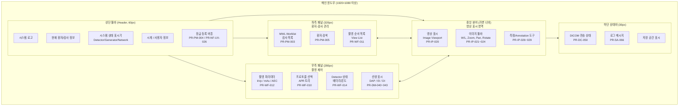

### 5.4 시스템 컨텍스트 다이어그램 (C4 Context Diagram)

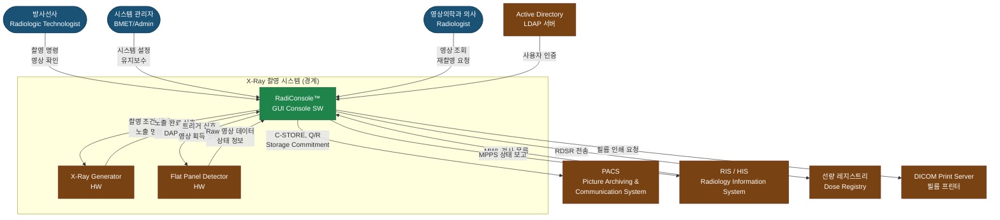

---

## 6. 설계 제약사항 (Design Constraints)

### 6.1 기술 스택

| 영역 | 선택 기술 | 선택 이유 |
|------|-----------|-----------|
| GUI 개발 언어 | **C# (.NET 8.0)** | WPF 생태계, 의료 SW 업계 표준, MVVM 패턴 지원 |
| GUI 프레임워크 | **WPF (Windows Presentation Foundation)** | DirectX 기반 고성능 렌더링, DICOM 뷰어 라이브러리 풍부 |
| 영상 처리 엔진 | **C++ (C++17)** | 고성능 픽셀 처리, SIMD 최적화, IPP/OpenCV 활용 |
| GUI-영상처리 브릿지 | **C++/CLI 또는 P/Invoke** | C# WPF ↔ C++ 처리 엔진 연동 |
| 로컬 데이터베이스 | **SQLite 3.x** | 경량, 임베디드, ACID 준수, 의료기기 적용 다수 |
| DICOM 영상 저장 | **DICOM 파일 시스템** (.dcm) + SQLite 메타데이터 | 표준 준수, PACS 호환 |
| DICOM 라이브러리 | **fo-dicom (C#)** + **DCMTK (C++)** | fo-dicom: GUI/통신 레이어; DCMTK: 저수준 DICOM 처리 |
| 영상 처리 라이브러리 | **OpenCV 4.x** + **Intel IPP** | 성능 최적화된 영상 처리 |
| 아키텍처 패턴 | **MVVM (Model-View-ViewModel)** | 테스트 용이성, UI 로직 분리, 바인딩 기반 업데이트 |
| 의존성 주입 | **Microsoft.Extensions.DependencyInjection** | 모듈 교체 용이, 단위 테스트 지원 |
| 이벤트 버스 | **MediatR 또는 Prism EventAggregator** | 느슨한 결합(Loose Coupling) |
| 단위 테스트 | **xUnit + NUnit (C#)** + **Google Test (C++)** | IEC 62304 요구사항 |
| CI/CD | **GitHub Actions + SonarQube** | 자동화 빌드, 정적 분석 |

### 6.2 SW 아키텍처 개요 (Class Diagram)

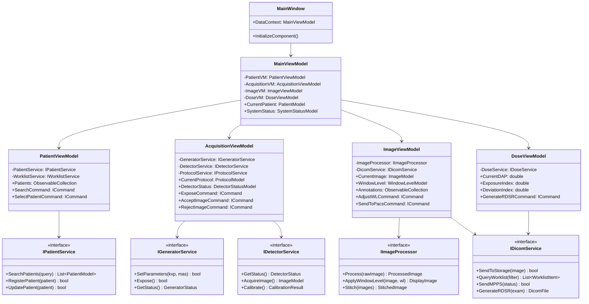

### 6.3 추가 설계 원칙

- **HAL (Hardware Abstraction Layer)**: Generator/Detector 벤더별 드라이버를 인터페이스 뒤에 캡슐화하여 멀티벤더 지원
- **Plugin Architecture**: Detector SDK 플러그인으로 새 벤더 추가 시 재컴파일 불필요
- **설정 외재화**: 모든 하드웨어 파라미터를 XML 설정 파일로 관리 (코드 변경 없이 기기 적응)
- **로컬 우선 (Offline First)**: 네트워크 단절 시 로컬 DB에 저장 후 자동 동기화

---

## 7. 품질 요구사항 (Quality Requirements)

### 7.1 규제 준수 요구사항

| 표준/규제 | 해당 사항 | 요구 활동 |
|-----------|-----------|-----------|
| **IEC 62304:2006+A1:2015** | Class B SW | SW 개발 계획, 요구사항 분석, 아키텍처/상세 설계, 단위 검증, 통합 테스트, 시스템 테스트, 릴리스 |
| **IEC 62366-1:2015** | Usability Engineering | Use Specification, 잠재적 Use Error 분석, Formative/Summative 평가 |
| **ISO 14971:2019** | Risk Management | 위험 관리 계획, 위험 식별/분석/평가, 위험 완화, 잔류 위험 허용성 평가 |
| **FDA 21 CFR Part 820** | Quality System Regulation | 설계 제어(Design Control), 문서 관리, 시정 및 예방 조치(CAPA) |
| **FDA Section 524B** | Cybersecurity | Premarket Cybersecurity 요구사항, SBOM 제출, 취약점 공개 정책 |
| **HIPAA Security Rule** | PHI 보호 | 기술적 보호 조치(암호화, 접근 제어, Audit Trail) |
| **IHE Technical Framework** | Interoperability | Scheduled Workflow (SWF) Profile, ATNA Profile |
| **ISO 13485:2016** | 품질 경영 시스템 | 의료기기 설계/개발 품질 요구사항 (Clause 7.3) |

### 7.2 테스트 요구사항

| 테스트 유형 | 목표 | 도구 |
|-----------|------|------|
| 단위 테스트 (Unit Test) | 코드 커버리지 ≥80% | xUnit, NUnit, Google Test |
| 통합 테스트 (Integration Test) | 모든 인터페이스 시나리오 | 자동화 테스트 스크립트 |
| 시스템 테스트 (System Test) | 모든 PR/PR-NF 검증 | 테스트 케이스 매뉴얼 |
| Usability Test (Formative) | 설계 반복 개선 | 방사선사 5~8명 |
| Usability Test (Summative) | SUS ≥70, 안전 관련 Task 완료율 ≥95% | 방사선사 ≥10명 |
| 성능 테스트 | PR-NF-PF-001~008 모든 기준치 만족 | JMeter, 자체 도구 |
| 보안 테스트 | Critical CVE 0건, 침투 테스트 통과 | OWASP ZAP, Veracode |
| 회귀 테스트 | 릴리스마다 전체 자동화 Suite 실행 | CI/CD 파이프라인 |
| 코드 리뷰 | Safety-critical 모듈 100% | Peer Review + Checklist |
| 정적 분석 | CWE Top-25 0건, MISRA-C++ 위반 Critical 0건 | SonarQube, Coverity |

### 7.3 V-Model 개발/검증 프로세스

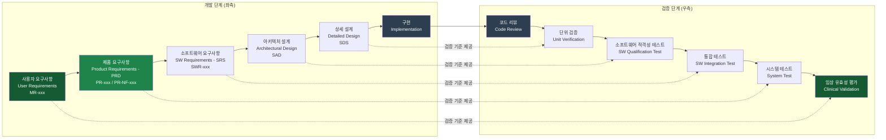

---

## 8. 릴리스 계획 (Release Plan)

### 8.1 Phase별 핵심 기능

| Phase | 버전 | 기간 | 핵심 기능 | 규제 마일스톤 |
|-------|------|------|-----------|--------------| 
| **Phase 1** | v1.0 | 12개월 | 환자 관리(PR-PM-001~006), MWL, 촬영 워크플로우(PR-WF-010~018), 기본 영상 처리(PR-IP-020~037), DICOM 필수 서비스(PR-DC-050~056), 선량 관리(PR-DM-040~046), RBAC, Audit Trail | IEC 62304 SW 개발 완료, 인허가 신청 |
| **Phase 1.5** | v1.5 | +6개월 | Image Stitching(PR-IP-025), Reject Analysis(PR-DM-046), Domain 인증(PR-CS-071), Scatter Correction(PR-IP-033), 원격 진단(PR-NF-MT-053), 성능 최적화 | 인허가 획득 (목표) |
| **Phase 2** | v2.0 | +12개월 | AI Smart Positioning, AI Noise Cancellation, Analytics Dashboard, 클라우드 연동, 모바일 원격 모니터링, 추가 다국어 (PR-AI-xxx) | 업데이트 신고 |

### 8.2 릴리스 로드맵 (Gantt Chart)

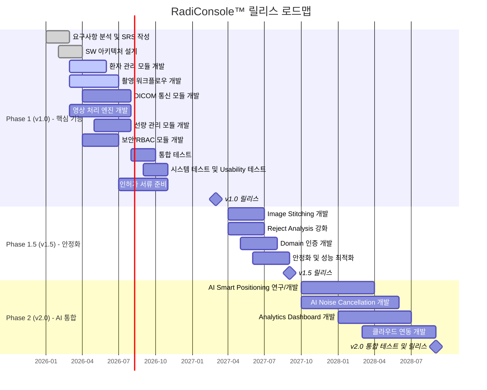

### 8.3 Phase 1 세부 마일스톤

| 마일스톤 | 목표 날짜 | 완료 기준 |
|---------|-----------|-----------|
| M1: SRS 승인 | 2026-04 | 이해관계자 서명 완료 |
| M2: 아키텍처 설계 완료 | 2026-04 | 설계 리뷰 통과 |
| M3: Alpha 빌드 | 2026-08 | 핵심 기능 구현, 단위 테스트 완료 |
| M4: Beta 빌드 | 2026-10 | 통합 테스트 완료, 주요 결함 0건 |
| M5: RC 빌드 | 2026-12 | Summative Usability Test 통과 |
| M6: 인허가 신청 | 2027-01 | 510(k) / CE MDR 서류 제출 |
| M7: v1.0 GA 릴리스 | 2027-03 | 인허가 획득 + 첫 상용 납품 |

---

## 9. 위험 요소 및 완화 방안 (Risk & Mitigation)

### 9.1 기술적 위험 (Technical Risks)

| 위험 ID | 위험 설명 | 발생 가능성 | 영향도 | 위험도 | 완화 방안 |
|---------|-----------|-----------|--------|--------|-----------| 
| TR-001 | Multi-vendor Detector SDK 호환성 문제 | 높음 | 높음 | **Critical** | 조기 Proof-of-Concept(PoC) 수행; HAL 추상화 레이어로 벤더 의존성 격리; 핵심 벤더 2개와 우선 계약 |
| TR-002 | 영상 처리 파이프라인 성능 (≤1초) 미달 | 중간 | 높음 | **High** | C++ 영상 처리 엔진 + GPU 가속(CUDA/OpenCL) 옵션; 조기 성능 프로파일링; Intel IPP 최적화 |
| TR-003 | DICOM 호환성 문제 (PACS 벤더별 방언) | 높음 | 중간 | **High** | 5개 주요 PACS와 연동 테스트 환경 구축; IHE Connectathon 참여; DCMTK 기반 검증 |
| TR-004 | 영상 처리 알고리즘 (Scatter Correction) 성능 검증 | 중간 | 중간 | **Medium** | 팬텀 테스트 조기 수행; 문헌 기반 알고리즘 우선 채택; 전문 물리사 자문 |
| TR-005 | 실시간 Generator/Detector 통신 동기화 | 중간 | 높음 | **High** | 타임아웃 및 재시도 메커니즘 설계; 하드웨어 시뮬레이터 개발로 통합 테스트 조기 수행 |
| TR-006 | 사이버보안 취약점 (PHI 노출) | 낮음 | 최고 | **Critical** | 개발 초기부터 SAST/DAST 적용; 외부 침투 테스트 (연 1회); SBOM 모니터링 자동화 |

### 9.2 일정 위험 (Schedule Risks)

| 위험 ID | 위험 설명 | 발생 가능성 | 영향도 | 위험도 | 완화 방안 |
|---------|-----------|-----------|--------|--------|-----------| 
| SR-001 | 핵심 개발 인력 이탈 | 중간 | 높음 | **High** | 지식 문서화 의무화; 기능별 Cross-training; 주요 모듈 복수 담당자 지정 |
| SR-002 | 요구사항 변경 (Scope Creep) | 높음 | 중간 | **High** | Change Control Board 운영; Phase 2 기능은 Parking Lot 관리; 변경 시 영향도 분석 필수 |
| SR-003 | 하드웨어 연동 지연 (Detector/Generator 수급) | 중간 | 중간 | **Medium** | 소프트웨어 시뮬레이터 병행 개발; 대체 하드웨어 벤더 사전 검토 |
| SR-004 | Usability 테스트 반복으로 인한 일정 지연 | 중간 | 중간 | **Medium** | Formative 테스트를 개발 초기(Sprint 4)부터 주기적 수행; 주요 Usability 이슈 조기 발굴 |

### 9.3 규제 위험 (Regulatory Risks)

| 위험 ID | 위험 설명 | 발생 가능성 | 영향도 | 위험도 | 완화 방안 |
|---------|-----------|-----------|--------|--------|-----------| 
| RR-001 | FDA 510(k) 심사 지연 또는 Additional Information 요청 | 중간 | 높음 | **High** | 규제 전문가(RA) 조기 투입; 사전 Pre-Sub Meeting 신청; 동등 기기(Predicate Device) 사전 분석 |
| RR-002 | IEC 62304 문서 불완전으로 인증 실패 | 중간 | 높음 | **High** | Notified Body와 조기 인터랙션; 개발 중 Gap Analysis 수행 |
| RR-003 | FDA Cybersecurity 가이던스 변경 (Section 524B) | 낮음 | 높음 | **Medium** | FDA 가이던스 변경 모니터링 구독; 아키텍처의 보안 모듈 교체 가능 설계 |
| RR-004 | 한국 MFDS 인허가 요건 추가 요구사항 | 중간 | 중간 | **Medium** | MFDS 규제 담당자와 사전 상담; 국내 임상 데이터 수집 계획 수립 |
| RR-005 | PHI 처리 관련 HIPAA/개인정보보호법 위반 | 낮음 | 최고 | **Critical** | Privacy by Design 원칙 적용; 법무 검토 및 개인정보 영향 평가(PIA) 수행 |

### 9.4 위험 대응 매트릭스

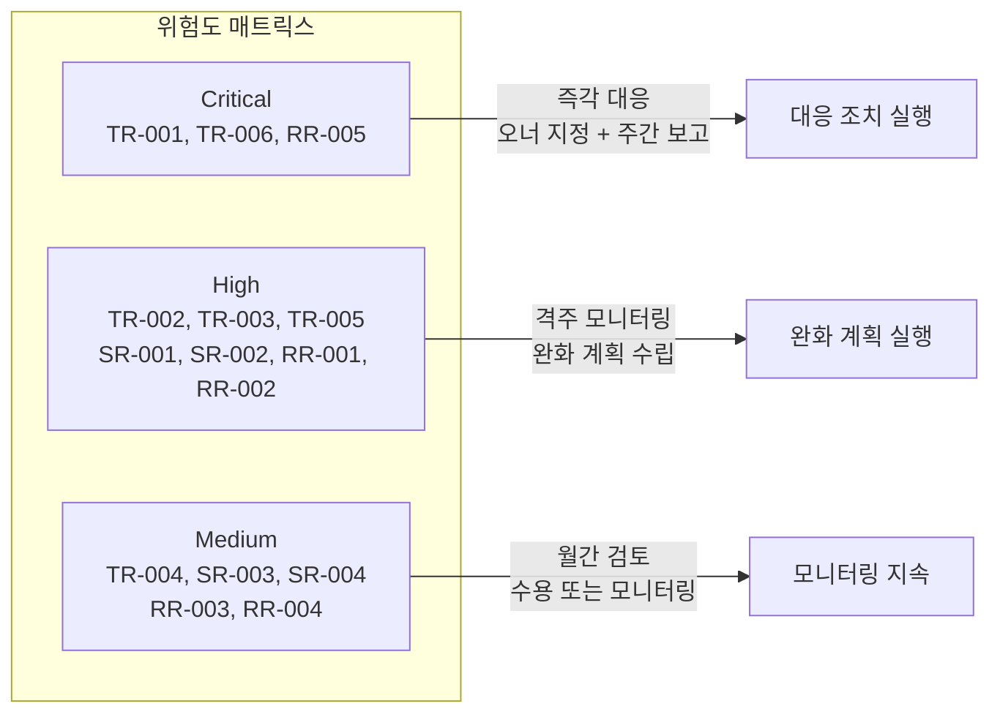

---

## 10. 검증 전략 (Verification & Validation Strategy)

> **근거 규격**: FDA 21 CFR 820.30(f)(g), IEC 62304 §5.5~5.7, ISO 14971 §10

### 10.1 V-Model 기반 검증/밸리데이션 체계

본 제품은 IEC 62304 Class B 분류에 따라 아래 V-Model 체계를 따른다. **요구사항 계층이 3단계(MR → PR → SWR)로 구성됨에 따라**, 각 검증 단계는 대응하는 요구사항 계층 산출물을 기준으로 수행된다.

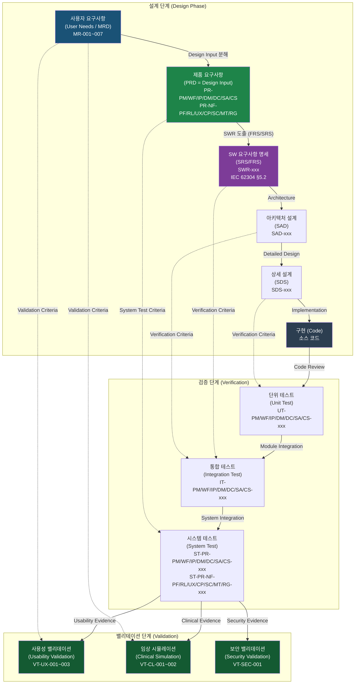

### 10.2 검증 단계별 커버리지

| 검증 단계 | 커버하는 요구사항 | 테스트 ID 범위 | 주요 도구 |
|-----------|----------------|--------------|----------|
| **단위 테스트 (Unit Test)** | 모든 SWR (소프트웨어 기능 단위) | UT-PM/WF/IP/DM/DC/SA/CS-xxx | xUnit, NUnit, Google Test |
| **통합 테스트 (Integration Test)** | 모든 SWR (인터페이스 시나리오) + PR-NF-RL, PR-NF-CP | IT-PM/WF/IP/DM/DC/SA/CS-xxx | 자동화 테스트 스크립트, HW 시뮬레이터 |
| **시스템 테스트 (System Test)** | 모든 PR + 전 PR-NF (수용 기준 직접 검증) | ST-PR-xxx (전 범주) | 테스트 케이스 매뉴얼, JMeter, OWASP ZAP |
| **사용성 밸리데이션 (VT-UX)** | PR-NF-UX-020~026, PR-PM-004, PR-WF-016 | VT-UX-001~003 | SUS 설문, Task 시나리오, 방사선사 ≥10명 |
| **임상 시뮬레이션 (VT-CL)** | PR-DM-040~046, PR-WF-010~016, PR-IP-020~036 | VT-CL-001~002 | 팬텀 테스트, 임상 시나리오 시뮬레이션 |
| **보안 밸리데이션 (VT-SEC)** | PR-CS-070~076, PR-NF-SC-040~045 | VT-SEC-001 | 침투 테스트, Veracode, OWASP ZAP |

### 10.3 밸리데이션 테스트 상세

| 밸리데이션 ID | 설명 | 참여자 | 성공 기준 |
|-------------|------|--------|----------|
| VT-UX-001 | 기본 워크플로우 사용성 평가 (Summative) | 방사선사 ≥10명 | SUS ≥70점; 표준 검사 Task ≤5회 터치 (PR-NF-UX-021, PR-NF-UX-024) |
| VT-UX-002 | 응급/안전 관련 Task 완료율 평가 | 방사선사 ≥10명 | 안전 Task 완료율 ≥95%; Emergency 진입 ≤2터치 (PR-NF-UX-026) |
| VT-UX-003 | 초보 사용자 교육 시간 평가 | 신규 방사선사 5명 | 기본 운영 교육 ≤4시간 (PR-NF-UX-020) |
| VT-CL-001 | 임상 시나리오 시뮬레이션 (표준 촬영) | 방사선사 5명, 의학물리사 1명 | 전 워크플로우 오류 없이 완료; 선량 기록 100% (PR-DM-040~045) |
| VT-CL-002 | 측정 정확도 밸리데이션 | 의학물리사 1명 | 거리 측정 ±1% (PR-IP-026); 이미지 스티칭 오차 ≤1mm (PR-IP-025) |
| VT-SEC-001 | 보안 침투 테스트 및 취약점 밸리데이션 | 외부 보안 전문가 | Critical/High CVE 0건; PHI 무단 노출 0건 (PR-CS-074, PR-NF-SC-044) |

### 10.4 검증 완료 기준 (Entry/Exit Criteria)

#### 단위 테스트 (Unit Test)

| 기준 유형 | 기준 내용 |
|----------|----------|
| **Entry Criteria** | 구현 완료된 모듈; 코드 리뷰 완료; 테스트 계획 승인 |
| **Exit Criteria** | 코드 커버리지 ≥80% (PR-NF-MT-051); Critical/High 결함 0건; 모든 TC Pass |

#### 통합 테스트 (Integration Test)

| 기준 유형 | 기준 내용 |
|----------|----------|
| **Entry Criteria** | 단위 테스트 Exit Criteria 충족; 인터페이스 명세 확정 |
| **Exit Criteria** | 모든 인터페이스 시나리오 Pass; Critical 결함 0건; 하드웨어 시뮬레이터 전 시나리오 Pass |

#### 시스템 테스트 (System Test)

| 기준 유형 | 기준 내용 |
|----------|----------|
| **Entry Criteria** | 통합 테스트 Exit Criteria 충족; 시스템 테스트 환경 구축 완료 |
| **Exit Criteria** | 모든 PR/PR-NF 수용 기준 Pass; Critical/High 미결 결함 0건; PR-NF 기준치 100% 달성 |

#### 밸리데이션 (Validation)

| 기준 유형 | 기준 내용 |
|----------|----------|
| **Entry Criteria** | 시스템 테스트 Exit Criteria 충족; 밸리데이션 프로토콜 승인; 참가자 동의서 완료 |
| **Exit Criteria** | VT-UX-001 SUS ≥70 (PR-NF-UX-024); VT-UX-002 안전 Task ≥95% (PR-NF-RG-062); VT-CL-001 전 시나리오 완료; VT-SEC-001 Critical CVE 0건 (PR-NF-SC-044) |

---

## 11. 위험 관련 요구사항 연결 (Safety-Critical Requirements Mapping)

> **근거 규격**: ISO 14971:2019, IEC 62366-1:2015, FDA 21 CFR 820.30

### 11.1 위험 카테고리 정의

| 위험 ID | 위험 카테고리 | 설명 | 관련 IEC 62304 소프트웨어 안전 분류 |
|---------|-------------|------|--------------------------------|
| **HAZ-RAD** | 방사선 위험 (Radiation Hazard) | 과노출, 잘못된 선량, DRL 초과 등 방사선 관련 위험 | Safety Class C |
| **HAZ-SW** | SW 오류 위험 (Software Failure Hazard) | 시스템 크래시, 데이터 손상, 오작동 등 SW 결함 위험 | Safety Class B |
| **HAZ-SEC** | 보안 위험 (Security Hazard) | PHI 노출, 무단 접근, 데이터 변조 등 보안 위험 | Safety Class B |
| **HAZ-DATA** | 데이터 무결성 위험 (Data Integrity Hazard) | 환자 정보 오류, 영상 손실, 선량 기록 누락 위험 | Safety Class B |

### 11.2 Safety-Critical 요구사항 식별 및 위험 통제 매핑

#### 방사선 위험 (HAZ-RAD) 관련 요구사항

| 요구사항 ID | 기능명 | 위험 시나리오 | 위험 통제 조치 (Risk Control Measure) | 잔류 위험 |
|-----------|--------|------------|-------------------------------------|---------| 
| PR-WF-012 | 촬영 조건 설정 | 과도한 kVp/mAs 입력으로 과노출 발생 | 입력 범위 검증 + 경고 팝업; Generator 전송 전 파라미터 유효성 검사 | Low |
| PR-WF-013 | Generator 통신 및 제어 | 통신 오류 시 의도치 않은 노출 | 노출 전 2-step 확인; 타임아웃 시 즉시 중단; 인터락 신호 처리 | Low |
| PR-WF-014 | Detector 상태 모니터링 | Detector 미준비 상태에서 노출 시도 | Ready 신호 미수신 시 노출 버튼 비활성화; 시각/청각 경고 | Low |
| PR-DM-043 | Exposure Index 모니터링 | DI 이상값 무시로 반복 과노출 | DI ±2 이상 시 강제 경고(황색/적색); DI ±3 이상 시 관리자 알림 | Low |
| PR-DM-044 | DRL 비교 | DRL 초과 인지 없이 촬영 지속 | DRL 초과 시 경고 팝업 및 확인 필요; 초과 이력 로그 기록 | Low |
| PR-NF-UX-021 | 표준 검사 클릭 수 | 복잡한 UI로 인한 프로토콜 선택 오류 | 최대 5-tap 워크플로우; APR 자동 적용으로 수동 설정 최소화 | Low |
| PR-NF-UX-026 | 응급 접근성 | 응급 상황에서 빠른 대응 불가 | Emergency 모드 ≤2터치 진입; 어디서나 접근 가능 | Low |

#### SW 오류 위험 (HAZ-SW) 관련 요구사항

| 요구사항 ID | 기능명 | 위험 시나리오 | 위험 통제 조치 | 잔류 위험 |
|-----------|--------|------------|--------------|---------| 
| PR-IP-020 | 실시간 영상 표시 | 영상 처리 오류로 잘못된 영상 표시 | 처리 결과 무결성 검증; 처리 실패 시 원본 표시 + 경고 | Low |
| PR-SA-063 | 캘리브레이션 UI | 잘못된 캘리브레이션으로 영상 품질 저하 | VNUE Pass/Fail 자동 판정; 품질 미달 시 저장 차단 | Low |
| PR-NF-RL-013 | 자동 복구 | SW 크래시로 촬영 세션 중단 | ≤30초 내 자동 재시작; Write-ahead logging으로 데이터 보존 | Medium |
| PR-NF-RL-015 | 장기 운영 안정성 | 메모리 누수로 장시간 운영 시 성능 저하 | 72시간 soak test 필수; Heap 모니터링 알림 | Low |

#### 데이터 무결성 위험 (HAZ-DATA) 관련 요구사항

| 요구사항 ID | 기능명 | 위험 시나리오 | 위험 통제 조치 | 잔류 위험 |
|-----------|--------|------------|--------------|---------| 
| PR-PM-001 | 환자 수동 등록 | 중복 환자 ID로 영상 혼선 | 중복 ID 자동 감지 + 저장 차단; 필수 필드 검증 | Low |
| PR-DM-042 | RDSR 생성 | 선량 기록 누락으로 선량 추적 불가 | RDSR 자동 생성 필수; 생성 실패 시 재시도 + 알림; 로컬 백업 | Low |
| PR-DC-050 | Storage SCU | PACS 전송 실패로 영상 손실 | 자동 재시도 3회; Storage Commitment 확인; 로컬 임시 저장 | Low |
| PR-NF-RL-012 | 데이터 무결성 | 전원 차단 시 촬영 데이터 손실 | Write-ahead logging; 데이터 손실 허용 0건 | Low |

#### 보안 위험 (HAZ-SEC) 관련 요구사항

| 요구사항 ID | 기능명 | 위험 시나리오 | 위험 통제 조치 | 잔류 위험 |
|-----------|--------|------------|--------------|---------| 
| PR-CS-070 | 로컬 사용자 인증 | 무단 접근으로 PHI 노출 | 로그인 실패 5회 잠금; bcrypt/Argon2 해시; 마지막 로그인 표시 | Low |
| PR-CS-074 | PHI 보호 | DB 탈취 시 환자 정보 노출 | AES-256 암호화; 키 분리 저장; 스크린샷 방지 | Low |
| PR-CS-076 | Secure Boot / SW 무결성 | 악성코드 삽입 후 실행 | EV 코드 서명 검증; 변조 감지 시 실행 차단; 로그 기록 | Low |

### 11.3 위험-요구사항 연결도 (Mermaid)

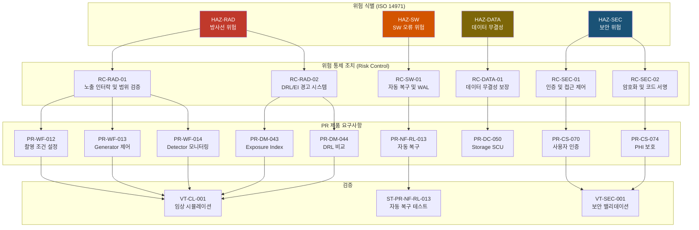

---

## 12. Design Input/Output 매핑 (Design Control Mapping)

> **근거 규격**: FDA 21 CFR 820.30(c)(d)(f), ISO 13485:2016 §7.3.4~7.3.5

### 12.1 Design Control 개요 (3단계 계층)

본 PRD의 모든 요구사항(PR-xxx, PR-NF-xxx)은 FDA 21 CFR 820.30 설계 제어(Design Controls) 체계에서 **Design Input**으로 기능한다. PR-xxx가 시스템 수준 Design Input이며, 이로부터 파생되는 SWR-xxx가 소프트웨어 수준 Design Output(FRS/SRS 문서)의 기반이 된다.

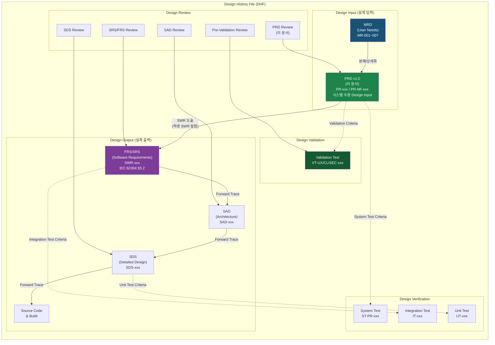

### 12.2 Design Input으로서의 PRD 역할

| 역할 | 설명 | FDA 참조 |
|------|------|----------|
| **Design Input 문서** | 본 PRD의 모든 PR/PR-NF는 공식 Design Input으로 DHF에 포함 | 21 CFR 820.30(c) |
| **SWR 파생 기반** | 각 PR의 "파생 SWR" 컬럼이 FRS/SRS 작성의 기준을 제공 | 21 CFR 820.30(d) |
| **시스템 검증 기준** | 각 요구사항의 수용 기준(Acceptance Criteria)이 시스템 테스트의 Pass/Fail 기준이 됨 | 21 CFR 820.30(f) |
| **밸리데이션 기준** | 사용성/임상/보안 PR이 밸리데이션 성공 기준이 됨 | 21 CFR 820.30(g) |
| **추적성 앵커** | 모든 하위 설계 문서(FRS, SAD, SDS, 코드)가 이 PRD의 PR-xxx ID를 참조 | 21 CFR 820.30 전반 |

### 12.3 Forward Traceability: PRD → Design Output

| PRD 요구사항 범주 | 파생 SWR 범위 | 연결되는 SAD 요소 | 연결되는 SDS 요소 | 연결되는 코드 모듈 |
|----------------|--------------|----------------|----------------|----------------|
| PR-PM (환자 관리) | SWR-PM-001~014 | SAD: PatientManagementSubsystem | SDS: PatientService, WorklistService | PatientModule/, WorklistModule/ |
| PR-WF (촬영 워크플로우) | SWR-WF-010~031 | SAD: AcquisitionSubsystem | SDS: GeneratorService, DetectorService, ProtocolService | AcquisitionModule/, HardwareAbstraction/ |
| PR-IP (영상 처리) | SWR-IP-020~052 | SAD: ImageProcessingSubsystem | SDS: ImageProcessor, DisplayRenderer | ImageProcessing/, DisplayEngine/ |
| PR-DM (선량 관리) | SWR-DM-040~055 | SAD: DoseManagementSubsystem | SDS: DoseService, RDSRGenerator | DoseModule/, RDSRModule/ |
| PR-DC (DICOM 통신) | SWR-DC-050~064 | SAD: DicomCommunicationSubsystem | SDS: DicomStorageSCU, MWL_SCU, MPPS_SCU | DicomModule/ |
| PR-SA (시스템 관리) | SWR-SA-060~077 | SAD: SystemAdminSubsystem | SDS: UserService, AuditTrailService, UpdateManager | AdminModule/, SecurityModule/ |
| PR-CS (사이버보안) | SWR-CS-070~085 | SAD: SecuritySubsystem | SDS: AuthService, EncryptionService, SBOMManager | SecurityModule/, CryptoModule/ |

### 12.4 Design Output에서 PRD로의 Backward Traceability

각 Design Output 문서(FRS, SAD, SDS, 코드)는 아래 규칙에 따라 PRD 요구사항을 역참조해야 한다:

| Design Output | 역참조 방법 | 예시 |
|--------------|-----------|------|
| FRS/SRS 문서 | 각 SWR에 "Satisfies: PR-xxx" 태그 | SWR-WF-018: "Satisfies: PR-WF-013" |
| SAD 문서 | 각 아키텍처 요소에 "Satisfies: PR-xxx" 태그 | SAD-WF-001: "Satisfies: PR-WF-013, PR-WF-015" |
| SDS 문서 | 각 설계 요소에 "Implements: SWR-xxx (PR-xxx)" 태그 | SDS-IP-003: "Implements: SWR-IP-039 (PR-IP-030)" |
| 소스 코드 | XML 주석에 요구사항 ID 명시 | `/// <requirement>PR-DM-042, SWR-DM-044</requirement>` |
| 단위 테스트 | 테스트 메서드에 요구사항 ID 어트리뷰트 | `[Requirement("SWR-PM-011", "PR-PM-005")]` |

---

## 부록 A. 요구사항 추적성 매트릭스 (RTM)

> **완전한 양방향 추적성 매트릭스 (Bidirectional Requirements Traceability Matrix)**  
> FDA 21 CFR 820.30, IEC 62304 §5.2.6 준거  
> PR-xxx 기반 3단계 추적성 (MR → PR → SWR) 적용

### A.1 RTM 구조 및 범례

| 컬럼 | 설명 |
|------|------|
| MR ID | MRD의 Market Requirement ID (출처) |
| PR ID | 본 PRD의 요구사항 ID |
| 파생 SWR 범위 | FRS/SRS에서 상세화되는 SWR-xxx 범위 |
| Design Element | 연결되는 설계 산출물 (SAD/SDS 참조) |
| Verification Method | T/I/A/D (TIAD) |
| Test Case ID (System) | 시스템 테스트 케이스 ID |
| Validation ID | 밸리데이션 테스트 ID |
| HAZ ID | 위험 참조 |
| Status | Open / In Progress / Verified / Validated |

### A.2 기능 제품 요구사항 RTM

| MR ID | PR ID | 파생 SWR 범위 | Design Element | Verification Method | Test Case ID | Validation ID | HAZ ID | Status |
|-------|-------|--------------|----------------|---------------------|--------------|---------------|--------|--------|
| MR-001 | PR-PM-001 | SWR-PM-001~004 | SAD: PatientMgmt / SDS: PatientService.Register() | T, I | ST-PR-PM-001 | VT-UX-001 | HAZ-DATA | Open |
| MR-001 | PR-PM-002 | SWR-PM-010~013 | SAD: PatientMgmt / SDS: PatientService.Update() | T, I | ST-PR-PM-002 | VT-UX-001 | HAZ-DATA, HAZ-SEC | Open |
| MR-001 | PR-PM-003 | SWR-PM-020~024 | SAD: DicomComm / SDS: MWL_SCU.CFindQuery() | T, A | ST-PR-PM-003 | VT-UX-001 | HAZ-DATA | Open |
| MR-001 | PR-PM-004 | SWR-PM-030~033 | SAD: PatientMgmt / SDS: EmergencyRegistration() | T, D | ST-PR-PM-004 | VT-UX-002, VT-CL-001 | HAZ-RAD, HAZ-DATA | Open |
| MR-001 | PR-PM-005 | SWR-PM-040~043 | SAD: PatientMgmt / SDS: PatientService.Search() | T, A | ST-PR-PM-005 | VT-UX-001 | — | Open |
| MR-001 | PR-PM-006 | SWR-PM-050~053 | SAD: PatientMgmt / SDS: PatientService.Delete() | T, I | ST-PR-PM-006 | VT-UX-001 | HAZ-DATA, HAZ-SEC | Open |
| MR-002 | PR-WF-010 | SWR-WF-010~012 | SAD: Acquisition / SDS: ProtocolService.Apply() | T, D | ST-PR-WF-010 | VT-CL-001, VT-UX-002 | HAZ-RAD | Open |
| MR-002 | PR-WF-011 | SWR-WF-013~014 | SAD: Acquisition / SDS: StudyManager.ReorderViews() | T, I | ST-PR-WF-011 | VT-UX-002 | HAZ-DATA | Open |
| MR-002 | PR-WF-012 | SWR-WF-015~017 | SAD: HW_HAL / SDS: GeneratorService.SetParams() | T, A | ST-PR-WF-012 | VT-CL-001 | HAZ-RAD | Open |
| MR-002 | PR-WF-013 | SWR-WF-018~020 | SAD: HW_HAL / SDS: GeneratorService.Expose() | T, A | ST-PR-WF-013 | VT-CL-001 | HAZ-RAD, HAZ-SW | Open |
| MR-002 | PR-WF-014 | SWR-WF-021~022 | SAD: HW_HAL / SDS: DetectorService.GetStatus() | T, D | ST-PR-WF-014 | VT-CL-001, VT-UX-002 | HAZ-RAD, HAZ-SW | Open |
| MR-002 | PR-WF-015 | SWR-WF-023~025 | SAD: Acquisition / SDS: AcquisitionController.Execute() | T, A | ST-PR-WF-015 | VT-CL-001 | HAZ-RAD, HAZ-SW | Open |
| MR-002 | PR-WF-016 | SWR-WF-026~027 | SAD: Acquisition / SDS: TraumaWorkflow.Execute() | T, D | ST-PR-WF-016 | VT-CL-001, VT-UX-002 | HAZ-RAD | Open |
| MR-002 | PR-WF-017 | SWR-WF-028~029 | SAD: Acquisition / SDS: StudyManager.MultiStudy() | T, I | ST-PR-WF-017 | VT-UX-002 | HAZ-DATA | Open |
| MR-002 | PR-WF-018 | SWR-WF-030~031 | SAD: Acquisition / SDS: SessionManager.Suspend() | T, D | ST-PR-WF-018 | VT-UX-002 | HAZ-DATA | Open |
| MR-003 | PR-IP-020 | SWR-IP-020~021 | SAD: ImageProc / SDS: DisplayRenderer.Render() | T, A | ST-PR-IP-020 | VT-CL-001, VT-UX-002 | HAZ-RAD, HAZ-SW | Open |
| MR-003 | PR-IP-021 | SWR-IP-022~023 | SAD: ImageProc / SDS: WindowLevelController.Adjust() | T, D | ST-PR-IP-021 | VT-UX-002 | — | Open |
| MR-003 | PR-IP-022 | SWR-IP-024~025 | SAD: ImageProc / SDS: ZoomController.Apply() | T, D | ST-PR-IP-022 | VT-UX-002 | — | Open |
| MR-003 | PR-IP-023 | SWR-IP-026 | SAD: ImageProc / SDS: PanController.Apply() | T, D | ST-PR-IP-023 | VT-UX-002 | — | Open |
| MR-003 | PR-IP-024 | SWR-IP-027~028 | SAD: ImageProc / SDS: RotationController.Apply() | T, D | ST-PR-IP-024 | VT-UX-002 | — | Open |
| MR-003 | PR-IP-025 | SWR-IP-029~031 | SAD: ImageProc / SDS: StitchingEngine.Stitch() | T, A | ST-PR-IP-025 | VT-CL-002 | — | Open |
| MR-003 | PR-IP-026 | SWR-IP-032~033 | SAD: ImageProc / SDS: MeasurementTool.Distance() | T, A | ST-PR-IP-026 | VT-CL-002 | HAZ-SW | Open |
| MR-003 | PR-IP-027 | SWR-IP-034 | SAD: ImageProc / SDS: MeasurementTool.Angle() | T, A | ST-PR-IP-027 | VT-CL-002 | — | Open |
| MR-003 | PR-IP-028 | SWR-IP-035~036 | SAD: ImageProc / SDS: MeasurementTool.Area() | T, A | ST-PR-IP-028 | VT-CL-002 | — | Open |
| MR-003 | PR-IP-029 | SWR-IP-037~038 | SAD: ImageProc / SDS: AnnotationService.Save() | T, I | ST-PR-IP-029 | VT-UX-002 | HAZ-DATA | Open |
| MR-003 | PR-IP-030 | SWR-IP-039~040 | SAD: ImageProc / SDS: GainOffsetCorrection.Apply() | T, A | ST-PR-IP-030 | VT-CL-001 | HAZ-RAD, HAZ-SW | Open |
| MR-003 | PR-IP-031 | SWR-IP-041~042 | SAD: ImageProc / SDS: NoiseReduction.Apply() | T, A | ST-PR-IP-031 | VT-CL-001 | HAZ-RAD | Open |
| MR-003 | PR-IP-032 | SWR-IP-043~044 | SAD: ImageProc / SDS: EdgeEnhancement.Apply() | T, D | ST-PR-IP-032 | VT-CL-001 | — | Open |
| MR-003 | PR-IP-033 | SWR-IP-045~046 | SAD: ImageProc / SDS: ScatterCorrection.Apply() | T, A | ST-PR-IP-033 | VT-CL-001 | HAZ-RAD | Open |
| MR-003 | PR-IP-034 | SWR-IP-047~048 | SAD: ImageProc / SDS: AutoTrimming.Apply() | T, A | ST-PR-IP-034 | VT-CL-001 | — | Open |
| MR-003 | PR-IP-035 | SWR-IP-049 | SAD: ImageProc / SDS: BlackMask.Apply() | T, D | ST-PR-IP-035 | VT-UX-002 | — | Open |
| MR-003 | PR-IP-036 | SWR-IP-050~051 | SAD: ImageProc / SDS: ContrastOptimization.Apply() | T, D | ST-PR-IP-036 | VT-CL-001 | — | Open |
| MR-003 | PR-IP-037 | SWR-IP-052 | SAD: ImageProc / SDS: BrightnessController.Apply() | T, D | ST-PR-IP-037 | VT-UX-002 | — | Open |
| MR-004 | PR-DM-040 | SWR-DM-040~041 | SAD: DoseMgmt / SDS: DoseService.RecordDAP() | T, A | ST-PR-DM-040 | VT-CL-001 | HAZ-RAD | Open |
| MR-004 | PR-DM-041 | SWR-DM-042~043 | SAD: DoseMgmt / SDS: DoseService.CalculateESD() | T, A | ST-PR-DM-041 | VT-CL-001 | HAZ-RAD | Open |
| MR-004 | PR-DM-042 | SWR-DM-044~046 | SAD: DoseMgmt / SDS: RDSRGenerator.Generate() | T, I | ST-PR-DM-042 | VT-CL-001 | HAZ-RAD, HAZ-DATA | Open |
| MR-004 | PR-DM-043 | SWR-DM-047~048 | SAD: DoseMgmt / SDS: ExposureIndexMonitor.Check() | T, A | ST-PR-DM-043 | VT-CL-001, VT-UX-002 | HAZ-RAD | Open |
| MR-004 | PR-DM-044 | SWR-DM-049~050 | SAD: DoseMgmt / SDS: DRLComparator.Alert() | T, A | ST-PR-DM-044 | VT-CL-001 | HAZ-RAD | Open |
| MR-004 | PR-DM-045 | SWR-DM-051~052 | SAD: DoseMgmt / SDS: DoseLogBook.Record() | T, I | ST-PR-DM-045 | VT-CL-001 | HAZ-RAD, HAZ-DATA | Open |
| MR-004 | PR-DM-046 | SWR-DM-053~055 | SAD: DoseMgmt / SDS: RejectAnalysis.Report() | T, A | ST-PR-DM-046 | VT-CL-002 | HAZ-RAD | Open |
| MR-005 | PR-DC-050 | SWR-DC-050~052 | SAD: DicomComm / SDS: StorageSCU.CStore() | T, A | ST-PR-DC-050 | VT-CL-001 | HAZ-DATA | Open |
| MR-005 | PR-DC-051 | SWR-DC-053~054 | SAD: DicomComm / SDS: MWL_SCU.QueryWorklist() | T, A | ST-PR-DC-051 | VT-UX-001 | HAZ-DATA | Open |
| MR-005 | PR-DC-052 | SWR-DC-055~056 | SAD: DicomComm / SDS: MPPS_SCU.SendStatus() | T, A | ST-PR-DC-052 | VT-CL-001 | HAZ-DATA | Open |
| MR-005 | PR-DC-053 | SWR-DC-057~058 | SAD: DicomComm / SDS: StorageCommitSCU.Confirm() | T, I | ST-PR-DC-053 | VT-CL-001 | HAZ-DATA | Open |
| MR-005 | PR-DC-054 | SWR-DC-059~060 | SAD: DicomComm / SDS: PrintSCU.Print() | T, D | ST-PR-DC-054 | VT-UX-002 | — | Open |
| MR-005 | PR-DC-055 | SWR-DC-061~062 | SAD: DicomComm / SDS: QueryRetrieveSCU.Fetch() | T, D | ST-PR-DC-055 | VT-UX-002 | — | Open |
| MR-005 | PR-DC-056 | SWR-DC-063~064 | SAD: DicomComm / SDS: TLSManager.Handshake() | T, I | ST-PR-DC-056 | VT-SEC-001 | HAZ-SEC | Open |
| MR-006 | PR-SA-060 | SWR-SA-060~062 | SAD: SystemAdmin / SDS: UserService.ManageRBAC() | T, I | ST-PR-SA-060 | VT-SEC-001 | HAZ-SEC | Open |
| MR-006 | PR-SA-061 | SWR-SA-063~064 | SAD: SystemAdmin / SDS: ProtocolEditor.Edit() | T, D | ST-PR-SA-061 | VT-UX-002 | HAZ-RAD | Open |
| MR-006 | PR-SA-062 | SWR-SA-065~066 | SAD: SystemAdmin / SDS: SystemConfig.Set() | T, D | ST-PR-SA-062 | VT-UX-002 | HAZ-DATA | Open |
| MR-006 | PR-SA-063 | SWR-SA-067~069 | SAD: SystemAdmin / SDS: CalibrationWizard.Run() | T, A | ST-PR-SA-063 | VT-CL-001 | HAZ-RAD, HAZ-SW | Open |
| MR-006 | PR-SA-064 | SWR-SA-070~071 | SAD: SystemAdmin / SDS: DefectPixelMap.Manage() | T, A | ST-PR-SA-064 | VT-CL-001 | HAZ-RAD | Open |
| MR-006 | PR-SA-065 | SWR-SA-072~073 | SAD: SystemAdmin / SDS: AuditTrailService.Log() | T, I | ST-PR-SA-065 | VT-SEC-001 | HAZ-SEC, HAZ-DATA | Open |
| MR-006 | PR-SA-066 | SWR-SA-074~075 | SAD: SystemAdmin / SDS: LoggingService.Write() | T, I | ST-PR-SA-066 | VT-UX-002 | HAZ-SW | Open |
| MR-006 | PR-SA-067 | SWR-SA-076~077 | SAD: SystemAdmin / SDS: UpdateManager.Install() | T, I | ST-PR-SA-067 | VT-SEC-001 | HAZ-SEC, HAZ-SW | Open |
| MR-007 | PR-CS-070 | SWR-CS-070~072 | SAD: Security / SDS: AuthService.Login() | T, I | ST-PR-CS-070 | VT-SEC-001 | HAZ-SEC | Open |
| MR-007 | PR-CS-071 | SWR-CS-073~074 | SAD: Security / SDS: DomainAuthService.Authenticate() | T, D | ST-PR-CS-071 | VT-SEC-001 | HAZ-SEC | Open |
| MR-007 | PR-CS-072 | SWR-CS-075~077 | SAD: Security / SDS: SessionManager.Monitor() | T, D | ST-PR-CS-072 | VT-SEC-001 | HAZ-SEC, HAZ-RAD | Open |
| MR-007 | PR-CS-073 | SWR-CS-078~079 | SAD: Security / SDS: TLSManager.Configure() | T, I | ST-PR-CS-073 | VT-SEC-001 | HAZ-SEC | Open |
| MR-007 | PR-CS-074 | SWR-CS-080~081 | SAD: Security / SDS: EncryptionService.EncryptPHI() | T, I | ST-PR-CS-074 | VT-SEC-001 | HAZ-SEC | Open |
| MR-007 | PR-CS-075 | SWR-CS-082~083 | SAD: Security / SDS: SBOMManager.Monitor() | T, I | ST-PR-CS-075 | VT-SEC-001 | HAZ-SEC | Open |
| MR-007 | PR-CS-076 | SWR-CS-084~085 | SAD: Security / SDS: IntegrityVerifier.Verify() | T, I | ST-PR-CS-076 | VT-SEC-001 | HAZ-SEC, HAZ-SW | Open |

### A.3 비기능 제품 요구사항 RTM

| MR ID | PR-NF ID | 파생 SWR | Design Element | Verification Method | Test Case ID | Validation ID | HAZ ID | Status |
|-------|----------|---------|----------------|---------------------|--------------|---------------|--------|--------|
| MR-002, MR-003 | PR-NF-PF-001 | SWR-NF-PF-001 | SAD: ImageProc / 전체 처리 파이프라인 | T, A | ST-PR-NF-PF-001 | VT-CL-001 | HAZ-RAD | Open |
| MR-001 | PR-NF-PF-002 | SWR-NF-PF-002 | SAD: PatientMgmt / SDS: SearchIndex | T, A | ST-PR-NF-PF-002 | VT-UX-001 | — | Open |
| MR-005 | PR-NF-PF-003 | SWR-NF-PF-003 | SAD: DicomComm / 네트워크 스택 | T, A | ST-PR-NF-PF-003 | VT-CL-001 | HAZ-DATA | Open |
| MR-002, MR-003 | PR-NF-PF-004 | SWR-NF-PF-004 | SAD: UI / 이벤트 핸들러 | T, A | ST-PR-NF-PF-004 | VT-UX-002 | — | Open |
| MR-006 | PR-NF-PF-005 | SWR-NF-PF-005 | SAD: SystemInit / 부팅 시퀀스 | T | ST-PR-NF-PF-005 | VT-UX-001 | — | Open |
| MR-002 | PR-NF-PF-006 | SWR-NF-PF-006 | SAD: Acquisition / 멀티스레드 처리 | T, A | ST-PR-NF-PF-006 | VT-CL-002 | HAZ-SW | Open |
| MR-005 | PR-NF-PF-007 | SWR-NF-PF-007 | SAD: DicomComm / MWL 캐시 | T, A | ST-PR-NF-PF-007 | VT-UX-001 | — | Open |
| MR-003 | PR-NF-PF-008 | SWR-NF-PF-008 | SAD: ImageProc / StitchingEngine | T, A | ST-PR-NF-PF-008 | VT-CL-002 | — | Open |
| MR-002 | PR-NF-RL-010 | SWR-NF-RL-010 | SAD: 전체 시스템 / 가용성 설계 | T, A | ST-PR-NF-RL-010 | VT-CL-001 | HAZ-SW | Open |
| MR-002, MR-005 | PR-NF-RL-012 | SWR-NF-RL-012 | SAD: DataLayer / WAL 구현 | T, A | ST-PR-NF-RL-012 | VT-CL-001 | HAZ-DATA | Open |
| MR-002 | PR-NF-RL-013 | SWR-NF-RL-013 | SAD: SystemMgmt / 자동 복구 | T, D | ST-PR-NF-RL-013 | VT-CL-001 | HAZ-SW | Open |
| MR-005 | PR-NF-RL-014 | SWR-NF-RL-014 | SAD: DicomComm / 오프라인 큐 | T, D | ST-PR-NF-RL-014 | VT-CL-001 | HAZ-DATA | Open |
| MR-002 | PR-NF-RL-015 | SWR-NF-RL-015 | SAD: 전체 시스템 / 메모리 관리 | T, A | ST-PR-NF-RL-015 | — | HAZ-SW | Open |
| MR-001, MR-002 | PR-NF-UX-020 | SWR-NF-UX-020 | SAD: UI / 교육 자료 | D, A | ST-PR-NF-UX-020 | VT-UX-001 | — | Open |
| MR-002 | PR-NF-UX-021 | SWR-NF-UX-021 | SAD: UI / 워크플로우 최적화 | T, D | ST-PR-NF-UX-021 | VT-UX-001 | HAZ-RAD | Open |
| MR-002 | PR-NF-UX-022 | SWR-NF-UX-022 | SAD: UI / 터치 타겟 규격 | I | ST-PR-NF-UX-022 | VT-UX-001 | — | Open |
| MR-001 | PR-NF-UX-023 | SWR-NF-UX-023 | SAD: UI / 다국어 지원 | T, I | ST-PR-NF-UX-023 | VT-UX-001 | — | Open |
| MR-001 | PR-NF-UX-024 | SWR-NF-UX-024 | SAD: UI / UX 설계 | D, A | ST-PR-NF-UX-024 | VT-UX-001 | — | Open |
| MR-002 | PR-NF-UX-025 | SWR-NF-UX-025 | SAD: UI / 오류 처리 흐름 | T, D | ST-PR-NF-UX-025 | VT-UX-001 | HAZ-RAD | Open |
| MR-002 | PR-NF-UX-026 | SWR-NF-UX-026 | SAD: UI / Emergency 버튼 | T, D | ST-PR-NF-UX-026 | VT-UX-002 | HAZ-RAD | Open |
| MR-006 | PR-NF-CP-030 | SWR-NF-CP-030 | SAD: Platform / OS 호환성 | T, I | ST-PR-NF-CP-030 | — | HAZ-SW | Open |
| MR-002 | PR-NF-CP-031 | SWR-NF-CP-031 | SAD: HW_HAL / Detector 플러그인 | T, D | ST-PR-NF-CP-031 | VT-CL-001 | HAZ-RAD | Open |
| MR-002 | PR-NF-CP-032 | SWR-NF-CP-032 | SAD: HW_HAL / Generator 플러그인 | T, D | ST-PR-NF-CP-032 | VT-CL-001 | HAZ-RAD | Open |
| MR-005 | PR-NF-CP-033 | SWR-NF-CP-033 | SAD: DicomComm / PACS 호환성 | T, D | ST-PR-NF-CP-033 | VT-CL-001 | HAZ-DATA | Open |
| MR-003 | PR-NF-CP-034 | SWR-NF-CP-034 | SAD: UI / 해상도 대응 | T, I | ST-PR-NF-CP-034 | VT-UX-002 | — | Open |
| MR-005 | PR-NF-CP-035 | SWR-NF-CP-035 | SAD: DicomComm / DICOM 표준 | T, I | ST-PR-NF-CP-035 | VT-CL-001 | HAZ-DATA | Open |
| MR-007 | PR-NF-SC-040 | SWR-NF-SC-040 | SAD: Security / 규제 준수 체계 | I, A | ST-PR-NF-SC-040 | VT-SEC-001 | HAZ-SEC | Open |
| MR-007 | PR-NF-SC-041 | SWR-NF-SC-041 | SAD: Security / TLS 설정 | T, I | ST-PR-NF-SC-041 | VT-SEC-001 | HAZ-SEC | Open |
| MR-007 | PR-NF-SC-042 | SWR-NF-SC-042 | SAD: Security / 비밀번호 정책 | T, I | ST-PR-NF-SC-042 | VT-SEC-001 | HAZ-SEC | Open |
| MR-007 | PR-NF-SC-043 | SWR-NF-SC-043 | SAD: Security / RBAC 모델 | T, I | ST-PR-NF-SC-043 | VT-SEC-001 | HAZ-SEC | Open |
| MR-007 | PR-NF-SC-044 | SWR-NF-SC-044 | SAD: Security / SAST/DAST 통합 | T, A | ST-PR-NF-SC-044 | VT-SEC-001 | HAZ-SEC | Open |
| MR-007 | PR-NF-SC-045 | SWR-NF-SC-045 | SAD: Security / Audit Log 저장소 | T, I | ST-PR-NF-SC-045 | VT-SEC-001 | HAZ-SEC | Open |
| MR-006 | PR-NF-MT-050 | SWR-NF-MT-050 | SAD: 전체 아키텍처 / 모듈 분리 | I, A | ST-PR-NF-MT-050 | — | HAZ-SW | Open |
| MR-006 | PR-NF-MT-051 | SWR-NF-MT-051 | SAD: 전체 / 커버리지 목표 | T, A | ST-PR-NF-MT-051 | — | HAZ-SW | Open |
| MR-006 | PR-NF-MT-052 | SWR-NF-MT-052 | SAD: 전체 / API 문서화 | I | ST-PR-NF-MT-052 | — | — | Open |
| MR-006 | PR-NF-MT-053 | SWR-NF-MT-053 | SAD: SystemAdmin / 원격 진단 | T, D | ST-PR-NF-MT-053 | — | HAZ-SEC | Open |
| MR-006 | PR-NF-MT-054 | SWR-NF-MT-054 | SAD: DevOps / CI/CD | I, D | ST-PR-NF-MT-054 | — | — | Open |
| MR-002 | PR-NF-RG-060 | SWR-NF-RG-060 | SAD: 전체 / IEC 62304 산출물 | I, A | ST-PR-NF-RG-060 | — | HAZ-SW | Open |
| MR-001, MR-002 | PR-NF-RG-061 | SWR-NF-RG-061 | SAD: 전체 / 위험 매핑 | I, A | ST-PR-NF-RG-061 | — | HAZ-RAD, HAZ-SW | Open |
| MR-001 | PR-NF-RG-062 | SWR-NF-RG-062 | SAD: UI / IEC 62366 | D, A | ST-PR-NF-RG-062 | VT-UX-001 | HAZ-RAD | Open |
| MR-002 | PR-NF-RG-063 | SWR-NF-RG-063 | SAD: 전체 / Design Controls | I, A | ST-PR-NF-RG-063 | — | HAZ-SW | Open |
| MR-005 | PR-NF-RG-064 | SWR-NF-RG-064 | SAD: DicomComm / Conformance | I | ST-PR-NF-RG-064 | — | HAZ-DATA | Open |
| MR-007 | PR-NF-RG-065 | SWR-NF-RG-065 | SAD: 전체 / RTM 완전성 | I, A | ST-PR-NF-RG-065 | — | — | Open |

### A.4 추적성 체인 다이어그램

```mermaid
flowchart LR
    MR["MR-xxx\n(MRD)"]
    PR["PR-xxx / PR-NF-xxx\n(PRD)\nSystem-level Design Input"]
    SWR["SWR-xxx\n(FRS/SRS)\nIEC 62304 §5.2"]
    SAD_["SAD-xxx\n(Architecture)"]
    SDS_["SDS-xxx\n(Detailed Design)"]
    CODE_["Code\nModule"]
    UT_["UT-xxx\n(Unit Test)"]
    IT_["IT-xxx\n(Integration Test)"]
    ST_["ST-xxx\n(System Test)"]
    VT_["VT-xxx\n(Validation)"]

    MR -->|"출처 MR\n(Backward Trace)"| PR
    PR -->|"파생 SWR\n(FRS 상세화)"| SWR
    SWR -->|Forward Trace| SAD_
    SAD_ -->|Forward Trace| SDS_
    SDS_ -->|Forward Trace| CODE_
    CODE_ -->|Verify| UT_
    UT_ -->|Verify| IT_
    IT_ -->|Verify| ST_
    ST_ -->|Validate| VT_

    VT_ -.->|Backward Trace| ST_
    ST_ -.->|Backward Trace| IT_
    IT_ -.->|Backward Trace| UT_
    UT_ -.->|Backward Trace| CODE_
    CODE_ -.->|Backward Trace| SDS_
    SDS_ -.->|Backward Trace| SAD_
    SAD_ -.->|Backward Trace| SWR
    SWR -.->|Backward Trace| PR
    PR -.->|Backward Trace| MR

    style MR fill:#1a5276,color:#fff
    style PR fill:#1e8449,color:#fff
    style SWR fill:#117a65,color:#fff
    style VT_ fill:#145a32,color:#fff
```

---

## 부록 B. 약어 및 용어 정의 (Glossary)

| 약어 | 영문 전체 | 한국어 설명 |
|------|-----------|------------|
| AEC | Automatic Exposure Control | 자동 노출 제어 |
| APR | Anatomical Programmed Radiography | 해부학적 프로그램 방사선 촬영 |
| BMET | Biomedical Equipment Technician | 의료기기 엔지니어 |
| DAP | Dose Area Product | 선량 면적 곱 |
| DHF | Design History File | 설계 이력 파일 (FDA 21 CFR 820.30) |
| DI | Deviation Index | 편차 지수 (IEC 62494-1) |
| DICOM | Digital Imaging and Communications in Medicine | 의료 영상 디지털 통신 표준 |
| DRL | Diagnostic Reference Level | 진단 참고 준위 |
| EI | Exposure Index | 노출 지수 (IEC 62494-1) |
| ESD | Entrance Surface Dose | 입사 표면 선량 |
| FPD | Flat Panel Detector | 평판형 디텍터 |
| FRS | Functional Requirements Specification | 기능 요구사항 명세서 (SWR-xxx 상세 정의 문서) |
| GUI | Graphical User Interface | 그래픽 사용자 인터페이스 |
| HAL | Hardware Abstraction Layer | 하드웨어 추상화 레이어 |
| HAZ | Hazard | 위해 요소 (ISO 14971) |
| HIS | Hospital Information System | 병원 정보 시스템 |
| HIPAA | Health Insurance Portability and Accountability Act | 미국 의료 정보 보호법 |
| MR | Market Requirement | 시장 요구사항 (MRD 내 항목) |
| MPPS | Modality Performed Procedure Step | 촬영 절차 수행 단계 (DICOM) |
| MRD | Market Requirements Document | 시장 요구사항 문서 |
| MTBF | Mean Time Between Failures | 평균 고장 간격 |
| MWL | Modality Worklist | 촬영 작업 목록 (DICOM) |
| MVVM | Model-View-ViewModel | 소프트웨어 아키텍처 패턴 |
| PACS | Picture Archiving and Communication System | 의료 영상 저장 전송 시스템 |
| PHI | Protected Health Information | 보호 건강 정보 |
| PR | Product Requirement | 제품 요구사항 (PRD 내 항목, 시스템 수준 Design Input) |
| PRD | Product Requirements Document | 제품 요구사항 문서 (본 문서) |
| RBAC | Role-Based Access Control | 역할 기반 접근 제어 |
| RC | Risk Control | 위험 통제 조치 (ISO 14971) |
| RDSR | Radiation Dose Structured Report | 방사선 선량 구조적 보고서 (DICOM) |
| RIS | Radiology Information System | 방사선과 정보 시스템 |
| RTM | Requirements Traceability Matrix | 요구사항 추적성 매트릭스 |
| RT | Radiologic Technologist | 방사선사 |
| SAD | Software Architecture Design | 소프트웨어 아키텍처 설계 |
| SBOM | Software Bill of Materials | 소프트웨어 구성 요소 목록 |
| SDS | Software Design Specification | 소프트웨어 설계 명세서 |
| SRS | Software Requirements Specification | 소프트웨어 요구사항 명세서 |
| SUS | System Usability Scale | 시스템 사용성 척도 |
| SWR | Software Requirement | 소프트웨어 요구사항 (FRS/SRS 내 항목, IEC 62304 §5.2) |
| TIAD | Test / Inspection / Analysis / Demonstration | 검증 방법 4유형 |
| TLS | Transport Layer Security | 전송 계층 보안 |
| V&V | Verification and Validation | 검증 및 밸리데이션 |
| W/L | Window/Level | 영상 밝기/대비 조정 |
| WPF | Windows Presentation Foundation | 윈도우 프레젠테이션 프레임워크 |

---

## 부록 C. 경쟁사 벤치마크 참조 (Competitive Benchmark Reference)

| 기능 영역 | Carestream ImageView | Siemens syngo FLC | Canon CXDI NE | Fujifilm FDX Console | OR Technology dicomPACS | 본 제품 목표 |
|-----------|---------------------|--------------------|---------------|---------------------|------------------------|-------------|
| AI 통합 | Smart Noise Cancellation | myExam IQ | — | — | AIAA, ANF | Phase 2 AI (PR-AI-xxx) |
| Image Stitching | — | MAXalign | 최대 4장 | — | MFLA | 최대 4장 (PR-IP-025, Phase 1.5) |
| Organ Programs | — | 1,000+ (200+ 소아) | 다수 | — | 400+ projections | 500+ (Phase 1) |
| 터치스크린 | 지원 | 지원 | "Pinch to zoom" | 지원 | 지원 | 완전 최적화 (PR-NF-UX-022) |
| Scatter Correction | — | — | Advanced SW | — | ADPC | SW 기반 (PR-IP-033, v1.5) |
| RDSR 지원 | 지원 | 지원 | 지원 | 지원 | OR dose inspector | 지원 (PR-DM-042, v1.0) |
| Cross-product UI | 공통 UI | — | 공통 GUI | — | — | 단일 UI |
| 교육 시간 절감 | 지원 | — | 지원 | 간결한 단계 | — | ≤4시간 목표 (PR-NF-UX-020) |
| 보안 인증 | Domain Auth, SSO | — | — | — | — | Local + Domain (PR-CS-070, PR-CS-071) |
| 선량 관리 | Analytics 대시보드 | — | RDSR, MPPS | RDSR 지원 | OR dose inspector | DAP+RDSR+EI+DRL (PR-DM-040~046) |

---

*본 문서는 PRD-XRAY-GUI-001 v1.0이며, FDA 21 CFR 820.30 Design Controls 및 ISO 13485:2016 Clause 7.3에 따른 **시스템 수준 Design Input** 문서로서 기능합니다.*

*3단계 추적성 계층: **MR-xxx(MRD) → PR-xxx(PRD, 시스템 Design Input) → SWR-xxx(FRS/SRS, IEC 62304 §5.2 소프트웨어 요구사항)** 구조를 통해 규제 기관(FDA/CE/KFDA)의 요구사항 추적성을 완전히 충족합니다.*

*모든 PR-xxx 요구사항은 하위 SWR-xxx(소프트웨어 요구사항, FRS/SRS 문서에서 상세 정의 예정)로 파생되며, 출처 MR → PR → SWR → SAD/SDS → TC → V&V의 완전한 양방향 추적성(Bidirectional Traceability)을 제공합니다.*

*변경 시 문서 개정 이력 및 변경 통제 절차(IEC 62304 §6.3, FDA 21 CFR 820.40)에 따라 관리되어야 합니다.*

---

**문서 끝 (End of Document)**
