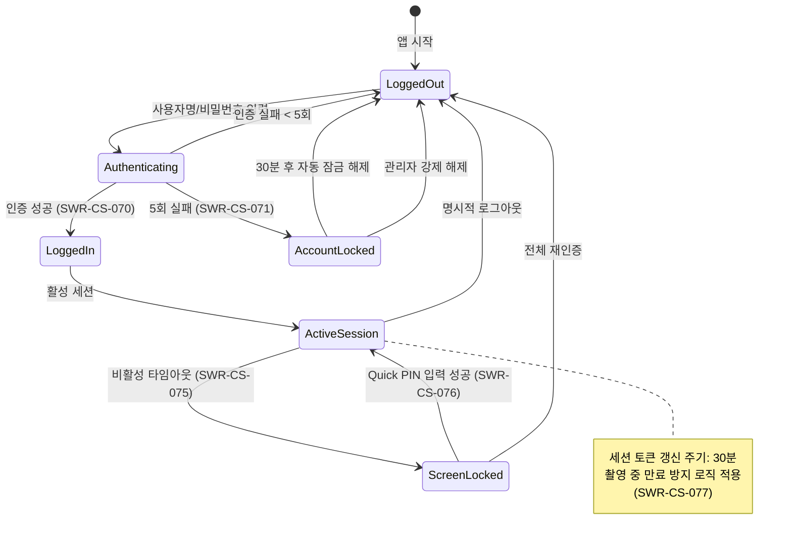
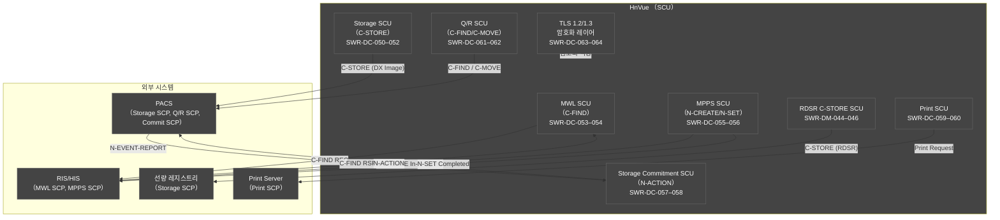
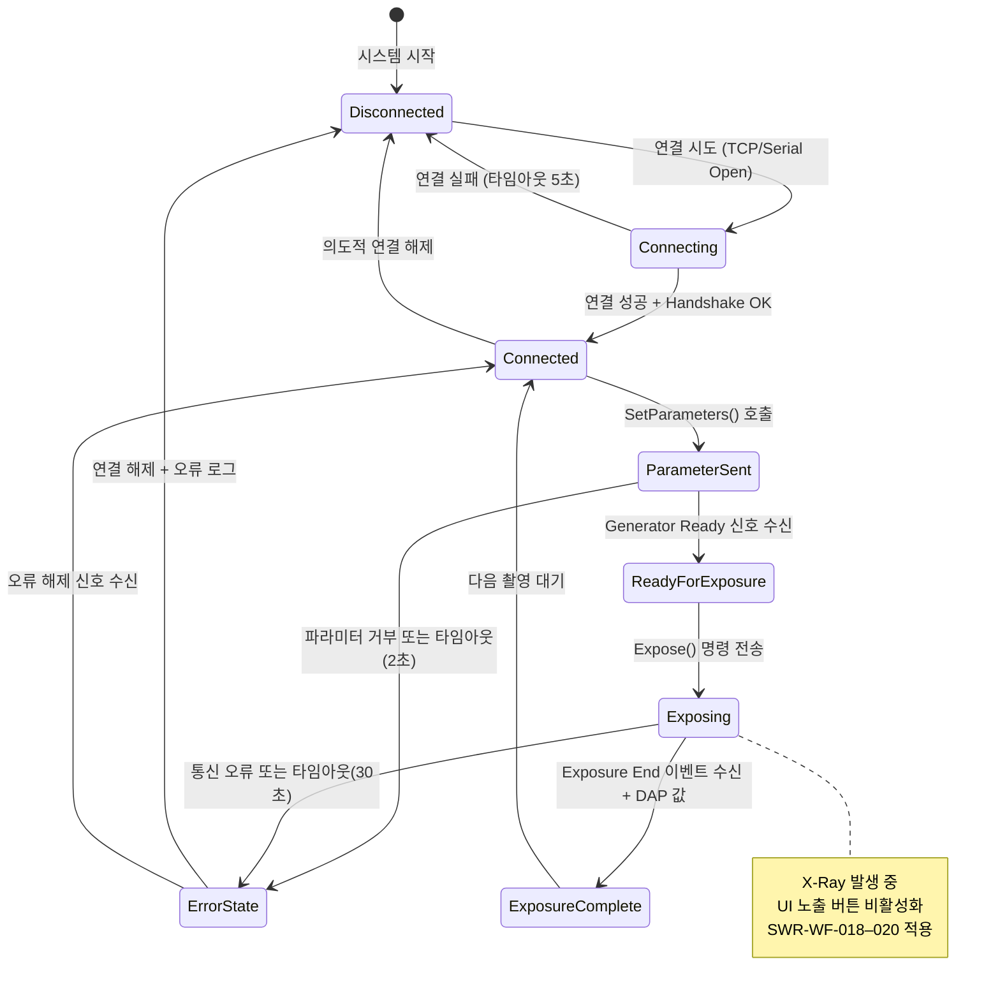
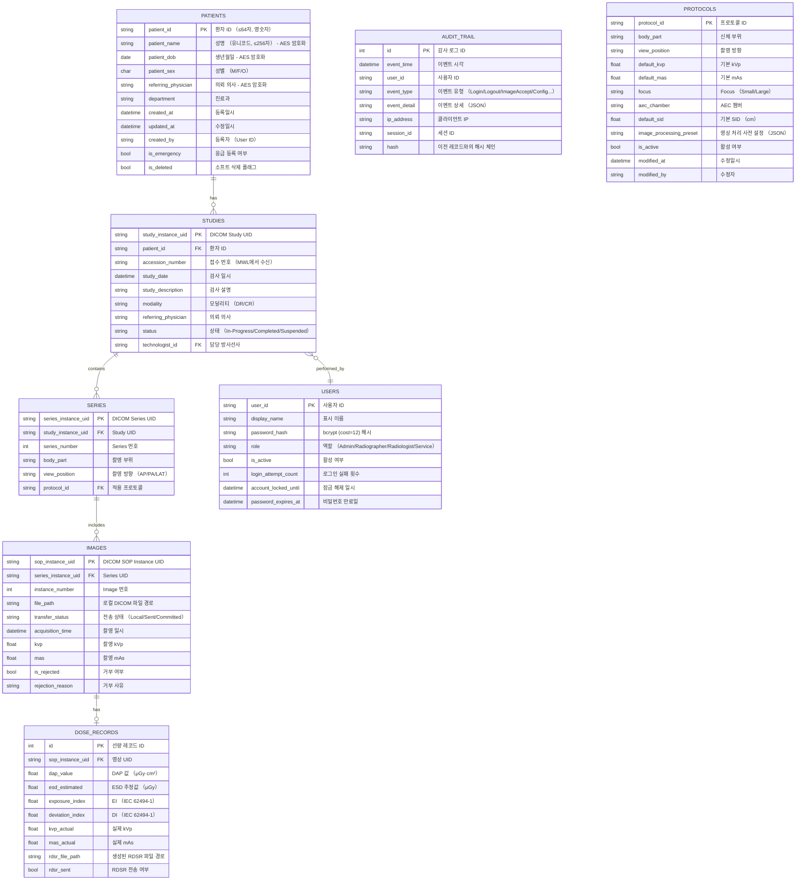
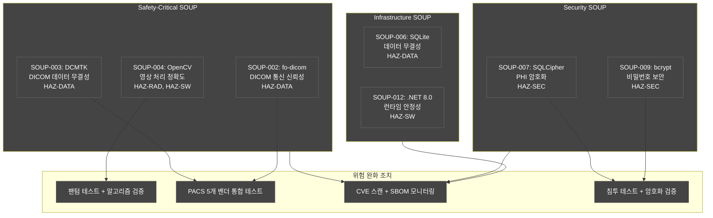
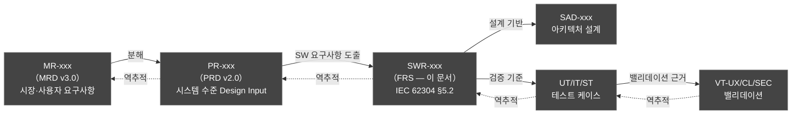

# HnVue Console SW
# Functional Requirements Specification (FRS)
# 기능 요구사항 명세서

---

| 항목 | 내용 |
|------|------|
| **문서 ID** | FRS-XRAY-GUI-001 |
| **버전** | v2.0 |
| **작성일** | 2026-04-02 |
| **개정일** | 2026-04-02 |
| **작성자** | SW 개발팀 |
| **승인자** | (승인 대기) |
| **상태** | Draft |
| **분류** | 내부 기밀 (Confidential) |
| **기준 규격** | IEC 62304:2006+A1:2015 §5.2, FDA 21 CFR 820.30(d), ISO 14971:2019 |
| **상위 문서** | PRD-XRAY-GUI-001 v2.0 |
| **DHF 참조** | DHF-XRAY-GUI-001 |

---

## 개정 이력 (Revision History)

| 버전 | 날짜 | 작성자 | 변경 내용 |
|------|------|--------|-----------|
| v0.1 | 2026-03-16 | SW 개발팀 | 초안 작성 — PRD v2.0 기반 SWR 분해 초안 |
| v1.0 | 2026-03-16 | SW 개발팀 | 최초 공식 릴리스 — 전 도메인 SWR 완성, 인터페이스/DB/SOUP 요구사항 추가 |
| v2.0 | 2026-04-02 | SW 개발팀 | MRD v3.0 4-Tier 우선순위 체계 반영 (P0/P1/P2 → Tier 1/2/3/4 전면 교체); MR-072 CD/DVD Burning 기능 요건 추가 (SWR-WF-032–034, PR-WF-019); 보완 3건 반영 — MR-037 인시던트 대응 (SWR-CS-086–087, PR-CS-077), MR-039 SW 업데이트 메커니즘 (SWR-SA-076–077/SWR-CS-084–085 보강, PR-CS-076/SA-067), MR-050 STRIDE 위협 모델링 (SWR-NF-RG-060 보강); 각 FR에 MR 추적 추가; 참조 문서 버전 업데이트 (MRD v3.0, PRD v2.0) |

---

## 목차

1. [개요 (Overview)](#1-개요)
2. [적용 범위 (Scope)](#2-적용-범위)
3. [참조 문서 (Referenced Documents)](#3-참조-문서)
4. [요구사항 ID 체계 (Requirement ID Schema)](#4-요구사항-id-체계)
5. [소프트웨어 요구사항 (Software Requirements)](#5-소프트웨어-요구사항)
   - [5.1 환자 관리 — SWR-PM](#51-환자-관리-patient-management--swr-pm)
   - [5.2 촬영 워크플로우 — SWR-WF](#52-촬영-워크플로우-acquisition-workflow--swr-wf)
   - [5.3 영상 표시/처리 — SWR-IP](#53-영상-표시처리-image-display--processing--swr-ip)
   - [5.4 선량 관리 — SWR-DM](#54-선량-관리-dose-management--swr-dm)
   - [5.5 DICOM/통신 — SWR-DC](#55-dicom통신-dicomcommunication--swr-dc)
   - [5.6 시스템 관리 — SWR-SA](#56-시스템-관리-system-administration--swr-sa)
   - [5.7 사이버보안 — SWR-CS](#57-사이버보안-cybersecurity--swr-cs)
6. [비기능 SW 요구사항 (Non-Functional Software Requirements)](#6-비기능-sw-요구사항)
7. [인터페이스 요구사항 상세 (Interface Requirements Detail)](#7-인터페이스-요구사항-상세)
8. [데이터베이스 요구사항 (Database Requirements)](#8-데이터베이스-요구사항)
9. [SOUP/OTS 요구사항 (SOUP/COTS Requirements)](#9-souports-요구사항)
10. [추적성 매트릭스 (PR → SWR 매핑 요약)](#10-추적성-매트릭스)
- [부록 A. 약어 및 용어 정의](#부록-a-약어-및-용어-정의)

---

## 1. 개요 (Overview)

### 1.1 목적 (Purpose)

본 문서는 **HnVue Console SW**의 **기능 요구사항 명세서 (Functional Requirements Specification, FRS)** 로서, IEC 62304:2006+A1:2015 §5.2 "소프트웨어 요구사항 분석 (Software Requirements Analysis)" 에서 요구하는 소프트웨어 요구사항 (Software Requirements, SWR)을 정의한다.

본 문서의 핵심 목적은 다음과 같다:

1. **PR → SWR 분해 (Decomposition)**: PRD-XRAY-GUI-001 v3.0에 정의된 시스템 수준 제품 요구사항 (PR-xxx)을 SW 구현 수준의 소프트웨어 요구사항 (SWR-xxx)으로 분해한다.
2. **IEC 62304 §5.2 준수**: 각 SWR은 소프트웨어 안전 분류 (Safety Classification), 검증 방법, 수용 기준을 포함하여 IEC 62304 Class B 요구사항을 충족한다.
3. **FDA Design Output 역할**: 본 문서의 모든 SWR은 FDA 21 CFR 820.30(d) **Design Output**으로 기능하며, 상위 PRD (Design Input)의 PR-xxx를 상세화한다.
4. **추적성 체인 기반 확립**: SWR-xxx는 이후 SAD (소프트웨어 아키텍처 설계), SDS (상세 설계), 단위 테스트 (Unit Test), 통합 테스트의 기준이 된다.

### 1.2 FRS의 위치 (Document Position in DHF)

```mermaid
flowchart LR
    MR["MR-xxx\n（MRD）\n시장·사용자 요구사항"]
    PR["PR-xxx\n（PRD v2.0）\n시스템 수준 Design Input\n21 CFR 820.30（c）"]
    SWR["SWR-xxx\n（FRS — 이 문서）\nIEC 62304 §5.2\nDesign Output\n21 CFR 820.30（d）"]
    SAD["SAD-xxx\n（소프트웨어 아키텍처）"]
    SDS["SDS-xxx\n（상세 설계）"]
    CODE["소스 코드\n（Implementation）"]
    UT["단위 테스트\n（Unit Test）"]
    IT["통합 테스트\n（Integration Test）"]

    MR -->|"분해"| PR
    PR -->|"SW 요구사항 도출"| SWR
    SWR -->|"아키텍처 기반"| SAD
    SAD -->|"설계 기반"| SDS
    SDS -->|"구현"| CODE
    CODE -->|"검증"| UT
    UT -->|"검증"| IT

    classDef default fill:#444,stroke:#666,color:#fff
    style SWR fill:#444,color:#fff
    style PR fill:#444,color:#fff
    style MR fill:#444,color:#fff
    style CODE fill:#444,color:#fff
```



---

## 2. 적용 범위 (Scope)

본 FRS는 **HnVue Phase 1 (v1.0)** 기능 범위에 해당하는 모든 소프트웨어 요구사항을 정의한다.

### Phase 1 포함 도메인 및 SWR 범위

| 도메인 | SWR 접두사 | 출처 PR 범위 | Phase |
|--------|-----------|-------------|-------|
| 환자 관리 (Patient Management) | SWR-PM | PR-PM-001–006 | 1 |
| 촬영 워크플로우 (Acquisition Workflow) | SWR-WF | PR-WF-010–019 | 1 (일부 v2.0 신규) |
| 영상 표시/처리 (Image Display & Processing) | SWR-IP | PR-IP-020–037 | 1 (일부 1.5) |
| 선량 관리 (Dose Management) | SWR-DM | PR-DM-040–046 | 1 (일부 1.5) |
| DICOM/통신 (DICOM/Communication) | SWR-DC | PR-DC-050–056 | 1 |
| 시스템 관리 (System Administration) | SWR-SA | PR-SA-060–067 | 1 |
| 사이버보안 (Cybersecurity) | SWR-CS | PR-CS-070–076 | 1 (일부 1.5) |
| 비기능 요구사항 (Non-Functional) | SWR-NF-xxx | PR-NF-PF/RL/UX/CP/SC/MT/RG | 1 |

**제외 범위**: Phase 2 AI 기능 (PR-AI-xxx), 클라우드 스토리지 직접 전송, 모바일 앱

---

## 3. 참조 문서 (Referenced Documents)

| 문서 ID | 문서명 | 버전 | 비고 |
|---------|--------|------|------|
| PRD-XRAY-GUI-001 | 제품 요구사항 문서 (Product Requirements Document) | v2.0 | 상위 Design Input |
| MRD-XRAY-001 | 시장 요구사항 문서 (Market Requirements Document) | v3.0 | 시장/사용자 요구 |
| IEC 62304:2006+A1:2015 | Medical Device Software — Software Life Cycle Processes | — | §5.2 적용 |
| IEC 62366-1:2015+A1:2020 | Usability Engineering | — | Use Specification |
| ISO 14971:2019 | Risk Management for Medical Devices | — | HAZ 참조 |
| FDA 21 CFR Part 820 | Quality System Regulation / Design Controls | — | Design Output |
| FDA Section 524B | Cybersecurity in Medical Devices | — | 사이버보안 |
| DICOM PS3.x 2023a | Digital Imaging and Communications in Medicine | 2023a | DICOM 서비스 |
| IHE Technical Framework | IHE Radiology Technical Framework | — | SWF Profile |
| IEC 62494-1:2022 | Exposure Index for DR | — | EI/DI 계산 |
| IEC 60601-2-54:2009 | X-Ray Equipment for Radiography | — | RDSR 요구사항 |

---

## 4. 요구사항 ID 체계 (Requirement ID Schema)

### 4.1 SWR ID 형식

```
SWR-[도메인]-[번호]

예시:
  SWR-PM-001    — 환자 관리 도메인, 001번
  SWR-WF-018    — 촬영 워크플로우 도메인, 018번
  SWR-NF-PF-001 — 비기능/성능 도메인, 001번
```

### 4.2 도메인 코드 정의

| 도메인 코드 | 도메인명 | SWR 번호 범위 |
|------------|---------|--------------|
| PM | Patient Management (환자 관리) | 001–099 |
| WF | Acquisition Workflow (촬영 워크플로우) | 010–099 |
| IP | Image Display & Processing (영상 처리) | 020–099 |
| DM | Dose Management (선량 관리) | 040–099 |
| DC | DICOM/Communication (DICOM/통신) | 050–099 |
| SA | System Administration (시스템 관리) | 060–099 |
| CS | Cybersecurity (사이버보안) | 070–099 |
| NF-PF | Non-Functional: Performance (성능) | 001–099 |
| NF-RL | Non-Functional: Reliability (신뢰성) | 010–099 |
| NF-UX | Non-Functional: Usability (사용성) | 020–099 |
| NF-CP | Non-Functional: Compatibility (호환성) | 030–099 |
| NF-SC | Non-Functional: Security (보안) | 040–099 |
| NF-MT | Non-Functional: Maintainability (유지보수성) | 050–099 |
| NF-RG | Non-Functional: Regulatory (규제 준수) | 060–099 |

### 4.3 SWR 테이블 컬럼 설명

| 컬럼 | 설명 |
|------|------|
| **SWR ID** | 소프트웨어 요구사항 고유 식별자 |
| **출처 PR** | 분해 원본 PRD 요구사항 ID |
| **MR 추적** | 상위 MRD v3.0 시장 요구사항 ID (v2.0 신규) |
| **요구사항명** | 간결한 기능/요구사항 명칭 |
| **상세 기술 사양** | SW 구현 수준의 상세 기능 기술 (How 수준) |
| **IEC 62304 분류** | Functional / Safety-related / Security-related |
| **수용 기준** | SWR 단위 Pass/Fail 기준 (정량적) |
| **검증 방법 (TIAD)** | T=Test / I=Inspection / A=Analysis / D=Demonstration |
| **검증 TC** | 단위/통합 테스트 케이스 ID |
| **위험 참조** | 관련 HAZ-xxx ID |

---

## 5. 소프트웨어 요구사항 (Software Requirements)

### 5.1 환자 관리 (Patient Management) — SWR-PM

#### PR-PM-001: 환자 수동 등록 → SWR-PM-001–004

| SWR ID | 출처 PR | 요구사항명 | 상세 기술 사양 | IEC 62304 분류 | 수용 기준 | 검증 방법(TIAD) | 검증 TC | 위험 참조 |
|--------|---------|-----------|--------------|----------------|----------|----------------|---------|----------|
| SWR-PM-001 | PR-PM-001 | 환자 등록 UI — 입력 필드 | 환자 등록 화면은 다음 입력 필드를 제공해야 한다: ① 환자 ID (Patient ID): 영숫자(a-z, A-Z, 0-9, 하이픈, 밑줄) ≤64자, 필수; ② 성명 (Patient Name): 유니코드 지원 ≤256자 (DICOM PN VR 형식: Last^First^Middle^Prefix^Suffix), 필수; ③ 생년월일 (DOB): YYYY-MM-DD 형식 달력 입력 위젯; ④ 성별 (Sex): M/F/O 라디오 버튼 또는 드롭다운, 필수; ⑤ 검사 의뢰 정보 (Referring Physician, Accession Number, Study Description): 선택 입력; ⑥ 검사 부위 (Body Part Examined): 드롭다운 선택. 모든 필드는 DICOM 데이터 딕셔너리 VR(Value Representation) 규칙을 준수해야 한다. | Functional | 6개 필수/선택 입력 필드가 UI에 정확히 렌더링됨; DICOM VR 위반 입력(예: 64자 초과 ID) 시 즉시 오류 표시 | T, I | UT-PM-001, IT-PM-001 | HAZ-DATA |
| SWR-PM-002 | PR-PM-001 | 필수 필드 유효성 검사 | 환자 등록 저장(Save) 버튼 클릭 시: ① 필수 필드(환자 ID, 성명, 성별) 중 하나라도 비어 있으면 저장 동작 차단 및 해당 필드를 적색(#FF3B30) 테두리로 하이라이트; ② 환자 ID 형식이 허용 문자 패턴(^[A-Za-z0-9_\\-]{1,64}$)에 맞지 않으면 인라인 오류 메시지 "환자 ID는 영숫자, 하이픈, 밑줄 1–64자만 허용됩니다" 표시; ③ 생년월일이 미래 날짜이면 경고 메시지 표시 후 저장 가능(차단 아님); ④ 성명 길이가 256자 초과 시 저장 차단. 유효성 검사는 저장 버튼 클릭 시점과 포커스 이탈(on-blur) 시점 모두 실행된다. | Functional | 필수 필드 미입력 시 저장 버튼 비활성화 또는 차단 확인; 오류 필드 적색 하이라이트 100% 표시 | T | UT-PM-002, IT-PM-002 | HAZ-DATA |
| SWR-PM-003 | PR-PM-001 | 중복 환자 ID 감지 | 저장 버튼 클릭 시 입력된 환자 ID를 로컬 SQLite DB의 `patients` 테이블에 대해 Case-Insensitive SELECT 쿼리로 중복 여부 확인. 중복 발견 시: ① "중복 환자 ID (Duplicate Patient ID): [ID값]이(가) 이미 등록되어 있습니다. 기존 환자 정보를 조회하시겠습니까?" 다이얼로그 표시; ② [기존 환자 조회 / 다른 ID 입력 / 저장 강제 진행] 3가지 선택지 제공; ③ "저장 강제 진행" 선택 시 Audit Trail에 중복 허용 사유 기록 필요 (코멘트 필드 표시). 중복 체크 DB 조회는 UI 스레드를 차단하지 않도록 비동기(async/await)로 실행. | Safety-related | 중복 ID 등록 시 100% 경고 다이얼로그 표시; 10,000건 DB에서 중복 체크 응답 ≤200ms | T, A | UT-PM-003, IT-PM-003 | HAZ-DATA |
| SWR-PM-004 | PR-PM-001 | 환자 등록 데이터 저장 | 유효성 검사 통과 후 환자 데이터를 SQLite(로컬) 또는 PostgreSQL(네트워크) DB에 ACID 트랜잭션으로 저장: ① BEGIN TRANSACTION → INSERT INTO patients → INSERT INTO studies (검사 의뢰 정보) → COMMIT; ② 트랜잭션 실패 시 ROLLBACK 후 사용자에게 오류 메시지 표시; ③ 저장 성공 시 새로 생성된 환자 레코드 PK(UUID v4)를 반환하여 이후 검사 생성에 사용; ④ DB 파일 저장 경로: `%ProgramData%\HnVue\Data\patients.db`; ⑤ 환자 등록 이벤트를 Audit Trail에 기록 (사용자 ID, 타임스탬프, 환자 ID). 저장 중 전원 차단 보호를 위해 WAL(Write-Ahead Logging) 모드 활성화. | Safety-related | 저장 완료 후 DB 조회 시 입력 데이터 100% 일치; WAL 활성화 확인; 트랜잭션 실패 시 ROLLBACK 확인 | T, I | UT-PM-004, IT-PM-004 | HAZ-DATA |

#### PR-PM-002: 환자 정보 조회·수정 → SWR-PM-010–013

| SWR ID | 출처 PR | 요구사항명 | 상세 기술 사양 | IEC 62304 분류 | 수용 기준 | 검증 방법(TIAD) | 검증 TC | 위험 참조 |
|--------|---------|-----------|--------------|----------------|----------|----------------|---------|----------|
| SWR-PM-010 | PR-PM-002 | 환자 정보 조회 화면 | 환자 목록에서 특정 환자를 선택하면 상세 정보 패널이 표시된다: ① 등록된 모든 필드 (환자 ID, 성명, DOB, 성별, 연락처, 검사 이력 요약); ② 해당 환자의 검사 목록 (Study List): 날짜, 검사 부위, 촬영 건수, DICOM 전송 상태 포함; ③ 조회는 읽기 전용(Read-Only) 모드로 기본 표시; ④ [수정 (Edit)] 버튼은 Radiographer 이상 역할(RBAC)에게만 활성화. | Functional | 환자 선택 후 ≤500ms 내 상세 정보 표시; Read-Only 기본 모드 확인 | T | UT-PM-010, IT-PM-010 | HAZ-DATA |
| SWR-PM-011 | PR-PM-002 | 환자 정보 수정 권한 검사 | [수정] 버튼 클릭 시 현재 로그인 사용자의 역할(Role)을 SecurityContext에서 조회. Radiographer, Admin 역할만 수정 가능. Radiologist 역할이 수정 시도 시 "권한 없음 (Access Denied): 환자 정보 수정 권한이 없습니다" 메시지 표시. 수정 세션 시작 시 편집 잠금(Edit Lock)을 DB에 기록하여 동시 편집 방지 (다른 사용자가 동일 환자 수정 시도 시 "다른 사용자가 편집 중입니다" 알림). | Safety-related | 권한 없는 역할의 수정 시도 100% 차단; 동시 편집 잠금 동작 확인 | T, I | UT-PM-011, IT-PM-011 | HAZ-DATA, HAZ-SEC |
| SWR-PM-012 | PR-PM-002 | 환자 정보 수정 저장 및 감사 기록 | 수정된 환자 정보 저장 시: ① 변경 전 값과 변경 후 값을 모두 Audit Trail 테이블에 기록 (변경 필드명, 이전값, 신값, 수정자 ID, 수정 일시 UTC); ② UPDATE 트랜잭션은 환자 ID를 제외한 모든 필드 수정 허용 (환자 ID 수정 불가, 변경 필요 시 삭제 후 재등록); ③ 수정 완료 후 "환자 정보가 성공적으로 업데이트되었습니다" Toast 메시지 표시; ④ 수정 취소 시 변경 사항 롤백 및 Lock 해제. | Safety-related | Audit Trail에 변경 전/후 값 모두 기록됨 확인; 환자 ID 수정 시도 시 차단 확인 | T, I | UT-PM-012, IT-PM-012 | HAZ-DATA, HAZ-SEC |
| SWR-PM-013 | PR-PM-002 | 환자 등록 상태 표시 | 환자 목록에서 각 환자 항목에 상태 배지(Badge) 표시: ① Active (녹색): 현재 검사 진행 중; ② Pending (황색): Worklist에서 가져왔으나 촬영 미시작; ③ Completed (회색): 모든 검사 완료 및 PACS 전송 완료; ④ Emergency (적색): 응급 등록 환자. 상태는 검사 워크플로우 이벤트 발생 시 자동 갱신 (이벤트 드리븐 업데이트). | Functional | 상태 배지 4가지 색상/레이블 정확히 표시; 워크플로우 이벤트에 따른 자동 갱신 확인 | T | UT-PM-013 | — |

#### PR-PM-003: DICOM MWL 자동 불러오기 → SWR-PM-020–024

| SWR ID | 출처 PR | 요구사항명 | 상세 기술 사양 | IEC 62304 분류 | 수용 기준 | 검증 방법(TIAD) | 검증 TC | 위험 참조 |
|--------|---------|-----------|--------------|----------------|----------|----------------|---------|----------|
| SWR-PM-020 | PR-PM-003 | MWL C-FIND 요청 생성 | RIS/HIS DICOM Worklist SCP에 C-FIND 요청 전송: ① Query Key: Scheduled Procedure Step Start Date (오늘 날짜 기본값, 범위 선택 가능), Modality = "DX" or "CR", Scheduled Station AE Title (설정 가능); ② Request Dataset 포함 필드: Patient Name (0010,0010), Patient ID (0010,0020), Accession Number (0008,0050), Requested Procedure Description (0032,1060), Scheduled Procedure Step Start Date/Time (0040,0001/0002), Modality (0008,0060), Scheduled Station AE Title (0040,0001); ③ fo-dicom 라이브러리의 `DicomCFindRequest` 클래스 사용; ④ DICOM AE Title, IP, Port는 시스템 설정(SWR-SA-065)에서 읽어온다. | Functional | C-FIND 요청 Dataset 필드 완전성 100%; fo-dicom API 정상 호출 확인 | T, I | UT-DC-053, IT-DC-053 | HAZ-DATA |
| SWR-PM-021 | PR-PM-003 | MWL 응답 파싱 및 목록 표시 | C-FIND 응답 Dataset 파싱 후 Worklist UI 컴포넌트에 바인딩: ① 응답 항목을 `WorklistItemModel` 객체로 매핑 (C# POCO); ② 표시 컬럼: 환자명, 환자 ID, 검사 부위, 검사 설명, 예약 시간, 의뢰 의사명; ③ 응답 ≤3초 이내에 목록 갱신 (타이머 측정); ④ 목록 정렬: 예약 시간 오름차순 기본; ⑤ MWL 결과는 로컬 메모리 캐시(5분 TTL)에 보관하여 재조회 시 즉시 표시. | Functional | C-FIND 성공 시 ≤3초 내 목록 렌더링; 100건 이상 응답 처리 시 UI Freeze 없음 | T, A | UT-PM-021, IT-PM-021 | HAZ-DATA |
| SWR-PM-022 | PR-PM-003 | MWL 자동 새로 고침 | Worklist는 설정 가능한 주기(기본값 5분, 범위 1–60분)로 자동 새로 고침. 자동 새로 고침 동작: ① Background 타이머 스레드에서 C-FIND 재실행; ② 촬영 중인 검사(Exposing 상태)에서는 자동 갱신이 현재 검사를 간섭하지 않음; ③ 새로 추가된 항목은 목록 상단에 신규 배지(New) 표시; ④ [새로 고침 (Refresh)] 버튼으로 수동 즉시 갱신 가능. | Functional | 설정 주기마다 C-FIND 자동 실행 확인; 촬영 중 자동 갱신 간섭 없음 확인 | T | UT-PM-022 | — |
| SWR-PM-023 | PR-PM-003 | MWL 연결 실패 처리 | C-FIND 요청 실패(Connection Timeout, DICOM DIMSE 오류, 네트워크 단절) 시: ① 상태 바에 "Worklist 서버 연결 실패 (Connection Failed): [오류 코드]" 경고 표시; ② Toast 알림으로 사용자에게 통지; ③ 수동 입력(환자 직접 등록) 버튼 강조 표시로 대체 경로 제공; ④ 연결 재시도: 30초 간격 자동 재시도 최대 3회; ⑤ 3회 실패 시 IT 담당자 연락 안내 메시지. Connection Timeout은 설정 가능(기본값 10초). | Safety-related | 연결 실패 시 100% 오류 메시지 표시; 수동 입력 경로 정상 동작 확인 | T, D | UT-PM-023, IT-PM-023 | HAZ-DATA |
| SWR-PM-024 | PR-PM-003 | MWL 항목 선택 및 검사 시작 | 방사선사가 Worklist 항목을 더블클릭하거나 [검사 시작 (Start Exam)] 버튼 클릭 시: ① 선택된 항목의 데이터를 현재 활성 환자/검사 컨텍스트로 설정; ② 환자 정보가 로컬 DB에 없으면 MWL 데이터를 기반으로 자동 환자 레코드 생성 (SWR-PM-004 재사용); ③ DICOM MPPS In-Progress 메시지 전송 (SWR-DC-055 연동); ④ 촬영 프로토콜 선택 화면으로 자동 전환. | Functional | MWL 선택에서 프로토콜 화면 전환까지 ≤1초; MPPS In-Progress 전송 확인 | T, D | UT-PM-024, IT-PM-024 | HAZ-DATA |

#### PR-PM-004: 응급 환자 빠른 등록 → SWR-PM-030–033

| SWR ID | 출처 PR | 요구사항명 | 상세 기술 사양 | IEC 62304 분류 | 수용 기준 | 검증 방법(TIAD) | 검증 TC | 위험 참조 |
|--------|---------|-----------|--------------|----------------|----------|----------------|---------|----------|
| SWR-PM-030 | PR-PM-004 | 응급 등록 버튼 및 진입 | 응급 등록 (Emergency Registration) 버튼은 메인 화면 상단 툴바에 상시 표시 (적색 배경, "EMRG" 레이블). 버튼 특성: ① 모든 화면 상태에서 접근 가능 (2회 터치 이내, PR-NF-UX-026 준수); ② 촬영 중(Exposing) 상태에서도 접근 가능하나, 진입 시 현재 검사 Suspend 여부 확인 다이얼로그 표시; ③ 버튼 크기 최소 60×60px (터치 타겟 PR-NF-UX-022 초과). | Safety-related | 모든 화면에서 버튼 접근 가능 확인; 터치 2회 이내 응급 등록 화면 진입 | T, D | UT-PM-030, IT-PM-030 | HAZ-RAD |
| SWR-PM-031 | PR-PM-004 | 응급 환자 자동 ID 생성 | 응급 등록 화면 표시 즉시 임시 환자 ID 자동 생성: ① 형식: "EMG-YYYYMMDD-HHMMSS-NNN" (예: EMG-20260316-143055-001); ② 오늘 날짜 기준 일련번호(NNN)는 DB에서 atomically 발급; ③ 성별(M/F/O) 및 나이 추정(10대, 20대, … 60대 이상 드롭다운)만 필수 입력; ④ 화면 진입에서 촬영 준비 완료까지 ≤30초(PR-PM-004 수용 기준). | Safety-related | 응급 ID 자동 생성 확인; 진입 30초 이내 촬영 준비 상태 달성 확인 | T, D | UT-PM-031, IT-PM-031 | HAZ-RAD, HAZ-DATA |
| SWR-PM-032 | PR-PM-004 | 응급 검사 Trauma 프로토콜 자동 로드 | 응급 등록 완료 즉시 Trauma 기본 프로토콜(다중 부위 세트: Chest PA, Pelvis AP, Spine Lateral)을 자동으로 촬영 순서 목록에 로드. 사용자는 즉시 촬영 시작 가능. Trauma 프로토콜은 SWR-SA-063(Organ Program 편집기)에서 커스터마이징 가능. | Safety-related | 응급 등록 완료 후 ≤3초 내 Trauma 프로토콜 로드; 촬영 버튼 즉시 활성화 확인 | T, D | UT-PM-032 | HAZ-RAD |
| SWR-PM-033 | PR-PM-004 | 응급 환자 정보 사후 보완 | 응급 촬영 완료 후 또는 이후 시점에 응급 환자 레코드에 정식 환자 정보(실명, 정식 환자 ID, 정확한 생년월일)를 업데이트하는 기능: ① [환자 정보 업데이트] 버튼을 통해 SWR-PM-012(환자 수정) 플로우 연동; ② 정식 환자 ID로 업데이트 시 기존 영상에 연결된 DICOM 태그(Patient ID, Patient Name)도 일괄 업데이트; ③ 변경 이력 Audit Trail 자동 기록; ④ 미보완 응급 레코드는 검사 목록에서 주황색으로 표시. | Safety-related | 정보 업데이트 후 DICOM 태그 일괄 변경 확인; 미보완 레코드 시각적 구분 확인 | T, I | UT-PM-033, IT-PM-033 | HAZ-DATA |

#### PR-PM-005: 환자 검색 → SWR-PM-040–043

| SWR ID | 출처 PR | 요구사항명 | 상세 기술 사양 | IEC 62304 분류 | 수용 기준 | 검증 방법(TIAD) | 검증 TC | 위험 참조 |
|--------|---------|-----------|--------------|----------------|----------|----------------|---------|----------|
| SWR-PM-040 | PR-PM-005 | 환자 검색 UI | 환자 검색 패널은 다음 검색 조건을 제공: ① 환자 ID (부분 일치, LIKE '%input%'); ② 환자 성명 (부분 일치, 유니코드 지원); ③ 검사 날짜 범위 (DatePicker, 시작일~종료일); ④ 검사 상태 필터 (All / Active / Completed / Emergency). 검색 실행은 [검색] 버튼 또는 Enter 키로 트리거. 검색 결과는 가상화 리스트뷰 (VirtualizingStackPanel)로 표시하여 대용량 결과도 UI Freeze 없이 렌더링. | Functional | 4가지 검색 조건 UI 정상 표시; Enter 키 검색 동작 확인 | T, I | UT-PM-040 | — |
| SWR-PM-041 | PR-PM-005 | 환자 검색 쿼리 실행 | 검색 조건에 따라 SQLite DB에 Parameterized Query 실행: ① SQL Injection 방지를 위해 `?` 바인딩 파라미터 사용 (절대 String Concatenation 금지); ② 검색 인덱스: `patient_id`, `patient_name` 컬럼에 BTREE 인덱스 생성; ③ 날짜 범위 쿼리는 인덱스된 `study_date` 컬럼 활용; ④ 검색 결과 최대 1,000건 표시 (초과 시 안내 메시지 "검색 결과가 1,000건을 초과합니다. 조건을 좁혀주세요"); ⑤ 응답 시간 ≤500ms (10,000건 DB, PR-PM-005 수용 기준). | Functional | Parameterized Query 사용 확인; 10,000건 DB에서 ≤500ms 응답; SQL Injection 시도 차단 | T, A | UT-PM-041, IT-PM-041 | — |
| SWR-PM-042 | PR-PM-005 | 검색 결과 표시 및 선택 | 검색 결과 목록 각 항목: ① 환자 ID, 성명, 생년월일, 성별, 최근 검사 날짜, 검사 건수 표시; ② 항목 클릭 시 상세 정보 패널 표시 (SWR-PM-010 연동); ③ 항목 더블클릭 시 검사 컨텍스트 설정 및 촬영 준비 화면으로 전환; ④ 검색 결과 없음(0건) 시 "검색 결과가 없습니다. 신규 등록하시겠습니까?" 메시지와 [신규 등록] 버튼 표시. | Functional | 검색 결과 표시 정확도 100%; 0건 시 신규 등록 경로 표시 확인 | T | UT-PM-042 | — |
| SWR-PM-043 | PR-PM-005 | 최근 검사 환자 빠른 접근 | 메인 화면에 최근 검사 환자 목록(Recent Patients) 표시: ① 최근 검사 순으로 최대 10명; ② 각 항목에 환자명, 마지막 검사 날짜, 검사 상태 표시; ③ 메모리 캐시로 관리, 앱 시작 시 DB에서 로드. | Functional | 최근 10명 목록 정확히 표시; 앱 시작 시 ≤500ms 내 로드 | T | UT-PM-043 | — |

#### PR-PM-006: 환자 삭제 → SWR-PM-050–053

| SWR ID | 출처 PR | 요구사항명 | 상세 기술 사양 | IEC 62304 분류 | 수용 기준 | 검증 방법(TIAD) | 검증 TC | 위험 참조 |
|--------|---------|-----------|--------------|----------------|----------|----------------|---------|----------|
| SWR-PM-050 | PR-PM-006 | 환자 삭제 권한 및 접근 | 환자 삭제 기능은 **Admin 역할** 전용. Radiographer/Radiologist/Service 역할에는 삭제 버튼 자체를 비활성화(Disabled) 처리. 삭제 버튼은 환자 상세 화면의 [더보기 (⋮)] 메뉴 하위에 배치하여 우발적 클릭 방지. | Safety-related | Admin 외 역할에서 삭제 버튼 비활성화 100% 확인 | T, I | UT-PM-050 | HAZ-DATA, HAZ-SEC |
| SWR-PM-051 | PR-PM-006 | 환자 삭제 확인 다이얼로그 | 삭제 버튼 클릭 시 다음 정보를 포함한 확인 다이얼로그 표시: ① "다음 환자를 삭제하시겠습니까? 이 작업은 되돌릴 수 없습니다."; ② 환자 ID, 성명, 연결된 검사 건수, DICOM 파일 수 표시; ③ DICOM 파일 처리 정책 선택 라디오 버튼: [로컬 파일 삭제 / 아카이브 후 삭제 / PACS에만 보관]; ④ [삭제 확인 / 취소] 버튼. [삭제 확인] 버튼은 텍스트 입력("DELETE" 타이핑) 후 활성화. | Safety-related | 텍스트 입력 없이 삭제 불가 확인; DICOM 처리 정책 3가지 표시 확인 | T | UT-PM-051 | HAZ-DATA, HAZ-SEC |
| SWR-PM-052 | PR-PM-006 | 환자 삭제 실행 및 감사 기록 | 삭제 실행: ① BEGIN TRANSACTION → DELETE FROM patients → DELETE FROM studies → DELETE FROM images (DICOM 정책에 따라) → COMMIT; ② 선택한 DICOM 처리 정책에 따른 파일 처리 (물리적 삭제 또는 아카이브 폴더 이동); ③ Audit Trail에 삭제 기록: 삭제자 ID, 타임스탬프, 삭제된 환자 ID/성명, DICOM 처리 방식, 사유(선택 코멘트); ④ GDPR/개인정보보호법 준수 근거로 삭제 기록은 30년간 별도 아카이브 테이블에 보관(물리적 삭제 불가). | Safety-related | 삭제 후 DB에서 환자 레코드 존재 확인 불가; Audit Trail 기록 100% | T, I | UT-PM-052, IT-PM-052 | HAZ-DATA, HAZ-SEC |
| SWR-PM-053 | PR-PM-006 | 삭제 불가 조건 처리 | 다음 조건에서 삭제를 차단하고 이유 메시지 표시: ① 현재 촬영 진행 중인 환자 (Active 상태): "촬영 중인 환자는 삭제할 수 없습니다"; ② DICOM Storage Commitment 미확인 영상이 있는 경우: "PACS에 전송 미확인 영상이 있습니다. 전송 확인 후 삭제하세요". | Safety-related | 진행 중 환자 삭제 시도 시 100% 차단; 차단 사유 메시지 표시 확인 | T | UT-PM-053 | HAZ-DATA |

---

### 5.2 촬영 워크플로우 (Acquisition Workflow) — SWR-WF

#### PR-WF-010: APR 프로토콜 관리 → SWR-WF-010–012

| SWR ID | 출처 PR | 요구사항명 | 상세 기술 사양 | IEC 62304 분류 | 수용 기준 | 검증 방법(TIAD) | 검증 TC | 위험 참조 |
|--------|---------|-----------|--------------|----------------|----------|----------------|---------|----------|
| SWR-WF-010 | PR-WF-010 | APR 프로토콜 데이터 구조 | APR (Anatomical Programmed Radiography) 프로토콜은 계층 구조로 관리: Level 1: 신체 부위 그룹 (예: Chest, Abdomen, Extremity); Level 2: 검사 부위 (예: Chest PA, Chest Lateral, Spine AP); Level 3: Projection 파라미터 세트. 각 Projection 파라미터: ① kVp (킬로볼트피크): 40–150kVp, 1kVp 단위; ② mAs (밀리암페어초): 0.1–500mAs, 0.1mAs 단위 (또는 mA + 초 분리 입력); ③ Focus 크기: Large / Small; ④ Grid 사용 여부: Yes/No; ⑤ AEC 모드: Off / Left / Center / Right / All; ⑥ SID (Source-Image Distance): 100–200cm; ⑦ 영상 처리 프리셋 참조 ID (Noise, Edge Enhancement, W/L 기본값). 프로토콜 데이터는 XML 직렬화 파일 및 SQLite DB 이중 저장. | Safety-related | 프로토콜 계층 구조 정확히 저장/로드; XML 파일과 DB 간 데이터 일치 확인 | T, I | UT-WF-010, IT-WF-010 | HAZ-RAD |
| SWR-WF-011 | PR-WF-010 | 프로토콜 선택 및 자동 적용 | 방사선사가 APR 트리에서 Projection을 선택 시: ① 해당 Projection의 kVp, mAs, AEC 설정값을 촬영 제어 패널에 즉시 표시; ② `IGeneratorService.SetParameters(kvp, mas, focus, aec)` 호출로 Generator에 파라미터 전송; ③ `IDetectorService.ConfigureAcquisition(sid, aec)` 호출로 Detector 설정 구성; ④ 전송 성공 응답 수신 후 파라미터 표시 색상 변경 (회색 → 녹색); ⑤ 전체 파라미터 적용 시간 ≤1초 (PR-WF-010 수용 기준). | Safety-related | 프로토콜 선택 후 ≤1초 내 Generator/Detector 파라미터 적용 확인; 적용 실패 시 오류 표시 확인 | T, D | UT-WF-011, IT-WF-011 | HAZ-RAD |
| SWR-WF-012 | PR-WF-010 | 프로토콜 기반 DICOM 태그 자동 설정 | 프로토콜 선택 시 해당 DICOM Series 메타데이터 자동 설정: ① Body Part Examined (0018,0015); ② View Position (0018,5101): AP/PA/LAT/OBLIQUE; ③ Protocol Name (0018,1030): 선택된 프로토콜명; ④ Requested Procedure Code Sequence (0032,1064); ⑤ Series Description (0008,103E). 이 태그들은 DICOM 파일 생성 시 자동 포함되어 PACS 검색 및 분류에 활용. | Functional | DICOM 파일의 메타데이터 태그 자동 설정 확인; fo-dicom DICOM File 검증 통과 | T, I | UT-WF-012, IT-WF-012 | — |

#### PR-WF-011: 촬영 순서 설정·변경 → SWR-WF-013–014

| SWR ID | 출처 PR | 요구사항명 | 상세 기술 사양 | IEC 62304 분류 | 수용 기준 | 검증 방법(TIAD) | 검증 TC | 위험 참조 |
|--------|---------|-----------|--------------|----------------|----------|----------------|---------|----------|
| SWR-WF-013 | PR-WF-011 | 촬영 순서 드래그&드롭 재정렬 | 좌측 View List 패널에서 Projection 항목을 드래그&드롭으로 재정렬: ① ItemsControl에 DragDrop 이벤트 핸들러 구현 (WPF DragDrop.DoDragDrop); ② 터치스크린 지원: TouchDelta 이벤트 기반 드래그; ③ 재정렬 후 즉각적인 시각적 반영 (Transition 애니메이션 150ms); ④ 재정렬 시 순서 번호(#1, #2, …) 자동 업데이트; ⑤ 항목 추가/삭제 버튼도 제공. | Functional | 드래그&드롭 재정렬 동작 확인; 터치 드래그 정상 동작; 순서 번호 자동 갱신 확인 | T, D | UT-WF-013 | HAZ-DATA |
| SWR-WF-014 | PR-WF-011 | 촬영 순서의 DICOM Instance Number 반영 | 촬영 순서는 DICOM Series/Instance 생성 시 Instance Number (0020,0013) 및 Image Comments (0020,4000)에 반영: ① 드래그&드롭 후 변경된 순서가 DICOM 파일의 Instance Number에 정확히 기록; ② MPPS (Modality Performed Procedure Step)에 촬영 완료된 순서 정보 포함 (Performed Series Sequence). | Functional | DICOM 파일 Instance Number와 UI 순서 100% 일치 확인 | T, I | UT-WF-014, IT-WF-014 | HAZ-DATA |

#### PR-WF-012: 촬영 조건 설정 → SWR-WF-015–017

| SWR ID | 출처 PR | 요구사항명 | 상세 기술 사양 | IEC 62304 분류 | 수용 기준 | 검증 방법(TIAD) | 검증 TC | 위험 참조 |
|--------|---------|-----------|--------------|----------------|----------|----------------|---------|----------|
| SWR-WF-015 | PR-WF-012 | 촬영 조건 수동 입력 UI | 촬영 제어 패널에서 직접 파라미터 수동 입력: ① kVp 스피너: 40–150, 1단위, NumericUpDown 컨트롤; ② mAs 모드 선택: [mAs 직접 입력] 또는 [mA + 시간 분리 입력]; ③ AEC 챔버 선택: 아이콘형 버튼 그룹 (Left/Center/Right/All/Off); ④ Focus 토글: Large(대초점) / Small(소초점); ⑤ SID 입력: 100–200cm 슬라이더 + 숫자 입력; ⑥ 자동완성: APR 프로토콜 선택값이 기본값으로 사전 입력. 각 컨트롤 타겟 크기 ≥44×44px. | Safety-related | 6가지 파라미터 입력 컨트롤 정상 렌더링; 터치 타겟 크기 기준 충족 확인 | T, I | UT-WF-015 | HAZ-RAD |
| SWR-WF-016 | PR-WF-012 | 촬영 파라미터 범위 검증 및 경고 | 사용자가 파라미터를 입력하거나 포커스 이탈 시 즉시 범위 검증: ① kVp 범위 위반 (< 40 또는 > 150): 적색 테두리 + "kVp는 40–150 범위여야 합니다" 인라인 오류; ② mAs 범위 위반 (< 0.1 또는 > 500): 동일 오류 처리; ③ kVp × mAs 조합이 Generator 최대 출력(kW) 초과 시 황색 경고 "Generator 최대 출력 [X]kW 초과 가능성"; ④ 범위 위반 상태에서 촬영 버튼 비활성화; ⑤ APR 기준값 대비 ±20% 이상 이탈 시 황색 경고 "프로토콜 기준값과 크게 다릅니다 (기준: kVp [X], mAs [Y])". | Safety-related | 범위 위반 입력 시 즉시 오류 표시; 범위 위반 시 촬영 버튼 100% 비활성화 | T | UT-WF-016, IT-WF-016 | HAZ-RAD |
| SWR-WF-017 | PR-WF-012 | 파라미터 Generator 전송 확인 | 촬영 버튼 누름 전 파라미터 전송 상태 확인: ① `IGeneratorService.SetParameters()` 반환값에서 Generator ACK(Acknowledge) 확인; ② ACK 수신 실패 시 "Generator 설정 전송 실패: [오류 코드]" 경고 및 촬영 중단; ③ 전송 성공 확인 후에만 촬영 버튼 활성화; ④ 파라미터 변경 후 미전송 상태(Pending)를 UI 인디케이터로 표시 (노란색 점등). | Safety-related | Generator ACK 미수신 시 촬영 버튼 비활성화 100% 확인; ACK 수신 후 활성화 확인 | T, A | UT-WF-017, IT-WF-017 | HAZ-RAD |

#### PR-WF-013: Generator 통신 및 제어 → SWR-WF-018–020

| SWR ID | 출처 PR | 요구사항명 | 상세 기술 사양 | IEC 62304 분류 | 수용 기준 | 검증 방법(TIAD) | 검증 TC | 위험 참조 |
|--------|---------|-----------|--------------|----------------|----------|----------------|---------|----------|
| SWR-WF-018 | PR-WF-013 | Generator HAL 인터페이스 구현 | Hardware Abstraction Layer (HAL)에서 Generator 통신 추상화: ① C# Interface `IGeneratorService` 정의: `Task<bool> SetParametersAsync(GeneratorParams params)`, `Task<ExposureResult> ExposeAsync()`, `Task<GeneratorStatus> GetStatusAsync()`, `event EventHandler<ExposureCompleteEventArgs> ExposureCompleted`; ② 벤더별 구현 클래스: `ShinvaGeneratorAdapter`, `EcoRayGeneratorAdapter` (Plugin 아키텍처); ③ 통신 프로토콜: Ethernet TCP/IP (기본) 또는 RS-232/RS-485 (레거시 지원); ④ 연결 설정: IP, Port, Timeout, 프로토콜 선택은 XML 설정 파일에서 로드. | Functional | HAL 인터페이스 정상 구현 확인; 벤더 어댑터 플러그인 로드 확인 | T, I | UT-WF-018 | HAZ-RAD, HAZ-SW |
| SWR-WF-019 | PR-WF-013 | 노출 명령 및 응답 처리 | 노출 실행 시퀀스: ① `ExposeAsync()` 호출 후 ≤200ms 내 Generator Ready 확인 (PR-WF-013 수용 기준); ② 타임아웃(200ms) 초과 시 `ExposureTimeoutException` 발생 → "Generator 응답 없음 (Timeout): 촬영이 중단되었습니다" 오류 팝업; ③ 노출 진행 중 UI: [촬영 중 (X-Ray Exposing)] 오버레이 표시, 키보드/마우스 입력 잠금 (안전); ④ 노출 완료 이벤트(`ExposureCompleted`) 수신 시 DAP 값, 실제 kVp/mAs 값을 이벤트 데이터에서 추출하여 선량 모듈에 전달. | Safety-related | ≤200ms 이내 Generator Ready 응답 확인; 노출 중 UI 잠금 동작 확인; 타임아웃 시 오류 표시 확인 | T, A | UT-WF-019, IT-WF-019 | HAZ-RAD, HAZ-SW |
| SWR-WF-020 | PR-WF-013 | Generator 오류 코드 처리 | Generator로부터 오류 코드 수신 시 처리 매핑 테이블: ① FILAMENT_ERROR (필라멘트 오류) → 즉시 촬영 중단 + "Generator 필라멘트 오류: 서비스 엔지니어에게 문의하세요" Critical 알림; ② KVP_OUT_OF_RANGE → 재설정 유도 알림; ③ OVERHEATING → 10분 쿨다운 대기 안내; ④ 그 외 알 수 없는 오류 → 오류 코드 + 원시 메시지 표시 + 시스템 로그 기록. 모든 Generator 오류는 Error Level로 로그 파일에 기록. | Safety-related | 각 오류 코드별 정확한 알림 메시지 표시; 모든 오류 로그 기록 확인 | T | UT-WF-020 | HAZ-RAD, HAZ-SW |


#### GENERATOR-001 보강: Generator RS-232/Ethernet 인터페이스 및 APR 제어 → SWR-GEN-001–005

> 참조: GENERATOR-001 §2, §5, §6, §7, §8, §9

| SWR ID | MR 추적 | 요구사항명 | 상세 기술 사양 | IEC 62304 분류 | 수용 기준 | Tier | 검증 방법(TIAD) | 검증 TC | 위험 참조 |
|--------|---------|-----------|--------------|----------------|----------|------|----------------|---------|----------|
| SWR-GEN-001 | MR-GEN-001 | Generator RS-232/Ethernet 인터페이스 자동 감지 | 시스템 시작 시 사용 가능한 COM 포트 목록을 자동 열거하고 Generator 응답 여부를 탐지: ① SerialPort.GetPortNames()로 COM 포트 목록 획득; ② 각 포트에 GET_STATUS 전송 후 ACK 수신 여부로 Generator 존재 확인; ③ Ethernet 옵션: TCP/IP 소켓 연결 시도+PING 응답 확인; ④ 감지된 인터페이스 유형+포트 정보를 설정 DB에 저장; ⑤ 자동 감지 실패 시 수동 선택 UI 제공. 지원 Baud Rate: 9,600–115,200 bps(9600/19200/38400/57600/115200). | Functional | RS-232 자동 감지 성공 확인; 포트 정보 DB 저장 확인; 감지 실패 시 수동 선택 UI 표시 확인 | Tier 2 | T, D | UT-GEN-001, IT-GEN-001 | HAZ-RAD, HAZ-SW |
| SWR-GEN-002 | MR-GEN-002 | APR 프리셋 50개 이상 저장/로딩 | Console 로컬 DB에 APR 프리셋을 JSON 형식으로 관리: ① 최소 50개 프리셋 저장 지원+Generator 내부 메모리와 이중화; ② APR 데이터 구조: apr_id(0–99), body_part, projection, kvp, mas/null, aec_enabled, aec_field[], aec_density(-2–+2), focal_spot; ③ APR 선택 시 LOAD_APR <id> 명령 전송 후 ACK 확인; ④ 프리셋 편집 UI: 신규 추가+수정+삭제+XML Export/Import; ⑤ Generator 교체+펌웨어 업데이트 후 재동기화 기능 제공. GENERATOR-001 §6.2, §6.4 참조. | Safety-related | 50개 이상 프리셋 저장+로딩 확인; LOAD_APR ACK 확인; APR 편집 UI 동작 확인 | Tier 2 | T, D | UT-GEN-002, IT-GEN-002 | HAZ-RAD |
| SWR-GEN-003 | MR-GEN-003 | AEC 필드 선택＋Left/Center/Right 조합 | AEC 이온화 챔버 3개 필드를 독립적으로 선택 가능: ① AEC_FIELD <1|2|3> 명령으로 Left/Center/Right 단일 또는 조합 선택; ② 조합 예시: AEC_FIELD 2 3 → Center+Right 동시 선택; ③ 해부학적 부위별 권장 필드 자동 적용+APR 연동; ④ AEC_DENSITY <-2..+2> 밀도 보정 스텝 제공; ⑤ AEC 비활성화 시 Manual 모드로 전환하여 mAs 직접 입력. GENERATOR-001 §5.1–§5.3 참조. | Safety-related | 단일+조합 필드 선택 후 Generator ACK 확인; APR 연동 자동 적용 확인 | Tier 2 | T | UT-GEN-003 | HAZ-RAD |
| SWR-GEN-004 | MR-GEN-004 | Tube Heat Unit 실시간 모니터링 및 과열 경고 | X선 튜브 열부하를 실시간 모니터링: ① 촬영 간격마다 GET_HEAT_UNITS 명령 전송+HEAT_UNITS <value> 응답 수신; ② UI 상태 바에 Heat Unit 퍼센트 표시+색상 구분: 녹색(0–70%), 황색(70–90%), 적색(90–100%); ③ 80% 초과 시 경고 토스트 메시지 표시; ④ 90% 초과 시 촬영 버튼 비활성화+"튜브 과열 경고: 냉각 후 촬영하십시오" 팝업; ⑤ E36 에러 코드 수신 시 즉각적인 UI 반영. GENERATOR-001 §3.2.5 참조. | Safety-related | Heat Unit 실시간 표시 확인; 80%/90% 임계값 경고 동작 확인; 촬영 버튼 비활성화 확인 | Tier 2 | T, A | UT-GEN-004, IT-GEN-004 | HAZ-RAD |
| SWR-GEN-005 | MR-GEN-005 | Generator 에러 코드 수신 및 한글 메시지 표시 | Generator로부터 ERROR 응답 수신 시 한글 UI 메시지로 변환+표시: ① E09(Generator Overload) → "Generator 과부하입니다. 30분 냉각 후 재시도하십시오." + 냉각 타이머; ② E12(No mA) → "촬영 중 mA 신호가 감지되지 않았습니다. AEC 설정을 확인하십시오."; ③ E33(Serial Comm Error) → "Generator 직렬 통신 오류입니다. 케이블 연결을 확인하십시오."; ④ E36(Heat Units) → "X선 튜브 과열 경고입니다. 냉각 후 재시도하십시오."; ⑤ E93(Internal Error) → "Generator 내부 오류입니다. 서비스 엔지니어에게 문의하십시오."; ⑥ 모든 에러 이벤트 Error Level 로그 기록. SDS §14.9 에러 코드 매핑 테이블 참조. | Safety-related | 각 에러 코드별 한글 메시지 정확 표시; 로그 기록 100%; 냉각 타이머 동작 확인 | Tier 1 | T | UT-GEN-005 | HAZ-RAD, HAZ-SW |

#### PR-WF-014: Detector 상태 모니터링 → SWR-WF-021–022

| SWR ID | 출처 PR | 요구사항명 | 상세 기술 사양 | IEC 62304 분류 | 수용 기준 | 검증 방법(TIAD) | 검증 TC | 위험 참조 |
|--------|---------|-----------|--------------|----------------|----------|----------------|---------|----------|
| SWR-WF-021 | PR-WF-014 | Detector 상태 폴링 및 UI 업데이트 | Detector 상태는 100ms 주기 폴링으로 실시간 모니터링: ① `IDetectorService.GetStatusAsync()` 비동기 폴링; ② 상태 변경 감지 시 ≤1초 내 GUI 업데이트 (상태 변경 이벤트 기반); ③ 표시 항목: 연결 상태(Connected/Disconnected 녹색/적색), 준비 상태(Ready/Busy/Warming/Error), 배터리 레벨(무선 FPD, 0–100% 게이지), 온도 (°C, 임계값 초과 시 황색/적색), 파일 버퍼 사용률; ④ Disconnected 상태에서 자동 재연결 시도 (5초 주기, 최대 5회). | Safety-related | 상태 변경 시 ≤1초 내 UI 갱신 확인; 배터리/온도 표시 정확성 확인 | T, D | UT-WF-021, IT-WF-021 | HAZ-RAD, HAZ-SW |
| SWR-WF-022 | PR-WF-014 | Detector Critical 오류 알림 | Detector에서 Critical 오류 이벤트 수신 시: ① 시각적 알림: 화면 전체 적색 테두리 플래시 (500ms 간격 3회); ② 청각 알림: 시스템 경고음 (Beep 3회, 1kHz); ③ 팝업 메시지: 오류 유형별 한국어 설명 + 권장 조치; ④ Ready 상태가 아닌 경우 촬영 버튼 비활성화 보장; ⑤ 오류 이벤트 Error Level 로그 기록. Critical 오류 유형: 메모리 포화(Memory Full), 검출기 고장(Detector Malfunction), 통신 단절(Communication Lost). | Safety-related | Critical 오류 시 시각/청각 알림 100% 동작; 촬영 버튼 비활성화 확인 | T, D | UT-WF-022 | HAZ-RAD, HAZ-SW |

#### PR-WF-015: 촬영 실행 및 영상 수신 → SWR-WF-023–025

| SWR ID | 출처 PR | 요구사항명 | 상세 기술 사양 | IEC 62304 분류 | 수용 기준 | 검증 방법(TIAD) | 검증 TC | 위험 참조 |
|--------|---------|-----------|--------------|----------------|----------|----------------|---------|----------|
| SWR-WF-023 | PR-WF-015 | 소프트웨어 촬영 버튼 및 외부 핸드스위치 | 촬영 트리거 2가지 방식: ① GUI 촬영 버튼 (Expose Button): 크기 120×60px, 적색 배경; ② 외부 핸드스위치: USB HID 또는 GPIO 신호 수신. 두 방식 모두 동일한 `AcquisitionController.TriggerExposure()` 메서드 호출. 촬영 조건: Detector Ready + Generator ACK + 환자 컨텍스트 설정 + 파라미터 범위 정상 → 모든 조건 충족 시에만 촬영 트리거 허용. | Safety-related | GUI 버튼과 핸드스위치 동일 동작 확인; 조건 미충족 시 트리거 차단 확인 | T, D | UT-WF-023, IT-WF-023 | HAZ-RAD, HAZ-SW |
| SWR-WF-024 | PR-WF-015 | Raw 영상 수신 파이프라인 | 노출 완료 이벤트 후 Detector에서 Raw 영상 수신: ① `IDetectorService.AcquireImageAsync()` 호출; ② Raw 데이터 형식: 16-bit Grayscale, 크기 최대 3072×3072 (약 18MB); ③ 수신 중 프로그레스 인디케이터 표시; ④ 수신 완료 후 이미지 처리 파이프라인(SWR-IP-039–052)으로 즉시 전달; ⑤ 처리된 영상의 GUI 표시까지 전체 시간 ≤1초 (PR-WF-015 수용 기준); ⑥ Raw 영상은 처리 완료 전 임시 버퍼에 보관. | Safety-related | 수신에서 GUI 표시까지 ≤1,000ms 확인; 18MB 영상 처리 성능 확인 | T, A | UT-WF-024, IT-WF-024 | HAZ-RAD, HAZ-SW |
| SWR-WF-025 | PR-WF-015 | 영상 수신 실패 재시도 | 영상 수신 실패(Timeout, CRC 오류, 전송 오류) 시: ① "영상 수신 실패 (Image Acquisition Failed): [오류 상세]" 경고 팝업; ② [재시도 (Retry) / 취소 (Cancel)] 버튼 제공; ③ 재시도 선택 시 `IDetectorService.RetryAcquisition()` 호출; ④ 최대 2회 자동 재시도 후 최종 실패 시 "영상 수신에 실패했습니다. 재촬영을 진행해주세요" 안내; ⑤ 실패 이벤트 Error 레벨 로그 기록. | Safety-related | 영상 수신 실패 시 재시도 옵션 100% 제공; 최대 2회 재시도 후 최종 실패 메시지 표시 확인 | T | UT-WF-025 | HAZ-RAD, HAZ-SW |

#### PR-WF-016: Emergency/Trauma 워크플로우 → SWR-WF-026–027

| SWR ID | 출처 PR | 요구사항명 | 상세 기술 사양 | IEC 62304 분류 | 수용 기준 | 검증 방법(TIAD) | 검증 TC | 위험 참조 |
|--------|---------|-----------|--------------|----------------|----------|----------------|---------|----------|
| SWR-WF-026 | PR-WF-016 | Trauma 템플릿 원탭 실행 | Trauma 버튼 탭 시 사전 정의된 Trauma 프로토콜 세트 즉시 로드: ① Trauma 프로토콜은 복수의 Projection으로 구성 (예: Chest PA, Pelvis AP, Spine Lateral, Both Extremity); ② 원탭으로 모든 Projection을 촬영 순서 목록에 추가 (개별 선택 불필요); ③ Trauma 모드 진입 ≤2 터치 확인 (PR-WF-016 수용 기준); ④ 모드 진입 시 화면 상단에 "TRAUMA MODE" 적색 배너 표시. | Safety-related | Trauma 프로토콜 로드 ≤2 터치 확인; TRAUMA MODE 배너 표시 확인 | T, D | UT-WF-026 | HAZ-RAD |
| SWR-WF-027 | PR-WF-016 | Trauma 연속 촬영 자동 진행 | 각 Trauma Projection 촬영 완료 후 자동으로 다음 Projection으로 진행: ① 영상 수신 및 처리 완료 후 3초 대기 (설정 가능) → 다음 Projection 자동 로드; ② 촬영 중 추가 부위 삽입: [부위 추가 (+)] 버튼으로 현재 촬영 순서에 Projection 추가 가능; ③ 각 촬영 결과는 즉시 섬네일 스트립에 표시; ④ 모든 Projection 완료 시 "Trauma 검사 완료 — PACS 전송하시겠습니까?" 확인 팝업. | Safety-related | 연속 자동 진행 동작 확인; 촬영 중 부위 추가 기능 확인 | T, D | UT-WF-027, IT-WF-027 | HAZ-RAD |

#### PR-WF-017–018: Multi-study, Suspend/Resume → SWR-WF-028–031

> **[v2.0 Note]** PR-WF-019 CD/DVD Burning (MR-072, Tier 2) 요건은 아래 별도 섹션에서 정의됩니다.

| SWR ID | 출처 PR | 요구사항명 | 상세 기술 사양 | IEC 62304 분류 | 수용 기준 | 검증 방법(TIAD) | 검증 TC | 위험 참조 |
|--------|---------|-----------|--------------|----------------|----------|----------------|---------|----------|
| SWR-WF-028 | PR-WF-017 | Multi-study 세션 관리 | 동일 환자의 복수 Study를 단일 세션에서 관리: ① [새 검사 추가 (Add Study)] 버튼으로 현재 환자에 Study 추가; ② 각 Study는 고유 Study Instance UID (DICOM 0020,000D) 자동 생성; ③ Study 탭 UI로 복수 Study 전환; ④ Study 전환 시 이전 Study 데이터(영상, 파라미터) 보존; ⑤ 최대 동시 관리 Study 수 3개 (PR-NF-PF-006 준수). | Functional | Study 전환 시 이전 Study 데이터 보존 확인; DICOM Study UID 분리 정확도 100% | T, I | UT-WF-028, IT-WF-028 | HAZ-DATA |
| SWR-WF-029 | PR-WF-017 | DICOM Series 분리 정확도 | 복수 Study에서 각 Projection의 DICOM 파일이 올바른 Study/Series에 귀속: ① Study Instance UID (0020,000D): Study별 고유 UID; ② Series Instance UID (0020,000E): 동일 Study 내 Series별 고유 UID; ③ Instance Number (0020,0013): Series 내 순차 번호; ④ PACS 전송 전 DICOM 태그 무결성 검증 (`DcmDataset.Validate()` 실행). | Safety-related | DICOM 태그 Study/Series UID 분리 100% 정확도 확인; DICOM 검증 통과 | T, I | UT-WF-029, IT-WF-029 | HAZ-DATA |
| SWR-WF-030 | PR-WF-018 | 검사 Suspend (일시 중단) | [Suspend Exam] 버튼 또는 단축키(Ctrl+P) 클릭 시: ① 현재 촬영 순서, 완료된 영상, 미완료 Projection 목록을 `ExamSession` 직렬화 객체로 SQLite DB에 저장; ② 현재 Detector 설정 파라미터 저장; ③ DICOM MPPS 상태를 "Suspended"로 업데이트 (비표준, 내부 상태); ④ Worklist 화면으로 복귀; ⑤ Suspended 검사는 Worklist에서 "일시 중단" 아이콘으로 식별. | Safety-related | Suspend 시 모든 상태(촬영 순서, 획득 영상) DB 저장 확인 | T, D | UT-WF-030, IT-WF-030 | HAZ-DATA |
| SWR-WF-031 | PR-WF-018 | 검사 Resume (재개) | Worklist에서 Suspended 검사 선택 후 [Resume] 클릭 시: ① `ExamSession` 객체 DB에서 로드; ② 이전 촬영 순서, 완료 영상, 미완료 Projection 정확히 복원; ③ Detector 설정 파라미터 복원 및 Generator에 재전송; ④ 미완료 Projection 중 첫 번째 항목으로 자동 포커스; ⑤ Audit Trail에 "검사 재개 (Exam Resumed)" 기록. | Safety-related | Resume 시 이전 상태 100% 복원 확인; 미완료 Projection 자동 포커스 확인 | T, D | UT-WF-031, IT-WF-031 | HAZ-DATA |

#### PR-WF-019: CD/DVD Burning with DICOM Viewer → SWR-WF-032–034
**[v2.0 신규 — MR-072, Tier 2]** MRD v3.0 MR-072 기반 신규 기능 요건. feel-DRCS 기본 기능 동등 수준.

| SWR ID | 출처 PR | MR 추적 | 요구사항명 | 상세 기술 사양 | IEC 62304 분류 | 수용 기준 | 검증 방법(TIAD) | 검증 TC | 위험 참조 |
|--------|---------|---------|-----------|--------------|----------------|----------|----------------|---------|----------|
| SWR-WF-032 | PR-WF-019 | MR-072 | CD/DVD 버닝 UI 및 미디어 선택 | 촬영 완료 영상을 CD/DVD로 굽는 UI: ① 검사 목록에서 Study 선택 → [CD/DVD 굽기] 버튼 (Radiographer 이상 역할); ② 지원 미디어: CD-R/RW (700MB), DVD-R/RW (4.7GB); ③ 드라이브 선택 드롭다운 (시스템에 연결된 광학 드라이브 자동 감지); ④ 굽기 대상 영상 선택: 전체 Study 또는 개별 Series 선택; ⑤ 예상 용량 표시 및 미디어 용량 초과 시 경고; ⑥ DICOMDIR 구조 + 내장 DICOM 뷰어(.exe) + ISO 이미지 생성 후 기록. | Functional | 드라이브 감지 및 UI 표시 정상 확인; 용량 초과 경고 동작 확인 | T, D | UT-WF-032, IT-WF-032 | HAZ-DATA |
| SWR-WF-033 | PR-WF-019 | MR-072 | DICOMDIR 생성 및 ISO 이미지 구성 | DICOMDIR 및 ISO 이미지 생성: ① DICOM PS3.11 DICOMDIR 파일 자동 생성 (fo-dicom 기반); ② 디렉토리 구조: `/DICOM/PATIENT_ID/STUDY_DATE/SERIES_N/IMAGE_N.dcm`; ③ ISO 9660 이미지 생성 (ImgBurn API 또는 Windows IMAPI2 COM 인터페이스 활용); ④ 내장 DICOM 뷰어 실행 파일 포함 (라이선스 없이 환자가 직접 열람 가능한 무료/오픈소스 뷰어, 예: dwv(DICOM Web Viewer) 또는 MicroDicom viewer); ⑤ 체크섬 파일(SHA-256) 동봉하여 데이터 무결성 검증 지원; ⑥ ISO 이미지 생성 완료 후 기록 전 내부 DICOM 파일 무결성 검증 (SOP Instance UID 검증). | Safety-related | DICOMDIR 파일 DICOM 표준 준수 확인; ISO 이미지 내 모든 DICOM 파일 무결성 검증; 내장 뷰어 실행 확인 | T, I | UT-WF-033, IT-WF-033 | HAZ-DATA |
| SWR-WF-034 | PR-WF-019 | MR-072 | 미디어 기록 실행 및 오류 처리 | 미디어 기록 실행: ① 기록 중 프로그레스 바 표시 (0–100%); ② 기록 속도 자동 최적화 (안정성 우선); ③ 기록 완료 후 베리파이(Verify): 기록된 데이터와 원본 체크섬 비교; ④ 기록 성공 시 "CD/DVD 굽기 완료 (Burn Complete)" Toast 메시지 + Audit Trail 기록 (사용자 ID, 타임스탬프, 환자 ID, 미디어 종류); ⑤ 기록 실패 시: "미디어 기록 오류 (Burn Error): [오류 상세]" 경고 + 재시도 옵션; ⑥ 기록 실패 원인: 미디어 불량, 드라이브 오류, 용량 초과 — 각 원인별 명확한 오류 메시지 표시; ⑦ 기록 중 취소 가능: [취소] 버튼으로 중단 후 미완성 미디어 폐기 안내. | Functional | 기록 완료 후 베리파이 통과 확인; 실패 시 재시도 옵션 제공 확인; Audit Trail 기록 확인 | T, D | UT-WF-034, IT-WF-034 | HAZ-DATA |

---

### 5.3 영상 표시/처리 (Image Display & Processing) — SWR-IP

#### PR-IP-020–024: 실시간 표시, W/L, Zoom, Pan, Rotation

| SWR ID | 출처 PR | 요구사항명 | 상세 기술 사양 | IEC 62304 분류 | 수용 기준 | 검증 방법(TIAD) | 검증 TC | 위험 참조 |
|--------|---------|-----------|--------------|----------------|----------|----------------|---------|----------|
| SWR-IP-020 | PR-IP-020 | 처리 영상 렌더링 엔진 | WPF `WriteableBitmap`을 사용한 고성능 영상 렌더링: ① 16-bit 처리 영상을 8-bit LUT 변환 후 WriteableBitmap에 직접 기록 (`Lock()` / `WritePixels()` / `Unlock()`); ② GPU 가속 렌더링: WPF `DrawingVisual` 기반 CompositionTarget.Rendering 이벤트 활용; ③ 5MP (2560×2048) 영상 렌더링 ≤1,000ms (PR-IP-020 수용 기준); ④ 표시 해상도 자동 조절: 뷰포트 크기에 맞게 Fit-to-Viewport 기본 적용; ⑤ 영상 로드 중 프로그레스 스피너 표시. | Safety-related | 5MP 영상 표시 ≤1,000ms 확인; Frame Drop 없이 렌더링 확인 | T, A | UT-IP-020, IT-IP-020 | HAZ-RAD, HAZ-SW |
| SWR-IP-021 | PR-IP-020 | 영상 뷰포트 레이아웃 | 영상 뷰포트 구성: ① 메인 뷰포트: 전체 화면의 중앙 가변 영역; ② 영상 정보 오버레이 (DICOM Overlay): 우상단에 환자명/ID, 검사 날짜, 촬영 조건(kVp/mAs), 선량(DAP/EI) 표시; ③ 오버레이 표시/숨김 토글 버튼; ④ 영상 크기 조절 시 오버레이 위치 유지; ⑤ 여러 영상 비교를 위한 2-Up/4-Up 레이아웃 모드 제공. | Functional | DICOM 오버레이 정보 정확히 표시; 2-Up/4-Up 레이아웃 전환 확인 | T, I | UT-IP-021 | — |
| SWR-IP-022 | PR-IP-021 | Window/Level 드래그 조정 | 마우스 우클릭 드래그로 W/L 조정: ① 수평 드래그: Window Width 조정 (빠를수록 넓은 범위); ② 수직 드래그: Window Center(Level) 조정; ③ 터치 제스처: 두 손가락 수평/수직 스와이프; ④ 조정 시 ≤100ms 내 영상 갱신 (PR-IP-021 수용 기준); ⑤ 현재 W/L 값을 우측 패널에 숫자로 실시간 표시; ⑥ 더블클릭: 기본값(Auto W/L) 복원. | Functional | W/L 조정 반응 시간 ≤100ms 확인; 터치 제스처 정상 동작 | T, D | UT-IP-022 | — |
| SWR-IP-023 | PR-IP-021 | W/L 프리셋 및 직접 입력 | W/L 프리셋 버튼 제공: ① Bone: W=2000, L=400; ② Chest PA: W=2500, L=-600; ③ Soft Tissue: W=350, L=50; ④ Default: Auto 계산값. 프리셋 버튼 클릭 시 ≤100ms 내 적용. 직접 입력: NumericUpDown 컨트롤로 정확한 값 입력 가능. 사용자 정의 프리셋 저장 기능 (최대 10개). | Functional | 4가지 프리셋 정확한 W/L 값 적용 확인 | T | UT-IP-023 | — |
| SWR-IP-024 | PR-IP-022 | Zoom 기능 구현 | Zoom 기능 3가지 방식: ① 마우스 휠: 위로 = 확대, 아래로 = 축소, 10% 단위; ② 핀치-투-줌 터치 제스처; ③ 툴바 [+/-] 버튼. Zoom 범위: 50%~2000% (PR-IP-022 수용 기준). 보간(Interpolation) 알고리즘: 확대 시 Bicubic, 축소 시 Area Average. Zoom 중심: 마우스 커서 위치 (또는 화면 중앙). | Functional | 50%~2000% 전 범위 Zoom 동작 확인; Bicubic 보간 적용 확인 | T, D | UT-IP-024 | — |
| SWR-IP-025 | PR-IP-022 | Fit-to-Screen 및 1:1 단축키 | 단축키: ① [F] 키 또는 툴바 아이콘: Fit-to-Screen (뷰포트에 영상 전체 표시); ② [1] 키 또는 툴바 아이콘: 1:1 픽셀 (100% Zoom). 두 기능 모두 ≤100ms 내 적용. Fit-to-Screen 계산: min(viewport_w/img_w, viewport_h/img_h) × 100%. | Functional | F키 Fit-to-Screen 동작 확인; 1키 100% Zoom 확인 | T | UT-IP-025 | — |
| SWR-IP-026 | PR-IP-023 | Pan (이동) 기능 | Pan 기능: ① 마우스 좌클릭 드래그; ② 터치 단일 손가락 슬라이드. Pan 제한: 영상 경계가 뷰포트 밖으로 완전히 나가지 않도록 제한 옵션 (토글 설정 가능). 이동 시 Jitter 방지: 서브픽셀 정확도의 부드러운 이동. | Functional | Pan 동작 확인; 경계 제한 옵션 동작 확인 | T, D | UT-IP-026 | — |
| SWR-IP-027 | PR-IP-024 | Rotation 고정 각도 | 툴바 버튼: ① 90° 시계 방향 (CW); ② 90° 반시계 방향 (CCW); ③ 180° 반전. Flip: ④ 수평 Flip (좌우 반전); ⑤ 수직 Flip (상하 반전). 회전 후 영상 품질 유지: Bilinear 회전 보간. 회전/Flip 상태는 DICOM Presentation State (PR SOP Class)에 저장 가능. | Functional | 4가지 고정 회전 및 2가지 Flip 동작 확인 | T, D | UT-IP-027 | — |
| SWR-IP-028 | PR-IP-024 | 자유 회전 (Free Rotation) | 마우스 우클릭+드래그 특정 구역에서 자유 회전 또는 별도 회전 슬라이더: ① -180°~+180° 범위; ② 1° 단위 표시; ③ 슬라이더 또는 숫자 직접 입력; ④ [0° 초기화] 버튼. | Functional | -180°~+180° 자유 회전 확인; 1° 단위 정확도 확인 | T, D | UT-IP-028 | — |

#### PR-IP-025–029: Image Stitching, 측정, Annotation

| SWR ID | 출처 PR | 요구사항명 | 상세 기술 사양 | IEC 62304 분류 | 수용 기준 | 검증 방법(TIAD) | 검증 TC | 위험 참조 |
|--------|---------|-----------|--------------|----------------|----------|----------------|---------|----------|
| SWR-IP-029 | PR-IP-025 | Image Stitching 트리거 | 동일 Study의 2–4장 영상 선택 후 [이미지 스티칭 (Image Stitching)] 버튼 클릭으로 스티칭 실행: ① 스티칭 대상 영상 선택 UI (체크박스 방식); ② 스티칭 방향 선택: 수직(Vertical, 척추/하지) / 수평(Horizontal); ③ 스티칭 처리는 별도 백그라운드 스레드 (`StitchingEngine`); ④ 처리 중 프로그레스 바 표시; ⑤ 완료까지 ≤10초 (4장 5MP 기준, PR-IP-025/PR-NF-PF-008 준수). | Functional | 4장 5MP 스티칭 ≤10초 확인; 방향 선택 옵션 동작 확인 | T, A | UT-IP-029, IT-IP-029 | — |
| SWR-IP-030 | PR-IP-025 | OpenCV 기반 스티칭 알고리즘 | C++ 스티칭 엔진 (`StitchingEngine.dll`): ① OpenCV `Stitcher` 클래스 또는 커스텀 Feature-based 정합; ② 알고리즘: SIFT 또는 ORB 특징점 검출 → FLANN 매칭 → RANSAC 호모그래피 추정 → Warp → Blending; ③ 정합 오차 ≤1mm (기준 팬텀, DICOM Pixel Spacing 기준, PR-IP-025 수용 기준); ④ 스티칭 결과는 새 DICOM Series로 저장. | Functional | 정합 오차 ≤1mm 팬텀 테스트 통과; 결과 DICOM Series 생성 확인 | T, A | UT-IP-030 | — |
| SWR-IP-031 | PR-IP-025 | 스티칭 결과 검토 및 수동 조정 | 스티칭 결과 표시 후 수동 조정 UI 제공: ① 스티칭 이음새(Seam) 위치 슬라이더로 수동 조정; ② [승인 (Accept)] 클릭 시 결과 DICOM 파일 저장; ③ [재시도 (Retry)] 클릭 시 파라미터 변경 후 재처리; ④ [취소 (Cancel)] 클릭 시 원본 영상 유지. | Functional | 수동 조정 UI 동작 확인; 승인/취소 동작 확인 | T, D | UT-IP-031 | — |
| SWR-IP-032 | PR-IP-026 | 거리 측정 도구 | 거리 측정 도구 (Distance Tool): ① 마우스 두 클릭으로 시작점-끝점 지정; ② 측정값 = √((x2-x1)² + (y2-y1)²) × Pixel Spacing (mm/pixel); ③ Pixel Spacing은 DICOM 태그 (0028,0030) 또는 캘리브레이션 값 사용; ④ 측정 결과: mm 단위, 소수점 1자리 표시; ⑤ 정확도 ±1% (PR-IP-026 수용 기준). | Safety-related | 알려진 거리(팬텀) 측정 오차 ≤1% 확인 | T, A | UT-IP-032 | HAZ-SW |
| SWR-IP-033 | PR-IP-026 | 측정값 DICOM SR 저장 | 모든 측정값(거리, 각도, 면적)은 선택적으로 DICOM Structured Report (SR, SOP Class 1.2.840.10008.5.1.4.1.1.88.11) 또는 DICOM Presentation State (PR)에 저장: ① 측정 오버레이 DICOM Presentation State로 저장; ② PACS 전송 시 선택적으로 SR 동시 전송; ③ 저장된 측정값은 동일 영상 재열람 시 복원. | Functional | DICOM Presentation State 생성 및 저장 확인 | T, I | UT-IP-033, IT-IP-033 | — |
| SWR-IP-034 | PR-IP-027 | 각도 측정 도구 | 각도 측정 도구 (Angle Tool): ① 3개 클릭으로 꼭짓점-끝점1-끝점2 지정; ② 두 직선 사이 각도 계산: atan2 함수 사용, 0°~180° 범위; ③ 표시: 0.1° 단위 (PR-IP-027 수용 기준); ④ 척추 측만증 Cobb 각도 측정 지원 모드. | Functional | 각도 측정값 0.1° 단위 표시; ±0.5° 정확도 확인 | T, A | UT-IP-034 | — |
| SWR-IP-035 | PR-IP-028 | 면적 측정 도구 (ROI) | ROI 면적 측정: ① 원형 ROI: 중심점 클릭 후 반경 드래그; ② 다각형 ROI: 다중 클릭 후 시작점 클릭으로 닫기; ③ 면적 = 픽셀 수 × Pixel Spacing² (cm²); ④ 내부 통계: 평균 픽셀값, 표준편차, 최소/최대값 표시. | Functional | 원형/다각형 ROI 면적 계산 정확도 ±2% 확인 | T, A | UT-IP-035 | — |
| SWR-IP-036 | PR-IP-028 | ROI 내 픽셀 통계 | ROI 선택 후 Histogram 팝업 표시: ① X축: 픽셀값 (0–65535, 16-bit); ② Y축: 빈도; ③ 통계 수치: Mean, SD, Median, Min, Max, Pixel Count; ④ 히스토그램 영상 위 오버레이 또는 별도 팝업 창. | Functional | 히스토그램 수치 정확도 ±1% 확인 | T, A | UT-IP-036 | — |
| SWR-IP-037 | PR-IP-029 | Annotation 도구 | Annotation 도구 팔레트: ① 텍스트 레이블: 임의 위치 클릭 후 텍스트 입력; ② 화살표: 시작점→끝점 드래그; ③ 원형: 중심+반경 드래그; ④ 사각형: 두 꼭짓점 드래그. Annotation 스타일: 색상 선택 (기본 황색), 선 굵기 1–5px. | Functional | 4가지 Annotation 도구 정상 동작 확인 | T, D | UT-IP-037 | HAZ-DATA |
| SWR-IP-038 | PR-IP-029 | Annotation DICOM 저장 및 편집 | Annotation은 DICOM Presentation State (PR SOP Class)로 저장: ① [Annotation 저장] 버튼 클릭 시 DICOM PR 파일 생성; ② 저장된 Annotation은 동일 영상 재열람 시 자동 복원; ③ 개별 Annotation 선택 후 이동/수정/삭제 가능; ④ [전체 삭제 (Clear All)] 버튼; ⑤ PACS 전송 시 PR SOP Class 동시 전송 옵션. | Functional | Annotation DICOM PR 저장 및 복원 확인 | T, I | UT-IP-038, IT-IP-038 | HAZ-DATA |

#### PR-IP-030–037: 영상 처리 파이프라인

```mermaid
flowchart TD
    subgraph Pipeline["영상 처리 파이프라인 （SWR-IP-039–052）"]
        A["Raw 16-bit Detector 영상\n（SWR-IP-039 입력）"]
        B["SWR-IP-039\nDefect Pixel 보정\n（결함 픽셀 맵 적용）"]
        C["SWR-IP-039\nGain Correction\n（Flat Field Gain Map）"]
        D["SWR-IP-040\nOffset/Dark Correction\n（Dark Map 감산）"]
        E{"Grid 사용?"}
        F["SWR-IP-045\nScatter Correction\n（SW 기반 산란선 제거）"]
        G["Anti-banding Filter\n（그리드 모아레 제거）"]
        H["SWR-IP-041\nNoise Reduction\n（주파수 기반/DL 기반）"]
        I["SWR-IP-042\n노이즈 파라미터 적용\n（강도 1–5단계）"]
        J["SWR-IP-047\nAuto-trimming\n（조사야 자동 인식）"]
        K["SWR-IP-049\nBlack Mask\n（Automatic Shutters）"]
        L["SWR-IP-050\nContrast Optimization\n（CLAHE 기반）"]
        M["SWR-IP-043\nEdge Enhancement\n（Small Struct/Bone/Cath）"]
        N["SWR-IP-052\nBrightness Control\n（전체 밝기 오프셋）"]
        O["SWR-IP-022\nWindow/Level LUT\n（8-bit 변환）"]
        P["SWR-IP-020\nDisplay Output\n（≤1초 내 화면 표시）"]
    end

    A --> B --> C --> D --> E
    E -- "Grid 없음" --> F --> H
    E -- "Grid 사용" --> G --> H
    H --> I --> J --> K --> L --> M --> N --> O --> P

    classDef default fill:#444,stroke:#666,color:#fff
    style A fill:#444,color:#fff
    style P fill:#444,color:#fff
    style E fill:#444,color:#fff
```



| SWR ID | 출처 PR | 요구사항명 | 상세 기술 사양 | IEC 62304 분류 | 수용 기준 | 검증 방법(TIAD) | 검증 TC | 위험 참조 |
|--------|---------|-----------|--------------|----------------|----------|----------------|---------|----------|
| SWR-IP-039 | PR-IP-030 | Gain/Offset 보정 적용 | C++ 영상처리 엔진 `ImageProcessor.ApplyGainOffset()`: ① 각 픽셀에 Gain 맵 승산: `corrected[i] = (raw[i] - dark[i]) * gain[i]`; ② Gain 맵, Dark 맵은 캘리브레이션(SWR-SA-067)에서 생성된 파일 로드; ③ SIMD(SSE4.2/AVX2) 최적화로 고속 처리; ④ 결함 픽셀(Defect Pixel Map, SWR-SA-070)은 주변 픽셀 보간으로 대체; ⑤ 처리 후 VNUE ≤1% 확인. | Safety-related | VNUE ≤1% 보정 후 확인; 처리 시간 측정(500ms 이내 목표) | T, A | UT-IP-039, IT-IP-039 | HAZ-RAD, HAZ-SW |
| SWR-IP-040 | PR-IP-030 | 보정 미적용 Raw 영상 비교 | [Raw/Processed 토글] 버튼: ① Raw 영상(보정 전)과 처리 영상을 실시간 토글 표시; ② 토글 전환 ≤200ms; ③ 비교 뷰: 화면 분할(Split View)로 좌우 동시 표시 옵션; ④ Raw 영상 표시 중 촬영 버튼 비활성화 (안전). | Safety-related | 토글 전환 ≤200ms 확인; Raw 표시 중 촬영 버튼 비활성화 확인 | T | UT-IP-040 | HAZ-RAD, HAZ-SW |
| SWR-IP-041 | PR-IP-031 | Noise Reduction 필터 | C++ `NoiseReduction.Apply()`: ① 주파수 기반: 가우시안 블러 + 언샤프 마스킹 조합; ② 딥러닝 기반(선택적): ONNX Runtime으로 사전 훈련 모델 적용; ③ SNR 향상 ≥3dB vs. 미적용 (PR-IP-031 수용 기준); ④ 처리 시간 ≤500ms. | Safety-related | SNR 향상 ≥3dB 측정 확인; 처리 시간 ≤500ms 확인 | T, A | UT-IP-041 | HAZ-RAD |
| SWR-IP-042 | PR-IP-031 | Noise Reduction 강도 조절 | UI에서 노이즈 감소 강도 5단계 (1=약 ~ 5=강) 슬라이더 제공. 강도 변경 시 즉시 재처리 (≤500ms). 강도 0 = 비활성화. | Functional | 5단계 강도 각각 적용 후 SNR 변화 확인 | T, D | UT-IP-042 | — |
| SWR-IP-043 | PR-IP-032 | Edge Enhancement 모드 | C++ `EdgeEnhancement.Apply(mode, intensity)`: ① Small Structure (소형 구조물): 고주파 강조 필터; ② Bone Detail (골 세부): 미세 골 구조 강조; ③ Catheter (카테터): 선형 구조물 강조. 각 모드 독립적인 커널 파라미터. | Functional | 3가지 모드 각각 시각적 효과 확인; 모드 전환 ≤500ms | T, D | UT-IP-043 | — |
| SWR-IP-044 | PR-IP-032 | Edge Enhancement 강도 및 토글 | Edge Enhancement 강도: 1–5단계 슬라이더. [On/Off] 토글로 즉시 적용/해제. 적용/해제 시 ≤500ms 재처리. | Functional | 5단계 강도 및 On/Off 토글 동작 확인 | T, D | UT-IP-044 | — |
| SWR-IP-045 | PR-IP-033 | Scatter Correction (SW 기반) | C++ `ScatterCorrection.Apply()` (Grid 미사용 시 자동 활성): ① Monte Carlo 시뮬레이션 기반 scatter kernel 또는 주파수 도메인 필터; ② 처리 후 Contrast Ratio 향상 ≥10% (PR-IP-033); ③ 처리 시간 ≤1초; ④ Phase 1.5 기능 — 플래그로 활성화/비활성화 가능. | Functional | Contrast Ratio ≥10% 향상 팬텀 테스트 확인; 처리 시간 ≤1초 확인 | T, A | UT-IP-045 | HAZ-RAD |
| SWR-IP-046 | PR-IP-033 | Grid/No-Grid 자동 감지 | APR 프로토콜 설정의 Grid 사용 여부(SWR-WF-010)에 따라 Scatter Correction 자동 활성화: Grid=No이면 SWR-IP-045 활성화, Grid=Yes이면 Anti-banding 필터 활성화. | Functional | Grid 설정에 따른 자동 필터 전환 확인 | T, I | UT-IP-046 | HAZ-RAD |
| SWR-IP-047 | PR-IP-034 | Auto-trimming 조사야 인식 | C++ `AutoTrimming.Detect()`: ① 영상 히스토그램 분석으로 조사야(照射野) 경계 자동 감지; ② 알고리즘: Edge detection + Hough Transform (직사각형 검출); ③ 감지 정확도 ≥95% (PR-IP-034 수용 기준); ④ 감지된 경계를 반투명 오버레이로 시각화. | Safety-related | 조사야 경계 감지 정확도 ≥95% 팬텀 테스트 확인 | T, A | UT-IP-047 | — |
| SWR-IP-048 | PR-IP-034 | Auto-trimming 수동 조정 | 자동 감지 후 사용자가 조사야 경계를 드래그로 수동 조정: ① 8개 핸들(상하좌우 + 대각선 모서리)로 경계 드래그; ② [Reset] 버튼으로 자동 감지값 복원; ③ 조사야 외부 영역에 Black Mask 자동 적용 (SWR-IP-049 연동). | Functional | 드래그 수동 조정 동작 확인; Reset 버튼 동작 확인 | T, D | UT-IP-048 | — |
| SWR-IP-049 | PR-IP-035 | Black Mask (Automatic Shutters) | Auto-trimming 경계 기반으로 조사야 외부 영역을 픽셀값 0(검정)으로 마스킹: ① [Black Mask On/Off] 토글; ② 마스크 경계는 SWR-IP-048의 조사야 경계와 연동; ③ 마스크 적용/해제 ≤100ms; ④ 마스크 영역의 W/L 계산에서 제외 (Black 영역이 W/L에 영향 주지 않음). | Functional | Black Mask On/Off 토글 동작 확인; W/L 계산 마스크 영역 제외 확인 | T, D | UT-IP-049 | — |
| SWR-IP-050 | PR-IP-036 | CLAHE Contrast Optimization | C++ `ContrastOptimization.ApplyCLAHE()`: ① CLAHE (Contrast Limited Adaptive Histogram Equalization) 알고리즘 적용; ② 파라미터: clipLimit (기본 2.0), tileGridSize (8×8); ③ 자동 최적화 후 사용자 Fine-tuning 슬라이더 제공; ④ [Original 복원] 버튼으로 원본 복귀. | Functional | CLAHE 적용 후 영상 대비 향상 시각적 확인; Original 복원 버튼 동작 확인 | T, D | UT-IP-050 | — |
| SWR-IP-051 | PR-IP-036 | Contrast 수동 Fine-tuning | CLAHE 적용 후 추가 Contrast 조정: ① Gamma 보정 슬라이더 (0.5–2.5); ② Contrast 강도 슬라이더 (-100%~+100%); ③ 변경 시 ≤200ms 재처리. | Functional | 슬라이더 조정 ≤200ms 재처리 확인 | T | UT-IP-051 | — |
| SWR-IP-052 | PR-IP-037 | Brightness Control | 전체 밝기(Offset) 조정: ① 슬라이더: -100%~+100%; ② 숫자 직접 입력; ③ 변경 시 ≤100ms 재처리; ④ 디폴트(0%) 복원 버튼. 내부 구현: 16-bit 픽셀에 오프셋 덧셈/뺄셈 (클리핑 처리). | Functional | -100%~+100% 전 범위 동작 확인; ≤100ms 재처리 확인 | T, D | UT-IP-052 | — |

---

### 5.4 선량 관리 (Dose Management) — SWR-DM

#### PR-DM-040–046: 선량 관리 전체

| SWR ID | 출처 PR | 요구사항명 | 상세 기술 사양 | IEC 62304 분류 | 수용 기준 | 검증 방법(TIAD) | 검증 TC | 위험 참조 |
|--------|---------|-----------|--------------|----------------|----------|----------------|---------|----------|
| SWR-DM-040 | PR-DM-040 | DAP 데이터 수신 | Generator의 노출 완료 이벤트(`ExposureCompleteEventArgs`)에서 DAP 값 추출: ① DAP 단위: μGy·cm²; ② DAP 미터 없는 Generator의 경우 kVp × mAs × 보정계수로 추정; ③ DAP 값을 `DoseRecord` 모델에 저장; ④ 노출 후 ≤2초 내 화면 표시 (PR-DM-040 수용 기준). | Safety-related | 노출 후 ≤2초 내 DAP 표시 확인; μGy·cm² 단위 표시 확인 | T, A | UT-DM-040, IT-DM-040 | HAZ-RAD |
| SWR-DM-041 | PR-DM-040 | DAP 누적 표시 | 검사(Study) 단위 누적 DAP 표시: ① 각 Projection별 DAP 개별 표시; ② 검사 전체 누적 DAP 합산 표시; ③ 우측 패널에 실시간 업데이트; ④ 누적 DAP 값을 DB `dose_records` 테이블에 기록. | Safety-related | 누적 DAP 계산 정확도 확인; DB 기록 확인 | T, A | UT-DM-041, IT-DM-041 | HAZ-RAD |
| SWR-DM-042 | PR-DM-041 | ESD 계산 알고리즘 | `DoseService.CalculateESD(kvp, mas, fsd, thickness, bpe)`: ① ESD 공식: ESD = k × kVp^n × mAs × (FSD₀/FSD)² × BSF; ② 파라미터: k=환경 보정계수, n=1.8–2.0, BSF=후방산란계수(신체 부위별); ③ FSD = SID - 환자두께/2; ④ 결과 단위: mGy; ⑤ 계산 불확도 ±20% 사용자 표시 (PR-DM-041 수용 기준). | Safety-related | ESD 계산값 참조값 대비 ±20% 이내 확인; 불확도 표시 확인 | T, A | UT-DM-042 | HAZ-RAD |
| SWR-DM-043 | PR-DM-041 | ESD 경고 및 고지 | ESD 계산 결과 화면 표시: ① ESD 값 + "±20% 추정값" 표시; ② DRL 기준 대비 비율 표시 (%); ③ ESD가 DRL 초과 시 황색 경고; ④ ESD가 DRL의 2배 초과 시 적색 경고 + 확인 필요 다이얼로그. | Safety-related | DRL 초과 시 황색/적색 경고 100% 표시 확인 | T, A | UT-DM-043 | HAZ-RAD |
| SWR-DM-044 | PR-DM-042 | RDSR 자동 생성 | 검사 완료(MPPS Completed) 이벤트 후 DICOM RDSR 자동 생성: ① fo-dicom으로 DICOM TID 10011 (X-Ray Radiation Dose) Structured Report 생성; ② 포함 데이터: 환자 정보, 검사 정보, 각 노출의 kVp/mAs/DAP/ESD/EI/DI/FSD/필터, RDSR 생성 일시; ③ SOP Class UID: 1.2.840.10008.5.1.4.1.1.88.67 (Enhanced SR); ④ 생성 완료 후 SWR-DC-050(C-STORE)으로 PACS/Dose Registry 전송. | Safety-related | RDSR DICOM IOD 완전성 100%; C-STORE 전송 성공 확인 | T, I | UT-DM-044, IT-DM-044 | HAZ-RAD, HAZ-DATA |
| SWR-DM-045 | PR-DM-042 | RDSR 생성 실패 처리 | RDSR 생성 또는 전송 실패 시: ① "RDSR 생성 실패 (RDSR Generation Failed)" 오류 알림; ② 로컬 파일 시스템에 RDSR 백업 저장: `%ProgramData%\HnVue\RDSR\`; ③ 전송 큐에 추가하여 네트워크 복구 시 자동 재전송 (SWR-DC-051 연동); ④ 미전송 RDSR 개수를 상태 바에 표시. | Safety-related | RDSR 실패 시 로컬 백업 저장 확인; 재전송 큐 동작 확인 | T | UT-DM-045 | HAZ-RAD, HAZ-DATA |
| SWR-DM-046 | PR-DM-042 | RDSR 수동 재생성/재전송 | 관리자/의학물리사가 완료된 검사에 대해 RDSR을 수동으로 재생성하고 전송하는 기능: ① 검사 목록에서 검사 선택 → [RDSR 재전송] 버튼; ② 재생성 후 Audit Trail에 수동 재전송 기록; ③ 재전송 대상 PACS/Dose Registry AE 선택 가능. | Functional | 수동 재생성/재전송 동작 확인; Audit Trail 기록 확인 | T | UT-DM-046 | HAZ-DATA |
| SWR-DM-047 | PR-DM-043 | Exposure Index 계산 | IEC 62494-1 기반 EI/DI 계산: ① EI (Exposure Index) = c × q̄_def (설정 대상 영역 평균 픽셀값 기반 계산); ② DI (Deviation Index) = 10 × log10(EI / EI_target); ③ EI_target: 신체 부위별 표준값 (예: Chest PA = 800); ④ 각 Projection 완료 시 자동 계산; ⑤ 계산 결과를 `dose_records` DB 저장. | Safety-related | DI 계산 공식 정확도 ±0.1 확인; IEC 62494-1 기준치 대비 검증 | T, A | UT-DM-047 | HAZ-RAD |
| SWR-DM-048 | PR-DM-043 | EI/DI 경고 시스템 | DI 값에 따른 색상 경고: ① DI < -2: 황색 경고 + "노출 부족 (Under-Exposure)" 메시지; ② DI > +2: 황색 경고 + "노출 과다 (Over-Exposure)" 메시지; ③ DI < -3 또는 > +3: 적색 경고 + 관리자 알림; ④ 경고 시 재촬영 권고 메시지 표시; ⑤ 모든 DI 이상값 DB에 기록. | Safety-related | DI ±2 이상 시 황색, ±3 이상 시 적색 경고 100% 표시 확인 | T, A | UT-DM-048 | HAZ-RAD |
| SWR-DM-049 | PR-DM-044 | DRL 데이터베이스 내장 | 한국 NCRP 및 EU EUREF DRL 기준값 내장 DB: ① 신체 부위별 DRL 값 (ESD 또는 DAP 기준); ② DB 형식: SQLite `drl_reference` 테이블; ③ 한국 DRL: 식약처 고시 기준; ④ 병원 자체 DRL 설정 추가 가능 (최대 500개). | Functional | 내장 DRL 데이터베이스 로드 정상 확인; 병원 자체 DRL 저장/로드 확인 | T, I | UT-DM-049 | HAZ-RAD |
| SWR-DM-050 | PR-DM-044 | DRL 비교 경고 | 각 노출 후 현재 선량 vs DRL 자동 비교: ① DRL 80–100%: 황색 인디케이터; ② DRL 초과: 적색 인디케이터 + "DRL 초과 (DRL Exceeded): 현재 선량이 [신체부위] DRL 기준을 초과했습니다" 팝업; ③ 팝업은 방사선사가 확인(Acknowledge) 후 닫힘; ④ 초과 이력 DB에 기록 + 주간 리포트 포함. | Safety-related | DRL 초과 시 팝업 100% 표시; 확인 없이 팝업 닫힘 불가 확인 | T, A | UT-DM-050, IT-DM-050 | HAZ-RAD |
| SWR-DM-051 | PR-DM-045 | 전자 X-ray 로그북 데이터 기록 | 모든 노출 완료 시 `dose_log` 테이블에 자동 기록: ① 환자 ID, 환자 성명, 검사 날짜/시간 (UTC), 검사 부위, Projection명, kVp, mAs, DAP, ESD, EI, DI, SID, 기술자 ID, Generator ID, Detector ID. ② 삽입은 트랜잭션으로 처리; ③ 로그 데이터는 수정 불가 (Insert-Only 정책). | Safety-related | 모든 노출에 대한 로그 기록 100% 확인; 수정 시도 차단 확인 | T, I | UT-DM-051, IT-DM-051 | HAZ-RAD, HAZ-DATA |
| SWR-DM-052 | PR-DM-045 | 로그북 내보내기 (Export) | 도즈 로그북 내보내기 기능: ① 기간 필터 (날짜 범위); ② 기술자 필터; ③ 출력 형식: CSV (UTF-8 BOM) 또는 PDF; ④ PDF: fo-dicom + ReportViewer 기반, 병원 로고 포함; ⑤ CSV 컬럼: 모든 `dose_log` 필드; ⑥ 내보내기 실행 후 파일 저장 다이얼로그 표시. | Functional | CSV/PDF 출력 형식 정상 생성 확인; UTF-8 BOM CSV 확인 | T | UT-DM-052 | — |
| SWR-DM-053 | PR-DM-046 | Reject Analysis 데이터 기록 | 방사선사가 영상 거부(Reject) 시 `reject_log` 테이블에 기록: ① 환자 ID, 검사 날짜, 신체 부위, Projection명, 거부 일시, 기술자 ID, 거부 원인 코드. ② 거부 원인 카테고리 ≥10종 (PR-DM-046): Positioning Error, Motion Blur, Over-Exposure, Under-Exposure, Technical Error, Patient Movement, Artifacts, Collimation Error, Grid Error, Repeat). ③ 기술자가 카테고리 선택 + 자유 텍스트 코멘트 입력 가능. | Functional | 거부 원인 ≥10개 카테고리 선택 UI 확인; DB 기록 확인 | T, I | UT-DM-053 | HAZ-RAD |
| SWR-DM-054 | PR-DM-046 | Reject Analysis 통계 리포트 | `RejectAnalysis.GenerateReport()`: ① 기간별 거부율 (총 촬영 대비 %); ② 신체 부위별 거부율; ③ 기술자별 거부율 비교; ④ 거부 원인 분포 파이차트; ⑤ 주간/월간 자동 리포트 생성 (스케줄러, cron 패턴). | Functional | 주간/월간 자동 리포트 생성 확인; 통계 정확도 확인 | T, A | UT-DM-054 | HAZ-RAD |
| SWR-DM-055 | PR-DM-046 | Reject Analysis 리포트 출력 | 리포트 출력 형식: ① PDF (인쇄 가능); ② CSV (원시 데이터); ③ 화면 내 대시보드 뷰 (막대/파이 차트); ④ 선임 방사선사/관리자 역할만 리포트 접근 가능. | Functional | 리포트 PDF/CSV 출력 정상 확인; 역할 기반 접근 제어 확인 | T | UT-DM-055 | — |

---

### 5.5 DICOM/통신 (DICOM/Communication) — SWR-DC

#### PR-DC-050–056: DICOM 서비스 전체

| SWR ID | 출처 PR | 요구사항명 | 상세 기술 사양 | IEC 62304 분류 | 수용 기준 | 검증 방법(TIAD) | 검증 TC | 위험 참조 |
|--------|---------|-----------|--------------|----------------|----------|----------------|---------|----------|
| SWR-DC-050 | PR-DC-050 | C-STORE SCU 구현 | fo-dicom `DicomCStoreRequest` 기반 C-STORE SCU: ① Transfer Syntax: Implicit VR Little Endian, Explicit VR Little Endian, JPEG Lossless (지원 협상); ② SOP Class: Digital X-Ray Image Storage (1.2.840.10008.5.1.4.1.1.1.1), Secondary Capture (1.2.840.10008.5.1.4.1.1.7); ③ Association 관리: 최대 동시 Association 5개; ④ 전송 성공률 ≥99.9% (PR-DC-050 수용 기준). | Functional | 전송 성공률 ≥99.9% 1,000회 전송 테스트 확인 | T, A | UT-DC-050, IT-DC-050 | HAZ-DATA |
| SWR-DC-051 | PR-DC-050 | C-STORE 실패 재시도 큐 | C-STORE 실패 시 자동 재시도: ① 즉시 재시도 1회 → 30초 후 재시도 1회 → 5분 후 재시도 1회 (총 3회, PR-DC-050); ② 3회 모두 실패 시 로컬 임시 저장 (`%ProgramData%\HnVue\OutboxQueue\`); ③ 전송 큐는 SQLite `dicom_outbox` 테이블로 관리; ④ 네트워크 복구 시 자동 재전송 (주기적 체크 60초); ⑤ 미전송 건수 상태 바 표시. | Safety-related | 3회 재시도 동작 확인; 로컬 저장 후 네트워크 복구 시 자동 전송 확인 | T | UT-DC-051, IT-DC-051 | HAZ-DATA |
| SWR-DC-052 | PR-DC-050 | DICOM 전송 진행 표시 | C-STORE 전송 중 UI 표시: ① 상태 바에 "PACS 전송 중 (Sending to PACS): [환자명] [n/N]"; ② 전송 완료 후 "PACS 전송 완료 (PACS Send Complete)" Toast 메시지 (3초 후 자동 닫힘); ③ 전송 실패 시 "PACS 전송 실패 (PACS Send Failed): [오류 코드]" 상태 바 영구 표시 (수동 확인 전까지). | Functional | 전송 진행 표시 동작 확인; 실패 시 영구 오류 표시 확인 | T | UT-DC-052 | — |
| SWR-DC-053 | PR-DC-051 | MWL C-FIND SCU 구현 | SWR-PM-020(상세) 참조. fo-dicom `DicomCFindRequest` 기반 MWL 조회. C-FIND 응답 ≤3초 (PR-DC-051). | Functional | C-FIND 응답 ≤3초 확인 | T, A | UT-DC-053, IT-DC-053 | HAZ-DATA |
| SWR-DC-054 | PR-DC-051 | MWL 필터링 기능 | C-FIND 요청에 적용 가능한 필터: ① 조회 날짜 범위 (오늘/어제/이번 주/사용자 지정); ② AE Title 필터 (특정 장비만 조회); ③ Modality 필터 (DX/CR 선택); ④ 검색 키워드 (환자명/ID 부분 일치). 필터는 C-FIND Query Dataset에 포함되어 서버 측 필터링 유도. | Functional | 각 필터 적용 후 정확한 C-FIND 결과 확인 | T | UT-DC-054 | — |
| SWR-DC-055 | PR-DC-052 | MPPS N-CREATE/N-SET SCU | fo-dicom 기반 MPPS (Modality Performed Procedure Step) SCU: ① 검사 시작 시 N-CREATE 전송: SOP Instance UID 생성, 상태 "IN PROGRESS"; ② 검사 완료 시 N-SET 전송: 상태 "COMPLETED", Performed Series Sequence 포함; ③ 검사 취소 시 N-SET 전송: 상태 "DISCONTINUED"; ④ 상태 변경 후 ≤5초 내 전송 (PR-DC-052 수용 기준). | Functional | MPPS 상태 변경 ≤5초 전송 확인; N-CREATE/N-SET 메시지 형식 검증 | T, A | UT-DC-055, IT-DC-055 | HAZ-DATA |
| SWR-DC-056 | PR-DC-052 | MPPS 전송 실패 처리 | MPPS 전송 실패 시: ① 재시도 큐에 추가 (SWR-DC-051과 별도 큐); ② 로컬 SQLite에 MPPS 상태 기록 (미전송 상태 추적); ③ MPPS 전송 실패는 임상 워크플로우를 차단하지 않음 (영상 촬영 계속 가능); ④ Warning 레벨 로그 기록. | Functional | MPPS 실패 시 워크플로우 비차단 확인; 재시도 큐 동작 확인 | T | UT-DC-056 | HAZ-DATA |
| SWR-DC-057 | PR-DC-053 | Storage Commitment N-ACTION SCU | fo-dicom `DicomNActionRequest` 기반 Storage Commitment: ① C-STORE 완료 후 N-ACTION 전송; ② Referenced SOP Sequence에 전송된 모든 DICOM 파일 목록 포함; ③ N-EVENT-REPORT 수신 대기 (Timeout 설정 가능, 기본 30분). | Functional | N-ACTION 전송 및 N-EVENT-REPORT 수신 동작 확인 | T, I | UT-DC-057, IT-DC-057 | HAZ-DATA |
| SWR-DC-058 | PR-DC-053 | Storage Commitment 확인 후 처리 | N-EVENT-REPORT (Success) 수신 시: ① 해당 DICOM 파일의 `OutboxQueue` 상태를 "Committed"로 업데이트; ② [선택] 로컬 임시 파일 삭제 (사용자 설정 가능); ③ N-EVENT-REPORT (Failure) 수신 시 실패한 SOP UID 목록 표시 및 재전송 트리거. | Safety-related | Storage Commitment 성공 후 로컬 파일 삭제 옵션 동작 확인; 실패 시 재전송 확인 | T | UT-DC-058, IT-DC-058 | HAZ-DATA |
| SWR-DC-059 | PR-DC-054 | DICOM Print SCU 구현 | fo-dicom 기반 Basic Grayscale Print SCU: ① Print Job 생성: N-CREATE (Film Box, Film Session); ② 이미지 전송: N-SET (Basic Grayscale Image Box); ③ 인쇄 실행: N-ACTION (Print Job); ④ 레이아웃: 1-Up, 2-Up, 4-Up 선택; ⑤ Annotation 포함 인쇄 옵션. | Functional | Print SCU 동작 확인; 레이아웃 3종 인쇄 확인 | T, D | UT-DC-059, IT-DC-059 | — |
| SWR-DC-060 | PR-DC-054 | 인쇄 큐 관리 | 인쇄 큐 UI: ① 대기 중 인쇄 작업 목록; ② 개별 작업 취소 가능; ③ 인쇄 상태 (Queued/Printing/Complete/Error) 표시; ④ 에러 시 재시도 버튼. | Functional | 인쇄 큐 목록 표시 및 취소 동작 확인 | T | UT-DC-060 | — |
| SWR-DC-061 | PR-DC-055 | Query/Retrieve C-FIND SCU (이전 영상) | 이전 영상 조회를 위한 Q/R C-FIND SCU: ① 쿼리 레벨: Study Level / Series Level; ② 검색 키: 환자 ID, 날짜 범위, Study Description; ③ 결과에서 Study/Series 목록 표시; ④ 결과 섬네일 표시 (C-GET으로 작은 영상 가져오기). | Functional | C-FIND 조회 결과 정확히 표시; 섬네일 표시 확인 | T, D | UT-DC-061, IT-DC-061 | — |
| SWR-DC-062 | PR-DC-055 | Query/Retrieve C-MOVE SCU (영상 가져오기) | 이전 영상 C-MOVE SCU: ① 선택된 Study/Series에 대해 C-MOVE 요청; ② 가져온 영상을 로컬 임시 폴더에 저장; ③ 비교 뷰어에서 현재 영상과 이전 영상 병렬 표시 (2-Up 레이아웃 자동 활성화); ④ 가져오기 진행률 표시. | Functional | C-MOVE 영상 수신 후 비교 뷰어 표시 확인 | T, D | UT-DC-062, IT-DC-062 | — |
| SWR-DC-063 | PR-DC-056 | DICOM TLS 1.2+ 구현 | fo-dicom의 TLS 지원 활성화: ① TLS 1.2 (필수) 및 TLS 1.3 (선택) 지원; ② TLS 1.0/1.1 명시적 비활성화; ③ X.509 인증서 기반 서버 인증; ④ mTLS (Mutual TLS) 옵션: 클라이언트 인증서 설정 가능; ⑤ 암호 스위트: TLS_AES_256_GCM_SHA384 우선순위. | Safety-related | TLS 1.2 이상 핸드셰이크 성공 확인; TLS 1.0/1.1 연결 시도 실패 확인 | T, I | UT-DC-063, IT-DC-063 | HAZ-SEC |
| SWR-DC-064 | PR-DC-056 | 인증서 만료 경고 | TLS 인증서 유효기간 모니터링: ① 앱 시작 시 인증서 만료일 체크; ② 만료 30일 전: 관리자에게 "인증서 만료 경고 (Certificate Expiry Warning): [N]일 후 만료됩니다" 알림 (일 1회); ③ 만료 7일 전: 매 로그인 시 경고; ④ 만료 시: DICOM TLS 연결 불가 → 인증서 갱신 안내. | Security-related | 30일 전 경고 표시 확인; 만료 후 TLS 연결 불가 확인 | T | UT-DC-064 | HAZ-SEC |


#### DICOM-001 보강: C-STORE 배치/MWL 폴링/Print SCU/DICOMDIR/Transfer Syntax → SWR-DC-001–005

> 참조: DICOM-001 §3, §4, §8, §9

| SWR ID | MR 추적 | 요구사항명 | 상세 기술 사양 | IEC 62304 분류 | 수용 기준 | Tier | 검증 방법(TIAD) | 검증 TC | 위험 참조 |
|--------|---------|-----------|--------------|----------------|----------|------|----------------|---------|----------|
| SWR-DC-001 | MR-DC-001 | DICOM C-STORE 배치 전송+로컬 큐 기반 | 다수 DICOM 파일을 단일 Association으로 배치 전송: ① fo-dicom foreach + AddRequestAsync + SendAsync 패턴으로 단일 Association 내 복수 C-STORE 요청; ② 전송 실패 파일은 SQLite dicom_outbox 로컬 큐에 저장; ③ Polly 지수 백오프 재시도 3회+DicomNetworkException/SocketException 처리; ④ 3회 모두 실패 시 영속 큐 유지+60초 주기 재시도; ⑤ Storage Commitment 성공 후 로컬 임시 파일 삭제 허용. SAD §7.3.2 C-STORE 아키텍처 참조. | Safety-related | 배치 전송 단일 Association 동작 확인; Polly 재시도 3회 동작 확인; 영속 큐 복구 확인 | Tier 1 | T, A | UT-DC-001, IT-DC-001 | HAZ-DATA |
| SWR-DC-002 | MR-DC-002 | MWL 10초 자동 폴링+캐시 | MWL SCP에 주기적 C-FIND를 수행하여 워크리스트를 최신 상태로 유지: ① 기본 폴링 주기 10초+설정 변경 가능(5–60초); ② PeriodicTimer 또는 DispatcherTimer 기반 비동기 폴링; ③ C-FIND 응답 성공 시 WorklistCache 갱신+ObservableCollection<WorklistItem> UI 바인딩 업데이트; ④ 연결 실패 시 마지막 성공 캐시 유지+오프라인 모드 표시; ⑤ 이전 폴링 진행 중이면 다음 폴링 스킵하여 중복 방지; ⑥ 필수 반환 Tag 10개 추출(PatientName, PatientID, PatientBirthDate, PatientSex, AccessionNumber, StudyInstanceUID, RequestedProcedureDescription, RequestedProcedureID, ScheduledProcedureStepSequence, ReferringPhysicianName). | Functional | 10초 폴링 동작 확인; 연결 실패 시 캐시 유지 확인; 필수 Tag 10개 추출 확인 | Tier 2 | T, A | UT-DC-002, IT-DC-002 | HAZ-DATA |
| SWR-DC-003 | MR-DC-003 | Print SCU Film Session 상태 관리 | Basic Grayscale Print SCU를 Film Session 단위로 관리: ① Film Session N-CREATE → Film Box N-CREATE → Image Box N-SET → N-ACTION(Print) → N-DELETE 순서 엄격 준수; ② Film Box N-CREATE RSP에서 Image Box UID를 수신한 후 두 번째 SendAsync() 호출로 N-SET 전송; ③ Film Session 상태(Created/FilmBoxReady/ImageSet/Printed/Deleted)를 내부 상태로 추적; ④ N-ACTION 실패 시 Film Session 상태를 Error로 전환+재시도 UI 제공; ⑤ Film Box 속성: ImageDisplayFormat(STANDARD\\1,1), FilmSizeID(14INX17IN). SDS §3.5.5 구현 코드 참조. | Functional | Film Session 5단계 순서 정확 동작 확인; Image Box UID 확보 후 N-SET 전송 확인 | Tier 2 | T, D | UT-DC-003, IT-DC-003 | -- |
| SWR-DC-004 | MR-DC-004 | DICOMDIR 자동 생성+CD Burning 지원 | CD/DVD Burning 전 DICOMDIR 파일 자동 생성: ① fo-dicom DicomDirectory 객체 생성+AddFile() 순차 호출+Save() 저장; ② 파일명 8.3 형식 준수(ISO 9660 Level 2); ③ DICOMDIR 계층: PATIENT Record → STUDY Record → SERIES Record → IMAGE Record; ④ 생성 완료 후 IMAPI2 기반 CD Burning 워크플로우 연동(SAD-CD-1000); ⑤ DICOMDIR 생성 완료 후 CRC32 무결성 검증. SDS §3.5.8 구현 코드 참조. | Functional | DICOMDIR 생성 완료 확인; 계층 구조 정확성 확인; CD Burning 연동 동작 확인 | Tier 2 | T, D | UT-DC-004, IT-DC-004 | HAZ-DATA |
| SWR-DC-005 | MR-DC-005 | Transfer Syntax 협상+Implicit/Explicit VR LE 필수+JPEG Lossless 옵션 | DICOM Association 협상 시 Transfer Syntax 우선순위 적용: ① 제안 순서: Explicit VR Little Endian(1.2.840.10008.1.2.1) → JPEG Lossless SV1(1.2.840.10008.1.2.4.70) → Implicit VR Little Endian(1.2.840.10008.1.2); ② Explicit VR LE+Implicit VR LE는 필수 지원+모든 PACS 호환성 보장; ③ JPEG Lossless SV1은 옵션+PACS가 수락 시 진단 영상 압축 전송; ④ fo-dicom AdditionalPresentationContexts에 Multiple Context 등록; ⑤ PACS가 JPEG Lossless 거부 시 Explicit VR LE로 자동 폴백. DICOM-001 §9 Transfer Syntax 전략 참조. | Functional | Explicit VR LE 협상 성공 확인; JPEG Lossless 협상 및 폴백 동작 확인 | Tier 1 | T, I | UT-DC-005, IT-DC-005 | HAZ-DATA |

---

### 5.6 시스템 관리 (System Administration) — SWR-SA

#### PR-SA-060–067: 시스템 관리 전체

| SWR ID | 출처 PR | 요구사항명 | 상세 기술 사양 | IEC 62304 분류 | 수용 기준 | 검증 방법(TIAD) | 검증 TC | 위험 참조 |
|--------|---------|-----------|--------------|----------------|----------|----------------|---------|----------|
| SWR-SA-060 | PR-SA-060 | RBAC 역할 정의 및 권한 매트릭스 | 시스템 역할 4종 정의: ① **Admin**: 모든 기능 접근 + 사용자 관리 + 시스템 설정 + 캘리브레이션 + 감사 로그 조회 + 환자 삭제; ② **Radiographer**: 환자 등록/조회/수정 + 촬영 워크플로우 + 영상 처리 + 선량 확인 + DICOM 전송 (삭제/시스템 설정 제외); ③ **Radiologist**: 영상 조회 + 이전 영상 조회 (촬영/수정 불가); ④ **Service**: 시스템 설정 + 캘리브레이션 + 로그 조회 (환자 데이터 접근 불가). 권한은 `UserRolePermission` 테이블로 관리 (DB 기반 동적 권한). | Security-related | 각 역할별 권한 매트릭스 정확히 구현; 권한 없는 메뉴 비활성화 확인 | T, I | UT-SA-060, IT-SA-060 | HAZ-SEC |
| SWR-SA-061 | PR-SA-060 | 사용자 계정 CRUD | Admin 전용 사용자 관리 화면: ① 사용자 생성: 사용자명, 임시 비밀번호, 역할 선택, 이름, 이메일; ② 사용자 수정: 역할 변경, 계정 활성/비활성화; ③ 사용자 삭제: 논리 삭제(soft delete, `is_active = false`); ④ 비밀번호 초기화: 임시 비밀번호 생성 후 강제 변경 요구; ⑤ 최대 사용자 수: 100명 (라이선스 제한). | Security-related | 사용자 CRUD 동작 확인; 논리 삭제 후 로그인 불가 확인 | T, I | UT-SA-061, IT-SA-061 | HAZ-SEC |
| SWR-SA-062 | PR-SA-060 | 권한 없는 기능 접근 차단 | 권한 없는 기능 접근 시 방어: ① UI 레벨: 버튼/메뉴 비활성화(Disabled) 또는 숨김(Hidden); ② API 레벨: `[Authorize(Roles = "Admin")]` 어트리뷰트로 이중 방어; ③ 권한 없는 API 호출 시 AccessDeniedException → "접근 권한이 없습니다 (Access Denied)" 메시지; ④ 모든 권한 차단 이벤트 보안 로그 기록. | Security-related | 각 역할에서 권한 없는 기능 100% 차단 확인 | T, I | UT-SA-062 | HAZ-SEC |
| SWR-SA-063 | PR-SA-061 | Organ Program 편집기 UI | APR 프로토콜 편집 화면 (Admin/Service 역할): ① 계층형 트리뷰: 신체 부위 그룹 → 검사 부위 → Projection; ② 각 Projection 파라미터 편집 폼: kVp, mAs/mA+time, Focus, Grid, AEC, SID, 영상처리 프리셋; ③ 변경 사항 실시간 미리보기 (파라미터 범위 유효성 표시); ④ [저장 (Save)] 후 즉시 적용; ⑤ 변경 전 백업 자동 생성 (버전 관리). | Safety-related | 편집 후 저장 즉시 적용 확인; 자동 버전 백업 생성 확인 | T, D | UT-SA-063, IT-SA-063 | HAZ-RAD |
| SWR-SA-064 | PR-SA-061 | 프로토콜 Import/Export | APR 프로토콜 Import/Export: ① Export: 전체 또는 선택 프로토콜을 XML 파일로 내보내기; ② Import: XML 파일에서 프로토콜 가져오기 (기존 프로토콜과 병합 또는 교체 선택); ③ XML 스키마 (XSD) 검증 후 Import; ④ 이전 버전 롤백: 편집기에서 버전 목록 표시 후 복원 버튼; ⑤ 최대 보관 버전 수: 10개. | Functional | XML Export/Import 정상 동작; XSD 검증 통과; 롤백 동작 확인 | T, D | UT-SA-064 | — |
| SWR-SA-065 | PR-SA-062 | 시스템 설정 GUI | 시스템 설정 화면 탭 구성: ① 네트워크: IP 주소, Subnet Mask, Gateway, DNS, Hostname; ② DICOM AE: Local AE Title, 원격 PACS/RIS/Dose Registry AE Title/IP/Port; ③ 날짜/시간: NTP 서버 설정, 표준시간대; ④ 언어/지역: 한국어/영어 전환; ⑤ 디스플레이: 해상도 프로파일, 터치스크린 캘리브레이션; ⑥ Hardware: Detector 프로토콜 선택, Generator 설정. 변경 후 재시작 필요 항목 (*)표시. | Functional | 각 설정 탭 정상 표시; 재시작 필요 항목 명시 확인 | T, D | UT-SA-065 | HAZ-DATA |
| SWR-SA-066 | PR-SA-062 | 설정 파일 백업 및 복원 | 시스템 설정 백업/복원: ① [설정 백업 (Backup)] 버튼: 현재 설정(DICOM AE, 프로토콜, 네트워크, 사용자 설정)을 암호화된 ZIP 파일로 내보내기; ② [설정 복원 (Restore)] 버튼: 백업 파일 선택 후 복원 (현재 설정 덮어쓰기 확인 후); ③ 암호화: AES-256으로 백업 파일 암호화; ④ 백업 파일에 버전 정보 포함 (구버전 백업 복원 시 마이그레이션 처리). | Functional | 백업/복원 왕복 테스트 통과; 암호화 백업 파일 생성 확인 | T | UT-SA-066 | HAZ-DATA |
| SWR-SA-067 | PR-SA-063 | 캘리브레이션 위자드 단계 | Gain/Offset 캘리브레이션 위자드 (4단계): ① 1단계 — Dark 영상 획득: X-Ray 없이 Detector 여러 장 (기본 10장) 촬영 → 평균 Dark 맵 생성; ② 2단계 — Flat Field 영상 획득: 균일한 X-Ray 조사 (설정된 kVp/mAs)로 여러 장 촬영 → 평균 Flat 맵 생성; ③ 3단계 — 보정 맵 계산: `Gain = FlatAvg / (FlatAvg - DarkAvg)`, `Offset = DarkAvg`; ④ 4단계 — 품질 검증: VNUE 자동 계산 및 Pass(≤1%)/Fail 판정 표시. 각 단계 진행률 바 표시. | Safety-related | 4단계 위자드 완료 후 Gain/Offset 맵 파일 생성 확인; VNUE 계산 정확도 확인 | T, A | UT-SA-067, IT-SA-067 | HAZ-RAD, HAZ-SW |
| SWR-SA-068 | PR-SA-063 | 캘리브레이션 품질 검증 (VNUE) | `CalibrationQualityChecker.CalculateVNUE(flatField)`: ① VNUE (Variation in Non-Uniformity) 계산: 보정 영상의 표준편차/평균 × 100%; ② Pass 기준: VNUE ≤1% (PR-IP-030 참조); ③ Fail 시 위자드 저장 버튼 비활성화 + "품질 기준 미달 — 재캘리브레이션이 필요합니다" 메시지; ④ 캘리브레이션 날짜/시간/VNUE 값을 DB에 기록. | Safety-related | VNUE 계산 정확도 확인; Fail 시 저장 차단 100% 확인 | T, A | UT-SA-068 | HAZ-RAD, HAZ-SW |
| SWR-SA-069 | PR-SA-063 | 캘리브레이션 파일 관리 | 캘리브레이션 파일 저장 경로: `%ProgramData%\HnVue\Calibration\` ① Gain 맵: `gain_YYYYMMDD.bin` (16-bit float 배열); ② Offset(Dark) 맵: `offset_YYYYMMDD.bin`; ③ 이전 캘리브레이션 파일 최대 5세트 보관 (롤백 지원); ④ 캘리브레이션 파일 무결성 검증: CRC32 체크섬 파일 동반 저장. | Safety-related | 파일 CRC32 검증 통과; 이전 캘리브레이션 롤백 동작 확인 | T, I | UT-SA-069 | HAZ-RAD |
| SWR-SA-070 | PR-SA-064 | Defect Pixel Map 자동 감지 | 캘리브레이션 데이터에서 결함 픽셀 자동 감지: ① Dark 영상에서 임계값(±3σ) 초과 픽셀 검출; ② Flat 영상에서 평균 대비 ±20% 이탈 픽셀 검출; ③ 결함 픽셀 위치(x, y) 목록을 `defect_pixel_map.bin`으로 저장; ④ 결함 픽셀 분포 Heatmap으로 시각화 표시; ⑤ 결함 픽셀 수 및 밀도 통계 표시 (PR-SA-064 수용 기준). | Safety-related | 감지된 결함 픽셀 위치 정확도 확인; Heatmap 표시 확인 | T, A | UT-SA-070 | HAZ-RAD |
| SWR-SA-071 | PR-SA-064 | Defect Pixel Map 수동 편집 | 결함 픽셀 맵 수동 편집 UI: ① Heatmap에서 픽셀 클릭으로 결함 픽셀 추가/제거; ② 수동 추가 시 좌표 직접 입력도 지원; ③ 변경 사항은 즉시 미리보기 영상에 반영; ④ [저장] 후 새 Defect Pixel Map 파일 생성 (기존 파일 버전 보관). | Safety-related | 수동 추가/제거 동작 확인; 저장 후 처리 영상 반영 확인 | T | UT-SA-071 | HAZ-RAD |
| SWR-SA-072 | PR-SA-065 | Audit Trail 이벤트 기록 | 다음 이벤트를 `audit_trail` 테이블에 자동 기록: ① 인증 이벤트: 로그인 성공/실패, 로그아웃, 계정 잠금; ② 환자 데이터 이벤트: 환자 등록/수정/삭제, 영상 승인/거부/삭제; ③ 설정 변경 이벤트: 시스템 설정 변경, RBAC 변경, 프로토콜 편집; ④ 임상 이벤트: 검사 시작/완료/취소, RDSR 전송; ⑤ 보안 이벤트: 권한 없는 접근 시도, 비밀번호 변경. 각 기록: 이벤트 유형, 사용자 ID, 타임스탬프(UTC), 대상 객체 ID, IP 주소, 결과(성공/실패). | Security-related | 정의된 이벤트 100% 기록 확인; IHE ATNA 프로파일 준수 확인 | T, I | UT-SA-072, IT-SA-072 | HAZ-SEC, HAZ-DATA |
| SWR-SA-073 | PR-SA-065 | Audit Trail 변조 방지 및 보관 | Audit Trail 데이터 무결성 보장: ① `audit_trail` 테이블은 INSERT 전용 (UPDATE/DELETE 트리거로 차단); ② 각 레코드에 HMAC-SHA256 서명 (서명 키는 TPM 또는 별도 키 파일에 저장); ③ 90일 이상 보관 (PR-SA-065 수용 기준); ④ 90일 초과 데이터는 아카이브 테이블로 이동 (물리 삭제 불가, 규제 요건); ⑤ 감사 로그 조회 UI: 날짜/사용자/이벤트 유형 필터 + CSV 내보내기. | Security-related | INSERT 전용 정책 확인; 90일 보관 확인; HMAC 서명 검증 확인 | T, I | UT-SA-073, IT-SA-073 | HAZ-SEC |
| SWR-SA-074 | PR-SA-066 | 구조화된 로그 기록 시스템 | NLog 또는 Serilog 기반 구조화 로깅: ① 로그 레벨: ERROR, WARN, INFO, DEBUG; ② 로그 형식: JSON 구조화 (타임스탬프 UTC, 레벨, 메시지, 소스 파일, 라인, 스레드 ID, 예외 스택 트레이스); ③ 로그 대상: 로컬 파일 + 선택적 원격 로그 서버(Syslog/Graylog); ④ 파일 경로: `%ProgramData%\HnVue\Logs\app-YYYYMMDD.log`; ⑤ 파일 롤링: 일별 로테이션, 최대 500MB/파일, 30일 보관 (PR-SA-066 수용 기준). | Functional | JSON 구조화 로그 출력 확인; 파일 롤링 동작 확인; 30일 보관 확인 | T, I | UT-SA-074 | HAZ-SW |
| SWR-SA-075 | PR-SA-066 | 로그 레벨 런타임 변경 | 관리자가 시스템 설정 UI에서 로그 레벨을 재시작 없이 변경 가능: ① 설정 화면에서 로그 레벨 드롭다운 (ERROR/WARN/INFO/DEBUG); ② 변경 즉시 적용 (런타임 리로드); ③ 기본값: INFO; ④ DEBUG 레벨 활성화 시 보안 경고 표시 ("DEBUG 모드에서는 민감한 정보가 로그에 포함될 수 있습니다"). | Functional | 런타임 로그 레벨 변경 즉시 적용 확인 | T | UT-SA-075 | — |
| SWR-SA-076 | PR-SA-067 | **[v2.0 보강 — MR-039]** SW 업데이트 패키지 서명 검증 | `UpdateManager.VerifySignature(packagePath)`: ① 업데이트 패키지(.exe/.msi) EV 코드 서명 인증서 검증; ② SHA-256 해시 검증 (패키지 동반 `.sha256` 파일 비교); ③ 서명 검증 실패 시 설치 프로세스 즉시 중단 + "서명 검증 실패 (Signature Verification Failed): 업데이트를 중단합니다" 경고; ④ 검증 결과 Security 레벨 로그 기록. | Security-related | 유효 서명 패키지 설치 허용 확인; 손상/위조 패키지 설치 차단 100% 확인 | T, I | UT-SA-076 | HAZ-SEC, HAZ-SW |
| SWR-SA-077 | PR-SA-067 | **[v2.0 보강 — MR-039]** SW 업데이트 전 백업 및 롤백 | 업데이트 설치 전 자동 처리: ① DB 및 설정 파일 자동 백업 (`%ProgramData%\HnVue\Backup\update_YYYYMMDD\`); ② 현재 SW 버전 실행 파일 백업; ③ 설치 실패 시 자동 롤백: 백업에서 이전 버전 복원; ④ 업데이트 완료 후 백업 7일 보관 후 자동 삭제; ⑤ 업데이트 이력 (버전, 날짜, 결과) DB 기록. | Functional | 업데이트 전 백업 생성 확인; 설치 실패 시 자동 롤백 확인 | T | UT-SA-077, IT-SA-077 | HAZ-SEC, HAZ-SW |

---

### 5.7 사이버보안 (Cybersecurity) — SWR-CS

#### PR-CS-070–076: 사이버보안 전체



| SWR ID | 출처 PR | 요구사항명 | 상세 기술 사양 | IEC 62304 분류 | 수용 기준 | 검증 방법(TIAD) | 검증 TC | 위험 참조 |
|--------|---------|-----------|--------------|----------------|----------|----------------|---------|----------|
| SWR-CS-070 | PR-CS-070 | 로컬 인증 구현 | `AuthService.AuthenticateLocal(username, password)`: ① 비밀번호 해시: bcrypt (cost factor=12, ~200-500ms (목표 하드웨어 사양에서 실측 확인 필요)); ② Salt는 bcrypt 내부 자동 생성 (128-bit); ③ 해시 검증: `BCrypt.Verify(inputPassword, storedHash)` 타이밍 공격 방지를 위한 고정 시간 비교; ④ 로그인 성공 시 JWT 또는 세션 토큰 발급 (32바이트 랜덤 + 서명); ⑤ 로그인 시 마지막 로그인 일시/IP 표시. | Security-related | bcrypt 해시 검증 확인; 타이밍 공격 방지 구현 확인; 마지막 로그인 표시 확인 | T, I | UT-CS-070, IT-CS-070 | HAZ-SEC |
| SWR-CS-071 | PR-CS-070 | 로그인 실패 계정 잠금 | 로그인 실패 관리: ① 실패 횟수를 `users` 테이블의 `login_attempt_count` 컬럼에 기록; ② 5회 실패 시 `account_locked_until = NOW() + 30분` 설정; ③ 잠금 상태에서 로그인 시도 시 "계정이 잠겼습니다 (Account Locked). 30분 후 다시 시도하거나 관리자에게 문의하세요" 메시지; ④ 관리자가 강제 잠금 해제 가능 (SWR-SA-061 연동); ⑤ 잠금 이벤트 Security 레벨 감사 로그 기록. | Security-related | 5회 실패 후 계정 잠금 100% 확인; 30분 자동 해제 확인 | T | UT-CS-071 | HAZ-SEC |
| SWR-CS-072 | PR-CS-070 | 비밀번호 정책 강제 | 비밀번호 설정/변경 시 정책 검증: ① 최소 8자 (SWR-NF-SC-042); ② 대문자 1자 이상; ③ 소문자 1자 이상; ④ 숫자 1자 이상; ⑤ 특수문자 1자 이상 (!@#$%^&*); ⑥ 90일 만료 시 강제 변경; ⑦ 이전 5개 비밀번호 재사용 금지 (해시 비교). 정책 위반 시 구체적 오류 메시지 표시. | Security-related | 비밀번호 정책 위반 시 저장 차단 100% 확인; 이전 비밀번호 재사용 차단 확인 | T, I | UT-CS-072 | HAZ-SEC |
| SWR-CS-073 | PR-CS-071 | AD/LDAP 도메인 인증 | LDAP v3 기반 도메인 인증 (Phase 1.5): ① `LdapAuthService.Authenticate(domain, username, password)`; ② 호환 프로토콜: LDAPS (SSL/TLS), Kerberos; ③ 도메인 설정: AD 서버 IP, Base DN, 검색 필터 (시스템 설정에서 관리자가 설정); ④ 도메인 그룹 → 시스템 역할 매핑 테이블 관리; ⑤ 도메인 서버 연결 불가 시 로컬 계정 폴백 옵션 (설정 가능). | Security-related | LDAP 인증 성공 확인; 도메인 서버 불가 시 폴백 동작 확인 | T, D | UT-CS-073, IT-CS-073 | HAZ-SEC |
| SWR-CS-074 | PR-CS-071 | SSO 실패 폴백 처리 | 도메인 인증 실패 시 처리: ① 타임아웃(10초) 또는 연결 실패 시 자동으로 로컬 인증 화면 표시; ② "도메인 서버에 연결할 수 없습니다. 로컬 계정으로 로그인하세요" 안내; ③ 폴백 이벤트 감사 로그 기록. | Security-related | 도메인 실패 후 로컬 인증 폴백 확인 | T | UT-CS-074 | HAZ-SEC |
| SWR-CS-075 | PR-CS-072 | 세션 비활성 타임아웃 | 비활성 타임아웃 관리: ① 기본값 15분, 관리자 설정 가능(5–60분); ② 마우스 이동, 키보드 입력, 터치로 비활성 타이머 리셋; ③ 타임아웃 3분 전: 화면 하단에 "3분 후 자동 로그아웃됩니다. 계속하려면 화면을 터치하세요" 카운트다운 표시; ④ 타임아웃 시 세션 토큰 무효화 → 로그인 화면으로 전환. | Security-related | 비활성 타임아웃 정확히 동작 확인; 3분 전 경고 표시 확인 | T, D | UT-CS-075 | HAZ-SEC |
| SWR-CS-076 | PR-CS-072 | 촬영 중 화면 잠금 (Quick PIN) | 촬영 세션 중 비활성 타임아웃 발생 시: ① 전체 로그아웃 대신 "화면 잠금 (Screen Lock)" 모드 진입; ② Quick PIN(4–6자리 숫자) 입력으로 잠금 해제; ③ PIN은 해시 저장, 사용자 계정과 연결; ④ 잠금 중 촬영 상태(현재 파라미터, Detector 연결) 유지; ⑤ PIN 3회 실패 시 전체 로그아웃 강제 (촬영 중 상태 Suspend 처리). | Safety-related | 촬영 중 Quick PIN 잠금 화면 표시 확인; PIN 입력 후 촬영 상태 복원 확인 | T, D | UT-CS-076, IT-CS-076 | HAZ-SEC, HAZ-RAD |
| SWR-CS-077 | PR-CS-072 | 세션 토큰 갱신 | 활성 세션 중 세션 토큰 자동 갱신: ① 토큰 유효 기간: 30분; ② 사용자 활동 감지 시 자동 갱신 (Sliding Expiration); ③ 촬영 중(Exposing/ImageProcessing 상태)에서는 세션 만료 타이머 정지; ④ 세션 토큰은 메모리에만 저장 (디스크에 평문 저장 금지). | Security-related | 촬영 중 세션 만료 발생 없음 확인; 토큰 디스크 저장 없음 확인 | T | UT-CS-077 | HAZ-SEC, HAZ-RAD |
| SWR-CS-078 | PR-CS-073 | DICOM TLS mTLS 옵션 | SWR-DC-063에 추가: mTLS(Mutual TLS) 설정: ① 클라이언트 인증서 (.pfx/.p12) 파일 로드; ② 인증서 저장소: Windows Certificate Store 또는 파일 시스템; ③ mTLS 활성화 설정 가능 (일부 PACS는 mTLS 미지원). | Security-related | mTLS 활성화 시 클라이언트 인증서 검증 확인 | T, I | UT-CS-078 | HAZ-SEC |
| SWR-CS-079 | PR-CS-073 | TLS 비활성화 관리자 확인 | 기술적 이유로 TLS를 비활성화할 경우: ① "경고 (Warning): TLS 암호화 비활성화 시 DICOM 통신이 평문으로 전송됩니다. 계속하시겠습니까?" 다이얼로그; ② Admin 역할만 비활성화 가능; ③ 비활성화 시 화면 상단에 "TLS 비활성 (TLS Disabled)" 영구 경고 배너; ④ 감사 로그에 TLS 비활성화 기록 (비활성화 사유 필수 입력). | Security-related | TLS 비활성화 시 경고 다이얼로그 표시; Admin만 비활성화 가능 확인 | T, I | UT-CS-079 | HAZ-SEC |
| SWR-CS-080 | PR-CS-074 | PHI 필드 DB 암호화 | SQLite DB의 PHI(Protected Health Information) 필드 암호화: ① 암호화 대상 컬럼: `patient_name`, `patient_dob`, `referring_physician`, `study_description`; ② 암호화 알고리즘: AES-256-GCM (IV는 레코드별 랜덤 생성); ③ 암호화 키: DPAPI(Windows Data Protection API) 또는 별도 키 관리 서비스에서 로드 (소스 코드에 하드코딩 금지); ④ 복호화는 애플리케이션 프로세스 내부에서만 수행 (DB 파일 직접 열기 시 암호화 상태). | Security-related | PHI 컬럼 AES-256 암호화 확인; DB 파일 직접 열기 시 복호화 불가 확인 | T, I | UT-CS-080, IT-CS-080 | HAZ-SEC |
| SWR-CS-081 | PR-CS-074 | 스크린샷/화면 녹화 방지 | Windows API를 통한 스크린샷 방지: ① `SetWindowDisplayAffinity(WDA_EXCLUDEFROMCAPTURE)` API 적용으로 캡처 도구에서 검은색 창으로 표시; ② 화면 녹화 소프트웨어 탐지 시 경고 (선택적); ③ PrintScreen 키 이벤트 차단 (키보드 훅 사용). 단, 진단/QA 목적 스크린샷은 관리자 모드에서 임시 허용 가능. | Security-related | 일반 스크린샷 도구에서 창 내용 캡처 불가 확인 | T, I | UT-CS-081 | HAZ-SEC |
| SWR-CS-082 | PR-CS-075 | SBOM (소프트웨어 구성 요소 목록) 생성 | CycloneDX 또는 SPDX 형식 SBOM 자동 생성: ① 빌드 CI/CD 파이프라인에서 CycloneDX .NET MSBuild Task 실행; ② 포함 항목: NuGet 패키지, NativeLibrary DLL, 개발도구 버전; ③ 출력 형식: JSON (CycloneDX v1.5) 또는 SPDX 2.3; ④ SBOM 파일은 설치 패키지에 동봉 (`SBOM.json`); ⑤ 릴리스마다 업데이트 (PR-CS-075 수용 기준). | Security-related | SBOM 파일 형식 CycloneDX v1.5 준수 확인; 모든 Third-party 컴포넌트 포함 확인 | T, I | UT-CS-082 | HAZ-SEC |
| SWR-CS-083 | PR-CS-075 | CVE 취약점 모니터링 | NVD (National Vulnerability Database) API 연동 또는 OWASP Dependency-Check 자동화: ① CI/CD 파이프라인에서 빌드마다 Dependency-Check 실행; ② Critical/High CVE 발견 시 빌드 실패; ③ CVE 발견 시 30일 내 패치 계획 수립 (PR-CS-075); ④ CVE 리포트 개발팀 이메일 자동 발송; ⑤ 인허가 신청 전 Dependency-Check 최종 Clean 보고서 제출. | Security-related | CI/CD 빌드에서 Dependency-Check 실행 확인; Critical CVE 발견 시 빌드 실패 확인 | T, I | UT-CS-083 | HAZ-SEC |
| SWR-CS-084 | PR-CS-076 | **[v2.0 보강 — MR-039]** 코드 서명 검증 + 업데이트 무결성 | 애플리케이션 실행 전 자체 서명 검증: ① 메인 실행 파일(.exe), 핵심 DLL에 EV 코드 서명; ② 앱 런처(Launcher.exe)가 핵심 어셈블리의 서명을 시작 전 검증; ③ 서명 검증 로직: `AuthentiCode.Verify()` + 신뢰할 수 있는 CA(인증 기관) 체인 검증; ④ 검증 실패 시 실행 중단 + "소프트웨어 무결성 오류 (Integrity Failure): 변조가 감지되었습니다" 경고. | Security-related | 서명 변조 시 실행 차단 100% 확인; 정상 서명 파일 정상 실행 확인 | T, I | UT-CS-084, IT-CS-084 | HAZ-SEC, HAZ-SW |
| SWR-CS-085 | PR-CS-076 | **[v2.0 보강 — MR-039]** 변조 감지 로그 기록 | 코드 서명 검증 실패 또는 런타임 무결성 이상 감지 시: ① Critical 레벨 보안 이벤트 로그 기록 (변조된 파일 경로, 감지 시각); ② 원격 모니터링 서버에 보안 이벤트 실시간 전송 (설정 가능); ③ 관리자에게 이메일/SMS 알림 (설정 가능); ④ 이벤트 감사 로그(SWR-SA-072)에도 병행 기록. | Security-related | 변조 감지 시 Critical 로그 기록 확인 | T | UT-CS-085 | HAZ-SEC, HAZ-SW |

#### PR-CS-077: CVD + 보안 인시던트 대응 → SWR-CS-086–087
**[v2.0 신규 — MR-037, Tier 1]** MRD v3.0 MR-037 보완 반영. IEC 81001-5-1 Clause 8 요구사항 충족.

| SWR ID | 출처 PR | MR 추적 | 요구사항명 | 상세 기술 사양 | IEC 62304 분류 | 수용 기준 | 검증 방법(TIAD) | 검증 TC | 위험 참조 |
|--------|---------|---------|-----------|--------------|----------------|----------|----------------|---------|----------|
| SWR-CS-086 | PR-CS-077 | MR-037 | CVD (취약점 공개 정책) 프로세스 구현 | CVD (Coordinated Vulnerability Disclosure) 프로세스 수립 및 운영: ① security@[회사도메인] 전용 보안 취약점 신고 채널 운영 (이메일 + 웹 폼); ② 취약점 수신 24시간 이내 접수 확인 응답; ③ 심각도 분류 기준 정의: Critical (CVSS ≥9.0) / High (CVSS 7.0–8.9) / Medium (CVSS 4.0–6.9) / Low (CVSS <4.0); ④ SLA 정의: Critical 30일, High 90일, Medium 180일 이내 패치 배포; ⑤ 패치 배포 전 신고자 사전 통보 (Responsible Disclosure); ⑥ CVD 정책 문서 공개 (제품 공식 웹사이트 또는 패키지 동봉); ⑦ FDA 524B Postmarket Cybersecurity Guidance 준수 — 취약점 정보 FDA 보고 의무 (중대 취약점). | Security-related | CVD 정책 문서 작성 완료 확인; security@ 채널 운영 확인; SLA 정의 문서화 확인 | I, A | UT-CS-086, IT-CS-086 | HAZ-SEC |
| SWR-CS-087 | PR-CS-077 | MR-037 | 보안 인시던트 대응/복구 계획 (IRP) | 보안 인시던트 대응 및 복구 계획 (Incident Response Plan, IRP) 수립: ① 인시던트 정의 및 분류: 보안 침해, 랜섬웨어, 데이터 유출, SW 무결성 위반; ② 대응 절차 (Playbook): 탐지(Detect) → 격리(Contain) → 제거(Eradicate) → 복구(Recover) → 교훈(Lessons Learned); ③ 역할 및 책임 (RACI): 보안 담당자, 개발팀, 경영진, 법무팀; ④ 환자 안전 우선 조치: 인시던트 발생 시 임상 워크플로우 영향 최소화 프로토콜; ⑤ 규제 기관 보고 의무: 중대 보안 인시던트 시 FDA/MFDS 보고 SLA 정의; ⑥ 인시던트 기록 및 추적: 모든 인시던트를 Ticket 시스템으로 관리, 90일 이상 기록 보관; ⑦ 연간 IRP 훈련 및 Tabletop 시뮬레이션 실시 계획. IEC 81001-5-1 Clause 8 요구사항 충족. | Security-related | IRP 문서 작성 완료 확인; 대응 절차 Playbook 문서화 확인; 역할/책임 정의 확인 | I, A | UT-CS-087, IT-CS-087 | HAZ-SEC |

---

## 6. 비기능 SW 요구사항 (Non-Functional Software Requirements)

### 6.1 성능 요구사항 — SWR-NF-PF

| SWR ID | 출처 PR | 요구사항명 | 상세 기술 사양 | 수용 기준 | 검증 방법 | 검증 TC |
|--------|---------|-----------|--------------|----------|---------|---------|
| SWR-NF-PF-001 | PR-NF-PF-001 | 영상 표시 지연 ≤1초 | 5MP(2560×2048) 16-bit 영상의 전체 처리 파이프라인(Gain/Offset 보정 → Noise Reduction → W/L 적용 → 렌더링) 총 시간 ≤1,000ms. 측정 기준: Detector Raw 영상 수신 완료 타임스탬프 ~ GUI WriteableBitmap Unlock 타임스탬프. 성능 최적화: C++ 처리 엔진 SIMD 최적화 + WPF GPU 렌더링. | ≤1,000ms @ 5MP (PR-NF-PF-001) | T, A | ST-NF-PF-001 |
| SWR-NF-PF-002 | PR-NF-PF-002 | 환자 검색 응답 ≤500ms | `PatientService.SearchAsync()` 응답 시간 ≤500ms (10,000건 SQLite DB, BTREE 인덱스 활성화 기준). 측정: 쿼리 호출 ~ 결과 바인딩 완료. | ≤500ms @ 10,000건 | T, A | ST-NF-PF-002 |
| SWR-NF-PF-003 | PR-NF-PF-003 | DICOM 전송 속도 ≥100Mbps | Gigabit 네트워크 환경에서 C-STORE 전송 처리량 ≥100Mbps. 측정: 100개 DICOM 파일(각 10MB) 전송 총 시간 기반 계산. | ≥100Mbps @ Gigabit | T, A | ST-NF-PF-003 |
| SWR-NF-PF-004 | PR-NF-PF-004 | GUI 응답 시간 ≤200ms | 버튼/터치 입력 이벤트 발생 ~ 첫 시각적 피드백 표시까지 ≤200ms. WPF UI 스레드 차단 금지 (모든 I/O 및 처리는 비동기). | ≤200ms 입력→피드백 | T, A | ST-NF-PF-004 |
| SWR-NF-PF-005 | PR-NF-PF-005 | 시스템 부팅 시간 ≤60초 | BIOS POST 완료 후 → HnVue 로그인 화면 표시까지 ≤60초. 최적화: 지연 로딩(Lazy Loading), 백그라운드 초기화, 앱 시작 프로파일링. | ≤60초 (BIOS POST 이후) | T | ST-NF-PF-005 |
| SWR-NF-PF-006 | PR-NF-PF-006 | 동시 Study 3개 병렬 관리 | 최소 3개 Study 동시 관리 시 각 Study의 응답 시간 기준치(SWR-NF-PF-001–004) 10% 이내 저하. 구현: Study별 독
### 6.2 신뢰성 요구사항 — SWR-NF-RL

| SWR ID | 출처 PR | 요구사항명 | 상세 기술 사양 | 수용 기준 | 검증 방법 | 검증 TC |
|--------|---------|-----------|--------------|----------|---------|---------| 
| SWR-NF-RL-010 | PR-NF-RL-010 | 시스템 가용성 ≥99.9% | 운영 시간 기준 가용성: MTTR(평균 복구 시간) ≤30초(SWR-NF-RL-013 자동 재시작 포함). 계획된 유지보수(업데이트) 제외. 측정 방법: 장애 발생 횟수 × MTTR / 전체 운영 시간 × 100. 모니터링: 시스템 Health Check Thread(5초 주기)로 핵심 서비스 상태 감시. | ≥99.9% @ 운영 시간 | T, A | ST-NF-RL-010 |
| SWR-NF-RL-011 | PR-NF-RL-011 | MTBF ≥10,000시간 | SW 장애 기준 MTBF: 장애 없이 연속 운영 시간 기대값 ≥10,000시간. 달성 방법: ① 메모리 누수 방지(SWR-NF-RL-015); ② 예외 처리 전 범위 적용; ③ 크리티컬 스레드 와치독(Watchdog) 타이머 적용; ④ 72시간 소크 테스트(Soak Test) 실시. | MTBF ≥10,000h (분석 기반) | A | ST-NF-RL-011 |
| SWR-NF-RL-012 | PR-NF-RL-012 | 데이터 무결성 (WAL) | SQLite WAL(Write-Ahead Logging) 모드 활성화로 전원 차단 시 데이터 손실 방지: ① `PRAGMA journal_mode=WAL;` 설정; ② `PRAGMA synchronous=FULL;` 설정 (안전 최우선); ③ 모든 촬영 데이터 트랜잭션 커밋 완료 후 UI 업데이트; ④ 앱 재시작 시 미완료 트랜잭션 자동 롤백. | 전원 차단 시나리오에서 데이터 손실 0건 | T, A | ST-NF-RL-012 |
| SWR-NF-RL-013 | PR-NF-RL-013 | SW 크래시 자동 복구 | 비정상 종료(Crash) 감지 및 자동 재시작: ① Windows Service Watchdog 또는 별도 Guardian 프로세스로 메인 앱 모니터링(1초 주기); ② 앱 비응답(5초 이상) 또는 프로세스 소멸 감지 시 자동 재시작 명령; ③ 재시작 후 마지막 안정 상태(환자 선택, 촬영 순서 위치) 복원: Suspend 상태로 저장 (SWR-WF-030 연동); ④ 재시작까지 총 소요 시간 ≤30초. | 크래시 후 ≤30초 자동 재시작 100% 확인; 마지막 상태 복원 확인 | T, D | ST-NF-RL-013 |
| SWR-NF-RL-014 | PR-NF-RL-014 | Graceful Degradation (오프라인 큐) | 네트워크 연결 실패 시 처리: ① PACS C-STORE 실패 → 로컬 임시 저장소(`%APPDATA%\HnVue\LocalStore\`)에 DICOM 파일 큐잉; ② 네트워크 복구 감지 시 자동 큐 처리(FIFO 순서); ③ 로컬 저장소 용량 경고: 사용 가능 공간 ≤10GB 시 경고; ④ MWL 조회 실패 시 마지막 성공 목록 캐시(30분) 표시 + \"연결 중 (Connecting...)\" 인디케이터. | 네트워크 복구 후 큐 자동 전송 확인; 오프라인 캐시 표시 확인 | T, D | ST-NF-RL-014 |
| SWR-NF-RL-015 | PR-NF-RL-015 | 장기 운영 메모리 관리 | 72시간 연속 운영 후 메모리 누수 방지: ① Managed Heap 증가 ≤10MB/24h(PR-NF-RL-015 기준); ② Native C++ 힙 모니터링(VLD 또는 AddressSanitizer 적용); ③ 영상 처리 버퍼 풀(Object Pool 패턴) 재사용으로 GC 압력 최소화; ④ DICOM 파일 핸들 해제 보장(using 패턴/RAII); ⑤ 72시간 소크 테스트 통과 필수. | 72h 후 Heap 증가 ≤10MB/24h | T, A | ST-NF-RL-015 |

### 6.3 사용성 요구사항 — SWR-NF-UX

| SWR ID | 출처 PR | 요구사항명 | 상세 기술 사양 | 수용 기준 | 검증 방법 | 검증 TC |
|--------|---------|-----------|--------------|----------|---------|---------| 
| SWR-NF-UX-020 | PR-NF-UX-020 | 교육 시간 ≤4시간 | 신규 방사선사가 기본 촬영 워크플로우(환자 선택 → 촬영 → PACS 전송)를 독립 수행하기까지 교육 시간 ≤4시간. 달성 방법: ① 직관적 아이콘 + 한국어 라벨; ② 온보딩 튜토리얼(초기 로그인 시 선택적); ③ 컨텍스트 도움말(각 화면의 ? 버튼). | 신규 방사선사 5명 교육 시간 평균 ≤4시간 (VT-UX-003) | D, A | ST-NF-UX-020 |
| SWR-NF-UX-021 | PR-NF-UX-021 | 표준 검사 ≤5회 터치 | Worklist에서 환자 선택 → 촬영 완료(영상 표시)까지 최대 5회 터치/클릭으로 완료. 측정 시나리오: ① MWL에서 환자 탭(1); ② 프로토콜 선택(2); ③ 촬영 버튼(3); ④ 영상 수신 확인(자동); ⑤ Accept(4); ⑥ PACS 전송 승인(5). UX 최적화: 기본값 자동 적용, 이전 설정 기억. | Worklist→촬영 완료 ≤5터치 (VT-UX-001) | T, D | ST-NF-UX-021 |
| SWR-NF-UX-022 | PR-NF-UX-022 | 터치 타겟 최소 크기 44×44px | 모든 인터랙티브 UI 요소(버튼, 아이콘, 리스트 항목)의 터치 타겟 크기 ≥44×44px (Apple HIG / WCAG 2.1 SC 2.5.5 기준). WPF 컨트롤 MinWidth/MinHeight 설정; HiDPI 모니터(150%, 200% 배율)에서도 44px 물리적 크기 유지. | Inspection: UI 요소 44×44px 이상 확인 | I | ST-NF-UX-022 |
| SWR-NF-UX-023 | PR-NF-UX-023 | 다국어 지원 (한국어/영어) | XAML ResourceDictionary 기반 i18n 구현: ① Phase 1: 한국어(ko-KR), 영어(en-US) 지원; ② 언어 전환: 시스템 설정에서 즉시 적용(재시작 불필요); ③ 날짜 형식: 로케일 따름(yyyy-MM-dd); ④ 텍스트 영역: 한국어 확장(영어 대비 약 30% 길어짐) 고려한 UI 레이아웃; ⑤ Phase 2: 중국어(zh-CN), 일본어(ja-JP) 추가 예정(확장 구조 확보). | 한/영 전환 즉시 적용 확인; 모든 문자열 번역 완전성 100% | T, I | ST-NF-UX-023 |
| SWR-NF-UX-024 | PR-NF-UX-024 | SUS 점수 ≥70 | Summative Usability Test(방사선사 ≥10명)에서 SUS(System Usability Scale) 평균 ≥70점. SUS 10개 문항 5점 Likert 척도 → 환산 점수. UX 달성 방법: ① 최소 클릭 워크플로우; ② 명확한 상태 표시; ③ 오류 복구 지원(SWR-NF-UX-025). | SUS ≥70 (VT-UX-001) | D, A | ST-NF-UX-024 |
| SWR-NF-UX-025 | PR-NF-UX-025 | 오류 복구 ≤3단계 | 사용자 오류 발생 후 정상 워크플로우 복귀 ≤3단계 액션. 구현: ① 되돌리기(Undo) 지원 (설정 변경, Annotation); ② 명확한 오류 메시지(무엇이 잘못됐는지 + 해결 방법 안내); ③ 취소(Cancel) 버튼 항상 접근 가능; ④ Home 버튼으로 초기 화면 복귀(어디서나 ≤2탭). | 오류 시나리오에서 ≤3단계 복구 확인 | T, D | ST-NF-UX-025 |
| SWR-NF-UX-026 | PR-NF-UX-026 | Emergency 모드 ≤2터치 진입 | 화면 최상위 어디서나 Emergency 등록 버튼 상시 표시 및 ≤2터치로 응급 등록 화면 진입: ① 상단 바의 빨간색 Emergency 버튼(44×44px 이상, 식별 쉬운 위치); ② 1탭: Emergency 버튼 → 응급 등록 화면 즉시 표시; ③ SWR-PM-030 연동. 어떠한 화면 상태에서도 접근 차단 없음. | Emergency 버튼 ≤2터치 진입 100% 확인 (VT-UX-002) | T, D | ST-NF-UX-026 |

### 6.4 호환성 요구사항 — SWR-NF-CP

| SWR ID | 출처 PR | 요구사항명 | 상세 기술 사양 | 수용 기준 | 검증 방법 | 검증 TC |
|--------|---------|-----------|--------------|----------|---------|---------| 
| SWR-NF-CP-030 | PR-NF-CP-030 | OS 호환성 (Windows 10/11) | 지원 OS: Windows 10 LTSC 2021(빌드 19044 이상), Windows 11(빌드 22000 이상), 64-bit 전용. .NET 8.0 LTS 런타임 번들 배포(설치 패키지에 포함). OS 버전 체크: 앱 시작 시 미지원 버전 감지 후 경고. WPF DPI Awareness: Per-Monitor DPI Aware v2 설정. | Windows 10/11 64-bit 정상 실행 확인 | T, I | ST-NF-CP-030 |
| SWR-NF-CP-031 | PR-NF-CP-031 | Multi-vendor Detector ≥3종 | HAL(Hardware Abstraction Layer) 기반 FPD 드라이버 플러그인 아키텍처: ① Interface `IDetectorDriver`를 구현하는 벤더별 플러그인 DLL; ② Phase 1 지원 벤더: Canon(CXDI SDK), Fujifilm(FDR SDK), Vieworks(VA SDK); ③ 플러그인 경로: `plugins/detectors/` 폴더; ④ 신규 벤더 추가 시 재컴파일 불필요(플러그인 DLL 배포만으로 추가). | ≥3개 벤더 Detector 통신 성공; Raw 영상 수신 및 처리 파이프라인 통과 | T, D | ST-NF-CP-031 |
| SWR-NF-CP-032 | PR-NF-CP-032 | Multi-vendor Generator ≥3종 | HAL 기반 Generator 드라이버 플러그인 아키텍처: ① Interface `IGeneratorDriver` 구현; ② 통신 방식: Serial(RS-232/RS-485), Ethernet TCP; ③ Phase 1 지원 벤더: Simens(X.pree), Shimadzu, GMM(Opera); ④ 모든 벤더에서 동일 인터페이스: SetParameters(), Expose(), GetStatus() 메서드. | ≥3개 벤더 Generator 통신 성공 | T, D | ST-NF-CP-032 |
| SWR-NF-CP-033 | PR-NF-CP-033 | PACS 호환성 ≥5개 벤더 | 주요 PACS 5개 벤더와 DICOM 호환성 검증: ① Sectra PACS, ② Fujifilm Synapse, ③ Infinitt PACS, ④ Maroview, ⑤ Agfa Impax. 호환성 테스트 항목: C-STORE, C-FIND, C-MOVE, Storage Commitment, MPPS. IHE Connectathon 참여로 공식 검증 목표. | 5개 PACS와 DICOM 연동 성공; 전송 성공률 ≥99.9% | T, D | ST-NF-CP-033 |
| SWR-NF-CP-034 | PR-NF-CP-034 | 모니터 해상도 지원 | 지원 해상도: ① 최소: 3MP(2048×1536) 의료용 그레이스케일 모니터; ② 권장: 3MP 또는 5MP 컬러 의료용 모니터; ③ 최대: 4K(3840×2160) UHD 지원. DPI 배율 지원: 100%, 125%, 150%, 200%(HiDPI). 멀티모니터: 기본 지원(영상 뷰어 외부 모니터 확장 가능). | 3MP/4K 모니터 정상 렌더링 확인 | T, I | ST-NF-CP-034 |
| SWR-NF-CP-035 | PR-NF-CP-035 | DICOM 표준 2023a 준수 | DICOM PS3.1–3.20 최신 버전(2023a) 준수. 준수 항목: ① DX IOD(Digital X-Ray Image); ② CR IOD; ③ RDSR TID 10011; ④ MPPS IOD; ⑤ Modality Worklist IOD; ⑥ Storage Commitment; ⑦ Grayscale Standard Display Function; ⑧ IHE Scheduled Workflow (SWF) Profile 지원. DICOM Conformance Statement 문서 제공(PR-NF-RG-064). | DICOM 표준 체크리스트 100% 준수 | T, I | ST-NF-CP-035 |

### 6.5 보안 요구사항 — SWR-NF-SC

| SWR ID | 출처 PR | 요구사항명 | 상세 기술 사양 | 수용 기준 | 검증 방법 | 검증 TC |
|--------|---------|-----------|--------------|----------|---------|---------| 
| SWR-NF-SC-040 | PR-NF-SC-040 | FDA 규제 준수 (524B, HIPAA) | FDA Section 524B 및 HIPAA Security Rule 준수: ① Premarket Cybersecurity 요구사항 문서(CTD/DHF 포함); ② SBOM 생성/제출(SWR-CS-082); ③ 취약점 공개 정책(VDP) 수립; ④ HIPAA: PHI 암호화(SWR-CS-080), 접근 제어(SWR-SA-060), Audit Trail(SWR-SA-072) 구현. | 규제 준수 체크리스트 100% 통과 (I, A) | I, A | ST-NF-SC-040 |
| SWR-NF-SC-041 | PR-NF-SC-041 | TLS 1.2+ 강제 (1.0/1.1 비활성화) | 모든 네트워크 통신(DICOM, HL7, LDAP) TLS 설정: ① 지원 버전: TLS 1.2, TLS 1.3만 활성화; ② TLS 1.0, TLS 1.1 프로토콜 비활성화(Windows Registry 설정 + 앱 레벨 제한); ③ 허용 Cipher Suite: ECDHE-ECDSA-AES256-GCM-SHA384, ECDHE-RSA-AES256-GCM-SHA384 우선; ④ 앱 시작 시 TLS 설정 검증 → 비준수 환경 경고. | TLS 1.0/1.1 연결 거부 확인; TLS 1.2/1.3 정상 연결 확인 | T, I | ST-NF-SC-041 |
| SWR-NF-SC-042 | PR-NF-SC-042 | 비밀번호 복잡성 정책 | 비밀번호 정책(SWR-CS-072 상세): ① 최소 8자; ② 대문자+소문자+숫자+특수문자 각 1자 이상; ③ 90일 만료; ④ 이전 5개 재사용 금지; ⑤ 사전 공격 방지: 3만 개 취약 비밀번호 목록(HIBP 기반) 차단. 정책 설정값: 관리자가 시스템 설정에서 변경 가능. | 비밀번호 정책 위반 시 저장 차단; 취약 비밀번호 목록 차단 확인 | T, I | ST-NF-SC-042 |
| SWR-NF-SC-043 | PR-NF-SC-043 | RBAC 최소 권한 원칙 | SWR-SA-060의 RBAC 정책 기반 최소 권한 원칙(Principle of Least Privilege) 적용: ① 각 역할은 업무 수행에 최소 필요한 권한만 부여; ② 권한 없는 API/기능은 호출 시 `AccessDeniedException` 반환(UI 숨김 + 서비스 레이어 검증 이중 적용); ③ Radiographer는 삭제/관리 권한 없음; ④ 권한 매트릭스 문서화 및 반기별 검토. | RBAC 권한 외 기능 접근 시 100% 차단 확인 | T, I | ST-NF-SC-043 |
| SWR-NF-SC-044 | PR-NF-SC-044 | SAST/DAST 취약점 관리 | 배포 전 취약점 검사: ① SAST(정적 분석): SonarQube + Roslyn Analyzer — CI/CD 빌드마다 실행; ② DAST(동적 분석): OWASP ZAP — 릴리스 후보(RC) 빌드 대상; ③ Critical/High CVE 0건 조건 충족 시 릴리스 허용; ④ 외부 침투 테스트(연 1회, VT-SEC-001); ⑤ MISRA C++ 위반 Critical 0건. | Critical/High CVE 0건 확인; SAST 빌드 게이트 통과 | T, A | ST-NF-SC-044 |
| SWR-NF-SC-045 | PR-NF-SC-045 | Audit Log 90일 이상 보관 | 감사 로그 보관 정책(SWR-SA-072 연동): ① 최소 90일 보관(PR-NF-SC-045); ② 로그 파일 자동 아카이빙(압축 후 장기 보관 경로 이동); ③ IHE ATNA(Audit Trail and Node Authentication) Profile 준수 — RFC 3881(XML) 또는 HL7 FHIR AuditEvent 형식; ④ 로그 변조 방지: append-only 파일, 파일 해시 체인(Merkle Tree 방식). | 90일 로그 보관 확인; IHE ATNA 형식 준수 확인 | T, I | ST-NF-SC-045 |

### 6.6 유지보수성 요구사항 — SWR-NF-MT

| SWR ID | 출처 PR | 요구사항명 | 상세 기술 사양 | 수용 기준 | 검증 방법 | 검증 TC |
|--------|---------|-----------|--------------|----------|---------|---------| 
| SWR-NF-MT-050 | PR-NF-MT-050 | 모듈식 아키텍처 | 서브시스템 독립 모듈 분리: ① PatientManagementModule, ② AcquisitionWorkflowModule, ③ ImageProcessingModule(C++), ④ DoseManagementModule, ⑤ DicomCommunicationModule, ⑥ SystemAdminModule, ⑦ SecurityModule. 각 모듈은 인터페이스(Interface)만 공개; 의존성 주입(DI) Container로 결합. 모듈 간 직접 참조 금지(이벤트 버스 또는 DI를 통한 통신). | 모듈 간 인터페이스 경계 Inspection 통과 | I, A | ST-NF-MT-050 |
| SWR-NF-MT-051 | PR-NF-MT-051 | 코드 커버리지 ≥80% | xUnit(C#) + Google Test(C++) 단위 테스트 기반 코드 커버리지 ≥80%(라인 커버리지): ① CI/CD 파이프라인에서 커버리지 측정(Coverlet + OpenCover for C#, gcov for C++); ② 커버리지 80% 미달 시 빌드 실패(Quality Gate); ③ Safety-critical 모듈(영상 처리, Generator 제어): 100% 분기 커버리지 목표. | 코드 커버리지 ≥80% CI Gate 통과 확인 | T, A | ST-NF-MT-051 |
| SWR-NF-MT-052 | PR-NF-MT-052 | API 문서화 100% | 내부 API 전체 XML Doc Comments 작성: ① C# Public/Internal 메서드, 인터페이스, 클래스에 `<summary>`, `<param>`, `<returns>` 태그 필수; ② DocFX 또는 Sandcastle로 HTML 문서 자동 생성; ③ REST API(관리용): Swagger/OpenAPI 3.0 문서 자동 생성. CI/CD에서 문서 없는 Public API 감지 시 빌드 경고. | Public API 100% 문서화 Inspection 통과 | I | ST-NF-MT-052 |
| SWR-NF-MT-053 | PR-NF-MT-053 | 원격 진단 지원 (Phase 1.5) | VPN 기반 원격 진단 기능(Phase 1.5): ① WinRM(Windows Remote Management) 또는 RDP를 통한 원격 로그 접근; ② 원격 접속 시 관리자 승인 필요 + 감사 로그 기록; ③ 원격 세션 중 임상 데이터 표시 차단 옵션; ④ 원격 설정 변경(DICOM AE, 네트워크 설정)은 BMET 역할에만 허용. | 원격 접속 로그 수집 확인; 임상 데이터 차단 확인 | T, D | ST-NF-MT-053 |
| SWR-NF-MT-054 | PR-NF-MT-054 | CI/CD 빌드 자동화 | GitHub Actions + 자동화 파이프라인: ① 코드 Push → 자동 빌드(Build) → 정적 분석(SonarQube) → 단위 테스트 → 코드 커버리지 측정 → SBOM 생성 → 설치 패키지 빌드; ② 모든 Stage 통과 시만 Artifact 생성; ③ 빌드 시간 목표 ≤15분; ④ 빌드 결과 Slack/Email 알림; ⑤ 태그 생성 시 자동 릴리스 패키지 생성. | CI/CD 파이프라인 전 스테이지 통과 확인 | I, D | ST-NF-MT-054 |

### 6.7 규제 준수 요구사항 — SWR-NF-RG

| SWR ID | 출처 PR | 요구사항명 | 상세 기술 사양 | 수용 기준 | 검증 방법 | 검증 TC |
|--------|---------|-----------|--------------|----------|---------|---------| 
| SWR-NF-RG-060 | PR-NF-RG-060 | **[v2.0 보강 — MR-050]** IEC 62304 Class B 산출물 완비 + STRIDE 위협 모델링 | IEC 62304 전체 산출물: SDP(SW 개발 계획), SRS/FRS(본 문서), SAD, SDS, UT 결과, IT 결과, ST 결과, V&V 보고서, 릴리스 보고서, 형상 관리 기록. 각 산출물은 DHF(Design History File)에 포함. **[v2.0 추가 — MR-050]** STRIDE 기반 위협 모델링 수행 및 문서화 필수 (IEC 81001-5-1 Clause 5.2 요구사항): ① STRIDE 방법론 적용 (Spoofing, Tampering, Repudiation, Information Disclosure, DoS, Elevation of Privilege); ② 아키텍처 설계(SAD) 단계에서 STRIDE 위협 분석 수행; ③ 각 위협에 대한 대응 통제 조치 식별 및 RTM 연결; ④ 위협 모델링 문서 DHF에 포함. | IEC 62304 갭 분석 결과 0 Gap; STRIDE 위협 모델링 문서 완비 | I, A | ST-NF-RG-060 |
| SWR-NF-RG-061 | PR-NF-RG-061 | ISO 14971 위험 참조 매핑 | 본 FRS의 모든 Safety-related SWR에 HAZ-xxx 위험 참조 포함(본 문서 §5 테이블의 「위험 참조」 컬럼). 위험 통제 조치(Risk Control Measure) ↔ SWR 양방향 추적성 확보. 잔류 위험 허용성 평가는 별도 Risk Management Report에서 수행. | 모든 Safety-related SWR의 위험 참조 기재 100% | I, A | ST-NF-RG-061 |
| SWR-NF-RG-062 | PR-NF-RG-062 | IEC 62366 Usability Engineering | Summative Usability Test 완료 및 보고서 제출: ① Use Specification (본 PRD §2.1–2.4 기반); ② Formative 평가: 개발 Sprint 4, 8에서 수행; ③ Summative 평가: VT-UX-001–003; ④ 안전 관련 Task(Emergency 등록, DRL 경고 응답) 완료율 ≥95%; ⑤ Usability Engineering File(UEF) DHF에 포함. | 안전 Task 완료율 ≥95% (VT-UX-002) | D, A | ST-NF-RG-062 |
| SWR-NF-RG-063 | PR-NF-RG-063 | FDA 21 CFR 820.30 Design Controls | Design Controls 전 단계 산출물 완비: ① Design Input(PRD v2.0); ② Design Output(FRS, SAD, SDS); ③ Design Reviews(§12.3 리뷰 기록); ④ Design Verification(UT+IT+ST 보고서); ⑤ Design Validation(VT-UX/CL/SEC 보고서); ⑥ Design Transfer(제조/설치 프로세스 문서); ⑦ Design Changes(변경 이력 및 영향도 분석). | Design Controls DHF 완전성 Inspection 통과 | I, A | ST-NF-RG-063 |
| SWR-NF-RG-064 | PR-NF-RG-064 | DICOM Conformance Statement | DICOM PS 3.2 형식에 따른 DICOM Conformance Statement 문서 작성: ① 지원 SOP 클래스(SCU/SCP) 목록; ② 지원 전송 구문(Transfer Syntax); ③ 보안 프로파일(TLS); ④ 각 서비스의 IOD 구현 범위; ⑤ 벤더별 독점 확장(Private Tags) 목록. 릴리스마다 업데이트. | DICOM Conformance Statement 완전성 Inspection 통과 | I | ST-NF-RG-064 |
| SWR-NF-RG-065 | PR-NF-RG-065 | RTM 완전성 100% | §10의 추적성 매트릭스(PR → SWR)가 모든 PR-xxx 및 PR-NF-xxx를 포함. SWR → SAD → SDS → TC 전방향 추적성 및 TC → SWR → PR → MR 역방향 추적성 100% 확보. RTM 업데이트 주기: 요구사항 변경 시 즉시 업데이트, 릴리스마다 완전성 검토. | RTM 완전성 100% Inspection 통과 | I, A | ST-NF-RG-065 |

---

## 7. 인터페이스 요구사항 상세 (Interface Requirements Detail)

### 7.1 DICOM 인터페이스 상세 (DICOM Interface Detail)

#### 7.1.1 지원 DICOM SOP 클래스

| SOP 클래스 | SOP Class UID | Role (SCU/SCP) | 전송 구문 | 관련 SWR |
|-----------|--------------|----------------|---------|---------|
| DX Image Storage | 1.2.840.10008.5.1.4.1.1.1.1 | SCU | Explicit VR LE, JPEG Lossless | SWR-DC-050 |
| CR Image Storage | 1.2.840.10008.5.1.4.1.1.1 | SCU | Explicit VR LE | SWR-DC-050 |
| Radiation Dose SR | 1.2.840.10008.5.1.4.1.1.88.67 | SCU | Explicit VR LE | SWR-DM-044–046 |
| MPPS (Performed Procedure Step) | 1.2.840.10008.3.1.2.3.3 | SCU | Implicit VR LE | SWR-DC-055–056 |
| Modality Worklist Management | 1.2.840.10008.5.1.4.31 | SCU | Implicit VR LE, Explicit VR LE | SWR-DC-053–054 |
| Storage Commitment Push Model | 1.2.840.10008.1.3.10 | SCU | Explicit VR LE | SWR-DC-057–058 |
| Basic Grayscale Print Management | 1.2.840.10008.5.1.1.9 | SCU | Implicit VR LE | SWR-DC-059–060 |
| Study Root Q/R — FIND | 1.2.840.10008.5.1.4.1.2.2.1 | SCU | Explicit VR LE | SWR-DC-061 |
| Study Root Q/R — MOVE | 1.2.840.10008.5.1.4.1.2.2.2 | SCU | Explicit VR LE | SWR-DC-062 |
| Presentation State Storage | 1.2.840.10008.5.1.4.1.1.11.1 | SCU | Explicit VR LE | SWR-IP-037–038 |

#### 7.1.2 DICOM 데이터 흐름도 (Data Flow Diagram)



#### 7.1.3 MWL C-FIND 쿼리 속성 (Query Attributes)

| DICOM 태그 | 키워드 | 레벨 | 필터/응답 |
|-----------|--------|------|---------|
| (0008,0060) | Modality | Study | 필터: DR, CR |
| (0010,0020) | PatientID | Patient | 응답 (선택 필터) |
| (0010,0010) | PatientName | Patient | 응답 |
| (0010,0030) | PatientBirthDate | Patient | 응답 |
| (0010,0040) | PatientSex | Patient | 응답 |
| (0008,0050) | AccessionNumber | Study | 응답 |
| (0032,1070) | RequestedContrastAgent | Study | 응답 |
| (0040,0009) | ScheduledProcedureStepID | Study | 응답 |
| (0040,0001) | ScheduledStationAETitle | Study | 필터: 본 장치 AE Title |
| (0040,0002) | ScheduledProcedureStepStartDate | Study | 필터: 오늘 날짜 기본 |

### 7.2 Generator 인터페이스 상세 (Generator Interface Detail)

#### 7.2.1 Generator 통신 상태 머신



#### 7.2.2 Generator 파라미터 범위 정의

| 파라미터 | 단위 | 최솟값 | 최댓값 | 유효성 검사 규칙 | 관련 SWR |
|---------|------|--------|--------|----------------|---------|
| kVp | kV | 40 | 150 | 정수 또는 0.5 단계; 범위 초과 시 경고 | SWR-WF-015 |
| mA | mA | 10 | 1,000 | 선택된 Focus(small/large)에 따라 최대값 제한 | SWR-WF-015 |
| 노출 시간 | ms | 1 | 5,000 | 선택된 mA와 조합하여 mAs 계산 및 표시 | SWR-WF-015 |
| mAs (직접 입력) | mAs | 0.1 | 500 | mA × time 범위 내에서 자동 분할 | SWR-WF-015 |
| SID | cm | 80 | 200 | 10cm 단위 또는 자유 입력; ESD 계산에 사용 | SWR-WF-015, SWR-DM-042 |
| Focus | — | Small / Large | — | APR 프로토콜 기본값 적용 | SWR-WF-016 |
| AEC Chamber | — | L/C/R/L+C/L+R/C+R/All/Off | — | 선택된 챔버로 Generator AEC 설정 | SWR-WF-016 |

### 7.3 Flat Panel Detector 인터페이스 상세

#### 7.3.1 FPD 통신 프로토콜

| 통신 방식 | 사용 케이스 | 데이터 | 관련 SWR |
|---------|-----------|--------|---------|
| GigE Vision (GigE 표준) | 유선 FPD 영상 데이터 수신 | Raw 16-bit 영상 프레임 | SWR-WF-023–025 |
| 벤더 SDK (Canon/Fujifilm/Vieworks) | 드라이버 레벨 통신 | 상태 정보, 트리거, 캘리브레이션 | SWR-WF-021–022, SWR-SA-067–068 |
| WiFi (무선 FPD) | 무선 FPD 상태/영상 수신 | 영상 + 배터리/신호 강도 상태 | SWR-WF-021–022 |

#### 7.3.2 FPD 상태 코드 및 처리 로직

| 상태 코드 | 의미 | GUI 표시 | 처리 로직 | 관련 SWR |
|---------|------|---------|---------|---------|
| READY | 촬영 준비 완료 | 녹색 인디케이터 | 노출 버튼 활성화 | SWR-WF-021 |
| BUSY | 영상 읽기 중 | 황색 인디케이터 + 스피너 | 노출 버튼 비활성화 | SWR-WF-021 |
| ERROR | 하드웨어 오류 | 적색 인디케이터 + 경고음 | 에러 코드 표시 + 재연결 시도 | SWR-WF-022 |
| DISCONNECTED | 연결 없음 | 회색 인디케이터 | 자동 재연결 시도(30초 주기) | SWR-WF-022 |
| LOW_BATTERY | 배터리 20% 이하 | 황색 배터리 아이콘 | 충전 경고 표시 | SWR-WF-021 |
| CRITICAL_BATTERY | 배터리 5% 이하 | 적색 배터리 아이콘 + 경고 | 즉각 충전 요구 팝업 | SWR-WF-022 |
| OVERHEAT | 온도 초과 | 적색 온도 아이콘 + 경고 | 촬영 차단 + 냉각 안내 | SWR-WF-022 |

### 7.4 HL7/FHIR 인터페이스

| 메시지 유형 | 표준 | 이벤트 | 목적 | 관련 SWR |
|-----------|------|--------|------|---------|
| ADT^A01 | HL7 v2.x | Patient Admit | HIS에서 환자 인구통계 수신 | SWR-PM-006–008 |
| ADT^A08 | HL7 v2.x | Patient Update | 환자 정보 업데이트 | SWR-PM-010 |
| ORM^O01 | HL7 v2.x | Order | 검사 의뢰 수신 (MWL 대체) | SWR-PM-006 |
| ORU^R01 | HL7 v2.x | Observation Result | 검사 결과 전송 | SWR-DC-055 |
| FHIR Patient | FHIR R4 | REST GET/POST | FHIR 기반 환자 정보 조회 | SWR-PM-006 |
| FHIR ImagingStudy | FHIR R4 | REST POST | FHIR 기반 검사 결과 전송 | SWR-DC-050 |

> **Note**: HL7/FHIR 인터페이스는 Phase 1에서 기본 지원(ADT, ORM), Phase 2에서 전체 FHIR R4 지원 예정.

### 7.5 하드웨어 인터페이스 — Hand Switch / Barcode

| 인터페이스 | 통신 방식 | 이벤트 | 처리 | 관련 SWR |
|-----------|---------|--------|------|---------|
| Hand Switch (2-step) | USB HID | Step 1: AEC/Preparation(반누름), Step 2: Exposure(완전누름) | Step1: Detector 준비 트리거; Step2: Expose() 명령 | SWR-WF-023 |
| Barcode Scanner | USB HID | PatientID 바코드/QR 스캔 | 환자 검색 필드 자동 입력 + 검색 실행 | SWR-PM-040 |
| Foot Switch (선택) | USB HID | Exposure 명령 | Hand Switch Step 2와 동일 처리 | SWR-WF-023 |
| DAP Meter | RS-232 (COM Port) | 노출 완료 후 DAP 값 전송 | DAP 값 파싱 → DoseService.RecordDAP() | SWR-DM-040 |

---

## 8. 데이터베이스 요구사항 (Database Requirements)

### 8.1 데이터베이스 기술 선택

| 항목 | 선택 | 근거 |
|------|------|------|
| 로컬 DB 엔진 | **SQLite 3.43 이상** | 임베디드, 무설치, ACID 준수, IEC 62304 Class B 의료기기 적용 다수 |
| WAL 모드 | WAL (Write-Ahead Logging) | 전원 차단 시 데이터 보호(SWR-NF-RL-012) |
| 암호화 | SQLCipher (AES-256) | PHI 필드 보호(SWR-CS-080); 전체 DB 암호화 옵션 |
| ORM | Entity Framework Core 8.0 | C# 코드-퍼스트 스키마 관리, 마이그레이션 지원 |
| 인덱스 전략 | B-Tree 인덱스 | 환자 검색(SWR-PM-040) ≤500ms 달성 |
| 백업 | 일간 자동 백업 (시스템 설정) | 데이터 무결성 보장 |

### 8.2 데이터베이스 스키마 개요



### 8.3 데이터 무결성 제약 조건

| 테이블 | 제약 조건 | 구현 |
|-------|---------|------|
| PATIENTS.patient_id | NOT NULL, UNIQUE, ≤64자, 영숫자 | CHECK constraint + Unique Index |
| PATIENTS.patient_sex | 'M', 'F', 'O' 중 하나 | CHECK constraint |
| STUDIES.status | 허용값 열거형 | CHECK constraint |
| DOSE_RECORDS.dap_value | ≥0 | CHECK constraint |
| AUDIT_TRAIL | 삭제/수정 불가 (append-only) | Trigger(DELETE/UPDATE 차단) |
| USERS.password_hash | NOT NULL, ≥60자 (bcrypt 형식) | NOT NULL + 앱 레벨 검증 |
| IMAGES.transfer_status | 허용값 열거형 | CHECK constraint |

### 8.4 데이터 보존 및 아카이빙 정책

| 데이터 유형 | 보존 기간 | 정책 |
|-----------|---------|------|
| 환자 및 검사 데이터 | 의료법 준수 (최소 5년) | 로컬 보관; PACS 전송 후 로컬 임시 파일 삭제 옵션 |
| DICOM 영상 (로컬 임시) | Storage Commitment 확인 후 삭제 가능 | 관리자 설정으로 보존 기간 조정 |
| 감사 로그 | 최소 90일 (PR-NF-SC-045) | 로컬 압축 아카이빙; 90일 초과분 자동 정리 |
| 선량 기록 | 최소 5년 | 로컬 DB 보존; CSV/PDF 내보내기 지원 |
| 시스템 로그 | 최대 30일, 최대 500MB | 자동 순환 (SWR-SA-074) |

---

## 9. SOUP/OTS 요구사항 (SOUP/COTS Software Requirements)

> **IEC 62304 §8**: SOUP(Software of Unknown Provenance, 기성 소프트웨어) 식별, 기능적 요구사항 정의, 위험 분석을 포함한다.

### 9.1 SOUP 목록 및 요구사항

| SOUP ID | 컴포넌트명 | 버전 | 라이선스 | 사용 목적 | 기능 요구사항 | 알려진 위험 | 검증 방법 |
|---------|-----------|------|---------|---------|------------|----------|---------|
| SOUP-001 | **Qt Framework** | 6.5 LTS | LGPL 3.0 / Commercial | (선택적) 플랫폼 독립적 UI 레이어 (대안: WPF 전용 사용 시 제외) | 위젯 렌더링, 이벤트 처리 | 알려진 CVE 모니터링 필요 | SBOM, CVE 스캔 |
| SOUP-002 | **fo-dicom (Fellow Oak DICOM)** | 5.1 | MIT | DICOM 통신 레이어 (C# GUI) | C-STORE, C-FIND, MWL 쿼리, RDSR 생성 | DICOM 파싱 오류 → 영상 손실 가능 | 통합 테스트(PACS 5개 벤더) |
| SOUP-003 | **DCMTK** | 3.6.7 | BSD-like | 저수준 DICOM 처리 (C++) | IOD 검증, 전송 구문 변환, RDSR TID 구성 | DCMTK 파싱 취약점(CVE 모니터링) | DCMTK 공식 테스트 Suite + CVE 스캔 |
| SOUP-004 | **OpenCV** | 4.9 | Apache 2.0 | 영상 처리 파이프라인 (C++) | Noise Reduction, CLAHE, Edge Detection, Auto-trimming, Image Stitching | 알고리즘 결과 부정확 → 오진 가능성 | 팬텀 영상 처리 결과 수동 검증 |
| SOUP-005 | **Intel IPP (Integrated Performance Primitives)** | 2021.x | Intel Simplified License | SIMD 기반 고성능 영상 처리 최적화 | 픽셀 연산 가속(FFT, 필터링) | CPU 종류별 성능 차이 | 성능 테스트 기준치 통과 확인 |
| SOUP-006 | **SQLite** | 3.43 | Public Domain | 로컬 데이터베이스 | 환자/검사/선량 데이터 ACID 저장 | 알려진 취약점 거의 없음(공개 감사됨) | SQLite 공식 테스트 포함; ACID 시나리오 테스트 |
| SOUP-007 | **SQLCipher** | 4.5 | BSD-like | SQLite DB 전체 암호화 | PHI 데이터 AES-256 암호화 | 키 관리 취약 시 데이터 노출 | 암호화 검증 + 키 관리 보안 리뷰 |
| SOUP-008 | **Entity Framework Core** | 8.0 | MIT | C# 데이터 접근 레이어(ORM) | DB 스키마 관리, LINQ 쿼리 | 잘못된 쿼리 → 성능 저하 가능 | 단위 테스트 + 성능 테스트 |
| SOUP-009 | **bcrypt.net-next** | 4.0 | MIT | 비밀번호 해시 | 사용자 비밀번호 bcrypt 해시 저장 | 브루트 포스 (work factor 설정으로 완화) | 보안 테스트: 해시 강도 검증 |
| SOUP-010 | **MediatR** | 12.x | Apache 2.0 | 이벤트 버스 / CQRS 패턴 | 모듈 간 느슨한 결합 통신 | 잘못된 핸들러 등록 시 이벤트 무시 | 통합 테스트: 이벤트 전달 검증 |
| SOUP-011 | **Microsoft.Extensions.DependencyInjection** | 8.0 | MIT | 의존성 주입 컨테이너 | 모듈 교체 용이성, 단위 테스트 지원 | DI 설정 오류 → 런타임 크래시 가능 | 단위 테스트 시 Mock 교체 검증 |
| SOUP-012 | **.NET 8.0 Runtime** | 8.0 LTS | MIT | 런타임 플랫폼 | C# 애플리케이션 실행 환경 | .NET 보안 패치 지연 위험 | Windows Update + .NET 보안 패치 모니터링 |
| SOUP-013 | **xUnit.net** | 2.7 | Apache 2.0 | C# 단위 테스트 프레임워크 | IEC 62304 단위 테스트 | (테스트 도구; 프로덕션 제외) | CI/CD 파이프라인 실행 |
| SOUP-014 | **Google Test (GTest)** | 1.14 | BSD | C++ 단위 테스트 프레임워크 | OpenCV/IPP 영상 처리 모듈 검증 | (테스트 도구; 프로덕션 제외) | CI/CD 파이프라인 실행 |
| SOUP-015 | **Windows Presentation Foundation (WPF)** | .NET 8.0 포함 | MIT (오픈소스) | GUI 렌더링 프레임워크 | DirectX 기반 고성능 렌더링, MVVM | WPF 버그 → Microsoft 패치 의존 | .NET 8.0 LTS 기간 중 지원 보장 |

### 9.2 SOUP 위험 분석 요약



### 9.3 SOUP 검증 및 적격성 확인 (Validation & Qualification)

| SOUP ID | 적격성 확인 방법 | 문서 |
|---------|--------------|------|
| SOUP-002 (fo-dicom) | DICOM 벤더 연동 테스트 + fo-dicom 공식 테스트 Suite | IT-DC, ST-DC 보고서 |
| SOUP-003 (DCMTK) | DCMTK 공식 테스트 + IHE Connectathon | IT-DC 보고서 |
| SOUP-004 (OpenCV) | 팬텀 영상 처리 결과 수동 비교 검증 | VT-CL-001 보고서 |
| SOUP-006 (SQLite) | ACID 시나리오 테스트(전원 차단 모의) | IT-DB 보고서 |
| SOUP-007 (SQLCipher) | AES-256 암호화 적용 확인 + 복호화 테스트 | VT-SEC-001 보고서 |
| SOUP-012 (.NET 8.0) | Microsoft LTS 지원 기간(2026-11 이후) 확인 | SOUP 적격성 문서 |

---

## 10. 추적성 매트릭스 (PR → SWR 매핑 요약)

### 10.1 추적성 체계 개요



### 10.2 기능 요구사항 추적성 매트릭스 (PR → SWR)

| PR ID | PR 요구사항명 | 파생 SWR 범위 | SWR 개수 | IEC 62304 분류 | 검증 TC (대표) | 밸리데이션 |
|-------|------------|-------------|---------|---------------|-------------|---------|
| PR-PM-001 | 환자 수동 등록 | SWR-PM-001–004 | 4 | Non-safety | ST-PR-PM-001 | VT-UX-001 |
| PR-PM-002 | 환자 정보 조회·수정 | SWR-PM-010–013 | 4 | Non-safety | ST-PR-PM-002 | VT-UX-001 |
| PR-PM-003 | DICOM MWL 자동 불러오기 | SWR-PM-020–023 | 4 | Non-safety | ST-PR-PM-003 | VT-UX-001 |
| PR-PM-004 | 응급 환자 빠른 등록 | SWR-PM-030–033 | 4 | Safety-related | ST-PR-PM-004 | VT-UX-002, VT-CL-001 |
| PR-PM-005 | 환자 검색 | SWR-PM-040–043 | 4 | Non-safety | ST-PR-PM-005 | VT-UX-001 |
| PR-PM-006 | 환자 삭제 (GDPR) | SWR-PM-050–053 | 4 | Non-safety | ST-PR-PM-006 | VT-UX-001 |
| PR-WF-010 | APR 프로토콜 관리 | SWR-WF-010–012 | 3 | Safety-related | ST-PR-WF-010 | VT-CL-001 |
| PR-WF-011 | 촬영 순서 설정·변경 | SWR-WF-013–014 | 2 | Non-safety | ST-PR-WF-011 | VT-UX-002 |
| PR-WF-012 | 촬영 조건 설정 | SWR-WF-015–017 | 3 | Safety-related | ST-PR-WF-012 | VT-CL-001 |
| PR-WF-013 | Generator 통신 및 제어 | SWR-WF-018–020 | 3 | Safety-related | ST-PR-WF-013 | VT-CL-001 |
| PR-WF-014 | Detector 상태 모니터링 | SWR-WF-021–022 | 2 | Safety-related | ST-PR-WF-014 | VT-CL-001 |
| PR-WF-015 | 촬영 실행 및 영상 수신 | SWR-WF-023–025 | 3 | Safety-related | ST-PR-WF-015 | VT-CL-001 |
| PR-WF-016 | Emergency/Trauma 워크플로우 | SWR-WF-026–027 | 2 | Safety-related | ST-PR-WF-016 | VT-CL-001, VT-UX-002 |
| PR-WF-017 | Multi-study 지원 | SWR-WF-028–029 | 2 | Non-safety | ST-PR-WF-017 | VT-UX-002 |
| PR-WF-018 | Suspend/Resume Exam | SWR-WF-030–031 | 2 | Non-safety | ST-PR-WF-018 | VT-UX-002 |
| PR-WF-019 | CD/DVD Burning with DICOM Viewer | SWR-WF-032–034 | 3 | Non-safety | ST-PR-WF-019 | VT-CL-001, VT-UX-002 |
| PR-IP-020 | 실시간 영상 표시 | SWR-IP-020–021 | 2 | Safety-related | ST-PR-IP-020 | VT-CL-001 |
| PR-IP-021 | Window/Level 조정 | SWR-IP-022–023 | 2 | Non-safety | ST-PR-IP-021 | VT-UX-002 |
| PR-IP-022 | Zoom | SWR-IP-024–025 | 2 | Non-safety | ST-PR-IP-022 | VT-UX-002 |
| PR-IP-023 | Pan | SWR-IP-026 | 1 | Non-safety | ST-PR-IP-023 | VT-UX-002 |
| PR-IP-024 | Rotation | SWR-IP-027–028 | 2 | Non-safety | ST-PR-IP-024 | VT-UX-002 |
| PR-IP-025 | Image Stitching | SWR-IP-029–031 | 3 | Non-safety | ST-PR-IP-025 | VT-CL-002 |
| PR-IP-026 | 거리 측정 | SWR-IP-032–033 | 2 | Safety-related | ST-PR-IP-026 | VT-CL-002 |
| PR-IP-027 | 각도 측정 | SWR-IP-034 | 1 | Non-safety | ST-PR-IP-027 | VT-CL-002 |
| PR-IP-028 | 면적 측정 | SWR-IP-035–036 | 2 | Non-safety | ST-PR-IP-028 | VT-CL-002 |
| PR-IP-029 | Annotation | SWR-IP-037–038 | 2 | Non-safety | ST-PR-IP-029 | VT-UX-002 |
| PR-IP-030 | Gain/Offset 보정 | SWR-IP-039–040 | 2 | Safety-related | ST-PR-IP-030 | VT-CL-001 |
| PR-IP-031 | 노이즈 감소 | SWR-IP-041–042 | 2 | Safety-related | ST-PR-IP-031 | VT-CL-001 |
| PR-IP-032 | Edge Enhancement | SWR-IP-043–044 | 2 | Non-safety | ST-PR-IP-032 | VT-CL-001 |
| PR-IP-033 | Scatter Correction | SWR-IP-045–046 | 2 | Safety-related | ST-PR-IP-033 | VT-CL-001 |
| PR-IP-034 | Auto-trimming | SWR-IP-047–048 | 2 | Non-safety | ST-PR-IP-034 | VT-CL-001 |
| PR-IP-035 | Black Mask | SWR-IP-049 | 1 | Non-safety | ST-PR-IP-035 | VT-UX-002 |
| PR-IP-036 | Contrast Optimization | SWR-IP-050–051 | 2 | Non-safety | ST-PR-IP-036 | VT-CL-001 |
| PR-IP-037 | Brightness Control | SWR-IP-052 | 1 | Non-safety | ST-PR-IP-037 | VT-UX-002 |
| PR-DM-040 | DAP 표시·기록 | SWR-DM-040–041 | 2 | Safety-related | ST-PR-DM-040 | VT-CL-001 |
| PR-DM-041 | ESD 계산 | SWR-DM-042–043 | 2 | Safety-related | ST-PR-DM-041 | VT-CL-001 |
| PR-DM-042 | RDSR 생성 | SWR-DM-044–046 | 3 | Safety-related | ST-PR-DM-042 | VT-CL-001 |
| PR-DM-043 | Exposure Index 모니터링 | SWR-DM-047–048 | 2 | Safety-related | ST-PR-DM-043 | VT-CL-001 |
| PR-DM-044 | DRL 비교 | SWR-DM-049–050 | 2 | Safety-related | ST-PR-DM-044 | VT-CL-001 |
| PR-DM-045 | 전자 X-ray 로그북 | SWR-DM-051–052 | 2 | Non-safety | ST-PR-DM-045 | VT-CL-001 |
| PR-DM-046 | Reject Analysis | SWR-DM-053–055 | 3 | Non-safety | ST-PR-DM-046 | VT-CL-002 |
| PR-DC-050 | Storage SCU (C-STORE) | SWR-DC-050–052 | 3 | Safety-related | ST-PR-DC-050 | VT-CL-001 |
| PR-DC-051 | MWL SCU | SWR-DC-053–054 | 2 | Non-safety | ST-PR-DC-051 | VT-UX-001 |
| PR-DC-052 | MPPS SCU | SWR-DC-055–056 | 2 | Non-safety | ST-PR-DC-052 | VT-CL-001 |
| PR-DC-053 | Storage Commitment SCU | SWR-DC-057–058 | 2 | Safety-related | ST-PR-DC-053 | VT-CL-001 |
| PR-DC-054 | Print SCU | SWR-DC-059–060 | 2 | Non-safety | ST-PR-DC-054 | VT-UX-002 |
| PR-DC-055 | Query/Retrieve SCU | SWR-DC-061–062 | 2 | Non-safety | ST-PR-DC-055 | VT-UX-002 |
| PR-DC-056 | DICOM TLS | SWR-DC-063–064 | 2 | Security-related | ST-PR-DC-056 | VT-SEC-001 |
| PR-SA-060 | 사용자 관리 (RBAC) | SWR-SA-060–062 | 3 | Security-related | ST-PR-SA-060 | VT-SEC-001 |
| PR-SA-061 | Organ Program 편집기 | SWR-SA-063–064 | 2 | Safety-related | ST-PR-SA-061 | VT-UX-002 |
| PR-SA-062 | 시스템 설정 | SWR-SA-065–066 | 2 | Non-safety | ST-PR-SA-062 | VT-UX-002 |
| PR-SA-063 | 캘리브레이션 UI | SWR-SA-067–069 | 3 | Safety-related | ST-PR-SA-063 | VT-CL-001 |
| PR-SA-064 | Defect Pixel Map 관리 | SWR-SA-070–071 | 2 | Safety-related | ST-PR-SA-064 | VT-CL-001 |
| PR-SA-065 | Audit Trail | SWR-SA-072–073 | 2 | Security-related | ST-PR-SA-065 | VT-SEC-001 |
| PR-SA-066 | 로깅 시스템 | SWR-SA-074–075 | 2 | Non-safety | ST-PR-SA-066 | — |
| PR-SA-067 | SW 업데이트 관리 | SWR-SA-076–077 | 2 | Security-related | ST-PR-SA-067 | VT-SEC-001 |
| PR-CS-070 | 로컬 사용자 인증 | SWR-CS-070–072 | 3 | Security-related | ST-PR-CS-070 | VT-SEC-001 |
| PR-CS-071 | Domain 인증 (SSO) | SWR-CS-073–074 | 2 | Security-related | ST-PR-CS-071 | VT-SEC-001 |
| PR-CS-072 | 세션 관리 | SWR-CS-075–077 | 3 | Security-related | ST-PR-CS-072 | VT-SEC-001 |
| PR-CS-073 | DICOM TLS 암호화 | SWR-CS-078–079 | 2 | Security-related | ST-PR-CS-073 | VT-SEC-001 |
| PR-CS-074 | PHI 보호 | SWR-CS-080–081 | 2 | Security-related | ST-PR-CS-074 | VT-SEC-001 |
| PR-CS-075 | SBOM 관리 | SWR-CS-082–083 | 2 | Security-related | ST-PR-CS-075 | VT-SEC-001 |
| PR-CS-076 | Secure Boot / SW 무결성 + 업데이트 메커니즘 | SWR-CS-084–085 | 2 | Security-related | ST-PR-CS-076 | VT-SEC-001 |
| PR-CS-077 | CVD + 보안 인시던트 대응 | SWR-CS-086–087 | 2 | Security-related | ST-PR-CS-077 | VT-SEC-001 |

### 10.3 비기능 요구사항 추적성 매트릭스 (PR-NF → SWR-NF)

| PR-NF ID | 요구사항명 | 파생 SWR | 수용 기준 요약 | 검증 방법 | 검증 TC |
|----------|---------|---------|-------------|---------|--------|
| PR-NF-PF-001 | 영상 표시 지연 | SWR-NF-PF-001 | ≤1,000ms @ 5MP | T, A | ST-NF-PF-001 |
| PR-NF-PF-002 | 환자 검색 응답 | SWR-NF-PF-002 | ≤500ms @ 10,000건 | T, A | ST-NF-PF-002 |
| PR-NF-PF-003 | DICOM 전송 속도 | SWR-NF-PF-003 | ≥100Mbps | T, A | ST-NF-PF-003 |
| PR-NF-PF-004 | GUI 응답 시간 | SWR-NF-PF-004 | ≤200ms 입력→피드백 | T, A | ST-NF-PF-004 |
| PR-NF-PF-005 | 시스템 부팅 시간 | SWR-NF-PF-005 | ≤60초 | T | ST-NF-PF-005 |
| PR-NF-PF-006 | 동시 Study 처리 | SWR-NF-PF-006 | 3개 병렬 + 성능 기준 유지 | T, A | ST-NF-PF-006 |
| PR-NF-PF-007 | MWL 새로 고침 | SWR-NF-PF-007 | ≤3초 | T, A | ST-NF-PF-007 |
| PR-NF-PF-008 | Image Stitching | SWR-NF-PF-008 | ≤10초 @ 4×5MP | T, A | ST-NF-PF-008 |
| PR-NF-RL-010 | 시스템 가용성 | SWR-NF-RL-010 | ≥99.9% | T, A | ST-NF-RL-010 |
| PR-NF-RL-011 | MTBF | SWR-NF-RL-011 | ≥10,000h | A | ST-NF-RL-011 |
| PR-NF-RL-012 | 데이터 무결성 | SWR-NF-RL-012 | 전원 차단 시 손실 0건 | T, A | ST-NF-RL-012 |
| PR-NF-RL-013 | 자동 복구 | SWR-NF-RL-013 | ≤30초 재시작 | T, D | ST-NF-RL-013 |
| PR-NF-RL-014 | Graceful Degradation | SWR-NF-RL-014 | 오프라인 큐 자동 처리 | T, D | ST-NF-RL-014 |
| PR-NF-RL-015 | 메모리 안정성 | SWR-NF-RL-015 | Heap 증가 ≤10MB/24h | T, A | ST-NF-RL-015 |
| PR-NF-UX-020 | 교육 시간 | SWR-NF-UX-020 | ≤4시간 | D, A | ST-NF-UX-020 |
| PR-NF-UX-021 | 표준 검사 클릭 수 | SWR-NF-UX-021 | ≤5회 터치 | T, D | ST-NF-UX-021 |
| PR-NF-UX-022 | 터치 타겟 크기 | SWR-NF-UX-022 | ≥44×44px | I | ST-NF-UX-022 |
| PR-NF-UX-023 | 다국어 지원 | SWR-NF-UX-023 | 한국어/영어 완전 지원 | T, I | ST-NF-UX-023 |
| PR-NF-UX-024 | SUS 점수 | SWR-NF-UX-024 | ≥70점 | D, A | ST-NF-UX-024 |
| PR-NF-UX-025 | 오류 복구 | SWR-NF-UX-025 | ≤3단계 복구 | T, D | ST-NF-UX-025 |
| PR-NF-UX-026 | Emergency 접근성 | SWR-NF-UX-026 | ≤2터치 진입 | T, D | ST-NF-UX-026 |
| PR-NF-CP-030 | OS 호환성 | SWR-NF-CP-030 | Windows 10/11 64-bit | T, I | ST-NF-CP-030 |
| PR-NF-CP-031 | Multi-vendor Detector | SWR-NF-CP-031 | ≥3개 벤더 | T, D | ST-NF-CP-031 |
| PR-NF-CP-032 | Multi-vendor Generator | SWR-NF-CP-032 | ≥3개 벤더 | T, D | ST-NF-CP-032 |
| PR-NF-CP-033 | PACS 호환성 | SWR-NF-CP-033 | 5개 벤더 PACS | T, D | ST-NF-CP-033 |
| PR-NF-CP-034 | 모니터 해상도 | SWR-NF-CP-034 | 3MP–4K | T, I | ST-NF-CP-034 |
| PR-NF-CP-035 | DICOM 표준 | SWR-NF-CP-035 | DICOM 2023a | T, I | ST-NF-CP-035 |
| PR-NF-SC-040 | 규제 준수 | SWR-NF-SC-040 | FDA 524B, HIPAA | I, A | ST-NF-SC-040 |
| PR-NF-SC-041 | TLS 1.2+ | SWR-NF-SC-041 | TLS 1.0/1.1 비활성화 | T, I | ST-NF-SC-041 |
| PR-NF-SC-042 | 비밀번호 정책 | SWR-NF-SC-042 | 복잡성 + 90일 만료 | T, I | ST-NF-SC-042 |
| PR-NF-SC-043 | RBAC 최소 권한 | SWR-NF-SC-043 | 최소 권한 원칙 적용 | T, I | ST-NF-SC-043 |
| PR-NF-SC-044 | SAST/DAST | SWR-NF-SC-044 | Critical CVE 0건 | T, A | ST-NF-SC-044 |
| PR-NF-SC-045 | Audit Log 보관 | SWR-NF-SC-045 | ≥90일 보관 | T, I | ST-NF-SC-045 |
| PR-NF-MT-050 | 모듈식 아키텍처 | SWR-NF-MT-050 | 독립 모듈 분리 | I, A | ST-NF-MT-050 |
| PR-NF-MT-051 | 코드 커버리지 | SWR-NF-MT-051 | ≥80% 라인 커버리지 | T, A | ST-NF-MT-051 |
| PR-NF-MT-052 | API 문서화 | SWR-NF-MT-052 | Public API 100% | I | ST-NF-MT-052 |
| PR-NF-MT-053 | 원격 진단 | SWR-NF-MT-053 | VPN 원격 접속 | T, D | ST-NF-MT-053 |
| PR-NF-MT-054 | CI/CD 자동화 | SWR-NF-MT-054 | 전 파이프라인 자동화 | I, D | ST-NF-MT-054 |
| PR-NF-RG-060 | IEC 62304 산출물 | SWR-NF-RG-060 | 전 산출물 완비 | I, A | ST-NF-RG-060 |
| PR-NF-RG-061 | ISO 14971 연계 | SWR-NF-RG-061 | 위험 참조 100% | I, A | ST-NF-RG-061 |
| PR-NF-RG-062 | IEC 62366 사용성 | SWR-NF-RG-062 | 안전 Task ≥95% | D, A | ST-NF-RG-062 |
| PR-NF-RG-063 | FDA Design Controls | SWR-NF-RG-063 | 전 산출물 완비 | I, A | ST-NF-RG-063 |
| PR-NF-RG-064 | DICOM Conformance | SWR-NF-RG-064 | Conformance Statement 완비 | I | ST-NF-RG-064 |
| PR-NF-RG-065 | RTM 완전성 | SWR-NF-RG-065 | RTM 100% 완전성 | I, A | ST-NF-RG-065 |

### 10.4 SWR 수량 요약

| 도메인 | SWR 범위 | SWR 수량 |
|--------|---------|---------|
| 환자 관리 (SWR-PM) | SWR-PM-001–053 | 16 |
| 촬영 워크플로우 (SWR-WF) | SWR-WF-010–034 | 25 |
| 영상 표시/처리 (SWR-IP) | SWR-IP-020–052 | 33 |
| 선량 관리 (SWR-DM) | SWR-DM-040–055 | 16 |
| DICOM/통신 (SWR-DC) | SWR-DC-050–064 | 15 |
| 시스템 관리 (SWR-SA) | SWR-SA-060–077 | 18 |
| 사이버보안 (SWR-CS) | SWR-CS-070–087 | 18 |
| 비기능 성능 (SWR-NF-PF) | SWR-NF-PF-001–008 | 8 |
| 비기능 신뢰성 (SWR-NF-RL) | SWR-NF-RL-010–015 | 6 |
| 비기능 사용성 (SWR-NF-UX) | SWR-NF-UX-020–026 | 7 |
| 비기능 호환성 (SWR-NF-CP) | SWR-NF-CP-030–035 | 6 |
| 비기능 보안 (SWR-NF-SC) | SWR-NF-SC-040–045 | 6 |
| 비기능 유지보수성 (SWR-NF-MT) | SWR-NF-MT-050–054 | 5 |
| 비기능 규제 준수 (SWR-NF-RG) | SWR-NF-RG-060–065 | 6 |
| **합계** | | **~185 SWR** (v2.0: +5 신규 — MR-072×3, MR-037×2) |

---

## 11. 안전 상태 관리 요구사항

| SWR ID | 요구사항 | 안전 상태 | MR 추적 | Tier |
|--------|---------|---------|--------|------|
| SWR-SS-001 | PACS 연결 실패 시 SS-DEGRADED로 전환하고, 로컬 저장 + 자동 재전송 대기 | SS-DEGRADED | MR-019 | Tier 1 |
| SWR-SS-002 | Generator 통신 실패 시 SS-BLOCKED로 전환하고, 촬영을 차단 | SS-BLOCKED | MR-031 | Tier 2 |
| SWR-SS-003 | Exposure 중 HW 오류 시 SS-EMERGENCY로 전환하고, 즉시 Exposure 중단 | SS-EMERGENCY | MR-031 | Tier 2 |
| SWR-SS-004 | FPD 연결 끊김 시 SS-BLOCKED로 전환하고, 자동 재연결 3회 시도 | SS-BLOCKED | MR-023 | Tier 2 |
| SWR-SS-005 | 장애 복구 시 자동으로 SS-IDLE로 복귀, 사용자 확인 알림 | SS-IDLE | MR-044 | Tier 2 |
| SWR-SS-006 | 모든 안전 상태 전환을 감사 로그에 기록 | - | MR-035 | Tier 1 |

---

## 부록 A. 약어 및 용어 정의

| 약어 | 영문 전체 | 한국어 설명 |
|------|-----------|------------|
| AEC | Automatic Exposure Control | 자동 노출 제어 |
| APR | Anatomical Programmed Radiography | 해부학적 프로그램 방사선 촬영 |
| DAP | Dose Area Product | 선량 면적 곱 (μGy·cm²) |
| DI | Deviation Index | 편차 지수 (IEC 62494-1) |
| DICOM | Digital Imaging and Communications in Medicine | 의료 영상 디지털 통신 표준 |
| DRL | Diagnostic Reference Level | 진단 참고 준위 |
| EI | Exposure Index | 노출 지수 (IEC 62494-1) |
| ESD | Entrance Surface Dose | 입사 표면 선량 (μGy) |
| FPD | Flat Panel Detector | 평판형 디텍터 |
| FRS | Functional Requirements Specification | 기능 요구사항 명세서 (본 문서) |
| GUI | Graphical User Interface | 그래픽 사용자 인터페이스 |
| HAL | Hardware Abstraction Layer | 하드웨어 추상화 레이어 |
| HAZ | Hazard | 위해 요소 (ISO 14971) |
| HIS | Hospital Information System | 병원 정보 시스템 |
| HIPAA | Health Insurance Portability and Accountability Act | 미국 의료 정보 보호법 |
| IEC | International Electrotechnical Commission | 국제 전기기술위원회 |
| IOD | Information Object Definition | DICOM 정보 객체 정의 |
| MPPS | Modality Performed Procedure Step | 촬영 절차 수행 단계 (DICOM) |
| MWL | Modality Worklist | 촬영 작업 목록 (DICOM) |
| MVVM | Model-View-ViewModel | 소프트웨어 아키텍처 패턴 |
| PACS | Picture Archiving and Communication System | 의료 영상 저장 전송 시스템 |
| PHI | Protected Health Information | 보호 건강 정보 |
| PR | Product Requirement | 제품 요구사항 (PRD 내 항목) |
| PRD | Product Requirements Document | 제품 요구사항 문서 |
| RBAC | Role-Based Access Control | 역할 기반 접근 제어 |
| RDSR | Radiation Dose Structured Report | 방사선 선량 구조적 보고서 (DICOM) |
| RIS | Radiology Information System | 방사선과 정보 시스템 |
| RTM | Requirements Traceability Matrix | 요구사항 추적성 매트릭스 |
| SAD | Software Architecture Design | 소프트웨어 아키텍처 설계 |
| SBOM | Software Bill of Materials | 소프트웨어 구성 요소 목록 |
| SDS | Software Design Specification | 소프트웨어 설계 명세서 |
| SOUP | Software of Unknown Provenance | 기성(미검증) 소프트웨어 |
| SRS | Software Requirements Specification | 소프트웨어 요구사항 명세서 |
| SUS | System Usability Scale | 시스템 사용성 척도 |
| SWR | Software Requirement | 소프트웨어 요구사항 (본 문서의 핵심 항목) |
| TIAD | Test / Inspection / Analysis / Demonstration | 검증 방법 4유형 |
| TLS | Transport Layer Security | 전송 계층 보안 |
| CVD | Coordinated Vulnerability Disclosure | 취약점 공개 정책 (보안 취약점 공개 절차) |
| IRP | Incident Response Plan | 보안 인시던트 대응/복구 계획 |
| V&V | Verification and Validation | 검증 및 밸리데이션 |
| STRIDE | Spoofing, Tampering, Repudiation, Information Disclosure, Denial of Service, Elevation of Privilege | 위협 모델링 방법론 (보안 위협 분류) |
| WAL | Write-Ahead Logging | 선행 기록 로깅 (SQLite 모드) |
| W/L | Window/Level | 영상 밝기/대비 조정 |
| WPF | Windows Presentation Foundation | 윈도우 프레젠테이션 프레임워크 |

---

*본 문서는 FRS-XRAY-GUI-001 v2.0이며, IEC 62304:2006+A1:2015 §5.2 **소프트웨어 요구사항** 분석 산출물로서, FDA 21 CFR 820.30(d) **Design Output** 문서에 해당합니다.*

*모든 SWR-xxx 요구사항은 PRD-XRAY-GUI-001 v2.0의 PR-xxx(시스템 수준 Design Input)를 기반으로 도출되었으며, SAD(소프트웨어 아키텍처 설계), SDS(상세 설계), 단위 테스트, 통합 테스트의 기준 문서로 활용됩니다.*

*변경 시 IEC 62304 §6.3 형상 관리 절차 및 FDA 21 CFR 820.40 문서 관리 절차에 따라 개정 이력을 관리해야 합니다.*

---

**문서 끝 (End of Document)**
