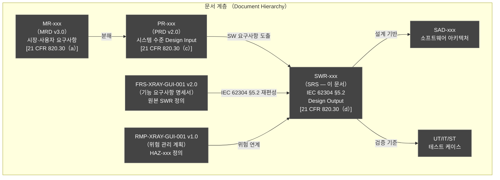
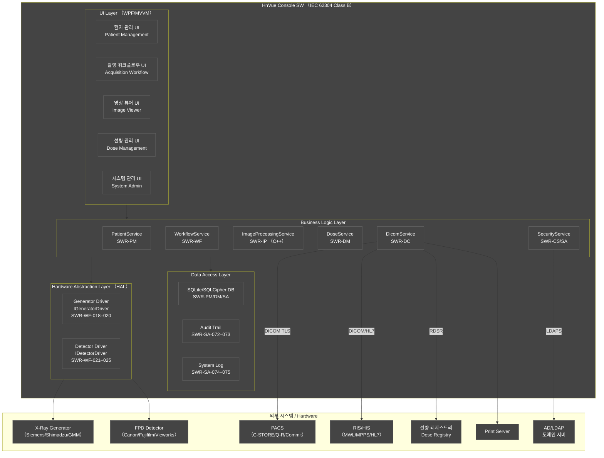
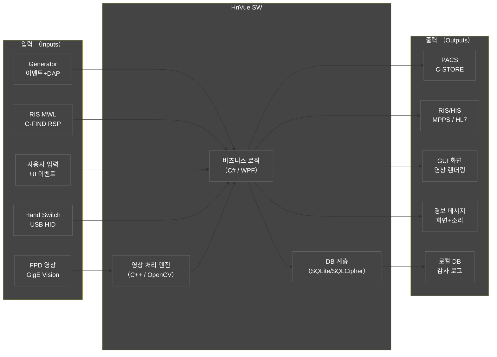
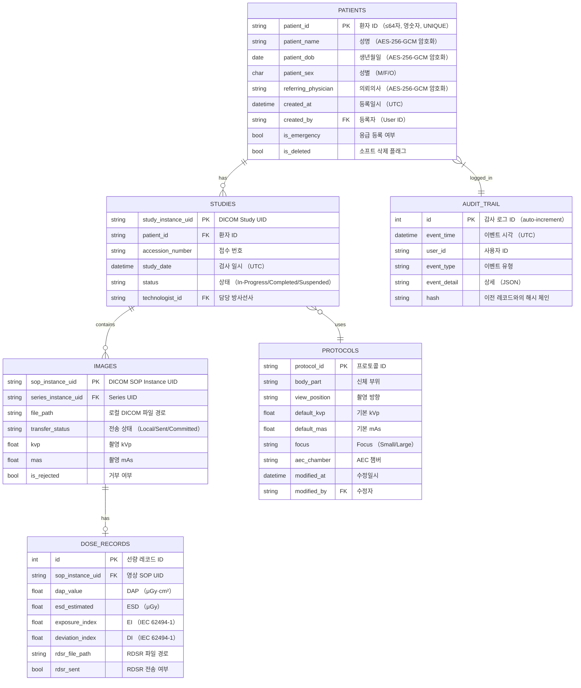
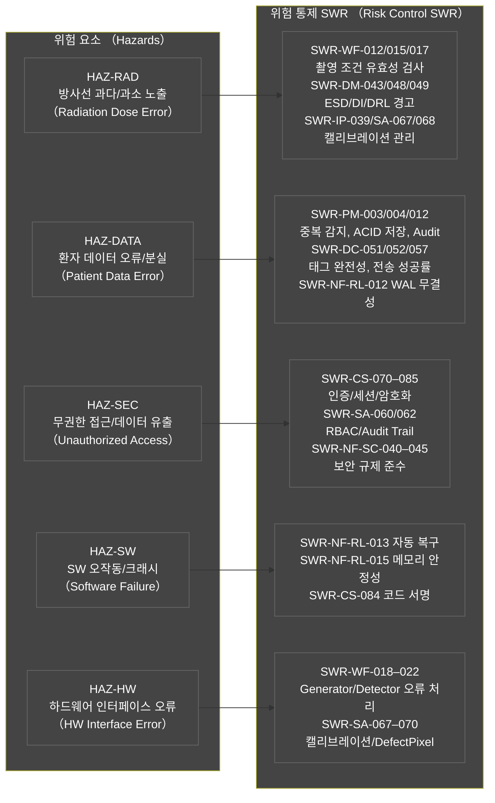
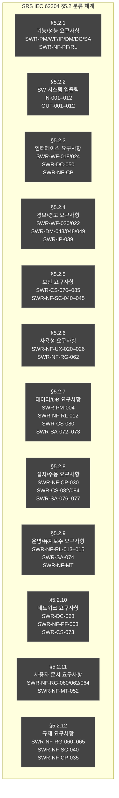

# HnVue Console SW
# Software Requirements Specification (SRS)
# 소프트웨어 요구사항 명세서

---

| 항목 | 내용 |
|------|------|
| **문서 ID** | SRS-XRAY-GUI-001 |
| **버전** | v2.0 |
| **작성일** | 2026-04-02 |
| **개정일** | 2026-04-02 |
| **작성자** | SW 개발팀 |
| **승인자** | (승인 대기) |
| **상태** | Draft |
| **분류** | 내부 기밀 (Confidential) |
| **기준 규격** | IEC 62304:2006+A1:2015 §5.2, ISO 14971:2019, IEC 62366-1:2015+A1:2020 |
| **상위 문서** | PRD-XRAY-GUI-001 v2.0, FRS-XRAY-GUI-001 v2.0 |
| **DHF 참조** | DHF-XRAY-GUI-001 |

---

## 개정 이력 (Revision History)

| 버전 | 날짜 | 작성자 | 변경 내용 |
|------|------|--------|-----------|
| v0.1 | 2026-03-18 | SW 개발팀 | 초안 작성 — FRS-XRAY-GUI-001 v1.0 기반 IEC 62304 §5.2 재편성 |
| v1.0 | 2026-03-18 | SW 개발팀 | 최초 공식 릴리스 — 전 §5.2 분류 완성, 위험/SOUP/검증 기준 포함 |
| v2.0 | 2026-04-02 | SW 개발팀 | MRD v3.0 4-Tier 우선순위 체계 반영 (P0/P1/P2 → Tier 1/2/3/4 전면 교체); MR-072 CD/DVD Burning SW 요구사항 추가 (SWR-WF-032–034, PR-WF-019); 보완 3건 반영 — MR-037 인시던트 대응 (SWR-CS-086–087 §5.2.5 보안 요구사항 신규), MR-039 SW 업데이트 메커니즘 (SWR-SA-076–077/SWR-CS-084–085 §5.2.8 설치 요구사항 보강), MR-050 STRIDE 위협 모델링 (SWR-NF-RG-060 §5.2.12 규제 요구사항 보강); 각 SWR에 MR/PR 추적 추가; 우선순위 칼럼 Tier로 교체; 참조 문서 버전 업데이트 (FRS v2.0, PRD v2.0, MRD v3.0) |

---

## 목차

1. [목적 및 범위 (Purpose and Scope)](#1-목적-및-범위)
2. [참조 문서 (Referenced Documents)](#2-참조-문서)
3. [SW 시스템 개요 (Software System Overview)](#3-sw-시스템-개요)
4. [IEC 62304 §5.2 SW 요구사항 분류](#4-iec-62304-52-sw-요구사항-분류)
   - [§5.2.1 기능 및 성능 요구사항](#421-기능-및-성능-요구사항-functional--performance-requirements)
   - [§5.2.2 SW 시스템 입출력](#422-sw-시스템-입출력-software-system-inputsoutputs)
   - [§5.2.3 인터페이스 요구사항](#423-인터페이스-요구사항-interface-requirements)
   - [§5.2.4 경보/경고 요구사항](#424-경보경고-요구사항-alarmwarning-requirements)
   - [§5.2.5 보안 요구사항](#425-보안-요구사항-security-requirements)
   - [§5.2.6 사용성 요구사항](#426-사용성-요구사항-usability-requirements)
   - [§5.2.7 데이터 정의 및 DB 요구사항](#427-데이터-정의-및-db-요구사항-data-definition--database-requirements)
   - [§5.2.8 설치 및 수용 요구사항](#428-설치-및-수용-요구사항-installation--acceptance-requirements)
   - [§5.2.9 운영 및 유지보수 요구사항](#429-운영-및-유지보수-요구사항-operational--maintenance-requirements)
   - [§5.2.10 네트워크 요구사항](#4210-네트워크-요구사항-network-requirements)
   - [§5.2.11 사용자 문서 요구사항](#4211-사용자-문서-요구사항-user-documentation-requirements)
   - [§5.2.12 규제 요구사항](#4212-규제-요구사항-regulatory-requirements)
5. [위험 관련 SW 요구사항 (Risk-Related Software Requirements)](#5-위험-관련-sw-요구사항)
6. [SOUP 요구사항 (SOUP Requirements — IEC 62304 §8)](#6-soup-요구사항)
7. [SW 요구사항 검증 기준 (Software Requirements Verification Criteria)](#7-sw-요구사항-검증-기준)
8. [부록 A: SWR → IEC 62304 분류 매핑 테이블](#부록-a-swr--iec-62304-분류-매핑-테이블)
9. [부록 B: 약어 및 용어 정의](#부록-b-약어-및-용어-정의)

---

## 1. 목적 및 범위 (Purpose and Scope)

### 1.1 목적 (Purpose)

본 문서는 **HnVue Console SW**의 **소프트웨어 요구사항 명세서 (Software Requirements Specification, SRS)**로서, IEC 62304:2006+A1:2015 §5.2 "소프트웨어 요구사항 분석 (Software Requirements Analysis)"에서 요구하는 소프트웨어 요구사항 (Software Requirements, SWR)을 IEC 62304 §5.2의 12개 분류 체계에 따라 체계적으로 재편성한다.

본 SRS는 FRS-XRAY-GUI-001 v2.0에서 정의된 기능 요구사항 (SWR-xxx)을 **IEC 62304 §5.2 규격 구조에 맞게 재분류·통합**하며, 다음의 목적을 수행한다:

1. **IEC 62304 §5.2 준수 증거 제공**: §5.2.1~§5.2.12의 각 요구사항 범주에 대한 SW 요구사항이 모두 정의되어 있음을 입증한다.
2. **FDA 21 CFR 820.30(d) Design Output 역할**: 모든 SWR은 상위 PRD(Design Input)의 PR-xxx로부터 도출된 Design Output이다.
3. **안전 분류 체계 확립**: IEC 62304 SW Safety Class B 기준에 따라 각 SWR의 Safety-related 여부를 명시한다.
4. **위험 관리 연계 (ISO 14971)**: 위험 관련 SWR(§5.2.1 Safety-related SWR)과 HAZ-xxx 위험 항목의 양방향 추적성을 제공한다.
5. **규제 제출 근거 문서**: FDA 510(k), CE MDR, KFDA 인허가 신청 시 IEC 62304 §5.2 적합성 근거 자료로 활용된다.

### 1.2 SW 안전 분류 (Software Safety Classification)

**SW Safety Class: IEC 62304 Class B**

| 분류 기준 | 내용 |
|----------|------|
| Safety Class | **Class B** (심각한 부상 가능성, 치명적 부상 가능성 없음) |
| 분류 근거 | HnVue SW 오작동 시 방사선 노출 오류, 오진단 등 심각한 부상(Serious Injury) 가능성 존재. 그러나 별도 하드웨어 인터록(Generator HW 안전 회로)이 존재하여 직접 치명적(Class C) 영향은 완화됨 |
| 적용 요구사항 | IEC 62304 §5.2 전체, §5.3, §5.4, §5.5, §5.6, §5.7, §6.1, §7.1~§7.3, §8 적용 |
| 해당 도메인 | 모든 Safety-related SWR (SWR-WF, SWR-DM, SWR-IP, SWR-PM 일부) |

### 1.3 적용 범위 (Scope)

본 SRS는 **HnVue Phase 1 (v2.0)** 기능 범위에 해당하는 약 185개의 소프트웨어 요구사항을 IEC 62304 §5.2 분류에 따라 정의한다.

**Phase 1 포함 도메인:**

| 도메인 | SWR 접두사 | SWR 범위 | IEC 62304 Safety Class |
|--------|-----------|----------|------------------------|
| 환자 관리 (Patient Management) | SWR-PM | PM-001–053 | Non-safety / Safety-related 혼재 |
| 촬영 워크플로우 (Acquisition Workflow) | SWR-WF | WF-010–034 | 대부분 Safety-related |
| 영상 표시/처리 (Image Display & Processing) | SWR-IP | IP-020–052 | Safety-related / Non-safety 혼재 |
| 선량 관리 (Dose Management) | SWR-DM | DM-040–055 | 대부분 Safety-related |
| DICOM/통신 (DICOM/Communication) | SWR-DC | DC-050–064 | Safety-related / Non-safety 혼재 |
| 시스템 관리 (System Administration) | SWR-SA | SA-060–077 | Security-related / Safety-related 혼재 |
| 사이버보안 (Cybersecurity) | SWR-CS | CS-070–087 | Security-related |
| 비기능 요구사항 (Non-Functional) | SWR-NF-xxx | 다수 | Non-safety (성능·신뢰성·사용성 등) |

---

## 2. 참조 문서 (Referenced Documents)

| 문서 ID | 문서명 | 버전 | 역할 |
|---------|--------|------|------|
| PRD-XRAY-GUI-001 | 제품 요구사항 문서 (Product Requirements Document) | v2.0 | 상위 Design Input (PR-xxx) |
| FRS-XRAY-GUI-001 | 기능 요구사항 명세서 (Functional Requirements Specification) | v2.0 | 원본 SWR 정의 문서 |
| RMP-XRAY-GUI-001 | 위험 관리 계획 (Risk Management Plan) | v1.0 | HAZ-xxx, RC-xxx 정의 |
| IEC 62304:2006+A1:2015 | Medical Device Software — Software Life Cycle Processes | — | §5.2 전체 적용 |
| IEC 62366-1:2015+A1:2020 | Medical Device Usability Engineering | — | §5.2.6 사용성 요구사항 연계 |
| ISO 14971:2019 | Risk Management for Medical Devices | — | §5 위험 관련 SWR 연계 |
| ISO 13485:2016 | Quality Management Systems for Medical Devices | — | QMS 기반 문서 관리 |
| FDA 21 CFR Part 820 | Quality System Regulation / Design Controls | — | Design Input/Output |
| FDA Section 524B | Cybersecurity in Medical Devices | 2023 | §5.2.5 보안 요구사항 |
| EU MDR 2017/745 | EU Medical Device Regulation | — | CE 인증 요구사항 |
| DICOM PS3.x 2023a | Digital Imaging and Communications in Medicine | 2023a | §5.2.2~§5.2.3 인터페이스 |
| IHE Radiology TF | IHE Radiology Technical Framework | — | SWF Profile |
| IEC 62494-1:2022 | Exposure Index for Digital Radiography | — | EI/DI 계산 기준 |
| IEC 60601-2-54:2009 | X-Ray Equipment for Radiography | — | RDSR 요구사항 |

---

## 3. SW 시스템 개요 (Software System Overview)

### 3.1 제품 설명 (Product Description)

**HnVue**은 의료용 진단 X-Ray 촬영장치의 **HnVue Console SW**로서, 방사선사(Technologist)가 X-Ray 촬영 전반의 워크플로우를 제어·관리하는 소프트웨어 플랫폼이다. 본 SW는 IEC 62304 Class B 의료기기 소프트웨어로 분류된다.

**운영 환경:**
- OS: Windows 10 LTSC 2021 / Windows 11 (64-bit)
- Runtime: .NET 8.0 LTS
- UI Framework: WPF (Windows Presentation Foundation)
- 아키텍처 패턴: MVVM + Modular Architecture + DI (Dependency Injection)

### 3.2 SW 기능 블록 다이어그램 (Functional Block Diagram)

### 3.3 SW 아키텍처 개요

HnVue은 다음 7개 독립 모듈로 구성된다:

| 모듈 | 책임 | 관련 SWR |
|------|------|---------|
| PatientManagementModule | 환자 등록, 조회, 검색, MWL 연동 | SWR-PM-001–053 |
| AcquisitionWorkflowModule | APR 프로토콜, Generator/Detector 제어, 촬영 실행 | SWR-WF-010–031 |
| ImageProcessingModule (C++) | 영상 처리 파이프라인(Gain/Offset, NR, Edge Enhancement 등) | SWR-IP-020–052 |
| DoseManagementModule | DAP/ESD 기록, RDSR 생성, EI/DI 모니터링, DRL 비교 | SWR-DM-040–055 |
| DicomCommunicationModule | C-STORE/C-FIND/MPPS/Storage Commit/Print SCU | SWR-DC-050–064 |
| SystemAdminModule | RBAC, 캘리브레이션, Audit Trail, 로깅, SW 업데이트 | SWR-SA-060–077 |
| SecurityModule | 인증, 세션 관리, PHI 암호화, SBOM, 코드 서명 | SWR-CS-070–085 |

---

## 4. IEC 62304 §5.2 SW 요구사항 분류

> **테이블 컬럼 설명:**
> - **SWR ID**: 소프트웨어 요구사항 고유 식별자 (FRS 동일 ID 유지)
> - **IEC 62304 분류**: Functional / Safety-related / Security-related
> - **요구사항명**: 간결한 기능/요구사항 명칭
> - **상세**: SW 구현 수준 상세 기술
> - **출처 PR**: 상위 PRD 요구사항 ID
> - **위험 참조**: ISO 14971 HAZ-xxx ID
> - **검증 방법**: T=Test / I=Inspection / A=Analysis / D=Demonstration

---

### 4.2.1 기능 및 성능 요구사항 (Functional & Performance Requirements)

> **IEC 62304 §5.2.1**: 소프트웨어가 수행해야 하는 기능과 성능 기준을 정의한다.

> **v2.0 변경**: 우선순위 표기가 P0/P1/P2에서 **Tier 1/2/3/4** (MRD v3.0 기준)로 전면 교체되었습니다. 각 SWR에 MR 추적 ID가 추가되었습니다.

#### A. 환자 관리 기능 (Patient Management)

| SWR ID | IEC 62304 분류 | 요구사항명 | 상세 | 출처 PR | 위험 참조 | 검증 방법 |
|--------|---------------|-----------|------|---------|---------|---------|
| SWR-PM-001 | Functional | 환자 등록 UI — 입력 필드 | 환자 ID(≤64자, 영숫자), 성명(유니코드 ≤256자, DICOM PN VR), DOB(YYYY-MM-DD), 성별(M/F/O), 검사 의뢰 정보(선택), 검사 부위(드롭다운) 6개 필드 제공. DICOM VR 규칙 준수 | PR-PM-001 | HAZ-DATA | T, I |
| SWR-PM-002 | Functional | 필수 필드 유효성 검사 | 저장 시 필수 필드(환자 ID, 성명, 성별) 미입력 시 저장 차단 + 적색(#FF3B30) 테두리 표시. on-blur 및 저장 버튼 시점 모두 검사 | PR-PM-001 | HAZ-DATA | T |
| SWR-PM-003 | Safety-related | 중복 환자 ID 감지 | 저장 시 SQLite DB Case-Insensitive 비동기 중복 체크(≤200ms @ 10,000건). 중복 시 3선택지 다이얼로그 표시 + 강제 저장 시 Audit Trail 기록 | PR-PM-001 | HAZ-DATA | T, A |
| SWR-PM-004 | Safety-related | 환자 등록 데이터 ACID 저장 | ACID 트랜잭션(BEGIN→INSERT→COMMIT), 실패 시 ROLLBACK. SQLite WAL 모드, 등록 이벤트 Audit Trail 기록 | PR-PM-001 | HAZ-DATA | T, I |
| SWR-PM-010 | Functional | 환자 정보 조회 화면 | 환자 선택 후 ≤500ms 내 상세 정보(전 필드 + 검사 이력) 표시. 기본 Read-Only 모드. 수정 버튼 Technologist 이상 RBAC 적용 | PR-PM-002 | HAZ-DATA | T |
| SWR-PM-011 | Safety-related | 환자 정보 수정 권한 검사 | Technologist/Administrator만 수정 가능. 권한 없는 역할 차단 + 동시 편집 잠금(Edit Lock) | PR-PM-002 | HAZ-DATA, HAZ-SEC | T, I |
| SWR-PM-012 | Safety-related | 환자 정보 수정 Audit 기록 | 변경 전·후 값 모두 Audit Trail 기록(필드명, 이전값, 신값, 수정자 ID, UTC 일시). 환자 ID 수정 불가 | PR-PM-002 | HAZ-DATA, HAZ-SEC | T, I |
| SWR-PM-013 | Functional | 환자 등록 상태 배지 | Active(녹색)/Pending(황색)/Completed(회색)/Emergency(적색) 4가지 배지 이벤트 드리븐 자동 갱신 | PR-PM-002 | — | T |
| SWR-PM-020 | Functional | MWL C-FIND 요청 생성 | DICOM Modality Worklist SCU C-FIND 요청. 필터: Modality(DR/CR), 장치 AE Title, 오늘 날짜 기본. HL7 ORM^O01 대안 지원 | PR-PM-003 | — | T |
| SWR-PM-030 | Safety-related | 응급 환자 빠른 등록 | 화면 최상위에서 ≤2터치로 응급 등록 화면 접근. 최소 필드(익명 가능)로 ≤60초 내 등록 완료. Emergency 배지 표시 | PR-PM-004 | HAZ-RAD | T, D |
| SWR-PM-040 | Functional | 환자 검색 (다중 필드) | 환자 ID, 성명, DOB, Accession Number 다중 조합 검색. B-Tree 인덱스 기반 ≤500ms. 바코드 스캐너 자동 입력 지원 | PR-PM-005 | — | T, A |
| SWR-PM-050 | Functional | 환자 삭제 (GDPR/소프트 삭제) | 삭제는 `is_deleted=TRUE` 소프트 삭제. 물리적 삭제는 관리자 전용 별도 작업. GDPR Right-to-Erasure 대응 | PR-PM-006 | HAZ-DATA | T, I |

#### B. 촬영 워크플로우 기능 (Acquisition Workflow)

| SWR ID | IEC 62304 분류 | 요구사항명 | 상세 | 출처 PR | 위험 참조 | 검증 방법 |
|--------|---------------|-----------|------|---------|---------|---------|
| SWR-WF-010 | Safety-related | APR 프로토콜 관리 | 신체 부위×촬영 방향별 프로토콜(kVp, mAs, Focus, AEC, SID, 영상 처리 Preset) CRUD. 변경 이력 감사 기록 | PR-WF-010 | HAZ-RAD | T, I |
| SWR-WF-011 | Safety-related | APR 프로토콜 적용 및 파라미터 전송 | 프로토콜 선택 시 Generator에 kVp/mAs/Focus/AEC 파라미터 자동 전송. ≤500ms 내 설정 완료 | PR-WF-010 | HAZ-RAD | T, A |
| SWR-WF-012 | Safety-related | APR 프로토콜 검증 | kVp(40–150kV), mAs(0.1–500), SID(80–200cm) 범위 초과 시 저장 차단 + 인라인 오류 메시지 | PR-WF-010 | HAZ-RAD | T |
| SWR-WF-015 | Safety-related | 수동 촬영 조건 설정 | kVp, mA, 노출 시간(ms), mAs(직접 입력), SID, Focus(Small/Large), AEC 챔버 수동 설정. 범위 초과 시 적색 경고 표시 | PR-WF-012 | HAZ-RAD | T, I |
| SWR-WF-016 | Safety-related | AEC 챔버 설정 | L/C/R/L+C/L+R/C+R/All/Off 중 선택. 선택된 챔버 Generator AEC 레지스터에 전송 | PR-WF-012 | HAZ-RAD | T |
| SWR-WF-017 | Safety-related | 촬영 조건 유효성 검사 | 설정된 kVp×mAs 조합이 Generator 허용 범위 내인지 검사. 유효하지 않은 조합 차단 | PR-WF-012 | HAZ-RAD | T, A |
| SWR-WF-018 | Safety-related | Generator 통신 및 파라미터 전송 | IGeneratorDriver 인터페이스: SetParameters() → ReadyForExposure 응답 수신. 타임아웃(2초) 시 에러 처리 | PR-WF-013 | HAZ-RAD, HAZ-HW | T |
| SWR-WF-019 | Safety-related | 촬영 명령 전송 (Expose) | Expose() 명령 전송. 촬영 중 노출 버튼 비활성화. Exposure End + DAP 이벤트 수신 | PR-WF-013 | HAZ-RAD, HAZ-HW | T, D |
| SWR-WF-020 | Safety-related | Generator 오류 처리 | Generator 통신 오류/타임아웃(30초) 시 ErrorState 진입. 사용자 알림(소리+시각적 경보) + 로그 기록 | PR-WF-013 | HAZ-RAD, HAZ-HW | T |
| SWR-WF-021 | Safety-related | Detector 상태 모니터링 | FPD 상태(READY/BUSY/ERROR/DISCONNECTED/LOW_BATTERY/CRITICAL_BATTERY/OVERHEAT) 실시간 표시. READY 상태만 노출 버튼 활성화 | PR-WF-014 | HAZ-RAD, HAZ-HW | T, D |
| SWR-WF-022 | Safety-related | Detector 오류 처리 | FPD ERROR/DISCONNECTED 시 노출 버튼 비활성화 + 적색 인디케이터 + 경고음. 30초 주기 자동 재연결 | PR-WF-014 | HAZ-RAD, HAZ-HW | T |
| SWR-WF-023 | Safety-related | 촬영 실행 (Hand Switch / Foot Switch) | USB HID Hand Switch 2단계 (Step1: Preparation, Step2: Exposure). Expose() 명령 전송. Foot Switch 동일 처리 | PR-WF-015 | HAZ-RAD | T, D |
| SWR-WF-024 | Safety-related | Raw 영상 수신 (GigE Vision / SDK) | GigE Vision 또는 벤더 SDK로 16-bit Raw 영상 수신. 수신 타임아웃(10초) 설정 | PR-WF-015 | HAZ-RAD, HAZ-SW | T |
| SWR-WF-025 | Safety-related | 영상 수신 실패 처리 | 영상 수신 타임아웃 또는 오류 시 사용자 알림 + 재촬영 권유 + 에러 로그 기록 | PR-WF-015 | HAZ-RAD | T |
| SWR-WF-026 | Safety-related | Emergency/Trauma 워크플로우 | Emergency 등록 환자 선택 시 단축 워크플로우 진입. 프로토콜 자동 선택(Trauma 사전 정의). ≤2터치로 촬영 시작 | PR-WF-016 | HAZ-RAD | T, D |
| SWR-WF-027 | Safety-related | 워크플로우 상태 인디케이터 | 현재 촬영 단계(Patient Selected/Protocol Set/Ready/Exposing/Processing/Review/Completed) 명확히 표시 | PR-WF-016 | HAZ-RAD | T, I |
| SWR-WF-030 | Functional | Suspend/Resume Exam | 검사 일시 정지(Suspend) 저장: 환자 ID, 촬영 순서 위치, 파라미터 DB 저장. 재시작(Resume) 시 완전 복원 | PR-WF-018 | — | T, D |
| SWR-WF-032 | Functional | **[v2.0 신규 — MR-072, Tier 2]** CD/DVD 버닝 UI | CD/DVD 미디어 선택, 굽기 대상 영상 선택 UI, 드라이브 자동 감지, 예상 용량 표시, 미디어 용량 초과 경고 | PR-WF-019 (MR-072) | HAZ-DATA | T, D |
| SWR-WF-033 | Functional | **[v2.0 신규 — MR-072, Tier 2]** DICOMDIR + ISO 이미지 생성 | DICOM PS3.11 DICOMDIR 자동 생성, ISO 9660 이미지 생성 (Windows IMAPI2 COM), 내장 DICOM 뷰어 포함, SHA-256 체크섬 동봉, SOP Instance UID 무결성 검증 | PR-WF-019 (MR-072) | HAZ-DATA | T, I |
| SWR-WF-034 | Functional | **[v2.0 신규 — MR-072, Tier 2]** 미디어 기록 및 오류 처리 | 기록 진행률 표시, 기록 완료 후 베리파이(체크섬 비교), 성공 시 Audit Trail 기록, 실패 시 재시도 옵션 + 오류 원인별 명확한 메시지 | PR-WF-019 (MR-072) | HAZ-DATA | T, D |

#### C. 영상 표시/처리 기능 (Image Display & Processing)

| SWR ID | IEC 62304 분류 | 요구사항명 | 상세 | 출처 PR | 위험 참조 | 검증 방법 |
|--------|---------------|-----------|------|---------|---------|---------|
| SWR-IP-020 | Safety-related | 실시간 영상 표시 | 촬영 후 영상 처리 완료 시 ≤1,000ms 내 화면 표시(5MP 기준). WPF WriteableBitmap 렌더링 | PR-IP-020 | HAZ-RAD, HAZ-SW | T, A |
| SWR-IP-021 | Safety-related | DICOM GSDF 렌더링 | DICOM Grayscale Standard Display Function 적용 렌더링. 모니터 캘리브레이션 LUT 적용 | PR-IP-020 | HAZ-RAD | T, I |
| SWR-IP-022 | Functional | Window/Level 수동 조정 | 마우스 드래그(좌우: Window, 상하: Level) 또는 숫자 직접 입력으로 W/L 조정. Preset 목록 지원 | PR-IP-021 | — | T, D |
| SWR-IP-024 | Functional | Zoom In/Out | 마우스 휠 또는 핀치 제스처로 10%~800% 줌. 중심점 기준 줌 | PR-IP-022 | — | T, D |
| SWR-IP-026 | Functional | Pan (이동) | 마우스 드래그(우클릭 또는 중간 버튼)로 영상 이동 | PR-IP-023 | — | T |
| SWR-IP-027 | Functional | Rotation (회전) | 0°/90°/180°/270° 및 자유 회전 지원. DICOM 메타데이터에 회전 값 저장 | PR-IP-024 | — | T |
| SWR-IP-029 | Functional | Image Stitching | 2–4장 영상 자동/수동 정합 (척추 전장 등). ≤10초 @ 4×5MP. OpenCV 기반 | PR-IP-025 | HAZ-RAD | T, A |
| SWR-IP-032 | Safety-related | 거리 측정 도구 | 보정된 픽셀 크기 기반 거리 측정(mm). 측정 정확도 ±2% 이내. DICOM GSPS에 저장 | PR-IP-026 | HAZ-RAD | T, A |
| SWR-IP-034 | Functional | 각도 측정 도구 | 3점 기반 각도 측정(0–180°). 결과 DICOM GSPS 저장 | PR-IP-027 | — | T |
| SWR-IP-037 | Functional | Annotation (텍스트/화살표) | 텍스트, 화살표, 원, 사각형 Annotation 도구. DICOM Presentation State로 저장 | PR-IP-029 | — | T |
| SWR-IP-039 | Safety-related | Gain/Offset 보정 적용 | 캘리브레이션 데이터(Gain Map, Offset Map) 자동 적용. 보정 데이터 미존재 시 촬영 차단 + 경고 | PR-IP-030 | HAZ-RAD, HAZ-SW | T, I |
| SWR-IP-041 | Safety-related | 노이즈 감소 (Noise Reduction) | 적응형 필터 또는 웨이블릿 기반 NR 알고리즘 적용. 영상 진단 정보 손실 방지 기준 적용 | PR-IP-031 | HAZ-RAD | T, A |
| SWR-IP-043 | Functional | Edge Enhancement | 주파수 도메인 기반 Edge Enhancement. 강도(0–100%) 조절 가능. 기본 프로토콜별 Preset | PR-IP-032 | — | T |
| SWR-IP-045 | Safety-related | Scatter Correction | Grid Removal 또는 SW 기반 산란선 보정 알고리즘 적용 | PR-IP-033 | HAZ-RAD | T, A |
| SWR-IP-047 | Functional | Auto-trimming | 영상 경계 자동 검출 및 흑색 마스크 자동 적용. 수동 조정 지원 | PR-IP-034 | — | T, D |
| SWR-IP-050 | Functional | Contrast Optimization (CLAHE) | CLAHE 기반 자동 대비 최적화. 강도 파라미터 조절 가능 | PR-IP-036 | — | T |

#### D. 선량 관리 기능 (Dose Management)

| SWR ID | IEC 62304 분류 | 요구사항명 | 상세 | 출처 PR | 위험 참조 | 검증 방법 |
|--------|---------------|-----------|------|---------|---------|---------|
| SWR-DM-040 | Safety-related | DAP 표시 및 기록 | DAP Meter RS-232 수신값 파싱 후 영상 뷰어에 표시(μGy·cm²). DICOM RDSR에 포함. DB 기록 | PR-DM-040 | HAZ-RAD | T, A |
| SWR-DM-041 | Safety-related | DAP 누적 계산 | 검사 단위 DAP 누적 합산. 세션 내 총 DAP 표시 | PR-DM-040 | HAZ-RAD | T, A |
| SWR-DM-042 | Safety-related | ESD 계산 | ESD(μGy) = DAP × (SID²/Field Area) 공식 기반 계산. 입력값: DAP, kVp, mAs, SID. ICRP 계수 테이블 적용 | PR-DM-041 | HAZ-RAD | T, A |
| SWR-DM-043 | Safety-related | ESD 경고 임계값 | ESD가 설정 임계값(기본: 1,000mGy) 초과 시 경고 메시지 + 노출 차단 옵션 | PR-DM-041 | HAZ-RAD | T |
| SWR-DM-044 | Safety-related | RDSR 생성 (IEC 60601-2-54) | DICOM Radiation Dose Structured Report 자동 생성. TID 10011 준수. 촬영 완료 후 자동 생성 | PR-DM-042 | HAZ-RAD | T, I |
| SWR-DM-045 | Safety-related | RDSR DICOM 태그 완전성 | RDSR 필수 태그: Exposure(kVp, mAs), DAP, ESD, 촬영 부위, Detector 정보 모두 포함 | PR-DM-042 | HAZ-RAD | T, I |
| SWR-DM-046 | Safety-related | RDSR 선량 레지스트리 전송 | 생성된 RDSR C-STORE SCU로 선량 레지스트리(DOSE_REG) 전송. 전송 실패 시 큐잉 + 재전송 | PR-DM-042 | HAZ-RAD | T |
| SWR-DM-047 | Safety-related | Exposure Index(EI) 계산 | IEC 62494-1:2022 기준 EI 계산. 검출기 종류별 Target Exposure 파라미터(EI_target) 적용 | PR-DM-043 | HAZ-RAD | T, A |
| SWR-DM-048 | Safety-related | Deviation Index(DI) 계산 및 경고 | DI = 10 × log10(EI / EI_target). DI > +3.0 시 과다 노출 경고, DI < -3.0 시 과소 노출 경고 표시 | PR-DM-043 | HAZ-RAD | T, A |
| SWR-DM-049 | Safety-related | DRL(진단 참고 준위) 비교 | 부위별 DRL 테이블(국가별 설정 가능) 대비 현재 DAP/ESD 비교. DRL 초과 시 황색 경고 표시 | PR-DM-044 | HAZ-RAD | T |
| SWR-DM-050 | Safety-related | DRL 초과 기록 | DRL 초과 이벤트 DB 기록 및 Audit Trail 기록. 관리자 DRL 초과 보고서 생성 지원 | PR-DM-044 | HAZ-RAD | T, I |
| SWR-DM-051 | Functional | 전자 X-ray 로그북 | 검사별 선량 기록(환자 ID, 검사일시, 부위, kVp, mAs, DAP, ESD, EI) 조회/내보내기(CSV/PDF) | PR-DM-045 | — | T |
| SWR-DM-053 | Functional | Reject Analysis (거부 영상 분석) | 거부된 영상(Reject) 원인 분류(Motion/Positioning/Exposure 등) 기록. 거부율 통계 보고서 | PR-DM-046 | — | T, A |

#### E. DICOM/통신 기능 (DICOM/Communication)

| SWR ID | IEC 62304 분류 | 요구사항명 | 상세 | 출처 PR | 위험 참조 | 검증 방법 |
|--------|---------------|-----------|------|---------|---------|---------|
| SWR-DC-050 | Safety-related | DICOM C-STORE SCU — 영상 전송 | DX/CR Image Storage SOP Class C-STORE. TLS 암호화. 전송 실패 시 로컬 큐잉 후 자동 재전송(3회) | PR-DC-050 | HAZ-DATA | T |
| SWR-DC-051 | Safety-related | DICOM 태그 완전성 검사 | 전송 전 필수 DICOM 태그(환자 ID, Study UID, Series UID, SOPInstanceUID, kVp, mAs, DAP) 완전성 검사 | PR-DC-050 | HAZ-DATA | T, I |
| SWR-DC-052 | Safety-related | 전송 성공률 ≥99.9% | PACS C-STORE 전송 성공률 ≥99.9% (재전송 포함). 전송 실패 시 알림 + 큐 관리 UI 제공 | PR-DC-050 | HAZ-DATA | T, A |
| SWR-DC-053 | Functional | MWL C-FIND SCU | Modality Worklist SCP에 C-FIND 쿼리. 일정 시간마다 자동 갱신(기본 5분). ≤3초 응답 | PR-DC-051 | — | T |
| SWR-DC-055 | Functional | MPPS N-CREATE/N-SET SCU | 촬영 시작 시 N-CREATE(In-Progress), 완료 시 N-SET(Completed). HL7 ORU^R01 병행 지원 | PR-DC-052 | — | T |
| SWR-DC-057 | Safety-related | Storage Commitment SCU | PACS 장기 보관 확인 N-ACTION 전송. N-EVENT-REPORT 수신 후 로컬 임시 파일 삭제 허용 | PR-DC-053 | HAZ-DATA | T |
| SWR-DC-059 | Functional | Print SCU | Basic Grayscale Print Management. 프린트 레이아웃, 어노테이션 포함 인쇄 | PR-DC-054 | — | T, D |
| SWR-DC-061 | Functional | Query/Retrieve SCU (C-FIND/C-MOVE) | PACS Study Root Q/R. C-FIND로 검색, C-MOVE로 영상 검색 후 검토 | PR-DC-055 | — | T |
| SWR-DC-063 | Security-related | DICOM TLS 1.2/1.3 암호화 | 모든 DICOM 통신 TLS 1.2/1.3 적용. TLS 1.0/1.1 비활성화. 허용 Cipher Suite 제한 | PR-DC-056 | HAZ-SEC | T, I |
| SWR-DC-064 | Security-related | DICOM TLS 인증서 관리 | 서버 인증서 검증(CA 체인). mTLS 옵션 지원. 만료 30일 전 관리자 경고 | PR-DC-056 | HAZ-SEC | T, I |

#### F. 시스템 관리 기능 (System Administration)

| SWR ID | IEC 62304 분류 | 요구사항명 | 상세 | 출처 PR | 위험 참조 | 검증 방법 |
|--------|---------------|-----------|------|---------|---------|---------|
| SWR-SA-060 | Security-related | RBAC 역할 정의 | 4개 역할: Administrator, Technologist, Physician, Service(BMET). 역할별 권한 매트릭스 정의 및 문서화 | PR-SA-060 | HAZ-SEC | T, I |
| SWR-SA-061 | Security-related | 사용자 계정 관리 | 관리자: 사용자 생성/수정/비활성화/잠금 해제. 계정 비활성화 시 즉시 세션 무효화 | PR-SA-060 | HAZ-SEC | T |
| SWR-SA-062 | Security-related | 역할 기반 UI 접근 제어 | UI 레이어 + 서비스 레이어 이중 권한 검사. 미권한 메뉴 숨김 + API 차단 | PR-SA-060 | HAZ-SEC | T, I |
| SWR-SA-063 | Safety-related | APR 프로토콜 편집기 | Administrator/Service 전용 APR 파라미터 편집. 변경 시 이전 버전 자동 백업 + 감사 로그 | PR-SA-061 | HAZ-RAD | T, I |
| SWR-SA-065 | Functional | 시스템 설정 관리 | DICOM AE Title, PACS/RIS IP·포트, 네트워크 설정, 언어·타임존 등 시스템 전반 설정. 설정 내보내기/가져오기 | PR-SA-062 | — | T, D |
| SWR-SA-067 | Safety-related | FPD 캘리브레이션 (Gain/Offset 획득) | Gain Map 획득(균일한 방사선 노출), Offset Map 획득(Dark Frame). 캘리브레이션 결과 DB 저장 + 날짜 표시 | PR-SA-063 | HAZ-RAD, HAZ-SW | T, I |
| SWR-SA-068 | Safety-related | 캘리브레이션 유효성 관리 | 캘리브레이션 만료(기본 7일) 시 촬영 전 경고 표시. 만료 캘리브레이션으로 촬영 시 확인 필요 | PR-SA-063 | HAZ-RAD | T |
| SWR-SA-070 | Safety-related | Defect Pixel Map 관리 | FPD 불량 픽셀 좌표 맵 관리. 불량 픽셀 보간(주변 픽셀 평균) 자동 적용 | PR-SA-064 | HAZ-RAD, HAZ-SW | T, I |
| SWR-SA-072 | Security-related | Audit Trail 기록 | IHE ATNA 형식(RFC 3881/HL7 FHIR AuditEvent) Audit Trail. 이벤트: 로그인/아웃, 환자 등록/수정, 영상 Accept/Reject, 설정 변경. Merkle Tree 해시 체인으로 변조 방지 | PR-SA-065 | HAZ-SEC | T, I |
| SWR-SA-073 | Security-related | Audit Trail 90일 이상 보관 | Audit Trail 최소 90일 보관. 자동 아카이빙(압축). Append-only 파일, 삭제/수정 불가 | PR-SA-065 | HAZ-SEC | T, I |
| SWR-SA-074 | Functional | 시스템 로그 관리 | 구조화 로그(Serilog 또는 NLog). 레벨: Debug/Info/Warn/Error/Fatal. 최대 30일/500MB 자동 순환 | PR-SA-066 | — | T, I |
| SWR-SA-076 | Security-related | SW 업데이트 무결성 검증 | 업데이트 패키지: 디지털 서명(EV Code Signing) 검증 후 설치. 검증 실패 시 설치 차단 | PR-SA-067 | HAZ-SEC, HAZ-SW | T, I |
| SWR-SA-077 | Security-related | SW 업데이트 롤백 지원 | 업데이트 실패 시 이전 버전으로 자동 롤백. 롤백 로그 기록 | PR-SA-067 | HAZ-SW | T, D |

#### G. 성능 요구사항 (Performance Requirements)

| SWR ID | IEC 62304 분류 | 요구사항명 | 상세 | 출처 PR | 위험 참조 | 검증 방법 |
|--------|---------------|-----------|------|---------|---------|---------|
| SWR-NF-PF-001 | Functional | 영상 표시 지연 ≤1초 | 5MP 16-bit 전체 처리 파이프라인(Gain/Offset→NR→W/L→렌더링) ≤1,000ms. C++ SIMD + WPF GPU 렌더링 | PR-NF-PF-001 | — | T, A |
| SWR-NF-PF-002 | Functional | 환자 검색 응답 ≤500ms | `PatientService.SearchAsync()` ≤500ms @ 10,000건 SQLite DB (BTREE 인덱스) | PR-NF-PF-002 | — | T, A |
| SWR-NF-PF-003 | Functional | DICOM 전송 속도 ≥100Mbps | Gigabit 네트워크 환경 C-STORE 처리량 ≥100Mbps | PR-NF-PF-003 | — | T, A |
| SWR-NF-PF-004 | Functional | GUI 응답 시간 ≤200ms | 버튼/터치 입력 → 첫 시각적 피드백 ≤200ms. UI 스레드 차단 금지 | PR-NF-PF-004 | — | T, A |
| SWR-NF-PF-005 | Functional | 시스템 부팅 시간 ≤60초 | BIOS POST 완료 → 로그인 화면 표시까지 ≤60초 | PR-NF-PF-005 | — | T |
| SWR-NF-PF-006 | Functional | 동시 Study 3개 병렬 관리 | 3개 Study 동시 관리 시 성능 기준치 10% 이내 저하 | PR-NF-PF-006 | — | T, A |
| SWR-NF-RL-010 | Functional | 시스템 가용성 ≥99.9% | 운영 시간 기준 가용성 ≥99.9%. MTTR ≤30초 포함 | PR-NF-RL-010 | — | T, A |
| SWR-NF-RL-011 | Functional | MTBF ≥10,000시간 | SW 장애 기준 MTBF ≥10,000시간 분석 기반 목표값 | PR-NF-RL-011 | — | A |
| SWR-NF-RL-012 | Safety-related | 데이터 무결성 (WAL) | SQLite WAL 모드 + FULL 동기화. 전원 차단 시 데이터 손실 0건 | PR-NF-RL-012 | HAZ-DATA | T, A |
| SWR-NF-RL-013 | Safety-related | SW 크래시 자동 복구 | Guardian 프로세스: 비응답(5초) 감지 → 자동 재시작(≤30초). 마지막 상태 복원 | PR-NF-RL-013 | HAZ-SW | T, D |
| SWR-NF-RL-014 | Functional | Graceful Degradation | 네트워크 실패 시 DICOM 큐잉. 복구 후 자동 FIFO 전송. MWL 30분 캐시 | PR-NF-RL-014 | — | T, D |
| SWR-NF-RL-015 | Functional | 장기 운영 메모리 안정성 | 72시간 연속 운영 후 Managed Heap 증가 ≤10MB/24h | PR-NF-RL-015 | HAZ-SW | T, A |

---

### 4.2.2 SW 시스템 입출력 (Software System Inputs/Outputs)

> **IEC 62304 §5.2.2**: SW 시스템의 모든 입력 및 출력 데이터를 정의한다.

#### 시스템 입력 (System Inputs)

| 입력 ID | 입력 소스 | 데이터 유형 | 형식/프로토콜 | 관련 SWR |
|---------|---------|-----------|------------|---------|
| IN-001 | FPD (Flat Panel Detector) | 16-bit Raw 영상 프레임 | GigE Vision / 벤더 SDK | SWR-WF-024 |
| IN-002 | X-Ray Generator | 노출 완료 이벤트 + DAP 값 | TCP/Serial 커스텀 프로토콜 | SWR-WF-019, SWR-DM-040 |
| IN-003 | RIS/HIS | DICOM Modality Worklist 응답 (C-FIND-RSP) | DICOM PS3.4 MWL SOP | SWR-PM-020, SWR-DC-053 |
| IN-004 | RIS/HIS | HL7 ADT^A01/A08, ORM^O01 메시지 | HL7 v2.x MLLP | SWR-PM-006–008 |
| IN-005 | PACS | Query/Retrieve 응답 (C-FIND/C-MOVE-RSP) | DICOM PS3.4 Q/R SOP | SWR-DC-061–062 |
| IN-006 | PACS | Storage Commitment 확인 (N-EVENT-REPORT) | DICOM PS3.4 Commit SOP | SWR-DC-057 |
| IN-007 | DAP Meter | DAP 값 (μGy·cm²) | RS-232 (COM Port) | SWR-DM-040 |
| IN-008 | Hand Switch / Foot Switch | Step1/Step2 이벤트 | USB HID | SWR-WF-023 |
| IN-009 | Barcode Scanner | 환자 ID 문자열 | USB HID | SWR-PM-040 |
| IN-010 | AD/LDAP 서버 | 인증 결과 (LDAP Bind 응답) | LDAPS / Kerberos | SWR-CS-073 |
| IN-011 | 사용자 입력 | 환자 정보, 촬영 파라미터, 설정 값 | WPF UI 이벤트 | 다수 SWR-PM, SWR-WF |
| IN-012 | 시스템 클록 | 현재 UTC 타임스탬프 | Windows API | SWR-SA-072, SWR-DM |

#### 시스템 출력 (System Outputs)

| 출력 ID | 출력 대상 | 데이터 유형 | 형식/프로토콜 | 관련 SWR |
|---------|---------|-----------|------------|---------|
| OUT-001 | PACS | DICOM DX/CR 영상 (C-STORE-RQ) | DICOM PS3.4 Storage SOP, TLS | SWR-DC-050–052 |
| OUT-002 | PACS | DICOM RDSR (Radiation Dose SR) | DICOM TID 10011 | SWR-DM-044–046 |
| OUT-003 | PACS | DICOM Presentation State | GSPS SOP Class | SWR-IP-037–038 |
| OUT-004 | RIS/HIS | DICOM MPPS (N-CREATE/N-SET) | DICOM PS3.4 MPPS SOP | SWR-DC-055–056 |
| OUT-005 | RIS/HIS | HL7 ORU^R01 (검사 결과) | HL7 v2.x MLLP | SWR-DC-055 |
| OUT-006 | 선량 레지스트리 | RDSR C-STORE | DICOM Storage SOP, TLS | SWR-DM-046 |
| OUT-007 | X-Ray Generator | 촬영 파라미터 (kVp, mAs, Focus, AEC) + Expose 명령 | TCP/Serial 커스텀 | SWR-WF-018–019 |
| OUT-008 | Print Server | DICOM Print 요청 (Print SCU) | DICOM Print SOP | SWR-DC-059–060 |
| OUT-009 | GUI 화면 | 처리된 DICOM 영상 렌더링 | WPF WriteableBitmap | SWR-IP-020–021 |
| OUT-010 | 로컬 DB | 환자/검사/선량/감사 로그 기록 | SQLite/SQLCipher | SWR-PM-004, SWR-SA-072 |
| OUT-011 | 관리자/사용자 | 경보/경고 메시지 (화면 + 소리) | WPF UI, Windows Audio API | SWR-DM-043, SWR-WF-020 |
| OUT-012 | 로컬 파일시스템 | 시스템 로그 파일 | 구조화 텍스트/JSON | SWR-SA-074 |
| OUT-013 | CD/DVD 미디어 | DICOMDIR + 영상 + 내장 뷰어 | ISO 9660 이미지 | SWR-WF-032–034 |

---

### 4.2.3 인터페이스 요구사항 (Interface Requirements)

> **IEC 62304 §5.2.3**: 외부 시스템 인터페이스 및 사용자 인터페이스 요구사항을 정의한다.

#### A. 외부 시스템 인터페이스

| SWR ID | IEC 62304 분류 | 요구사항명 | 상세 | 출처 PR | 위험 참조 | 검증 방법 |
|--------|---------------|-----------|------|---------|---------|---------|
| SWR-WF-018 | Safety-related | Generator 인터페이스 (HAL) | `IGeneratorDriver` 인터페이스: Connect(), SetParameters(kVp, mAs, Focus, AEC), Expose(), GetStatus(). 벤더별 플러그인 DLL. 지원: Siemens X.pree, Shimadzu, GMM Opera | PR-WF-013 | HAZ-RAD, HAZ-HW | T, D |
| SWR-WF-024 | Safety-related | Detector 인터페이스 (HAL) | `IDetectorDriver` 인터페이스: Connect(), ArmForExposure(), GetImage(), GetStatus(). 지원: Canon CXDI SDK, Fujifilm FDR SDK, Vieworks VA SDK | PR-WF-015 | HAZ-RAD, HAZ-HW | T, D |
| SWR-DC-050 | Safety-related | PACS/DICOM 인터페이스 | fo-dicom 5.1 기반 DICOM 네트워크 서비스. SOP Class: DX/CR Storage SCU, Q/R SCU, MPPS SCU, Storage Commitment SCU | PR-DC-050 | HAZ-DATA | T |
| SWR-PM-020 | Functional | RIS/HIS 인터페이스 (MWL/HL7) | DICOM MWL C-FIND + HL7 v2.x ADT/ORM MLLP. FHIR R4 REST 기본 지원(Phase 1) | PR-PM-003 | — | T |
| SWR-NF-CP-031 | Functional | Multi-vendor Detector 호환성 | HAL 플러그인 아키텍처: 신규 벤더 추가 시 재컴파일 없이 플러그인 DLL 배포만으로 확장. ≥3개 벤더 Phase 1 지원 | PR-NF-CP-031 | — | T, D |
| SWR-NF-CP-032 | Functional | Multi-vendor Generator 호환성 | HAL 플러그인 아키텍처. Serial(RS-232/RS-485), Ethernet TCP 통신. ≥3개 벤더 Phase 1 지원 | PR-NF-CP-032 | — | T, D |
| SWR-NF-CP-033 | Functional | PACS 멀티벤더 호환성 | Sectra, Fujifilm Synapse, Infinitt, Maroview, Agfa Impax 5개 PACS 벤더 검증 목표. IHE Connectathon 참여 | PR-NF-CP-033 | — | T, D |

#### B. 사용자 인터페이스 (UI)

| SWR ID | IEC 62304 분류 | 요구사항명 | 상세 | 출처 PR | 위험 참조 | 검증 방법 |
|--------|---------------|-----------|------|---------|---------|---------|
| SWR-NF-UX-022 | Functional | 터치 타겟 최소 크기 | 모든 인터랙티브 UI 요소 ≥44×44px (Apple HIG / WCAG 2.1 SC 2.5.5). HiDPI 배율(150%, 200%) 대응 | PR-NF-UX-022 | — | I |
| SWR-NF-UX-023 | Functional | 다국어 지원 | XAML ResourceDictionary i18n. 한국어(ko-KR)/영어(en-US) Phase 1 지원. 재시작 없이 즉시 전환 | PR-NF-UX-023 | — | T, I |
| SWR-NF-CP-030 | Functional | OS 호환성 | Windows 10 LTSC 2021 / Windows 11 64-bit. .NET 8.0 LTS 번들. Per-Monitor DPI Aware v2 | PR-NF-CP-030 | — | T, I |
| SWR-NF-CP-034 | Functional | 모니터 해상도 지원 | 3MP(2048×1536) 최소 ~ 4K(3840×2160) UHD 지원. 100/125/150/200% DPI 배율 | PR-NF-CP-034 | — | T, I |

---

### 4.2.4 경보/경고 요구사항 (Alarm/Warning Requirements)

> **IEC 62304 §5.2.4**: 사용자 안전에 영향을 미치는 경보 및 경고 요구사항을 정의한다.

| SWR ID | IEC 62304 분류 | 경보/경고명 | 트리거 조건 | 표시 방법 | 사용자 액션 | 출처 PR | 위험 참조 | 검증 방법 |
|--------|---------------|-----------|----------|---------|----------|---------|---------|---------|
| SWR-WF-020 | Safety-related | Generator 통신 오류 경보 | Generator 응답 타임아웃(2초) 또는 연결 끊김 | 적색 팝업 다이얼로그 + 경고음 | 재연결 또는 서비스 호출 | PR-WF-013 | HAZ-RAD, HAZ-HW | T |
| SWR-WF-022 | Safety-related | Detector 오류 경보 | FPD ERROR/DISCONNECTED/OVERHEAT 상태 | 적색 인디케이터 + 소리 경보 + 팝업 | 재연결 또는 냉각 대기 | PR-WF-014 | HAZ-RAD, HAZ-HW | T, D |
| SWR-WF-021 | Safety-related | Detector 저배터리 경고 | 배터리 ≤20% (경고) / ≤5% (위급) | 황색/적색 배터리 아이콘 | 충전 조치 | PR-WF-014 | HAZ-RAD | T |
| SWR-DM-043 | Safety-related | ESD 임계값 초과 경고 | ESD ≥ 설정 임계값(기본 1,000mGy) | 황색 팝업 경고 + 노출 차단 옵션 | 확인 후 진행 또는 취소 | PR-DM-041 | HAZ-RAD | T |
| SWR-DM-048 | Safety-related | EI 편차 지수(DI) 이상 경고 | DI > +3.0 (과다 노출) 또는 DI < -3.0 (과소 노출) | 영상 뷰어 내 황색/적색 배너 | 재촬영 검토 | PR-DM-043 | HAZ-RAD | T, A |
| SWR-DM-049 | Safety-related | DRL 초과 경고 | 부위별 DAP 또는 ESD가 DRL 참고값 초과 | 황색 경고 배너 + DRL 값 표시 | 기록 검토 후 확인 | PR-DM-044 | HAZ-RAD | T |
| SWR-IP-039 | Safety-related | 캘리브레이션 데이터 없음 경고 | Gain/Offset 캘리브레이션 데이터 미존재 또는 만료 | 적색 경고 팝업 + 촬영 차단 | 캘리브레이션 실행 | PR-IP-030 | HAZ-RAD, HAZ-SW | T, I |
| SWR-SA-068 | Safety-related | 캘리브레이션 만료 경고 | 캘리브레이션 유효 기간(7일) 초과 | 황색 경고 배너 (촬영 가능하나 확인 요구) | 캘리브레이션 재수행 | PR-SA-063 | HAZ-RAD | T |
| SWR-CS-079 | Security-related | TLS 비활성 영구 경고 배너 | TLS 암호화 비활성화 상태 | 화면 상단 황색 영구 배너 "TLS 비활성" | 관리자 TLS 재활성화 | PR-CS-073 | HAZ-SEC | T, I |
| SWR-CS-071 | Security-related | 계정 잠금 경고 | 로그인 5회 실패 | "계정 잠김" 메시지 + 30분 잠금 안내 | 관리자에게 문의 또는 30분 대기 | PR-CS-070 | HAZ-SEC | T |
| SWR-CS-075 | Security-related | 세션 타임아웃 예고 경고 | 비활성 타임아웃 3분 전 | 화면 하단 카운트다운 배너 | 화면 터치로 연장 | PR-CS-072 | HAZ-SEC | T, D |
| SWR-NF-RL-014 | Functional | 로컬 저장소 용량 경고 | 사용 가능 공간 ≤10GB | 황색 경고 팝업 | 관리자에게 용량 정리 요청 | PR-NF-RL-014 | — | T |

---

### 4.2.5 보안 요구사항 (Security Requirements)

> **IEC 62304 §5.2.5**: 접근 제어, 인증, 데이터 보호 등 사이버보안 요구사항을 정의한다. FDA Section 524B 및 HIPAA Security Rule 연계.

| SWR ID | IEC 62304 분류 | 요구사항명 | 상세 | 출처 PR | 위험 참조 | 검증 방법 |
|--------|---------------|-----------|------|---------|---------|---------|
| SWR-CS-070 | Security-related | 로컬 인증 — Argon2id 해시 | Argon2id(메모리 64MB, 반복 3): 비밀번호 해시 저장. 타이밍 공격 방지 고정 시간 비교. 로그인 성공 시 JWT/세션 토큰 발급 | PR-CS-070 | HAZ-SEC | T, I |
| SWR-CS-071 | Security-related | 계정 잠금 (5회 실패) | 로그인 5회 실패 → 30분 잠금. 관리자 강제 해제 가능. 잠금 이벤트 Security 레벨 감사 로그 | PR-CS-070 | HAZ-SEC | T |
| SWR-CS-072 | Security-related | 비밀번호 복잡성 정책 강제 | 최소 8자, 대/소문자/숫자/특수문자 각 1자 이상, 90일 만료, 이전 5개 재사용 금지, 취약 비밀번호 목록(30,000개) 차단 | PR-CS-070 | HAZ-SEC | T, I |
| SWR-CS-073 | Security-related | AD/LDAP 도메인 인증 | LDAP v3/LDAPS/Kerberos. 도메인 그룹 → 시스템 역할 매핑. 서버 연결 불가 시 로컬 인증 폴백 | PR-CS-071 | HAZ-SEC | T, D |
| SWR-CS-075 | Security-related | 세션 비활성 타임아웃 | 기본 15분(5–60분 설정). 마우스/키보드/터치로 타이머 리셋. 타임아웃 시 세션 무효화 → 로그인 화면 | PR-CS-072 | HAZ-SEC | T, D |
| SWR-CS-076 | Safety-related | 촬영 중 화면 잠금 (Quick PIN) | 촬영 세션 중 타임아웃 시 Quick PIN(4–6자리) 잠금 화면. 촬영 상태 유지. PIN 3회 실패 시 전체 로그아웃 | PR-CS-072 | HAZ-SEC, HAZ-RAD | T, D |
| SWR-CS-077 | Security-related | 세션 토큰 갱신 | 토큰 유효기간 30분, 활동 감지 시 자동 갱신(Sliding Expiration). 촬영 중 세션 만료 타이머 정지. 토큰 메모리에만 저장 | PR-CS-072 | HAZ-SEC, HAZ-RAD | T |
| SWR-CS-080 | Security-related | PHI 필드 DB 암호화 | AES-256-GCM 암호화 대상: patient_name, patient_dob, referring_physician, study_description. IV 레코드별 랜덤. 키: DPAPI 또는 KMS (소스 코드 하드코딩 금지) | PR-CS-074 | HAZ-SEC | T, I |
| SWR-CS-081 | Security-related | 스크린샷/화면 녹화 방지 | Windows SetWindowDisplayAffinity(WDA_EXCLUDEFROMCAPTURE) API. PrintScreen 키 차단. 관리자 모드에서 임시 허용 가능 | PR-CS-074 | HAZ-SEC | T, I |
| SWR-CS-082 | Security-related | SBOM 생성 (CycloneDX) | CycloneDX v1.5 JSON 또는 SPDX 2.3 형식. CI/CD 빌드 시 자동 생성. 설치 패키지에 SBOM.json 포함 | PR-CS-075 | HAZ-SEC | T, I |
| SWR-CS-083 | Security-related | CVE 취약점 모니터링 | OWASP Dependency-Check CI/CD 통합. Critical/High CVE 발견 시 빌드 실패. CVE 발견 후 30일 내 패치 계획 수립 | PR-CS-075 | HAZ-SEC | T, I |
| SWR-CS-084 | Security-related | 코드 서명 및 무결성 검증 | EV 코드 서명(메인 실행파일, 핵심 DLL). 런처가 AuthentiCode.Verify() + CA 체인 검증. 실패 시 실행 차단 | PR-CS-076 | HAZ-SEC, HAZ-SW | T, I |
| SWR-NF-SC-040 | Security-related | FDA 524B / HIPAA 준수 | FDA 524B Premarket 요구사항: SBOM, VDP(취약점 공개 정책), PHI 암호화, 접근 제어, Audit Trail 구현 | PR-NF-SC-040 | HAZ-SEC | I, A |
| SWR-NF-SC-041 | Security-related | TLS 1.2/1.3 강제 | 모든 네트워크 통신(DICOM, HL7, LDAP) TLS 1.2/1.3만 허용. TLS 1.0/1.1 비활성화. Cipher Suite 제한 | PR-NF-SC-041 | HAZ-SEC | T, I |
| SWR-NF-SC-043 | Security-related | RBAC 최소 권한 원칙 | UI 레이어 숨김 + 서비스 레이어 이중 검증. 권한 외 API 100% 차단 (`AccessDeniedException`). 반기별 권한 검토 | PR-NF-SC-043 | HAZ-SEC | T, I |
| SWR-NF-SC-044 | Security-related | SAST/DAST 취약점 관리 | SAST: SonarQube + Roslyn. DAST: OWASP ZAP. Critical/High CVE 0건 조건. 연 1회 외부 침투 테스트 | PR-NF-SC-044 | HAZ-SEC | T, A |
| SWR-NF-SC-045 | Security-related | Audit Log 90일 보관 및 IHE ATNA | 감사 로그 최소 90일 보관. IHE ATNA 준수. Append-only + Merkle Tree 해시 체인 변조 방지 | PR-NF-SC-045 | HAZ-SEC | T, I |

---

### 4.2.6 사용성 요구사항 (Usability Requirements)

> **IEC 62304 §5.2.6**: IEC 62366-1:2015 사용성 엔지니어링 요구사항 연계.

| SWR ID | IEC 62304 분류 | 요구사항명 | 상세 | 출처 PR | IEC 62366 연계 | 검증 방법 |
|--------|---------------|-----------|------|---------|--------------|---------|
| SWR-NF-UX-020 | Functional | 교육 시간 ≤4시간 | 신규 방사선사 기본 워크플로우(환자 선택→촬영→PACS 전송) 독립 수행까지 ≤4시간. 온보딩 튜토리얼, 컨텍스트 도움말 지원 | PR-NF-UX-020 | Use Specification §3.2 | D, A |
| SWR-NF-UX-021 | Functional | 표준 검사 ≤5회 터치 | Worklist 환자 선택 → 촬영 완료까지 ≤5회 터치/클릭. 기본값 자동 적용, 이전 설정 기억 | PR-NF-UX-021 | Task Analysis | T, D |
| SWR-NF-UX-022 | Functional | 터치 타겟 최소 44×44px | WCAG 2.1 SC 2.5.5 준수. HiDPI 배율 무관하게 물리적 44px 유지 | PR-NF-UX-022 | Physical Ergonomics | I |
| SWR-NF-UX-023 | Functional | 다국어 지원 (한국어/영어) | 한국어(ko-KR)/영어(en-US) 완전 지원. 즉시 전환(재시작 불필요). 날짜 형식 로케일 따름 | PR-NF-UX-023 | Use Environment | T, I |
| SWR-NF-UX-024 | Functional | SUS 점수 ≥70 | Summative Usability Test(방사선사 ≥10명) SUS 평균 ≥70점 | PR-NF-UX-024 | Summative Evaluation | D, A |
| SWR-NF-UX-025 | Functional | 오류 복구 ≤3단계 | 사용자 오류 후 정상 워크플로우 복귀 ≤3단계. Undo 지원, 명확한 오류 메시지, 취소 버튼 항상 접근 가능 | PR-NF-UX-025 | Error Management | T, D |
| SWR-NF-UX-026 | Safety-related | Emergency 모드 ≤2터치 진입 | 화면 최상위 어디서나 Emergency 버튼(적색, 44×44px 이상) 상시 표시. ≤2터치로 응급 등록 화면 접근 | PR-NF-UX-026 | Safety-Critical Task | T, D |
| SWR-NF-RG-062 | Functional | IEC 62366 Usability Engineering 파일 완비 | Formative 평가(Sprint 4, 8), Summative 평가(VT-UX-001–003). 안전 관련 Task 완료율 ≥95%. UEF DHF 포함 | PR-NF-RG-062 | Full UE Process | D, A |

---

### 4.2.7 데이터 정의 및 DB 요구사항 (Data Definition & Database Requirements)

> **IEC 62304 §5.2.7**: 소프트웨어에서 사용하는 데이터 구조, DB, 데이터 무결성 요구사항을 정의한다.

**DB 요구사항 테이블:**

| SWR ID | IEC 62304 분류 | 요구사항명 | 상세 | 출처 PR | 위험 참조 | 검증 방법 |
|--------|---------------|-----------|------|---------|---------|---------|
| SWR-PM-004 | Safety-related | ACID 트랜잭션 저장 | SQLite WAL 모드 ACID 트랜잭션. BEGIN→INSERT→COMMIT. 실패 시 ROLLBACK | PR-PM-001 | HAZ-DATA | T, I |
| SWR-NF-RL-012 | Safety-related | WAL 모드 데이터 무결성 | `PRAGMA journal_mode=WAL; PRAGMA synchronous=FULL;` 설정. 전원 차단 시 손실 0건 | PR-NF-RL-012 | HAZ-DATA | T, A |
| SWR-CS-080 | Security-related | PHI 필드 AES-256-GCM 암호화 | patient_name, patient_dob, referring_physician, study_description 컬럼 암호화. IV 레코드별 랜덤. DPAPI 키 관리 | PR-CS-074 | HAZ-SEC | T, I |
| SWR-SA-072 | Security-related | Audit Trail Append-only + 해시 체인 | Audit Trail 테이블: DELETE/UPDATE 트리거 차단. Merkle Tree 방식 해시 체인. IHE ATNA 형식 | PR-SA-065 | HAZ-SEC | T, I |
| SWR-SA-073 | Security-related | Audit Trail 90일 보관 | 90일 초과분 자동 압축 아카이빙. 90일 미만 활성 보관 | PR-SA-065 | HAZ-SEC | T, I |

**데이터 무결성 제약 조건:**

| 테이블 | 필드 | 제약 조건 | 구현 방법 |
|-------|------|---------|---------|
| PATIENTS.patient_id | PK | NOT NULL, UNIQUE, ≤64자, 영숫자 패턴 | CHECK constraint + Unique Index |
| PATIENTS.patient_sex | — | 'M', 'F', 'O' 중 하나 | CHECK constraint |
| IMAGES.transfer_status | — | 'Local', 'Sent', 'Committed' 중 하나 | CHECK constraint |
| DOSE_RECORDS.dap_value | — | ≥ 0 | CHECK constraint |
| AUDIT_TRAIL | 전체 | 삭제/수정 불가 (Append-only) | DB Trigger |
| USERS.password_hash | — | NOT NULL, ≥60자 | NOT NULL + 앱 레벨 검증 |

**데이터 보존 정책:**

| 데이터 유형 | 보존 기간 | 관련 규정 | 관련 SWR |
|-----------|---------|---------|---------|
| 환자 및 검사 데이터 | 최소 5년 | 의료법 | SWR-PM-004 |
| DICOM 영상 (로컬 임시) | Storage Commitment 확인 후 삭제 가능 | PACS 연동 정책 | SWR-DC-057 |
| 감사 로그 | 최소 90일 | FDA 21 CFR 820, HIPAA | SWR-SA-073 |
| 선량 기록 | 최소 5년 | IEC 60601-2-54, 의료법 | SWR-DM-040–046 |
| 시스템 로그 | 최대 30일 / 500MB | 내부 정책 | SWR-SA-074 |

---

### 4.2.8 설치 및 수용 요구사항 (Installation & Acceptance Requirements)

> **IEC 62304 §5.2.8**: SW 설치, 배포, 수용 테스트 요구사항을 정의한다.

| SWR ID | IEC 62304 분류 | 요구사항명 | 상세 | 출처 PR | 위험 참조 | 검증 방법 |
|--------|---------------|-----------|------|---------|---------|---------|
| SWR-NF-CP-030 | Functional | 설치 패키지 OS 호환성 | Windows 10 LTSC 2021 / Windows 11 64-bit 지원. .NET 8.0 LTS 런타임 번들 포함. MSI 또는 MSIX 패키지 형태 | PR-NF-CP-030 | — | T, I |
| SWR-CS-084 | Security-related | 설치 패키지 코드 서명 | 설치 패키지 EV 코드 서명 적용. 설치 전 서명 검증. Windows SmartScreen 경고 방지 | PR-CS-076 | HAZ-SEC, HAZ-SW | T, I |
| SWR-CS-082 | Security-related | SBOM.json 설치 패키지 포함 | CycloneDX v1.5 JSON SBOM 파일을 설치 패키지에 동봉 | PR-CS-075 | HAZ-SEC | T, I |
| SWR-SA-076 | Security-related | SW 업데이트 검증 후 설치 | 업데이트 패키지 디지털 서명 검증 후 설치. 검증 실패 시 설치 차단 + 관리자 알림 | PR-SA-067 | HAZ-SEC, HAZ-SW | T, I |
| SWR-SA-077 | Security-related | 업데이트 실패 자동 롤백 | 업데이트 중 오류 발생 시 이전 버전으로 자동 롤백. 롤백 이벤트 감사 로그 기록 | PR-SA-067 | HAZ-SW | T, D |
| SWR-NF-MT-054 | Functional | CI/CD 빌드 자동화 | GitHub Actions: 코드 Push → 빌드 → 정적 분석 → 단위 테스트 → SBOM 생성 → 설치 패키지. 빌드 시간 ≤15분 | PR-NF-MT-054 | — | I, D |
| SWR-NF-RG-060 | Functional | **[v2.0 보강]** IEC 62304 산출물 완비 + STRIDE 위협 모델링 | DHF에 SDP, SRS, SAD, SDS, UT/IT/ST 결과, V&V 보고서, 릴리스 보고서, 형상 관리 기록, STRIDE 위협 모델링 문서 포함 | PR-NF-RG-060 (MR-050) | — | I, A |

---

### 4.2.9 운영 및 유지보수 요구사항 (Operational & Maintenance Requirements)

> **IEC 62304 §5.2.9**: 소프트웨어의 운영 및 유지보수에 대한 요구사항을 정의한다.

| SWR ID | IEC 62304 분류 | 요구사항명 | 상세 | 출처 PR | 위험 참조 | 검증 방법 |
|--------|---------------|-----------|------|---------|---------|---------|
| SWR-NF-RL-013 | Safety-related | SW 크래시 자동 복구 ≤30초 | Guardian 프로세스: 비응답(5초) 감지 → 자동 재시작(≤30초). 마지막 안정 상태 복원 | PR-NF-RL-013 | HAZ-SW | T, D |
| SWR-NF-RL-014 | Functional | 오프라인 큐 처리 | 네트워크 단절 시 DICOM 로컬 큐잉. 복구 후 FIFO 자동 전송. 큐 상태 UI 표시 | PR-NF-RL-014 | — | T, D |
| SWR-NF-RL-015 | Functional | 장기 운영 메모리 안정성 | 72시간 연속 운영 Heap 증가 ≤10MB/24h. Object Pool 패턴. DICOM 파일 핸들 RAII 해제 | PR-NF-RL-015 | HAZ-SW | T, A |
| SWR-SA-074 | Functional | 구조화 로그 시스템 | Debug/Info/Warn/Error/Fatal 레벨. 최대 30일/500MB 자동 순환. 로그 레벨 런타임 변경 가능 | PR-SA-066 | — | T, I |
| SWR-NF-MT-050 | Functional | 모듈식 아키텍처 (유지보수 용이성) | 7개 독립 모듈. 인터페이스 기반 DI. 모듈 간 직접 참조 금지 | PR-NF-MT-050 | — | I, A |
| SWR-NF-MT-051 | Functional | 코드 커버리지 ≥80% | xUnit(C#) + GTest(C++). CI Gate: 80% 미달 시 빌드 실패. Safety-critical 모듈 100% 분기 커버리지 | PR-NF-MT-051 | — | T, A |
| SWR-NF-MT-052 | Functional | API 문서화 100% | C# Public/Internal 메서드 XML Doc Comments. DocFX HTML 자동 생성. REST API Swagger/OpenAPI 3.0 | PR-NF-MT-052 | — | I |
| SWR-NF-MT-053 | Functional | 원격 진단 (Phase 1.5) | VPN 기반 원격 로그 접근. 관리자 승인 + 감사 로그 필수. 임상 데이터 차단 옵션 | PR-NF-MT-053 | — | T, D |

---

### 4.2.10 네트워크 요구사항 (Network Requirements)

> **IEC 62304 §5.2.10**: 소프트웨어의 네트워크 연결, 통신 프로토콜, 네트워크 의존성 요구사항을 정의한다.

| SWR ID | IEC 62304 분류 | 요구사항명 | 상세 | 출처 PR | 위험 참조 | 검증 방법 |
|--------|---------------|-----------|------|---------|---------|---------|
| SWR-DC-063 | Security-related | TLS 1.2/1.3 암호화 (모든 통신) | DICOM, HL7, LDAP 모든 네트워크 통신 TLS 1.2/1.3 강제. TLS 1.0/1.1 비활성화 | PR-DC-056, PR-NF-SC-041 | HAZ-SEC | T, I |
| SWR-NF-PF-003 | Functional | DICOM 전송 속도 ≥100Mbps | Gigabit 네트워크에서 C-STORE 처리량 ≥100Mbps | PR-NF-PF-003 | — | T, A |
| SWR-NF-RL-014 | Functional | 네트워크 단절 시 큐잉 | PACS/RIS 연결 실패 시 로컬 DICOM 큐 저장. 복구 시 자동 전송 | PR-NF-RL-014 | — | T, D |
| SWR-PM-020 | Functional | DICOM MWL 자동 갱신 | MWL C-FIND 주기적 자동 갱신(기본 5분). 네트워크 실패 시 30분 캐시 표시 | PR-PM-003, PR-DC-051 | — | T |
| SWR-CS-073 | Security-related | AD/LDAP 도메인 인증 (LDAPS) | LDAPS 포트 636, Kerberos. 도메인 서버 타임아웃(10초) 시 로컬 인증 폴백 | PR-CS-071 | HAZ-SEC | T, D |
| SWR-NF-MT-053 | Functional | VPN 기반 원격 진단 (Phase 1.5) | WinRM/RDP 원격 로그 접근. 원격 설정 변경은 BMET 역할만 허용 | PR-NF-MT-053 | — | T, D |

---

### 4.2.11 사용자 문서 요구사항 (User Documentation Requirements)

> **IEC 62304 §5.2.11**: 사용자 매뉴얼, 교육 자료 등 사용자 문서화 요구사항을 정의한다.

| SWR ID | IEC 62304 분류 | 요구사항명 | 상세 | 출처 PR | 위험 참조 | 검증 방법 |
|--------|---------------|-----------|------|---------|---------|---------|
| SWR-NF-UX-020 | Functional | 온보딩 튜토리얼 | 초기 로그인 시 선택적 온보딩 튜토리얼. 신규 방사선사 기본 워크플로우 학습 지원 | PR-NF-UX-020 | — | D |
| SWR-NF-MT-052 | Functional | API 내부 문서화 | XML Doc Comments + DocFX 자동 생성. Public API 100% 문서화 | PR-NF-MT-052 | — | I |
| SWR-NF-RG-060 | Functional | **[v2.0 보강]** IEC 62304 산출물 완비 + STRIDE 위협 모델링 | SDP, SRS, SAD, SDS, 테스트 보고서, 릴리스 보고서 DHF 포함. STRIDE 위협 모델링 문서 DHF 포함 (IEC 81001-5-1 Clause 5.2) | PR-NF-RG-060 (MR-050) | — | I, A |
| SWR-NF-RG-062 | Functional | Usability Engineering File (UEF) | 사용성 엔지니어링 파일: Use Specification, Formative/Summative 평가 결과. DHF 포함 | PR-NF-RG-062 | — | D, A |
| SWR-NF-RG-064 | Functional | DICOM Conformance Statement | DICOM PS 3.2 형식 Conformance Statement. 지원 SOP Class, 전송 구문, 보안 프로파일, Private Tags 목록 | PR-NF-RG-064 | — | I |

---

### 4.2.12 규제 요구사항 (Regulatory Requirements)

> **IEC 62304 §5.2.12**: 적용 규제 요구사항 및 표준 준수 요구사항을 정의한다.

> **v2.0 변경 — MR-050**: STRIDE 기반 위협 모델링이 IEC 62304 Class B 산출물에 추가 필수 요건으로 포함되었습니다 (IEC 81001-5-1 Clause 5.2).

| SWR ID | IEC 62304 분류 | 요구사항명 | 상세 | 출처 PR | 대상 규제 | 검증 방법 |
|--------|---------------|-----------|------|---------|---------|---------|
| SWR-NF-RG-060 | Functional | **[v2.0 보강 — MR-050]** IEC 62304 Class B 산출물 완비 + STRIDE 위협 모델링 | IEC 62304 전체 산출물 DHF 포함. 갭 분석 결과 0 Gap. **[v2.0 추가]** STRIDE 기반 위협 모델링 수행·문서화 필수 (IEC 81001-5-1 Clause 5.2): Spoofing/Tampering/Repudiation/Information Disclosure/DoS/EoP 분류 위협 분석, SAD 단계 수행, DHF 포함 | PR-NF-RG-060 (MR-050) | IEC 62304, IEC 81001-5-1 | I, A |
| SWR-NF-RG-061 | Safety-related | ISO 14971 위험 참조 매핑 | 모든 Safety-related SWR에 HAZ-xxx 위험 참조 기재 100%. 위험 통제 ↔ SWR 양방향 추적성 | PR-NF-RG-061 | ISO 14971 | I, A |
| SWR-NF-RG-062 | Functional | IEC 62366 사용성 엔지니어링 | 안전 관련 Task 완료율 ≥95%. UEF DHF 포함 | PR-NF-RG-062 | IEC 62366-1 | D, A |
| SWR-NF-RG-063 | Functional | FDA 21 CFR 820.30 Design Controls | Design Input/Output/Review/Verification/Validation/Transfer/Changes 전 산출물 완비 | PR-NF-RG-063 | FDA 21 CFR 820 | I, A |
| SWR-NF-RG-064 | Functional | DICOM Conformance Statement | DICOM PS 3.2 Conformance Statement 문서 제공 | PR-NF-RG-064 | DICOM PS3.2 | I |
| SWR-NF-RG-065 | Functional | RTM 완전성 100% | PR → SWR → SAD → TC 전방향 추적성 + 역방향 추적성 100%. 변경 시 즉시 업데이트 | PR-NF-RG-065 | IEC 62304, FDA | I, A |
| SWR-NF-SC-040 | Security-related | FDA Section 524B / HIPAA 준수 | Premarket Cybersecurity 요구사항 문서, SBOM, VDP, PHI 보호 구현 | PR-NF-SC-040 | FDA 524B, HIPAA | I, A |
| SWR-NF-CP-035 | Functional | DICOM 표준 2023a 준수 | DICOM PS3.1–3.20 2023a 준수. DX/CR IOD, RDSR, MPPS, MWL, IHE SWF Profile | PR-NF-CP-035 | DICOM PS3 | T, I |

---

## 5. 위험 관련 SW 요구사항 (Risk-Related Software Requirements)

> **IEC 62304 §7 / ISO 14971 §5**: 위험 분석에서 도출된 소프트웨어 위험 통제 조치를 SW 요구사항으로 구현한다.

### 5.1 HAZ 위험 분류 및 연계 SWR

### 5.2 Safety-related SWR 매핑 테이블

| HAZ ID | 위험 설명 | 위험 심각도 | 위험 통제 SWR | 구현 유형 | IEC 62304 §7 참조 |
|--------|---------|-----------|------------|---------|-----------------|
| HAZ-RAD | 방사선 과다/과소 노출 | Critical | SWR-WF-012, SWR-WF-015–017, SWR-WF-019–022 | 촬영 조건 유효성 검사, Generator/Detector 오류 처리 | §7.1 구현에서 위험 통제 |
| HAZ-RAD | 방사선 선량 모니터링 실패 | Serious | SWR-DM-040–050 | DAP/ESD 기록, EI/DI/DRL 경고, RDSR 생성 | §7.1 구현에서 위험 통제 |
| HAZ-RAD | 영상 처리 오류로 오진단 | Serious | SWR-IP-020–021, SWR-IP-039–046 | GSDF 렌더링, Gain/Offset 보정, NR/Scatter 보정 | §7.1 구현에서 위험 통제 |
| HAZ-RAD | 캘리브레이션 미수행 | Serious | SWR-IP-039, SWR-SA-067–068 | 캘리브레이션 없을 시 촬영 차단, 만료 경고 | §7.1 구현에서 위험 통제 |
| HAZ-DATA | 환자 데이터 혼동(오환자) | Critical | SWR-PM-003, SWR-PM-011, SWR-DC-051 | 중복 ID 감지, 권한 검사, DICOM 태그 완전성 | §7.1 구현에서 위험 통제 |
| HAZ-DATA | 데이터 손실 (전원 차단) | Serious | SWR-PM-004, SWR-NF-RL-012 | WAL ACID 트랜잭션, SQLite WAL 모드 | §7.1 구현에서 위험 통제 |
| HAZ-DATA | DICOM 전송 실패 | Serious | SWR-DC-050–052, SWR-DC-057 | 재전송 큐잉, Storage Commitment | §7.1 구현에서 위험 통제 |
| HAZ-SEC | 무권한 환자 데이터 접근 | Serious | SWR-CS-070–085, SWR-SA-060–062 | 인증, RBAC, PHI 암호화, Audit Trail | §7.1 구현에서 위험 통제 |
| HAZ-SW | SW 크래시 시 촬영 중단 | Serious | SWR-NF-RL-013, SWR-WF-030 | Guardian 자동 복구, Suspend/Resume | §7.1 구현에서 위험 통제 |
| HAZ-SW | 코드 변조/멀웨어 | Serious | SWR-CS-082–085, SWR-SA-076–077 | SBOM, CVE 모니터링, 코드 서명, 업데이트 롤백 | §7.1 구현에서 위험 통제 |
| HAZ-DATA | CD/DVD 기록 오류 — 데이터 손상 | Moderate | SWR-WF-033, SWR-WF-034 | DICOM 무결성 검증(SHA-256), 베리파이, 실패 시 재시도 | **[v2.0 신규 — MR-072]** |
| HAZ-SEC | 취약점 미공개 — 패치 지연 | Serious | SWR-CS-086, SWR-CS-087 | CVD 프로세스, 30일 패치 SLA, IRP Playbook | **[v2.0 신규 — MR-037]** |
| HAZ-HW | Generator 통신 오류 중 촬영 | Critical | SWR-WF-018–020 | 파라미터 확인 후 Expose, 타임아웃 처리 | §7.1 구현에서 위험 통제 |
| HAZ-HW | FPD 오류 상태에서 촬영 | Serious | SWR-WF-021–022 | READY 상태에서만 노출 버튼 활성화 | §7.1 구현에서 위험 통제 |

### 5.3 잔류 위험 허용 기준

잔류 위험(Residual Risk) 허용 여부는 별도 **RMP-XRAY-GUI-001 (위험 관리 보고서 / Risk Management Report)**에서 ISO 14971:2019 §9에 따라 평가한다. 본 SRS의 Safety-related SWR은 위험 통제 조치(Risk Control Measure, RC-xxx)의 SW 구현 근거가 된다.

---

## 6. SOUP 요구사항 (SOUP Requirements — IEC 62304 §8)

> **IEC 62304 §8**: SOUP(Software of Unknown Provenance) 식별, 기능 요구사항 정의, 위험 분석.

### 6.1 SOUP 목록 및 기능 요구사항

| SOUP ID | 컴포넌트명 | 버전 | 라이선스 | 용도 | 기능 요구사항 | Safety 분류 | 알려진 위험 | 검증 방법 |
|---------|-----------|------|---------|------|------------|-----------|----------|---------|
| SOUP-001 | Qt Framework | 6.5 LTS | LGPL 3.0 | (선택적) 플랫폼 독립 UI | 위젯 렌더링, 이벤트 처리 | Non-safety | CVE 모니터링 필요 | SBOM, CVE 스캔 |
| SOUP-002 | fo-dicom (Fellow Oak DICOM) | 5.1 | MIT | DICOM 통신 (C#) | C-STORE, C-FIND, MWL 쿼리, RDSR 생성 | **Safety-critical** | DICOM 파싱 오류 → 영상 손실 | 통합 테스트(PACS 5개 벤더) |
| SOUP-003 | DCMTK | 3.6.7 | BSD-like | 저수준 DICOM 처리 (C++) | IOD 검증, 전송 구문 변환, RDSR TID | **Safety-critical** | DCMTK 파싱 취약점 | DCMTK 공식 테스트 Suite + CVE |
| SOUP-004 | OpenCV | 4.9 | Apache 2.0 | 영상 처리 파이프라인 (C++) | Noise Reduction, CLAHE, Edge Detection, Stitching | **Safety-critical** | 알고리즘 결과 부정확 → 오진 가능성 | 팬텀 영상 처리 결과 수동 검증 |
| SOUP-005 | Intel IPP | 2021.x | Intel Simplified | SIMD 고성능 영상 처리 최적화 | 픽셀 연산 가속(FFT, 필터링) | Non-safety | CPU 종류별 성능 차이 | 성능 테스트 기준치 통과 |
| SOUP-006 | SQLite | 3.43 | Public Domain | 로컬 데이터베이스 | 환자/검사/선량 ACID 저장 | **Safety-critical** | 알려진 취약점 거의 없음 | SQLite 공식 테스트 + ACID 시나리오 |
| SOUP-007 | SQLCipher | 4.5 | BSD-like | SQLite DB 전체 암호화 | PHI AES-256 암호화 | Security-critical | 키 관리 취약 시 데이터 노출 | 암호화 검증 + 키 관리 보안 리뷰 |
| SOUP-008 | Entity Framework Core | 8.0 | MIT | C# ORM / 데이터 접근 | DB 스키마 관리, LINQ 쿼리 | Non-safety | 잘못된 쿼리 → 성능 저하 | 단위 테스트 + 성능 테스트 |
| SOUP-009 | bcrypt.net-next | 4.0 | MIT | 비밀번호 해시 | 사용자 비밀번호 bcrypt 해시 | Security-critical | 브루트 포스(work factor 설정으로 완화) | 보안 테스트: 해시 강도 검증 |
| SOUP-010 | MediatR | 12.x | Apache 2.0 | 이벤트 버스 / CQRS | 모듈 간 느슨한 결합 통신 | Non-safety | 잘못된 핸들러 등록 시 이벤트 무시 | 통합 테스트: 이벤트 전달 검증 |
| SOUP-011 | Microsoft.Extensions.DI | 8.0 | MIT | 의존성 주입 컨테이너 | 모듈 교체 용이성, 단위 테스트 지원 | Non-safety | DI 설정 오류 → 런타임 크래시 | 단위 테스트 Mock 교체 검증 |
| SOUP-012 | .NET 8.0 Runtime | 8.0 LTS | MIT | 런타임 플랫폼 | C# 애플리케이션 실행 환경 | **Safety-critical** | .NET 보안 패치 지연 위험 | Windows Update + .NET 패치 모니터링 |
| SOUP-013 | xUnit.net | 2.7 | Apache 2.0 | C# 단위 테스트 | IEC 62304 단위 테스트 | 테스트 도구(비프로덕션) | (프로덕션 제외) | CI/CD 파이프라인 |
| SOUP-014 | Google Test (GTest) | 1.14 | BSD | C++ 단위 테스트 | OpenCV/IPP 영상 처리 모듈 검증 | 테스트 도구(비프로덕션) | (프로덕션 제외) | CI/CD 파이프라인 |
| SOUP-015 | WPF (.NET 8.0 포함) | .NET 8.0 | MIT | GUI 렌더링 프레임워크 | DirectX 기반 고성능 렌더링, MVVM | Non-safety | WPF 버그 → Microsoft 패치 의존 | .NET 8.0 LTS 기간 지원 보장 |

### 6.2 Safety-Critical SOUP 위험 완화 전략

| SOUP ID | 위험 시나리오 | 완화 조치 | 검증 TC |
|---------|-----------|---------|-------|
| SOUP-002 (fo-dicom) | DICOM 파싱 오류로 잘못된 영상 전송 | PACS 5개 벤더 통합 테스트, fo-dicom 공식 테스트 Suite 실행 | IT-DC-001–005 |
| SOUP-003 (DCMTK) | IOD 검증 오류로 비표준 DICOM 생성 | IHE Connectathon 참여, DCMTK 공식 테스트 | IT-DC-010 |
| SOUP-004 (OpenCV) | 영상 처리 알고리즘 오류로 오진단 유발 | 팬텀 영상 처리 결과 수동 비교 검증, 임상 전문가 검토 | VT-CL-001 |
| SOUP-006 (SQLite) | DB 오류로 환자 데이터 손실 | ACID 시나리오 테스트(전원 차단 모의), WAL 검증 | IT-DB-001 |
| SOUP-007 (SQLCipher) | 키 관리 취약으로 PHI 노출 | AES-256 암호화 적용 확인, 키 저장소(DPAPI) 보안 리뷰 | VT-SEC-001 |
| SOUP-012 (.NET 8.0) | .NET 취약점 미패치 | Microsoft LTS 지원 기간 내 보안 패치 모니터링, SBOM CVE 스캔 | — |

### 6.3 SOUP 적격성 확인 요구사항

| SOUP ID | IEC 62304 §8 요구사항 | 적격성 확인 방법 | 산출 문서 |
|---------|------------------|--------------|---------|
| SOUP-002 (fo-dicom) | §8.1.2 기능 요구사항 정의, §8.1.3 위험 분석 | DICOM 벤더 연동 테스트 + 공식 테스트 Suite | IT-DC 보고서 |
| SOUP-003 (DCMTK) | §8.1.2, §8.1.3 | IHE Connectathon, DCMTK 공식 테스트 | IT-DC 보고서 |
| SOUP-004 (OpenCV) | §8.1.2, §8.1.3 | 팬텀 영상 처리 결과 수동 비교 검증 | VT-CL-001 보고서 |
| SOUP-006 (SQLite) | §8.1.2 | ACID 시나리오 테스트, WAL 검증 | IT-DB 보고서 |
| SOUP-007 (SQLCipher) | §8.1.2, §8.1.3 | 암호화 적용 확인 + 복호화 테스트 | VT-SEC-001 보고서 |
| SOUP-012 (.NET 8.0) | §8.1.1 최신 버전 명시 | Microsoft LTS 지원 기간(2026-11 이후) 확인 | SOUP 적격성 문서 |

---

## 7. SW 요구사항 검증 기준 (Software Requirements Verification Criteria)

> **IEC 62304 §5.2 (검증)**: 각 SW 요구사항이 구현 후 어떻게 검증될지 기준을 정의한다.

### 7.1 검증 방법 정의 (Verification Method Definitions — TIAD)

| 방법 코드 | 영문명 | 설명 | 주요 적용 대상 |
|---------|-------|------|------------|
| T | Test | 자동화/수동 테스트 실행으로 결과 수치 측정 | 기능/성능/보안 요구사항 |
| I | Inspection | 코드/문서/설정 직접 검사 | 구현 방법, 설정값, 문서 완전성 |
| A | Analysis | 측정값, 계산, 통계 분석을 통한 검증 | 성능/신뢰성/선량 계산 정확도 |
| D | Demonstration | 실제 시스템 동작 시연으로 요구사항 충족 확인 | 사용자 워크플로우, UX 요구사항 |

### 7.2 분류별 검증 기준 요약

#### Safety-related SWR 검증 기준

| SWR ID | 검증 방법 | 수용 기준 (Pass 조건) | 검증 TC |
|--------|---------|-------------------|-------|
| SWR-PM-003 | T, A | 중복 ID 감지 100% 확인; 비동기 조회 ≤200ms @ 10,000건 | UT-PM-003, IT-PM-003 |
| SWR-WF-012 | T | kVp/mAs/SID 범위 초과 시 100% 저장 차단 확인 | UT-WF-012 |
| SWR-WF-019 | T, D | Expose() 전송 후 Exposure End 이벤트 수신 확인; 촬영 중 노출 버튼 비활성화 확인 | IT-WF-019 |
| SWR-WF-021 | T, D | 7가지 FPD 상태 코드 정확히 표시; READY 이외 상태에서 노출 버튼 비활성화 100% | IT-WF-021 |
| SWR-DM-043 | T | ESD 임계값(1,000mGy) 초과 시 경고 팝업 100% 표시 | IT-DM-043 |
| SWR-DM-048 | T, A | DI > +3.0 또는 DI < -3.0 시 경고 배너 100% 표시; DI 계산 공식 검증 | IT-DM-048 |
| SWR-IP-039 | T, I | 캘리브레이션 데이터 없을 시 촬영 차단 100% 확인; 만료 캘리브레이션 경고 표시 확인 | IT-IP-039 |
| SWR-DC-052 | T, A | PACS C-STORE 전송 성공률 ≥99.9% (재전송 포함) | IT-DC-052 |
| SWR-DC-057 | T | Storage Commitment N-EVENT-REPORT 수신 확인; 확인 전 로컬 파일 삭제 불가 확인 | IT-DC-057 |
| SWR-NF-RL-012 | T, A | 전원 차단 시뮬레이션 후 데이터 손실 0건 확인 | ST-NF-RL-012 |
| SWR-NF-RL-013 | T, D | 강제 크래시 후 ≤30초 자동 재시작; 마지막 상태 복원 확인 | ST-NF-RL-013 |
| SWR-NF-UX-026 | T, D | Emergency 버튼 ≤2터치 진입 5회 반복 100% 확인 | VT-UX-002 |

#### Security-related SWR 검증 기준

| SWR ID | 검증 방법 | 수용 기준 (Pass 조건) | 검증 TC |
|--------|---------|-------------------|-------|
| SWR-CS-070 | T, I | Argon2id 해시 적용 확인; 타이밍 공격 방지 구현(고정 시간 비교) 코드 Inspection | UT-CS-070 |
| SWR-CS-071 | T | 5회 실패 후 30분 계정 잠금 100% 확인 | UT-CS-071 |
| SWR-CS-080 | T, I | DB 파일 직접 열기 시 PHI 컬럼 암호화 상태(복호화 불가) 확인 | IT-CS-080 |
| SWR-CS-084 | T, I | 서명 변조된 DLL 실행 시 100% 차단; 정상 서명 파일 정상 실행 확인 | IT-CS-084 |
| SWR-SA-072 | T, I | Audit Trail에서 이벤트 삭제/수정 불가; IHE ATNA 형식 확인 | IT-SA-072 |
| SWR-NF-SC-041 | T, I | TLS 1.0/1.1 연결 거부; TLS 1.2/1.3 정상 연결 확인 | ST-NF-SC-041 |
| SWR-NF-SC-043 | T, I | 권한 없는 역할로 API 호출 시 100% `AccessDeniedException` 반환 | IT-SA-062 |
| SWR-NF-SC-044 | T, A | SAST 빌드 게이트: Critical/High CVE 0건 확인 | CI/CD Pipeline |

#### 성능 SWR 검증 기준

| SWR ID | 검증 방법 | 수용 기준 (Pass 조건) | 검증 TC |
|--------|---------|-------------------|-------|
| SWR-NF-PF-001 | T, A | 5MP 16-bit 영상 처리 파이프라인 ≤1,000ms (10회 평균) | ST-NF-PF-001 |
| SWR-NF-PF-002 | T, A | 환자 검색 ≤500ms @ 10,000건 (10회 평균) | ST-NF-PF-002 |
| SWR-NF-PF-004 | T, A | 버튼 입력 → 첫 시각적 피드백 ≤200ms (20회 평균) | ST-NF-PF-004 |
| SWR-NF-RL-010 | T, A | 72시간 소크 테스트: 다운타임 ≤4.32분(99.9% 기준) | ST-NF-RL-010 |
| SWR-NF-RL-015 | T, A | 72시간 후 Managed Heap 증가 ≤30MB(10MB/24h × 3일) | ST-NF-RL-015 |

### 7.3 검증 계획 요약

| 검증 단계 | 적용 SWR | 도구/방법 | 시점 |
|---------|---------|---------|------|
| 단위 테스트 (UT) | SWR-PM, SWR-WF, SWR-IP, SWR-DM, SWR-CS 개별 기능 | xUnit.net / Google Test. CI/CD 자동 실행 | Sprint 완료 시 |
| 통합 테스트 (IT) | 모듈 간 인터페이스, DICOM 통신, DB 연동 | 수동 + 자동. 실 PACS/Generator 연동 | Phase 1 종료 전 |
| 시스템 테스트 (ST) | 성능, 신뢰성, 보안, 규제 요구사항 | 전용 테스트 환경. 자동화 스크립트 | 릴리스 후보(RC) |
| 사용성 밸리데이션 (VT-UX) | SWR-NF-UX, SWR-NF-UX-026 | 방사선사 ≥10명 Summative Test | Phase 1 RC 이후 |
| 임상 밸리데이션 (VT-CL) | Safety-related 영상 처리, 선량, 촬영 워크플로우 | 팬텀 + 임상 전문가 검토 | Phase 1 RC 이후 |
| 보안 밸리데이션 (VT-SEC) | SWR-CS, SWR-NF-SC | 외부 침투 테스트(연 1회) | Phase 1 릴리스 전 |

---

## 부록 A: SWR → IEC 62304 분류 매핑 테이블

> 본 부록은 FRS-XRAY-GUI-001 v2.0의 모든 SWR을 IEC 62304 §5.2 분류에 매핑하는 마스터 테이블을 제공한다.

### A.1 매핑 개요 다이어그램

### A.2 전체 SWR → IEC 62304 §5.2 매핑 마스터 테이블

#### A.2.1 환자 관리 도메인 (SWR-PM)

| SWR ID | IEC 62304 §5.2 분류 | 요구사항명 | 출처 PR | 위험 참조 | 검증 방법 |
|--------|-------------------|-----------|---------|---------|---------|
| SWR-PM-001 | §5.2.1 기능 요구사항 | 환자 등록 UI 입력 필드 | PR-PM-001 | HAZ-DATA | T, I |
| SWR-PM-002 | §5.2.1 기능 요구사항 | 필수 필드 유효성 검사 | PR-PM-001 | HAZ-DATA | T |
| SWR-PM-003 | §5.2.1 기능 요구사항 (Safety) | 중복 환자 ID 감지 | PR-PM-001 | HAZ-DATA | T, A |
| SWR-PM-004 | §5.2.7 데이터/DB + §5.2.1 (Safety) | ACID 트랜잭션 저장 | PR-PM-001 | HAZ-DATA | T, I |
| SWR-PM-010 | §5.2.1 기능 요구사항 | 환자 정보 조회 화면 | PR-PM-002 | HAZ-DATA | T |
| SWR-PM-011 | §5.2.5 보안 요구사항 (Safety) | 환자 정보 수정 권한 검사 | PR-PM-002 | HAZ-DATA, HAZ-SEC | T, I |
| SWR-PM-012 | §5.2.7 데이터/DB (Safety) | 환자 정보 수정 Audit 기록 | PR-PM-002 | HAZ-DATA, HAZ-SEC | T, I |
| SWR-PM-013 | §5.2.1 기능 요구사항 | 환자 등록 상태 배지 | PR-PM-002 | — | T |
| SWR-PM-020 | §5.2.3 인터페이스 / §5.2.10 네트워크 | MWL C-FIND 요청 생성 | PR-PM-003 | — | T |
| SWR-PM-030 | §5.2.1 기능 요구사항 (Safety) / §5.2.6 사용성 | 응급 환자 빠른 등록 | PR-PM-004 | HAZ-RAD | T, D |
| SWR-PM-040 | §5.2.1 성능 요구사항 | 환자 검색 (다중 필드) | PR-PM-005 | — | T, A |
| SWR-PM-050 | §5.2.1 기능 요구사항 / §5.2.7 데이터 | 환자 삭제 (소프트 삭제) | PR-PM-006 | HAZ-DATA | T, I |

#### A.2.2 촬영 워크플로우 도메인 (SWR-WF)

| SWR ID | IEC 62304 §5.2 분류 | 요구사항명 | 출처 PR | 위험 참조 | 검증 방법 |
|--------|-------------------|-----------|---------|---------|---------|
| SWR-WF-010 | §5.2.1 기능 요구사항 (Safety) | APR 프로토콜 관리 | PR-WF-010 | HAZ-RAD | T, I |
| SWR-WF-011 | §5.2.1 기능 요구사항 (Safety) | APR 프로토콜 적용 및 파라미터 전송 | PR-WF-010 | HAZ-RAD | T, A |
| SWR-WF-012 | §5.2.1 기능 요구사항 (Safety) | APR 프로토콜 범위 검증 | PR-WF-010 | HAZ-RAD | T |
| SWR-WF-015 | §5.2.1 기능 요구사항 (Safety) | 수동 촬영 조건 설정 | PR-WF-012 | HAZ-RAD | T, I |
| SWR-WF-016 | §5.2.1 기능 요구사항 (Safety) | AEC 챔버 설정 | PR-WF-012 | HAZ-RAD | T |
| SWR-WF-017 | §5.2.1 기능 요구사항 (Safety) | 촬영 조건 유효성 검사 | PR-WF-012 | HAZ-RAD | T, A |
| SWR-WF-018 | §5.2.3 인터페이스 (Safety) | Generator 인터페이스 (HAL) | PR-WF-013 | HAZ-RAD, HAZ-HW | T |
| SWR-WF-019 | §5.2.1 기능 요구사항 (Safety) | 촬영 명령 전송 (Expose) | PR-WF-013 | HAZ-RAD, HAZ-HW | T, D |
| SWR-WF-020 | §5.2.4 경보/경고 (Safety) | Generator 오류 처리 경보 | PR-WF-013 | HAZ-RAD, HAZ-HW | T |
| SWR-WF-021 | §5.2.4 경보/경고 (Safety) | Detector 상태 모니터링 / 저배터리 경고 | PR-WF-014 | HAZ-RAD, HAZ-HW | T, D |
| SWR-WF-022 | §5.2.4 경보/경고 (Safety) | Detector 오류 처리 경보 | PR-WF-014 | HAZ-RAD, HAZ-HW | T |
| SWR-WF-023 | §5.2.3 인터페이스 (Safety) | Hand Switch / Foot Switch 인터페이스 | PR-WF-015 | HAZ-RAD | T, D |
| SWR-WF-024 | §5.2.3 인터페이스 (Safety) | Raw 영상 수신 (GigE Vision / SDK) | PR-WF-015 | HAZ-RAD, HAZ-SW | T |
| SWR-WF-025 | §5.2.4 경보/경고 (Safety) | 영상 수신 실패 처리 | PR-WF-015 | HAZ-RAD | T |
| SWR-WF-026 | §5.2.1 기능 요구사항 (Safety) | Emergency/Trauma 워크플로우 | PR-WF-016 | HAZ-RAD | T, D |
| SWR-WF-027 | §5.2.1 기능 요구사항 (Safety) | 워크플로우 상태 인디케이터 | PR-WF-016 | HAZ-RAD | T, I |
| SWR-WF-030 | §5.2.9 운영/유지보수 | Suspend/Resume Exam | PR-WF-018 | — | T, D |

#### A.2.3 영상 처리 도메인 (SWR-IP)

| SWR ID | IEC 62304 §5.2 분류 | 요구사항명 | 출처 PR | 위험 참조 | 검증 방법 |
|--------|-------------------|-----------|---------|---------|---------|
| SWR-IP-020 | §5.2.1 성능 요구사항 (Safety) | 실시간 영상 표시 ≤1초 | PR-IP-020 | HAZ-RAD, HAZ-SW | T, A |
| SWR-IP-021 | §5.2.1 기능 요구사항 (Safety) | DICOM GSDF 렌더링 | PR-IP-020 | HAZ-RAD | T, I |
| SWR-IP-022 | §5.2.1 기능 요구사항 | Window/Level 수동 조정 | PR-IP-021 | — | T, D |
| SWR-IP-024 | §5.2.1 기능 요구사항 | Zoom In/Out | PR-IP-022 | — | T, D |
| SWR-IP-026 | §5.2.1 기능 요구사항 | Pan (이동) | PR-IP-023 | — | T |
| SWR-IP-027 | §5.2.1 기능 요구사항 | Rotation (회전) | PR-IP-024 | — | T |
| SWR-IP-029 | §5.2.1 기능/성능 요구사항 | Image Stitching | PR-IP-025 | HAZ-RAD | T, A |
| SWR-IP-032 | §5.2.1 기능 요구사항 (Safety) | 거리 측정 도구 | PR-IP-026 | HAZ-RAD | T, A |
| SWR-IP-034 | §5.2.1 기능 요구사항 | 각도 측정 도구 | PR-IP-027 | — | T |
| SWR-IP-037 | §5.2.1 기능 요구사항 | Annotation | PR-IP-029 | — | T |
| SWR-IP-039 | §5.2.4 경보/경고 (Safety) | Gain/Offset 보정 적용 / 캘리브레이션 없음 경보 | PR-IP-030 | HAZ-RAD, HAZ-SW | T, I |
| SWR-IP-041 | §5.2.1 기능 요구사항 (Safety) | 노이즈 감소 (NR) | PR-IP-031 | HAZ-RAD | T, A |
| SWR-IP-043 | §5.2.1 기능 요구사항 | Edge Enhancement | PR-IP-032 | — | T |
| SWR-IP-045 | §5.2.1 기능 요구사항 (Safety) | Scatter Correction | PR-IP-033 | HAZ-RAD | T, A |
| SWR-IP-047 | §5.2.1 기능 요구사항 | Auto-trimming | PR-IP-034 | — | T, D |
| SWR-IP-050 | §5.2.1 기능 요구사항 | Contrast Optimization (CLAHE) | PR-IP-036 | — | T |

#### A.2.4 선량 관리 도메인 (SWR-DM)

| SWR ID | IEC 62304 §5.2 분류 | 요구사항명 | 출처 PR | 위험 참조 | 검증 방법 |
|--------|-------------------|-----------|---------|---------|---------|
| SWR-DM-040 | §5.2.1 기능/§5.2.7 데이터 (Safety) | DAP 표시 및 기록 | PR-DM-040 | HAZ-RAD | T, A |
| SWR-DM-041 | §5.2.1 기능 요구사항 (Safety) | DAP 누적 계산 | PR-DM-040 | HAZ-RAD | T, A |
| SWR-DM-042 | §5.2.1 기능 요구사항 (Safety) | ESD 계산 | PR-DM-041 | HAZ-RAD | T, A |
| SWR-DM-043 | §5.2.4 경보/경고 (Safety) | ESD 임계값 초과 경고 | PR-DM-041 | HAZ-RAD | T |
| SWR-DM-044 | §5.2.1 기능 요구사항 (Safety) | RDSR 생성 (IEC 60601-2-54) | PR-DM-042 | HAZ-RAD | T, I |
| SWR-DM-045 | §5.2.7 데이터 (Safety) | RDSR DICOM 태그 완전성 | PR-DM-042 | HAZ-RAD | T, I |
| SWR-DM-046 | §5.2.2 입출력 (Safety) | RDSR 선량 레지스트리 전송 | PR-DM-042 | HAZ-RAD | T |
| SWR-DM-047 | §5.2.1 기능 요구사항 (Safety) | Exposure Index(EI) 계산 | PR-DM-043 | HAZ-RAD | T, A |
| SWR-DM-048 | §5.2.4 경보/경고 (Safety) | Deviation Index(DI) 경고 | PR-DM-043 | HAZ-RAD | T, A |
| SWR-DM-049 | §5.2.4 경보/경고 (Safety) | DRL 비교 경고 | PR-DM-044 | HAZ-RAD | T |
| SWR-DM-050 | §5.2.7 데이터 (Safety) | DRL 초과 기록 | PR-DM-044 | HAZ-RAD | T, I |
| SWR-DM-051 | §5.2.1 기능 요구사항 | 전자 X-ray 로그북 | PR-DM-045 | — | T |
| SWR-DM-053 | §5.2.1 기능 요구사항 | Reject Analysis | PR-DM-046 | — | T, A |

#### A.2.5 DICOM/통신 도메인 (SWR-DC)

| SWR ID | IEC 62304 §5.2 분류 | 요구사항명 | 출처 PR | 위험 참조 | 검증 방법 |
|--------|-------------------|-----------|---------|---------|---------|
| SWR-DC-050 | §5.2.2 입출력 / §5.2.3 인터페이스 (Safety) | DICOM C-STORE SCU 영상 전송 | PR-DC-050 | HAZ-DATA | T |
| SWR-DC-051 | §5.2.7 데이터 (Safety) | DICOM 태그 완전성 검사 | PR-DC-050 | HAZ-DATA | T, I |
| SWR-DC-052 | §5.2.1 성능 요구사항 (Safety) | 전송 성공률 ≥99.9% | PR-DC-050 | HAZ-DATA | T, A |
| SWR-DC-053 | §5.2.3 인터페이스 / §5.2.10 네트워크 | MWL C-FIND SCU | PR-DC-051 | — | T |
| SWR-DC-055 | §5.2.2 입출력 / §5.2.3 인터페이스 | MPPS N-CREATE/N-SET SCU | PR-DC-052 | — | T |
| SWR-DC-057 | §5.2.1 기능 요구사항 (Safety) | Storage Commitment SCU | PR-DC-053 | HAZ-DATA | T |
| SWR-DC-059 | §5.2.2 입출력 | Print SCU | PR-DC-054 | — | T, D |
| SWR-DC-061 | §5.2.3 인터페이스 | Q/R SCU (C-FIND/C-MOVE) | PR-DC-055 | — | T |
| SWR-DC-063 | §5.2.5 보안 / §5.2.10 네트워크 | DICOM TLS 1.2/1.3 암호화 | PR-DC-056 | HAZ-SEC | T, I |
| SWR-DC-064 | §5.2.5 보안 | DICOM TLS 인증서 관리 | PR-DC-056 | HAZ-SEC | T, I |

#### A.2.6 시스템 관리 도메인 (SWR-SA)

| SWR ID | IEC 62304 §5.2 분류 | 요구사항명 | 출처 PR | 위험 참조 | 검증 방법 |
|--------|-------------------|-----------|---------|---------|---------|
| SWR-SA-060 | §5.2.5 보안 요구사항 | RBAC 역할 정의 | PR-SA-060 | HAZ-SEC | T, I |
| SWR-SA-061 | §5.2.5 보안 요구사항 | 사용자 계정 관리 | PR-SA-060 | HAZ-SEC | T |
| SWR-SA-062 | §5.2.5 보안 요구사항 | 역할 기반 UI 접근 제어 | PR-SA-060 | HAZ-SEC | T, I |
| SWR-SA-063 | §5.2.1 기능 요구사항 (Safety) | APR 프로토콜 편집기 | PR-SA-061 | HAZ-RAD | T, I |
| SWR-SA-065 | §5.2.1 기능 요구사항 | 시스템 설정 관리 | PR-SA-062 | — | T, D |
| SWR-SA-067 | §5.2.1 기능 요구사항 (Safety) | FPD 캘리브레이션 획득 | PR-SA-063 | HAZ-RAD, HAZ-SW | T, I |
| SWR-SA-068 | §5.2.4 경보/경고 (Safety) | 캘리브레이션 만료 경고 | PR-SA-063 | HAZ-RAD | T |
| SWR-SA-070 | §5.2.1 기능 요구사항 (Safety) | Defect Pixel Map 관리 | PR-SA-064 | HAZ-RAD, HAZ-SW | T, I |
| SWR-SA-072 | §5.2.5 보안 / §5.2.7 데이터 | Audit Trail 기록 (IHE ATNA) | PR-SA-065 | HAZ-SEC | T, I |
| SWR-SA-073 | §5.2.7 데이터 / §5.2.9 유지보수 | Audit Trail 90일 보관 | PR-SA-065 | HAZ-SEC | T, I |
| SWR-SA-074 | §5.2.9 운영/유지보수 | 시스템 로그 관리 | PR-SA-066 | — | T, I |
| SWR-SA-076 | §5.2.8 설치/수용 (Security) | SW 업데이트 코드 서명 검증 | PR-SA-067 | HAZ-SEC, HAZ-SW | T, I |
| SWR-SA-077 | §5.2.8 설치/수용 | 업데이트 실패 롤백 | PR-SA-067 | HAZ-SW | T, D |

#### A.2.7 사이버보안 도메인 (SWR-CS)

| SWR ID | IEC 62304 §5.2 분류 | 요구사항명 | 출처 PR | 위험 참조 | 검증 방법 |
|--------|-------------------|-----------|---------|---------|---------|
| SWR-CS-070 | §5.2.5 보안 요구사항 | 로컬 인증 Argon2id | PR-CS-070 | HAZ-SEC | T, I |
| SWR-CS-071 | §5.2.4 경보/§5.2.5 보안 | 계정 잠금 (5회 실패) | PR-CS-070 | HAZ-SEC | T |
| SWR-CS-072 | §5.2.5 보안 요구사항 | 비밀번호 복잡성 정책 | PR-CS-070 | HAZ-SEC | T, I |
| SWR-CS-073 | §5.2.3 인터페이스 / §5.2.5 보안 | AD/LDAP 도메인 인증 | PR-CS-071 | HAZ-SEC | T, D |
| SWR-CS-075 | §5.2.4 경보 / §5.2.5 보안 | 세션 비활성 타임아웃 | PR-CS-072 | HAZ-SEC | T, D |
| SWR-CS-076 | §5.2.4 경보 / §5.2.5 보안 (Safety) | 촬영 중 화면 잠금 Quick PIN | PR-CS-072 | HAZ-SEC, HAZ-RAD | T, D |
| SWR-CS-077 | §5.2.5 보안 요구사항 | 세션 토큰 갱신 | PR-CS-072 | HAZ-SEC, HAZ-RAD | T |
| SWR-CS-078 | §5.2.5 보안 요구사항 | DICOM mTLS 옵션 | PR-CS-073 | HAZ-SEC | T, I |
| SWR-CS-079 | §5.2.4 경보/경고 (Security) | TLS 비활성 경고 배너 | PR-CS-073 | HAZ-SEC | T, I |
| SWR-CS-080 | §5.2.5 보안 / §5.2.7 데이터 | PHI 필드 AES-256-GCM 암호화 | PR-CS-074 | HAZ-SEC | T, I |
| SWR-CS-081 | §5.2.5 보안 요구사항 | 스크린샷/화면 녹화 방지 | PR-CS-074 | HAZ-SEC | T, I |
| SWR-CS-082 | §5.2.5 보안 / §5.2.8 설치 | SBOM 생성 (CycloneDX) | PR-CS-075 | HAZ-SEC | T, I |
| SWR-CS-083 | §5.2.5 보안 요구사항 | CVE 취약점 모니터링 | PR-CS-075 | HAZ-SEC | T, I |
| SWR-CS-084 | §5.2.5 보안 / §5.2.8 설치 (Security) | 코드 서명 및 무결성 검증 | PR-CS-076 | HAZ-SEC, HAZ-SW | T, I |
| SWR-CS-085 | §5.2.4 경보 / §5.2.5 보안 | 변조 감지 로그 기록 | PR-CS-076 | HAZ-SEC, HAZ-SW | T |

#### A.2.8 비기능 요구사항 (SWR-NF)

| SWR ID | IEC 62304 §5.2 분류 | 요구사항명 | 출처 PR | 위험 참조 | 검증 방법 |
|--------|-------------------|-----------|---------|---------|---------|
| SWR-NF-PF-001 | §5.2.1 성능 요구사항 | 영상 표시 지연 ≤1초 | PR-NF-PF-001 | — | T, A |
| SWR-NF-PF-002 | §5.2.1 성능 요구사항 | 환자 검색 응답 ≤500ms | PR-NF-PF-002 | — | T, A |
| SWR-NF-PF-003 | §5.2.10 네트워크 | DICOM 전송 속도 ≥100Mbps | PR-NF-PF-003 | — | T, A |
| SWR-NF-PF-004 | §5.2.1 성능 요구사항 | GUI 응답 시간 ≤200ms | PR-NF-PF-004 | — | T, A |
| SWR-NF-PF-005 | §5.2.8 설치/수용 | 시스템 부팅 시간 ≤60초 | PR-NF-PF-005 | — | T |
| SWR-NF-PF-006 | §5.2.1 성능 요구사항 | 동시 Study 3개 병렬 관리 | PR-NF-PF-006 | — | T, A |
| SWR-NF-RL-010 | §5.2.1 성능 요구사항 | 시스템 가용성 ≥99.9% | PR-NF-RL-010 | — | T, A |
| SWR-NF-RL-011 | §5.2.1 성능 요구사항 | MTBF ≥10,000시간 | PR-NF-RL-011 | — | A |
| SWR-NF-RL-012 | §5.2.7 데이터/DB (Safety) | 데이터 무결성 (WAL) | PR-NF-RL-012 | HAZ-DATA | T, A |
| SWR-NF-RL-013 | §5.2.9 운영/유지보수 (Safety) | SW 크래시 자동 복구 | PR-NF-RL-013 | HAZ-SW | T, D |
| SWR-NF-RL-014 | §5.2.9 운영/유지보수 | Graceful Degradation | PR-NF-RL-014 | — | T, D |
| SWR-NF-RL-015 | §5.2.9 운영/유지보수 | 장기 운영 메모리 안정성 | PR-NF-RL-015 | HAZ-SW | T, A |
| SWR-NF-UX-020 | §5.2.6 사용성 / §5.2.11 문서 | 교육 시간 ≤4시간 | PR-NF-UX-020 | — | D, A |
| SWR-NF-UX-021 | §5.2.6 사용성 | 표준 검사 ≤5회 터치 | PR-NF-UX-021 | — | T, D |
| SWR-NF-UX-022 | §5.2.3 인터페이스 / §5.2.6 사용성 | 터치 타겟 최소 44×44px | PR-NF-UX-022 | — | I |
| SWR-NF-UX-023 | §5.2.3 인터페이스 / §5.2.6 사용성 | 다국어 지원 (한국어/영어) | PR-NF-UX-023 | — | T, I |
| SWR-NF-UX-024 | §5.2.6 사용성 | SUS 점수 ≥70 | PR-NF-UX-024 | — | D, A |
| SWR-NF-UX-025 | §5.2.6 사용성 | 오류 복구 ≤3단계 | PR-NF-UX-025 | — | T, D |
| SWR-NF-UX-026 | §5.2.4 경보/§5.2.6 사용성 (Safety) | Emergency 모드 ≤2터치 진입 | PR-NF-UX-026 | HAZ-RAD | T, D |
| SWR-NF-CP-030 | §5.2.3 인터페이스 / §5.2.8 설치 | OS 호환성 (Windows 10/11) | PR-NF-CP-030 | — | T, I |
| SWR-NF-CP-031 | §5.2.3 인터페이스 | Multi-vendor Detector 호환성 | PR-NF-CP-031 | — | T, D |
| SWR-NF-CP-032 | §5.2.3 인터페이스 | Multi-vendor Generator 호환성 | PR-NF-CP-032 | — | T, D |
| SWR-NF-CP-033 | §5.2.3 인터페이스 | PACS 멀티벤더 호환성 | PR-NF-CP-033 | — | T, D |
| SWR-NF-CP-034 | §5.2.3 인터페이스 | 모니터 해상도 지원 | PR-NF-CP-034 | — | T, I |
| SWR-NF-CP-035 | §5.2.12 규제 요구사항 | DICOM 표준 2023a 준수 | PR-NF-CP-035 | — | T, I |
| SWR-NF-SC-040 | §5.2.5 보안 / §5.2.12 규제 | FDA 524B / HIPAA 준수 | PR-NF-SC-040 | HAZ-SEC | I, A |
| SWR-NF-SC-041 | §5.2.5 보안 / §5.2.10 네트워크 | TLS 1.2/1.3 강제 | PR-NF-SC-041 | HAZ-SEC | T, I |
| SWR-NF-SC-042 | §5.2.5 보안 요구사항 | 비밀번호 복잡성 정책 | PR-NF-SC-042 | HAZ-SEC | T, I |
| SWR-NF-SC-043 | §5.2.5 보안 요구사항 | RBAC 최소 권한 원칙 | PR-NF-SC-043 | HAZ-SEC | T, I |
| SWR-NF-SC-044 | §5.2.5 보안 요구사항 | SAST/DAST 취약점 관리 | PR-NF-SC-044 | HAZ-SEC | T, A |
| SWR-NF-SC-045 | §5.2.5 보안 / §5.2.7 데이터 | Audit Log 90일 보관 | PR-NF-SC-045 | HAZ-SEC | T, I |
| SWR-NF-MT-050 | §5.2.9 운영/유지보수 | 모듈식 아키텍처 | PR-NF-MT-050 | — | I, A |
| SWR-NF-MT-051 | §5.2.9 운영/유지보수 | 코드 커버리지 ≥80% | PR-NF-MT-051 | — | T, A |
| SWR-NF-MT-052 | §5.2.11 사용자 문서 | API 문서화 100% | PR-NF-MT-052 | — | I |
| SWR-NF-MT-053 | §5.2.9 운영/유지보수 | 원격 진단 지원 (Phase 1.5) | PR-NF-MT-053 | — | T, D |
| SWR-NF-MT-054 | §5.2.8 설치/수용 | CI/CD 빌드 자동화 | PR-NF-MT-054 | — | I, D |
| SWR-NF-RG-060 | §5.2.12 규제 / §5.2.11 문서 | IEC 62304 산출물 완비 | PR-NF-RG-060 | — | I, A |
| SWR-NF-RG-061 | §5.2.12 규제 | ISO 14971 위험 참조 매핑 | PR-NF-RG-061 | — | I, A |
| SWR-NF-RG-062 | §5.2.6 사용성 / §5.2.12 규제 | IEC 62366 사용성 엔지니어링 | PR-NF-RG-062 | — | D, A |
| SWR-NF-RG-063 | §5.2.12 규제 요구사항 | FDA 21 CFR 820.30 Design Controls | PR-NF-RG-063 | — | I, A |
| SWR-NF-RG-064 | §5.2.11 문서 / §5.2.12 규제 | DICOM Conformance Statement | PR-NF-RG-064 | — | I |
| SWR-NF-RG-065 | §5.2.12 규제 요구사항 | RTM 완전성 100% | PR-NF-RG-065 | — | I, A |

---

## 부록 B: 약어 및 용어 정의 (Glossary)

| 약어 | 영문 전체 | 한국어 설명 |
|------|-----------|------------|
| AEC | Automatic Exposure Control | 자동 노출 제어 |
| APR | Anatomical Programmed Radiography | 해부학적 프로그램 방사선 촬영 |
| DAP | Dose Area Product | 선량 면적 곱 (μGy·cm²) |
| DI | Deviation Index | 편차 지수 (IEC 62494-1) |
| DICOM | Digital Imaging and Communications in Medicine | 의료 영상 디지털 통신 표준 |
| DRL | Diagnostic Reference Level | 진단 참고 준위 |
| EI | Exposure Index | 노출 지수 (IEC 62494-1) |
| ESD | Entrance Surface Dose | 입사 표면 선량 (μGy) |
| FPD | Flat Panel Detector | 평판형 디텍터 |
| GSDF | Grayscale Standard Display Function | 그레이스케일 표준 표시 함수 (DICOM) |
| GSPS | Grayscale Softcopy Presentation State | 그레이스케일 소프트카피 프레젠테이션 상태 |
| HAL | Hardware Abstraction Layer | 하드웨어 추상화 레이어 |
| HAZ | Hazard | 위해 요소 (ISO 14971) |
| HIS | Hospital Information System | 병원 정보 시스템 |
| HIPAA | Health Insurance Portability and Accountability Act | 미국 의료 정보 보호법 |
| IEC | International Electrotechnical Commission | 국제 전기기술위원회 |
| IOD | Information Object Definition | DICOM 정보 객체 정의 |
| MPPS | Modality Performed Procedure Step | 촬영 절차 수행 단계 (DICOM) |
| MWL | Modality Worklist | 촬영 작업 목록 (DICOM) |
| MVVM | Model-View-ViewModel | 소프트웨어 아키텍처 패턴 |
| PACS | Picture Archiving and Communication System | 의료 영상 저장 전송 시스템 |
| PHI | Protected Health Information | 보호 건강 정보 |
| PR | Product Requirement | 제품 요구사항 (PRD v2.0) |
| RBAC | Role-Based Access Control | 역할 기반 접근 제어 |
| RDSR | Radiation Dose Structured Report | 방사선 선량 구조적 보고서 (DICOM TID 10011) |
| RIS | Radiology Information System | 방사선과 정보 시스템 |
| RTM | Requirements Traceability Matrix | 요구사항 추적성 매트릭스 |
| SBOM | Software Bill of Materials | 소프트웨어 구성 요소 목록 |
| SOUP | Software of Unknown Provenance | 기성(미검증) 소프트웨어 (IEC 62304 §8) |
| SRS | Software Requirements Specification | 소프트웨어 요구사항 명세서 (본 문서) |
| SUS | System Usability Scale | 시스템 사용성 척도 |
| SWR | Software Requirement | 소프트웨어 요구사항 |
| TIAD | Test / Inspection / Analysis / Demonstration | 검증 방법 4유형 |
| TLS | Transport Layer Security | 전송 계층 보안 |
| UEF | Usability Engineering File | 사용성 엔지니어링 파일 (IEC 62366) |
| V&V | Verification and Validation | 검증 및 밸리데이션 |
| VDP | Vulnerability Disclosure Policy | 취약점 공개 정책 |
| WAL | Write-Ahead Logging | 선행 기록 로깅 (SQLite) |
| W/L | Window/Level | 영상 밝기/대비 조정 |
| WPF | Windows Presentation Foundation | 윈도우 프레젠테이션 프레임워크 |

---

*본 문서는 SRS-XRAY-GUI-001 v2.0이며, IEC 62304:2006+A1:2015 §5.2 **소프트웨어 요구사항 명세서**로서 FRS-XRAY-GUI-001 v2.0의 소프트웨어 요구사항을 IEC 62304 §5.2 규격 구조에 맞게 재편성한 문서입니다.*

*모든 SWR-xxx 요구사항은 PRD-XRAY-GUI-001 v2.0의 PR-xxx(시스템 수준 Design Input)로부터 도출되었으며, FDA 21 CFR 820.30(d) Design Output으로 기능합니다.*

*변경 시 IEC 62304 §6.3 형상 관리 절차 및 FDA 21 CFR 820.40 문서 관리 절차에 따라 개정 이력을 관리해야 합니다.*