# Software Architecture Design (소프트웨어 아키텍처 설계)

---

## 문서 메타데이터 (Document Metadata)

| 항목 | 내용 |
|---|---|
| **문서 ID** | SAD-XRAY-GUI-001 |
| **문서명 (Korean)** | HnVue HnVue Console SW 소프트웨어 아키텍처 설계 |
| **문서명 (English)** | Software Architecture Design for HnVue HnVue Console SW |
| **버전 (Version)** | v1.0 |
| **작성일 (Date)** | 2026-03-18 |
| **작성자 (Author)** | SW Architecture Team |
| **검토자 (Reviewer)** | SW Lead Engineer |
| **승인자 (Approver)** | R&D Director |
| **상태 (Status)** | Draft |
| **기준 규격** | IEC 62304:2006+AMD1:2015 §5.3 |
| **제품** | HnVue HnVue Console SW |
| **SW Safety Class** | IEC 62304 Class B |

---

## 개정 이력 (Revision History)

| 버전 | 날짜 | 작성자 | 변경 내용 |
|---|---|---|---|
| v0.1 | 2026-01-15 | SW Architecture Team | 초기 초안 작성 |
| v0.2 | 2026-02-20 | SW Architecture Team | 아키텍처 뷰 보완, SOUP 항목 추가 |
| v1.0 | 2026-03-18 | SW Architecture Team | 정식 릴리즈, SWR 추적성 매트릭스 완성 |

---

## 1. 목적 및 범위 (Purpose and Scope)

### 1.1 목적 (Purpose)

본 문서는 IEC 62304:2006+AMD1:2015 §5.3 "소프트웨어 아키텍처 설계 (Software Architectural Design)" 요구사항을 충족하기 위해 작성된 HnVue HnVue Console SW의 공식 아키텍처 설계 문서이다.

본 SAD (Software Architecture Design)는 다음 사항을 명시한다:

- 소프트웨어 시스템 경계 및 외부 인터페이스 정의
- 소프트웨어 아이템 (Software Item) 분해 및 모듈 책임 할당
- 아키텍처 뷰 (4+1 View Model) 기반 설계 표현
- SOUP (Software of Unknown Provenance) 통합 방식
- 안전 아키텍처 (Safety Architecture) 및 보안 아키텍처 (Security Architecture)
- IEC 62304 §5.3.1, §5.3.2, §5.3.3 준수 증거

### 1.2 범위 (Scope)

**대상 소프트웨어 (Target Software):** HnVue HnVue Console SW  
**용도 (Intended Use):** 의료용 진단 X-Ray 촬영장치 (Medical Diagnostic X-Ray Imaging Equipment)의 HnVue Console SW  
**배포 환경 (Deployment):** Windows 10/11 기반 산업용 워크스테이션  
**SW Safety Class:** IEC 62304 Class B  
**개발 단계:** Phase 1 (M1~M12), Phase 2 (M13~M24, AI/Cloud 기능 포함)

본 문서는 Phase 1 핵심 기능 아키텍처를 주요 대상으로 하며, Phase 2 확장 가능성을 고려한 설계를 포함한다.

### 1.3 IEC 62304 §5.3 준수 매핑 (Compliance Mapping)

| IEC 62304 요구사항 | 해당 섹션 |
|---|---|
| §5.3.1 SW 아이템으로 분해 | 섹션 5 |
| §5.3.2 소프트웨어 아이템 인터페이스 정의 | 섹션 6 |
| §5.3.3 기능적 및 성능 요구사항 할당 | 섹션 5, 11 |
| §5.3.4 하드웨어 및 소프트웨어 아이템에 인터페이스 식별 | 섹션 6 |
| §5.3.5 아키텍처 내 SOUP 식별 | 섹션 7 |
| §5.3.6 추가 분리 기준 (위험 제어) | 섹션 8 |

---

## 2. 참조문서 (Reference Documents)

| 문서 ID | 문서명 | 버전 | 참조 관계 |
|---|---|---|---|
| PRD-XRAY-GUI-001 | Product Requirements Document (제품 요구사항 문서) | v3.0 | 상위 요구사항 |
| FRS-XRAY-GUI-001 | Functional Requirements Specification (기능 요구사항 명세) | v1.0 | 기능 요구사항 |
| SRS-XRAY-GUI-001 | Software Requirements Specification (소프트웨어 요구사항 명세) | v1.0 | SW 요구사항 |
| RMP-XRAY-GUI-001 | Risk Management Plan (위험 관리 계획) | v1.0 | 위험 제어 요구사항 |
| IEC 62304:2006+AMD1:2015 | Medical Device SW Lifecycle Processes | — | 준수 규격 |
| IEC 62366-1:2015+AMD1:2020 | Usability Engineering | — | 준수 규격 |
| ISO 14971:2019 | Risk Management for Medical Devices | — | 준수 규격 |
| FDA 21 CFR Part 820.30 | Design Controls | — | 준수 규격 |
| FDA Section 524B | Cybersecurity | — | 준수 규격 |
| DICOM PS3.x | DICOM Standard | — | 통신 표준 |

---

## 3. 아키텍처 개요 (Architecture Overview)

### 3.1 전체 시스템 컨텍스트 다이어그램 (C4 Model Level 1)

다음 다이어그램은 C4 Model Level 1 (System Context) 관점에서 HnVue HnVue Console SW와 외부 시스템/사용자의 상호작용을 나타낸다.

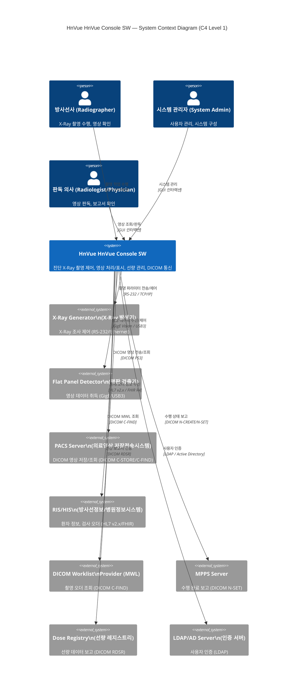

### 3.2 SW 시스템 경계 정의 (Software System Boundary)

**포함 (In Scope):**
- GUI 애플리케이션 계층 (Qt 기반 사용자 인터페이스)
- 비즈니스 로직 계층 (워크플로우 엔진, 선량 계산, 영상 처리 파이프라인)
- 데이터 액세스 계층 (SQLite, 파일시스템, DICOM 저장소)
- 외부 인터페이스 계층 (Generator, Detector, DICOM, HL7 어댑터)
- 보안 모듈 (인증, 암호화, 감사 추적)

**제외 (Out of Scope):**
- X-Ray Generator 펌웨어
- Flat Panel Detector 펌웨어/드라이버
- PACS/RIS 서버 소프트웨어
- 운영체제 (Windows 10/11)
- 네트워크 인프라스트럭처

**외부 인터페이스 경계:**
- Generator 제어 인터페이스: RS-232 또는 TCP/IP 시리얼 프로토콜
- Detector 인터페이스: GigE Vision 또는 USB3 Vision 프로토콜
- DICOM 네트워크 인터페이스: DICOM PS3.x SCU/SCP 역할
- HL7 인터페이스: HL7 v2.x 메시지 (ADT, ORM, ORU)

---

## 4. 아키텍처 뷰 (Architecture Views — 4+1 View Model)

### 4.1 개요

본 절은 Philippe Kruchten의 4+1 View Model을 기반으로 HnVue HnVue Console SW 아키텍처를 다섯 가지 관점에서 서술한다.

| 뷰 | 관점 | 주요 대상 |
|---|---|---|
| Logical View (논리 뷰) | 기능 분해, 계층 구조 | 개발자, 아키텍트 |
| Process View (프로세스 뷰) | 동시성, 스레드 | 통합 엔지니어 |
| Development View (개발 뷰) | 모듈/패키지 구조 | 개발자 |
| Physical View (물리 뷰) | 배포 구성 | 시스템 엔지니어 |
| Scenario View (+1) | 주요 Use Case 흐름 | 전체 이해관계자 |

### 4.2 Logical View (논리 뷰) — 계층 구조

```mermaid
graph TD
    subgraph "UI Layer (사용자 인터페이스 계층)"
        UI1[PatientManagement UI<br/>환자 관리 화면]
        UI2[WorkflowControl UI<br/>촬영 워크플로우 화면]
        UI3[ImageViewer UI<br/>영상 뷰어]
        UI4[DoseDisplay UI<br/>선량 표시]
        UI5[SystemAdmin UI<br/>시스템 관리 화면]
    end

    subgraph "Business Logic Layer (비즈니스 로직 계층)"
        BL1[PatientManagement Module<br/>SAD-PM-100]
        BL2[WorkflowEngine Module<br/>SAD-WF-200]
        BL3[ImageProcessing Module<br/>SAD-IP-300]
        BL4[DoseManagement Module<br/>SAD-DM-400]
        BL5[SystemAdmin Module<br/>SAD-SA-600]
        BL6[SecurityModule<br/>SAD-CS-700]
    end

    subgraph "Data Access Layer (데이터 액세스 계층)"
        DA1[DataPersistence Module<br/>SAD-DB-900]
        DA2[DICOM Storage Manager]
        DA3[File System Manager]
        DA4[Audit Trail Logger]
    end

    subgraph "External Interface Layer (외부 인터페이스 계층)"
        EI1[DICOMCommunication Module<br/>SAD-DC-500]
        EI2[Generator Interface Adapter]
        EI3[Detector Interface Adapter]
        EI4[HL7 Message Adapter]
    end

    subgraph "Framework Layer (프레임워크 계층)"
        FL1[UIFramework Module<br/>SAD-UI-800<br/>Qt 6.x Framework]
        FL2[SOUP: Qt Framework]
        FL3[SOUP: DCMTK/fo-dicom]
        FL4[SOUP: OpenCV]
        FL5[SOUP: SQLite]
    end

    UI1 & UI2 & UI3 & UI4 & UI5 --> BL1 & BL2 & BL3 & BL4 & BL5
    BL1 & BL2 & BL3 & BL4 & BL5 --> BL6
    BL1 & BL2 & BL3 & BL4 & BL5 --> DA1
    BL2 --> EI1 & EI2 & EI3
    BL1 --> EI4
    DA1 --> DA2 & DA3 & DA4
    EI1 --> FL3
    BL3 --> FL4
    DA1 --> FL5
    FL1 --> FL2
    classDef default fill:#444,stroke:#666,color:#fff
```

### 4.3 Process View (프로세스 뷰) — 동시성 및 스레드 모델

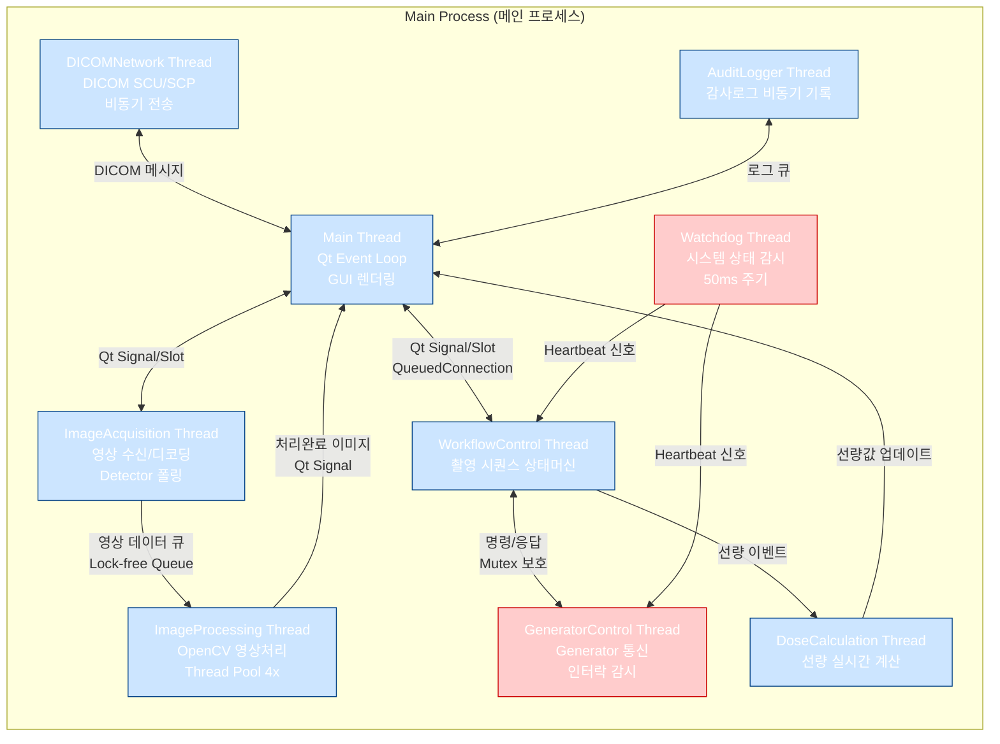

**스레드 우선순위 (Thread Priority):**

| 스레드 | 우선순위 | 설명 |
|---|---|---|
| Watchdog Thread | REALTIME (최고) | 시스템 이상 감지, Safety Critical |
| GeneratorControl Thread | HIGH | 발생기 제어, 인터락 실시간 처리 |
| ImageAcquisition Thread | HIGH | 영상 데이터 손실 방지 |
| WorkflowControl Thread | NORMAL+1 | 촬영 시퀀스 제어 |
| Main Thread (GUI) | NORMAL | Qt 이벤트 루프 |
| ImageProcessing Thread Pool | BELOW_NORMAL | 후처리, 지연 허용 |
| DICOMNetwork Thread | BELOW_NORMAL | 네트워크 전송, 지연 허용 |
| AuditLogger Thread | LOWEST | 감사 로그 비동기 기록 |

### 4.4 Development View (개발 뷰) — 패키지/모듈 구조

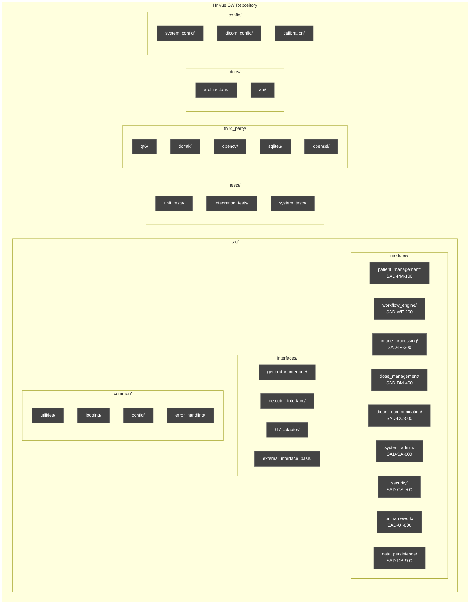

**빌드 시스템:** CMake 3.25+, C++17 표준  
**컴파일러:** MSVC 2022 / GCC 12 (크로스 플랫폼 지원)  
**정적 분석:** Clang-Tidy, PVS-Studio  
**단위 테스트 프레임워크:** Google Test (gtest)  

### 4.5 Physical View (물리 뷰) — 배포 다이어그램

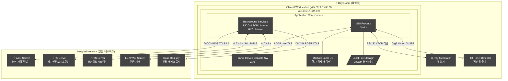

**하드웨어 최소 사양 (Minimum Hardware Specification):**

| 항목 | 최소 사양 | 권장 사양 |
|---|---|---|
| CPU | Intel Core i5 (8세대+), 4코어 | Intel Core i7/i9, 8코어 이상 |
| RAM | 16 GB | 32 GB |
| Storage | SSD 256 GB (OS), HDD 2 TB (영상) | SSD 512 GB + NVMe 4 TB |
| GPU | 2 GB VRAM (영상 표시) | 4 GB VRAM (영상 처리 가속) |
| Display | 1920×1080 (Full HD) | 2560×1440 (WQHD) 의료용 모니터 |
| NIC | Gigabit Ethernet | Dual Gigabit Ethernet |
| OS | Windows 10 Pro 22H2 | Windows 11 Pro 24H2 |

---

## 5. SW 아이템 분해 (SW Item Decomposition — IEC 62304 §5.3.1)

### 5.1 소프트웨어 아이템 목록 개요

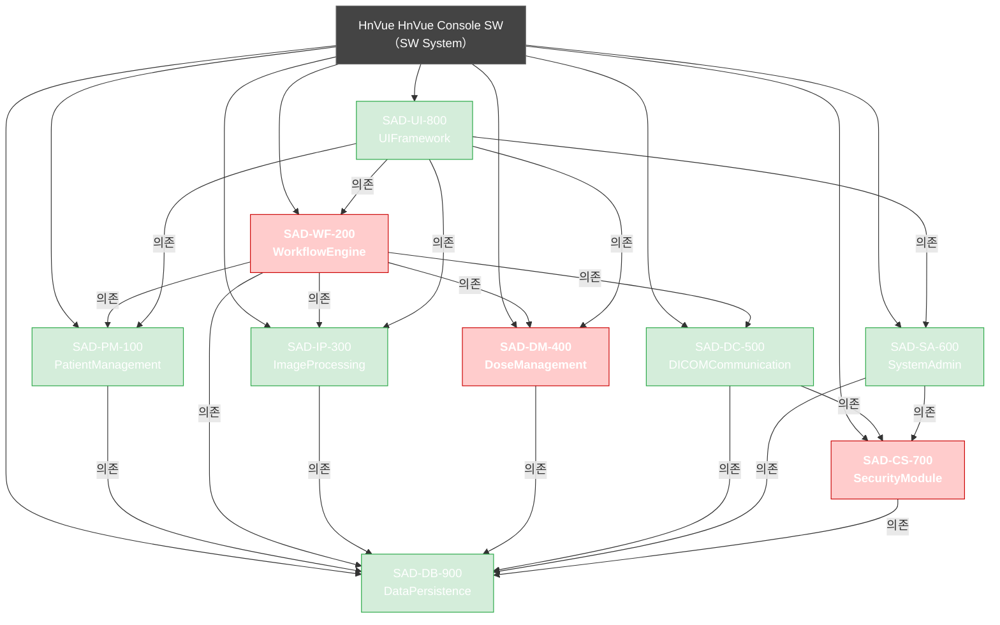

> **범례:** 빨간색 테두리 모듈 = Safety-Critical (안전 중요) 모듈

### 5.2 SAD-PM-100: PatientManagement Module (환자 관리 모듈)

| 항목 | 내용 |
|---|---|
| **모듈 ID** | SAD-PM-100 |
| **모듈명** | PatientManagement Module |
| **IEC 62304 Safety Class** | Class B |
| **Safety-Critical** | 아니오 |

**책임 (Responsibilities):**
- 환자 등록, 조회, 수정, 삭제 (CRUD) 기능
- DICOM Modality Worklist (MWL) 연동을 통한 환자/검사 오더 수신
- HL7 ADT/ORM 메시지 처리 및 환자 정보 동기화
- 환자 식별자 (Patient ID, Accession Number) 관리
- 검사 이력 조회

**인터페이스 (Interfaces):**

| 인터페이스 ID | 유형 | 대상 모듈/시스템 | 설명 |
|---|---|---|---|
| IF-PM-001 | 제공 (Provided) | SAD-UI-800, SAD-WF-200 | PatientData API (환자 데이터 CRUD) |
| IF-PM-002 | 요구 (Required) | SAD-DB-900 | 환자 데이터 영속화 |
| IF-PM-003 | 요구 (Required) | SAD-DC-500 | MWL C-FIND 요청 |
| IF-PM-004 | 요구 (Required) | SAD-CS-700 | 데이터 접근 권한 검증 |
| IF-PM-005 | 요구 (Required) | HL7 Adapter | HL7 ADT/ORM 수신 |

**의존관계:** SAD-DB-900, SAD-DC-500, SAD-CS-700  
**관련 SWR:** SWR-PM-001~SWR-PM-030 (환자 관리 요구사항)

---

### 5.3 SAD-WF-200: WorkflowEngine Module (워크플로우 엔진 모듈)

| 항목 | 내용 |
|---|---|
| **모듈 ID** | SAD-WF-200 |
| **모듈명** | WorkflowEngine Module |
| **IEC 62304 Safety Class** | Class B |
| **Safety-Critical** | **예 (Yes)** — Generator 제어, 촬영 인터락 관리 |

**책임 (Responsibilities):**
- 촬영 워크플로우 상태 머신 (State Machine) 관리
- X-Ray Generator 제어 명령 발행 및 응답 처리
- Flat Panel Detector 촬영 트리거 및 동기화
- 촬영 파라미터 (kVp, mAs, Dose) 검증 및 적용
- 선량 인터락 (Dose Interlock) 로직 실행
- MPPS (Modality Performed Procedure Step) 관리
- AEC (Automatic Exposure Control) 연동

**촬영 워크플로우 상태 머신:**

| 상태 | 전이 조건 | 안전 제어 |
|---|---|---|
| IDLE | 환자 선택 → PATIENT_SELECTED | — |
| PATIENT_SELECTED | 프로토콜 선택 → PROTOCOL_LOADED | — |
| PROTOCOL_LOADED | 촬영 준비 → READY_TO_EXPOSE | 파라미터 범위 검증 |
| READY_TO_EXPOSE | Expose 버튼 → EXPOSING | 인터락 체크, Generator 활성화 |
| EXPOSING | 조사 완료 → IMAGE_ACQUIRING | Dose 실시간 모니터링 |
| IMAGE_ACQUIRING | 영상 수신 완료 → IMAGE_PROCESSING | — |
| IMAGE_PROCESSING | 처리 완료 → IMAGE_REVIEW | — |
| IMAGE_REVIEW | 승인/재촬영 → COMPLETED/READY_TO_EXPOSE | — |
| COMPLETED | 다음 촬영/종료 → IDLE | — |
| ERROR | 에러 해제 → IDLE | 안전 종료 시퀀스 |

**인터페이스 (Interfaces):**

| 인터페이스 ID | 유형 | 대상 모듈/시스템 | 설명 |
|---|---|---|---|
| IF-WF-001 | 제공 (Provided) | SAD-UI-800 | WorkflowControl API |
| IF-WF-002 | 요구 (Required) | Generator Interface Adapter | Generator 제어 명령 |
| IF-WF-003 | 요구 (Required) | Detector Interface Adapter | Detector 트리거/데이터 수신 |
| IF-WF-004 | 요구 (Required) | SAD-DM-400 | 선량 파라미터 검증, 인터락 |
| IF-WF-005 | 요구 (Required) | SAD-IP-300 | 영상 처리 파이프라인 시작 |
| IF-WF-006 | 요구 (Required) | SAD-DC-500 | MPPS 업데이트 |
| IF-WF-007 | 요구 (Required) | SAD-DB-900 | 검사 기록 저장 |

**의존관계:** SAD-DM-400, SAD-IP-300, SAD-DC-500, SAD-DB-900, Generator/Detector Interface  
**관련 SWR:** SWR-WF-001~SWR-WF-050 (촬영 워크플로우 요구사항)

---

### 5.4 SAD-IP-300: ImageProcessing Module (영상 처리 모듈)

| 항목 | 내용 |
|---|---|
| **모듈 ID** | SAD-IP-300 |
| **모듈명** | ImageProcessing Module |
| **IEC 62304 Safety Class** | Class B |
| **Safety-Critical** | 아니오 (표시 품질에 영향, 진단 보조) |

**책임 (Responsibilities):**
- Raw Detector 데이터로부터 진단 가능 영상 생성
- 영상 전처리: 결함 픽셀 교정, 오프셋/게인 보정, 선형화
- 윈도우/레벨 (Window/Level) 자동/수동 조정
- 영상 후처리: 샤프닝, 노이즈 감소, 동적 범위 압축
- DICOM 이미지 포맷 변환 및 메타데이터 삽입
- 영상 주석 (Annotation) 처리
- 영상 측정 도구 (길이, 각도, 면적)
- 멀티프레임 영상 처리

**인터페이스 (Interfaces):**

| 인터페이스 ID | 유형 | 대상 모듈/시스템 | 설명 |
|---|---|---|---|
| IF-IP-001 | 제공 (Provided) | SAD-WF-200 | ImageProcessing Pipeline API |
| IF-IP-002 | 제공 (Provided) | SAD-UI-800 | 처리된 이미지 렌더링 데이터 |
| IF-IP-003 | 요구 (Required) | SAD-DB-900 | 영상 처리 설정 로드/저장 |
| IF-IP-004 | 요구 (Required) | SOUP: OpenCV | 영상 알고리즘 실행 |
| IF-IP-005 | 제공 (Provided) | SAD-DC-500 | DICOM 이미지 객체 |

**의존관계:** SAD-DB-900, SOUP(OpenCV)  
**관련 SWR:** SWR-IP-001~SWR-IP-040 (영상 처리 요구사항)

---

### 5.5 SAD-DM-400: DoseManagement Module (선량 관리 모듈)

| 항목 | 내용 |
|---|---|
| **모듈 ID** | SAD-DM-400 |
| **모듈명** | DoseManagement Module |
| **IEC 62304 Safety Class** | Class B |
| **Safety-Critical** | **예 (Yes)** — 선량 한계 초과 방지 인터락 |

**책임 (Responsibilities):**
- 촬영 선량 (EI, DAP, Effective Dose) 실시간 계산
- 누적 선량 추적 (환자 이력 기반)
- 선량 한계 (Dose Alert/Limit) 설정 및 모니터링
- DICOM Radiation Dose Structured Report (RDSR) 생성
- 선량 레지스트리 보고
- ALARA 원칙 기반 선량 최적화 가이드 제공

**인터페이스 (Interfaces):**

| 인터페이스 ID | 유형 | 대상 모듈/시스템 | 설명 |
|---|---|---|---|
| IF-DM-001 | 제공 (Provided) | SAD-WF-200 | 선량 인터락 API (촬영 허가/차단) |
| IF-DM-002 | 제공 (Provided) | SAD-UI-800 | 선량 표시 데이터 |
| IF-DM-003 | 요구 (Required) | SAD-DB-900 | 선량 이력 저장/조회 |
| IF-DM-004 | 요구 (Required) | SAD-DC-500 | RDSR 전송 |
| IF-DM-005 | 제공 (Provided) | SAD-WF-200 | 실시간 선량 이벤트 콜백 |

**의존관계:** SAD-DB-900, SAD-DC-500  
**관련 SWR:** SWR-DM-001~SWR-DM-025 (선량 관리 요구사항)

---

### 5.6 SAD-DC-500: DICOMCommunication Module (DICOM 통신 모듈)

| 항목 | 내용 |
|---|---|
| **모듈 ID** | SAD-DC-500 |
| **모듈명** | DICOMCommunication Module |
| **IEC 62304 Safety Class** | Class B |
| **Safety-Critical** | 아니오 |

**책임 (Responsibilities):**
- DICOM 네트워킹 (C-STORE, C-FIND, C-MOVE, C-GET, N-CREATE, N-SET)
- DICOM SCU/SCP 역할 구현 (PACS, Worklist, MPPS, Dose)
- DICOM 파일 입출력 (DICOM PS3.10)
- DICOM 메타데이터 생성/파싱
- TLS 암호화 DICOM 통신 (DICOM TLS Profile)
- WADO-RS/STOW-RS 지원 (Phase 2)

**인터페이스 (Interfaces):**

| 인터페이스 ID | 유형 | 대상 모듈/시스템 | 설명 |
|---|---|---|---|
| IF-DC-001 | 제공 (Provided) | SAD-WF-200, SAD-PM-100 | DICOM Network API |
| IF-DC-002 | 요구 (Required) | SOUP: DCMTK/fo-dicom | DICOM 프로토콜 스택 |
| IF-DC-003 | 요구 (Required) | SAD-CS-700 | TLS 인증서/키 관리 |
| IF-DC-004 | 요구 (Required) | SAD-DB-900 | DICOM 설정 로드 |
| IF-DC-005 | 외부 | PACS/Worklist/MPPS/RDSR | DICOM 네트워크 통신 |

**의존관계:** SAD-CS-700, SAD-DB-900, SOUP(DCMTK)  
**관련 SWR:** SWR-DC-001~SWR-DC-035 (DICOM 통신 요구사항)

---

### 5.7 SAD-SA-600: SystemAdmin Module (시스템 관리 모듈)

| 항목 | 내용 |
|---|---|
| **모듈 ID** | SAD-SA-600 |
| **모듈명** | SystemAdmin Module |
| **IEC 62304 Safety Class** | Class B |
| **Safety-Critical** | 아니오 |

**책임 (Responsibilities):**
- 사용자 계정 관리 (생성, 수정, 삭제, 권한 설정)
- 역할 기반 접근 제어 (RBAC: Radiographer, Radiologist, Admin, Service)
- 시스템 구성 관리 (DICOM AE Title, 네트워크 설정)
- 촬영 프로토콜 관리 (프로토콜 라이브러리 편집)
- 시스템 상태 모니터링 (Generator, Detector 연결 상태)
- 소프트웨어 업데이트 관리
- 감사 로그 조회

**인터페이스 (Interfaces):**

| 인터페이스 ID | 유형 | 대상 모듈/시스템 | 설명 |
|---|---|---|---|
| IF-SA-001 | 제공 (Provided) | SAD-UI-800 | SystemAdmin API |
| IF-SA-002 | 요구 (Required) | SAD-CS-700 | 사용자 인증/권한 관리 |
| IF-SA-003 | 요구 (Required) | SAD-DB-900 | 설정/사용자 데이터 저장 |

**의존관계:** SAD-CS-700, SAD-DB-900  
**관련 SWR:** SWR-SA-001~SWR-SA-020 (시스템 관리 요구사항)

---

### 5.8 SAD-CS-700: SecurityModule (보안 모듈)

| 항목 | 내용 |
|---|---|
| **모듈 ID** | SAD-CS-700 |
| **모듈명** | SecurityModule |
| **IEC 62304 Safety Class** | Class B |
| **Safety-Critical** | **예 (Yes)** — 무허가 접근 및 데이터 무결성 보호 |

**책임 (Responsibilities):**
- 사용자 인증 (로컬 + LDAP/AD 연동)
- 세션 관리 (Session Token, 자동 잠금)
- 역할 기반 접근 제어 (RBAC) 정책 적용
- 데이터 암호화 (AES-256, TLS 1.3)
- 디지털 서명 (감사 로그 무결성)
- 보안 감사 추적 (Audit Trail) 생성
- 비밀번호 정책 적용 (NIST SP 800-63B 준수)
- 보안 이벤트 감지 및 알림

**인터페이스 (Interfaces):**

| 인터페이스 ID | 유형 | 대상 모듈/시스템 | 설명 |
|---|---|---|---|
| IF-CS-001 | 제공 (Provided) | 전체 모듈 | AuthorizationCheck API |
| IF-CS-002 | 제공 (Provided) | SAD-SA-600 | UserManagement API |
| IF-CS-003 | 요구 (Required) | SAD-DB-900 | 인증 데이터, 감사 로그 저장 |
| IF-CS-004 | 요구 (Required) | LDAP Server | 외부 인증 |
| IF-CS-005 | 요구 (Required) | SOUP: OpenSSL | 암호화/TLS |

**의존관계:** SAD-DB-900, SOUP(OpenSSL), LDAP Server  
**관련 SWR:** SWR-CS-001~SWR-CS-030 (사이버보안 요구사항)

---

### 5.9 SAD-UI-800: UIFramework Module (UI 프레임워크 모듈)

| 항목 | 내용 |
|---|---|
| **모듈 ID** | SAD-UI-800 |
| **모듈명** | UIFramework Module |
| **IEC 62304 Safety Class** | Class B |
| **Safety-Critical** | 아니오 |

**책임 (Responsibilities):**
- Qt 6.x 기반 메인 애플리케이션 프레임워크
- MVC/MVP 아키텍처 패턴 구현
- 공통 UI 컴포넌트 라이브러리 (위젯, 다이얼로그, 테이블)
- 테마/스킨 관리 (고대비 모드 포함)
- 다국어 지원 (i18n/l10n: 한국어, 영어, 일본어)
- 키보드 단축키 관리
- 스플래시 화면, 로딩 인디케이터

**의존관계:** 모든 비즈니스 로직 모듈, SOUP(Qt Framework)  
**관련 SWR:** SWR-UI-001~SWR-UI-020 (UI 프레임워크 요구사항)

---

### 5.10 SAD-DB-900: DataPersistence Module (데이터 영속화 모듈)

| 항목 | 내용 |
|---|---|
| **모듈 ID** | SAD-DB-900 |
| **모듈명** | DataPersistence Module |
| **IEC 62304 Safety Class** | Class B |
| **Safety-Critical** | 아니오 |

**책임 (Responsibilities):**
- SQLite 데이터베이스 연결 관리 및 ORM
- 데이터베이스 스키마 마이그레이션 관리
- 트랜잭션 관리 (ACID 보장)
- 쿼리 최적화 및 인덱싱
- 데이터베이스 백업/복구 실행
- 파일시스템 관리 (DICOM 영상 파일 입출력)
- 데이터 아카이빙

**의존관계:** SOUP(SQLite3)  
**관련 SWR:** SWR-DB-001~SWR-DB-015 (데이터 영속화 요구사항)

---

### 5.11 SAD-CD-1000: CDDVDBurning Module (CD/DVD 버닝 모듈)

| 항목 | 내용 |
|---|---|
| **모듈 ID** | SAD-CD-1000 |
| **모듈명** | CDDVDBurning Module |
| **IEC 62304 Safety Class** | Class B |
| **Safety-Critical** | 아니오 |
| **MR 연계** | MR-072 (Tier 2 — CD/DVD Burning with DICOM Viewer) |
| **Phase** | Phase 1 |

**책임 (Responsibilities):**
- DICOM 영상 선택 및 CD/DVD 매체에 굽기 (Windows IMAPI2 또는 동급 라이브러리 활용)
- 번들 DICOM Viewer (오픈소스 또는 자체 경량 뷰어) 포함 패키징
- 이동식 미디어 PHI 보호 — 비밀번호 보호 또는 AES-256 암호화 적용
- CD/DVD 생성 이벤트 감사 로그 기록 (환자 ID, 생성자, 생성 시각)
- 미디어 생성 완료 후 무결성 확인 (베리파이)

**접근 권한:** Admin 또는 Radiologist 역할 전용 (RBAC — SAD-CS-700 연계)  
**의존관계:** SAD-DB-900 (DataPersistence), SAD-CS-700 (SecurityModule), SOUP(IMAPI2 또는 동급)  
**관련 MR:** MR-072 (CD/DVD Burning — Tier 2, feel-DRCS 기본 기능, Xmaru V1 기본 기능)

---

## 6. 인터페이스 정의 (Interface Definition — IEC 62304 §5.3.2)

### 6.1 모듈 간 내부 인터페이스 (Internal Module Interfaces)

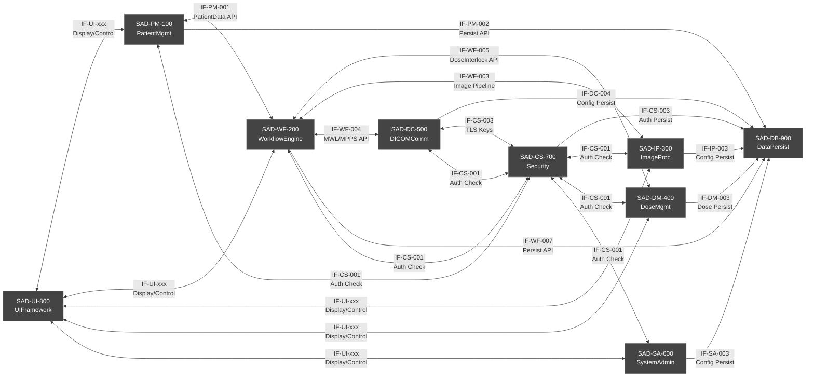

### 6.2 외부 인터페이스 정의 (External Interfaces)

| 인터페이스 ID | 이름 | 외부 시스템 | 프로토콜 | 데이터 형식 | 방향 | 암호화 |
|---|---|---|---|---|---|---|
| EIF-001 | Generator Control | X-Ray Generator | RS-232 / TCP | 제조사 독점 프로토콜 (Vendor-specific) | 양방향 | 없음 (물리적 격리) |
| EIF-002 | Detector Image Acquisition | FPD (Flat Panel Detector) | GigE Vision / USB3 | 원시 영상 데이터 (14-bit RAW) | 수신 | 없음 (로컬 연결) |
| EIF-003 | DICOM C-STORE (송신) | PACS | DICOM PS3.7 | DICOM SOP Class | 송신 | TLS 1.3 |
| EIF-004 | DICOM C-FIND (MWL) | Worklist Provider | DICOM PS3.7 | DICOM MWL SOP | 수신 | TLS 1.3 |
| EIF-005 | DICOM MPPS | MPPS SCP | DICOM PS3.7 | DICOM MPPS SOP | 송신 | TLS 1.3 |
| EIF-006 | DICOM RDSR | Dose Registry | DICOM PS3.7 | DICOM SR TID 10011 | 송신 | TLS 1.3 |
| EIF-007 | HL7 ADT/ORM | RIS/HIS | HL7 v2.x MLLP | HL7 메시지 | 수신 | MLLP-TLS |
| EIF-008 | LDAP 인증 | LDAP/AD Server | LDAP v3 | LDAP | 양방향 | LDAPS (TLS) |

### 6.3 Generator 제어 인터페이스 상세 (Generator Control Interface Detail)

| 명령 | 파라미터 | 응답 | 타임아웃 |
|---|---|---|---|
| PREPARE_EXPOSURE | kVp, mAs, Focus | ACK / NACK | 5초 |
| ARM | — | READY / ERROR | 3초 |
| FIRE | — | EXPOSURE_STARTED | 500ms |
| ABORT | — | ACK | 즉시 |
| STATUS_QUERY | — | STATUS_RESPONSE | 1초 |
| RESET | — | ACK / NACK | 10초 |

**에러 처리:** NACK 수신 또는 타임아웃 시 WorkflowEngine이 ERROR 상태로 전이, 안전 종료 시퀀스 실행

### 6.4 HL7 메시지 인터페이스

| 메시지 유형 | 트리거 이벤트 | 처리 방향 | 설명 |
|---|---|---|---|
| ADT^A04 | 환자 등록 | 수신 | 신규 환자 정보 수신 |
| ADT^A08 | 환자 정보 수정 | 수신 | 환자 정보 업데이트 |
| ORM^O01 | 검사 오더 | 수신 | 검사 오더 수신 (Worklist 대체) |
| ORU^R01 | 결과 보고 | 송신 | 촬영 완료 보고 (Phase 2) |

---

## 7. SOUP 통합 아키텍처 (SOUP Integration Architecture — IEC 62304 §5.3.3)

### 7.1 SOUP 목록 (SOUP Inventory)

| SOUP ID | 이름 | 버전 | 제조사/커뮤니티 | 용도 | Safety Class 기여 | 라이선스 |
|---|---|---|---|---|---|---|
| SOUP-001 | Qt Framework | 6.6 LTS | Qt Group | GUI 프레임워크, 이벤트 루프, 네트워킹 | Class B | LGPL 3.0 (상용) |
| SOUP-002 | DCMTK | 3.6.8 | OFFIS e.V. | DICOM 프로토콜 스택 | Class B | OFFIS Source License |
| SOUP-003 | OpenCV | 4.9.x | OpenCV Foundation | 영상 처리 알고리즘 | Class A | Apache 2.0 |
| SOUP-004 | SQLite | 3.45.x | D. Richard Hipp | 로컬 데이터베이스 | Class B | Public Domain |
| SOUP-005 | OpenSSL | 3.3.x | OpenSSL Foundation | 암호화, TLS | Class B | Apache 2.0 |
| SOUP-006 | zlib | 1.3.x | zlib team | 데이터 압축 | Class A | zlib License |
| SOUP-007 | Boost.Asio | 1.84.x | Boost | 비동기 네트워킹 | Class B | BSL-1.0 |

### 7.2 Qt Framework 통합 방식

**아키텍처 패턴:** Qt의 Signal/Slot 메커니즘을 활용한 이벤트 기반 아키텍처 (Event-Driven Architecture) 적용

- **Qt QObject 상속 계층:** 모든 모듈 클래스가 QObject를 상속하여 Signal/Slot 통신 지원
- **쓰레드 간 통신:** Qt::QueuedConnection을 사용하여 스레드 경계를 안전하게 통과
- **모델-뷰 분리:** Qt Model/View 프레임워크 활용 (QAbstractItemModel / QAbstractItemView)
- **이벤트 루프 통합:** QCoreApplication 이벤트 루프를 Main Thread에서만 실행
- **타이머 관리:** QTimer를 활용한 주기적 상태 폴링 (Generator Heartbeat, Watchdog)

**SOUP-001 위험 제어 (Risk Control):**
- Qt 공식 릴리즈 버전만 사용 (LTS 버전 우선)
- Qt 버그 트래커 모니터링 및 Critical Fix 신속 반영
- Qt 모듈 중 의료용으로 부적합한 기능 제한적 사용

### 7.3 DCMTK/fo-dicom 래퍼 설계

**래퍼 패턴:** Facade Pattern 적용 — DCMTK 복잡성을 캡슐화하여 내부 모듈에 단순 API 제공

```
DICOMCommunication Module (SAD-DC-500)
    ├── DicomStoreSCU        ← DCMTK DcmStoreSCU 래핑
    ├── DicomFindSCU         ← DCMTK DcmFindSCU 래핑 (MWL)
    ├── DicomStoreSCP        ← DCMTK DcmStoreSCP 래핑 (수신)
    ├── DicomMPPS            ← DCMTK N-CREATE/N-SET 래핑
    ├── DicomRDSR            ← DCMTK SR TID 10011 래핑
    └── DicomFileIO          ← DCMTK DcmFileFormat 래핑
```

**에러 처리:** DCMTK EC_Normal 비교 패턴 사용, 모든 DICOM 오류는 DICOMException으로 래핑 후 상위 모듈로 전파

### 7.4 OpenCV 영상 처리 파이프라인

```
Raw Detector Data (14-bit RAW)
    ↓ [1] Dark Offset Calibration (암보정)
    ↓ [2] Gain Calibration (게인 보정)
    ↓ [3] Bad Pixel Correction (결함 픽셀 교정)
    ↓ [4] Log Transform / Linearization (선형화)
    ↓ [5] Noise Reduction — cv::bilateralFilter / cv::GaussianBlur
    ↓ [6] Edge Enhancement — cv::Laplacian / Unsharp Masking
    ↓ [7] Window/Level Mapping (8-bit 변환)
    ↓ [8] DICOM Image Object 생성
    ↓ [9] Display Rendering — Qt QImage
```

**스레드 처리:** OpenCV 처리는 전용 ImageProcessing Thread Pool (4 threads)에서 실행  
**GPU 가속:** OpenCV CUDA 모듈 선택적 활용 (하드웨어 가용 시)

### 7.5 SQLite 데이터 레이어

**연결 관리:** Connection Pool (최대 5개 연결) 운영  
**WAL 모드:** Write-Ahead Logging 활성화 (동시 읽기/쓰기 성능 향상)  
**암호화:** SQLCipher (SQLite 확장) 적용 — 환자 데이터 저장 시 AES-256 암호화  
**스키마 버전 관리:** 마이그레이션 스크립트 자동 실행 (데이터베이스 버전 테이블 관리)

---

## 8. 안전 아키텍처 (Safety Architecture)

### 8.1 Safety-Critical 모듈 식별 및 격리

**Safety-Critical 모듈 (IEC 62304 §5.3.6 근거):**

| 모듈 | 안전 위험 | 격리 전략 |
|---|---|---|
| SAD-WF-200 WorkflowEngine | 부정확한 Generator 제어 → 과도한 X-Ray 조사 | 전용 스레드, Watchdog 감시, 인터락 직접 제어 |
| SAD-DM-400 DoseManagement | 선량 한계 초과 방지 실패 | 독립 계산 로직, HW 인터락과 이중화 |
| SAD-CS-700 SecurityModule | 무허가 접근 → 환자 데이터 손상 또는 잘못된 촬영 | 모든 API 진입점 인증 검사, 단방향 의존관계 |

**격리 원칙:**
1. Safety-Critical 모듈은 Non-Safety 모듈에 의존하지 않음
2. Safety-Critical 경로의 오류는 즉시 WorkflowEngine ERROR 상태 전이
3. Hardware Interlock (발생기 HW 안전회로)과 SW 인터락 이중화

### 8.2 Dose Interlock 아키텍처

**선량 인터락 계층 구조:**

```
[Level 1] Hardware Interlock
    - Generator 내장 HW 과부하 차단 회로
    - 독립 동작, SW 제어 불가

[Level 2] SW Dose Interlock (SAD-DM-400)
    - 촬영 전 파라미터 검증 (kVp/mAs 범위 확인)
    - 누적 선량 알림 기준 (Alert Level) 확인
    - 촬영 허가/차단 신호를 WorkflowEngine에 전달

[Level 3] WorkflowEngine Interlock (SAD-WF-200)
    - Dose Interlock 신호 미수신 시 Generator FIRE 명령 차단
    - READY_TO_EXPOSE 상태 진입 조건에 Dose Check 포함

[Level 4] Application-level Alarm
    - 선량 한계 초과 시 경고 다이얼로그 표시 (사용자 확인 필요)
    - 한계 설정값 이상 시 강제 촬영 차단
```

**선량 인터락 로직 흐름:**

```
DoseManagement.checkDoseInterlock(protocol)
    → 1. 단회 선량 예상값 계산 (kVp, mAs, 검사 부위 기반)
    → 2. DRL (진단참고수준) 초과 여부 확인
    → 3. 환자 누적 선량 이력 조회
    → 4. 누적 선량 Alert/Limit 비교
    → 5. 결과: ALLOW / WARN_AND_ALLOW / BLOCK
       - ALLOW: 정상 촬영 허가
       - WARN_AND_ALLOW: 경고 표시 후 사용자 확인으로 허가
       - BLOCK: 촬영 차단, 이유 기록
```

### 8.3 Error Handling 전략 (에러 처리 전략)

**에러 분류 및 처리:**

| 에러 레벨 | 예시 | 처리 방법 |
|---|---|---|
| **CRITICAL** | Generator 통신 두절, 선량 인터락 실패 | 즉시 촬영 중단, ERROR 상태 전이, Watchdog 알림, 사용자/관리자 알림 |
| **ERROR** | DICOM 전송 실패, DB 쓰기 오류 | 재시도 (최대 3회), 실패 시 로컬 큐잉, 관리자 알림 |
| **WARNING** | Worklist 조회 실패, 네트워크 지연 | 로그 기록, 사용자 경고 표시, 수동 입력 허용 |
| **INFO** | 정상 동작 이벤트 | 감사 로그 기록 |

**에러 전파 원칙:**
- 모든 에러는 에러 코드 + 에러 메시지 + 컨텍스트 정보 포함
- C++ Exception 사용 (std::exception 파생 클래스 계층)
- UI 레이어에서 최종 에러 표시 (사용자 친화적 메시지)
- 안전 관련 에러는 자동 감사 로그 기록

### 8.4 Watchdog/Heartbeat 메커니즘

**Watchdog Thread 동작:**
- 50ms 주기로 모든 Critical Thread 상태 확인
- 각 Thread는 50ms 이내에 Heartbeat 신호 전송 필수
- Heartbeat 누락 시 해당 Thread 상태를 UNHEALTHY로 표시
- 3회 연속 누락 시 CRITICAL 에러 발생, 촬영 차단

**Generator 연결 Heartbeat:**
- 5초 주기로 Generator STATUS_QUERY 명령 전송
- 응답 없음 (15초) 시 Generator 통신 단절 CRITICAL 에러 발생
- WorkflowEngine EXPOSING 중 단절 시 즉각 ABORT 명령 시도 후 ERROR 전이

---

## 9. 보안 아키텍처 (Security Architecture)

### 9.1 인증/세션 관리 아키텍처

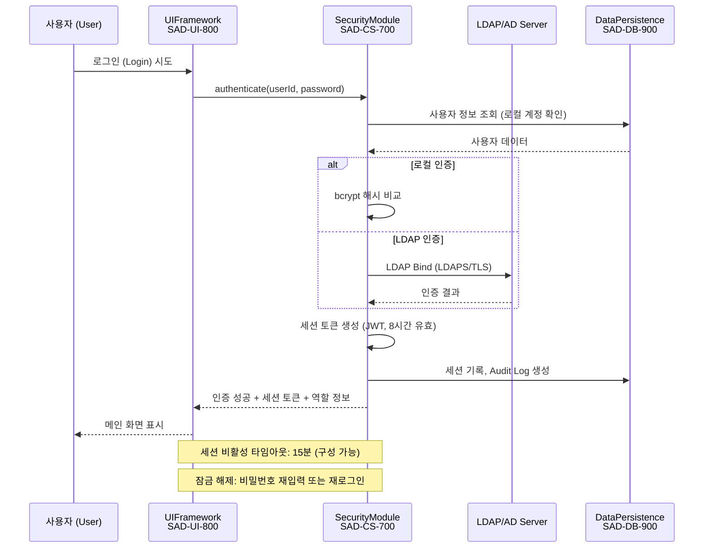

**세션 관리 정책:**
- 세션 토큰: JWT (JSON Web Token), HMAC-SHA256 서명
- 세션 유효 시간: 8시간 (로그아웃 시 즉시 무효화)
- 비활성 자동 잠금: 15분 (구성 가능, 1~60분)
- 동시 로그인: 1 세션/사용자 (이전 세션 자동 무효화)
- 실패 잠금: 5회 연속 실패 시 계정 30분 잠금

### 9.2 역할 기반 접근 제어 (RBAC)

| 역할 (Role) | 환자 관리 | 촬영 수행 | 영상 조회 | 선량 설정 | 시스템 관리 | 보안 설정 |
|---|---|---|---|---|---|---|
| Radiographer (방사선사) | 등록/조회 | 전체 | 자신의 촬영 | 조회만 | 불가 | 불가 |
| Radiologist (방사선과 의사) | 조회만 | 불가 | 전체 | 조회만 | 불가 | 불가 |
| Admin (관리자) | 전체 | 전체 | 전체 | 전체 | 전체 | 불가 |
| Service (서비스 엔지니어) | 불가 | 불가 | 불가 | 전체 | 전체 | 제한 |
| Security Admin (보안 관리자) | 불가 | 불가 | 불가 | 불가 | 불가 | 전체 |

### 9.3 데이터 암호화 계층

| 데이터 유형 | 저장 암호화 | 전송 암호화 | 알고리즘 |
|---|---|---|---|
| 환자 개인정보 (PHI) | AES-256 (SQLCipher) | TLS 1.3 | AES-256-GCM |
| DICOM 영상 | AES-256 (선택적) | TLS 1.3 | AES-256-GCM |
| 인증 비밀번호 | bcrypt (단방향 해시) | TLS 1.3 | bcrypt (cost=12) |
| 감사 로그 | 디지털 서명 | TLS 1.3 | HMAC-SHA256 |
| 구성 파일 | AES-256 | 로컬 전용 | AES-256-CBC |
| 세션 토큰 | 메모리 내 보호 | HTTPS/TLS | HMAC-SHA256 |

### 9.4 Audit Trail 아키텍처

**감사 추적 원칙:** 모든 환자 데이터 접근, 촬영 이벤트, 구성 변경, 보안 이벤트는 감사 로그에 기록한다.

**감사 로그 레코드 구조:**

| 필드 | 유형 | 설명 |
|---|---|---|
| log_id | UUID | 고유 로그 ID |
| timestamp | ISO 8601 | 이벤트 발생 시각 (UTC) |
| user_id | String | 이벤트 발생 사용자 |
| session_id | String | 세션 토큰 ID |
| event_type | Enum | LOGIN / LOGOUT / PATIENT_ACCESS / EXPOSURE / CONFIG_CHANGE / SECURITY_EVENT |
| resource_type | String | 대상 리소스 유형 |
| resource_id | String | 대상 리소스 ID |
| action | String | 수행된 작업 |
| result | Enum | SUCCESS / FAILURE / BLOCKED |
| ip_address | String | 클라이언트 IP |
| details | JSON | 추가 컨텍스트 정보 |
| signature | String | HMAC-SHA256 서명 (로그 위변조 방지) |

---

## 10. 데이터 아키텍처 (Data Architecture)

### 10.1 데이터 흐름도 (Data Flow Diagram)

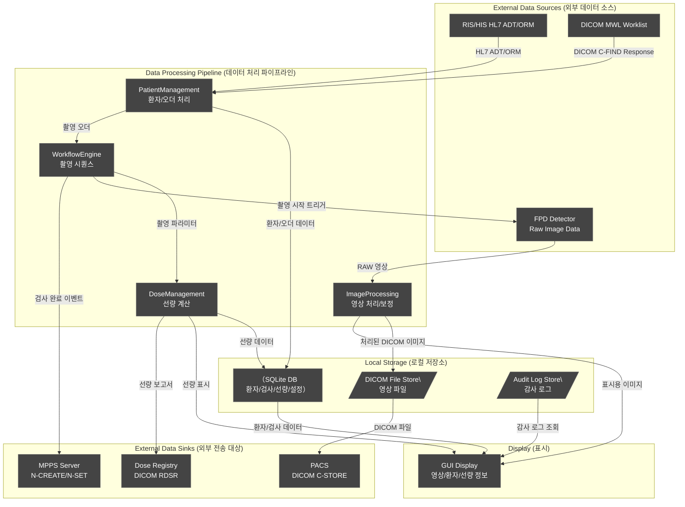

### 10.2 데이터베이스 스키마 주요 테이블

| 테이블명 | 설명 | 주요 컬럼 | 암호화 |
|---|---|---|---|
| patients | 환자 정보 | patient_id, name, birthdate, gender, patient_uid | AES-256 (PHI 컬럼) |
| studies | 검사 이력 | study_id, patient_id, study_date, accession_no, modality | 없음 |
| series | 시리즈 정보 | series_id, study_id, series_number, body_part | 없음 |
| images | 영상 메타데이터 | image_id, series_id, file_path, sop_instance_uid | 없음 |
| dose_records | 선량 기록 | dose_id, study_id, kvp, mas, dap, effective_dose, timestamp | 없음 |
| users | 사용자 계정 | user_id, username, password_hash, role, status | bcrypt 해시 |
| audit_logs | 감사 로그 | log_id, timestamp, user_id, event_type, result, signature | HMAC 서명 |
| system_config | 시스템 설정 | config_key, config_value, last_modified | AES-256 (민감 설정) |
| dicom_config | DICOM AE 설정 | ae_title, ip_address, port, tls_enabled | AES-256 |
| protocols | 촬영 프로토콜 | protocol_id, name, body_part, kvp_default, mas_default | 없음 |

### 10.3 영속화 전략 (Persistence Strategy)

**로컬 DB (SQLite):**
- 환자 정보, 검사 이력, 선량 데이터, 시스템 설정, 감사 로그
- WAL 모드, SQLCipher 암호화 적용
- 데이터 보관 기간: 법적 최소 요구사항 준수 (한국: 5년, FDA: CQAR 요구)

**DICOM 영상 저장:**
- DICOM Part 10 파일 형식으로 로컬 파일시스템 저장
- 파일 경로 규칙: `{base_path}/{patient_id}/{study_date}/{study_uid}/{series_uid}/{sop_uid}.dcm`
- 동시에 PACS로 C-STORE 전송 (비동기)
- 로컬 캐시 용량: 구성 가능 (기본 500GB)

### 10.4 백업/복구 전략 (Backup and Recovery)

| 백업 유형 | 대상 | 주기 | 방법 | 보존 기간 |
|---|---|---|---|---|
| 전체 백업 (Full Backup) | SQLite DB + 구성 파일 | 매일 02:00 | 암호화 압축 아카이브 | 30일 |
| 증분 백업 (Incremental) | SQLite DB WAL 로그 | 1시간마다 | WAL 파일 복사 | 7일 |
| 영상 백업 | DICOM 파일 | 촬영 즉시 | PACS C-STORE (실시간) | PACS 정책 |
| 설정 백업 | system_config, dicom_config | 구성 변경 시 | 이전 버전 보존 | 90일 |

**복구 목표:**
- RTO (복구 시간 목표): 4시간 이내
- RPO (복구 시점 목표): 최대 1시간 데이터 손실 허용

---

## 11. 성능 아키텍처 (Performance Architecture)

### 11.1 영상 수신~표시 파이프라인 최적화

**성능 목표:** 촬영 완료 후 3초 이내 전체 해상도 영상 표시

**파이프라인 최적화 전략:**

```
[1] Detector → 영상 수신 (병렬 패킷 수신, DMA 활용)
    목표: 100ms 이내

[2] 영상 수신 → 전처리 시작 (Thread Pool 즉시 할당)
    목표: 10ms 이내

[3] 전처리 처리 (Dark/Gain/BadPixel, 병렬 행 처리)
    목표: 500ms 이내 (2048×2048 기준)

[4] 윈도우/레벨 자동 계산 + 8비트 변환
    목표: 200ms 이내

[5] Qt QImage 변환 + GPU 텍스처 업로드
    목표: 100ms 이내

[6] OpenGL 렌더링 (Qt OpenGL Widget)
    목표: 16ms 이내 (60fps)

총 목표: ≤ 2초 (영상 처리 완료 표시)
DICOM 저장/전송: 비동기 처리 (표시와 병렬)
```

### 11.2 멀티스레드 구조 최적화

**Lock-free 데이터 구조:**
- ImageAcquisition → ImageProcessing: Lock-free Ring Buffer (원형 버퍼)
- AuditLogger: Lock-free SPSC (Single Producer Single Consumer) Queue

**Thread Pool 관리:**
- ImageProcessing: 동적 스레드 풀 (최소 2, 최대 CPU 코어 수 - 2)
- 작업 분배: OpenMP 병렬 처리 (행 단위 영상 처리 병렬화)

**메모리 복사 최소화:**
- Detector 영상 데이터: 핀드 메모리 (Pinned Memory) 할당 (GPU 사용 시)
- Qt QImage: 외부 데이터 참조 방식 생성 (copy 없이 렌더링)

### 11.3 메모리 관리 전략

**메모리 할당 정책:**

| 데이터 유형 | 할당 전략 | 해제 시점 |
|---|---|---|
| DICOM 영상 버퍼 | Memory Pool (사전 할당) | 촬영 후 DICOM 저장 완료 시 |
| Qt UI 오브젝트 | Qt 부모-자식 소유권 체계 | Qt 자동 관리 |
| DCMTK 객체 | RAII (스마트 포인터) | 스코프 종료 시 |
| DB 쿼리 결과 | 단기 소유 (즉시 처리) | 쿼리 처리 완료 즉시 |
| 감사 로그 버퍼 | SPSC Queue (고정 크기) | 디스크 기록 후 |

**메모리 한계:**
- 최대 영상 캐시: 2GB (구성 가능)
- 시스템 전체 메모리 사용: 운용 중 최대 4GB 목표
- 메모리 누수 방지: Valgrind 정기 검사, AddressSanitizer 빌드 검증

---

## 12. SWR→SAD 추적성 매트릭스 (Traceability Matrix: SWR → SAD)

### 12.1 PatientManagement (PM) 영역

| SWR ID | 요구사항 요약 | 구현 모듈 | 모듈 ID |
|---|---|---|---|
| SWR-PM-001 | 환자 신규 등록 (수동 입력) | PatientManagement | SAD-PM-100 |
| SWR-PM-002 | 환자 정보 조회 (ID/이름/생년월일) | PatientManagement | SAD-PM-100 |
| SWR-PM-003 | 환자 정보 수정 (권한 제한) | PatientManagement, SecurityModule | SAD-PM-100, SAD-CS-700 |
| SWR-PM-004 | 환자 삭제 (감사 로그 필수) | PatientManagement, SecurityModule | SAD-PM-100, SAD-CS-700 |
| SWR-PM-005 | DICOM MWL 환자 정보 자동 로드 | PatientManagement, DICOMCommunication | SAD-PM-100, SAD-DC-500 |
| SWR-PM-006 | HL7 ADT 메시지 환자 정보 수신 | PatientManagement | SAD-PM-100 |
| SWR-PM-010 | 검사 이력 조회 | PatientManagement, DataPersistence | SAD-PM-100, SAD-DB-900 |

### 12.2 WorkflowEngine (WF) 영역

| SWR ID | 요구사항 요약 | 구현 모듈 | 모듈 ID |
|---|---|---|---|
| SWR-WF-001 | 촬영 프로토콜 선택 및 로드 | WorkflowEngine | SAD-WF-200 |
| SWR-WF-005 | Generator 촬영 파라미터 전송 | WorkflowEngine | SAD-WF-200 |
| SWR-WF-010 | 촬영 시작/중단 명령 | WorkflowEngine | SAD-WF-200 |
| SWR-WF-015 | 선량 인터락 (촬영 전 검증) | WorkflowEngine, DoseManagement | SAD-WF-200, SAD-DM-400 |
| SWR-WF-020 | Generator 통신 오류 처리 | WorkflowEngine | SAD-WF-200 |
| SWR-WF-025 | AEC 연동 (자동 노출 제어) | WorkflowEngine | SAD-WF-200 |
| SWR-WF-030 | MPPS 검사 시작/완료 보고 | WorkflowEngine, DICOMCommunication | SAD-WF-200, SAD-DC-500 |
| SWR-WF-035 | Watchdog 상태 감시 | WorkflowEngine | SAD-WF-200 |

### 12.3 ImageProcessing (IP) 영역

| SWR ID | 요구사항 요약 | 구현 모듈 | 모듈 ID |
|---|---|---|---|
| SWR-IP-001 | Raw 영상 수신 및 디코딩 | ImageProcessing | SAD-IP-300 |
| SWR-IP-005 | 결함 픽셀 교정 | ImageProcessing | SAD-IP-300 |
| SWR-IP-010 | 오프셋/게인 보정 | ImageProcessing | SAD-IP-300 |
| SWR-IP-015 | 자동 윈도우/레벨 조정 | ImageProcessing | SAD-IP-300 |
| SWR-IP-020 | 수동 윈도우/레벨 조정 | ImageProcessing, UIFramework | SAD-IP-300, SAD-UI-800 |
| SWR-IP-025 | 영상 후처리 (노이즈 감소, 엣지 향상) | ImageProcessing | SAD-IP-300 |
| SWR-IP-030 | DICOM 영상 포맷 변환 | ImageProcessing, DICOMCommunication | SAD-IP-300, SAD-DC-500 |
| SWR-IP-035 | 촬영 후 3초 이내 영상 표시 | ImageProcessing, UIFramework | SAD-IP-300, SAD-UI-800 |

### 12.4 DoseManagement (DM) 영역

| SWR ID | 요구사항 요약 | 구현 모듈 | 모듈 ID |
|---|---|---|---|
| SWR-DM-001 | 촬영 선량 (EI, DAP) 계산 | DoseManagement | SAD-DM-400 |
| SWR-DM-005 | 누적 선량 추적 | DoseManagement, DataPersistence | SAD-DM-400, SAD-DB-900 |
| SWR-DM-010 | 선량 Alert/Limit 설정 및 경고 | DoseManagement, UIFramework | SAD-DM-400, SAD-UI-800 |
| SWR-DM-015 | 선량 한계 초과 시 촬영 차단 | DoseManagement, WorkflowEngine | SAD-DM-400, SAD-WF-200 |
| SWR-DM-020 | DICOM RDSR 생성 및 전송 | DoseManagement, DICOMCommunication | SAD-DM-400, SAD-DC-500 |

### 12.5 DICOMCommunication (DC) 영역

| SWR ID | 요구사항 요약 | 구현 모듈 | 모듈 ID |
|---|---|---|---|
| SWR-DC-001 | DICOM C-STORE SCU (PACS 전송) | DICOMCommunication | SAD-DC-500 |
| SWR-DC-005 | DICOM C-FIND SCU (MWL 조회) | DICOMCommunication | SAD-DC-500 |
| SWR-DC-010 | DICOM MPPS (N-CREATE/N-SET) | DICOMCommunication | SAD-DC-500 |
| SWR-DC-015 | DICOM TLS 암호화 통신 | DICOMCommunication, SecurityModule | SAD-DC-500, SAD-CS-700 |
| SWR-DC-020 | DICOM C-STORE SCP (수신) | DICOMCommunication | SAD-DC-500 |
| SWR-DC-025 | DICOM RDSR 전송 | DICOMCommunication, DoseManagement | SAD-DC-500, SAD-DM-400 |

### 12.6 SystemAdmin (SA) / Security (CS) 영역

| SWR ID | 요구사항 요약 | 구현 모듈 | 모듈 ID |
|---|---|---|---|
| SWR-SA-001 | 사용자 계정 생성/수정/삭제 | SystemAdmin, SecurityModule | SAD-SA-600, SAD-CS-700 |
| SWR-SA-005 | 역할 기반 접근 제어 (RBAC) | SecurityModule | SAD-CS-700 |
| SWR-SA-010 | 시스템 구성 관리 | SystemAdmin, DataPersistence | SAD-SA-600, SAD-DB-900 |
| SWR-CS-001 | 사용자 로그인/인증 | SecurityModule | SAD-CS-700 |
| SWR-CS-005 | 비밀번호 정책 (NIST SP 800-63B) | SecurityModule | SAD-CS-700 |
| SWR-CS-010 | 세션 자동 잠금 (비활성 타임아웃) | SecurityModule, UIFramework | SAD-CS-700, SAD-UI-800 |
| SWR-CS-015 | 감사 로그 기록 (모든 데이터 접근) | SecurityModule, DataPersistence | SAD-CS-700, SAD-DB-900 |
| SWR-CS-020 | 데이터 암호화 (PHI AES-256) | SecurityModule, DataPersistence | SAD-CS-700, SAD-DB-900 |
| SWR-CS-025 | LDAP/AD 인증 연동 | SecurityModule | SAD-CS-700 |

---

## 13. 부록 (Appendix)

### 13.1 기술 결정 사항 (Architecture Decision Records — ADR)

#### ADR-001: GUI 프레임워크 — Qt 6.x 선택

| 항목 | 내용 |
|---|---|
| **결정 일자** | 2025-09-01 |
| **상태** | 승인 |
| **결정** | Qt 6.6 LTS 를 메인 GUI 프레임워크로 채택 |
| **검토 대안** | wxWidgets, GTK+, Electron, WinForms/.NET |
| **이유** | 크로스 플랫폼 지원, 의료 SW 레퍼런스 다수, Signal/Slot 메커니즘, OpenGL 통합, LGPL 상용 라이선스 가용, 14년 이상 의료기기 SW 사용 이력 |
| **결과** | Qt 6.x 기반 C++ 아키텍처 확정 |
| **위험** | SOUP 의존성 증가 → SOUP 관리 절차로 완화 |

#### ADR-002: DICOM 라이브러리 — DCMTK 선택

| 항목 | 내용 |
|---|---|
| **결정 일자** | 2025-09-15 |
| **상태** | 승인 |
| **결정** | DCMTK 3.6.x를 DICOM 프로토콜 스택으로 채택 |
| **검토 대안** | fo-dicom (C#/.NET), orthanc-toolkit, pydicom |
| **이유** | C++ 네이티브 통합, 30년 이상 의료 현장 검증, OFFIS e.V. 유지관리, 전체 DICOM PS3 지원, 상용 지원 가능 |
| **결과** | DCMTK 기반 Facade 래퍼 설계 |
| **위험** | 복잡한 API → Facade 패턴으로 캡슐화 |

#### ADR-003: 데이터베이스 — SQLite 선택

| 항목 | 내용 |
|---|---|
| **결정 일자** | 2025-09-20 |
| **상태** | 승인 |
| **결정** | SQLite 3.x를 로컬 데이터베이스로 채택 |
| **검토 대안** | PostgreSQL, MariaDB, MongoDB |
| **이유** | 임베디드 배포 (별도 DB 서버 불필요), ACID 트랜잭션, 단독 장비 운영 환경, SQLCipher 암호화 확장, 의료기기 임베디드 표준 DB |
| **결과** | SQLite + SQLCipher 조합으로 로컬 DB 구현 |
| **위험** | 대용량 동시 접근 제한 → WAL 모드 + Connection Pool로 완화 |

#### ADR-004: 아키텍처 패턴 — 계층형 + 모듈형 하이브리드

| 항목 | 내용 |
|---|---|
| **결정 일자** | 2025-10-01 |
| **상태** | 승인 |
| **결정** | 4계층 아키텍처 (UI / Business Logic / Data Access / External Interface) + 기능별 모듈 분리 |
| **이유** | IEC 62304 §5.3.1 모듈 분해 요구사항 충족, 독립적 테스트 가능, Safety-Critical 모듈 격리 용이 |

#### ADR-005: 멀티스레드 전략 — Qt Thread + Custom Thread Pool

| 항목 | 내용 |
|---|---|
| **결정 일자** | 2025-10-15 |
| **상태** | 승인 |
| **결정** | Qt QThread 기반 전용 스레드 + OpenMP 기반 처리 스레드 풀 혼합 사용 |
| **이유** | Qt Signal/Slot과 자연스러운 통합, OpenMP의 영상 처리 병렬화 최적화, 스레드 간 안전한 통신 |

---

### 13.2 주요 Use Case 시퀀스 다이어그램 (Sequence Diagrams)

#### UC-001: 환자 선택 및 촬영 준비 시퀀스

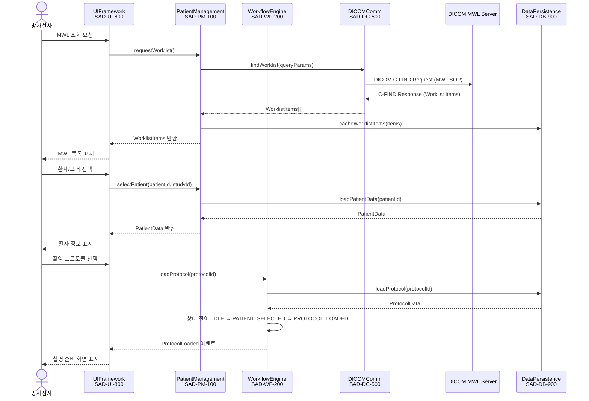

#### UC-002: X-Ray 촬영 실행 시퀀스

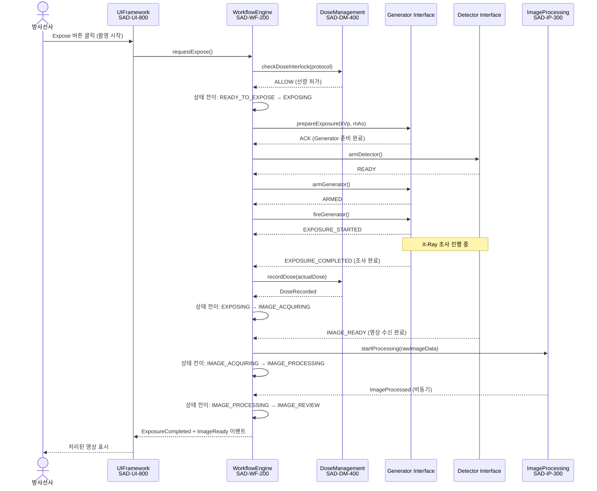

#### UC-003: DICOM PACS 전송 시퀀스

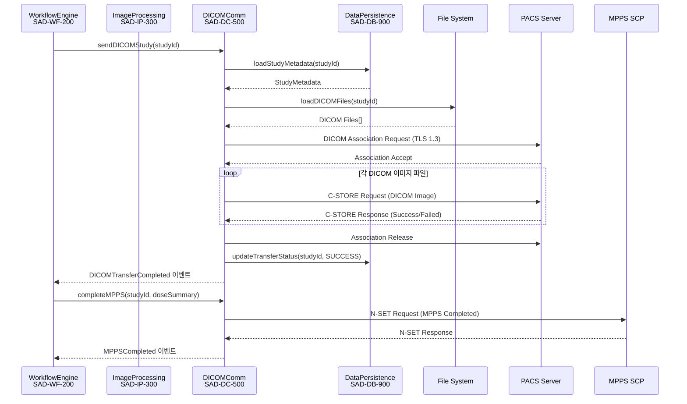

#### UC-004: 사용자 로그인 및 인증 시퀀스

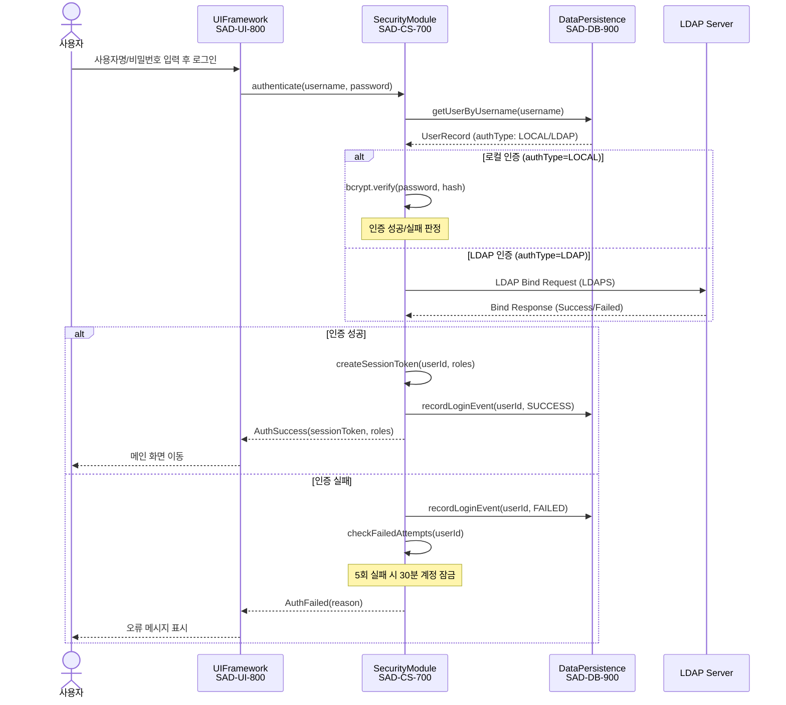

#### UC-005: 선량 초과 알림 및 인터락 시퀀스

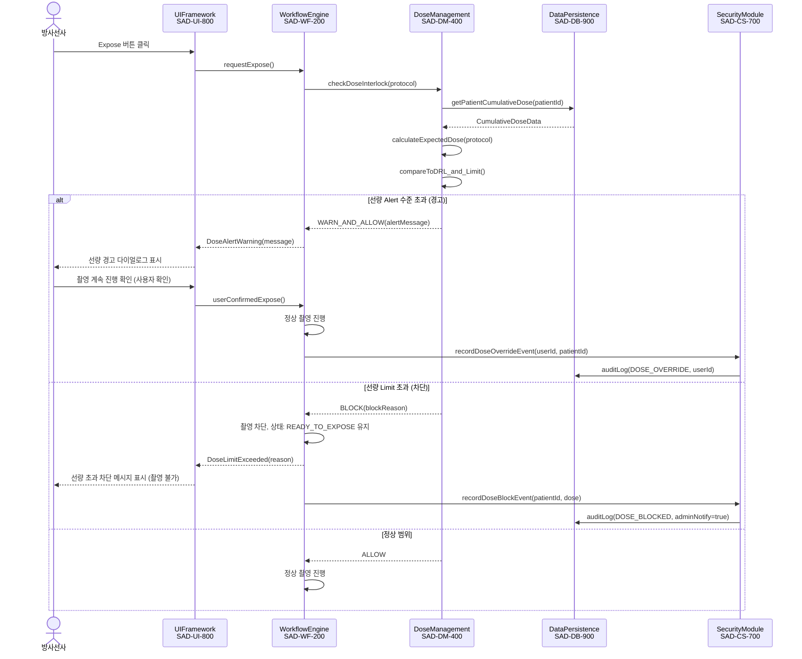

---

*문서 끝 (End of Document)*

---

**문서 관리 정보 (Document Control)**

| 항목 | 내용 |
|---|---|
| 문서 ID | SAD-XRAY-GUI-001 |
| 버전 | v1.0 |
| 최종 수정일 | 2026-03-18 |
| 분류 | 기밀 (Confidential) — 내부 배포 한정 |
| 다음 검토 예정 | 2026-09-18 (6개월 후 또는 주요 아키텍처 변경 시) |
| IEC 62304 준수 | §5.3.1, §5.3.2, §5.3.3, §5.3.4, §5.3.5, §5.3.6 |
