# Software Architecture Design (소프트웨어 아키텍처 설계)

---

## 문서 메타데이터 (Document Metadata)

| 항목 | 내용 |
|---|---|
| **문서 ID** | SAD-XRAY-GUI-001 |
| **문서명 (Korean)** | HnVue Console SW 소프트웨어 아키텍처 설계 |
| **문서명 (English)** | Software Architecture Design for HnVue Console SW |
| **버전 (Version)** | v2.0 |
| **작성일 (Date)** | 2026-04-03 |
| **작성자 (Author)** | SW Architecture Team |
| **검토자 (Reviewer)** | SW Lead Engineer |
| **승인자 (Approver)** | R&D Director |
| **상태 (Status)** | Draft |
| **기준 규격** | IEC 62304:2006+AMD1:2015 §5.3, IEC 81001-5-1:2021, FDA Section 524B |
| **제품** | HnVue Console SW |
| **SW Safety Class** | IEC 62304 Class B |

---

## 개정 이력 (Revision History)

| 버전 | 날짜 | 작성자 | 변경 내용 |
|---|---|---|---|
| v0.1 | 2026-01-15 | SW Architecture Team | 초기 초안 작성 |
| v0.2 | 2026-02-20 | SW Architecture Team | 아키텍처 뷰 보완, SOUP 항목 추가 |
| v1.0 | 2026-03-18 | SW Architecture Team | 정식 릴리즈, SWR 추적성 매트릭스 완성 |
| v2.0 | 2026-04-03 | SW Architecture Team | 4-Tier 우선순위 체계 반영 (P1–P4 제거); Tier 1+2 MR 모듈 매핑 추가; SAD-CD-1000 CDDVDBurning 모듈 상세화; 인시던트 대응 모듈 (IEC 81001-5-1) 및 SW 업데이트 모듈 (FDA 524B) 명시; STRIDE 위협 모델링 결과 요약 섹션 추가; 외부 인터페이스 (FPD SDK, Generator, PACS, RIS) 상세 기술; C4 Context/Container 다이어그램 4-Tier 반영; 기술 스택 WPF .NET 8 + fo-dicom 5.x + SQLCipher + Serilog로 확정 |

---

## 목차

1. [목적 및 범위](#1-목적-및-범위)
2. [참조문서](#2-참조문서)
3. [4-Tier 우선순위 체계와 아키텍처 범위](#3-4-tier-우선순위-체계와-아키텍처-범위)
4. [아키텍처 개요 — C4 Model](#4-아키텍처-개요--c4-model)
5. [아키텍처 뷰 (4+1 View Model)](#5-아키텍처-뷰-41-view-model)
6. [SW 아이템 분해 (IEC 62304 §5.3.1)](#6-sw-아이템-분해)
7. [인터페이스 정의 (IEC 62304 §5.3.2)](#7-인터페이스-정의)
8. [SOUP 통합 아키텍처 (IEC 62304 §5.3.3)](#8-soup-통합-아키텍처)
9. [안전 아키텍처](#9-안전-아키텍처)
10. [보안 아키텍처 (STRIDE 위협 모델링)](#10-보안-아키텍처)
11. [인시던트 대응 아키텍처 (IEC 81001-5-1)](#11-인시던트-대응-아키텍처)
12. [SW 업데이트 아키텍처 (FDA 524B)](#12-sw-업데이트-아키텍처)
13. [SWR 추적성 매트릭스](#13-swr-추적성-매트릭스)
- [부록 A. 약어 및 용어 정의](#부록-a-약어-및-용어-정의)

---

## 1. 목적 및 범위 (Purpose and Scope)

### 1.1 목적 (Purpose)

본 문서는 IEC 62304:2006+AMD1:2015 §5.3 "소프트웨어 아키텍처 설계 (Software Architectural Design)" 요구사항을 충족하기 위해 작성된 HnVue Console SW의 공식 아키텍처 설계 문서이다.

본 SAD (Software Architecture Design) v2.0은 다음 사항을 명시한다:

- 소프트웨어 시스템 경계 및 외부 인터페이스 정의
- 소프트웨어 아이템 (Software Item) 분해 및 모듈 책임 할당 — Tier 1/2 MR 매핑 포함
- 아키텍처 뷰 (4+1 View Model) 기반 설계 표현
- SOUP (Software of Unknown Provenance) 통합 방식
- 안전 아키텍처 (Safety Architecture) 및 보안 아키텍처 (Security Architecture)
- STRIDE 위협 모델링 결과 요약
- 인시던트 대응 아키텍처 (IEC 81001-5-1)
- SW 업데이트 아키텍처 (FDA 524B)
- IEC 62304 §5.3.1, §5.3.2, §5.3.3 준수 증거

### 1.2 범위 (Scope)

**대상 소프트웨어 (Target Software):** HnVue Console SW
**용도 (Intended Use):** 의료용 진단 X-Ray 촬영장치 (Medical Diagnostic X-Ray Imaging Equipment)의 콘솔 소프트웨어
**배포 환경 (Deployment):** Windows 10/11 기반 산업용 워크스테이션
**SW Safety Class:** IEC 62304 Class B
**개발 단계:** Phase 1 (Tier 1 + Tier 2 기능) / Phase 2 (Tier 3 기능)

### 1.3 IEC 62304 §5.3 준수 매핑 (Compliance Mapping)

| IEC 62304 요구사항 | 해당 섹션 |
|---|---|
| §5.3.1 SW 아이템으로 분해 | 섹션 6 |
| §5.3.2 소프트웨어 아이템 인터페이스 정의 | 섹션 7 |
| §5.3.3 기능적 및 성능 요구사항 할당 | 섹션 6, 13 |
| §5.3.4 하드웨어 및 소프트웨어 아이템에 인터페이스 식별 | 섹션 7 |
| §5.3.5 아키텍처 내 SOUP 식별 | 섹션 8 |
| §5.3.6 추가 분리 기준 (위험 제어) | 섹션 9 |

---

## 2. 참조문서 (Reference Documents)

| 문서 ID | 문서명 | 버전 | 참조 관계 |
|---|---|---|---|
| MRD-XRAY-GUI-001 | Market Requirements Document | v3.0 | 시장 요구사항 (4-Tier 체계) |
| PRD-XRAY-GUI-001 | Product Requirements Document | v2.0 | 상위 요구사항 |
| FRS-XRAY-GUI-001 | Functional Requirements Specification | v2.0 | 기능 요구사항 |
| SRS-XRAY-GUI-001 | Software Requirements Specification | v2.0 | SW 요구사항 |
| DOC-001a | MR 상세 설명서 Part 1 — Tier 1 | v1.0 | Tier 1 MR 상세 |
| DOC-001b | MR 상세 설명서 Part 2 — Tier 2/3/4 | v1.0 | Tier 2 MR 상세 |
| RMP-XRAY-GUI-001 | Risk Management Plan | v1.0 | 위험 제어 요구사항 |
| IEC 62304:2006+AMD1:2015 | Medical Device SW Lifecycle Processes | — | 준수 규격 |
| IEC 81001-5-1:2021 | Health SW Security — Part 5-1 | — | 인시던트 대응 |
| IEC 62366-1:2015+AMD1:2020 | Usability Engineering | — | 준수 규격 |
| ISO 14971:2019 | Risk Management for Medical Devices | — | 준수 규격 |
| FDA 21 CFR Part 820.30 | Design Controls | — | 준수 규격 |
| FDA Section 524B | Cybersecurity in Medical Devices | — | 사이버보안 |
| DICOM PS3.x | DICOM Standard | — | 통신 표준 |

---

## 3. 4-Tier 우선순위 체계와 아키텍처 범위

### 3.1 4-Tier 분류 체계

| Tier | 의미 | 기준 | Phase 배정 | 아키텍처 반영 |
|---|---|---|---|---|
| **Tier 1** | 없으면 인허가 불가 | MFDS 2등급/FDA 510(k)/IEC 62304 필수 | Phase 1 필수 | 핵심 모듈 완전 구현 |
| **Tier 2** | 없으면 팔 수 없다 | feel-DRCS 기본 기능 동등 + 고객 최소 기대 | Phase 1 필수 | 핵심 모듈 완전 구현 |
| **Tier 3** | 있으면 좋고 | EConsole1 미포함, 경쟁 차별화 | Phase 2+ | 인터페이스 예비 정의 |
| **Tier 4** | 비현실적/과도 | 2명 조직 비현실적 | Phase 3+ 또는 영구 보류 | 범위 외 |

> **중요:** v1.0까지의 P1–P4 분류는 v2.0부터 Tier 1–4로 전면 교체됩니다.

### 3.2 Phase 1 아키텍처 범위 — Tier 1/2 MR 매핑

| 모듈 | Tier 1 MR | Tier 2 MR |
|---|---|---|
| SAD-PM-100 PatientManagement | MR-020 IHE SWF | MR-001 MWL 자동조회, MR-014 환자 검색 |
| SAD-WF-200 WorkflowEngine | MR-020 IHE SWF | MR-002 PACS 전송 30초, MR-010 촬영 워크플로우 |
| SAD-IP-300 ImageProcessing | MR-052 ISO 13485 | MR-003 W/L 조정, MR-004 Zoom/Pan, MR-005 영상 회전/반전 |
| SAD-DM-400 DoseManagement | MR-019 DICOM 3.0 | MR-007 DAP 표시, MR-008 DRL 알림 |
| SAD-DC-500 DICOMCommunication | MR-019 DICOM 3.0, MR-054 DICOM CS | MR-001 MWL, MR-002 PACS 전송 |
| SAD-CS-700 SecurityModule | MR-033 RBAC, MR-034 PHI 암호화, MR-035 감사 로그, MR-036 SBOM, MR-037 인시던트 대응, MR-039 SW 업데이트, MR-050 위협 모델링 | MR-011 자동 잠금, MR-012 패스워드 정책 |
| SAD-SA-600 SystemAdmin | MR-039 SW 업데이트 | MR-006 시스템 설정, MR-013 촬영 프로토콜 관리 |
| SAD-CD-1000 CDDVDBurning | — | MR-072 CD/DVD Burning |
| SAD-INC-1100 IncidentResponse | MR-037 CVD + 인시던트 대응 | — |
| SAD-UPD-1200 SWUpdate | MR-039 SW 무결성 + 업데이트 | — |

---

## 4. 아키텍처 개요 — C4 Model

### 4.1 C4 Level 1: System Context Diagram (4-Tier 반영)

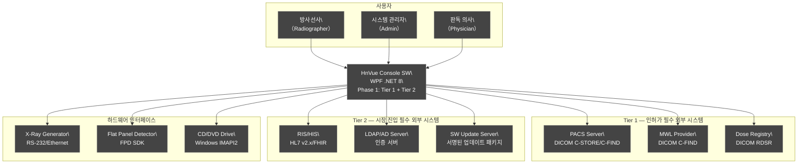

### 4.2 C4 Level 2: Container Diagram (4-Tier 반영)

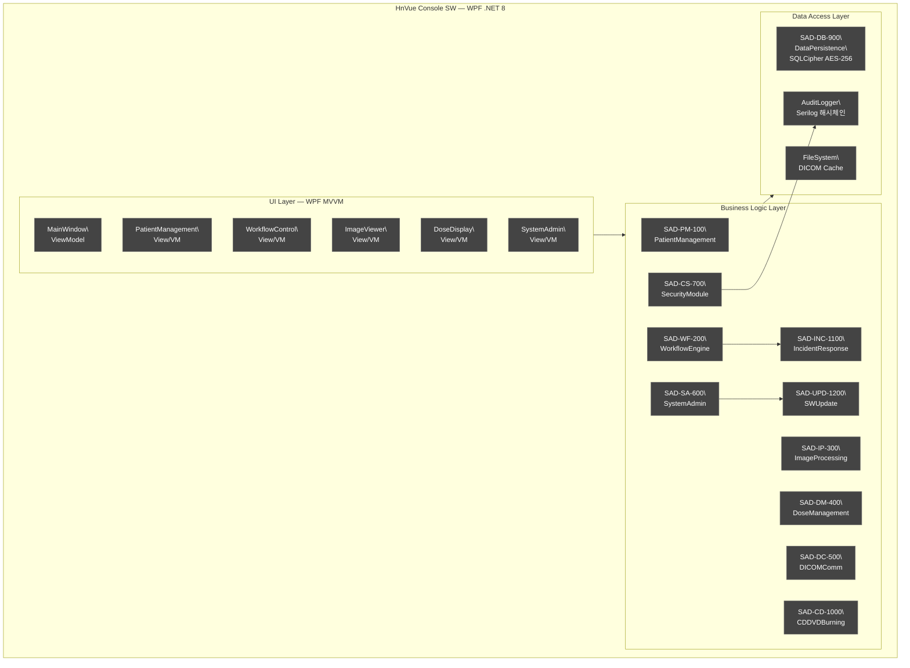

---

## 5. 아키텍처 뷰 (4+1 View Model)

### 5.1 개요

| 뷰 | 관점 | 주요 대상 |
|---|---|---|
| Logical View (논리 뷰) | 기능 분해, 계층 구조 | 개발자, 아키텍트 |
| Process View (프로세스 뷰) | 동시성, 스레드 | 통합 엔지니어 |
| Development View (개발 뷰) | 모듈/패키지 구조 | 개발자 |
| Physical View (물리 뷰) | 배포 구성 | 시스템 엔지니어 |
| Scenario View (+1) | 주요 Use Case 흐름 | 전체 이해관계자 |

### 5.2 Logical View (논리 뷰) — 계층 구조

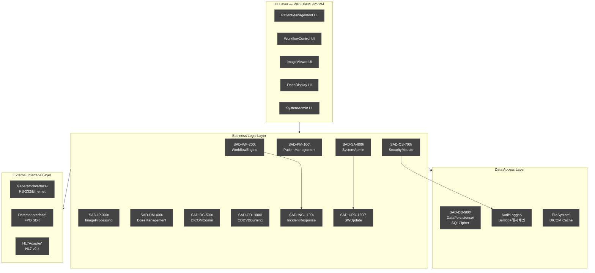

### 5.3 Process View (프로세스 뷰) — 스레드 모델

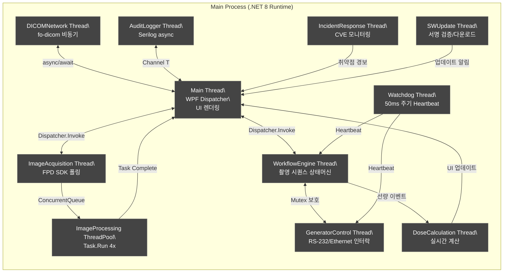

**스레드 우선순위:**

| 스레드 | 우선순위 | 설명 |
|---|---|---|
| Watchdog Thread | AboveNormal (최고) | Safety Critical, 인터락 감지 |
| GeneratorControl Thread | AboveNormal | 발생기 제어, 실시간 인터락 |
| ImageAcquisition Thread | AboveNormal | 영상 데이터 손실 방지 |
| WorkflowEngine Thread | Normal+1 | 촬영 시퀀스 제어 |
| Main Thread (GUI) | Normal | WPF Dispatcher |
| ImageProcessing ThreadPool | BelowNormal | 후처리, 지연 허용 |
| DICOMNetwork Thread | BelowNormal | 네트워크 전송 |
| AuditLogger Thread | Lowest | 비동기 로그 |
| IncidentResponse Thread | BelowNormal | 취약점 모니터링 |
| SWUpdate Thread | Lowest | 업데이트 검증/설치 |

### 5.4 Development View (개발 뷰) — 패키지 구조

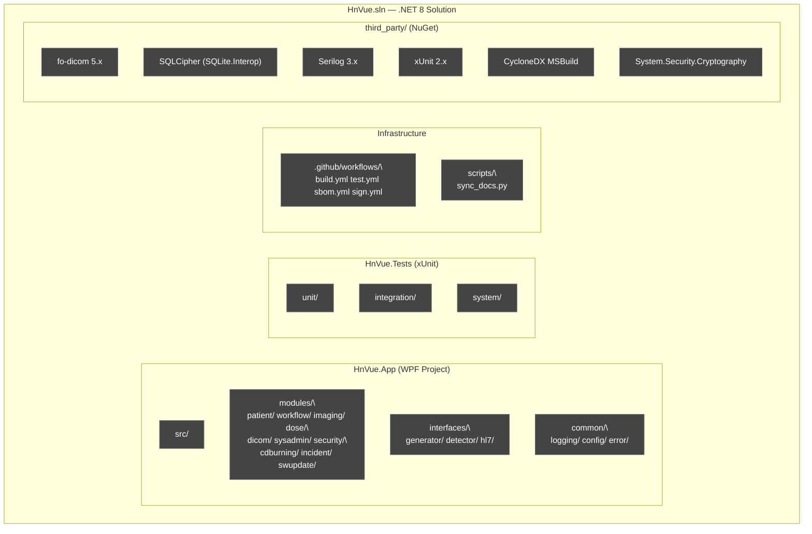

**빌드 시스템:** `dotnet build` (.NET 8 SDK)
**정적 분석:** Roslyn Analyzers, SonarQube
**단위 테스트:** xUnit 2.x + Coverlet

### 5.5 Physical View (물리 뷰) — 배포 다이어그램

```mermaid
flowchart TB
    classDef default fill:#444,stroke:#666,color:#fff

    subgraph ROOM["X-Ray Room （촬영실）"]
        subgraph WS["Clinical Workstation\\nWindows 10/11 Pro"]
            APP["HnVue Console SW v2.0\\n.NET 8 WPF"]
            DB_FILE["HnVue.db\\nSQLCipher AES-256"]
            DICOM_CACHE["DICOM Image Cache\\nLocal SSD"]
            LOGS["Audit Logs\\nSerilog 해시체인"]
        end

        GEN_HW["X-Ray Generator"]
        FPD_HW["Flat Panel Detector\\nFPD SDK"]
        CD_HW["CD/DVD Drive\\nIMAPI2"]
    end

    subgraph HOSP["Hospital Network （병원 네트워크）"]
        PACS_SRV["PACS Server"]
        RIS_SRV["RIS/HIS Server"]
        LDAP_SRV2["LDAP/AD Server"]
        DOSE_SRV["Dose Registry"]
    end

    subgraph CLOUD["External Network"]
        UPD_SRV["SW Update Server\\n(HTTPS + 코드 서명)"]
        VULN_DB["CVE/NVD Database"]
    end

    APP <-->|"RS-232 / TCP"| GEN_HW
    APP <-->|"FPD SDK GigE/USB3"| FPD_HW
    APP -->|"Windows IMAPI2"| CD_HW
    APP --- DB_FILE
    APP --- DICOM_CACHE
    APP --- LOGS
    APP <-->|"DICOM TLS 1.3"| PACS_SRV
    APP <-->|"DICOM C-FIND TLS"| RIS_SRV
    APP <-->|"LDAPS"| LDAP_SRV2
    APP -->|"DICOM RDSR TLS"| DOSE_SRV
    APP -->|"HTTPS"| UPD_SRV
    APP -->|"HTTPS"| VULN_DB
```

**하드웨어 최소 사양:**

| 항목 | 최소 사양 | 권장 사양 |
|---|---|---|
| CPU | Intel Core i5 (10세대+), 4코어 | Intel Core i7, 8코어 이상 |
| RAM | 16 GB | 32 GB |
| Storage | SSD 256 GB (OS+앱), HDD 2 TB (영상) | NVMe SSD 512 GB + HDD 4 TB |
| GPU | 2 GB VRAM | 4 GB VRAM |
| Display | 1920×1080 (Full HD) | 2560×1440 의료용 모니터 |
| NIC | Gigabit Ethernet | Dual Gigabit Ethernet |
| OS | Windows 10 Pro 22H2 | Windows 11 Pro 24H2 |

---

## 6. SW 아이템 분해 (SW Item Decomposition — IEC 62304 §5.3.1)

### 6.1 소프트웨어 아이템 목록 개요

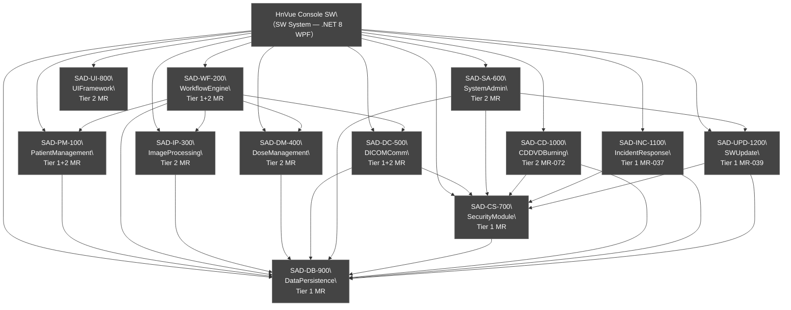

### 6.2 SAD-PM-100: PatientManagement Module (환자 관리 모듈)

| 항목 | 내용 |
|---|---|
| **모듈 ID** | SAD-PM-100 |
| **모듈명** | PatientManagement Module |
| **IEC 62304 Safety Class** | Class B |
| **Safety-Critical** | 아니오 |
| **Tier 매핑** | Tier 1: MR-020 (IHE SWF), Tier 2: MR-001 (MWL), MR-014 (환자 검색) |

**책임 (Responsibilities):**
- 환자 등록, 조회, 수정, 삭제 (CRUD) 기능
- DICOM Modality Worklist (MWL) 연동을 통한 환자/검사 오더 수신
- HL7 ADT/ORM 메시지 처리 및 환자 정보 동기화
- 환자 식별자 (Patient ID, Accession Number) 관리

**인터페이스 (Interfaces):**

| 인터페이스 ID | 유형 | 대상 모듈/시스템 | 설명 |
|---|---|---|---|
| IF-PM-001 | 제공 | SAD-UI-800, SAD-WF-200 | PatientData API |
| IF-PM-002 | 요구 | SAD-DB-900 | 환자 데이터 영속화 |
| IF-PM-003 | 요구 | SAD-DC-500 | MWL C-FIND 요청 |
| IF-PM-004 | 요구 | SAD-CS-700 | 데이터 접근 권한 검증 |

**관련 SWR:** SWR-PM-001–SWR-PM-053

---

### 6.3 SAD-WF-200: WorkflowEngine Module (워크플로우 엔진 모듈)

| 항목 | 내용 |
|---|---|
| **모듈 ID** | SAD-WF-200 |
| **모듈명** | WorkflowEngine Module |
| **IEC 62304 Safety Class** | Class B |
| **Safety-Critical** | **예 (Yes)** — Generator 제어, 촬영 인터락 관리 |
| **Tier 매핑** | Tier 1: MR-020 (IHE SWF), Tier 2: MR-002 (PACS 전송), MR-010 (워크플로우) |

**책임 (Responsibilities):**
- 촬영 워크플로우 상태 머신 (State Machine) 관리
- X-Ray Generator 제어 명령 발행 및 응답 처리
- Flat Panel Detector 촬영 트리거 및 동기화 (FPD SDK)
- 촬영 파라미터 검증 및 적용
- 선량 인터락 로직 실행
- 인시던트 대응 모듈 연계 (이상 감지 시)

**촬영 워크플로우 상태 머신:**

| 상태 | 전이 조건 | 안전 제어 |
|---|---|---|
| IDLE | 환자 선택 → PATIENT_SELECTED | — |
| PATIENT_SELECTED | 프로토콜 선택 → PROTOCOL_LOADED | — |
| PROTOCOL_LOADED | 촬영 준비 → READY_TO_EXPOSE | 파라미터 범위 검증 |
| READY_TO_EXPOSE | Expose 버튼 → EXPOSING | 인터락 체크, Generator 활성화 |
| EXPOSING | 조사 완료 → IMAGE_ACQUIRING | Dose 실시간 모니터링 |
| IMAGE_ACQUIRING | 영상 수신 완료 → IMAGE_PROCESSING | FPD SDK 수신 완료 확인 |
| IMAGE_PROCESSING | 처리 완료 → IMAGE_REVIEW | — |
| IMAGE_REVIEW | 승인/재촬영 → COMPLETED/READY_TO_EXPOSE | — |
| COMPLETED | 다음 촬영/종료 → IDLE | — |
| ERROR | 에러 해제 → IDLE | 안전 종료 시퀀스, INC 모듈 통보 |

**관련 SWR:** SWR-WF-001–SWR-WF-034

---

### 6.4 SAD-IP-300: ImageProcessing Module (영상 처리 모듈)

| 항목 | 내용 |
|---|---|
| **모듈 ID** | SAD-IP-300 |
| **모듈명** | ImageProcessing Module |
| **IEC 62304 Safety Class** | Class B |
| **Safety-Critical** | 아니오 (표시 품질에 영향) |
| **Tier 매핑** | Tier 2: MR-003 W/L 조정, MR-004 Zoom/Pan, MR-005 영상 회전/반전 |

**책임 (Responsibilities):**
- Raw FPD 데이터로부터 진단 가능 영상 생성
- 영상 전처리: 결함 픽셀 교정, 오프셋/게인 보정
- 윈도우/레벨 (Window/Level) 자동/수동 조정
- 영상 후처리: 샤프닝, 노이즈 감소
- DICOM 이미지 포맷 변환 및 메타데이터 삽입
- 영상 측정 도구 (길이, 각도, 면적)

**FPD SDK 통합 방식:**

```
FPD SDK Callback (GigE Vision / USB3)
    ↓ [1] FPD SDK OnFrameReceived 이벤트 수신
    ↓ [2] 14-bit RAW → float32 변환
    ↓ [3] Dark Offset Calibration (암보정)
    ↓ [4] Gain Calibration (게인 보정)
    ↓ [5] Bad Pixel Correction (결함 픽셀 교정)
    ↓ [6] Noise Reduction (노이즈 감소)
    ↓ [7] Edge Enhancement (에지 강화)
    ↓ [8] Window/Level Mapping (8-bit 변환)
    ↓ [9] DICOM Dataset 생성 (fo-dicom)
    ↓ [10] WPF WriteableBitmap 렌더링
```

**관련 SWR:** SWR-IP-001–SWR-IP-040

---

### 6.5 SAD-DM-400: DoseManagement Module (선량 관리 모듈)

| 항목 | 내용 |
|---|---|
| **모듈 ID** | SAD-DM-400 |
| **모듈명** | DoseManagement Module |
| **IEC 62304 Safety Class** | Class B |
| **Safety-Critical** | **예 (Yes)** — 선량 한계 초과 방지 인터락 |
| **Tier 매핑** | Tier 2: MR-007 DAP 표시, MR-008 DRL 알림 |

**책임 (Responsibilities):**
- 촬영 선량 (EI, DAP, Effective Dose) 실시간 계산
- 누적 선량 추적 (환자 이력 기반)
- ALARA 원칙 기반 선량 한계 설정 및 모니터링
- DICOM RDSR 생성 및 전송

**관련 SWR:** SWR-DM-001–SWR-DM-025

---

### 6.6 SAD-DC-500: DICOMCommunication Module (DICOM 통신 모듈)

| 항목 | 내용 |
|---|---|
| **모듈 ID** | SAD-DC-500 |
| **모듈명** | DICOMCommunication Module |
| **IEC 62304 Safety Class** | Class B |
| **Safety-Critical** | 아니오 |
| **Tier 매핑** | Tier 1: MR-019 DICOM 3.0, MR-054 DICOM CS; Tier 2: MR-001 MWL, MR-002 PACS 전송 |

**책임 (Responsibilities):**
- fo-dicom 5.x 기반 DICOM 네트워킹
- C-STORE SCU (PACS 영상 전송) — Phase 1 필수
- C-FIND SCU/MWL (Worklist 조회) — Phase 1 필수
- Print SCU (DICOM Print) — Phase 1 포함 (feel-DRCS 동등성)
- TLS 1.3 암호화 DICOM 통신

**fo-dicom 5.x 래퍼 설계:**

```
DICOMCommunication Module (SAD-DC-500)
    ├── DicomStoreSCU      ← fo-dicom DicomClient C-STORE
    ├── DicomFindSCU       ← fo-dicom DicomClient C-FIND (MWL)
    ├── DicomPrintSCU      ← fo-dicom DicomClient N-ACTION (Print)
    ├── DicomFileIO        ← fo-dicom DicomFile Read/Write
    └── TlsConfig          ← fo-dicom DicomTlsInitializer
```

**Phase 1 DICOM 서비스 범위:**

| 서비스 | Phase 1 | Phase 2 |
|---|---|---|
| C-STORE SCU | ✅ 필수 | — |
| MWL C-FIND SCU | ✅ 필수 | — |
| Print SCU | ✅ 포함 | — |
| MPPS N-CREATE/N-SET | — | ✅ |
| Storage Commitment SCU | — | ✅ |
| Q/R C-FIND/C-MOVE | — | ✅ |

**관련 SWR:** SWR-DC-001–SWR-DC-035

---

### 6.7 SAD-SA-600: SystemAdmin Module (시스템 관리 모듈)

| 항목 | 내용 |
|---|---|
| **모듈 ID** | SAD-SA-600 |
| **모듈명** | SystemAdmin Module |
| **IEC 62304 Safety Class** | Class B |
| **Safety-Critical** | 아니오 |
| **Tier 매핑** | Tier 1: MR-039 SW 업데이트; Tier 2: MR-006 시스템 설정, MR-013 촬영 프로토콜 |

**책임 (Responsibilities):**
- 사용자 계정 관리 (RBAC: Radiographer/Radiologist/Admin/Service)
- 시스템 구성 관리 (DICOM AE Title, 네트워크 설정)
- 촬영 프로토콜 라이브러리 관리
- 소프트웨어 업데이트 관리 (SAD-UPD-1200 연계)
- 감사 로그 조회

**관련 SWR:** SWR-SA-001–SWR-SA-077

---

### 6.8 SAD-CS-700: SecurityModule (보안 모듈)

| 항목 | 내용 |
|---|---|
| **모듈 ID** | SAD-CS-700 |
| **모듈명** | SecurityModule |
| **IEC 62304 Safety Class** | Class B |
| **Safety-Critical** | **예 (Yes)** — 무허가 접근 및 데이터 무결성 보호 |
| **Tier 매핑** | Tier 1: MR-033 RBAC, MR-034 PHI 암호화, MR-035 감사 로그, MR-036 SBOM, MR-037 인시던트 대응, MR-039 SW 업데이트, MR-050 STRIDE 위협 모델링 |

**책임 (Responsibilities):**
- 사용자 인증 (로컬 + LDAP/AD 연동)
- bcrypt 기반 패스워드 해싱 (비용 인자 12)
- 5회 연속 실패 시 계정 잠금 (NIST SP 800-63B)
- 세션 관리 (JWT 토큰, 자동 잠금 15분)
- PHI 암호화: SQLCipher AES-256 (DB 전체 암호화)
- 감사 로그: Serilog + HMAC-SHA256 해시체인 (로그 위변조 방지)
- TLS 1.3 통신 암호화
- STRIDE 위협 모델 기반 보안 통제 적용

**인터페이스:**

| 인터페이스 ID | 유형 | 대상 모듈/시스템 | 설명 |
|---|---|---|---|
| IF-CS-001 | 제공 | 전체 모듈 | AuthorizationCheck API |
| IF-CS-002 | 제공 | SAD-SA-600 | UserManagement API |
| IF-CS-003 | 요구 | SAD-DB-900 | 인증 데이터, 감사 로그 저장 |
| IF-CS-004 | 요구 | LDAP Server | 외부 인증 |
| IF-CS-005 | 요구 | SOUP: OpenSSL/BCrypt | 암호화/TLS |

**관련 SWR:** SWR-CS-001–SWR-CS-087

---

### 6.9 SAD-UI-800: UIFramework Module

| 항목 | 내용 |
|---|---|
| **모듈 ID** | SAD-UI-800 |
| **모듈명** | UIFramework Module |
| **IEC 62304 Safety Class** | Class B |
| **Safety-Critical** | 아니오 |
| **Tier 매핑** | Tier 2: MR-010 촬영 워크플로우, MR-051 IEC 62366 사용성 |

**기술 스택:** WPF .NET 8, MVVM 패턴, MaterialDesignInXaml

**관련 SWR:** SWR-UI-001–SWR-UI-020

---

### 6.10 SAD-DB-900: DataPersistence Module

| 항목 | 내용 |
|---|---|
| **모듈 ID** | SAD-DB-900 |
| **모듈명** | DataPersistence Module |
| **IEC 62304 Safety Class** | Class B |
| **Safety-Critical** | 아니오 |
| **Tier 매핑** | Tier 1: MR-034 PHI 암호화 (SQLCipher) |

**기술 스택:** SQLCipher (SQLite + AES-256), EF Core 8.x (ORM)

**관련 SWR:** SWR-DB-001–SWR-DB-015

---

### 6.11 SAD-CD-1000: CDDVDBurning Module (CD/DVD 버닝 모듈)

| 항목 | 내용 |
|---|---|
| **모듈 ID** | SAD-CD-1000 |
| **모듈명** | CDDVDBurning Module |
| **IEC 62304 Safety Class** | Class B |
| **Safety-Critical** | 아니오 |
| **MR 연계** | MR-072 (Tier 2 — CD/DVD Burning with DICOM Viewer) |
| **Phase** | Phase 1 |

**책임 (Responsibilities):**
- DICOM 영상 선택 및 CD/DVD 매체에 굽기
  - Windows IMAPI2 API (IDiscFormat2Data 인터페이스) 활용
  - IMAPIv2 방식: IFilesystemImage → IDiscFormat2Data → Burn
- 번들 DICOM Viewer 포함 패키징
  - 오픈소스 DICOM Viewer (예: OsiriX Lite Windows 버전 또는 자체 경량 뷰어) 포함
  - AutoRun 없이 Viewer.exe를 디스크 루트에 배치
- PHI 보호 — AES-256 암호화 적용 (비밀번호 보호 옵션)
- CD/DVD 생성 이벤트 감사 로그 기록 (환자 ID, 생성자, 생성 시각, 미디어 ID)
- 미디어 생성 완료 후 무결성 확인 (Read-back Verify)
- 굽기 진행 상황 UI 표시 (Progress Bar + 취소 버튼)

**상세 설계 흐름:**

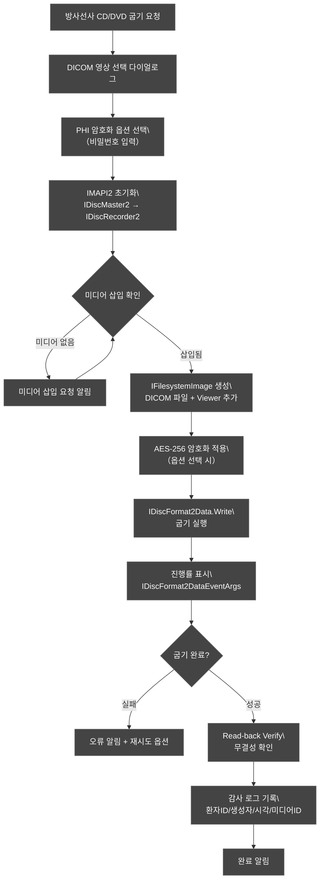

**접근 권한:** Admin 또는 Radiologist 역할 전용 (SAD-CS-700 RBAC 연계)
**의존관계:** SAD-DB-900, SAD-CS-700, Windows IMAPI2 COM API
**관련 SWR:** SWR-WF-032–SWR-WF-034

---

### 6.12 SAD-INC-1100: IncidentResponse Module (인시던트 대응 모듈)

| 항목 | 내용 |
|---|---|
| **모듈 ID** | SAD-INC-1100 |
| **모듈명** | IncidentResponse Module |
| **IEC 62304 Safety Class** | Class B |
| **Safety-Critical** | **예 (Yes)** — 보안 사고 감지 및 대응 |
| **MR 연계** | MR-037 (Tier 1 — CVD + 인시던트 대응) |
| **규제 근거** | IEC 81001-5-1:2021 §8.11 (Incident Management) |
| **Phase** | Phase 1 |

**책임 (Responsibilities):**
- 보안 이벤트 (Security Event) 실시간 감지 및 분류
- CVE 취약점 데이터베이스 연동 및 영향 분석
- 인시던트 등급 분류: Critical / High / Medium / Low
- IEC 81001-5-1 §8.11 기반 대응 절차 자동화
- 인시던트 로그 생성 및 보관 (Serilog + 해시체인)
- 제조사/운영자 알림 (이메일/시스템 팝업)
- 사후 분석 (Post-incident Analysis) 데이터 수집

**인시던트 대응 흐름:**

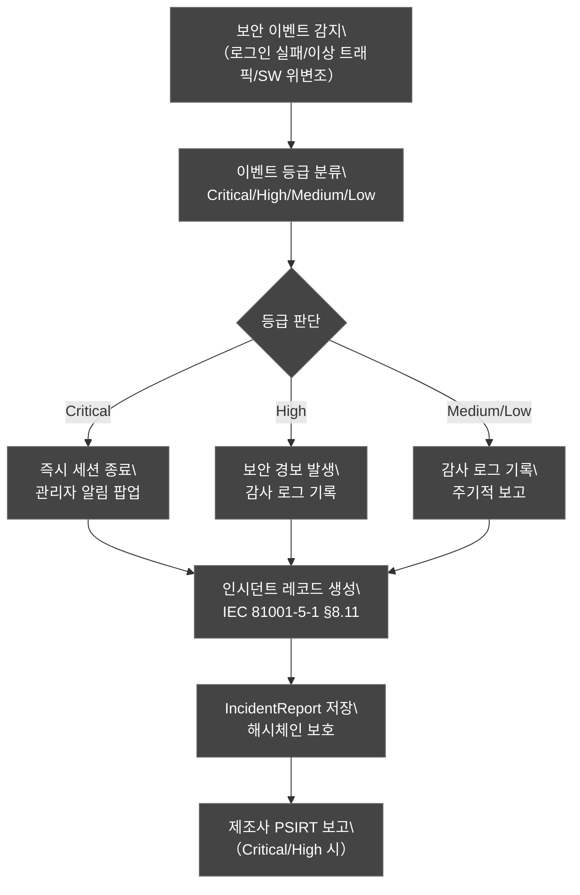

**의존관계:** SAD-CS-700, SAD-DB-900
**관련 SWR:** SWR-CS-086–SWR-CS-087

---

### 6.13 SAD-UPD-1200: SWUpdate Module (SW 업데이트 모듈)

| 항목 | 내용 |
|---|---|
| **모듈 ID** | SAD-UPD-1200 |
| **모듈명** | SWUpdate Module |
| **IEC 62304 Safety Class** | Class B |
| **Safety-Critical** | **예 (Yes)** — SW 무결성 보장 |
| **MR 연계** | MR-039 (Tier 1 — SW 무결성 검증 + 업데이트 메커니즘) |
| **규제 근거** | FDA 524B §3524(b)(2) |
| **Phase** | Phase 1 |

**책임 (Responsibilities):**
- HTTPS를 통한 서명된 업데이트 패키지 다운로드
- 코드 서명 검증 (Authenticode — SHA-256 + RSA-2048)
- 패키지 무결성 검증 (SHA-256 해시 + 제조사 PKI 서명)
- 업데이트 설치 전 현재 버전 자동 백업
- 설치 실패 시 자동 롤백 (이전 버전 복원)
- 업데이트 이력 감사 로그 기록
- 오프라인 업데이트 지원 (USB 미디어)

**업데이트 흐름:**

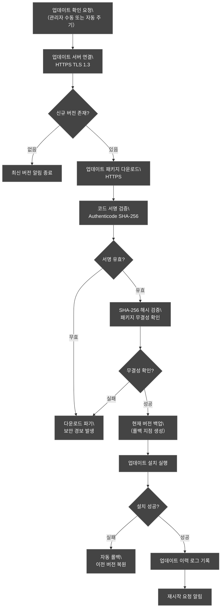

**의존관계:** SAD-CS-700, SAD-DB-900
**관련 SWR:** SWR-SA-076–SWR-SA-077, SWR-CS-084–SWR-CS-085

---

## 7. 인터페이스 정의 (Interface Definition — IEC 62304 §5.3.2)

### 7.1 모듈 간 내부 인터페이스

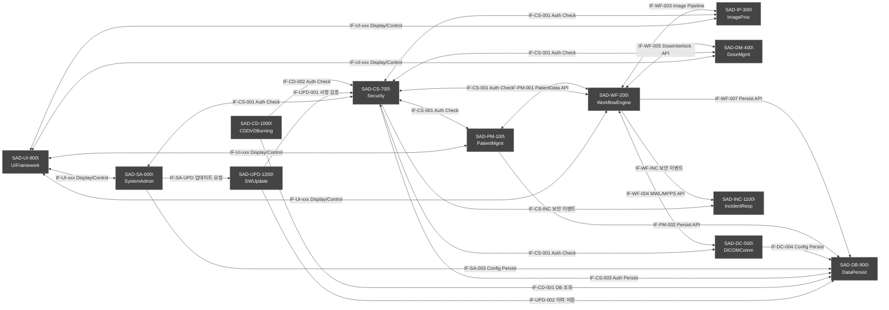

### 7.2 외부 인터페이스 정의

| 인터페이스 ID | 이름 | 외부 시스템 | 프로토콜 | 데이터 형식 | 방향 | 암호화 |
|---|---|---|---|---|---|---|
| EIF-001 | Generator Control | X-Ray Generator | RS-232 / TCP/IP | 제조사 독점 프로토콜 | 양방향 | 없음 (물리적 격리) |
| EIF-002 | FPD Image Acquisition | Flat Panel Detector | FPD SDK (GigE/USB3) | 14-bit RAW + 메타데이터 | 수신 | 없음 (로컬 연결) |
| EIF-003 | DICOM C-STORE | PACS | DICOM PS3.7 | DICOM SOP Class | 송신 | TLS 1.3 |
| EIF-004 | DICOM C-FIND (MWL) | MWL Provider | DICOM PS3.7 | DICOM MWL SOP | 수신 | TLS 1.3 |
| EIF-005 | DICOM Print SCU | DICOM Printer | DICOM PS3.4 | DICOM Print SOP | 송신 | TLS 1.3 |
| EIF-006 | DICOM RDSR | Dose Registry | DICOM PS3.7 | DICOM SR TID 10011 | 송신 | TLS 1.3 |
| EIF-007 | HL7 ADT/ORM | RIS/HIS | HL7 v2.x MLLP | HL7 메시지 | 수신 | MLLP-TLS |
| EIF-008 | LDAP 인증 | LDAP/AD Server | LDAP v3 | LDAP | 양방향 | LDAPS (TLS) |
| EIF-009 | SW 업데이트 | Update Server | HTTPS | 서명된 패키지 | 수신 | TLS 1.3 + Authenticode |
| EIF-010 | CVE 조회 | NVD/CVE DB | HTTPS REST | JSON | 수신 | TLS 1.3 |

### 7.3 Generator 제어 인터페이스 상세

**통신 프로토콜 개요:**

| 항목 | 사양 |
|---|---|
| **물리 인터페이스** | RS-232（기본） / RS-422 / Ethernet（옵션） |
| **Baud Rate** | 9600–115200（Generator 사양서에 따름） |
| **데이터 형식** | 8N1（8 data bits, No parity, 1 stop bit） |
| **프로토콜** | 명령–응답（Command-Response）, 패킷 기반 |
| **타임아웃** | 명령 응답 3s, Exposure 완료 30s |

**명령-응답 매핑:**

| 명령 | 파라미터 | 응답 | 타임아웃 |
|---|---|---|---|
| SET_KVP | kVp 값 | ACK / NACK | 1초 |
| SET_MAS | mAs 값 | ACK / NACK | 1초 |
| LOAD_APR | APR ID | ACK / NACK | 2초 |
| PREP | — | READY / ERROR | 5초 |
| EXPOSE | — | EXPOSURE_DONE / ERROR | 30초 |
| ABORT | — | ACK | 즉시 |
| GET_STATUS | — | STATUS_RESPONSE | 1초 |
| GET_HEAT_UNITS | — | HEAT_UNITS 값 | 1초 |

**에러 코드 체계 (Sedecal 기준, E01–E93):** 참조 → SDS §14.4

**에러 처리:** NACK 또는 타임아웃 시 WorkflowEngine이 ERROR 상태로 전이, INC 모듈에 이벤트 통보. 상세 에러 처리 매트릭스 → SDS §13.3

### 7.3.1 Generator 상태 머신 아키텍처 다이어그램

> 참조: GENERATOR-001 §9.2, §9.3

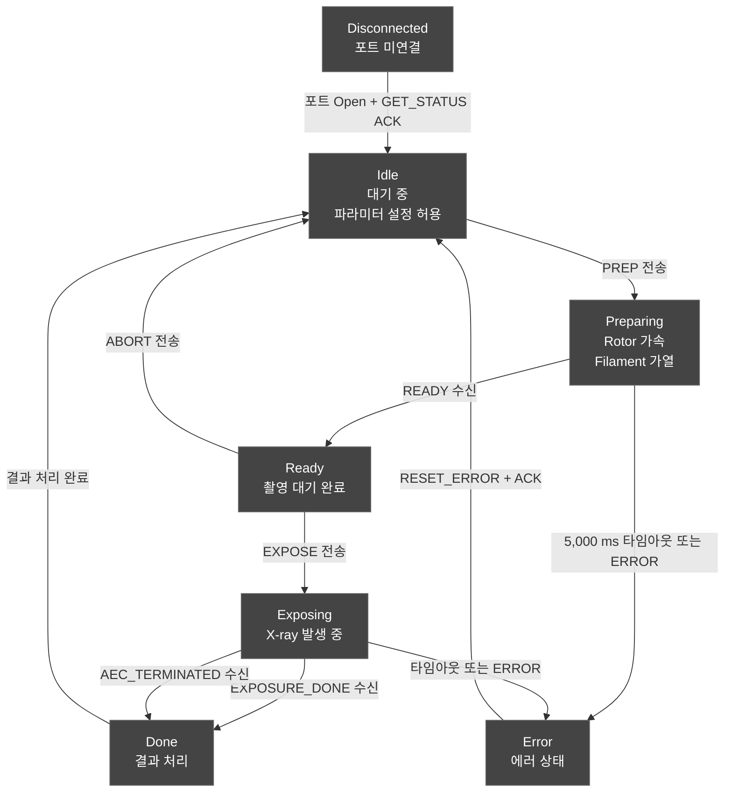

**아키텍처 결정 사항:**

- 모든 Generator 명령은 현재 상태에서 허용된 명령만 전송 가능하다. 상태 외 명령 전송 시 InvalidOperationException 발생.
- Disconnected 상태는 하드웨어 연결 실패 또는 포트 미개방 시 진입. Heartbeat 실패 시도 Disconnected로 폴백.
- Done 상태는 염수 실측값（ACTUAL_KVP, ACTUAL_MAS, ACTUAL_TIME）를 로그에 기록한 후 Idle로 자동 전이.
- 상태 머신 구현 상세 → SDS §14.6, §14.7

### 7.3.2 DICOM 서비스별 아키텍처 결정 사항

> 참조: DICOM-001 §3, §4, §6

#### C-STORE: 로콜 큐 → 비동기 전송 → Polly 재시도 → 실패 시 영속 큐

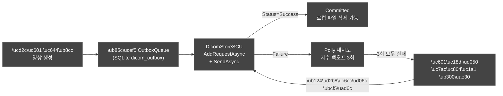

| 항목 | 아키텍처 결정 |
|---|---|
| 로콜 큐 | SQLite `dicom_outbox` 테이블에 저장 — 애플리케이션 재시작 시도 복구 |
| 비동기 전송 | `foreach` + `AddRequestAsync` + `SendAsync` 패턴 — 단일 Association으로 배치 전송 |
| Polly 재시도 | 3회 지수 백오프（2, 4, 8초）— DicomNetworkException, SocketException 처리 |
| 영속 큐 | 3회 실패 시 `OutboxQueue` 상태를 PENDING로 유지, 60초 주기 수동 재시도 |

#### MWL: 10초 폴링 → 캐시 → UI 바인딩

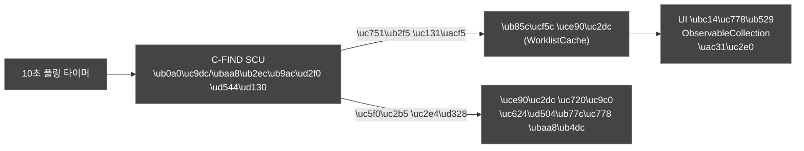

| 항목 | 아키텍처 결정 |
|---|---|
| 폴링 주기 | 10초 기본（설정 변경 가능）— `DispatcherTimer` 또는 `PeriodicTimer` |
| 캐시 | 연결 실패 시 마지막 성공한 결과 유지 — 오프라인 모드 제공 |
| UI 바인딩 | `ObservableCollection<WorklistItem>` 에 명시적 Dispatcher.Invoke로 갱신 |
| 시간 갱신 충돌 | 이전 폴링이 진행 중이면 다음 폴링은 건너뜠 싞음 |

#### Print: Film Session 상태 관리

| 단계 | 담당 콴포넌트 | DIMSE 서비스 |
|---|---|---|
| Film Session 생성 | DicomPrintSCU.CreateFilmSessionAsync | N-CREATE |
| Film Box 세팅 | DicomPrintSCU.CreateFilmBoxAsync | N-CREATE |
| Image Box 데이터 | DicomPrintSCU.SetImageBoxAsync | N-SET |
| 인쇄 실행 | DicomPrintSCU.PrintFilmSessionAsync | N-ACTION |
| 세션 정리 | DicomPrintSCU.DeleteFilmSessionAsync | N-DELETE |

Film Box N-CREATE RSP에서 수신한 Image Box UID는 내부 상태로 보관하고, 이후 N-SET 요청에 사용한다. 단일 `SendAsync()` 호출로는 UID를 확보할 수 없으므로 두 번의 `SendAsync()` 패턴을 적용한다. 상세 구현 → SDS §3.5.5

### 7.3.3 IHE SWF 워크플로우와 아키텍처 매핑

> 참조: DICOM-001 §6, GENERATOR-001 §4.1

| IHE 트랜짝션 | DICOM 서비스 | HNVUE 역할 | 아키텍처 컴포넌트 | Phase |
|---|---|---|---|---|
| RAD-5 | MWL C-FIND | SCU | DicomFindSCU → WorklistCache → PatientMgmt UI | Phase 1 |
| RAD-6 | MPPS N-CREATE/N-SET | SCU | DicomMppsSCU → WorkflowEngine.OnExamStart/Complete | Phase 2 |
| RAD-8 | C-STORE | SCU | DicomStoreSCU → OutboxQueue → Polly | Phase 1 |
| RAD-10 | Storage Commitment N-ACTION | SCU | DicomCommitSCU → OutboxQueue.Committed | Phase 2 |

**SWF 전체 흐름:**

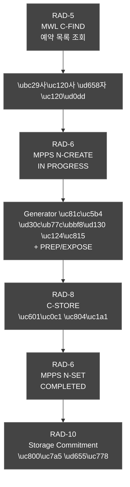

### 7.4 FPD SDK 인터페이스 상세

**통신 프로토콜 개요:**

| 항목 | 사양 |
|---|---|
| **물리 인터페이스** | GigE Vision（Gigabit Ethernet） |
| **IP 설정** | LLA 자동 또는 고정 IP（Class C） |
| **트리거 모드** | Software Trigger（기본） / External Trigger（HW 신호） |
| **Heartbeat 주기** | 5s |

**SDK API:**

| 이벤트/메서드 | 파라미터 | 설명 |
|---|---|---|
| Initialize | IP, AcqMode | SDK 로드 및 디텍터 검색, IP 연결 |
| LoadCalibration | OffsetPath, GainPath | Offset/Gain 교정 파일 로딩 |
| StartAcquisition | AcqMode, Timeout | 영상 수신 모드 시작 |
| SoftwareTrigger | — | SW 트리거 발사 |
| StopAcquisition | — | 영상 수신 중단 |
| SetAcquisitionMode | Live / Triggered | 모드 설정 |
| GetDetectorStatus | — | 검출기 상태（온도, 오프셋 필요 여부） |
| OnFrameReceived | FrameData（14-bit RAW） | Offset/Gain 보정 적용 후 콜백 |

**Calibration 사이클:** Offset（Dark） → Gain（Flat Field） → Defect Map. 상세 절차 → SDS §15.3

**에러 처리:** GigE Heartbeat 타임아웃 5s, 트리거 타임아웃 10s, Calibration 만료 24h. 상세 매트릭스 → SDS §13.4

**주의:** FPD SDK는 SOUP-002로 등록, 제조사별 SDK 래퍼 어댑터 패턴 적용

---

## 8. SOUP 통합 아키텍처 (SOUP Integration Architecture — IEC 62304 §5.3.3)

### 8.1 SOUP 목록 (v2.0 확정 기술 스택)

| SOUP ID | 이름 | 버전 | 제조사/커뮤니티 | 용도 | Safety Class 기여 | 라이선스 |
|---|---|---|---|---|---|---|
| SOUP-001 | WPF / .NET 8 | 8.0 LTS | Microsoft | GUI 프레임워크, 런타임 | Class B | MIT |
| SOUP-002 | fo-dicom | 5.x | fo-dicom Community | DICOM 프로토콜 스택 (C-STORE, C-FIND, Print) | Class B | MS-PL |
| SOUP-003 | SQLCipher | 4.x | Zetetic LLC | AES-256 암호화 SQLite | Class B | 상용/오픈소스 |
| SOUP-004 | Serilog | 3.x | Serilog Community | 구조화 로깅 (감사 로그 해시체인) | Class B | Apache 2.0 |
| SOUP-005 | xUnit | 2.x | xUnit.net | 단위 테스트 프레임워크 | Class A | Apache 2.0 |
| SOUP-006 | CycloneDX MSBuild | 2.x | CycloneDX | SBOM 자동 생성 | Class A | Apache 2.0 |
| SOUP-007 | EF Core | 8.x | Microsoft | ORM (DataPersistence) | Class B | MIT |
| SOUP-008 | BCrypt.Net | 4.x | BCrypt.Net | 패스워드 해싱 (비용 12) | Class B | MIT |
| SOUP-009 | Windows IMAPI2 | OS 내장 | Microsoft | CD/DVD 굽기 | Class A | OS 포함 |
| SOUP-010 | MaterialDesignInXaml | 5.x | Material Design | WPF UI 테마 | Class A | MIT |

### 8.2 fo-dicom 5.x 통합 방식

**C-STORE SCU 구현:**
```csharp
// fo-dicom 5.x DicomClient 패턴
var client = DicomClientFactory.Create(host, port, false, "HNVUE_SCU", "PACS_AE");
var request = new DicomCStoreRequest(dicomFile);
request.OnResponseReceived += (req, response) => { /* 결과 처리 */ };
await client.AddRequestAsync(request);
await client.SendAsync(); // 비동기 전송
```

**MWL C-FIND SCU 구현:**
```csharp
var request = DicomCFindRequest.CreateWorklistQuery(
    patientId: null, patientName: null,
    stationAE: localAE, date: DateTime.Today
);
request.OnResponseReceived += (req, response) => { /* WorklistItem 파싱 */ };
await client.SendAsync();
```

### 8.3 SQLCipher AES-256 통합

```csharp
// SQLCipher 연결 문자열 (PHI 전체 암호화)
var connectionString = $"Data Source={dbPath};Password={encryptionKey};";
// EF Core DbContext 설정
optionsBuilder.UseSqlite(connectionString, b => b.MigrationsAssembly("HnVue.App"));
```

### 8.4 Serilog 감사 로그 해시체인

```csharp
// Serilog 설정 — HMAC-SHA256 해시체인
Log.Logger = new LoggerConfiguration()
    .WriteTo.File(logPath, rollingInterval: RollingInterval.Day,
        outputTemplate: "{Timestamp:o}|{Level}|{Hash}|{Message}{NewLine}")
    .Enrich.WithProperty("Hash", ComputeHmacChain(previousHash, message))
    .CreateLogger();
```

---

## 9. 안전 아키텍처 (Safety Architecture)

### 9.1 Safety-Critical 모듈 식별 및 격리

| 모듈 | 안전 위험 | 격리 전략 |
|---|---|---|
| SAD-WF-200 WorkflowEngine | 부정확한 Generator 제어 → 과도한 X-Ray 조사 | 전용 스레드, Watchdog 감시, 인터락 직접 제어 |
| SAD-DM-400 DoseManagement | 선량 한계 초과 방지 실패 | 독립 계산 로직, HW 인터락과 이중화 |
| SAD-CS-700 SecurityModule | 무허가 접근 → 데이터 손상 또는 잘못된 촬영 | 모든 API 진입점 인증 검사 |
| SAD-INC-1100 IncidentResponse | 보안 사고 미감지 | 독립 스레드, 지속 모니터링 |
| SAD-UPD-1200 SWUpdate | 위변조된 SW 설치 | 코드 서명 + 해시 이중 검증 |

**격리 원칙:**
1. Safety-Critical 모듈은 Non-Safety 모듈에 의존하지 않음
2. Safety-Critical 경로의 오류는 즉시 ERROR 상태 전이
3. Hardware Interlock과 SW 인터락 이중화

### 9.2 Dose Interlock 아키텍처

```
[Level 1] Hardware Interlock
    - Generator 내장 HW 과부하 차단 회로 (독립 동작)

[Level 2] SW Dose Interlock (SAD-DM-400)
    - 촬영 전 파라미터 검증 (kVp/mAs 범위 확인)
    - 누적 선량 알림 기준 확인
    - 결과: ALLOW / WARN_AND_ALLOW / BLOCK

[Level 3] WorkflowEngine Interlock (SAD-WF-200)
    - Dose Interlock 신호 미수신 시 Generator FIRE 명령 차단

[Level 4] Application-level Alarm
    - 선량 한계 초과 시 경고 다이얼로그 (사용자 확인 필요)
```

### 9.3 에러 처리 전략

| 에러 레벨 | 예시 | 처리 방법 |
|---|---|---|
| CRITICAL | Generator 통신 두절, 선량 인터락 실패 | 즉시 촬영 중단, ERROR 상태 전이, INC 모듈 통보, 사용자/관리자 알림 |
| ERROR | DICOM 전송 실패, DB 쓰기 오류 | 재시도 최대 3회, 실패 시 로컬 큐잉, 감사 로그 기록 |
| WARNING | MWL 조회 실패, 네트워크 지연 | 사용자 알림, 수동 입력 모드 전환 |
| INFO | 촬영 완료, 전송 성공 | 감사 로그 기록만 |

상세 에러 처리 매트릭스（외부 인터페이스별 시나리오, 재시도 정책） → SDS §13

### 9.4 안전 상태 전이도 (Safe State Transition)

IEC 62304 Class B 요구사항에 따른 시스템 안전 상태 전이를 정의한다.

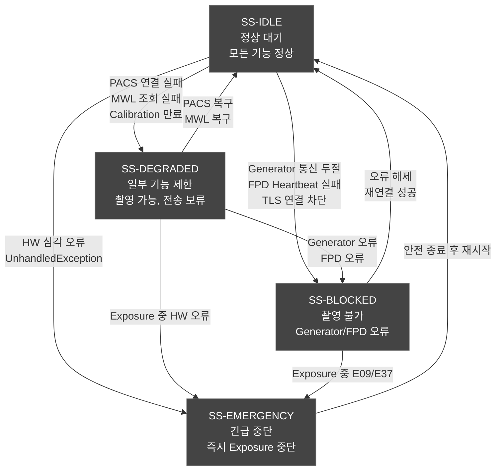

**전이 조건 요약:**

| 전이 | 트리거 | 자동/수동 |
|---|---|---|
| IDLE → DEGRADED | PACS/MWL 실패, Calibration 만료 | 자동 |
| IDLE → BLOCKED | Generator/FPD 연결 실패, TLS 차단 | 자동 |
| IDLE → EMERGENCY | HW 심각 오류, UnhandledException | 자동 |
| DEGRADED → IDLE | 오류 서비스 복구 | 자동 |
| DEGRADED → BLOCKED | Generator/FPD 추가 오류 | 자동 |
| BLOCKED → IDLE | 수동 오류 해제 + 재연결 성공 | 수동 |
| EMERGENCY → IDLE | 안전 종료 + 관리자 확인 후 재시작 | 수동 |

### 9.5 재시도 정책 아키텍처 패턴 (Polly)

모든 외부 인터페이스 통신에 Polly 라이브러리 기반 재시도 정책을 적용한다.

아키텍처 결정:
- Polly IAsyncPolicy를 DI 컨테이너로 주입하여 모듈별 독립 정책 적용
- 각 모듈은 자체 RetryPolicy를 갖되, RetryPolicyFactory를 통해 일관된 패턴 사용
- Circuit Breaker 패턴: 연속 5회 실패 시 30초 차단 후 Half-Open 상태에서 1회 시도

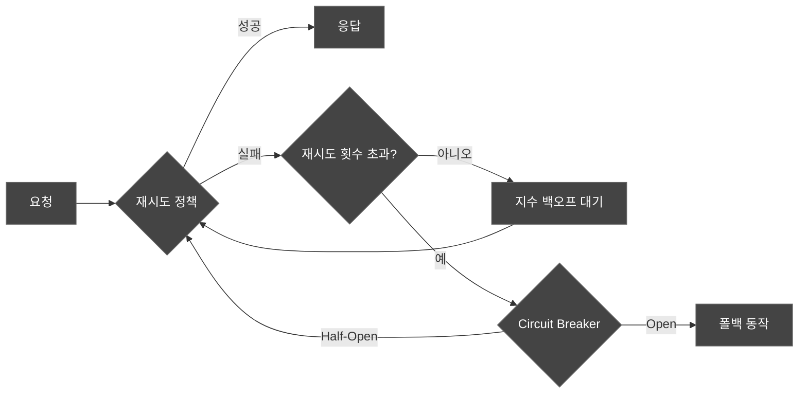

### 9.6 소프트웨어 워치독 타이머

각 주요 모듈 (DICOM, Generator, FPD)에 소프트웨어 워치독을 구현한다:
- Heartbeat 주기: DICOM 30s, Generator 3s, FPD 5s
- Heartbeat 미응답 시: 모듈 재시작 → 실패 시 안전 상태 전환
- 로그 기록: 모든 워치독 이벤트를 감사 로그에 기록

---

## 10. 보안 아키텍처 (STRIDE 위협 모델링)

### 10.1 STRIDE 위협 모델링 결과 요약

STRIDE (Spoofing, Tampering, Repudiation, Information Disclosure, Denial of Service, Elevation of Privilege) 분석은 DOC-017 Threat Model & Risk Assessment에서 상세 기술하며, 본 절은 아키텍처 수준의 대응 요약을 제공한다.

| STRIDE 위협 | 위협 시나리오 | 아키텍처 대응책 | 관련 모듈 |
|---|---|---|---|
| **Spoofing** | 공격자가 관리자로 위장 로그인 | bcrypt 해싱 + 5회 잠금 + LDAP MFA | SAD-CS-700 |
| **Tampering** | DICOM 영상 위변조 | TLS 1.3 전송 + 감사 로그 해시체인 | SAD-DC-500, SAD-CS-700 |
| **Repudiation** | 촬영 행위 부인 | Serilog HMAC-SHA256 해시체인 감사 로그 | SAD-CS-700 |
| **Information Disclosure** | PHI 데이터 탈취 | SQLCipher AES-256 + TLS 1.3 | SAD-DB-900, SAD-CS-700 |
| **Denial of Service** | DICOM 네트워크 폭주 | 연결 타임아웃 + 재시도 제한 (최대 3회) | SAD-DC-500 |
| **Elevation of Privilege** | 일반 사용자 → 관리자 권한 탈취 | RBAC 정책 + JWT 토큰 검증 | SAD-CS-700 |

### 10.2 보안 아키텍처 다이어그램

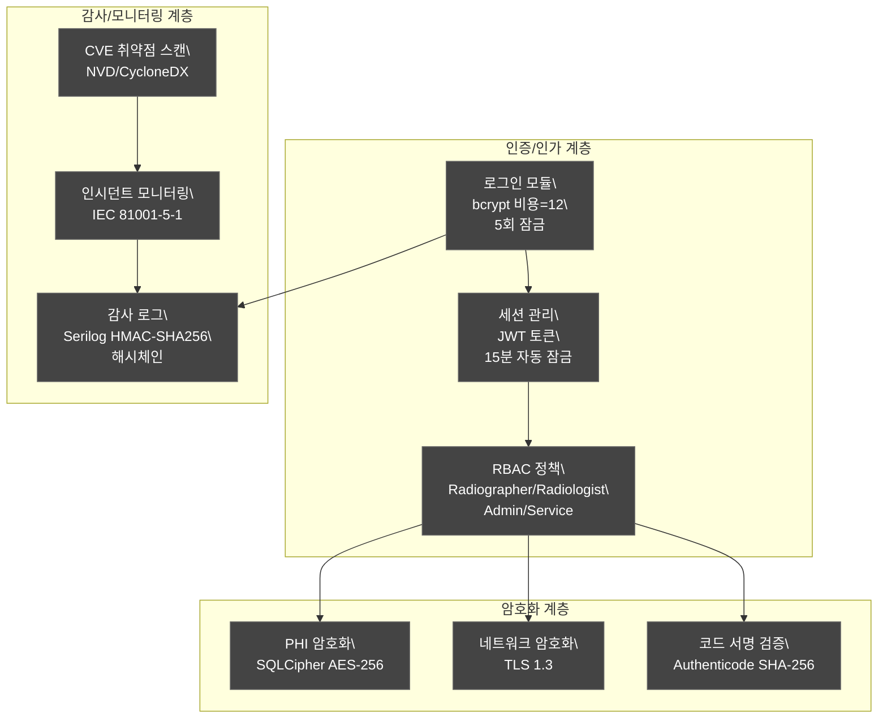

---

## 11. 인시던트 대응 아키텍처 (IEC 81001-5-1)

### 11.1 IEC 81001-5-1 §8.11 준수 매핑

| IEC 81001-5-1 요구사항 | HnVue 아키텍처 대응 |
|---|---|
| §8.11.1 인시던트 감지 | SAD-INC-1100 모듈: 로그인 실패/이상 트래픽/SW 위변조 감지 |
| §8.11.2 인시던트 분류 | Critical/High/Medium/Low 4단계 자동 분류 |
| §8.11.3 인시던트 보고 | PSIRT 보고 기능 (Critical/High 자동 알림) |
| §8.11.4 인시던트 처리 | 세션 강제 종료, 관리자 알림, 대응 로그 기록 |
| §8.11.5 사후 분석 | Post-incident Analysis 데이터 수집 및 보고 |
| §8.11.6 프로세스 개선 | 인시던트 이력 기반 보안 정책 업데이트 메커니즘 |

### 11.2 인시던트 대응 프로세스


---

## 12. SW 업데이트 아키텍처 (FDA 524B)

### 12.1 FDA Section 524B §3524(b)(2) 준수

| FDA 524B 요구사항 | HnVue 대응 |
|---|---|
| 식별된 취약점 및 패치 지원 | CVE 모니터링 + 정기 업데이트 (90일 주기) |
| 조정된 취약점 공개 (CVD) | PSIRT 프로세스 + 협력 공개 정책 |
| SBOM 제공 | CycloneDX 형식 SBOM 자동 생성 (CI/CD) |
| 업데이트 메커니즘 | SAD-UPD-1200: 코드 서명 + 해시 검증 + 롤백 |

### 12.2 SBOM 생성 파이프라인


---

## 13. SWR 추적성 매트릭스

### 13.1 Tier 1 MR → SAD 모듈 매핑

| MR ID | Tier | 관련 SAD 모듈 | SWR 연계 |
|---|---|---|---|
| MR-019 | Tier 1 | SAD-DC-500 | SWR-DC-001–035 |
| MR-020 | Tier 1 | SAD-PM-100, SAD-WF-200 | SWR-PM-001–053, SWR-WF-001–031 |
| MR-033 | Tier 1 | SAD-CS-700 | SWR-CS-001–030 |
| MR-034 | Tier 1 | SAD-CS-700, SAD-DB-900 | SWR-CS-031–050 |
| MR-035 | Tier 1 | SAD-CS-700 | SWR-CS-051–070 |
| MR-036 | Tier 1 | SAD-CS-700 | SWR-CS-071–075 |
| MR-037 | Tier 1 | SAD-INC-1100 | SWR-CS-086–087 |
| MR-039 | Tier 1 | SAD-UPD-1200, SAD-SA-600 | SWR-SA-076–077, SWR-CS-084–085 |
| MR-050 | Tier 1 | SAD-CS-700 (STRIDE) | SWR-NF-RG-060 |
| MR-051 | Tier 1 | SAD-UI-800 | SWR-UI-001–020 |
| MR-052 | Tier 1 | 전체 모듈 | 모든 SWR |
| MR-053 | Tier 1 | 전체 모듈 | 모든 SWR |
| MR-054 | Tier 1 | SAD-DC-500 | SWR-DC-001–035 |

### 13.2 Tier 2 MR → SAD 모듈 매핑 (주요 항목)

| MR ID | Tier | 관련 SAD 모듈 | SWR 연계 |
|---|---|---|---|
| MR-001 | Tier 2 | SAD-PM-100, SAD-DC-500 | SWR-PM-001–010 |
| MR-002 | Tier 2 | SAD-WF-200, SAD-DC-500 | SWR-WF-001–005 |
| MR-003 | Tier 2 | SAD-IP-300 | SWR-IP-001–010 |
| MR-004 | Tier 2 | SAD-IP-300, SAD-UI-800 | SWR-IP-011–020 |
| MR-007 | Tier 2 | SAD-DM-400 | SWR-DM-001–010 |
| MR-072 | Tier 2 | SAD-CD-1000 | SWR-WF-032–034 |

---

## 부록 A. 약어 및 용어 정의

| 약어 | 풀 네임 |
|---|---|
| SAD | Software Architecture Design (소프트웨어 아키텍처 설계) |
| SDS | Software Design Specification (소프트웨어 상세 설계) |
| SWR | Software Requirement (소프트웨어 요구사항) |
| MR | Market Requirement (시장 요구사항) |
| PR | Product Requirement (제품 요구사항) |
| Tier 1 | 없으면 인허가 불가 (MFDS/FDA 필수) |
| Tier 2 | 없으면 팔 수 없다 (시장 진입 필수) |
| STRIDE | Spoofing/Tampering/Repudiation/Information Disclosure/DoS/Elevation of Privilege |
| RBAC | Role-Based Access Control (역할 기반 접근 제어) |
| PHI | Protected Health Information (보호 건강 정보) |
| FPD | Flat Panel Detector (평판 검출기) |
| IMAPI2 | Image Mastering API v2 (Windows CD/DVD 굽기 API) |
| PSIRT | Product Security Incident Response Team |
| CVE | Common Vulnerabilities and Exposures |
| SBOM | Software Bill of Materials (소프트웨어 구성 목록) |
| INC | Incident Response (인시던트 대응) |
| UPD | Software Update (SW 업데이트) |
| fo-dicom | .NET DICOM 라이브러리 (v5.x) |
| SQLCipher | AES-256 암호화 SQLite 확장 |
| Serilog | .NET 구조화 로깅 라이브러리 |
