# 소프트웨어 상세 설계 명세서
# Software Design Specification (SDS)
## RadiConsole™ HnVue Console SW

---

| 항목 | 내용 |
|------|------|
| **문서 ID** | SDS-XRAY-GUI-001 |
| **문서명** | 소프트웨어 상세 설계 명세서 (Software Design Specification) |
| **버전** | v1.0 |
| **작성일** | 2026-03-18 |
| **개정일** | 2026-03-18 |
| **작성자** | SW 개발팀 (Software Development Team) |
| **승인자** | (승인 대기 / Pending Approval) |
| **상태** | Draft |
| **분류** | 내부 기밀 (Confidential) |
| **기준 규격** | IEC 62304:2006+AMD1:2015 §5.4, FDA 21 CFR 820.30(d) |
| **상위 문서** | SAD-XRAY-GUI-001 v1.0, FRS-XRAY-GUI-001 v1.0, SRS-XRAY-GUI-001 v1.0 |
| **DHF 참조** | DHF-XRAY-GUI-001 |

---

## 개정 이력 (Revision History)

| 버전 | 날짜 | 작성자 | 변경 내용 |
|------|------|--------|-----------|
| v0.1 | 2026-03-18 | SW 개발팀 | 초안 작성 — SAD/FRS/SRS 기반 모듈별 상세 설계 초안 |
| v1.0 | 2026-03-18 | SW 개발팀 | 최초 공식 릴리스 — 9개 모듈 완전 상세화, 알고리즘 및 추적성 완성 |

---

## 목차 (Table of Contents)

1. [목적 및 범위](#1-목적-및-범위)
2. [참조 문서](#2-참조-문서)
3. [모듈별 상세 설계](#3-모듈별-상세-설계)
   - [3.1 SDS-PM-1xx: PatientManagement 모듈](#31-sds-pm-1xx-patientmanagement-모듈)
   - [3.2 SDS-WF-2xx: WorkflowEngine 모듈](#32-sds-wf-2xx-workflowengine-모듈)
   - [3.3 SDS-IP-3xx: ImageProcessing 모듈](#33-sds-ip-3xx-imageprocessing-모듈)
   - [3.4 SDS-DM-4xx: DoseManagement 모듈](#34-sds-dm-4xx-dosemanagement-모듈)
   - [3.5 SDS-DC-5xx: DICOMCommunication 모듈](#35-sds-dc-5xx-dicomcommunication-모듈)
   - [3.6 SDS-SA-6xx: SystemAdmin 모듈](#36-sds-sa-6xx-systemadmin-모듈)
   - [3.7 SDS-CS-7xx: SecurityModule 모듈](#37-sds-cs-7xx-securitymodule-모듈)
   - [3.8 SDS-UI-8xx: UIFramework 모듈](#38-sds-ui-8xx-uiframework-모듈)
   - [3.9 SDS-DB-9xx: DataPersistence 모듈](#39-sds-db-9xx-datapersistence-모듈)
4. [데이터 구조 상세](#4-데이터-구조-상세)
5. [알고리즘 상세](#5-알고리즘-상세)
6. [UI 상세 설계](#6-ui-상세-설계)
7. [SAD→SDS 추적성 및 SDS→SWR 역추적](#7-sad-sds-추적성-및-sds-swr-역추적)
- [부록 A. 약어 및 용어 정의](#부록-a-약어-및-용어-정의)

---

## 1. 목적 및 범위

### 1.1 목적 (Purpose)

본 문서는 **RadiConsole™ HnVue Console SW** (의료용 진단 X-Ray 촬영장치 콘솔 소프트웨어)의 **소프트웨어 상세 설계 명세서 (Software Design Specification, SDS)** 로서, IEC 62304:2006+AMD1:2015 **§5.4 소프트웨어 상세 설계 (Software Detailed Design)** 에서 요구하는 모든 설계 산출물을 정의한다.

본 문서의 핵심 목적은 다음과 같다:

1. **SAD → 구현 브리지 (Architecture-to-Implementation Bridge)**: SAD-XRAY-GUI-001 v1.0에서 정의한 소프트웨어 아키텍처 단위(SAD-xxx)를 구현 가능한 클래스/메서드 수준의 상세 설계(SDS-xxx)로 정교화한다.
2. **IEC 62304 §5.4 준수**: 각 소프트웨어 단위(Software Unit)에 대해 세부 구현 사양, 인터페이스, 에러 처리 전략을 문서화하여 Class B 요구사항을 충족한다.
3. **구현 기준 제공 (Implementation Baseline)**: 개발자가 본 SDS만을 참조하여 코드를 작성할 수 있을 만큼 충분히 상세한 설계 정보를 제공한다.
4. **완전한 추적성 확립 (Traceability Completeness)**: SWR-xxx → SAD-xxx → SDS-xxx → 소스코드로 이어지는 추적성 체인을 확립한다.

### 1.2 범위 (Scope)

본 SDS는 **RadiConsole™ Phase 1 (v1.0)** 의 다음 9개 소프트웨어 모듈을 대상으로 한다:

| 모듈 ID | 모듈명 | SAD 참조 |
|---------|--------|---------|
| SDS-PM | PatientManagement | SAD-PM-001 |
| SDS-WF | WorkflowEngine | SAD-WF-001 |
| SDS-IP | ImageProcessing | SAD-IP-001 |
| SDS-DM | DoseManagement | SAD-DM-001 |
| SDS-DC | DICOMCommunication | SAD-DC-001 |
| SDS-SA | SystemAdmin | SAD-SA-001 |
| SDS-CS | SecurityModule | SAD-CS-001 |
| SDS-UI | UIFramework | SAD-UI-001 |
| SDS-DB | DataPersistence | SAD-DB-001 |

**제외 범위**: Phase 2 AI 기능(AI 서비스 모듈), 클라우드 스토리지 직접 전송, 모바일 앱

### 1.3 문서 위치 (Document Position in DHF)

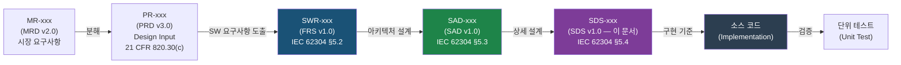
```mermaid
flowchart LR
    MRD["MR-xxx\n(MRD v2.0)\n시장 요구사항"]
    PRD["PR-xxx\n(PRD v3.0)\nDesign Input\n21 CFR 820.30(c)"]
    FRS["SWR-xxx\n(FRS v1.0)\nIEC 62304 §5.2"]
    SAD["SAD-xxx\n(SAD v1.0)\nIEC 62304 §5.3"]
    SDS["SDS-xxx\n(SDS v1.0 — 이 문서)\nIEC 62304 §5.4"]
    CODE["소스 코드\n(Implementation)"]
    UT["단위 테스트\n(Unit Test)"]

    MRD -->|분해| PRD
    PRD -->|SW 요구사항 도출| FRS
    FRS -->|아키텍처 설계| SAD
    SAD -->|상세 설계| SDS
    SDS -->|구현 기준| CODE
    CODE -->|검증| UT

    style SDS fill:#7d3c98,color:#fff
    style SAD fill:#1e8449,color:#fff
    style FRS fill:#1a5276,color:#fff
    style CODE fill:#2c3e50,color:#fff
```

---

## 2. 참조 문서 (Referenced Documents)

| 문서 ID | 문서명 | 버전 | 비고 |
|---------|--------|------|------|
| SAD-XRAY-GUI-001 | 소프트웨어 아키텍처 설계 문서 (Software Architecture Document) | v1.0 | 상위 아키텍처 설계 |
| FRS-XRAY-GUI-001 | 기능 요구사항 명세서 (Functional Requirements Specification) | v1.0 | SWR 정의 |
| SRS-XRAY-GUI-001 | 소프트웨어 요구사항 명세서 (Software Requirements Specification) | v1.0 | 비기능 SWR 포함 |
| PRD-XRAY-GUI-001 | 제품 요구사항 문서 (Product Requirements Document) | v3.0 | Design Input |
| DOC-RADI-GL-001 | SW 제품개발 지침서 (Development Guideline) | v1.0 | 개발 표준 |
| IEC 62304:2006+AMD1:2015 | Medical Device Software — SW Life Cycle | — | §5.4 적용 |
| ISO 14971:2019 | Risk Management for Medical Devices | — | HAZ 참조 |
| DICOM PS3.x 2023a | Digital Imaging and Communications in Medicine | 2023a | DICOM 구현 |
| IHE Radiology Technical Framework | IHE Radiology Technical Framework | Rev.17 | SWF Profile |

---

## 3. 모듈별 상세 설계 (Module-Level Detailed Design)

---

### 3.1 SDS-PM-1xx: PatientManagement 모듈

**모듈 목적**: 환자 등록(Patient Registration), 조회/수정, DICOM MWL 연동, 응급 등록, 검색, 삭제 기능을 제공하는 도메인 핵심 모듈

**SAD 참조**: SAD-PM-001  
**관련 SWR**: SWR-PM-001 ~ SWR-PM-053

#### 3.1.1 클래스 다이어그램 (Class Diagram)

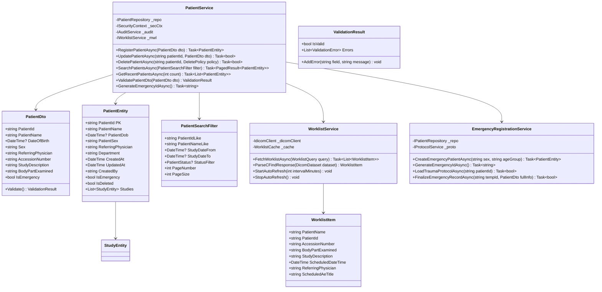
```mermaid
classDiagram
    class PatientService {
        -IPatientRepository _repo
        -ISecurityContext _secCtx
        -IAuditService _audit
        -IWorklistService _mwl
        +RegisterPatientAsync(PatientDto dto) Task~PatientEntity~
        +UpdatePatientAsync(string patientId, PatientDto dto) Task~bool~
        +DeletePatientAsync(string patientId, DeletePolicy policy) Task~bool~
        +SearchPatientsAsync(PatientSearchFilter filter) Task~PagedResult~PatientEntity~~
        +GetRecentPatientsAsync(int count) Task~List~PatientEntity~~
        +ValidatePatientDto(PatientDto dto) ValidationResult
        +GenerateEmergencyIdAsync() Task~string~
    }

    class PatientDto {
        +string PatientId
        +string PatientName
        +DateTime? DateOfBirth
        +string Sex
        +string ReferringPhysician
        +string AccessionNumber
        +string StudyDescription
        +string BodyPartExamined
        +bool IsEmergency
        +Validate() ValidationResult
    }

    class PatientEntity {
        +string PatientId PK
        +string PatientName
        +DateTime? PatientDob
        +string PatientSex
        +string ReferringPhysician
        +string Department
        +DateTime CreatedAt
        +DateTime UpdatedAt
        +string CreatedBy
        +bool IsEmergency
        +bool IsDeleted
        +List~StudyEntity~ Studies
    }

    class PatientSearchFilter {
        +string PatientIdLike
        +string PatientNameLike
        +DateTime? StudyDateFrom
        +DateTime? StudyDateTo
        +PatientStatus? StatusFilter
        +int PageNumber
        +int PageSize
    }

    class WorklistService {
        -IdicomClient _dicomClient
        -WorklistCache _cache
        +FetchWorklistAsync(WorklistQuery query) Task~List~WorklistItem~~
        +ParseCFindResponse(DicomDataset dataset) WorklistItem
        +StartAutoRefresh(int intervalMinutes) void
        +StopAutoRefresh() void
    }

    class WorklistItem {
        +string PatientName
        +string PatientId
        +string AccessionNumber
        +string BodyPartExamined
        +string StudyDescription
        +DateTime ScheduledDateTime
        +string ReferringPhysician
        +string ScheduledAeTitle
    }

    class EmergencyRegistrationService {
        -IPatientRepository _repo
        -IProtocolService _proto
        +CreateEmergencyPatientAsync(string sex, string ageGroup) Task~PatientEntity~
        +GenerateEmergencyIdAsync() Task~string~
        +LoadTraumaProtocolAsync(string patientId) Task~bool~
        +FinalizeEmergencyRecordAsync(string tempId, PatientDto fullInfo) Task~bool~
    }

    class ValidationResult {
        +bool IsValid
        +List~ValidationError~ Errors
        +AddError(string field, string message) void
    }

    PatientService --> PatientDto
    PatientService --> PatientEntity
    PatientService --> PatientSearchFilter
    PatientService --> WorklistService
    PatientService --> EmergencyRegistrationService
    WorklistService --> WorklistItem
    PatientEntity --> StudyEntity
```

#### 3.1.2 주요 메서드 시그니처 (Key Method Signatures)

| 메서드 | 입력 파라미터 | 반환 타입 | 설명 |
|--------|-------------|---------|------|
| `RegisterPatientAsync` | `PatientDto dto` | `Task<PatientEntity>` | 유효성 검사 → DB ACID 저장 → 감사 기록 |
| `UpdatePatientAsync` | `string patientId, PatientDto dto` | `Task<bool>` | 권한 확인 → 변경 전/후 감사 → UPDATE |
| `DeletePatientAsync` | `string patientId, DeletePolicy policy` | `Task<bool>` | Admin 권한 확인 → 촬영 중 차단 → 감사 기록 |
| `SearchPatientsAsync` | `PatientSearchFilter filter` | `Task<PagedResult<PatientEntity>>` | Parameterized Query → Paged 결과 |
| `ValidatePatientDto` | `PatientDto dto` | `ValidationResult` | 동기 즉시 검사 (필수 필드, 형식, DICOM VR) |
| `GenerateEmergencyIdAsync` | (없음) | `Task<string>` | EMG-YYYYMMDD-HHMMSS-NNN 원자적 발급 |
| `FetchWorklistAsync` | `WorklistQuery query` | `Task<List<WorklistItem>>` | C-FIND 요청 → 캐시 확인(5분 TTL) → 파싱 |

#### 3.1.3 시퀀스 다이어그램: 환자 등록 흐름 (Patient Registration Sequence)

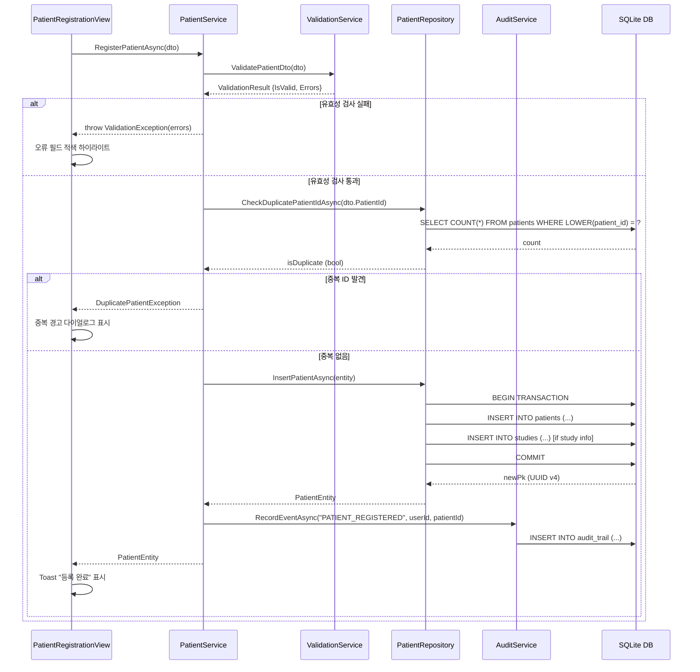
```mermaid
sequenceDiagram
    participant UI as PatientRegistrationView
    participant SVC as PatientService
    participant VAL as ValidationService
    participant REPO as PatientRepository
    participant AUDIT as AuditService
    participant DB as SQLite DB

    UI->>SVC: RegisterPatientAsync(dto)
    SVC->>VAL: ValidatePatientDto(dto)
    VAL-->>SVC: ValidationResult {IsValid, Errors}

    alt 유효성 검사 실패
        SVC-->>UI: throw ValidationException(errors)
        UI->>UI: 오류 필드 적색 하이라이트
    else 유효성 검사 통과
        SVC->>REPO: CheckDuplicatePatientIdAsync(dto.PatientId)
        REPO->>DB: SELECT COUNT(*) FROM patients WHERE LOWER(patient_id) = ?
        DB-->>REPO: count
        REPO-->>SVC: isDuplicate (bool)

        alt 중복 ID 발견
            SVC-->>UI: DuplicatePatientException
            UI->>UI: 중복 경고 다이얼로그 표시
        else 중복 없음
            SVC->>REPO: InsertPatientAsync(entity)
            REPO->>DB: BEGIN TRANSACTION
            REPO->>DB: INSERT INTO patients (...)
            REPO->>DB: INSERT INTO studies (...) [if study info]
            REPO->>DB: COMMIT
            DB-->>REPO: newPk (UUID v4)
            REPO-->>SVC: PatientEntity
            SVC->>AUDIT: RecordEventAsync("PATIENT_REGISTERED", userId, patientId)
            AUDIT->>DB: INSERT INTO audit_trail (...)
            SVC-->>UI: PatientEntity
            UI->>UI: Toast "등록 완료" 표시
        end
    end
```

#### 3.1.4 상태 전이 다이어그램: 환자 상태 (Patient Status State Machine)

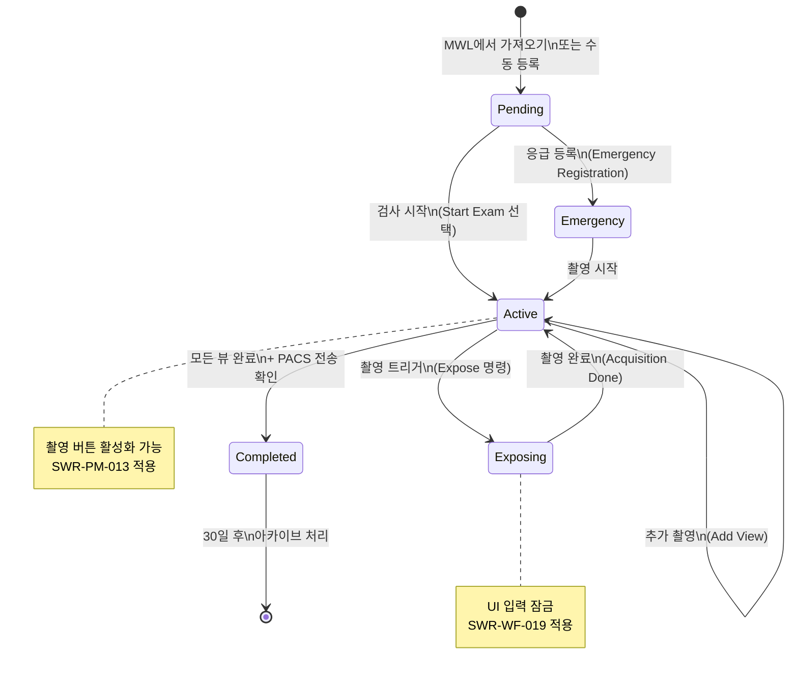
```mermaid
stateDiagram-v2
    [*] --> Pending : MWL에서 가져오기\n또는 수동 등록

    Pending --> Active : 검사 시작\n(Start Exam 선택)

    Active --> Exposing : 촬영 트리거\n(Expose 명령)

    Exposing --> Active : 촬영 완료\n(Acquisition Done)

    Active --> Completed : 모든 뷰 완료\n+ PACS 전송 확인

    Pending --> Emergency : 응급 등록\n(Emergency Registration)

    Emergency --> Active : 촬영 시작

    Active --> Active : 추가 촬영\n(Add View)

    Completed --> [*] : 30일 후\n아카이브 처리

    note right of Active
        촬영 버튼 활성화 가능
        SWR-PM-013 적용
    end note

    note right of Exposing
        UI 입력 잠금
        SWR-WF-019 적용
    end note
```

#### 3.1.5 에러 처리 상세 (Error Handling)

| 예외 클래스 | 발생 조건 | 처리 방법 | 관련 SWR |
|------------|---------|---------|---------|
| `ValidationException` | 필수 필드 누락, DICOM VR 위반 | UI에 인라인 오류 표시, 저장 차단 | SWR-PM-001, SWR-PM-002 |
| `DuplicatePatientException` | 중복 환자 ID 감지 | 3가지 선택지 다이얼로그 표시 | SWR-PM-003 |
| `DbTransactionException` | INSERT/UPDATE 실패 | ROLLBACK → 오류 메시지 → Error 로그 | SWR-PM-004 |
| `AccessDeniedException` | 권한 부족 (RBAC) | "권한 없음" 메시지, 동작 차단 | SWR-PM-011 |
| `PatientLockedForEditException` | 동시 편집 시도 | "다른 사용자 편집 중" 알림 | SWR-PM-011 |
| `WorklistConnectionException` | C-FIND 실패 | 경고 표시, 수동 입력 경로 강조 | SWR-PM-023 |
| `ActivePatientDeleteException` | 촬영 중 환자 삭제 시도 | 차단 메시지 표시 | SWR-PM-053 |

#### 3.1.6 입출력 데이터 구조

```csharp
// PatientDto — 입력 데이터 구조 (Input Data Structure)
public record PatientDto
{
    [Required, MaxLength(64), RegularExpression(@"^[A-Za-z0-9_\-]{1,64}$")]
    public string PatientId { get; init; }

    [Required, MaxLength(256)]
    public string PatientName { get; init; }   // DICOM PN 형식: Last^First^Middle

    public DateTime? DateOfBirth { get; init; }

    [Required]
    public PatientSex Sex { get; init; }  // enum: Male, Female, Other

    public string? ReferringPhysician { get; init; }
    public string? AccessionNumber { get; init; }
    public string? StudyDescription { get; init; }
    public string? BodyPartExamined { get; init; }
    public bool IsEmergency { get; init; } = false;
}

// PatientSearchFilter — 검색 필터 (Search Filter)
public record PatientSearchFilter
{
    public string? PatientIdLike { get; init; }
    public string? PatientNameLike { get; init; }
    public DateTime? StudyDateFrom { get; init; }
    public DateTime? StudyDateTo { get; init; }
    public PatientStatus? StatusFilter { get; init; }
    public int PageNumber { get; init; } = 1;
    public int PageSize { get; init; } = 50;  // 최대 1000
}
```

---

### 3.2 SDS-WF-2xx: WorkflowEngine 모듈

**모듈 목적**: APR 프로토콜 관리, 촬영 순서 설정, 발생장치(Generator) 통신, Detector 상태 모니터링, 촬영 실행 및 영상 수신 파이프라인 제어

**SAD 참조**: SAD-WF-001  
**관련 SWR**: SWR-WF-010 ~ SWR-WF-027

#### 3.2.1 클래스 다이어그램 (Class Diagram)

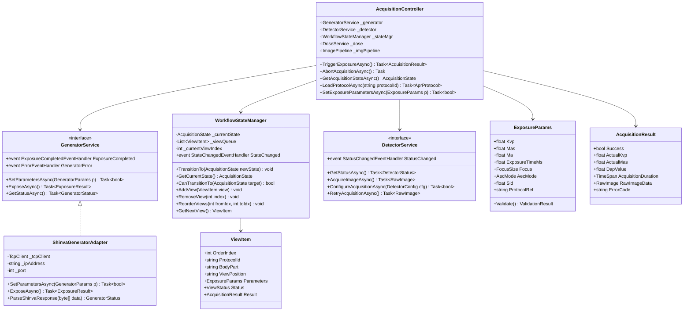
```mermaid
classDiagram
    class AcquisitionController {
        -IGeneratorService _generator
        -IDetectorService _detector
        -IWorkflowStateManager _stateMgr
        -IDoseService _dose
        -IImagePipeline _imgPipeline
        +TriggerExposureAsync() Task~AcquisitionResult~
        +AbortAcquisitionAsync() Task
        +GetAcquisitionStateAsync() AcquisitionState
        +LoadProtocolAsync(string protocolId) Task~AprProtocol~
        +SetExposureParametersAsync(ExposureParams p) Task~bool~
    }

    class WorkflowStateManager {
        -AcquisitionState _currentState
        -List~ViewItem~ _viewQueue
        -int _currentViewIndex
        +TransitionTo(AcquisitionState newState) void
        +GetCurrentState() AcquisitionState
        +CanTransitionTo(AcquisitionState target) bool
        +AddView(ViewItem view) void
        +RemoveView(int index) void
        +ReorderViews(int fromIdx, int toIdx) void
        +GetNextView() ViewItem
        +event StateChangedEventHandler StateChanged
    }

    class GeneratorService {
        <<interface>>
        +SetParametersAsync(GeneratorParams p) Task~bool~
        +ExposeAsync() Task~ExposureResult~
        +GetStatusAsync() Task~GeneratorStatus~
        +event ExposureCompletedEventHandler ExposureCompleted
        +event ErrorEventHandler GeneratorError
    }

    class ShinvaGeneratorAdapter {
        -TcpClient _tcpClient
        -string _ipAddress
        -int _port
        +SetParametersAsync(GeneratorParams p) Task~bool~
        +ExposeAsync() Task~ExposureResult~
        +ParseShinvaResponse(byte[] data) GeneratorStatus
    }

    class DetectorService {
        <<interface>>
        +GetStatusAsync() Task~DetectorStatus~
        +AcquireImageAsync() Task~RawImage~
        +ConfigureAcquisitionAsync(DetectorConfig cfg) Task~bool~
        +RetryAcquisitionAsync() Task~RawImage~
        +event StatusChangedEventHandler StatusChanged
    }

    class ExposureParams {
        +float Kvp
        +float Mas
        +float Ma
        +float ExposureTimeMs
        +FocusSize Focus
        +AecMode AecMode
        +float Sid
        +string ProtocolRef
        +Validate() ValidationResult
    }

    class AcquisitionResult {
        +bool Success
        +float ActualKvp
        +float ActualMas
        +float DapValue
        +TimeSpan AcquisitionDuration
        +RawImage RawImageData
        +string ErrorCode
    }

    class ViewItem {
        +int OrderIndex
        +string ProtocolId
        +string BodyPart
        +string ViewPosition
        +ExposureParams Parameters
        +ViewStatus Status
        +AcquisitionResult Result
    }

    AcquisitionController --> GeneratorService
    AcquisitionController --> DetectorService
    AcquisitionController --> WorkflowStateManager
    AcquisitionController --> ExposureParams
    AcquisitionController --> AcquisitionResult
    GeneratorService <|.. ShinvaGeneratorAdapter
    WorkflowStateManager --> ViewItem
```

#### 3.2.2 촬영 워크플로우 상태 머신 상세 (Acquisition Workflow State Machine)

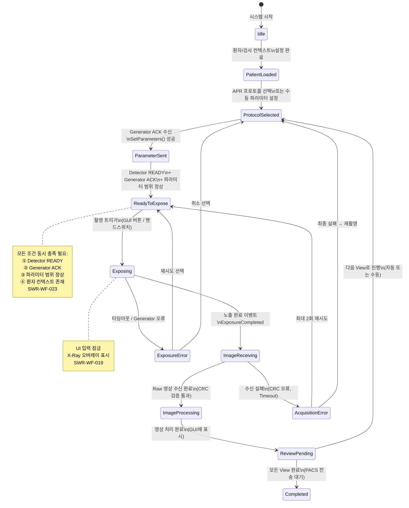
```mermaid
stateDiagram-v2
    [*] --> Idle : 시스템 시작

    Idle --> PatientLoaded : 환자/검사 컨텍스트\n설정 완료

    PatientLoaded --> ProtocolSelected : APR 프로토콜 선택\n또는 수동 파라미터 설정

    ProtocolSelected --> ParameterSent : Generator ACK 수신\nSetParameters() 성공

    ParameterSent --> ReadyToExpose : Detector READY\n+ Generator ACK\n+ 파라미터 범위 정상

    ReadyToExpose --> Exposing : 촬영 트리거\n(GUI 버튼 / 핸드스위치)

    Exposing --> ImageReceiving : 노출 완료 이벤트\nExposureCompleted

    ImageReceiving --> ImageProcessing : Raw 영상 수신 완료\n(CRC 검증 통과)

    ImageProcessing --> ReviewPending : 영상 처리 완료\n(GUI에 표시)

    ReviewPending --> ProtocolSelected : 다음 View로 진행\n(자동 또는 수동)

    ReviewPending --> Completed : 모든 View 완료\n(PACS 전송 대기)

    Exposing --> ExposureError : 타임아웃 / Generator 오류
    ExposureError --> ReadyToExpose : 재시도 선택
    ExposureError --> ProtocolSelected : 취소 선택

    ImageReceiving --> AcquisitionError : 수신 실패\n(CRC 오류, Timeout)
    AcquisitionError --> ReadyToExpose : 최대 2회 재시도
    AcquisitionError --> ProtocolSelected : 최종 실패 → 재촬영

    note right of Exposing
        UI 입력 잠금
        X-Ray 오버레이 표시
        SWR-WF-019
    end note

    note right of ReadyToExpose
        모든 조건 동시 충족 필요:
        ① Detector READY
        ② Generator ACK
        ③ 파라미터 범위 정상
        ④ 환자 컨텍스트 존재
        SWR-WF-023
    end note
```

#### 3.2.3 이벤트 처리 상세 (Event Handling)

| 이벤트 | 발생 조건 | 핸들러 | 처리 로직 | 관련 SWR |
|--------|---------|--------|---------|---------|
| `ExposureCompleted` | Generator 노출 완료 신호 수신 | `OnExposureCompleted` | DAP/kVp/mAs 추출 → DoseService 전달 → AcquireImage 시작 | SWR-WF-019 |
| `ExposureTimeout` | ≤200ms 이내 Generator Ready 미수신 | `OnExposureTimeout` | `ExposureTimeoutException` 발생 → 촬영 상태 → Error | SWR-WF-019 |
| `DetectorStatusChanged` | 폴링 결과 상태 변화 감지 | `OnDetectorStatusChanged` | UI 상태 표시 갱신 → Critical 오류 시 알림 | SWR-WF-021 |
| `GeneratorError` | 오류 코드 수신 | `OnGeneratorError` | 오류 코드 매핑 → 오류 메시지 표시 → 로그 기록 | SWR-WF-020 |
| `ImageAcquisitionFailed` | 영상 수신 실패 | `OnImageAcquisitionFailed` | 재시도 카운터 확인 → 최대 2회 재시도 | SWR-WF-025 |

#### 3.2.4 에러 처리 상세 (Error Handling)

| 예외 클래스 | 발생 조건 | 처리 |
|------------|---------|------|
| `ExposureTimeoutException` | Generator Ready 미응답 200ms | 촬영 중단, 오류 팝업, Error 로그 |
| `DetectorCriticalException` | Detector MALFUNCTION/MEMORY_FULL | 시각/청각 알림, 촬영 버튼 비활성화 |
| `GeneratorParameterException` | ACK 실패 후 파라미터 전송 오류 | 노란 Pending 표시, 재전송 시도 |
| `ImageCrcException` | Raw 영상 CRC 불일치 | 자동 재시도(최대 2회), 최종 실패 시 재촬영 안내 |
| `ParameterOutOfRangeException` | kVp/mAs 범위 위반 | 촬영 버튼 비활성화, 인라인 오류 표시 |

---

### 3.3 SDS-IP-3xx: ImageProcessing 모듈

**모듈 목적**: Raw FPD 영상의 전처리(Offset/Gain Correction), Window/Level 조정, 회전/반전, Image Stitching, 영상 주석, DICOM 파일 생성

**SAD 참조**: SAD-IP-001  
**관련 SWR**: SWR-IP-030 ~ SWR-IP-052

#### 3.3.1 클래스 다이어그램 (Class Diagram)


```mermaid
classDiagram
    class ImageProcessingPipeline {
        -IOffsetGainCorrector _corrector
        -IWindowLevelAdjuster _wlAdjuster
        -INoiseReducer _noiseReducer
        -IEdgeEnhancer _edgeEnhancer
        -IImageStitcher _stitcher
        -IDicomImageBuilder _dicomBuilder
        +ProcessRawImageAsync(RawImage raw, ProcessingParams p) Task~ProcessedImage~
        +ApplyWindowLevel(ProcessedImage img, float wc, float ww) ProcessedImage
        +StitchImagesAsync(List~ProcessedImage~ images, StitchParams p) Task~ProcessedImage~
        +BuildDicomFileAsync(ProcessedImage img, DicomMetadata meta) Task~DicomFile~
    }

    class OffsetGainCorrector {
        -CalibrationData _calibData
        +CorrectAsync(RawImage raw) Task~CorrectedImage~
        +ApplyOffsetCorrection(ushort[] pixels, ushort[] offsetMap) ushort[]
        +ApplyGainCorrection(ushort[] pixels, float[] gainMap) ushort[]
        +ApplyDefectPixelCorrection(ushort[] pixels, List~Point~ defects) ushort[]
        +LoadCalibrationDataAsync(string calibPath) Task~CalibrationData~
    }

    class WindowLevelAdjuster {
        +AutoAdjustWindowLevel(CorrectedImage img, WLAlgorithm algo) WLResult
        +ApplyWindowLevel(ushort[] pixels, float wc, float ww) byte[]
        +CalculateHistogram(ushort[] pixels, int binCount) int[]
        +FindOptimalWLByHistogram(int[] histogram) WLResult
        +FindOptimalWLByROI(ushort[] pixels, Rectangle roi) WLResult
    }

    class ImageStitcher {
        +StitchAsync(List~CorrectedImage~ images, StitchParams p) Task~StitchedImage~
        +DetectFeaturePoints(CorrectedImage img) List~FeaturePoint~
        +MatchFeaturePoints(List~FeaturePoint~ a, List~FeaturePoint~ b) List~FeatureMatch~
        +ComputeHomography(List~FeatureMatch~ matches) Matrix3x3
        +BlendImages(List~CorrectedImage~ imgs, List~Matrix3x3~ transforms) StitchedImage
    }

    class DicomImageBuilder {
        +BuildDicomFileAsync(ProcessedImage img, DicomMetadata meta) Task~DicomFile~
        +SetPixelData(DicomDataset ds, ushort[] pixels, int rows, int cols) void
        +SetMandatoryTags(DicomDataset ds, DicomMetadata meta) void
        +SetExposureParams(DicomDataset ds, ExposureParams ep) void
        +SetWindowLevel(DicomDataset ds, float wc, float ww) void
        +CalculateEI(ushort[] pixels, ExposureParams ep) float
    }

    class ProcessingParams {
        +bool ApplyOffsetCorrection
        +bool ApplyGainCorrection
        +bool ApplyDefectCorrection
        +WLAlgorithm WlAlgorithm
        +NoiseReductionLevel NoiseLevel
        +EdgeEnhancementLevel EdgeLevel
        +float? ManualWC
        +float? ManualWW
    }

    class ProcessedImage {
        +Guid ImageId
        +ushort[] PixelData
        +int Rows
        +int Columns
        +float WindowCenter
        +float WindowWidth
        +float PixelSpacingX
        +float PixelSpacingY
        +ProcessingHistory History
    }

    ImageProcessingPipeline --> OffsetGainCorrector
    ImageProcessingPipeline --> WindowLevelAdjuster
    ImageProcessingPipeline --> ImageStitcher
    ImageProcessingPipeline --> DicomImageBuilder
    ImageProcessingPipeline --> ProcessingParams
    ImageProcessingPipeline --> ProcessedImage
```

#### 3.3.2 영상 처리 파이프라인 시퀀스 (Image Processing Pipeline Sequence)

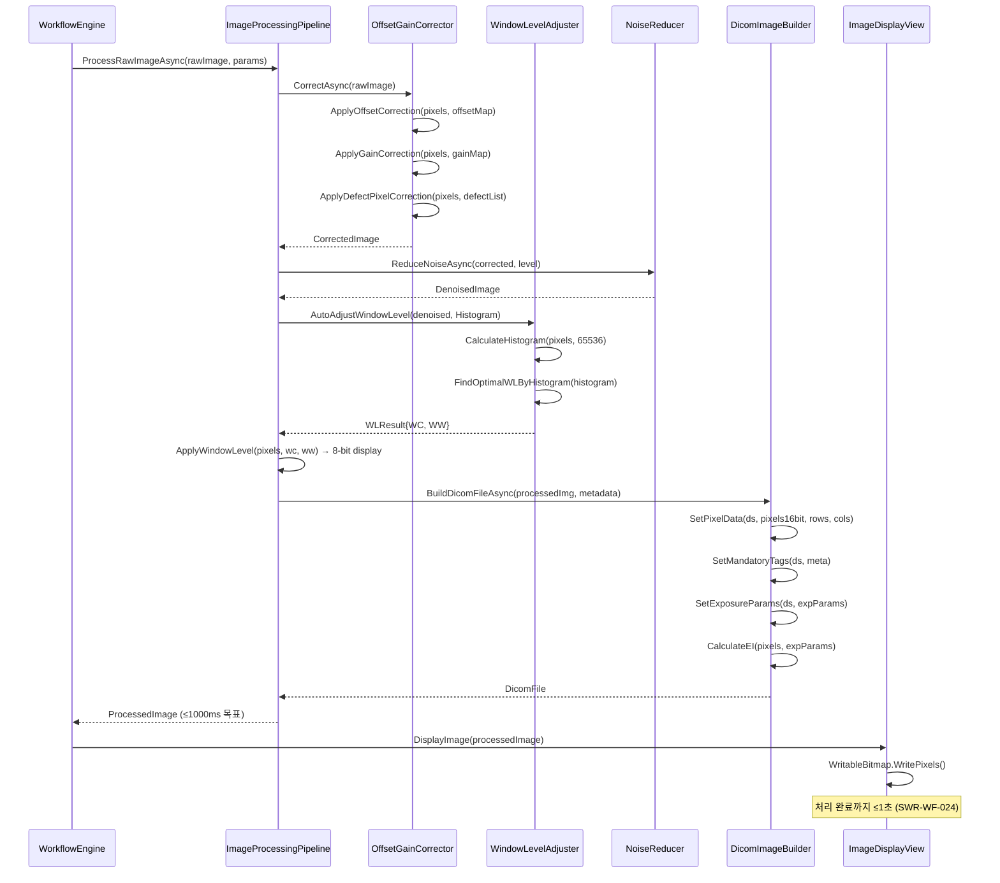
```mermaid
sequenceDiagram
    participant WF as WorkflowEngine
    participant PIPE as ImageProcessingPipeline
    participant CORR as OffsetGainCorrector
    participant WL as WindowLevelAdjuster
    participant NOISE as NoiseReducer
    participant DICOM as DicomImageBuilder
    participant UI as ImageDisplayView

    WF->>PIPE: ProcessRawImageAsync(rawImage, params)
    
    PIPE->>CORR: CorrectAsync(rawImage)
    CORR->>CORR: ApplyOffsetCorrection(pixels, offsetMap)
    CORR->>CORR: ApplyGainCorrection(pixels, gainMap)
    CORR->>CORR: ApplyDefectPixelCorrection(pixels, defectList)
    CORR-->>PIPE: CorrectedImage

    PIPE->>NOISE: ReduceNoiseAsync(corrected, level)
    NOISE-->>PIPE: DenoisedImage

    PIPE->>WL: AutoAdjustWindowLevel(denoised, Histogram)
    WL->>WL: CalculateHistogram(pixels, 65536)
    WL->>WL: FindOptimalWLByHistogram(histogram)
    WL-->>PIPE: WLResult{WC, WW}

    PIPE->>PIPE: ApplyWindowLevel(pixels, wc, ww) → 8-bit display

    PIPE->>DICOM: BuildDicomFileAsync(processedImg, metadata)
    DICOM->>DICOM: SetPixelData(ds, pixels16bit, rows, cols)
    DICOM->>DICOM: SetMandatoryTags(ds, meta)
    DICOM->>DICOM: SetExposureParams(ds, expParams)
    DICOM->>DICOM: CalculateEI(pixels, expParams)
    DICOM-->>PIPE: DicomFile

    PIPE-->>WF: ProcessedImage (≤1000ms 목표)
    WF->>UI: DisplayImage(processedImage)
    UI->>UI: WritableBitmap.WritePixels()
    Note over UI: 처리 완료까지 ≤1초 (SWR-WF-024)
```

#### 3.3.3 에러 처리 (Error Handling)

| 예외 | 조건 | 처리 |
|------|------|------|
| `CalibrationDataNotFoundException` | 캘리브레이션 파일 없음 | 경고 + Raw 영상 그대로 표시 (Uncorrected 배지) |
| `PixelDataCorruptedException` | 픽셀 데이터 손상 | 영상 폐기, 재촬영 권고 메시지 |
| `StitchingFailedException` | 특징점 매칭 실패 | 개별 영상 유지, 수동 정렬 모드 전환 |
| `DicomBuildException` | DICOM 태그 필수값 누락 | 기본값 자동 채우기 후 재시도, 로그 기록 |
| `OutOfMemoryException` | 대형 영상(>18MB) 처리 실패 | 페이지 단위 처리 재시도, 메모리 경고 |

---

### 3.4 SDS-DM-4xx: DoseManagement 모듈

**모듈 목적**: DAP(Dose Area Product) 계산 및 기록, RDSR(Radiation Dose Structured Report) 생성, DRL(Diagnostic Reference Level) 비교 및 경고, 선량 이력 관리

**SAD 참조**: SAD-DM-001  
**관련 SWR**: SWR-DM-040 ~ SWR-DM-046

#### 3.4.1 클래스 다이어그램 (Class Diagram)

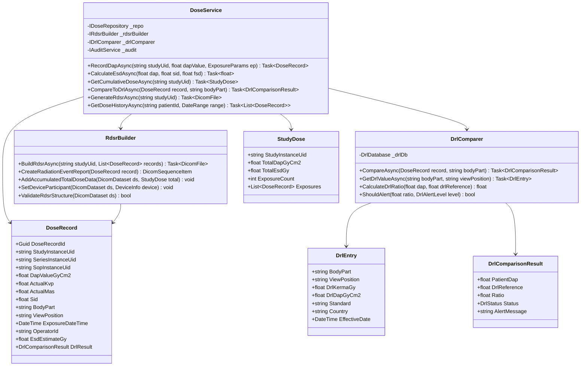
```mermaid
classDiagram
    class DoseService {
        -IDoseRepository _repo
        -IRdsrBuilder _rdsrBuilder
        -IDrlComparer _drlComparer
        -IAuditService _audit
        +RecordDapAsync(string studyUid, float dapValue, ExposureParams ep) Task~DoseRecord~
        +CalculateEsdAsync(float dap, float sid, float fsd) Task~float~
        +GetCumulativeDoseAsync(string studyUid) Task~StudyDose~
        +CompareToDrlAsync(DoseRecord record, string bodyPart) Task~DrlComparisonResult~
        +GenerateRdsrAsync(string studyUid) Task~DicomFile~
        +GetDoseHistoryAsync(string patientId, DateRange range) Task~List~DoseRecord~~
    }

    class DoseRecord {
        +Guid DoseRecordId
        +string StudyInstanceUid
        +string SeriesInstanceUid
        +string SopInstanceUid
        +float DapValueGyCm2
        +float ActualKvp
        +float ActualMas
        +float Sid
        +string BodyPart
        +string ViewPosition
        +DateTime ExposureDateTime
        +string OperatorId
        +float EsdEstimateGy
        +DrlComparisonResult DrlResult
    }

    class DrlComparer {
        -DrlDatabase _drlDb
        +CompareAsync(DoseRecord record, string bodyPart) Task~DrlComparisonResult~
        +GetDrlValueAsync(string bodyPart, string viewPosition) Task~DrlEntry~
        +CalculateDrlRatio(float dap, float drlReference) float
        +ShouldAlert(float ratio, DrlAlertLevel level) bool
    }

    class DrlEntry {
        +string BodyPart
        +string ViewPosition
        +float DrlKermaGy
        +float DrlDapGyCm2
        +string Standard
        +string Country
        +DateTime EffectiveDate
    }

    class DrlComparisonResult {
        +float PatientDap
        +float DrlReference
        +float Ratio
        +DrlStatus Status
        +string AlertMessage
    }

    class RdsrBuilder {
        +BuildRdsrAsync(string studyUid, List~DoseRecord~ records) Task~DicomFile~
        +CreateRadiationEventReport(DoseRecord record) DicomSequenceItem
        +AddAccumulatedTotalDoseData(DicomDataset ds, StudyDose total) void
        +SetDeviceParticipant(DicomDataset ds, DeviceInfo device) void
        +ValidateRdsrStructure(DicomDataset ds) bool
    }

    class StudyDose {
        +string StudyInstanceUid
        +float TotalDapGyCm2
        +float TotalEsdGy
        +int ExposureCount
        +List~DoseRecord~ Exposures
    }

    DoseService --> DoseRecord
    DoseService --> DrlComparer
    DoseService --> RdsrBuilder
    DoseService --> StudyDose
    DrlComparer --> DrlEntry
    DrlComparer --> DrlComparisonResult
    RdsrBuilder --> DoseRecord
```

#### 3.4.2 DAP 계산 로직 시퀀스 (DAP Calculation Sequence)

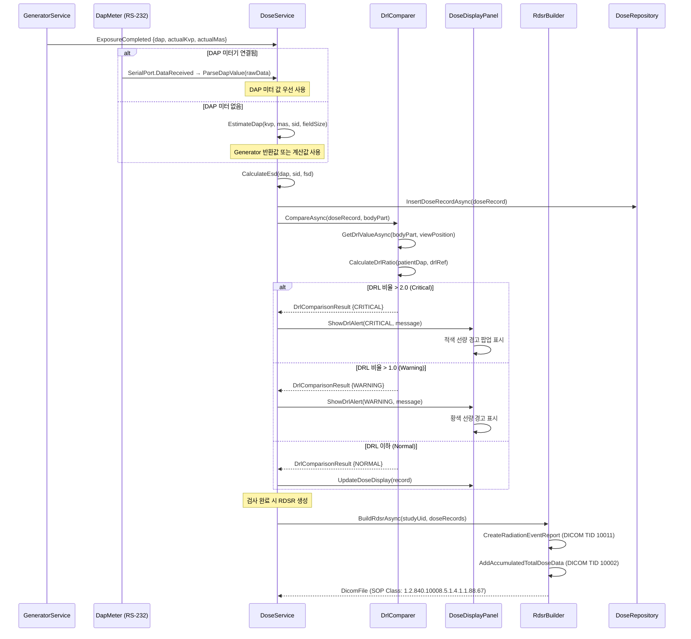
```mermaid
sequenceDiagram
    participant GEN as GeneratorService
    participant DAP_M as DapMeter (RS-232)
    participant DOSE as DoseService
    participant DRL as DrlComparer
    participant UI as DoseDisplayPanel
    participant RDSR as RdsrBuilder
    participant DB as DoseRepository

    GEN->>DOSE: ExposureCompleted {dap, actualKvp, actualMas}
    alt DAP 미터기 연결됨
        DAP_M->>DOSE: SerialPort.DataReceived → ParseDapValue(rawData)
        Note over DOSE: DAP 미터 값 우선 사용
    else DAP 미터 없음
        DOSE->>DOSE: EstimateDap(kvp, mas, sid, fieldSize)
        Note over DOSE: Generator 반환값 또는 계산값 사용
    end

    DOSE->>DOSE: CalculateEsd(dap, sid, fsd)
    DOSE->>DB: InsertDoseRecordAsync(doseRecord)
    DOSE->>DRL: CompareAsync(doseRecord, bodyPart)
    DRL->>DRL: GetDrlValueAsync(bodyPart, viewPosition)
    DRL->>DRL: CalculateDrlRatio(patientDap, drlRef)
    
    alt DRL 비율 > 2.0 (Critical)
        DRL-->>DOSE: DrlComparisonResult {CRITICAL}
        DOSE->>UI: ShowDrlAlert(CRITICAL, message)
        UI->>UI: 적색 선량 경고 팝업 표시
    else DRL 비율 > 1.0 (Warning)
        DRL-->>DOSE: DrlComparisonResult {WARNING}
        DOSE->>UI: ShowDrlAlert(WARNING, message)
        UI->>UI: 황색 선량 경고 표시
    else DRL 이하 (Normal)
        DRL-->>DOSE: DrlComparisonResult {NORMAL}
        DOSE->>UI: UpdateDoseDisplay(record)
    end

    Note over DOSE: 검사 완료 시 RDSR 생성
    DOSE->>RDSR: BuildRdsrAsync(studyUid, doseRecords)
    RDSR->>RDSR: CreateRadiationEventReport (DICOM TID 10011)
    RDSR->>RDSR: AddAccumulatedTotalDoseData (DICOM TID 10002)
    RDSR-->>DOSE: DicomFile (SOP Class: 1.2.840.10008.5.1.4.1.1.88.67)
```

#### 3.4.3 에러 처리 (Error Handling)

| 예외 | 조건 | 처리 |
|------|------|------|
| `DapMeterConnectionException` | RS-232 포트 응답 없음 | Generator 반환값으로 대체, 경고 표시 |
| `DrlDatabaseNotFoundException` | DRL 기준값 DB 없음 | DRL 비교 생략, 선량 기록은 유지 |
| `RdsrBuildException` | RDSR 생성 실패 | 재시도 1회, 실패 시 로그 기록 + 수동 생성 안내 |
| `DoseRecordInsertException` | DB 저장 실패 | 메모리 버퍼 유지, 연결 복구 후 일괄 저장 |

---

### 3.5 SDS-DC-5xx: DICOMCommunication 모듈

**모듈 목적**: DICOM SOP Class 구현(C-STORE, C-FIND, C-MOVE, MPPS, Storage Commitment), PACS/RIS 네트워크 통신, TLS 보안 전송

**SAD 참조**: SAD-DC-001  
**관련 SWR**: SWR-DC-050 ~ SWR-DC-058

#### 3.5.1 클래스 다이어그램 (Class Diagram)


```mermaid
classDiagram
    class DicomCommunicationService {
        -DicomServer _scpServer
        -IStorageScuService _storageScu
        -IWorklistScuService _worklistScu
        -IMppsService _mppsService
        -IStorageCommitService _storageCommit
        -DicomConfig _config
        +SendImageToPacsAsync(DicomFile file, string pacsAeTitle) Task~DicomSendResult~
        +QueryWorklistAsync(WorklistQuery query) Task~List~WorklistItem~~
        +SendMppsInProgressAsync(MppsData data) Task~bool~
        +SendMppsCompletedAsync(MppsData data) Task~bool~
        +RequestStorageCommitmentAsync(List~string~ sopUids) Task~bool~
        +VerifyAssociationAsync(string remoteAeTitle) Task~bool~
    }

    class StorageScuService {
        -fo_dicom_Client _client
        +SendAsync(DicomFile file, string remoteAe, string host, int port) Task~DicomSendResult~
        +SendWithRetryAsync(DicomFile file, RemoteNode node, int maxRetry) Task~DicomSendResult~
        +BuildPresentationContext(DicomFile file) List~DicomPresentationContext~
        +HandleCStoreResponse(DicomCStoreResponse rsp) DicomSendResult
    }

    class WorklistScuService {
        -fo_dicom_Client _client
        +QueryAsync(WorklistQuery query, RemoteNode mwlScp) Task~List~DicomDataset~~
        +BuildCFindRequest(WorklistQuery query) DicomCFindRequest
        +ParseCFindResponse(DicomDataset ds) WorklistItem
    }

    class MppsService {
        +SendInProgressAsync(MppsData data, RemoteNode mppsManager) Task~bool~
        +SendCompletedAsync(MppsData data, RemoteNode mppsManager) Task~bool~
        +SendDiscontinuedAsync(MppsData data, string reason) Task~bool~
        +BuildMppsNCreateDataset(MppsData data) DicomDataset
        +BuildMppsNSetDataset(MppsData data) DicomDataset
    }

    class StorageCommitService {
        -DicomServer _nEventReportScp
        +RequestCommitmentAsync(List~string~ sopUids, RemoteNode scpNode) Task~bool~
        +HandleNEventReport(DicomNEventReportRequest req) DicomNEventReportResponse
        +UpdateCommitmentStatus(string sopUid, CommitmentStatus status) void
        +event CommitmentResultEventHandler CommitmentReceived
    }

    class DicomConfig {
        +string LocalAeTitle
        +int LocalPort
        +bool TlsEnabled
        +string TlsCertificatePath
        +List~RemoteNode~ RemoteNodes
        +int ConnectionTimeoutMs
        +int MaxRetryCount
    }

    class RemoteNode {
        +string AeTitle
        +string Hostname
        +int Port
        +bool TlsRequired
        +NodeType NodeType
    }

    class DicomSendResult {
        +bool Success
        +string SopInstanceUid
        +DicomStatus DicomStatus
        +string ErrorMessage
        +TimeSpan ElapsedTime
    }

    DicomCommunicationService --> StorageScuService
    DicomCommunicationService --> WorklistScuService
    DicomCommunicationService --> MppsService
    DicomCommunicationService --> StorageCommitService
    DicomCommunicationService --> DicomConfig
    StorageScuService --> DicomSendResult
    DicomConfig --> RemoteNode
```

#### 3.5.2 DICOM SOP Class 구현 목록 (SOP Class Implementation List)

| SOP Class | UID | 역할 (SCU/SCP) | 관련 SWR |
|-----------|-----|--------------|---------|
| Digital X-Ray Image Storage (Presentation) | 1.2.840.10008.5.1.4.1.1.1 | SCU | SWR-DC-050 |
| Digital X-Ray Image Storage (Processing) | 1.2.840.10008.5.1.4.1.1.1.1 | SCU | SWR-DC-050 |
| Computed Radiography Image Storage | 1.2.840.10008.5.1.4.1.1.1 | SCU | SWR-DC-050 |
| Modality Worklist Information Model — FIND | 1.2.840.10008.5.1.4.31 | SCU | SWR-DC-053 |
| Modality Performed Procedure Step | 1.2.840.10008.3.1.2.3.3 | SCU | SWR-DC-055 |
| Storage Commitment Push Model | 1.2.840.10008.1.20.1 | SCU/SCP | SWR-DC-056 |
| Radiation Dose Structured Report | 1.2.840.10008.5.1.4.1.1.88.67 | SCU | SWR-DM-044 |
| Verification (C-ECHO) | 1.2.840.10008.1.1 | SCU | SWR-DC-051 |
| Study Root Query/Retrieve — FIND | 1.2.840.10008.5.1.4.1.2.2.1 | SCU | SWR-DC-053 |

#### 3.5.3 네트워크 프로토콜 시퀀스: C-STORE (DICOM Send Sequence)

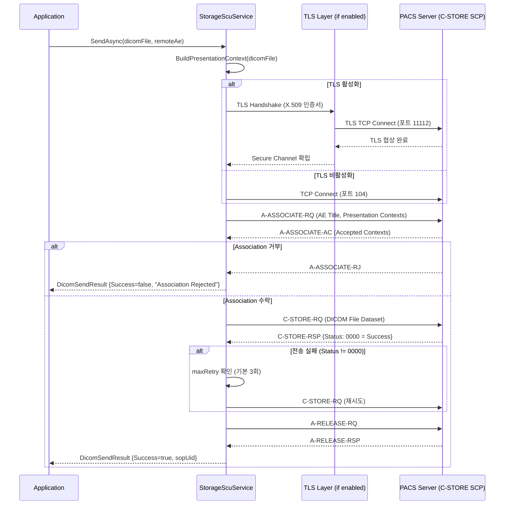
```mermaid
sequenceDiagram
    participant APP as Application
    participant DSCU as StorageScuService
    participant TLS as TLS Layer (if enabled)
    participant PACS as PACS Server (C-STORE SCP)

    APP->>DSCU: SendAsync(dicomFile, remoteAe)
    DSCU->>DSCU: BuildPresentationContext(dicomFile)
    
    alt TLS 활성화
        DSCU->>TLS: TLS Handshake (X.509 인증서)
        TLS->>PACS: TLS TCP Connect (포트 11112)
        PACS-->>TLS: TLS 협상 완료
        TLS-->>DSCU: Secure Channel 확립
    else TLS 비활성화
        DSCU->>PACS: TCP Connect (포트 104)
    end

    DSCU->>PACS: A-ASSOCIATE-RQ (AE Title, Presentation Contexts)
    PACS-->>DSCU: A-ASSOCIATE-AC (Accepted Contexts)
    
    alt Association 거부
        PACS-->>DSCU: A-ASSOCIATE-RJ
        DSCU-->>APP: DicomSendResult {Success=false, "Association Rejected"}
    else Association 수락
        DSCU->>PACS: C-STORE-RQ (DICOM File Dataset)
        PACS-->>DSCU: C-STORE-RSP {Status: 0000 = Success}
        
        alt 전송 실패 (Status != 0000)
            DSCU->>DSCU: maxRetry 확인 (기본 3회)
            DSCU->>PACS: C-STORE-RQ (재시도)
        end

        DSCU->>PACS: A-RELEASE-RQ
        PACS-->>DSCU: A-RELEASE-RSP
        DSCU-->>APP: DicomSendResult {Success=true, sopUid}
    end
```

#### 3.5.4 에러 처리 (Error Handling)

| 오류 | 조건 | 처리 |
|------|------|------|
| `DicomAssociationException` | Association 거부/시간 초과 | 재시도 3회, 실패 시 Send Queue에 보관 |
| `DicomNetworkException` | 네트워크 단절 | 오프라인 Send Queue 활성화, 연결 복구 시 자동 재전송 |
| `DicomStatusException` | C-STORE RSP 비정상 (0000 외) | 오류 코드 로그 기록, 수동 재전송 옵션 표시 |
| `TlsHandshakeException` | 인증서 검증 실패 | 연결 거부, 인증서 설정 점검 안내 |

---

### 3.6 SDS-SA-6xx: SystemAdmin 모듈

**모듈 목적**: 역할 기반 접근 제어(RBAC), 캘리브레이션 관리, APR 프로토콜 편집, 시스템 설정 관리, DICOM AE 타이틀 설정

**SAD 참조**: SAD-SA-001  
**관련 SWR**: SWR-SA-060 ~ SWR-SA-070

#### 3.6.1 클래스 다이어그램 (Class Diagram)

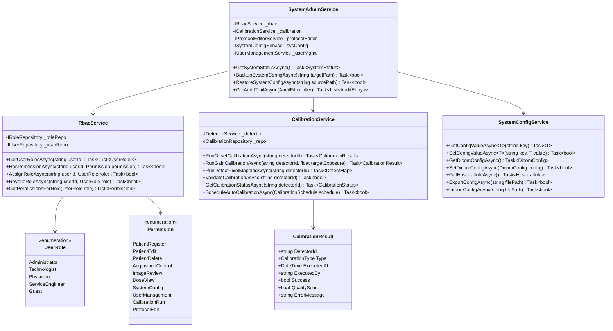
```mermaid
classDiagram
    class SystemAdminService {
        -IRbacService _rbac
        -ICalibrationService _calibration
        -IProtocolEditorService _protocolEditor
        -ISystemConfigService _sysConfig
        -IUserManagementService _userMgmt
        +GetSystemStatusAsync() Task~SystemStatus~
        +BackupSystemConfigAsync(string targetPath) Task~bool~
        +RestoreSystemConfigAsync(string sourcePath) Task~bool~
        +GetAuditTrailAsync(AuditFilter filter) Task~List~AuditEntry~~
    }

    class RbacService {
        -IRoleRepository _roleRepo
        -IUserRepository _userRepo
        +GetUserRolesAsync(string userId) Task~List~UserRole~~
        +HasPermissionAsync(string userId, Permission permission) Task~bool~
        +AssignRoleAsync(string userId, UserRole role) Task~bool~
        +RevokeRoleAsync(string userId, UserRole role) Task~bool~
        +GetPermissionsForRole(UserRole role) List~Permission~
    }

    class UserRole {
        <<enumeration>>
        Administrator
        Technologist
        Physician
        ServiceEngineer
        Guest
    }

    class Permission {
        <<enumeration>>
        PatientRegister
        PatientEdit
        PatientDelete
        AcquisitionControl
        ImageReview
        DoseView
        SystemConfig
        UserManagement
        CalibrationRun
        ProtocolEdit
    }

    class CalibrationService {
        -IDetectorService _detector
        -ICalibrationRepository _repo
        +RunOffsetCalibrationAsync(string detectorId) Task~CalibrationResult~
        +RunGainCalibrationAsync(string detectorId, float targetExposure) Task~CalibrationResult~
        +RunDefectPixelMappingAsync(string detectorId) Task~DefectMap~
        +ValidateCalibrationAsync(string detectorId) Task~bool~
        +GetCalibrationStatusAsync(string detectorId) Task~CalibrationStatus~
        +ScheduleAutoCalibrationAsync(CalibrationSchedule schedule) Task~bool~
    }

    class CalibrationResult {
        +string DetectorId
        +CalibrationType Type
        +DateTime ExecutedAt
        +string ExecutedBy
        +bool Success
        +float QualityScore
        +string ErrorMessage
    }

    class SystemConfigService {
        +GetConfigValueAsync~T~(string key) Task~T~
        +SetConfigValueAsync~T~(string key, T value) Task~bool~
        +GetDicomConfigAsync() Task~DicomConfig~
        +SetDicomConfigAsync(DicomConfig config) Task~bool~
        +GetHospitalInfoAsync() Task~HospitalInfo~
        +ExportConfigAsync(string filePath) Task~bool~
        +ImportConfigAsync(string filePath) Task~bool~
    }

    SystemAdminService --> RbacService
    SystemAdminService --> CalibrationService
    SystemAdminService --> SystemConfigService
    RbacService --> UserRole
    RbacService --> Permission
    CalibrationService --> CalibrationResult
```

#### 3.6.2 RBAC 권한 매트릭스 (RBAC Permission Matrix)

| 기능 (Permission) | Administrator | Technologist | Physician | ServiceEngineer | Guest |
|------------------|:---:|:---:|:---:|:---:|:---:|
| 환자 등록 | ✓ | ✓ | — | — | — |
| 환자 수정 | ✓ | ✓ | — | — | — |
| 환자 삭제 | ✓ | — | — | — | — |
| 촬영 제어 | ✓ | ✓ | — | — | — |
| 영상 열람 | ✓ | ✓ | ✓ | — | ✓ |
| 선량 조회 | ✓ | ✓ | ✓ | — | — |
| 시스템 설정 | ✓ | — | — | ✓ | — |
| 사용자 관리 | ✓ | — | — | — | — |
| 캘리브레이션 | ✓ | — | — | ✓ | — |
| 프로토콜 편집 | ✓ | — | — | — | — |

#### 3.6.3 캘리브레이션 시퀀스 (Calibration Sequence)

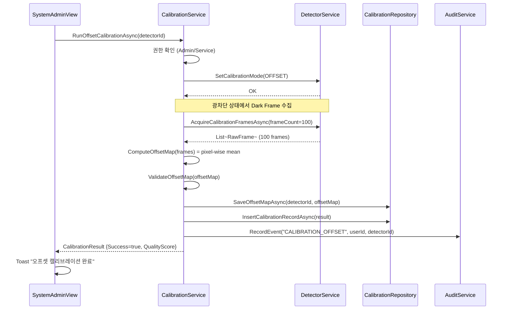
```mermaid
sequenceDiagram
    participant ADMIN as SystemAdminView
    participant CALIB as CalibrationService
    participant DET as DetectorService
    participant REPO as CalibrationRepository
    participant AUDIT as AuditService

    ADMIN->>CALIB: RunOffsetCalibrationAsync(detectorId)
    CALIB->>CALIB: 권한 확인 (Admin/Service)
    CALIB->>DET: SetCalibrationMode(OFFSET)
    DET-->>CALIB: OK
    Note over CALIB, DET: 광차단 상태에서 Dark Frame 수집
    CALIB->>DET: AcquireCalibrationFramesAsync(frameCount=100)
    DET-->>CALIB: List~RawFrame~ (100 frames)
    CALIB->>CALIB: ComputeOffsetMap(frames) = pixel-wise mean
    CALIB->>CALIB: ValidateOffsetMap(offsetMap)
    CALIB->>REPO: SaveOffsetMapAsync(detectorId, offsetMap)
    CALIB->>REPO: InsertCalibrationRecordAsync(result)
    CALIB->>AUDIT: RecordEvent("CALIBRATION_OFFSET", userId, detectorId)
    CALIB-->>ADMIN: CalibrationResult {Success=true, QualityScore}
    ADMIN->>ADMIN: Toast "오프셋 캘리브레이션 완료"
```

---

### 3.7 SDS-CS-7xx: SecurityModule 모듈

**모듈 목적**: 사용자 인증(Authentication), 세션 관리(Session Management), 데이터 암호화(AES-256), 감사 추적(Audit Trail), 소프트웨어 무결성 검증

**SAD 참조**: SAD-CS-001  
**관련 SWR**: SWR-CS-070 ~ SWR-CS-085

#### 3.7.1 클래스 다이어그램 (Class Diagram)

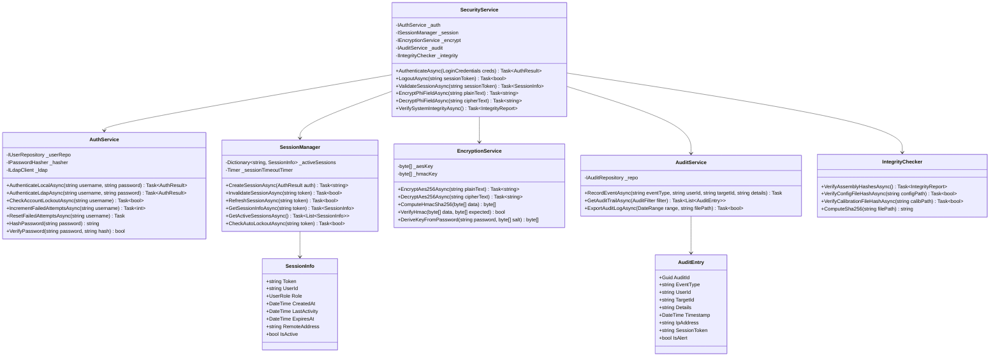
```mermaid
classDiagram
    class SecurityService {
        -IAuthService _auth
        -ISessionManager _session
        -IEncryptionService _encrypt
        -IAuditService _audit
        -IIntegrityChecker _integrity
        +AuthenticateAsync(LoginCredentials creds) Task~AuthResult~
        +LogoutAsync(string sessionToken) Task~bool~
        +ValidateSessionAsync(string sessionToken) Task~SessionInfo~
        +EncryptPhiFieldAsync(string plainText) Task~string~
        +DecryptPhiFieldAsync(string cipherText) Task~string~
        +VerifySystemIntegrityAsync() Task~IntegrityReport~
    }

    class AuthService {
        -IUserRepository _userRepo
        -IPasswordHasher _hasher
        -ILdapClient _ldap
        +AuthenticateLocalAsync(string username, string password) Task~AuthResult~
        +AuthenticateLdapAsync(string username, string password) Task~AuthResult~
        +CheckAccountLockoutAsync(string username) Task~bool~
        +IncrementFailedAttemptsAsync(string username) Task~int~
        +ResetFailedAttemptsAsync(string username) Task
        +HashPassword(string password) string
        +VerifyPassword(string password, string hash) bool
    }

    class SessionManager {
        -Dictionary~string, SessionInfo~ _activeSessions
        -Timer _sessionTimeoutTimer
        +CreateSessionAsync(AuthResult auth) Task~string~
        +InvalidateSessionAsync(string token) Task~bool~
        +RefreshSessionAsync(string token) Task~bool~
        +GetSessionInfoAsync(string token) Task~SessionInfo~
        +GetActiveSessionsAsync() Task~List~SessionInfo~~
        +CheckAutoLockoutAsync(string token) Task~bool~
    }

    class SessionInfo {
        +string Token
        +string UserId
        +UserRole Role
        +DateTime CreatedAt
        +DateTime LastActivity
        +DateTime ExpiresAt
        +string RemoteAddress
        +bool IsActive
    }

    class EncryptionService {
        -byte[] _aesKey
        -byte[] _hmacKey
        +EncryptAes256Async(string plainText) Task~string~
        +DecryptAes256Async(string cipherText) Task~string~
        +ComputeHmacSha256(byte[] data) byte[]
        +VerifyHmac(byte[] data, byte[] expected) bool
        +DeriveKeyFromPassword(string password, byte[] salt) byte[]
    }

    class AuditService {
        -IAuditRepository _repo
        +RecordEventAsync(string eventType, string userId, string targetId, string details) Task
        +GetAuditTrailAsync(AuditFilter filter) Task~List~AuditEntry~~
        +ExportAuditLogAsync(DateRange range, string filePath) Task~bool~
    }

    class AuditEntry {
        +Guid AuditId
        +string EventType
        +string UserId
        +string TargetId
        +string Details
        +DateTime Timestamp
        +string IpAddress
        +string SessionToken
        +bool IsAlert
    }

    class IntegrityChecker {
        +VerifyAssemblyHashesAsync() Task~IntegrityReport~
        +VerifyConfigFileHashAsync(string configPath) Task~bool~
        +VerifyCalibrationFileHashAsync(string calibPath) Task~bool~
        +ComputeSha256(string filePath) string
    }

    SecurityService --> AuthService
    SecurityService --> SessionManager
    SecurityService --> EncryptionService
    SecurityService --> AuditService
    SecurityService --> IntegrityChecker
    SessionManager --> SessionInfo
    AuditService --> AuditEntry
```

#### 3.7.2 인증 흐름 시퀀스 (Authentication Flow Sequence)

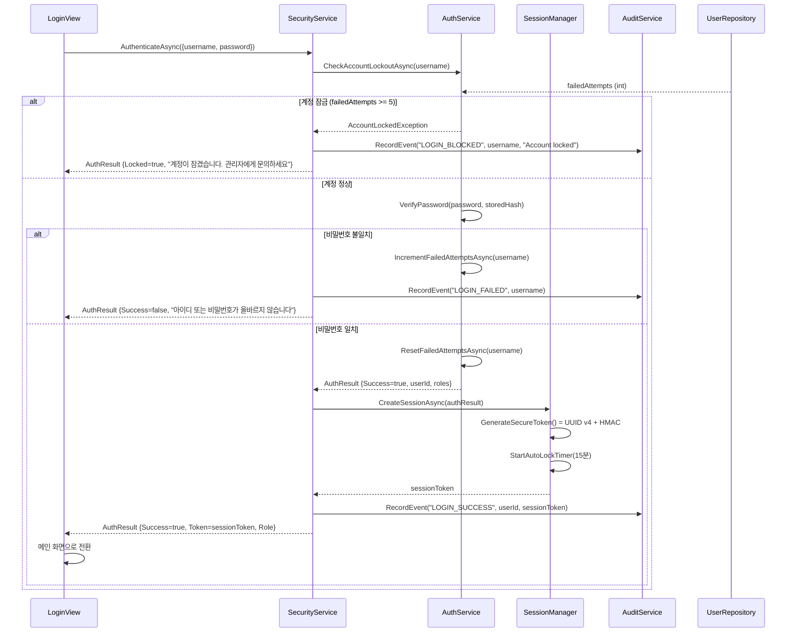
```mermaid
sequenceDiagram
    participant UI as LoginView
    participant SEC as SecurityService
    participant AUTH as AuthService
    participant SESS as SessionManager
    participant AUDIT as AuditService
    participant DB as UserRepository

    UI->>SEC: AuthenticateAsync({username, password})
    SEC->>AUTH: CheckAccountLockoutAsync(username)
    DB-->>AUTH: failedAttempts (int)
    
    alt 계정 잠금 (failedAttempts >= 5)
        AUTH-->>SEC: AccountLockedException
        SEC->>AUDIT: RecordEvent("LOGIN_BLOCKED", username, "Account locked")
        SEC-->>UI: AuthResult {Locked=true, "계정이 잠겼습니다. 관리자에게 문의하세요"}
    else 계정 정상
        AUTH->>AUTH: VerifyPassword(password, storedHash)
        
        alt 비밀번호 불일치
            AUTH->>AUTH: IncrementFailedAttemptsAsync(username)
            SEC->>AUDIT: RecordEvent("LOGIN_FAILED", username)
            SEC-->>UI: AuthResult {Success=false, "아이디 또는 비밀번호가 올바르지 않습니다"}
        else 비밀번호 일치
            AUTH->>AUTH: ResetFailedAttemptsAsync(username)
            AUTH-->>SEC: AuthResult {Success=true, userId, roles}
            SEC->>SESS: CreateSessionAsync(authResult)
            SESS->>SESS: GenerateSecureToken() = UUID v4 + HMAC
            SESS->>SESS: StartAutoLockTimer(15분)
            SESS-->>SEC: sessionToken
            SEC->>AUDIT: RecordEvent("LOGIN_SUCCESS", userId, sessionToken)
            SEC-->>UI: AuthResult {Success=true, Token=sessionToken, Role}
            UI->>UI: 메인 화면으로 전환
        end
    end
```

#### 3.7.3 세션 관리 및 자동 잠금 (Session Management & Auto-Lock)

| 설정 | 기본값 | 범위 | 관련 SWR |
|------|-------|------|---------|
| 세션 타임아웃 (Session Timeout) | 15분 | 5분 ~ 60분 | SWR-CS-072 |
| 최대 로그인 실패 횟수 (Max Failed Login) | 5회 | 3 ~ 10회 | SWR-CS-071 |
| 계정 잠금 기간 (Lockout Duration) | 30분 | 10분 ~ 永久 | SWR-CS-071 |
| 비밀번호 최소 길이 | 8자 | 8 ~ 32자 | SWR-CS-073 |
| 비밀번호 만료 주기 | 90일 | 30일 ~ 365일 | SWR-CS-073 |
| 동시 세션 최대 수 | 1 | 1 ~ 5 | SWR-CS-072 |

#### 3.7.4 암호화 사양 (Encryption Specification)

| 대상 데이터 | 알고리즘 | 키 크기 | 모드 | 관련 SWR |
|------------|---------|---------|------|---------|
| PHI 필드 (환자명, 생년월일, 의사명) | AES-256 | 256-bit | CBC + PKCS7 Padding | SWR-CS-080 |
| 전체 DB 파일 | SQLCipher (AES-256) | 256-bit | — | SWR-CS-080 |
| 비밀번호 저장 | bcrypt | — | Cost Factor=12 | SWR-CS-073 |
| DICOM 네트워크 전송 | TLS 1.2/1.3 | — | AES-256-GCM | SWR-CS-081 |
| 감사 로그 무결성 | HMAC-SHA256 | 256-bit | — | SWR-CS-082 |
| 소프트웨어 무결성 | SHA-256 | — | Assembly Hash | SWR-CS-083 |

---

### 3.8 SDS-UI-8xx: UIFramework 모듈

**모듈 목적**: WPF 기반 화면 구성, 네비게이션 관리, 터치 인터랙션, MVVM 패턴 구현, 접근성 지원

**SAD 참조**: SAD-UI-001  
**관련 SWR**: SWR-NF-UX-020 ~ SWR-NF-UX-030

#### 3.8.1 클래스 다이어그램 (Class Diagram)

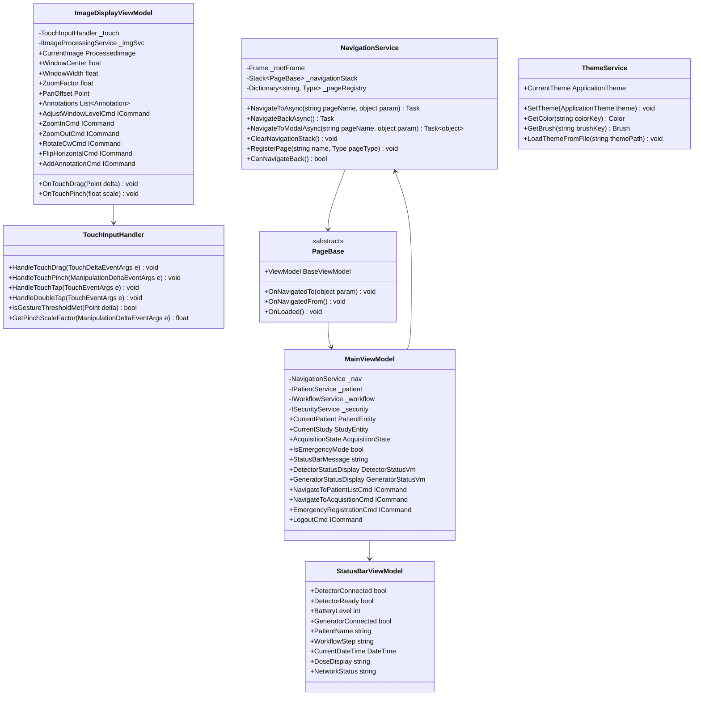
```mermaid
classDiagram
    class NavigationService {
        -Frame _rootFrame
        -Stack~PageBase~ _navigationStack
        -Dictionary~string, Type~ _pageRegistry
        +NavigateToAsync(string pageName, object param) Task
        +NavigateBackAsync() Task
        +NavigateToModalAsync(string pageName, object param) Task~object~
        +ClearNavigationStack() void
        +RegisterPage(string name, Type pageType) void
        +CanNavigateBack() bool
    }

    class MainViewModel {
        -NavigationService _nav
        -IPatientService _patient
        -IWorkflowService _workflow
        -ISecurityService _security
        +CurrentPatient PatientEntity
        +CurrentStudy StudyEntity
        +AcquisitionState AcquisitionState
        +IsEmergencyMode bool
        +StatusBarMessage string
        +DetectorStatusDisplay DetectorStatusVm
        +GeneratorStatusDisplay GeneratorStatusVm
        +NavigateToPatientListCmd ICommand
        +NavigateToAcquisitionCmd ICommand
        +EmergencyRegistrationCmd ICommand
        +LogoutCmd ICommand
    }

    class TouchInputHandler {
        +HandleTouchDrag(TouchDeltaEventArgs e) void
        +HandleTouchPinch(ManipulationDeltaEventArgs e) void
        +HandleTouchTap(TouchEventArgs e) void
        +HandleDoubleTap(TouchEventArgs e) void
        +IsGestureThresholdMet(Point delta) bool
        +GetPinchScaleFactor(ManipulationDeltaEventArgs e) float
    }

    class ImageDisplayViewModel {
        -TouchInputHandler _touch
        -IImageProcessingService _imgSvc
        +CurrentImage ProcessedImage
        +WindowCenter float
        +WindowWidth float
        +ZoomFactor float
        +PanOffset Point
        +Annotations List~Annotation~
        +AdjustWindowLevelCmd ICommand
        +ZoomInCmd ICommand
        +ZoomOutCmd ICommand
        +RotateCwCmd ICommand
        +FlipHorizontalCmd ICommand
        +AddAnnotationCmd ICommand
        +OnTouchDrag(Point delta) void
        +OnTouchPinch(float scale) void
    }

    class StatusBarViewModel {
        +DetectorConnected bool
        +DetectorReady bool
        +BatteryLevel int
        +GeneratorConnected bool
        +PatientName string
        +WorkflowStep string
        +CurrentDateTime DateTime
        +DoseDisplay string
        +NetworkStatus string
    }

    class PageBase {
        <<abstract>>
        +ViewModel BaseViewModel
        +OnNavigatedTo(object param) void
        +OnNavigatedFrom() void
        +OnLoaded() void
    }

    class ThemeService {
        +CurrentTheme ApplicationTheme
        +SetTheme(ApplicationTheme theme) void
        +GetColor(string colorKey) Color
        +GetBrush(string brushKey) Brush
        +LoadThemeFromFile(string themePath) void
    }

    NavigationService --> PageBase
    MainViewModel --> NavigationService
    MainViewModel --> StatusBarViewModel
    ImageDisplayViewModel --> TouchInputHandler
    PageBase --> MainViewModel
```

#### 3.8.2 주요 화면 레이아웃 설명 (Screen Layout Descriptions)

| 화면 | 레이아웃 구조 | 주요 컴포넌트 | 관련 SWR |
|------|-------------|------------|---------|
| **메인 화면** | 3분할: 좌(환자/워크리스트) + 중(영상 뷰어) + 우(촬영 제어) | 환자 패널, 영상 뷰어, 파라미터 패널, 상태바 | SWR-NF-UX-020 |
| **환자 등록** | 모달 다이얼로그 (800×600px) | 입력 필드 그리드, 저장/취소 버튼 | SWR-PM-001 |
| **촬영 제어 패널** | 우측 사이드바 (280px 고정 폭) | kVp/mAs 스피너, AEC 선택, 촬영 버튼(120×60px) | SWR-WF-015 |
| **영상 뷰어** | 최대화 가능한 중앙 영역 | 1/2/4분할 레이아웃, 도구 팔레트, 섬네일 스트립 | SWR-IP-030 |
| **선량 표시** | 하단 상태바 내 인라인 표시 | DAP 누적치, DRL 비교 인디케이터 | SWR-DM-040 |
| **시스템 설정** | 전체 화면 탭 기반 | DICOM 설정, 사용자 관리, 캘리브레이션 탭 | SWR-SA-060 |
| **응급 등록** | 오버레이 모달 (전체 화면) | 최소 입력 필드, 큰 촬영 시작 버튼 | SWR-PM-030 |

---

### 3.9 SDS-DB-9xx: DataPersistence 모듈

**모듈 목적**: DAO(Data Access Object) 패턴 구현, Entity Framework Core ORM, ACID 트랜잭션 관리, 데이터 마이그레이션, 암호화 DB 관리

**SAD 참조**: SAD-DB-001  
**관련 SWR**: SWR-NF-RL-010 ~ SWR-NF-RL-015, SWR-CS-080

#### 3.9.1 클래스 다이어그램 (Class Diagram)

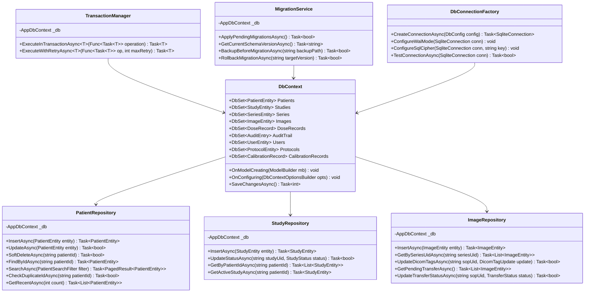
```mermaid
classDiagram
    class DbContext {
        +DbSet~PatientEntity~ Patients
        +DbSet~StudyEntity~ Studies
        +DbSet~SeriesEntity~ Series
        +DbSet~ImageEntity~ Images
        +DbSet~DoseRecord~ DoseRecords
        +DbSet~AuditEntry~ AuditTrail
        +DbSet~UserEntity~ Users
        +DbSet~ProtocolEntity~ Protocols
        +DbSet~CalibrationRecord~ CalibrationRecords
        +OnModelCreating(ModelBuilder mb) void
        +OnConfiguring(DbContextOptionsBuilder opts) void
        +SaveChangesAsync() Task~int~
    }

    class PatientRepository {
        -AppDbContext _db
        +InsertAsync(PatientEntity entity) Task~PatientEntity~
        +UpdateAsync(PatientEntity entity) Task~bool~
        +SoftDeleteAsync(string patientId) Task~bool~
        +FindByIdAsync(string patientId) Task~PatientEntity~
        +SearchAsync(PatientSearchFilter filter) Task~PagedResult~PatientEntity~~
        +CheckDuplicateIdAsync(string patientId) Task~bool~
        +GetRecentAsync(int count) Task~List~PatientEntity~~
    }

    class StudyRepository {
        -AppDbContext _db
        +InsertAsync(StudyEntity entity) Task~StudyEntity~
        +UpdateStatusAsync(string studyUid, StudyStatus status) Task~bool~
        +GetByPatientIdAsync(string patientId) Task~List~StudyEntity~~
        +GetActiveStudyAsync(string patientId) Task~StudyEntity~
    }

    class ImageRepository {
        -AppDbContext _db
        +InsertAsync(ImageEntity entity) Task~ImageEntity~
        +GetBySeriesUidAsync(string seriesUid) Task~List~ImageEntity~~
        +UpdateDicomTagsAsync(string sopUid, DicomTagUpdate update) Task~bool~
        +GetPendingTransferAsync() Task~List~ImageEntity~~
        +UpdateTransferStatusAsync(string sopUid, TransferStatus status) Task~bool~
    }

    class TransactionManager {
        -AppDbContext _db
        +ExecuteInTransactionAsync~T~(Func~Task~T~~ operation) Task~T~
        +ExecuteWithRetryAsync~T~(Func~Task~T~~ op, int maxRetry) Task~T~
    }

    class MigrationService {
        -AppDbContext _db
        +ApplyPendingMigrationsAsync() Task~bool~
        +GetCurrentSchemaVersionAsync() Task~string~
        +BackupBeforeMigrationAsync(string backupPath) Task~bool~
        +RollbackMigrationAsync(string targetVersion) Task~bool~
    }

    class DbConnectionFactory {
        +CreateConnectionAsync(DbConfig config) Task~SqliteConnection~
        +ConfigureWalMode(SqliteConnection conn) void
        +ConfigureSqlCipher(SqliteConnection conn, string key) void
        +TestConnectionAsync(SqliteConnection conn) Task~bool~
    }

    DbContext --> PatientRepository
    DbContext --> StudyRepository
    DbContext --> ImageRepository
    TransactionManager --> DbContext
    MigrationService --> DbContext
    DbConnectionFactory --> DbContext
```

#### 3.9.2 트랜잭션 관리 패턴 (Transaction Management Pattern)

```csharp
// TransactionManager.ExecuteInTransactionAsync<T> 구현 패턴
public async Task<T> ExecuteInTransactionAsync<T>(Func<Task<T>> operation)
{
    using var transaction = await _db.Database.BeginTransactionAsync(
        IsolationLevel.ReadCommitted);
    try
    {
        var result = await operation();
        await transaction.CommitAsync();
        return result;
    }
    catch (DbUpdateConcurrencyException ex)
    {
        await transaction.RollbackAsync();
        _logger.LogError(ex, "Concurrency conflict — transaction rolled back");
        throw new ConcurrencyException("데이터 동시성 충돌이 발생했습니다.", ex);
    }
    catch (SqliteException ex)
    {
        await transaction.RollbackAsync();
        _logger.LogError(ex, "SQLite error — transaction rolled back");
        throw new DbTransactionException("데이터베이스 오류가 발생했습니다.", ex);
    }
}
```

#### 3.9.3 데이터베이스 설정 (DB Configuration)

| 항목 | 설정값 | 근거 |
|------|-------|------|
| DB 엔진 | SQLite 3.43+ | 임베디드, ACID, 의료기기 적합 |
| WAL 모드 | PRAGMA journal_mode=WAL | 전원 차단 보호 (SWR-NF-RL-012) |
| 페이지 크기 | PRAGMA page_size=4096 | I/O 효율 최적화 |
| 캐시 크기 | PRAGMA cache_size=-64000 | 64MB 메모리 캐시 |
| 동기화 모드 | PRAGMA synchronous=NORMAL | WAL + NORMAL = 안전+성능 균형 |
| 암호화 | SQLCipher AES-256 | PHI 보호 (SWR-CS-080) |
| 연결 문자열 경로 | %ProgramData%\RadiConsole\Data\radidb.db | 고정 경로 |

---

## 4. 데이터 구조 상세 (Data Structure Specification)

### 4.1 DICOM 객체 모델 (DICOM Object Model)

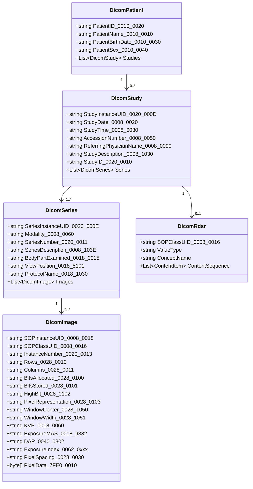
```mermaid
classDiagram
    class DicomPatient {
        +string PatientID_0010_0020
        +string PatientName_0010_0010
        +string PatientBirthDate_0010_0030
        +string PatientSex_0010_0040
        +List~DicomStudy~ Studies
    }

    class DicomStudy {
        +string StudyInstanceUID_0020_000D
        +string StudyDate_0008_0020
        +string StudyTime_0008_0030
        +string AccessionNumber_0008_0050
        +string ReferringPhysicianName_0008_0090
        +string StudyDescription_0008_1030
        +string StudyID_0020_0010
        +List~DicomSeries~ Series
    }

    class DicomSeries {
        +string SeriesInstanceUID_0020_000E
        +string Modality_0008_0060
        +string SeriesNumber_0020_0011
        +string SeriesDescription_0008_103E
        +string BodyPartExamined_0018_0015
        +string ViewPosition_0018_5101
        +string ProtocolName_0018_1030
        +List~DicomImage~ Images
    }

    class DicomImage {
        +string SOPInstanceUID_0008_0018
        +string SOPClassUID_0008_0016
        +string InstanceNumber_0020_0013
        +string Rows_0028_0010
        +string Columns_0028_0011
        +string BitsAllocated_0028_0100
        +string BitsStored_0028_0101
        +string HighBit_0028_0102
        +string PixelRepresentation_0028_0103
        +string WindowCenter_0028_1050
        +string WindowWidth_0028_1051
        +string KVP_0018_0060
        +string ExposureMAS_0018_9332
        +string DAP_0040_0302
        +string ExposureIndex_0062_0xxx
        +string PixelSpacing_0028_0030
        +byte[] PixelData_7FE0_0010
    }

    class DicomRdsr {
        +string SOPClassUID_0008_0016
        +string ValueType
        +string ConceptName
        +List~ContentItem~ ContentSequence
    }

    DicomPatient "1" --> "0..*" DicomStudy
    DicomStudy "1" --> "1..*" DicomSeries
    DicomSeries "1" --> "1..*" DicomImage
    DicomStudy "1" --> "0..1" DicomRdsr
```

### 4.2 환자/검사/영상 데이터 구조 (Patient/Study/Image Data Structures)

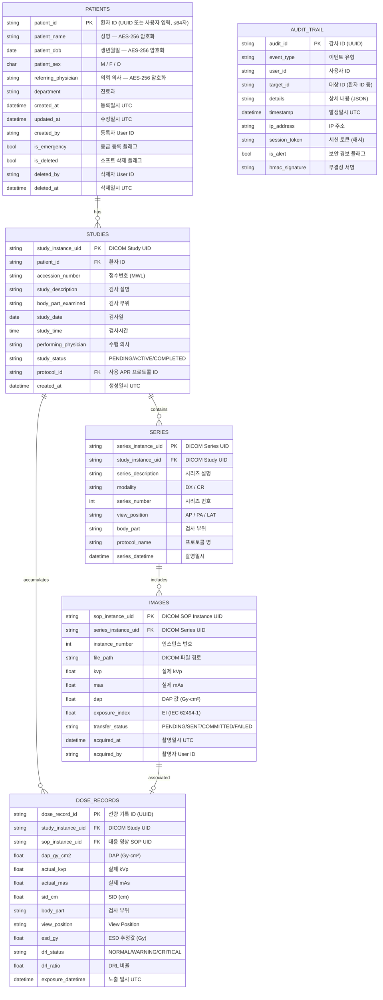
```mermaid
erDiagram
    PATIENTS {
        string patient_id PK "환자 ID (UUID 또는 사용자 입력, ≤64자)"
        string patient_name "성명 — AES-256 암호화"
        date patient_dob "생년월일 — AES-256 암호화"
        char patient_sex "M / F / O"
        string referring_physician "의뢰 의사 — AES-256 암호화"
        string department "진료과"
        datetime created_at "등록일시 UTC"
        datetime updated_at "수정일시 UTC"
        string created_by "등록자 User ID"
        bool is_emergency "응급 등록 플래그"
        bool is_deleted "소프트 삭제 플래그"
        string deleted_by "삭제자 User ID"
        datetime deleted_at "삭제일시 UTC"
    }

    STUDIES {
        string study_instance_uid PK "DICOM Study UID"
        string patient_id FK "환자 ID"
        string accession_number "접수번호 (MWL)"
        string study_description "검사 설명"
        string body_part_examined "검사 부위"
        date study_date "검사일"
        time study_time "검사시간"
        string performing_physician "수행 의사"
        string study_status "PENDING/ACTIVE/COMPLETED"
        string protocol_id FK "사용 APR 프로토콜 ID"
        datetime created_at "생성일시 UTC"
    }

    SERIES {
        string series_instance_uid PK "DICOM Series UID"
        string study_instance_uid FK "DICOM Study UID"
        string series_description "시리즈 설명"
        string modality "DX / CR"
        int series_number "시리즈 번호"
        string view_position "AP / PA / LAT"
        string body_part "검사 부위"
        string protocol_name "프로토콜 명"
        datetime series_datetime "촬영일시"
    }

    IMAGES {
        string sop_instance_uid PK "DICOM SOP Instance UID"
        string series_instance_uid FK "DICOM Series UID"
        int instance_number "인스턴스 번호"
        string file_path "DICOM 파일 경로"
        float kvp "실제 kVp"
        float mas "실제 mAs"
        float dap "DAP 값 (Gy·cm²)"
        float exposure_index "EI (IEC 62494-1)"
        string transfer_status "PENDING/SENT/COMMITTED/FAILED"
        datetime acquired_at "촬영일시 UTC"
        string acquired_by "촬영자 User ID"
    }

    DOSE_RECORDS {
        string dose_record_id PK "선량 기록 ID (UUID)"
        string study_instance_uid FK "DICOM Study UID"
        string sop_instance_uid FK "대응 영상 SOP UID"
        float dap_gy_cm2 "DAP (Gy·cm²)"
        float actual_kvp "실제 kVp"
        float actual_mas "실제 mAs"
        float sid_cm "SID (cm)"
        string body_part "검사 부위"
        string view_position "View Position"
        float esd_gy "ESD 추정값 (Gy)"
        string drl_status "NORMAL/WARNING/CRITICAL"
        float drl_ratio "DRL 비율"
        datetime exposure_datetime "노출 일시 UTC"
    }

    AUDIT_TRAIL {
        string audit_id PK "감사 ID (UUID)"
        string event_type "이벤트 유형"
        string user_id "사용자 ID"
        string target_id "대상 ID (환자 ID 등)"
        string details "상세 내용 (JSON)"
        datetime timestamp "발생일시 UTC"
        string ip_address "IP 주소"
        string session_token "세션 토큰 (해시)"
        bool is_alert "보안 경보 플래그"
        string hmac_signature "무결성 서명"
    }

    PATIENTS ||--o{ STUDIES : "has"
    STUDIES ||--o{ SERIES : "contains"
    SERIES ||--o{ IMAGES : "includes"
    STUDIES ||--o{ DOSE_RECORDS : "accumulates"
    IMAGES ||--o| DOSE_RECORDS : "associated"
```

### 4.3 설정 데이터 구조 (Configuration Data Structure)

```csharp
// SystemConfiguration — 시스템 설정 루트 구조체
public class SystemConfiguration
{
    public HospitalInfo Hospital { get; set; }
    public DicomConfig Dicom { get; set; }
    public NetworkConfig Network { get; set; }
    public SecurityConfig Security { get; set; }
    public AcquisitionConfig Acquisition { get; set; }
    public DoseConfig Dose { get; set; }
    public UiConfig Ui { get; set; }
    public LogConfig Logging { get; set; }
}

public class DicomConfig
{
    public string LocalAeTitle { get; set; }       // 로컬 AE Title (≤16자)
    public int LocalPort { get; set; }              // 기본 104
    public bool TlsEnabled { get; set; }
    public string TlsCertPath { get; set; }
    public List<RemoteNodeConfig> RemoteNodes { get; set; }
    public int ConnectionTimeoutMs { get; set; }    // 기본 10000
    public int MaxRetryCount { get; set; }          // 기본 3
}

public class SecurityConfig
{
    public int SessionTimeoutMinutes { get; set; }  // 기본 15
    public int MaxFailedLoginAttempts { get; set; } // 기본 5
    public int AccountLockoutMinutes { get; set; }  // 기본 30
    public int PasswordExpiryDays { get; set; }     // 기본 90
    public int MinPasswordLength { get; set; }      // 기본 8
    public bool RequireUppercase { get; set; }      // 기본 true
    public bool RequireDigit { get; set; }          // 기본 true
    public bool RequireSpecialChar { get; set; }    // 기본 false
    public AuthMode AuthenticationMode { get; set; } // LOCAL / LDAP / HYBRID
    public LdapConfig? LdapSettings { get; set; }
}
```

---

## 5. 알고리즘 상세 (Algorithm Specification)

### 5.1 영상 전처리 — Offset/Gain Correction

#### 5.1.1 알고리즘 설명 (Algorithm Description)

FPD(Flat Panel Detector)에서 취득한 Raw 영상은 픽셀별 암전류(Dark Current)와 감도 불균일(Gain Non-uniformity)로 인한 아티팩트를 포함한다. Offset/Gain Correction을 통해 보정된 영상을 생성한다.

#### 5.1.2 알고리즘 수식 및 절차

**Step 1: Offset Correction (다크 프레임 교정)**

```
I_offset_corrected[i] = I_raw[i] - D[i]

where:
  I_raw[i]              = 픽셀 i의 Raw 픽셀 값 (16-bit unsigned, 0~65535)
  D[i]                  = 픽셀 i의 Dark Frame 평균값 (≥100프레임 평균)
  I_offset_corrected[i] = Offset 교정 후 픽셀 값
```

**Step 2: Gain Correction (플랫 필드 교정)**

```
I_gain_corrected[i] = I_offset_corrected[i] / G_norm[i]

where:
  G_norm[i] = G_flat[i] / mean(G_flat)
  G_flat[i] = 균일 방사선 노출 후 Flat-Field 이미지 픽셀 i 값 (픽셀별 감도 맵)
  mean(G_flat) = 전체 픽셀 감도 평균값

  → G_norm[i] = 1.0이면 이상적인 픽셀 (감도 보정 없음)
  → G_norm[i] < 1.0이면 과민 픽셀 (값 감소)
  → G_norm[i] > 1.0이면 둔감 픽셀 (값 증가)
```

**Step 3: Defect Pixel Correction (결함 픽셀 교정)**

```
결함 픽셀 목록(P_defect)의 각 픽셀 p에 대해:
  I_corrected[p] = Median(I_gain_corrected[neighbors(p, radius=2)])

where:
  neighbors(p, r) = p를 중심으로 반경 r 내의 비결함 픽셀 집합
```

**Step 4: 클리핑 (Clipping)**

```
I_final[i] = clamp(I_gain_corrected[i], 0, 65535)
```

#### 5.1.3 성능 목표

| 항목 | 목표 |
|------|------|
| 처리 시간 (3072×3072 픽셀) | ≤ 200ms (병렬 SIMD 처리) |
| 메모리 사용 | ≤ 150MB (원본 + 보정 버퍼) |
| 처리 스레드 | `Parallel.For` + SIMD (AVX2) 활용 |

---

### 5.2 Window/Level 자동 조정 알고리즘

#### 5.2.1 히스토그램 기반 자동 WL (Auto Window/Level by Histogram)

```
알고리즘: 히스토그램 백분위수(Percentile) 기반 자동 WL 계산

Input:  ushort[] pixels (16-bit 보정 영상), float lowPercentile=0.5, float highPercentile=99.5
Output: (float WindowCenter, float WindowWidth)

Step 1: 히스토그램 계산
  int[] hist = new int[65536]  ← 65536 bins
  for each pixel p:
      hist[p]++

Step 2: 누적 히스토그램 (CDF)
  cdf[0] = hist[0]
  for i in 1..65535:
      cdf[i] = cdf[i-1] + hist[i]
  totalPixels = pixels.Length

Step 3: 백분위수 픽셀값 추출
  lowThreshold  = pixels 값에서 lowPercentile%에 해당하는 값
  highThreshold = pixels 값에서 highPercentile%에 해당하는 값

  → lowThreshold:  cdf[v] >= totalPixels * (lowPercentile/100)인 최소 v
  → highThreshold: cdf[v] >= totalPixels * (highPercentile/100)인 최소 v

Step 4: WC/WW 계산
  WindowWidth  = highThreshold - lowThreshold
  WindowCenter = lowThreshold + WindowWidth / 2.0

Step 5: 유효성 검사
  if WindowWidth < 1: WindowWidth = 1
  if WindowWidth > 65535: WindowWidth = 65535
```

#### 5.2.2 Window/Level 적용 (Pixel Mapping)

```
영상 표시를 위한 16-bit → 8-bit 변환:

I_display[i] = clamp(
    floor((I_corrected[i] - (WC - WW/2)) / WW * 255.0),
    0, 255
)

where:
  WC = Window Center
  WW = Window Width
  I_corrected[i] = 16-bit 보정 픽셀값
  I_display[i]   = 8-bit 표시 픽셀값 (0=검정, 255=흰색)
```

---

### 5.3 Image Stitching 알고리즘

#### 5.3.1 알고리즘 개요 (Algorithm Overview)

긴 척추(Long Spine), 하지 전장(Whole Leg) 등 단일 FPD 시야 내에 들어오지 않는 해부학적 부위의 다중 촬영 영상을 이어붙이는 알고리즘.

```mermaid
flowchart TD
    A["입력: 다중 보정 영상 목록\n(List~CorrectedImage~)"] --> B["특징점 검출\n(SIFT/ORB Feature Detection)"]
    B --> C["특징점 매칭\n(Brute-Force + Lowe's Ratio Test)"]
    C --> D{"매칭점 수 ≥ 10?"}
    D -->|No| E["스티칭 실패\n→ 개별 영상 유지\n+ 수동 정렬 모드"]
    D -->|Yes| F["호모그래피 행렬 계산\n(RANSAC 알고리즘)"]
    F --> G["원근 변환 적용\n(WarpPerspective)"]
    G --> H["블렌딩 (Feather Blending)\n겹침 영역 가중 평균"]
    H --> I["출력: StitchedImage\n(단일 보정 영상)"]
    I --> J["DICOM 파일 생성\n(픽셀 간격 재계산)"]
```

#### 5.3.2 상세 절차

**Step 1: 특징점 검출 (Feature Detection)**
- 알고리즘: ORB (Oriented FAST and Rotated BRIEF), 최대 2000 특징점/영상
- 스케일 공간: 피라미드 레벨 = 8, 스케일 인자 = 1.2

**Step 2: 특징점 매칭 (Feature Matching)**
```
Lowe's Ratio Test:
  matches = []
  for each descriptor d1 in img1:
      knn_matches = BruteForce_KNN(d1, descriptors_img2, k=2)
      if knn_matches[0].distance < 0.75 * knn_matches[1].distance:
          matches.append(knn_matches[0])
```

**Step 3: 호모그래피 계산 (Homography Estimation)**
```
H = FindHomography(srcPoints, dstPoints, method=RANSAC, 
                   ransacReprojThreshold=5.0)

→ RANSAC 반복: 최대 2000 iterations
→ 인라이어(Inlier) 최소 비율: 60%
→ 실패 시 StitchingFailedException 발생
```

**Step 4: 블렌딩 (Feather Blending)**
```
겹침 영역 폭(overlapWidth)에서 선형 가중 블렌딩:
  alpha = x / overlapWidth   (x: 겹침 영역 내 위치, 0~overlapWidth)
  I_blended[x] = (1 - alpha) * I_left[x] + alpha * I_right[x]
```

**Step 5: 픽셀 간격 보정 (Pixel Spacing Recalculation)**
```
stitched_pixel_spacing = original_pixel_spacing
  (스티칭 후 절대 물리 크기 변화 없음 — 단순 이어붙이기)
DICOM (0028,0030) PixelSpacing 태그는 원본값 유지
```

---

### 5.4 AEC 파라미터 계산 알고리즘

#### 5.4.1 AEC 모드별 처리 (AEC Mode Processing)

```
AEC (Automatic Exposure Control) 챔버 선택에 따른 Generator 제어:

AEC_NONE (Manual):
    Generator 파라미터: 사용자 입력 mAs 그대로 사용

AEC_LEFT / CENTER / RIGHT:
    Generator에 챔버 선택 코드 전송
    Generator가 내부적으로 선택된 챔버 신호로 mAs 자동 조정

AEC_ALL (모든 챔버 평균):
    Generator에 ALL 챔버 코드 전송
    Generator가 3챔버 신호 평균으로 mAs 자동 조정

노출 후 실제 mAs 값을 ExposureResult에서 수신하여 DICOM 태그에 기록
```

#### 5.4.2 Exposure Index (EI) 계산 (IEC 62494-1:2022)

```
EI (Exposure Index) 계산:

EI = C * X_det

where:
  C     = 상수 = 100 (IEC 62494-1 정의)
  X_det = 검출기 표면에서의 공기 커마 (Air Kerma at detector, μGy)

X_det 추정:
  X_det = (I_mean_ROI / G_nominal) * (SID_ref / SID)^2

where:
  I_mean_ROI   = ROI 내 평균 픽셀 강도 (Gain 교정 후)
  G_nominal    = 검출기 정격 변환 계수 (시스템 캘리브레이션에서 획득)
  SID_ref      = 기준 SID (180cm)
  SID          = 실제 SID (설정값)

DI (Deviation Index):
  DI = 10 * log10(EI / EI_target)

  → DI = 0: 목표 노출과 일치
  → DI > +3: 과피폭 경고
  → DI < -3: 저피폭 경고
```

---

## 6. UI 상세 설계 (UI Detailed Design)

### 6.1 화면 전환 플로우 (Screen Navigation Flow)

```mermaid
flowchart TD
    SPLASH["스플래시 화면\n(Splash Screen)\n시스템 무결성 검사"]
    LOGIN["로그인 화면\n(Login View)\nSDS-CS-701"]
    MAIN["메인 화면\n(Main View)\nSDS-UI-801"]
    PT_LIST["환자 목록\n(Patient List)\nSDS-UI-810"]
    PT_REG["환자 등록\n(Patient Registration)\nSDS-UI-811"]
    PT_DETAIL["환자 상세\n(Patient Detail)\nSDS-UI-812"]
    WL_LIST["워크리스트\n(Worklist)\nSDS-UI-815"]
    PROTO["프로토콜 선택\n(Protocol Selection)\nSDS-UI-820"]
    ACQ["촬영 화면\n(Acquisition)\nSDS-UI-825"]
    IMG_VIEW["영상 뷰어\n(Image Viewer)\nSDS-UI-830"]
    DOSE_RPT["선량 보고서\n(Dose Report)\nSDS-UI-840"]
    SETTINGS["시스템 설정\n(Settings)\nSDS-UI-850"]
    EMRG["응급 등록\n(Emergency)\nSDS-UI-860"]

    SPLASH -->|"무결성 OK"| LOGIN
    SPLASH -->|"무결성 실패"| SPLASH

    LOGIN -->|"로그인 성공"| MAIN
    MAIN --> PT_LIST
    MAIN --> WL_LIST
    MAIN -->|"2터치 이하\n(SWR-PM-030)"| EMRG
    MAIN --> SETTINGS

    PT_LIST -->|"신규 환자"| PT_REG
    PT_LIST -->|"환자 선택"| PT_DETAIL
    WL_LIST -->|"항목 더블클릭"| PROTO
    PT_DETAIL -->|"검사 시작"| PROTO
    PT_REG -->|"등록 완료"| PROTO
    EMRG -->|"응급 등록 완료"| PROTO

    PROTO -->|"프로토콜 선택"| ACQ
    ACQ -->|"촬영 완료"| IMG_VIEW
    ACQ -->|"다음 뷰"| ACQ
    IMG_VIEW -->|"모든 뷰 완료"| DOSE_RPT
    IMG_VIEW -->|"재촬영"| ACQ
    DOSE_RPT -->|"PACS 전송 완료"| MAIN

    MAIN -->|"세션 타임아웃\n(15분)"| LOGIN

    style EMRG fill:#cc0000,color:#fff
    style LOGIN fill:#1a5276,color:#fff
    style ACQ fill:#1e8449,color:#fff
```

### 6.2 주요 화면 레이아웃 상세 (Key Screen Layout Details)

#### 6.2.1 메인 화면 레이아웃 (Main Screen — 1920×1080 기준)

```
┌─────────────────────────────────────────────────────────────────────┐
│  [RadiConsole™]  [환자명: 홍길동 (M/45)]  [Status: READY]    [EMRG]  │  ← 상단 타이틀바 (64px)
├──────────────┬────────────────────────────────┬─────────────────────┤
│              │                                │                     │
│ 환자 패널    │         영상 뷰어              │   촬영 제어 패널    │
│ (360px)      │      (1,280px × 860px)         │     (280px)         │
│              │                                │                     │
│ 워크리스트   │  ┌─────────┐  ┌─────────┐     │  kVp: [80  ▲▼]     │
│ 환자 목록    │  │ View 1  │  │ View 2  │     │  mAs: [12.5▲▼]     │
│ 최근 환자    │  └─────────┘  └─────────┘     │  AEC: [L][C][R][All]│
│              │                                │  SID: [180cm]       │
│              │  도구팔레트 ─────────────────  │                     │
│              │  [W/L][Zoom][Pan][Rotate][Ann] │  [촬영 (EXPOSE)]   │
│              │                                │  (120×60px, 적색)   │
├──────────────┴────────────────────────────────┴─────────────────────┤
│ 상태바: Detector: ●READY  Generator: ●READY  DAP: 0.23 Gy·cm²  🔒  │  ← 상태바 (40px)
└─────────────────────────────────────────────────────────────────────┘
```

#### 6.2.2 터치 인터랙션 명세 (Touch Interaction Specification)

| 제스처 | 동작 | 처리 로직 | 최소 타겟 크기 | 관련 SWR |
|--------|------|---------|-------------|---------|
| 단일 탭(Tap) | 항목 선택, 버튼 클릭 | `TouchEventArgs.GetTouchPoint` | 44×44px | SWR-NF-UX-022 |
| 더블 탭(Double Tap) | 영상 1:1 확대, 항목 더블클릭 | `200ms` 이내 2회 탭 감지 | 44×44px | SWR-NF-UX-022 |
| 터치 드래그(Drag) | 영상 이동(Pan), 목록 스크롤 | `TouchDeltaEventArgs.Delta ≥ 10px` | — | SWR-NF-UX-022 |
| 핀치 줌(Pinch) | 영상 확대/축소 (0.1× ~ 10×) | `ManipulationDeltaEventArgs.Scale` | — | SWR-NF-UX-022 |
| 회전 제스처(Rotate) | 영상 회전 (2손가락 회전) | `ManipulationDeltaEventArgs.Rotation` | — | SWR-NF-UX-023 |
| 길게 누르기(Long Press) | 컨텍스트 메뉴 표시 | `500ms` 이상 유지 감지 | 44×44px | — |
| W/L 드래그 | 좌우: WW 조정, 상하: WC 조정 | 마우스/터치 이동 → `AdjustWindowLevel()` | — | SWR-IP-031 |

### 6.3 응급 등록 화면 레이아웃 (Emergency Registration Screen)

```
┌─────────────────────────────────────────────────────────────────────┐
│  ██████████████████  EMERGENCY REGISTRATION  ████████████████████  │
│                    응급 환자 빠른 등록                              │
├─────────────────────────────────────────────────────────────────────┤
│                                                                     │
│   임시 ID: [ EMG-20260318-100712-001 ]  (자동 생성)               │
│                                                                     │
│   성별 (Sex):   [남성 (M)]  [여성 (F)]  [기타 (O)]               │
│                                                                     │
│   나이 추정:   [10대] [20대] [30대] [40대] [50대] [60대이상]       │
│                                                                     │
│                                                                     │
│   ╔═══════════════════════════════════════════════════════╗        │
│   ║          촬영 시작 (START EXAMINATION)                ║        │
│   ║                   (녹색, 240×80px)                    ║        │
│   ╚═══════════════════════════════════════════════════════╝        │
│                                                                     │
│   [취소 (Cancel)]                                                   │
└─────────────────────────────────────────────────────────────────────┘
```

---

## 7. SAD→SDS 추적성 및 SDS→SWR 역추적 (Traceability Matrix)

### 7.1 SAD → SDS 추적성 (SAD to SDS Forward Traceability)

| SAD ID | SAD 아키텍처 단위 | SDS ID | SDS 상세 설계 섹션 | 상태 |
|--------|----------------|--------|-----------------|------|
| SAD-PM-001 | Patient Management Subsystem | SDS-PM-100 ~ SDS-PM-110 | §3.1 PatientManagement 모듈 | 완료 |
| SAD-WF-001 | Acquisition Workflow Subsystem | SDS-WF-200 ~ SDS-WF-220 | §3.2 WorkflowEngine 모듈 | 완료 |
| SAD-IP-001 | Image Processing Subsystem | SDS-IP-300 ~ SDS-IP-320 | §3.3 ImageProcessing 모듈 | 완료 |
| SAD-DM-001 | Dose Management Subsystem | SDS-DM-400 ~ SDS-DM-415 | §3.4 DoseManagement 모듈 | 완료 |
| SAD-DC-001 | DICOM Communication Subsystem | SDS-DC-500 ~ SDS-DC-520 | §3.5 DICOMCommunication 모듈 | 완료 |
| SAD-SA-001 | System Administration Subsystem | SDS-SA-600 ~ SDS-SA-615 | §3.6 SystemAdmin 모듈 | 완료 |
| SAD-CS-001 | Security Module | SDS-CS-700 ~ SDS-CS-720 | §3.7 SecurityModule 모듈 | 완료 |
| SAD-UI-001 | UI Framework | SDS-UI-800 ~ SDS-UI-870 | §3.8 UIFramework 모듈 | 완료 |
| SAD-DB-001 | Data Persistence Layer | SDS-DB-900 ~ SDS-DB-920 | §3.9 DataPersistence 모듈 | 완료 |

### 7.2 SDS → SWR 역추적 (SDS to SWR Backward Traceability)

| SDS ID | 설계 항목 | 대응 SWR | 관련 HAZ |
|--------|---------|---------|---------|
| SDS-PM-100 | PatientService.RegisterPatientAsync | SWR-PM-001, SWR-PM-002, SWR-PM-003, SWR-PM-004 | HAZ-DATA |
| SDS-PM-101 | PatientService.UpdatePatientAsync | SWR-PM-010, SWR-PM-011, SWR-PM-012 | HAZ-DATA, HAZ-SEC |
| SDS-PM-102 | PatientService.DeletePatientAsync | SWR-PM-050, SWR-PM-051, SWR-PM-052, SWR-PM-053 | HAZ-DATA, HAZ-SEC |
| SDS-PM-103 | PatientSearchFilter + SearchPatientsAsync | SWR-PM-040, SWR-PM-041, SWR-PM-042, SWR-PM-043 | — |
| SDS-PM-104 | EmergencyRegistrationService | SWR-PM-030, SWR-PM-031, SWR-PM-032, SWR-PM-033 | HAZ-RAD, HAZ-DATA |
| SDS-PM-105 | WorklistService.FetchWorklistAsync | SWR-PM-020, SWR-PM-021, SWR-PM-022, SWR-PM-023, SWR-PM-024 | HAZ-DATA |
| SDS-WF-200 | AcquisitionController.TriggerExposureAsync | SWR-WF-023, SWR-WF-024, SWR-WF-025 | HAZ-RAD, HAZ-SW |
| SDS-WF-201 | WorkflowStateManager (상태 머신) | SWR-WF-013, SWR-WF-014 | HAZ-DATA |
| SDS-WF-202 | IGeneratorService / ShinvaGeneratorAdapter | SWR-WF-018, SWR-WF-019, SWR-WF-020 | HAZ-RAD, HAZ-SW |
| SDS-WF-203 | IDetectorService.GetStatusAsync (폴링) | SWR-WF-021, SWR-WF-022 | HAZ-RAD, HAZ-SW |
| SDS-WF-204 | ExposureParams.Validate (범위 검증) | SWR-WF-015, SWR-WF-016, SWR-WF-017 | HAZ-RAD |
| SDS-WF-205 | APR 프로토콜 데이터 구조 및 선택 | SWR-WF-010, SWR-WF-011, SWR-WF-012 | HAZ-RAD |
| SDS-WF-206 | Trauma 워크플로우 | SWR-WF-026, SWR-WF-027 | HAZ-RAD |
| SDS-IP-300 | OffsetGainCorrector | SWR-IP-039, SWR-IP-040 | — |
| SDS-IP-301 | WindowLevelAdjuster.AutoAdjustWindowLevel | SWR-IP-030, SWR-IP-031 | — |
| SDS-IP-302 | ImageStitcher | SWR-IP-045, SWR-IP-046 | — |
| SDS-IP-303 | DicomImageBuilder.BuildDicomFileAsync | SWR-DC-050, SWR-WF-012 | HAZ-DATA |
| SDS-IP-304 | EI/DI 계산 (IEC 62494-1) | SWR-DM-041, SWR-IP-047 | — |
| SDS-DM-400 | DoseService.RecordDapAsync | SWR-DM-040, SWR-DM-041 | HAZ-RAD |
| SDS-DM-401 | DrlComparer.CompareAsync | SWR-DM-042, SWR-DM-043 | HAZ-RAD |
| SDS-DM-402 | RdsrBuilder.BuildRdsrAsync | SWR-DM-044, SWR-DM-045 | — |
| SDS-DM-403 | DoseService.GetDoseHistoryAsync | SWR-DM-046 | — |
| SDS-DC-500 | StorageScuService.SendAsync (C-STORE) | SWR-DC-050, SWR-DC-051 | HAZ-DATA |
| SDS-DC-501 | WorklistScuService.QueryAsync (C-FIND) | SWR-DC-053, SWR-PM-020 | HAZ-DATA |
| SDS-DC-502 | MppsService.SendInProgressAsync | SWR-DC-055, SWR-PM-024 | — |
| SDS-DC-503 | StorageCommitService | SWR-DC-056 | HAZ-DATA |
| SDS-DC-504 | DicomConfig (TLS 설정) | SWR-CS-081, SWR-DC-057 | HAZ-SEC |
| SDS-SA-600 | RbacService.HasPermissionAsync | SWR-SA-060, SWR-CS-070 | HAZ-SEC |
| SDS-SA-601 | CalibrationService.RunOffsetCalibrationAsync | SWR-SA-067, SWR-SA-068 | — |
| SDS-SA-602 | SystemConfigService.GetDicomConfigAsync | SWR-SA-065, SWR-SA-066 | — |
| SDS-CS-700 | AuthService.AuthenticateLocalAsync | SWR-CS-070, SWR-CS-071 | HAZ-SEC |
| SDS-CS-701 | SessionManager.CreateSessionAsync | SWR-CS-072 | HAZ-SEC |
| SDS-CS-702 | EncryptionService.EncryptAes256Async | SWR-CS-080 | HAZ-SEC |
| SDS-CS-703 | AuditService.RecordEventAsync | SWR-CS-082, SWR-PM-012 | HAZ-SEC |
| SDS-CS-704 | IntegrityChecker.VerifyAssemblyHashesAsync | SWR-CS-083 | HAZ-SW |
| SDS-UI-800 | NavigationService.NavigateToAsync | SWR-NF-UX-020, SWR-PM-030 | — |
| SDS-UI-801 | MainViewModel (메인 화면) | SWR-NF-UX-020, SWR-NF-UX-021 | — |
| SDS-UI-802 | TouchInputHandler (터치 인터랙션) | SWR-NF-UX-022, SWR-NF-UX-023 | — |
| SDS-UI-803 | ImageDisplayViewModel (W/L, 확대, 주석) | SWR-IP-030, SWR-IP-031, SWR-IP-032 | — |
| SDS-DB-900 | PatientRepository CRUD | SWR-PM-004, SWR-NF-RL-010 | HAZ-DATA |
| SDS-DB-901 | TransactionManager.ExecuteInTransactionAsync | SWR-PM-004, SWR-NF-RL-012 | HAZ-DATA |
| SDS-DB-902 | DbConnectionFactory (WAL + SQLCipher) | SWR-NF-RL-012, SWR-CS-080 | HAZ-DATA, HAZ-SEC |
| SDS-DB-903 | MigrationService.ApplyPendingMigrationsAsync | SWR-NF-MT-050 | — |

### 7.3 전체 추적성 체인 요약 (Full Traceability Chain Summary)

```mermaid
flowchart LR
    MR["MR-xxx\n(MRD v2.0)"]
    PR["PR-xxx\n(PRD v3.0)"]
    SWR["SWR-xxx\n(FRS v1.0)"]
    SAD["SAD-xxx\n(SAD v1.0)"]
    SDS["SDS-xxx\n(이 문서)"]
    CODE["소스코드"]
    UT["단위 테스트\n(UT-xxx)"]
    IT["통합 테스트\n(IT-xxx)"]
    TC["TC-xxx\n(V&V Plan)"]

    MR --> PR
    PR --> SWR
    SWR --> SAD
    SAD --> SDS
    SDS --> CODE
    SWR --> TC
    TC --> UT
    TC --> IT
    CODE --> UT
    CODE --> IT

    style SDS fill:#7d3c98,color:#fff
    style MR fill:#1a5276,color:#fff
    style SWR fill:#1e8449,color:#fff
```

---

## 부록 A. 약어 및 용어 정의 (Abbreviations and Terminology)

| 약어/용어 | 영문 전체 | 한국어 설명 |
|----------|---------|---------|
| AEC | Automatic Exposure Control | 자동 노출 제어 — FPD 챔버 신호 기반 mAs 자동 조정 |
| APR | Anatomical Programmed Radiography | 해부학적 사전 프로그래밍 촬영 — 부위별 촬영 파라미터 세트 |
| CRUD | Create, Read, Update, Delete | 데이터 기본 조작 연산 |
| DAP | Dose Area Product | 선량 면적 곱 (단위: Gy·cm²) |
| DAO | Data Access Object | 데이터 접근 객체 패턴 |
| DHF | Design History File | 설계 이력 파일 (FDA 21 CFR 820.30) |
| DICOM | Digital Imaging and Communications in Medicine | 의료 디지털 영상 및 통신 표준 |
| DI | Deviation Index | 편차 지수 (IEC 62494-1, 적정 피폭 평가) |
| DRL | Diagnostic Reference Level | 진단 참조 준위 — 의료 방사선 선량 기준값 |
| EI | Exposure Index | 노출 지수 (IEC 62494-1) |
| ESD | Entrance Surface Dose | 입사 표면 선량 (단위: Gy) |
| FPD | Flat Panel Detector | 평판 검출기 |
| HAL | Hardware Abstraction Layer | 하드웨어 추상화 계층 |
| IEC | International Electrotechnical Commission | 국제 전기기술위원회 |
| LDAP | Lightweight Directory Access Protocol | 경량 디렉터리 접근 프로토콜 |
| MPPS | Modality Performed Procedure Step | 모달리티 수행 절차 단계 (DICOM) |
| MWL | Modality Worklist | 모달리티 워크리스트 (DICOM 서비스) |
| MVVM | Model-View-ViewModel | MVVM 아키텍처 패턴 |
| ORM | Object-Relational Mapping | 객체-관계 매핑 |
| PACS | Picture Archiving and Communication System | 의료 영상 저장 전송 시스템 |
| PHI | Protected Health Information | 보호 건강 정보 (HIPAA/개인정보보호법) |
| RBAC | Role-Based Access Control | 역할 기반 접근 제어 |
| RDSR | Radiation Dose Structured Report | 방사선 선량 구조적 보고서 (DICOM) |
| RIS | Radiology Information System | 방사선 정보 시스템 |
| SAD | Software Architecture Document | 소프트웨어 아키텍처 설계 문서 |
| SDS | Software Design Specification | 소프트웨어 상세 설계 명세서 |
| SID | Source-Image Distance | 선원-영상 거리 (cm) |
| SIMD | Single Instruction Multiple Data | 단일 명령 다중 데이터 (병렬 연산) |
| SOP | Service-Object Pair | 서비스-객체 쌍 (DICOM) |
| SOUP | Software of Unknown Provenance | 출처 불명 소프트웨어 (IEC 62304 §8) |
| SWR | Software Requirement | 소프트웨어 요구사항 |
| TLS | Transport Layer Security | 전송 계층 보안 프로토콜 |
| UUID | Universally Unique Identifier | 범용 고유 식별자 |
| VR | Value Representation | 값 표현 (DICOM 데이터 타입) |
| WAL | Write-Ahead Logging | 선행 기록 로깅 (SQLite 내구성 모드) |
| WL | Window/Level | Window Center/Width — 영상 명암 조정 |
| WPF | Windows Presentation Foundation | Windows UI 프레임워크 |

---

*문서 끝 (End of Document)*

*SDS-XRAY-GUI-001 v1.0 | IEC 62304 §5.4 | RadiConsole™ HnVue Console SW*
