# 소프트웨어 상세 설계 명세서
# Software Design Specification (SDS)
## HnVue Console SW

---

| 항목 | 내용 |
|------|------|
| **문서 ID** | SDS-XRAY-GUI-001 |
| **문서명** | 소프트웨어 상세 설계 명세서 (Software Design Specification) |
| **버전** | v2.0 |
| **작성일** | 2026-04-03 |
| **개정일** | 2026-04-03 |
| **작성자** | SW 개발팀 |
| **승인자** | (승인 대기) |
| **상태** | Draft |
| **분류** | 내부 기밀 (Confidential) |
| **기준 규격** | IEC 62304:2006+AMD1:2015 §5.4, FDA 21 CFR 820.30(d), IEC 81001-5-1:2021 |
| **상위 문서** | SAD-XRAY-GUI-001 v2.0, FRS-XRAY-GUI-001 v2.0, SRS-XRAY-GUI-001 v2.0 |
| **DHF 참조** | DHF-XRAY-GUI-001 |

---

## 개정 이력 (Revision History)

| 버전 | 날짜 | 작성자 | 변경 내용 |
|------|------|--------|-----------|
| v0.1 | 2026-03-18 | SW 개발팀 | 초안 작성 |
| v1.0 | 2026-03-18 | SW 개발팀 | 최초 공식 릴리스 — 9개 모듈 완전 상세화 |
| v2.0 | 2026-04-03 | SW 개발팀 | 4-Tier 체계 반영 (P1–P4 제거, Tier 1/2/3/4 사용); Tier 1+2 모듈별 상세 설계 (클래스/메서드/시퀀스); DICOM 모듈 fo-dicom 5.x C-STORE/MWL/Print SCU 상세화; 보안 모듈 RBAC (bcrypt, 5회 잠금), PHI 암호화 (SQLCipher), 감사 로그 (Serilog 해시체인) 상세화; SAD-CD-1000 CDDVDBurning 모듈 상세 설계 추가; SAD-UPD-1200 SWUpdate 모듈 (서명/검증/롤백) 상세 설계 추가; SAD-INC-1100 IncidentResponse 모듈 (IEC 81001-5-1) 상세 설계 추가; Generator 통신 모듈 상세화; 참조 문서 버전 업데이트 |

---

## 목차

1. [목적 및 범위](#1-목적-및-범위)
2. [참조 문서](#2-참조-문서)
3. [모듈별 상세 설계](#3-모듈별-상세-설계)
   - [3.1 SDS-PM-1xx: PatientManagement 모듈](#31-sds-pm-1xx-patientmanagement-모듈)
   - [3.2 SDS-WF-2xx: WorkflowEngine 모듈](#32-sds-wf-2xx-workflowengine-모듈)
   - [3.3 SDS-IP-3xx: ImageProcessing 모듈](#33-sds-ip-3xx-imageprocessing-모듈)
   - [3.4 SDS-DM-4xx: DoseManagement 모듈](#34-sds-dm-4xx-dosemanagement-모듈)
   - [3.5 SDS-DC-5xx: DICOMCommunication 모듈](#35-sds-dc-5xx-dicomcommunication-모듈)
   - [3.6 SDS-SA-6xx: SystemAdmin 모듈](#36-sds-sa-6xx-systemadmin-모듈)
   - [3.7 SDS-CS-7xx: SecurityModule 모듈](#37-sds-cs-7xx-securitymodule-모듈)
   - [3.8 SDS-UI-8xx: UIFramework 모듈](#38-sds-ui-8xx-uiframework-모듈)
   - [3.9 SDS-DB-9xx: DataPersistence 모듈](#39-sds-db-9xx-datapersistence-모듈)
   - [3.10 SDS-CD-10xx: CDDVDBurning 모듈](#310-sds-cd-10xx-cddvdburning-모듈)
   - [3.11 SDS-INC-11xx: IncidentResponse 모듈](#311-sds-inc-11xx-incidentresponse-모듈)
   - [3.12 SDS-UPD-12xx: SWUpdate 모듈](#312-sds-upd-12xx-swupdate-모듈)
4. [데이터 구조 상세](#4-데이터-구조-상세)
5. [알고리즘 상세](#5-알고리즘-상세)
6. [SAD → SDS 추적성](#6-sad--sds-추적성)
- [부록 A. 약어 및 용어 정의](#부록-a-약어-및-용어-정의)

---

## 1. 목적 및 범위

### 1.1 목적 (Purpose)

본 문서는 HnVue Console SW의 소프트웨어 상세 설계 명세서로서, IEC 62304:2006+AMD1:2015 §5.4 "소프트웨어 상세 설계 (Software Detailed Design)"에서 요구하는 모든 설계 산출물을 정의한다.

v2.0에서는 다음 변경 사항이 반영되었다:
1. **4-Tier 체계 전면 반영**: 모든 모듈의 Tier 분류를 Tier 1/2/3/4로 교체
2. **신규 모듈 3개 추가**: CDDVDBurning (Tier 2 MR-072), IncidentResponse (Tier 1 MR-037), SWUpdate (Tier 1 MR-039)
3. **기술 스택 확정**: WPF .NET 8 + fo-dicom 5.x + SQLCipher + Serilog + xUnit

### 1.2 범위 (Scope)

본 SDS는 HnVue Phase 1 (v2.0)의 다음 12개 소프트웨어 모듈을 대상으로 한다:

| 모듈 ID | 모듈명 | SAD 참조 | Tier |
|---------|--------|----------|------|
| SDS-PM | PatientManagement | SAD-PM-100 | Tier 1+2 |
| SDS-WF | WorkflowEngine | SAD-WF-200 | Tier 1+2 |
| SDS-IP | ImageProcessing | SAD-IP-300 | Tier 2 |
| SDS-DM | DoseManagement | SAD-DM-400 | Tier 2 |
| SDS-DC | DICOMCommunication | SAD-DC-500 | Tier 1+2 |
| SDS-SA | SystemAdmin | SAD-SA-600 | Tier 1+2 |
| SDS-CS | SecurityModule | SAD-CS-700 | Tier 1 |
| SDS-UI | UIFramework | SAD-UI-800 | Tier 2 |
| SDS-DB | DataPersistence | SAD-DB-900 | Tier 1 |
| SDS-CD | CDDVDBurning | SAD-CD-1000 | Tier 2 (MR-072) |
| SDS-INC | IncidentResponse | SAD-INC-1100 | Tier 1 (MR-037) |
| SDS-UPD | SWUpdate | SAD-UPD-1200 | Tier 1 (MR-039) |

---

## 2. 참조 문서 (Referenced Documents)

| 문서 ID | 문서명 | 버전 |
|---------|--------|------|
| SAD-XRAY-GUI-001 | 소프트웨어 아키텍처 설계 문서 | v2.0 |
| FRS-XRAY-GUI-001 | 기능 요구사항 명세서 | v2.0 |
| SRS-XRAY-GUI-001 | 소프트웨어 요구사항 명세서 | v2.0 |
| MRD-XRAY-GUI-001 | Market Requirements Document | v3.0 |
| PRD-XRAY-GUI-001 | Product Requirements Document | v2.0 |
| DOC-001a | MR 상세 설명서 Part 1 — Tier 1 | v1.0 |
| DOC-001b | MR 상세 설명서 Part 2 — Tier 2/3/4 | v1.0 |
| IEC 62304:2006+AMD1:2015 | Medical Device Software | — |
| IEC 81001-5-1:2021 | Health SW Security | — |
| FDA Section 524B | Cybersecurity in Medical Devices | — |

---

## 3. 모듈별 상세 설계

---

### 3.1 SDS-PM-1xx: PatientManagement 모듈

**Tier 매핑:** Tier 1 (MR-020 IHE SWF), Tier 2 (MR-001 MWL 자동조회, MR-014 환자 검색)
**관련 SWR:** SWR-PM-001–SWR-PM-053

#### 3.1.1 클래스 다이어그램

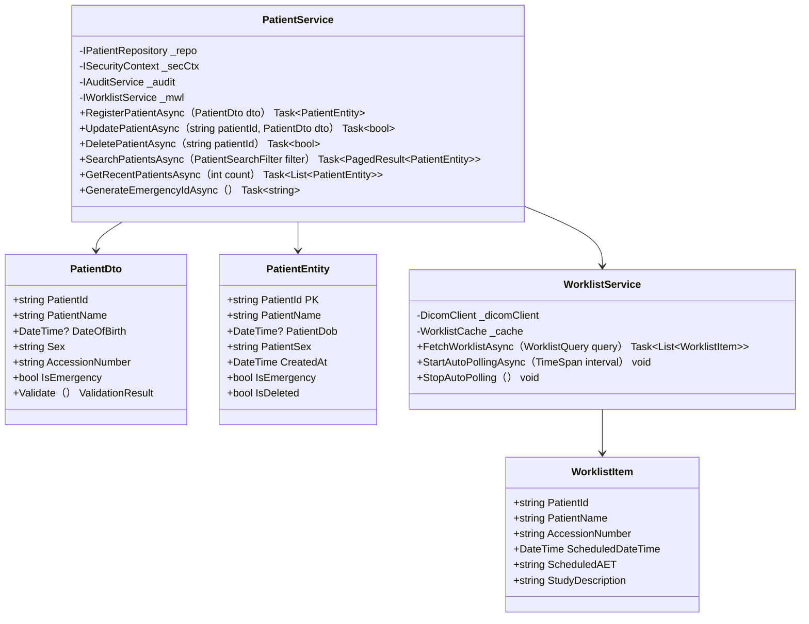
```mermaid
classDiagram
    class PatientService {
        -IPatientRepository _repo
        -ISecurityContext _secCtx
        -IAuditService _audit
        -IWorklistService _mwl
        +RegisterPatientAsync（PatientDto dto） Task~PatientEntity~
        +UpdatePatientAsync（string patientId, PatientDto dto） Task~bool~
        +DeletePatientAsync（string patientId） Task~bool~
        +SearchPatientsAsync（PatientSearchFilter filter） Task~PagedResult~PatientEntity~~
        +GetRecentPatientsAsync（int count） Task~List~PatientEntity~~
        +GenerateEmergencyIdAsync（） Task~string~
    }

    class PatientDto {
        +string PatientId
        +string PatientName
        +DateTime? DateOfBirth
        +string Sex
        +string AccessionNumber
        +bool IsEmergency
        +Validate（） ValidationResult
    }

    class PatientEntity {
        +string PatientId PK
        +string PatientName
        +DateTime? PatientDob
        +string PatientSex
        +DateTime CreatedAt
        +bool IsEmergency
        +bool IsDeleted
    }

    class WorklistService {
        -DicomClient _dicomClient
        -WorklistCache _cache
        +FetchWorklistAsync（WorklistQuery query） Task~List~WorklistItem~~
        +StartAutoPollingAsync（TimeSpan interval） void
        +StopAutoPolling（） void
    }

    class WorklistItem {
        +string PatientId
        +string PatientName
        +string AccessionNumber
        +DateTime ScheduledDateTime
        +string ScheduledAET
        +string StudyDescription
    }

    PatientService --> PatientDto
    PatientService --> PatientEntity
    PatientService --> WorklistService
    WorklistService --> WorklistItem
```

#### 3.1.2 MWL 자동조회 시퀀스 다이어그램

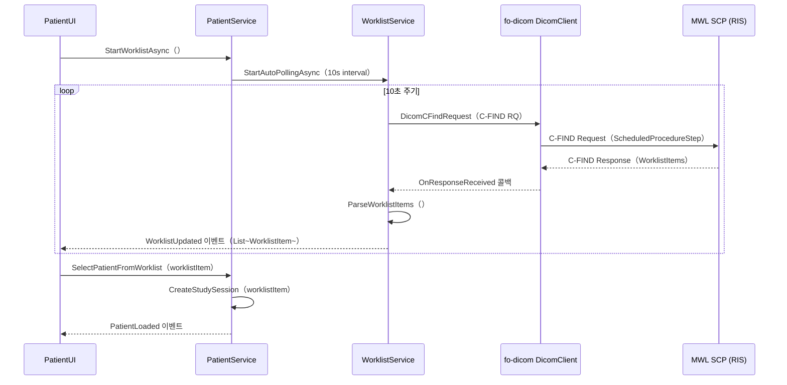
```mermaid
sequenceDiagram
    participant UI as PatientUI
    participant SVC as PatientService
    participant MWL as WorklistService
    participant DICOM as fo-dicom DicomClient
    participant RIS as MWL SCP (RIS)

    UI->>SVC: StartWorklistAsync（）
    SVC->>MWL: StartAutoPollingAsync（10s interval）
    loop 10초 주기
        MWL->>DICOM: DicomCFindRequest（C-FIND RQ）
        DICOM->>RIS: C-FIND Request（ScheduledProcedureStep）
        RIS-->>DICOM: C-FIND Response（WorklistItems）
        DICOM-->>MWL: OnResponseReceived 콜백
        MWL->>MWL: ParseWorklistItems（）
        MWL-->>UI: WorklistUpdated 이벤트（List~WorklistItem~）
    end
    UI->>SVC: SelectPatientFromWorklist（worklistItem）
    SVC->>SVC: CreateStudySession（worklistItem）
    SVC-->>UI: PatientLoaded 이벤트
```

---

### 3.2 SDS-WF-2xx: WorkflowEngine 모듈

**Tier 매핑:** Tier 1 (MR-020 IHE SWF), Tier 2 (MR-002 PACS 전송 30초, MR-010 촬영 워크플로우)
**관련 SWR:** SWR-WF-001–SWR-WF-034

#### 3.2.1 클래스 다이어그램

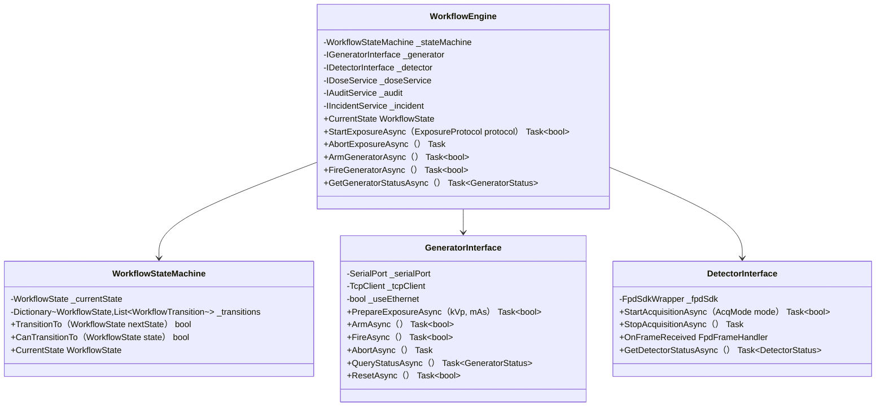
```mermaid
classDiagram
    class WorkflowEngine {
        -WorkflowStateMachine _stateMachine
        -IGeneratorInterface _generator
        -IDetectorInterface _detector
        -IDoseService _doseService
        -IAuditService _audit
        -IIncidentService _incident
        +CurrentState WorkflowState
        +StartExposureAsync（ExposureProtocol protocol） Task~bool~
        +AbortExposureAsync（） Task
        +ArmGeneratorAsync（） Task~bool~
        +FireGeneratorAsync（） Task~bool~
        +GetGeneratorStatusAsync（） Task~GeneratorStatus~
    }

    class WorkflowStateMachine {
        -WorkflowState _currentState
        -Dictionary~WorkflowState,List~WorkflowTransition~~ _transitions
        +TransitionTo（WorkflowState nextState） bool
        +CanTransitionTo（WorkflowState state） bool
        +CurrentState WorkflowState
    }

    class GeneratorInterface {
        -SerialPort _serialPort
        -TcpClient _tcpClient
        -bool _useEthernet
        +PrepareExposureAsync（kVp, mAs） Task~bool~
        +ArmAsync（） Task~bool~
        +FireAsync（） Task~bool~
        +AbortAsync（） Task
        +QueryStatusAsync（） Task~GeneratorStatus~
        +ResetAsync（） Task~bool~
    }

    class DetectorInterface {
        -FpdSdkWrapper _fpdSdk
        +StartAcquisitionAsync（AcqMode mode） Task~bool~
        +StopAcquisitionAsync（） Task
        +OnFrameReceived FpdFrameHandler
        +GetDetectorStatusAsync（） Task~DetectorStatus~
    }

    WorkflowEngine --> WorkflowStateMachine
    WorkflowEngine --> GeneratorInterface
    WorkflowEngine --> DetectorInterface
```

#### 3.2.2 촬영 시퀀스 다이어그램

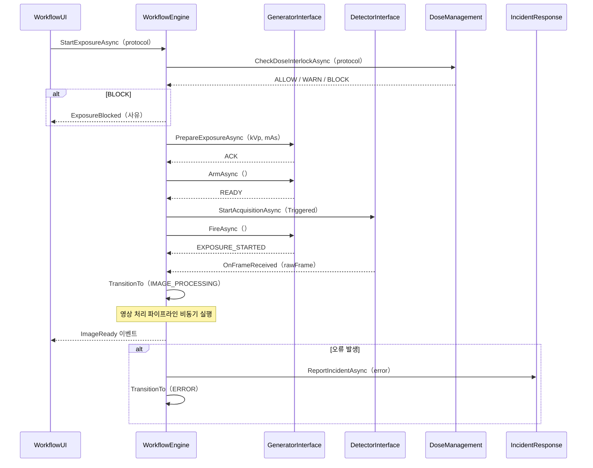
```mermaid
sequenceDiagram
    participant UI as WorkflowUI
    participant WF as WorkflowEngine
    participant GEN as GeneratorInterface
    participant DET as DetectorInterface
    participant DOSE as DoseManagement
    participant INC as IncidentResponse

    UI->>WF: StartExposureAsync（protocol）
    WF->>DOSE: CheckDoseInterlockAsync（protocol）
    DOSE-->>WF: ALLOW / WARN / BLOCK
    alt BLOCK
        WF-->>UI: ExposureBlocked（사유）
    end
    WF->>GEN: PrepareExposureAsync（kVp, mAs）
    GEN-->>WF: ACK
    WF->>GEN: ArmAsync（）
    GEN-->>WF: READY
    WF->>DET: StartAcquisitionAsync（Triggered）
    WF->>GEN: FireAsync（）
    GEN-->>WF: EXPOSURE_STARTED
    DET-->>WF: OnFrameReceived（rawFrame）
    WF->>WF: TransitionTo（IMAGE_PROCESSING）
    Note over WF: 영상 처리 파이프라인 비동기 실행
    WF-->>UI: ImageReady 이벤트
    alt 오류 발생
        WF->>INC: ReportIncidentAsync（error）
        WF->>WF: TransitionTo（ERROR）
    end
```

---

### 3.3 SDS-IP-3xx: ImageProcessing 모듈

**Tier 매핑:** Tier 2 (MR-003 W/L, MR-004 Zoom/Pan, MR-005 회전/반전)
**관련 SWR:** SWR-IP-001–SWR-IP-040

#### 3.3.1 클래스 다이어그램

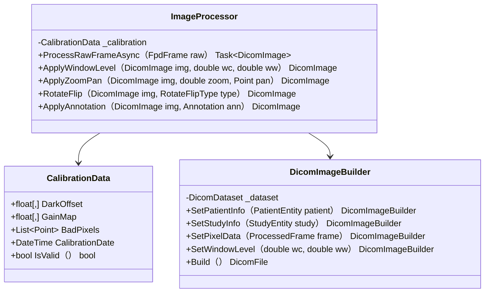
```mermaid
classDiagram
    class ImageProcessor {
        -CalibrationData _calibration
        +ProcessRawFrameAsync（FpdFrame raw） Task~DicomImage~
        +ApplyWindowLevel（DicomImage img, double wc, double ww） DicomImage
        +ApplyZoomPan（DicomImage img, double zoom, Point pan） DicomImage
        +RotateFlip（DicomImage img, RotateFlipType type） DicomImage
        +ApplyAnnotation（DicomImage img, Annotation ann） DicomImage
    }

    class CalibrationData {
        +float[,] DarkOffset
        +float[,] GainMap
        +List~Point~ BadPixels
        +DateTime CalibrationDate
        +bool IsValid（） bool
    }

    class DicomImageBuilder {
        -DicomDataset _dataset
        +SetPatientInfo（PatientEntity patient） DicomImageBuilder
        +SetStudyInfo（StudyEntity study） DicomImageBuilder
        +SetPixelData（ProcessedFrame frame） DicomImageBuilder
        +SetWindowLevel（double wc, double ww） DicomImageBuilder
        +Build（） DicomFile
    }

    ImageProcessor --> CalibrationData
    ImageProcessor --> DicomImageBuilder
```

#### 3.3.2 영상 처리 파이프라인

```
FPD SDK OnFrameReceived（14-bit RAW）
    ↓ Step 1: DarkOffset Subtraction
              frame[x,y] = raw[x,y] - offset[x,y]
    ↓ Step 2: Gain Calibration
              frame[x,y] = frame[x,y] / gain[x,y]
    ↓ Step 3: Bad Pixel Interpolation
              foreach bp in BadPixels: bilinear interpolation
    ↓ Step 4: Noise Reduction
              Gaussian filter σ=0.8 (configurable)
    ↓ Step 5: Edge Enhancement
              Unsharp Masking (configurable strength)
    ↓ Step 6: Window/Level Auto-calculation
              Auto W/L based on histogram percentile （1%–99%）
    ↓ Step 7: 16-bit → 8-bit Mapping
              linear mapping
    ↓ Step 8: DICOM Dataset 생성
              fo-dicom DicomFile (SOPClassUID=XRayDRStorage)
    ↓ Step 9: WPF WriteableBitmap 렌더링
```

---

### 3.4 SDS-DM-4xx: DoseManagement 모듈

**Tier 매핑:** Tier 2 (MR-007 DAP, MR-008 DRL 알림)
**관련 SWR:** SWR-DM-001–SWR-DM-025

#### 3.4.1 선량 인터락 로직

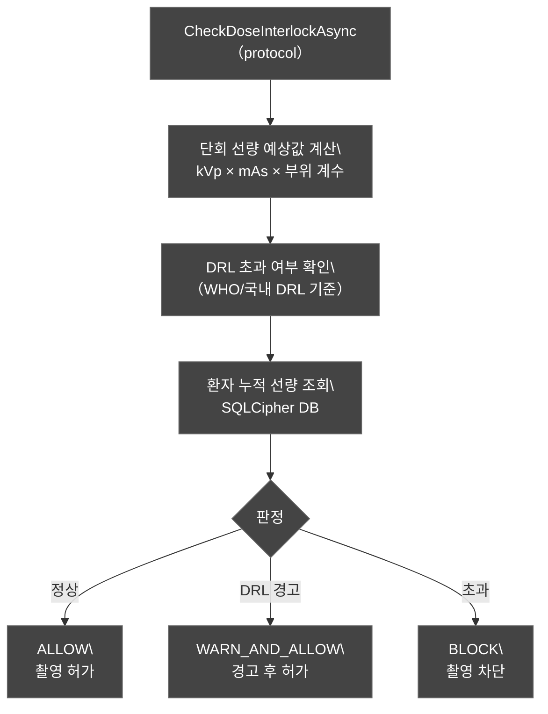
```mermaid
flowchart TD
    classDef default fill:#444,stroke:#666,color:#fff
    A["CheckDoseInterlockAsync（protocol）"] --> B["단회 선량 예상값 계산\\nkVp × mAs × 부위 계수"]
    B --> C["DRL 초과 여부 확인\\n（WHO/국내 DRL 기준）"]
    C --> D["환자 누적 선량 조회\\nSQLCipher DB"]
    D --> E{"판정"}
    E -- 정상 --> F["ALLOW\\n촬영 허가"]
    E -- DRL 경고 --> G["WARN_AND_ALLOW\\n경고 후 허가"]
    E -- 초과 --> H["BLOCK\\n촬영 차단"]
```

---

### 3.5 SDS-DC-5xx: DICOMCommunication 모듈

**Tier 매핑:** Tier 1 (MR-019 DICOM 3.0, MR-054 DICOM CS), Tier 2 (MR-001 MWL, MR-002 PACS 전송)
**관련 SWR:** SWR-DC-001–SWR-DC-035

#### 3.5.1 클래스 다이어그램 (fo-dicom 5.x)

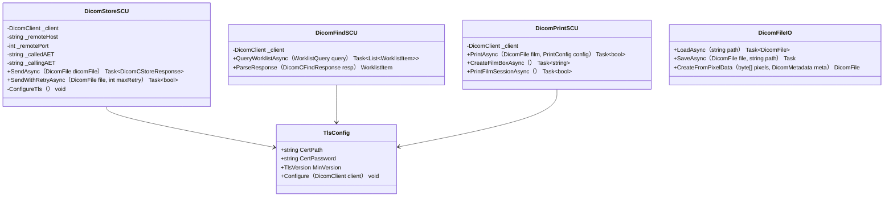
```mermaid
classDiagram
    class DicomStoreSCU {
        -DicomClient _client
        -string _remoteHost
        -int _remotePort
        -string _calledAET
        -string _callingAET
        +SendAsync（DicomFile dicomFile） Task~DicomCStoreResponse~
        +SendWithRetryAsync（DicomFile file, int maxRetry） Task~bool~
        -ConfigureTls（） void
    }

    class DicomFindSCU {
        -DicomClient _client
        +QueryWorklistAsync（WorklistQuery query） Task~List~WorklistItem~~
        +ParseResponse（DicomCFindResponse resp） WorklistItem
    }

    class DicomPrintSCU {
        -DicomClient _client
        +PrintAsync（DicomFile film, PrintConfig config） Task~bool~
        +CreateFilmBoxAsync（） Task~string~
        +PrintFilmSessionAsync（） Task~bool~
    }

    class DicomFileIO {
        +LoadAsync（string path） Task~DicomFile~
        +SaveAsync（DicomFile file, string path） Task
        +CreateFromPixelData（byte[] pixels, DicomMetadata meta） DicomFile
    }

    class TlsConfig {
        +string CertPath
        +string CertPassword
        +TlsVersion MinVersion
        +Configure（DicomClient client） void
    }

    DicomStoreSCU --> TlsConfig
    DicomFindSCU --> TlsConfig
    DicomPrintSCU --> TlsConfig
```

#### 3.5.2 C-STORE SCU 시퀀스 (fo-dicom 5.x)

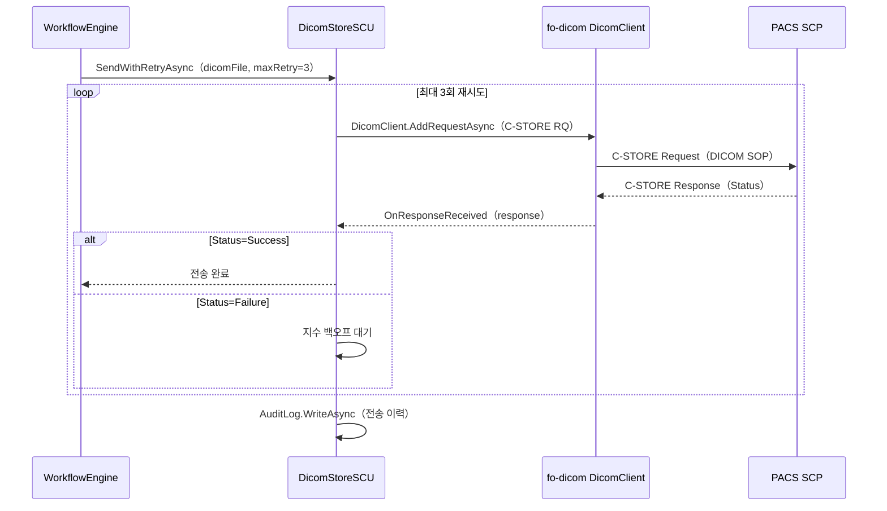
```mermaid
sequenceDiagram
    participant WF as WorkflowEngine
    participant SCU as DicomStoreSCU
    participant FODICOM as fo-dicom DicomClient
    participant PACS as PACS SCP

    WF->>SCU: SendWithRetryAsync（dicomFile, maxRetry=3）
    loop 최대 3회 재시도
        SCU->>FODICOM: DicomClient.AddRequestAsync（C-STORE RQ）
        FODICOM->>PACS: C-STORE Request（DICOM SOP）
        PACS-->>FODICOM: C-STORE Response（Status）
        FODICOM-->>SCU: OnResponseReceived（response）
        alt Status=Success
            SCU-->>WF: 전송 완료
        else Status=Failure
            SCU->>SCU: 지수 백오프 대기
        end
    end
    SCU->>SCU: AuditLog.WriteAsync（전송 이력）
```

#### 3.5.3 DICOM Print SCU 상세 설계

Print SCU는 feel-DRCS와의 기능 동등성 확보를 위해 Phase 1에 포함된다.

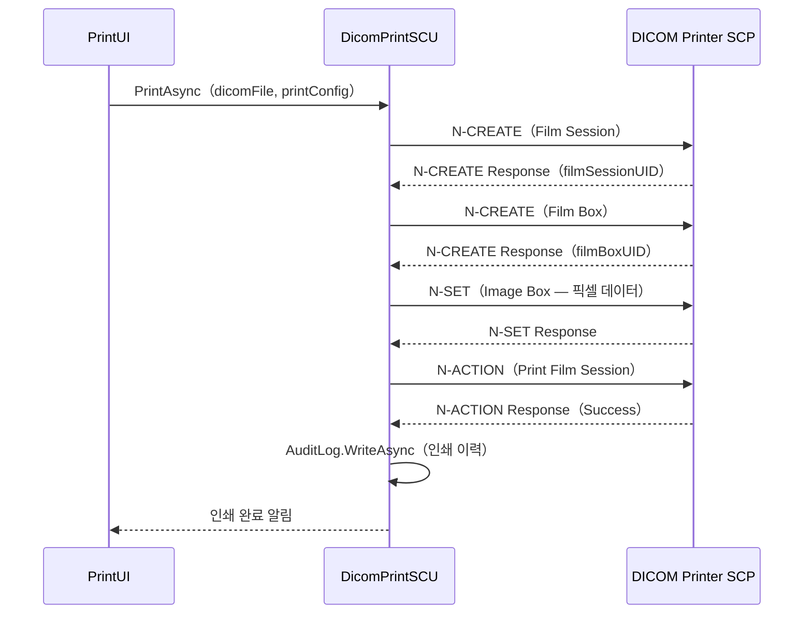
```mermaid
sequenceDiagram
    participant UI as PrintUI
    participant PSCU as DicomPrintSCU
    participant PRINTER as DICOM Printer SCP

    UI->>PSCU: PrintAsync（dicomFile, printConfig）
    PSCU->>PRINTER: N-CREATE（Film Session）
    PRINTER-->>PSCU: N-CREATE Response（filmSessionUID）
    PSCU->>PRINTER: N-CREATE（Film Box）
    PRINTER-->>PSCU: N-CREATE Response（filmBoxUID）
    PSCU->>PRINTER: N-SET（Image Box — 픽셀 데이터）
    PRINTER-->>PSCU: N-SET Response
    PSCU->>PRINTER: N-ACTION（Print Film Session）
    PRINTER-->>PSCU: N-ACTION Response（Success）
    PSCU->>PSCU: AuditLog.WriteAsync（인쇄 이력）
    PSCU-->>UI: 인쇄 완료 알림
```

#### 3.5.4 fo-dicom TLS 설정

```csharp
// DICOM TLS 클라이언트 생성
var client = DicomClientFactory.Create(
    host: pacsHost,
    port: pacsPort,
    useTls: true,      // TLS 활성화
    callingAe: "HNVUE",
    calledAe: pacsAeTitle);

// TLS 인증서 설정 （ITlsInitiator 구현）
public class HnVueTlsInitiator : ITlsInitiator
{
    private readonly X509Certificate2 _certificate;
    
    public HnVueTlsInitiator（string certPath, string certPassword）
    {
        _certificate = new X509Certificate2（certPath, certPassword）;
    }
    
    public SslStream InitiateTls（NetworkStream networkStream, string host, int port）
    {
        var sslStream = new SslStream（networkStream, false, ValidateServerCertificate）;
        sslStream.AuthenticateAsClient（
            host,
            new X509CertificateCollection { _certificate },
            SslProtocols.Tls12 | SslProtocols.Tls13,
            checkCertificateRevocation: true）;
        return sslStream;
    }
    
    private bool ValidateServerCertificate（
        object sender, X509Certificate cert, X509Chain chain, SslPolicyErrors errors）
    {
        return errors == SslPolicyErrors.None;
    }
}
```

> fo-dicom 5.x에서 TLS는 DicomClientFactory.Create의 useTls 파라미터 또는 ITlsInitiator 인터페이스로 설정한다.
> 최소 TLS 1.2 필수, TLS 1.3 권장. 자체 서명 인증서 허용 안 함.

#### 3.5.5 Print SCU 시퀀스: Film Session → Film Box → Image Box → Print

> 참조: DICOM-001 §3.3, §4.4

Print SCU는 DIMSE-N 서비스（N-CREATE, N-SET, N-ACTION, N-DELETE）를 순차적으로 수행한다. 아래는 fo-dicom 5.x 기반 구현 코드이다.

```csharp
public async Task PrintDicomImageAsync(
    string printerHost, int printerPort, string printerAeTitle,
    DicomDataset pixelDataset, PrintOptions options, CancellationToken ct = default)
{
    var client = DicomClientFactory.Create(printerHost, printerPort, false, "HNVUE", printerAeTitle);

    string filmSessionUid = null;
    string filmBoxUid     = null;
    string imageBoxUid    = null;

    // 1. Film Session N-CREATE
    var filmSessionDataset = new DicomDataset
    {
        { DicomTag.NumberOfCopies,  options.NumberOfCopies.ToString() },
        { DicomTag.PrintPriority,   options.PrintPriority },   // HIGH / MED / LOW
        { DicomTag.MediumType,      options.MediumType },      // BLUE FILM / CLEAR FILM / PAPER
        { DicomTag.FilmDestination, options.FilmDestination }, // MAGAZINE / PROCESSOR
    };
    var createFilmSession = new DicomNCreateRequest(DicomUID.BasicFilmSession, DicomUID.Generate());
    createFilmSession.Dataset = filmSessionDataset;
    createFilmSession.OnResponseReceived = (req, rsp) =>
    {
        filmSessionUid = req.SOPInstanceUID?.UID;
        if (rsp.Status != DicomStatus.Success)
            throw new InvalidOperationException($"Film Session N-CREATE 실패: {rsp.Status}");
    };
    await client.AddRequestAsync(createFilmSession);

    // 2. Film Box N-CREATE
    var filmBoxDataset = new DicomDataset
    {
        { DicomTag.ImageDisplayFormat, options.ImageDisplayFormat }, // STANDARD\\1,1
        { DicomTag.FilmSizeID,         options.FilmSizeId },        // 14INX17IN
        { DicomTag.MagnificationType,  "REPLICATE" },
        { DicomTag.BorderDensity,      "BLACK" },
    };
    var createFilmBox = new DicomNCreateRequest(DicomUID.BasicFilmBox, DicomUID.Generate());
    createFilmBox.Dataset = filmBoxDataset;
    createFilmBox.OnResponseReceived = (req, rsp) =>
    {
        filmBoxUid = req.SOPInstanceUID?.UID;
        if (rsp.HasDataset)
        {
            var refSeq = rsp.Dataset.GetSequence(DicomTag.ReferencedImageBoxSequence);
            if (refSeq?.Items?.Count > 0)
                imageBoxUid = refSeq.Items[0].GetSingleValueOrDefault(DicomTag.ReferencedSOPInstanceUID, "");
        }
    };
    await client.AddRequestAsync(createFilmBox);

    // Film Session + Film Box 먼저 전송—Image Box UID 확보
    await client.SendAsync(ct);

    // 3. Image Box N-SET
    var setImageBox = new DicomNSetRequest(DicomUID.BasicGrayscaleImageBox, imageBoxUid);
    // … 픽셀 데이터 설정 생략 …
    await client.AddRequestAsync(setImageBox);

    // 4. Film Session N-ACTION（Print 실행）
    var printAction = new DicomNActionRequest(DicomUID.BasicFilmSession, filmSessionUid, actionTypeId: 1);
    await client.AddRequestAsync(printAction);
    await client.SendAsync(ct);
}
```

> **주의:** Film Box N-CREATE RSP에서 받은 Image Box UID를 사용해야 하므로, Film Session + Film Box 생성 후 첫 번째 `SendAsync()`를 호출하여 UID를 확보한 뒤 Image Box N-SET을 이어서 전송한다.

#### 3.5.6 MWL 필수 반환 Tag 목록

> 참조: DICOM-001 §3.2, §4.3

MWL C-FIND 응답에서 Console이 반드시 추출해야 하는 10개 필수 DICOM Tag는 다음과 같다.

| 순번 | Tag | 명칭 | 타입 | 설명 |
|---|---|---|---|---|
| 1 | (0010,0010) | PatientName | PN | 환자명 （Last^First） |
| 2 | (0010,0020) | PatientID | LO | 환자 ID |
| 3 | (0010,0030) | PatientBirthDate | DA | 생년월일 |
| 4 | (0010,0040) | PatientSex | CS | M/F/O |
| 5 | (0008,0050) | AccessionNumber | SH | 검사 번호 |
| 6 | (0020,000D) | StudyInstanceUID | UI | 스터디 UID |
| 7 | (0032,1060) | RequestedProcedureDescription | LO | 요청 검사 설명 |
| 8 | (0040,1001) | RequestedProcedureID | SH | 요청 절차 ID |
| 9 | (0040,0100) | ScheduledProcedureStepSequence | SQ | 예약 절차 시퀀스 （날짜, 모달리티, AE Title） |
| 10 | (0008,0090) | ReferringPhysicianName | PN | 의래 의사명 |

```csharp
// fo-dicom 5.x MWL 필수 태그 요청 예시
cfind.Dataset.AddOrUpdate(DicomTag.PatientName,                    "");
cfind.Dataset.AddOrUpdate(DicomTag.PatientID,                      "");
cfind.Dataset.AddOrUpdate(DicomTag.PatientBirthDate,               "");
cfind.Dataset.AddOrUpdate(DicomTag.PatientSex,                     "");
cfind.Dataset.AddOrUpdate(DicomTag.AccessionNumber,                "");
cfind.Dataset.AddOrUpdate(DicomTag.StudyInstanceUID,               "");
cfind.Dataset.AddOrUpdate(DicomTag.RequestedProcedureDescription,  "");
cfind.Dataset.AddOrUpdate(DicomTag.RequestedProcedureID,           "");
cfind.Dataset.AddOrUpdate(DicomTag.ReferringPhysicianName,         "");
```

#### 3.5.7 C-STORE 배치 전송 패턴

> 참조: DICOM-001 §4.2, §4.6

다수 파일을 단일 Association으로 한번에 전송하는 배치 패턴. Polly 재시도 정책 포함.

```csharp
public async Task StoreBatchAsync(
    string pacsHost, int pacsPort, string pacsAeTitle,
    IEnumerable<string> filePaths, CancellationToken ct = default)
{
    var client  = DicomClientFactory.Create(pacsHost, pacsPort, false, "HNVUE", pacsAeTitle);
    var results = new ConcurrentBag<(string File, DicomStatus Status)>();

    foreach (var path in filePaths)
    {
        var request     = new DicomCStoreRequest(path);
        var capturedPath = path;
        request.OnResponseReceived += (req, rsp) =>
            results.Add((capturedPath, rsp.Status));
        await client.AddRequestAsync(request);   // 단일 Association 내 다중 요청
    }

    await client.SendAsync(ct);                  // 일괄 전송 실행

    // 실패 항목만 영속 큐에 저장（Polly 재시도 후도 실패 시）
    foreach (var (file, status) in results.Where(r => r.Status.State != DicomState.Success))
        _logger.LogWarning("전송 실패 — 영속 큐 등록: {File} — {Status}", file, status);
}
```

#### 3.5.8 DICOMDIR 생성 코드 스니펫

> 참조: DICOM-001 §8

CD Burning용 DICOMDIR 파일을 fo-dicom 5.x `DicomDirectory` API로 생성한다.

```csharp
public async Task CreateDicomDirAsync(string outputDirectory, IEnumerable<string> dicomFiles)
{
    var dd = new DicomDirectory();  // DICOMDIR 루트 객체 생성

    foreach (var filePath in dicomFiles)
    {
        var dcmFile = await DicomFile.OpenAsync(filePath);
        // 상대 경로를 8.3 형식으로 변환 （ISO 9660 준수）
        dd.AddFile(dcmFile,
            Path.GetRelativePath(outputDirectory, filePath)
                .Replace(Path.DirectorySeparatorChar, '\\'));
    }

    // DICOMDIR 파일 저장 （표준 위치: 루트의 DICOMDIR）
    dd.Save(Path.Combine(outputDirectory, "DICOMDIR"));
    _logger.LogInformation("DICOMDIR 생성 완료: {Path}", outputDirectory);
}
```

**DICOMDIR 계층 구조:**

```
DICOMDIR (루트)
└── PATIENT Record
    └── STUDY Record
        └── SERIES Record
            ├── IMAGE Record → DICOM\\00000001.dcm
            ├── IMAGE Record → DICOM\\00000002.dcm
            └── IMAGE Record → DICOM\\00000003.dcm
```

---

### 3.6 SDS-SA-6xx: SystemAdmin 모듈

**Tier 매핑:** Tier 1 (MR-039 SW 업데이트), Tier 2 (MR-006 시스템 설정, MR-013 촬영 프로토콜)
**관련 SWR:** SWR-SA-001–SWR-SA-077

#### 3.6.1 클래스 다이어그램

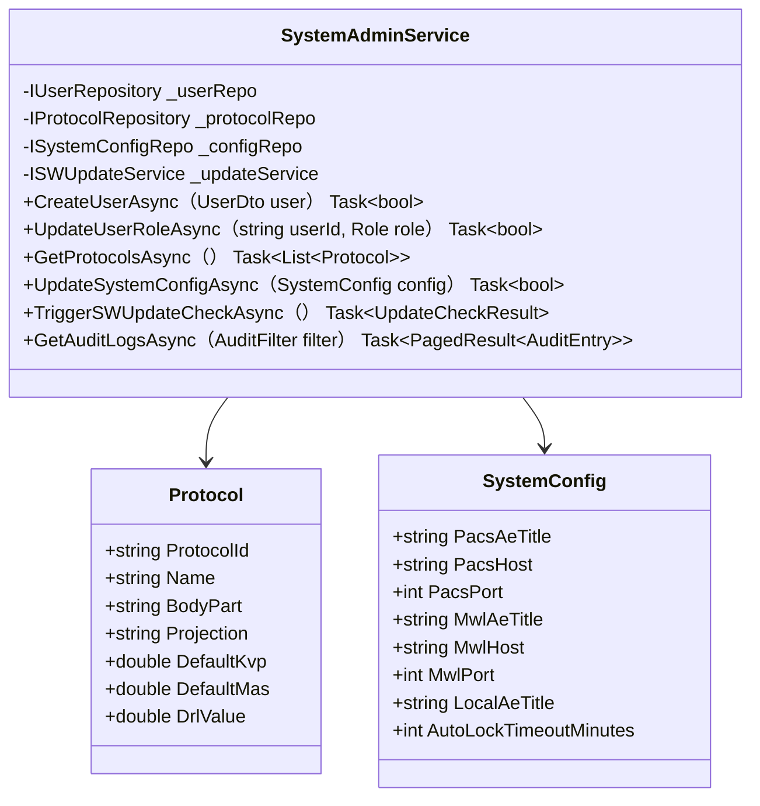
```mermaid
classDiagram
    class SystemAdminService {
        -IUserRepository _userRepo
        -IProtocolRepository _protocolRepo
        -ISystemConfigRepo _configRepo
        -ISWUpdateService _updateService
        +CreateUserAsync（UserDto user） Task~bool~
        +UpdateUserRoleAsync（string userId, Role role） Task~bool~
        +GetProtocolsAsync（） Task~List~Protocol~~
        +UpdateSystemConfigAsync（SystemConfig config） Task~bool~
        +TriggerSWUpdateCheckAsync（） Task~UpdateCheckResult~
        +GetAuditLogsAsync（AuditFilter filter） Task~PagedResult~AuditEntry~~
    }

    class Protocol {
        +string ProtocolId
        +string Name
        +string BodyPart
        +string Projection
        +double DefaultKvp
        +double DefaultMas
        +double DrlValue
    }

    class SystemConfig {
        +string PacsAeTitle
        +string PacsHost
        +int PacsPort
        +string MwlAeTitle
        +string MwlHost
        +int MwlPort
        +string LocalAeTitle
        +int AutoLockTimeoutMinutes
    }

    SystemAdminService --> Protocol
    SystemAdminService --> SystemConfig
```

---

### 3.7 SDS-CS-7xx: SecurityModule 모듈

**Tier 매핑:** Tier 1 (MR-033 RBAC, MR-034 PHI 암호화, MR-035 감사 로그, MR-036 SBOM, MR-037 인시던트 대응, MR-039 SW 업데이트, MR-050 STRIDE 위협 모델링)
**관련 SWR:** SWR-CS-001–SWR-CS-087

#### 3.7.1 클래스 다이어그램


```mermaid
classDiagram
    class SecurityService {
        -IUserRepository _userRepo
        -IAuditRepository _auditRepo
        -IJwtTokenService _jwt
        -IPasswordHasher _hasher
        +AuthenticateAsync（string userId, string password） Task~AuthResult~
        +CheckAuthorizationAsync（string userId, Permission perm） Task~bool~
        +LockAccountAsync（string userId） Task
        +UnlockAccountAsync（string userId） Task
        +GetLoginAttemptCount（string userId） int
        +InvalidateSessionAsync（string sessionToken） Task
    }

    class PasswordHasher {
        -int _bcryptCost
        +HashPassword（string plaintext） string
        +VerifyPassword（string plaintext, string hash） bool
        +IsBcryptHash（string hash） bool
    }

    class JwtTokenService {
        -byte[] _secretKey
        -TimeSpan _expiry
        +GenerateToken（UserClaims claims） string
        +ValidateToken（string token） ClaimsPrincipal
        +IsTokenExpired（string token） bool
    }

    class AuditService {
        -ILogger _serilog
        -string _previousHash
        +WriteAuditAsync（AuditEntry entry） Task
        -ComputeHmacChain（string prev, AuditEntry entry） string
        +VerifyChainIntegrity（） bool
    }

    class RbacPolicy {
        +bool CanExpose（Role role） bool
        +bool CanBurnCD（Role role） bool
        +bool CanManageUsers（Role role） bool
        +bool CanViewAuditLog（Role role） bool
        +bool CanTriggerUpdate（Role role） bool
    }

    SecurityService --> PasswordHasher
    SecurityService --> JwtTokenService
    SecurityService --> AuditService
    SecurityService --> RbacPolicy
```

#### 3.7.2 RBAC 역할 및 권한 매트릭스

| 권한 | Radiographer | Radiologist | Admin | Service |
|------|:---:|:---:|:---:|:---:|
| 환자 조회/등록 | ✅ | ✅ | ✅ | — |
| 촬영 수행 | ✅ | ✅ | — | — |
| 영상 판독 | — | ✅ | — | — |
| CD/DVD 굽기 | — | ✅ | ✅ | — |
| 시스템 설정 | — | — | ✅ | ✅ |
| 사용자 관리 | — | — | ✅ | — |
| 감사 로그 조회 | — | — | ✅ | ✅ |
| SW 업데이트 실행 | — | — | ✅ | ✅ |
| 촬영 프로토콜 편집 | — | — | ✅ | ✅ |

#### 3.7.3 인증 흐름 시퀀스

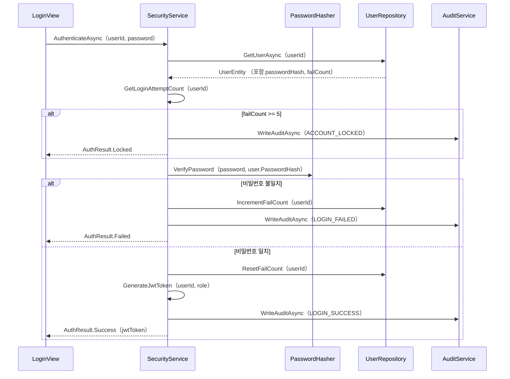
```mermaid
sequenceDiagram
    participant UI as LoginView
    participant SEC as SecurityService
    participant HASH as PasswordHasher
    participant DB as UserRepository
    participant AUDIT as AuditService

    UI->>SEC: AuthenticateAsync（userId, password）
    SEC->>DB: GetUserAsync（userId）
    DB-->>SEC: UserEntity （포함 passwordHash, failCount）
    SEC->>SEC: GetLoginAttemptCount（userId）
    alt failCount >= 5
        SEC->>AUDIT: WriteAuditAsync（ACCOUNT_LOCKED）
        SEC-->>UI: AuthResult.Locked
    end
    SEC->>HASH: VerifyPassword（password, user.PasswordHash）
    alt 비밀번호 불일치
        SEC->>DB: IncrementFailCount（userId）
        SEC->>AUDIT: WriteAuditAsync（LOGIN_FAILED）
        SEC-->>UI: AuthResult.Failed
    else 비밀번호 일치
        SEC->>DB: ResetFailCount（userId）
        SEC->>SEC: GenerateJwtToken（userId, role）
        SEC->>AUDIT: WriteAuditAsync（LOGIN_SUCCESS）
        SEC-->>UI: AuthResult.Success（jwtToken）
    end
```

#### 3.7.4 감사 로그 해시체인 설계

```
감사 로그 레코드 구조:
  {
    "Timestamp": "2026-04-03T10:00:00Z",
    "Level": "Information",
    "UserId": "RAD001",
    "Action": "LOGIN_SUCCESS",
    "Details": "환자 ID: P-20260403-001",
    "PreviousHash": "abc123...",
    "CurrentHash": HMAC-SHA256(PreviousHash + Timestamp + UserId + Action + Details, secretKey)
  }

해시 검증:
  foreach record in auditLog:
    computed = HMAC-SHA256(record.PreviousHash + payload, key)
    assert computed == record.CurrentHash  // 위변조 감지
```

---

### 3.8 SDS-UI-8xx: UIFramework 모듈

**Tier 매핑:** Tier 2 (MR-010 촬영 워크플로우, MR-051 IEC 62366 사용성)
**관련 SWR:** SWR-UI-001–SWR-UI-020

**기술 스택:** WPF .NET 8 + MVVM (CommunityToolkit.Mvvm) + MaterialDesignInXaml

**MVVM 구조:**
```
Views/                         ViewModels/
  MainWindow.xaml          ←→   MainWindowViewModel
  PatientListView.xaml     ←→   PatientListViewModel
  WorkflowView.xaml        ←→   WorkflowViewModel
  ImageViewerView.xaml     ←→   ImageViewerViewModel
  DoseDisplayView.xaml     ←→   DoseDisplayViewModel
  SystemAdminView.xaml     ←→   SystemAdminViewModel
  CDDVDBurnView.xaml       ←→   CDDVDBurnViewModel
```

**자동 잠금 타이머:**
- 기본값: 15분 비활동 시 화면 잠금
- 잠금 시: 로그인 화면 표시, 현재 세션 일시 중단
- 중단 금지 상태 (촬영 중)에서는 잠금 연기

---

### 3.9 SDS-DB-9xx: DataPersistence 모듈

**Tier 매핑:** Tier 1 (MR-034 PHI 암호화 — SQLCipher)
**관련 SWR:** SWR-DB-001–SWR-DB-015

#### 3.9.1 데이터베이스 스키마 (주요 테이블)

```sql
-- 환자 테이블 (SQLCipher AES-256 암호화됨)
CREATE TABLE Patients (
    PatientId TEXT PRIMARY KEY,
    PatientName TEXT NOT NULL,
    PatientDob TEXT,
    PatientSex TEXT,
    IsEmergency INTEGER DEFAULT 0,
    IsDeleted INTEGER DEFAULT 0,
    CreatedAt TEXT NOT NULL,
    CreatedBy TEXT NOT NULL
);

-- 사용자 테이블
CREATE TABLE Users (
    UserId TEXT PRIMARY KEY,
    DisplayName TEXT NOT NULL,
    PasswordHash TEXT NOT NULL,  -- bcrypt 비용=12
    Role TEXT NOT NULL,          -- Radiographer/Radiologist/Admin/Service
    FailedLoginCount INTEGER DEFAULT 0,
    IsLocked INTEGER DEFAULT 0,
    LastLoginAt TEXT
);

-- 감사 로그 테이블
CREATE TABLE AuditLogs (
    LogId INTEGER PRIMARY KEY AUTOINCREMENT,
    Timestamp TEXT NOT NULL,
    UserId TEXT NOT NULL,
    Action TEXT NOT NULL,
    Details TEXT,
    PreviousHash TEXT NOT NULL,
    CurrentHash TEXT NOT NULL    -- HMAC-SHA256 해시체인
);

-- SW 업데이트 이력 테이블
CREATE TABLE UpdateHistory (
    UpdateId INTEGER PRIMARY KEY AUTOINCREMENT,
    Timestamp TEXT NOT NULL,
    FromVersion TEXT NOT NULL,
    ToVersion TEXT NOT NULL,
    Status TEXT NOT NULL,        -- SUCCESS/ROLLBACK/FAILED
    InstalledBy TEXT NOT NULL,
    PackageHash TEXT NOT NULL
);
```

---

### 3.10 SDS-CD-10xx: CDDVDBurning 모듈

**Tier 매핑:** Tier 2 (MR-072 — CD/DVD Burning with DICOM Viewer)
**관련 SWR:** SWR-WF-032–SWR-WF-034

#### 3.10.1 클래스 다이어그램


```mermaid
classDiagram
    class CDDVDBurnService {
        -IMAPIComWrapper _imapi
        -ISecurityContext _secCtx
        -IAuditService _audit
        -ICryptographyService _crypto
        +BurnDicomStudyAsync（BurnRequest request） Task~BurnResult~
        +GetAvailableDrivesAsync（） Task~List~BurnDrive~~
        +CancelBurn（） void
        +BurnProgressChanged BurnProgressHandler
    }

    class BurnRequest {
        +string PatientId
        +List~string~ DicomFilePaths
        +string DriveId
        +bool EncryptDisc
        +string? EncryptPassword
        +bool IncludeViewer
        +string OutputLabel
    }

    class BurnResult {
        +bool IsSuccess
        +string ErrorMessage
        +string MediaSerialId
        +string Sha256Hash
        +DateTime BurnTime
    }

    class IMAPIComWrapper {
        -IDiscMaster2 _discMaster
        +GetDrives（） List~IDiscRecorder2~
        +CreateFilesystemImage（） IFilesystemImage
        +BurnAsync（IDiscFormat2Data format, IFilesystemImage img） Task~bool~
        +VerifyAsync（string drivePath） Task~bool~
    }

    class ViewerPackager {
        +PackageViewerToDisc（IFilesystemImage img） void
        +GetViewerExePath（） string
    }

    CDDVDBurnService --> BurnRequest
    CDDVDBurnService --> BurnResult
    CDDVDBurnService --> IMAPIComWrapper
    CDDVDBurnService --> ViewerPackager
```

#### 3.10.2 CD 굽기 시퀀스

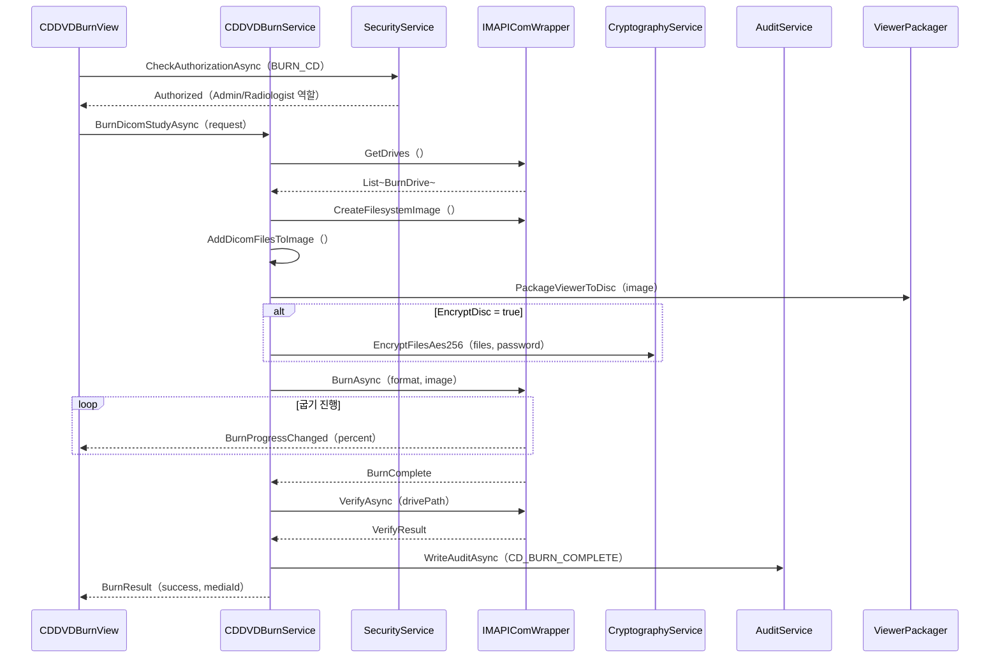
```mermaid
sequenceDiagram
    participant UI as CDDVDBurnView
    participant SVC as CDDVDBurnService
    participant SEC as SecurityService
    participant IMAPI as IMAPIComWrapper
    participant CRYPTO as CryptographyService
    participant AUDIT as AuditService

    UI->>SEC: CheckAuthorizationAsync（BURN_CD）
    SEC-->>UI: Authorized（Admin/Radiologist 역할）
    UI->>SVC: BurnDicomStudyAsync（request）
    SVC->>IMAPI: GetDrives（）
    IMAPI-->>SVC: List~BurnDrive~
    SVC->>IMAPI: CreateFilesystemImage（）
    SVC->>SVC: AddDicomFilesToImage（）
    SVC->>ViewerPackager: PackageViewerToDisc（image）
    alt EncryptDisc = true
        SVC->>CRYPTO: EncryptFilesAes256（files, password）
    end
    SVC->>IMAPI: BurnAsync（format, image）
    loop 굽기 진행
        IMAPI-->>UI: BurnProgressChanged（percent）
    end
    IMAPI-->>SVC: BurnComplete
    SVC->>IMAPI: VerifyAsync（drivePath）
    IMAPI-->>SVC: VerifyResult
    SVC->>AUDIT: WriteAuditAsync（CD_BURN_COMPLETE）
    SVC-->>UI: BurnResult（success, mediaId）
```

---

### 3.11 SDS-INC-11xx: IncidentResponse 모듈

**Tier 매핑:** Tier 1 (MR-037 — CVD + 인시던트 대응)
**규제 근거:** IEC 81001-5-1:2021 §8.11
**관련 SWR:** SWR-CS-086–SWR-CS-087

#### 3.11.1 클래스 다이어그램

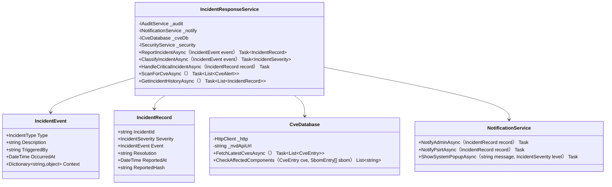
```mermaid
classDiagram
    class IncidentResponseService {
        -IAuditService _audit
        -INotificationService _notify
        -ICveDatabase _cveDb
        -ISecurityService _security
        +ReportIncidentAsync（IncidentEvent event） Task~IncidentRecord~
        +ClassifyIncidentAsync（IncidentEvent event） Task~IncidentSeverity~
        +HandleCriticalIncidentAsync（IncidentRecord record） Task
        +ScanForCveAsync（） Task~List~CveAlert~~
        +GetIncidentHistoryAsync（） Task~List~IncidentRecord~~
    }

    class IncidentEvent {
        +IncidentType Type
        +string Description
        +string TriggeredBy
        +DateTime OccurredAt
        +Dictionary~string,object~ Context
    }

    class IncidentRecord {
        +string IncidentId
        +IncidentSeverity Severity
        +IncidentEvent Event
        +string Resolution
        +DateTime ReportedAt
        +string ReportedHash
    }

    class CveDatabase {
        -HttpClient _http
        -string _nvdApiUrl
        +FetchLatestCvesAsync（） Task~List~CveEntry~~
        +CheckAffectedComponents（CveEntry cve, SbomEntry[] sbom） List~string~
    }

    class NotificationService {
        +NotifyAdminAsync（IncidentRecord record） Task
        +NotifyPsirtAsync（IncidentRecord record） Task
        +ShowSystemPopupAsync（string message, IncidentSeverity level） Task
    }

    IncidentResponseService --> IncidentEvent
    IncidentResponseService --> IncidentRecord
    IncidentResponseService --> CveDatabase
    IncidentResponseService --> NotificationService
```

#### 3.11.2 인시던트 처리 시퀀스

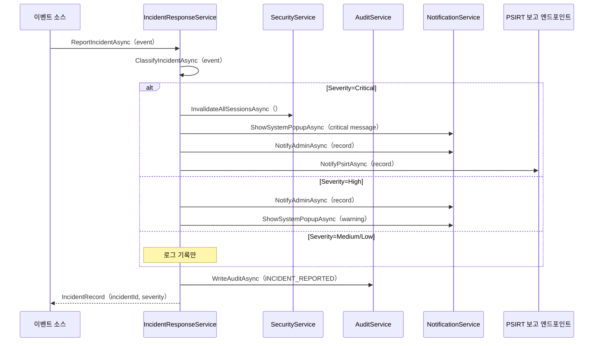
```mermaid
sequenceDiagram
    participant SOURCE as 이벤트 소스
    participant INC as IncidentResponseService
    participant SEC as SecurityService
    participant AUDIT as AuditService
    participant NOTIFY as NotificationService
    participant PSIRT as PSIRT 보고 엔드포인트

    SOURCE->>INC: ReportIncidentAsync（event）
    INC->>INC: ClassifyIncidentAsync（event）
    alt Severity=Critical
        INC->>SEC: InvalidateAllSessionsAsync（）
        INC->>NOTIFY: ShowSystemPopupAsync（critical message）
        INC->>NOTIFY: NotifyAdminAsync（record）
        INC->>PSIRT: NotifyPsirtAsync（record）
    else Severity=High
        INC->>NOTIFY: NotifyAdminAsync（record）
        INC->>NOTIFY: ShowSystemPopupAsync（warning）
    else Severity=Medium/Low
        Note over INC: 로그 기록만
    end
    INC->>AUDIT: WriteAuditAsync（INCIDENT_REPORTED）
    INC-->>SOURCE: IncidentRecord（incidentId, severity）
```

---

### 3.12 SDS-UPD-12xx: SWUpdate 모듈

**Tier 매핑:** Tier 1 (MR-039 — SW 무결성 검증 + 업데이트 메커니즘)
**규제 근거:** FDA Section 524B §3524(b)(2)
**관련 SWR:** SWR-SA-076–SWR-SA-077, SWR-CS-084–SWR-CS-085

#### 3.12.1 클래스 다이어그램

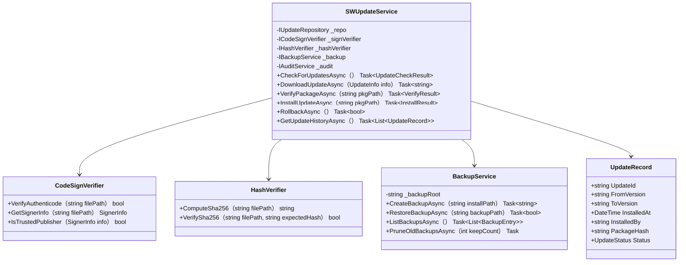
```mermaid
classDiagram
    class SWUpdateService {
        -IUpdateRepository _repo
        -ICodeSignVerifier _signVerifier
        -IHashVerifier _hashVerifier
        -IBackupService _backup
        -IAuditService _audit
        +CheckForUpdatesAsync（） Task~UpdateCheckResult~
        +DownloadUpdateAsync（UpdateInfo info） Task~string~
        +VerifyPackageAsync（string pkgPath） Task~VerifyResult~
        +InstallUpdateAsync（string pkgPath） Task~InstallResult~
        +RollbackAsync（） Task~bool~
        +GetUpdateHistoryAsync（） Task~List~UpdateRecord~~
    }

    class CodeSignVerifier {
        +VerifyAuthenticode（string filePath） bool
        +GetSignerInfo（string filePath） SignerInfo
        +IsTrustedPublisher（SignerInfo info） bool
    }

    class HashVerifier {
        +ComputeSha256（string filePath） string
        +VerifySha256（string filePath, string expectedHash） bool
    }

    class BackupService {
        -string _backupRoot
        +CreateBackupAsync（string installPath） Task~string~
        +RestoreBackupAsync（string backupPath） Task~bool~
        +ListBackupsAsync（） Task~List~BackupEntry~~
        +PruneOldBackupsAsync（int keepCount） Task
    }

    class UpdateRecord {
        +string UpdateId
        +string FromVersion
        +string ToVersion
        +DateTime InstalledAt
        +string InstalledBy
        +string PackageHash
        +UpdateStatus Status
    }

    SWUpdateService --> CodeSignVerifier
    SWUpdateService --> HashVerifier
    SWUpdateService --> BackupService
    SWUpdateService --> UpdateRecord
```

#### 3.12.2 업데이트/롤백 시퀀스

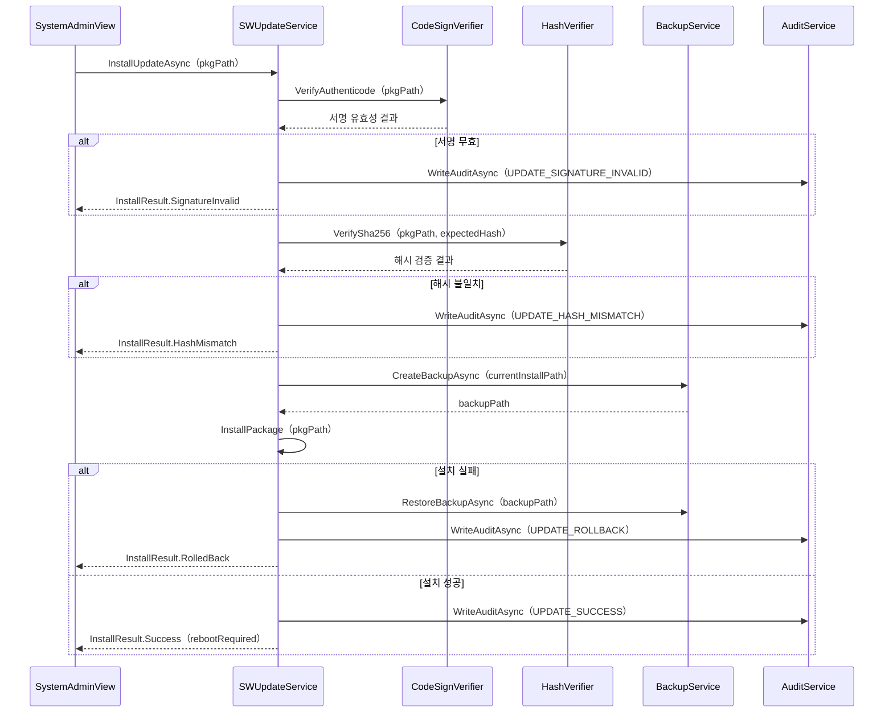
```mermaid
sequenceDiagram
    participant ADMIN as SystemAdminView
    participant UPD as SWUpdateService
    participant SIGN as CodeSignVerifier
    participant HASH as HashVerifier
    participant BACKUP as BackupService
    participant AUDIT as AuditService

    ADMIN->>UPD: InstallUpdateAsync（pkgPath）
    UPD->>SIGN: VerifyAuthenticode（pkgPath）
    SIGN-->>UPD: 서명 유효성 결과
    alt 서명 무효
        UPD->>AUDIT: WriteAuditAsync（UPDATE_SIGNATURE_INVALID）
        UPD-->>ADMIN: InstallResult.SignatureInvalid
    end
    UPD->>HASH: VerifySha256（pkgPath, expectedHash）
    HASH-->>UPD: 해시 검증 결과
    alt 해시 불일치
        UPD->>AUDIT: WriteAuditAsync（UPDATE_HASH_MISMATCH）
        UPD-->>ADMIN: InstallResult.HashMismatch
    end
    UPD->>BACKUP: CreateBackupAsync（currentInstallPath）
    BACKUP-->>UPD: backupPath
    UPD->>UPD: InstallPackage（pkgPath）
    alt 설치 실패
        UPD->>BACKUP: RestoreBackupAsync（backupPath）
        UPD->>AUDIT: WriteAuditAsync（UPDATE_ROLLBACK）
        UPD-->>ADMIN: InstallResult.RolledBack
    else 설치 성공
        UPD->>AUDIT: WriteAuditAsync（UPDATE_SUCCESS）
        UPD-->>ADMIN: InstallResult.Success（rebootRequired）
    end
```

---

## 4. 데이터 구조 상세

### 4.1 핵심 데이터 모델

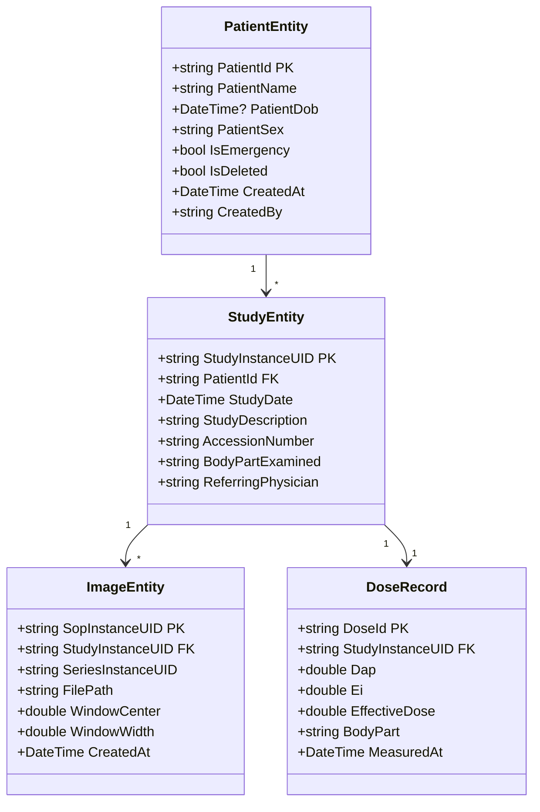
```mermaid
classDiagram
    class PatientEntity {
        +string PatientId PK
        +string PatientName
        +DateTime? PatientDob
        +string PatientSex
        +bool IsEmergency
        +bool IsDeleted
        +DateTime CreatedAt
        +string CreatedBy
    }

    class StudyEntity {
        +string StudyInstanceUID PK
        +string PatientId FK
        +DateTime StudyDate
        +string StudyDescription
        +string AccessionNumber
        +string BodyPartExamined
        +string ReferringPhysician
    }

    class ImageEntity {
        +string SopInstanceUID PK
        +string StudyInstanceUID FK
        +string SeriesInstanceUID
        +string FilePath
        +double WindowCenter
        +double WindowWidth
        +DateTime CreatedAt
    }

    class DoseRecord {
        +string DoseId PK
        +string StudyInstanceUID FK
        +double Dap
        +double Ei
        +double EffectiveDose
        +string BodyPart
        +DateTime MeasuredAt
    }

    PatientEntity "1" --> "*" StudyEntity
    StudyEntity "1" --> "*" ImageEntity
    StudyEntity "1" --> "1" DoseRecord
```

---

## 5. 알고리즘 상세

### 5.1 bcrypt 패스워드 해싱

```
입력: 평문 비밀번호 (최대 72바이트)
비용 인자: 12 (약 300ms 소요 — 브루트포스 저항)
출력: $2a$12$<salt><hash> (60자)

검증:
  BCrypt.Verify（plaintext, storedHash）
  → 시간 일정 비교 (timing-safe comparison)
```

### 5.2 HMAC-SHA256 감사 로그 해시체인

```
초기화:
  previousHash = HMAC-SHA256（"GENESIS", secretKey）

각 레코드:
  payload = Timestamp + "|" + UserId + "|" + Action + "|" + Details
  currentHash = HMAC-SHA256（previousHash + payload, secretKey）
  record.PreviousHash = previousHash
  record.CurrentHash = currentHash
  previousHash = currentHash

검증:
  foreach record in order:
    expected = HMAC-SHA256（record.PreviousHash + payload, key）
    if expected != record.CurrentHash: TAMPERED
```

### 5.3 Authenticode 서명 검증 (SW 업데이트)

```csharp
// .NET 8 X509Certificate2 + AuthenticodeSignatureInformation
var cert = new X509Certificate2（filePath）;
var chain = new X509Chain（）;
chain.ChainPolicy.RevocationMode = X509RevocationMode.Online;
bool valid = chain.Build（cert）;
// 발급자 검증: 제조사 코드 서명 인증서 Thumbprint 확인
bool trustedPublisher = cert.Thumbprint == knownPublisherThumbprint;
```

---

## 13. 에러 처리 매트릭스 (Error Handling Matrix)

IEC 62304 Class B 요구사항에 따라, 모든 외부 인터페이스의 장애 시나리오와 대응 전략을 정의한다.

### 13.1 안전 상태 정의 (Safe State Definition)

| 안전 상태 | 조건 | 동작 |
|----------|------|------|
| **SS-IDLE** | 정상 대기 | 모든 기능 정상, 촬영 가능 |
| **SS-DEGRADED** | 일부 기능 제한 | PACS 다운 등, 촬영 가능하나 전송 보류 |
| **SS-BLOCKED** | 촬영 불가 | Generator/FPD 오류, 안전 차단 |
| **SS-EMERGENCY** | 긴급 중단 | HW 심각 오류, 즉시 Exposure 중단 |

### 13.2 DICOM 통신 에러 처리

| 에러 시나리오 | 감지 방법 | 1차 대응 | 2차 대응 | 안전 상태 | 사용자 알림 |
|-------------|---------|---------|---------|----------|-----------|
| PACS 연결 실패 | Association timeout 10s | Polly 재시도 3회, 지수 백오프 2/4/8s | 로컬 큐에 저장, 연결 복구 시 자동 전송 | SS-DEGRADED | 상태바 PACS 아이콘 경고 |
| C-STORE 전송 실패 | DIMSE timeout 30s | 동일 Association에서 재시도 1회 | 로컬 큐 저장, 새 Association으로 재전송 | SS-DEGRADED | 전송 실패 알림 + 재전송 큐 표시 |
| MWL 조회 실패 | DIMSE timeout 15s | 재시도 2회, 2s 간격 | 마지막 캐시 워크리스트 표시 + 수동 입력 모드 | SS-DEGRADED | "워크리스트 서버 응답 없음. 수동 입력 가능" |
| Print 실패 | DIMSE timeout 30s | 재시도 1회 | "프린터 연결 실패" 알림 | SS-DEGRADED | 프린터 오류 메시지 |
| TLS 핸드셰이크 실패 | Handshake timeout 10s | 인증서 재검증 | 비암호화 폴백 금지, 연결 차단 | SS-BLOCKED | "보안 연결 실패. 관리자 문의" |

### 13.3 Generator 통신 에러 처리

| 에러 시나리오 | Generator 에러코드 | 감지 방법 | 1차 대응 | 2차 대응 | 안전 상태 |
|-------------|------------------|---------|---------|---------|---------|
| 통신 끊김 | E01/E02/E33 | Serial timeout 3s | 재연결 시도 3회, 1s 간격 | Generator OFF/ON 안내 | SS-BLOCKED |
| Exposure 중 HW 오류 | E09 Generator Overload | 에러 코드 수신 | 즉시 Exposure 중단, 결과 폐기 | 30분 냉각 안내 | SS-EMERGENCY |
| mA/kV 범위 초과 | E12/E13/E16 | 에러 코드 수신 | AEC Reset 안내 | 파라미터 자동 조정 제안 | SS-BLOCKED |
| Tube 과열 | E36/E37 | 에러 코드 수신 | Heat Unit 경고 표시 | 냉각 대기 카운트다운 | SS-BLOCKED |
| Collimator 오류 | E48 | 에러 코드 수신 | Exposure 차단 | 서비스 콜 안내 | SS-BLOCKED |
| Operator 중단 | E50 | 에러 코드 수신 | 정상 중단 처리 | 이미지 폐기 확인 | SS-IDLE |

### 13.4 FPD (Detector) 에러 처리

| 에러 시나리오 | 감지 방법 | 1차 대응 | 2차 대응 | 안전 상태 |
|-------------|---------|---------|---------|----------|
| GigE 연결 끊김 | Heartbeat timeout 5s | 자동 재연결 시도 3회 | 디텍터 전원 사이클 안내 | SS-BLOCKED |
| 트리거 타임아웃 | Exposure 후 10s 이미지 미수신 | 재트리거 1회 | "디텍터 응답 없음" 알림 | SS-BLOCKED |
| Calibration 만료 | 마지막 교정 > 24h | 경고 표시, 촬영은 허용 | Offset/Gain 재교정 안내 | SS-DEGRADED |
| 이미지 CRC 오류 | 수신 데이터 CRC 검증 | 재촬영 안내 （이미지 폐기） | 디텍터 진단 안내 | SS-BLOCKED |
| 다중 디텍터 전환 실패 | 전환 후 Heartbeat 미응답 | 이전 디텍터로 롤백 | 수동 선택 안내 | SS-DEGRADED |

### 13.5 시스템 내부 에러 처리

| 에러 시나리오 | 감지 방법 | 대응 | 안전 상태 |
|-------------|---------|------|----------|
| DB 접근 실패 | SQLCipher exception | 재시도 3회, 실패 시 읽기 전용 모드 | SS-DEGRADED |
| 영상처리 SDK 크래시 | Process exit code != 0 | SDK 프로세스 재시작, 원본 RAW 보존 | SS-DEGRADED |
| 메모리 부족 | GC.GetTotalMemory 임계값 | 캐시 클리어, 오래된 이미지 언로드 | SS-DEGRADED |
| 미처리 예외 | AppDomain.UnhandledException | 로그 기록, 자동 복구 시도, 실패 시 안전 종료 | SS-EMERGENCY |
| SW 업데이트 실패 | 서명 검증 실패 / 적용 오류 | 이전 버전 롤백 （자동） | SS-IDLE |

### 13.6 재시도 정책 (Retry Policy)

Polly 라이브러리 기반 표준 재시도 정책:

| 대상 | 최대 재시도 | 간격 | 전략 |
|------|:--------:|------|------|
| PACS C-STORE | 3회 | 2s, 4s, 8s | 지수 백오프 + 로컬 큐 폴백 |
| MWL 조회 | 2회 | 2s, 4s | 지수 백오프 + 캐시 폴백 |
| Generator 통신 | 3회 | 1s, 1s, 1s | 고정 간격 |
| FPD 연결 | 3회 | 2s, 4s, 8s | 지수 백오프 |
| DB 접근 | 3회 | 100ms, 200ms, 500ms | 지수 백오프 |
| Print | 1회 | 5s | 고정 간격 |

### 13.7 Polly DI 설정 (.NET 8)

Program.cs에서 Polly를 DI 컨테이너에 등록한다:

```csharp
// Polly 재시도 정책 팩토리 등록
services.AddSingleton<IRetryPolicyFactory, RetryPolicyFactory>();

// DICOM 클라이언트 전용 재시도 정책
services.AddSingleton<IAsyncPolicy>(sp =>
    Policy
        .Handle<DicomAssociationRejectedException>()
        .Or<DicomAssociationAbortedException>()
        .Or<IOException>()
        .WaitAndRetryAsync(
            retryCount: 3,
            sleepDurationProvider: attempt => TimeSpan.FromSeconds(Math.Pow(2, attempt)),
            onRetry: (exception, delay, attempt, context) =>
            {
                var logger = sp.GetRequiredService<ILogger<DicomService>>();
                logger.LogWarning(exception, "DICOM retry {Attempt} after {Delay}ms", attempt, delay.TotalMilliseconds);
            }));

// Generator 통신 전용 재시도 정책
services.AddSingleton<IAsyncPolicy<GeneratorResponse>>(sp =>
    Policy<GeneratorResponse>
        .Handle<TimeoutException>()
        .Or<IOException>()
        .WaitAndRetryAsync(
            retryCount: 3,
            sleepDurationProvider: _ => TimeSpan.FromSeconds(1)));
```

---

## 14. Generator 통신 인터페이스 상세

### 14.1 통신 프로토콜

| 항목 | 사양 |
|------|------|
| **물리 인터페이스** | RS-232（기본） / RS-422 / Ethernet（옵션） |
| **Baud Rate** | 9600–115200（Generator 사양서에 따름） |
| **데이터 형식** | 8N1（8 data bits, No parity, 1 stop bit） |
| **핸드셰이크** | 없음 또는 RTS/CTS |
| **프로토콜** | 명령–응답（Command-Response）, 패킷 기반 |
| **타임아웃** | 명령 응답 3s, Exposure 완료 30s |

### 14.2 명령 체계

```
Console → Generator:
  SET_KVP <value>      kVp 설정
  SET_MAS <value>      mAs 설정
  LOAD_APR <id>        APR 프리셋 로딩
  PREP                 Rotor Start / Preparation
  EXPOSE               Exposure 트리거
  ABORT                Exposure 중단
  GET_STATUS           상태 조회
  GET_HEAT_UNITS       Tube Heat Unit 조회

Generator → Console:
  READY                촬영 준비 완료
  EXPOSURE_DONE        촬영 완료
  ACTUAL_KVP <value>   실제 kVp
  ACTUAL_MAS <value>   실제 mAs
  ERROR <code>         에러 코드 （E01–E93）
  HEAT_UNITS <value>   현재 Heat Unit
```

### 14.3 Console ↔ Generator 촬영 시퀀스

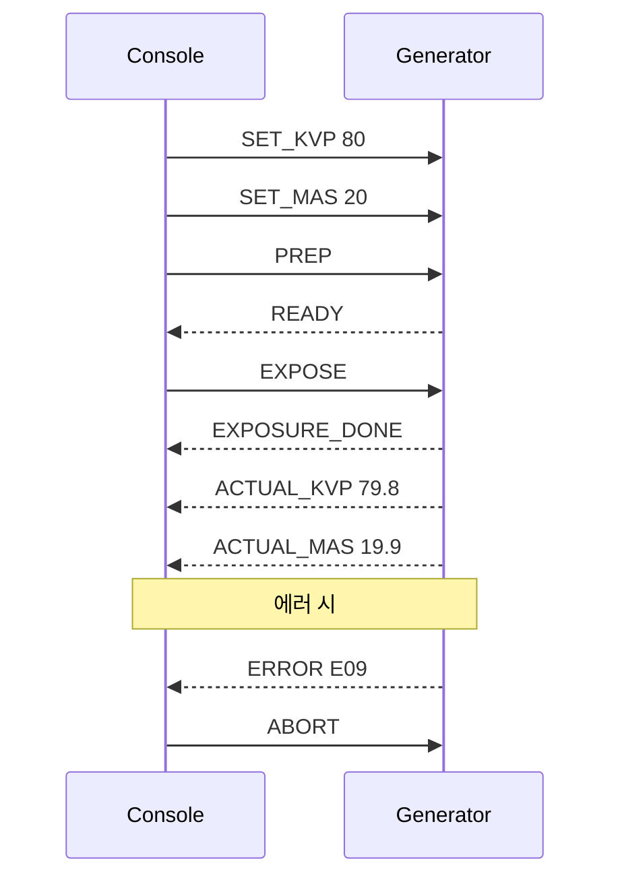
```mermaid
sequenceDiagram
    participant C as Console
    participant G as Generator
    C->>G: SET_KVP 80
    C->>G: SET_MAS 20
    C->>G: PREP
    G-->>C: READY
    C->>G: EXPOSE
    G-->>C: EXPOSURE_DONE
    G-->>C: ACTUAL_KVP 79.8
    G-->>C: ACTUAL_MAS 19.9
    Note over C,G: 에러 시
    G-->>C: ERROR E09
    C->>G: ABORT
```

### 14.4 에러 코드 참조 (Sedecal 기준)

| 코드 | 설명 | 조치 |
|------|------|------|
| E01/E02 | Communication error | 케이블 확인 후 재시작 |
| E06 | Exposure/Preparation 명령 중복 | 제어 해제 |
| E09 | Generator Overload | 30분 냉각 후 재시도 |
| E12 | No mA during exposure | AEC Reset 후 재시도 |
| E13 | No kV during exposure | 기술 값 조정 |
| E16 | Invalid kV/mA/kW | 파라미터 범위 초과 확인 |
| E33 | Serial Communication error | 케이블/연결 확인 |
| E34 | Technique error / Security Timer | 안전 차단 |
| E36 | Heat Units error | 튜브 과열, 냉각 대기 |
| E37 | Tube Overload | 파라미터 축소 또는 냉각 |
| E48 | Collimator Error | 블레이드 위치 오류, 서비스 콜 |
| E50 | Operator abort | 정상 중단 |

### 14.5 APR JSON 데이터 구조 예시

> 참조: GENERATOR-001 §6.2, §6.3

APR（Anatomically Programmed Radiography） 프리셋은 Console 로컬 DB와 Generator 내부 메모리 양쪽에 이중화 저장된다. 아래는 3개 대표 부위의 JSON 구조 예시이다.

**Chest PA (ID: 1) — AEC 모드**

```json
{
  "apr_id": 1,
  "body_part": "Chest",
  "projection": "PA",
  "kvp": 120,
  "mas": null,
  "ma": null,
  "time": null,
  "aec_enabled": true,
  "aec_field": [2, 3],
  "aec_density": 0,
  "focal_spot": "Large",
  "grid": true,
  "bucky": true,
  "description": "흉부 정면 촬영 — 성인 표준"
}
```

**Hand AP (ID: 7) — Manual 모드**

```json
{
  "apr_id": 7,
  "body_part": "Hand",
  "projection": "AP",
  "kvp": 50,
  "mas": 4.0,
  "ma": 100,
  "time": 0.04,
  "aec_enabled": false,
  "aec_field": [],
  "aec_density": 0,
  "focal_spot": "Small",
  "grid": false,
  "bucky": false,
  "description": "손 정면 촬영 — 소아/성인 소지"
}
```

**Abdomen AP (ID: 3) — AEC 모드**

```json
{
  "apr_id": 3,
  "body_part": "Abdomen",
  "projection": "AP",
  "kvp": 75,
  "mas": null,
  "ma": null,
  "time": null,
  "aec_enabled": true,
  "aec_field": [2],
  "aec_density": 0,
  "focal_spot": "Large",
  "grid": true,
  "bucky": true,
  "description": "복부 정면 촬영 — 성인 표준"
}
```

| 필드 | 타입 | 설명 |
|---|---|---|
| `apr_id` | int | 프리셋 ID（0–99） |
| `body_part` | string | 신체 부위 |
| `projection` | string | 촬영 방향（PA, AP, LAT, OBL 등） |
| `kvp` | float | kVp 설정값 |
| `mas` | float or null | mAs（AEC 모드이면 null） |
| `aec_enabled` | bool | AEC 활성화 여부 |
| `aec_field` | int[] | 활성화할 AEC 필드 번호 배열（1=Left, 2=Center, 3=Right） |
| `aec_density` | int | AEC 밀도 보정값（-2–+2） |
| `focal_spot` | string | "Small" 또는 "Large" |

### 14.6 Generator 상태 머신 Enum

> 참조: GENERATOR-001 §9.2, §9.3

```csharp
public enum GeneratorState
{
    Disconnected, // 시리얼 포트 미연결 또는 연결 실패
    Idle,         // 연결됨, 대기 중 — 파라미터 설정 허용
    Preparing,    // PREP 전송 후 Rotor 가속 + Filament 가열 중
    Ready,        // READY 수신 — 촬영 대기 완료
    Exposing,     // EXPOSE 전송 후 X-ray 발생 중
    Done,         // EXPOSURE_DONE 수신 후 결과 처리 중
    Error         // ERROR 수신 또는 타임아웃 발생
}
```

**상태 전이 규칙:**

| 현재 상태 | 이벤트 | 다음 상태 |
|---|---|---|
| Disconnected | 포트 Open 성공 + GET_STATUS ACK | Idle |
| Idle | PREP 전송 | Preparing |
| Preparing | READY 수신 | Ready |
| Preparing | 타임아웃（5,000 ms） 또는 ERROR 수신 | Error |
| Ready | EXPOSE 전송 | Exposing |
| Ready | ABORT 전송 | Idle |
| Exposing | EXPOSURE_DONE 수신 | Done |
| Exposing | AEC_TERMINATED 수신 | Done |
| Exposing | 타임아웃 또는 ERROR 수신 | Error |
| Done | 결과 처리 완료 | Idle |
| Error | RESET_ERROR 전송 + ACK 수신 | Idle |

### 14.7 SerialPort 설정 코드 스니펫

> 참조: GENERATOR-001 §8.1, §9.1

```csharp
using System.IO.Ports;

public class GeneratorSerialPort : IDisposable
{
    private readonly SerialPort _port;

    /// <param name="portName">COM 포트명 （예: "COM3"）</param>
    /// <param name="baudRate">9600–115200（Generator 사양서에 따름, 기본 9600）</param>
    public GeneratorSerialPort(string portName, int baudRate = 9600)
    {
        _port = new SerialPort
        {
            PortName     = portName,
            BaudRate     = baudRate,   // 지원 범위: 9600 / 19200 / 38400 / 57600 / 115200
            DataBits     = 8,          // 8N1
            Parity       = Parity.None,
            StopBits     = StopBits.One,
            Handshake    = Handshake.None,
            ReadTimeout  = 3000,       // ms — GENERATOR-001 §3.4 ACK 대기 권장값 준수
            WriteTimeout = 1000,       // ms
            Encoding     = System.Text.Encoding.ASCII
        };
        _port.DataReceived += OnDataReceived;
    }

    public void Open()  => _port.Open();
    public void Close() => _port.Close();
    public void Dispose() => _port.Dispose();

    /// <summary>STX + 명령 + ETX + CRLF 프레임으로 전송</summary>
    public void SendCommand(string command)
    {
        var frame = $"\x02{command}\x03\r\n";
        _port.Write(frame);
    }

    private void OnDataReceived(object sender, SerialDataReceivedEventArgs e)
    {
        var data = _port.ReadExisting();
        ParseResponse(data);
    }

    private void ParseResponse(string data)
    {
        // 상태 머신 파서에 위임 (§14.8 참조)
    }
}
```

### 14.8 Generator 응답 파서 패턴（STX/ETX 프레임）

> 참조: GENERATOR-001 §3.1, §9.4

```csharp
public class GeneratorResponseParser
{
    // STX（0x02）– ETX（0x03） 사이 내용을 추출하는 버퍼
    private readonly StringBuilder _buffer = new();

    public IEnumerable<GeneratorResponse> Feed(string rawData)
    {
        foreach (char c in rawData)
        {
            if (c == '\x02')        // STX: 프레임 시작 — 버퍼 초기화
            {
                _buffer.Clear();
            }
            else if (c == '\x03')  // ETX: 프레임 종료 — 파싱 실행
            {
                var frame    = _buffer.ToString();
                var response = ParseFrame(frame);
                if (response is not null) yield return response;
                _buffer.Clear();
            }
            else
            {
                _buffer.Append(c);
            }
        }
    }

    private static GeneratorResponse? ParseFrame(string frame)
    {
        if (string.IsNullOrWhiteSpace(frame)) return null;

        var parts = frame.Trim().Split(' ', 2);
        var token = parts[0].ToUpperInvariant();
        var param = parts.Length > 1 ? parts[1] : null;

        return token switch
        {
            "ACK"            => new GeneratorResponse(ResponseType.Ack, null),
            "READY"          => new GeneratorResponse(ResponseType.Ready, null),
            "BUSY"           => new GeneratorResponse(ResponseType.Busy, null),
            "EXPOSURE_START" => new GeneratorResponse(ResponseType.ExposureStart, null),
            "EXPOSURE_DONE"  => new GeneratorResponse(ResponseType.ExposureDone, null),
            "AEC_TERMINATED" => new GeneratorResponse(ResponseType.AecTerminated, null),
            "ACTUAL_KVP"     => new GeneratorResponse(ResponseType.ActualKvp, param),
            "ACTUAL_MAS"     => new GeneratorResponse(ResponseType.ActualMas, param),
            "ACTUAL_TIME"    => new GeneratorResponse(ResponseType.ActualTime, param),
            "HEAT_UNITS"     => new GeneratorResponse(ResponseType.HeatUnits, param),
            "ERROR"          => new GeneratorResponse(ResponseType.Error, param),
            _                => null
        };
    }
}

public record GeneratorResponse(ResponseType Type, string? Parameter);

public enum ResponseType
{
    Ack, Ready, Busy,
    ExposureStart, ExposureDone, AecTerminated,
    ActualKvp, ActualMas, ActualTime, HeatUnits,
    Error
}
```

### 14.9 에러 코드 → UI 메시지 매핑 테이블

> 참조: GENERATOR-001 §7.2, §7.4

| 에러 코드 | 내부 명칭 | UI 표시 메시지（한국어） | 심각도 | 방사선사 조치 |
|---|---|---|---|---|
| E09 | Generator Overload | "Generator 과부하입니다. 30분 냉각 후 재시도하십시오." | 에러 팝업 + 냉각 타이머 | 30분 대기 후 재시도 |
| E12 | No mA During Exposure | "촬영 중 mA 신호가 감지되지 않았습니다. AEC 설정을 확인하십시오." | 경고 팝업 + 조치 안내 | AEC 설정 확인 후 재시도 |
| E33 | Serial Communication Error | "Generator 직렬 통신 오류가 발생했습니다. 케이블 연결을 확인하십시오." | 에러 팝업 + 시스템 알림 | 케이블 점검 후 재시도 |
| E36 | Heat Units Error | "X선 튜브 과열 경고입니다. 튜브를 냉각한 후 재시도하십시오." | 에러 팝업 + 냉각 타이머 | 냉각 대기 후 재시도 |
| E93 | Internal Error | "Generator 내부 오류입니다. 서비스 엔지니어에게 문의하십시오." | 심각 에러 팝업 + 서비스 콜 안내 | 서비스 엔지니어 호출 필수 |

> **표시 정책**: E50（정상 중단）은 정보 메시지로 표시하며 방사선사 조치 불필요. E48, E93은 자동 복구 불가 심각 에러로 처리한다.

---

## 15. FPD SDK 인터페이스 상세

### 15.1 통신 프로토콜

| 항목 | 사양 |
|------|------|
| **물리 인터페이스** | GigE Vision（Gigabit Ethernet） |
| **IP 설정** | LLA 자동 또는 고정 IP（Class C） |
| **트리거 모드** | Software Trigger（기본） / External Trigger（HW 신호） |
| **이미지 전송** | GigE Vision Stream Protocol |
| **SDK** | 자사 FPD SDK（C# Wrapper） |
| **Heartbeat 주기** | 5s |

### 15.2 이미지 획득 시퀀스

```mermaid
sequenceDiagram
    participant C as Console
    participant F as FPD SDK
    participant D as Detector HW
    C->>F: Initialize（IP, Mode）
    F->>D: Connect （GigE）
    D-->>F: Connected
    C->>F: LoadCalibration（Offset, Gain）
    F-->>C: CalibrationLoaded
    C->>F: StartAcquisition（Triggered）
    C->>F: SoftwareTrigger
    F->>D: Trigger
    D-->>F: RawFrame （14-bit）
    F->>F: Offset/Gain 보정 적용
    F-->>C: OnFrameReceived（CorrectedFrame）
    C->>F: StopAcquisition
```

### 15.3 Calibration 프로세스

| 단계 | 설명 | 조건 |
|------|------|------|
| **Offset（Dark）** | X-ray 없이 Dark Frame 촬영 | 디텍터 워밍업 후, 주기적 수행 |
| **Gain（Flat Field）** | 균일 X-ray 조사 → 픽셀별 감도 보정 | Offset 완료 후, 60/80/120 kVp |
| **Defect Map** | 불량 픽셀 맵 생성 | 제조 시 1회 + 주기적 갱신 |

Calibration 파일은 마지막 적용 시각을 메타데이터로 포함하며, 24시간 경과 시 SS-DEGRADED 전이 및 경고를 표시한다.

### 15.4 SDK 에러 처리

| 에러 | 감지 조건 | 대응 |
|------|----------|------|
| 연결 끊김 | Heartbeat timeout 5s | 자동 재연결 3회 → 실패 시 SS-BLOCKED |
| 트리거 타임아웃 | Exposure 후 10s 미수신 | 재트리거 1회 → 실패 시 SS-BLOCKED |
| Calibration 만료 | 마지막 교정 > 24h | SS-DEGRADED, 재교정 안내 |
| CRC 오류 | 수신 프레임 CRC 불일치 | 이미지 폐기, 재촬영 요청 |

---

## 6. SAD → SDS 추적성

| SAD 모듈 | SDS 섹션 | 주요 변경 (v2.0) |
|---|---|---|
| SAD-PM-100 | §3.1 | MWL 자동조회 시퀀스 추가 |
| SAD-WF-200 | §3.2 | FPD SDK 인터페이스, INC 연계 추가 |
| SAD-IP-300 | §3.3 | FPD SDK 파이프라인 상세화 |
| SAD-DM-400 | §3.4 | 선량 인터락 로직 다이어그램 |
| SAD-DC-500 | §3.5 | fo-dicom 5.x C-STORE/MWL/Print SCU 상세화 |
| SAD-SA-600 | §3.6 | SWUpdate 연계 추가 |
| SAD-CS-700 | §3.7 | bcrypt+5회잠금, SQLCipher, Serilog 해시체인 상세화 |
| SAD-UI-800 | §3.8 | WPF MVVM, 자동잠금 타이머 |
| SAD-DB-900 | §3.9 | SQLCipher 스키마, UpdateHistory 테이블 추가 |
| SAD-CD-1000 | §3.10 | **신규** — IMAPI2 기반 CD 굽기 상세 설계 |
| SAD-INC-1100 | §3.11 | **신규** — IEC 81001-5-1 인시던트 대응 상세 설계 |
| SAD-UPD-1200 | §3.12 | **신규** — Authenticode + 롤백 SW 업데이트 상세 설계 |

---

## 부록 A. 약어 및 용어 정의

| 약어 | 풀 네임 |
|---|---|
| SDS | Software Design Specification (소프트웨어 상세 설계 명세서) |
| SAD | Software Architecture Design (소프트웨어 아키텍처 설계) |
| SWR | Software Requirement (소프트웨어 요구사항) |
| MR | Market Requirement (시장 요구사항) |
| Tier 1 | 없으면 인허가 불가 |
| Tier 2 | 없으면 팔 수 없다 |
| RBAC | Role-Based Access Control |
| PHI | Protected Health Information |
| bcrypt | 패스워드 해싱 알고리즘 (비용 12) |
| SQLCipher | AES-256 암호화 SQLite 확장 |
| Serilog | .NET 구조화 로깅 라이브러리 |
| fo-dicom | .NET DICOM 라이브러리 (v5.x) |
| IMAPI2 | Image Mastering API v2 (Windows 내장 CD/DVD 굽기 API) |
| IEC 81001-5-1 | Health SW Security — 인시던트 대응 |
| FDA 524B | Cybersecurity in Medical Devices |
| Authenticode | Microsoft 코드 서명 표준 |
| HMAC | Hash-based Message Authentication Code |
| CVE | Common Vulnerabilities and Exposures |
| PSIRT | Product Security Incident Response Team |
| SBOM | Software Bill of Materials |
