# 소프트웨어 상세 설계 명세서
# Software Design Specification (SDS)
## HnVue Console SW

---

| 항목 | 내용 |
|------|------|
| **문서 ID** | SDS-XRAY-GUI-001 |
| **문서명** | 소프트웨어 상세 설계 명세서 (Software Design Specification) |
| **버전** | v2.0 |
| **작성일** | 2026-04-03 |
| **개정일** | 2026-04-03 |
| **작성자** | SW 개발팀 |
| **승인자** | (승인 대기) |
| **상태** | Draft |
| **분류** | 내부 기밀 (Confidential) |
| **기준 규격** | IEC 62304:2006+AMD1:2015 §5.4, FDA 21 CFR 820.30(d), IEC 81001-5-1:2021 |
| **상위 문서** | SAD-XRAY-GUI-001 v2.0, FRS-XRAY-GUI-001 v2.0, SRS-XRAY-GUI-001 v2.0 |
| **DHF 참조** | DHF-XRAY-GUI-001 |

---

## 개정 이력 (Revision History)

| 버전 | 날짜 | 작성자 | 변경 내용 |
|------|------|--------|-----------|
| v0.1 | 2026-03-18 | SW 개발팀 | 초안 작성 |
| v1.0 | 2026-03-18 | SW 개발팀 | 최초 공식 릴리스 — 9개 모듈 완전 상세화 |
| v2.0 | 2026-04-03 | SW 개발팀 | 4-Tier 체계 반영 (P1–P4 제거, Tier 1/2/3/4 사용); Tier 1+2 모듈별 상세 설계 (클래스/메서드/시퀀스); DICOM 모듈 fo-dicom 5.x C-STORE/MWL/Print SCU 상세화; 보안 모듈 RBAC (bcrypt, 5회 잠금), PHI 암호화 (SQLCipher), 감사 로그 (Serilog 해시체인) 상세화; SAD-CD-1000 CDDVDBurning 모듈 상세 설계 추가; SAD-UPD-1200 SWUpdate 모듈 (서명/검증/롤백) 상세 설계 추가; SAD-INC-1100 IncidentResponse 모듈 (IEC 81001-5-1) 상세 설계 추가; Generator 통신 모듈 상세화; 참조 문서 버전 업데이트 |

---

## 목차

1. [목적 및 범위](#1-목적-및-범위)
2. [참조 문서](#2-참조-문서)
3. [모듈별 상세 설계](#3-모듈별-상세-설계)
   - [3.1 SDS-PM-1xx: PatientManagement 모듈](#31-sds-pm-1xx-patientmanagement-모듈)
   - [3.2 SDS-WF-2xx: WorkflowEngine 모듈](#32-sds-wf-2xx-workflowengine-모듈)
   - [3.3 SDS-IP-3xx: ImageProcessing 모듈](#33-sds-ip-3xx-imageprocessing-모듈)
   - [3.4 SDS-DM-4xx: DoseManagement 모듈](#34-sds-dm-4xx-dosemanagement-모듈)
   - [3.5 SDS-DC-5xx: DICOMCommunication 모듈](#35-sds-dc-5xx-dicomcommunication-모듈)
   - [3.6 SDS-SA-6xx: SystemAdmin 모듈](#36-sds-sa-6xx-systemadmin-모듈)
   - [3.7 SDS-CS-7xx: SecurityModule 모듈](#37-sds-cs-7xx-securitymodule-모듈)
   - [3.8 SDS-UI-8xx: UIFramework 모듈](#38-sds-ui-8xx-uiframework-모듈)
   - [3.9 SDS-DB-9xx: DataPersistence 모듈](#39-sds-db-9xx-datapersistence-모듈)
   - [3.10 SDS-CD-10xx: CDDVDBurning 모듈](#310-sds-cd-10xx-cddvdburning-모듈)
   - [3.11 SDS-INC-11xx: IncidentResponse 모듈](#311-sds-inc-11xx-incidentresponse-모듈)
   - [3.12 SDS-UPD-12xx: SWUpdate 모듈](#312-sds-upd-12xx-swupdate-모듈)
4. [데이터 구조 상세](#4-데이터-구조-상세)
5. [알고리즘 상세](#5-알고리즘-상세)
6. [SAD → SDS 추적성](#6-sad--sds-추적성)
- [부록 A. 약어 및 용어 정의](#부록-a-약어-및-용어-정의)

---

## 1. 목적 및 범위

### 1.1 목적 (Purpose)

본 문서는 HnVue Console SW의 소프트웨어 상세 설계 명세서로서, IEC 62304:2006+AMD1:2015 §5.4 "소프트웨어 상세 설계 (Software Detailed Design)"에서 요구하는 모든 설계 산출물을 정의한다.

v2.0에서는 다음 변경 사항이 반영되었다:
1. **4-Tier 체계 전면 반영**: 모든 모듈의 Tier 분류를 Tier 1/2/3/4로 교체
2. **신규 모듈 3개 추가**: CDDVDBurning (Tier 2 MR-072), IncidentResponse (Tier 1 MR-037), SWUpdate (Tier 1 MR-039)
3. **기술 스택 확정**: WPF .NET 8 + fo-dicom 5.x + SQLCipher + Serilog + xUnit

### 1.2 범위 (Scope)

본 SDS는 HnVue Phase 1 (v2.0)의 다음 12개 소프트웨어 모듈을 대상으로 한다:

| 모듈 ID | 모듈명 | SAD 참조 | Tier |
|---------|--------|----------|------|
| SDS-PM | PatientManagement | SAD-PM-100 | Tier 1+2 |
| SDS-WF | WorkflowEngine | SAD-WF-200 | Tier 1+2 |
| SDS-IP | ImageProcessing | SAD-IP-300 | Tier 2 |
| SDS-DM | DoseManagement | SAD-DM-400 | Tier 2 |
| SDS-DC | DICOMCommunication | SAD-DC-500 | Tier 1+2 |
| SDS-SA | SystemAdmin | SAD-SA-600 | Tier 1+2 |
| SDS-CS | SecurityModule | SAD-CS-700 | Tier 1 |
| SDS-UI | UIFramework | SAD-UI-800 | Tier 2 |
| SDS-DB | DataPersistence | SAD-DB-900 | Tier 1 |
| SDS-CD | CDDVDBurning | SAD-CD-1000 | Tier 2 (MR-072) |
| SDS-INC | IncidentResponse | SAD-INC-1100 | Tier 1 (MR-037) |
| SDS-UPD | SWUpdate | SAD-UPD-1200 | Tier 1 (MR-039) |

---

## 2. 참조 문서 (Referenced Documents)

| 문서 ID | 문서명 | 버전 |
|---------|--------|------|
| SAD-XRAY-GUI-001 | 소프트웨어 아키텍처 설계 문서 | v2.0 |
| FRS-XRAY-GUI-001 | 기능 요구사항 명세서 | v2.0 |
| SRS-XRAY-GUI-001 | 소프트웨어 요구사항 명세서 | v2.0 |
| MRD-XRAY-GUI-001 | Market Requirements Document | v3.0 |
| PRD-XRAY-GUI-001 | Product Requirements Document | v2.0 |
| DOC-001a | MR 상세 설명서 Part 1 — Tier 1 | v1.0 |
| DOC-001b | MR 상세 설명서 Part 2 — Tier 2/3/4 | v1.0 |
| IEC 62304:2006+AMD1:2015 | Medical Device Software | — |
| IEC 81001-5-1:2021 | Health SW Security | — |
| FDA Section 524B | Cybersecurity in Medical Devices | — |

---

## 3. 모듈별 상세 설계

---

### 3.1 SDS-PM-1xx: PatientManagement 모듈

**Tier 매핑:** Tier 1 (MR-020 IHE SWF), Tier 2 (MR-001 MWL 자동조회, MR-014 환자 검색)
**관련 SWR:** SWR-PM-001–SWR-PM-053

#### 3.1.1 클래스 다이어그램

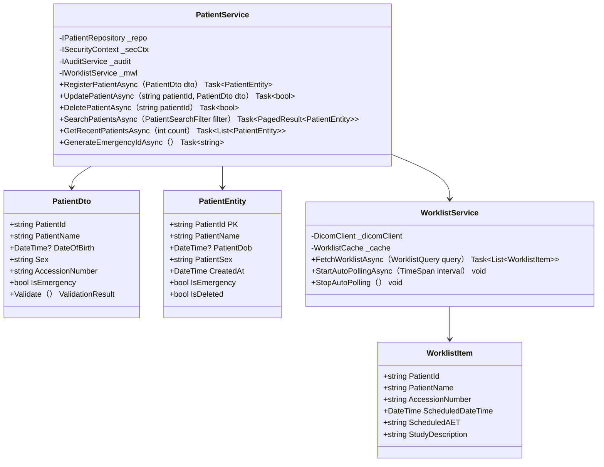

#### 3.1.2 MWL 자동조회 시퀀스 다이어그램

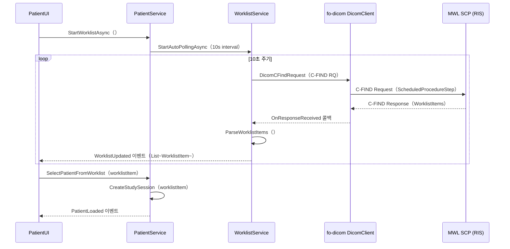

---

### 3.2 SDS-WF-2xx: WorkflowEngine 모듈

**Tier 매핑:** Tier 1 (MR-020 IHE SWF), Tier 2 (MR-002 PACS 전송 30초, MR-010 촬영 워크플로우)
**관련 SWR:** SWR-WF-001–SWR-WF-034

#### 3.2.1 클래스 다이어그램


#### 3.2.2 촬영 시퀀스 다이어그램

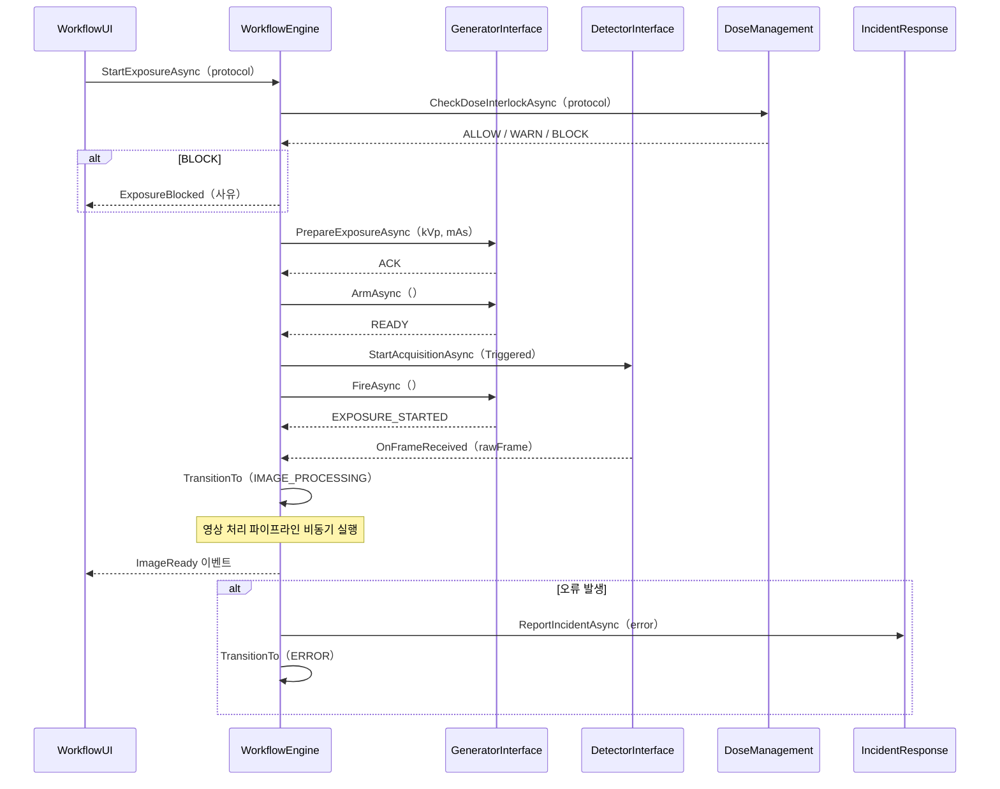

---

### 3.3 SDS-IP-3xx: ImageProcessing 모듈

**Tier 매핑:** Tier 2 (MR-003 W/L, MR-004 Zoom/Pan, MR-005 회전/반전)
**관련 SWR:** SWR-IP-001–SWR-IP-040

#### 3.3.1 클래스 다이어그램

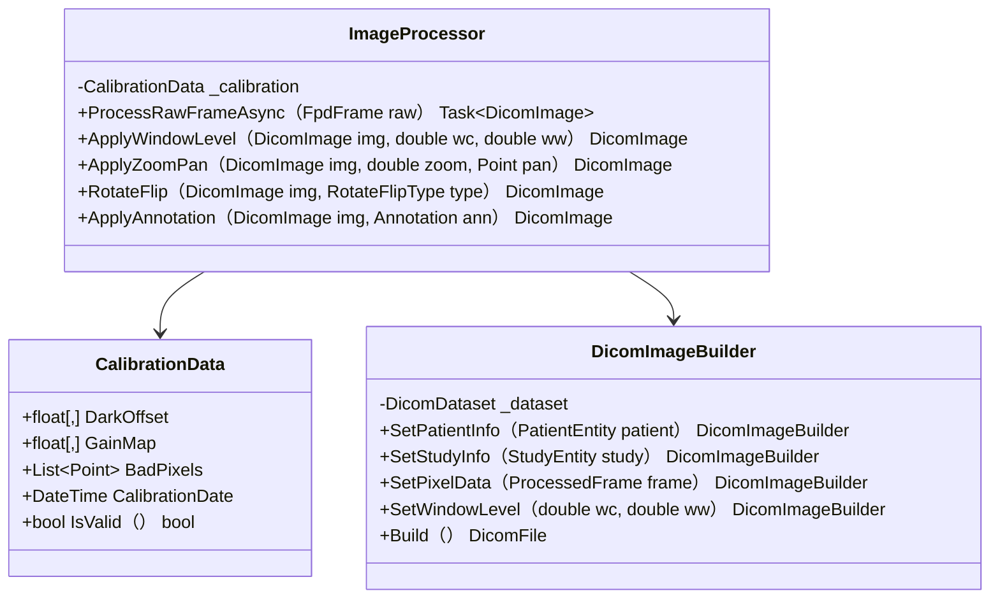

#### 3.3.2 영상 처리 파이프라인

```
FPD SDK OnFrameReceived（14-bit RAW）
    ↓ Step 1: DarkOffset Subtraction
              frame[x,y] = raw[x,y] - offset[x,y]
    ↓ Step 2: Gain Calibration
              frame[x,y] = frame[x,y] / gain[x,y]
    ↓ Step 3: Bad Pixel Interpolation
              foreach bp in BadPixels: bilinear interpolation
    ↓ Step 4: Noise Reduction
              Gaussian filter σ=0.8 (configurable)
    ↓ Step 5: Edge Enhancement
              Unsharp Masking (configurable strength)
    ↓ Step 6: Window/Level Auto-calculation
              Auto W/L based on histogram percentile （1%–99%）
    ↓ Step 7: 16-bit → 8-bit Mapping
              linear mapping
    ↓ Step 8: DICOM Dataset 생성
              fo-dicom DicomFile (SOPClassUID=XRayDRStorage)
    ↓ Step 9: WPF WriteableBitmap 렌더링
```

---

### 3.4 SDS-DM-4xx: DoseManagement 모듈

**Tier 매핑:** Tier 2 (MR-007 DAP, MR-008 DRL 알림)
**관련 SWR:** SWR-DM-001–SWR-DM-025

#### 3.4.1 선량 인터락 로직

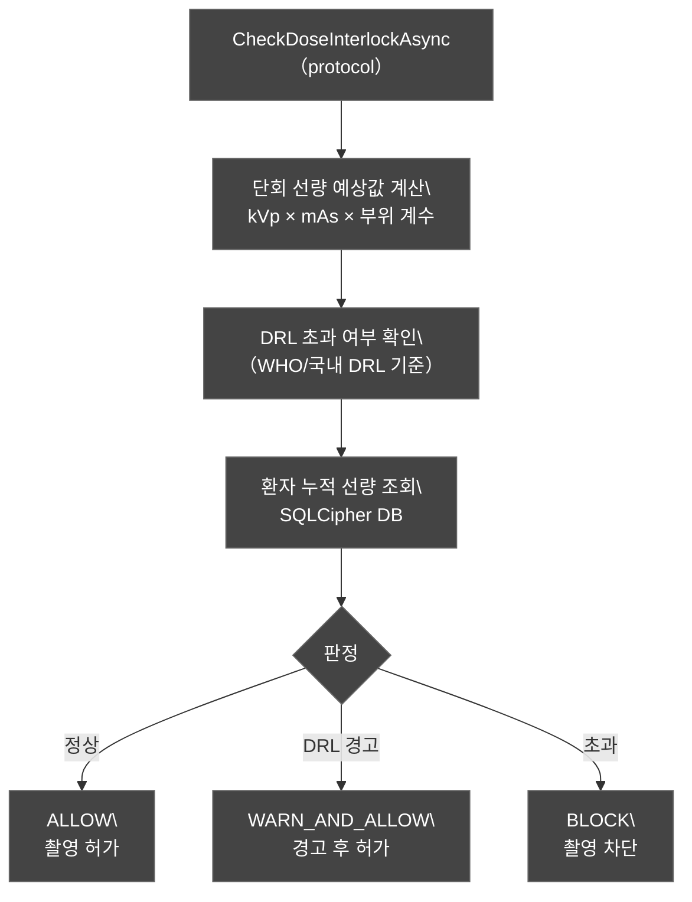

---

### 3.5 SDS-DC-5xx: DICOMCommunication 모듈

**Tier 매핑:** Tier 1 (MR-019 DICOM 3.0, MR-054 DICOM CS), Tier 2 (MR-001 MWL, MR-002 PACS 전송)
**관련 SWR:** SWR-DC-001–SWR-DC-035

#### 3.5.1 클래스 다이어그램 (fo-dicom 5.x)


#### 3.5.2 C-STORE SCU 시퀀스 (fo-dicom 5.x)

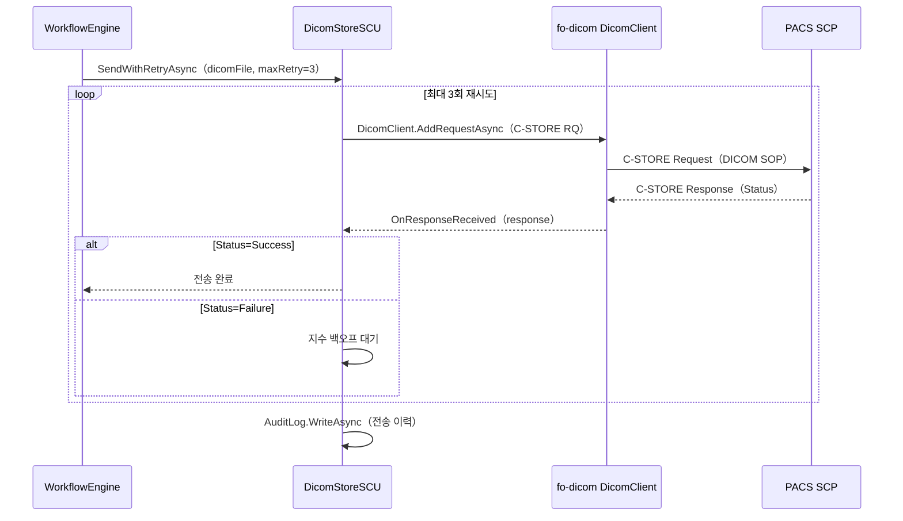

#### 3.5.3 DICOM Print SCU 상세 설계

Print SCU는 feel-DRCS와의 기능 동등성 확보를 위해 Phase 1에 포함된다.

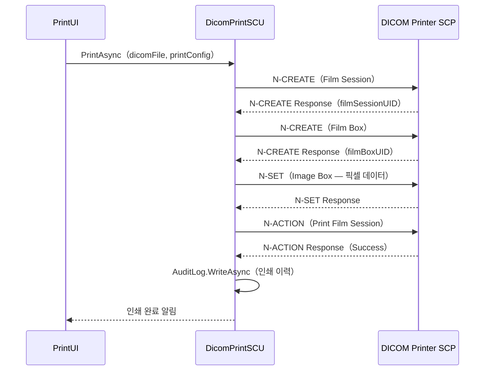

---

### 3.6 SDS-SA-6xx: SystemAdmin 모듈

**Tier 매핑:** Tier 1 (MR-039 SW 업데이트), Tier 2 (MR-006 시스템 설정, MR-013 촬영 프로토콜)
**관련 SWR:** SWR-SA-001–SWR-SA-077

#### 3.6.1 클래스 다이어그램

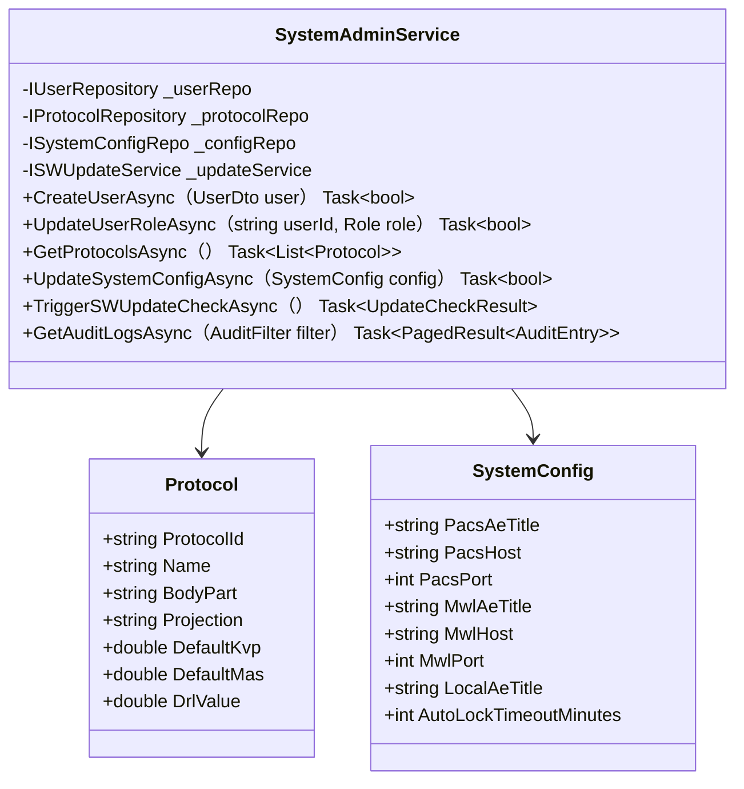

---

### 3.7 SDS-CS-7xx: SecurityModule 모듈

**Tier 매핑:** Tier 1 (MR-033 RBAC, MR-034 PHI 암호화, MR-035 감사 로그, MR-036 SBOM, MR-037 인시던트 대응, MR-039 SW 업데이트, MR-050 STRIDE 위협 모델링)
**관련 SWR:** SWR-CS-001–SWR-CS-087

#### 3.7.1 클래스 다이어그램

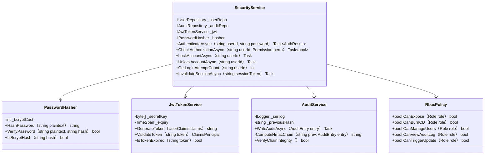

#### 3.7.2 RBAC 역할 및 권한 매트릭스

| 권한 | Radiographer | Radiologist | Admin | Service |
|------|:---:|:---:|:---:|:---:|
| 환자 조회/등록 | ✅ | ✅ | ✅ | — |
| 촬영 수행 | ✅ | ✅ | — | — |
| 영상 판독 | — | ✅ | — | — |
| CD/DVD 굽기 | — | ✅ | ✅ | — |
| 시스템 설정 | — | — | ✅ | ✅ |
| 사용자 관리 | — | — | ✅ | — |
| 감사 로그 조회 | — | — | ✅ | ✅ |
| SW 업데이트 실행 | — | — | ✅ | ✅ |
| 촬영 프로토콜 편집 | — | — | ✅ | ✅ |

#### 3.7.3 인증 흐름 시퀀스

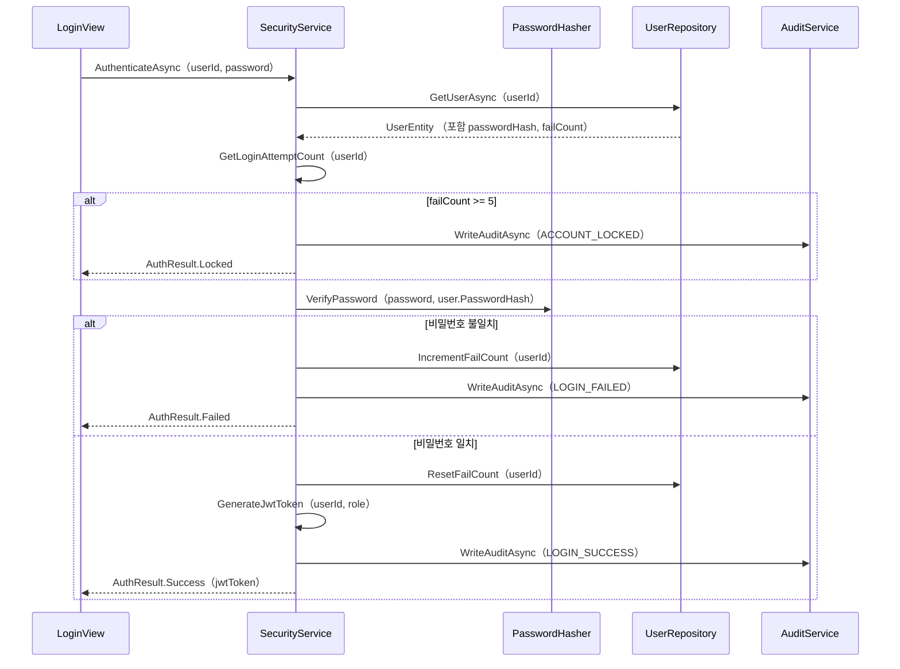

#### 3.7.4 감사 로그 해시체인 설계

```
감사 로그 레코드 구조:
  {
    "Timestamp": "2026-04-03T10:00:00Z",
    "Level": "Information",
    "UserId": "RAD001",
    "Action": "LOGIN_SUCCESS",
    "Details": "환자 ID: P-20260403-001",
    "PreviousHash": "abc123...",
    "CurrentHash": HMAC-SHA256(PreviousHash + Timestamp + UserId + Action + Details, secretKey)
  }

해시 검증:
  foreach record in auditLog:
    computed = HMAC-SHA256(record.PreviousHash + payload, key)
    assert computed == record.CurrentHash  // 위변조 감지
```

---

### 3.8 SDS-UI-8xx: UIFramework 모듈

**Tier 매핑:** Tier 2 (MR-010 촬영 워크플로우, MR-051 IEC 62366 사용성)
**관련 SWR:** SWR-UI-001–SWR-UI-020

**기술 스택:** WPF .NET 8 + MVVM (CommunityToolkit.Mvvm) + MaterialDesignInXaml

**MVVM 구조:**
```
Views/                         ViewModels/
  MainWindow.xaml          ←→   MainWindowViewModel
  PatientListView.xaml     ←→   PatientListViewModel
  WorkflowView.xaml        ←→   WorkflowViewModel
  ImageViewerView.xaml     ←→   ImageViewerViewModel
  DoseDisplayView.xaml     ←→   DoseDisplayViewModel
  SystemAdminView.xaml     ←→   SystemAdminViewModel
  CDDVDBurnView.xaml       ←→   CDDVDBurnViewModel
```

**자동 잠금 타이머:**
- 기본값: 15분 비활동 시 화면 잠금
- 잠금 시: 로그인 화면 표시, 현재 세션 일시 중단
- 중단 금지 상태 (촬영 중)에서는 잠금 연기

---

### 3.9 SDS-DB-9xx: DataPersistence 모듈

**Tier 매핑:** Tier 1 (MR-034 PHI 암호화 — SQLCipher)
**관련 SWR:** SWR-DB-001–SWR-DB-015

#### 3.9.1 데이터베이스 스키마 (주요 테이블)

```sql
-- 환자 테이블 (SQLCipher AES-256 암호화됨)
CREATE TABLE Patients (
    PatientId TEXT PRIMARY KEY,
    PatientName TEXT NOT NULL,
    PatientDob TEXT,
    PatientSex TEXT,
    IsEmergency INTEGER DEFAULT 0,
    IsDeleted INTEGER DEFAULT 0,
    CreatedAt TEXT NOT NULL,
    CreatedBy TEXT NOT NULL
);

-- 사용자 테이블
CREATE TABLE Users (
    UserId TEXT PRIMARY KEY,
    DisplayName TEXT NOT NULL,
    PasswordHash TEXT NOT NULL,  -- bcrypt 비용=12
    Role TEXT NOT NULL,          -- Radiographer/Radiologist/Admin/Service
    FailedLoginCount INTEGER DEFAULT 0,
    IsLocked INTEGER DEFAULT 0,
    LastLoginAt TEXT
);

-- 감사 로그 테이블
CREATE TABLE AuditLogs (
    LogId INTEGER PRIMARY KEY AUTOINCREMENT,
    Timestamp TEXT NOT NULL,
    UserId TEXT NOT NULL,
    Action TEXT NOT NULL,
    Details TEXT,
    PreviousHash TEXT NOT NULL,
    CurrentHash TEXT NOT NULL    -- HMAC-SHA256 해시체인
);

-- SW 업데이트 이력 테이블
CREATE TABLE UpdateHistory (
    UpdateId INTEGER PRIMARY KEY AUTOINCREMENT,
    Timestamp TEXT NOT NULL,
    FromVersion TEXT NOT NULL,
    ToVersion TEXT NOT NULL,
    Status TEXT NOT NULL,        -- SUCCESS/ROLLBACK/FAILED
    InstalledBy TEXT NOT NULL,
    PackageHash TEXT NOT NULL
);
```

---

### 3.10 SDS-CD-10xx: CDDVDBurning 모듈

**Tier 매핑:** Tier 2 (MR-072 — CD/DVD Burning with DICOM Viewer)
**관련 SWR:** SWR-WF-032–SWR-WF-034

#### 3.10.1 클래스 다이어그램

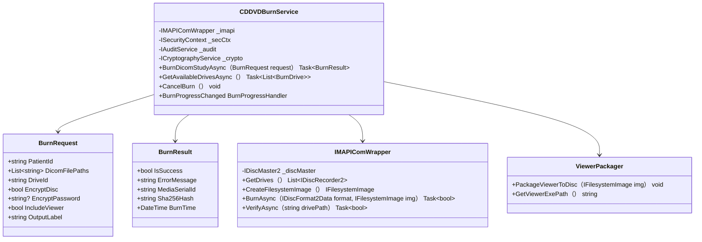

#### 3.10.2 CD 굽기 시퀀스

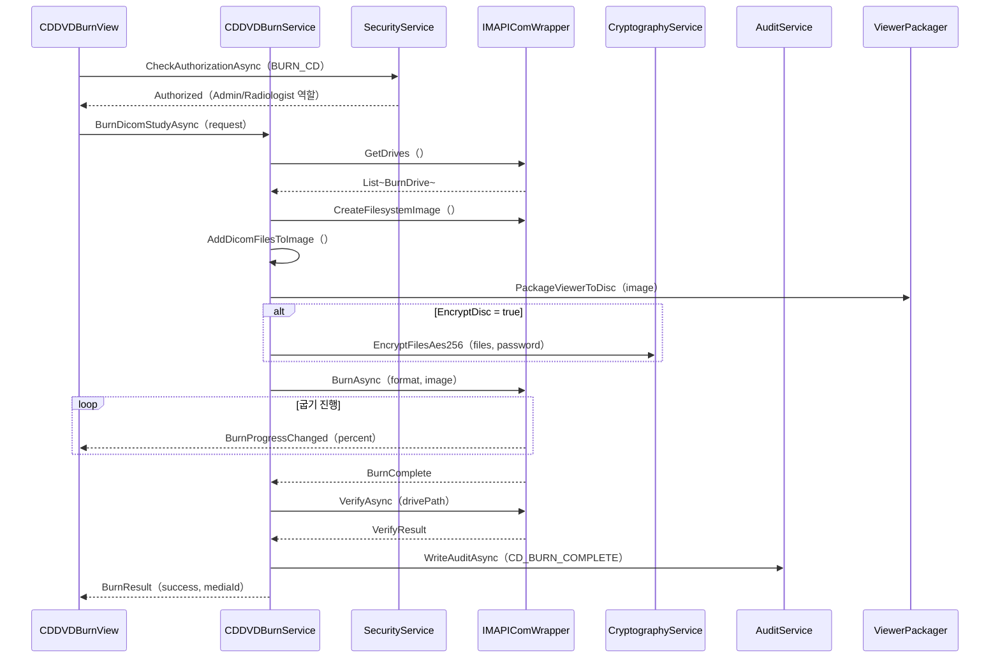

---

### 3.11 SDS-INC-11xx: IncidentResponse 모듈

**Tier 매핑:** Tier 1 (MR-037 — CVD + 인시던트 대응)
**규제 근거:** IEC 81001-5-1:2021 §8.11
**관련 SWR:** SWR-CS-086–SWR-CS-087

#### 3.11.1 클래스 다이어그램


#### 3.11.2 인시던트 처리 시퀀스

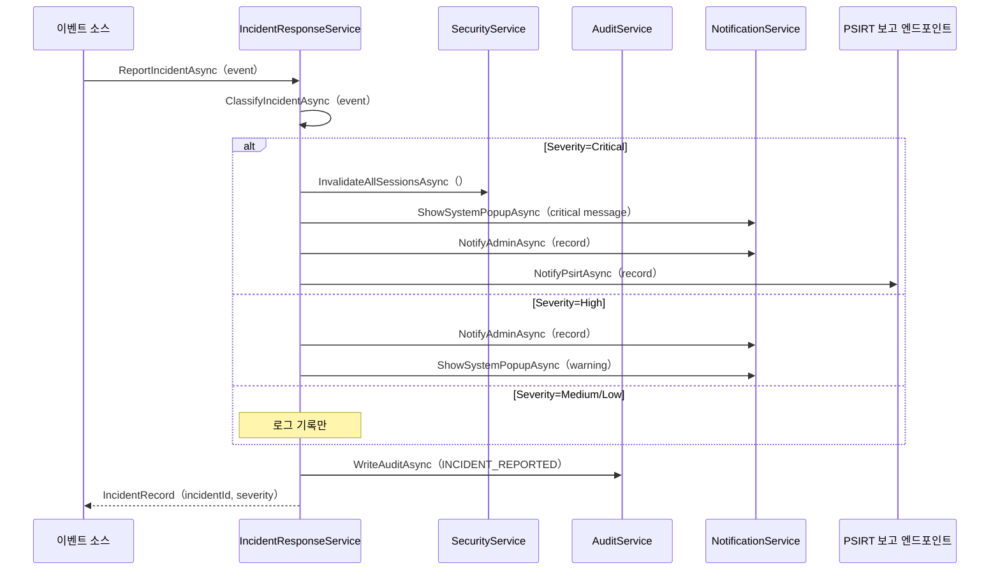

---

### 3.12 SDS-UPD-12xx: SWUpdate 모듈

**Tier 매핑:** Tier 1 (MR-039 — SW 무결성 검증 + 업데이트 메커니즘)
**규제 근거:** FDA Section 524B §3524(b)(2)
**관련 SWR:** SWR-SA-076–SWR-SA-077, SWR-CS-084–SWR-CS-085

#### 3.12.1 클래스 다이어그램


#### 3.12.2 업데이트/롤백 시퀀스

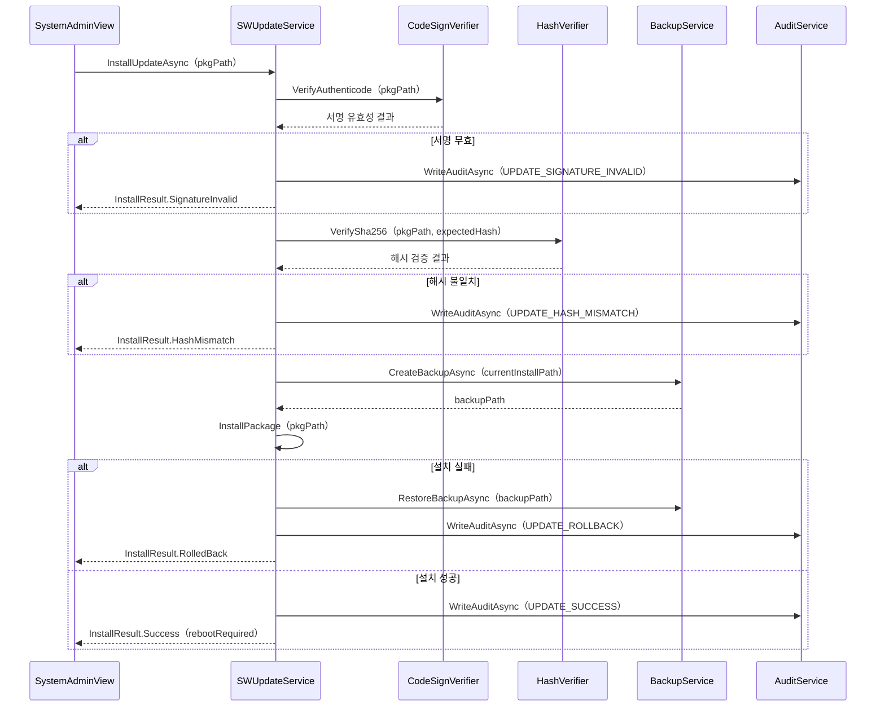

---

## 4. 데이터 구조 상세

### 4.1 핵심 데이터 모델

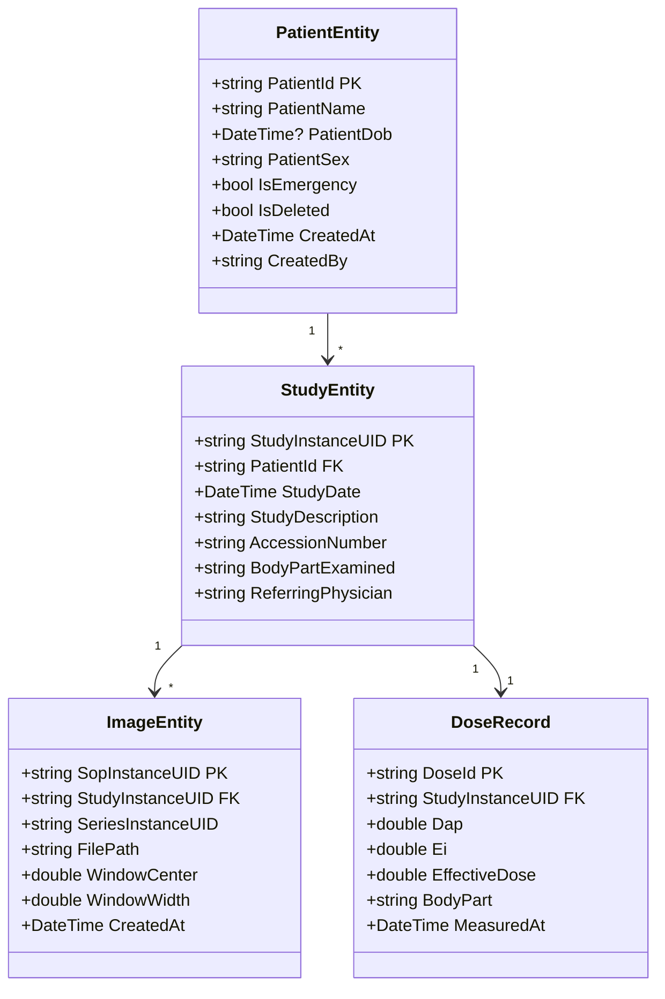

---

## 5. 알고리즘 상세

### 5.1 bcrypt 패스워드 해싱

```
입력: 평문 비밀번호 (최대 72바이트)
비용 인자: 12 (약 300ms 소요 — 브루트포스 저항)
출력: $2a$12$<salt><hash> (60자)

검증:
  BCrypt.Verify（plaintext, storedHash）
  → 시간 일정 비교 (timing-safe comparison)
```

### 5.2 HMAC-SHA256 감사 로그 해시체인

```
초기화:
  previousHash = HMAC-SHA256（"GENESIS", secretKey）

각 레코드:
  payload = Timestamp + "|" + UserId + "|" + Action + "|" + Details
  currentHash = HMAC-SHA256（previousHash + payload, secretKey）
  record.PreviousHash = previousHash
  record.CurrentHash = currentHash
  previousHash = currentHash

검증:
  foreach record in order:
    expected = HMAC-SHA256（record.PreviousHash + payload, key）
    if expected != record.CurrentHash: TAMPERED
```

### 5.3 Authenticode 서명 검증 (SW 업데이트)

```csharp
// .NET 8 X509Certificate2 + AuthenticodeSignatureInformation
var cert = new X509Certificate2（filePath）;
var chain = new X509Chain（）;
chain.ChainPolicy.RevocationMode = X509RevocationMode.Online;
bool valid = chain.Build（cert）;
// 발급자 검증: 제조사 코드 서명 인증서 Thumbprint 확인
bool trustedPublisher = cert.Thumbprint == knownPublisherThumbprint;
```

---

## 6. SAD → SDS 추적성

| SAD 모듈 | SDS 섹션 | 주요 변경 (v2.0) |
|---|---|---|
| SAD-PM-100 | §3.1 | MWL 자동조회 시퀀스 추가 |
| SAD-WF-200 | §3.2 | FPD SDK 인터페이스, INC 연계 추가 |
| SAD-IP-300 | §3.3 | FPD SDK 파이프라인 상세화 |
| SAD-DM-400 | §3.4 | 선량 인터락 로직 다이어그램 |
| SAD-DC-500 | §3.5 | fo-dicom 5.x C-STORE/MWL/Print SCU 상세화 |
| SAD-SA-600 | §3.6 | SWUpdate 연계 추가 |
| SAD-CS-700 | §3.7 | bcrypt+5회잠금, SQLCipher, Serilog 해시체인 상세화 |
| SAD-UI-800 | §3.8 | WPF MVVM, 자동잠금 타이머 |
| SAD-DB-900 | §3.9 | SQLCipher 스키마, UpdateHistory 테이블 추가 |
| SAD-CD-1000 | §3.10 | **신규** — IMAPI2 기반 CD 굽기 상세 설계 |
| SAD-INC-1100 | §3.11 | **신규** — IEC 81001-5-1 인시던트 대응 상세 설계 |
| SAD-UPD-1200 | §3.12 | **신규** — Authenticode + 롤백 SW 업데이트 상세 설계 |

---

## 부록 A. 약어 및 용어 정의

| 약어 | 풀 네임 |
|---|---|
| SDS | Software Design Specification (소프트웨어 상세 설계 명세서) |
| SAD | Software Architecture Design (소프트웨어 아키텍처 설계) |
| SWR | Software Requirement (소프트웨어 요구사항) |
| MR | Market Requirement (시장 요구사항) |
| Tier 1 | 없으면 인허가 불가 |
| Tier 2 | 없으면 팔 수 없다 |
| RBAC | Role-Based Access Control |
| PHI | Protected Health Information |
| bcrypt | 패스워드 해싱 알고리즘 (비용 12) |
| SQLCipher | AES-256 암호화 SQLite 확장 |
| Serilog | .NET 구조화 로깅 라이브러리 |
| fo-dicom | .NET DICOM 라이브러리 (v5.x) |
| IMAPI2 | Image Mastering API v2 (Windows 내장 CD/DVD 굽기 API) |
| IEC 81001-5-1 | Health SW Security — 인시던트 대응 |
| FDA 524B | Cybersecurity in Medical Devices |
| Authenticode | Microsoft 코드 서명 표준 |
| HMAC | Hash-based Message Authentication Code |
| CVE | Common Vulnerabilities and Exposures |
| PSIRT | Product Security Incident Response Team |
| SBOM | Software Bill of Materials |
