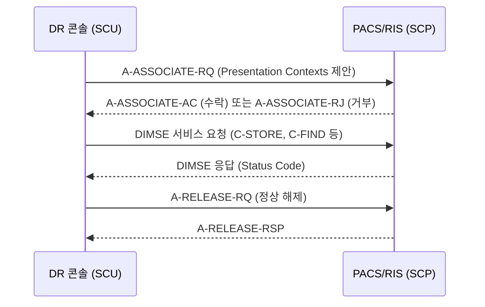
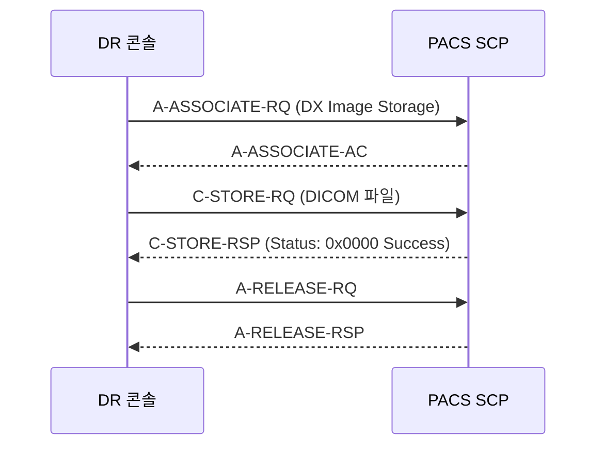
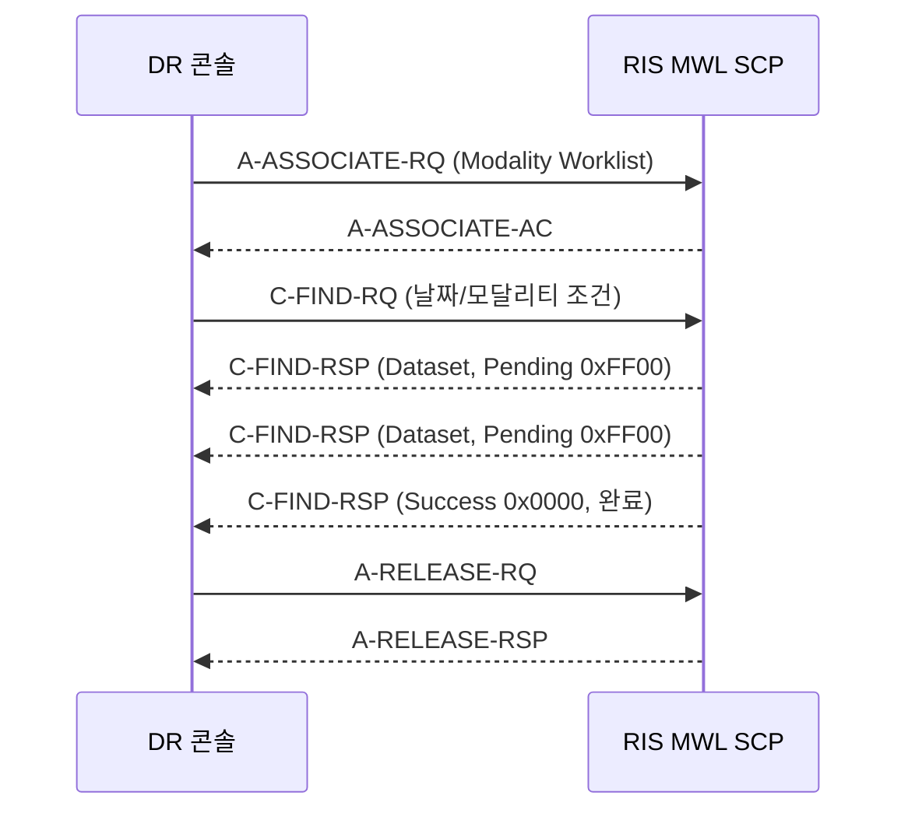
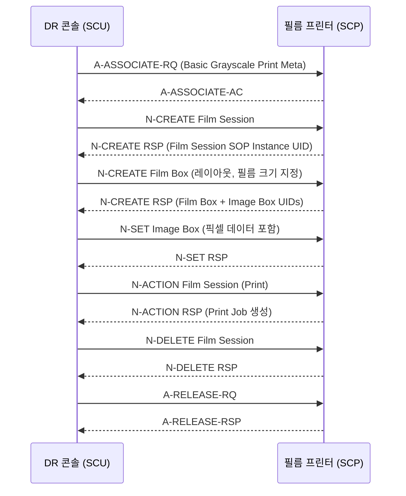
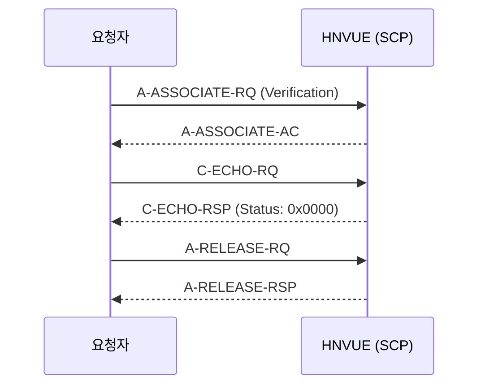
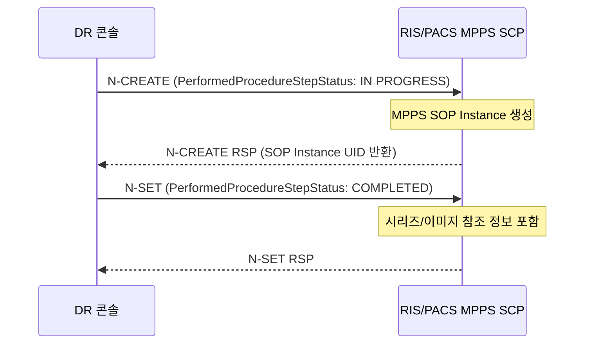
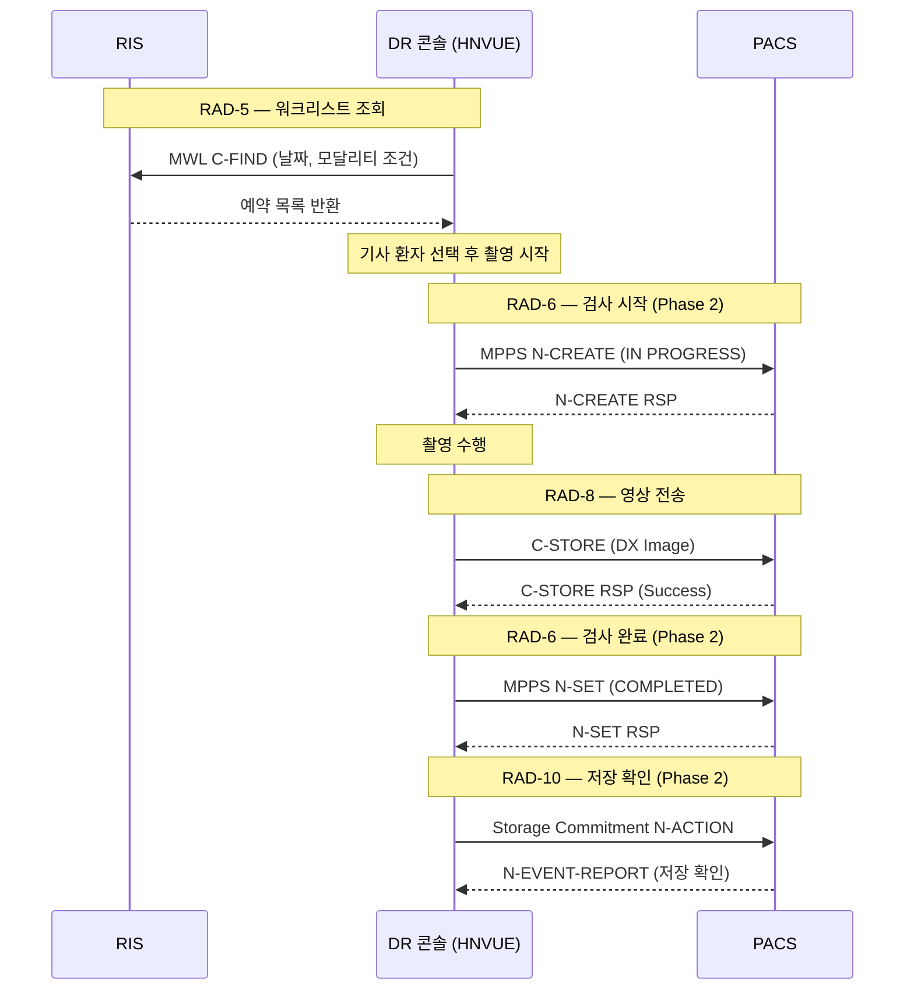

# DICOM-001 구현 가이드 v1.0

> **문서 ID:** DICOM-001  
> **버전:** 1.0  
> **최종 수정:** 2026-04-04  
> **대상 독자:** DR 콘솔 소프트웨어 개발팀  
> **관련 표준:** DICOM PS3.x (NEMA), IHE Radiology TF (SWF), fo-dicom 5.x

---

## 목차

1. [개요 및 목적](#1-개요-및-목적)
2. [DICOM 기초](#2-dicom-기초)
   - 2.1 [SOP Class 및 SOP Instance](#21-sop-class-및-sop-instance)
   - 2.2 [Transfer Syntax](#22-transfer-syntax)
   - 2.3 [Association 협상 모델](#23-association-협상-모델)
3. [Phase 1 필수 서비스 상세](#3-phase-1-필수-서비스-상세)
   - 3.1 [C-STORE SCU (영상 전송)](#31-c-store-scu-영상-전송)
   - 3.2 [MWL SCU (워크리스트 조회)](#32-mwl-scu-워크리스트-조회)
   - 3.3 [Print SCU (필름 출력)](#33-print-scu-필름-출력)
   - 3.4 [Verification SCU/SCP (C-ECHO)](#34-verification-scuscp-c-echo)
4. [fo-dicom 5.x 구현 가이드](#4-fo-dicom-5x-구현-가이드)
   - 4.1 [DicomClient 생성 및 Association](#41-dicomclient-생성-및-association)
   - 4.2 [C-STORE 구현 코드](#42-c-store-구현-코드)
   - 4.3 [MWL C-FIND 구현 코드](#43-mwl-c-find-구현-코드)
   - 4.4 [Print SCU 구현 코드](#44-print-scu-구현-코드)
   - 4.5 [TLS 설정](#45-tls-설정)
   - 4.6 [에러 처리 및 재시도](#46-에러-처리-및-재시도)
5. [Phase 2 서비스 개요](#5-phase-2-서비스-개요)
6. [IHE SWF 프로파일 적용](#6-ihe-swf-프로파일-적용)
7. [DICOM Conformance Statement 작성 가이드](#7-dicom-conformance-statement-작성-가이드)
8. [DICOMDIR 및 CD Burning](#8-dicomdir-및-cd-burning)
9. [Transfer Syntax 전략](#9-transfer-syntax-전략)
10. [참고 자료](#10-참고-자료)

---

## 1. 개요 및 목적

본 문서는 **DR 콘솔 소프트웨어 〈HNVUE〉** 의 DICOM 통신 기능을 구현하기 위한 기술 가이드이다. 디지털 방사선 촬영〈DR〉 장비를 PACS, RIS, 필름 프린터 등 병원 정보 시스템과 연동하는 데 필요한 모든 DICOM 서비스의 사양, 시퀀스, 구현 코드를 포함한다.

**구현 범위**

| Phase | 서비스 | 목적 |
|-------|--------|------|
| Phase 1 | C-STORE SCU | 촬영 영상을 PACS로 전송 |
| Phase 1 | MWL SCU | RIS 워크리스트 조회 |
| Phase 1 | Print SCU | 필름 프린터 출력 |
| Phase 1 | Verification SCU/SCP | 접속 확인〈C-ECHO〉 |
| Phase 2 | MPPS SCU | 검사 시작/완료 통보 |
| Phase 2 | Storage Commitment SCU | PACS 저장 확인 |
| Phase 2 | Q/R SCU | 영상 조회 및 검색 |

**라이브러리:** fo-dicom 5.x (FellowOakDicom, MIT 라이선스)  
**AE Title:** `HNVUE` (Calling AE), PACS/RIS 측 AE Title은 설정 가능

---

## 2. DICOM 기초

### 2.1 SOP Class 및 SOP Instance

**SOP Class〈Service-Object Pair Class〉** 는 DICOM에서 특정 정보 객체〈IOD〉와 서비스의 조합을 정의한다. 각 SOP Class는 고유한 UID로 식별된다.

**DR 콘솔 필수 SOP Class 목록**

| SOP Class | UID | 역할 | Phase |
|-----------|-----|------|-------|
| Digital X-Ray Image Storage〈DX〉 | 1.2.840.10008.5.1.4.1.1.1.1 | SCU | Phase 1 |
| Modality Worklist〈MWL〉 | 1.2.840.10008.5.1.4.31 | SCU | Phase 1 |
| Basic Grayscale Print Management Meta | 1.2.840.10008.5.1.1.9 | SCU | Phase 1 |
| Verification〈C-ECHO〉 | 1.2.840.10008.1.1 | SCU/SCP | Phase 1 |
| Modality Performed Procedure Step〈MPPS〉 | 1.2.840.10008.3.1.2.3.3 | SCU | Phase 2 |
| Storage Commitment Push Model | 1.2.840.10008.1.20.1 | SCU | Phase 2 |
| Patient Root Q/R — C-FIND | 1.2.840.10008.5.1.4.1.2.1.1 | SCU | Phase 2 |
| Patient Root Q/R — C-MOVE | 1.2.840.10008.5.1.4.1.2.1.2 | SCU | Phase 2 |
| Study Root Q/R — C-FIND | 1.2.840.10008.5.1.4.1.2.2.1 | SCU | Phase 2 |

> **참고:** Basic Grayscale Print Management Meta SOP Class는 Film Session, Film Box, Image Box, Basic Grayscale Image Box 등 다수의 기본 SOP Class를 메타로 묶은 것이다. 하나의 Association으로 전체 출력 플로를 처리할 수 있다.

### 2.2 Transfer Syntax

Transfer Syntax는 DICOM 데이터의 인코딩 방식을 정의한다. Association 협상 시 SCU가 제안〈Proposed〉하고 SCP가 수락〈Accepted〉한다.

| UID | 이름 | 용도 |
|-----|------|------|
| 1.2.840.10008.1.2 | Implicit VR Little Endian | 기본값 — 모든 SCP가 지원해야 함 |
| 1.2.840.10008.1.2.1 | Explicit VR Little Endian | 권장 — VR 명시로 파싱 오류 감소 |
| 1.2.840.10008.1.2.4.70 | JPEG Lossless〈Process 14 SV1〉 | Lossless 압축 — 진단 영상에 적합 |
| 1.2.840.10008.1.2.4.50 | JPEG Baseline〈Process 1〉 | Lossy 압축 — 미리보기/전송 속도 최적화 |

### 2.3 Association 협상 모델

DICOM 통신은 Association을 설정하고 해제하는 과정으로 이루어진다.



**Presentation Context 구성 요소**

- **Abstract Syntax:** SOP Class UID (서비스 종류)
- **Transfer Syntax List:** 지원하는 인코딩 방식 목록 (우선순위 순)
- **Context ID:** 1~255 홀수값, Association 내에서 고유

Association 하나당 최대 128개의 Presentation Context를 제안할 수 있다. SCP는 각각을 Accept/Reject할 수 있으며, Accept된 Context만 실제 통신에 사용된다.

---

## 3. Phase 1 필수 서비스 상세

### 3.1 C-STORE SCU (영상 전송)

DR 촬영 완료 후 PACS로 DICOM 영상을 전송한다. 전송 대상은 **Digital X-Ray Image Storage SOP Class** 인스턴스이다.

**전송 시퀀스**



**주요 응답 Status Code**

| Status | 값 | 설명 |
|--------|----|------|
| Success | 0x0000 | 저장 성공 |
| Warning | 0xB000 | 속성 누락이나 데이터셋 불일치가 있으나 저장됨 |
| Failure | 0xA7xx | 저장 공간 부족 |
| Failure | 0xA9xx | SOP Class 불지원 |

**필수 DICOM Tag (DX Image)**

| Tag | 설명 | 타입 |
|-----|------|------|
| (0008,0016) SOPClassUID | 1.2.840.10008.5.1.4.1.1.1.1 | 1 |
| (0008,0018) SOPInstanceUID | 고유 인스턴스 UID | 1 |
| (0008,0060) Modality | DX | 1 |
| (0010,0010) PatientName | 환자명 | 2 |
| (0010,0020) PatientID | 환자 ID | 2 |
| (0020,000D) StudyInstanceUID | 스터디 UID | 1 |
| (0020,000E) SeriesInstanceUID | 시리즈 UID | 1 |
| (7FE0,0010) PixelData | 픽셀 데이터 | 1 |

### 3.2 MWL SCU (워크리스트 조회)

RIS로부터 당일 예약 검사 목록을 조회한다. **C-FIND 서비스** 를 사용하며 SOP Class는 Modality Worklist이다.

**조회 시퀀스**



**MWL C-FIND 핵심 Query Key**

| Tag | 설명 | Match 타입 |
|-----|------|------------|
| (0040,0100) ScheduledProcedureStepSequence | 예약 절차 시퀀스 | Sequence |
| ⊃ (0008,0060) Modality | 모달리티 필터 〈DX〉 | Single Value |
| ⊃ (0040,0002) ScheduledProcedureStepStartDate | 예약 날짜 | Range |
| (0010,0010) PatientName | 환자명 조건 | Wildcard |
| (0010,0020) PatientID | 환자 ID | Single Value |
| (0008,0050) AccessionNumber | 검사 번호 | Single Value |

### 3.3 Print SCU (필름 출력)

필름 프린터〈Print SCP〉에 접속하여 아래 순서로 DIMSE-N 서비스를 수행한다.



**Film Session 주요 속성**

| Tag | 설명 | 예시값 |
|-----|------|--------|
| (2000,0010) NumberOfCopies | 출력 매수 | 1 |
| (2000,0020) PrintPriority | 우선순위 | MED |
| (2000,0030) MediumType | 미디어 타입 | BLUE FILM |
| (2000,0040) FilmDestination | 필름 목적지 | MAGAZINE |

**Film Box 주요 속성**

| Tag | 설명 | 예시값 |
|-----|------|--------|
| (2010,0010) ImageDisplayFormat | 레이아웃 | STANDARD\1,1 |
| (2010,0050) FilmSizeID | 필름 크기 | 14INX17IN |
| (2010,0060) MagnificationType | 배율 방식 | REPLICATE |
| (2010,0100) BorderDensity | 테두리 밀도 | BLACK |

### 3.4 Verification SCU/SCP (C-ECHO)

네트워크 접속 상태 및 DICOM Association 가능 여부를 확인한다. **HNVUE** 는 SCU 및 SCP 양 역할을 모두 지원해야 한다.



---

## 4. fo-dicom 5.x 구현 가이드

fo-dicom 5.x는 .NET 6 이상을 기반으로 하며, 모든 IO 작업이 비동기(async/await)로 설계되었다. 의존성 주입〈DI〉을 통해 `IDicomClientFactory`를 주입받거나, DI 없는 환경에서는 `DicomClientFactory.Create()`를 정적으로 호출한다.

> **참고:** fo-dicom 4.x에서 5.x로 업그레이드 시 `DicomClient`를 직접 생성하는 코드를 `DicomClientFactory.Create()`로 모두 교체해야 한다. ([fo-dicom 업그레이드 가이드](https://fo-dicom.github.io/stable/v5/usage/upgrade4to5.html))

### 4.1 DicomClient 생성 및 Association

**기본 클라이언트 생성**

```csharp
// DI 미사용 환경 — DicomClientFactory.Create() 정적 메서드
var client = DicomClientFactory.Create(
    host: "192.168.1.100",
    port: 104,
    useTls: false,
    callingAe: "HNVUE",
    calledAe: "PACS-SCP"
);

// 클라이언트 옵션 설정
client.ClientOptions.AssociationRequestTimeoutInMs = 5000;
client.ClientOptions.AssociationLingerTimeoutInMs = 1000;
client.ServiceOptions.MaxPduLength = 16384;
```

**DI 환경 (ASP.NET Core, Hosted Service 등)**

```csharp
// Program.cs
services.AddFellowOakDicom();

// 서비스 클래스
public class DicomService
{
    private readonly IDicomClientFactory _clientFactory;

    public DicomService(IDicomClientFactory clientFactory)
    {
        _clientFactory = clientFactory;
    }

    public IDicomClient CreateClient(string host, int port, string calledAe)
        => _clientFactory.Create(host, port, false, "HNVUE", calledAe);
}
```

**Association 이벤트 처리**

```csharp
client.AssociationAccepted += (sender, e) =>
{
    _logger.LogInformation("Association 수락: {CalledAe}", e.Association.CalledAE);
};

client.AssociationRejected += (sender, e) =>
{
    _logger.LogWarning("Association 거부: {Reason}", e.Reason);
};

client.AssociationReleased += (sender, e) =>
{
    _logger.LogInformation("Association 해제 완료");
};
```

### 4.2 C-STORE 구현 코드

**단일 파일 전송**

```csharp
public async Task StoreDicomFileAsync(
    string pacsHost, int pacsPort, string pacsAeTitle, string filePath,
    CancellationToken ct = default)
{
    var client = DicomClientFactory.Create(pacsHost, pacsPort, false, "HNVUE", pacsAeTitle);

    var request = new DicomCStoreRequest(filePath);

    request.OnResponseReceived += (req, rsp) =>
    {
        if (rsp.Status.State == DicomState.Success)
            _logger.LogInformation("C-STORE 성공: {SopInstanceUid}", req.SOPInstanceUID);
        else
            _logger.LogError("C-STORE 실패: {Status}", rsp.Status);
    };

    await client.AddRequestAsync(request);
    await client.SendAsync(ct);
}
```

**복수 파일 배치 전송 (단일 Association)**

```csharp
public async Task StoreBatchAsync(
    string pacsHost, int pacsPort, string pacsAeTitle,
    IEnumerable<string> filePaths, CancellationToken ct = default)
{
    var client = DicomClientFactory.Create(pacsHost, pacsPort, false, "HNVUE", pacsAeTitle);
    var results = new ConcurrentBag<(string File, DicomStatus Status)>();

    foreach (var path in filePaths)
    {
        var request = new DicomCStoreRequest(path);
        var capturedPath = path;

        request.OnResponseReceived += (req, rsp) =>
            results.Add((capturedPath, rsp.Status));

        await client.AddRequestAsync(request);
    }

    await client.SendAsync(ct);

    // 실패 항목 로그
    foreach (var (file, status) in results.Where(r => r.Status.State != DicomState.Success))
        _logger.LogWarning("전송 실패: {File} — {Status}", file, status);
}
```

**DicomDataset으로 직접 생성하여 전송**

```csharp
public async Task StoreDatasetAsync(DicomDataset dataset, string pacsHost, int pacsPort, string pacsAe)
{
    var client = DicomClientFactory.Create(pacsHost, pacsPort, false, "HNVUE", pacsAe);
    var file = new DicomFile(dataset);
    var request = new DicomCStoreRequest(file);

    await client.AddRequestAsync(request);
    await client.SendAsync();
}
```

### 4.3 MWL C-FIND 구현 코드

**당일 DR 워크리스트 조회**

```csharp
public async Task<List<WorklistItem>> QueryWorklistAsync(
    string mwlHost, int mwlPort, string mwlAeTitle,
    DateTime? date = null, CancellationToken ct = default)
{
    var targetDate = date ?? DateTime.Today;
    var worklistItems = new List<WorklistItem>();

    // 날짜 범위: 당일 00:00 ~ 익일 00:00
    var dateRange = new DicomDateRange(targetDate, targetDate.AddDays(1));

    var cfind = DicomCFindRequest.CreateWorklistQuery(scheduledDateTime: dateRange);

    // 필터 조건: DR 모달리티만 조회
    cfind.Dataset.AddOrUpdate(DicomTag.ScheduledProcedureStepSequence,
        new DicomDataset
        {
            { DicomTag.Modality, "DX" },
            { DicomTag.ScheduledProcedureStepStartDate, dateRange },
            { DicomTag.ScheduledProcedureStepStartTime, new DicomTimeRange(
                new TimeSpan(0, 0, 0), new TimeSpan(23, 59, 59)) },
            { DicomTag.ScheduledProcedureStepDescription, "" },
            { DicomTag.ScheduledProcedureStepID, "" },
        });

    // 반환받을 속성 선언 (빈 문자열 = 값 요청)
    cfind.Dataset.AddOrUpdate(DicomTag.PatientName, "");
    cfind.Dataset.AddOrUpdate(DicomTag.PatientID, "");
    cfind.Dataset.AddOrUpdate(DicomTag.PatientBirthDate, "");
    cfind.Dataset.AddOrUpdate(DicomTag.PatientSex, "");
    cfind.Dataset.AddOrUpdate(DicomTag.AccessionNumber, "");
    cfind.Dataset.AddOrUpdate(DicomTag.StudyInstanceUID, "");
    cfind.Dataset.AddOrUpdate(DicomTag.RequestedProcedureDescription, "");

    cfind.OnResponseReceived = (req, rsp) =>
    {
        if (rsp.HasDataset)
        {
            var item = new WorklistItem
            {
                PatientName    = rsp.Dataset.GetSingleValueOrDefault(DicomTag.PatientName, ""),
                PatientId      = rsp.Dataset.GetSingleValueOrDefault(DicomTag.PatientID, ""),
                AccessionNumber = rsp.Dataset.GetSingleValueOrDefault(DicomTag.AccessionNumber, ""),
                StudyInstanceUid = rsp.Dataset.GetSingleValueOrDefault(DicomTag.StudyInstanceUID, ""),
                ProcedureDesc  = rsp.Dataset.GetSingleValueOrDefault(DicomTag.RequestedProcedureDescription, ""),
            };

            // 예약 절차 시퀀스에서 추가 데이터 추출
            if (rsp.Dataset.TryGetSequence(DicomTag.ScheduledProcedureStepSequence, out var seq)
                && seq.Items.Count > 0)
            {
                item.Modality     = seq.Items[0].GetSingleValueOrDefault(DicomTag.Modality, "");
                item.ScheduledDate = seq.Items[0].GetSingleValueOrDefault<DateTime>(
                    DicomTag.ScheduledProcedureStepStartDate, DateTime.MinValue);
                item.StepId       = seq.Items[0].GetSingleValueOrDefault(DicomTag.ScheduledProcedureStepID, "");
            }

            worklistItems.Add(item);
        }
    };

    var client = DicomClientFactory.Create(mwlHost, mwlPort, false, "HNVUE", mwlAeTitle);
    await client.AddRequestAsync(cfind);
    await client.SendAsync(ct);

    return worklistItems;
}

public record WorklistItem
{
    public string PatientName { get; init; } = "";
    public string PatientId { get; init; } = "";
    public string AccessionNumber { get; init; } = "";
    public string StudyInstanceUid { get; init; } = "";
    public string ProcedureDesc { get; init; } = "";
    public string Modality { get; init; } = "";
    public DateTime ScheduledDate { get; init; }
    public string StepId { get; init; } = "";
}
```

### 4.4 Print SCU 구현 코드

Print SCU는 DIMSE-N 서비스〈N-CREATE, N-SET, N-ACTION, N-DELETE〉를 순차적으로 사용한다. fo-dicom은 `DicomNCreateRequest`, `DicomNSetRequest`, `DicomNActionRequest`를 통해 이를 구현한다.

**Film Session → Film Box → Image Box → Print 순서 구현**

```csharp
public async Task PrintDicomImageAsync(
    string printerHost, int printerPort, string printerAeTitle,
    DicomDataset pixelDataset, PrintOptions options, CancellationToken ct = default)
{
    var client = DicomClientFactory.Create(printerHost, printerPort, false, "HNVUE", printerAeTitle);

    string filmSessionUid  = null;
    string filmBoxUid      = null;
    string imageBoxUid     = null;

    // ── 1. Film Session N-CREATE ──────────────────────────────────────
    var filmSessionDataset = new DicomDataset
    {
        { DicomTag.NumberOfCopies,   options.NumberOfCopies.ToString() },
        { DicomTag.PrintPriority,    options.PrintPriority },  // HIGH / MED / LOW
        { DicomTag.MediumType,       options.MediumType },     // BLUE FILM / CLEAR FILM / PAPER
        { DicomTag.FilmDestination,  options.FilmDestination }, // MAGAZINE / PROCESSOR
    };

    var createFilmSession = new DicomNCreateRequest(
        DicomUID.BasicFilmSession,
        DicomUID.Generate());

    createFilmSession.Dataset = filmSessionDataset;
    createFilmSession.OnResponseReceived = (req, rsp) =>
    {
        filmSessionUid = req.SOPInstanceUID?.UID;
        if (rsp.Status != DicomStatus.Success)
            throw new InvalidOperationException($"Film Session N-CREATE 실패: {rsp.Status}");
    };

    await client.AddRequestAsync(createFilmSession);

    // ── 2. Film Box N-CREATE ──────────────────────────────────────────
    var filmBoxDataset = new DicomDataset
    {
        { DicomTag.ImageDisplayFormat,  options.ImageDisplayFormat },  // STANDARD\1,1
        { DicomTag.FilmSizeID,          options.FilmSizeId },          // 14INX17IN
        { DicomTag.MagnificationType,   "REPLICATE" },
        { DicomTag.SmoothingType,       "MEDIUM" },
        { DicomTag.BorderDensity,       "BLACK" },
        { DicomTag.EmptyImageDensity,   "BLACK" },
        { DicomTag.Illumination,        2000u },
        { DicomTag.ReflectedAmbientLight, 10u },
    };

    var createFilmBox = new DicomNCreateRequest(
        DicomUID.BasicFilmBox,
        DicomUID.Generate());

    createFilmBox.Dataset = filmBoxDataset;
    createFilmBox.OnResponseReceived = (req, rsp) =>
    {
        filmBoxUid = req.SOPInstanceUID?.UID;

        // Print SCP가 Image Box UIDs를 Film Box RSP에 포함시켜 반환
        if (rsp.HasDataset)
        {
            var refSeq = rsp.Dataset.GetSequence(DicomTag.ReferencedImageBoxSequence);
            if (refSeq?.Items?.Count > 0)
                imageBoxUid = refSeq.Items[0].GetSingleValueOrDefault(
                    DicomTag.ReferencedSOPInstanceUID, "");
        }

        if (rsp.Status != DicomStatus.Success)
            throw new InvalidOperationException($"Film Box N-CREATE 실패: {rsp.Status}");
    };

    await client.AddRequestAsync(createFilmBox);

    // ── 3. Image Box N-SET ────────────────────────────────────────────
    // Image Box UID는 Film Box RSP에서 받은 값을 사용해야 하므로
    // SendAsync 이후 순차 전송이 필요한 경우 별도 처리
    // 아래는 단순화한 예시: imageBoxUid가 이미 확정된 경우
    var imageBoxDataset = new DicomDataset
    {
        { DicomTag.ImageBoxPosition, (ushort)1 },
    };

    var grayscaleSeq = new DicomDataset();
    // 픽셀 데이터 복사 (SamplesPerPixel=1, Grayscale)
    grayscaleSeq.Add(DicomTag.SamplesPerPixel, (ushort)1);
    grayscaleSeq.Add(DicomTag.PhotometricInterpretation, "MONOCHROME2");
    grayscaleSeq.Add(DicomTag.Rows, pixelDataset.GetSingleValue<ushort>(DicomTag.Rows));
    grayscaleSeq.Add(DicomTag.Columns, pixelDataset.GetSingleValue<ushort>(DicomTag.Columns));
    grayscaleSeq.Add(DicomTag.BitsAllocated, (ushort)16);
    grayscaleSeq.Add(DicomTag.BitsStored, (ushort)12);
    grayscaleSeq.Add(DicomTag.HighBit, (ushort)11);
    grayscaleSeq.Add(DicomTag.PixelRepresentation, (ushort)0);
    grayscaleSeq.Add(pixelDataset.GetDicomItem<DicomItem>(DicomTag.PixelData));

    imageBoxDataset.Add(new DicomSequence(
        DicomTag.BasicGrayscaleImageSequence, grayscaleSeq));

    // N-SET은 Film Box RSP 이후에 호출해야 하므로 두 번째 SendAsync 사용
    await client.SendAsync(ct); // Film Session + Film Box 먼저 전송

    if (imageBoxUid == null)
        throw new InvalidOperationException("Image Box UID를 받지 못했습니다.");

    var setImageBox = new DicomNSetRequest(DicomUID.BasicGrayscaleImageBox, imageBoxUid)
    {
        Dataset = imageBoxDataset
    };

    setImageBox.OnResponseReceived = (req, rsp) =>
    {
        if (rsp.Status != DicomStatus.Success)
            throw new InvalidOperationException($"Image Box N-SET 실패: {rsp.Status}");
    };

    await client.AddRequestAsync(setImageBox);

    // ── 4. Film Session N-ACTION (Print 실행) ─────────────────────────
    var printAction = new DicomNActionRequest(
        DicomUID.BasicFilmSession, filmSessionUid, actionTypeId: 1);

    printAction.OnResponseReceived = (req, rsp) =>
    {
        if (rsp.Status == DicomStatus.Success)
            _logger.LogInformation("인쇄 작업 전송 완료");
        else
            _logger.LogWarning("인쇄 N-ACTION 응답: {Status}", rsp.Status);
    };

    await client.AddRequestAsync(printAction);
    await client.SendAsync(ct);
}

public record PrintOptions
{
    public int NumberOfCopies { get; init; } = 1;
    public string PrintPriority { get; init; } = "MED";
    public string MediumType { get; init; } = "BLUE FILM";
    public string FilmDestination { get; init; } = "MAGAZINE";
    public string ImageDisplayFormat { get; init; } = @"STANDARD\1,1";
    public string FilmSizeId { get; init; } = "14INX17IN";
}
```

> **주의:** Film Box N-CREATE RSP에서 받은 Image Box UID를 사용해야 하므로, Film Session과 Film Box 생성 후 첫 번째 `SendAsync()`를 호출하여 UID를 확보한 뒤 Image Box N-SET을 이어서 전송해야 한다. 단일 `SendAsync()`로 모든 요청을 묶으면 Image Box UID가 미확정 상태이므로 주의한다.

### 4.5 TLS 설정

fo-dicom 5.x에서 TLS는 `ITlsInitiator` 인터페이스로 구성한다. ([fo-dicom SSL 문서](https://github.com/fo-dicom/fo-dicom/blob/development/Documentation/v5/usage/ssl.md))

**기본 TLS (OS 인증서 검증 위임)**

```csharp
// useTls: true 로 설정하면 DefaultTlsInitiator가 자동 생성됨
var client = DicomClientFactory.Create("secure-pacs.hospital.kr", 2762, true, "HNVUE", "PACS-SCP");
```

**커스텀 TLS (인증서 검증 콜백 지정)**

```csharp
var tlsInitiator = new DefaultTlsInitiator
{
    // 자체 서명 인증서 허용 (개발/테스트 환경)
    IgnoreSslPolicyError = true,
};

var client = DicomClientFactory.Create(
    host: "secure-pacs.hospital.kr",
    port: 2762,
    tlsInitiator: tlsInitiator,
    callingAe: "HNVUE",
    calledAe: "PACS-SCP"
);
```

**클라이언트 인증서 사용**

```csharp
var cert = new X509Certificate2("client.pfx", "password");

var tlsInitiator = new DefaultTlsInitiator
{
    Certificates = new X509CertificateCollection { cert },
    RemoteCertificateValidationCallback = (sender, certificate, chain, errors) =>
    {
        // 서버 인증서 커스텀 검증 로직
        return errors == SslPolicyErrors.None;
    }
};
```

### 4.6 에러 처리 및 재시도

네트워크 불안정이나 PACS 일시 장애에 대응하기 위해 **Polly** 라이브러리와 연동한 재시도 정책을 구현한다.

**NuGet 패키지 설치**

```xml
<PackageReference Include="Polly" Version="8.*" />
<PackageReference Include="Microsoft.Extensions.Http.Polly" Version="8.*" />
```

**지수 백오프 재시도 정책**

```csharp
using Polly;
using Polly.Retry;

public class DicomStoreService
{
    private static readonly AsyncRetryPolicy _retryPolicy = Policy
        .Handle<DicomAssociationAbortedException>()
        .Or<DicomNetworkException>()
        .Or<SocketException>()
        .WaitAndRetryAsync(
            retryCount: 3,
            sleepDurationProvider: attempt => TimeSpan.FromSeconds(Math.Pow(2, attempt)),
            onRetry: (exception, delay, attempt, ctx) =>
            {
                _logger.LogWarning(
                    "DICOM 전송 실패 — {Attempt}회 재시도 (대기 {Delay}s): {Message}",
                    attempt, delay.TotalSeconds, exception.Message);
            });

    public async Task StoreWithRetryAsync(string host, int port, string ae, string filePath)
    {
        await _retryPolicy.ExecuteAsync(async () =>
        {
            var client = DicomClientFactory.Create(host, port, false, "HNVUE", ae);
            var request = new DicomCStoreRequest(filePath);

            bool success = false;
            request.OnResponseReceived = (req, rsp) =>
            {
                if (rsp.Status.State == DicomState.Success)
                    success = true;
                else
                    throw new DicomNetworkException($"C-STORE 실패: {rsp.Status.Description}");
            };

            await client.AddRequestAsync(request);
            await client.SendAsync();

            if (!success)
                throw new DicomNetworkException("C-STORE 응답 없음");
        });
    }
}
```

**C-FIND 타임아웃 처리**

```csharp
using var cts = new CancellationTokenSource(TimeSpan.FromSeconds(30));
try
{
    await client.SendAsync(cts.Token, DicomClientCancellationMode.ImmediatelyReleaseAssociation);
}
catch (OperationCanceledException)
{
    _logger.LogError("MWL 조회 타임아웃 (30초)");
    throw;
}
```

---

## 5. Phase 2 서비스 개요

Phase 2 서비스는 IHE SWF 완전 준수 및 PACS 통합 완성도를 높이기 위해 구현한다.

### 5.1 MPPS SCU (Modality Performed Procedure Step)

검사 시작 시 `N-CREATE`로 MPPS 인스턴스를 생성하고, 검사 완료 또는 중단 시 `N-SET`으로 상태를 갱신한다.

**상태 전이 모델**



**fo-dicom 5.x MPPS 구현 요점**

```csharp
// N-CREATE — 검사 시작
var mppsUid = DicomUID.Generate();
var createDataset = new DicomDataset
{
    { DicomTag.PerformedProcedureStepStatus,      "IN PROGRESS" },
    { DicomTag.PerformedProcedureStepID,          procedureStepId },
    { DicomTag.PerformedStationAETitle,           "HNVUE" },
    { DicomTag.PerformedProcedureStepStartDate,   DateTime.Now },
    { DicomTag.PerformedProcedureStepStartTime,   DateTime.Now },
    { DicomTag.Modality,                           "DX" },
    { DicomTag.StudyID,                            studyId },
};

var nCreate = new DicomNCreateRequest(
    DicomUID.ModalityPerformedProcedureStep, mppsUid);
nCreate.Dataset = createDataset;

// N-SET — 검사 완료
var setDataset = new DicomDataset
{
    { DicomTag.PerformedProcedureStepStatus,    "COMPLETED" },
    { DicomTag.PerformedProcedureStepEndDate,   DateTime.Now },
    { DicomTag.PerformedProcedureStepEndTime,   DateTime.Now },
};
// PerformedSeriesSequence에 생성된 이미지 참조 추가 필요

var nSet = new DicomNSetRequest(
    DicomUID.ModalityPerformedProcedureStep, mppsUid.UID);
nSet.Dataset = setDataset;
```

### 5.2 Storage Commitment SCU

C-STORE 전송 완료 후 PACS가 영상을 영구적으로 저장했음을 N-ACTION으로 확인 요청하고, N-EVENT-REPORT로 결과를 수신한다.

**플로우**

1. C-STORE로 영상 전송 완료
2. N-ACTION으로 Storage Commitment 요청 〈전송한 SOP Instance 목록 포함〉
3. PACS가 저장 확인 후 N-EVENT-REPORT로 성공/실패 반환
4. 성공: 로컬 임시 파일 삭제 가능 / 실패: 해당 파일 재전송

### 5.3 Q/R SCU (Query/Retrieve)

이전 영상 조회 및 비교 촬영을 위해 사용한다.

| 서비스 | 역할 | 설명 |
|--------|------|------|
| C-FIND | Patient Root / Study Root | 환자/스터디/시리즈/인스턴스 조회 |
| C-MOVE | Patient Root | PACS → AE Title로 영상 전송 지시 |
| C-GET  | Patient Root | PACS → 요청자로 직접 영상 수신 |

> **주의:** C-MOVE를 사용하려면 이미지를 수신할 AE가 C-STORE SCP로 동작해야 한다. HNVUE가 C-STORE SCP를 구동하거나, 별도의 Move Destination AE Title을 설정해야 한다.

---

## 6. IHE SWF 프로파일 적용

IHE Scheduled Workflow〈SWF〉 프로파일은 RIS 오더에서 PACS 저장까지의 표준 워크플로를 정의한다. HNVUE는 **Acquisition Modality** 역할을 수행한다.

**SWF 트랜잭션 매핑**

| 트랜잭션 | DICOM 서비스 | HNVUE 역할 | Phase |
|---------|------------|------------|-------|
| RAD-5 | MWL C-FIND | SCU | Phase 1 |
| RAD-6 | MPPS N-CREATE/N-SET | SCU | Phase 2 |
| RAD-8 | C-STORE | SCU | Phase 1 |
| RAD-10 | Storage Commitment N-ACTION/N-EVENT | SCU | Phase 2 |

**전체 SWF 워크플로**



---

## 7. DICOM Conformance Statement 작성 가이드

DICOM Conformance Statement는 DICOM PS3.2 Annex N 템플릿을 따라 작성한다. 상호운용성 검증 및 PACS 연동 테스트 시 상대방 시스템에 제출하는 공식 문서이다.

**문서 구조 (PS3.2 Annex N)**

```
HNVUE DICOM Conformance Statement
│
├── 1. Overview
│   ├── 1.1 제품 설명 (HNVUE, DR 콘솔)
│   ├── 1.2 전송 방식 (DIMSE)
│   └── 1.3 Application Data Flow Diagram
│
├── 2. Table of Contents
│
├── 3. Networking
│   ├── 3.1 Implementation Model
│   │   ├── Application Data Flow Diagram
│   │   └── Functional Definition of AEs
│   ├── 3.2 AE Specifications
│   │   └── HNVUE AE Title
│   │       ├── SOP Classes (SCU): DX, MWL, Print, Verification
│   │       └── SOP Classes (SCP): Verification
│   ├── 3.3 Real-World Activities
│   │   ├── 영상 전송 (C-STORE)
│   │   ├── 워크리스트 조회 (C-FIND)
│   │   └── 필름 출력 (Print)
│   ├── 3.4 Association Policies
│   │   ├── General (최대 Association 수 등)
│   │   ├── Number of Associations (최대 1개 동시 Association)
│   │   └── Asynchronous Nature (동기 처리)
│   └── 3.5 SOP Specific Conformance
│       ├── C-STORE SCU: Transfer Syntax 목록, Status 처리
│       ├── MWL SCU: Query Keys, Matching 타입
│       └── Print SCU: Film 속성, 이미지 크기 제한
│
├── 4. Media Interchange
│   └── CD/DVD DICOMDIR (선택 구현)
│
├── 5. Support of Character Sets
│   ├── ISO 2022 IR 149 (한국어 — KS X 1001)
│   └── ISO IR 6 (기본 ASCII)
│
├── 6. Security
│   ├── TLS 지원 (선택)
│   └── User Identity Negotiation (선택)
│
└── 7. Annexes
```

**AE Specification 핵심 항목 예시 (C-STORE SCU)**

```
AE Title: HNVUE
Role: SCU
SOP Class: Digital X-Ray Image Storage (1.2.840.10008.5.1.4.1.1.1.1)
Transfer Syntaxes:
  - Explicit VR Little Endian (1.2.840.10008.1.2.1)         [Preferred]
  - Implicit VR Little Endian (1.2.840.10008.1.2)           [Fallback]
  - JPEG Lossless SV1 (1.2.840.10008.1.2.4.70)              [Optional]
Number of Simultaneous Associations: 1 per PACS target
Status Handling:
  - 0x0000 (Success): 전송 완료 처리
  - 0xB000 (Warning): 로그 기록 후 성공으로 처리
  - Failure: 재시도 3회 후 알람 발생
```

---

## 8. DICOMDIR 및 CD Burning

DICOMDIR은 CD/DVD 매체에 저장된 DICOM 파일의 디렉터리 역할을 한다. 환자 이식/CD 배포 용도로 사용한다.

**DICOMDIR 계층 구조**

```
DICOMDIR (루트)
└── PATIENT Record (환자)
    └── STUDY Record (스터디)
        └── SERIES Record (시리즈)
            ├── IMAGE Record → DICOM\00000001.dcm
            ├── IMAGE Record → DICOM\00000002.dcm
            └── IMAGE Record → DICOM\00000003.dcm
```

**fo-dicom으로 DICOMDIR 생성**

```csharp
public async Task CreateDicomDirAsync(string outputDirectory, IEnumerable<string> dicomFiles)
{
    var dd = new DicomDirectory();

    foreach (var filePath in dicomFiles)
    {
        var dcmFile = await DicomFile.OpenAsync(filePath);
        dd.AddFile(dcmFile, Path.GetRelativePath(outputDirectory, filePath)
            .Replace(Path.DirectorySeparatorChar, '\\'));
    }

    // DICOMDIR 파일 저장 (표준 위치: 루트의 DICOMDIR)
    var dirPath = Path.Combine(outputDirectory, "DICOMDIR");
    dd.Save(dirPath);

    _logger.LogInformation("DICOMDIR 생성 완료: {Path}", dirPath);
}
```

**기존 DICOMDIR 읽기**

```csharp
var dd = DicomDirectory.Open(@"D:\DICOMDIR");

foreach (var patientRecord in dd.RootDirectoryRecordCollection)
{
    Console.WriteLine($"환자: {patientRecord.GetSingleValue<string>(DicomTag.PatientName)}");

    foreach (var studyRecord in patientRecord.LowerLevelDirectoryRecordCollection)
    {
        Console.WriteLine($"  스터디: {studyRecord.GetSingleValue<string>(DicomTag.StudyDate)}");

        foreach (var seriesRecord in studyRecord.LowerLevelDirectoryRecordCollection)
        foreach (var imageRecord in seriesRecord.LowerLevelDirectoryRecordCollection)
        {
            var referencedFile = imageRecord.GetSingleValue<string>(DicomTag.ReferencedFileID);
            Console.WriteLine($"    파일: {referencedFile}");
        }
    }
}
```

**CD Burning 권장 사항**

- 파일명: 8.3 형식 준수 〈`00000001.DCM`〉
- 디렉터리: `DICOM\` 하위에 파일 배치
- Joliet 확장: 가능하면 사용 〈한글 경로 지원〉
- ISO 9660 Level 2: 기본 적용

---

## 9. Transfer Syntax 전략

### 선택 우선순위

```
[SCU 제안 순서]
1. Explicit VR Little Endian (1.2.840.10008.1.2.1)      — 기본 운용
2. JPEG Lossless SV1 (1.2.840.10008.1.2.4.70)           — PACS 저장 최적화
3. Implicit VR Little Endian (1.2.840.10008.1.2)        — 구형 PACS 호환 폴백
```

### fo-dicom에서 Transfer Syntax 지정

```csharp
// C-STORE 요청 시 Transfer Syntax 명시적 협상
var request = new DicomCStoreRequest(dicomFile);

// 추가 Presentation Context 등록 (여러 Transfer Syntax 제안)
var additionalContexts = new List<DicomPresentationContext>
{
    new DicomPresentationContext(1,
        DicomUID.DigitalXRayImageStorageForProcessing,
        DicomTransferSyntax.ExplicitVRLittleEndian),
    new DicomPresentationContext(3,
        DicomUID.DigitalXRayImageStorageForProcessing,
        DicomTransferSyntax.JPEGLosslessSV1),
    new DicomPresentationContext(5,
        DicomUID.DigitalXRayImageStorageForProcessing,
        DicomTransferSyntax.ImplicitVRLittleEndian),
};

client.AdditionalPresentationContexts.AddRange(additionalContexts);
```

### 영상 압축 적용 (송신 전 Transcoding)

```csharp
// Lossless 압축으로 변환 후 전송
var transcoder = new DicomTranscoder(
    DicomTransferSyntax.ExplicitVRLittleEndian,
    DicomTransferSyntax.JPEGLosslessSV1);

var compressedFile = transcoder.Transcode(originalFile);
var request = new DicomCStoreRequest(compressedFile);
```

### 사용 지침

| 상황 | 권장 Transfer Syntax |
|------|----------------------|
| PACS 저장 (진단 목적) | Explicit VR LE 또는 JPEG Lossless SV1 |
| 구형 PACS 연동 | Implicit VR LE 포함 협상 |
| 필름 출력 | Explicit VR LE (Print SCP 의존) |
| MWL C-FIND | Implicit VR LE 또는 Explicit VR LE |
| CD/DVD 저장 | Explicit VR LE (DICOM Media) |

---

## 10. 참고 자료

| 항목 | 출처 | URL |
|------|------|-----|
| fo-dicom 5.x 공식 문서 | fo-dicom GitHub Pages | https://fo-dicom.github.io/stable/v5/ |
| fo-dicom v4→v5 업그레이드 가이드 | fo-dicom GitHub Pages | https://fo-dicom.github.io/stable/v5/usage/upgrade4to5.html |
| DicomClient API 레퍼런스 | fo-dicom API Docs | https://fo-dicom.github.io/stable/v5/api/FellowOakDicom.Network.Client.DicomClient.html |
| fo-dicom TLS/SSL 가이드 | fo-dicom GitHub | https://github.com/fo-dicom/fo-dicom/blob/development/Documentation/v5/usage/ssl.md |
| DICOM PS3.2 — Conformance | NEMA | https://dicom.nema.org/medical/dicom/current/output/chtml/part02/ps3.2.html |
| DICOM PS3.4 — Service Classes | NEMA | https://dicom.nema.org/medical/dicom/current/output/html/part04.html |
| DICOM PS3.7 — Message Exchange | NEMA | https://dicom.nema.org/medical/dicom/current/output/html/part07.html |
| IHE Radiology TF — SWF 프로파일 | IHE | https://wiki.ihe.net/index.php/Scheduled_Workflow |
| IHE SWF.b 기술 프레임워크 보충 | IHE | https://www.ihe.net/uploadedFiles/Documents/Radiology/IHE_RAD_Suppl_SWF.b_Rev1-7_2019-08-09.pdf |
| MPPS 개념 가이드 | DICOM is Easy | https://dicomiseasy.blogspot.com/2012/06/modality-performed-procedure-step.html |
| Polly 공식 문서 | Polly GitHub | https://github.com/App-vNext/Polly |

---

*본 문서는 HNVUE DR 콘솔 소프트웨어 DICOM 구현의 기술 레퍼런스이다. 표준 버전 업데이트나 fo-dicom 라이브러리 신규 릴리스에 따라 지속적으로 갱신한다.*
