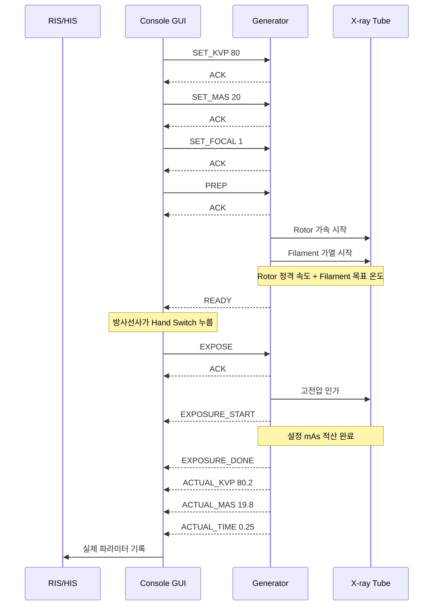
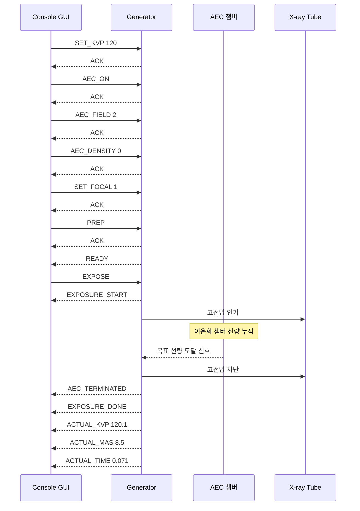
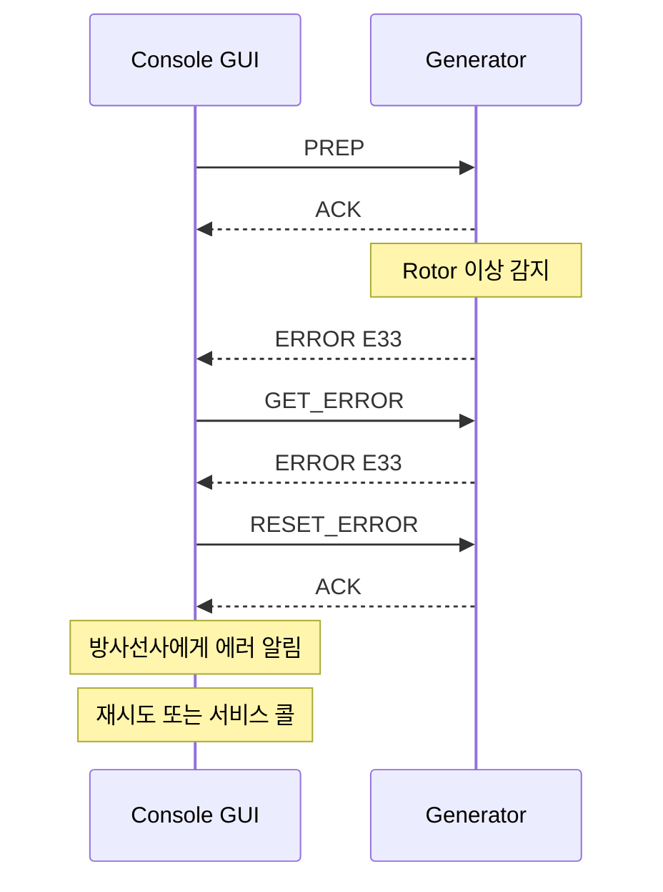
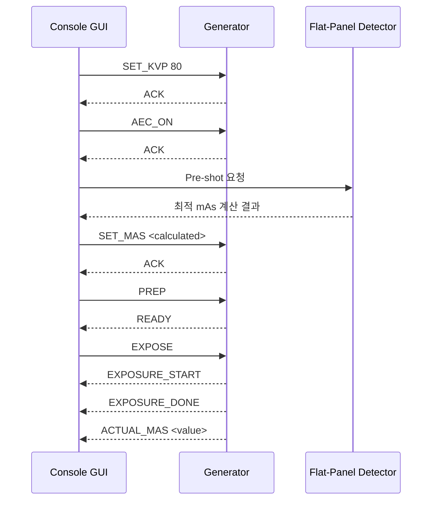
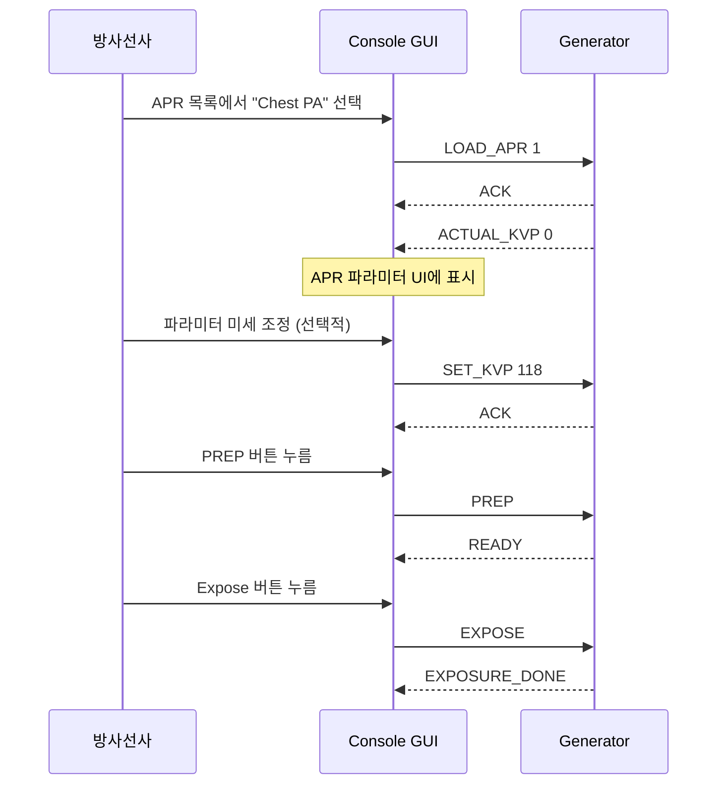
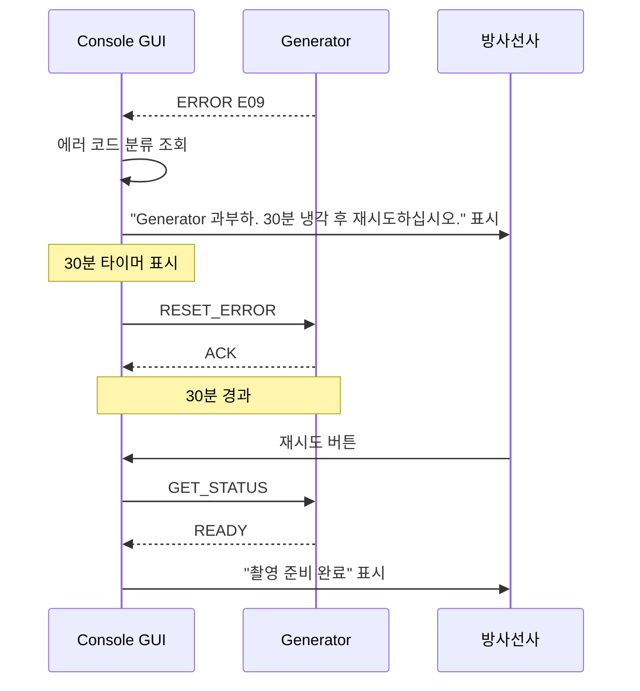
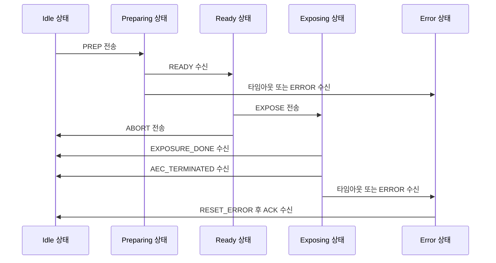

# GENERATOR-001: Generator 통신 프로토콜 가이드 v1.0

| 항목 | 내용 |
|---|---|
| 문서 번호 | GENERATOR-001 |
| 버전 | 1.0 |
| 작성일 | 2026-04-04 |
| 상태 | Draft |
| 대상 시스템 | Console GUI — Generator 인터페이스 레이어 |

---

## 목차

1. [개요 및 목적](#1-개요-및-목적)
2. [제조사별 Generator 프로토콜 비교](#2-제조사별-generator-프로토콜-비교)
3. [공통 명령 체계](#3-공통-명령-체계)
4. [Exposure 시퀀스 상세](#4-exposure-시퀀스-상세)
5. [AEC 동작 원리 및 모드](#5-aec-동작-원리-및-모드)
6. [APR 프리셋 구조 및 관리](#6-apr-프리셋-구조-및-관리)
7. [에러 코드 체계](#7-에러-코드-체계)
8. [하드웨어 인터페이스 사양](#8-하드웨어-인터페이스-사양)
9. [구현 가이드](#9-구현-가이드)
10. [참고 자료](#10-참고-자료)

---

## 1. 개요 및 목적

### 1.1 문서 목적

본 문서는 Console GUI 소프트웨어가 X-ray Generator와 통신하기 위해 필요한 프로토콜, 명령 체계, Exposure 시퀀스, AEC/APR 제어 방법, 에러 처리, 하드웨어 인터페이스 사양을 종합적으로 기술한다. 개발자가 Generator 연동 모듈을 구현할 때 단일 참조 문서로 활용할 수 있도록 작성되었다.

### 1.2 적용 범위

- **지원 제조사**: Sedecal (스페인), CPI — Communications & Power Industries (미국)
- **통신 물리 계층**: RS-232, RS-422, Ethernet
- **운영체제**: Windows 10/11 (Console GUI 대상 환경)
- **프레임워크**: .NET 6+ (C#)

### 1.3 배경

X-ray Generator는 kVp·mAs·mA 등 촬영 파라미터를 수신하고, Rotor 가속 및 Filament 가열 후 X-ray를 발생시키는 고전압 장치이다. Console GUI는 방사선사가 파라미터를 입력하고 촬영을 지시하는 소프트웨어로, Generator와의 신뢰성 있는 통신이 환자 안전 및 영상 품질에 직결된다.

Generator와의 통신은 일반적으로 다음 세 가지 채널로 구성된다.

- **직렬 통신 채널**: 파라미터 설정, 상태 조회, 에러 수신 (RS-232/422)
- **이산 I/O 채널**: Exposure Ready, X-ray ON, Hand Switch 등 실시간 신호 (DR Interface)
- **선택적 네트워크 채널**: 원격 진단, 펌웨어 업데이트 (Ethernet/USB)

---

## 2. 제조사별 Generator 프로토콜 비교

### 2.1 비교 요약 테이블

| 항목 | Sedecal | CPI |
|---|---|---|
| 대표 모델 | SHF 310/410/510, SHFR 시리즈 | CMP 200 시리즈 (32–80 kW) |
| 물리 인터페이스 | RS-232 또는 RS-422 (J5 커넥터), CAN bus 옵션 | RS-232 (ASCII Protocol) + DR Interface (Discrete I/O) |
| 프로토콜 유형 | 바이너리 프레임 (STX/ETX + Checksum) | ASCII 텍스트 기반 명령-응답 |
| kVp 범위 | 40–150 kV | 제품군에 따라 상이 (40–150 kV 범주) |
| mAs 범위 | 0.1–500 mAs | 제품군에 따라 상이 |
| mA 범위 | 50–800 mA | 50–800 mA 범주 |
| AEC 지원 | kV-AEC, kV-mAs 모드 | kV-AEC, kV-mAs 모드 |
| APR 지원 | 있음 (프리셋 저장/로딩) | 제한적 (Console 측 관리 권장) |
| X-ray 튜브 호환 | Sedecal 공인 튜브 | 300+ 호환 튜브 |
| DR Interface | 선택적 (디지털 I/O 옵션) | 기본 제공 (DR Ready 신호 포함) |
| 업데이트 방법 | CAN bus 또는 USB | RS-232 또는 USB |
| 원격 진단 | 지원 | 지원 |
| 제어 방식 | 2점 제어, 3점 제어 | 2점 제어, 3점 제어 |

> **참고**: 2점 제어(Two-point control)는 Prep과 Expose가 동일 스위치로 순차 동작하는 방식이고, 3점 제어(Three-point control)는 Prep과 Expose가 별도 입력으로 분리된 방식이다.

### 2.2 Sedecal 상세

Sedecal은 전 세계 X-ray Generator OEM 시장 1위 공급사（스페인）로, 다수의 의료기기 브랜드에 Generator를 납품한다. SHF 시리즈는 소·중형 방사선실에 범용으로 사용되며, SHFR 시리즈는 Rotating Anode 튜브 전용 고출력 라인이다.

**물리적 구성의 특징**: Console CPU가 Generator Cabinet 내부에 위치하고, 단일 직렬 케이블로 Generator Main Board와 연결된다. 이 구조에서 Console 애플리케이션은 Generator와 사실상 동일 인클로저에 있으며, 케이블 품질 이슈보다 소프트웨어 프로토콜 구현이 핵심이다.

### 2.3 CPI 상세

CPI는 미국 Communications & Power Industries의 의료 부문으로, CMP 200 시리즈는 32 kW–80 kW 범위의 중·고출력 Generator이다. ASCII 텍스트 프로토콜을 사용하므로 디버깅 시 시리얼 터미널에서 직접 명령을 입력하고 응답을 육안으로 확인할 수 있다. DR Interface를 통해 디지털 I/O 신호를 제공하므로, Flat-Panel Detector(FPD)와의 연동이 용이하다.

---

## 3. 공통 명령 체계

### 3.1 프레임 구조

```
[STX] [Command] [Parameters] [Checksum] [ETX]
```

| 필드 | 설명 |
|---|---|
| STX | Start of Text (0x02) |
| Command | ASCII 명령어 문자열 |
| Parameters | 공백으로 구분된 파라미터 값 |
| Checksum | XOR 또는 LRC (제조사별 상이) |
| ETX | End of Text (0x03) |

> **CPI ASCII 프로토콜**: STX/ETX 없이 `\r\n` 종료 문자만 사용하는 텍스트 라인 방식으로 동작하는 경우도 있다. 실제 장비 매뉴얼을 우선 참조한다.

### 3.2 Console → Generator 명령 세트

#### 3.2.1 파라미터 설정 명령

| 명령 | 파라미터 | 범위 | 설명 |
|---|---|---|---|
| `SET_KVP` | `<value>` | 40–150 | kVp 설정 |
| `SET_MAS` | `<value>` | 0.1–500 | mAs 설정 |
| `SET_MA` | `<value>` | 50–800 | mA 설정 |
| `SET_TIME` | `<value>` | 0.001–6.0 (초) | 노출 시간 설정 |
| `SET_FOCAL` | `<0\|1>` | 0=Small, 1=Large | Focal Spot 선택 |

#### 3.2.2 APR 명령

| 명령 | 파라미터 | 설명 |
|---|---|---|
| `LOAD_APR` | `<id>` | APR 프리셋 로딩 (ID는 0–99 정수) |

#### 3.2.3 AEC 제어 명령

| 명령 | 파라미터 | 설명 |
|---|---|---|
| `AEC_ON` | — | AEC 활성화 |
| `AEC_OFF` | — | AEC 비활성화 (Manual 모드 전환) |
| `AEC_FIELD` | `<1\|2\|3>` | AEC 필드 선택: 1=Left, 2=Center, 3=Right (조합 가능) |
| `AEC_DENSITY` | `<-2..+2>` | AEC 밀도 보정: -2=-50%, +2=+100% (정수 스텝) |

> **AEC_FIELD 조합 예시**: `AEC_FIELD 2 3` → Center + Right 동시 선택

#### 3.2.4 Exposure 제어 명령

| 명령 | 설명 |
|---|---|
| `PREP` | Preparation 시작 — Rotor 가속 + Filament 가열 |
| `EXPOSE` | Exposure 시작 (READY 응답 수신 후에만 유효) |
| `ABORT` | Exposure 강제 중단 |

#### 3.2.5 조회 및 진단 명령

| 명령 | 설명 |
|---|---|
| `GET_STATUS` | Generator 현재 상태 조회 |
| `GET_HEAT_UNITS` | Tube Heat Unit 현재값 조회 (%) |
| `GET_ERROR` | 현재 에러 코드 조회 |
| `RESET_ERROR` | 에러 상태 리셋 |

### 3.3 Generator → Console 응답 세트

#### 3.3.1 상태 응답

| 응답 | 설명 |
|---|---|
| `ACK` | 명령 수신 확인 |
| `READY` | 촬영 준비 완료 (Rotor 정격 속도 + Filament 목표 온도 도달) |
| `BUSY` | 처리 중 (다음 명령 대기) |
| `EXPOSURE_START` | Exposure 시작됨 (X-ray 발생 중) |
| `EXPOSURE_DONE` | Exposure 완료 |
| `AEC_TERMINATED` | AEC에 의한 Exposure 자동 종료 |

#### 3.3.2 실측값 응답

| 응답 | 파라미터 | 설명 |
|---|---|---|
| `ACTUAL_KVP` | `<value>` | 실제 측정 kVp |
| `ACTUAL_MAS` | `<value>` | 실제 적산 mAs |
| `ACTUAL_TIME` | `<value>` | 실제 노출 시간 (초) |
| `HEAT_UNITS` | `<value>` | 현재 Tube Heat Unit (%) |

#### 3.3.3 에러 응답

| 응답 | 파라미터 | 설명 |
|---|---|---|
| `ERROR` | `<code>` | 에러 코드 (예: `ERROR E09`) |

### 3.4 타임아웃 정책

| 단계 | 권장 타임아웃 | 비고 |
|---|---|---|
| PREP 후 READY 대기 | 5,000 ms | Rotor 가속 시간 포함 |
| EXPOSE 후 EXPOSURE_START 대기 | 2,000 ms | |
| EXPOSE 후 EXPOSURE_DONE 대기 | 설정 시간 + 2,000 ms | AEC 모드는 더 길게 설정 |
| ACK 대기 | 500 ms | 재전송 2회 후 에러 처리 |

---

## 4. Exposure 시퀀스 상세

### 4.1 기본 Exposure 시퀀스 (Manual 모드)



### 4.2 AEC 모드 Exposure 시퀀스



### 4.3 에러 발생 시 시퀀스



### 4.4 시퀀스 규칙 요약

1. `EXPOSE` 명령은 반드시 `READY` 응답 수신 후에만 전송한다.
2. `PREP` 중 `ABORT`를 보내면 Rotor가 감속 후 정지한다.
3. `EXPOSURE_DONE` 수신 전에 다음 `PREP`을 전송하지 않는다.
4. 에러 발생 시 반드시 `RESET_ERROR` 후 다음 시퀀스를 시작한다.
5. 타임아웃 발생 시 재전송은 최대 2회, 이후 에러 상태로 전환한다.

---

## 5. AEC 동작 원리 및 모드

### 5.1 AEC 구성 요소

AEC(Automatic Exposure Control)는 방사선 선량을 자동으로 제어하여 일정한 영상 밀도를 얻기 위한 기능이다.

```
┌──────────────────────────────────────┐
│           AEC 구성 요소              │
│                                      │
│  [Left 챔버] [Center 챔버] [Right 챔버]│
│       ↓            ↓           ↓    │
│         이온화 챔버 선량 신호          │
│               ↓                     │
│        AEC 컨트롤러                  │
│               ↓                     │
│        Generator 고전압 차단          │
└──────────────────────────────────────┘
```

- **이온화 챔버 방식**: 테이블 또는 Bucky 안에 3개의 이온화 챔버(Left/Center/Right)가 내장된다. 방사선이 챔버를 통과하면 전하가 발생하고, 이를 적산하여 목표 선량에 도달하면 Generator에 차단 신호를 보낸다.
- **DR AEC 방식**: Flat-Panel Detector가 사전 노출(Pre-shot)로 최적 파라미터를 계산한 후 본 Exposure를 실행한다.

### 5.2 AEC 모드 비교

| 모드 | kVp | 시간 | mAs | 설명 |
|---|---|---|---|---|
| kV-AEC | 고정 | 자동 | 자동 결정 | kVp를 방사선사가 설정하고, 적산 선량으로 Exposure 시간 결정 |
| kV-mAs | 고정 | 자동 | 자동 결정 | kV-AEC와 동일하나 mAs로 결과를 표기 |
| Manual | 고정 | 고정 | 고정 | AEC 미사용, 방사선사가 모든 파라미터 직접 설정 |

### 5.3 AEC 필드 선택 기준

| 해부학적 부위 | 권장 AEC 필드 |
|---|---|
| Chest PA | Center + Right |
| Chest Lateral | Center |
| Abdomen AP | Center |
| Lumbar Spine AP | Center |
| Pelvis AP | Center |
| Extremities | Manual 권장 |

### 5.4 AEC 밀도 보정

`AEC_DENSITY` 파라미터는 방사선사가 영상 밀도를 미세 조정할 때 사용한다.

| 값 | 선량 보정 | 영상 효과 |
|---|---|---|
| -2 | -50% | 더 밝은 영상 (얇은 환자, 소아) |
| -1 | -25% | 약간 밝은 영상 |
| 0 | 기준값 | 표준 밀도 |
| +1 | +25% | 약간 어두운 영상 |
| +2 | +100% | 더 어두운 영상 (비만 환자, 두꺼운 부위) |

### 5.5 DR AEC 동작 흐름



---

## 6. APR 프리셋 구조 및 관리

### 6.1 APR 개요

APR(Anatomically Programmed Radiography)은 신체 부위와 촬영 방향 조합별로 사전 정의된 촬영 파라미터 세트이다. 방사선사가 APR을 선택하면 파라미터가 자동으로 로딩되어 촬영 준비 시간을 단축하고 파라미터 입력 오류를 방지한다.

### 6.2 APR 데이터 구조

```json
{
  "apr_id": 1,
  "body_part": "Chest",
  "projection": "PA",
  "kvp": 120,
  "mas": null,
  "ma": null,
  "time": null,
  "aec_enabled": true,
  "aec_field": [2, 3],
  "aec_density": 0,
  "focal_spot": "Large",
  "grid": true,
  "bucky": true,
  "description": "흉부 정면 촬영 — 성인 표준"
}
```

| 필드 | 타입 | 설명 |
|---|---|---|
| `apr_id` | int | 프리셋 ID (0–99) |
| `body_part` | string | 신체 부위 |
| `projection` | string | 촬영 방향 (PA, AP, LAT, OBL 등) |
| `kvp` | float | kVp 설정값 |
| `mas` | float or null | mAs (AEC 모드이면 null) |
| `ma` | float or null | mA (시간 제어 모드에서 사용) |
| `time` | float or null | 노출 시간 (초, AEC 모드이면 null) |
| `aec_enabled` | bool | AEC 활성화 여부 |
| `aec_field` | int[] | 활성화할 AEC 필드 번호 배열 |
| `aec_density` | int | AEC 밀도 보정값 (-2–+2) |
| `focal_spot` | string | "Small" 또는 "Large" |
| `grid` | bool | Grid 사용 여부 |
| `bucky` | bool | Bucky 사용 여부 |

### 6.3 기본 APR 프리셋 예시

| ID | 부위 | 방향 | kVp | mAs | AEC | Focal |
|---|---|---|---|---|---|---|
| 1 | Chest | PA | 120 | Auto | Center+Right | Large |
| 2 | Chest | Lateral | 125 | Auto | Center | Large |
| 3 | Abdomen | AP | 75 | Auto | Center | Large |
| 4 | Lumbar Spine | AP | 80 | Auto | Center | Large |
| 5 | Lumbar Spine | Lateral | 90 | Auto | Center | Large |
| 6 | Pelvis | AP | 75 | Auto | Center | Large |
| 7 | Hand | PA | 50 | 4 | Manual | Small |
| 8 | Foot | AP | 55 | 5 | Manual | Small |
| 9 | Knee | AP | 65 | 10 | Manual | Small |
| 10 | Knee | Lateral | 65 | 8 | Manual | Small |

### 6.4 APR 관리 흐름



### 6.5 APR 저장소 관리

- APR 프리셋은 Generator 내부 비휘발성 메모리와 Console 로컬 데이터베이스 양쪽에 저장하는 이중화 구조를 권장한다.
- Generator 교체 또는 펌웨어 업데이트 후 Console에서 APR을 재동기화하는 절차를 제공해야 한다.
- DICOM MPPS(Modality Performed Procedure Step) 연동 시 APR 선택 이벤트를 워크스텝 데이터에 기록한다.

---

## 7. 에러 코드 체계

### 7.1 에러 코드 분류 (Sedecal 기준)

Sedecal Generator의 에러 코드는 E01–E93 범위이며, 아래와 같이 분류된다.

| 분류 | 코드 범위 | 설명 |
|---|---|---|
| 통신 에러 | E01, E02, E33 | Console-Generator 직렬 통신 이상 |
| 제어 시퀀스 에러 | E06, E34 | 잘못된 명령 순서 또는 보안 타이머 |
| 파라미터 에러 | E12, E13, E16 | kVp/mA 범위 초과, AEC 이상 |
| Overload 에러 | E09, E36, E37 | Generator/Tube 과열 또는 과부하 |
| 기계 에러 | E48 | Collimator 블레이드 위치 이상 |
| 정상 중단 | E50 | 방사선사에 의한 수동 중단 |
| 내부 에러 | E93 | 서비스 콜 필요 |

### 7.2 에러 코드 상세 테이블

| 코드 | 명칭 | 원인 | 조치 |
|---|---|---|---|
| E01 | 통신 에러 1 | Console-Generator 직렬 링크 단절 또는 노이즈 | 케이블 연결 확인, 재부팅 |
| E02 | 통신 에러 2 | 통신 에러 1 지속 또는 체크섬 불일치 | 케이블·보드 점검, 서비스 요청 |
| E06 | Exposure/Prep 명령 중복 | PREP 진행 중 EXPOSE 또는 재차 PREP 전송 | 시퀀스 로직 점검, `RESET_ERROR` 후 재시도 |
| E09 | Generator Overload | 연속 촬영으로 Generator 내부 온도 초과 | 30분 냉각 후 재사용 |
| E12 | mA 없음 (Exposure 중) | Exposure 중 mA 신호 부재 (AEC 관련) | AEC 설정 확인, `RESET_ERROR` |
| E13 | kV 없음 (Exposure 중) | Exposure 중 kV 신호 부재 | 기술값 (kVp) 조정, 튜브 상태 점검 |
| E16 | 유효하지 않은 kV/mA/kW | 파라미터가 장비 한계 범위 초과 | kVp/mAs 값을 허용 범위 내로 재설정 |
| E33 | 직렬 통신 에러 | RS-232/422 라인 노이즈 또는 보드 이상 | 케이블 점검, 보드 교체 검토 |
| E34 | 기술값 에러/보안 타이머 | 파라미터 검증 실패 또는 보안 타이머 만료 | 파라미터 재확인, `RESET_ERROR` |
| E36 | Heat Units 에러 | X-ray Tube Heat Unit 임계값 초과 | 튜브 냉각 후 재사용 (Warm-up 절차 수행) |
| E37 | Tube Overload | 단일 Exposure로 Tube Overload | kVp/mAs 파라미터 축소 후 재시도 |
| E48 | Collimator 에러 | Collimator 블레이드 위치 센서 이상 | Collimator 수동 조작, 서비스 콜 |
| E50 | 방사선사 중단 | 방사선사가 ABORT 명령으로 정상 중단 | `RESET_ERROR` 후 재시도 가능 |
| E93 | 내부 에러 | Generator 내부 펌웨어/하드웨어 이상 | 서비스 엔지니어 연락 필수 |

### 7.3 에러 처리 의사결정 트리



### 7.4 에러 코드 UI 표시 정책

| 에러 분류 | 표시 방법 | 방사선사 조치 필요 여부 |
|---|---|---|
| E50 (정상 중단) | 정보 메시지 | 없음 (자동 복구) |
| E06, E12, E13, E16, E34 | 경고 팝업 + 조치 안내 | 파라미터 재설정 후 재시도 |
| E01, E02, E33 | 에러 팝업 + 시스템 알림 | 케이블 점검 후 재시도 |
| E09, E36, E37 | 에러 팝업 + 냉각 타이머 | 냉각 대기 후 재시도 |
| E48, E93 | 심각 에러 팝업 + 서비스 콜 안내 | 서비스 엔지니어 호출 |

---

## 8. 하드웨어 인터페이스 사양

### 8.1 RS-232 인터페이스

RS-232는 점대점（Point-to-Point） 직렬 통신으로, 짧은 케이블(최대 15 m)에서 신뢰성이 높다. Console과 Generator가 동일 Cabinet 내부에 위치하는 Sedecal 구성에 적합하다.

| 항목 | 사양 |
|---|---|
| 커넥터 | DB-9 (DE-9) 또는 J5 (제조사 전용) |
| 신호 수준 | ±3 V–±15 V (±12 V 표준) |
| 최대 거리 | 15 m (50피트) |
| 최대 속도 | 115,200 bps (실사용: 9,600–57,600 bps) |
| 통신 파라미터 | 9,600 bps, 8N1 (제조사별 상이, 매뉴얼 확인 필요) |
| 흐름 제어 | None (하드웨어 흐름 제어 사용 시 RTS/CTS 포함) |

**핀 배선 (DB-9 기준)**

| 핀 | 신호 | 방향 |
|---|---|---|
| 2 | RXD (Receive Data) | Generator → Console |
| 3 | TXD (Transmit Data) | Console → Generator |
| 5 | GND (Signal Ground) | 공통 |
| 7 | RTS (선택적) | Console → Generator |
| 8 | CTS (선택적) | Generator → Console |

### 8.2 RS-422 인터페이스

RS-422는 차동 신호(Differential Signaling)를 사용하여 노이즈에 강하고 케이블 길이를 최대 1,200 m까지 연장할 수 있다. Generator가 Console과 떨어져 있는 경우 또는 전자기 간섭이 심한 환경에 적합하다.

| 항목 | 사양 |
|---|---|
| 신호 수준 | 차동 ±2 V–±6 V |
| 최대 거리 | 1,200 m (4,000피트) at 100 kbps |
| 최대 속도 | 10 Mbps (단거리), 100 kbps (장거리) |
| 토폴로지 | 점대점 또는 멀티드롭 (최대 10 수신기) |
| 커넥터 | DB-9 또는 터미널 블록 (제조사별 상이) |

### 8.3 CAN Bus 인터페이스 (Sedecal 옵션)

CAN (Controller Area Network) bus는 Sedecal 일부 모델에서 펌웨어 업데이트 및 진단 목적으로 사용된다.

| 항목 | 사양 |
|---|---|
| 속도 | 125 kbps, 250 kbps, 500 kbps, 1 Mbps |
| 커넥터 | DB-9 또는 M12 |
| 종단 저항 | 120 Ω (양 끝단) |
| 프레임 | CAN 2.0A (11-bit ID) 또는 2.0B (29-bit ID) |

### 8.4 DR Interface (Discrete I/O)

DR Interface는 Generator와 DR Detector 사이의 실시간 동기화 신호를 처리한다. CPI CMP 200 시리즈에서 기본 제공되며, Sedecal에서도 선택적으로 구성할 수 있다.

| 신호 이름 | 방향 | 설명 |
|---|---|---|
| Exposure Ready | Generator → Detector | 촬영 준비 완료, Detector가 수신 대기 시작 |
| X-ray ON | Generator → Detector | X-ray 발생 중 (노출 기간 동안 High) |
| Exposure Done | Generator → Console | Exposure 완료 |
| AEC Signal | Detector → Generator | AEC 종료 신호 (DR AEC 모드) |
| Hand Switch | 외부 → Generator | 방사선사 Hand Switch 입력 |

**전기적 사양**

| 항목 | 사양 |
|---|---|
| 신호 수준 | TTL (0/+5 V) 또는 24 V 산업 표준 |
| 커넥터 | 15핀 D-Sub 또는 제조사 전용 커넥터 |
| 절연 | 옵토커플러 절연 (일반적) |

### 8.5 통신 인터페이스 선택 기준

| 조건 | 권장 인터페이스 |
|---|---|
| Console이 Generator Cabinet 내부에 위치 | RS-232 |
| Console과 Generator가 3 m 이상 이격 | RS-422 |
| 전자기 간섭 환경 (수술실, MRI 인접) | RS-422 또는 광통신 |
| 펌웨어 업데이트/원격 진단 | Ethernet (TCP/IP) 또는 USB |
| Flat-Panel Detector 동기화 필요 | DR Interface (Discrete I/O) 추가 |

---

## 9. 구현 가이드

### 9.1 .NET SerialPort 기본 설정

```csharp
using System.IO.Ports;

public class GeneratorSerialPort : IDisposable
{
    private readonly SerialPort _port;

    public GeneratorSerialPort(string portName, int baudRate = 9600)
    {
        _port = new SerialPort
        {
            PortName     = portName,
            BaudRate     = baudRate,
            DataBits     = 8,
            Parity       = Parity.None,
            StopBits     = StopBits.One,
            Handshake    = Handshake.None,
            ReadTimeout  = 2000,   // ms
            WriteTimeout = 1000,   // ms
            Encoding     = System.Text.Encoding.ASCII
        };
        _port.DataReceived += OnDataReceived;
    }

    public void Open() => _port.Open();
    public void Close() => _port.Close();
    public void Dispose() => _port.Dispose();

    public void SendCommand(string command)
    {
        // STX + 명령 + ETX + CRLF
        var frame = $"\x02{command}\x03\r\n";
        _port.Write(frame);
    }

    private void OnDataReceived(object sender, SerialDataReceivedEventArgs e)
    {
        var data = _port.ReadExisting();
        // 수신 데이터를 파서에 전달
        ParseResponse(data);
    }

    private void ParseResponse(string data)
    {
        // 응답 파싱 로직은 상태 머신에서 처리
    }
}
```

### 9.2 Generator 상태 머신

Generator와의 통신은 상태 머신(State Machine)으로 관리한다. 각 상태는 허용되는 명령과 전환 조건을 명시적으로 정의한다.



#### 상태 정의

| 상태 | 설명 | 허용 명령 |
|---|---|---|
| `Idle` | 대기 중 | SET_KVP, SET_MAS, SET_MA, SET_TIME, SET_FOCAL, LOAD_APR, AEC_ON/OFF, AEC_FIELD, AEC_DENSITY, PREP, GET_STATUS, GET_HEAT_UNITS |
| `Preparing` | Rotor 가속/Filament 가열 중 | ABORT |
| `Ready` | 촬영 준비 완료 | EXPOSE, ABORT |
| `Exposing` | X-ray 발생 중 | ABORT |
| `Error` | 에러 상태 | GET_ERROR, RESET_ERROR |

### 9.3 C# 상태 머신 구현 예시

```csharp
public enum GeneratorState
{
    Idle,
    Preparing,
    Ready,
    Exposing,
    Error
}

public class GeneratorStateMachine
{
    public GeneratorState State { get; private set; } = GeneratorState.Idle;

    private readonly GeneratorSerialPort _port;
    private CancellationTokenSource? _timeoutCts;

    public GeneratorStateMachine(GeneratorSerialPort port)
    {
        _port = port;
    }

    public async Task PrepAsync(CancellationToken ct = default)
    {
        if (State != GeneratorState.Idle)
            throw new InvalidOperationException($"PREP은 Idle 상태에서만 가능합니다. 현재: {State}");

        _port.SendCommand("PREP");
        State = GeneratorState.Preparing;

        // READY 응답 대기 (최대 5초)
        var ready = await WaitForResponseAsync("READY", TimeSpan.FromSeconds(5), ct);
        if (!ready)
        {
            State = GeneratorState.Error;
            throw new TimeoutException("PREP 후 READY 응답 타임아웃");
        }
        State = GeneratorState.Ready;
    }

    public async Task ExposeAsync(CancellationToken ct = default)
    {
        if (State != GeneratorState.Ready)
            throw new InvalidOperationException($"EXPOSE는 Ready 상태에서만 가능합니다. 현재: {State}");

        _port.SendCommand("EXPOSE");
        State = GeneratorState.Exposing;

        var done = await WaitForResponseAsync("EXPOSURE_DONE", TimeSpan.FromSeconds(30), ct);
        if (!done)
        {
            State = GeneratorState.Error;
            throw new TimeoutException("EXPOSE 후 EXPOSURE_DONE 응답 타임아웃");
        }
        State = GeneratorState.Idle;
    }

    public void Abort()
    {
        _port.SendCommand("ABORT");
        State = GeneratorState.Idle;
    }

    public void ResetError()
    {
        if (State != GeneratorState.Error) return;
        _port.SendCommand("RESET_ERROR");
        State = GeneratorState.Idle;
    }

    private Task<bool> WaitForResponseAsync(string expectedToken,
                                             TimeSpan timeout,
                                             CancellationToken ct)
    {
        // 실제 구현에서는 TaskCompletionSource<bool>와
        // DataReceived 이벤트를 연결하여 비동기 대기를 구현
        throw new NotImplementedException();
    }
}
```

### 9.4 응답 파서 구현

```csharp
public class GeneratorResponseParser
{
    // STX(0x02) – ETX(0x03) 사이 내용을 추출하는 버퍼
    private readonly StringBuilder _buffer = new();

    public IEnumerable<GeneratorResponse> Feed(string rawData)
    {
        foreach (char c in rawData)
        {
            if (c == '\x02')        // STX: 프레임 시작
            {
                _buffer.Clear();
            }
            else if (c == '\x03')  // ETX: 프레임 종료
            {
                var frame = _buffer.ToString();
                var response = ParseFrame(frame);
                if (response is not null) yield return response;
                _buffer.Clear();
            }
            else
            {
                _buffer.Append(c);
            }
        }
    }

    private static GeneratorResponse? ParseFrame(string frame)
    {
        if (string.IsNullOrWhiteSpace(frame)) return null;

        var parts = frame.Trim().Split(' ', 2);
        var token = parts[0].ToUpperInvariant();
        var param = parts.Length > 1 ? parts[1] : null;

        return token switch
        {
            "ACK"             => new GeneratorResponse(ResponseType.Ack, null),
            "READY"           => new GeneratorResponse(ResponseType.Ready, null),
            "BUSY"            => new GeneratorResponse(ResponseType.Busy, null),
            "EXPOSURE_START"  => new GeneratorResponse(ResponseType.ExposureStart, null),
            "EXPOSURE_DONE"   => new GeneratorResponse(ResponseType.ExposureDone, null),
            "AEC_TERMINATED"  => new GeneratorResponse(ResponseType.AecTerminated, null),
            "ACTUAL_KVP"      => new GeneratorResponse(ResponseType.ActualKvp, param),
            "ACTUAL_MAS"      => new GeneratorResponse(ResponseType.ActualMas, param),
            "ACTUAL_TIME"     => new GeneratorResponse(ResponseType.ActualTime, param),
            "HEAT_UNITS"      => new GeneratorResponse(ResponseType.HeatUnits, param),
            "ERROR"           => new GeneratorResponse(ResponseType.Error, param),
            _                 => null
        };
    }
}

public record GeneratorResponse(ResponseType Type, string? Parameter);

public enum ResponseType
{
    Ack, Ready, Busy,
    ExposureStart, ExposureDone, AecTerminated,
    ActualKvp, ActualMas, ActualTime, HeatUnits,
    Error
}
```

### 9.5 파라미터 유효성 검사

```csharp
public static class GeneratorParameterValidator
{
    public static bool IsValidKvp(double kvp)
        => kvp is >= 40.0 and <= 150.0;

    public static bool IsValidMas(double mas)
        => mas is >= 0.1 and <= 500.0;

    public static bool IsValidMa(double ma)
        => ma is >= 50.0 and <= 800.0;

    public static bool IsValidTime(double seconds)
        => seconds is >= 0.001 and <= 6.0;

    public static bool IsValidAecDensity(int density)
        => density is >= -2 and <= 2;

    public static bool IsValidAprId(int id)
        => id is >= 0 and <= 99;

    /// <summary>
    /// kW = (kVp × mA) / 1000. 장비 최대 kW 이내인지 확인.
    /// </summary>
    public static bool IsWithinKwLimit(double kvp, double ma, double maxKw)
        => (kvp * ma / 1000.0) <= maxKw;
}
```

### 9.6 구현 체크리스트

- [ ] SerialPort 연결 및 재연결 로직 구현
- [ ] 상태 머신으로 모든 명령 전환 관리
- [ ] 타임아웃 처리: READY 5초, EXPOSURE_DONE (설정 시간 + 2초)
- [ ] 에러 코드 수신 시 자동 상태 전환 및 UI 알림
- [ ] 실측값(ACTUAL_KVP, ACTUAL_MAS, ACTUAL_TIME) 로그 저장
- [ ] Tube Heat Unit 주기적 폴링 (촬영 간격 동안)
- [ ] APR 프리셋 데이터베이스 연동
- [ ] AEC 필드 및 밀도 조합 유효성 검사
- [ ] ABORT 명령 Keyboard/UI 단축키 연결
- [ ] 통신 로그 파일 저장 (디버깅 및 감사 용도)

---

## 10. 참고 자료

### 10.1 제조사 문서

| 제조사 | 문서 | URL |
|---|---|---|
| Sedecal | SHF 시리즈 서비스 매뉴얼 | https://www.sedecal.com/en/products/generators/ |
| Sedecal | SHFR 시리즈 기술 사양 | https://www.sedecal.com/en/products/generators/ |
| CPI | CMP 200 시리즈 기술 문서 | https://www.cpii.com/product.cfm/4/17/282 |
| CPI | CMP 200 ASCII Protocol Guide | https://www.cpii.com/product.cfm/4/17/282 |

### 10.2 관련 표준 및 규격

| 표준 | 설명 | URL |
|---|---|---|
| IEC 60601-1 | 의료용 전기기기 일반 안전 요구사항 | https://www.iec.ch/dyn/www/f?p=103:38:0::::FSP_ORG_ID,FSP_APEX_PAGE,FSP_PROJECT_ID:1276,23,22272 |
| IEC 60601-1-2 | 전자기 적합성 | https://www.iec.ch/dyn/www/f?p=103:38:0::::FSP_ORG_ID,FSP_APEX_PAGE,FSP_PROJECT_ID:1276,23,20647 |
| IEC 60601-2-28 | X선관 조립체 요구사항 | https://www.iec.ch/dyn/www/f?p=103:38:0::::FSP_ORG_ID,FSP_APEX_PAGE,FSP_PROJECT_ID:1276,23,23072 |
| IEC 60601-2-54 | X선 촬영 장비 요구사항 | https://www.iec.ch/dyn/www/f?p=103:38:0::::FSP_ORG_ID,FSP_APEX_PAGE,FSP_PROJECT_ID:1276,23,45991 |
| DICOM 3.0 | 의료영상 표준 | https://www.dicomstandard.org/current |
| RS-232 (EIA-232) | 직렬 통신 표준 | https://www.ti.com/lit/an/slla035b/slla035b.pdf |
| RS-422 (EIA-422) | 차동 직렬 통신 표준 | https://www.ti.com/lit/an/slla070d/slla070d.pdf |

### 10.3 .NET 구현 참고

| 항목 | URL |
|---|---|
| System.IO.Ports.SerialPort 문서 | https://learn.microsoft.com/ko-kr/dotnet/api/system.io.ports.serialport |
| .NET 비동기 직렬 포트 패턴 | https://learn.microsoft.com/ko-kr/dotnet/standard/io/asynchronous-file-i-o |
| CancellationToken 활용 | https://learn.microsoft.com/ko-kr/dotnet/standard/threading/cancellation-in-managed-threads |

### 10.4 관련 내부 문서

| 문서 번호 | 제목 |
|---|---|
| CONSOLE-001 | Console GUI 아키텍처 개요 |
| DETECTOR-001 | Flat-Panel Detector 인터페이스 가이드 |
| WORKLIST-001 | DICOM Worklist 연동 가이드 |
| DOSE-001 | 선량 관리 모듈 설계 |

---

*문서 끝*

---

> **변경 이력**
>
> | 버전 | 날짜 | 작성자 | 변경 내용 |
> |---|---|---|---|
> | 1.0 | 2026-04-04 | Console GUI Team | 최초 작성 |
