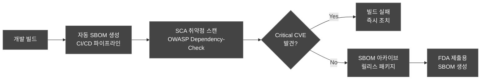
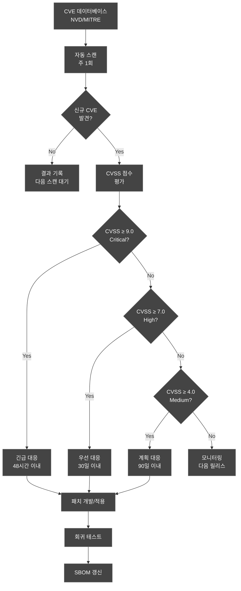
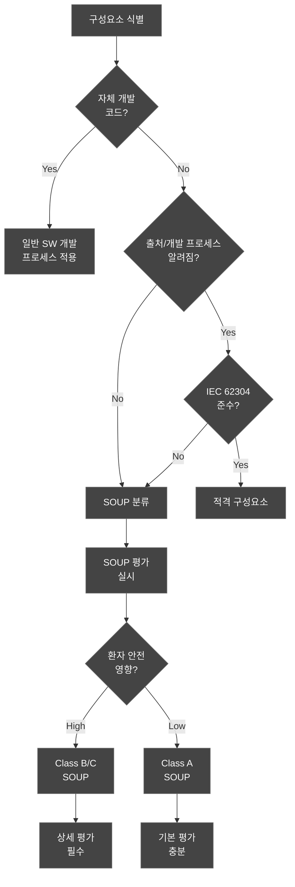
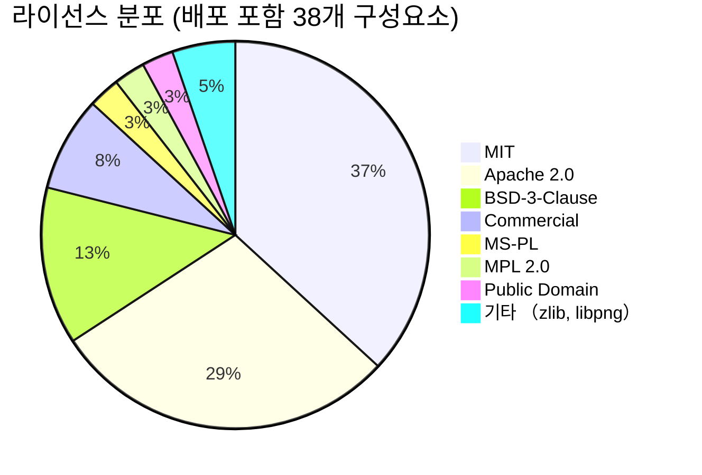

# 소프트웨어 자재 명세서 (Software Bill of Materials, SBOM)
## HnVue Console SW

---

## 문서 메타데이터 (Document Metadata)

| 항목 | 내용 |
|------|------|
| **문서 ID** | SBOM-XRAY-GUI-001 |
| **문서명** | HnVue Console SW 소프트웨어 자재 명세서 |
| **버전** | v1.0 |
| **작성일** | 2026-03-18 |
| **작성자** | SW 개발팀, 사이버보안 팀 |
| **검토자** | SW 아키텍트, QA 팀장 |
| **승인자** | 의료기기 RA/QA 책임자 |
| **상태** | 승인됨 (Approved) |
| **기준 규격** | FDA Section 524B, NTIA SBOM Minimum Elements, CycloneDX 1.5, IEC 62304 §8 |

### 개정 이력 (Revision History)

| 버전 | 날짜 | 변경 내용 | 작성자 |
|------|------|----------|--------|
| v1.0 | 2026-03-18 | 최초 작성 — Phase 1 전체 구성요소 목록 | SW 개발팀 |

---

## 목차 (Table of Contents)

1. 목적 및 범위
2. SBOM 정책
3. NTIA 최소 요소
4. 구성요소 목록
5. 의존성 그래프
6. 취약점 관리 프로세스
7. SOUP 관리 (IEC 62304 §8)
8. SBOM 갱신 절차
9. 라이선스 호환성 분석
10. CycloneDX 형식 예시

---

## 1. 목적 및 범위 (Purpose and Scope)

### 1.1 목적 (Purpose)

본 문서는 HnVue Console SW에 포함된 모든 소프트웨어 구성요소의 자재 명세서 (SBOM)를 문서화한다.

FDA Section 524B에 따라 Cyber Device로 분류된 의료기기는 FDA 510(k) 제출 시 SBOM을 포함해야 하며, 본 문서는 다음을 제공한다:
1. **NTIA SBOM Minimum Elements** 준수 구성요소 목록
2. **알려진 취약점 (CVE) 현황** 및 관리 프로세스
3. **IEC 62304 §8 SOUP 관리** 요구사항 충족
4. **라이선스 호환성** 분석

### 1.2 범위 (Scope)

| 구분 | 내용 |
|------|------|
| **대상** | HnVue Console SW v1.0 Phase 1 |
| **포함** | OS, 런타임, 프레임워크, 라이브러리, 도구 |
| **형식** | CycloneDX 1.5 JSON (기계 판독용) + Markdown (사람 판독용) |

---

## 2. SBOM 정책 (SBOM Policy)

### 2.1 SBOM 생성 원칙



### 2.2 SBOM 갱신 트리거

1. 신규 구성요소 추가 또는 기존 구성요소 버전 업데이트
2. 신규 CVE 발견 (CVSS ≥ 7.0)
3. 구성요소 제거 또는 교체
4. 정기 검토 (분기별)
5. 릴리스 빌드 시 자동 생성

---

## 3. NTIA 최소 요소 (NTIA Minimum Elements)

| NTIA 요소 | 설명 | 본 문서 적용 |
|-----------|------|-------------|
| Supplier Name | 구성요소 공급자 | 각 항목별 공급자 기재 |
| Component Name | 구성요소 이름 | 정식 명칭 사용 |
| Version | 구성요소 버전 | 정확한 버전 번호 |
| Unique Identifier | 고유 식별자 | CPE, Package URL (purl) |
| Dependency Relationship | 의존성 관계 | 직접(Direct)/간접(Transitive) |
| Author of SBOM Data | SBOM 작성자 | 문서 메타데이터 참조 |
| Timestamp | 생성 시각 | 2026-03-18T00:00:00Z |

---

## 4. 구성요소 목록 (Component Inventory)

### 4.1 운영 체제 및 런타임 (OS & Runtime)

| SBOM-ID | 구성요소명 | 버전 | 공급자 | 라이선스 | SOUP Class | 의존성 | CVE 현황 | 위험도 |
|---------|-----------|------|--------|---------|-----------|--------|---------|--------|
| SBOM-001 | Windows 10 IoT Enterprise LTSC | 21H2 (19044) | Microsoft | Commercial | Class B | OS | 정기 패치 적용 | Medium |
| SBOM-002 | .NET 8.0 Runtime (LTS) | 8.0.x | Microsoft | MIT | Class B | Direct | CVE 모니터링 중 | Low |
| SBOM-003 | .NET 8.0 SDK | 8.0.x | Microsoft | MIT | N/A (빌드) | Direct | 런타임 미포함 | Low |
| SBOM-004 | ASP.NET Core Runtime | 6.0.36 | Microsoft | MIT | Class B | Direct | CVE 모니터링 중 | Low |

### 4.2 UI 프레임워크 (UI Framework)

| SBOM-ID | 구성요소명 | 버전 | 공급자 | 라이선스 | SOUP Class | 의존성 | CVE 현황 | 위험도 |
|---------|-----------|------|--------|---------|-----------|--------|---------|--------|
| SBOM-005 | WPF (.NET 8) | 8.0.x | Microsoft | MIT | Class B | Direct | 알려진 CVE 없음 | Low |
| SBOM-006 | CommunityToolkit.Mvvm | 8.2.2 | Microsoft | MIT | Class A | Direct | 알려진 CVE 없음 | Low |
| SBOM-007 | MahApps.Metro | 2.4.10 | MahApps | MIT | Class A | Direct | 알려진 CVE 없음 | Low |
| SBOM-008 | LiveChartsCore | 2.0.0-rc3 | LiveCharts | MIT | Class A | Direct | 알려진 CVE 없음 | Low |

### 4.3 DICOM 라이브러리 (DICOM Libraries)

| SBOM-ID | 구성요소명 | 버전 | 공급자 | 라이선스 | SOUP Class | 의존성 | CVE 현황 | 위험도 |
|---------|-----------|------|--------|---------|-----------|--------|---------|--------|
| SBOM-009 | fo-dicom | 5.1.3 | fo-dicom contributors | MS-PL | Class B | Direct | 알려진 CVE 없음 | Medium |
| SBOM-010 | DCMTK | 3.6.8 | OFFIS | BSD-3 | Class B | Direct | 모니터링 중 | Medium |
| SBOM-011 | DicomObjects.NET | 14.0.x | Medical Connections | Commercial | Class B | Direct | 벤더 패치 적용 | Medium |

### 4.4 영상 처리 (Image Processing)

| SBOM-ID | 구성요소명 | 버전 | 공급자 | 라이선스 | SOUP Class | 의존성 | CVE 현황 | 위험도 |
|---------|-----------|------|--------|---------|-----------|--------|---------|--------|
| SBOM-012 | OpenCvSharp4 | 4.9.0 | shimat | Apache 2.0 | Class B | Direct | OpenCV CVE 모니터링 | Medium |
| SBOM-013 | OpenCV (Native) | 4.9.0 | OpenCV.org | Apache 2.0 | Class B | Transitive | CVE-2023-xxxx 패치됨 | Medium |
| SBOM-014 | ITK.NET Wrapper | 5.3.0 | Kitware | Apache 2.0 | Class B | Direct | 모니터링 중 | Medium |
| SBOM-015 | SixLabors.ImageSharp | 3.1.4 | SixLabors | Apache 2.0 | Class A | Direct | 알려진 CVE 없음 | Low |

### 4.5 데이터베이스 (Database)

| SBOM-ID | 구성요소명 | 버전 | 공급자 | 라이선스 | SOUP Class | 의존성 | CVE 현황 | 위험도 |
|---------|-----------|------|--------|---------|-----------|--------|---------|--------|
| SBOM-016 | SQLite | 3.45.1 | SQLite Consortium | Public Domain | Class B | Direct | 알려진 CVE 없음 | Low |
| SBOM-017 | Microsoft.Data.Sqlite | 8.0.2 | Microsoft | MIT | Class A | Direct | 알려진 CVE 없음 | Low |
| SBOM-018 | Entity Framework Core | 8.0.2 | Microsoft | MIT | Class A | Direct | 알려진 CVE 없음 | Low |

### 4.6 보안 (Security)

| SBOM-ID | 구성요소명 | 버전 | 공급자 | 라이선스 | SOUP Class | 의존성 | CVE 현황 | 위험도 |
|---------|-----------|------|--------|---------|-----------|--------|---------|--------|
| SBOM-019 | BouncyCastle.Cryptography | 2.3.0 | Legion of the Bouncy Castle | MIT | Class B | Direct | 모니터링 중 | High |
| SBOM-020 | OpenSSL (Native) | 3.2.1 | OpenSSL Project | Apache 2.0 | Class B | Transitive | 고위험 모니터링 | High |
| SBOM-021 | System.Security.Cryptography | 8.0.0 | Microsoft | MIT | Class B | Direct | .NET 보안 업데이트 | Medium |

### 4.7 네트워크/통신 (Network/Communication)

| SBOM-ID | 구성요소명 | 버전 | 공급자 | 라이선스 | SOUP Class | 의존성 | CVE 현황 | 위험도 |
|---------|-----------|------|--------|---------|-----------|--------|---------|--------|
| SBOM-022 | Grpc.Net.Client | 2.60.0 | gRPC Authors | Apache 2.0 | Class A | Direct | 알려진 CVE 없음 | Low |
| SBOM-023 | RestSharp | 111.3.0 | RestSharp | Apache 2.0 | Class A | Direct | 알려진 CVE 없음 | Low |
| SBOM-024 | NHapi (HL7 v2 Parser) | 3.2.0 | nHapi contributors | MPL 2.0 | Class B | Direct | 모니터링 중 | Medium |
| SBOM-025 | Hl7.Fhir.R4 | 5.5.1 | Firely | BSD-3 | Class B | Direct | 알려진 CVE 없음 | Medium |

### 4.8 직렬화/유틸리티 (Serialization/Utility)

| SBOM-ID | 구성요소명 | 버전 | 공급자 | 라이선스 | SOUP Class | 의존성 | CVE 현황 | 위험도 |
|---------|-----------|------|--------|---------|-----------|--------|---------|--------|
| SBOM-026 | Newtonsoft.Json | 13.0.3 | James Newton-King | MIT | Class A | Direct | 알려진 CVE 없음 | Low |
| SBOM-027 | Google.Protobuf | 3.25.3 | Google | BSD-3 | Class A | Transitive | 알려진 CVE 없음 | Low |
| SBOM-028 | AutoMapper | 13.0.1 | Jimmy Bogard | MIT | Class A | Direct | 알려진 CVE 없음 | Low |
| SBOM-029 | FluentValidation | 11.9.0 | Jeremy Skinner | Apache 2.0 | Class A | Direct | 알려진 CVE 없음 | Low |
| SBOM-030 | MediatR | 12.2.0 | Jimmy Bogard | Apache 2.0 | Class A | Direct | 알려진 CVE 없음 | Low |
| SBOM-031 | Polly | 8.3.1 | App vNext | BSD-3 | Class A | Direct | 알려진 CVE 없음 | Low |

### 4.9 로깅/모니터링 (Logging/Monitoring)

| SBOM-ID | 구성요소명 | 버전 | 공급자 | 라이선스 | SOUP Class | 의존성 | CVE 현황 | 위험도 |
|---------|-----------|------|--------|---------|-----------|--------|---------|--------|
| SBOM-032 | Serilog | 3.1.1 | Serilog Contributors | Apache 2.0 | Class A | Direct | 알려진 CVE 없음 | Low |
| SBOM-033 | Serilog.Sinks.File | 5.0.0 | Serilog | Apache 2.0 | Class A | Direct | 알려진 CVE 없음 | Low |
| SBOM-034 | Serilog.Sinks.Seq | 6.0.0 | Datalust | Apache 2.0 | Class A | Direct | 알려진 CVE 없음 | Low |

### 4.10 압축/코덱 (Compression/Codec)

| SBOM-ID | 구성요소명 | 버전 | 공급자 | 라이선스 | SOUP Class | 의존성 | CVE 현황 | 위험도 |
|---------|-----------|------|--------|---------|-----------|--------|---------|--------|
| SBOM-035 | zlib (Native) | 1.3.1 | zlib contributors | zlib | Class A | Transitive | CVE 모니터링 중 | Low |
| SBOM-036 | libjpeg-turbo | 3.0.2 | libjpeg-turbo | BSD-3 | Class B | Transitive | DICOM JPEG 코덱 | Low |
| SBOM-037 | libpng | 1.6.43 | libpng contributors | libpng | Class A | Transitive | 모니터링 중 | Low |
| SBOM-038 | CharLS | 2.4.2 | Team CharLS | BSD-3 | Class B | Transitive | DICOM JPEG-LS 코덱 | Low |

### 4.11 테스트 도구 (Test — 빌드 전용, 배포 미포함)

| SBOM-ID | 구성요소명 | 버전 | 공급자 | 라이선스 | 비고 |
|---------|-----------|------|--------|---------|------|
| SBOM-039 | xUnit | 2.7.0 | xUnit.net | Apache 2.0 | 단위 테스트 |
| SBOM-040 | NSubstitute | 5.1.0 | NSubstitute contributors | BSD-3 | 목 프레임워크 |
| SBOM-041 | FluentAssertions | 6.12.0 | Dennis Doomen | Apache 2.0 | 어설션 |
| SBOM-042 | Coverlet | 6.0.0 | tonerdo | MIT | 코드 커버리지 |

### 4.12 구성요소 요약 통계

| 분류 | 항목 수 | Class A | Class B | 비고 |
|------|---------|---------|---------|------|
| OS/런타임 | 4 | 0 | 4 | 필수 플랫폼 |
| UI 프레임워크 | 4 | 3 | 1 | 화면 구성 |
| DICOM | 3 | 0 | 3 | 핵심 의료기능 |
| 영상 처리 | 4 | 1 | 3 | 영상 표시/처리 |
| 데이터베이스 | 3 | 2 | 1 | 데이터 저장 |
| 보안 | 3 | 0 | 3 | 암호화/인증 |
| 네트워크 | 4 | 2 | 2 | 통신 |
| 직렬화/유틸 | 6 | 6 | 0 | 데이터 변환 |
| 로깅 | 3 | 3 | 0 | 로그 기록 |
| 압축/코덱 | 4 | 2 | 2 | 영상 코덱 |
| 테스트 (비배포) | 4 | — | — | 개발 전용 |
| **합계** | **42** | **19** | **19** | 테스트 4건 제외 38 |

---

## 5. 의존성 그래프 (Dependency Graph)

```mermaid
graph TD
    APP[HnVue<br/>GUI Console SW] --> UI[UI Layer]
    APP --> CORE[Core Services]
    APP --> DICOM[DICOM Module]
    APP --> IMG[Image Processing]
    APP --> SEC[Security Module]
    APP --> DATA[Data Layer]
    
    UI --> SBOM005[WPF 6.0]
    UI --> SBOM006[CommunityToolkit.Mvvm]
    UI --> SBOM007[MahApps.Metro]
    UI --> SBOM008[LiveChartsCore]
    
    CORE --> SBOM026[Newtonsoft.Json]
    CORE --> SBOM028[AutoMapper]
    CORE --> SBOM029[FluentValidation]
    CORE --> SBOM030[MediatR]
    CORE --> SBOM031[Polly]
    CORE --> SBOM032[Serilog]
    
    DICOM --> SBOM009[fo-dicom 5.1]
    DICOM --> SBOM010[DCMTK 3.6]
    DICOM --> SBOM024[NHapi HL7]
    DICOM --> SBOM025[Hl7.Fhir.R4]
    
    IMG --> SBOM012[OpenCvSharp4]
    IMG --> SBOM014[ITK.NET]
    IMG --> SBOM015[ImageSharp]
    SBOM012 --> SBOM013[OpenCV Native]
    SBOM009 --> SBOM036[libjpeg-turbo]
    SBOM009 --> SBOM038[CharLS]
    
    SEC --> SBOM019[BouncyCastle]
    SEC --> SBOM020[OpenSSL]
    SEC --> SBOM021[System.Security]
    
    DATA --> SBOM016[SQLite]
    DATA --> SBOM017[MS.Data.Sqlite]
    DATA --> SBOM018[EF Core]
    
    classDef default fill:#444,stroke:#666,color:#fff
    style APP fill:#444,color:#fff
    style SBOM019 fill:#444,color:#fff
    style SBOM020 fill:#444,color:#fff
```



---

## 6. 취약점 관리 프로세스 (Vulnerability Management)

### 6.1 CVE 모니터링 프로세스



### 6.2 고위험 모니터링 대상

| 우선순위 | 구성요소 | 근거 |
|----------|---------|------|
| 1 (최우선) | OpenSSL 3.x | 암호화 핵심, 과거 Critical CVE 빈번 |
| 2 | BouncyCastle | 인증/암호 기능 |
| 3 | fo-dicom / DCMTK | DICOM 파서, 네트워크 노출 |
| 4 | OpenCV | 영상 처리 입력 파서 |
| 5 | .NET Runtime | 플랫폼 전체 영향 |

---

## 7. SOUP 관리 (IEC 62304 §8)

### 7.1 SOUP 적격성 판단 기준



### 7.2 SOUP 평가 요약

| SOUP Class | 항목 수 | 평가 수준 | 모니터링 주기 |
|-----------|---------|----------|-------------|
| Class B (환자 안전 관련) | 19 | 상세 평가 — 이상 목록, 위험 평가 | 월별 CVE 스캔 |
| Class A (간접 영향) | 19 | 기본 평가 — 라이선스, 버전 확인 | 분기별 CVE 스캔 |

---

## 8. SBOM 갱신 절차 (Update Process)

| 단계 | 활동 | 담당 | 산출물 |
|------|------|------|--------|
| 1 | 변경 요청 (구성요소 추가/수정/삭제) | 개발팀 | 변경 요청서 |
| 2 | 영향 분석 (라이선스, CVE, 호환성) | 보안팀 | 영향 분석 보고서 |
| 3 | SOUP 평가 (신규 구성요소) | QA팀 | SOUP 평가 기록 |
| 4 | 승인 | RA/QA 책임자 | 승인 기록 |
| 5 | SBOM 갱신 및 아카이브 | 개발팀 | SBOM v(n+1) |
| 6 | 회귀 테스트 실행 | QA팀 | 테스트 결과 |

---

## 9. 라이선스 호환성 분석 (License Compliance)

### 9.1 라이선스 분포



### 9.2 라이선스 호환성 요약

| 라이선스 | 호환성 | Copyleft | 배포 의무 | 판정 |
|---------|--------|---------|----------|------|
| MIT | ✅ 호환 | No | 저작권 고지 | 문제 없음 |
| Apache 2.0 | ✅ 호환 | No | 고지 + NOTICE | 문제 없음 |
| BSD-3-Clause | ✅ 호환 | No | 저작권 고지 | 문제 없음 |
| Commercial | ✅ 호환 | No | 라이선스 계약 | 계약 확인 필요 |
| MS-PL | ✅ 호환 | Weak | 소스 고지 | 문제 없음 |
| MPL 2.0 | ⚠️ 조건부 | File-level | 파일 단위 소스 | NHapi 별도 관리 |
| Public Domain | ✅ 호환 | No | 없음 | 문제 없음 |
| zlib/libpng | ✅ 호환 | No | 고지 | 문제 없음 |

**결론**: GPL/AGPL 라이선스 구성요소 없음. 모든 라이선스가 상용 의료기기 소프트웨어 배포와 호환됨. MPL 2.0 (NHapi)은 파일 수준 Copyleft이므로 수정 파일의 소스 공개 의무가 있으나, 수정 없이 사용 시 문제 없음.

---

## 10. CycloneDX 형식 예시 (Machine-Readable Format)

```json
{
  "bomFormat": "CycloneDX",
  "specVersion": "1.5",
  "version": 1,
  "metadata": {
    "timestamp": "2026-03-18T00:00:00Z",
    "tools": [{"name": "OWASP Dependency-Check", "version": "9.x"}],
    "component": {
      "type": "application",
      "name": "HnVue Console SW",
      "version": "1.0.0",
      "supplier": {"name": "HnVue Development Team"}
    }
  },
  "components": [
    {
      "type": "library",
      "name": "fo-dicom",
      "version": "5.1.3",
      "purl": "pkg:nuget/fo-dicom@5.1.3",
      "licenses": [{"license": {"id": "MS-PL"}}],
      "supplier": {"name": "fo-dicom contributors"},
      "properties": [
        {"name": "iec62304:soup-class", "value": "B"},
        {"name": "iec62304:safety-relevant", "value": "true"}
      ]
    },
    {
      "type": "library",
      "name": "OpenSSL",
      "version": "3.2.1",
      "purl": "pkg:generic/openssl@3.2.1",
      "licenses": [{"license": {"id": "Apache-2.0"}}],
      "supplier": {"name": "OpenSSL Project"},
      "properties": [
        {"name": "iec62304:soup-class", "value": "B"},
        {"name": "iec62304:safety-relevant", "value": "true"}
      ]
    }
  ]
}
```

> 전체 CycloneDX JSON 파일은 릴리스 빌드 시 CI/CD 파이프라인에서 자동 생성되며, 510(k) 제출 패키지에 포함된다.

---

*문서 끝 (End of Document)*
