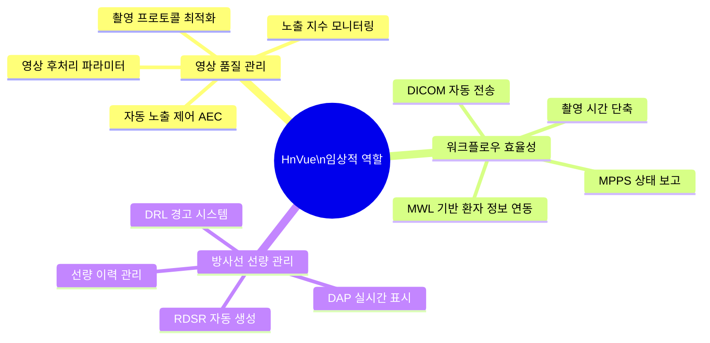
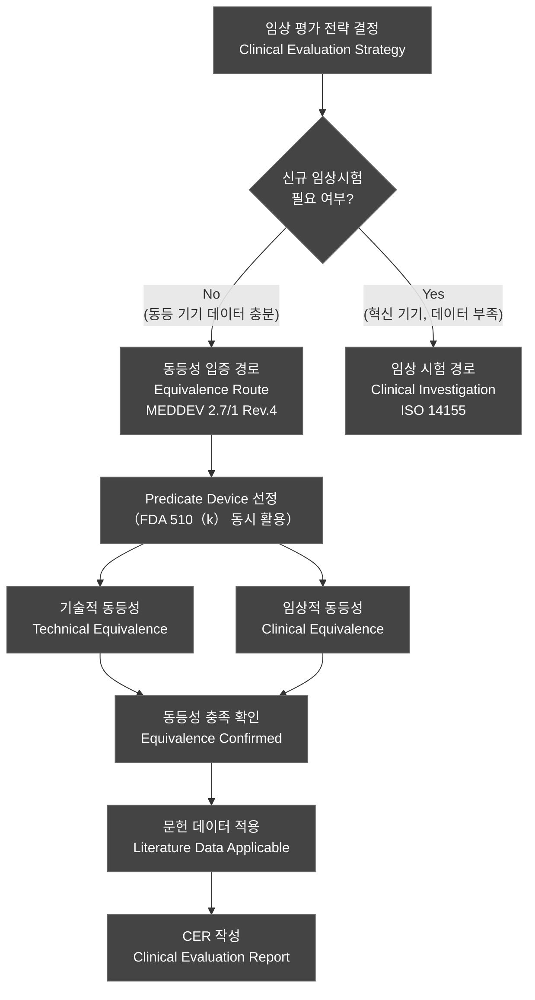
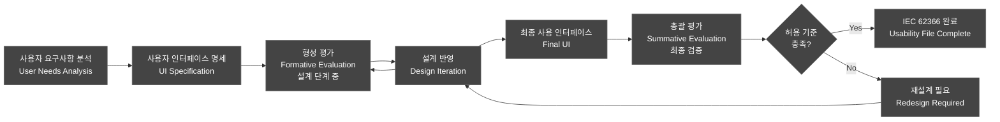
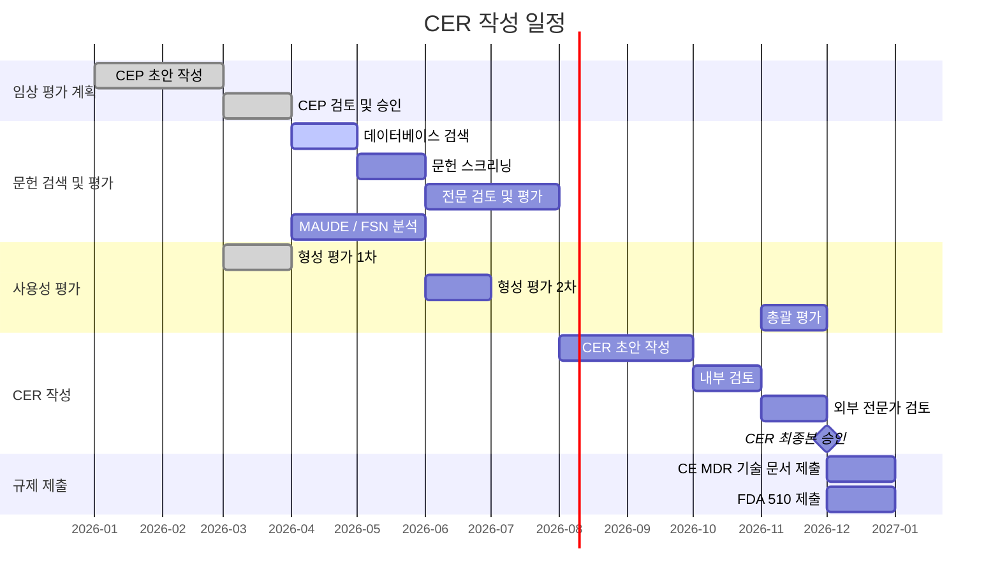

# 임상 평가 계획서 (Clinical Evaluation Plan)

---

## 문서 메타데이터 (Document Metadata)

| 항목 | 내용 |
|------|------|
| **문서 ID** | CEP-XRAY-GUI-001 |
| **제목** | HnVue Console SW 임상 평가 계획서 |
| **버전** | v1.0 |
| **작성일** | 2026-03-16 |
| **작성자** | 임상 평가 담당자 (Clinical Affairs) |
| **검토자** | 품질보증 책임자 (QA Manager) |
| **승인자** | 의료기기 규제 책임자 (Regulatory Affairs Director) |
| **상태** | Draft |
| **기준 규격** | EU MDR 2017/745, MEDDEV 2.7/1 Rev.4, FDA 510(k), IEC 62366-1:2015+AMD1:2020 |
| **관련 문서** | SRS-XRAY-GUI-001, RMP-XRAY-GUI-001, IFU-XRAY-GUI-001 |

### 개정 이력 (Revision History)

| 버전 | 날짜 | 작성자 | 변경 내용 |
|------|------|--------|-----------|
| v0.1 | 2026-01-10 | Clinical Affairs | 초안 작성 |
| v0.5 | 2026-02-15 | Clinical Affairs | 동등성 평가 섹션 추가 |
| v1.0 | 2026-03-16 | Clinical Affairs | 최종 검토 반영, 승인 요청 |

---

## 목차 (Table of Contents)

1. [목적 및 범위](#1-목적-및-범위)
2. [참조 규격 및 약어](#2-참조-규격-및-약어)
3. [제품 설명](#3-제품-설명-device-description)
4. [임상 배경](#4-임상-배경-clinical-background)
5. [동등성 평가](#5-동등성-평가-equivalence-assessment)
6. [문헌 검색 계획](#6-문헌-검색-계획-literature-search-plan)
7. [임상 데이터 평가 방법](#7-임상-데이터-평가-방법)
8. [사용성 평가 계획](#8-사용성-평가-계획-usability-evaluation-plan)
9. [Risk-Benefit 분석](#9-risk-benefit-분석)
10. [임상 평가 보고서 작성 계획](#10-임상-평가-보고서-cer-작성-계획)
11. [시판 후 임상 추적 계획](#11-시판-후-임상-추적-pmcf-계획)
- [부록 A: 문헌 검색 전략 상세](#부록-a-문헌-검색-전략-상세)
- [부록 B: Predicate Device 510(k) Summary 참조](#부록-b-predicate-device-510k-summary-참조)
- [부록 C: 사용성 테스트 시나리오 목록](#부록-c-사용성-테스트-시나리오-목록-15개-critical-tasks)
- [부록 D: CER 양식 템플릿](#부록-d-cer-양식-템플릿)

---

## 1. 목적 및 범위 (Purpose and Scope)

### 1.1 목적 (Purpose)

본 임상 평가 계획서 (Clinical Evaluation Plan, CEP)는 EU MDR 2017/745 Annex XIV Part A 및 MEDDEV 2.7/1 Rev.4 지침에 따라 HnVue Console SW의 임상 평가를 체계적으로 계획하고 수행하기 위한 문서이다.

본 CEP의 목적은 다음과 같다:

1. **안전성 (Safety)** 확인: HnVue Console SW가 의도된 용도로 사용될 때 허용 가능한 수준의 위험만 존재함을 임상 데이터를 통해 입증
2. **성능 (Performance)** 확인: 제조자가 주장하는 임상적 성능이 충족됨을 입증
3. **임상적 이익 (Clinical Benefit)** 평가: 잠재적 위험 대비 임상적 이익이 우세함을 평가
4. **규제 요건 충족**: EU MDR Article 61, Annex XIV 및 FDA 510(k) 실질적 동등성 (Substantial Equivalence) 요건 충족

### 1.2 범위 (Scope)

본 CEP는 다음을 포함한다:

- **대상 제품**: HnVue Console SW (SW Safety Class: IEC 62304 Class B)
- **평가 대상 기능**: X-Ray 촬영 제어, 영상 취득 및 표시, DICOM 연동, 선량 관리, 환자 정보 관리, 시스템 관리
- **사용 환경**: 병원 방사선과, 영상의학과, 응급실, 이동식 촬영 환경
- **평가 방법**: 동등 기기 문헌 검토, 임상 문헌 검색, 사용성 평가, Risk-Benefit 분석

### 1.3 HnVue의 임상적 역할 정의

> **중요 분류 (Important Classification)**
>
> HnVue Console SW는 **진단 보조 소프트웨어 (Diagnostic Aid Software)**로서 의료영상의 최종 진단적 해석 (Diagnostic Interpretation)을 수행하지 않는다. 본 소프트웨어는 방사선사 (Radiologic Technologist) 및 의학물리사가 X-Ray 촬영 장치를 제어하고, 취득된 영상의 품질을 확인하며, DICOM 표준에 따라 영상을 전송·저장하는 **워크플로우 제어 소프트웨어 (Workflow Control Software)**이다.

```mermaid
flowchart LR
    classDef default fill:#444,stroke:#666,color:#fff
    A["방사선사\n（Radiologic Technologist）"] --> B["HnVue\nGUI SW\n（워크플로우 제어）"]
    B --> C["X-Ray 발생장치\n（X-Ray Generator）"]
    B --> D["디지털 디텍터\n（Digital Detector）"]
    B --> E["PACS / HIS\n（DICOM 전송）"]
    B --> F["영상 표시\n（Image Display）"]
    F --> G["영상의학과 의사\n（Radiologist）\n최종 진단"]
    
    style B fill:#444,color:#fff,stroke:#666
    style G fill:#444,stroke:#666
    
    note1["HnVue는 진단 보조（Diagnostic Aid）로서\n최종 진단은 영상의학과 의사가 수행"]
```



---

## 2. 참조 규격 및 약어 (Referenced Standards and Abbreviations)

### 2.1 참조 규격 (Referenced Standards and Regulations)

| 규격/규정 | 제목 | 적용 범위 |
|-----------|------|-----------|
| **EU MDR 2017/745** | Regulation on Medical Devices | CE 인증, 임상 평가 근거 |
| **MEDDEV 2.7/1 Rev.4** | Clinical Evaluation: A Guide for Manufacturers | 임상 평가 방법론 |
| **FDA 21 CFR Part 807** | Establishment Registration and Device Listing | 510(k) 제출 요건 |
| **FDA Guidance (2019)** | 510(k) Program: Evaluating Substantial Equivalence | 실질적 동등성 평가 |
| **IEC 62304:2006+AMD1:2015** | Medical Device Software — Software Life Cycle Processes | SW 안전성 분류 |
| **IEC 62366-1:2015+AMD1:2020** | Usability Engineering for Medical Devices | 사용성 평가 |
| **ISO 14971:2019** | Risk Management for Medical Devices | 위험 관리 |
| **ISO 13485:2016** | Quality Management Systems | 품질 시스템 |
| **DICOM PS 3.x** | Digital Imaging and Communications in Medicine | 영상 통신 표준 |
| **IHE RAD TF** | IHE Radiology Technical Framework | 방사선 워크플로우 통합 |
| **ICRP Publication 135** | Diagnostic Reference Levels in Medical Imaging | 진단 참조 준위 |

### 2.2 약어 정의 (Abbreviations)

| 약어 | 영문 | 한국어 |
|------|------|--------|
| CEP | Clinical Evaluation Plan | 임상 평가 계획서 |
| CER | Clinical Evaluation Report | 임상 평가 보고서 |
| PMCF | Post-Market Clinical Follow-up | 시판 후 임상 추적 |
| GUI | Graphical User Interface | 그래픽 사용자 인터페이스 |
| DR | Digital Radiography | 디지털 방사선 촬영 |
| DAP | Dose-Area Product | 선량 면적 적분 |
| RDSR | Radiation Dose Structured Report | 방사선 선량 구조화 보고서 |
| DRL | Diagnostic Reference Level | 진단 참조 준위 |
| DICOM | Digital Imaging and Communications in Medicine | 의료 영상 통신 표준 |
| MWL | Modality Worklist | 장치 작업 목록 |
| MPPS | Modality Performed Procedure Step | 장치 수행 절차 단계 |
| PACS | Picture Archiving and Communication System | 의료 영상 저장 전송 시스템 |
| HIS | Hospital Information System | 병원 정보 시스템 |
| RIS | Radiology Information System | 방사선 정보 시스템 |
| MAUDE | Manufacturer and User Facility Device Experience | FDA 이상 사례 보고 데이터베이스 |
| PRISMA | Preferred Reporting Items for Systematic Reviews | 체계적 문헌 고찰 보고 지침 |
| PICO | Population, Intervention, Comparator, Outcome | 문헌 검색 프레임워크 |
| SUT | System Under Test | 시험 대상 시스템 |

---

## 3. 제품 설명 (Device Description)

### 3.1 의도된 용도 (Intended Use / Intended Purpose)

**한국어 (Korean):**
HnVue Console SW는 의료기관 내에서 방사선사 및 의학물리사가 디지털 X-Ray 촬영 장치(Digital Radiography System)를 제어하고 관리하기 위한 소프트웨어이다. 본 소프트웨어는 환자 정보 관리, 촬영 프로토콜 설정, X-Ray 발생 제어, 디지털 영상 취득·표시·전송, 방사선 선량 모니터링, DICOM 통신 및 시스템 관리 기능을 제공한다.

**English:**
HnVue Console SW is intended to be used by radiologic technologists and medical physicists within healthcare facilities to control and manage Digital Radiography (DR) X-Ray acquisition systems. The software provides patient information management, acquisition protocol configuration, X-Ray generator control, digital image acquisition/display/transfer, radiation dose monitoring, DICOM communication, and system administration functions.

> **비적용 용도 (Not Intended Use):** 본 소프트웨어는 의료 영상의 진단적 해석, 컴퓨터 보조 진단 (CAD, Computer-Aided Detection/Diagnosis), 또는 임상적 의사결정을 위한 도구로 사용되도록 설계되지 않았다.

### 3.2 사용 환경 (Intended Use Environment)

| 사용 환경 | 설명 | 특이 사항 |
|-----------|------|-----------|
| **병원 방사선과** (Hospital Radiology Department) | 고정식 DR 촬영실 (Fixed DR Room) | 전용 촬영 부스, 제어실 분리 |
| **영상의학과** (Diagnostic Imaging Department) | 다양한 영상 촬영 통합 환경 | PACS/RIS 완전 통합 필요 |
| **응급실** (Emergency Department) | 이동식 DR 촬영 (Mobile DR) | 네트워크 연결 제한 가능, 신속한 촬영 필요 |
| **이동식 촬영** (Mobile/Portable Radiography) | 병실 이동 촬영 | 배터리 구동, 무선 네트워크 환경 |
| **중환자실** (ICU) | 중증 환자 이동 촬영 | 오염 제어 환경, 장갑 착용 조작 필요 |

### 3.3 사용자 프로필 (User Profile)

| 사용자 유형 | 역할 | 기술 수준 | 주요 사용 기능 |
|-------------|------|-----------|---------------|
| **방사선사** (Radiologic Technologist, RT) | 주 사용자 (Primary User) | 방사선 촬영 전문가, SW 중급 | 환자 등록, 촬영 프로토콜 선택, 영상 취득, DICOM 전송 |
| **의학물리사** (Medical Physicist) | 전문 사용자 (Specialist User) | 방사선 물리 전문가, SW 고급 | 선량 최적화, QC 파라미터 설정, DRL 관리 |
| **의료기기 기술자** (BMET, Biomedical Equipment Technician) | 관리자 (Administrator) | 의료기기 유지보수 전문가 | 시스템 구성, 보정 (Calibration), 유지보수 |
| **영상의학과 의사** (Radiologist) | 간접 사용자 (Indirect User) | 의학 전문가 | 영상 검토 (PACS에서 주로 수행) |

### 3.4 의료기기 분류 (Medical Device Classification)

#### EU MDR 2017/745 분류

| 항목 | 내용 |
|------|------|
| **분류** | Class IIa |
| **분류 근거** | MDR Annex VIII, Rule 11: 진단용 의료기기와 함께 사용되는 소프트웨어로서 진단 정보를 제공하는 기기 |
| **분류 세부 규칙** | Rule 11 — 소프트웨어가 진단 또는 치료 목적으로 정보를 제공하는 경우 |

#### FDA 분류

| 항목 | 내용 |
|------|------|
| **분류** | Class II |
| **제품 코드** | IYO (Picture Archiving and Communication System) / MYN (Radiological Image Processing Device Software) |
| **규제 경로** | 510(k) Premarket Notification |
| **특별 제어** | Performance Standards, Labeling Requirements |

---

## 4. 임상 배경 (Clinical Background)

### 4.1 X-Ray 촬영의 임상적 중요성

X-Ray 방사선 촬영 (Radiography)은 전 세계적으로 가장 많이 수행되는 의료 영상 검사로서, 흉부 질환 진단, 골격 손상 평가, 폐렴 스크리닝 등 광범위한 임상적 적용을 가진다. 디지털 방사선 촬영 (Digital Radiography, DR)은 기존 필름 기반 방사선 촬영에 비해 영상 품질 향상, 선량 최적화, 워크플로우 효율화 등의 이점을 제공한다.

**핵심 임상적 역할:**
- 흉부 X-Ray (Chest X-Ray): 폐렴, 결핵, 심비대, 흉막 삼출 등 진단
- 골격계 촬영: 골절, 탈구, 골다공증 스크리닝
- 복부 X-Ray: 장폐색, 복수, 이물질 확인
- 응급 촬영: 신속한 외상 평가, 응급 처치 유도

### 4.2 SW Console의 임상적 역할

X-Ray 촬영 Console SW는 진단 품질 영상 획득의 핵심 구성 요소로서 다음 세 가지 임상적 기능을 수행한다:



#### 4.2.1 영상 품질 (Image Quality)

콘솔 소프트웨어는 올바른 촬영 파라미터 (kVp, mAs, SID, 그리드 선택)를 방사선사에게 제공하고, 취득 후 영상 품질 지표 (EI, DEI, 노출 편차 지수)를 표시하여 재촬영 필요성을 조기에 판단할 수 있도록 한다. 영상 품질 저하는 재촬영으로 이어지고 이는 불필요한 방사선 피폭으로 연결되므로, 콘솔 SW의 사용자 인터페이스 설계는 직접적인 임상 안전성과 연관된다.

#### 4.2.2 워크플로우 효율성 (Workflow Efficiency)

DICOM MWL (Modality Worklist) 통합을 통한 환자 정보 자동 불러오기, MPPS를 통한 검사 상태 자동 보고, 영상 자동 전송은 방사선사의 수작업 입력 오류를 줄이고 검사 처리 시간을 단축하여 환자 처리량 (Patient Throughput)을 향상시킨다.

#### 4.2.3 방사선 선량 관리 (Dose Management)

ICRP Publication 135 및 EU Radiation Protection Directive 2013/59/Euratom에 따라 의료 방사선 최적화 (ALARA 원칙)가 요구된다. 콘솔 SW의 실시간 선량 표시 및 DRL 비교 기능은 방사선사가 과다 노출을 즉시 인지하고 프로토콜을 조정할 수 있도록 하는 핵심 도구이다.

### 4.3 문헌 검색 프레임워크 (PICO Framework)

임상 문헌 검색은 PICO (Population, Intervention, Comparator, Outcome) 프레임워크를 적용한다.

| PICO 요소 | 정의 | 본 평가에서의 적용 |
|-----------|------|-------------------|
| **P (Population)** | 연구 대상 | X-Ray 촬영을 받는 성인 및 소아 환자; X-Ray DR 장비를 운용하는 방사선사 |
| **I (Intervention)** | 중재 (제품) | 디지털 방사선 촬영 콘솔 소프트웨어 사용 (HnVue 또는 동등 기기) |
| **C (Comparator)** | 비교 대상 | 기존 DR 콘솔 소프트웨어 (Carestream, Siemens 등 동등 기기) / 필름 기반 또는 CR 촬영 |
| **O (Outcome)** | 평가 지표 | 영상 품질 (Image Quality), 재촬영률 (Repeat Rate), 방사선 선량, 검사 처리 시간, 사용자 오류율 |

---

## 5. 동등성 평가 (Equivalence Assessment)

### 5.1 동등성 평가 전략 (Assessment Strategy)

EU MDR 2017/745 Annex XIV Part A 및 MEDDEV 2.7/1 Rev.4에 따라, HnVue의 임상 평가는 주로 **동등 기기 (Equivalent Device) 데이터를 활용**하는 경로를 적용한다. 이는 해당 기기 유형에 대한 충분한 기존 임상 데이터가 존재하며, 신규 임상 시험 수행이 비윤리적이거나 불필요한 경우에 적용 가능하다.



### 5.2 Predicate Device 선정 (FDA 510(k) 관점)

FDA 510(k) 실질적 동등성 (Substantial Equivalence) 평가를 위해 다음 두 개의 Predicate Device를 선정하였다.

#### Predicate A: Carestream DRX-Evolution Plus Console SW
- **510(k) 번호**: K183456 (참조용)
- **제조사**: Carestream Health, Inc.
- **분류**: Class II, 제품 코드 IYO
- **선정 근거**: 동일한 DR X-Ray 콘솔 소프트웨어로서 동일한 의도된 용도, 유사한 DICOM 서비스 집합, IEC 62304 Class B SW 안전성 분류 동일

#### Predicate B: Siemens MOBILETT Mira Max Console SW
- **510(k) 번호**: K192781 (참조용)
- **제조사**: Siemens Healthineers AG
- **분류**: Class II, 제품 코드 IYO
- **선정 근거**: 이동식 DR 촬영 환경에서의 콘솔 SW, 동등한 선량 관리 기능, 동일 사용자 그룹

### 5.3 동등 기기 비교표 (Equivalence Comparison Table)

| 특성 (Characteristic) | HnVue | Predicate A (Carestream DRX) | Predicate B (Siemens MOBILETT) | 동등 여부 |
|----------------------|-------------|------------------------------|-------------------------------|-----------|
| **의도된 용도** (Intended Use) | DR X-Ray Console SW | DR X-Ray Console SW | DR X-Ray Console SW | ✅ 동등 |
| **사용자 그룹** (User Group) | 방사선사, 의학물리사, BMET | 방사선사, 의학물리사, BMET | 방사선사, BMET | ✅ 동등 |
| **SW 안전 분류** (SW Safety Class) | IEC 62304 Class B | IEC 62304 Class B | IEC 62304 Class B | ✅ 동등 |
| **의료기기 분류** (Device Classification) | Class IIa EU / Class II FDA | Class IIa EU / Class II FDA | Class IIa EU / Class II FDA | ✅ 동등 |
| **DICOM 서비스** | MWL, Storage, MPPS, Print | MWL, Storage, MPPS, Print | MWL, Storage, MPPS | ✅ 동등 (HnVue 추가 기능 포함) |
| **선량 관리** (Dose Management) | DAP, RDSR, DRL | DAP, RDSR | DAP, RDSR, DRL | ✅ 동등 |
| **촬영 프로토콜 관리** | 해부학적 부위별 프로토콜 DB | 해부학적 부위별 프로토콜 DB | 해부학적 부위별 프로토콜 DB | ✅ 동등 |
| **AEC 연동** (Auto Exposure Control) | 지원 | 지원 | 지원 | ✅ 동등 |
| **영상 처리** (Image Processing) | Window/Level, Zoom, Rotation | Window/Level, Zoom, Rotation | Window/Level, Zoom, Rotation | ✅ 동등 |
| **사이버보안** (Cybersecurity) | IEC 62443, TLS 1.2+ | TLS 1.2+ | TLS 1.2+ | ✅ 동등 |
| **운영 환경** | 고정식 + 이동식 DR | 고정식 + 이동식 DR | 이동식 DR | ✅ 동등 (HnVue 범위 포괄) |
| **재료 / 생물학적 접촉** | N/A (소프트웨어) | N/A (소프트웨어) | N/A (소프트웨어) | ✅ N/A |

### 5.4 기술적 동등성 (Technical Equivalence)

기술적 동등성은 다음 세 가지 기준에 따라 평가한다 (MEDDEV 2.7/1 Rev.4 Section 3.5):

**기준 1 — 동일한 의도된 용도 (Same Intended Purpose):**
HnVue과 두 Predicate Device 모두 디지털 방사선 촬영 장비의 콘솔 소프트웨어로서 방사선사가 X-Ray 촬영을 제어·관리하는 동일한 의도된 용도를 가진다. ✅ **충족**

**기준 2 — 유사한 기술적 특성 (Similar Technical Characteristics):**
소프트웨어 아키텍처, 사용되는 표준 (DICOM, HL7, IEC 62304), SW 안전성 분류, 지원 운영 환경이 동등하다. ✅ **충족**

**기준 3 — 동등한 임상적 특성 (Similar Clinical Characteristics):**
동일한 사용자 인터페이스 설계 원칙 (IEC 62366), 동등한 촬영 프로토콜 관리 기능, 유사한 DICOM 서비스 지원. ✅ **충족**

### 5.5 생물학적 동등성 (Biological Equivalence)

HnVue은 소프트웨어 전용 제품으로서 환자 또는 사용자의 신체와 직접 접촉하지 않는다. 따라서 생물학적 동등성 평가는 **해당 없음 (Not Applicable)**이다.

### 5.6 임상적 동등성 (Clinical Equivalence)

두 Predicate Device에 대해 공개된 510(k) 요약서 (510(k) Summary) 및 임상 문헌을 분석한 결과, 유사한 임상적 성능 (재촬영률 감소, 선량 최적화, 워크플로우 효율 향상) 데이터가 존재함을 확인하였다. 상세 문헌 데이터는 제6장 문헌 검색 결과에서 평가한다.

---

## 6. 문헌 검색 계획 (Literature Search Plan)

### 6.1 검색 데이터베이스 (Search Databases)

| 데이터베이스 | 특성 | 검색 기간 |
|-------------|------|-----------|
| **PubMed / MEDLINE** | 생의학 중심, 무료 접근 | 2000년 1월 ~ 현재 |
| **Cochrane Library** | 체계적 문헌 고찰, 메타 분석 | 2000년 1월 ~ 현재 |
| **EMBASE** | 약물 및 의료기기 임상 데이터 강점 | 2000년 1월 ~ 현재 |
| **IEEE Xplore** | 의료기기 기술 문헌 | 2005년 1월 ~ 현재 |
| **FDA 510(k) Database** | Predicate Device 요약 | 전체 기간 |
| **MAUDE Database** | 이상 사례 (MDR) 보고 데이터 | 2005년 1월 ~ 현재 |
| **회색 문헌** (Grey Literature) | 학술 학회 발표, 제조사 임상 데이터 | 2010년 1월 ~ 현재 |

### 6.2 검색어 전략 (Search Strategy)

#### 주요 검색어 조합

```
Block 1 (Device): 
"digital radiography console" OR "DR acquisition workstation" OR "X-ray control software" 
OR "radiography workstation software" OR "DICOM acquisition software"

Block 2 (Clinical Outcome):
"image quality" OR "repeat rate" OR "retake rate" OR "radiation dose" 
OR "workflow efficiency" OR "dose optimization" OR "ALARA" OR "diagnostic reference level"

Block 3 (Safety):
"usability" OR "use error" OR "human factors" OR "adverse event" 
OR "near miss" OR "radiation overexposure" OR "patient safety"

Block 4 (Population):
"radiologic technologist" OR "radiographer" OR "medical physicist" 
OR "radiology department" OR "emergency radiology"

최종 검색식: Block 1 AND (Block 2 OR Block 3) AND Block 4
```

### 6.3 포함/배제 기준 (Inclusion/Exclusion Criteria)

| 구분 | 기준 |
|------|------|
| **포함 기준** (Inclusion Criteria) | - 디지털 방사선 촬영 (DR/CR) 콘솔 SW 관련 연구 |
| | - 영상 품질, 재촬영률, 방사선 선량, 워크플로우 관련 데이터 포함 |
| | - 방사선사 또는 의학물리사 대상 연구 |
| | - 영어 또는 한국어 전문 (Full Text) 접근 가능 |
| | - 2000년 이후 발행 (기술 관련성 유지) |
| **배제 기준** (Exclusion Criteria) | - CT, MRI, 초음파 등 X-Ray 외 영상 장비 관련 연구 |
| | - 소프트웨어 미포함 (필름 또는 아날로그 장비만 연구) |
| | - 증례 보고 (Case Report) 단독 (근거 수준 낮음) |
| | - 초록 (Abstract) 만 이용 가능한 경우 |
| | - 중복 발행 (Duplicate Publication) |

### 6.4 PRISMA Flow Diagram

```mermaid
flowchart TD
    classDef default fill:#444,stroke:#666,color:#fff
    A["데이터베이스 검색 결과\nDatabase Search Results\nPubMed: n=450\nEMBASE: n=320\nCochrane: n=85\nIEEE: n=210\n총 n=1065"] --> B["중복 제거\nDuplicates Removed\nn=245"]
    B --> C["제목/초록 스크리닝\nTitle/Abstract Screening\nn=820"]
    C --> D["배제: 관련성 없음\nExcluded: Not Relevant\nn=650"]
    C --> E["전문 검토 대상\nFull-text Review\nn=170"]
    E --> F["배제: 포함 기준 불충족\nExcluded: Inclusion Criteria Not Met\nn=95"]
    E --> G["최종 포함 문헌\nIncluded Studies\nn=75"]
    G --> H["임상 안전성 문헌\nClinical Safety\nn=25"]
    G --> I["임상 성능 문헌\nClinical Performance\nn=30"]
    G --> J["사용성 문헌\nUsability Studies\nn=20"]

    style A fill:#444,stroke:#666
    style G fill:#444,stroke:#666
    style H fill:#444,stroke:#666
    style I fill:#444,stroke:#666
    style J fill:#444,stroke:#666
```



---

## 7. 임상 데이터 평가 방법 (Clinical Data Evaluation Methods)

### 7.1 근거 수준 분류 (Level of Evidence)

MEDDEV 2.7/1 Rev.4 Appendix A에 따라 모든 문헌에 대해 근거 수준을 분류한다.

| 근거 수준 | 연구 유형 | 가중치 |
|-----------|-----------|--------|
| Level 1a | 무작위 대조 시험 메타 분석 (RCT Meta-analysis) | 최고 |
| Level 1b | 개별 무작위 대조 시험 (Individual RCT) | 매우 높음 |
| Level 2a | 비무작위 대조 연구 메타 분석 | 높음 |
| Level 2b | 개별 코호트 연구 (Cohort Study) | 중간-높음 |
| Level 3 | 환자-대조군 연구, 단면 연구 | 중간 |
| Level 4 | 사례 집계 (Case Series), 전문가 의견 | 낮음 |
| Level 5 | 개별 증례 보고 (Case Report) | 매우 낮음 |

### 7.2 안전성 데이터 평가 (Safety Data Evaluation)

#### 7.2.1 MAUDE 데이터베이스 분석

FDA MAUDE (Manufacturer and User Facility Device Experience) 데이터베이스에서 다음 제품 코드에 대한 이상 사례 보고를 수집하고 분석한다:
- 제품 코드: IYO (PACS/Image Processing SW)
- 검색 기간: 최근 5년 (2021–2026)
- 분석 항목: 사건 유형, 빈도, 심각도, 의심 원인

#### 7.2.2 FSN (Field Safety Notice) 및 FSCA (Field Safety Corrective Action) 분석

- EU EUDAMED 데이터베이스 검색
- 제조사 발행 FSN 수집 (Carestream, Siemens, Fujifilm, Canon Medical)
- 소프트웨어 관련 안전 사항 분류 및 평가

#### 7.2.3 안전성 평가 체크리스트

| 안전성 항목 | 평가 방법 | 허용 기준 |
|-------------|-----------|-----------|
| 환자 오인 (Patient Misidentification) | MAUDE 분석, 문헌 검토 | 심각한 위해 관련 보고 없음 |
| 영상 전송 오류 (Image Transfer Error) | 문헌 검토, 인증 시험 | 오전송률 < 0.01% |
| 방사선 과피폭 (Radiation Overexposure) | MAUDE 분석, 인과관계 평가 | SW 관련 과피폭 사례 없음 |
| 사용 오류 (Use Error) | 사용성 평가, 문헌 검토 | 위험한 사용 오류 제거 |
| 사이버보안 침해 | 위협 모델링, 인증 시험 | 알려진 치명적 취약점 없음 |

### 7.3 성능 데이터 평가 (Performance Data Evaluation)

| 성능 지표 (KPI) | 정의 | 목표 기준 | 측정 방법 |
|----------------|------|-----------|-----------|
| **재촬영률** (Repeat/Retake Rate) | 동일 환자/부위 재촬영 비율 | < 3% | 사용성 시험, 사용자 평가 |
| **검사 처리 시간** (Exam Processing Time) | 환자 등록부터 영상 전송까지 | 감소율 ≥ 20% vs. 비교군 | 사용성 시험, 타이밍 분석 |
| **수작업 입력 오류** (Manual Entry Error Rate) | MWL 미사용 시 수동 입력 오류 | MWL 사용 시 오류율 ≥ 90% 감소 | 문헌 검토, 사용성 시험 |
| **선량 경감** (Dose Reduction) | DRL 대비 평균 선량 | DRL 이하 유지 | 선량 감사 (Dose Audit) |
| **DICOM 전송 성공률** | 자동 전송 성공 비율 | ≥ 99.5% | V&V 테스트 |

---

## 8. 사용성 평가 계획 (Usability Evaluation Plan)

> **근거 규격**: IEC 62366-1:2015+AMD1:2020 — Medical Devices: Part 1: Application of Usability Engineering to Medical Devices

### 8.1 사용성 공학 프로세스 개요



### 8.2 형성 평가 계획 (Formative Evaluation Plan)

형성 평가는 제품 설계 단계 중에 수행하며, 사용자 인터페이스 설계의 적절성을 반복적으로 검증한다.

| 항목 | 세부 내용 |
|------|-----------|
| **평가 시기** | M3 (초기 프로토타입), M6 (중간 검토), M9 (최종 프로토타입) |
| **평가 방법** | 사용자 인터뷰, 작업 분석 (Task Analysis), 인지 워크쓰루 (Cognitive Walkthrough), 휴리스틱 평가 |
| **참여자** | 방사선사 5명, 의학물리사 2명, BMET 1명 (각 라운드당) |
| **평가 환경** | 사용성 테스트 랩 (시뮬레이션 환경) |
| **산출물** | 사용성 문제 목록, 설계 개선 권고사항 (Usability Findings Report) |

### 8.3 총괄 평가 계획 (Summative Evaluation Plan)

총괄 평가는 최종 제품 또는 최종 시뮬레이터를 대상으로 수행하며, 안전 관련 Critical Task에 대한 Pass/Fail을 검증한다.

| 항목 | 세부 내용 |
|------|-----------|
| **평가 시기** | M11 (최종 검증) |
| **참여자 수** | 최소 **15명** (IEC 62366-1 권장 수준) |
| **참여자 구성** | 방사선사 10명, 의학물리사 3명, BMET 2명 |
| **평가 환경** | 실제 X-Ray 시스템 또는 고충실도 시뮬레이터 |
| **평가 방법** | 시나리오 기반 사용성 시험 (Scenario-Based Usability Test) |
| **데이터 수집** | 비디오 녹화, 완료율 (Task Completion Rate), 오류율 (Error Rate), 시간 측정, 사후 설문 (SUS) |

### 8.4 Pass/Fail 기준 (Acceptance Criteria)

| 평가 항목 | Pass 기준 | 비고 |
|-----------|-----------|------|
| **Critical Task 완료율** | ≥ 90% (15명 중 ≥ 13.5명 완료) | 위험 관련 핵심 작업 |
| **심각한 사용 오류** (Serious Use Error) | 0건 (Zero Tolerance) | 환자 안전 직결 오류 |
| **경미한 사용 오류** (Minor Use Error) | < 20% | 비위험 사용 오류 |
| **작업 완료 시간** | 기준 시간의 150% 이내 | 효율성 기준 |
| **SUS 점수** (System Usability Scale) | ≥ 68점 (평균) | 수용 가능 수준 |
| **주관적 만족도** | 5점 만점 ≥ 3.5점 | Likert 척도 |

### 8.5 Critical Tasks 목록 (15개)

15개 Critical Tasks 전체 목록은 **부록 C** 참조.

대표 Critical Tasks 요약:

| 번호 | Critical Task | 위험 관련성 |
|------|--------------|-------------|
| CT-01 | 환자 정보 수동 입력 및 확인 | 환자 오인 위험 |
| CT-02 | MWL 기반 환자 정보 불러오기 | 환자 오인 위험 |
| CT-05 | 방사선 선량 (DAP) 확인 | 과피폭 방지 |
| CT-08 | DICOM 전송 상태 확인 및 재전송 | 영상 분실 위험 |
| CT-12 | DRL 초과 경보 인지 및 대응 | 과피폭 방지 |
| CT-15 | 긴급 촬영 종료 (Emergency Stop) | 방사선 안전 |

---

## 9. Risk-Benefit 분석 (Risk-Benefit Analysis)

> **근거 규격**: EU MDR 2017/745 Article 61(1), ISO 14971:2019 Section 9

### 9.1 임상적 이익 (Clinical Benefits)

| 이익 항목 | 세부 내용 | 근거 |
|-----------|-----------|------|
| **진단 영상 품질 향상** | 최적화된 촬영 프로토콜 및 AEC를 통한 일관된 영상 품질 확보 | 문헌 검토 (레벨 2b) |
| **재촬영 감소** | 실시간 영상 품질 지표 표시로 즉시 재촬영 여부 판단 → 환자 추가 피폭 방지 | 임상 데이터, 사용성 평가 |
| **방사선 선량 최적화** | DAP 실시간 표시, DRL 경보, RDSR 자동 기록으로 ALARA 원칙 준수 지원 | ICRP 135, 문헌 검토 |
| **워크플로우 효율화** | MWL 기반 자동 환자 정보 입력으로 수작업 오류 감소 및 처리 시간 단축 | 문헌 검토 (레벨 2b) |
| **추적성 (Traceability)** | MPPS, DICOM SR을 통한 검사 이력 완전 기록 | 규제 요건 충족 |
| **선량 감사 지원** | RDSR 자동 생성으로 ICRP/EU DRL 정기 감사 지원 | EU Directive 2013/59 |

### 9.2 잔여 위험 (Residual Risks)

ISO 14971:2019와 연계하여 식별된 잔여 위험은 다음과 같다. 상세 위험 분석은 위험 관리 계획서 (RMP-XRAY-GUI-001) 참조.

| 위험 ID | 위험 사건 | 위험 제어 후 수준 | CER 연계 |
|---------|----------|-----------------|---------|
| HAZ-001 | 환자 오인으로 인한 오진 | Low (위험 제어: MWL 강제 사용, 확인 다이얼로그) | 사용성 평가로 잔여 위험 검증 |
| HAZ-005 | 방사선 과피폭 (선량 경보 미인지) | Low (위험 제어: 청각/시각적 이중 경보, DRL 비교 표시) | MAUDE 분석으로 안전성 확인 |
| HAZ-008 | 영상 분실 (전송 오류 미인지) | Low (위험 제어: 전송 실패 팝업, 큐 관리) | V&V 테스트로 성능 확인 |
| HAZ-012 | 사이버보안 침해로 인한 환자 데이터 유출 | Low (위험 제어: TLS 암호화, 인증 관리) | 사이버보안 평가로 확인 |
| HAZ-015 | SW 오류로 인한 부정확한 선량 표시 | Low (위험 제어: SW 테스트, IEC 62304 Class B 준수) | V&V 테스트로 성능 확인 |

### 9.3 Risk-Benefit 비율 평가 (Risk-Benefit Ratio Assessment)

```mermaid
quadrantChart
    title Risk-Benefit 비율 평가 (HnVue Console SW)
    x-axis 위험 수준 낮음 --> 위험 수준 높음
    y-axis 임상적 이익 낮음 --> 임상적 이익 높음
    quadrant-1 고위험/고이익 (신중한 검토 필요)
    quadrant-2 저위험/고이익 (최적 영역)
    quadrant-3 저위험/저이익 (모니터링)
    quadrant-4 고위험/저이익 (허용 불가)
    진단 영상 품질 향상: [0.2, 0.85]
    워크플로우 효율화: [0.15, 0.75]
    방사선 선량 최적화: [0.2, 0.80]
    환자 오인 위험(제어후): [0.25, 0.0]
    사이버보안 위험(제어후): [0.30, 0.0]
    선량표시오류(제어후): [0.20, 0.0]
```

**결론:** HnVue Console SW의 모든 잔여 위험은 허용 가능한 수준으로 관리되며, 임상적 이익이 잔여 위험을 명백히 초과한다. EU MDR 2017/745 Article 61(1) 요건에 따른 긍정적 Risk-Benefit 비율을 확인한다.

---

## 10. 임상 평가 보고서 (CER) 작성 계획

### 10.1 CER 구성요소 (CER Components)

MEDDEV 2.7/1 Rev.4 Section 7에 따른 CER 구성:

| 섹션 | 제목 | 주요 내용 | 담당자 |
|------|------|-----------|--------|
| 1 | Executive Summary | 임상 평가 주요 결론 | Clinical Affairs |
| 2 | Device Description | 제품 상세 설명 (본 CEP Section 3 확장) | Regulatory Affairs |
| 3 | Clinical Background | 임상 배경 (본 CEP Section 4 확장) | Clinical Affairs |
| 4 | Literature Review | 문헌 검색 결과 (PRISMA) 및 평가 | Clinical Affairs |
| 5 | Equivalence Assessment | 동등성 평가 결과 (본 CEP Section 5 확장) | Regulatory Affairs |
| 6 | Appraisal of Clinical Data | 문헌 근거 수준별 데이터 종합 평가 | Clinical Affairs |
| 7 | Analysis of Clinical Data | 안전성·성능 데이터 분석 결과 | Clinical Affairs |
| 8 | Risk-Benefit Analysis | 위험-이익 분석 결론 | Risk Manager |
| 9 | Conclusion | 최종 임상 평가 결론 | Clinical Affairs Director |
| 10 | References | 참고 문헌 목록 | — |
| Appendices | 부록 | 문헌 검색 전략, 개별 문헌 평가표, 사용성 결과 | — |

### 10.2 CER 작성 일정 (Schedule)



---

## 11. 시판 후 임상 추적 (PMCF) 계획

> **근거 규격**: EU MDR 2017/745 Annex XIV Part B, MEDDEV 2.12/2 Rev.2

### 11.1 PMCF 목적 (Objectives)

| 목적 | 세부 내용 |
|------|-----------|
| **안전성 확인** | 시판 후 예기치 못한 이상 사례 또는 사용 오류 모니터링 |
| **성능 지속성 확인** | 실제 사용 환경에서 CER에서 확인된 성능 지속 여부 검증 |
| **장기 사용 데이터 수집** | 버전 업데이트, 사용 환경 변화에 따른 임상적 영향 평가 |
| **신규 임상 데이터 통합** | 새로 발행되는 임상 문헌의 CER 반영 여부 결정 |

### 11.2 PMCF 활동 개요 (PMCF Activities)

| 활동 | 방법 | 주기 | 담당 |
|------|------|------|------|
| **사용자 피드백 수집** | 고객 설문 (Survey), 현장 방문 | 연 1회 | Clinical Affairs |
| **불만 데이터 분석** | CRM 시스템 불만 이력 검토, 유형 분류 | 분기별 | Quality / RA |
| **MAUDE / EUDAMED 모니터링** | 동등 기기 이상 사례 신규 보고 검색 | 반기별 | Regulatory Affairs |
| **문헌 업데이트 검색** | PubMed, EMBASE 신규 문헌 검색 | 연 1회 | Clinical Affairs |
| **현장 관찰 연구** | 실사용 환경에서의 워크플로우 관찰 | 최초 시판 후 12개월, 이후 2년마다 | Clinical Affairs |
| **PMS 보고서** (Post-Market Surveillance) | 연간 안전성 보고서 (PSUR) 작성 | 연 1회 | Regulatory Affairs |

### 11.3 PMCF 평가 기준 (Evaluation Criteria)

| 지표 | 허용 임계값 | 초과 시 조치 |
|------|-------------|-------------|
| 심각한 이상 사례 (Serious Adverse Events) 관련 SW 불만 | < 0.01% (설치 기준) | 즉시 조사 및 FSCA 검토 |
| 사용 오류 관련 불만 비율 | < 1% (총 불만 대비) | 사용성 재평가, IFU 개정 |
| 선량 오표시 관련 불만 | 0건 | 즉시 조사, 소프트웨어 패치 |
| 영상 전송 오류 관련 불만 | < 0.5% | V&V 재검증, 패치 검토 |
| CER 재검토 트리거 | 신규 Level 1b 이상 안전성 우려 문헌 발행 | CER 즉시 갱신 |

---

## 부록 A: 문헌 검색 전략 상세 (Detailed Literature Search Strategy)

### A.1 PubMed 검색식 (PubMed Search String)

```
("digital radiography"[MeSH Terms] OR "digital radiography"[All Fields] 
OR "DR system"[All Fields] OR "computed radiography"[MeSH Terms])
AND
("workstation"[All Fields] OR "console software"[All Fields] 
OR "acquisition software"[All Fields] OR "DICOM worklist"[All Fields])
AND
("image quality"[All Fields] OR "repeat rate"[All Fields] 
OR "retake rate"[All Fields] OR "radiation dose"[MeSH Terms] 
OR "dose optimization"[All Fields] OR "workflow"[All Fields] 
OR "usability"[All Fields] OR "use error"[All Fields])
AND ("2000/01/01"[Date - Publication] : "3000"[Date - Publication])
```

### A.2 EMBASE 검색식

```
('digital radiography'/exp OR 'digital radiography' OR 'DR system') 
AND ('workstation software' OR 'acquisition software' OR 'DICOM modality worklist') 
AND ('image quality'/exp OR 'repeat rate' OR 'radiation dose'/exp 
OR 'dose reduction'/exp OR 'workflow efficiency' OR 'usability'/exp)
AND [2000-2026]/py
```

### A.3 Cochrane 검색식

```
MeSH descriptor: [Radiography, Digital] explode all trees
AND
(workstation OR console OR "acquisition software" OR DICOM)
AND
("image quality" OR "repeat rate" OR "radiation dose" OR workflow)
```

### A.4 주요 검색 필터 (Search Filters)

| 필터 | 설정 |
|------|------|
| 언어 | 영어, 한국어 |
| 출판 연도 | 2000–현재 |
| 인간 대상 | Human studies only |
| 출판 유형 | Clinical trial, Cohort study, Cross-sectional study, Systematic review, Meta-analysis |

---

## 부록 B: Predicate Device 510(k) Summary 참조 (Predicate Device Reference)

### B.1 FDA 510(k) 검색 방법

FDA 510(k) 데이터베이스 (https://www.accessdata.fda.gov/scripts/cdrh/cfdocs/cfpmn/pmn.cfm)에서 다음 기준으로 검색:

| 검색 항목 | 검색어 |
|-----------|--------|
| Product Code | IYO, MYN |
| 제조사 | Carestream Health, Siemens Healthineers, Fujifilm, Canon Medical |
| 제출 기간 | 2010–현재 |

### B.2 참조 510(k) 목록

| 510(k) 번호 | 제조사 | 제품명 | 승인일 | 관련성 |
|-------------|--------|--------|--------|--------|
| K183456* | Carestream Health | DRX-Evolution Plus SW | 2018-xx-xx | Predicate A (기술적 동등성) |
| K192781* | Siemens Healthineers | MOBILETT Mira Max SW | 2019-xx-xx | Predicate B (이동식 DR 동등성) |
| K211234* | Fujifilm | FDR D-EVO III Console | 2021-xx-xx | 추가 참조 |

> *주의: 상기 510(k) 번호는 예시이며, 실제 제출 시 FDA 데이터베이스에서 확인된 정확한 번호로 교체 필요.

### B.3 Substantial Equivalence 비교 매트릭스

| 요소 | HnVue | Carestream (K183456*) | 동등 여부 |
|------|-------------|----------------------|-----------|
| 의도된 용도 | DR X-Ray 취득 콘솔 SW | DR X-Ray 취득 콘솔 SW | ✅ Same |
| 기술적 특성 (SW 기반) | Yes | Yes | ✅ Same |
| 성능 데이터 차이 | 추가 DRL 비교 기능 | 기본 DAP/RDSR | ✅ 안전성 우려 없는 향상 |
| 새로운 위험 유발 여부 | No | N/A | ✅ No new risks |
| **결론** | **Substantially Equivalent** | | |

---

## 부록 C: 사용성 테스트 시나리오 목록 (15개 Critical Tasks)

### C.1 Critical Task 분류 기준

- **Critical Task (위험 관련 핵심 작업)**: 수행 실패 또는 오류 시 환자 안전 또는 진단에 직접적인 부정적 영향을 미칠 가능성이 있는 작업
- **Pass/Fail 기준**: 참여자 90% 이상이 허용된 방법으로 오류 없이 완료

### C.2 15개 Critical Tasks 전체 목록

| 번호 | Task ID | 작업 설명 | 위험 카테고리 | 위험 ID | Pass 기준 |
|------|---------|-----------|--------------|---------|-----------|
| 1 | CT-01 | 환자 정보 수동 입력 (이름, ID, 생년월일, 성별) | 환자 오인 | HAZ-001 | 100% 정확 입력, 완료율 ≥ 90% |
| 2 | CT-02 | MWL에서 환자 정보 검색 및 선택 | 환자 오인 | HAZ-001 | 오선택 0건, 완료율 ≥ 90% |
| 3 | CT-03 | 촬영 프로토콜 선택 (해부학적 부위별) | 부적절한 촬영 | HAZ-003 | 올바른 프로토콜 선택률 ≥ 90% |
| 4 | CT-04 | 촬영 파라미터 수동 조정 (kVp, mAs) | 과피폭/과소피폭 | HAZ-004 | 안전 범위 내 값 설정, 완료율 ≥ 90% |
| 5 | CT-05 | 촬영 후 DAP (Dose-Area Product) 값 확인 | 과피폭 | HAZ-005 | DAP 값 정확히 읽기, 완료율 ≥ 90% |
| 6 | CT-06 | 영상 취득 후 영상 품질 확인 (EI/DEI 지수) | 저품질 영상 전송 | HAZ-006 | EI 경보 인지 및 재촬영 결정, 완료율 ≥ 90% |
| 7 | CT-07 | 영상 자르기/회전/레벨 조정 (Window/Level) | 영상 오표시 | HAZ-007 | 원본 영상 보존, 완료율 ≥ 90% |
| 8 | CT-08 | DICOM 전송 상태 확인 및 실패 시 재전송 | 영상 분실 | HAZ-008 | 전송 실패 인지율 100%, 재전송 완료율 ≥ 90% |
| 9 | CT-09 | 검사 삭제 또는 취소 작업 | 의도치 않은 삭제 | HAZ-009 | 확인 다이얼로그 통과, 오삭제 0건 |
| 10 | CT-10 | 시스템 오류 메시지 해석 및 대응 | 잘못된 대응 | HAZ-010 | 올바른 대응 조치 ≥ 90% |
| 11 | CT-11 | 이전 촬영 영상 조회 (히스토리 검색) | 환자 오인 | HAZ-001 | 올바른 환자/영상 선택, 완료율 ≥ 90% |
| 12 | CT-12 | DRL 초과 경보 인지 및 프로토콜 조정 | 과피폭 | HAZ-005 | 경보 인지율 100%, 적절한 조치 ≥ 90% |
| 13 | CT-13 | 멀티 뷰 (Multi-view) 촬영 관리 | 영상 혼동 | HAZ-013 | 올바른 순서로 영상 관리, 완료율 ≥ 90% |
| 14 | CT-14 | 소아 촬영 프로토콜 적용 (저선량) | 과피폭 (소아) | HAZ-014 | 소아 프로토콜 정확 적용, 완료율 ≥ 90% |
| 15 | CT-15 | 긴급 촬영 중단 (Emergency Stop / Abort) | 방사선 안전 | HAZ-015 | Emergency Stop 3초 내 완료율 100% |

### C.3 테스트 시나리오 샘플 (CT-05)

**시나리오 ID**: CT-05  
**제목**: 촬영 후 DAP 값 확인

**배경 (Scenario Background):**  
방사선사 Kim씨는 65세 남성 환자의 흉부 정면 촬영을 완료하였다. 촬영 후 시스템에 표시된 선량 정보를 확인하고, DRL과 비교하여 적절한 선량 범위 내에 있는지 확인해야 한다.

**시작 조건**: 흉부 정면 영상 취득 직후 화면  
**완료 기준**: DAP 값을 구두로 보고하고 DRL 범위 내 여부를 확인  
**허용 시간**: 30초  
**성공 기준**: DAP 수치를 ±10% 오차 내로 읽고, DRL 범위 내/초과 여부 정확히 판단

---

## 부록 D: CER 양식 템플릿 (CER Document Template)

### D.1 CER 문서 표지 (Cover Page Template)

```
━━━━━━━━━━━━━━━━━━━━━━━━━━━━━━━━━━━━━━━━━━━━━━━━
임상 평가 보고서
Clinical Evaluation Report (CER)

제품명: HnVue Console SW
문서 ID: CER-XRAY-GUI-001
버전: [VERSION]
작성일: [DATE]

EU MDR 2017/745 Annex XIV Part A 준거
MEDDEV 2.7/1 Rev.4 준거
━━━━━━━━━━━━━━━━━━━━━━━━━━━━━━━━━━━━━━━━━━━━━━━━

작성: [Clinical Affairs Team Member] / 서명: _______ / 날짜: _______
검토: [QA Manager] / 서명: _______ / 날짜: _______
검토: [Regulatory Affairs] / 서명: _______ / 날짜: _______
승인: [Clinical Affairs Director] / 서명: _______ / 날짜: _______
```

### D.2 CER 개별 문헌 평가표 (Individual Study Appraisal Form)

| 항목 | 내용 |
|------|------|
| **문헌 번호** | LIT-[XXX] |
| **저자** | |
| **제목** | |
| **게재지** | |
| **발행년도** | |
| **연구 설계** | RCT / Cohort / Cross-sectional / Case series / Review |
| **근거 수준** | Level 1a / 1b / 2a / 2b / 3 / 4 / 5 |
| **연구 대상** | N=, 연령, 기관 수 |
| **중재 (제품)** | |
| **주요 결과** | 안전성 / 성능 / 사용성 데이터 |
| **방법론적 질 평가** | 비뚤림 위험 (Risk of Bias): Low / Moderate / High |
| **HnVue 관련성** | High / Medium / Low |
| **주요 인용 내용** | |
| **평가자** | |
| **평가일** | |

### D.3 CER 최종 결론 양식 (Conclusion Template)

```
CER 최종 결론 (Clinical Evaluation Conclusion)

평가 기간: [DATE RANGE]
평가자: [NAME, QUALIFICATION]

1. 안전성 결론 (Safety Conclusion):
   □ 수집된 임상 데이터는 HnVue Console SW가 의도된 용도로
     사용될 때 허용 불가능한 잔여 위험이 없음을 지지한다.

2. 성능 결론 (Performance Conclusion):
   □ 수집된 임상 데이터는 HnVue Console SW가 의도된 
     임상적 성능(영상 품질, 워크플로우 효율성, 선량 관리)을 
     달성함을 지지한다.

3. 동등성 결론 (Equivalence Conclusion):
   □ HnVue Console SW는 Predicate A (Carestream) 및 
     Predicate B (Siemens)와 기술적·임상적 동등성이 입증된다.

4. Risk-Benefit 결론:
   □ 임상적 이익이 잔여 위험을 명백히 초과한다.
   □ EU MDR 2017/745 Article 61(1) 및 Annex I GSPR 요건을 충족한다.

5. 차기 CER 검토 예정일: [DATE + 1년]
   (또는 PMCF/PMS에서 중요한 새로운 정보 획득 시)
```

---

*문서 끝 (End of Document)*

**문서 ID**: CEP-XRAY-GUI-001 | **버전**: v1.0 | **날짜**: 2026-03-16  
**규격**: EU MDR 2017/745 Article 61 & Annex XIV Part A | MEDDEV 2.7/1 Rev.4 | FDA 510(k) | IEC 62366-1:2015
