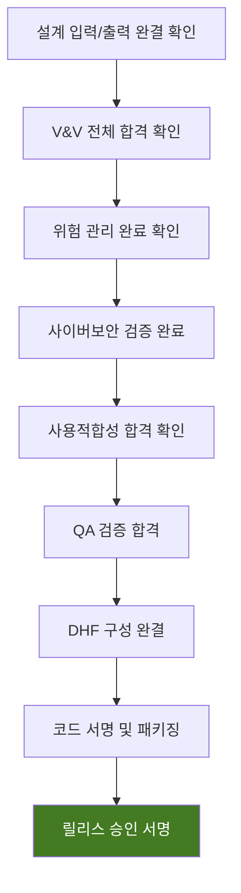

# 소프트웨어 릴리스 문서 (Software Release Document)
## RadiConsole™ GUI Console SW v1.0.0

---

## 문서 메타데이터 (Document Metadata)

| 항목 | 내용 |
|------|------|
| **문서 ID** | SRD-XRAY-GUI-001 |
| **문서명** | RadiConsole™ GUI Console SW 소프트웨어 릴리스 문서 |
| **버전** | v1.0 |
| **작성일** | 2026-03-18 |
| **작성자** | SW 개발팀 |
| **승인자** | 의료기기 RA/QA 책임자, SW 개발 책임자 |
| **상태** | 승인됨 (Approved) |
| **기준 규격** | IEC 62304 §5.8 (Software Release) |

---

## 1. 릴리스 정보 (Release Information)

| 항목 | 값 |
|------|-----|
| **제품명** | RadiConsole™ GUI Console SW |
| **릴리스 버전** | v1.0.0 |
| **빌드 번호** | Build #2026031802-Release |
| **빌드 해시** | SHA-256: [빌드 시 생성] |
| **릴리스 유형** | 최초 릴리스 (Initial Release) |
| **릴리스 범위** | Phase 1 — 핵심 기능 |
| **릴리스 날짜** | 2026-09-01 (예정) |

---

## 2. 릴리스 전 확인 사항 (Pre-Release Checklist)

| # | 확인 항목 | 상태 | 증빙 문서 |
|---|----------|------|----------|
| 1 | V&V 종합 보고서 합격 | ✅ | VVSR-XRAY-GUI-001 |
| 2 | 위험 관리 보고서 완료 | ✅ | RMR-XRAY-GUI-001 |
| 3 | 사이버보안 테스트 합격 | ✅ | CSTR-XRAY-GUI-001 |
| 4 | 사용적합성 테스트 합격 | ✅ | USTR-XRAY-GUI-001 |
| 5 | QA 검증 합격 | ✅ | QAVR-XRAY-GUI-001 |
| 6 | SBOM 최종 확인 | ✅ | SBOM-XRAY-GUI-001 |
| 7 | 모든 결함 해결 | ✅ | 0건 미해결 |
| 8 | 릴리스 노트 작성 | ✅ | 섹션 3 |
| 9 | 사용 설명서 (IFU) 완료 | ✅ | IFU-XRAY-GUI-001 |
| 10 | 코드 서명 완료 | ✅ | 디지털 서명 |

---

## 3. 릴리스 노트 (Release Notes)

### 3.1 신규 기능 (New Features)

| 도메인 | 기능 | 설명 |
|--------|------|------|
| PM | 환자 관리 | Worklist 연동, 환자 등록/검색/수정, 응급 환자 |
| WF | 촬영 워크플로우 | 프로토콜 관리, AEC, 촬영 실행, 재촬영 관리 |
| IP | 영상 표시/처리 | DICOM 뷰어, W/L, 측정, 주석, 비교 |
| DM | 선량 관리 | 실시간 DAP, 누적 선량, DRL 경고, RDSR |
| DC | DICOM/통신 | C-STORE, C-FIND, MWL, MPPS, HL7/FHIR |
| SA | 시스템 관리 | RBAC, 감사 로그, 백업/복원, 설정 관리 |
| CS | 사이버보안 | TLS 1.2+, AES-256, MFA, 세션 관리, SBOM |

### 3.2 알려진 제한 사항 (Known Limitations)

| # | 제한 사항 | 영향 | 해결 계획 |
|---|----------|------|----------|
| 1 | AI 기반 영상 분석 미지원 | Phase 2에서 지원 예정 | v2.0 (2027-Q2) |
| 2 | 클라우드 PACS 연동 미지원 | Phase 2에서 지원 예정 | v2.0 (2027-Q2) |
| 3 | 동시 사용자 5명 제한 | 설계 사양 | 성능 업그레이드 검토 |

---

## 4. 배포 패키지 (Distribution Package)

| 구성요소 | 파일명 | 해시 (SHA-256) |
|---------|--------|---------------|
| 설치 프로그램 | RadiConsole_Setup_v1.0.0.exe | [빌드 시 생성] |
| SBOM (CycloneDX) | RadiConsole_SBOM_v1.0.0.json | [빌드 시 생성] |
| 사용 설명서 | RadiConsole_IFU_v1.0.pdf | [빌드 시 생성] |
| DICOM Conformance | RadiConsole_DCS_v1.0.pdf | [빌드 시 생성] |

---

## 5. 릴리스 승인 (Release Approval)

| 역할 | 이름 | 서명 | 날짜 |
|------|------|------|------|
| SW 개발 책임자 | _______________ | _________ | ____/____/____ |
| QA 팀장 | _______________ | _________ | ____/____/____ |
| RA/QA 책임자 | _______________ | _________ | ____/____/____ |
| 프로젝트 관리자 | _______________ | _________ | ____/____/____ |

---

*문서 끝 (End of Document)*
