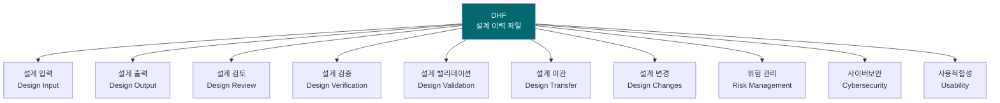
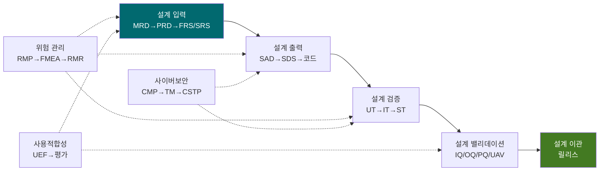

# 설계 이력 파일 (Design History File, DHF)
## HnVue Console SW

---

## 문서 메타데이터 (Document Metadata)

| 항목 | 내용 |
|------|------|
| **문서 ID** | DHF-XRAY-GUI-001 |
| **문서명** | HnVue Console SW 설계 이력 파일 |
| **버전** | v1.0 |
| **작성일** | 2026-03-18 |
| **작성자** | RA/QA 팀 |
| **승인자** | 의료기기 RA/QA 책임자 |
| **상태** | 승인됨 (Approved) |
| **기준 규격** | FDA 21 CFR 820.30(j), ISO 13485:2016 §7.3 |

---

## 1. 목적 (Purpose)

본 설계 이력 파일 (DHF)은 HnVue Console SW의 **설계 관리 (Design Controls)** 활동 전체 이력을 포함하며, FDA 21 CFR 820.30(j) 요구사항을 충족한다.

---

## 2. DHF 구성 (DHF Contents)

### 2.1 DHF 문서 인덱스

### 2.2 설계 입력 (Design Input) — §820.30(c)

| # | 문서 ID | 문서명 | 버전 | 상태 |
|---|---------|--------|------|------|
| 1 | MRD-XRAY-GUI-001 | 시장 요구사항 문서 (MRD) | v2.0 | 승인 |
| 2 | PRD-XRAY-GUI-001 | 제품 요구사항 문서 (PRD) | v3.0 | 승인 |
| 3 | FRS-XRAY-GUI-001 | 기능 요구사항 명세서 (FRS) | v1.0 | 승인 |
| 4 | SRS-XRAY-GUI-001 | 소프트웨어 요구사항 명세서 (SRS) | v1.0 | 승인 |

### 2.3 설계 출력 (Design Output) — §820.30(d)

| # | 문서 ID | 문서명 | 버전 | 상태 |
|---|---------|--------|------|------|
| 5 | SAD-XRAY-GUI-001 | 소프트웨어 아키텍처 문서 (SAD) | v1.0 | 승인 |
| 6 | SDS-XRAY-GUI-001 | 소프트웨어 상세 설계 (SDS) | v1.0 | 승인 |
| 7 | DCS-XRAY-GUI-001 | DICOM 적합성 선언서 | v1.0 | 승인 |
| 8 | IFU-XRAY-GUI-001 | 사용 설명서 (IFU) | v1.0 | 승인 |
| 9 | SRD-XRAY-GUI-001 | 소프트웨어 릴리스 문서 | v1.0 | 승인 |

### 2.4 설계 검증 (Design Verification) — §820.30(f)

| # | 문서 ID | 문서명 | 버전 | 결과 |
|---|---------|--------|------|------|
| 10 | VVP-XRAY-GUI-001 | V&V 마스터 플랜 | v1.0 | 승인 |
| 11 | UTP-XRAY-GUI-001 | 단위 테스트 계획서 | v1.0 | 승인 |
| 12 | UTR-XRAY-GUI-001 | 단위 테스트 결과 보고서 | v1.0 | Pass |
| 13 | ITP-XRAY-GUI-001 | 통합 테스트 계획서 | v1.0 | 승인 |
| 14 | ITR-XRAY-GUI-001 | 통합 테스트 결과 보고서 | v1.0 | Pass |
| 15 | STP-XRAY-GUI-001 | 시스템 테스트 계획서 | v1.0 | 승인 |
| 16 | STR-XRAY-GUI-001 | 시스템 테스트 결과 보고서 | v1.0 | Pass |
| 17 | VVSR-XRAY-GUI-001 | V&V 종합 결과 보고서 | v1.0 | Pass |
| 18 | PTR-XRAY-GUI-001 | 성능 테스트 보고서 | v1.0 | Pass |

### 2.5 설계 밸리데이션 (Design Validation) — §820.30(g)

| # | 문서 ID | 문서명 | 버전 | 결과 |
|---|---------|--------|------|------|
| 19 | VAL-XRAY-GUI-001 | 소프트웨어 밸리데이션 계획서 | v1.0 | 승인 |

### 2.6 위험 관리 (Risk Management)

| # | 문서 ID | 문서명 | 버전 | 상태 |
|---|---------|--------|------|------|
| 20 | RMP-XRAY-GUI-001 | 위험 관리 계획서 | v1.0 | 승인 |
| 21 | FMEA-XRAY-GUI-001 | FMEA/FTA 분석 | v1.0 | 승인 |
| 22 | RMR-XRAY-GUI-001 | 위험 관리 보고서 | v1.0 | 승인 |

### 2.7 사이버보안 (Cybersecurity)

| # | 문서 ID | 문서명 | 버전 | 상태 |
|---|---------|--------|------|------|
| 23 | CMP-XRAY-GUI-001 | 사이버보안 관리 계획서 | v1.0 | 승인 |
| 24 | TM-XRAY-GUI-001 | 위협 모델링 보고서 (STRIDE) | v1.0 | 승인 |
| 25 | CSTP-XRAY-GUI-001 | 사이버보안 테스트 계획서 | v1.0 | 승인 |
| 26 | CSTR-XRAY-GUI-001 | 사이버보안 테스트 결과 보고서 | v1.0 | Pass |
| 27 | SBOM-XRAY-GUI-001 | SBOM | v1.0 | 승인 |
| 28 | SOUP-XRAY-GUI-001 | SOUP/OTS 평가 보고서 | v1.0 | 승인 |

### 2.8 사용적합성 (Usability)

| # | 문서 ID | 문서명 | 버전 | 상태 |
|---|---------|--------|------|------|
| 29 | UEF-XRAY-GUI-001 | 사용적합성 공학 파일 | v1.0 | 승인 |
| 30 | USTR-XRAY-GUI-001 | 사용적합성 테스트 보고서 | v1.0 | Pass |

### 2.9 임상 평가 및 규제

| # | 문서 ID | 문서명 | 버전 | 상태 |
|---|---------|--------|------|------|
| 31 | CEP-XRAY-GUI-001 | 임상 평가 계획서 | v1.0 | 승인 |
| 32 | CER-XRAY-GUI-001 | 임상 평가 보고서 | v1.0 | 승인 |
| 33 | PMS-XRAY-GUI-001 | 시판 후 관리 계획서 | v1.0 | 승인 |

### 2.10 품질/프로젝트 관리

| # | 문서 ID | 문서명 | 버전 | 상태 |
|---|---------|--------|------|------|
| 34 | QAP-XRAY-GUI-001 | QA 테스트 계획서 | v1.0 | 승인 |
| 35 | QAVR-XRAY-GUI-001 | QA 검증 보고서 | v1.0 | Pass |
| 36 | RTM-XRAY-GUI-001 | 요구사항 추적성 매트릭스 | v1.0 | 승인 |
| 37 | DMP-XRAY-GUI-001 | 문서 관리 계획서 | v2.0 | 승인 |
| 38 | WBS-XRAY-GUI-001 | 업무 분해 구조 (WBS) | v4.0 | 승인 |
| 39 | SDP-XRAY-GUI-001 | SW 개발 절차서 | v1.0 | 승인 |
| 40 | SDG-XRAY-GUI-001 | SW 개발 지침서 | v1.0 | 승인 |
| 41 | CVR-XRAY-GUI-001 | 교차 검증 보고서 | v1.0 | 승인 |

---

## 3. 설계 관리 흐름 요약

---

## 4. DHF 보관 (DHF Retention)

| 항목 | 정책 |
|------|------|
| **보관 기간** | 제품 수명 + 10년 (최소 15년) |
| **보관 방법** | 전자 문서 관리 시스템 (EDMS) + 물리적 백업 |
| **접근 통제** | RA/QA 팀 관리, 감사 추적 적용 |

---

*문서 끝 (End of Document)*
