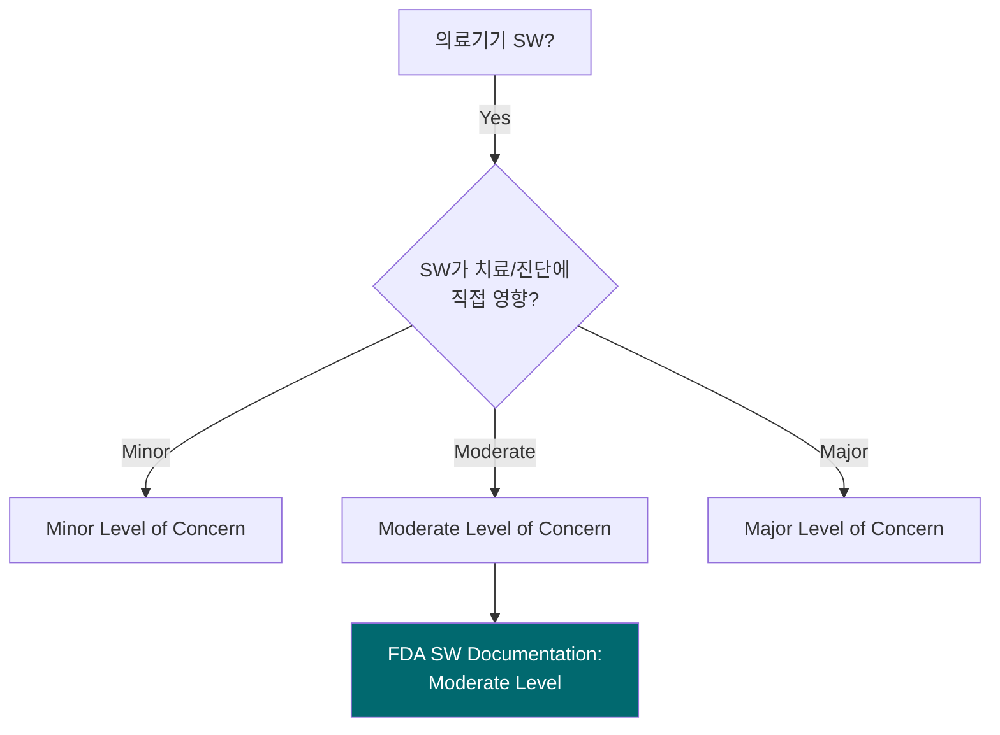

# FDA 510(k) / eSTAR 제출 문서 (FDA 510(k) / eSTAR Submission)
## HnVue Console SW

---

## 문서 메타데이터 (Document Metadata)

| 항목 | 내용 |
|------|------|
| **문서 ID** | FDA-XRAY-GUI-001 |
| **문서명** | HnVue Console SW FDA 510(k) / eSTAR 제출 문서 |
| **버전** | v1.0 |
| **작성일** | 2026-03-18 |
| **작성자** | RA 팀 (Regulatory Affairs) |
| **승인자** | 의료기기 RA/QA 책임자 |
| **상태** | 초안 (Draft — 최종 제출 전 검토 필요) |
| **기준 규격** | FDA 21 CFR 807.87, FDA eSTAR Template, FDA Section 524B |

---

## 1. 제출 개요 (Submission Overview)

| 항목 | 내용 |
|------|------|
| **제출 유형** | 510(k) Premarket Notification |
| **Product Code** | QKQ (Picture Archiving and Communications System) 또는 LLZ |
| **Regulation Number** | 21 CFR 892.2050 |
| **Classification** | Class II |
| **Predicate Device** | [동등 기기 510(k) 번호] |
| **Device Name** | HnVue Console SW |

---

## 2. eSTAR 섹션 매핑 (eSTAR Section Mapping)

### 2.1 eSTAR 체크리스트

| eSTAR 섹션 | 내용 | DHF 참조 문서 | 상태 |
|-----------|------|-------------|------|
| **1. Administrative** | 제조자 정보, 연락처, 대리인 | — | ✅ |
| **2. Device Description** | 제품 설명, 의도된 용도 | MRD, PRD, IFU | ✅ |
| **3. Substantial Equivalence** | 동등성 비교 | CER (동등 기기 분석) | ✅ |
| **4. Proposed Labeling** | 라벨링 (IFU 포함) | IFU-XRAY-GUI-001 | ✅ |
| **5. Software Documentation** | SW 문서 (IEC 62304) | SRS, SAD, SDS, V&V 보고서 | ✅ |
| **6. Cybersecurity** | 사이버보안 문서 (Section 524B) | CMP, TM, SBOM, CSTP, CSTR | ✅ |
| **7. Performance Testing** | 성능 테스트 데이터 | PTR, STR | ✅ |
| **8. Biocompatibility** | 생체적합성 | N/A (순수 소프트웨어) | N/A |
| **9. Electrical Safety** | 전기 안전 | N/A (SW-only) | N/A |
| **10. Clinical Data** | 임상 데이터 | CER-XRAY-GUI-001 | ✅ |
| **11. Risk Management** | 위험 관리 | RMP, FMEA, RMR | ✅ |
| **12. Human Factors** | 인적 요인 | UEF, USTR | ✅ |

---

## 3. FDA SW 문서 레벨 결정 (SW Documentation Level)

### 3.1 SW 레벨 결정

**결정**: HnVue은 영상 표시 및 촬영 파라미터 제어에 관여하므로 **Moderate Level of Concern**으로 분류한다.

### 3.2 Moderate Level 필수 문서

| FDA 요구 항목 | DHF 문서 | 제출 여부 |
|-------------|---------|----------|
| Software Description | SAD-XRAY-GUI-001 | ✅ |
| Device Hazard Analysis | FMEA-XRAY-GUI-001 | ✅ |
| Software Requirements Specification | SRS-XRAY-GUI-001 | ✅ |
| Architecture Design Chart | SAD-XRAY-GUI-001 | ✅ |
| Software Design Specification | SDS-XRAY-GUI-001 | ✅ |
| Traceability Analysis | RTM-XRAY-GUI-001 | ✅ |
| Software Development Environment | SDP-XRAY-GUI-001 | ✅ |
| V&V Documentation | VVP, UTR, ITR, STR, VVSR | ✅ |
| Revision Level History | 각 문서 개정 이력 | ✅ |
| Unresolved Anomalies | 0건 | ✅ |

---

## 4. Section 524B 사이버보안 제출 패키지

FDA Section 524B에 따라 Cyber Device 필수 제출 항목:

| # | 항목 | 제출 문서 | 상태 |
|---|------|----------|------|
| 1 | Cybersecurity Management Plan | CMP-XRAY-GUI-001 | ✅ |
| 2 | Threat Model | TM-XRAY-GUI-001 | ✅ |
| 3 | Cybersecurity Test Plan & Report | CSTP/CSTR-XRAY-GUI-001 | ✅ |
| 4 | SBOM (CycloneDX) | SBOM-XRAY-GUI-001 | ✅ |
| 5 | Software Update/Patch Plan | CMP §7 (업데이트 절차) | ✅ |
| 6 | Vulnerability Disclosure Policy | CMP §8 (VDP) | ✅ |

---

## 5. 제출 일정 (Submission Timeline)

| 단계 | 목표일 | 비고 |
|------|--------|------|
| eSTAR 초안 완성 | 2026-09-15 | 내부 검토 |
| RA 팀 최종 검토 | 2026-09-30 | |
| FDA 전자 제출 | 2026-10-15 | eSTAR portal |
| FDA 검토 (90일 예상) | 2027-01-15 | Substantial Equivalence 판단 |

---

*문서 끝 (End of Document)*
