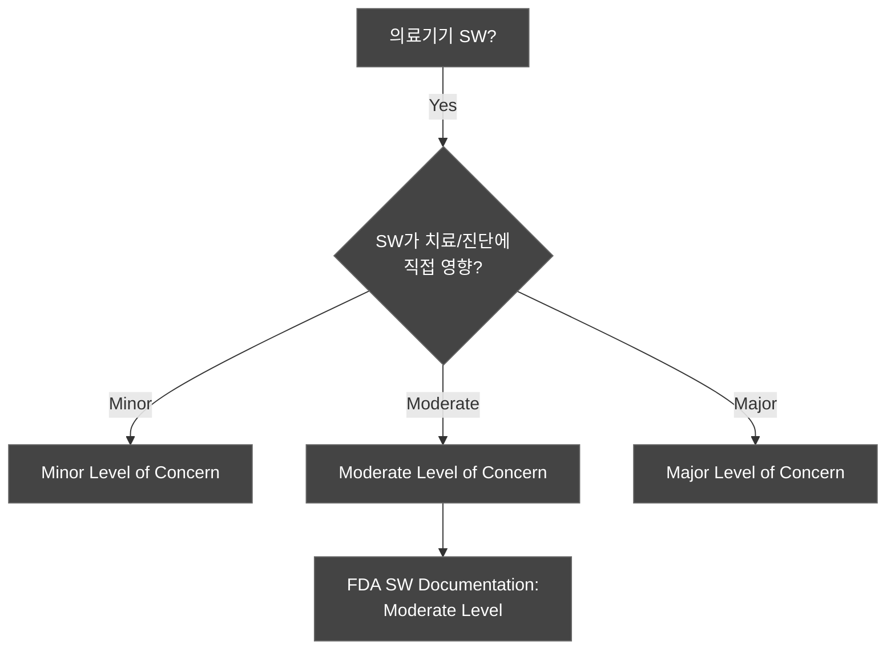
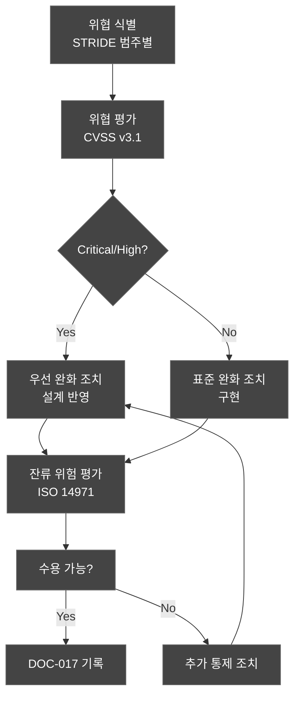
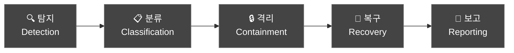

# FDA 510(k) / eSTAR 제출 문서 (FDA 510(k) / eSTAR Submission)
## HnVue Console SW

---

## 문서 메타데이터 (Document Metadata)

| 항목 | 내용 |
|------|------|
| **문서 ID** | FDA-XRAY-GUI-001 |
| **문서명** | HnVue Console SW FDA 510(k) / eSTAR 제출 문서 |
| **버전** | v2.0 |
| **작성일** | 2026-04-02 |
| **작성자** | RA 팀 (Regulatory Affairs) |
| **승인자** | 의료기기 RA/QA 책임자 |
| **상태** | 초안 (Draft — 최종 제출 전 검토 필요) |
| **기준 규격** | FDA 21 CFR 807.87, FDA eSTAR Template, FDA Section 524B, IEC 81001-5-1:2021 |

### 개정 이력 (Revision History)

| 버전 | 날짜 | 변경 내용 | 작성자 |
|------|------|----------|--------|
| v1.0 | 2026-03-18 | 최초 작성 | RA 팀 |
| v2.0 | 2026-04-02 | 사이버보안 섹션 강화 (인시던트 대응 계획, SW 업데이트 메커니즘, STRIDE 위협 모델링), MR-072 CD/DVD Burning 기능 반영, Predicate 비교 EConsole1 (K231225) 정보 업데이트 | RA 팀 |

---

## 1. 제출 개요 (Submission Overview)

| 항목 | 내용 |
|------|------|
| **제출 유형** | 510(k) Premarket Notification |
| **Product Code** | QKQ (Picture Archiving and Communications System) 또는 LLZ |
| **Regulation Number** | 21 CFR 892.2050 |
| **Classification** | Class II |
| **Predicate Device** | EConsole1 (DRTECH Corp., K231225) — 주 Predicate |
| **Device Name** | HnVue Console SW |

---

## 2. eSTAR 섹션 매핑 (eSTAR Section Mapping)

### 2.1 eSTAR 체크리스트

| eSTAR 섹션 | 내용 | DHF 참조 문서 | 상태 |
|-----------|------|-------------|------|
| **1. Administrative** | 제조자 정보, 연락처, 대리인 | — | ✅ |
| **2. Device Description** | 제품 설명, 의도된 용도 | MRD, PRD, IFU | ✅ |
| **3. Substantial Equivalence** | 동등성 비교 | DOC-050 Predicate Comparison (EConsole1 K231225) | ✅ |
| **4. Proposed Labeling** | 라벨링 (IFU 포함) | IFU-XRAY-GUI-001 | ✅ |
| **5. Software Documentation** | SW 문서 (IEC 62304) | SRS, SAD, SDS, V&V 보고서 | ✅ |
| **6. Cybersecurity** | 사이버보안 문서 (Section 524B) | CMP, TM, SBOM, CSTP, CSTR | ✅ |
| **7. Performance Testing** | 성능 테스트 데이터 | PTR, STR | ✅ |
| **8. Biocompatibility** | 생체적합성 | N/A (순수 소프트웨어) | N/A |
| **9. Electrical Safety** | 전기 안전 | N/A (SW-only) | N/A |
| **10. Clinical Data** | 임상 데이터 | CER-XRAY-GUI-001 | ✅ |
| **11. Risk Management** | 위험 관리 | RMP, FMEA, RMR | ✅ |
| **12. Human Factors** | 인적 요인 | UEF, USTR | ✅ |

---

## 3. FDA SW 문서 레벨 결정 (SW Documentation Level)

### 3.1 SW 레벨 결정

**결정**: HnVue은 영상 표시 및 촬영 파라미터 제어에 관여하므로 **Moderate Level of Concern**으로 분류한다.

### 3.2 Moderate Level 필수 문서

| FDA 요구 항목 | DHF 문서 | 제출 여부 |
|-------------|---------|----------|
| Software Description | SAD-XRAY-GUI-001 | ✅ |
| Device Hazard Analysis | FMEA-XRAY-GUI-001 | ✅ |
| Software Requirements Specification | SRS-XRAY-GUI-001 | ✅ |
| Architecture Design Chart | SAD-XRAY-GUI-001 | ✅ |
| Software Design Specification | SDS-XRAY-GUI-001 | ✅ |
| Traceability Analysis | RTM-XRAY-GUI-001 | ✅ |
| Software Development Environment | SDP-XRAY-GUI-001 | ✅ |
| V&V Documentation | VVP, UTR, ITR, STR, VVSR | ✅ |
| Revision Level History | 각 문서 개정 이력 | ✅ |
| Unresolved Anomalies | 0건 | ✅ |

---

## 4. Section 524B 사이버보안 제출 패키지

FDA Section 524B에 따라 Cyber Device 필수 제출 항목:

| # | 항목 | 제출 문서 | 상태 |
|---|------|----------|------|
| 1 | Cybersecurity Management Plan | CMP-XRAY-GUI-001 | ✅ |
| 2 | Threat Model (STRIDE 기반) | TM-XRAY-GUI-001 (DOC-017) | ✅ |
| 3 | Cybersecurity Test Plan & Report | CSTP/CSTR-XRAY-GUI-001 | ✅ |
| 4 | SBOM (CycloneDX) | SBOM-XRAY-GUI-001 (DOC-019) | ✅ |
| 5 | Software Update/Patch Plan | CMP §7 + DOC-046 통제 8 | ✅ |
| 6 | Vulnerability Disclosure Policy | CMP §8 (VDP) | ✅ |
| 7 | Incident Response Plan | DOC-046 §9 (인시던트 대응) | ✅ |

---

## 5. 사이버보안 상세 — Section 524B 요건 충족

### 5.1 STRIDE 위협 모델링 (IEC 81001-5-1 Clause 5.2 기반)

본 제출은 Microsoft STRIDE 방법론과 IEC 81001-5-1:2021 Clause 5.2 요구사항에 따라 수행된 위협 모델링 결과를 포함한다. 상세 내용은 DOC-017 (TM-XRAY-GUI-001)을 참조한다.

| STRIDE 범주 | 식별 위협 수 | 대표 위협 | 완화 상태 |
|------------|------------|----------|----------|
| Spoofing (스푸핑) | 5 | LDAP 자격증명 탈취, 세션 하이재킹 | 모두 완화 |
| Tampering (변조) | 6 | DICOM 영상 변조, SW 업데이트 변조 | 모두 완화 |
| Repudiation (부인) | 3 | 촬영 행위 부인, 설정 변경 부인 | 모두 완화 |
| Information Disclosure (정보 유출) | 5 | PHI 네트워크 스니핑 | 모두 완화 |
| Denial of Service (서비스 거부) | 5 | DICOM Association Flooding | 모두 완화 |
| Elevation of Privilege (권한 상승) | 4 | SQL Injection, DLL Injection | 모두 완화 |
| **합계** | **28** | | **전체 완화 적용** |

### 5.2 인시던트 대응 계획 (Incident Response Plan)

IEC 81001-5-1:2021 Clause 8 및 FDA Section 524B(b)(2) 요구사항에 따라 다음 절차를 수립한다. 상세 명세는 DOC-046 §9를 참조한다.

#### 5.2.1 인시던트 대응 프로세스 (탐지→분류→격리→복구→보고)

| 단계 | 활동 | 담당 | 시간 목표 |
|------|------|------|----------|
| **1. 탐지 (Detection)** | 감사 로그 이상 탐지, 사용자 신고, 외부 취약점 보고 수신 | 사이버보안 팀 / 자동화 모니터링 | 즉시 |
| **2. 분류 (Classification)** | 인시던트 심각도 평가 (Critical/High/Medium/Low), 영향 자산 식별 | 사이버보안 팀장 | 2시간 이내 |
| **3. 격리 (Containment)** | 영향 시스템 네트워크 격리, 악성 세션 종료, 안전 상태 진입 | 사이버보안 팀 + SW 팀 | Critical: 4시간, High: 24시간 |
| **4. 복구 (Recovery)** | 클린 이미지 복원, 패치 적용, 기능 검증 후 운영 재개 | SW 팀 + QA 팀 | RTO: 24시간 (Critical) |
| **5. 보고 (Reporting)** | FDA MITRE CVE 신고 (해당 시), 고객 통지, 내부 RCA 보고서 작성 | RA 팀 + 사이버보안 팀 | 30일 이내 (FDA 기준) |

#### 5.2.2 인시던트 심각도 분류 기준

| 심각도 | 기준 | 대응 SLA |
|--------|------|----------|
| **Critical** | 환자 안전 직접 위협 또는 PHI 대규모 유출 | 격리 4시간, 보고 즉시 |
| **High** | 시스템 가용성 심각 손상 또는 PHI 소규모 유출 | 격리 24시간, 보고 72시간 |
| **Medium** | 기능 일부 저하, 취약점 악용 가능성 | 패치 30일, 보고 내부 |
| **Low** | 잠재적 취약점, 즉각 위험 없음 | 패치 90일, 모니터링 |

### 5.3 SW 업데이트 메커니즘 (FDA 524B(b)(2) 요구사항)

FDA FD&C Act §524B(b)(2)에 따라 HnVue Console SW는 다음 안전한 SW 업데이트 메커니즘을 구현한다. 상세 구현 계획은 DOC-046 통제 8을 참조한다.

| 항목 | 구현 방법 | 표준 근거 |
|------|----------|----------|
| **서명된 업데이트 패키지** | Microsoft Authenticode 코드 서명 (RSA-2048 이상) — 서명 미검증 시 설치 차단 | FDA 524B(b)(2), NIST SP 800-193 |
| **무결성 검증** | SHA-256 체크섬 릴리즈 노트 포함 + 설치 전 자동 검증 | NIST FIPS 180-4 |
| **롤백 기능** | 업데이트 실패 또는 검증 오류 시 이전 버전 자동 복원 (IFU §업데이트 절차 포함) | FDA 524B(b)(2) |
| **업데이트 채널 보안** | HTTPS (TLS 1.2+) 전용 채널; Man-in-the-Middle 방지 | NIST SP 800-52 Rev.2 |
| **SBOM 연동** | 업데이트 릴리즈 시 SBOM (DOC-019) 자동 갱신 및 VEX 업데이트 | FDA 524B |

---

## 6. MR-072 CD/DVD Burning 기능 반영

MRD v3.0 신규 요구사항 MR-072 (Tier 2 — 시장 진입 필수)에 따라 HnVue Console SW는 CD/DVD Burning with DICOM Viewer 기능을 Phase 1 범위에 포함한다.

### 6.1 기능 개요

| 항목 | 내용 |
|------|------|
| **MR ID** | MR-072 |
| **기능명** | CD/DVD Burning with DICOM Viewer |
| **Tier** | Tier 2 (시장 진입 필수 — feel-DRCS 기본 기능, Xmaru V1 기본 기능) |
| **Phase** | Phase 1 |
| **의도된 사용** | 촬영 완료된 DICOM 영상을 환자 배포용 CD/DVD로 굽고, 번들 DICOM 뷰어를 포함하여 배포 |
| **규제 영향** | PHI 포함 이동식 미디어 — 암호화 또는 접근 제어 적용 필요 (HIPAA §164.312) |

### 6.2 eSTAR 관련 섹션 반영

| eSTAR 섹션 | MR-072 반영 내용 |
|-----------|----------------|
| 2. Device Description | CD/DVD Burning 기능을 제품 설명에 포함 |
| 5. Software Documentation | SDS CD Burning 모듈 설계 포함 (SDS-CD-10xx) |
| 6. Cybersecurity | 이동식 미디어 PHI 보호 — 암호화 또는 비밀번호 보호 |
| 11. Risk Management | HAZ-WF-010 (CD 데이터 유실) 위험 관리 |

### 6.3 사이버보안 고려사항 (MR-072)

CD/DVD에 포함되는 PHI (환자 영상, 메타데이터)는 다음 보호 조치를 적용한다:

- **미디어 암호화**: CD/DVD 내 DICOM 데이터 AES-256 암호화 (해당 시) 또는 비밀번호 보호된 DICOM Viewer 래퍼 적용
- **접근 제어**: CD/DVD 생성 시 Admin 또는 Radiologist 권한 필요 (RBAC 적용)
- **감사 로그**: CD/DVD 생성 이벤트 (환자 ID, 생성자, 생성 시각) 감사 로그 기록
- **IFU 포함**: 이동식 미디어 취급 지침 — 분실/도난 시 대응 절차 포함

---

## 7. Predicate Device 비교 — EConsole1 (K231225)

FDA 510(k) 제출의 주 Predicate Device로 DRTECH Corp.의 **EConsole1 (K231225)**를 활용한다. 상세 비교는 DOC-050 (Predicate Device 비교표)을 참조한다.

### 7.1 EConsole1 (K231225) 기본 정보

| 항목 | 내용 |
|------|------|
| **제품명** | EConsole1 |
| **제조사** | DRTECH Corp. |
| **510(k) 번호** | K231225 |
| **제품 코드** | LLZ |
| **분류 규정** | 21 CFR §892.2050 |
| **Decision** | Substantially Equivalent |
| **활용 전략** | 주 Predicate (의도된 사용 + 기술 특성 전체 비교) |

### 7.2 동등성 비교 요약 (Subject vs. EConsole1)

| 비교 항목 | HnVue Console SW | EConsole1 (K231225) | SE 판정 |
|----------|-----------------|--------------------|---------| 
| **의도된 사용** | DR X-ray 영상 획득·표시·처리·저장·PACS 전송 | DR X-ray 영상 획득·표시·처리·저장·PACS 전송 | ✅ 동등 |
| **제품 코드** | LLZ | LLZ | ✅ 동등 |
| **분류 규정** | 21 CFR §892.2050 | 21 CFR §892.2050 | ✅ 동등 |
| **SW 플랫폼** | Windows 10/11 IoT Enterprise | Windows 기반 | ✅ 동등 |
| **DICOM 지원** | DICOM 3.0 (C-STORE, MWL, MPPS 등) | DICOM 3.0 | ✅ 동등 |
| **CD/DVD Burning** | ✅ 지원 (MR-072) | ✅ 지원 | ✅ 동등 |
| **사이버보안** | FDA 524B 완전 충족 (SBOM, 위협 모델, IRP) | FDA 524B 기준 적용 | ✅ 동등 이상 |
| **STRIDE 위협 모델링** | ✅ IEC 81001-5-1 Clause 5.2 기반 | 해당 시 기준 적용 | ✅ 동등 이상 |

> **MRD v3.0 참조**: EConsole1 (K231225)는 MRD v3.0 4-Tier 우선순위 체계의 벤치마크 기기로 활용된다. Tier 3 기준: "EConsole1 FDA K231225에 미포함, 경쟁 차별화" 항목은 새로운 안전성/유효성 문제를 제기하지 않는다.

---

## 8. 제출 일정 (Submission Timeline)

| 단계 | 목표일 | 비고 |
|------|--------|------|
| eSTAR 초안 완성 | 2026-09-15 | 내부 검토 |
| RA 팀 최종 검토 | 2026-09-30 | |
| FDA 전자 제출 | 2026-10-15 | eSTAR portal |
| FDA 검토 (90일 예상) | 2027-01-15 | Substantial Equivalence 판단 |

---

## 9. 관련 문서 참조

| 문서 ID | 문서명 | 관련 사항 |
|--------|--------|----------|
| DOC-017 | 위협 모델링 보고서 (STRIDE) | STRIDE 분석 28개 위협 전체 |
| DOC-019 | SBOM | CycloneDX 구성요소 목록 |
| DOC-046 | 사이버보안 핵심 통제 명세서 | 8대 통제 + 인시던트 대응 §9 |
| DOC-050 | Predicate Device 비교표 | EConsole1 K231225 상세 비교 |
| DOC-008 | 위험 관리 계획서 | HAZ-WF-010 (CD 데이터 유실) |

---

*문서 끝 (End of Document)*
*DOC-036 | HnVue Console SW | FDA 510(k) eSTAR | v2.0 | 2026-04-02*
