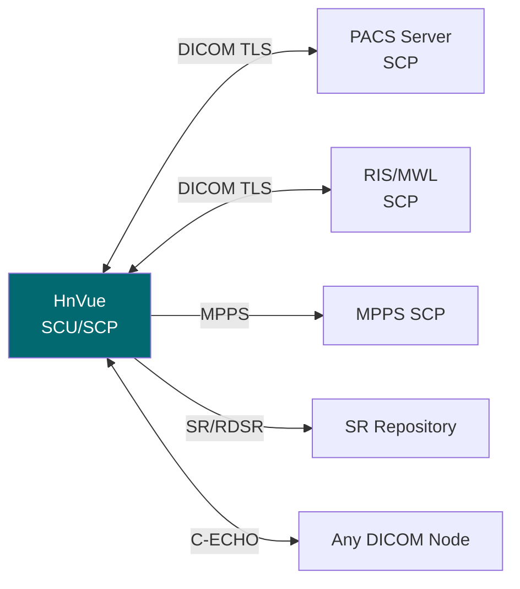

# DICOM 적합성 선언서 (DICOM Conformance Statement)
## HnVue Console SW

---

## 문서 메타데이터 (Document Metadata)

| 항목 | 내용 |
|------|------|
| **문서 ID** | DCS-XRAY-GUI-001 |
| **문서명** | HnVue Console SW DICOM 적합성 선언서 |
| **버전** | v1.0 |
| **작성일** | 2026-03-18 |
| **작성자** | DICOM 엔지니어링 팀 |
| **기준 규격** | DICOM PS3.2 (Conformance), NEMA PS3.1-PS3.20, IHE RAD TF |
| **상태** | 승인됨 (Approved) |

### 개정 이력

| 버전 | 날짜 | 변경 내용 | 작성자 |
|------|------|----------|--------|
| v1.0 | 2026-03-18 | 최초 작성 — Phase 1 DICOM 서비스 | DICOM 팀 |

---

## 1. 개요 (Overview)

### 1.1 적용 대상
HnVue Console SW v1.0 — HnVue Console Software (IEC 62304 Class B)

### 1.2 네트워크 구성

---

## 2. 구현 모델 (Implementation Model)

### 2.1 애플리케이션 엔터티 (Application Entity)

| 항목 | 값 |
|------|-----|
| **AE Title** | HNVUE (기본값, 설정 변경 가능) |
| **Maximum PDU Size** | 16,384 bytes (수신), 16,384 bytes (송신) |
| **Implementation Class UID** | 1.2.840.xxxxx.1.1.1 |
| **Implementation Version** | HNVUE_V10 |

### 2.2 지원 전송 구문 (Transfer Syntaxes)

| Transfer Syntax | UID | 역할 |
|----------------|-----|------|
| Implicit VR Little Endian | 1.2.840.10008.1.2 | SCU/SCP |
| Explicit VR Little Endian | 1.2.840.10008.1.2.1 | SCU/SCP |
| JPEG Baseline (Process 1) | 1.2.840.10008.1.2.4.50 | SCU/SCP |
| JPEG Lossless (Process 14, SV1) | 1.2.840.10008.1.2.4.70 | SCU/SCP |
| JPEG-LS Lossless | 1.2.840.10008.1.2.4.80 | SCU/SCP |
| JPEG 2000 Lossless | 1.2.840.10008.1.2.4.90 | SCU/SCP |
| JPEG 2000 Lossy | 1.2.840.10008.1.2.4.91 | SCU |
| RLE Lossless | 1.2.840.10008.1.2.5 | SCU/SCP |
| Deflated Explicit VR LE | 1.2.840.10008.1.2.1.99 | SCU/SCP |

---

## 3. DICOM 서비스 (SOP Classes)

### 3.1 SCU (Service Class User) 역할

| SOP Class | UID | 서비스 | 설명 |
|-----------|-----|--------|------|
| CR Image Storage | 1.2.840.10008.5.1.4.1.1.1 | C-STORE SCU | CR 영상 PACS 전송 |
| DX Image Storage | 1.2.840.10008.5.1.4.1.1.1.1 | C-STORE SCU | DX 영상 PACS 전송 |
| Secondary Capture | 1.2.840.10008.5.1.4.1.1.7 | C-STORE SCU | 스크린 캡처 전송 |
| Modality Worklist | 1.2.840.10008.5.1.4.31 | C-FIND SCU | Worklist 조회 |
| MPPS | 1.2.840.10008.3.1.2.3.3 | N-CREATE/N-SET SCU | 촬영 상태 보고 |
| Patient Root Q/R | 1.2.840.10008.5.1.4.1.2.1.x | C-FIND/C-MOVE SCU | 환자 기반 쿼리 |
| Study Root Q/R | 1.2.840.10008.5.1.4.1.2.2.x | C-FIND/C-MOVE SCU | 스터디 기반 쿼리 |
| Radiation Dose SR | 1.2.840.10008.5.1.4.1.1.88.67 | C-STORE SCU | 선량 보고서 (RDSR) |
| Verification | 1.2.840.10008.1.1 | C-ECHO SCU | 연결 확인 |
| Storage Commitment | 1.2.840.10008.1.20.1 | N-ACTION SCU | 저장 확인 요청 |

### 3.2 SCP (Service Class Provider) 역할

| SOP Class | UID | 서비스 | 설명 |
|-----------|-----|--------|------|
| CR/DX Image Storage | (위와 동일) | C-STORE SCP | 외부 장비 영상 수신 |
| Verification | 1.2.840.10008.1.1 | C-ECHO SCP | 연결 확인 응답 |
| Storage Commitment | 1.2.840.10008.1.20.1 | N-EVENT-REPORT SCP | 저장 확인 수신 |

---

## 4. IHE 프로파일 (IHE Integration Profiles)

| IHE Profile | Actor | 지원 트랜잭션 |
|-------------|-------|-------------|
| Scheduled Workflow (SWF) | Acquisition Modality | RAD-5 (MWL), RAD-6 (MPPS), RAD-8 (C-STORE) |
| Consistent Presentation of Images (CPI) | Display | RAD-28 (GSDF 표시) |
| Radiation Exposure Monitoring (REM) | Acquisition Modality | RAD-63 (RDSR) |
| Basic Security | Secure Node | ITI-19 (TLS), ITI-20 (ATNA) |

---

## 5. 보안 프로파일 (Security Profiles)

| 보안 프로파일 | 지원 | 설명 |
|-------------|------|------|
| **Basic TLS Secure Transport** | ✅ 지원 | TLS 1.2/1.3, 상호 인증 |
| **AES TLS Secure Transport** | ✅ 지원 | AES-256-GCM 암호 스위트 |
| **Basic Digital Signatures** | ✅ 지원 | RDSR 디지털 서명 |
| **Audit Trail** | ✅ 지원 | ATNA 형식 감사 로그 |
| **Username/Password Auth** | ✅ 지원 | LDAP/AD 연동 인증 |

---

## 6. 문자 셋 지원 (Character Sets)

| 문자 셋 | Specific Character Set 값 | 지원 |
|---------|-------------------------|------|
| Default (ISO IR 6) | (없음) | ✅ |
| Latin-1 | ISO_IR 100 | ✅ |
| Korean (KS X 1001) | ISO 2022 IR 149 | ✅ |
| UTF-8 | ISO_IR 192 | ✅ |
| Japanese (JIS X 0208) | ISO 2022 IR 87 | ✅ |

---

## 7. 연결 타임아웃 (Communication Timeouts)

| 파라미터 | 값 | 비고 |
|---------|-----|------|
| TCP Connection Timeout | 30초 | 연결 시도 제한 |
| ARTIM Timeout | 30초 | Association 응답 대기 |
| DIMSE Timeout | 120초 | 서비스 명령 응답 대기 |
| Idle Timeout | 600초 | 유휴 Association 자동 해제 |

---

*문서 끝 (End of Document)*
