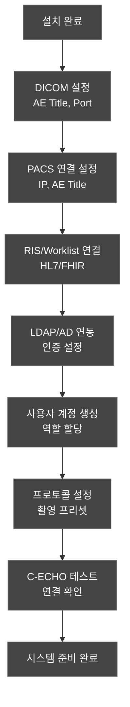

# 사용 설명서 (Instructions for Use, IFU)
## HnVue Console SW

---

## 문서 메타데이터 (Document Metadata)

| 항목 | 내용 |
|------|------|
| **문서 ID** | IFU-XRAY-GUI-001 |
| **문서명** | HnVue Console SW 사용 설명서 |
| **버전** | v1.0 |
| **작성일** | 2026-03-18 |
| **작성자** | 기술 문서 팀 (Technical Documentation) |
| **승인자** | RA/QA 책임자 |
| **상태** | 승인됨(Approved) |
| **기준 규격** | EU MDR 2017/745 Annex I §23, FDA 21 CFR 801, IEC 62366-1 |

---

## 1. 의료기기 식별 정보 (Device Identification)

| 항목 | 내용 |
|------|------|
| **제품명** | HnVue Console SW |
| **모델/버전** | v1.0 (Phase 1) |
| **분류** | 의료기기 소프트웨어 (SaMD) — IEC 62304 Class B |
| **제조자** | [제조사명] |
| **UDI-DI** | [발급 예정] |
| **의도된 용도** | 의료용 진단 X-Ray 촬영장치의 GUI 콘솔 소프트웨어 |

---

## 2. 의도된 사용 (Intended Use)

HnVue Console SW는 의료 전문가(방사선사, 영상의학과 전문의)가 진단 X-Ray 촬영장치를 조작하여 진단 목적의 X-Ray 영상을 획득, 표시, 처리 및 전송하는 데 사용되는 소프트웨어입니다.

### 2.1 적응증 (Indications for Use)
- 일반 진단 X-Ray 촬영 (흉부, 복부, 사지, 척추 등)
- CR/DX 영상 획득 및 디스플레이
- DICOM 영상 PACS 전송
- 촬영 선량 기록 및 관리

### 2.2 금기사항 (Contraindications)
- 치료 목적의 방사선 조사 제어 (Radiation Therapy)에 사용 불가
- 독립적 진단 결정 도구가 아님 (반드시 의료 전문가 판단 필요)
- CT, MRI, 초음파 등 X-Ray 이외 모달리티에 사용 불가

### 2.3 대상 사용자

| 사용자 | 자격 요건 | 교육 필요 |
|--------|----------|----------|
| 방사선사 (Radiologic Technologist) | 해당 국가 면허/자격 | 제품 교육 2시간 |
| 영상의학과 전문의 (Radiologist) | 전문의 자격 | 영상 뷰어 교육 1시간 |
| 시스템 관리자 | IT 담당자 | 관리자 교육 2시간 |

---

## 3. 안전 정보 (Safety Information)

### 3.1 경고 (Warnings) ⚠️

| # | 경고 사항 |
|---|----------|
| W-001 | 촬영 전 반드시 환자 정보 (이름, ID)를 확인하십시오. 잘못된 환자에 대한 촬영은 불필요한 방사선 피폭을 유발합니다. |
| W-002 | 촬영 파라미터 (kVp, mAs)를 확인하십시오. 부적절한 설정은 과다 방사선 피폭을 유발할 수 있습니다. |
| W-003 | 소아 환자에게는 반드시 소아 전용 프로토콜을 사용하십시오. |
| W-004 | DRL (Diagnostic Reference Level) 초과 경고 시 촬영 파라미터를 검토하십시오. |
| W-005 | 시스템 오류 또는 비정상 동작 시 즉시 촬영을 중단하고 서비스 담당자에게 연락하십시오. |
| W-006 | L/R (좌/우) 마커를 반드시 정확하게 표시하십시오. |

### 3.2 주의 (Cautions)

| # | 주의 사항 |
|---|----------|
| C-001 | 승인된 사용자만 시스템에 접근할 수 있습니다. 자격증명을 타인과 공유하지 마십시오. |
| C-002 | 정기적으로 DICOM 영상의 PACS 전송 상태를 확인하십시오. |
| C-003 | 시스템 업데이트는 제조사가 제공하는 공식 패키지만 사용하십시오. |

---

## 4. 시스템 요구사항 (System Requirements)

| 항목 | 최소 사양 | 권장 사양 |
|------|----------|----------|
| **OS** | Windows 10 IoT Enterprise LTSC 2021 | 동일 |
| **CPU** | Intel Core i5-10400 (6코어) | Intel Core i7-12700 (12코어) |
| **RAM** | 16 GB | 32 GB |
| **저장장치** | SSD 256 GB | SSD 512 GB |
| **GPU** | 통합 그래픽 | NVIDIA RTX 3060 |
| **디스플레이** | 1920×1080 (Full HD) | 의료용 모니터 2× (DICOM GSDF) |
| **네트워크** | 1 Gbps Ethernet | 1 Gbps Ethernet |

---

## 5. 설치 및 설정 (Installation and Setup)

### 5.1 설치 절차
1. 설치 매체 (USB/네트워크) 삽입
2. `HnVue_Setup_v1.0.exe` 실행
3. 설치 마법사 지시에 따라 진행
4. DICOM 설정 구성 (AE Title, PACS IP/Port)
5. LDAP/AD 인증 서버 설정
6. 초기 관리자 계정 생성
7. 시스템 테스트 (C-ECHO) 실행

### 5.2 초기 구성

---

## 6. 기본 조작 (Basic Operation)

### 6.1 시스템 시작/종료
- **시작**: Windows 시작 시 자동 실행 또는 바탕화면 아이콘 더블클릭
- **종료**: 메뉴 → 시스템 → 종료 (모든 전송 완료 확인 후)

### 6.2 로그인/로그아웃
- **로그인**: 사용자 ID + 비밀번호 (+ MFA, 설정 시)
- **자동 잠금**: 설정된 유휴 시간 후 자동 화면 잠금
- **로그아웃**: 화면 우상단 사용자 메뉴 → 로그아웃

### 6.3 표준 촬영 워크플로우

### 6.4 주요 기능 요약

| 기능 | 설명 | 메뉴 위치 |
|------|------|----------|
| 환자 등록 | 신규 환자 수동 등록 | 환자 → 신규 등록 |
| Worklist | RIS Worklist 조회/환자 선택 | 환자 → Worklist |
| 촬영 프로토콜 | 해부학적 부위별 프리셋 | 촬영 → 프로토콜 |
| 영상 뷰어 | W/L 조절, 확대, 측정, 주석 | 영상 → 뷰어 |
| 선량 정보 | DAP, 누적 선량, DRL 상태 | 선량 → 대시보드 |
| PACS 전송 | DICOM C-STORE 영상 전송 | 영상 → PACS 전송 |
| 시스템 관리 | 사용자 관리, 설정, 감사 로그 | 시스템 → 관리 |

---

## 7. 사이버보안 관리 (Cybersecurity Management)

### 7.1 사용자 책임 사항
1. 강력한 비밀번호 사용 (12자 이상, 대소문자+숫자+특수문자)
2. 비밀번호를 타인과 공유하지 않기
3. 사용 후 반드시 로그아웃
4. 의심스러운 활동 발견 시 즉시 관리자에게 보고
5. 승인되지 않은 USB 장치를 연결하지 않기

### 7.2 소프트웨어 업데이트
- 제조사가 제공하는 공식 업데이트만 설치
- 업데이트 설치 전 데이터 백업 권고
- 업데이트 서명 검증 자동 수행

---

## 8. 문제 해결 (Troubleshooting)

| 증상 | 원인 | 해결 방법 |
|------|------|----------|
| PACS 전송 실패 | 네트워크 연결 끊김 | 네트워크 확인 후 재전송 (자동 재시도) |
| Worklist 조회 안됨 | RIS 서버 연결 불가 | RIS 서버 상태 확인, 네트워크 확인 |
| 로그인 실패 | 계정 잠금 (5회 실패) | 15분 후 재시도 또는 관리자 잠금 해제 |
| 영상 표시 안됨 | 지원되지 않는 Transfer Syntax | DICOM 설정 확인, 코덱 확인 |
| 시스템 느려짐 | 디스크 공간 부족 | 오래된 로컬 영상 정리 |

---

## 9. 유지보수 (Maintenance)

- **일일**: 시스템 상태 확인, 전송 실패 목록 점검
- **주간**: 로컬 저장소 공간 확인, 감사 로그 검토
- **월간**: 시스템 백업, 보안 업데이트 확인
- **연간**: 종합 시스템 점검 (서비스 엔지니어)

---

## 10. 기술 지원 (Technical Support)

| 항목 | 내용 |
|------|------|
| **서비스 핫라인** | [전화번호] |
| **이메일** | [support@company.com] |
| **운영 시간** | 평일 09:00-18:00 (KST) |
| **긴급 연락** | 24/7 긴급 서비스 [전화번호] |

---

*문서 끝 (End of Document)*
