# 위험 관리 계획서 (Risk Management Plan)
## HnVue GUI Console SW

---

| 항목 | 내용 |
|------|------|
| **문서 ID** | RMP-XRAY-GUI-001 |
| **버전** | v1.0 |
| **작성일** | 2026-03-16 |
| **작성자** | SW 개발팀 / 품질보증팀 |
| **승인자** | 의료기기 규제 책임자 (Regulatory Affairs Manager) |
| **상태** | 초안 (Draft) |
| **기준 규격** | ISO 14971:2019, IEC 62304:2006+AMD1:2015, IEC 80002-1:2009, FDA 21 CFR 820.30 |
| **적용 제품** | HnVue GUI Console SW |
| **SW 안전 등급** | IEC 62304 Class B |
| **인허가 대상** | FDA 510(k), CE MDR 2017/745, KFDA (식약처) |

---

### 개정 이력 (Revision History)

| 버전 | 날짜 | 변경 내용 | 작성자 | 승인자 |
|------|------|----------|--------|--------|
| v0.1 | 2026-01-10 | 초기 초안 작성 | SW팀 | — |
| v0.9 | 2026-02-20 | 내부 검토 반영, HAZ 목록 확장 | SW팀 | QA팀 |
| v1.0 | 2026-03-16 | 최종 승인본 | SW팀 | RA팀 |

---

## 목차 (Table of Contents)

1. [목적 및 범위](#1-목적-및-범위)
2. [참조 규격 및 용어 정의](#2-참조-규격-및-용어-정의)
3. [위험 관리 프로세스 개요](#3-위험-관리-프로세스-개요)
4. [위험 수용 기준](#4-위험-수용-기준-risk-acceptability-criteria)
5. [위험 분석 방법론](#5-위험-분석-방법론)
6. [위험 식별](#6-위험-식별-hazard-identification)
7. [위험 통제 조치](#7-위험-통제-조치-risk-control-measures)
8. [잔여 위험 평가](#8-잔여-위험-평가-residual-risk-evaluation)
9. [위험 관리 파일 구성](#9-위험-관리-파일-구성-risk-management-file)
10. [생산 및 시판 후 정보 수집](#10-생산-및-시판-후-정보-수집-post-production-information)
11. [위험 관리 보고서 양식](#11-위험-관리-보고서-양식-risk-management-report)

부록:
- [부록 A: SW FMEA 상세 테이블](#부록-a-sw-fmea-상세-테이블)
- [부록 B: FTA 다이어그램](#부록-b-fta-다이어그램-fault-tree-analysis)
- [부록 C: 위험 통제 추적성 매트릭스](#부록-c-위험-통제-추적성-매트릭스)
- [부록 D: 약어 정의](#부록-d-약어-정의)

---

## 1. 목적 및 범위 (Purpose and Scope)

### 1.1 목적 (Purpose)

본 위험 관리 계획서 (Risk Management Plan, 이하 RMP)는 ISO 14971:2019의 전 조항을 준수하여 HnVue GUI Console SW의 설계, 개발, 검증, 출시 및 시판 후 활동 전반에 걸쳐 체계적인 소프트웨어 위험 관리 (Software Risk Management) 활동을 정의하고 수행하기 위한 계획을 수립한다.

본 계획서는 다음을 목적으로 한다:

1. **위험 식별 (Hazard Identification)**: HnVue GUI Console SW에서 발생 가능한 모든 위험 상황 식별
2. **위험 추정 (Risk Estimation)**: 심각도 및 발생 확률 기반의 정량적 위험 수준 평가
3. **위험 평가 (Risk Evaluation)**: 위험 수용 기준에 따른 수용 가능 여부 판정
4. **위험 통제 (Risk Control)**: 위험을 수용 가능한 수준으로 저감하는 통제 조치 정의 및 검증
5. **잔여 위험 평가 (Residual Risk Evaluation)**: 통제 조치 적용 후 잔여 위험의 수용 가능성 판정
6. **위험 관리 보고 (Risk Management Reporting)**: 위험 관리 활동 결과의 체계적 문서화

### 1.2 범위 (Scope)

**적용 대상 SW**:
- **제품명**: HnVue GUI Console SW
- **버전 범위**: v1.0 이상 (Phase 1 기능 전체 포함)
- **SW 구성요소**: 환자 관리 (PM), 촬영 워크플로우 (WF), 영상 표시/처리 (IP), 선량 관리 (DM), DICOM/통신 (DC), 시스템 관리 (SA), 사이버보안 (CS)
- **HW 인터페이스**: X-Ray Generator 제어 인터페이스, AEC (Automatic Exposure Control) 인터페이스, 디텍터 (Detector) 인터페이스

**적용 제외**:
- HnVue SW가 동작하는 하드웨어 플랫폼 자체의 위험 (별도 HW RMP에서 관리)
- Phase 2 AI/Cloud 기능 (향후 별도 RMP 개정 또는 추록으로 관리)

**인허가 연계**:
- 본 RMP는 FDA 510(k), CE MDR 2017/745 기술 파일, 식약처 제조허가의 설계 입력 문서로 활용된다.
- ISO 14971:2019 §4.1항의 위험 관리 계획 요구사항을 직접 이행한다.

### 1.3 ISO 14971:2019 조항 커버리지

| ISO 14971:2019 조항 | 내용 | 본 문서 섹션 |
|---------------------|------|------------|
| §4 — 일반 요구사항 | 조직의 역량, 위험 관리 계획 | §1, §3 |
| §5 — 위험 분석 | 의도된 사용, 위험 식별, 위험 추정 | §4, §5, §6 |
| §6 — 위험 평가 | 위험 수용 여부 결정 | §4, §6 |
| §7 — 위험 통제 | 통제 조치 선택 및 구현 | §7 |
| §8 — 잔여 위험의 전체적 평가 | 편익-위험 분석 | §8 |
| §9 — 위험 관리 검토 | 위험 관리 보고서 | §11 |
| §10 — 생산 및 생산 후 활동 | 시판 후 감시 | §10 |

---

## 2. 참조 규격 및 용어 정의 (Reference Standards and Definitions)

### 2.1 참조 규격 (Reference Standards)

| 규격 번호 | 제목 | 적용 범위 |
|----------|------|----------|
| **ISO 14971:2019** | Medical devices — Application of risk management to medical devices | 전체 위험 관리 프로세스 |
| **IEC 62304:2006+AMD1:2015** | Medical device software — Software life cycle processes | SW 개발 생명주기 연계 |
| **IEC 80002-1:2009** | Medical device software — Guidance on the application of ISO 14971 to medical device software | SW 위험 관리 가이드 |
| **IEC 62366-1:2015+AMD1:2020** | Medical devices — Usability engineering | 사용성 위험 분석 |
| **FDA 21 CFR Part 820.30** | Design Controls | 설계 통제 요구사항 |
| **FDA Guidance (2023)** | Cybersecurity in Medical Devices: Quality System Considerations | 사이버보안 위험 관리 |
| **FDA Section 524B** | Cybersecurity requirements for devices | 사이버보안 |
| **EU MDR 2017/745** | EU Medical Device Regulation, Annex I GSPR | CE 인증 요구사항 |
| **ICRP Publication 103** | Recommendations of the ICRP | 방사선 선량 기준 |
| **NEMA/DICOM PS3.x** | Digital Imaging and Communications in Medicine | DICOM 표준 |

### 2.2 주요 용어 정의 (Key Definitions)

| 용어 | 정의 (ISO 14971:2019 기준) |
|------|--------------------------|
| **위험 (Harm)** | 사람의 신체적 상해 또는 건강 피해, 혹은 재산/환경 피해 |
| **위험 요인 (Hazard)** | 위해를 발생시킬 수 있는 잠재적 원인 |
| **위험 상황 (Hazardous Situation)** | 위험 요인에 사람, 재산, 환경이 노출된 상태 |
| **위험 (Risk)** | 위해의 발생 확률과 심각도의 조합 |
| **잔여 위험 (Residual Risk)** | 위험 통제 조치 적용 후 남아 있는 위험 |
| **위험 통제 (Risk Control)** | 위험을 저감하거나 제거하는 수단 또는 행동 |
| **ALARP** | As Low As Reasonably Practicable — 합리적으로 가능한 수준까지 낮춤 |
| **AEC** | Automatic Exposure Control — 자동 노출 제어 |
| **DAP** | Dose Area Product — 선량 면적 적산값 |
| **kVp** | 킬로볼트 피크 (peak kilovoltage) — X선관 전압 |
| **mAs** | 밀리암페어초 — X선 노출량 단위 |

---

## 3. 위험 관리 프로세스 개요 (Risk Management Process Overview)

### 3.1 전체 위험 관리 프로세스 흐름

```mermaid
flowchart TD
    A([시작: 위험 관리 계획 수립\nRisk Management Planning\nISO 14971 §4]) --> B

    subgraph RA["위험 분석 （Risk Analysis） — ISO 14971 §5"]
        B[의도된 사용 및\n의도하지 않은 오용 정의\nIntended Use & Misuse]
        B --> C[위험 요인 식별\nHazard Identification\nPHA / FMEA / FTA]
        C --> D[위험 상황 식별\nHazardous Situation Identification]
        D --> E[위험 추정\nRisk Estimation\n심각도 S × 확률 P]
    end

    subgraph RE["위험 평가 （Risk Evaluation） — ISO 14971 §6"]
        E --> F{위험 수용 기준\n적용}
        F -->|수용 불가\nUnacceptable| G[위험 통제 필요]
        F -->|ALARP| H[위험 통제 검토]
        F -->|수용 가능\nAcceptable| I[문서화 후 진행]
    end

    subgraph RC["위험 통제 （Risk Control） — ISO 14971 §7"]
        G --> J[통제 옵션 분석\n설계 내재 안전 → 방호 조치 → 정보 제공]
        H --> J
        J --> K[통제 조치 구현\nDesign / Protective / Information]
        K --> L[통제 조치 검증\nV&V 테스트 수행]
        L --> M{잔여 위험 평가\nResidual Risk}
        M -->|수용 불가| J
        M -->|수용 가능 / ALARP| N[편익-위험 분석\nBenefit-Risk Analysis]
    end

    subgraph RR["잔여 위험 전체 평가 — ISO 14971 §8"]
        N --> O{전체 잔여 위험\n수용 가능?}
        O -->|아니오| P[추가 통제 또는\n설계 재검토]
        O -->|예| Q[위험 관리 보고서 작성\nRisk Management Report]
    end

    P --> J
    I --> Q
    Q --> R([위험 관리 파일 완성\nRisk Management File])
    R --> S[생산 및 시판 후 감시\nPost-Production Monitoring\nISO 14971 §10]
    S -->|새로운 위험 발견| B

    classDef default fill:#444,stroke:#666,color:#fff
    style RA fill:#444,stroke:#666
    style RE fill:#444,stroke:#666
    style RC fill:#444,stroke:#666
    style RR fill:#444,stroke:#666
```



### 3.2 위험 관리 활동과 SW 개발 생명주기 연계 (Risk Management and SDLC Integration)

```mermaid
gantt
    title SW 개발 생명주기와 위험 관리 활동 연계
    dateFormat  YYYY-MM
    axisFormat  %Y-%m

    section 위험 관리 계획
    RMP 수립 (RMP-XRAY-GUI-001)         :rm1, 2026-01, 1M

    section 위험 분석
    PHA (Preliminary Hazard Analysis)    :rm2, 2026-02, 2M
    SW FMEA 초안 작성                    :rm3, 2026-02, 3M
    FTA 수행                             :rm4, 2026-03, 2M

    section SW 요구사항 (IEC 62304 §5.2)
    SRS 작성 및 위험 연계                :sw1, 2026-02, 2M
    위험 통제 요구사항 반영              :sw2, 2026-03, 2M

    section SW 설계 (IEC 62304 §5.3–5.4)
    SAD / SDS 작성                       :sw3, 2026-04, 2M
    위험 통제 설계 반영 검토             :sw4, 2026-04, 2M

    section 위험 통제 구현 및 검증
    RC 구현 (코딩)                       :rc1, 2026-05, 3M
    통제 조치 검증 테스트 (V&V)          :rc2, 2026-07, 2M
    잔여 위험 평가                       :rc3, 2026-08, 1M

    section 시스템 검증
    시스템 통합 테스트                   :sv1, 2026-09, 2M
    임상 평가 / 사용성 테스트            :sv2, 2026-10, 2M

    section 위험 관리 보고
    위험 관리 보고서 완성                :rep1, 2026-11, 1M
    인허가 제출 패키지 준비              :sub1, 2026-11, 2M

    section 시판 후 감시
    PMS 체계 운영                        :pms1, 2027-01, 12M
    classDef default fill:#444,stroke:#666,color:#fff
```

### 3.3 역할 및 책임 (Roles and Responsibilities)

| 역할 | 담당자 | 주요 책임 |
|------|--------|----------|
| **위험 관리 책임자** (Risk Management Officer) | QA 팀장 | 위험 관리 계획 승인, 위험 관리 파일 관리 |
| **SW 설계 책임자** (SW Design Lead) | SW 수석 개발자 | 위험 통제 조치 설계 및 구현 |
| **규제 담당자** (Regulatory Affairs) | RA 팀 | 인허가 제출 문서 검토 및 준비 |
| **임상 전문가** (Clinical Expert) | 방사선사 / 방사선과 의사 | 임상적 위험 식별 및 수용 기준 자문 |
| **사이버보안 담당자** (Cybersecurity Lead) | 보안 엔지니어 | 사이버보안 위험 분석 및 통제 |
| **품질 보증 담당자** (QA Engineer) | QA 엔지니어 | 위험 통제 검증, V&V 계획 수립 |

---

## 4. 위험 수용 기준 (Risk Acceptability Criteria)

### 4.1 심각도 등급 (Severity Levels)

| 등급 | 명칭 | 정의 | 예시 |
|------|------|------|------|
| **S1** | 무시할 수준 (Negligible) | 일시적인 불편함 또는 경미한 불쾌감. 의학적 처치 불필요 | 영상 표시 지연 (<3초) |
| **S2** | 경미 (Minor) | 경미한 상해 또는 건강 영향. 의학적 처치 필요하나 장기 영향 없음 | 환자 정보 지연 노출, 경미한 개인정보 침해 |
| **S3** | 심각 (Serious) | 심각한 상해, 일시적 장애, 전문 의학 처치 필요 | 오진단으로 치료 지연, 중등도 방사선 과피폭 |
| **S4** | 중대 (Critical) | 영구적이고 심각한 상해 또는 생명 위협 | 고선량 방사선 과피폭 (10× 기준 초과), 중대한 오진단 |
| **S5** | 치명 (Catastrophic) | 사망 또는 영구적 완전 장애 | 극고선량 방사선 피폭 (방사선 증후군), 영구 시력/생식 장애 |

### 4.2 발생 확률 등급 (Probability Levels)

| 등급 | 명칭 | 정성적 정의 | 정량적 기준 (장치 수명 기준) |
|------|------|-----------|--------------------------|
| **P1** | 극히 드문 (Improbable) | 발생할 것 같지 않음 | < 10⁻⁶ 회/사용 |
| **P2** | 드문 (Remote) | 드물게 발생 가능 | 10⁻⁶ ~ 10⁻⁴ 회/사용 |
| **P3** | 가끔 (Occasional) | 가끔 발생 가능 | 10⁻⁴ ~ 10⁻² 회/사용 |
| **P4** | 빈번 (Probable) | 자주 발생 가능 | 10⁻² ~ 10⁻¹ 회/사용 |
| **P5** | 매우 빈번 (Frequent) | 예상되는 수준으로 빈번 | > 10⁻¹ 회/사용 |

### 4.3 위험 매트릭스 (5×5 Risk Matrix)

```mermaid
quadrantChart
    title 위험 수준 매트릭스 (Risk Matrix) — ISO 14971:2019
    x-axis 심각도 낮음 (Low Severity) --> 심각도 높음 (High Severity)
    y-axis 확률 낮음 (Low Probability) --> 확률 높음 (High Probability)
    quadrant-1 수용 불가 (Unacceptable)
    quadrant-2 ALARP 검토
    quadrant-3 수용 가능 (Acceptable)
    quadrant-4 ALARP 검토
    HAZ-RAD-001 초기: [0.65, 0.55]
    HAZ-RAD-002 초기: [0.85, 0.35]
    HAZ-SW-001 초기: [0.65, 0.55]
    HAZ-SEC-001 초기: [0.65, 0.35]
    잔여-RAD-001: [0.65, 0.20]
    잔여-RAD-002: [0.85, 0.10]
    classDef default fill:#444,stroke:#666,color:#fff
```

**위험 매트릭스 상세 (Detailed Risk Matrix)**

|  | **S1** | **S2** | **S3** | **S4** | **S5** |
|--|--------|--------|--------|--------|--------|
| **P5** | 🟡 ALARP | 🔴 수용불가 | 🔴 수용불가 | 🔴 수용불가 | 🔴 수용불가 |
| **P4** | 🟢 수용가능 | 🟡 ALARP | 🔴 수용불가 | 🔴 수용불가 | 🔴 수용불가 |
| **P3** | 🟢 수용가능 | 🟡 ALARP | 🟡 ALARP | 🔴 수용불가 | 🔴 수용불가 |
| **P2** | 🟢 수용가능 | 🟢 수용가능 | 🟡 ALARP | 🟡 ALARP | 🔴 수용불가 |
| **P1** | 🟢 수용가능 | 🟢 수용가능 | 🟢 수용가능 | 🟡 ALARP | 🟡 ALARP |

**범례**:
- 🔴 **수용 불가 (Unacceptable)**: 위험 통제 조치 필수. 통제 후에도 수용 불가 시 설계 변경 또는 출시 불가
- 🟡 **ALARP**: 합리적으로 가능한 수준까지 저감 필요. 잔여 위험에 대한 편익-위험 분석 수행
- 🟢 **수용 가능 (Acceptable)**: 추가 통제 불필요. 모니터링 유지

### 4.4 위험 수용 정책 (Risk Acceptability Policy)

```mermaid
flowchart LR
    A[위험 수준 결정] --> B{위험 등급}
    B -->|수용 불가\nS4-S5 또는 S3-P4 이상| C[위험 통제 조치 필수\nMandatory Risk Control]
    B -->|ALARP| D{편익-위험 분석\nBenefit-Risk Analysis}
    B -->|수용 가능| E[문서화 후 승인\nDocument & Accept]

    C --> F[통제 후 재평가\nRe-evaluate after RC]
    F --> B

    D -->|편익 > 위험| G[ALARP 문서화 및 승인\n정보 라벨 검토]
    D -->|편익 ≤ 위험| H[추가 통제 또는\n설계 변경 필요]
    H --> C

    classDef default fill:#444,stroke:#666,color:#fff
    style C fill:#444,stroke:#666
    style D fill:#444,stroke:#666
    style E fill:#444,stroke:#666
    style G fill:#444,stroke:#666
```



---

## 5. 위험 분석 방법론 (Risk Analysis Methodology)

### 5.1 예비 위험 분석 (Preliminary Hazard Analysis, PHA)

**목적**: SW 개발 초기 단계에서 잠재적 위험 요인을 체계적으로 식별하기 위한 기법

**수행 절차**:
1. 시스템 기능 목록 및 인터페이스 분석
2. 각 기능별 오동작 유형 (기능 부재, 기능 과잉, 기능 지연, 기능 변형) 식별
3. 위험 상황 및 잠재적 위해 식별
4. 초기 위험 수준 추정 (심각도 × 확률)
5. 후속 분석 (FMEA, FTA) 필요 항목 선정

**적용 시점**: 시스템 요구사항 분석 완료 후 SW 설계 착수 전

### 5.2 SW FMEA (Failure Mode and Effects Analysis)

**목적**: 각 SW 구성요소 및 기능의 고장 모드가 시스템 수준에서 미치는 영향을 분석

**FMEA 항목 구성**:

| 항목 | 설명 |
|------|------|
| 기능/구성요소 ID | SWR-xxx 연결 |
| 고장 모드 (Failure Mode) | 기능이 실패하는 방식 |
| 고장 영향 (Effect) | 지역적, 시스템적, 최종 영향 |
| 원인 (Cause) | SW 결함, HW 인터페이스, 사용자 오류 |
| 심각도 (Severity, S) | S1–S5 |
| 발생 가능성 (Occurrence, O) | P1–P5 |
| 검출 가능성 (Detection, D) | D1–D5 |
| RPN = S × O × D | 위험 우선순위 지수 |
| 통제 조치 (RC ID) | 연결 RC 참조 |

**RPN 임계값**:
- RPN ≥ 36: 즉각적 위험 통제 조치 필수
- RPN 18–35: 위험 통제 조치 검토 필요
- RPN < 18: 수용 가능 (모니터링)

### 5.3 결함 수목 분석 (Fault Tree Analysis, FTA)

**목적**: 최상위 위험 이벤트 (Top Event)가 발생하는 원인의 논리적 구조를 Top-Down 방식으로 분석

**적용 기준**:
- 수용 불가 위험 (Unacceptable Risk) 등급으로 분류된 HAZ에 대해 수행
- 복수의 원인이 결합하여 발생하는 복잡한 위험 시나리오에 적용
- AND/OR 게이트를 사용한 최소 절단 집합 (Minimal Cut Set) 도출

**주요 Top Event**:
1. **TE-001**: 환자 과다 방사선 피폭 (Patient Radiation Overexposure)
2. **TE-002**: 환자 데이터 혼동으로 인한 오진단 (Wrong Patient Misdiagnosis)
3. **TE-003**: 사이버 공격으로 인한 촬영 파라미터 변조 (Cyber Attack Parameter Manipulation)

### 5.4 방법론 선택 기준 (Methodology Selection Criteria)

| 위험 범주 | 권장 분석 방법 | 비고 |
|----------|-------------|------|
| 방사선 피폭 관련 | FTA + FMEA | 복잡한 연쇄 고장 분석 필요 |
| SW 기능 고장 | SW FMEA | 구성요소별 체계적 분석 |
| 사이버보안 | Threat Modeling (STRIDE) + FMEA | 공격 벡터 분석 필요 |
| 데이터 무결성 | FMEA + PHA | 데이터 흐름 기반 분석 |
| 사용성 오류 | IEC 62366 Use Error Analysis + PHA | 사용 시나리오 기반 |

---

## 6. 위험 식별 (Hazard Identification)

### 6.1 의도된 사용 및 합리적으로 예측 가능한 오용 (Intended Use and Foreseeable Misuse)

**의도된 사용 (Intended Use)**:
HnVue GUI Console SW는 의료 방사선사 또는 방사선과 의사가 의료용 진단 X-Ray 장치를 조작하기 위해 사용하는 GUI 소프트웨어이다. 환자 촬영 파라미터 설정, 영상 취득 제어, DICOM 전송, 영상 표시 및 선량 관리 기능을 포함한다.

**합리적으로 예측 가능한 오용 (Reasonably Foreseeable Misuse)**:
- 비훈련된 사용자에 의한 고선량 촬영 프로토콜 사용
- 경보 무시 후 반복 촬영 수행
- 사이버보안 지침 미준수 (약한 비밀번호 사용, 보안 패치 미적용)
- 소아 환자에게 성인 촬영 프로토콜 적용

### 6.2 위험 식별 테이블 (Hazard Identification Table)

| HAZ ID | 위험 범주 | 위험 요인 | 위험 상황 | 잠재적 위해 | 초기 심각도 (S) | 초기 확률 (P) | 초기 위험 수준 |
|--------|----------|----------|----------|------------|--------------|-------------|-------------|
| **HAZ-RAD-001** | 방사선 과피폭 (Radiation Overexposure) | SW가 잘못된 kVp/mAs 값을 Generator에 전송 | 입력 파라미터 범위 초과 값이 검증 없이 Generator에 전달됨 | 환자 과다 방사선 피폭 (방사선 피부염, 백내장 위험) | S4 | P3 | 🔴 수용 불가 |
| **HAZ-RAD-002** | 방사선 과피폭 | AEC (Automatic Exposure Control) 제어 실패 | SW 오류로 AEC 신호 무시 → 연속 노출 | 환자/방사선사 과다 방사선 피폭 (방사선 증후군) | S5 | P2 | 🔴 수용 불가 |
| **HAZ-RAD-003** | 방사선 과피폭 | 촬영 프로토콜 데이터베이스 손상 | 손상된 프로토콜로 비정상 고선량 설정 적용 | 환자 과다 방사선 피폭 | S4 | P2 | 🟡 ALARP |
| **HAZ-RAD-004** | 방사선 불필요 피폭 | AEC가 없는 수동 촬영 시 선량 경고 미표시 | 과도한 선량 설정 시 사용자에게 경고 미제공 | 불필요한 방사선 피폭 | S3 | P3 | 🟡 ALARP |
| **HAZ-SW-001** | SW 오류 (SW Error) | 환자 데이터 혼동 (Wrong Patient) | HIS/RIS 연동 오류로 잘못된 환자 정보 로드 | 오진단, 치료 지연, 잘못된 환자에 방사선 피폭 | S4 | P3 | 🔴 수용 불가 |
| **HAZ-SW-002** | SW 오류 | 영상 처리 오류 (좌우 반전, Artifacts) | 영상 처리 알고리즘 결함으로 영상 왜곡 | 오진단 (병변 위치 오인, 골절 미인식) | S3 | P3 | 🟡 ALARP |
| **HAZ-SW-003** | SW 오류 | 선량 값 표시 오류 (DAP 부정확) | 선량 계산 알고리즘 오류 또는 단위 변환 오류 | 선량 관리 실패, 선량 기준 초과 미인식 | S3 | P3 | 🟡 ALARP |
| **HAZ-SW-004** | SW 오류 | SW 충돌 (Crash) 중 촬영 중단 불가 | 촬영 중 SW 예외 발생 시 X-Ray 발생 중지 불가 | 방사선 과피폭 (촬영 미종료) | S5 | P2 | 🔴 수용 불가 |
| **HAZ-SW-005** | SW 오류 | 시스템 부팅 오류 후 이전 파라미터 복원 실패 | 재부팅 후 잘못된 기본값으로 초기화 | 의도치 않은 선량 설정으로 피폭 | S3 | P2 | 🟡 ALARP |
| **HAZ-DATA-001** | 데이터 무결성 (Data Integrity) | DICOM 전송 중 데이터 손실/변조 | 네트워크 오류 또는 DICOM 스택 결함으로 영상/메타데이터 손상 | 진단 정보 소실, 오진단 | S3 | P2 | 🟡 ALARP |
| **HAZ-DATA-002** | 데이터 무결성 | 환자 개인정보 유출 | 암호화 미적용 전송 또는 접근 통제 실패 | 환자 개인정보 침해 (HIPAA, GDPR 위반) | S2 | P3 | 🟡 ALARP |
| **HAZ-DATA-003** | 데이터 무결성 | 영상 스토리지 데이터 손상 | HDD 장애 또는 파일 시스템 오류로 영상 소실 | 재촬영 필요, 진단 지연, 추가 방사선 피폭 | S3 | P2 | 🟡 ALARP |
| **HAZ-DATA-004** | 데이터 무결성 | DB 트랜잭션 오류로 환자 데이터 중복/삭제 | 동시 접근 처리 오류 (Race Condition) | 환자 정보 혼동, 오진단 위험 | S3 | P2 | 🟡 ALARP |
| **HAZ-SEC-001** | 사이버보안 (Cybersecurity) | 무단 접근으로 촬영 파라미터 변조 | 인증 우회 또는 권한 상승으로 kVp/mAs 무단 변경 | 환자 과피폭 또는 영상 품질 저하로 오진단 | S4 | P2 | 🟡 ALARP |
| **HAZ-SEC-002** | 사이버보안 | 랜섬웨어로 시스템 불능 | 악성코드 감염으로 SW 작동 불능 | 응급 환자 촬영 불가, 진단 지연 | S4 | P2 | 🟡 ALARP |
| **HAZ-SEC-003** | 사이버보안 | SW 업데이트 패키지 변조 | 비서명 업데이트 설치로 악성 코드 실행 | 시스템 기능 변조, 환자 데이터 유출 | S4 | P1 | 🟡 ALARP |
| **HAZ-SEC-004** | 사이버보안 | 세션 탈취로 인한 무단 원격 제어 | 불충분한 세션 관리로 원격 제어 권한 탈취 | 원격 파라미터 변조, 환자 피폭 | S4 | P2 | 🟡 ALARP |
| **HAZ-UI-001** | 사용성 오류 (Usability Error) | UI 오류로 잘못된 촬영 부위/방향 선택 | 유사한 UI 요소로 사용자 혼동 유발 | 불필요한 방사선 피폭, 재촬영 | S3 | P3 | 🟡 ALARP |
| **HAZ-UI-002** | 사용성 오류 | 경보/알림 오인식 (Alarm Fatigue) | 과도한 경보로 인한 중요 경보 무시 | 중요 오류 미조치, 환자 피폭 | S3 | P4 | 🔴 수용 불가 |
| **HAZ-UI-003** | 사용성 오류 | 소아/비만 환자에 기본 성인 프로토콜 적용 | 특수 환자군 선택 단계 부재 또는 불명확 | 소아 과피폭 또는 성인 과소 피폭 | S4 | P3 | 🔴 수용 불가 |
| **HAZ-NET-001** | 네트워크 통신 (Network) | Generator 제어 통신 단절 | 네트워크 오류로 촬영 명령 미전달 | 촬영 실패, 재시도 중 과피폭 위험 | S3 | P3 | 🟡 ALARP |
| **HAZ-NET-002** | 네트워크 통신 | Modality Worklist 동기화 실패 | HIS/RIS 연동 오류로 잘못된 촬영 오더 수신 | 잘못된 환자 촬영 | S4 | P2 | 🟡 ALARP |

**위험 요약 통계**:
- 🔴 수용 불가 (Unacceptable): 7개 (HAZ-RAD-001, 002, SW-001, 004, UI-002, UI-003, NET: 재검토)
- 🟡 ALARP: 15개
- 🟢 수용 가능: 0개 (모두 통제 조치 검토 필요)

---

## 7. 위험 통제 조치 (Risk Control Measures)

### 7.1 위험 통제 위계 (Risk Control Hierarchy)

ISO 14971:2019 §7.4에 따라 위험 통제 옵션은 다음 우선순위로 선택한다:

```mermaid
flowchart TD
    A[위험 통제 옵션 선택] --> B

    subgraph H1["1순위: 설계에 의한 내재적 안전\n（Inherent Safety by Design）"]
        B[위험 요인 제거 또는\n설계 변경으로 위험 최소화]
    end

    subgraph H2["2순위: 방호 조치\n（Protective Measures）"]
        C[경보 시스템, 인터록,\n인터페이스 분리]
    end

    subgraph H3["3순위: 안전 정보 제공\n（Information for Safety）"]
        D[레이블, 사용설명서,\n교육 자료]
    end

    B -->|설계로 해결 불가| C
    C -->|방호로 해결 불가| D

    classDef default fill:#444,stroke:#666,color:#fff
    style H1 fill:#444,stroke:#666
    style H2 fill:#444,stroke:#666
    style H3 fill:#444,stroke:#666
```



### 7.2 위험 통제 조치 테이블 (Risk Control Measures Table)

| RC ID | 대상 HAZ | 통제 유형 | 통제 조치 설명 | 연관 SWR | 검증 방법 | 검증 결과 |
|-------|----------|----------|--------------|---------|----------|----------|
| **RC-001** | HAZ-RAD-001 | Design (Inherent Safety) | kVp/mAs 허용 범위 하드코딩 인터록: 범위 초과 시 명령 차단 및 오류 반환 | SWR-WF-012 | ST-SAF-001 | TBD |
| **RC-002** | HAZ-RAD-001 | Protective Measure | 촬영 실행 전 파라미터 확인 다이얼로그 표시 (확인/취소 2-step) | SWR-WF-015 | ST-SAF-002 | TBD |
| **RC-003** | HAZ-RAD-001 | Information for Safety | 선량 최대값 경고 오버레이 표시, 사용설명서 §5.2 선량 파라미터 설정 가이드 | SWR-DM-043 | ST-DOC-001 | TBD |
| **RC-004** | HAZ-RAD-002 | Design (Inherent Safety) | AEC 신호 수신 실패 시 자동 촬영 중단 (HW 독립 인터록 연계) | SWR-WF-020 | ST-SAF-010 | TBD |
| **RC-005** | HAZ-RAD-002 | Protective Measure | AEC 응답 대기 타임아웃 (500ms) 초과 시 SW 수준 노출 종료 명령 발행 | SWR-WF-019 | ST-SAF-011 | TBD |
| **RC-006** | HAZ-RAD-003 | Design (Inherent Safety) | 촬영 프로토콜 DB 무결성 체크섬 (CRC-32) 검증, 손상 시 기본 안전 프로토콜 로드 | SWR-SA-063 | ST-INT-001 | TBD |
| **RC-007** | HAZ-RAD-004 | Protective Measure | 선량 설정값이 부위별 권고 기준의 3배 초과 시 경고 팝업 (DRL 기반) | SWR-DM-050 | ST-SAF-020 | TBD |
| **RC-008** | HAZ-SW-001 | Design (Inherent Safety) | 환자 ID 이중 확인 (Barcode/QR 스캔 또는 수동 재입력) 촬영 시작 조건 필수화 | SWR-PM-010 | ST-PM-001 | TBD |
| **RC-009** | HAZ-SW-001 | Protective Measure | MWL (Modality Worklist) 수신 시 환자 이름 + 생년월일 + 검사 ID 3중 매칭 검증 | SWR-DC-053 | ST-DC-001 | TBD |
| **RC-010** | HAZ-SW-001 | Information for Safety | 환자 ID 불일치 시 촬영 차단 및 명확한 오류 메시지 표시 | SWR-PM-023 | ST-UI-001 | TBD |
| **RC-011** | HAZ-SW-002 | Design (Inherent Safety) | 영상 처리 알고리즘 출력 검증: 히스토그램 분포 이상 감지 시 원본 영상 보존 및 경고 | SWR-IP-020 | ST-IP-001 | TBD |
| **RC-012** | HAZ-SW-002 | Protective Measure | 좌우/상하 반전 처리 시 Orientation Marker (L/R) 자동 삽입 및 DICOM SR 기록 | SWR-IP-027 | ST-IP-005 | TBD |
| **RC-013** | HAZ-SW-003 | Design (Inherent Safety) | DAP 계산 단위 표준화 (μGy·cm², mGy·cm²) 및 단위 변환 함수 단위 테스트 100% 커버리지 | SWR-DM-040 | ST-DM-001 | TBD |
| **RC-014** | HAZ-SW-003 | Protective Measure | DAP 표시값이 물리적 허용 범위 (0–100,000 μGy·cm²) 초과 시 N/A 표시 및 경고 로그 | SWR-DM-041 | ST-DM-002 | TBD |
| **RC-015** | HAZ-SW-004 | Design (Inherent Safety) | 촬영 제어 모듈을 Watchdog Timer와 연계: SW 응답 없음 감지 시 Generator 긴급 정지 신호 발행 | SWR-WF-030 | ST-SAF-030 | TBD |
| **RC-016** | HAZ-SW-004 | Protective Measure | X-Ray 발생 중 SW 예외 발생 시 독립 HW 인터록 트리거 (별도 MCU 제어) | SWR-WF-031 | ST-SAF-031 | TBD |
| **RC-017** | HAZ-SW-005 | Design (Inherent Safety) | 재부팅 시 마지막 정상 파라미터 대신 기관별 최소 안전 기본값으로 초기화 | SWR-SA-065 | ST-SA-001 | TBD |
| **RC-018** | HAZ-DATA-001 | Design (Inherent Safety) | DICOM 전송 시 CRC 체크섬 + DICOM Tag 무결성 검증. 오류 감지 시 재전송 요청 | SWR-DC-050 | ST-DC-005 | TBD |
| **RC-019** | HAZ-DATA-002 | Design (Inherent Safety) | 환자 개인정보 전송 시 TLS 1.3 이상 암호화 필수 적용 | SWR-CS-078 | ST-CS-001 | TBD |
| **RC-020** | HAZ-DATA-002 | Protective Measure | 역할 기반 접근 제어 (RBAC): 방사선사, 관리자, 열람자 권한 분리 | SWR-SA-060 | ST-CS-002 | TBD |
| **RC-021** | HAZ-DATA-003 | Design (Inherent Safety) | 영상 저장 시 이중화 (Redundant Storage) 및 주기적 무결성 검사 | SWR-SA-066 | ST-SA-005 | TBD |
| **RC-022** | HAZ-DATA-004 | Design (Inherent Safety) | DB 트랜잭션 ACID 준수, 동시 접근 Lock 관리, 롤백 메커니즘 구현 | SWR-PM-020 | ST-PM-010 | TBD |
| **RC-023** | HAZ-SEC-001 | Design (Inherent Safety) | 촬영 파라미터 변경 기능에 대한 다중 인증 (MFA) + 감사 로그 (Audit Trail) 필수화 | SWR-SA-072 | ST-CS-010 | TBD |
| **RC-024** | HAZ-SEC-001 | Protective Measure | 파라미터 변경 이력 실시간 모니터링 및 비정상 변경 패턴 감지 시 알림 | SWR-SA-073 | ST-CS-011 | TBD |
| **RC-025** | HAZ-SEC-002 | Design (Inherent Safety) | Application Allowlisting (화이트리스트) 적용: 허가된 프로세스만 실행 허용 | SWR-CS-083 | ST-CS-020 | TBD |
| **RC-026** | HAZ-SEC-002 | Protective Measure | 네트워크 분리 (Air-gap 권고) 및 USB 포트 정책 제어 | SWR-NF-SC-041 | ST-CS-021 | TBD |
| **RC-027** | HAZ-SEC-003 | Design (Inherent Safety) | SW 업데이트 패키지 디지털 서명 검증 (RSA-2048 이상). 서명 불일치 시 설치 차단 | SWR-SA-076 | ST-CS-025 | TBD |
| **RC-028** | HAZ-SEC-004 | Design (Inherent Safety) | 세션 토큰 유효시간 제한 (30분 무활동 시 자동 로그아웃) | SWR-CS-075 | ST-CS-030 | TBD |
| **RC-029** | HAZ-UI-001 | Design (Inherent Safety) | 촬영 부위 선택 UI: 신체 다이어그램 + 텍스트 표시, 선택 후 시각적 강조 확인 | SWR-WF-010 | ST-UI-010 | TBD |
| **RC-030** | HAZ-UI-001 | Protective Measure | 촬영 시작 전 선택된 부위, 방향, 프로토콜 요약 확인 화면 표시 의무화 | SWR-WF-011 | ST-UI-011 | TBD |
| **RC-031** | HAZ-UI-002 | Design (Inherent Safety) | 경보 우선순위 3등급 분류 (Critical/Warning/Info), 임계 경보는 별도 시각/청각 신호 | SWR-WF-022 | ST-UI-020 | TBD |
| **RC-032** | HAZ-UI-002 | Protective Measure | Critical 경보는 명시적 확인 (ACK) 없이 해제 불가 설계 | SWR-WF-022 | ST-UI-021 | TBD |
| **RC-033** | HAZ-UI-003 | Design (Inherent Safety) | 환자 체중/나이 입력 시 소아(< 15세)/비만(BMI > 35) 특수 프로토콜 자동 제안 | SWR-PM-031 | ST-WF-001 | TBD |
| **RC-034** | HAZ-UI-003 | Protective Measure | 소아 환자 촬영 시 소아 감수성 경고 배너 상시 표시 | SWR-PM-030 | ST-UI-030 | TBD |
| **RC-035** | HAZ-NET-001 | Design (Inherent Safety) | Generator 통신 모니터링: 연결 상태 heartbeat (1초 주기), 단절 시 촬영 명령 차단 | SWR-WF-018 | ST-NET-001 | TBD |
| **RC-036** | HAZ-NET-002 | Design (Inherent Safety) | MWL 수신 데이터 스키마 검증 + 환자 ID 중복 감지 알고리즘 적용 | SWR-DC-054 | ST-DC-010 | TBD |

---

## 8. 잔여 위험 평가 (Residual Risk Evaluation)

### 8.1 통제 후 위험 수준 (Post-Control Risk Levels)

| HAZ ID | 위험 상황 | 초기 S | 초기 P | 초기 수준 | 적용 RC | 잔여 S | 잔여 P | 잔여 수준 | 수용 판정 |
|--------|----------|-------|-------|---------|--------|-------|-------|---------|----------|
| HAZ-RAD-001 | kVp/mAs 오전송 | S4 | P3 | 🔴 불가 | RC-001, 002, 003 | S4 | P1 | 🟡 ALARP | 수용 (편익 > 위험) |
| HAZ-RAD-002 | AEC 제어 실패 | S5 | P2 | 🔴 불가 | RC-004, 005 | S5 | P1 | 🟡 ALARP | 수용 (편익 > 위험) |
| HAZ-RAD-003 | 프로토콜 DB 손상 | S4 | P2 | 🟡 ALARP | RC-006 | S4 | P1 | 🟡 ALARP | 수용 |
| HAZ-RAD-004 | 선량 경고 미표시 | S3 | P3 | 🟡 ALARP | RC-007 | S3 | P1 | 🟢 수용가능 | 수용 |
| HAZ-SW-001 | Wrong Patient | S4 | P3 | 🔴 불가 | RC-008, 009, 010 | S4 | P1 | 🟡 ALARP | 수용 (편익 > 위험) |
| HAZ-SW-002 | 영상 처리 오류 | S3 | P3 | 🟡 ALARP | RC-011, 012 | S3 | P1 | 🟢 수용가능 | 수용 |
| HAZ-SW-003 | DAP 오표시 | S3 | P3 | 🟡 ALARP | RC-013, 014 | S3 | P1 | 🟢 수용가능 | 수용 |
| HAZ-SW-004 | SW 충돌 중 촬영 | S5 | P2 | 🔴 불가 | RC-015, 016 | S5 | P1 | 🟡 ALARP | 수용 (편익 > 위험) |
| HAZ-SW-005 | 재부팅 파라미터 오류 | S3 | P2 | 🟡 ALARP | RC-017 | S3 | P1 | 🟢 수용가능 | 수용 |
| HAZ-DATA-001 | DICOM 데이터 손상 | S3 | P2 | 🟡 ALARP | RC-018 | S3 | P1 | 🟢 수용가능 | 수용 |
| HAZ-DATA-002 | 개인정보 유출 | S2 | P3 | 🟡 ALARP | RC-019, 020 | S2 | P1 | 🟢 수용가능 | 수용 |
| HAZ-DATA-003 | 영상 스토리지 손상 | S3 | P2 | 🟡 ALARP | RC-021 | S3 | P1 | 🟢 수용가능 | 수용 |
| HAZ-DATA-004 | DB 트랜잭션 오류 | S3 | P2 | 🟡 ALARP | RC-022 | S3 | P1 | 🟢 수용가능 | 수용 |
| HAZ-SEC-001 | 파라미터 무단 변조 | S4 | P2 | 🟡 ALARP | RC-023, 024 | S4 | P1 | 🟡 ALARP | 수용 (편익 > 위험) |
| HAZ-SEC-002 | 랜섬웨어 | S4 | P2 | 🟡 ALARP | RC-025, 026 | S4 | P1 | 🟡 ALARP | 수용 |
| HAZ-SEC-003 | 업데이트 패키지 변조 | S4 | P1 | 🟡 ALARP | RC-027 | S4 | P1 | 🟡 ALARP | 수용 |
| HAZ-SEC-004 | 세션 탈취 | S4 | P2 | 🟡 ALARP | RC-028 | S4 | P1 | 🟡 ALARP | 수용 |
| HAZ-UI-001 | 촬영 부위 오선택 | S3 | P3 | 🟡 ALARP | RC-029, 030 | S3 | P1 | 🟢 수용가능 | 수용 |
| HAZ-UI-002 | 경보 오인식 | S3 | P4 | 🔴 불가 | RC-031, 032 | S3 | P2 | 🟡 ALARP | 수용 |
| HAZ-UI-003 | 소아 프로토콜 미적용 | S4 | P3 | 🔴 불가 | RC-033, 034 | S4 | P1 | 🟡 ALARP | 수용 (편익 > 위험) |
| HAZ-NET-001 | Generator 통신 단절 | S3 | P3 | 🟡 ALARP | RC-035 | S3 | P1 | 🟢 수용가능 | 수용 |
| HAZ-NET-002 | MWL 동기화 실패 | S4 | P2 | 🟡 ALARP | RC-036 | S4 | P1 | 🟡 ALARP | 수용 |

### 8.2 잔여 위험 분포 (Residual Risk Distribution)


### 8.3 전체 잔여 위험 수용 판정 (Overall Residual Risk Acceptability)

**판정 기준**: ISO 14971:2019 §8 — 의도된 사용에 따른 의료기기 혜택이 전체 잔여 위험보다 클 것

**편익-위험 분석 (Benefit-Risk Analysis)**:

| 편익 항목 | 내용 |
|----------|------|
| 진단 정확도 향상 | 디지털 X-Ray를 통한 영상 품질 향상으로 진단 정확도 향상 |
| 방사선 선량 최적화 | AEC 및 프로토콜 표준화로 환자 선량 저감 (아날로그 대비 평균 30–50% 감소) |
| 워크플로우 효율화 | DICOM/RIS 연동으로 촬영 오류 감소 및 판독 시간 단축 |
| 데이터 무결성 보장 | 디지털 보관으로 필름 분실/손상 위험 제거 |

**결론**: 모든 위험에 대해 통제 조치 적용 후 잔여 위험은 ALARP 또는 수용 가능 수준으로 감소하였으며, 수용 불가 잔여 위험은 0건이다. HnVue GUI Console SW의 의료적 편익은 관리된 잔여 위험을 명확히 초과하므로 **전체 잔여 위험을 수용 가능한 것으로 판정한다.**

---

## 9. 위험 관리 파일 구성 (Risk Management File)

### 9.1 위험 관리 파일 포함 문서 목록 (Document List)

ISO 14971:2019 §3.5에 따라 위험 관리 파일 (Risk Management File, RMF)은 다음 문서를 포함한다:

| 문서 ID | 문서명 | 현재 버전 | 상태 |
|--------|--------|---------|------|
| RMP-XRAY-GUI-001 | **본 위험 관리 계획서 (RMP)** | v1.0 | 승인 |
| RMA-XRAY-GUI-001 | SW FMEA 상세 분석서 | v1.0 | 작성 중 |
| RMA-XRAY-GUI-002 | FTA 분석 보고서 | v1.0 | 작성 중 |
| RMA-XRAY-GUI-003 | PHA (예비 위험 분석) 보고서 | v1.0 | 작성 중 |
| RMR-XRAY-GUI-001 | 위험 관리 보고서 (Risk Management Report) | v1.0 | 미작성 |
| SRS-XRAY-GUI-001 | SW 요구사항 명세서 (SRS) — 위험 통제 요구사항 포함 | v2.0 | 승인 |
| VVP-XRAY-GUI-001 | V&V 계획서 — 위험 통제 검증 포함 | v1.0 | 검토 중 |
| VVR-XRAY-GUI-001 | V&V 결과 보고서 | v1.0 | 미작성 |
| PMS-XRAY-GUI-001 | 시판 후 감시 계획 (PMS Plan) | v1.0 | 작성 중 |

### 9.2 DHF (Design History File) 연결

```mermaid
graph LR
    subgraph DHF["설계 이력 파일 （Design History File）"]
        A[MRD\n시장 요구사항] --> B[PRD\n제품 요구사항]
        B --> C[SRS\nSW 요구사항]
        C --> D[SAD/SDS\nSW 설계]
        D --> E[소스코드\nSource Code]
        E --> F[V&V 결과\nTest Results]
    end

    subgraph RMF["위험 관리 파일 （Risk Management File）"]
        G[RMP\n본 문서] --> H[PHA/FMEA/FTA\n위험 분석]
        H --> I[위험 통제 조치\nRC 목록]
        I --> J[잔여 위험 평가\nResidual Risk]
        J --> K[위험 관리 보고서\nRMR]
    end

    C <--> H
    D <--> I
    F <--> J

    classDef default fill:#444,stroke:#666,color:#fff
    style DHF fill:#444,stroke:#666
    style RMF fill:#444,stroke:#666
```



---

## 10. 생산 및 시판 후 정보 수집 (Post-Production Information)

### 10.1 시판 후 감시 체계 (Post-Market Surveillance, PMS)

ISO 14971:2019 §10에 따라 시판 후 정보를 체계적으로 수집하고 위험 관리 프로세스에 피드백한다.

```mermaid
flowchart TD
    A[시판 후 정보 수집 채널] --> B[고객 불만 처리\nComplaint Handling\nMDR/IVDR 요구사항]
    A --> C[현장 사용 오류 분석\nUse Error Analysis\nIEC 62366 §5.9]
    A --> D[규제기관 MedWatch/MAUDE 감시\nFDA/EU-MDR Vigilance]
    A --> E[문헌 모니터링\nLiterature Monitoring]
    A --> F[서비스 데이터 분석\nService/Error Log Analysis]

    B --> G{새로운 위험 또는\n위험 수준 변화?}
    C --> G
    D --> G
    E --> G
    F --> G

    G -->|예| H[위험 분석 업데이트\nRMP/FMEA 개정]
    G -->|아니오| I[PMS 보고서 업데이트\n（연간）]

    H --> J{추가 위험 통제\n필요?}
    J -->|예| K[설계 변경 / CAPA 발행]
    J -->|아니오| L[위험 관리 파일 업데이트]

    K --> M[필드 안전 시정 조치\nFSCA / Recall 검토]
    L --> I
    M --> I

    classDef default fill:#444,stroke:#666,color:#fff
    style G fill:#444,stroke:#666
    style K fill:#444,stroke:#666
    style M fill:#444,stroke:#666
```



### 10.2 불만 처리 연계 (Complaint Handling Integration)

| 불만 유형 | 위험 관련 분류 | 처리 절차 |
|----------|-------------|----------|
| 방사선 피폭 관련 불만 | Critical (24시간 이내 보고) | 즉각 위험 관리 책임자 통보, FDA/식약처 이상사례 보고 검토 |
| 오진단/영상 품질 불만 | Major (72시간 이내 보고) | FMEA 재분석, RC 효과성 검토 |
| UI/UX 오류 관련 불만 | Minor (1주일 이내 보고) | 사용성 분석, 다음 버전 개선 검토 |
| 시스템 충돌/오류 불만 | 심각도에 따라 분류 | 오류 로그 분석, 재현 테스트 |

### 10.3 CAPA 연계 (Corrective and Preventive Action)

| CAPA 트리거 | 연계 위험 관리 활동 | 위험 관리 파일 갱신 |
|------------|-----------------|-----------------|
| 유사 불만 3건 이상 누적 | FMEA 재검토, 확률 등급 상향 검토 | HAZ 확률 수정, RC 효과성 재평가 |
| 이상사례 (SAE) 발생 | 전체 관련 HAZ 재분석, FTA 업데이트 | RMP 개정 (마이너 또는 메이저) |
| 규제 요구사항 변경 | 새로운 규격 반영 여부 검토 | RMP 개정 |
| 소프트웨어 변경 (변경 관리) | 변경 위험 분석 (Change Risk Assessment) | 영향 받는 HAZ/RC 업데이트 |

---

## 11. 위험 관리 보고서 양식 (Risk Management Report Template)

### 11.1 위험 관리 보고서 표지 (Cover Page Template)

```
━━━━━━━━━━━━━━━━━━━━━━━━━━━━━━━━━━━━━━━━━━━━━━━━━━
위험 관리 보고서 (Risk Management Report)
ISO 14971:2019 §9 준거

제품명: HnVue GUI Console SW
문서 ID: RMR-XRAY-GUI-001
버전: [버전]
작성일: [날짜]

검토: __________________ (SW 설계 책임자) 날짜: ________
승인: __________________ (위험 관리 책임자) 날짜: ________
승인: __________________ (경영자 대표) 날짜: ________
━━━━━━━━━━━━━━━━━━━━━━━━━━━━━━━━━━━━━━━━━━━━━━━━━━
```

### 11.2 위험 관리 보고서 체크리스트 (ISO 14971:2019 §9 요구사항)

| 항목 | ISO 14971 요구사항 | 확인 | 참조 문서 |
|------|-------------------|------|---------|
| ☐ | 위험 관리 계획이 구현되었음 | | RMP-XRAY-GUI-001 |
| ☐ | 잔여 위험이 수용 가능한 수준 | | 본 문서 §8 |
| ☐ | 새로운 위험 발생 여부 검토 | | PMS 데이터 |
| ☐ | 편익-위험 분석 완료 | | 본 문서 §8.3 |
| ☐ | 시판 후 정보 수집 방법 수립 | | PMS-XRAY-GUI-001 |
| ☐ | 전체 잔여 위험 수용 판정 서명 | | 위험 관리 책임자 서명 |

---

## 부록 A: SW FMEA 상세 테이블 (SW FMEA Detailed Table)

### A.1 SW FMEA 평가 기준

**검출 가능성 등급 (Detection Level)**:

| 등급 | 설명 | 예시 |
|------|------|------|
| D1 | 거의 확실 (Almost Certain) | 자동 테스트에서 즉시 검출 |
| D2 | 높음 (High) | 기능 테스트에서 검출 가능 |
| D3 | 보통 (Moderate) | 특정 테스트 시나리오에서 검출 |
| D4 | 낮음 (Low) | 특수 조건에서만 검출 가능 |
| D5 | 매우 낮음 (Very Low) | 검출 어려움 |

### A.2 SW FMEA 상세 테이블

| FMEA ID | 기능 / 구성요소 | 연관 SWR | 고장 모드 (Failure Mode) | 고장 영향 (Local) | 고장 영향 (System) | 고장 영향 (Patient) | 원인 (Cause) | S | O | D | RPN | 연관 HAZ | 통제 조치 (RC) |
|---------|--------------|---------|------------------------|-----------------|-----------------|------------------|------------|---|---|---|-----|--------|------------|
| FMEA-001 | kVp/mAs 파라미터 전송 | SWR-WF-012 | 범위 초과 값 전송 (Omission of validation) | Generator 오동작 명령 수신 | 비정상 방사선 발생 | 환자 방사선 과피폭 | 입력값 경계 검사 미적용 | 4 | 3 | 3 | 36 | HAZ-RAD-001 | RC-001, RC-002 |
| FMEA-002 | kVp/mAs 파라미터 전송 | SWR-WF-012 | 전송 중 데이터 비트 오류 | Generator 오해석 | 예상치 못한 선량 발생 | 환자 방사선 과피폭 | 통신 오류 검출 미흡 | 4 | 2 | 3 | 24 | HAZ-RAD-001 | RC-001 |
| FMEA-003 | AEC 신호 수신 처리 | SWR-WF-020 | AEC 종료 신호 미수신 처리 (Omission) | 촬영 계속 진행 | 연속 X-Ray 발생 | 심각한 방사선 과피폭 | AEC 인터페이스 타임아웃 미처리 | 5 | 2 | 3 | 30 | HAZ-RAD-002 | RC-004, RC-005 |
| FMEA-004 | AEC 신호 수신 처리 | SWR-WF-020 | AEC 신호 오인식 (Commission) | 조기 촬영 종료 | 영상 불충분 | 재촬영 필요 (추가 피폭) | 신호 디코딩 오류 | 3 | 2 | 2 | 12 | HAZ-RAD-002 | RC-004 |
| FMEA-005 | 환자 데이터 로드 | SWR-PM-010 | 잘못된 환자 ID 로드 | 오환자 촬영 시작 | 방사선 오환자 피폭 | 오진단, 치료 지연 | MWL 쿼리 파라미터 오류 | 4 | 3 | 3 | 36 | HAZ-SW-001 | RC-008, RC-009 |
| FMEA-006 | 환자 데이터 로드 | SWR-PM-010 | 환자 이름 잘림 (Truncation) 오류 | 환자 식별 혼동 | 유사 이름 환자 혼동 | 오환자 촬영 | DB 필드 길이 불일치 | 3 | 2 | 2 | 12 | HAZ-SW-001 | RC-009 |
| FMEA-007 | 영상 처리 — 좌우 반전 | SWR-IP-020 | Orientation 플래그 오적용 | 좌우 반전 영상 | 병변 위치 오인 | 오진단 (수술 부위 오류) | 좌우 판정 로직 결함 | 3 | 3 | 2 | 18 | HAZ-SW-002 | RC-011, RC-012 |
| FMEA-008 | 영상 처리 — LUT/Windowing | SWR-IP-027 | LUT 경계값 오버플로우 | 영상 번짐 (Overexposure 표시) | 진단 가치 저하 | 오진단 | 부동소수점 처리 오류 | 3 | 2 | 3 | 18 | HAZ-SW-002 | RC-011 |
| FMEA-009 | DAP 계산 및 표시 | SWR-DM-040 | 단위 변환 오류 (μGy·cm² ↔ mGy·cm²) | 1000배 오표시 | 선량 기록 오류 | 선량 관리 실패 | 단위 변환 계수 오입력 | 3 | 3 | 2 | 18 | HAZ-SW-003 | RC-013 |
| FMEA-010 | DAP 계산 및 표시 | SWR-DM-041 | Null 값 처리 오류 — 표시 오류 | 선량 미표시 | 사용자 인식 불가 | 선량 관리 실패 | 예외 처리 미흡 | 3 | 2 | 2 | 12 | HAZ-SW-003 | RC-014 |
| FMEA-011 | 촬영 제어 — SW Watchdog | SWR-WF-030 | Watchdog 응답 없음 처리 실패 | Generator 정지 명령 미발행 | 촬영 지속 | 방사선 과피폭 | Watchdog 타이머 소프트웨어 결함 | 5 | 2 | 3 | 30 | HAZ-SW-004 | RC-015, RC-016 |
| FMEA-012 | DICOM 전송 | SWR-DC-050 | DICOM 태그 손실 전송 | 메타데이터 누락 | PACS 저장 실패 | 진단 정보 소실 | TCP/IP 전송 오류 미처리 | 3 | 2 | 2 | 12 | HAZ-DATA-001 | RC-018 |
| FMEA-013 | DICOM 전송 | SWR-DC-050 | 영상 픽셀 데이터 손상 전송 | 영상 깨짐 | 판독 불가 영상 수신 | 오진단 또는 재촬영 | 패킷 분실 미감지 | 3 | 2 | 3 | 18 | HAZ-DATA-001 | RC-018 |
| FMEA-014 | 사용자 인증 | SWR-CS-078 | 암호화되지 않은 세션 | 세션 도청 가능 | 환자 데이터 노출 | 개인정보 침해 | TLS 미적용 코드 패스 존재 | 2 | 3 | 3 | 18 | HAZ-DATA-002 | RC-019 |
| FMEA-015 | RBAC 권한 관리 | SWR-SA-060 | 권한 에스컬레이션 버그 | 일반 사용자 관리자 권한 획득 | 파라미터 무단 변경 | 환자 과피폭 | RBAC 검사 누락 코드 경로 | 4 | 2 | 3 | 24 | HAZ-SEC-001 | RC-020, RC-023 |
| FMEA-016 | SW 업데이트 모듈 | SWR-SA-076 | 서명 검증 없는 패키지 설치 허용 | 악성 코드 실행 | 시스템 기능 변조 | 환자 피폭 또는 데이터 유출 | 검증 로직 우회 취약점 | 4 | 1 | 3 | 12 | HAZ-SEC-003 | RC-027 |
| FMEA-017 | 경보 관리 시스템 | SWR-WF-022 | Critical 경보 자동 해제 (Timeout) | 중요 오류 미인식 | 오류 상태에서 촬영 진행 | 환자 안전 위협 | 경보 타임아웃 로직 설계 결함 | 3 | 4 | 2 | 24 | HAZ-UI-002 | RC-031, RC-032 |
| FMEA-018 | 촬영 프로토콜 선택 UI | SWR-PM-031 | 소아 체중 입력 시 성인 프로토콜 유지 | 부적절한 선량 설정 | 과피폭 위험 | 소아 방사선 과피폭 | 체중/나이 기반 프로토콜 자동 변환 로직 누락 | 4 | 3 | 3 | 36 | HAZ-UI-003 | RC-033, RC-034 |
| FMEA-019 | MWL 수신 처리 | SWR-DC-054 | 동일 환자 중복 오더 처리 오류 | 잘못된 오더 선택 | 오환자 촬영 | 오진단 | 중복 키 처리 로직 결함 | 4 | 2 | 2 | 16 | HAZ-NET-002 | RC-036 |
| FMEA-020 | Generator 통신 | SWR-WF-018 | Heartbeat 미전송으로 연결 상태 오인 | 실제 단절 미감지 | 촬영 명령 유실 | 촬영 실패 후 재시도 → 과피폭 | 소켓 타임아웃 처리 결함 | 3 | 3 | 2 | 18 | HAZ-NET-001 | RC-035 |
| FMEA-021 | 시스템 초기화 | SWR-SA-065 | 비정상 종료 후 최대 선량 파라미터로 복원 | 고선량 기본값 설정 | 사용자 인식 없이 고선량 촬영 가능 | 환자 과피폭 | 비정상 종료 시 파라미터 저장/복원 로직 오류 | 4 | 2 | 3 | 24 | HAZ-SW-005 | RC-017 |
| FMEA-022 | 선량 기준 참조값 DB | SWR-DM-050 | DRL (진단 참조 수준) 값 오적용 | 경고 임계값 오설정 | 과선량 경고 미발생 | 선량 관리 실패 | 국가별 DRL DB 업데이트 오류 | 3 | 2 | 2 | 12 | HAZ-RAD-004 | RC-007 |

**RPN 분포 요약**:
- RPN ≥ 36 (즉각 조치): 4건 (FMEA-001, 005, 011 수준, 018)
- RPN 18–35 (검토 필요): 10건
- RPN < 18 (수용 가능): 8건

---

## 부록 B: FTA 다이어그램 (Fault Tree Analysis Diagrams)

### B.1 TE-001: 환자 과다 방사선 피폭 (Patient Radiation Overexposure)

```mermaid
graph TD
    TE1["🔴 TE-001\n환자 과다 방사선 피폭\nPatient Radiation Overexposure"]

    TE1 -->|OR| A1
    TE1 -->|OR| A2
    TE1 -->|OR| A3

    A1["AND-1\nSW 오명령 + Generator 실행"]
    A2["AND-2\nAEC 실패 + SW 미감지"]
    A3["AND-3\n사용자 오조작 + 경고 미제공"]

    A1 -->|AND| B1["kVp/mAs 범위 초과\n값 전송\n（FMEA-001）"]
    A1 -->|AND| B2["Generator\n명령 실행\n（HW 인터록 미작동）"]

    A2 -->|AND| C1["AEC 종료 신호\n미수신/무시\n（FMEA-003）"]
    A2 -->|AND| C2["SW Watchdog\n타임아웃 미감지\n（FMEA-011）"]

    A3 -->|AND| D1["소아 환자에\n성인 프로토콜 적용\n（FMEA-018）"]
    A3 -->|AND| D2["선량 경고\n미표시 또는 무시\n（FMEA-017）"]

    B1 -->|OR| E1["입력값 경계\n검사 미적용"]
    B1 -->|OR| E2["파라미터 DB\n손상 （HAZ-RAD-003）"]

    C1 -->|OR| F1["AEC 인터페이스\n타임아웃 미처리"]
    C1 -->|OR| F2["AEC 신호 디코딩\n오류 （FMEA-004）"]

    classDef default fill:#444,stroke:#666,color:#fff
    style TE1 fill:#444,color:#fff,stroke:#666
    style A1 fill:#444,stroke:#666
    style A2 fill:#444,stroke:#666
    style A3 fill:#444,stroke:#666
    style B1 fill:#444,stroke:#666
    style B2 fill:#444,stroke:#666
    style C1 fill:#444,stroke:#666
    style C2 fill:#444,stroke:#666
    style D1 fill:#444,stroke:#666
    style D2 fill:#444,stroke:#666
```



**최소 절단 집합 (Minimal Cut Sets)**:
- MCS-1: {kVp/mAs 경계 검사 미적용, Generator HW 인터록 미작동}
- MCS-2: {AEC 타임아웃 미처리, SW Watchdog 미감지}
- MCS-3: {소아 프로토콜 미적용, 선량 경고 무시}

**통제 조치**: RC-001 (경계 검사), RC-004 (AEC 타임아웃), RC-015 (Watchdog), RC-033 (소아 프로토콜), RC-007 (선량 경고)

### B.2 TE-002: 환자 데이터 혼동으로 인한 오진단 (Wrong Patient Misdiagnosis)

```mermaid
graph TD
    TE2["🔴 TE-002\n환자 데이터 혼동\n오진단/치료 지연\nWrong Patient Misdiagnosis"]

    TE2 -->|OR| G1
    TE2 -->|OR| G2
    TE2 -->|OR| G3

    G1["AND-4\nMWL 오수신 + 사용자 미확인"]
    G2["AND-5\nDB 데이터 혼동 + 식별 실패"]
    G3["AND-6\nDICOM 메타데이터 손상 + 검증 미수행"]

    G1 -->|AND| H1["MWL 중복 환자\n오더 처리 오류\n（FMEA-019）"]
    G1 -->|AND| H2["촬영 전 환자\n확인 절차 미수행\n（사용자 오류）"]

    G2 -->|AND| I1["DB Race Condition\n환자 데이터 중복\n（FMEA-022류）"]
    G2 -->|AND| I2["환자 이름 잘림\n오류 （FMEA-006）"]

    G3 -->|AND| J1["DICOM 태그 손실\n전송 （FMEA-012）"]
    G3 -->|AND| J2["수신 측 무결성\n검증 미수행"]

    H2 -->|OR| K1["2-step 확인\n절차 미구현"]
    H2 -->|OR| K2["바코드 스캔\n기능 부재"]

    classDef default fill:#444,stroke:#666,color:#fff
    style TE2 fill:#444,color:#fff,stroke:#666
    style G1 fill:#444,stroke:#666
    style G2 fill:#444,stroke:#666
    style G3 fill:#444,stroke:#666
    style H1 fill:#444,stroke:#666
    style H2 fill:#444,stroke:#666
    style I1 fill:#444,stroke:#666
    style I2 fill:#444,stroke:#666
    style J1 fill:#444,stroke:#666
    style J2 fill:#444,stroke:#666
```



**최소 절단 집합**:
- MCS-4: {MWL 중복 처리 오류, 사용자 확인 절차 미수행}
- MCS-5: {DB Race Condition, 환자 이름 잘림}
- MCS-6: {DICOM 태그 손실, 수신 측 미검증}

**통제 조치**: RC-008 (2-step 확인), RC-009 (3중 매칭), RC-018 (DICOM 무결성), RC-022 (DB ACID), RC-036 (MWL 검증)

### B.3 TE-003: 사이버 공격으로 인한 촬영 파라미터 변조 (Cyber Attack on Parameters)

```mermaid
graph TD
    TE3["🔴 TE-003\n사이버 공격\n촬영 파라미터 변조\nCyber Attack on Imaging Parameters"]

    TE3 -->|OR| L1
    TE3 -->|OR| L2
    TE3 -->|OR| L3

    L1["AND-7\n인증 우회 + 파라미터 변경 권한 획득"]
    L2["AND-8\n랜섬웨어 + 시스템 무결성 손상"]
    L3["AND-9\n악성 SW 업데이트 + 실행 성공"]

    L1 -->|AND| M1["RBAC 권한\n에스컬레이션\n（FMEA-015）"]
    L1 -->|AND| M2["파라미터 변경\nAudit Trail 부재"]

    L2 -->|AND| N1["Application\n화이트리스트 미적용"]
    L2 -->|AND| N2["네트워크 격리\n미실시"]

    L3 -->|AND| O1["디지털 서명\n검증 미수행"]
    L3 -->|AND| O2["악성 패키지\n저장소 업로드 성공"]

    M1 -->|OR| P1["세션 탈취\n（FMEA-014）"]
    M1 -->|OR| P2["SQL Injection\n취약점 악용"]

    classDef default fill:#444,stroke:#666,color:#fff
    style TE3 fill:#444,color:#fff,stroke:#666
    style L1 fill:#444,stroke:#666
    style L2 fill:#444,stroke:#666
    style L3 fill:#444,stroke:#666
    style M1 fill:#444,stroke:#666
    style M2 fill:#444,stroke:#666
    style N1 fill:#444,stroke:#666
    style N2 fill:#444,stroke:#666
    style O1 fill:#444,stroke:#666
    style O2 fill:#444,stroke:#666
```



**최소 절단 집합**:
- MCS-7: {RBAC 에스컬레이션, Audit Trail 부재}
- MCS-8: {Application 화이트리스트 미적용, 네트워크 미격리}
- MCS-9: {디지털 서명 미검증}

**통제 조치**: RC-023 (MFA + Audit Trail), RC-025 (Allowlisting), RC-026 (네트워크 격리), RC-027 (디지털 서명), RC-028 (세션 관리)

---

## 부록 C: 위험 통제 추적성 매트릭스 (Risk Control Traceability Matrix)

### C.1 HAZ → RC → SWR → TC 추적성 (Full Traceability)

| HAZ ID | 위험 상황 요약 | RC ID | 통제 조치 요약 | 연관 SWR | 테스트 케이스 (TC) | 검증 상태 |
|--------|-------------|-------|------------|---------|----------------|---------|
| HAZ-RAD-001 | kVp/mAs 오전송 | RC-001 | 범위 인터록 | SWR-WF-012 | TC-SAF-001 | 계획 |
| HAZ-RAD-001 | kVp/mAs 오전송 | RC-002 | 2-step 확인 다이얼로그 | SWR-WF-015 | TC-SAF-002 | 계획 |
| HAZ-RAD-001 | kVp/mAs 오전송 | RC-003 | 선량 경고 오버레이 | SWR-DM-043 | TC-DOC-001 | 계획 |
| HAZ-RAD-002 | AEC 제어 실패 | RC-004 | AEC 실패 자동 중단 | SWR-WF-020 | TC-SAF-010 | 계획 |
| HAZ-RAD-002 | AEC 제어 실패 | RC-005 | 타임아웃 종료 명령 | SWR-WF-019 | TC-SAF-011 | 계획 |
| HAZ-RAD-003 | 프로토콜 DB 손상 | RC-006 | CRC-32 무결성 검증 | SWR-SA-063 | TC-INT-001 | 계획 |
| HAZ-RAD-004 | 선량 경고 미표시 | RC-007 | DRL 기반 경고 | SWR-DM-050 | TC-SAF-020 | 계획 |
| HAZ-SW-001 | Wrong Patient | RC-008 | 환자 ID 이중 확인 | SWR-PM-010 | TC-PM-001 | 계획 |
| HAZ-SW-001 | Wrong Patient | RC-009 | MWL 3중 매칭 | SWR-DC-053 | TC-DC-001 | 계획 |
| HAZ-SW-001 | Wrong Patient | RC-010 | 불일치 시 촬영 차단 | SWR-PM-023 | TC-UI-001 | 계획 |
| HAZ-SW-002 | 영상 처리 오류 | RC-011 | 히스토그램 이상 감지 | SWR-IP-020 | TC-IP-001 | 계획 |
| HAZ-SW-002 | 영상 처리 오류 | RC-012 | Orientation Marker 자동 삽입 | SWR-IP-027 | TC-IP-005 | 계획 |
| HAZ-SW-003 | DAP 오표시 | RC-013 | 단위 변환 표준화 | SWR-DM-040 | TC-DM-001 | 계획 |
| HAZ-SW-003 | DAP 오표시 | RC-014 | 범위 초과 N/A 표시 | SWR-DM-041 | TC-DM-002 | 계획 |
| HAZ-SW-004 | SW 충돌 중 촬영 | RC-015 | Watchdog 긴급 정지 | SWR-WF-030 | TC-SAF-030 | 계획 |
| HAZ-SW-004 | SW 충돌 중 촬영 | RC-016 | HW 독립 인터록 | SWR-WF-031 | TC-SAF-031 | 계획 |
| HAZ-SW-005 | 재부팅 파라미터 오류 | RC-017 | 최소 안전 기본값 초기화 | SWR-SA-065 | TC-SA-001 | 계획 |
| HAZ-DATA-001 | DICOM 데이터 손상 | RC-018 | CRC + 태그 무결성 검증 | SWR-DC-050 | TC-DC-005 | 계획 |
| HAZ-DATA-002 | 개인정보 유출 | RC-019 | TLS 1.3 암호화 | SWR-CS-078 | TC-CS-001 | 계획 |
| HAZ-DATA-002 | 개인정보 유출 | RC-020 | RBAC 권한 분리 | SWR-SA-060 | TC-CS-002 | 계획 |
| HAZ-DATA-003 | 스토리지 손상 | RC-021 | 이중화 스토리지 | SWR-SA-066 | TC-SA-005 | 계획 |
| HAZ-DATA-004 | DB 트랜잭션 오류 | RC-022 | ACID 트랜잭션 + Lock | SWR-PM-020 | TC-PM-010 | 계획 |
| HAZ-SEC-001 | 파라미터 무단 변조 | RC-023 | MFA + Audit Trail | SWR-SA-072 | TC-CS-010 | 계획 |
| HAZ-SEC-001 | 파라미터 무단 변조 | RC-024 | 비정상 변경 패턴 감지 | SWR-SA-073 | TC-CS-011 | 계획 |
| HAZ-SEC-002 | 랜섬웨어 | RC-025 | Application Allowlisting | SWR-CS-083 | TC-CS-020 | 계획 |
| HAZ-SEC-002 | 랜섬웨어 | RC-026 | 네트워크 분리 | SWR-NF-SC-041 | TC-CS-021 | 계획 |
| HAZ-SEC-003 | 업데이트 패키지 변조 | RC-027 | 디지털 서명 검증 | SWR-SA-076 | TC-CS-025 | 계획 |
| HAZ-SEC-004 | 세션 탈취 | RC-028 | 세션 타임아웃 30분 | SWR-CS-075 | TC-CS-030 | 계획 |
| HAZ-UI-001 | 촬영 부위 오선택 | RC-029 | 신체 다이어그램 UI | SWR-WF-010 | TC-UI-010 | 계획 |
| HAZ-UI-001 | 촬영 부위 오선택 | RC-030 | 촬영 전 요약 확인 화면 | SWR-WF-011 | TC-UI-011 | 계획 |
| HAZ-UI-002 | 경보 오인식 | RC-031 | 경보 3등급 분류 | SWR-WF-022 | TC-UI-020 | 계획 |
| HAZ-UI-002 | 경보 오인식 | RC-032 | Critical 경보 ACK 필수 | SWR-WF-022 | TC-UI-021 | 계획 |
| HAZ-UI-003 | 소아 프로토콜 미적용 | RC-033 | 소아/비만 프로토콜 자동 제안 | SWR-PM-031 | TC-WF-001 | 계획 |
| HAZ-UI-003 | 소아 프로토콜 미적용 | RC-034 | 소아 감수성 경고 배너 | SWR-PM-030 | TC-UI-030 | 계획 |
| HAZ-NET-001 | Generator 통신 단절 | RC-035 | Heartbeat 모니터링 | SWR-WF-018 | TC-NET-001 | 계획 |
| HAZ-NET-002 | MWL 동기화 실패 | RC-036 | MWL 스키마 검증 | SWR-DC-054 | TC-DC-010 | 계획 |

### C.2 추적성 요약 통계

| 항목 | 수량 |
|------|------|
| 총 위험 요인 (HAZ) | 22개 |
| 총 위험 통제 조치 (RC) | 36개 |
| 연관 SW 요구사항 (SWR) | 36개 |
| 총 테스트 케이스 (TC) | 36개 |
| 검증 완료 TC | 0개 (v1.0 — 검증 진행 예정) |

---

## 부록 D: 약어 정의 (Abbreviations and Acronyms)

| 약어 | 원어 | 한국어 |
|------|------|--------|
| **ACK** | Acknowledgement | 확인 응답 |
| **AEC** | Automatic Exposure Control | 자동 노출 제어 |
| **ALARP** | As Low As Reasonably Practicable | 합리적으로 가능한 수준까지 낮춤 |
| **CAPA** | Corrective and Preventive Action | 시정 및 예방 조치 |
| **CRC** | Cyclic Redundancy Check | 순환 중복 검사 |
| **DAP** | Dose Area Product | 선량 면적 적산값 |
| **DHF** | Design History File | 설계 이력 파일 |
| **DICOM** | Digital Imaging and Communications in Medicine | 의료 영상 통신 표준 |
| **DRL** | Diagnostic Reference Level | 진단 참조 수준 |
| **FMEA** | Failure Mode and Effects Analysis | 고장 모드 및 영향 분석 |
| **FTA** | Fault Tree Analysis | 결함 수목 분석 |
| **FSCA** | Field Safety Corrective Action | 현장 안전 시정 조치 |
| **GUI** | Graphical User Interface | 그래픽 사용자 인터페이스 |
| **HAZ** | Hazard | 위험 요인 |
| **HIS** | Hospital Information System | 병원 정보 시스템 |
| **IHE** | Integrating the Healthcare Enterprise | 의료 기업 통합 표준 |
| **kVp** | kilovoltage peak | 킬로볼트 피크 |
| **LUT** | Look-Up Table | 조회 테이블 (영상 처리) |
| **mAs** | milliampere-second | 밀리암페어초 |
| **MCU** | Microcontroller Unit | 마이크로컨트롤러 유닛 |
| **MCS** | Minimal Cut Set | 최소 절단 집합 |
| **MDR** | Medical Device Regulation / Medical Device Report | 의료기기 규정 / 의료기기 이상사례 보고 |
| **MFA** | Multi-Factor Authentication | 다중 요소 인증 |
| **MWL** | Modality Worklist | 검사 작업 목록 |
| **PACS** | Picture Archiving and Communication System | 의료영상 저장전송 시스템 |
| **PHA** | Preliminary Hazard Analysis | 예비 위험 분석 |
| **PMS** | Post-Market Surveillance | 시판 후 감시 |
| **RBAC** | Role-Based Access Control | 역할 기반 접근 제어 |
| **RC** | Risk Control | 위험 통제 |
| **RIS** | Radiology Information System | 방사선 정보 시스템 |
| **RMF** | Risk Management File | 위험 관리 파일 |
| **RMP** | Risk Management Plan | 위험 관리 계획서 |
| **RMR** | Risk Management Report | 위험 관리 보고서 |
| **RPN** | Risk Priority Number | 위험 우선순위 지수 |
| **SAE** | Serious Adverse Event | 중대한 이상사례 |
| **SW** | Software | 소프트웨어 |
| **SWR** | Software Requirement | 소프트웨어 요구사항 |
| **TC** | Test Case | 테스트 케이스 |
| **TLS** | Transport Layer Security | 전송 계층 보안 |
| **V&V** | Verification and Validation | 검증 및 유효성 확인 |

---

## 문서 승인 (Document Approval)

| 역할 | 성명 | 서명 | 날짜 |
|------|------|------|------|
| **작성자** (SW 개발팀) | | | |
| **검토자** (QA 팀) | | | |
| **검토자** (임상 전문가) | | | |
| **승인자** (위험 관리 책임자) | | | |
| **승인자** (규제 담당자 / RA) | | | |

---

*본 문서는 ISO 14971:2019 위험 관리 계획서 요구사항을 준수하여 작성되었으며, 의료기기 인허가 제출 패키지 (FDA 510(k), CE MDR 기술 파일, 식약처 제조허가)의 설계 입력 문서로 활용됩니다.*

*문서 관리: 본 문서의 최신본은 문서 관리 시스템 (Document Control System)에서 관리되며, 인쇄 및 배포된 사본은 최신본 확인 후 사용하십시오.*

*© 2026 HnVue 개발팀. All rights reserved. 무단 복제 및 배포 금지.*
