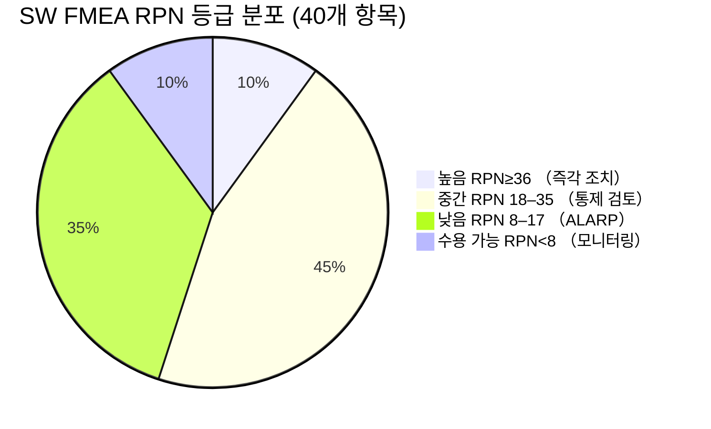
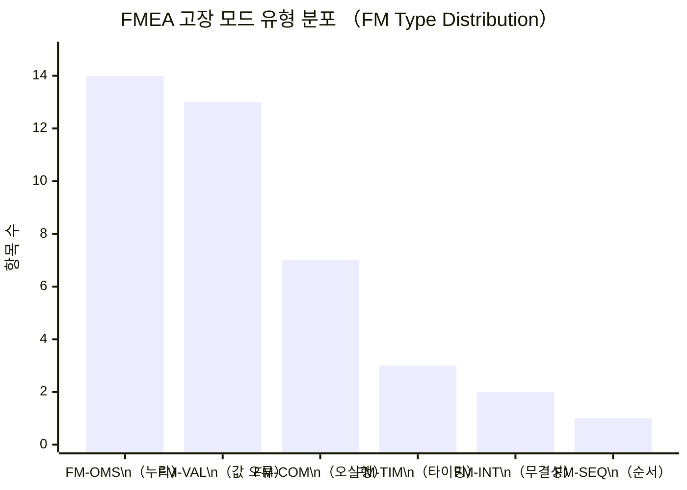
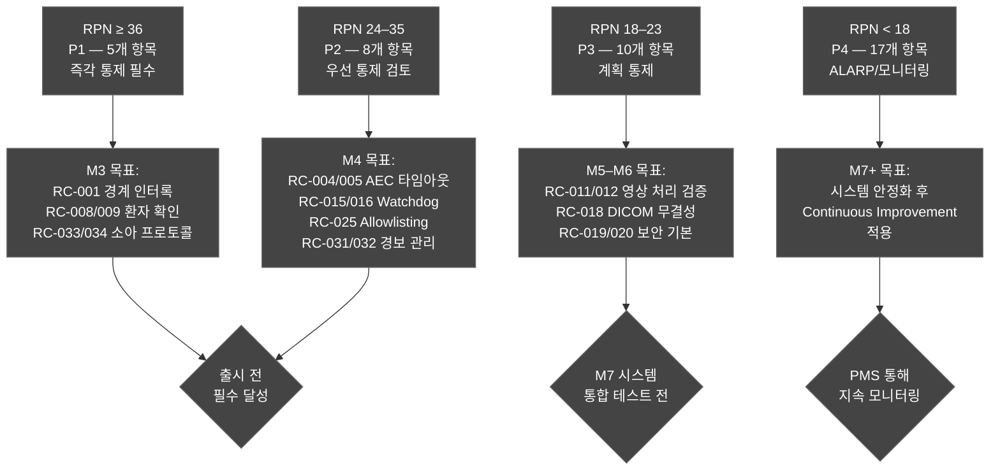

# 소프트웨어 위험 분석서 (Software Hazard Analysis — SW FMEA/FTA)
## HnVue GUI Console SW

---

| 항목 | 내용 |
|------|------|
| **문서 ID** | SHA-XRAY-GUI-001 |
| **버전** | v1.0 |
| **작성일** | 2026-03-18 |
| **작성자** | SW 개발팀 / 품질보증팀 |
| **검토자** | 임상 전문가 (방사선과 의사), 사이버보안 담당자 |
| **승인자** | 의료기기 규제 책임자 (Regulatory Affairs Manager) |
| **상태** | 초안 (Draft) |
| **기준 규격** | ISO 14971:2019, IEC 62304:2006+AMD1:2015, IEC 60812:2018, IEC 61025:2006, IEC 80002-1:2009 |
| **적용 제품** | HnVue GUI Console SW |
| **SW 안전 등급** | IEC 62304 Class B |
| **인허가 대상** | FDA 510(k), CE MDR 2017/745, KFDA (식약처) |
| **상위 문서** | RMP-XRAY-GUI-001 (위험 관리 계획서 v1.0) |

---

### 개정 이력 (Revision History)

| 버전 | 날짜 | 변경 내용 | 작성자 | 승인자 |
|------|------|----------|--------|--------|
| v0.1 | 2026-03-10 | 초기 초안: FMEA 방법론 및 등급 정의 수립 | SW팀 | — |
| v0.5 | 2026-03-14 | SW FMEA 전체 항목 1차 작성 (40항목), FTA 초안 | SW팀 | QA팀 |
| v1.0 | 2026-03-18 | FTA 5개 Top Event 완성, 추적성 매트릭스 완성 | SW팀 | RA팀 |

---

## 목차 (Table of Contents)

1. [목적 및 범위](#1-목적-및-범위)
2. [참조 문서](#2-참조-문서)
3. [SW FMEA 방법론](#3-sw-fmea-방법론-iec-60812)
4. [위험 심각도·발생도·검출도 등급 정의](#4-위험-심각도발생도검출도-등급-정의)
5. [SW FMEA 전체 테이블](#5-sw-fmea-전체-테이블)
6. [FTA 분석](#6-fta-분석-fault-tree-analysis)
7. [FMEA/FTA 결과 요약](#7-fmeafta-결과-요약)
8. [위험 통제 우선순위](#8-위험-통제-우선순위)

부록:
- [부록 A: HAZ-RC-SWR 추적성 매트릭스](#부록-a-haz-rc-swr-추적성-매트릭스)
- [부록 B: 약어 정의](#부록-b-약어-정의)

---

## 1. 목적 및 범위 (Purpose and Scope)

### 1.1 목적 (Purpose)

본 소프트웨어 위험 분석서 (Software Hazard Analysis, 이하 SHA)는 HnVue GUI Console SW에 대하여 IEC 60812:2018 (고장 모드 및 영향 분석, FMEA)과 IEC 61025:2006 (결함 수목 분석, FTA) 방법론을 적용하여 소프트웨어 구성요소의 잠재적 고장 모드, 고장 영향, 원인 및 위험 우선순위를 체계적으로 분석하고, 위험 통제 조치와의 연계성을 확립한다.

본 분석서는 다음을 목적으로 한다:

1. **SW 고장 모드 식별 (Failure Mode Identification)**: 모든 SW 모듈 및 기능에 대한 잠재적 고장 방식 식별
2. **고장 영향 분석 (Effects Analysis)**: 로컬(모듈), 시스템, 환자 수준에서의 고장 영향 평가
3. **위험 우선순위 지수 산정 (RPN Calculation)**: 심각도(S) × 발생도(O) × 검출도(D)의 정량적 분석
4. **Top Event 원인 구조 분석 (FTA)**: 최상위 위험 이벤트에 대한 AND/OR 논리 게이트 기반 원인 추적
5. **위험 통제 추적성 확립 (Traceability)**: HAZ ID → RC ID → SWR → TC 전 주기 추적성 수립

### 1.2 범위 (Scope)

**분석 대상 SW 모듈** (IEC 62304 SAD 기준):

| 모듈 코드 | 모듈명 | 설명 |
|----------|--------|------|
| **PM** | Patient Management | 환자 등록, 검색, 데이터 관리 |
| **WF** | Acquisition Workflow | 촬영 워크플로우 제어, 프로토콜 관리 |
| **IP** | Image Display & Processing | 영상 표시, 처리, 조작 |
| **DM** | Dose Management | 선량 계산, 표시, 경고 |
| **DC** | DICOM/Communication | DICOM 전송, MWL, PACS 연동 |
| **SA** | System Administration | 시스템 설정, 보안, 업데이트 |
| **CS** | Cybersecurity | 인증, 접근 제어, 암호화 |
| **GEN** | Generator Interface | X-Ray Generator 제어 인터페이스 |

**인허가 연계**:
- ISO 14971:2019 §5 위험 분석 요구사항 직접 이행
- IEC 62304:2006 §7.1 SW 위험 관리 활동 이행 근거 제공
- 상위 문서 RMP-XRAY-GUI-001과 연계하여 위험 관리 파일 (RMF) 구성

### 1.3 관련 문서 체계

```mermaid
graph TD
    classDef default fill:#444,stroke:#666,color:#fff
    A["RMP-XRAY-GUI-001\n위험 관리 계획서\nISO 14971:2019"]
    B["SHA-XRAY-GUI-001\n본 문서\nSW FMEA / FTA"]
    C["SRS-XRAY-GUI-001\nSW 요구사항 명세서\n（SWR 정의）"]
    D["SAD-XRAY-GUI-001\nSW 아키텍처 설계서\n（모듈 정의）"]
    E["VVP-XRAY-GUI-001\nV&V 계획서\n（TC 연계）"]
    F["RMR-XRAY-GUI-001\n위험 관리 보고서"]

    A --> B
    C --> B
    D --> B
    B --> E
    B --> F

    style A fill:#444,stroke:#666
    style B fill:#444,stroke:#666
    style C fill:#444,stroke:#666
    style D fill:#444,stroke:#666
    style E fill:#444,stroke:#666
    style F fill:#444,stroke:#666
```

---

## 2. 참조 문서 (Reference Documents)

### 2.1 참조 규격 (Reference Standards)

| 규격 번호 | 제목 | 본 문서 적용 |
|----------|------|------------|
| **ISO 14971:2019** | Medical devices — Application of risk management to medical devices | 전체 위험 관리 프레임워크 |
| **IEC 62304:2006+AMD1:2015** | Medical device software — Software life cycle processes | SW 모듈 분류, SW 안전 클래스 |
| **IEC 60812:2018** | Failure mode and effects analysis (FMEA and FMECA) | FMEA 방법론 |
| **IEC 61025:2006** | Fault tree analysis (FTA) | FTA 방법론, AND/OR 게이트 |
| **IEC 80002-1:2009** | Medical device software — Guidance on the application of ISO 14971 to medical device software | SW 위험 분석 가이드 |
| **IEC 62366-1:2015+AMD1:2020** | Medical devices — Usability engineering | 사용성 오류 기반 위험 분석 |
| **FDA Guidance (2019)** | Factors to Consider When Making Benefit-Risk Determinations | RPN 기반 우선순위 판정 |
| **FDA Section 524B** | Cybersecurity requirements for devices | 사이버보안 위험 분석 |
| **ICRP Publication 103** | Recommendations of the ICRP | 방사선 선량 기준 |

### 2.2 상위/연관 프로젝트 문서

| 문서 ID | 문서명 | 버전 | 관계 |
|--------|--------|------|------|
| **RMP-XRAY-GUI-001** | 위험 관리 계획서 | v1.0 | 상위 문서 — 방법론, HAZ ID, RC ID 정의 |
| **SRS-XRAY-GUI-001** | SW 요구사항 명세서 (FRS) | v2.0 | SWR ID 참조 소스 |
| **SAD-XRAY-GUI-001** | SW 아키텍처 설계서 | v1.0 | 모듈(SAD) 분류 기준 |
| **VVP-XRAY-GUI-001** | V&V 계획서 | v1.0 | 검증 방법 및 TC ID 참조 |

---

## 3. SW FMEA 방법론 (IEC 60812)

### 3.1 FMEA 수행 절차

IEC 60812:2018에 따른 SW FMEA는 다음 7단계 절차로 수행한다:

### 3.2 고장 모드 유형 (Failure Mode Types)

IEC 62304 및 IEC 60812 기반으로 SW 고장 모드를 다음 6가지 유형으로 분류한다:

| 유형 코드 | 유형명 | 정의 | 예시 |
|----------|--------|------|------|
| **FM-OMS** | Omission (누락) | 기능이 전혀 수행되지 않음 | 경보 미발생, 파라미터 미검증 |
| **FM-COM** | Commission (오실행) | 의도하지 않은 기능 수행 | 잘못된 명령 전송, 오환자 로드 |
| **FM-TIM** | Timing (타이밍 오류) | 기능이 너무 빠르거나 늦게 수행 | 타임아웃 미처리, 경쟁 조건 |
| **FM-VAL** | Value (값 오류) | 잘못된 값으로 기능 수행 | 단위 오변환, 경계값 오류 |
| **FM-SEQ** | Sequence (순서 오류) | 기능이 잘못된 순서로 수행 | 인증 전 실행, 초기화 순서 오류 |
| **FM-INT** | Integrity (무결성 오류) | 데이터 무결성 손상 | 비트 오류, 메모리 손상 |

### 3.3 RPN 임계값 및 대응 방침

| RPN 범위 | 위험 수준 | 대응 방침 |
|---------|---------|---------|
| **RPN ≥ 36** | 높음 (High) | 즉각적 위험 통제 조치 필수. 출시 전 반드시 해소 |
| **RPN 18–35** | 중간 (Medium) | 위험 통제 조치 수립 및 구현 필요. 통제 후 재평가 |
| **RPN 8–17** | 낮음 (Low) | ALARP 기준 통제 검토. 모니터링 유지 |
| **RPN < 8** | 수용 가능 (Acceptable) | 추가 조치 불필요. 주기적 검토 |

---

## 4. 위험 심각도·발생도·검출도 등급 정의

### 4.1 심각도 등급 (Severity, S) — ISO 14971:2019 기반

| 등급 | 명칭 (한) | 명칭 (영) | 정의 | 임상 예시 |
|------|----------|---------|------|---------|
| **S1** | 무시할 수준 | Negligible | 일시적 불편함. 의학적 처치 불필요 | 영상 표시 지연 (<3초), UI 반응 지연 |
| **S2** | 경미 | Minor | 경미한 상해. 처치 필요하나 장기 영향 없음 | 진단 지연 (재촬영 필요), 경미한 개인정보 노출 |
| **S3** | 심각 | Serious | 심각한 상해, 일시적 장애, 전문 처치 필요 | 오진단으로 치료 지연, 중등도 방사선 과피폭 |
| **S4** | 중대 | Critical | 영구적 상해 또는 생명 위협 | 고선량 방사선 과피폭 (10×기준 초과), 중대 오진단 |
| **S5** | 치명 | Catastrophic | 사망 또는 영구적 완전 장애 | 극고선량 피폭 (방사선 증후군), 수술 부위 오류로 사망 |

### 4.2 발생도 등급 (Occurrence, O) — IEC 60812:2018 기반

| 등급 | 명칭 (한) | 명칭 (영) | 정성적 기준 | 정량적 기준 (사용 횟수당) |
|------|----------|---------|-----------|----------------------|
| **O1** | 극히 드문 | Improbable | SW 수명 동안 발생 가능성 없음 | < 10⁻⁶ |
| **O2** | 드문 | Remote | 드물게 발생 가능 | 10⁻⁶ ~ 10⁻⁴ |
| **O3** | 가끔 | Occasional | 가끔 발생 가능 | 10⁻⁴ ~ 10⁻² |
| **O4** | 빈번 | Probable | 자주 발생 가능 | 10⁻² ~ 10⁻¹ |
| **O5** | 매우 빈번 | Frequent | 예상 수준으로 빈번 | > 10⁻¹ |

### 4.3 검출도 등급 (Detection, D) — 현재 통제수단 기반

| 등급 | 명칭 (한) | 명칭 (영) | 정의 | 현재 통제 예시 |
|------|----------|---------|------|-------------|
| **D1** | 거의 확실 | Almost Certain | 자동화된 테스트/모니터링으로 즉시 검출 | 자동 단위 테스트 100% 커버리지, 실시간 모니터링 |
| **D2** | 높음 | High | 기능 테스트에서 검출 가능 | 통합 테스트, 코드 리뷰 체크리스트 |
| **D3** | 보통 | Moderate | 특정 테스트 시나리오에서 검출 | 경계값 테스트, 특정 오류 주입 테스트 |
| **D4** | 낮음 | Low | 특수 조건에서만 검출 가능 | 스트레스 테스트, 특수 장비 필요 |
| **D5** | 매우 낮음 | Very Low | 검출 어려움 (잠재적 결함) | 현재 통제수단 없음, 비결정적 결함 |

### 4.4 RPN 매트릭스 요약

RPN (Risk Priority Number) = **S × O × D**

- **최소 RPN**: 1 (S=1, O=1, D=1)
- **최대 RPN**: 125 (S=5, O=5, D=5)
- **주요 임계값**: RPN ≥ 36 → 즉각 조치 필수

---

## 5. SW FMEA 전체 테이블

> **범례**: S = 심각도(1-5), O = 발생도(1-5), D = 검출도(1-5), RPN = S×O×D

### 5.1 PM 모듈 — 환자 관리 (Patient Management)

| FMEA ID | 모듈(SAD) | 기능 | 잠재적 고장모드 | 고장 영향 | 심각도(S) | 잠재적 원인 | 발생도(O) | 현재 통제수단 | 검출도(D) | RPN | HAZ ID | RC ID | 권장조치 | SWR 참조 |
|---------|---------|------|--------------|---------|---------|-----------|---------|------------|---------|-----|--------|-------|--------|---------|
| FMEA-P01 | PM | 환자 등록 및 ID 관리 | 환자 ID 중복 생성 (FM-COM) | 동일 환자에 2개 ID 발급 → 진료기록 분리 | 3 | DB unique key 제약 미적용, 트랜잭션 오류 | 2 | DB unique constraint, 통합 테스트 | 2 | **12** | HAZ-SW-001 | RC-008 | DB unique index 강제 적용 및 등록 전 중복 확인 API 구현 | SWR-PM-010 |
| FMEA-P02 | PM | 환자 데이터 로드 | 잘못된 환자 ID 로드 (FM-COM) | 오환자 촬영 시작 → 방사선 오환자 피폭 | 4 | MWL 쿼리 파라미터 오류, 캐시 불일치 | 3 | MWL 수신 시 이름/생년월일 확인 | 3 | **36** | HAZ-SW-001 | RC-008, RC-009 | 2-step 환자 확인 강제화, 바코드/QR 스캔 필수 구현 | SWR-PM-010 |
| FMEA-P03 | PM | 환자 이름 표시 | 이름 문자열 잘림 (FM-VAL) | 유사 이름 환자 혼동 | 3 | DB 필드 길이 불일치, 인코딩 오류 | 2 | 문자열 길이 검증 | 2 | **12** | HAZ-SW-001 | RC-009 | 이름 최대 길이 확보, 잘림 시 "..." + tooltip 표시 | SWR-PM-023 |
| FMEA-P04 | PM | 환자 체중·나이 입력 | 소아 환자 나이/체중 입력 시 프로토콜 자동 전환 누락 (FM-OMS) | 성인 프로토콜 적용 → 소아 방사선 과피폭 | 4 | 체중/나이 기반 프로토콜 자동 변환 로직 누락 | 3 | 나이/체중 입력 필드 존재, 수동 프로토콜 변경 필요 | 3 | **36** | HAZ-UI-003 | RC-033, RC-034 | 소아(<15세) 또는 체중(<30kg) 입력 시 소아 프로토콜 자동 제안 팝업 구현 | SWR-PM-031 |
| FMEA-P05 | PM | 환자 데이터 삭제 | 동시 접근 중 환자 레코드 부분 삭제 (FM-TIM) | 촬영 중 환자 데이터 소실 | 3 | Race Condition, Lock 미적용 | 2 | DB 트랜잭션 적용 | 2 | **12** | HAZ-DATA-004 | RC-022 | 촬영 중 환자 레코드에 대한 삭제 잠금(Lock) 구현 | SWR-PM-020 |

### 5.2 WF 모듈 — 촬영 워크플로우 (Acquisition Workflow)

| FMEA ID | 모듈(SAD) | 기능 | 잠재적 고장모드 | 고장 영향 | 심각도(S) | 잠재적 원인 | 발생도(O) | 현재 통제수단 | 검출도(D) | RPN | HAZ ID | RC ID | 권장조치 | SWR 참조 |
|---------|---------|------|--------------|---------|---------|-----------|---------|------------|---------|-----|--------|-------|--------|---------|
| FMEA-W01 | WF | kVp/mAs 파라미터 전송 | 범위 초과 값 Generator에 전송 (FM-VAL) | 비정상 방사선 발생 → 환자 방사선 과피폭 | 4 | 입력값 경계 검사(validation) 미적용 | 3 | 파라미터 입력 폼 UI 제한 | 3 | **36** | HAZ-RAD-001 | RC-001, RC-002 | SW 레벨 인터록: 범위 초과 값 차단 + 오류 반환. RC-001 구현 필수 | SWR-WF-012 |
| FMEA-W02 | WF | kVp/mAs 파라미터 전송 | 전송 중 데이터 비트 오류 (FM-INT) | Generator 오해석 → 예상치 못한 선량 | 4 | 직렬 통신 오류, 체크섬 미검증 | 2 | CRC 체크섬 일부 적용 | 3 | **24** | HAZ-RAD-001 | RC-001 | 통신 프로토콜에 CRC-16 필수 적용, ACK 응답 검증 | SWR-WF-012 |
| FMEA-W03 | WF | AEC 신호 수신 처리 | AEC 종료 신호 미수신 처리 (FM-OMS) | 촬영 계속 진행 → 심각한 방사선 과피폭 | 5 | AEC 인터페이스 타임아웃 미처리 | 2 | 500ms 타임아웃 설계 중 | 3 | **30** | HAZ-RAD-002 | RC-004, RC-005 | AEC 500ms 타임아웃 강제 적용, 타임아웃 시 SW 수준 노출 종료 명령 발행 | SWR-WF-020 |
| FMEA-W04 | WF | AEC 신호 수신 처리 | AEC 신호 조기 인식 오류 (FM-VAL) | 촬영 조기 종료 → 영상 불충분 → 재촬영 필요 | 3 | 신호 디코딩 임계값 오설정 | 2 | 신호 품질 필터 적용 | 2 | **12** | HAZ-RAD-002 | RC-004 | AEC 신호 디코딩 임계값 검증 테스트 강화, 신호 캡처 단위 테스트 | SWR-WF-020 |
| FMEA-W05 | WF | SW Watchdog 타이머 | Watchdog 응답 없음 처리 실패 (FM-OMS) | Generator 정지 명령 미발행 → 촬영 지속 | 5 | Watchdog 타이머 SW 결함, 쓰레드 교착 | 2 | Watchdog 설계 중 | 3 | **30** | HAZ-SW-004 | RC-015, RC-016 | HW 독립 Watchdog과 SW Watchdog 이중화, 응답 없음 시 HW 인터록 트리거 | SWR-WF-030 |
| FMEA-W06 | WF | 촬영 부위 선택 UI | 유사한 UI 요소로 촬영 부위 오선택 (FM-COM) | 불필요한 방사선 피폭, 재촬영 | 3 | 드롭다운 목록 혼동, 아이콘 불명확 | 3 | 부위명 텍스트 표시 | 3 | **27** | HAZ-UI-001 | RC-029, RC-030 | 신체 다이어그램 + 텍스트 병기 UI 구현, 선택 후 시각적 강조 표시 | SWR-WF-010 |
| FMEA-W07 | WF | 경보 관리 시스템 | Critical 경보 자동 타임아웃 해제 (FM-TIM) | 중요 오류 미인식 → 오류 상태에서 촬영 진행 | 3 | 경보 타임아웃 로직 설계 결함 | 4 | 현재 경보 타임아웃 로직 존재 | 2 | **24** | HAZ-UI-002 | RC-031, RC-032 | Critical 경보는 명시적 ACK 없이 해제 불가. 타임아웃 자동 해제 코드 제거 | SWR-WF-022 |
| FMEA-W08 | WF | Generator 제어 통신 | Heartbeat 미전송으로 연결 상태 오인 (FM-OMS) | 실제 단절 미감지 → 촬영 명령 유실 후 재시도 | 3 | 소켓 타임아웃 처리 결함, 쓰레드 블로킹 | 3 | 연결 상태 UI 표시 | 2 | **18** | HAZ-NET-001 | RC-035 | 1초 주기 heartbeat 구현, 3회 미응답 시 연결 단절 처리 및 촬영 차단 | SWR-WF-018 |

### 5.3 IP 모듈 — 영상 표시 및 처리 (Image Display & Processing)

| FMEA ID | 모듈(SAD) | 기능 | 잠재적 고장모드 | 고장 영향 | 심각도(S) | 잠재적 원인 | 발생도(O) | 현재 통제수단 | 검출도(D) | RPN | HAZ ID | RC ID | 권장조치 | SWR 참조 |
|---------|---------|------|--------------|---------|---------|-----------|---------|------------|---------|-----|--------|-------|--------|---------|
| FMEA-I01 | IP | 영상 좌우 반전 처리 | Orientation 플래그 오적용 (FM-VAL) | 좌우 반전 영상 → 병변 위치 오인 → 오진단 | 3 | 좌우 판정 로직 결함, 플래그 상수 오정의 | 3 | 코드 리뷰 | 2 | **18** | HAZ-SW-002 | RC-011, RC-012 | 좌우 반전 후 Orientation Marker (L/R) 자동 삽입 및 DICOM SR 기록 | SWR-IP-020 |
| FMEA-I02 | IP | LUT/Windowing 처리 | LUT 경계값 오버플로우 (FM-VAL) | 영상 번짐 (Overexposure 표현) → 진단 가치 저하 | 3 | 부동소수점 처리 오류, 정수 오버플로우 | 2 | 기능 테스트 | 3 | **18** | HAZ-SW-002 | RC-011 | 히스토그램 분포 이상 감지 시 원본 영상 보존 및 경고, 경계값 클램핑(Clamping) 적용 | SWR-IP-027 |
| FMEA-I03 | IP | 영상 확대/축소 (Zoom) | 픽셀 보간 알고리즘 결함으로 Artifact 생성 (FM-VAL) | 인공 음영(Artifact) → 오진단 가능성 | 3 | 보간 알고리즘 경계 조건 처리 오류 | 2 | 기능 테스트 | 3 | **18** | HAZ-SW-002 | RC-011 | 보간 알고리즘 단위 테스트 (경계 케이스), 고배율에서 원본 픽셀값 유지 검증 | SWR-IP-025 |
| FMEA-I04 | IP | 측정 도구 (Ruler/Angle) | 측정값 단위 오표시 (mm → cm 오변환) (FM-VAL) | 병변 크기 오측정 → 오진단 | 3 | 단위 변환 계수 오입력 | 2 | 기능 테스트 | 2 | **12** | HAZ-SW-002 | RC-011 | 측정 도구 단위 변환 단위 테스트 100% 적용, 단위 표시 UI에 명시 | SWR-IP-030 |
| FMEA-I05 | IP | 영상 회전 | 90°/180° 회전 후 DICOM 헤더 미갱신 (FM-OMS) | DICOM 헤더-영상 불일치 → 수신 측 오표시 | 3 | 회전 후 Image Orientation Tag 미업데이트 | 2 | 코드 리뷰 | 3 | **18** | HAZ-SW-002 | RC-012 | 영상 회전 시 DICOM ImageOrientationPatient 태그 자동 갱신 로직 구현 | SWR-IP-022 |

### 5.4 DM 모듈 — 선량 관리 (Dose Management)

| FMEA ID | 모듈(SAD) | 기능 | 잠재적 고장모드 | 고장 영향 | 심각도(S) | 잠재적 원인 | 발생도(O) | 현재 통제수단 | 검출도(D) | RPN | HAZ ID | RC ID | 권장조치 | SWR 참조 |
|---------|---------|------|--------------|---------|---------|-----------|---------|------------|---------|-----|--------|-------|--------|---------|
| FMEA-D01 | DM | DAP 계산 및 표시 | 단위 변환 오류 (μGy·cm² ↔ mGy·cm²) (FM-VAL) | 1000배 오표시 → 선량 기록 오류 → 선량 관리 실패 | 3 | 단위 변환 계수 오입력, 상수 정의 오류 | 3 | 기능 테스트 | 2 | **18** | HAZ-SW-003 | RC-013 | 단위 변환 함수 단위 테스트 100% 커버리지, 공용 단위 변환 라이브러리화 | SWR-DM-040 |
| FMEA-D02 | DM | DAP 계산 및 표시 | Null 값 처리 오류 → 선량 미표시 (FM-OMS) | 사용자 선량 인식 불가 → 선량 관리 실패 | 3 | 예외 처리 미흡, Null 허용 필드 | 2 | 단위 테스트 일부 | 2 | **12** | HAZ-SW-003 | RC-014 | Null 수신 시 "N/A" 명시적 표시 + 경고 로그 기록, Null 처리 단위 테스트 | SWR-DM-041 |
| FMEA-D03 | DM | DRL 기반 경고 | 국가별 DRL 값 오적용 (FM-VAL) | 경고 임계값 오설정 → 과선량 경고 미발생 | 3 | DRL DB 업데이트 오류, 국가 코드 혼동 | 2 | 기능 테스트 | 2 | **12** | HAZ-RAD-004 | RC-007 | 국가별 DRL DB 버전 관리, 업데이트 시 무결성 체크 및 관리자 승인 필요 | SWR-DM-050 |
| FMEA-D04 | DM | 선량 경고 표시 | 선량 경고 팝업 미표시 (FM-OMS) | 사용자 과선량 미인식 → 과피폭 지속 | 3 | UI 렌더링 오류, 모달 스택 오버플로우 | 2 | UI 기능 테스트 | 3 | **18** | HAZ-RAD-004 | RC-007 | 선량 경고는 별도 최상위 레이어에 표시, UI 렌더링 자동화 테스트 포함 | SWR-DM-043 |
| FMEA-D05 | DM | 누적 선량 기록 | 촬영 세션 간 누적 선량 누락 (FM-OMS) | 환자 전체 선량 관리 실패 | 2 | 세션 ID 연결 로직 오류, DB 롤백 후 미복원 | 2 | 기능 테스트 | 2 | **8** | HAZ-SW-003 | RC-013 | 촬영 세션별 선량 누적 로직 통합 테스트, 롤백 시 선량 기록 보존 확인 | SWR-DM-042 |

### 5.5 DC 모듈 — DICOM/통신 (DICOM/Communication)

| FMEA ID | 모듈(SAD) | 기능 | 잠재적 고장모드 | 고장 영향 | 심각도(S) | 잠재적 원인 | 발생도(O) | 현재 통제수단 | 검출도(D) | RPN | HAZ ID | RC ID | 권장조치 | SWR 참조 |
|---------|---------|------|--------------|---------|---------|-----------|---------|------------|---------|-----|--------|-------|--------|---------|
| FMEA-C01 | DC | DICOM 영상 전송 | DICOM 태그 손실 전송 (FM-INT) | 메타데이터 누락 → PACS 저장 실패 → 진단 정보 소실 | 3 | TCP/IP 전송 오류 미처리, 재전송 로직 부재 | 2 | 네트워크 기능 테스트 | 2 | **12** | HAZ-DATA-001 | RC-018 | DICOM 전송 CRC 체크섬 + 필수 Tag 검증, 오류 시 자동 재전송 (최대 3회) | SWR-DC-050 |
| FMEA-C02 | DC | DICOM 영상 전송 | 영상 픽셀 데이터 손상 전송 (FM-INT) | 영상 깨짐 → 판독 불가 → 오진단 또는 재촬영 | 3 | 패킷 분실 미감지, 오류 정정 코드 부재 | 2 | 기능 테스트 | 3 | **18** | HAZ-DATA-001 | RC-018 | 픽셀 데이터 체크섬 검증, 수신 측 이상 감지 시 재전송 요청 자동화 | SWR-DC-050 |
| FMEA-C03 | DC | MWL 수신 처리 | 동일 환자 중복 오더 처리 오류 (FM-COM) | 잘못된 오더 선택 → 오환자 촬영 | 4 | 중복 키 처리 로직 결함, 타임스탬프 충돌 | 2 | 기능 테스트 | 2 | **16** | HAZ-NET-002 | RC-036 | MWL 수신 시 Patient ID + Study UID 조합 유일성 검증, 중복 시 알림 | SWR-DC-054 |
| FMEA-C04 | DC | MWL 동기화 | HIS/RIS 연동 오류로 잘못된 촬영 오더 수신 (FM-COM) | 오환자 오더 수신 → 오진단 위험 | 4 | HL7 메시지 파싱 오류, 인코딩 불일치 | 2 | 통합 테스트 | 3 | **24** | HAZ-NET-002 | RC-036 | MWL 데이터 스키마 검증(XSD), 환자 ID 3중 매칭 (ID + 이름 + 생년월일) 필수 | SWR-DC-053 |
| FMEA-C05 | DC | DICOM SR 생성 | Dose Report DICOM SR 생성 실패 (FM-OMS) | 선량 보고 누락 → 규제 요구사항 미충족 | 2 | SR 템플릿 오류, 필수 코드 시퀀스 누락 | 2 | 단위 테스트 | 2 | **8** | HAZ-SW-003 | RC-013 | DICOM SR 생성 후 필수 코드 시퀀스 자동 검증, 실패 시 경고 로그 | SWR-DC-055 |

### 5.6 SA 모듈 — 시스템 관리 (System Administration)

| FMEA ID | 모듈(SAD) | 기능 | 잠재적 고장모드 | 고장 영향 | 심각도(S) | 잠재적 원인 | 발생도(O) | 현재 통제수단 | 검출도(D) | RPN | HAZ ID | RC ID | 권장조치 | SWR 참조 |
|---------|---------|------|--------------|---------|---------|-----------|---------|------------|---------|-----|--------|-------|--------|---------|
| FMEA-A01 | SA | 시스템 초기화 | 비정상 종료 후 최대 선량 파라미터로 복원 (FM-VAL) | 고선량 기본값 설정 → 사용자 인식 없이 고선량 촬영 | 4 | 비정상 종료 시 파라미터 저장/복원 로직 오류 | 2 | 기능 테스트 | 3 | **24** | HAZ-SW-005 | RC-017 | 재부팅 시 기관별 최소 안전 기본값으로 강제 초기화, 이전 파라미터는 참조용으로만 표시 | SWR-SA-065 |
| FMEA-A02 | SA | 촬영 프로토콜 DB 관리 | 프로토콜 DB 파일 손상 (FM-INT) | 손상된 프로토콜로 비정상 고선량 설정 적용 | 4 | HDD 장애, 파일 시스템 오류, 비정상 쓰기 | 2 | 파일 시스템 테스트 | 3 | **24** | HAZ-RAD-003 | RC-006 | CRC-32 체크섬 검증, 손상 감지 시 기본 안전 프로토콜 자동 로드 및 경고 | SWR-SA-063 |
| FMEA-A03 | SA | SW 업데이트 처리 | 디지털 서명 없는 패키지 설치 허용 (FM-OMS) | 악성 코드 실행 → 시스템 기능 변조 | 4 | 서명 검증 로직 우회 취약점 | 1 | 서명 검증 로직 설계 중 | 3 | **12** | HAZ-SEC-003 | RC-027 | RSA-2048 이상 디지털 서명 검증 필수화, 서명 불일치 시 설치 차단 및 이벤트 로그 | SWR-SA-076 |
| FMEA-A04 | SA | 영상 스토리지 관리 | HDD 장애로 영상 소실 (FM-INT) | 재촬영 필요 → 추가 방사선 피폭 | 3 | HDD 단일 장애점, SMART 모니터링 부재 | 2 | 백업 정책 문서화 | 3 | **18** | HAZ-DATA-003 | RC-021 | RAID 또는 이중화 스토리지 구현, 주기적 무결성 검사 및 HDD SMART 모니터링 | SWR-SA-066 |
| FMEA-A05 | SA | 감사 로그 (Audit Log) | 파라미터 변경 이력 미기록 (FM-OMS) | 보안 이벤트 추적 불가 → 규제 요구사항 미충족 | 3 | 감사 로그 모듈 우회 코드 경로 존재 | 2 | 감사 로그 설계 | 2 | **12** | HAZ-SEC-001 | RC-023 | 모든 파라미터 변경 시 감사 로그 필수 기록, 로그 우회 불가 아키텍처 설계 | SWR-SA-072 |

### 5.7 CS 모듈 — 사이버보안 (Cybersecurity)

| FMEA ID | 모듈(SAD) | 기능 | 잠재적 고장모드 | 고장 영향 | 심각도(S) | 잠재적 원인 | 발생도(O) | 현재 통제수단 | 검출도(D) | RPN | HAZ ID | RC ID | 권장조치 | SWR 참조 |
|---------|---------|------|--------------|---------|---------|-----------|---------|------------|---------|-----|--------|-------|--------|---------|
| FMEA-S01 | CS | 사용자 인증 | 암호화되지 않은 세션 생성 (FM-OMS) | 세션 도청 → 환자 데이터 노출 | 2 | TLS 미적용 코드 패스 존재 | 3 | HTTPS 기본 설정 | 3 | **18** | HAZ-DATA-002 | RC-019 | TLS 1.3 강제 적용, HTTP 연결 차단, 인증서 핀닝 구현 | SWR-CS-078 |
| FMEA-S02 | CS | RBAC 권한 관리 | 권한 에스컬레이션 버그 (FM-COM) | 일반 사용자 관리자 권한 획득 → 파라미터 무단 변경 | 4 | RBAC 검사 누락 코드 경로, 토큰 위조 | 2 | RBAC 기능 테스트 | 3 | **24** | HAZ-SEC-001 | RC-020, RC-023 | 모든 API 엔드포인트 권한 검사 필수화, 권한 우회 시도 감지 및 차단 | SWR-SA-060 |
| FMEA-S03 | CS | 세션 관리 | 세션 토큰 만료 미처리 (FM-OMS) | 세션 탈취 → 원격 파라미터 변조 | 4 | 세션 타임아웃 로직 결함, 서버 측 세션 미무효화 | 2 | 30분 타임아웃 설계 | 2 | **16** | HAZ-SEC-004 | RC-028 | 서버 측 세션 무효화 구현, 30분 무활동 자동 로그아웃 + 재인증 요구 | SWR-CS-075 |
| FMEA-S04 | CS | Application 실행 제어 | Application 화이트리스트 미적용 (FM-OMS) | 악성 프로세스 실행 허가 → 랜섬웨어 실행 | 4 | 화이트리스트 정책 미구현 | 2 | OS 기본 보안 설정 | 4 | **32** | HAZ-SEC-002 | RC-025 | Application Allowlisting 정책 구현 및 배포, 허가되지 않은 프로세스 자동 차단 | SWR-CS-083 |
| FMEA-S05 | CS | 네트워크 통신 암호화 | 내부 네트워크 평문 통신 (FM-OMS) | 중간자 공격(MITM) → 데이터 변조 또는 도청 | 3 | 내부망 TLS 적용 예외 처리 | 2 | 일부 TLS 적용 | 3 | **18** | HAZ-DATA-002 | RC-019 | 내부 네트워크 포함 모든 통신 채널 TLS 1.3 적용, MTLS 검토 | SWR-CS-079 |

### 5.8 GEN 모듈 — Generator 인터페이스 (Generator Interface)

| FMEA ID | 모듈(SAD) | 기능 | 잠재적 고장모드 | 고장 영향 | 심각도(S) | 잠재적 원인 | 발생도(O) | 현재 통제수단 | 검출도(D) | RPN | HAZ ID | RC ID | 권장조치 | SWR 참조 |
|---------|---------|------|--------------|---------|---------|-----------|---------|------------|---------|-----|--------|-------|--------|---------|
| FMEA-G01 | GEN | 촬영 시작 명령 전송 | 촬영 명령 중복 전송 (FM-COM) | 이중 노출 → 방사선 2배 피폭 | 4 | 버튼 중복 클릭 처리 미흡, 명령 큐 미관리 | 2 | 버튼 비활성화 일부 구현 | 2 | **16** | HAZ-RAD-001 | RC-001, RC-002 | 촬영 명령 전송 후 Ack 수신 전 재전송 차단, 버튼 상태 관리 강화 | SWR-WF-016 |
| FMEA-G02 | GEN | 촬영 중지 명령 전송 | 긴급 중지 명령 미전달 (FM-OMS) | 촬영 미종료 → 방사선 과피폭 | 5 | 네트워크 오류, 명령 큐 블로킹 | 1 | 긴급 중지 버튼 구현 | 2 | **10** | HAZ-SW-004 | RC-015, RC-016 | 긴급 중지 명령 최우선 처리 (Priority Queue), HW 인터록 병행 동작 | SWR-WF-031 |
| FMEA-G03 | GEN | 노출 파라미터 확인 | Generator 수신 파라미터 확인 (ACK) 없음 (FM-OMS) | 파라미터 불일치 상태에서 촬영 진행 | 4 | Generator 응답 프로토콜 미구현 | 2 | 단방향 전송만 구현 | 4 | **32** | HAZ-RAD-001 | RC-001 | Generator 수신 파라미터 Echo-back 확인 프로토콜 구현, 불일치 시 촬영 차단 | SWR-WF-014 |
| FMEA-G04 | GEN | 검출기(Detector) 연결 상태 확인 | 검출기 연결 단절 미감지 (FM-OMS) | 검출기 없이 촬영 실행 → 방사선 피폭 (영상 없음) | 3 | Detector 상태 폴링 주기 과도하게 길거나 누락 | 2 | 연결 상태 UI 표시 | 3 | **18** | HAZ-RAD-001 | RC-035 | Detector 상태 폴링 1초 주기 구현, 미연결 시 촬영 명령 차단 | SWR-WF-017 |
| FMEA-G05 | GEN | kVp/mAs 범위 검증 인터록 | SW 인터록 우회 (FM-COM) | 범위 초과 파라미터 전송 → 환자 과피폭 | 4 | 인터록 로직 조건문 결함, 디버그 모드 잔류 | 1 | 코드 리뷰 | 3 | **12** | HAZ-RAD-001 | RC-001 | 인터록 로직 독립 단위 테스트, 디버그 모드 프로덕션 빌드 제거 확인 | SWR-WF-013 |

---

> **FMEA 항목 합계**: 40개 (PM: 5, WF: 8, IP: 5, DM: 5, DC: 5, SA: 5, CS: 5, GEN: 5)

---

## 6. FTA 분석 (Fault Tree Analysis)

IEC 61025:2006 방법론에 따라 최상위 위험 이벤트 (Top Event) 5개에 대한 결함 수목 분석을 수행한다. 각 FTA는 AND/OR 게이트를 통한 기본 이벤트(Basic Event)로부터 중간 이벤트(Intermediate Event), Top Event까지의 인과 구조를 분석하고 최소 절단 집합(Minimal Cut Set, MCS)을 도출한다.

### 6.1 FTA 기호 정의

| 기호 | 명칭 | 의미 |
|------|------|------|
| AND 게이트 | AND Gate | 모든 입력 이벤트가 동시에 발생할 때 출력 이벤트 발생 |
| OR 게이트 | OR Gate | 하나 이상의 입력 이벤트 발생 시 출력 이벤트 발생 |
| 기본 이벤트 | Basic Event | 더 이상 분해하지 않는 원인 이벤트 (원 기호) |
| 중간 이벤트 | Intermediate Event | AND/OR 게이트로 연결된 중간 원인 (사각형 기호) |
| Top Event | Top Event | 분석 대상 최상위 위험 이벤트 |

### 6.2 TE-001: 환자 과피폭 (Patient Radiation Overexposure)

**Top Event 설명**: 의도된 촬영 선량의 2배 이상 방사선이 환자에게 피폭되는 사건
**관련 HAZ**: HAZ-RAD-001, HAZ-RAD-002, HAZ-RAD-003, HAZ-SW-004, HAZ-UI-003

```mermaid
graph TD
    classDef default fill:#444,stroke:#666,color:#fff
    TE1["🔴 TE-001\n환자 과피폭\nPatient Radiation Overexposure\n심각도: S4–S5"]

    TE1 -- OR --> IE1
    TE1 -- OR --> IE2
    TE1 -- OR --> IE3

    IE1["IE-1: SW 오명령\n+ Generator 실행\n（AND）"]
    IE2["IE-2: AEC 제어 실패\n+ SW 미감지\n（AND）"]
    IE3["IE-3: 사용자 오조작\n+ 경고 미제공\n（AND）"]

    IE1 -- AND --> BE1["BE-1: kVp/mAs\n범위 초과 값 전송\n（FMEA-W01）"]
    IE1 -- AND --> BE2["BE-2: Generator\nHW 인터록\n미작동"]

    IE2 -- AND --> BE3["BE-3: AEC 종료\n신호 미수신 처리\n（FMEA-W03）"]
    IE2 -- AND --> IE4

    IE4["IE-4: SW Watchdog\n미작동\n（AND）"]
    IE4 -- AND --> BE4["BE-4: Watchdog\n응답 없음 처리 실패\n（FMEA-W05）"]
    IE4 -- AND --> BE5["BE-5: HW 독립\n인터록 미구현"]

    IE3 -- AND --> IE5
    IE3 -- AND --> BE6["BE-6: 선량 경고\n미표시\n（FMEA-D04）"]

    IE5["IE-5: 소아 프로토콜\n미적용\n（OR）"]
    IE5 -- OR --> BE7["BE-7: 체중/나이 기반\n프로토콜 자동 변환\n로직 누락\n（FMEA-P04）"]
    IE5 -- OR --> BE8["BE-8: 소아 경고\n배너 미표시\n（FMEA-P04）"]

    BE1 -- OR --> BE9["BE-9: 입력값\n경계 검사 미적용"]
    BE1 -- OR --> BE10["BE-10: 프로토콜 DB\n손상\n（FMEA-A02）"]

    style TE1 fill:#444,color:#fff,stroke:#666,stroke-width:3px
    style IE1 fill:#444,stroke:#666
    style IE2 fill:#444,stroke:#666
    style IE3 fill:#444,stroke:#666
    style IE4 fill:#444,stroke:#666
    style IE5 fill:#444,stroke:#666
    style BE1 fill:#444,stroke:#666
    style BE2 fill:#444,stroke:#666
    style BE3 fill:#444,stroke:#666
    style BE4 fill:#444,stroke:#666
    style BE5 fill:#444,stroke:#666
    style BE6 fill:#444,stroke:#666
    style BE7 fill:#444,stroke:#666
    style BE8 fill:#444,stroke:#666
    style BE9 fill:#444,stroke:#666
    style BE10 fill:#444,stroke:#666
```

**최소 절단 집합 (Minimal Cut Sets)**:
- **MCS-1**: {BE-9 입력값 경계 검사 미적용, BE-2 HW 인터록 미작동}
- **MCS-2**: {BE-10 프로토콜 DB 손상, BE-2 HW 인터록 미작동}
- **MCS-3**: {BE-3 AEC 신호 미수신, BE-4 Watchdog 미작동, BE-5 HW 인터록 미구현}
- **MCS-4**: {BE-7 소아 프로토콜 변환 누락, BE-6 선량 경고 미표시}

**통제 조치 매핑**: RC-001 (경계 검사), RC-004/005 (AEC 타임아웃), RC-015/016 (Watchdog + HW 인터록), RC-033/034 (소아 프로토콜), RC-007 (선량 경고)

---

### 6.3 TE-002: 오진단 (Misdiagnosis — Wrong Patient/Wrong Image)

**Top Event 설명**: 환자 데이터 혼동 또는 영상 오류로 인해 잘못된 진단이 이루어지는 사건
**관련 HAZ**: HAZ-SW-001, HAZ-SW-002, HAZ-DATA-001, HAZ-NET-002

```mermaid
graph TD
    classDef default fill:#444,stroke:#666,color:#fff
    TE2["🔴 TE-002\n오진단\nMisdiagnosis\n심각도: S3–S4"]

    TE2 -- OR --> IE6
    TE2 -- OR --> IE7
    TE2 -- OR --> IE8

    IE6["IE-6: 오환자 영상\n+ 미확인 판독\n（AND）"]
    IE7["IE-7: 영상 처리 오류\n+ 오류 미검출\n（AND）"]
    IE8["IE-8: DICOM 데이터 손상\n+ 수신 측 무결성\n미검증\n（AND）"]

    IE6 -- AND --> IE9
    IE6 -- AND --> BE11["BE-11: 촬영 전\n환자 확인 절차\n미수행 （사용자 오류）"]

    IE9["IE-9: 오환자\n데이터 로드\n（OR）"]
    IE9 -- OR --> BE12["BE-12: MWL 중복\n오더 처리 오류\n（FMEA-C03）"]
    IE9 -- OR --> BE13["BE-13: 환자 이름\n잘림 오류\n（FMEA-P03）"]
    IE9 -- OR --> BE14["BE-14: DB Race\nCondition 환자\n데이터 혼동\n（FMEA-P05）"]

    BE11 -- OR --> BE15["BE-15: 2-step\n확인 절차\n미구현"]
    BE11 -- OR --> BE16["BE-16: 바코드/QR\n스캔 기능\n부재"]

    IE7 -- AND --> IE10
    IE7 -- AND --> BE17["BE-17: 영상 처리\n결과 자동\n검증 부재"]

    IE10["IE-10: 영상 처리\n오류 발생\n（OR）"]
    IE10 -- OR --> BE18["BE-18: Orientation\n플래그 오적용\n（FMEA-I01）"]
    IE10 -- OR --> BE19["BE-19: LUT 오버플로우\n（FMEA-I02）"]
    IE10 -- OR --> BE20["BE-20: 픽셀 보간\nArtifact\n（FMEA-I03）"]

    IE8 -- AND --> BE21["BE-21: DICOM 태그\n손실 전송\n（FMEA-C01）"]
    IE8 -- AND --> BE22["BE-22: 수신 측\n태그 무결성\n검증 미수행"]

    style TE2 fill:#444,color:#fff,stroke:#666,stroke-width:3px
    style IE6 fill:#444,stroke:#666
    style IE7 fill:#444,stroke:#666
    style IE8 fill:#444,stroke:#666
    style IE9 fill:#444,stroke:#666
    style IE10 fill:#444,stroke:#666
    style BE11 fill:#444,stroke:#666
    style BE12 fill:#444,stroke:#666
    style BE13 fill:#444,stroke:#666
    style BE14 fill:#444,stroke:#666
    style BE15 fill:#444,stroke:#666
    style BE16 fill:#444,stroke:#666
    style BE17 fill:#444,stroke:#666
    style BE18 fill:#444,stroke:#666
    style BE19 fill:#444,stroke:#666
    style BE20 fill:#444,stroke:#666
    style BE21 fill:#444,stroke:#666
    style BE22 fill:#444,stroke:#666
```

**최소 절단 집합**:
- **MCS-5**: {BE-12 MWL 중복 처리, BE-15 2-step 확인 미구현}
- **MCS-6**: {BE-14 DB Race Condition, BE-16 바코드 스캔 부재}
- **MCS-7**: {BE-18 Orientation 오류, BE-17 자동 검증 부재}
- **MCS-8**: {BE-21 DICOM 태그 손실, BE-22 수신 측 미검증}

**통제 조치 매핑**: RC-008 (2-step 확인), RC-009 (3중 매칭), RC-011/012 (영상 처리 검증), RC-018 (DICOM 무결성), RC-022 (DB ACID), RC-036 (MWL 검증)

---

### 6.4 TE-003: 데이터 손실 (Critical Patient Data Loss)

**Top Event 설명**: 환자 영상 또는 진단에 필수적인 데이터가 복구 불가능하게 소실되는 사건
**관련 HAZ**: HAZ-DATA-001, HAZ-DATA-003, HAZ-DATA-004, HAZ-SEC-002

```mermaid
graph TD
    classDef default fill:#444,stroke:#666,color:#fff
    TE3["🔴 TE-003\n중요 환자 데이터 손실\nCritical Patient Data Loss\n심각도: S3"]

    TE3 -- OR --> IE11
    TE3 -- OR --> IE12
    TE3 -- OR --> IE13

    IE11["IE-11: 스토리지\n장애 + 백업 실패\n（AND）"]
    IE12["IE-12: DICOM 전송\n실패 + 재전송 불가\n（AND）"]
    IE13["IE-13: 랜섬웨어 암호화\n+ 복구 불가\n（AND）"]

    IE11 -- AND --> BE23["BE-23: HDD/SSD\n장애 발생\n（FMEA-A04）"]
    IE11 -- AND --> BE24["BE-24: 이중화\n스토리지 미구현"]

    BE23 -- OR --> BE25["BE-25: SMART\n모니터링 미구현"]
    BE23 -- OR --> BE26["BE-26: RAID\n미구성"]

    IE12 -- AND --> BE27["BE-27: 네트워크\n오류로 픽셀 데이터\n손상 전송\n（FMEA-C02）"]
    IE12 -- AND --> BE28["BE-28: 자동 재전송\n로직 미구현"]

    BE27 -- OR --> BE29["BE-29: 체크섬\n검증 없는 전송"]
    BE27 -- OR --> BE30["BE-30: TCP 재전송\n타임아웃 부적절"]

    IE13 -- AND --> BE31["BE-31: Application\n화이트리스트 미적용\n（FMEA-S04）"]
    IE13 -- AND --> BE32["BE-32: 오프라인\n백업 부재"]

    BE31 -- OR --> BE33["BE-33: 네트워크\n격리 미실시"]
    BE31 -- OR --> BE34["BE-34: USB 포트\n정책 미적용"]

    style TE3 fill:#444,color:#fff,stroke:#666,stroke-width:3px
    style IE11 fill:#444,stroke:#666
    style IE12 fill:#444,stroke:#666
    style IE13 fill:#444,stroke:#666
    style BE23 fill:#444,stroke:#666
    style BE27 fill:#444,stroke:#666
    style BE31 fill:#444,stroke:#666
    style BE24 fill:#444,stroke:#666
    style BE25 fill:#444,stroke:#666
    style BE26 fill:#444,stroke:#666
    style BE28 fill:#444,stroke:#666
    style BE29 fill:#444,stroke:#666
    style BE30 fill:#444,stroke:#666
    style BE32 fill:#444,stroke:#666
    style BE33 fill:#444,stroke:#666
    style BE34 fill:#444,stroke:#666
```

**최소 절단 집합**:
- **MCS-9**: {BE-23 HDD 장애, BE-24 이중화 미구현}
- **MCS-10**: {BE-29 체크섬 없는 전송, BE-28 재전송 로직 미구현}
- **MCS-11**: {BE-31 화이트리스트 미적용, BE-32 오프라인 백업 부재}
- **MCS-12**: {BE-33 네트워크 격리 미실시, BE-32 오프라인 백업 부재}

**통제 조치 매핑**: RC-018 (DICOM 무결성), RC-021 (이중화 스토리지), RC-025 (Allowlisting), RC-026 (네트워크 격리)

---

### 6.5 TE-004: 시스템 불능 (System Incapacitation)

**Top Event 설명**: 진단 X-Ray 시스템이 완전히 작동 불능 상태가 되어 응급 촬영을 포함한 모든 촬영이 불가능한 사건
**관련 HAZ**: HAZ-SW-004, HAZ-SEC-002, HAZ-NET-001

```mermaid
graph TD
    classDef default fill:#444,stroke:#666,color:#fff
    TE4["🔴 TE-004\n시스템 불능\nSystem Incapacitation\n심각도: S4"]

    TE4 -- OR --> IE14
    TE4 -- OR --> IE15
    TE4 -- OR --> IE16

    IE14["IE-14: SW 치명적 충돌\n+ 자동 복구 실패\n（AND）"]
    IE15["IE-15: 랜섬웨어 감염\n+ 시스템 암호화\n（AND）"]
    IE16["IE-16: Generator\n통신 완전 단절\n+ 백업 경로 없음\n（AND）"]

    IE14 -- AND --> BE35["BE-35: 처리되지 않은\n예외 발생\n（SW 치명 오류）"]
    IE14 -- AND --> BE36["BE-36: 자동 재시작\n및 Watchdog\n복구 실패\n（FMEA-W05）"]

    BE35 -- OR --> BE37["BE-37: NULL\n포인터 역참조"]
    BE35 -- OR --> BE38["BE-38: 메모리 부족\n（Out of Memory）"]
    BE35 -- OR --> BE39["BE-39: DB 연결\n풀 고갈"]

    BE36 -- OR --> BE40["BE-40: Watchdog\n타이머 로직\n결함\n（FMEA-W05）"]
    BE36 -- OR --> BE41["BE-41: 복구 스크립트\n실행 실패"]

    IE15 -- AND --> BE42["BE-42: 랜섬웨어\n프로세스 실행 허가\n（FMEA-S04）"]
    IE15 -- AND --> BE43["BE-43: 시스템\n격리 및 차단\n지연"]

    IE16 -- AND --> BE44["BE-44: Heartbeat\n미전송으로 단절\n미감지\n（FMEA-W08）"]
    IE16 -- AND --> BE45["BE-45: 네트워크\n이중화 경로\n미구성"]

    style TE4 fill:#444,color:#fff,stroke:#666,stroke-width:3px
    style IE14 fill:#444,stroke:#666
    style IE15 fill:#444,stroke:#666
    style IE16 fill:#444,stroke:#666
    style BE35 fill:#444,stroke:#666
    style BE36 fill:#444,stroke:#666
    style BE37 fill:#444,stroke:#666
    style BE38 fill:#444,stroke:#666
    style BE39 fill:#444,stroke:#666
    style BE40 fill:#444,stroke:#666
    style BE41 fill:#444,stroke:#666
    style BE42 fill:#444,stroke:#666
    style BE43 fill:#444,stroke:#666
    style BE44 fill:#444,stroke:#666
    style BE45 fill:#444,stroke:#666
```

**최소 절단 집합**:
- **MCS-13**: {BE-37 NULL 포인터, BE-40 Watchdog 로직 결함, BE-41 복구 스크립트 실패}
- **MCS-14**: {BE-42 랜섬웨어 실행 허가, BE-43 격리 지연}
- **MCS-15**: {BE-44 Heartbeat 미감지, BE-45 네트워크 이중화 미구성}

**통제 조치 매핑**: RC-015/016 (Watchdog + HW 인터록), RC-025/026 (Allowlisting + 네트워크 격리), RC-035 (Heartbeat 모니터링)

---

### 6.6 TE-005: 보안 침해 (Security Breach — Unauthorized System Access)

**Top Event 설명**: 비인가 사용자 또는 악의적 행위자가 시스템에 접근하여 환자 데이터를 유출하거나 촬영 파라미터를 무단 변경하는 사건
**관련 HAZ**: HAZ-SEC-001, HAZ-SEC-002, HAZ-SEC-003, HAZ-SEC-004, HAZ-DATA-002

```mermaid
graph TD
    classDef default fill:#444,stroke:#666,color:#fff
    TE5["🔴 TE-005\n보안 침해\nSecurity Breach\n심각도: S3–S4"]

    TE5 -- OR --> IE17
    TE5 -- OR --> IE18
    TE5 -- OR --> IE19

    IE17["IE-17: 인증 우회\n+ 권한 획득\n（AND）"]
    IE18["IE-18: 악성 SW 설치\n+ 실행 성공\n（AND）"]
    IE19["IE-19: 세션 탈취\n+ 원격 제어\n（AND）"]

    IE17 -- AND --> IE20
    IE17 -- AND --> BE46["BE-46: MFA\n미적용\n（파라미터 변경）"]

    IE20["IE-20: 인증 우회\n수단\n（OR）"]
    IE20 -- OR --> BE47["BE-47: RBAC\n에스컬레이션\n（FMEA-S02）"]
    IE20 -- OR --> BE48["BE-48: SQL Injection\n취약점 미패치"]
    IE20 -- OR --> BE49["BE-49: 기본 계정\n비밀번호 미변경"]

    IE18 -- AND --> IE21
    IE18 -- AND --> BE50["BE-50: 코드 서명\n검증 없는\n설치 허가\n（FMEA-A03）"]

    IE21["IE-21: 악성 SW\n유입 경로\n（OR）"]
    IE21 -- OR --> BE51["BE-51: 비서명\n업데이트 패키지"]
    IE21 -- OR --> BE52["BE-52: USB 매체\n통한 악성코드"]
    IE21 -- OR --> BE53["BE-53: 네트워크\n통한 다운로드"]

    IE19 -- AND --> BE54["BE-54: 세션 토큰\n만료 미처리\n（FMEA-S03）"]
    IE19 -- AND --> BE55["BE-55: 암호화되지\n않은 세션 전송\n（FMEA-S01）"]

    style TE5 fill:#444,color:#fff,stroke:#666,stroke-width:3px
    style IE17 fill:#444,stroke:#666
    style IE18 fill:#444,stroke:#666
    style IE19 fill:#444,stroke:#666
    style IE20 fill:#444,stroke:#666
    style IE21 fill:#444,stroke:#666
    style BE46 fill:#444,stroke:#666
    style BE47 fill:#444,stroke:#666
    style BE48 fill:#444,stroke:#666
    style BE49 fill:#444,stroke:#666
    style BE50 fill:#444,stroke:#666
    style BE51 fill:#444,stroke:#666
    style BE52 fill:#444,stroke:#666
    style BE53 fill:#444,stroke:#666
    style BE54 fill:#444,stroke:#666
    style BE55 fill:#444,stroke:#666
```

**최소 절단 집합**:
- **MCS-16**: {BE-47 RBAC 에스컬레이션, BE-46 MFA 미적용}
- **MCS-17**: {BE-48 SQL Injection, BE-46 MFA 미적용}
- **MCS-18**: {BE-50 코드 서명 미검증, BE-51 비서명 패키지}
- **MCS-19**: {BE-52 USB 악성코드, BE-50 코드 서명 미검증}
- **MCS-20**: {BE-54 세션 만료 미처리, BE-55 암호화 없는 세션}

**통제 조치 매핑**: RC-019 (TLS 1.3), RC-020 (RBAC), RC-023 (MFA + Audit Trail), RC-025 (Allowlisting), RC-027 (디지털 서명), RC-028 (세션 타임아웃)

---

## 7. FMEA/FTA 결과 요약

### 7.1 FMEA RPN 분포

### 7.2 모듈별 최고 RPN 요약

| 모듈 | 최고 RPN | 해당 FMEA ID | 고장 모드 요약 |
|------|---------|-------------|-------------|
| **PM** (환자 관리) | 36 | FMEA-P02, FMEA-P04 | 잘못된 환자 ID 로드, 소아 프로토콜 미전환 |
| **WF** (촬영 워크플로우) | 36 | FMEA-W01 | kVp/mAs 범위 초과 값 전송 |
| **IP** (영상 처리) | 18 | FMEA-I01–I03, I05 | Orientation 오류, LUT 오버플로우, 픽셀 Artifact |
| **DM** (선량 관리) | 18 | FMEA-D01, D04 | DAP 단위 오변환, 경고 팝업 미표시 |
| **DC** (DICOM/통신) | 24 | FMEA-C04 | HIS/RIS 연동 오환자 오더 수신 |
| **SA** (시스템 관리) | 24 | FMEA-A01, A02 | 재부팅 후 최대 선량 복원, 프로토콜 DB 손상 |
| **CS** (사이버보안) | 32 | FMEA-S04 | Application 화이트리스트 미적용 |
| **GEN** (Generator 인터페이스) | 32 | FMEA-G03 | Generator ACK 없는 파라미터 전송 |

### 7.3 FTA Top Event 요약

| Top Event | 관련 HAZ | 최소 절단 집합 수 | 주요 통제 조치 |
|----------|---------|--------------|-------------|
| **TE-001** 환자 과피폭 | HAZ-RAD-001/002, HAZ-UI-003 | 4개 | RC-001, RC-004/005, RC-015/016, RC-033/034 |
| **TE-002** 오진단 | HAZ-SW-001/002, HAZ-DATA-001 | 4개 | RC-008–012, RC-018, RC-022, RC-036 |
| **TE-003** 데이터 손실 | HAZ-DATA-001/003, HAZ-SEC-002 | 4개 | RC-018, RC-021, RC-025/026 |
| **TE-004** 시스템 불능 | HAZ-SW-004, HAZ-SEC-002 | 3개 | RC-015/016, RC-025/026, RC-035 |
| **TE-005** 보안 침해 | HAZ-SEC-001–004, HAZ-DATA-002 | 5개 | RC-019, RC-020, RC-023, RC-027/028 |

### 7.4 고장 유형별 분포

---

## 8. 위험 통제 우선순위 (Risk Control Priority)

### 8.1 RPN 기반 우선순위 매트릭스

즉각 조치가 필요한 RPN ≥ 36 항목 및 RPN 30 이상 고위험 항목의 우선 통제 계획:

| 우선순위 | FMEA ID | RPN | 모듈 | 고장 모드 요약 | 필수 RC | 목표 완료 시점 |
|--------|---------|-----|------|------------|--------|-------------|
| **P1** | FMEA-W01 | 36 | WF | kVp/mAs 범위 초과 값 전송 | RC-001, RC-002 | M3 (2026-04) |
| **P1** | FMEA-P02 | 36 | PM | 잘못된 환자 ID 로드 | RC-008, RC-009 | M3 (2026-04) |
| **P1** | FMEA-P04 | 36 | PM | 소아 프로토콜 미자동 전환 | RC-033, RC-034 | M3 (2026-04) |
| **P1** | FMEA-S04 | 32 | CS | Application 화이트리스트 미적용 | RC-025 | M4 (2026-05) |
| **P1** | FMEA-G03 | 32 | GEN | Generator ACK 없는 파라미터 전송 | RC-001 | M3 (2026-04) |
| **P2** | FMEA-W03 | 30 | WF | AEC 종료 신호 미수신 처리 | RC-004, RC-005 | M4 (2026-05) |
| **P2** | FMEA-W05 | 30 | WF | Watchdog 응답 없음 처리 실패 | RC-015, RC-016 | M4 (2026-05) |
| **P2** | FMEA-W02 | 24 | WF | 파라미터 전송 중 비트 오류 | RC-001 | M4 (2026-05) |
| **P2** | FMEA-W07 | 24 | WF | Critical 경보 자동 타임아웃 해제 | RC-031, RC-032 | M4 (2026-05) |
| **P2** | FMEA-C04 | 24 | DC | HIS/RIS 오환자 오더 수신 | RC-036 | M5 (2026-06) |
| **P2** | FMEA-A01 | 24 | SA | 재부팅 후 최대 선량 파라미터 복원 | RC-017 | M4 (2026-05) |
| **P2** | FMEA-A02 | 24 | SA | 프로토콜 DB 손상 | RC-006 | M4 (2026-05) |
| **P2** | FMEA-S02 | 24 | CS | RBAC 권한 에스컬레이션 | RC-020, RC-023 | M5 (2026-06) |

### 8.2 위험 통제 구현 우선순위 흐름

---

## 부록 A: HAZ-RC-SWR 추적성 매트릭스

### A.1 전체 추적성 매트릭스 (HAZ → FMEA → RC → SWR → TC)

| HAZ ID | 위험 상황 요약 | 연관 FMEA ID | RC ID | RC 유형 | 통제 조치 요약 | SWR ID | TC ID | 검증 상태 |
|--------|-------------|------------|-------|--------|-------------|--------|-------|---------|
| HAZ-RAD-001 | kVp/mAs 오전송 | FMEA-W01, W02, G01, G03, G05 | RC-001 | Design | kVp/mAs 범위 인터록 | SWR-WF-012 | TC-SAF-001 | 계획 |
| HAZ-RAD-001 | kVp/mAs 오전송 | FMEA-W01 | RC-002 | Protective | 2-step 확인 다이얼로그 | SWR-WF-015 | TC-SAF-002 | 계획 |
| HAZ-RAD-001 | kVp/mAs 오전송 | FMEA-D04 | RC-003 | Information | 선량 최대값 경고 오버레이 | SWR-DM-043 | TC-DOC-001 | 계획 |
| HAZ-RAD-002 | AEC 제어 실패 | FMEA-W03, W04 | RC-004 | Design | AEC 실패 시 자동 촬영 중단 | SWR-WF-020 | TC-SAF-010 | 계획 |
| HAZ-RAD-002 | AEC 제어 실패 | FMEA-W03 | RC-005 | Protective | AEC 500ms 타임아웃 종료 명령 | SWR-WF-019 | TC-SAF-011 | 계획 |
| HAZ-RAD-003 | 프로토콜 DB 손상 | FMEA-A02 | RC-006 | Design | CRC-32 무결성 검증 + 안전 프로토콜 로드 | SWR-SA-063 | TC-INT-001 | 계획 |
| HAZ-RAD-004 | 선량 경고 미표시 | FMEA-D03, D04 | RC-007 | Protective | DRL 기반 3× 초과 경고 팝업 | SWR-DM-050 | TC-SAF-020 | 계획 |
| HAZ-SW-001 | Wrong Patient | FMEA-P01, P02, P03 | RC-008 | Design | 환자 ID 이중 확인 (바코드/QR) | SWR-PM-010 | TC-PM-001 | 계획 |
| HAZ-SW-001 | Wrong Patient | FMEA-P02, C03, C04 | RC-009 | Protective | MWL 3중 매칭 검증 | SWR-DC-053 | TC-DC-001 | 계획 |
| HAZ-SW-001 | Wrong Patient | FMEA-P02 | RC-010 | Information | 불일치 시 촬영 차단 + 명확한 오류 메시지 | SWR-PM-023 | TC-UI-001 | 계획 |
| HAZ-SW-002 | 영상 처리 오류 | FMEA-I01, I02, I03, I04, I05 | RC-011 | Design | 히스토그램 이상 감지 + 원본 영상 보존 | SWR-IP-020 | TC-IP-001 | 계획 |
| HAZ-SW-002 | 영상 처리 오류 | FMEA-I01, I05 | RC-012 | Protective | Orientation Marker 자동 삽입 | SWR-IP-027 | TC-IP-005 | 계획 |
| HAZ-SW-003 | DAP 오표시 | FMEA-D01, D02, D05, C05 | RC-013 | Design | 단위 변환 표준화 + 단위 테스트 100% | SWR-DM-040 | TC-DM-001 | 계획 |
| HAZ-SW-003 | DAP 오표시 | FMEA-D02 | RC-014 | Protective | 범위 초과 시 N/A 표시 + 경고 로그 | SWR-DM-041 | TC-DM-002 | 계획 |
| HAZ-SW-004 | SW 충돌 중 촬영 | FMEA-W05, G02 | RC-015 | Design | Watchdog + Generator 긴급 정지 신호 | SWR-WF-030 | TC-SAF-030 | 계획 |
| HAZ-SW-004 | SW 충돌 중 촬영 | FMEA-W05, G02 | RC-016 | Protective | 독립 HW 인터록 트리거 (MCU) | SWR-WF-031 | TC-SAF-031 | 계획 |
| HAZ-SW-005 | 재부팅 파라미터 오류 | FMEA-A01 | RC-017 | Design | 최소 안전 기본값으로 초기화 | SWR-SA-065 | TC-SA-001 | 계획 |
| HAZ-DATA-001 | DICOM 데이터 손상 | FMEA-C01, C02 | RC-018 | Design | CRC + 태그 무결성 검증 + 재전송 | SWR-DC-050 | TC-DC-005 | 계획 |
| HAZ-DATA-002 | 개인정보 유출 | FMEA-S01, S05 | RC-019 | Design | TLS 1.3 이상 암호화 필수 | SWR-CS-078 | TC-CS-001 | 계획 |
| HAZ-DATA-002 | 개인정보 유출 | FMEA-S02 | RC-020 | Protective | RBAC 역할 분리 | SWR-SA-060 | TC-CS-002 | 계획 |
| HAZ-DATA-003 | 스토리지 손상 | FMEA-A04 | RC-021 | Design | 이중화 스토리지 + 무결성 검사 | SWR-SA-066 | TC-SA-005 | 계획 |
| HAZ-DATA-004 | DB 트랜잭션 오류 | FMEA-P05 | RC-022 | Design | DB ACID + Lock + 롤백 | SWR-PM-020 | TC-PM-010 | 계획 |
| HAZ-SEC-001 | 파라미터 무단 변조 | FMEA-S02, A05 | RC-023 | Design | MFA + Audit Trail 필수화 | SWR-SA-072 | TC-CS-010 | 계획 |
| HAZ-SEC-001 | 파라미터 무단 변조 | FMEA-A05 | RC-024 | Protective | 비정상 변경 패턴 감지 알림 | SWR-SA-073 | TC-CS-011 | 계획 |
| HAZ-SEC-002 | 랜섬웨어 | FMEA-S04 | RC-025 | Design | Application Allowlisting | SWR-CS-083 | TC-CS-020 | 계획 |
| HAZ-SEC-002 | 랜섬웨어 | FMEA-S04 | RC-026 | Protective | 네트워크 분리 + USB 정책 | SWR-NF-SC-041 | TC-CS-021 | 계획 |
| HAZ-SEC-003 | 업데이트 변조 | FMEA-A03 | RC-027 | Design | RSA-2048 디지털 서명 검증 | SWR-SA-076 | TC-CS-025 | 계획 |
| HAZ-SEC-004 | 세션 탈취 | FMEA-S03 | RC-028 | Design | 세션 타임아웃 30분 + 자동 로그아웃 | SWR-CS-075 | TC-CS-030 | 계획 |
| HAZ-UI-001 | 촬영 부위 오선택 | FMEA-W06 | RC-029 | Design | 신체 다이어그램 + 텍스트 병기 UI | SWR-WF-010 | TC-UI-010 | 계획 |
| HAZ-UI-001 | 촬영 부위 오선택 | FMEA-W06 | RC-030 | Protective | 촬영 전 프로토콜 요약 확인 화면 | SWR-WF-011 | TC-UI-011 | 계획 |
| HAZ-UI-002 | 경보 오인식 | FMEA-W07 | RC-031 | Design | 경보 3등급 분류 (Critical/Warning/Info) | SWR-WF-022 | TC-UI-020 | 계획 |
| HAZ-UI-002 | 경보 오인식 | FMEA-W07 | RC-032 | Protective | Critical 경보 ACK 없이 해제 불가 | SWR-WF-022 | TC-UI-021 | 계획 |
| HAZ-UI-003 | 소아 프로토콜 미적용 | FMEA-P04 | RC-033 | Design | 소아/비만 프로토콜 자동 제안 | SWR-PM-031 | TC-WF-001 | 계획 |
| HAZ-UI-003 | 소아 프로토콜 미적용 | FMEA-P04 | RC-034 | Protective | 소아 감수성 경고 배너 상시 표시 | SWR-PM-030 | TC-UI-030 | 계획 |
| HAZ-NET-001 | Generator 통신 단절 | FMEA-W08, G04 | RC-035 | Design | Heartbeat 1초 주기 + 단절 시 촬영 차단 | SWR-WF-018 | TC-NET-001 | 계획 |
| HAZ-NET-002 | MWL 동기화 실패 | FMEA-C03, C04 | RC-036 | Design | MWL 스키마 검증 + 환자 ID 중복 감지 | SWR-DC-054 | TC-DC-010 | 계획 |

### A.2 추적성 통계 요약

| 항목 | 수량 | 비고 |
|------|------|------|
| 총 HAZ ID | 22개 | HAZ-RAD, HAZ-SW, HAZ-DATA, HAZ-SEC, HAZ-UI, HAZ-NET |
| 총 FMEA 항목 | 40개 | 8개 모듈 전체 커버 |
| 총 FTA Top Event | 5개 | TE-001–005 |
| 총 최소 절단 집합 (MCS) | 20개 | FTA 5개 결합 |
| 총 RC ID | 36개 | Design: 20개, Protective: 13개, Information: 3개 |
| 총 SWR 연관 | 36개 | SWR-WF, PM, IP, DM, DC, SA, CS, NF-SC |
| 총 TC ID | 36개 | 검증 완료: 0개 (v1.0 초안) |

### A.3 추적성 커버리지 시각화

```mermaid
graph LR
    classDef default fill:#444,stroke:#666,color:#fff
    subgraph HAZ["위험 요인 （22개 HAZ）"]
        H1["HAZ-RAD\n（4개）"]
        H2["HAZ-SW\n（5개）"]
        H3["HAZ-DATA\n（4개）"]
        H4["HAZ-SEC\n（4개）"]
        H5["HAZ-UI\n（3개）"]
        H6["HAZ-NET\n（2개）"]
    end

    subgraph FMEA_BOX["SW FMEA （40개）"]
        F1["PM: 5개"]
        F2["WF: 8개"]
        F3["IP: 5개"]
        F4["DM: 5개"]
        F5["DC: 5개"]
        F6["SA: 5개"]
        F7["CS: 5개"]
        F8["GEN: 5개（+공유 2）"]
    end

    subgraph RC["위험 통제 （36개 RC）"]
        R1["Design\n（20개）"]
        R2["Protective\n（13개）"]
        R3["Information\n（3개）"]
    end

    subgraph SWR_BOX["SW 요구사항 （36개 SWR）"]
        S1["SWR-WF/PM\n/IP/DM"]
        S2["SWR-DC/SA\n/CS/NF"]
    end

    HAZ --> FMEA_BOX
    FMEA_BOX --> RC
    RC --> SWR_BOX

    style HAZ fill:#444,stroke:#666
    style FMEA_BOX fill:#444,stroke:#666
    style RC fill:#444,stroke:#666
    style SWR_BOX fill:#444,stroke:#666
```

---

## 부록 B: 약어 정의 (Abbreviations and Acronyms)

| 약어 | 원어 | 한국어 |
|------|------|--------|
| **ACK** | Acknowledgement | 확인 응답 |
| **AEC** | Automatic Exposure Control | 자동 노출 제어 |
| **ALARP** | As Low As Reasonably Practicable | 합리적으로 가능한 수준까지 낮춤 |
| **AND** | AND Gate (FTA) | AND 게이트 (논리곱) |
| **CAPA** | Corrective and Preventive Action | 시정 및 예방 조치 |
| **CRC** | Cyclic Redundancy Check | 순환 중복 검사 |
| **DAP** | Dose Area Product | 선량 면적 적산값 |
| **DICOM** | Digital Imaging and Communications in Medicine | 의료 영상 통신 표준 |
| **DRL** | Diagnostic Reference Level | 진단 참조 수준 |
| **FMEA** | Failure Mode and Effects Analysis | 고장 모드 및 영향 분석 |
| **FTA** | Fault Tree Analysis | 결함 수목 분석 |
| **HAZ** | Hazard | 위험 요인 |
| **HIS** | Hospital Information System | 병원 정보 시스템 |
| **kVp** | kilovoltage peak | 킬로볼트 피크 |
| **LUT** | Look-Up Table | 조회 테이블 (영상 처리) |
| **mAs** | milliampere-second | 밀리암페어초 |
| **MCS** | Minimal Cut Set | 최소 절단 집합 |
| **MFA** | Multi-Factor Authentication | 다중 요소 인증 |
| **MWL** | Modality Worklist | 검사 작업 목록 |
| **OR** | OR Gate (FTA) | OR 게이트 (논리합) |
| **PACS** | Picture Archiving and Communication System | 의료영상 저장전송 시스템 |
| **RAID** | Redundant Array of Independent Disks | 독립 디스크 중복 배열 |
| **RBAC** | Role-Based Access Control | 역할 기반 접근 제어 |
| **RC** | Risk Control | 위험 통제 |
| **RIS** | Radiology Information System | 방사선 정보 시스템 |
| **RMP** | Risk Management Plan | 위험 관리 계획서 |
| **RPN** | Risk Priority Number | 위험 우선순위 지수 (S×O×D) |
| **SHA** | Software Hazard Analysis | 소프트웨어 위험 분석서 |
| **SMART** | Self-Monitoring, Analysis and Reporting Technology | 스토리지 자기 진단 기술 |
| **SW** | Software | 소프트웨어 |
| **SWR** | Software Requirement | 소프트웨어 요구사항 |
| **TC** | Test Case | 테스트 케이스 |
| **TE** | Top Event (FTA) | 최상위 이벤트 (결함 수목) |
| **TLS** | Transport Layer Security | 전송 계층 보안 |
| **V&V** | Verification and Validation | 검증 및 유효성 확인 |

---

## 문서 승인 (Document Approval)

| 역할 | 성명 | 서명 | 날짜 |
|------|------|------|------|
| **작성자** (SW 개발팀) | | | |
| **검토자** (QA 팀) | | | |
| **검토자** (임상 전문가 — 방사선과 의사) | | | |
| **검토자** (사이버보안 담당자) | | | |
| **승인자** (위험 관리 책임자) | | | |
| **승인자** (규제 담당자 / RA) | | | |

---

*본 문서 (SHA-XRAY-GUI-001)는 ISO 14971:2019 §5 위험 분석 요구사항 및 IEC 62304:2006 §7.1 SW 위험 관리 활동을 이행하기 위해 작성되었으며, HnVue GUI Console SW 위험 관리 파일 (Risk Management File)의 핵심 구성 문서입니다.*

*위험 관리 계획서 (RMP-XRAY-GUI-001) 및 소프트웨어 요구사항 명세서 (SRS-XRAY-GUI-001)와 연계하여 읽어야 합니다.*

*문서 관리: 본 문서의 최신본은 문서 관리 시스템 (Document Control System)에서 관리됩니다.*

*© 2026 HnVue 개발팀. All rights reserved.*
