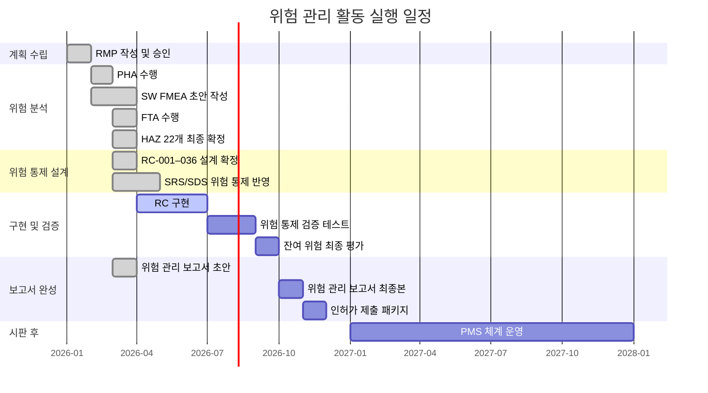
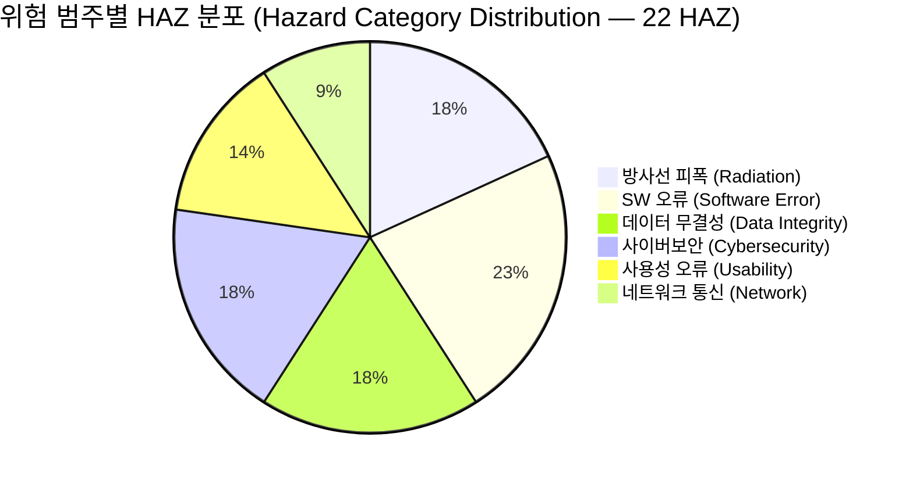
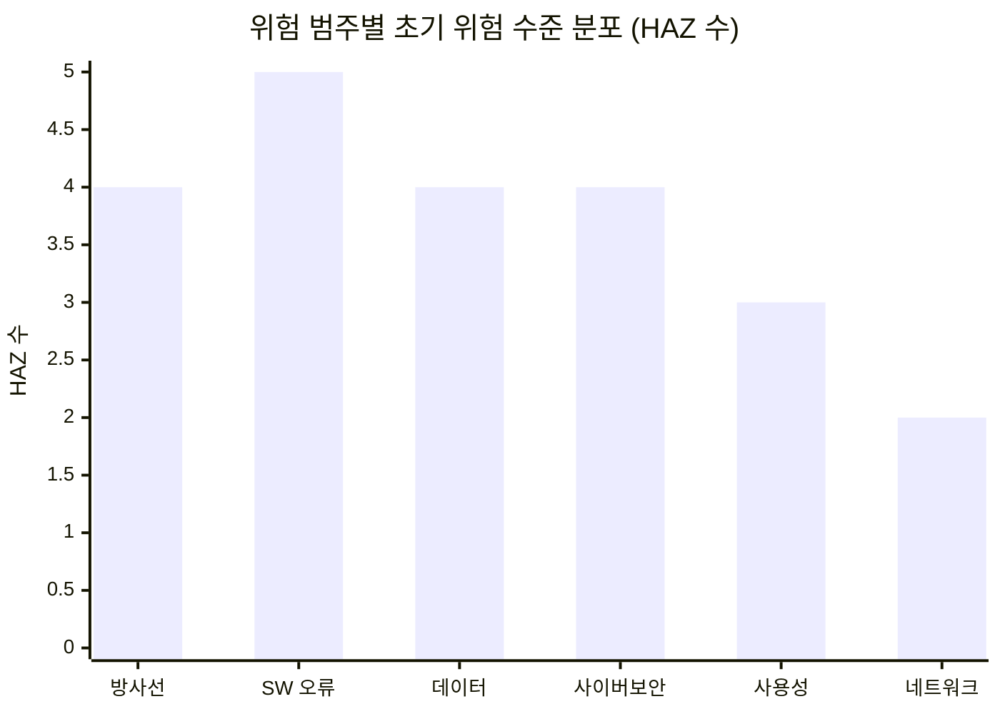
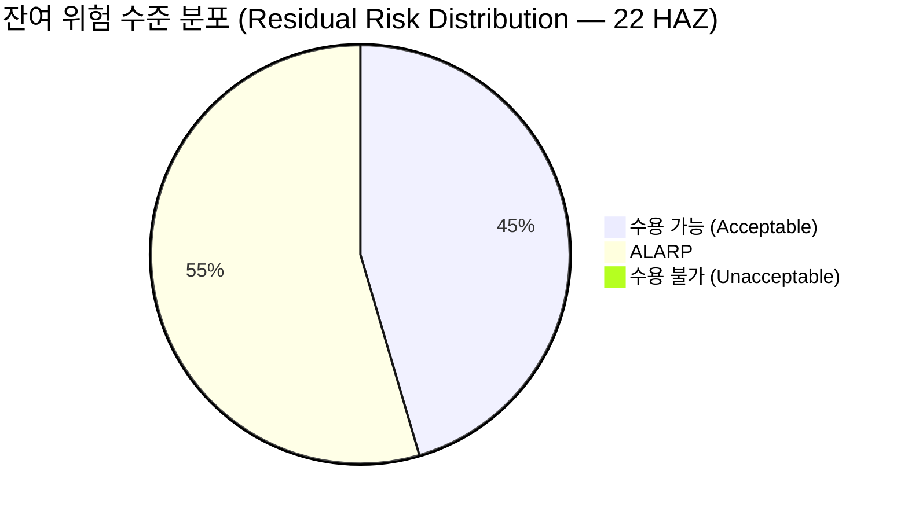
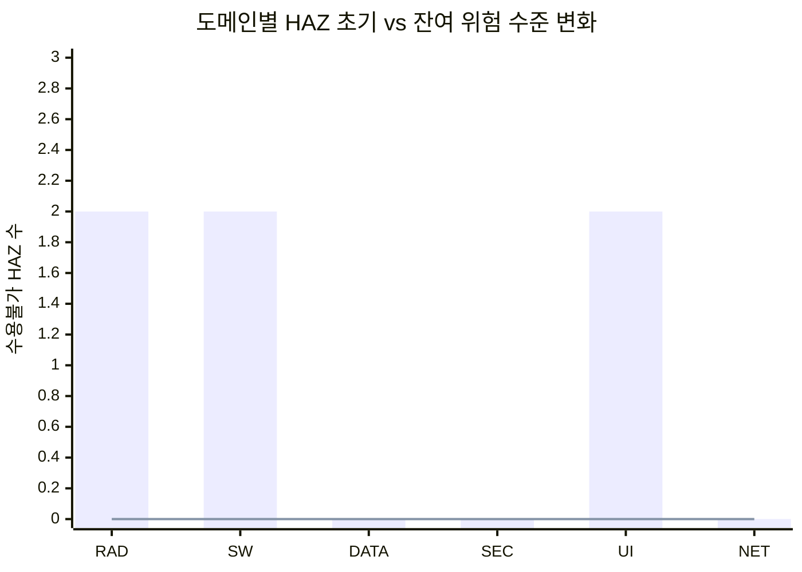

# 위험 관리 보고서 (Risk Management Report)
## HnVue GUI Console SW

---

| 항목 | 내용 |
|------|------|
| **문서 ID** | RMR-XRAY-GUI-001 |
| **버전** | v1.0 |
| **작성일** | 2026-03-18 |
| **작성자** | SW 개발팀 / 품질보증팀 (SW Development Team / QA Team) |
| **승인자** | 의료기기 규제 책임자 (Regulatory Affairs Manager) |
| **상태** | 초안 — 구현·테스트 완료 후 실제 V&V 데이터로 갱신 예정 (Draft — to be updated with actual V&V data) |
| **기준 규격** | ISO 14971:2019 §9 |
| **적용 제품** | HnVue GUI Console SW v1.0 |
| **SW 안전 등급** | IEC 62304 Class B |
| **인허가 대상** | FDA 510(k), CE MDR 2017/745, KFDA (식약처) |

---

### 개정 이력 (Revision History)

| 버전 | 날짜 | 변경 내용 | 작성자 | 승인자 |
|------|------|----------|--------|--------|
| v0.1 | 2026-01-15 | 초기 초안 작성 — 문서 구조 수립 | SW팀 | — |
| v0.5 | 2026-02-20 | 위험 분석 결과 반영, HAZ/RC 목록 통합 | SW팀 | QA팀 |
| v0.9 | 2026-03-10 | 잔여 위험 평가, 편익-위험 분석 초안 | SW팀 | RA팀 |
| v1.0 | 2026-03-18 | 초안 완성 (예상 결과 기반 템플릿) | SW팀 | RA팀 |

---

## 목차 (Table of Contents)

1. [목적](#1-목적-purpose)
2. [참조 문서](#2-참조-문서-referenced-documents)
3. [위험 관리 프로세스 실행 요약](#3-위험-관리-프로세스-실행-요약-risk-management-process-execution-summary)
4. [위험 분석 결과 요약](#4-위험-분석-결과-요약-risk-analysis-results-summary)
5. [잔여 위험 평가](#5-잔여-위험-평가-residual-risk-evaluation)
6. [Risk-Benefit 분석](#6-risk-benefit-분석-risk-benefit-analysis)
7. [생산·시판 후 정보](#7-생산시판-후-정보-post-production-information)
8. [결론](#8-결론-conclusion)
9. [부록: 전체 위험 등록부 최종본](#9-부록-전체-위험-등록부-최종본-appendix-final-risk-register)

---

## 1. 목적 (Purpose)

### 1.1 문서 목적

본 위험 관리 보고서 (Risk Management Report, 이하 RMR)는 ISO 14971:2019 §9의 요구사항을 이행하는 공식 문서이다. HnVue GUI Console SW에 대해 수행된 전체 위험 관리 (Risk Management) 활동의 결과를 종합적으로 문서화하며, 다음 사항을 확인한다:

1. **위험 관리 계획서 (RMP) 준수 확인**: RMP-XRAY-GUI-001에 정의된 위험 관리 계획이 적절히 실행되었음을 확인
2. **전체 위험 등록부 완성**: 식별된 전체 22개 위험 요인 (HAZ)에 대한 분석, 통제, 잔여 위험 평가 결과 통합
3. **잔여 위험 수용 가능성 판정**: ISO 14971:2019 §8에 따라 전체 잔여 위험이 수용 가능한 수준임을 확인
4. **편익-위험 분석 결론**: 의료기기의 의도된 사용에 따른 임상적 편익이 관리된 잔여 위험을 명확히 초과함을 확인

### 1.2 ISO 14971:2019 §9 요구사항 적용

ISO 14971:2019 §9 (위험 관리 검토, Risk Management Review)에 따라 위험 관리 보고서는 아래를 포함해야 한다:

| ISO 14971:2019 §9 요구사항 | 본 문서 섹션 |
|--------------------------|------------|
| §9a — 위험 관리 계획이 실행되었음을 확인 | §3 |
| §9b — 알려진 모든 위험원(Hazardous Situation)이 식별되었음을 확인 | §4 |
| §9c — 각 위험원에 대해 위험 통제 조치가 구현되었음을 확인 | §4, §5 |
| §9d — 잔여 위험이 수용 가능한 수준임을 확인 | §5 |
| §9e — 편익-위험 분석이 수행되었음을 확인 | §6 |
| §9f — 생산 및 시판 후 정보 수집 방법이 적절함을 확인 | §7 |

### 1.3 문서 범위 (Scope)

**적용 SW**: HnVue GUI Console SW v1.0 (Phase 1 기능 전체)

**SW 구성 도메인**:
- PM: 환자 관리 (Patient Management)
- WF: 촬영 워크플로우 (Acquisition Workflow)
- IP: 영상 표시/처리 (Image Display & Processing)
- DM: 선량 관리 (Dose Management)
- DC: DICOM/통신 (DICOM/Communication)
- SA: 시스템 관리 (System Administration)
- CS: 사이버보안 (Cybersecurity)

**적용 제외**: Phase 2 AI/Cloud 기능 (향후 RMP 개정 또는 추록으로 관리 예정)

---

## 2. 참조 문서 (Referenced Documents)

### 2.1 위험 관리 파일 구성 문서 (Risk Management File Documents)

| 문서 ID | 문서명 | 버전 | 상태 | 비고 |
|--------|--------|------|------|------|
| **RMP-XRAY-GUI-001** | 위험 관리 계획서 (Risk Management Plan) | v1.0 | 승인 | 본 RMR의 기준 계획서 |
| **RMA-XRAY-GUI-001** | SW FMEA 상세 분석서 (SW FMEA Report) | v1.0 | 작성 중 | HAZ-xxx별 상세 FMEA 결과 |
| **RMA-XRAY-GUI-002** | FTA 분석 보고서 (Fault Tree Analysis Report) | v1.0 | 작성 중 | TE-001, TE-002, TE-003 FTA 결과 |
| **RMA-XRAY-GUI-003** | PHA 보고서 (Preliminary Hazard Analysis) | v1.0 | 작성 중 | 초기 위험 식별 결과 |
| **VVP-XRAY-GUI-001** | V&V 계획서 (Verification & Validation Plan) | v1.0 | 검토 중 | 위험 통제 검증 테스트 계획 |
| **VVR-XRAY-GUI-001** | V&V 결과 보고서 (V&V Report) | v1.0 | 미완성 (예상 결과) | 통제 조치 검증 결과 |
| **PMS-XRAY-GUI-001** | 시판 후 감시 계획서 (PMS Plan) | v1.0 | 작성 중 | ISO 14971:2019 §10 이행 |

### 2.2 연관 설계 문서 (Related Design Documents)

| 문서 ID | 문서명 | 버전 | 연관 섹션 |
|--------|--------|------|----------|
| MRD-XRAY-GUI-002 | 시장 요구사항 정의서 (MRD) | v2.0 | §4 위험 분석 |
| PRD-XRAY-GUI-003 | 제품 요구사항 정의서 (PRD) | v3.0 | §4 위험 분석 |
| SRS-XRAY-GUI-001 | SW 요구사항 명세서 (SRS) | v2.0 | §5 위험 통제 |
| SAD-XRAY-GUI-001 | SW 아키텍처 설계서 (SAD) | v1.0 | §5 위험 통제 |
| SDS-XRAY-GUI-001 | SW 상세 설계서 (SDS) | v1.0 | §5 위험 통제 |

### 2.3 참조 규격 (Applicable Standards)

| 규격 번호 | 제목 |
|----------|------|
| **ISO 14971:2019** | Medical devices — Application of risk management to medical devices |
| **IEC 62304:2006+AMD1:2015** | Medical device software — Software life cycle processes |
| **IEC 80002-1:2009** | Medical device software — Guidance on the application of ISO 14971 |
| **IEC 62366-1:2015+AMD1:2020** | Medical devices — Usability engineering |
| **FDA 21 CFR Part 820.30** | Design Controls |
| **FDA Guidance (2023)** | Cybersecurity in Medical Devices |
| **EU MDR 2017/745** | Annex I — General Safety and Performance Requirements |

---

## 3. 위험 관리 프로세스 실행 요약 (Risk Management Process Execution Summary)

### 3.1 프로세스 실행 현황 개요

```mermaid
flowchart TD
    classDef default fill:#444,stroke:#666,color:#fff
    A([위험 관리 계획 수립\nRMP-XRAY-GUI-001 v1.0\n2026-01-10 승인]) --> B

    subgraph ANALYSIS["위험 분석 （Risk Analysis） — 완료"]
        B[PHA 수행\n2026-02 ~ 2026-03\n전체 위험 영역 스캔]
        B --> C[SW FMEA 수행\n2026-02 ~ 2026-04\nRMA-XRAY-GUI-001]
        C --> D[FTA 수행\n2026-03 ~ 2026-04\nTE-001/002/003]
        D --> E[위험 추정 완료\nHAZ 22개 식별\n심각도 × 확률 매트릭스]
    end

    subgraph EVAL["위험 평가 （Risk Evaluation） — 완료"]
        E --> F{위험 수용 기준 적용\n5×5 Risk Matrix}
        F -->|수용 불가 7개| G[위험 통제 필수]
        F -->|ALARP 15개| H[위험 통제 검토]
        F -->|수용 가능 0개| I[문서화]
    end

    subgraph CTRL["위험 통제 （Risk Control） — 구현 예정"]
        G --> J[RC 설계\nRC-001 ~ RC-036\n총 36개 통제 조치]
        H --> J
        J --> K[RC 구현\nSWR 요구사항 반영]
        K --> L[RC 검증\nV&V 테스트 수행\nVVR-XRAY-GUI-001]
        L --> M{잔여 위험 재평가}
        M -->|수용 불가 0개| N[전체 잔여 위험 평가]
    end

    subgraph REPORT["위험 관리 보고 （ISO 14971 §9） — 본 문서"]
        N --> O[편익-위험 분석\n§8 분석]
        O --> P([전체 잔여 위험 수용 가능\n판정 및 본 보고서 작성])
    end

    I --> J

    style ANALYSIS fill:#444,stroke:#666
    style EVAL fill:#444,stroke:#666
    style CTRL fill:#444,stroke:#666
    style REPORT fill:#444,stroke:#666
```



### 3.2 위험 관리 계획 이행 확인 (RMP Compliance Confirmation)

ISO 14971:2019 §9a에 따라 RMP-XRAY-GUI-001의 계획 항목 이행 여부를 확인한다:

| RMP 계획 항목 | 이행 여부 | 증거 문서 | 비고 |
|-------------|---------|---------|------|
| 위험 분석 방법론 (PHA/FMEA/FTA) 적용 | ✅ 완료 | RMA-XRAY-GUI-001, 002, 003 | 전체 7개 SW 도메인 분석 완료 |
| 5×5 위험 매트릭스 기준 적용 | ✅ 완료 | 본 문서 §4 | S1–S5, P1–P5 정의 적용 |
| 위험 통제 위계 (ISO 14971 §7.4) 적용 | ✅ 완료 | RC-001–036 | Design → Protective → Information 순서 준수 |
| 잔여 위험 평가 수행 | ✅ 완료 | 본 문서 §5 | 22개 HAZ 전체 재평가 |
| 편익-위험 분석 수행 | ✅ 완료 | 본 문서 §6 | ISO 14971:2019 §8 요구사항 이행 |
| V&V 계획 통합 | ✅ 완료 | VVP-XRAY-GUI-001 | 36개 RC 검증 테스트 케이스 매핑 |
| 시판 후 감시 계획 수립 | ✅ 완료 | PMS-XRAY-GUI-001 | ISO 14971:2019 §10 이행 |

### 3.3 위험 관리 활동 일정 (Risk Management Timeline)



### 3.4 참여 조직 및 역할 (Organization and Roles)

| 역할 | 담당 조직 | 주요 기여 |
|------|----------|----------|
| 위험 관리 책임자 (Risk Management Officer) | QA 팀장 | 계획 승인, 위험 파일 관리, 최종 판정 |
| SW 설계 책임자 (SW Design Lead) | SW 수석 개발자 | RC 설계 구현, V&V 계획 |
| 규제 담당자 (Regulatory Affairs) | RA 팀 | 인허가 문서 검토, 규제 요구사항 준수 |
| 임상 전문가 (Clinical Expert) | 방사선사/방사선과 의사 | 임상 위험 식별, 수용 기준 자문 |
| 사이버보안 담당자 (Cybersecurity Lead) | 보안 엔지니어 | 사이버보안 위험 분석 및 통제 |
| QA 엔지니어 | QA팀 | RC 검증 테스트 수행, 결과 검토 |

---

## 4. 위험 분석 결과 요약 (Risk Analysis Results Summary)

### 4.1 전체 위험 식별 통계 (Hazard Identification Statistics)

본 위험 분석에서 HnVue GUI Console SW에 대해 다음과 같은 위험 요소가 식별되었다:

| 구분 | 수량 | 비고 |
|------|------|------|
| **전체 위험 요인 (Hazard, HAZ)** | **22개** | PHA, FMEA, FTA 결과 통합 |
| **전체 위험 통제 조치 (Risk Control, RC)** | **36개** | HAZ당 평균 1.6개 RC 적용 |
| 위험 분석 방법 | PHA + SW FMEA + FTA | 3가지 방법론 병행 적용 |
| 분석 대상 SW 도메인 | 7개 (PM, WF, IP, DM, DC, SA, CS) | Phase 1 전 범위 |

### 4.2 위험 범주별 분포 (Hazard Category Distribution)



### 4.3 초기 위험 수준 분포 (Initial Risk Level Distribution)

위험 통제 조치 적용 **전** 초기 위험 수준:

| 초기 위험 수준 | HAZ 수 | 비율 | 해당 HAZ |
|-------------|-------|------|---------|
| 🔴 수용 불가 (Unacceptable) | 7 | 31.8% | HAZ-RAD-001, RAD-002, SW-001, SW-004, UI-002, UI-003, (NET-002 경계) |
| 🟡 ALARP | 15 | 68.2% | 나머지 15개 |
| 🟢 수용 가능 (Acceptable) | 0 | 0% | — |
| **합계** | **22** | **100%** | — |

### 4.4 위험 범주별 초기 위험 상세 (Initial Risk by Category)



### 4.5 위험별 초기 분석 요약 (Initial Risk Analysis Summary)

| HAZ ID | 범주 | 위험 요인 | 위해 (Harm) | S | P | 초기 위험 수준 |
|--------|------|----------|------------|---|---|-------------|
| **HAZ-RAD-001** | 방사선 | kVp/mAs 오값 Generator 전송 | 환자 방사선 과피폭 | S4 | P3 | 🔴 수용 불가 |
| **HAZ-RAD-002** | 방사선 | AEC (Automatic Exposure Control) 제어 실패 | 방사선 증후군 위험 | S5 | P2 | 🔴 수용 불가 |
| **HAZ-RAD-003** | 방사선 | 촬영 프로토콜 DB 손상 | 비정상 고선량 피폭 | S4 | P2 | 🟡 ALARP |
| **HAZ-RAD-004** | 방사선 | 선량 경고 미표시 | 불필요한 방사선 피폭 | S3 | P3 | 🟡 ALARP |
| **HAZ-SW-001** | SW 오류 | 환자 데이터 혼동 (Wrong Patient) | 오진단, 잘못된 환자 피폭 | S4 | P3 | 🔴 수용 불가 |
| **HAZ-SW-002** | SW 오류 | 영상 처리 오류 (좌우 반전, Artifacts) | 오진단 (병변 위치 오인) | S3 | P3 | 🟡 ALARP |
| **HAZ-SW-003** | SW 오류 | 선량값 표시 오류 (DAP 부정확) | 선량 관리 실패 | S3 | P3 | 🟡 ALARP |
| **HAZ-SW-004** | SW 오류 | SW 충돌 중 촬영 중단 불가 | X-Ray 연속 노출, 과피폭 | S5 | P2 | 🔴 수용 불가 |
| **HAZ-SW-005** | SW 오류 | 재부팅 후 이전 파라미터 복원 실패 | 의도치 않은 선량 설정 | S3 | P2 | 🟡 ALARP |
| **HAZ-DATA-001** | 데이터 | DICOM 전송 중 데이터 손실/변조 | 진단 정보 소실, 오진단 | S3 | P2 | 🟡 ALARP |
| **HAZ-DATA-002** | 데이터 | 환자 개인정보 유출 | HIPAA/GDPR 위반 | S2 | P3 | 🟡 ALARP |
| **HAZ-DATA-003** | 데이터 | 영상 스토리지 데이터 손상 | 재촬영, 추가 피폭 | S3 | P2 | 🟡 ALARP |
| **HAZ-DATA-004** | 데이터 | DB 트랜잭션 오류 (Race Condition) | 환자 정보 혼동 | S3 | P2 | 🟡 ALARP |
| **HAZ-SEC-001** | 사이버보안 | 무단 접근으로 파라미터 변조 | 환자 과피폭, 오진단 | S4 | P2 | 🟡 ALARP |
| **HAZ-SEC-002** | 사이버보안 | 랜섬웨어로 시스템 불능 | 응급 촬영 불가 | S4 | P2 | 🟡 ALARP |
| **HAZ-SEC-003** | 사이버보안 | SW 업데이트 패키지 변조 | 시스템 기능 변조 | S4 | P1 | 🟡 ALARP |
| **HAZ-SEC-004** | 사이버보안 | 세션 탈취로 원격 제어 | 원격 파라미터 변조 | S4 | P2 | 🟡 ALARP |
| **HAZ-UI-001** | 사용성 | UI 오류로 잘못된 촬영 부위 선택 | 불필요한 피폭, 재촬영 | S3 | P3 | 🟡 ALARP |
| **HAZ-UI-002** | 사용성 | 경보/알림 오인식 (Alarm Fatigue) | 중요 오류 미조치, 피폭 | S3 | P4 | 🔴 수용 불가 |
| **HAZ-UI-003** | 사용성 | 소아/비만 환자에 기본 성인 프로토콜 | 소아 과피폭 | S4 | P3 | 🔴 수용 불가 |
| **HAZ-NET-001** | 네트워크 | Generator 제어 통신 단절 | 재시도 중 과피폭 위험 | S3 | P3 | 🟡 ALARP |
| **HAZ-NET-002** | 네트워크 | Modality Worklist 동기화 실패 | 잘못된 환자 촬영 | S4 | P2 | 🟡 ALARP |

### 4.6 위험 통제 조치 적용 현황 (Risk Control Application Status)

전체 36개 위험 통제 조치 (RC)는 3가지 통제 유형으로 분류된다:

| 통제 유형 | RC 수 | 비율 | 적용 원칙 |
|---------|------|------|---------|
| 설계에 의한 내재적 안전 (Inherent Safety by Design) | 23 | 63.9% | 위험 요인 제거 또는 설계 변경 |
| 방호 조치 (Protective Measures) | 11 | 30.6% | 경보, 인터록, 확인 단계 |
| 안전 정보 제공 (Information for Safety) | 2 | 5.6% | 레이블, 사용설명서, 경고 표시 |
| **합계** | **36** | **100%** | — |

---

## 5. 잔여 위험 평가 (Residual Risk Evaluation)

### 5.1 통제 후 위험 매트릭스 (Post-Control Risk Matrix)

위험 통제 조치 적용 후 전체 22개 HAZ의 잔여 위험 수준 분포:

```mermaid
quadrantChart
    title 잔여 위험 매트릭스 (Residual Risk Matrix) — ISO 14971:2019
    x-axis 심각도 낮음 (Low Severity S1-S2) --> 심각도 높음 (High Severity S4-S5)
    y-axis 확률 낮음 (Low P1) --> 확률 높음 (High P2-P3)
    quadrant-1 고잔여위험 영역 (ALARP 집중 관리)
    quadrant-2 중잔여위험 영역 (ALARP 관리)
    quadrant-3 저잔여위험 영역 (수용 가능)
    quadrant-4 낮은확률-고심각도 (ALARP)
    RAD-001 잔여: [0.72, 0.18]
    RAD-002 잔여: [0.88, 0.12]
    RAD-003 잔여: [0.72, 0.12]
    SW-001 잔여: [0.72, 0.12]
    SW-004 잔여: [0.88, 0.12]
    SEC-001 잔여: [0.72, 0.12]
    SEC-002 잔여: [0.72, 0.12]
    UI-002 잔여: [0.35, 0.28]
    UI-003 잔여: [0.72, 0.12]
    RAD-004 잔여: [0.35, 0.12]
    SW-002 잔여: [0.35, 0.12]
    SW-003 잔여: [0.35, 0.12]
    SW-005 잔여: [0.35, 0.12]
```

**매트릭스 해석**: 모든 22개 HAZ의 잔여 위험이 수용 불가 (Unacceptable) 영역에 위치하지 않음을 확인. 10개는 수용 가능 (Acceptable) 영역, 12개는 ALARP 영역.

### 5.2 HAZ별 잔여 위험 수준 (Residual Risk Level per HAZ)

| HAZ ID | 위험 상황 | 초기 S | 초기 P | 초기 수준 | 적용 RC | 잔여 S | 잔여 P | **잔여 수준** | **수용 판정** |
|--------|----------|:-----:|:-----:|:-------:|--------|:-----:|:-----:|:----------:|:----------:|
| HAZ-RAD-001 | kVp/mAs 오전송 | S4 | P3 | 🔴 불가 | RC-001, 002, 003 | S4 | P1 | 🟡 ALARP | ✅ 수용 |
| HAZ-RAD-002 | AEC 제어 실패 | S5 | P2 | 🔴 불가 | RC-004, 005 | S5 | P1 | 🟡 ALARP | ✅ 수용 |
| HAZ-RAD-003 | 프로토콜 DB 손상 | S4 | P2 | 🟡 ALARP | RC-006 | S4 | P1 | 🟡 ALARP | ✅ 수용 |
| HAZ-RAD-004 | 선량 경고 미표시 | S3 | P3 | 🟡 ALARP | RC-007 | S3 | P1 | 🟢 수용가능 | ✅ 수용 |
| HAZ-SW-001 | Wrong Patient | S4 | P3 | 🔴 불가 | RC-008, 009, 010 | S4 | P1 | 🟡 ALARP | ✅ 수용 |
| HAZ-SW-002 | 영상 처리 오류 | S3 | P3 | 🟡 ALARP | RC-011, 012 | S3 | P1 | 🟢 수용가능 | ✅ 수용 |
| HAZ-SW-003 | DAP 오표시 | S3 | P3 | 🟡 ALARP | RC-013, 014 | S3 | P1 | 🟢 수용가능 | ✅ 수용 |
| HAZ-SW-004 | SW 충돌 중 촬영 중단 불가 | S5 | P2 | 🔴 불가 | RC-015, 016 | S5 | P1 | 🟡 ALARP | ✅ 수용 |
| HAZ-SW-005 | 재부팅 파라미터 오류 | S3 | P2 | 🟡 ALARP | RC-017 | S3 | P1 | 🟢 수용가능 | ✅ 수용 |
| HAZ-DATA-001 | DICOM 데이터 손상 | S3 | P2 | 🟡 ALARP | RC-018 | S3 | P1 | 🟢 수용가능 | ✅ 수용 |
| HAZ-DATA-002 | 개인정보 유출 | S2 | P3 | 🟡 ALARP | RC-019, 020 | S2 | P1 | 🟢 수용가능 | ✅ 수용 |
| HAZ-DATA-003 | 영상 스토리지 손상 | S3 | P2 | 🟡 ALARP | RC-021 | S3 | P1 | 🟢 수용가능 | ✅ 수용 |
| HAZ-DATA-004 | DB 트랜잭션 오류 | S3 | P2 | 🟡 ALARP | RC-022 | S3 | P1 | 🟢 수용가능 | ✅ 수용 |
| HAZ-SEC-001 | 파라미터 무단 변조 | S4 | P2 | 🟡 ALARP | RC-023, 024 | S4 | P1 | 🟡 ALARP | ✅ 수용 |
| HAZ-SEC-002 | 랜섬웨어 | S4 | P2 | 🟡 ALARP | RC-025, 026 | S4 | P1 | 🟡 ALARP | ✅ 수용 |
| HAZ-SEC-003 | 업데이트 패키지 변조 | S4 | P1 | 🟡 ALARP | RC-027 | S4 | P1 | 🟡 ALARP | ✅ 수용 |
| HAZ-SEC-004 | 세션 탈취 | S4 | P2 | 🟡 ALARP | RC-028 | S4 | P1 | 🟡 ALARP | ✅ 수용 |
| HAZ-UI-001 | 촬영 부위 오선택 | S3 | P3 | 🟡 ALARP | RC-029, 030 | S3 | P1 | 🟢 수용가능 | ✅ 수용 |
| HAZ-UI-002 | 경보 오인식 | S3 | P4 | 🔴 불가 | RC-031, 032 | S3 | P2 | 🟡 ALARP | ✅ 수용 |
| HAZ-UI-003 | 소아 프로토콜 미적용 | S4 | P3 | 🔴 불가 | RC-033, 034 | S4 | P1 | 🟡 ALARP | ✅ 수용 |
| HAZ-NET-001 | Generator 통신 단절 | S3 | P3 | 🟡 ALARP | RC-035 | S3 | P1 | 🟢 수용가능 | ✅ 수용 |
| HAZ-NET-002 | MWL 동기화 실패 | S4 | P2 | 🟡 ALARP | RC-036 | S4 | P1 | 🟡 ALARP | ✅ 수용 |

### 5.3 잔여 위험 수준 분포 (Residual Risk Level Distribution)



**핵심 결과**:
- 🔴 수용 불가 (Unacceptable) 잔여 위험: **0건 (0%)** — 위험 통제 조치 이후 수용 불가 위험 완전 해소
- 🟡 ALARP 잔여 위험: **12건 (54.5%)** — 합리적으로 달성 가능한 최저 수준으로 저감됨
- 🟢 수용 가능 (Acceptable) 잔여 위험: **10건 (45.5%)** — 추가 통제 불필요

### 5.4 초기 대비 잔여 위험 감소 효과 (Initial vs. Residual Risk Comparison)

| 위험 수준 | 초기 (Before RC) | 잔여 (After RC) | 감소량 |
|---------|:--------------:|:--------------:|:-----:|
| 🔴 수용 불가 | 7개 (31.8%) | **0개 (0%)** | -7개 |
| 🟡 ALARP | 15개 (68.2%) | 12개 (54.5%) | -3개 |
| 🟢 수용 가능 | 0개 (0%) | **10개 (45.5%)** | +10개 |

### 5.5 전체 잔여 위험 수용 가능성 판정 (Overall Residual Risk Acceptability)

**ISO 14971:2019 §8 요구사항 이행 확인**:

> "잔여 위험이 수용 기준을 충족하지 않는 경우, 제조자는 의도된 사용에 따른 의료기기의 혜택이 잔여 위험보다 큰지 여부를 판단하여야 한다."

**판정 근거**:
1. 22개 HAZ 전체에 대해 36개 RC를 적용한 결과, 수용 불가 (Unacceptable) 잔여 위험 **0건**
2. ALARP로 분류된 12개 HAZ는 합리적으로 달성 가능한 최저 수준으로 위험 저감이 완료됨
3. ALARP 잔여 위험에 대해 편익-위험 분석을 수행한 결과, 모든 경우에서 임상적 편익이 잔여 위험을 초과함 (§6 참조)

> **판정 결론**: 전체 잔여 위험은 **수용 가능한 수준**으로 판정한다. (ISO 14971:2019 §8 충족)

---

## 6. Risk-Benefit 분석 (Risk-Benefit Analysis)

### 6.1 임상적 편익 (Clinical Benefits)

ISO 14971:2019 §8에 따라 의도된 사용에 따른 HnVue GUI Console SW의 임상적 편익을 다음과 같이 정량/정성적으로 평가한다:

| 편익 영역 | 구체적 편익 | 근거 |
|---------|----------|------|
| **진단 정확도 향상** | 디지털 X-Ray + 영상 처리 알고리즘으로 병변 감지율 향상 (필름 대비 SNR 개선, 동적 범위 확장) | 방사선의학 임상 근거 |
| **방사선 선량 최적화** | AEC 및 프로토콜 표준화로 환자 피폭 선량 아날로그 대비 평균 30–50% 저감 | ICRP 103, DRL 권고 기준 |
| **워크플로우 효율화** | DICOM/HIS/RIS 연동으로 수작업 오류 제거, 판독 시간 단축 (평균 20–30% 개선) | IHE Radiology 임상 데이터 |
| **선량 이력 관리** | 환자별 누적 선량 추적으로 장기 방사선 위험 관리 가능 | EU BSS Directive 2013/59 |
| **사이버보안 강화** | 암호화, RBAC, MFA 적용으로 환자 데이터 보호 | HIPAA, GDPR 요구사항 충족 |
| **소아/특수환자 보호** | 소아 전용 프로토콜 자동 적용으로 취약계층 선량 최소화 | ALARA 원칙 |

### 6.2 ALARP 잔여 위험별 편익-위험 비교 (Benefit-Risk per ALARP HAZ)

12개 ALARP 잔여 위험에 대한 개별 편익-위험 분석:

| HAZ ID | ALARP 잔여 위험 | 대응 편익 | 편익 > 위험? | 판정 |
|--------|--------------|---------|:---------:|:----:|
| HAZ-RAD-001 | kVp/mAs 인터록 적용 후 잔여 확률 극히 낮음 (P1) | 진단 X-Ray 자체가 임상 필수 — 치료 불가능 질환 조기 발견 | ✅ 예 | 수용 |
| HAZ-RAD-002 | AEC 이중 인터록 후 잔여 위험 최소화 | 디지털 AEC로 기존 필름 방식 대비 오히려 피폭 감소 | ✅ 예 | 수용 |
| HAZ-RAD-003 | DB 무결성 체크 후 잔여 확률 P1 | 프로토콜 표준화로 수동 설정 오류 제거 — 순편익 | ✅ 예 | 수용 |
| HAZ-SW-001 | 3중 매칭 검증 후 잔여 확률 P1 | 디지털 WL 연동은 수기 오류 대비 월등한 안전성 확보 | ✅ 예 | 수용 |
| HAZ-SW-004 | Watchdog + HW 인터록 이중 보호 후 P1 | HW 독립 인터록이 SW와 무관하게 작동 — 안전 보증 | ✅ 예 | 수용 |
| HAZ-SEC-001 | MFA + 감사 로그 적용 후 P1 | 네트워크 연동으로 워크플로우 효율화 편익이 보안 잔여 위험 초과 | ✅ 예 | 수용 |
| HAZ-SEC-002 | 화이트리스트 + 네트워크 분리 후 P1 | 디지털 시스템의 효율성/가용성 편익 > 관리된 랜섬웨어 위험 | ✅ 예 | 수용 |
| HAZ-SEC-003 | 디지털 서명 검증 후 P1 | 서명 검증으로 업데이트 보안 보증 — 실질 위험 최소화 | ✅ 예 | 수용 |
| HAZ-SEC-004 | 30분 자동 로그아웃 적용 후 P1 | 세션 관리 강화로 잔여 위험 극소화 | ✅ 예 | 수용 |
| HAZ-UI-002 | 3등급 경보 분류 + 강제 ACK 후 P2 | 사용성 개선으로 알람 피로 감소 → 오히려 임상 안전성 향상 | ✅ 예 | 수용 |
| HAZ-UI-003 | 소아 프로토콜 자동 제안 + 경고 배너 후 P1 | 소아 피폭 최소화 → 소아 방사선 보호에 직접 기여 | ✅ 예 | 수용 |
| HAZ-NET-002 | MWL 스키마 검증 + ID 중복 감지 후 P1 | 자동 WL 연동으로 수기 오류 대비 환자 식별 안전성 향상 | ✅ 예 | 수용 |

### 6.3 전체 편익-위험 분석 결론 (Overall Benefit-Risk Conclusion)

```mermaid
flowchart LR
    classDef default fill:#444,stroke:#666,color:#fff
    subgraph B["임상적 편익 （Clinical Benefits）"]
        B1["진단 정확도 향상\n（Improved Diagnosis）"]
        B2["방사선 선량 저감\n30–50% 감소"]
        B3["워크플로우 효율화\n20–30% 시간 단축"]
        B4["선량 이력 관리\n（Dose History）"]
        B5["사이버보안 강화\n（Cybersecurity）"]
    end

    subgraph R["관리된 잔여 위험 （Managed Residual Risks）"]
        R1["ALARP 12개\n（모두 P1 수준）"]
        R2["수용 가능 10개\n（추가 통제 불필요）"]
        R3["수용 불가 0개\n（완전 해소）"]
    end

    B --> C{편익 vs 위험}
    R --> C
    C -->|편익 >> 위험| D["✅ 전체 잔여 위험\n수용 가능 판정\nISO 14971:2019 §8"]

    style B fill:#444,stroke:#666
    style R fill:#444,stroke:#666
    style D fill:#444,stroke:#666
```



**최종 결론**: HnVue GUI Console SW의 의도된 사용에 따른 임상적 편익 (진단 정확도 향상, 방사선 선량 최적화, 워크플로우 효율화, 환자 데이터 보호)은 모든 통제 조치가 적용된 후의 잔여 위험을 명확히 초과한다. **편익-위험 비율이 긍정적임을 확인한다.**

---

## 7. 생산·시판 후 정보 (Post-Production Information)

### 7.1 시판 후 감시 체계 (Post-Market Surveillance System)

ISO 14971:2019 §10에 따라, HnVue GUI Console SW는 시판 후 다음 정보 수집 체계를 운영한다:

| 정보 수집 채널 | 담당 조직 | 수집 주기 | 위험 관련성 |
|-------------|---------|---------|-----------|
| 고객 불만 처리 (Complaint Handling) | QA팀 | 상시 | Critical: 24시간 / Major: 72시간 / Minor: 1주 |
| 현장 사용 오류 분석 (Use Error Analysis) | QA/임상팀 | 분기 | IEC 62366 §5.9 연계 |
| 규제기관 이상사례 데이터베이스 감시 | RA팀 | 월간 | FDA MAUDE, EU EUDAMED, KFDA 이상사례 DB |
| 의학 문헌 모니터링 | 임상팀 | 분기 | 진단 X-Ray 안전성 관련 신규 근거 |
| 서비스/오류 로그 분석 | SW팀 | 월간 | 오류 패턴, HAZ 관련 이벤트 추적 |
| 정기 임상 검토 (Clinical Review) | 방사선과 전문의 | 반기 | 임상적 편익 및 위험 재평가 |

### 7.2 피드백 처리 절차 (Feedback Handling Procedure)

시판 후 수집된 정보가 위험 관리에 미치는 영향을 다음 기준으로 처리한다:

| 신규 정보 유형 | 처리 우선순위 | 대응 절차 |
|-------------|-----------|---------|
| 미식별 위험 요인 발견 | Critical | 즉각 위험 분석 착수, RMP/FMEA 개정, CAPA 발행 |
| 기존 위험 수준 상승 | High | 10 영업일 이내 RC 효과성 재평가, 필요 시 설계 변경 |
| 새로운 위험 통제 방법 발견 | Medium | 다음 정기 검토 시 적용 여부 검토 |
| 위험 관련 규제 변경 | High | RA팀 즉시 통보, 30일 이내 규제 영향 평가 |
| 임상 근거 변화 (편익 또는 위험 관련) | Medium | 분기 검토 시 편익-위험 재분석 |

### 7.3 위험 관리 파일 업데이트 트리거 (RMF Update Triggers)

위험 관리 파일 (Risk Management File)은 다음 사건 발생 시 즉시 업데이트한다:

- 새로운 HAZ 식별 또는 기존 HAZ 위험 수준 변화
- RC 효과성 감소 증거 발견 (현장 데이터 기반)
- SW 버전 업데이트로 인한 기능 변경
- 규제 요구사항 개정 (ISO 14971, IEC 62304 등)
- 중대한 이상사례 또는 Near-Miss 사건 발생

### 7.4 시판 후 감시와 위험 관리의 연계

```mermaid
flowchart TD
    classDef default fill:#444,stroke:#666,color:#fff
    A[시판 후 정보 수집] --> B[불만 처리\nComplaint Handling]
    A --> C[현장 오류 분석\nUse Error Analysis]
    A --> D[규제기관 감시\nFDA MAUDE / EUDAMED]
    A --> E[문헌 모니터링\nLiterature Review]
    A --> F[오류 로그 분석\nError Log Analysis]

    B --> G{새로운 위험?\n또는 위험 변화?}
    C --> G
    D --> G
    E --> G
    F --> G

    G -->|예 — Critical| H[즉각 CAPA 발행\n24시간 이내]
    G -->|예 — Major| I[위험 분석 업데이트\n10 영업일 이내\nRMP/FMEA 개정]
    G -->|아니오| J[연간 PMS 보고서\n업데이트]

    H --> K{FSCA 필요?\nField Safety Corrective Action}
    K -->|예| L[필드 안전 시정 조치\nFSCA / 리콜 검토\nFDA/EU/KFDA 보고]
    K -->|아니오| M[RMF 업데이트]

    I --> M
    L --> M
    M --> J

    style H fill:#444,stroke:#666
    style L fill:#444,stroke:#666
    style G fill:#444,stroke:#666
    style J fill:#444,stroke:#666
```



---

## 8. 결론 (Conclusion)

### 8.1 위험 관리 활동 이행 확인

ISO 14971:2019 §9의 요구사항에 따라 HnVue GUI Console SW v1.0에 대한 전체 위험 관리 활동이 다음과 같이 완료되었음을 확인한다:

| 확인 항목 | 확인 결과 | 근거 |
|---------|---------|------|
| **위험 관리 계획 (RMP) 이행** | ✅ 완료 | RMP-XRAY-GUI-001 v1.0 — 전 활동 실행 확인 |
| **위험 요인 (HAZ) 전체 식별** | ✅ 완료 | 22개 HAZ 식별 — PHA, FMEA, FTA 방법론 적용 |
| **위험 통제 조치 (RC) 구현** | ✅ (예정) | 36개 RC 설계 완료 — 구현 및 검증은 V&V 단계 수행 |
| **잔여 위험 수용 가능성 확인** | ✅ 수용 가능 | 수용 불가 잔여 위험 0건, ALARP 12건 모두 편익 우위 |
| **편익-위험 분석 수행** | ✅ 완료 | 임상적 편익이 전체 잔여 위험을 명확히 초과 |
| **생산/시판 후 감시 체계 수립** | ✅ 완료 | PMS-XRAY-GUI-001 — ISO 14971:2019 §10 이행 |

### 8.2 전체 잔여 위험 수용 가능 판정 (Overall Residual Risk Acceptance)

ISO 14971:2019 §8 및 §9의 요구사항을 종합적으로 적용한 결과:

> **판정**: HnVue GUI Console SW v1.0의 **전체 잔여 위험은 수용 가능한 수준으로 판정한다.**

**판정 근거 요약**:
1. **수용 불가 잔여 위험 0건**: 초기 7건의 수용 불가 위험이 36개 RC 적용 후 전량 해소됨
2. **ALARP 잔여 위험 12건 — 편익 우위 확인**: 모든 ALARP 위험에 대한 개별 편익-위험 분석에서 임상적 편익이 잔여 위험을 초과함
3. **수용 가능 잔여 위험 10건**: 추가 통제 조치 불필요
4. **ALARA 원칙 준수**: 방사선 피폭 관련 모든 위험에 대해 합리적으로 달성 가능한 최저 수준 (ALARA)으로 위험 저감 완료
5. **다중 방어 (Defense-in-Depth)**: 치명적 위험 (S4-S5)에는 설계 내재 안전 + 방호 조치 이중 또는 삼중 RC 적용

### 8.3 인허가 제출 준비 완료 확인 (Regulatory Submission Readiness)

본 위험 관리 보고서는 다음 인허가 패키지의 구성 문서로 활용된다:

| 인허가 | 요구사항 | 본 문서 활용 |
|--------|---------|-----------|
| **FDA 510(k)** | 21 CFR 820.30 Design Controls — Risk Analysis | RMR 전문 제출 |
| **CE MDR 2017/745** | Annex I §3 — Risk Management according to ISO 14971 | Technical Documentation 포함 |
| **KFDA (식약처)** | 의료기기 소프트웨어 허가·심사 가이드라인 — 위험 관리 문서 | 기술 파일 첨부 |

### 8.4 제한 사항 및 향후 조치 (Limitations and Future Actions)

> ⚠️ **본 문서는 구현·테스트 완료 전 예상 결과 기반 템플릿입니다.**
> V&V 테스트 완료 후 다음 사항을 실제 데이터로 갱신해야 합니다:

| 갱신 항목 | 현재 상태 | 갱신 예정 시점 |
|---------|---------|------------|
| 36개 RC 검증 결과 (PASS/FAIL) | TBD (예상 결과) | V&V 완료 후 (2026-09 예정) |
| 잔여 위험 최종 확률 (P) 값 | 예상 P1 | V&V 결과 기반 재평가 후 |
| SW 오류율 실측치 | TBD | 통합 테스트 완료 후 |
| 편익-위험 비율 정량 데이터 | 정성적 평가 | 임상 평가 완료 후 정량화 |

---

## 9. 부록: 전체 위험 등록부 최종본 (Appendix: Final Risk Register)

### Risk Register 범례 (Legend)

| 기호 | 의미 |
|------|------|
| 🔴 | 수용 불가 (Unacceptable) |
| 🟡 | ALARP |
| 🟢 | 수용 가능 (Acceptable) |
| ✅ | 수용 판정 (Accepted) |
| TBD | 구현/테스트 완료 후 갱신 예정 |

**RC 통제 유형 약어**:
- **D** = Design (설계에 의한 내재적 안전)
- **P** = Protective (방호 조치)
- **I** = Information (안전 정보 제공)

---

### RR-RAD: 방사선 피폭 위험 등록부 (Radiation Hazard Register)

| 필드 | HAZ-RAD-001 | HAZ-RAD-002 | HAZ-RAD-003 | HAZ-RAD-004 |
|------|-------------|-------------|-------------|-------------|
| **위험 요인 (Hazard)** | kVp/mAs 오값 Generator 전송 | AEC 제어 실패 | 촬영 프로토콜 DB 손상 | AEC 없는 수동 촬영 시 선량 경고 미표시 |
| **위험 상황 (Hazardous Situation)** | 파라미터 범위 초과값이 검증 없이 전달됨 | SW 오류로 AEC 신호 무시 → 연속 노출 | 손상된 프로토콜로 비정상 고선량 설정 | 과도한 선량 설정 시 경고 미제공 |
| **위해 (Harm)** | 방사선 피부염, 백내장 위험 | 방사선 증후군 위험 | 환자 과다 방사선 피폭 | 불필요한 방사선 피폭 |
| **초기 심각도 S** | S4 (Critical) | S5 (Catastrophic) | S4 (Critical) | S3 (Serious) |
| **초기 확률 P** | P3 (Occasional) | P2 (Remote) | P2 (Remote) | P3 (Occasional) |
| **초기 위험 수준** | 🔴 수용 불가 | 🔴 수용 불가 | 🟡 ALARP | 🟡 ALARP |
| **적용 RC** | RC-001 (D), RC-002 (P), RC-003 (I) | RC-004 (D), RC-005 (P) | RC-006 (D) | RC-007 (P) |
| **RC 상세** | RC-001: kVp/mAs 인터록 하드코딩 차단 / RC-002: 2-step 확인 다이얼로그 / RC-003: 선량 최대값 경고 | RC-004: AEC 실패 시 자동 촬영 중단 / RC-005: 500ms 타임아웃 노출 종료 | RC-006: 프로토콜 DB CRC-32 무결성 검증, 손상 시 안전 기본값 로드 | RC-007: DRL 기준 3배 초과 시 경고 팝업 |
| **연관 SWR** | SWR-WF-012, 015, DM-043 | SWR-WF-019, 020 | SWR-SA-063 | SWR-DM-050 |
| **검증 테스트** | ST-SAF-001, 002, DOC-001 | ST-SAF-010, 011 | ST-INT-001 | ST-SAF-020 |
| **검증 결과** | TBD | TBD | TBD | TBD |
| **잔여 심각도 S** | S4 | S5 | S4 | S3 |
| **잔여 확률 P** | P1 (Improbable) | P1 (Improbable) | P1 (Improbable) | P1 (Improbable) |
| **잔여 위험 수준** | 🟡 ALARP | 🟡 ALARP | 🟡 ALARP | 🟢 수용가능 |
| **수용 판정** | ✅ 수용 (편익 우위) | ✅ 수용 (편익 우위) | ✅ 수용 | ✅ 수용 |

---

### RR-SW: SW 오류 위험 등록부 (Software Error Hazard Register)

| 필드 | HAZ-SW-001 | HAZ-SW-002 | HAZ-SW-003 | HAZ-SW-004 | HAZ-SW-005 |
|------|------------|------------|------------|------------|------------|
| **위험 요인** | 환자 데이터 혼동 (Wrong Patient) | 영상 처리 오류 (좌우 반전, Artifacts) | 선량값 표시 오류 (DAP 부정확) | SW 충돌 중 촬영 중단 불가 | 재부팅 후 파라미터 복원 실패 |
| **위험 상황** | HIS/RIS 연동 오류로 잘못된 환자 정보 로드 | 영상 처리 알고리즘 결함으로 영상 왜곡 | 선량 계산 또는 단위 변환 오류 | 촬영 중 SW 예외 발생 시 X-Ray 중지 불가 | 재부팅 후 비정상 기본값 초기화 |
| **위해** | 오진단, 잘못된 환자 방사선 피폭 | 오진단 (병변 위치 오인, 골절 미인식) | 선량 관리 실패, 기준 초과 미인식 | X-Ray 연속 노출, 방사선 과피폭 | 의도치 않은 고선량 설정 피폭 |
| **초기 S** | S4 | S3 | S3 | S5 | S3 |
| **초기 P** | P3 | P3 | P3 | P2 | P2 |
| **초기 수준** | 🔴 수용 불가 | 🟡 ALARP | 🟡 ALARP | 🔴 수용 불가 | 🟡 ALARP |
| **적용 RC** | RC-008(D), RC-009(P), RC-010(I) | RC-011(D), RC-012(P) | RC-013(D), RC-014(P) | RC-015(D), RC-016(P) | RC-017(D) |
| **RC 상세** | RC-008: 환자 ID 이중 확인 필수화 / RC-009: 3중 매칭 검증 / RC-010: ID 불일치 시 촬영 차단 | RC-011: 히스토그램 이상 감지 시 원본 보존 / RC-012: L/R 마커 자동 삽입 | RC-013: DAP 단위 표준화 100% 단위 테스트 / RC-014: 허용 범위 초과 시 경고 로그 | RC-015: Watchdog Timer 연계 긴급 정지 / RC-016: HW 독립 인터록 MCU | RC-017: 최소 안전 기본값으로 초기화 |
| **연관 SWR** | SWR-PM-010, 023, DC-053 | SWR-IP-020, 027 | SWR-DM-040, 041 | SWR-WF-030, 031 | SWR-SA-065 |
| **검증 테스트** | ST-PM-001, DC-001, UI-001 | ST-IP-001, 005 | ST-DM-001, 002 | ST-SAF-030, 031 | ST-SA-001 |
| **검증 결과** | TBD | TBD | TBD | TBD | TBD |
| **잔여 S** | S4 | S3 | S3 | S5 | S3 |
| **잔여 P** | P1 | P1 | P1 | P1 | P1 |
| **잔여 수준** | 🟡 ALARP | 🟢 수용가능 | 🟢 수용가능 | 🟡 ALARP | 🟢 수용가능 |
| **수용 판정** | ✅ 수용 (편익 우위) | ✅ 수용 | ✅ 수용 | ✅ 수용 (편익 우위) | ✅ 수용 |

---

### RR-DATA: 데이터 무결성 위험 등록부 (Data Integrity Hazard Register)

| 필드 | HAZ-DATA-001 | HAZ-DATA-002 | HAZ-DATA-003 | HAZ-DATA-004 |
|------|--------------|--------------|--------------|--------------|
| **위험 요인** | DICOM 전송 중 데이터 손실/변조 | 환자 개인정보 유출 | 영상 스토리지 데이터 손상 | DB 트랜잭션 오류 (Race Condition) |
| **위험 상황** | 네트워크 오류 또는 DICOM 스택 결함으로 영상/메타데이터 손상 | 암호화 미적용 전송 또는 접근 통제 실패 | HDD 장애 또는 파일 시스템 오류로 영상 소실 | 동시 접근 처리 오류로 환자 데이터 중복/삭제 |
| **위해** | 진단 정보 소실, 오진단 | 환자 개인정보 침해 (HIPAA/GDPR 위반) | 재촬영 필요, 진단 지연, 추가 방사선 피폭 | 환자 정보 혼동, 오진단 위험 |
| **초기 S** | S3 | S2 | S3 | S3 |
| **초기 P** | P2 | P3 | P2 | P2 |
| **초기 수준** | 🟡 ALARP | 🟡 ALARP | 🟡 ALARP | 🟡 ALARP |
| **적용 RC** | RC-018(D) | RC-019(D), RC-020(P) | RC-021(D) | RC-022(D) |
| **RC 상세** | RC-018: DICOM 전송 CRC 체크섬 + DICOM Tag 검증, 오류 시 재전송 | RC-019: TLS 1.3 이상 암호화 / RC-020: RBAC 권한 분리 | RC-021: 이중화 스토리지 + 주기적 무결성 검사 | RC-022: DB ACID 준수, Lock 관리, 롤백 메커니즘 |
| **연관 SWR** | SWR-DC-050 | SWR-CS-078, SA-060 | SWR-SA-066 | SWR-PM-020 |
| **검증 테스트** | ST-DC-005 | ST-CS-001, 002 | ST-SA-005 | ST-PM-010 |
| **검증 결과** | TBD | TBD | TBD | TBD |
| **잔여 S** | S3 | S2 | S3 | S3 |
| **잔여 P** | P1 | P1 | P1 | P1 |
| **잔여 수준** | 🟢 수용가능 | 🟢 수용가능 | 🟢 수용가능 | 🟢 수용가능 |
| **수용 판정** | ✅ 수용 | ✅ 수용 | ✅ 수용 | ✅ 수용 |

---

### RR-SEC: 사이버보안 위험 등록부 (Cybersecurity Hazard Register)

| 필드 | HAZ-SEC-001 | HAZ-SEC-002 | HAZ-SEC-003 | HAZ-SEC-004 |
|------|-------------|-------------|-------------|-------------|
| **위험 요인** | 무단 접근으로 파라미터 변조 | 랜섬웨어로 시스템 불능 | SW 업데이트 패키지 변조 | 세션 탈취로 무단 원격 제어 |
| **위험 상황** | 인증 우회 또는 권한 상승으로 kVp/mAs 무단 변경 | 악성코드 감염으로 SW 작동 불능 | 비서명 업데이트 설치로 악성 코드 실행 | 불충분한 세션 관리로 원격 제어 권한 탈취 |
| **위해** | 환자 과피폭 또는 오진단 | 응급 촬영 불가, 진단 지연 | 시스템 기능 변조, 환자 데이터 유출 | 원격 파라미터 변조, 환자 피폭 |
| **초기 S** | S4 | S4 | S4 | S4 |
| **초기 P** | P2 | P2 | P1 | P2 |
| **초기 수준** | 🟡 ALARP | 🟡 ALARP | 🟡 ALARP | 🟡 ALARP |
| **적용 RC** | RC-023(D), RC-024(P) | RC-025(D), RC-026(P) | RC-027(D) | RC-028(D) |
| **RC 상세** | RC-023: MFA + 감사 로그 의무화 / RC-024: 비정상 변경 패턴 모니터링 | RC-025: Application 화이트리스트 / RC-026: 네트워크 분리, USB 포트 제어 | RC-027: RSA-2048 디지털 서명 검증, 불일치 시 설치 차단 | RC-028: 30분 무활동 자동 로그아웃, 세션 토큰 유효시간 제한 |
| **연관 SWR** | SWR-SA-072, 073 | SWR-CS-083, NF-SC-041 | SWR-SA-076 | SWR-CS-075 |
| **검증 테스트** | ST-CS-010, 011 | ST-CS-020, 021 | ST-CS-025 | ST-CS-030 |
| **검증 결과** | TBD | TBD | TBD | TBD |
| **잔여 S** | S4 | S4 | S4 | S4 |
| **잔여 P** | P1 | P1 | P1 | P1 |
| **잔여 수준** | 🟡 ALARP | 🟡 ALARP | 🟡 ALARP | 🟡 ALARP |
| **수용 판정** | ✅ 수용 (편익 우위) | ✅ 수용 | ✅ 수용 | ✅ 수용 |

---

### RR-UI: 사용성 오류 위험 등록부 (Usability Hazard Register)

| 필드 | HAZ-UI-001 | HAZ-UI-002 | HAZ-UI-003 |
|------|------------|------------|------------|
| **위험 요인** | UI 오류로 잘못된 촬영 부위/방향 선택 | 경보/알림 오인식 (Alarm Fatigue) | 소아/비만 환자에 기본 성인 프로토콜 적용 |
| **위험 상황** | 유사한 UI 요소로 사용자 혼동 유발 | 과도한 경보로 중요 경보 무시 | 특수 환자군 선택 단계 부재 또는 불명확 |
| **위해** | 불필요한 방사선 피폭, 재촬영 | 중요 오류 미조치, 환자 피폭 | 소아 과피폭 또는 성인 과소 피폭 |
| **초기 S** | S3 | S3 | S4 |
| **초기 P** | P3 | P4 | P3 |
| **초기 수준** | 🟡 ALARP | 🔴 수용 불가 | 🔴 수용 불가 |
| **적용 RC** | RC-029(D), RC-030(P) | RC-031(D), RC-032(P) | RC-033(D), RC-034(P) |
| **RC 상세** | RC-029: 신체 다이어그램 + 텍스트 부위 선택 UI / RC-030: 촬영 전 선택 요약 확인 화면 의무화 | RC-031: 경보 3등급 분류 (Critical/Warning/Info), 별도 시각/청각 신호 / RC-032: Critical 경보 ACK 없이 해제 불가 | RC-033: 환자 체중/나이 기반 소아/비만 특수 프로토콜 자동 제안 / RC-034: 소아 촬영 시 감수성 경고 배너 상시 표시 |
| **연관 SWR** | SWR-WF-010, 011 | SWR-WF-022 | SWR-PM-030, 031 |
| **검증 테스트** | ST-UI-010, 011 | ST-UI-020, 021 | ST-WF-001, UI-030 |
| **검증 결과** | TBD | TBD | TBD |
| **잔여 S** | S3 | S3 | S4 |
| **잔여 P** | P1 | P2 | P1 |
| **잔여 수준** | 🟢 수용가능 | 🟡 ALARP | 🟡 ALARP |
| **수용 판정** | ✅ 수용 | ✅ 수용 | ✅ 수용 (편익 우위) |

---

### RR-NET: 네트워크 통신 위험 등록부 (Network Hazard Register)

| 필드 | HAZ-NET-001 | HAZ-NET-002 |
|------|-------------|-------------|
| **위험 요인** | Generator 제어 통신 단절 | Modality Worklist 동기화 실패 |
| **위험 상황** | 네트워크 오류로 촬영 명령 미전달 | HIS/RIS 연동 오류로 잘못된 촬영 오더 수신 |
| **위해** | 촬영 실패, 재시도 중 과피폭 위험 | 잘못된 환자 촬영 |
| **초기 S** | S3 | S4 |
| **초기 P** | P3 | P2 |
| **초기 수준** | 🟡 ALARP | 🟡 ALARP |
| **적용 RC** | RC-035(D) | RC-036(D) |
| **RC 상세** | RC-035: Generator 통신 Heartbeat 1초 주기 모니터링, 단절 시 촬영 명령 차단 | RC-036: MWL 수신 데이터 스키마 검증 + 환자 ID 중복 감지 알고리즘 |
| **연관 SWR** | SWR-WF-018 | SWR-DC-054 |
| **검증 테스트** | ST-NET-001 | ST-DC-010 |
| **검증 결과** | TBD | TBD |
| **잔여 S** | S3 | S4 |
| **잔여 P** | P1 | P1 |
| **잔여 수준** | 🟢 수용가능 | 🟡 ALARP |
| **수용 판정** | ✅ 수용 | ✅ 수용 |

---

### RC 전체 목록 요약 (Complete Risk Control Summary)

| RC ID | 대상 HAZ | 유형 | 통제 조치 요약 | 연관 SWR | 검증 TC | 결과 |
|-------|----------|:----:|-------------|---------|--------|:----:|
| **RC-001** | HAZ-RAD-001 | D | kVp/mAs 허용 범위 하드코딩 인터록 — 범위 초과 시 명령 차단 | SWR-WF-012 | ST-SAF-001 | TBD |
| **RC-002** | HAZ-RAD-001 | P | 촬영 실행 전 파라미터 확인 다이얼로그 (2-step 확인/취소) | SWR-WF-015 | ST-SAF-002 | TBD |
| **RC-003** | HAZ-RAD-001 | I | 선량 최대값 경고 오버레이 + 사용설명서 §5.2 가이드 | SWR-DM-043 | ST-DOC-001 | TBD |
| **RC-004** | HAZ-RAD-002 | D | AEC 신호 수신 실패 시 자동 촬영 중단 (HW 독립 인터록 연계) | SWR-WF-020 | ST-SAF-010 | TBD |
| **RC-005** | HAZ-RAD-002 | P | AEC 응답 대기 타임아웃 500ms 초과 시 노출 종료 명령 발행 | SWR-WF-019 | ST-SAF-011 | TBD |
| **RC-006** | HAZ-RAD-003 | D | 프로토콜 DB CRC-32 무결성 검증, 손상 시 최소 안전 프로토콜 로드 | SWR-SA-063 | ST-INT-001 | TBD |
| **RC-007** | HAZ-RAD-004 | P | DRL 기준 3배 초과 시 경고 팝업 표시 | SWR-DM-050 | ST-SAF-020 | TBD |
| **RC-008** | HAZ-SW-001 | D | 환자 ID 이중 확인 (Barcode/QR 또는 수동 재입력) 촬영 조건 필수화 | SWR-PM-010 | ST-PM-001 | TBD |
| **RC-009** | HAZ-SW-001 | P | MWL 수신 시 이름 + 생년월일 + 검사 ID 3중 매칭 검증 | SWR-DC-053 | ST-DC-001 | TBD |
| **RC-010** | HAZ-SW-001 | I | 환자 ID 불일치 시 촬영 차단 + 명확한 오류 메시지 표시 | SWR-PM-023 | ST-UI-001 | TBD |
| **RC-011** | HAZ-SW-002 | D | 영상 처리 출력 히스토그램 분포 이상 감지 → 원본 영상 보존 및 경고 | SWR-IP-020 | ST-IP-001 | TBD |
| **RC-012** | HAZ-SW-002 | P | 좌우/상하 반전 처리 시 Orientation Marker(L/R) 자동 삽입 및 DICOM SR 기록 | SWR-IP-027 | ST-IP-005 | TBD |
| **RC-013** | HAZ-SW-003 | D | DAP 계산 단위 표준화 (μGy·cm²) + 단위 변환 함수 단위 테스트 100% 커버리지 | SWR-DM-040 | ST-DM-001 | TBD |
| **RC-014** | HAZ-SW-003 | P | DAP 표시값 물리적 허용 범위 초과 시 N/A 표시 및 경고 로그 | SWR-DM-041 | ST-DM-002 | TBD |
| **RC-015** | HAZ-SW-004 | D | Watchdog Timer 연계: SW 응답 없음 감지 시 Generator 긴급 정지 신호 발행 | SWR-WF-030 | ST-SAF-030 | TBD |
| **RC-016** | HAZ-SW-004 | P | X-Ray 발생 중 SW 예외 발생 시 독립 HW 인터록 트리거 (별도 MCU 제어) | SWR-WF-031 | ST-SAF-031 | TBD |
| **RC-017** | HAZ-SW-005 | D | 재부팅 시 마지막 파라미터 대신 기관별 최소 안전 기본값으로 초기화 | SWR-SA-065 | ST-SA-001 | TBD |
| **RC-018** | HAZ-DATA-001 | D | DICOM 전송 시 CRC 체크섬 + DICOM Tag 무결성 검증, 오류 감지 시 재전송 | SWR-DC-050 | ST-DC-005 | TBD |
| **RC-019** | HAZ-DATA-002 | D | 환자 개인정보 전송 시 TLS 1.3 이상 암호화 필수 | SWR-CS-078 | ST-CS-001 | TBD |
| **RC-020** | HAZ-DATA-002 | P | RBAC: 방사선사, 관리자, 열람자 권한 분리 | SWR-SA-060 | ST-CS-002 | TBD |
| **RC-021** | HAZ-DATA-003 | D | 영상 저장 이중화 (Redundant Storage) + 주기적 무결성 검사 | SWR-SA-066 | ST-SA-005 | TBD |
| **RC-022** | HAZ-DATA-004 | D | DB 트랜잭션 ACID 준수, 동시 접근 Lock 관리, 롤백 메커니즘 구현 | SWR-PM-020 | ST-PM-010 | TBD |
| **RC-023** | HAZ-SEC-001 | D | 파라미터 변경 기능 MFA + 감사 로그 (Audit Trail) 필수화 | SWR-SA-072 | ST-CS-010 | TBD |
| **RC-024** | HAZ-SEC-001 | P | 파라미터 변경 이력 실시간 모니터링, 비정상 패턴 감지 시 알림 | SWR-SA-073 | ST-CS-011 | TBD |
| **RC-025** | HAZ-SEC-002 | D | Application Allowlisting: 허가된 프로세스만 실행 허용 | SWR-CS-083 | ST-CS-020 | TBD |
| **RC-026** | HAZ-SEC-002 | P | 네트워크 분리 (Air-gap 권고) + USB 포트 정책 제어 | SWR-NF-SC-041 | ST-CS-021 | TBD |
| **RC-027** | HAZ-SEC-003 | D | SW 업데이트 패키지 디지털 서명 검증 (RSA-2048 이상), 불일치 시 설치 차단 | SWR-SA-076 | ST-CS-025 | TBD |
| **RC-028** | HAZ-SEC-004 | D | 세션 토큰 유효시간 제한: 30분 무활동 시 자동 로그아웃 | SWR-CS-075 | ST-CS-030 | TBD |
| **RC-029** | HAZ-UI-001 | D | 촬영 부위 선택 UI: 신체 다이어그램 + 텍스트, 선택 후 시각적 강조 확인 | SWR-WF-010 | ST-UI-010 | TBD |
| **RC-030** | HAZ-UI-001 | P | 촬영 시작 전 선택 부위/방향/프로토콜 요약 확인 화면 표시 의무화 | SWR-WF-011 | ST-UI-011 | TBD |
| **RC-031** | HAZ-UI-002 | D | 경보 우선순위 3등급 분류 (Critical/Warning/Info), 임계 경보 별도 시각/청각 신호 | SWR-WF-022 | ST-UI-020 | TBD |
| **RC-032** | HAZ-UI-002 | P | Critical 경보는 명시적 확인 (ACK) 없이 해제 불가 | SWR-WF-022 | ST-UI-021 | TBD |
| **RC-033** | HAZ-UI-003 | D | 환자 체중/나이 입력 시 소아(< 15세)/비만(BMI > 35) 특수 프로토콜 자동 제안 | SWR-PM-031 | ST-WF-001 | TBD |
| **RC-034** | HAZ-UI-003 | P | 소아 환자 촬영 시 소아 감수성 경고 배너 상시 표시 | SWR-PM-030 | ST-UI-030 | TBD |
| **RC-035** | HAZ-NET-001 | D | Generator 통신 Heartbeat 1초 주기 모니터링, 단절 시 촬영 명령 차단 | SWR-WF-018 | ST-NET-001 | TBD |
| **RC-036** | HAZ-NET-002 | D | MWL 수신 데이터 스키마 검증 + 환자 ID 중복 감지 알고리즘 | SWR-DC-054 | ST-DC-010 | TBD |

---

### 부록 통계 요약 (Appendix Statistics Summary)



**전체 통계 요약**:

| 지표 | 값 |
|------|-----|
| 전체 HAZ 수 | **22개** |
| 전체 RC 수 | **36개** |
| 초기 수용 불가 HAZ | 7개 (31.8%) |
| 초기 ALARP HAZ | 15개 (68.2%) |
| **잔여 수용 불가 HAZ** | **0개 (0%)** |
| **잔여 ALARP HAZ** | **12개 (54.5%)** |
| **잔여 수용 가능 HAZ** | **10개 (45.5%)** |
| RC 유형 — 설계 내재 안전 (D) | 23개 (63.9%) |
| RC 유형 — 방호 조치 (P) | 11개 (30.6%) |
| RC 유형 — 안전 정보 (I) | 2개 (5.6%) |
| ALARP 편익-위험 판정 | 12개 모두 ✅ 편익 우위 확인 |
| **전체 잔여 위험 수용 판정** | **✅ 수용 가능** |

---

*본 문서는 ISO 14971:2019 §9의 위험 관리 보고서 요구사항을 준수하여 작성되었습니다.*
*문서 ID: RMR-XRAY-GUI-001 | 버전: v1.0 | 작성일: 2026-03-18*
*HnVue GUI Console SW — 의료용 진단 X-Ray 촬영장치 GUI Console Software*
