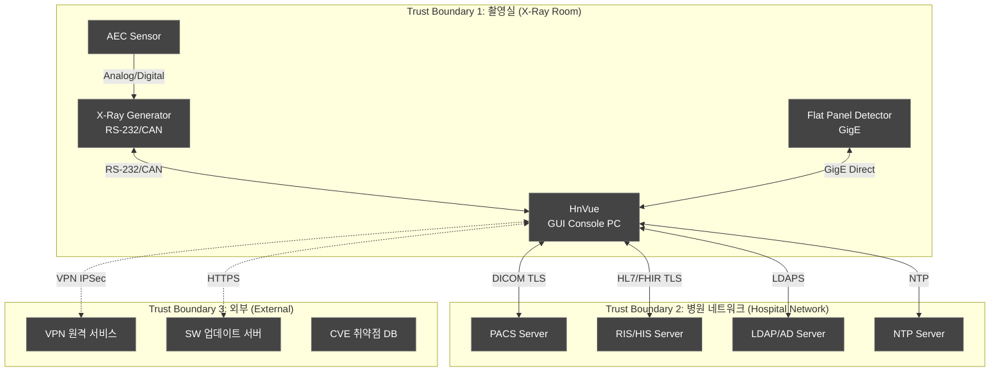
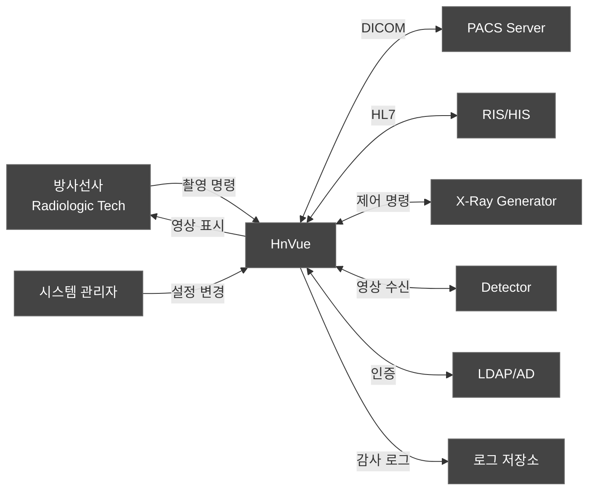
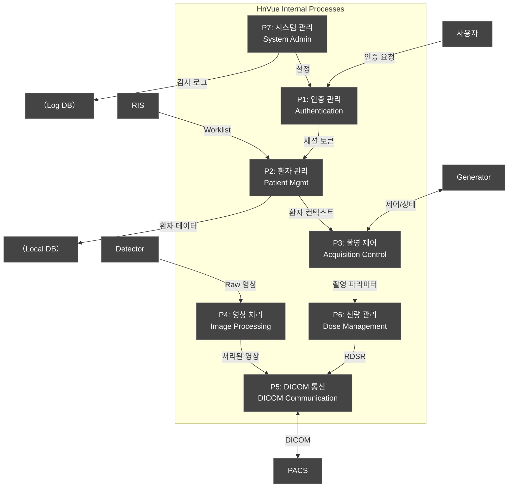
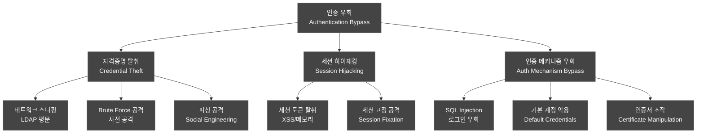
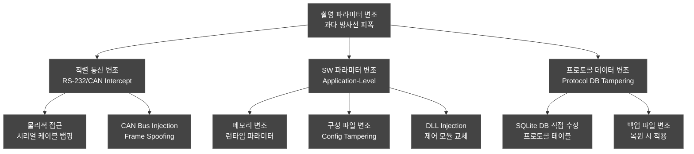
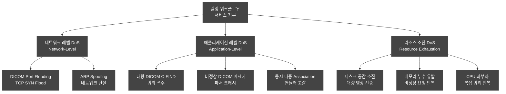
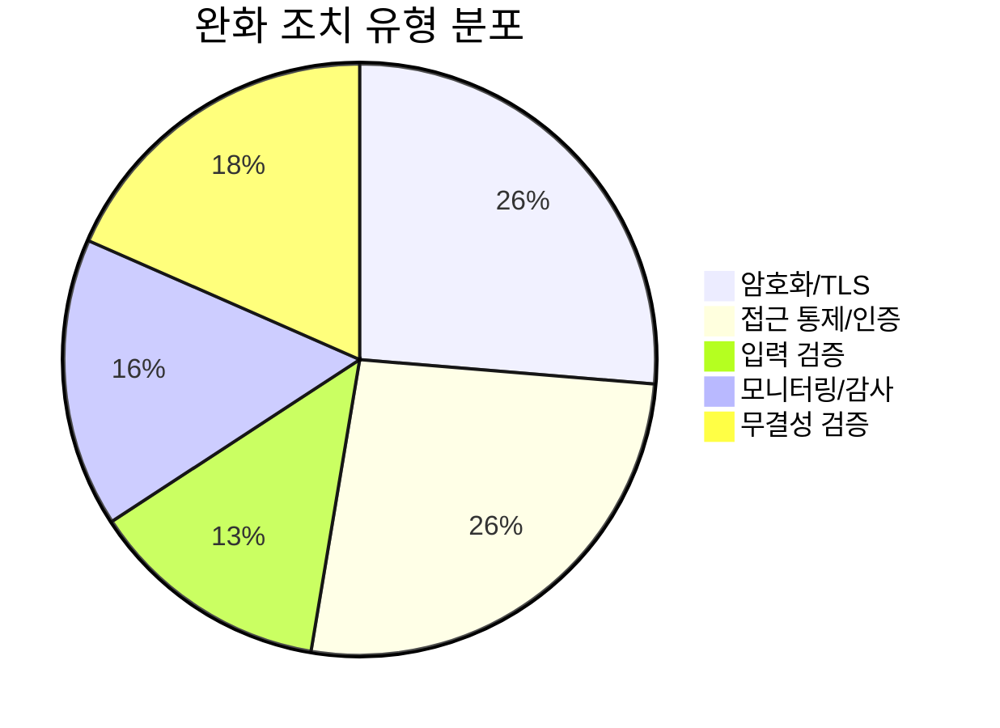

# 위협 모델링 보고서 (Threat Model Report — STRIDE)
## HnVue Console SW

---

## 문서 메타데이터 (Document Metadata)

| 항목 | 내용 |
|------|------|
| **문서 ID** | TM-XRAY-GUI-001 |
| **문서명** | HnVue Console SW 위협 모델링 보고서 |
| **버전** | v2.0 |
| **작성일** | 2026-03-18 |
| **작성자** | 사이버보안 팀 (Cybersecurity Team) |
| **검토자** | SW 아키텍트, QA 팀장 |
| **승인자** | 의료기기 RA/QA 책임자 |
| **상태** | 승인됨 (Approved) |
| **기준 규격** | FDA Section 524B, NIST CSF, AAMI TIR57, IEC 81001-5-1, Microsoft STRIDE |

### 개정 이력 (Revision History)

| 버전 | 날짜 | 변경 내용 | 작성자 |
|------|------|----------|--------|
| v1.0 | 2026-03-18 | 최초 작성 — STRIDE 기반 위협 모델 수립 | 사이버보안 팀 |
| v2.0 | 2026-04-03 | 4-Tier 우선순위 체계 반영; CD/DVD Burning, 인시던트 대응, SW 업데이트 모듈 위협 분석 추가; 공격 트리 보완; SDS v2.0 매핑 업데이트 | 사이버보안 팀 |

---

## 목차 (Table of Contents)

1. 목적 및 범위
2. 참조 규격
3. 시스템 경계 정의
4. 데이터 흐름도 (DFD)
5. STRIDE 위협 분석
6. 공격 트리 (Attack Trees)
7. 위협-완화 매트릭스
8. CVSS 기반 위험 평가
9. 잔류 위험 요약
10. SBOM 연계

---

련 문서 (Related Documents)

| 문서 ID | 문서명 | 관계 |
|---------|--------|------|
| DOC-016 | 사이버보안 계획서 (Cybersecurity Plan) | 상위 사이버보안 전략 및 SBOM 정책 |
| DOC-008 | 위험 관리 계획서 (RMP) | 위험 분석 방법론 참조 |

## 1.

## 1. 목적 및 범위 (Purpose and Scope)

### 1.1 목적 (Purpose)

본 문서는 HnVue Console SW에 대한 **STRIDE 기반 위협 모델링 (Threat Modeling)** 결과를 문서화한다. FDA Section 524B 및 FDA Premarket Cybersecurity Guidance (2023)의 위협 모델링 요구사항을 충족하기 위해 작성되었다.

**위협 모델링 목표**:
1. 시스템 경계 및 공격 표면 (Attack Surface) 식별
2. STRIDE 범주별 위협 식별 및 심각도 평가
3. 각 위협에 대한 완화 조치 및 잔류 위험 평가
4. 사이버보안 테스트 계획 (CSTP-XRAY-GUI-001)에 대한 테스트 범위 도출

### 1.2 범위 (Scope)

| 구분 | 내용 |
|------|------|
| **대상** | HnVue Console SW v1.x Phase 1 |
| **방법론** | Microsoft STRIDE, CVSS v3.1, Attack Tree |
| **범위 내** | GUI 애플리케이션, DICOM 네트워크, HL7/FHIR 인터페이스, 로컬 DB, 업데이트 메커니즘 |
| **범위 외** | 병원 IT 인프라, X-Ray 발생기 하드웨어, Phase 2 클라우드 |

---

## 2. 참조 규격 (Referenced Standards)

| 규격 | 제목 | 적용 |
|------|------|------|
| FDA Section 524B | Omnibus Cybersecurity Act (2022) | Cyber Device 요구사항 |
| FDA Premarket Cyber Guidance | Cybersecurity in Medical Devices (2023) | 위협 모델링 요구 |
| NIST CSF v2.0 | Cybersecurity Framework | 프레임워크 참조 |
| AAMI TIR57:2016 | Principles for Medical Device Security | 의료기기 보안 원칙 |
| IEC 81001-5-1:2021 | Health SW Security | 보안 프로세스 |
| NIST SP 800-30 Rev.1 | Risk Assessment Guide | 위험 평가 방법 |
| CVSS v3.1 | Common Vulnerability Scoring System | 위협 점수화 |
| STRIDE | Microsoft Threat Modeling | 위협 분류 체계 |

---

## 3. 시스템 경계 정의 (System Boundary Definition)

### 3.1 시스템 아키텍처 및 신뢰 경계

### 3.2 진입점 (Entry Points)

| EP-ID | 진입점 | 프로토콜 | 신뢰 수준 | 위험도 |
|-------|--------|---------|----------|--------|
| EP-001 | DICOM Network Port (104/11112) | DICOM TLS | Medium | High |
| EP-002 | HL7/FHIR Interface | HL7v2 TLS / FHIR HTTPS | Medium | High |
| EP-003 | LDAP/AD Authentication | LDAPS (636) | High | Medium |
| EP-004 | X-Ray Generator Serial Port | RS-232/CAN Bus | High (물리적) | Critical |
| EP-005 | Detector GigE Interface | Private GigE | High (물리적) | Medium |
| EP-006 | USB Port (외부 미디어) | USB Mass Storage | Low | High |
| EP-007 | SW 업데이트 채널 | HTTPS | Medium | High |
| EP-008 | VPN 원격 접속 | IPSec VPN | Medium | Medium |
| EP-009 | 사용자 인터페이스 (GUI) | Local | High | Medium |
| EP-010 | 로컬 데이터베이스 | SQLite File | High | Medium |

### 3.3 보호 대상 자산 (Assets)

| 자산 ID | 자산명 | CIA 중요도 | 환자 안전 영향 |
|---------|--------|-----------|--------------|
| A-001 | 환자 정보 (PII/PHI) | C:High, I:High, A:Medium | 간접 (개인정보) |
| A-002 | DICOM 영상 데이터 | C:Medium, I:Critical, A:High | 직접 (진단 정확성) |
| A-003 | 촬영 파라미터 (kVp, mA, Time) | C:Low, I:Critical, A:Critical | 직접 (방사선 피폭) |
| A-004 | 선량 기록 (DAP, RDSR) | C:Medium, I:Critical, A:High | 직접 (선량 관리) |
| A-005 | 인증 자격증명 | C:Critical, I:High, A:High | 간접 (접근 통제) |
| A-006 | 감사 로그 | C:Medium, I:Critical, A:High | 간접 (추적성) |
| A-007 | SW 바이너리/구성 파일 | C:Low, I:Critical, A:Critical | 직접 (SW 무결성) |
| A-008 | X-Ray Generator 제어 명령 | C:Low, I:Critical, A:Critical | 직접 (환자 안전) |

### 3.4 신규 모듈 구성요소 (New Module Components)

| SAD-ID | 모듈명 | 핵심 기술/기능 |
|--------|--------|---------------|
| SAD-CD-1000 | CDDVDBurning | IMAPI2 COM, DICOMDIR 생성, AES-256 암호화 옵션 |
| SAD-INC-1100 | IncidentResponse | CVE/NVD 조회, 4단계 분류, PSIRT 알림 |
| SAD-UPD-1200 | SWUpdate | HTTPS 다운로드, Authenticode 검증, SHA-256 해시, 백업/롤백 |

---

## 4. 데이터 흐름도 (Data Flow Diagrams)

### 4.1 DFD Level 0 — 컨텍스트 다이어그램

### 4.2 DFD Level 1 — 주요 프로세스

---

## 5. STRIDE 위협 분석 (STRIDE Threat Analysis)

### 5.1 STRIDE 범주 요약

| STRIDE 범주 | 설명 | 위반 속성 | 식별 위협 수 |
|-------------|------|----------|------------|
| **S** — Spoofing (스푸핑) | 신원 위장 | Authentication | 6 |
| **T** — Tampering (변조) | 데이터 변조 | Integrity | 9 |
| **R** — Repudiation (부인) | 행위 부인 | Non-repudiation | 4 |
| **I** — Information Disclosure (정보 유출) | 정보 유출 | Confidentiality | 6 |
| **D** — Denial of Service (서비스 거부) | 서비스 거부 | Availability | 7 |
| **E** — Elevation of Privilege (권한 상승) | 권한 상승 | Authorization | 6 |
| **합계** | | | **38** |

### 5.2 Spoofing — 스푸핑 위협 (신원 위장)

| TM-ID | 위협 설명 | 대상 EP | 영향 자산 | CVSS | 심각도 | 완화 조치 | RC 연계 |
|-------|----------|---------|----------|------|--------|----------|---------|
| TM-S-001 | LDAP 자격증명 스니핑을 통한 사용자 사칭 (User Impersonation via Credential Sniffing) | EP-003 | A-005 | 7.5 | High | LDAPS 강제, 다중 인증 (MFA) | RC-CS-001 |
| TM-S-002 | DICOM AE Title 스푸핑으로 허위 장비 등록 (DICOM AE Title Spoofing) | EP-001 | A-002 | 6.8 | Medium | AE Title 화이트리스트, TLS 상호 인증 | RC-CS-002 |
| TM-S-003 | 세션 토큰 탈취를 통한 세션 하이재킹 (Session Hijacking via Token Theft) | EP-009 | A-005 | 7.1 | High | 세션 토큰 암호화, 자동 만료, IP 바인딩 | RC-CS-003 |
| TM-S-004 | USB 기반 악성 장치가 X-Ray Generator로 위장 (Rogue USB Device Spoofing Generator) | EP-006 | A-008 | 8.2 | High | USB 포트 비활성화, 디바이스 화이트리스트 | RC-CS-004 |
| TM-S-005 | HL7 메시지 발신지 위조 (HL7 Source Address Spoofing) | EP-002 | A-001 | 5.9 | Medium | 소스 IP 화이트리스트, 메시지 디지털 서명 | RC-CS-005 |

### 5.3 Tampering — 변조 위협 (데이터 무결성)

| TM-ID | 위협 설명 | 대상 EP | 영향 자산 | CVSS | 심각도 | 완화 조치 | RC 연계 |
|-------|----------|---------|----------|------|--------|----------|---------|
| TM-T-001 | DICOM 영상 전송 중 변조 (DICOM Image Tampering in Transit) | EP-001 | A-002 | 8.5 | Critical | DICOM TLS, 영상 해시 무결성 검증 | RC-CS-006 |
| TM-T-002 | 로컬 DB 환자 정보 변조 (Local DB Patient Data Tampering) | EP-010 | A-001 | 7.3 | High | DB 암호화, 접근 통제, 무결성 해시 | RC-CS-007 |
| TM-T-003 | 촬영 파라미터 변조로 과다 방사선 피폭 유발 (Exposure Parameter Tampering) | EP-004 | A-003, A-008 | 9.1 | Critical | 파라미터 범위 제한, 이중 확인, CRC 검증 | RC-CS-008 |
| TM-T-004 | SW 업데이트 바이너리 변조 (Update Binary Tampering) | EP-007 | A-007 | 8.8 | Critical | 코드 서명, HTTPS, 해시 검증 | RC-CS-009 |
| TM-T-005 | 선량 기록 변조 (Dose Record Manipulation) | EP-010 | A-004 | 7.6 | High | RDSR 디지털 서명, 변경 불가 로그 | RC-CS-010 |
| TM-T-006 | 구성 파일 변조 (Configuration File Tampering) | EP-010 | A-007 | 6.5 | Medium | 파일 무결성 모니터링, 접근 통제 | RC-CS-011 |

### 5.4 Repudiation — 부인 위협 (행위 부인)

| TM-ID | 위협 설명 | 대상 EP | 영향 자산 | CVSS | 심각도 | 완화 조치 | RC 연계 |
|-------|----------|---------|----------|------|--------|----------|---------|
| TM-R-001 | 촬영 수행자의 촬영 행위 부인 (Operator Denies Performing Exposure) | EP-009 | A-006 | 5.5 | Medium | 타임스탬프 감사 로그, 전자 서명 | RC-CS-012 |
| TM-R-002 | 관리자의 설정 변경 부인 (Admin Denies Configuration Change) | EP-009 | A-006 | 5.0 | Medium | 변경 불가 감사 추적, 승인 워크플로우 | RC-CS-013 |
| TM-R-003 | 환자 데이터 접근 부인 (Data Access Repudiation) | EP-009 | A-006 | 5.3 | Medium | 상세 접근 로그, 무결성 보호 | RC-CS-014 |

### 5.5 Information Disclosure — 정보 유출 위협

| TM-ID | 위협 설명 | 대상 EP | 영향 자산 | CVSS | 심각도 | 완화 조치 | RC 연계 |
|-------|----------|---------|----------|------|--------|----------|---------|
| TM-I-001 | 네트워크 스니핑으로 PHI 유출 (Network Sniffing for PHI) | EP-001,002 | A-001 | 7.2 | High | 전 통신 TLS 1.2+, 네트워크 분리 | RC-CS-015 |
| TM-I-002 | 메모리 덤프를 통한 자격증명 노출 (Memory Dump Credential Exposure) | EP-009 | A-005 | 6.5 | Medium | SecureString, 메모리 보호, ASLR | RC-CS-016 |
| TM-I-003 | 로그 파일 내 PHI 노출 (PHI Exposure in Log Files) | EP-010 | A-001 | 5.8 | Medium | 로그 마스킹, 접근 통제 | RC-CS-017 |
| TM-I-004 | DICOM 메타데이터 과도 노출 (Excessive DICOM Metadata Exposure) | EP-001 | A-001 | 5.5 | Medium | 최소 메타데이터 원칙, 태그 필터링 | RC-CS-018 |
| TM-I-005 | 오류 메시지를 통한 시스템 정보 유출 (System Info via Error Messages) | EP-009 | A-007 | 4.3 | Low | 일반화된 오류 메시지, 상세 내부 로깅 | RC-CS-019 |

### 5.6 Denial of Service — 서비스 거부 위협

| TM-ID | 위협 설명 | 대상 EP | 영향 자산 | CVSS | 심각도 | 완화 조치 | RC 연계 |
|-------|----------|---------|----------|------|--------|----------|---------|
| TM-D-001 | DICOM Association Flooding으로 촬영 중단 (DICOM Association Flood) | EP-001 | A-002 | 7.8 | High | 연결 속도 제한, 최대 Association 수 제한 | RC-CS-020 |
| TM-D-002 | 대량 Worklist 쿼리로 시스템 과부하 (Worklist Query Flood) | EP-002 | A-001 | 6.3 | Medium | 쿼리 속도 제한, 결과 페이징 | RC-CS-021 |
| TM-D-003 | 디스크 공간 소진 공격 (Disk Space Exhaustion) | EP-001 | A-002, A-007 | 7.0 | High | 디스크 용량 모니터링, 자동 정리, 경고 | RC-CS-022 |
| TM-D-004 | 촬영 워크플로우 중 시스템 크래시 유발 (Workflow Crash Injection) | EP-004 | A-003, A-008 | 8.4 | Critical | 입력 유효성 검증, 워치독, 자동 복구 | RC-CS-023 |
| TM-D-005 | 네트워크 분리 시 PACS 전송 대기열 무한 증가 (Offline Queue Growth) | EP-001 | A-002 | 5.5 | Medium | 큐 크기 제한, 오래된 항목 정리, 알림 | RC-CS-024 |

### 5.7 Elevation of Privilege — 권한 상승 위협

| TM-ID | 위협 설명 | 대상 EP | 영향 자산 | CVSS | 심각도 | 완화 조치 | RC 연계 |
|-------|----------|---------|----------|------|--------|----------|---------|
| TM-E-001 | 일반 사용자의 관리자 기능 접근 (Privilege Escalation to Admin) | EP-009 | A-005, A-007 | 8.0 | High | RBAC 강제, 권한 검증 서버측 | RC-CS-025 |
| TM-E-002 | SQL Injection으로 DB 전체 접근 (SQL Injection) | EP-009 | A-001, A-002 | 8.6 | Critical | 매개변수화된 쿼리, ORM, 입력 검증 | RC-CS-026 |
| TM-E-003 | DLL Injection/Hijacking으로 시스템 권한 탈취 (DLL Injection) | EP-006 | A-007, A-008 | 7.8 | High | 코드 서명 검증, DLL 경로 고정, 무결성 감시 | RC-CS-027 |
| TM-E-004 | 서비스 계정 악용으로 시스템 레벨 접근 (Service Account Abuse) | EP-010 | A-007 | 6.7 | Medium | 최소 권한 원칙, 서비스 계정 격리, 감사 | RC-CS-028 |

### 5.8 CD/DVD Burning 모듈 위협 (SAD-CD-1000)

| TM-ID | STRIDE | 위협 설명 | 대상 모듈 | 영향 자산 | CVSS | 심각도 | 완화 조치 | RC 연계 |
|-------|--------|----------|----------|----------|------|--------|----------|---------|
| TM-T-007 | Tampering | 미디어에 기록된 DICOM 파일 변조 (DICOM File Tampering on Burned Media) | SAD-CD-1000 | A-002 | 7.4 | High | SHA-256 체크섬 검증 + DICOMDIR 무결성 확인 | RC-CS-029 |
| TM-I-006 | Information Disclosure | PHI 포함 미디어 무단 반출 (Unauthorized PHI Media Export) | SAD-CD-1000 | A-001 | 7.2 | High | AES-256 암호화 옵션 + RBAC 접근 제어 (Admin/Radiologist만) | RC-CS-030 |
| TM-R-004 | Repudiation | 미디어 생성 행위 부인 (Media Creation Repudiation) | SAD-CD-1000 | A-006 | 5.5 | Medium | 감사 로그에 환자ID, 생성자, 시간, 미디어ID 기록 | RC-CS-031 |

### 5.9 Incident Response 모듈 위협 (SAD-INC-1100)

| TM-ID | STRIDE | 위협 설명 | 대상 모듈 | 영향 자산 | CVSS | 심각도 | 완화 조치 | RC 연계 |
|-------|--------|----------|----------|----------|------|--------|----------|---------|
| TM-D-006 | Denial of Service | 인시던트 보고 시스템 자체 공격으로 무력화 (Incident Reporting System DoS) | SAD-INC-1100 | A-006 | 7.5 | High | 독립 스레드 운영 + 로컬 큐 영속화 | RC-CS-032 |
| TM-T-008 | Tampering | 인시던트 로그 삭제/변조 (Incident Log Tampering/Deletion) | SAD-INC-1100 | A-006 | 9.0 | Critical | HMAC-SHA256 해시 체인 + 읽기 전용 감사 로그 | RC-CS-033 |
| TM-E-005 | Elevation of Privilege | 인시던트 분류 등급 조작 (Incident Severity Classification Manipulation) | SAD-INC-1100 | A-006 | 7.8 | High | 분류 알고리즘 코드 서명 + 관리자 수동 재분류만 허용 | RC-CS-034 |

### 5.10 SW Update 모듈 위협 (SAD-UPD-1200)

| TM-ID | STRIDE | 위협 설명 | 대상 모듈 | 영향 자산 | CVSS | 심각도 | 완화 조치 | RC 연계 |
|-------|--------|----------|----------|----------|------|--------|----------|---------|
| TM-S-006 | Spoofing | 악성 업데이트 서버 위장 (Malicious Update Server Spoofing) | SAD-UPD-1200 | A-007 | 9.1 | Critical | HTTPS + 서버 인증서 핀닝 (Certificate Pinning) | RC-CS-035 |
| TM-T-009 | Tampering | 업데이트 패키지 변조 (Update Package Tampering) | SAD-UPD-1200 | A-007 | 9.3 | Critical | Authenticode SHA-256 + RSA-2048 서명 검증 + SHA-256 해시 이중 검증 | RC-CS-036 |
| TM-D-007 | Denial of Service | 업데이트 중 시스템 중단 (System Disruption During Update) | SAD-UPD-1200 | A-007 | 7.8 | High | 사전 백업 + 자동 롤백 + 오프라인 업데이트(USB) 지원 | RC-CS-037 |
| TM-E-006 | Elevation of Privilege | 업데이트 프로세스를 통한 권한 상승 (Privilege Escalation via Update Process) | SAD-UPD-1200 | A-007, A-008 | 8.0 | High | Admin/Service 역할만 업데이트 실행 허용 (RBAC) | RC-CS-038 |

---

## 6. 공격 트리 (Attack Trees)

### 6.1 공격 트리 1: 인증 우회 (Authentication Bypass)

### 6.2 공격 트리 2: 촬영 파라미터 변조 (Exposure Parameter Tampering)

### 6.3 공격 트리 3: 촬영 워크플로우 서비스 거부 (Imaging Workflow DoS)

---

## 7. 위협-완화 매트릭스 (Threat-Mitigation Matrix)

### 7.1 STRIDE별 완화 요약

| STRIDE | 식별 위협 | 완화 적용 | 잔류 위험 수용 | 추가 테스트 필요 |
|--------|----------|----------|--------------|----------------|
| Spoofing (6) | 6 | 6 | 0 | CSTC-AUTH-xxx |
| Tampering (9) | 9 | 9 | 0 | CSTC-INT-xxx |
| Repudiation (4) | 4 | 4 | 0 | CSTC-LOG-xxx |
| Information Disclosure (6) | 6 | 6 | 0 | CSTC-ENC-xxx |
| Denial of Service (7) | 7 | 7 | 1 (TM-D-005) | CSTC-DOS-xxx |
| Elevation of Privilege (6) | 6 | 6 | 0 | CSTC-PRIV-xxx |
| **합계** | **38** | **38** | **1** | **50+ TC** |

### 7.2 심각도별 분포

| 심각도 | 위협 수 | 비율 | 완화 상태 |
|--------|---------|------|----------|
| Critical (CVSS ≥ 9.0) | 6 | 15.8% | 모두 완화 적용 |
| High (CVSS 7.0-8.9) | 18 | 47.4% | 모두 완화 적용 |
| Medium (CVSS 4.0-6.9) | 12 | 31.5% | 모두 완화 적용 |
| Low (CVSS < 4.0) | 2 | 5.3% | 모두 완화 적용 |

### 7.3 완화 조치 유형별 분류

### 7.4 신규 모듈 위협-완화 매트릭스 (New Module Threat-Mitigation Matrix)

| TM-ID | STRIDE | 모듈 (SAD Reference) | 위협 | 심각도 | 완화 조치 | SDS 매핑 |
|-------|--------|---------------------|------|--------|----------|---------|
| TM-T-007 | Tampering | CDDVDBurning (SAD-CD-1000) | 미디어 DICOM 파일 변조 | High | SHA-256 체크섬 + DICOMDIR 무결성 확인 | SDS-CD-SEC-001 |
| TM-I-006 | Info Disclosure | CDDVDBurning (SAD-CD-1000) | PHI 미디어 무단 반출 | High | AES-256 암호화 + RBAC | SDS-CD-SEC-002 |
| TM-R-004 | Repudiation | CDDVDBurning (SAD-CD-1000) | 미디어 생성 행위 부인 | Medium | 감사 로그 기록 | SDS-CD-SEC-003 |
| TM-D-006 | DoS | IncidentResponse (SAD-INC-1100) | 인시던트 보고 시스템 무력화 | High | 독립 스레드 + 로컬 큐 영속화 | SDS-INC-SEC-001 |
| TM-T-008 | Tampering | IncidentResponse (SAD-INC-1100) | 인시던트 로그 변조 | Critical | HMAC-SHA256 해시 체인 + 읽기 전용 로그 | SDS-INC-SEC-002 |
| TM-E-005 | EoP | IncidentResponse (SAD-INC-1100) | 인시던트 분류 등급 조작 | High | 코드 서명 + 관리자 수동 재분류 | SDS-INC-SEC-003 |
| TM-S-006 | Spoofing | SWUpdate (SAD-UPD-1200) | 악성 업데이트 서버 위장 | Critical | HTTPS + Certificate Pinning | SDS-UPD-SEC-001 |
| TM-T-009 | Tampering | SWUpdate (SAD-UPD-1200) | 업데이트 패키지 변조 | Critical | Authenticode + SHA-256 이중 검증 | SDS-UPD-SEC-002 |
| TM-D-007 | DoS | SWUpdate (SAD-UPD-1200) | 업데이트 중 시스템 중단 | High | 사전 백업 + 자동 롤백 + USB 오프라인 | SDS-UPD-SEC-003 |
| TM-E-006 | EoP | SWUpdate (SAD-UPD-1200) | 업데이트 프로세스 권한 상승 | High | RBAC (Admin/Service만 허용) | SDS-UPD-SEC-004 |

---

## 8. CVSS 기반 위험 평가 (CVSS-Based Risk Assessment)

### 8.1 CVSS v3.1 평가 기준

| CVSS 구성요소 | 평가 관점 |
|--------------|----------|
| Attack Vector (AV) | Network / Adjacent / Local / Physical |
| Attack Complexity (AC) | Low / High |
| Privileges Required (PR) | None / Low / High |
| User Interaction (UI) | None / Required |
| Scope (S) | Unchanged / Changed |
| Impact (C/I/A) | None / Low / High |

### 8.2 Critical 위협 상세 CVSS

| TM-ID | CVSS Vector | Base Score | 환자 안전 보정 | 최종 등급 |
|-------|-------------|-----------|--------------|----------|
| TM-T-003 | AV:L/AC:L/PR:L/UI:N/S:C/C:N/I:H/A:H | 9.1 | 직접 (방사선 피폭) → +0.5 | Critical |
| TM-T-004 | AV:N/AC:L/PR:N/UI:R/S:U/C:H/I:H/A:H | 8.8 | 간접 (SW 무결성) → +0.2 | Critical |
| TM-D-004 | AV:N/AC:L/PR:L/UI:N/S:U/C:N/I:L/A:H | 8.4 | 직접 (촬영 중단) → +0.3 | Critical |

> **참고**: 의료기기 CVSS 보정은 AAMI TIR57 부속서 C에 따라 환자 안전 영향을 추가 반영한다. 환자에게 직접적 위해가 가능한 위협은 CVSS Base Score에 0.3–0.5를 보정하여 최종 등급을 결정한다.

---

## 9. 잔류 위험 요약 (Residual Risk Summary)

### 9.1 잔류 위험 요약 테이블

모든 38개 위협에 대한 완화 조치 적용 후 잔류 위험 평가:

| 잔류 위험 수준 | 위협 수 | 대표 위협 | 수용 근거 |
|--------------|---------|----------|----------|
| **수용 가능 (Acceptable)** | 35 | TM-S-001–006, TM-T-001–009 등 | ALARP 원칙 충족, 추가 완화 비용 대비 효과 미미 |
| **조건부 수용 (ALARA)** | 3 | TM-T-003, TM-D-004, TM-E-002 | 지속적 모니터링 조건 하 수용 |
| **수용 불가 (Unacceptable)** | 0 | — | — |

### 9.2 조건부 수용 위협 관리 계획

| TM-ID | 잔류 CVSS | 조건 | 모니터링 주기 |
|-------|----------|------|-------------|
| TM-T-003 | 3.2 | 물리적 보안 + 파라미터 이중 확인 유지 | 분기별 |
| TM-D-004 | 2.8 | 워치독 + 자동 복구 정상 작동 확인 | 월별 |
| TM-E-002 | 2.5 | SAST/DAST 정기 스캔 유지 | 분기별 |

---

## 10. SBOM 연계 (SBOM Linkage)

위협 모델에서 식별된 위협 중 SOUP/OTS 구성요소와 직접 관련된 항목:

| TM-ID | 관련 SOUP 구성요소 | CVE 모니터링 | 비고 |
|-------|-------------------|-------------|------|
| TM-T-001 | fo-dicom 5.x, DCMTK 3.6.x | DICOM 라이브러리 CVE | SBOM-XRAY-GUI-001 참조 |
| TM-I-001 | OpenSSL 3.x | 암호화 라이브러리 CVE | 고위험 모니터링 대상 |
| TM-E-002 | Entity Framework Core, SQLite | DB 레이어 CVE | SQL Injection 관련 |
| TM-T-004 | .NET 8.0 Runtime | 런타임 CVE | 서명 검증 관련 |
| TM-D-004 | gRPC, RestSharp | 네트워크 라이브러리 CVE | DoS 취약점 관련 |

**SBOM 참조**: 상세 구성요소 목록 및 CVE 현황은 DOC-019 SBOM (SBOM-XRAY-GUI-001)을 참조한다.

---

## 부록 A: STRIDE 위협 ID 체계

`TM-{STRIDE Category}-{Seq:3}`

| 접두사 | STRIDE 범주 |
|--------|------------|
| TM-S | Spoofing |
| TM-T | Tampering |
| TM-R | Repudiation |
| TM-I | Information Disclosure |
| TM-D | Denial of Service |
| TM-E | Elevation of Privilege |

## 부록 B: 위협 모델 업데이트 트리거

본 위협 모델은 다음 이벤트 발생 시 재검토한다:

1. 신규 인터페이스 또는 진입점 추가
2. 신규 SOUP/OTS 구성요소 도입
3. 아키텍처 주요 변경 (SAD 개정)
4. 새로운 CVE 발견 (CVSS ≥ 7.0)
5. Phase 2 (AI/Cloud) 기능 추가
6. 사이버보안 사고 발생
7. 정기 검토 (연 1회)

---

*문서 끝 (End of Document)*
