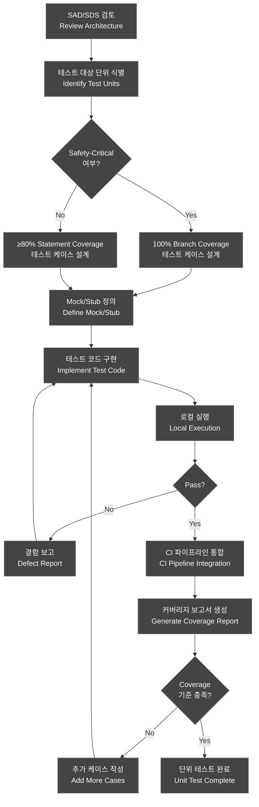
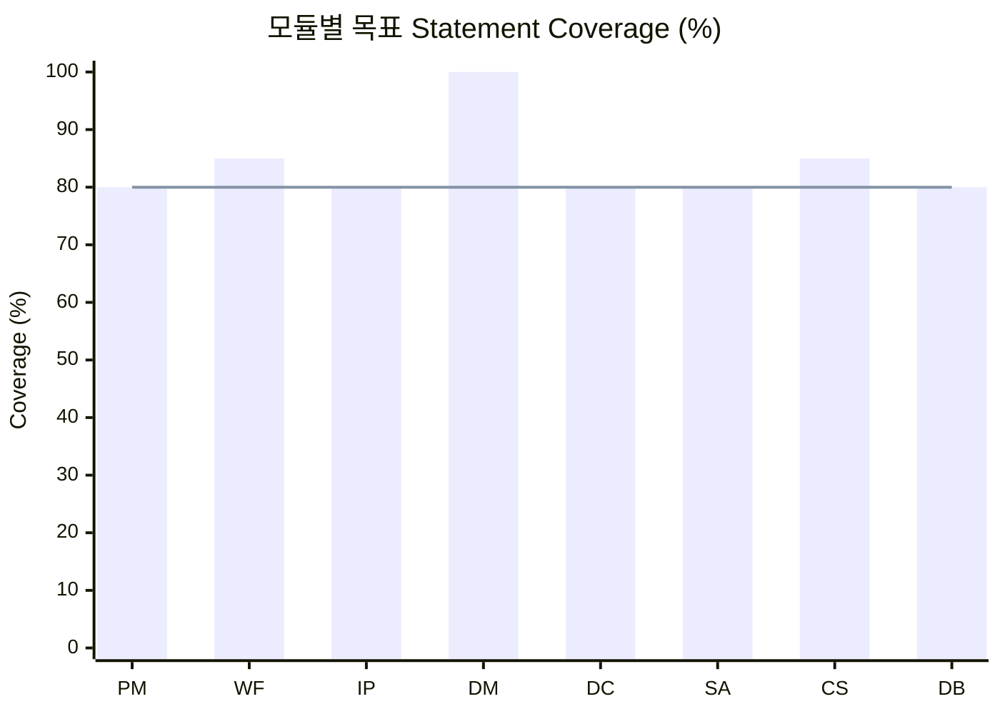
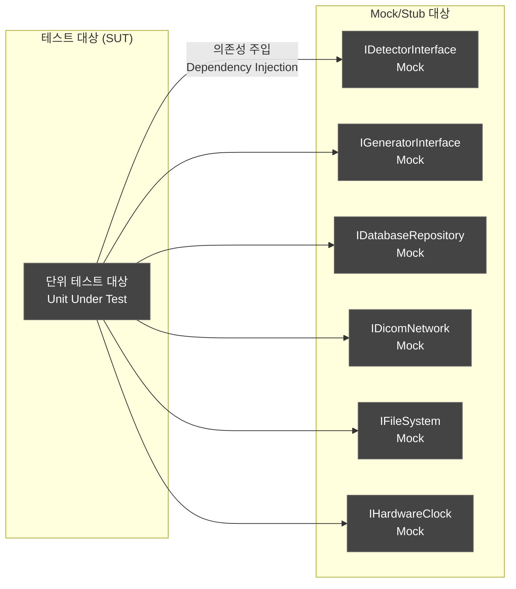
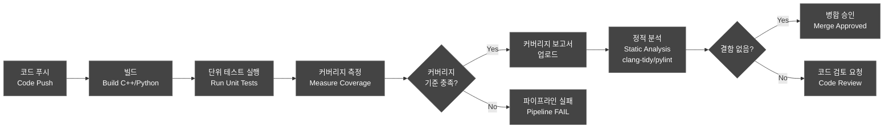
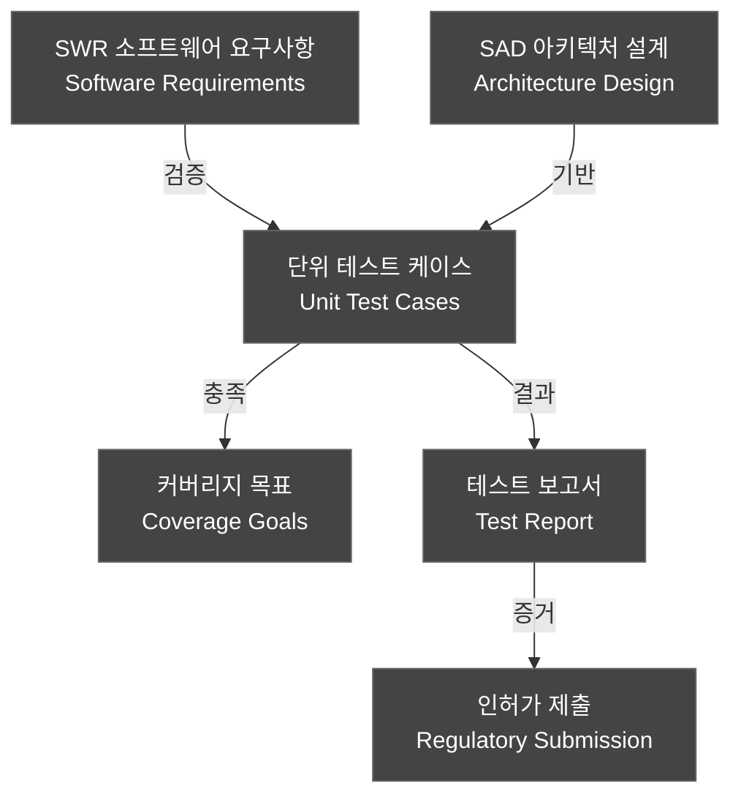

# 단위 테스트 계획서 (Unit Test Plan)

---

## 문서 메타데이터 (Document Metadata)

| 항목 | 내용 |
|------|------|
| **문서 ID** | UTP-XRAY-GUI-001 |
| **버전 (Version)** | v1.0 |
| **제품명 (Product)** | HnVue Console SW |
| **작성일 (Date)** | 2026-03-18 |
| **작성자 (Author)** | SW 개발팀 (SW Development Team) |
| **검토자 (Reviewer)** | SW QA 팀장 |
| **승인자 (Approver)** | SW 개발 팀장 / RA Manager |
| **상태 (Status)** | Draft |
| **기준 규격** | IEC 62304:2006+AMD1:2015 §5.5 |
| **관련 문서** | SAD-XRAY-GUI-001, SDS-XRAY-GUI-001, SRS-XRAY-GUI-001 |

### 개정 이력 (Revision History)

| 버전 | 날짜 | 작성자 | 변경 내용 |
|------|------|--------|-----------|
| v0.1 | 2026-02-01 | 개발팀 | 초안 작성 |
| v1.0 | 2026-03-18 | 개발팀 | 공식 발행 |

---

## 목차 (Table of Contents)

1. 목적 및 범위 (Purpose and Scope)
2. 참조 문서 (Reference Documents)
3. 테스트 전략 (Test Strategy)
4. 커버리지 목표 (Coverage Goals)
5. 테스트 프레임워크 (Test Framework)
6. 모듈별 단위 테스트 케이스 목록 (Unit Test Cases by Module)
7. Mock/Stub 전략 (Mock/Stub Strategy)
8. CI 통합 (CI Integration)
9. Pass/Fail 기준 (Pass/Fail Criteria)
10. 부록: UT-SWR 추적성 매트릭스 (Traceability Matrix)

---

련 문서 (Related Documents)

| 문서 ID | 문서명 | 관계 |
|---------|--------|------|
| DOC-005 | 소프트웨어 요구사항 명세서 (SRS) | 시험 대상 요구사항 출처 |
| DOC-011 | V&V 마스터 플랜 | 상위 시험 전략 및 시험 레벨 정의 |
| DOC-007 | 상세 설계 명세서 (SDS) | 단위 설계 참조 |

## 1.

## 1. 목적 및 범위 (Purpose and Scope)

### 1.1 목적

본 문서는 HnVue Console Software의 단위 테스트 계획을 정의한다. IEC 62304:2006+AMD1:2015 §5.5 "소프트웨어 단위 검증 (Software Unit Verification)" 요구사항을 충족하기 위해 각 소프트웨어 단위(클래스, 함수, 모듈)에 대한 테스트 전략, 케이스, 합격 기준을 명시한다.

**The purpose of this document** is to define the unit test plan for HnVue Console Software to comply with IEC 62304 §5.5 Software Unit Verification requirements.

### 1.2 범위

- **대상 SW Safety Class**: IEC 62304 Class B
- **대상 모듈**: PM, WF, IP, DM, DC, SA, CS, DB (8개 주요 모듈)
- **단위 테스트 범위**: 개별 클래스/함수 레벨의 화이트박스 (White-box) 테스트
- **제외 범위**: 하드웨어 인터페이스 통합 테스트 (DOC-013 참조), 시스템 수준 테스트 (DOC-014 참조)

### 1.3 커버리지 요구사항 요약

| SW Safety Class | Statement Coverage | Branch Coverage (Safety-Critical) |
|---|---|---|
| **Class B** | **≥ 80%** | **≥ 100% (Safety-Critical 코드)** |

---

## 2. 참조 문서 (Reference Documents)

| 문서 ID | 문서명 | 버전 |
|---------|--------|------|
| IEC 62304:2006+AMD1:2015 | Medical Device Software — Software Life Cycle Processes | - |
| SAD-XRAY-GUI-001 | Software Architecture Design (소프트웨어 아키텍처 설계서) | v1.0 |
| SDS-XRAY-GUI-001 | Software Detailed Design Specification (소프트웨어 상세 설계서) | v1.0 |
| SRS-XRAY-GUI-001 | Software Requirements Specification (소프트웨어 요구사항 명세서) | v3.0 |
| SVVP-XRAY-GUI-001 | Software Verification & Validation Plan | v1.0 |
| ISO 14971:2019 | Risk Management for Medical Devices | - |
| FDA-SG-2002 | Guidance for the Content of Premarket Submissions for Software | - |

---

## 3. 테스트 전략 (Test Strategy)

### 3.1 화이트박스 테스트 접근법 (White-box Testing Approach)

단위 테스트는 **화이트박스(White-box)** 방법론을 적용한다. 내부 코드 구조, 로직 경로, 분기 조건을 기반으로 테스트 케이스를 설계하며, 다음 기법을 조합한다:

- **구문 커버리지 (Statement Coverage)**: 모든 실행 가능한 구문을 최소 1회 실행
- **분기 커버리지 (Branch Coverage)**: 모든 조건 분기(True/False)를 커버
- **경계값 분석 (Boundary Value Analysis)**: 입력 도메인의 경계값 테스트
- **동등 분할 (Equivalence Partitioning)**: 유효/무효 입력 클래스 분류
- **오류 추측 (Error Guessing)**: 과거 결함 패턴 기반 추가 케이스

### 3.2 Safety-Critical 코드 식별 (Safety-Critical Code Identification)

안전 임계 코드(Safety-Critical Code)는 ISO 14971 위험 분석에서 식별된 위험 제어(Risk Control) 기능과 직접 관련된 코드를 의미하며, 별도 **100% Branch Coverage** 기준을 적용한다.

```
Safety-Critical 코드 식별 기준:
  - Dose Interlock 로직 (DM 모듈)
  - 환자 신원 확인 (PM 모듈)
  - 촬영 파라미터 검증 (WF 모듈)
  - 사이버보안 인증 (CS 모듈)
```

### 3.3 테스트 설계 흐름도 (Test Design Flow)



---

## 4. 커버리지 목표 (Coverage Goals)

### 4.1 모듈별 커버리지 목표

| 모듈 | Safety-Critical 여부 | Statement Coverage | Branch Coverage | 비고 |
|------|---------------------|-------------------|-----------------|------|
| **PM** (Patient Management) | 부분 (일부 기능) | ≥ 80% | ≥ 80% (일반), 100% (환자 ID 검증) | - |
| **WF** (Acquisition Workflow) | 예 | ≥ 80% | ≥ 80% (일반), 100% (파라미터 검증) | 촬영 파라미터 검증 함수 포함 |
| **IP** (Image Processing) | 아니오 | ≥ 80% | ≥ 80% | - |
| **DM** (Dose Management) | 예 | ≥ 80% | 100% | Dose Interlock 전체 |
| **DC** (DICOM/Communication) | 아니오 | ≥ 80% | ≥ 80% | - |
| **SA** (System Administration) | 아니오 | ≥ 80% | ≥ 80% | - |
| **CS** (Cybersecurity) | 예 | ≥ 80% | ≥ 80% (일반), 100% (인증 로직) | - |
| **DB** (Database) | 아니오 | ≥ 80% | ≥ 80% | - |

### 4.2 커버리지 측정 도구 (Coverage Measurement Tools)

| 언어 | 커버리지 도구 | 보고서 형식 |
|------|-------------|------------|
| C++ | gcov / lcov | HTML, XML (Cobertura) |
| Python | pytest-cov / coverage.py | HTML, XML, JSON |

### 4.3 커버리지 추적 차트 목표



---

## 5. 테스트 프레임워크 (Test Framework)

### 5.1 C++ 테스트 프레임워크: Google Test / Google Mock

```cpp
// 예시: WF 모듈 파라미터 검증 테스트 구조
#include <gtest/gtest.h>
#include <gmock/gmock.h>
#include "AcquisitionWorkflow.h"

class MockDetectorInterface : public IDetectorInterface {
public:
    MOCK_METHOD(bool, isReady, (), (override));
    MOCK_METHOD(void, setExposureParams, (const ExposureParams&), (override));
};

TEST_F(WorkflowTest, ValidExposureParams_ReturnsTrue) {
    ExposureParams params{70, 10, 200};  // kV, mA, ms
    EXPECT_TRUE(workflow_.validateParams(params));
}
```

| 구성 요소 | 버전 | 용도 |
|-----------|------|------|
| **Google Test (GTest)** | ≥ 1.13 | C++ 단위 테스트 프레임워크 |
| **Google Mock (GMock)** | ≥ 1.13 | 의존성 목킹 (Dependency Mocking) |
| **CMake + CTest** | ≥ 3.25 | 빌드 및 테스트 실행 |
| **lcov / genhtml** | ≥ 1.16 | 커버리지 보고서 생성 |

### 5.2 Python 테스트 프레임워크: pytest

```python
# 예시: DM 모듈 Dose 계산 테스트 구조
import pytest
from unittest.mock import MagicMock, patch
from dose_manager import DoseManager

class TestDoseCalculation:
    def setup_method(self):
        self.db_mock = MagicMock()
        self.dm = DoseManager(db=self.db_mock)

    def test_dose_calculation_within_limit(self):
        result = self.dm.calculate_dose(kv=70, mas=2.0, body_part="chest")
        assert result.dap_value <= result.limit_value

    def test_dose_interlock_triggered_on_exceed(self):
        with pytest.raises(DoseInterlockException):
            self.dm.set_exposure(kv=150, mas=500)
```

| 구성 요소 | 버전 | 용도 |
|-----------|------|------|
| **pytest** | ≥ 7.4 | Python 테스트 실행 프레임워크 |
| **pytest-cov** | ≥ 4.1 | 커버리지 측정 |
| **unittest.mock** | 표준 라이브러리 | 목/스텁 생성 |
| **pytest-html** | ≥ 4.0 | HTML 보고서 생성 |
| **pytest-xdist** | ≥ 3.3 | 병렬 테스트 실행 |

---

## 6. 모듈별 단위 테스트 케이스 목록 (Unit Test Cases by Module)

### 6.1 PM 모듈 (Patient Management / 환자 관리) — 10개

| UT ID | 대상 모듈(SAD) | 대상 클래스/함수 | 테스트 설명 | 입력 | 예상 출력 | 관련 SWR |
|-------|-------------|----------------|------------|------|-----------|---------|
| UT-PM-001 | PM | `PatientManager::registerPatient()` | 신규 환자 등록 — 유효한 입력으로 정상 등록 확인 | PatientInfo{id:"P001", name:"홍길동", dob:"1990-01-01", sex:"M"} | PatientID 반환, DB 저장 성공 | SWR-PM-001 |
| UT-PM-002 | PM | `PatientManager::registerPatient()` | 신규 환자 등록 — 중복 환자 ID 입력 시 예외 발생 | PatientInfo{id:"P001"} (이미 존재) | `DuplicatePatientException` 발생 | SWR-PM-001 |
| UT-PM-003 | PM | `PatientManager::searchPatient()` | 환자 검색 — 이름으로 검색 결과 반환 | name="홍길동" | List<PatientInfo> size ≥ 1 | SWR-PM-002 |
| UT-PM-004 | PM | `PatientManager::searchPatient()` | 환자 검색 — 존재하지 않는 환자 검색 시 빈 목록 반환 | name="없는환자" | Empty List 반환 | SWR-PM-002 |
| UT-PM-005 | PM | `PatientManager::updatePatient()` | 환자 정보 수정 — 정상 업데이트 확인 | PatientInfo{id:"P001", name:"홍길동(수정)"} | Update 성공, 변경 로그 기록 | SWR-PM-003 |
| UT-PM-006 | PM | `PatientValidator::validatePatientId()` | 환자 ID 유효성 검사 — 올바른 형식 (Safety-Critical) | "PAT-2026-001234" | `true` 반환 | SWR-PM-010 |
| UT-PM-007 | PM | `PatientValidator::validatePatientId()` | 환자 ID 유효성 검사 — 잘못된 형식 (Safety-Critical) | "INVALID_ID" | `false` 반환, 오류 코드 E_INVALID_ID | SWR-PM-010 |
| UT-PM-008 | PM | `PatientManager::deletePatient()` | 환자 삭제 — 연계 스터디 존재 시 삭제 거부 | id="P001" (스터디 존재) | `PatientHasStudiesException` 발생 | SWR-PM-004 |
| UT-PM-009 | PM | `WorklistParser::parseMWL()` | Modality Worklist 파싱 — 유효한 DICOM MWL 파싱 | DICOM MWL C-FIND Response | List<WorklistItem> 반환 | SWR-PM-005 |
| UT-PM-010 | PM | `WorklistParser::parseMWL()` | Modality Worklist 파싱 — 빈 응답 처리 | Empty C-FIND Response | Empty List 반환, 경고 로그 | SWR-PM-005 |

### 6.2 WF 모듈 (Acquisition Workflow / 촬영 워크플로우) — 15개

| UT ID | 대상 모듈(SAD) | 대상 클래스/함수 | 테스트 설명 | 입력 | 예상 출력 | 관련 SWR |
|-------|-------------|----------------|------------|------|-----------|---------|
| UT-WF-001 | WF | `ExposureParamValidator::validate()` | 촬영 파라미터 검증 — 유효 범위 내 kV 값 (Safety-Critical) | kV=70, mA=10, ms=200 | `ValidationResult::VALID` | SWR-WF-001 |
| UT-WF-002 | WF | `ExposureParamValidator::validate()` | 촬영 파라미터 검증 — kV 상한 초과 (Safety-Critical) | kV=151 (상한: 150) | `ValidationResult::KV_EXCEED`, 인터락 신호 | SWR-WF-001 |
| UT-WF-003 | WF | `ExposureParamValidator::validate()` | 촬영 파라미터 검증 — mAs 하한 미달 (Safety-Critical) | mAs=0.0 (하한: 0.1) | `ValidationResult::MAS_UNDERFLOW` | SWR-WF-001 |
| UT-WF-004 | WF | `WorkflowController::startExposure()` | 촬영 시작 — 정상 상태에서 촬영 시작 | 환자 선택 완료, 파라미터 유효 | 촬영 시작 명령 Generator에 전송 | SWR-WF-002 |
| UT-WF-005 | WF | `WorkflowController::startExposure()` | 촬영 시작 — 환자 미선택 상태에서 시도 | 환자 미선택 | `NoPatientSelectedException` 발생 | SWR-WF-002 |
| UT-WF-006 | WF | `WorkflowController::startExposure()` | 촬영 시작 — 검출기 미준비 상태 (Safety-Critical) | Detector.isReady()=false | `DetectorNotReadyException`, 촬영 차단 | SWR-WF-003 |
| UT-WF-007 | WF | `WorkflowStateмашин::transition()` | 워크플로우 상태 전이 — IDLE → PATIENT_SELECTED | 환자 선택 이벤트 | State=PATIENT_SELECTED | SWR-WF-010 |
| UT-WF-008 | WF | `WorkflowStateMachine::transition()` | 워크플로우 상태 전이 — EXPOSING → COMPLETE | 촬영 완료 이벤트 | State=COMPLETE, 영상 처리 요청 | SWR-WF-010 |
| UT-WF-009 | WF | `WorkflowStateMachine::transition()` | 워크플로우 상태 전이 — EXPOSING → ERROR (Safety-Critical) | 촬영 오류 이벤트 | State=ERROR, 인터락 활성화, 경고 표시 | SWR-WF-010 |
| UT-WF-010 | WF | `BodyPartSelector::getDefaultParams()` | 신체 부위별 기본 파라미터 조회 — 흉부 | bodyPart="CHEST_AP" | kV=70~80, mAs=2~5 범위 내 | SWR-WF-004 |
| UT-WF-011 | WF | `BodyPartSelector::getDefaultParams()` | 신체 부위별 기본 파라미터 조회 — 알 수 없는 부위 | bodyPart="UNKNOWN" | 기본값 반환, 경고 로그 | SWR-WF-004 |
| UT-WF-012 | WF | `AEDController::sendExposureCommand()` | AED 제어 명령 전송 — 정상 전송 | ExposureParams 유효 | 명령 전송 성공, ACK 수신 | SWR-WF-005 |
| UT-WF-013 | WF | `AEDController::sendExposureCommand()` | AED 제어 명령 전송 — 타임아웃 처리 | ACK 응답 없음 (5초) | `TimeoutException`, 재시도 1회 후 실패 | SWR-WF-005 |
| UT-WF-014 | WF | `WorkflowLogger::logExposureEvent()` | 촬영 이벤트 로깅 — 정상 로그 기록 | ExposureEvent 객체 | DB에 로그 저장, timestamp 정확 | SWR-WF-020 |
| UT-WF-015 | WF | `RetakeManager::requestRetake()` | 재촬영 요청 — 최대 재촬영 횟수 초과 | retakeCount=3 (한계: 3) | 재촬영 거부, 관리자 알림 | SWR-WF-015 |

### 6.3 IP 모듈 (Image Display & Processing / 영상 표시/처리) — 10개

| UT ID | 대상 모듈(SAD) | 대상 클래스/함수 | 테스트 설명 | 입력 | 예상 출력 | 관련 SWR |
|-------|-------------|----------------|------------|------|-----------|---------|
| UT-IP-001 | IP | `ImageProcessor::applyWindowLevel()` | 윈도우/레벨 적용 — 정상 범위 값 적용 | WL=40, WW=80 (복부) | 처리된 이미지, 픽셀값 정규화 확인 | SWR-IP-001 |
| UT-IP-002 | IP | `ImageProcessor::applyWindowLevel()` | 윈도우/레벨 적용 — WW=0 경계값 처리 | WL=40, WW=0 | 최소 WW=1 자동 설정 후 처리 | SWR-IP-001 |
| UT-IP-003 | IP | `ImageRotator::rotate()` | 이미지 회전 — 90° 회전 정확도 | 512x512 이미지, angle=90 | 512x512 회전 이미지, 픽셀 손실 없음 | SWR-IP-002 |
| UT-IP-004 | IP | `ImageRotator::rotate()` | 이미지 회전 — 잘못된 각도 입력 | angle=45 (지원: 90°단위) | `InvalidRotationAngleException` | SWR-IP-002 |
| UT-IP-005 | IP | `ImageZoom::calculateZoomFactor()` | 줌 팩터 계산 — 최대 줌 초과 | zoomRequest=16.1 (상한: 16.0) | zoomFactor=16.0 (클리핑) | SWR-IP-003 |
| UT-IP-006 | IP | `ImageAnnotation::addMeasurement()` | 측정 주석 추가 — 길이 측정 | 두 점 좌표, 픽셀 간격 | 측정값(mm) 계산 및 오버레이 표시 | SWR-IP-010 |
| UT-IP-007 | IP | `LUTManager::applyLUT()` | LUT 적용 — 유효한 LUT 테이블 | 16-bit 입력 이미지, Linear LUT | 8-bit 출력 이미지, 정확한 매핑 | SWR-IP-005 |
| UT-IP-008 | IP | `ImageCache::cacheImage()` | 이미지 캐시 — 캐시 용량 초과 시 LRU 제거 | 캐시 100% 사용, 신규 이미지 | 가장 오래된 이미지 제거, 신규 캐시 | SWR-IP-015 |
| UT-IP-009 | IP | `DicomImageReader::readPixelData()` | DICOM 픽셀 데이터 읽기 — 압축 JPEG 2000 | JPEG2000 압축 DICOM 파일 | 압축 해제된 픽셀 배열 | SWR-IP-020 |
| UT-IP-010 | IP | `ImageDisplayController::updateViewport()` | 뷰포트 업데이트 — 해상도 변경 | 새 뷰포트 크기 (2560x1440) | 이미지 리샘플링, 표시 갱신 | SWR-IP-025 |

### 6.4 DM 모듈 (Dose Management / 선량 관리) — 8개

| UT ID | 대상 모듈(SAD) | 대상 클래스/함수 | 테스트 설명 | 입력 | 예상 출력 | 관련 SWR |
|-------|-------------|----------------|------------|------|-----------|---------|
| UT-DM-001 | DM | `DoseCalculator::calculateDAP()` | DAP (Dose Area Product) 계산 — 정상 계산 | kV=70, mAs=2.0, fieldArea=100cm² | DAP값 수치 검증 (±5% 허용오차) | SWR-DM-001 |
| UT-DM-002 | DM | `DoseInterlockManager::checkInterlock()` | Dose Interlock 검사 — 허용치 이하 (Safety-Critical) | 누적선량=45mGy (한계: 50mGy) | `InterlockStatus::CLEAR` | SWR-DM-010 |
| UT-DM-003 | DM | `DoseInterlockManager::checkInterlock()` | Dose Interlock 검사 — 허용치 초과 (Safety-Critical) | 누적선량=51mGy (한계: 50mGy) | `InterlockStatus::TRIGGERED`, 촬영 차단, 알림 | SWR-DM-010 |
| UT-DM-004 | DM | `DoseInterlockManager::checkInterlock()` | Dose Interlock 검사 — 경계값 정확히 허용치 (Safety-Critical) | 누적선량=50mGy (한계: 50mGy) | `InterlockStatus::WARNING` (경계 상태) | SWR-DM-010 |
| UT-DM-005 | DM | `DoseAccumulator::accumulateDose()` | 선량 누적 — 세션 내 다중 촬영 | 3회 촬영 DAP 합산 | 정확한 누적 DAP 값 | SWR-DM-002 |
| UT-DM-006 | DM | `DoseReportGenerator::generateReport()` | 선량 보고서 생성 — RDSR 포맷 | StudyUID, DoseData | 유효한 DICOM RDSR 객체 | SWR-DM-015 |
| UT-DM-007 | DM | `DoseAlertManager::sendAlert()` | 선량 경고 알림 — 70% 임계값 도달 | 누적선량=35mGy (70% of 50mGy) | WARNING 알림 UI 표시, 로그 기록 | SWR-DM-020 |
| UT-DM-008 | DM | `PediatricDoseModifier::adjustLimit()` | 소아 선량 한계 조정 — 연령 기반 조정 | patientAge=5 (years) | 성인 한계의 50% 적용 확인 | SWR-DM-025 |

### 6.5 DC 모듈 (DICOM/Communication / DICOM 통신) — 10개

| UT ID | 대상 모듈(SAD) | 대상 클래스/함수 | 테스트 설명 | 입력 | 예상 출력 | 관련 SWR |
|-------|-------------|----------------|------------|------|-----------|---------|
| UT-DC-001 | DC | `DicomTagBuilder::buildPatientModule()` | DICOM Patient Module 생성 — 필수 태그 포함 | PatientInfo 객체 | DICOM Dataset (0010,0010), (0010,0020) 포함 | SWR-DC-001 |
| UT-DC-002 | DC | `DicomTagBuilder::buildStudyModule()` | DICOM Study Module 생성 — StudyInstanceUID 유일성 | StudyInfo 객체 | 생성될 때마다 유일한 UID 반환 | SWR-DC-001 |
| UT-DC-003 | DC | `DimseService::cStore()` | C-STORE 요청 — 정상 전송 | DICOM 이미지, PACS SCP 설정 | 전송 성공, Status=0x0000 | SWR-DC-010 |
| UT-DC-004 | DC | `DimseService::cStore()` | C-STORE 요청 — 네트워크 오류 처리 | 네트워크 연결 없음 | `NetworkException`, 재전송 큐에 추가 | SWR-DC-010 |
| UT-DC-005 | DC | `DimseService::cFind()` | C-FIND 요청 — 워크리스트 조회 | Query Dataset (0008,0052)=PATIENT | 매칭되는 환자 목록 반환 | SWR-DC-020 |
| UT-DC-006 | DC | `DicomValidator::validateSOPClass()` | DICOM SOP Class 검증 — 유효한 SOP Class | UID="1.2.840.10008.5.1.4.1.1.1" (CR) | `ValidationResult::VALID` | SWR-DC-030 |
| UT-DC-007 | DC | `DicomValidator::validateSOPClass()` | DICOM SOP Class 검증 — 알 수 없는 SOP Class | UID="9.9.9.9.9" | `ValidationResult::UNKNOWN_SOP` | SWR-DC-030 |
| UT-DC-008 | DC | `HL7Parser::parseADT()` | HL7 ADT 메시지 파싱 — ADT^A04 | HL7 ADT^A04 메시지 문자열 | PatientInfo 객체 추출 성공 | SWR-DC-040 |
| UT-DC-009 | DC | `ConnectionManager::testConnection()` | 연결 테스트 — DICOM Echo (C-ECHO) | SCPConfig{host, port, AET} | C-ECHO 성공, 응답시간 < 5초 | SWR-DC-050 |
| UT-DC-010 | DC | `DicomEncryption::encryptTransport()` | DICOM TLS 암호화 — TLS 1.3 적용 | Plain DICOM Data, TLS Config | TLS 1.3으로 암호화된 전송 | SWR-DC-060 |

### 6.6 SA 모듈 (System Administration / 시스템 관리) — 8개

| UT ID | 대상 모듈(SAD) | 대상 클래스/함수 | 테스트 설명 | 입력 | 예상 출력 | 관련 SWR |
|-------|-------------|----------------|------------|------|-----------|---------|
| UT-SA-001 | SA | `SystemConfigManager::loadConfig()` | 시스템 설정 로드 — 유효한 설정 파일 | config.json (유효) | SystemConfig 객체 반환 | SWR-SA-001 |
| UT-SA-002 | SA | `SystemConfigManager::loadConfig()` | 시스템 설정 로드 — 손상된 설정 파일 | config.json (JSON 파싱 오류) | `ConfigParseException`, 기본값 사용 | SWR-SA-001 |
| UT-SA-003 | SA | `BackupManager::createBackup()` | 데이터 백업 생성 — 정상 백업 | BackupConfig, 대상 데이터 | 암호화된 백업 파일 생성, 체크섬 검증 | SWR-SA-010 |
| UT-SA-004 | SA | `SystemHealthMonitor::checkDiskSpace()` | 디스크 공간 모니터링 — 임계값 이하 | 여유 공간 < 10% | WARNING 상태 반환, 관리자 알림 | SWR-SA-020 |
| UT-SA-005 | SA | `AuditLogger::logUserAction()` | 감사 로그 기록 — 사용자 동작 | UserAction{userId, action, timestamp} | 감사 로그 DB 저장, 수정 불가 | SWR-SA-030 |
| UT-SA-006 | SA | `QCManager::runDailyQC()` | 일일 QC 실행 — 정상 QC 패스 | QCConfig, 교정 팬텀 이미지 | QCResult::PASS, 결과 저장 | SWR-SA-040 |
| UT-SA-007 | SA | `QCManager::runDailyQC()` | 일일 QC 실행 — QC 실패 시 촬영 차단 | QC 실패 결과 | QCResult::FAIL, 시스템 잠금 활성화 | SWR-SA-040 |
| UT-SA-008 | SA | `SystemUpdateManager::verifySignature()` | SW 업데이트 서명 검증 — 유효한 서명 | UpdatePackage, 공개 키 | `SignatureValid::TRUE` | SWR-SA-050 |

### 6.7 CS 모듈 (Cybersecurity / 사이버보안) — 10개

| UT ID | 대상 모듈(SAD) | 대상 클래스/함수 | 테스트 설명 | 입력 | 예상 출력 | 관련 SWR |
|-------|-------------|----------------|------------|------|-----------|---------|
| UT-CS-001 | CS | `AuthenticationManager::authenticate()` | 사용자 인증 — 올바른 자격증명 (Safety-Critical) | username="admin", password="Valid@123" | 인증 성공, JWT 토큰 반환 | SWR-CS-001 |
| UT-CS-002 | CS | `AuthenticationManager::authenticate()` | 사용자 인증 — 잘못된 비밀번호 (Safety-Critical) | username="admin", password="wrong" | `AuthenticationFailedException`, 실패 카운트 증가 | SWR-CS-001 |
| UT-CS-003 | CS | `AuthenticationManager::authenticate()` | 사용자 인증 — 계정 잠금 (5회 실패) (Safety-Critical) | 5회 연속 실패 후 시도 | `AccountLockedException` 반환 | SWR-CS-002 |
| UT-CS-004 | CS | `SessionManager::validateSession()` | 세션 유효성 검사 — 만료된 토큰 | 만료된 JWT 토큰 | `SessionExpiredException`, 재로그인 요구 | SWR-CS-010 |
| UT-CS-005 | CS | `PasswordPolicy::validatePassword()` | 비밀번호 정책 검사 — 8자 이상, 복잡도 충족 | "SecureP@ss1" | 정책 준수, `PolicyResult::VALID` | SWR-CS-020 |
| UT-CS-006 | CS | `PasswordPolicy::validatePassword()` | 비밀번호 정책 검사 — 복잡도 미충족 | "simple" | `PolicyResult::TOO_SIMPLE` | SWR-CS-020 |
| UT-CS-007 | CS | `RBACManager::checkPermission()` | 역할 기반 접근 제어 — Technician 권한 | role="TECHNICIAN", action="ACQUIRE_IMAGE" | `Permission::ALLOWED` | SWR-CS-030 |
| UT-CS-008 | CS | `RBACManager::checkPermission()` | 역할 기반 접근 제어 — Technician 관리자 기능 시도 | role="TECHNICIAN", action="MANAGE_USERS" | `Permission::DENIED` | SWR-CS-030 |
| UT-CS-009 | CS | `EncryptionManager::encryptPHI()` | PHI 암호화 — AES-256-GCM | PlainText PHI 데이터 | AES-256-GCM 암호화 데이터, IV 포함 | SWR-CS-040 |
| UT-CS-010 | CS | `AuditTrail::recordSecurityEvent()` | 보안 이벤트 감사 기록 — 로그인 실패 | LoginFailureEvent | 감사 로그 저장, 불변성 보장 | SWR-CS-050 |

### 6.8 DB 모듈 (Database / 데이터베이스) — 5개

| UT ID | 대상 모듈(SAD) | 대상 클래스/함수 | 테스트 설명 | 입력 | 예상 출력 | 관련 SWR |
|-------|-------------|----------------|------------|------|-----------|---------|
| UT-DB-001 | DB | `DatabaseManager::executeQuery()` | 쿼리 실행 — 정상 SELECT | "SELECT * FROM patients WHERE id=?" | 해당 환자 레코드 반환 | SWR-DB-001 |
| UT-DB-002 | DB | `DatabaseManager::executeQuery()` | SQL 인젝션 방지 — 파라미터 바인딩 | input="'; DROP TABLE patients;--" | 예외 없이 빈 결과 반환, 테이블 보호 | SWR-DB-010 |
| UT-DB-003 | DB | `TransactionManager::commit()` | 트랜잭션 커밋 — 성공 케이스 | 다중 INSERT 트랜잭션 | 모든 레코드 저장, Commit 완료 | SWR-DB-020 |
| UT-DB-004 | DB | `TransactionManager::rollback()` | 트랜잭션 롤백 — 중간 오류 발생 | INSERT 중 오류 발생 | 모든 변경 취소, 원상복구 확인 | SWR-DB-020 |
| UT-DB-005 | DB | `ConnectionPool::getConnection()` | 커넥션 풀 — 풀 고갈 시 대기 | maxConnections=10, 10개 이미 사용 중 | 대기 후 반환 (타임아웃 5초), 또는 `PoolExhaustedException` | SWR-DB-030 |

**총 단위 테스트 케이스: 76개** (PM:10 + WF:15 + IP:10 + DM:8 + DC:10 + SA:8 + CS:10 + DB:5)

---

## 7. Mock/Stub 전략 (Mock/Stub Strategy)

### 7.1 Mock 대상 컴포넌트



### 7.2 Mock 전략 상세

| Mock 대상 | 목킹 이유 | Mock 방법 | 관련 모듈 |
|-----------|---------|-----------|---------|
| `IDetectorInterface` | 물리적 검출기 하드웨어 | GMock | WF, DM |
| `IGeneratorInterface` | X-Ray 발생기 하드웨어 | GMock | WF, DM |
| `IDatabaseRepository` | DB I/O 격리 | GMock / pytest-mock | PM, WF, DM, SA, CS, DB |
| `IDicomNetworkService` | DICOM 네트워크 의존성 | GMock | DC |
| `IFileSystem` | 파일 시스템 I/O | GMock / pytest-mock | SA, DB |
| `ISystemClock` | 시간 의존 로직 결정적 테스트 | GMock / FakeTime | CS, SA |
| `IEncryptionService` | 암호화 서비스 격리 | unittest.mock | CS |

---

## 8. CI 통합 (CI Integration)

### 8.1 CI 파이프라인 구성 (GitHub Actions / GitLab CI)



### 8.2 CI 설정 예시

```yaml
# .gitlab-ci.yml 예시
unit_test:
  stage: test
  script:
    - cmake --build build/ --target all
    - ctest --test-dir build/ --output-on-failure
    - lcov --capture --directory build/ --output-file coverage.info
    - genhtml coverage.info --output-directory coverage_html
    - python -m pytest tests/unit/ --cov=src --cov-report=xml --cov-fail-under=80
  coverage: '/TOTAL.*\s+(\d+%)$/'
  artifacts:
    reports:
      coverage_report:
        coverage_format: cobertura
        path: coverage.xml
```

---

## 9. Pass/Fail 기준 (Pass/Fail Criteria)

### 9.1 단위 테스트 케이스 합격 기준

| 기준 항목 | 기준 값 | 비고 |
|-----------|--------|------|
| **개별 테스트 케이스** | 예상 출력과 실제 출력 일치 | 공차 범위 내 수치 비교 포함 |
| **Statement Coverage (Class B)** | ≥ 80% | 전체 모듈 평균 |
| **Branch Coverage (Safety-Critical)** | 100% | DM 인터락, WF 파라미터 검증, CS 인증 |
| **오류 없는 컴파일** | 0 오류, 0 경고 (treated as error) | -Wall -Werror 적용 |
| **메모리 누수** | Valgrind/AddressSanitizer 검사 통과 | 0 오류 |
| **정적 분석** | clang-tidy / pylint 경고 0개 | 심각도 Error/Warning 기준 |

### 9.2 테스트 실패 처리 절차

| 실패 유형 | 처리 절차 | 영향 범위 |
|-----------|---------|----------|
| 개별 케이스 실패 | 결함 보고서(DR) 발행, 수정 후 재테스트 | 해당 모듈 |
| 커버리지 미달 | 추가 테스트 케이스 작성 | 해당 모듈 |
| Safety-Critical 실패 | Critical 결함 처리, 릴리즈 차단 | 전체 제품 |
| CI 파이프라인 실패 | 메인 브랜치 병합 차단 | 관련 기능 |

---

## 10. 부록: UT-SWR 추적성 매트릭스 (Traceability Matrix)

### 10.1 추적성 개요



### 10.2 UT-SWR 추적성 테이블 (대표 항목)

| UT ID | SWR ID | SWR 설명 | 커버리지 분류 |
|-------|--------|---------|-------------|
| UT-PM-001, 002 | SWR-PM-001 | 신규 환자 등록 | Statement |
| UT-PM-006, 007 | SWR-PM-010 | 환자 ID 검증 | Branch (Safety) |
| UT-WF-001~003 | SWR-WF-001 | 촬영 파라미터 검증 | Branch (Safety) |
| UT-WF-006 | SWR-WF-003 | 검출기 상태 검증 | Branch (Safety) |
| UT-DM-002~004 | SWR-DM-010 | Dose Interlock | Branch (Safety) 100% |
| UT-CS-001~003 | SWR-CS-001~002 | 사용자 인증/잠금 | Branch (Safety) |
| UT-DC-003, 004 | SWR-DC-010 | C-STORE 전송 | Statement |
| UT-DB-002 | SWR-DB-010 | SQL 인젝션 방지 | Branch |

### 10.3 모듈별 SWR 커버리지 현황

| 모듈 | 총 SWR 수 | UT로 커버되는 SWR | 커버리지 |
|------|-----------|------------------|---------|
| PM | 15 | 10 | 67% (추가 케이스 필요) |
| WF | 20 | 15 | 75% |
| IP | 12 | 10 | 83% |
| DM | 10 | 8 | 80% |
| DC | 12 | 10 | 83% |
| SA | 10 | 8 | 80% |
| CS | 12 | 10 | 83% |
| DB | 6 | 5 | 83% |
| **전체** | **97** | **76** | **78%** |

---

*본 문서는 IEC 62304 §5.5 요구사항에 따라 작성되었으며, 인허가 제출용 문서로 관리됩니다.*
*This document is prepared in accordance with IEC 62304 §5.5 requirements and managed as a regulatory submission document.*

---
**문서 끝 (End of Document)** | UTP-XRAY-GUI-001 v1.0 | 2026-03-18
