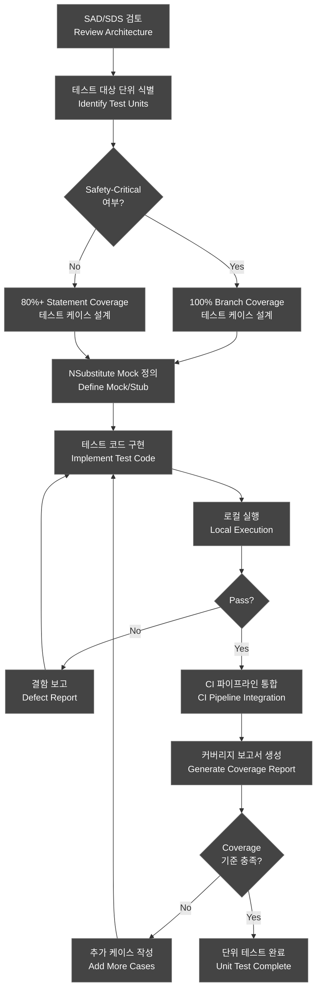
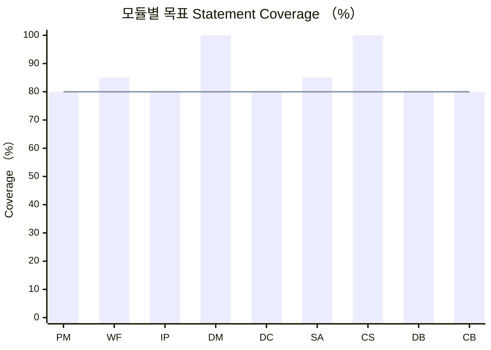
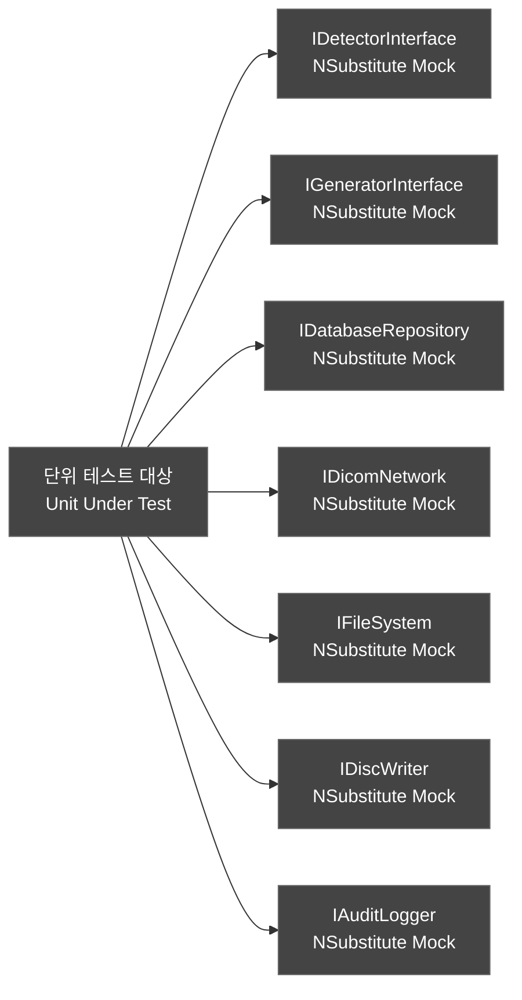
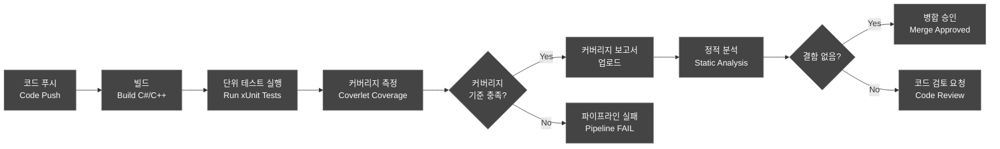
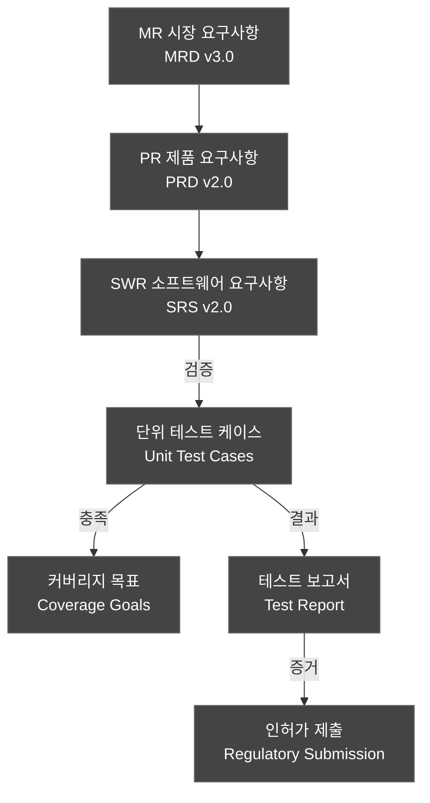

# 단위 테스트 계획서 (Unit Test Plan)

---

## 문서 메타데이터 (Document Metadata)

| 항목 | 내용 |
|------|------|
| **문서 ID** | UTP-XRAY-GUI-001 |
| **버전 (Version)** | v2.0 |
| **제품명 (Product)** | HnVue Console SW |
| **작성일 (Date)** | 2026-04-03 |
| **작성자 (Author)** | SW 개발팀 (SW Development Team) |
| **검토자 (Reviewer)** | SW QA 팀장 |
| **승인자 (Approver)** | SW 개발 팀장 / RA Manager |
| **상태 (Status)** | Draft |
| **기준 규격** | IEC 62304:2006+AMD1:2015 §5.5 |
| **관련 문서** | DOC-005 SRS v2.0, DOC-004 FRS v2.0, DOC-032 RTM v2.0 |

### 개정 이력 (Revision History)

| 버전 | 날짜 | 작성자 | 변경 내용 |
|------|------|--------|-----------|
| v0.1 | 2026-02-01 | 개발팀 | 초안 작성 |
| v1.0 | 2026-03-18 | 개발팀 | 공식 발행 |
| v2.0 | 2026-04-03 | 개발팀 | MRD v3.0 4-Tier 체계 반영; 테스트 프레임워크를 xUnit+NSubstitute로 확정; CD Burning 모듈 단위 테스트 추가 (MR-072); RBAC/암호화/감사로그 단위 테스트 보강; 각 TC에 SWR 추적성 강화; 커버리지 목표 Safety-Critical 100% Branch / 일반 80%+ Statement 명시 |

---

## 목차 (Table of Contents)

1. 목적 및 범위
2. 참조 문서
3. 4-Tier 체계 및 적용 범위
4. 테스트 전략
5. 커버리지 목표
6. 테스트 프레임워크
7. 모듈별 단위 테스트 케이스 목록
8. Mock/Stub 전략
9. CI 통합
10. Pass/Fail 기준
11. 부록: UT-SWR 추적성 매트릭스

---

## 1. 목적 및 범위 (Purpose and Scope)

### 1.1 목적

본 문서는 HnVue Console Software의 단위 테스트 계획 v2.0을 정의한다. IEC 62304:2006+AMD1:2015 §5.5 "소프트웨어 단위 검증" 요구사항을 충족하기 위해 각 소프트웨어 단위(클래스, 함수, 모듈)에 대한 테스트 전략, 케이스, 합격 기준을 명시한다.

v2.0에서는 MRD v3.0의 4-Tier 우선순위 체계를 반영하고, MR-072 (CD/DVD Burning with DICOM Viewer) 신규 요구사항에 대한 단위 테스트를 추가하였다. 테스트 프레임워크는 xUnit + NSubstitute로 확정하였다.

### 1.2 범위

- **대상 SW Safety Class**: IEC 62304 Class B
- **대상 모듈**: PM, WF, IP, DM, DC, SA, CS, DB, **CB** (9개 주요 모듈)
  - **CB (CD Burning)**: MR-072 신규 추가 모듈
- **단위 테스트 범위**: 개별 클래스/함수 레벨의 화이트박스(White-box) 테스트
- **제외 범위**: 하드웨어 인터페이스 통합 테스트 (DOC-013 참조), 시스템 수준 테스트 (DOC-014 참조)

### 1.3 커버리지 요구사항 요약

| SW Safety Class | Statement Coverage | Branch Coverage (Safety-Critical) |
|---|---|---|
| **Class B** | **≥ 80%** | **100% (Safety-Critical 코드)** |

---

## 2. 참조 문서 (Reference Documents)

| 문서 ID | 문서명 | 버전 |
|---------|--------|------|
| IEC 62304:2006+AMD1:2015 | Medical Device Software — Software Life Cycle Processes | - |
| DOC-001 | Market Requirements Document (MRD) | v3.0 |
| DOC-002 | Product Requirements Document (PRD) | v2.0 |
| DOC-004 | Functional Requirements Specification (FRS) | v2.0 |
| DOC-005 | Software Requirements Specification (SRS) | v2.0 |
| DOC-032 | Requirements Traceability Matrix (RTM) | v2.0 |
| DOC-011 | V&V 마스터 플랜 | v1.0 |
| ISO 14971:2019 | Risk Management for Medical Devices | - |
| FDA-SG-2002 | Guidance for the Content of Premarket Submissions for Software | - |

---

## 3. 4-Tier 체계 및 적용 범위

MRD v3.0에서 도입한 4-Tier 우선순위 체계를 단위 테스트에 반영한다.

| Tier | 의미 | 단위 테스트 전략 |
|------|------|-----------------|
| **Tier 1** | 인허가 필수 | Safety-Critical 분류 → 100% Branch Coverage 의무 |
| **Tier 2** | 시장 진입 필수 | 핵심 기능 → ≥ 80% Statement Coverage + Safety-Critical Branch 100% |
| **Tier 3** | 차별화 기능 | 구현 시 ≥ 80% Statement Coverage |
| **Tier 4** | 비현실적/과도 | 단위 테스트 대상 외 |

### 3.1 Tier 1+2 모듈별 테스트 우선순위

| 모듈 | Tier | MR 매핑 | 테스트 우선순위 |
|------|------|---------|---------------|
| CS (사이버보안) | Tier 1 | MR-033, MR-034, MR-035, MR-036, MR-037, MR-039 | 최우선 |
| DM (선량 관리) | Tier 1 | MR-029, MR-030 | 최우선 |
| WF (촬영 워크플로우) | Tier 2 | MR-003, MR-004, MR-010 | 높음 |
| PM (환자 관리) | Tier 2 | MR-001, MR-002 | 높음 |
| CB (CD Burning) | Tier 2 | **MR-072** | 높음 |
| DC (DICOM/통신) | Tier 2 | MR-019, MR-021 | 높음 |
| IP (영상 처리) | Tier 2 | MR-011, MR-012 | 중간 |
| SA (시스템 관리) | Tier 2 | MR-039 | 중간 |
| DB (데이터베이스) | 내부 기반 | - | 중간 |

---

## 4. 테스트 전략 (Test Strategy)

### 4.1 화이트박스 테스트 접근법

단위 테스트는 화이트박스(White-box) 방법론을 적용한다. 내부 코드 구조, 로직 경로, 분기 조건을 기반으로 테스트 케이스를 설계하며, 다음 기법을 조합한다:

- **구문 커버리지 (Statement Coverage)**: 모든 실행 가능한 구문을 최소 1회 실행
- **분기 커버리지 (Branch Coverage)**: 모든 조건 분기(True/False)를 커버
- **경계값 분석 (Boundary Value Analysis)**: 입력 도메인의 경계값 테스트
- **동등 분할 (Equivalence Partitioning)**: 유효/무효 입력 클래스 분류
- **오류 추측 (Error Guessing)**: 과거 결함 패턴 기반 추가 케이스

### 4.2 Safety-Critical 코드 식별

안전 임계 코드(Safety-Critical Code)는 ISO 14971 위험 분석에서 식별된 위험 제어(Risk Control) 기능과 직접 관련된 코드를 의미하며, 별도 100% Branch Coverage 기준을 적용한다.

```
Safety-Critical 코드 식별 기준:
  - Dose Interlock 로직 (DM 모듈) — Tier 1
  - 환자 신원 확인 (PM 모듈) — Tier 2
  - 촬영 파라미터 검증 (WF 모듈) — Tier 2
  - 사이버보안 인증/RBAC (CS 모듈) — Tier 1
  - PHI 암호화 검증 (CS 모듈) — Tier 1
  - 감사 로그 불변성 (CS/SA 모듈) — Tier 1
```

### 4.3 테스트 설계 흐름도



---

## 5. 커버리지 목표 (Coverage Goals)

### 5.1 모듈별 커버리지 목표

| 모듈 | Safety-Critical 여부 | Statement Coverage | Branch Coverage | 비고 |
|------|---------------------|-------------------|-----------------|------|
| **PM** (Patient Management) | 부분 | ≥ 80% | ≥ 80% 일반, 100% 환자 ID 검증 | Tier 2 |
| **WF** (Acquisition Workflow) | 예 | ≥ 80% | ≥ 80% 일반, 100% 파라미터 검증 | Tier 2 |
| **IP** (Image Processing) | 아니오 | ≥ 80% | ≥ 80% | Tier 2 |
| **DM** (Dose Management) | 예 | ≥ 80% | 100% | Tier 1, Dose Interlock 전체 |
| **DC** (DICOM/Communication) | 아니오 | ≥ 80% | ≥ 80% | Tier 2 |
| **SA** (System Administration) | 부분 | ≥ 80% | ≥ 80% 일반, 100% 업데이트 서명 검증 | Tier 2, MR-039 |
| **CS** (Cybersecurity) | 예 | ≥ 80% | 100% (인증/RBAC/암호화/감사로그) | Tier 1 전체 |
| **DB** (Database) | 아니오 | ≥ 80% | ≥ 80% | 기반 모듈 |
| **CB** (CD Burning) | 아니오 | ≥ 80% | ≥ 80% | Tier 2, MR-072 신규 |

### 5.2 커버리지 측정 도구

| 언어/플랫폼 | 커버리지 도구 | 보고서 형식 |
|-------------|-------------|------------|
| C# / .NET | Coverlet + xUnit | HTML, XML (Cobertura) |
| C++ | gcov / lcov | HTML, XML |
| Python | pytest-cov / coverage.py | HTML, XML, JSON |

### 5.3 커버리지 추적 차트 목표



---

## 6. 테스트 프레임워크 (Test Framework)

### 6.1 C# 테스트 프레임워크: xUnit + NSubstitute (확정)

v2.0에서 테스트 프레임워크를 **xUnit + NSubstitute**로 확정한다.

```csharp
// 예시: CS 모듈 RBAC 검증 테스트 구조
using Xunit;
using NSubstitute;
using HnVue.Cybersecurity;

public class RBACManagerTests
{
    private readonly IRBACRepository _rbacRepo;
    private readonly RBACManager _sut;

    public RBACManagerTests()
    {
        _rbacRepo = Substitute.For<IRBACRepository>();
        _sut = new RBACManager(_rbacRepo);
    }

    [Fact]
    public void CheckPermission_TechnicianAcquireImage_ReturnsAllowed()
    {
        // Arrange
        _rbacRepo.GetRole("tech01").Returns(UserRole.Technician);
        // Act
        var result = _sut.CheckPermission("tech01", "ACQUIRE_IMAGE");
        // Assert
        Assert.Equal(Permission.Allowed, result);
    }

    [Fact]
    public void CheckPermission_TechnicianManageUsers_ReturnsDenied()
    {
        _rbacRepo.GetRole("tech01").Returns(UserRole.Technician);
        var result = _sut.CheckPermission("tech01", "MANAGE_USERS");
        Assert.Equal(Permission.Denied, result);
    }
}
```

| 구성 요소 | 버전 | 용도 |
|-----------|------|------|
| **xUnit** | ≥ 2.6 | C# 단위 테스트 프레임워크 |
| **NSubstitute** | ≥ 5.1 | 의존성 목킹 (Dependency Mocking) |
| **Coverlet** | ≥ 6.0 | 커버리지 측정 |
| **FluentAssertions** | ≥ 6.12 | 가독성 높은 검증 표현 |
| **.NET Test SDK** | ≥ 8.0 | 빌드 및 테스트 실행 |

### 6.2 C++ 테스트 프레임워크: Google Test / Google Mock

```cpp
// 예시: WF 모듈 파라미터 검증 테스트 구조
#include <gtest/gtest.h>
#include <gmock/gmock.h>
#include "AcquisitionWorkflow.h"

class MockDetectorInterface : public IDetectorInterface {
public:
    MOCK_METHOD(bool, isReady, (), (override));
    MOCK_METHOD(void, setExposureParams, (const ExposureParams&), (override));
};

TEST_F(WorkflowTest, ValidExposureParams_ReturnsTrue) {
    ExposureParams params{70, 10, 200};  // kV, mA, ms
    EXPECT_TRUE(workflow_.validateParams(params));
}
```

### 6.3 CD Burning 모듈 테스트 프레임워크

```csharp
// 예시: CB 모듈 CD Burning 테스트 구조
using Xunit;
using NSubstitute;
using HnVue.CDBurning;

public class CDBurnerTests
{
    private readonly IDiscWriter _discWriter;
    private readonly IDicomImageRepository _imageRepo;
    private readonly CDBurner _sut;

    public CDBurnerTests()
    {
        _discWriter = Substitute.For<IDiscWriter>();
        _imageRepo = Substitute.For<IDicomImageRepository>();
        _sut = new CDBurner(_discWriter, _imageRepo);
    }

    [Fact]
    public void BurnDisc_ValidStudy_CallsDiscWriterWithDicomImages()
    {
        var studyUid = "1.2.3.4.5";
        _imageRepo.GetImages(studyUid).Returns(new[] { new DicomImage() });
        _sut.BurnDisc(studyUid, includeViewer: true);
        _discWriter.Received(1).Write(Arg.Any<DiscContent>());
    }
}
```

---

## 7. 모듈별 단위 테스트 케이스 목록 (Unit Test Cases by Module)

### 7.1 PM 모듈 (Patient Management / 환자 관리) — 10개

| UT ID | 대상 모듈 | 대상 클래스/함수 | 테스트 설명 | 입력 | 예상 출력 | MR | PR | SWR |
|-------|---------|----------------|------------|------|-----------|----|----|-----|
| UT-PM-001 | PM | `PatientManager::registerPatient()` | 신규 환자 등록 — 유효한 입력 정상 등록 | PatientInfo{id:"P001", name:"홍길동", dob:"1990-01-01", sex:"M"} | PatientID 반환, DB 저장 성공 | MR-001 | PR-001 | SWR-PM-001 |
| UT-PM-002 | PM | `PatientManager::registerPatient()` | 신규 환자 등록 — 중복 ID 예외 발생 | PatientInfo{id:"P001"} (이미 존재) | `DuplicatePatientException` 발생 | MR-001 | PR-001 | SWR-PM-001 |
| UT-PM-003 | PM | `PatientManager::searchPatient()` | 환자 검색 — 이름 검색 결과 반환 | name="홍길동" | List 크기 ≥ 1 | MR-001 | PR-001 | SWR-PM-002 |
| UT-PM-004 | PM | `PatientManager::searchPatient()` | 환자 검색 — 존재하지 않는 환자 빈 목록 | name="없는환자" | Empty List 반환 | MR-001 | PR-001 | SWR-PM-002 |
| UT-PM-005 | PM | `PatientManager::updatePatient()` | 환자 정보 수정 — 정상 업데이트 | PatientInfo{id:"P001", name:"홍길동(수정)"} | Update 성공, 변경 로그 기록 | MR-001 | PR-001 | SWR-PM-003 |
| UT-PM-006 | PM | `PatientValidator::validatePatientId()` | 환자 ID 유효성 검사 — 올바른 형식 (Safety-Critical) | "PAT-2026-001234" | `true` 반환 | MR-001 | PR-001 | SWR-PM-010 |
| UT-PM-007 | PM | `PatientValidator::validatePatientId()` | 환자 ID 유효성 검사 — 잘못된 형식 (Safety-Critical) | "INVALID_ID" | `false` 반환, 오류 코드 E_INVALID_ID | MR-001 | PR-001 | SWR-PM-010 |
| UT-PM-008 | PM | `PatientManager::deletePatient()` | 환자 삭제 — 연계 스터디 존재 시 삭제 거부 | id="P001" (스터디 존재) | `PatientHasStudiesException` 발생 | MR-001 | PR-001 | SWR-PM-004 |
| UT-PM-009 | PM | `WorklistParser::parseMWL()` | Modality Worklist 파싱 — 유효한 DICOM MWL | DICOM MWL C-FIND Response | List&lt;WorklistItem&gt; 반환 | MR-001 | PR-002 | SWR-PM-005 |
| UT-PM-010 | PM | `WorklistParser::parseMWL()` | Modality Worklist 파싱 — 빈 응답 처리 | Empty C-FIND Response | Empty List 반환, 경고 로그 | MR-001 | PR-002 | SWR-PM-005 |

### 7.2 WF 모듈 (Acquisition Workflow / 촬영 워크플로우) — 15개

| UT ID | 대상 모듈 | 대상 클래스/함수 | 테스트 설명 | 입력 | 예상 출력 | MR | PR | SWR |
|-------|---------|----------------|------------|------|-----------|----|----|-----|
| UT-WF-001 | WF | `ExposureParamValidator::validate()` | 촬영 파라미터 검증 — 유효 범위 내 kV (Safety-Critical) | kV=70, mA=10, ms=200 | `ValidationResult::VALID` | MR-003 | PR-010 | SWR-WF-001 |
| UT-WF-002 | WF | `ExposureParamValidator::validate()` | 촬영 파라미터 검증 — kV 상한 초과 (Safety-Critical) | kV=151 (상한: 150) | `ValidationResult::KV_EXCEED`, 인터락 신호 | MR-003 | PR-010 | SWR-WF-001 |
| UT-WF-003 | WF | `ExposureParamValidator::validate()` | 촬영 파라미터 검증 — mAs 하한 미달 (Safety-Critical) | mAs=0.0 (하한: 0.1) | `ValidationResult::MAS_UNDERFLOW` | MR-003 | PR-010 | SWR-WF-001 |
| UT-WF-004 | WF | `WorkflowController::startExposure()` | 촬영 시작 — 정상 상태에서 촬영 시작 | 환자 선택 완료, 파라미터 유효 | 촬영 시작 명령 Generator에 전송 | MR-003 | PR-010 | SWR-WF-002 |
| UT-WF-005 | WF | `WorkflowController::startExposure()` | 촬영 시작 — 환자 미선택 상태 시도 | 환자 미선택 | `NoPatientSelectedException` 발생 | MR-003 | PR-010 | SWR-WF-002 |
| UT-WF-006 | WF | `WorkflowController::startExposure()` | 촬영 시작 — 검출기 미준비 (Safety-Critical) | Detector.isReady()=false | `DetectorNotReadyException`, 촬영 차단 | MR-010 | PR-010 | SWR-WF-003 |
| UT-WF-007 | WF | `WorkflowStateMachine::transition()` | 워크플로우 상태 전이 — IDLE → PATIENT_SELECTED | 환자 선택 이벤트 | State=PATIENT_SELECTED | MR-003 | PR-015 | SWR-WF-010 |
| UT-WF-008 | WF | `WorkflowStateMachine::transition()` | 워크플로우 상태 전이 — EXPOSING → COMPLETE | 촬영 완료 이벤트 | State=COMPLETE, 영상 처리 요청 | MR-003 | PR-015 | SWR-WF-010 |
| UT-WF-009 | WF | `WorkflowStateMachine::transition()` | 워크플로우 상태 전이 — EXPOSING → ERROR (Safety-Critical) | 촬영 오류 이벤트 | State=ERROR, 인터락 활성화, 경고 표시 | MR-003 | PR-015 | SWR-WF-010 |
| UT-WF-010 | WF | `BodyPartSelector::getDefaultParams()` | 신체 부위별 기본 파라미터 조회 — 흉부 | bodyPart="CHEST_AP" | kV=70-80, mAs=2-5 범위 내 | MR-004 | PR-011 | SWR-WF-004 |
| UT-WF-011 | WF | `BodyPartSelector::getDefaultParams()` | 신체 부위별 기본 파라미터 조회 — 알 수 없는 부위 | bodyPart="UNKNOWN" | 기본값 반환, 경고 로그 | MR-004 | PR-011 | SWR-WF-004 |
| UT-WF-012 | WF | `AEDController::sendExposureCommand()` | AED 제어 명령 전송 — 정상 전송 | ExposureParams 유효 | 명령 전송 성공, ACK 수신 | MR-003 | PR-014 | SWR-WF-005 |
| UT-WF-013 | WF | `AEDController::sendExposureCommand()` | AED 제어 명령 전송 — 타임아웃 처리 | ACK 응답 없음 (5초) | `TimeoutException`, 재시도 1회 후 실패 | MR-003 | PR-014 | SWR-WF-005 |
| UT-WF-014 | WF | `WorkflowLogger::logExposureEvent()` | 촬영 이벤트 로깅 — 정상 로그 기록 | ExposureEvent 객체 | DB에 로그 저장, timestamp 정확 | MR-003 | PR-013 | SWR-WF-020 |
| UT-WF-015 | WF | `RetakeManager::requestRetake()` | 재촬영 요청 — 최대 재촬영 횟수 초과 | retakeCount=3 (한계: 3) | 재촬영 거부, 관리자 알림 | MR-003 | PR-012 | SWR-WF-015 |

### 7.3 IP 모듈 (Image Processing / 영상 처리) — 10개

| UT ID | 대상 모듈 | 대상 클래스/함수 | 테스트 설명 | 입력 | 예상 출력 | MR | PR | SWR |
|-------|---------|----------------|------------|------|-----------|----|----|-----|
| UT-IP-001 | IP | `ImageProcessor::applyWindowLevel()` | 윈도우/레벨 적용 — 정상 범위 값 | WL=40, WW=80 (복부) | 처리된 이미지, 픽셀값 정규화 확인 | MR-012 | PR-020 | SWR-IP-001 |
| UT-IP-002 | IP | `ImageProcessor::applyWindowLevel()` | 윈도우/레벨 적용 — WW=0 경계값 처리 | WL=40, WW=0 | 최소 WW=1 자동 설정 후 처리 | MR-012 | PR-020 | SWR-IP-001 |
| UT-IP-003 | IP | `ImageRotator::rotate()` | 이미지 회전 — 90° 회전 정확도 | 512x512 이미지, angle=90 | 512x512 회전 이미지, 픽셀 손실 없음 | MR-012 | PR-021 | SWR-IP-002 |
| UT-IP-004 | IP | `ImageRotator::rotate()` | 이미지 회전 — 잘못된 각도 입력 | angle=45 (지원: 90°단위) | `InvalidRotationAngleException` | MR-012 | PR-021 | SWR-IP-002 |
| UT-IP-005 | IP | `ImageZoom::calculateZoomFactor()` | 줌 팩터 계산 — 최대 줌 초과 | zoomRequest=16.1 (상한: 16.0) | zoomFactor=16.0 (클리핑) | MR-012 | PR-022 | SWR-IP-003 |
| UT-IP-006 | IP | `ImageAnnotation::addMeasurement()` | 측정 주석 추가 — 길이 측정 | 두 점 좌표, 픽셀 간격 | 측정값(mm) 계산 및 오버레이 표시 | MR-012 | PR-023 | SWR-IP-010 |
| UT-IP-007 | IP | `LUTManager::applyLUT()` | LUT 적용 — 유효한 LUT 테이블 | 16-bit 입력 이미지, Linear LUT | 8-bit 출력 이미지, 정확한 매핑 | MR-013 | PR-027 | SWR-IP-005 |
| UT-IP-008 | IP | `ImageCache::cacheImage()` | 이미지 캐시 — 캐시 용량 초과 시 LRU 제거 | 캐시 100% 사용, 신규 이미지 | 가장 오래된 이미지 제거, 신규 캐시 | MR-011 | PR-027 | SWR-IP-015 |
| UT-IP-009 | IP | `DicomImageReader::readPixelData()` | DICOM 픽셀 데이터 읽기 — 압축 JPEG 2000 | JPEG2000 압축 DICOM 파일 | 압축 해제된 픽셀 배열 | MR-011 | PR-027 | SWR-IP-020 |
| UT-IP-010 | IP | `ImageDisplayController::updateViewport()` | 뷰포트 업데이트 — 해상도 변경 | 새 뷰포트 크기 (2560x1440) | 이미지 리샘플링, 표시 갱신 | MR-012 | PR-026 | SWR-IP-025 |

### 7.4 DM 모듈 (Dose Management / 선량 관리) — 8개 (Safety-Critical: Tier 1)

| UT ID | 대상 모듈 | 대상 클래스/함수 | 테스트 설명 | 입력 | 예상 출력 | MR | PR | SWR |
|-------|---------|----------------|------------|------|-----------|----|----|-----|
| UT-DM-001 | DM | `DoseCalculator::calculateDAP()` | DAP 계산 — 정상 계산 | kV=70, mAs=2.0, fieldArea=100cm² | DAP값 수치 검증 (±5% 허용오차) | MR-029 | PR-040 | SWR-DM-001 |
| UT-DM-002 | DM | `DoseInterlockManager::checkInterlock()` | Dose Interlock — 허용치 이하 (Safety-Critical) | 누적선량=45mGy (한계: 50mGy) | `InterlockStatus::CLEAR` | MR-029 | PR-040 | SWR-DM-010 |
| UT-DM-003 | DM | `DoseInterlockManager::checkInterlock()` | Dose Interlock — 허용치 초과 (Safety-Critical) | 누적선량=51mGy (한계: 50mGy) | `InterlockStatus::TRIGGERED`, 촬영 차단, 알림 | MR-029 | PR-040 | SWR-DM-010 |
| UT-DM-004 | DM | `DoseInterlockManager::checkInterlock()` | Dose Interlock — 경계값 정확히 허용치 (Safety-Critical) | 누적선량=50mGy (한계: 50mGy) | `InterlockStatus::WARNING` (경계 상태) | MR-029 | PR-040 | SWR-DM-010 |
| UT-DM-005 | DM | `DoseAccumulator::accumulateDose()` | 선량 누적 — 세션 내 다중 촬영 | 3회 촬영 DAP 합산 | 정확한 누적 DAP 값 | MR-029 | PR-041 | SWR-DM-002 |
| UT-DM-006 | DM | `DoseReportGenerator::generateReport()` | 선량 보고서 생성 — RDSR 포맷 | StudyUID, DoseData | 유효한 DICOM RDSR 객체 | MR-030 | PR-041 | SWR-DM-015 |
| UT-DM-007 | DM | `DoseAlertManager::sendAlert()` | 선량 경고 알림 — 70% 임계값 도달 | 누적선량=35mGy (70% of 50mGy) | WARNING 알림 UI 표시, 로그 기록 | MR-029 | PR-042 | SWR-DM-020 |
| UT-DM-008 | DM | `PediatricDoseModifier::adjustLimit()` | 소아 선량 한계 조정 — 연령 기반 | patientAge=5 (years) | 성인 한계의 50% 적용 확인 | MR-030 | PR-043 | SWR-DM-025 |

### 7.5 DC 모듈 (DICOM/Communication) — 10개

| UT ID | 대상 모듈 | 대상 클래스/함수 | 테스트 설명 | 입력 | 예상 출력 | MR | PR | SWR |
|-------|---------|----------------|------------|------|-----------|----|----|-----|
| UT-DC-001 | DC | `DicomTagBuilder::buildPatientModule()` | DICOM Patient Module 생성 — 필수 태그 포함 | PatientInfo 객체 | DICOM Dataset (0010,0010), (0010,0020) 포함 | MR-019 | PR-050 | SWR-DC-001 |
| UT-DC-002 | DC | `DicomTagBuilder::buildStudyModule()` | DICOM Study Module 생성 — StudyInstanceUID 유일성 | StudyInfo 객체 | 생성될 때마다 유일한 UID 반환 | MR-019 | PR-050 | SWR-DC-001 |
| UT-DC-003 | DC | `DimseService::cStore()` | C-STORE 요청 — 정상 전송 | DICOM 이미지, PACS SCP 설정 | 전송 성공, Status=0x0000 | MR-019 | PR-050 | SWR-DC-010 |
| UT-DC-004 | DC | `DimseService::cStore()` | C-STORE 요청 — 네트워크 오류 처리 | 네트워크 연결 없음 | `NetworkException`, 재전송 큐에 추가 | MR-019 | PR-050 | SWR-DC-010 |
| UT-DC-005 | DC | `DimseService::cFind()` | C-FIND 요청 — 워크리스트 조회 | Query Dataset (0008,0052)=PATIENT | 매칭되는 환자 목록 반환 | MR-025 | PR-050 | SWR-DC-020 |
| UT-DC-006 | DC | `DicomValidator::validateSOPClass()` | DICOM SOP Class 검증 — 유효한 SOP Class | UID="1.2.840.10008.5.1.4.1.1.1" (CR) | `ValidationResult::VALID` | MR-019 | PR-050 | SWR-DC-030 |
| UT-DC-007 | DC | `DicomValidator::validateSOPClass()` | DICOM SOP Class 검증 — 알 수 없는 SOP Class | UID="9.9.9.9.9" | `ValidationResult::UNKNOWN_SOP` | MR-019 | PR-050 | SWR-DC-030 |
| UT-DC-008 | DC | `HL7Parser::parseADT()` | HL7 ADT 메시지 파싱 — ADT^A04 | HL7 ADT^A04 메시지 문자열 | PatientInfo 객체 추출 성공 | MR-025 | PR-052 | SWR-DC-040 |
| UT-DC-009 | DC | `ConnectionManager::testConnection()` | 연결 테스트 — DICOM Echo (C-ECHO) | SCPConfig{host, port, AET} | C-ECHO 성공, 응답시간 < 5초 | MR-019 | PR-053 | SWR-DC-050 |
| UT-DC-010 | DC | `DicomEncryption::encryptTransport()` | DICOM TLS 암호화 — TLS 1.3 적용 | Plain DICOM Data, TLS Config | TLS 1.3으로 암호화된 전송 | MR-034 | PR-055 | SWR-DC-060 |

### 7.6 SA 모듈 (System Administration / 시스템 관리) — 10개

| UT ID | 대상 모듈 | 대상 클래스/함수 | 테스트 설명 | 입력 | 예상 출력 | MR | PR | SWR |
|-------|---------|----------------|------------|------|-----------|----|----|-----|
| UT-SA-001 | SA | `SystemConfigManager::loadConfig()` | 시스템 설정 로드 — 유효한 설정 파일 | config.json (유효) | SystemConfig 객체 반환 | MR-039 | PR-060 | SWR-SA-001 |
| UT-SA-002 | SA | `SystemConfigManager::loadConfig()` | 시스템 설정 로드 — 손상된 설정 파일 | config.json (JSON 파싱 오류) | `ConfigParseException`, 기본값 사용 | MR-039 | PR-060 | SWR-SA-001 |
| UT-SA-003 | SA | `BackupManager::createBackup()` | 데이터 백업 생성 — 정상 백업 | BackupConfig, 대상 데이터 | 암호화된 백업 파일 생성, 체크섬 검증 | MR-039 | PR-061 | SWR-SA-010 |
| UT-SA-004 | SA | `SystemHealthMonitor::checkDiskSpace()` | 디스크 공간 모니터링 — 임계값 이하 | 여유 공간 < 10% | WARNING 상태 반환, 관리자 알림 | MR-039 | PR-061 | SWR-SA-020 |
| UT-SA-005 | SA | `AuditLogger::logUserAction()` | 감사 로그 기록 — 사용자 동작 (Safety-Critical) | UserAction{userId, action, timestamp} | 감사 로그 DB 저장, 수정 불가 | MR-035 | PR-063 | SWR-SA-030 |
| UT-SA-006 | SA | `QCManager::runDailyQC()` | 일일 QC 실행 — 정상 QC 패스 | QCConfig, 교정 팬텀 이미지 | QCResult::PASS, 결과 저장 | MR-039 | PR-063 | SWR-SA-040 |
| UT-SA-007 | SA | `QCManager::runDailyQC()` | 일일 QC 실행 — QC 실패 시 촬영 차단 | QC 실패 결과 | QCResult::FAIL, 시스템 잠금 활성화 | MR-039 | PR-063 | SWR-SA-040 |
| UT-SA-008 | SA | `SystemUpdateManager::verifySignature()` | SW 업데이트 서명 검증 — 유효한 서명 (Safety-Critical) | UpdatePackage, 공개 키 | `SignatureValid::TRUE` | MR-039 | PR-060 | SWR-SA-050 |
| UT-SA-009 | SA | `SystemUpdateManager::verifySignature()` | SW 업데이트 서명 검증 — 변조된 패키지 (Safety-Critical) | UpdatePackage (서명 변조) | `SignatureValid::FALSE`, 설치 거부 | MR-039 | PR-060 | SWR-SA-050 |
| UT-SA-010 | SA | `SystemUpdateManager::rollback()` | SW 업데이트 롤백 — 업데이트 실패 후 복구 | UpdateFailureEvent | 이전 버전으로 롤백, 무결성 검증 | MR-039 | PR-060 | SWR-SA-051 |

### 7.7 CS 모듈 (Cybersecurity / 사이버보안) — 15개 (Tier 1: 100% Branch Coverage)

| UT ID | 대상 모듈 | 대상 클래스/함수 | 테스트 설명 | 입력 | 예상 출력 | MR | PR | SWR |
|-------|---------|----------------|------------|------|-----------|----|----|-----|
| UT-CS-001 | CS | `AuthenticationManager::authenticate()` | 사용자 인증 — 올바른 자격증명 (Safety-Critical) | username="admin", password="Valid@123" | 인증 성공, JWT 토큰 반환 | MR-033 | PR-070 | SWR-CS-001 |
| UT-CS-002 | CS | `AuthenticationManager::authenticate()` | 사용자 인증 — 잘못된 비밀번호 (Safety-Critical) | username="admin", password="wrong" | `AuthenticationFailedException`, 실패 카운트 증가 | MR-033 | PR-070 | SWR-CS-001 |
| UT-CS-003 | CS | `AuthenticationManager::authenticate()` | 사용자 인증 — 계정 잠금 5회 실패 (Safety-Critical) | 5회 연속 실패 후 시도 | `AccountLockedException` 반환 | MR-033 | PR-070 | SWR-CS-002 |
| UT-CS-004 | CS | `SessionManager::validateSession()` | 세션 유효성 검사 — 만료된 토큰 | 만료된 JWT 토큰 | `SessionExpiredException`, 재로그인 요구 | MR-033 | PR-071 | SWR-CS-010 |
| UT-CS-005 | CS | `PasswordPolicy::validatePassword()` | 비밀번호 정책 검사 — 복잡도 충족 | "SecureP@ss1" | `PolicyResult::VALID` | MR-033 | PR-070 | SWR-CS-020 |
| UT-CS-006 | CS | `PasswordPolicy::validatePassword()` | 비밀번호 정책 검사 — 복잡도 미충족 | "simple" | `PolicyResult::TOO_SIMPLE` | MR-033 | PR-070 | SWR-CS-020 |
| UT-CS-007 | CS | `RBACManager::checkPermission()` | RBAC — Technician 허용 권한 (Safety-Critical) | role="TECHNICIAN", action="ACQUIRE_IMAGE" | `Permission::ALLOWED` | MR-033 | PR-072 | SWR-CS-030 |
| UT-CS-008 | CS | `RBACManager::checkPermission()` | RBAC — Technician 관리자 기능 접근 거부 (Safety-Critical) | role="TECHNICIAN", action="MANAGE_USERS" | `Permission::DENIED` | MR-033 | PR-072 | SWR-CS-030 |
| UT-CS-009 | CS | `RBACManager::checkPermission()` | RBAC — Admin 전체 권한 확인 (Safety-Critical) | role="ADMIN", action="MANAGE_USERS" | `Permission::ALLOWED` | MR-033 | PR-072 | SWR-CS-030 |
| UT-CS-010 | CS | `EncryptionManager::encryptPHI()` | PHI 암호화 — AES-256-GCM (Safety-Critical) | PlainText PHI 데이터 | AES-256-GCM 암호화 데이터, IV 포함 | MR-034 | PR-073 | SWR-CS-040 |
| UT-CS-011 | CS | `EncryptionManager::decryptPHI()` | PHI 복호화 — AES-256-GCM 정상 복호화 | 암호화된 PHI 데이터, 올바른 키 | 원본 PlainText 복원 | MR-034 | PR-073 | SWR-CS-040 |
| UT-CS-012 | CS | `EncryptionManager::decryptPHI()` | PHI 복호화 — 잘못된 키 사용 | 암호화된 PHI, 잘못된 키 | `DecryptionFailedException` | MR-034 | PR-073 | SWR-CS-040 |
| UT-CS-013 | CS | `AuditTrail::recordSecurityEvent()` | 보안 이벤트 감사 기록 — 로그인 실패 (Safety-Critical) | LoginFailureEvent | 감사 로그 저장, 불변성 보장 | MR-035 | PR-073 | SWR-CS-050 |
| UT-CS-014 | CS | `AuditTrail::recordSecurityEvent()` | 감사 로그 변조 방지 — 직접 수정 시도 | AuditLog 객체 직접 수정 시도 | `ImmutableRecordException`, 변조 거부 | MR-035 | PR-073 | SWR-CS-050 |
| UT-CS-015 | CS | `SBOMScanner::checkVulnerabilities()` | SBOM 취약점 매칭 — CVE 탐지 | SBOM 컴포넌트 목록, CVE DB | 취약 컴포넌트 식별, 보고서 생성 | MR-036 | PR-073 | SWR-CS-060 |

### 7.8 DB 모듈 (Database / 데이터베이스) — 5개

| UT ID | 대상 모듈 | 대상 클래스/함수 | 테스트 설명 | 입력 | 예상 출력 | MR | PR | SWR |
|-------|---------|----------------|------------|------|-----------|----|----|-----|
| UT-DB-001 | DB | `DatabaseManager::executeQuery()` | 쿼리 실행 — 정상 SELECT | "SELECT * FROM patients WHERE id=?" | 해당 환자 레코드 반환 | MR-001 | PR-060 | SWR-DB-001 |
| UT-DB-002 | DB | `DatabaseManager::executeQuery()` | SQL 인젝션 방지 — 파라미터 바인딩 | input="'; DROP TABLE patients;--" | 예외 없이 빈 결과 반환, 테이블 보호 | MR-033 | PR-060 | SWR-DB-010 |
| UT-DB-003 | DB | `TransactionManager::commit()` | 트랜잭션 커밋 — 성공 케이스 | 다중 INSERT 트랜잭션 | 모든 레코드 저장, Commit 완료 | MR-001 | PR-060 | SWR-DB-020 |
| UT-DB-004 | DB | `TransactionManager::rollback()` | 트랜잭션 롤백 — 중간 오류 발생 | INSERT 중 오류 발생 | 모든 변경 취소, 원상복구 확인 | MR-001 | PR-060 | SWR-DB-020 |
| UT-DB-005 | DB | `ConnectionPool::getConnection()` | 커넥션 풀 — 풀 고갈 시 대기 | maxConnections=10, 10개 이미 사용 중 | 대기 후 반환 (타임아웃 5초) 또는 `PoolExhaustedException` | MR-001 | PR-060 | SWR-DB-030 |

### 7.9 CB 모듈 (CD Burning / CD 버닝) — 10개 【MR-072 신규】

| UT ID | 대상 모듈 | 대상 클래스/함수 | 테스트 설명 | 입력 | 예상 출력 | MR | PR | SWR |
|-------|---------|----------------|------------|------|-----------|----|----|-----|
| UT-CB-001 | CB | `CDBurner::validateDisc()` | 디스크 유효성 검사 — 빈 CD-R 삽입 | Empty CD-R 미디어 | `DiscStatus::READY` | MR-072 | PR-WF-019 | SWR-CB-001 |
| UT-CB-002 | CB | `CDBurner::validateDisc()` | 디스크 유효성 검사 — 이미 쓰인 CD-ROM | Full CD-ROM 미디어 | `DiscStatus::NOT_WRITABLE` | MR-072 | PR-WF-019 | SWR-CB-001 |
| UT-CB-003 | CB | `CDBurner::validateDisc()` | 디스크 유효성 검사 — 디스크 없음 | No Disc | `DiscStatus::NO_DISC` | MR-072 | PR-WF-019 | SWR-CB-001 |
| UT-CB-004 | CB | `DicomExporter::exportForBurn()` | DICOM 영상 내보내기 — 단일 스터디 | StudyUID="1.2.3.4.5", 3개 이미지 | DICOM 파일 3개 생성, 임시 폴더 배치 | MR-072 | PR-WF-019 | SWR-CB-002 |
| UT-CB-005 | CB | `DicomExporter::exportForBurn()` | DICOM 영상 내보내기 — 스터디 없음 | StudyUID="9.9.9.9" (존재 안함) | `StudyNotFoundException` | MR-072 | PR-WF-019 | SWR-CB-002 |
| UT-CB-006 | CB | `DicomViewerBundler::bundleViewer()` | DICOM 뷰어 번들링 — 뷰어 포함 여부 | includeViewer=true | 뷰어 실행 파일 포함, autorun.inf 생성 | MR-072 | PR-WF-019 | SWR-CB-003 |
| UT-CB-007 | CB | `CDBurner::burnDisc()` | CD 버닝 — 정상 버닝 완료 | ValidDisc, DicomImages, Viewer | 버닝 성공, 완료 이벤트 발생 | MR-072 | PR-WF-019 | SWR-CB-004 |
| UT-CB-008 | CB | `CDBurner::burnDisc()` | CD 버닝 — 용량 초과 처리 | Images 총 크기 > 700MB (CD 용량) | `DiscCapacityExceededException`, DVD 사용 안내 | MR-072 | PR-WF-019 | SWR-CB-004 |
| UT-CB-009 | CB | `CDBurner::burnDisc()` | CD 버닝 — 버닝 중 오류 처리 | 버닝 중 드라이브 오류 주입 | `BurnException`, 오류 코드 반환, 로그 기록 | MR-072 | PR-WF-019 | SWR-CB-004 |
| UT-CB-010 | CB | `BurnAuditLogger::logBurnEvent()` | 버닝 감사 로그 — 환자 데이터 배포 기록 | BurnEvent{patientId, studyUid, operatorId} | 감사 로그 저장, PHI 배포 이력 기록 | MR-072 | PR-WF-019 | SWR-CB-010 |

**총 단위 테스트 케이스: 93개**
- PM:10 + WF:15 + IP:10 + DM:8 + DC:10 + SA:10 + CS:15 + DB:5 + CB:10

---

## 8. Mock/Stub 전략 (Mock/Stub Strategy)

### 8.1 NSubstitute Mock 대상 컴포넌트



### 8.2 Mock 전략 상세

| Mock 대상 | 목킹 이유 | Mock 방법 | 관련 모듈 |
|-----------|---------|-----------|---------|
| `IDetectorInterface` | 물리적 검출기 하드웨어 | NSubstitute / GMock | WF, DM |
| `IGeneratorInterface` | X-Ray 발생기 하드웨어 | NSubstitute / GMock | WF, DM |
| `IDatabaseRepository` | DB I/O 격리 | NSubstitute | PM, WF, DM, SA, CS, DB |
| `IDicomNetworkService` | DICOM 네트워크 의존성 | NSubstitute / GMock | DC |
| `IFileSystem` | 파일 시스템 I/O | NSubstitute | SA, DB, CB |
| `IDiscWriter` | CD/DVD 드라이브 하드웨어 | NSubstitute | CB |
| `ISystemClock` | 시간 의존 로직 결정적 테스트 | NSubstitute | CS, SA |
| `IEncryptionService` | 암호화 서비스 격리 | NSubstitute | CS |
| `IAuditLogger` | 감사 로그 I/O 격리 | NSubstitute | CS, SA, CB |

---

## 9. CI 통합 (CI Integration)

### 9.1 CI 파이프라인 구성



### 9.2 CI 설정 예시

```yaml
# .gitlab-ci.yml 예시
unit_test:
  stage: test
  script:
    - dotnet test --collect:"XPlat Code Coverage" --results-directory coverage/
    - dotnet tool run reportgenerator -reports:"coverage/**/*.xml" -targetdir:"coverage_html"
    - python -m pytest tests/unit/ --cov=src --cov-report=xml --cov-fail-under=80
  coverage: '/TOTAL.*\s+(\d+%)$/'
  artifacts:
    reports:
      coverage_report:
        coverage_format: cobertura
        path: coverage/**/*.xml
```

---

## 10. Pass/Fail 기준 (Pass/Fail Criteria)

### 10.1 단위 테스트 케이스 합격 기준

| 기준 항목 | 기준 값 | 비고 |
|-----------|--------|------|
| **개별 테스트 케이스** | 예상 출력과 실제 출력 일치 | 공차 범위 내 수치 비교 포함 |
| **Statement Coverage (Class B)** | ≥ 80% | 전체 모듈 평균 |
| **Branch Coverage (Safety-Critical)** | 100% | DM Interlock, WF 파라미터, CS 인증/RBAC/암호화, SA 업데이트 서명 |
| **오류 없는 컴파일** | 0 오류, 0 경고 | -Wall -Werror 적용 |
| **메모리 누수** | Valgrind/AddressSanitizer 통과 | 0 오류 |
| **정적 분석** | clang-tidy / Roslyn Analyzer 경고 0개 | 심각도 Error/Warning 기준 |

### 10.2 테스트 실패 처리 절차

| 실패 유형 | 처리 절차 | 영향 범위 |
|-----------|---------|----------|
| 개별 케이스 실패 | 결함 보고서(DR) 발행, 수정 후 재테스트 | 해당 모듈 |
| 커버리지 미달 | 추가 테스트 케이스 작성 | 해당 모듈 |
| Safety-Critical 실패 | Critical 결함 처리, 릴리즈 차단 | 전체 제품 |
| CI 파이프라인 실패 | 메인 브랜치 병합 차단 | 관련 기능 |

---

## 11. 부록: UT-SWR 추적성 매트릭스

### 11.1 추적성 체인



### 11.2 UT-MR-PR-SWR 추적성 테이블

| UT ID | MR ID | PR ID | SWR ID | Tier | 커버리지 분류 |
|-------|-------|-------|--------|------|-------------|
| UT-PM-001, 002 | MR-001 | PR-001 | SWR-PM-001 | 2 | Statement |
| UT-PM-006, 007 | MR-001 | PR-001 | SWR-PM-010 | 2 | Branch (Safety) |
| UT-WF-001-003 | MR-003 | PR-010 | SWR-WF-001 | 2 | Branch (Safety) |
| UT-WF-006 | MR-010 | PR-010 | SWR-WF-003 | 2 | Branch (Safety) |
| UT-DM-002-004 | MR-029 | PR-040 | SWR-DM-010 | 1 | Branch (Safety) 100% |
| UT-CS-001-003 | MR-033 | PR-070 | SWR-CS-001-002 | 1 | Branch (Safety) 100% |
| UT-CS-007-009 | MR-033 | PR-072 | SWR-CS-030 | 1 | Branch (Safety) 100% |
| UT-CS-010-012 | MR-034 | PR-073 | SWR-CS-040 | 1 | Branch (Safety) 100% |
| UT-CS-013-014 | MR-035 | PR-073 | SWR-CS-050 | 1 | Branch (Safety) 100% |
| UT-SA-008-010 | MR-039 | PR-060 | SWR-SA-050-051 | 1 | Branch (Safety) 100% |
| UT-CB-001-010 | MR-072 | PR-WF-019 | SWR-CB-001-010 | 2 | Statement |

### 11.3 모듈별 SWR 커버리지 현황

| 모듈 | 총 SWR 수 | UT로 커버되는 SWR | 커버리지 |
|------|-----------|------------------|---------| 
| PM | 15 | 10 | 67% |
| WF | 20 | 15 | 75% |
| IP | 12 | 10 | 83% |
| DM | 10 | 8 | 80% |
| DC | 12 | 10 | 83% |
| SA | 10 | 10 | 100% |
| CS | 15 | 15 | 100% |
| DB | 6 | 5 | 83% |
| CB | 10 | 10 | 100% |
| **전체** | **110** | **93** | **85%** |

---

*본 문서는 IEC 62304 §5.5 요구사항에 따라 작성되었으며, MRD v3.0 4-Tier 체계 및 MR-072 (CD/DVD Burning) 요구사항을 반영한 v2.0입니다.*

---
**문서 끝 (End of Document)** | UTP-XRAY-GUI-001 v2.0 | 2026-04-03
