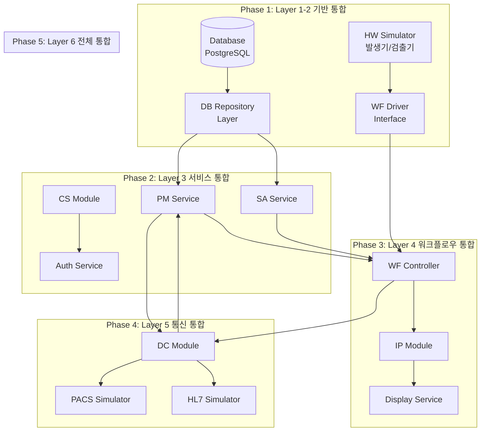
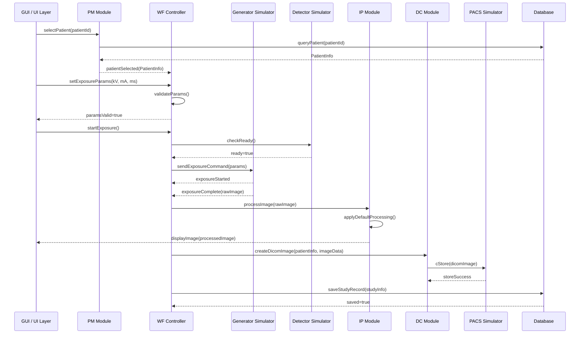
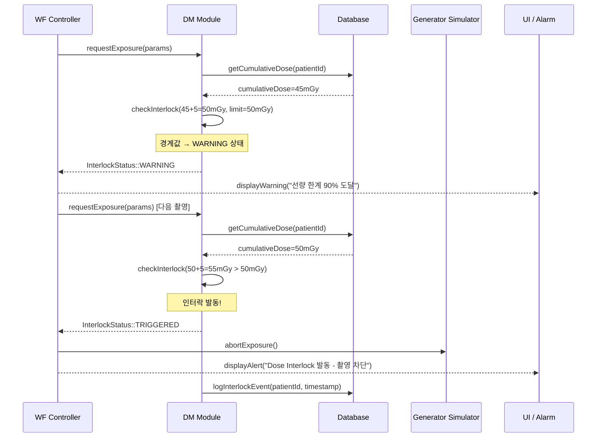
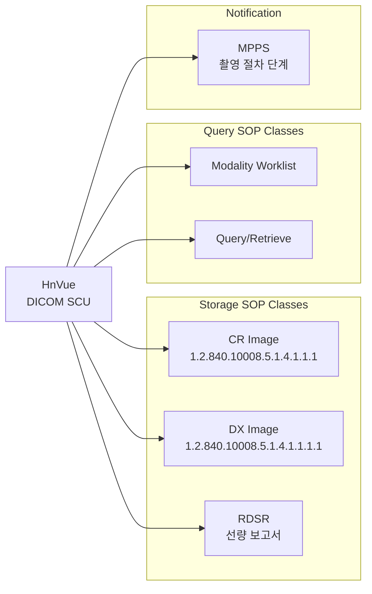
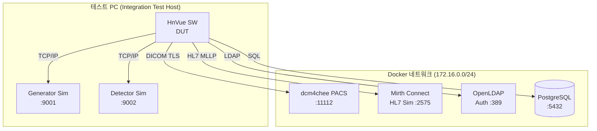

# 통합 테스트 계획서 (Integration Test Plan)

---

## 문서 메타데이터 (Document Metadata)

| 항목 | 내용 |
|------|------|
| **문서 ID** | ITP-XRAY-GUI-001 |
| **버전 (Version)** | v1.0 |
| **제품명 (Product)** | HnVue Console SW |
| **작성일 (Date)** | 2026-03-18 |
| **작성자 (Author)** | SW 개발팀 (SW Development Team) |
| **검토자 (Reviewer)** | SW QA 팀장 |
| **승인자 (Approver)** | SW 개발 팀장 / RA Manager |
| **상태 (Status)** | Draft |
| **기준 규격** | IEC 62304:2006+AMD1:2015 §5.6 |
| **관련 문서** | SAD-XRAY-GUI-001, ITP-XRAY-GUI-001 |

### 개정 이력 (Revision History)

| 버전 | 날짜 | 작성자 | 변경 내용 |
|------|------|--------|-----------|
| v0.1 | 2026-02-10 | 개발팀 | 초안 작성 |
| v1.0 | 2026-03-18 | 개발팀 | 공식 발행 |

---

## 목차 (Table of Contents)

1. 목적 및 범위 (Purpose and Scope)
2. 참조 문서 (Reference Documents)
3. 통합 전략 (Integration Strategy)
4. 통합 순서 다이어그램 (Integration Sequence Diagram)
5. 통합 테스트 케이스 목록 (Integration Test Cases)
6. DICOM 통합 테스트 시나리오 (DICOM Integration Test Scenarios)
7. 하드웨어 시뮬레이터 환경 (Hardware Simulator Environment)
8. Pass/Fail 기준 (Pass/Fail Criteria)

---

련 문서 (Related Documents)

| 문서 ID | 문서명 | 관계 |
|---------|--------|------|
| DOC-006 | 소프트웨어 아키텍처 설계서 (SAD) | 통합 아키텍처 참조 |
| DOC-011 | V&V 마스터 플랜 | 상위 시험 전략 및 통합 시험 레벨 정의 |
| DOC-005 | 소프트웨어 요구사항 명세서 (SRS) | 통합 요구사항 출처 |

## 1.

## 1. 목적 및 범위 (Purpose and Scope)

### 1.1 목적

본 문서는 HnVue Console Software의 통합 테스트 계획을 정의한다. IEC 62304:2006+AMD1:2015 §5.6 "소프트웨어 통합 및 통합 테스트 (Software Integration and Integration Testing)" 요구사항을 충족하기 위해 **모듈 간 인터페이스 (Interface between Software Units)** 의 정상 동작, 경계 조건, 오류 처리를 검증한다.

**Purpose:** Define integration test plan to verify all inter-module interfaces in HnVue per IEC 62304 §5.6.

### 1.2 범위

- **통합 대상 인터페이스**: PM↔DB, WF↔Generator, WF↔Detector, IP↔Display, DC↔PACS, SA↔DB, CS↔Auth, PM↔WF, WF↔IP, DC↔HL7
- **테스트 레벨**: 단위 테스트(UT) 완료 후 수행
- **테스트 방법**: 보텀업(Bottom-up) 통합 전략
- **제외 범위**: 하드웨어 직접 연결 테스트 (시뮬레이터 사용), 시스템 수준 테스트 (DOC-014 참조)

---

## 2. 참조 문서 (Reference Documents)

| 문서 ID | 문서명 | 버전 |
|---------|--------|------|
| IEC 62304:2006+AMD1:2015 | Medical Device Software — Software Life Cycle Processes | - |
| SAD-XRAY-GUI-001 | Software Architecture Design (소프트웨어 아키텍처 설계서) | v1.0 |
| UTP-XRAY-GUI-001 | Unit Test Plan (단위 테스트 계획서, DOC-012) | v1.0 |
| DICOM PS3.x | Digital Imaging and Communications in Medicine | 2023 |
| IHE RAD TF | IHE Radiology Technical Framework | Rev. 20 |
| SRS-XRAY-GUI-001 | Software Requirements Specification | v3.0 |

---

## 3. 통합 전략 (Integration Strategy)

### 3.1 보텀업 통합 전략 (Bottom-up Integration Strategy)

HnVue SW는 **보텀업(Bottom-up)** 통합 전략을 채택한다. 하위 레이어 모듈(DB, 하드웨어 드라이버)을 먼저 통합하고, 점진적으로 상위 레이어 모듈과 통합한다.

```
통합 레이어 (Integration Layers):
  Layer 1 (기반): DB ←→ Repository 인터페이스
  Layer 2 (드라이버): Hardware Simulator ←→ WF Controller
  Layer 3 (서비스): PM ↔ DB, SA ↔ DB, CS ↔ Auth
  Layer 4 (워크플로우): PM ↔ WF, WF ↔ IP, WF ↔ Generator/Detector
  Layer 5 (통신): DC ↔ PACS, DC ↔ HL7, DC ↔ Worklist
  Layer 6 (전체): 전체 모듈 통합 End-to-End
```

### 3.2 통합 전략 선택 이유

| 항목 | 보텀업 선택 이유 |
|------|----------------|
| 조기 검증 | 하위 레이어의 안정성을 먼저 확보하여 상위 통합 리스크 감소 |
| 드라이버 활용 | 단위 테스트에서 검증된 드라이버 코드를 통합 테스트에 재활용 |
| 병렬 개발 | 상위 모듈 개발과 하위 통합 테스트 병행 가능 |
| Safety 중심 | Dose Interlock, 파라미터 검증 등 Safety-Critical 경로 우선 검증 |

---

## 4. 통합 순서 다이어그램 (Integration Sequence Diagram)

### 4.1 전체 통합 순서 (Overall Integration Order)



### 4.2 핵심 촬영 워크플로우 통합 시퀀스



### 4.3 Dose Interlock 통합 시퀀스 (Safety-Critical)



---

## 5. 통합 테스트 케이스 목록 (Integration Test Cases)

### 5.1 PM ↔ DB 인터페이스 (6개)

| IT ID | 통합 인터페이스 | 테스트 설명 | 사전조건 | 테스트 단계 | 예상결과 | 관련 SAD |
|-------|--------------|-----------|---------|-----------|---------|---------|
| IT-PM-DB-001 | PM ↔ DB | 환자 등록 후 DB 저장 검증 | DB 연결 확인, 테스트 DB 초기화 | 1) PM.registerPatient() 호출<br>2) DB 직접 쿼리로 레코드 확인 | DB에 환자 레코드 존재, 모든 필드 일치 | SAD §3.1 |
| IT-PM-DB-002 | PM ↔ DB | 환자 조회 — DB에서 정확히 로드 | 환자 P001 DB에 사전 입력 | 1) PM.searchPatient("홍길동") 호출<br>2) 결과 검증 | PatientInfo 객체 반환, name="홍길동" | SAD §3.1 |
| IT-PM-DB-003 | PM ↔ DB | 트랜잭션 롤백 — DB 오류 시 환자 등록 취소 | DB 연결 시뮬레이션 중단 설정 | 1) PM.registerPatient() 호출<br>2) DB 오류 주입<br>3) DB 레코드 확인 | 레코드 없음 (롤백 성공) | SAD §3.1 |
| IT-PM-DB-004 | PM ↔ DB | 워크리스트 조회 — MWL DB 연동 | MWL 데이터 DB에 사전 입력 | 1) PM.queryWorklist(date) 호출<br>2) 결과 검증 | 해당 날짜 MWL 항목 목록 반환 | SAD §3.2 |
| IT-PM-DB-005 | PM ↔ DB | 환자 감사 로그 — PM 동작 시 자동 로깅 | 감사 로그 테이블 초기화 | 1) PM.updatePatient() 호출<br>2) 감사 로그 테이블 확인 | 감사 로그 생성, 타임스탬프/사용자 ID 포함 | SAD §3.1 |
| IT-PM-DB-006 | PM ↔ DB | 동시 접근 — 다중 세션 환자 조회 | 테스트 환자 10명 DB 입력 | 1) 5개 스레드 동시 PM.searchPatient() 호출<br>2) 모든 결과 검증 | 데이터 불일치 없음, 데드락 없음 | SAD §3.5 |

### 5.2 WF ↔ Generator (발생기) 인터페이스 (5개)

| IT ID | 통합 인터페이스 | 테스트 설명 | 사전조건 | 테스트 단계 | 예상결과 | 관련 SAD |
|-------|--------------|-----------|---------|-----------|---------|---------|
| IT-WF-GEN-001 | WF ↔ Generator | 발생기 촬영 명령 정상 전달 | Generator Simulator 연결, 환자/파라미터 선택 완료 | 1) WF.startExposure(params) 호출<br>2) Sim에서 수신 명령 확인 | 발생기에 정확한 kV/mA/ms 전달 | SAD §4.1 |
| IT-WF-GEN-002 | WF ↔ Generator | 발생기 오류 응답 처리 — 전원 오류 | Generator Sim에서 오류 응답 설정 | 1) WF.startExposure() 호출<br>2) Sim이 GENERATOR_ERROR 반환 | 촬영 중단, 오류 코드 UI 표시, 감사 로그 | SAD §4.2 |
| IT-WF-GEN-003 | WF ↔ Generator | 발생기 타임아웃 처리 — 응답 없음 | Generator Sim 응답 지연 설정 (>10s) | 1) WF.startExposure() 호출<br>2) 10초 대기 | TimeoutException, 연결 재시도 1회 | SAD §4.2 |
| IT-WF-GEN-004 | WF ↔ Generator | 발생기 파라미터 한계값 검사 연동 | 파라미터 검증 모듈 통합 완료 | 1) WF.setParams(kV=151) 호출<br>2) 발생기 명령 전송 시도 | 파라미터 검증 실패, 발생기 명령 미전송 | SAD §4.1 |
| IT-WF-GEN-005 | WF ↔ Generator | 촬영 완료 이벤트 수신 및 처리 | Generator Sim 촬영 완료 시나리오 설정 | 1) 촬영 시작<br>2) Sim이 exposureComplete 이벤트 발생<br>3) WF 상태 확인 | WF 상태=COMPLETE, IP 모듈에 이미지 처리 요청 | SAD §4.3 |

### 5.3 WF ↔ Detector (검출기) 인터페이스 (5개)

| IT ID | 통합 인터페이스 | 테스트 설명 | 사전조건 | 테스트 단계 | 예상결과 | 관련 SAD |
|-------|--------------|-----------|---------|-----------|---------|---------|
| IT-WF-DET-001 | WF ↔ Detector | 검출기 준비 상태 폴링 — 정상 준비 | Detector Sim READY 상태 설정 | 1) WF.checkDetectorStatus() 호출<br>2) 상태 확인 | DetectorStatus::READY 반환 | SAD §4.4 |
| IT-WF-DET-002 | WF ↔ Detector | 검출기 미준비 시 촬영 차단 (Safety-Critical) | Detector Sim NOT_READY 상태 설정 | 1) WF.startExposure() 호출<br>2) 발생기 명령 전송 시도 확인 | 촬영 명령 미전송, UI에 "검출기 미준비" 표시 | SAD §4.4 |
| IT-WF-DET-003 | WF ↔ Detector | 검출기 이미지 수신 — 14-bit RAW 이미지 | 촬영 완료 후 | 1) 촬영 수행<br>2) Detector Sim에서 14-bit RAW 이미지 전송 | WF에서 이미지 수신, IP 모듈에 전달 | SAD §4.5 |
| IT-WF-DET-004 | WF ↔ Detector | 검출기 오프셋/게인 교정 명령 연동 | SA 모듈 QC 트리거 설정 | 1) SA.triggerCalibration() 호출<br>2) Detector에 교정 명령 전달 확인 | 검출기 교정 명령 수신, 결과 SA에 반환 | SAD §4.6 |
| IT-WF-DET-005 | WF ↔ Detector | 검출기 오류 회복 — 전원 재연결 | Detector Sim 오류 후 재연결 시나리오 | 1) Sim 오류 발생<br>2) 5초 후 재연결<br>3) WF 상태 확인 | WF 자동 재연결, READY 상태 복구 | SAD §4.7 |

### 5.4 IP ↔ Display 인터페이스 (4개)

| IT ID | 통합 인터페이스 | 테스트 설명 | 사전조건 | 테스트 단계 | 예상결과 | 관련 SAD |
|-------|--------------|-----------|---------|-----------|---------|---------|
| IT-IP-DISP-001 | IP ↔ Display | 처리된 이미지 디스플레이 전달 | DICOM 이미지 IP 처리 완료 | 1) IP.processImage(rawImage)<br>2) 디스플레이 뷰포트 확인 | 처리 이미지 뷰포트 표시, 해상도 유지 | SAD §5.1 |
| IT-IP-DISP-002 | IP ↔ Display | 윈도우/레벨 변경 실시간 반영 | 이미지 표시 중 | 1) UI에서 WL 조작<br>2) IP 처리 트리거<br>3) 디스플레이 업데이트 확인 | < 100ms 내 화면 갱신 | SAD §5.2 |
| IT-IP-DISP-003 | IP ↔ Display | 이미지 주석 오버레이 표시 | 이미지 표시 중 | 1) 측정 도구로 ROI 그리기<br>2) 주석 데이터 IP → Display 전달 | 정확한 주석 표시, 좌표 정확도 ±1px | SAD §5.3 |
| IT-IP-DISP-004 | IP ↔ Display | 멀티 뷰포트 동기화 | 2-up 레이아웃 설정 | 1) WL 변경<br>2) 연결된 뷰포트 동기화 확인 | 동기화 설정된 뷰포트 동시 업데이트 | SAD §5.4 |

### 5.5 DC ↔ PACS 인터페이스 (6개)

| IT ID | 통합 인터페이스 | 테스트 설명 | 사전조건 | 테스트 단계 | 예상결과 | 관련 SAD |
|-------|--------------|-----------|---------|-----------|---------|---------|
| IT-DC-PACS-001 | DC ↔ PACS | C-STORE — 이미지 PACS 전송 | PACS Sim(dcm4chee) 실행 중 | 1) DC.cStore(dicomImage, pacsConfig)<br>2) PACS Sim에서 저장 확인 | Status=0x0000 SUCCESS, PACS에 이미지 저장 | SAD §6.1 |
| IT-DC-PACS-002 | DC ↔ PACS | C-STORE — 전송 실패 재시도 | PACS Sim 일시 중단 후 복구 | 1) 전송 시도<br>2) 실패 (PACS 오프라인)<br>3) 큐에 추가<br>4) PACS 복구 후 자동 재전송 | 큐 기반 자동 재전송 성공 | SAD §6.2 |
| IT-DC-PACS-003 | DC ↔ PACS | C-FIND — 스터디 조회 | PACS에 테스트 스터디 사전 저장 | 1) DC.cFind(queryDataset)<br>2) 결과 파싱 | 매칭 스터디 목록 반환, Dataset 정확 | SAD §6.3 |
| IT-DC-PACS-004 | DC ↔ PACS | C-MOVE — 이미지 다운로드 | 원격 PACS에 이미지 저장 | 1) DC.cMove(studyUID, destination)<br>2) 로컬 수신 확인 | 이미지 수신 완료, 무결성 검증 통과 | SAD §6.4 |
| IT-DC-PACS-005 | DC ↔ PACS | TLS 암호화 통신 검증 | TLS 1.3 설정 완료 | 1) 네트워크 패킷 캡처<br>2) C-STORE 수행<br>3) 패킷 분석 | 평문 DICOM 데이터 없음, TLS 1.3 확인 | SAD §6.5 |
| IT-DC-PACS-006 | DC ↔ PACS | DICOM Association 협상 — SOP Class 불일치 | PACS Sim SOP Class 제한 설정 | 1) 지원 안 되는 SOP Class로 연결 시도 | Association Rejection, 오류 로그 기록 | SAD §6.6 |

### 5.6 SA ↔ DB 인터페이스 (4개)

| IT ID | 통합 인터페이스 | 테스트 설명 | 사전조건 | 테스트 단계 | 예상결과 | 관련 SAD |
|-------|--------------|-----------|---------|-----------|---------|---------|
| IT-SA-DB-001 | SA ↔ DB | 시스템 설정 저장/로드 | DB 연결 정상 | 1) SA.saveConfig(config)<br>2) 애플리케이션 재시작<br>3) SA.loadConfig() | 저장된 설정 정확히 로드 | SAD §7.1 |
| IT-SA-DB-002 | SA ↔ DB | 감사 로그 영속성 검증 | 감사 테이블 설정 완료 | 1) 여러 사용자 동작 수행<br>2) DB에서 감사 로그 조회 | 모든 동작 기록, 불변(Immutable) 확인 | SAD §7.2 |
| IT-SA-DB-003 | SA ↔ DB | 백업 — DB 데이터 백업 | 테스트 데이터 입력 완료 | 1) SA.createBackup()<br>2) 백업 파일 검증<br>3) 복구 테스트 | 백업 성공, 복구 후 데이터 일치 | SAD §7.3 |
| IT-SA-DB-004 | SA ↔ DB | 디스크 모니터링 — DB 스토리지 경고 | DB 스토리지 80% 채움 | 1) SA.checkStorageStatus()<br>2) 경고 이벤트 확인 | StorageWarning 이벤트, 관리자 알림 | SAD §7.4 |

### 5.7 CS ↔ Auth 인터페이스 (4개)

| IT ID | 통합 인터페이스 | 테스트 설명 | 사전조건 | 테스트 단계 | 예상결과 | 관련 SAD |
|-------|--------------|-----------|---------|-----------|---------|---------|
| IT-CS-AUTH-001 | CS ↔ Auth | 로그인 — 인증 서비스 연동 | 테스트 사용자 DB 등록 | 1) UI에서 로그인 시도<br>2) CS → Auth 인증 요청<br>3) 세션 생성 확인 | JWT 토큰 발급, 세션 DB 저장 | SAD §8.1 |
| IT-CS-AUTH-002 | CS ↔ Auth | 세션 만료 — 자동 로그아웃 | 세션 유효시간 5분 설정 | 1) 로그인 성공<br>2) 5분 경과<br>3) 임의 동작 시도 | 자동 로그아웃, 재인증 요구 UI 표시 | SAD §8.2 |
| IT-CS-AUTH-003 | CS ↔ Auth | RBAC — 권한 부여 통합 | 역할별 사용자 설정 완료 | 1) Technician으로 로그인<br>2) Admin 기능 접근 시도 | 접근 거부, 감사 로그에 UNAUTHORIZED 기록 | SAD §8.3 |
| IT-CS-AUTH-004 | CS ↔ Auth | 인증서 기반 디바이스 인증 | 디바이스 인증서 설치 | 1) 인증서 없이 연결 시도<br>2) 인증서 포함 연결 시도 | 인증서 없음: 거부, 인증서 있음: 허용 | SAD §8.4 |

### 5.8 PM ↔ WF 인터페이스 (3개)

| IT ID | 통합 인터페이스 | 테스트 설명 | 사전조건 | 테스트 단계 | 예상결과 | 관련 SAD |
|-------|--------------|-----------|---------|-----------|---------|---------|
| IT-PM-WF-001 | PM ↔ WF | 환자 선택 → 워크플로우 활성화 | 환자 P001 DB 등록 완료 | 1) PM.selectPatient("P001")<br>2) WF 상태 확인 | WF 상태=PATIENT_SELECTED, 촬영 준비 활성화 | SAD §9.1 |
| IT-PM-WF-002 | PM ↔ WF | 스터디 생성 — 워크플로우 시작 시 자동 생성 | 환자 선택 완료 | 1) WF.startExposure() 호출<br>2) PM 스터디 레코드 확인 | 새 스터디 ID 생성, PM에 연결 | SAD §9.2 |
| IT-PM-WF-003 | PM ↔ WF | 워크리스트 자동 매핑 — MWL → WF 파라미터 | MWL 항목 DB 입력 | 1) MWL 항목 선택<br>2) WF 파라미터 자동 설정 확인 | 신체 부위, 촬영 방향 자동 설정 | SAD §9.3 |

### 5.9 WF ↔ IP (이미지 처리) 인터페이스 (3개)

| IT ID | 통합 인터페이스 | 테스트 설명 | 사전조건 | 테스트 단계 | 예상결과 | 관련 SAD |
|-------|--------------|-----------|---------|-----------|---------|---------|
| IT-WF-IP-001 | WF ↔ IP | 촬영 완료 → 이미지 자동 처리 | 촬영 완료 시나리오 | 1) WF 촬영 완료 이벤트 발생<br>2) IP 처리 완료 대기 | IP에서 기본 처리 자동 시작, 결과 표시 | SAD §10.1 |
| IT-WF-IP-002 | WF ↔ IP | 신체 부위별 기본 LUT 자동 적용 | WF에 신체 부위 설정 | 1) 흉부 촬영 완료<br>2) 적용된 LUT 확인 | CHEST_AP 기본 LUT 자동 적용 | SAD §10.2 |
| IT-WF-IP-003 | WF ↔ IP | 이미지 처리 실패 → 재처리 요청 | IP 처리 오류 시나리오 | 1) IP 처리 오류 주입<br>2) 재처리 요청 확인 | 재처리 1회 자동 시도, 실패 시 수동 요청 | SAD §10.3 |

**총 통합 테스트 케이스: 40개**

---

## 6. DICOM 통합 테스트 시나리오 (DICOM Integration Test Scenarios)

### 6.1 DICOM 표준 준수 테스트

| 시나리오 ID | 시나리오명 | DICOM 서비스 | 검증 항목 |
|------------|-----------|------------|---------|
| DICOM-IT-001 | Storage SCU 기능 검증 | C-STORE SCU | SOP Class 지원 목록, 전송 구문 협상 |
| DICOM-IT-002 | Query/Retrieve 기능 검증 | C-FIND / C-MOVE SCU | 쿼리 파라미터, 응답 파싱 |
| DICOM-IT-003 | Worklist 조회 기능 | MWL C-FIND SCU | 워크리스트 필터링, 결과 매핑 |
| DICOM-IT-004 | 선량 보고서 전송 | RDSR C-STORE | DICOM SR 구조 검증 |
| DICOM-IT-005 | MPPS 상태 보고 | N-CREATE / N-SET SCU | 촬영 상태 동기화 |

### 6.2 DICOM Conformance Statement 항목별 검증



---

## 7. 하드웨어 시뮬레이터 환경 (Hardware Simulator Environment)

### 7.1 시뮬레이터 구성

| 시뮬레이터 | 용도 | 구현 방식 | 포트/프로토콜 |
|-----------|------|---------|-------------|
| **Generator Simulator** | X-Ray 발생기 에뮬레이션 | C++ 소켓 서버 | TCP/IP 9001 |
| **Detector Simulator** | 평판 검출기 에뮬레이션 | C++ 소켓 서버 + 테스트 이미지 | TCP/IP 9002 |
| **PACS Simulator** | PACS 서버 에뮬레이션 | dcm4chee-arc (Docker) | DICOM 11112 |
| **HL7 Simulator** | HIS/RIS 에뮬레이션 | MIRTH Connect | HL7 MLLP 2575 |
| **LDAP Simulator** | 인증 서버 에뮬레이션 | OpenLDAP (Docker) | LDAP 389 |

### 7.2 테스트 환경 구성도



### 7.3 테스트 데이터 관리

| 데이터 유형 | 관리 방법 | 초기화 주기 |
|-----------|---------|------------|
| 테스트 환자 데이터 | DB seed scripts | 테스트 스위트 실행 전 |
| 테스트 DICOM 이미지 | 고정 14-bit 테스트 이미지 파일 | 불변 (read-only) |
| 시뮬레이터 설정 | YAML 설정 파일 | 테스트 케이스 전후 |
| 네트워크 시뮬레이션 | tc netem (네트워크 지연/손실) | 케이스별 설정 |

---

## 8. Pass/Fail 기준 (Pass/Fail Criteria)

### 8.1 통합 테스트 합격 기준

| 기준 항목 | 기준 값 | 비고 |
|-----------|--------|------|
| **개별 IT 케이스 합격률** | 100% (모든 케이스 Pass) | 실패 케이스 0 허용 |
| **Safety-Critical 인터페이스** | 100% Pass 필수 | Dose Interlock, 검출기 차단 |
| **인터페이스 응답 시간** | 각 인터페이스별 명세 준수 | IP↔Display: <100ms |
| **DICOM 준수성** | DICOM Conformance Statement 100% 충족 | |
| **오류 처리 커버리지** | 모든 오류 경로 테스트 완료 | 재시도, 타임아웃, 롤백 포함 |

### 8.2 불합격 처리 절차

| 심각도 | 정의 | 처리 방법 | 진행 차단 여부 |
|--------|------|---------|-------------|
| **Critical** | Safety-Critical 인터페이스 실패 | 즉시 결함 보고, 수정 후 전체 IT 재실행 | **차단** |
| **Major** | 핵심 기능 인터페이스 실패 | 결함 보고, 수정 후 해당 IT 재실행 | 차단 |
| **Minor** | 비필수 기능 인터페이스 실패 | 결함 보고, 다음 사이클에 수정 | 조건부 진행 |

---

*본 문서는 IEC 62304 §5.6 요구사항에 따라 작성되었으며, 인허가 제출용 문서로 관리됩니다.*
*This document is prepared in accordance with IEC 62304 §5.6 requirements and managed as a regulatory submission document.*

---
**문서 끝 (End of Document)** | ITP-XRAY-GUI-001 v1.0 | 2026-03-18
