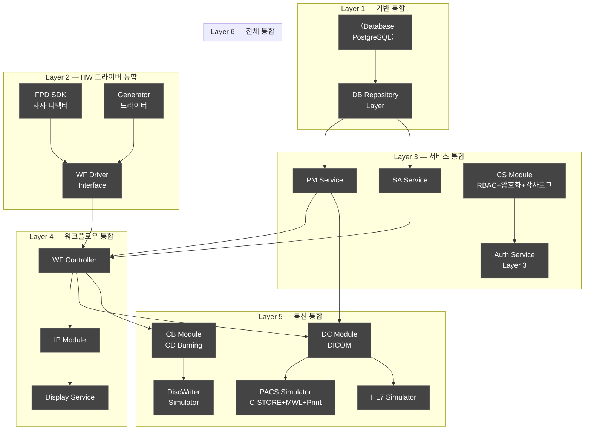
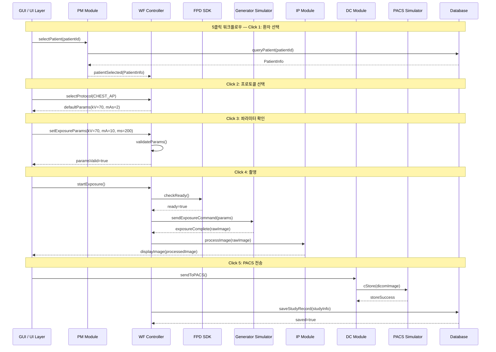
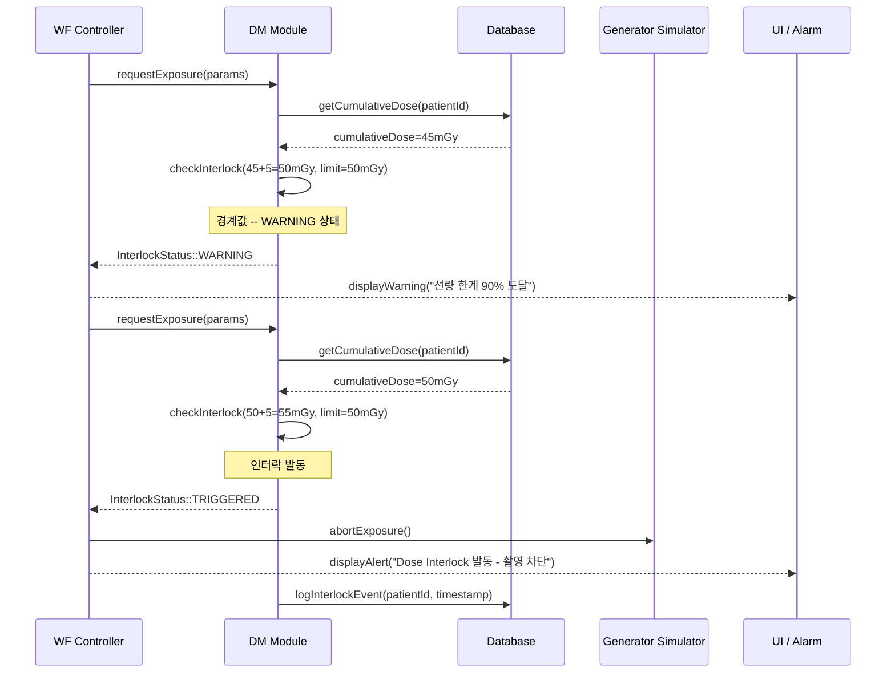
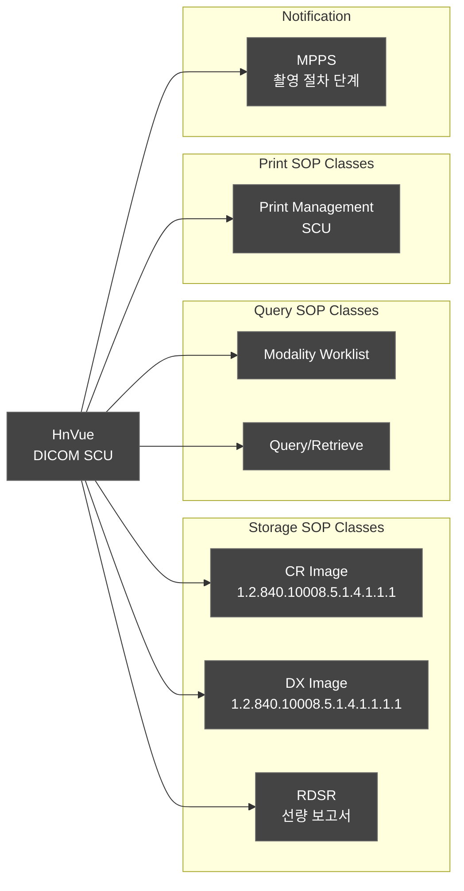
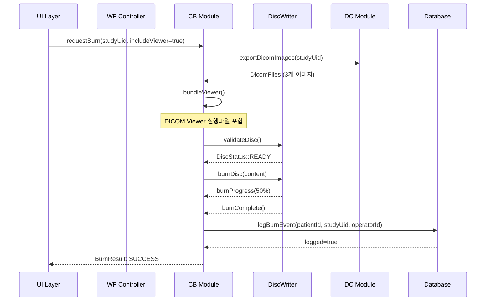
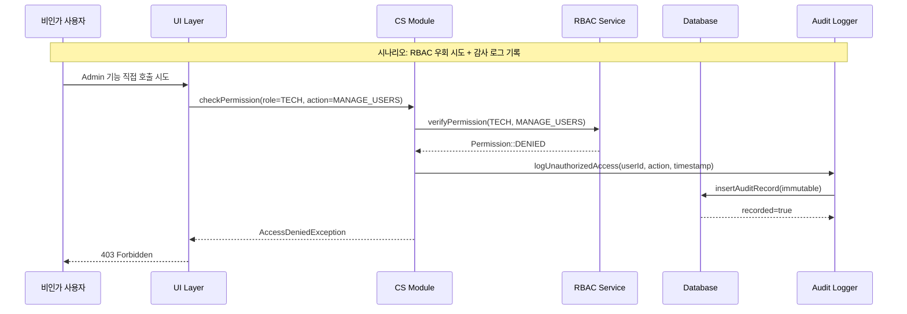
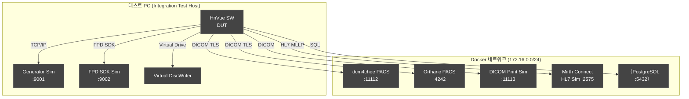

# 통합 테스트 계획서 (Integration Test Plan)

---

## 문서 메타데이터 (Document Metadata)

| 항목 | 내용 |
|------|------|
| **문서 ID** | ITP-XRAY-GUI-001 |
| **버전 (Version)** | v2.0 |
| **제품명 (Product)** | HnVue Console SW |
| **작성일 (Date)** | 2026-04-03 |
| **작성자 (Author)** | SW 개발팀 (SW Development Team) |
| **검토자 (Reviewer)** | SW QA 팀장 |
| **승인자 (Approver)** | SW 개발 팀장 / RA Manager |
| **상태 (Status)** | Draft |
| **기준 규격** | IEC 62304:2006+AMD1:2015 §5.6 |
| **관련 문서** | DOC-005 SRS v2.0, DOC-004 FRS v2.0, DOC-032 RTM v2.0, DOC-012 UTP v2.0 |

### 개정 이력 (Revision History)

| 버전 | 날짜 | 작성자 | 변경 내용 |
|------|------|--------|-----------|
| v0.1 | 2026-02-10 | 개발팀 | 초안 작성 |
| v1.0 | 2026-03-18 | 개발팀 | 공식 발행 |
| v2.0 | 2026-04-03 | 개발팀 | MRD v3.0 4-Tier 체계 반영; Phase별 통합 순서 명확화 (Layer 1-6); DICOM 상호운용성 테스트 추가 (C-STORE+MWL+Print); FPD SDK 통합 테스트 추가; Generator 통합 테스트 추가; CD Burning 통합 테스트 추가 (MR-072); 보안 통합 테스트 추가 (RBAC+암호화+감사로그 end-to-end); 각 TC에 MR/PR/SWR 추적성 명시 |

---

## 목차 (Table of Contents)

1. 목적 및 범위
2. 참조 문서
3. 4-Tier 체계 반영 통합 전략
4. 통합 순서 다이어그램
5. 통합 테스트 케이스 목록
6. DICOM 통합 테스트 시나리오
7. CD Burning 통합 테스트
8. 보안 통합 테스트 (End-to-End)
9. 하드웨어 시뮬레이터 환경
10. Pass/Fail 기준

---

## 1. 목적 및 범위 (Purpose and Scope)

### 1.1 목적

본 문서는 HnVue Console Software의 통합 테스트 계획 v2.0을 정의한다. IEC 62304:2006+AMD1:2015 §5.6 "소프트웨어 통합 및 통합 테스트" 요구사항을 충족하기 위해 모듈 간 인터페이스의 정상 동작, 경계 조건, 오류 처리를 검증한다.

v2.0에서는 MRD v3.0 4-Tier 체계를 반영하고, MR-072 (CD/DVD Burning), MR-037 (인시던트 대응), MR-039 (업데이트 메커니즘), MR-050 (STRIDE 위협 모델) 관련 통합 테스트를 추가하였다.

### 1.2 범위

- **통합 대상 인터페이스**: PM-DB, WF-Generator, WF-Detector(FPD), IP-Display, DC-PACS, SA-DB, CS-Auth, PM-WF, WF-IP, DC-HL7, **CB-DiscWriter** (신규)
- **테스트 레벨**: 단위 테스트(UT) 완료 후 수행 (DOC-012 UTP v2.0 기준)
- **테스트 방법**: 보텀업(Bottom-up) 통합 전략, Layer 1(DB) → 2(HW) → 3(서비스) → 4(워크플로우) → 5(DICOM) → 6(전체)
- **제외 범위**: 하드웨어 직접 연결 테스트 (시뮬레이터 사용), 시스템 수준 테스트 (DOC-014 참조)

---

## 2. 참조 문서 (Reference Documents)

| 문서 ID | 문서명 | 버전 |
|---------|--------|------|
| IEC 62304:2006+AMD1:2015 | Medical Device Software — Software Life Cycle Processes | - |
| DOC-001 | Market Requirements Document (MRD) | v3.0 |
| DOC-002 | Product Requirements Document (PRD) | v2.0 |
| DOC-004 | Functional Requirements Specification (FRS) | v2.0 |
| DOC-005 | Software Requirements Specification (SRS) | v2.0 |
| DOC-012 | Unit Test Plan (UTP) | v2.0 |
| DOC-032 | Requirements Traceability Matrix (RTM) | v2.0 |
| DICOM PS3.x | Digital Imaging and Communications in Medicine | 2023 |
| IHE RAD TF | IHE Radiology Technical Framework | Rev. 20 |

---

## 3. 4-Tier 체계 반영 통합 전략

### 3.1 보텀업 통합 전략 (Bottom-up Integration Strategy)

HnVue SW는 보텀업(Bottom-up) 통합 전략을 채택한다. MRD v3.0 4-Tier 우선순위에 따라 Tier 1(인허가 필수) 인터페이스를 최우선 통합한다.

```
통합 레이어 (Integration Layers) — v2.0:
  Layer 1 (기반):    DB ←→ Repository 인터페이스
  Layer 2 (드라이버): FPD SDK ←→ WF Controller, Generator ←→ WF Controller
  Layer 3 (서비스):  PM ↔ DB, SA ↔ DB, CS ↔ Auth (RBAC+암호화+감사로그)
  Layer 4 (워크플로우): PM ↔ WF, WF ↔ IP, WF ↔ Generator/Detector
  Layer 5 (통신):    DC ↔ PACS (C-STORE+MWL+Print), DC ↔ HL7, CB ↔ DiscWriter
  Layer 6 (전체):    전체 모듈 통합 End-to-End
```

### 3.2 Tier별 통합 우선순위

| Layer | Tier | 핵심 인터페이스 | 우선순위 |
|-------|------|---------------|---------|
| Layer 1 | 1, 2 | DB-Repository | 최우선 |
| Layer 2 | 2 | FPD SDK, Generator | 최우선 |
| Layer 3 | 1 | CS-Auth (RBAC, 암호화, 감사로그) | 최우선 |
| Layer 4 | 2 | PM-WF, WF-IP, WF-HW | 높음 |
| Layer 5 | 1, 2 | DICOM (C-STORE, MWL, Print), HL7, CD Burning | 높음 |
| Layer 6 | 1, 2 | 전체 통합 | 높음 |

---

## 4. 통합 순서 다이어그램 (Integration Sequence Diagram)

### 4.1 전체 통합 순서 (6-Layer)



### 4.2 핵심 촬영 워크플로우 통합 시퀀스 (5클릭 검증 포함)



### 4.3 Dose Interlock 통합 시퀀스 (Safety-Critical)



---

## 5. 통합 테스트 케이스 목록 (Integration Test Cases)

### 5.1 PM ↔ DB 인터페이스 (6개)

| IT ID | 통합 인터페이스 | 테스트 설명 | 사전조건 | 테스트 단계 | 예상결과 | MR | PR | SWR |
|-------|--------------|-----------|---------|-----------|---------|----|----|----|
| IT-PM-DB-001 | PM ↔ DB | 환자 등록 후 DB 저장 검증 | DB 연결 확인, 테스트 DB 초기화 | 1) PM.registerPatient() 호출 2) DB 직접 쿼리로 레코드 확인 | DB에 환자 레코드 존재, 모든 필드 일치 | MR-001 | PR-001 | SWR-PM-001 |
| IT-PM-DB-002 | PM ↔ DB | 환자 조회 — DB에서 정확히 로드 | 환자 P001 DB에 사전 입력 | 1) PM.searchPatient("홍길동") 호출 2) 결과 검증 | PatientInfo 객체 반환, name="홍길동" | MR-001 | PR-001 | SWR-PM-002 |
| IT-PM-DB-003 | PM ↔ DB | 트랜잭션 롤백 — DB 오류 시 등록 취소 | DB 연결 시뮬레이션 중단 설정 | 1) PM.registerPatient() 호출 2) DB 오류 주입 3) DB 레코드 확인 | 레코드 없음 (롤백 성공) | MR-001 | PR-001 | SWR-PM-001 |
| IT-PM-DB-004 | PM ↔ DB | 워크리스트 조회 — MWL DB 연동 | MWL 데이터 DB에 사전 입력 | 1) PM.queryWorklist(date) 호출 2) 결과 검증 | 해당 날짜 MWL 항목 목록 반환 | MR-001 | PR-002 | SWR-PM-005 |
| IT-PM-DB-005 | PM ↔ DB | 환자 감사 로그 — PM 동작 시 자동 로깅 | 감사 로그 테이블 초기화 | 1) PM.updatePatient() 호출 2) 감사 로그 테이블 확인 | 감사 로그 생성, 타임스탬프/사용자 ID 포함 | MR-035 | PR-063 | SWR-SA-030 |
| IT-PM-DB-006 | PM ↔ DB | 동시 접근 — 다중 세션 환자 조회 | 테스트 환자 10명 DB 입력 | 1) 5개 스레드 동시 PM.searchPatient() 호출 2) 모든 결과 검증 | 데이터 불일치 없음, 데드락 없음 | MR-001 | PR-001 | SWR-DB-030 |

### 5.2 WF ↔ Generator (발생기) 인터페이스 (5개)

| IT ID | 통합 인터페이스 | 테스트 설명 | 사전조건 | 테스트 단계 | 예상결과 | MR | PR | SWR |
|-------|--------------|-----------|---------|-----------|---------|----|----|----|
| IT-WF-GEN-001 | WF ↔ Generator | 발생기 촬영 명령 정상 전달 | Generator Simulator 연결, 환자/파라미터 선택 완료 | 1) WF.startExposure(params) 호출 2) Sim에서 수신 명령 확인 | 발생기에 정확한 kV/mA/ms 전달 | MR-003 | PR-010 | SWR-WF-002 |
| IT-WF-GEN-002 | WF ↔ Generator | 발생기 오류 응답 처리 — 전원 오류 | Generator Sim에서 오류 응답 설정 | 1) WF.startExposure() 호출 2) Sim이 GENERATOR_ERROR 반환 | 촬영 중단, 오류 코드 UI 표시, 감사 로그 | MR-003 | PR-010 | SWR-WF-003 |
| IT-WF-GEN-003 | WF ↔ Generator | 발생기 타임아웃 처리 — 응답 없음 | Generator Sim 응답 지연 설정 (>10s) | 1) WF.startExposure() 호출 2) 10초 대기 | TimeoutException, 연결 재시도 1회 | MR-003 | PR-010 | SWR-WF-005 |
| IT-WF-GEN-004 | WF ↔ Generator | 발생기 파라미터 한계값 연동 (Safety-Critical) | 파라미터 검증 모듈 통합 완료 | 1) WF.setParams(kV=151) 호출 2) 발생기 명령 전송 시도 | 파라미터 검증 실패, 발생기 명령 미전송 | MR-003 | PR-010 | SWR-WF-001 |
| IT-WF-GEN-005 | WF ↔ Generator | 촬영 완료 이벤트 수신 및 처리 | Generator Sim 촬영 완료 시나리오 설정 | 1) 촬영 시작 2) Sim이 exposureComplete 이벤트 발생 3) WF 상태 확인 | WF 상태=COMPLETE, IP 모듈에 이미지 처리 요청 | MR-003 | PR-010 | SWR-WF-010 |

### 5.3 WF ↔ FPD SDK (검출기) 인터페이스 (5개) 【FPD SDK 통합】

| IT ID | 통합 인터페이스 | 테스트 설명 | 사전조건 | 테스트 단계 | 예상결과 | MR | PR | SWR |
|-------|--------------|-----------|---------|-----------|---------|----|----|----|
| IT-WF-FPD-001 | WF ↔ FPD SDK | FPD SDK 초기화 — 검출기 연결 | FPD SDK 라이브러리 로드 완료 | 1) FPD_SDK.initialize() 호출 2) 검출기 상태 폴링 | FPD SDK 초기화 성공, DetectorStatus::READY | MR-023 | PR-010 | SWR-WF-003 |
| IT-WF-FPD-002 | WF ↔ FPD SDK | 검출기 미준비 시 촬영 차단 (Safety-Critical) | Detector Sim NOT_READY 상태 설정 | 1) WF.startExposure() 호출 2) 발생기 명령 전송 시도 | 촬영 명령 미전송, UI에 "검출기 미준비" 표시 | MR-010 | PR-010 | SWR-WF-003 |
| IT-WF-FPD-003 | WF ↔ FPD SDK | FPD 14-bit RAW 이미지 수신 | 촬영 완료 후 | 1) 촬영 수행 2) FPD Sim에서 14-bit RAW 이미지 전송 | WF에서 이미지 수신, IP 모듈에 전달 | MR-023 | PR-010 | SWR-WF-003 |
| IT-WF-FPD-004 | WF ↔ FPD SDK | FPD 오프셋/게인 교정 명령 연동 | SA 모듈 QC 트리거 설정 | 1) SA.triggerCalibration() 호출 2) FPD에 교정 명령 전달 확인 | FPD 교정 명령 수신, 결과 SA에 반환 | MR-023 | PR-063 | SWR-SA-040 |
| IT-WF-FPD-005 | WF ↔ FPD SDK | FPD 오류 회복 — 재연결 | FPD Sim 오류 후 재연결 시나리오 | 1) Sim 오류 발생 2) 5초 후 재연결 3) WF 상태 확인 | WF 자동 재연결, READY 상태 복구 | MR-023 | PR-010 | SWR-WF-003 |

### 5.4 IP ↔ Display 인터페이스 (4개)

| IT ID | 통합 인터페이스 | 테스트 설명 | 사전조건 | 테스트 단계 | 예상결과 | MR | PR | SWR |
|-------|--------------|-----------|---------|-----------|---------|----|----|----|
| IT-IP-DISP-001 | IP ↔ Display | 처리된 이미지 디스플레이 전달 | DICOM 이미지 IP 처리 완료 | 1) IP.processImage(rawImage) 2) 디스플레이 뷰포트 확인 | 처리 이미지 뷰포트 표시, 해상도 유지 | MR-012 | PR-020 | SWR-IP-001 |
| IT-IP-DISP-002 | IP ↔ Display | 윈도우/레벨 변경 실시간 반영 | 이미지 표시 중 | 1) UI에서 WL 조작 2) IP 처리 트리거 3) 디스플레이 업데이트 확인 | < 100ms 내 화면 갱신 | MR-012 | PR-020 | SWR-IP-001 |
| IT-IP-DISP-003 | IP ↔ Display | 이미지 주석 오버레이 표시 | 이미지 표시 중 | 1) 측정 도구로 ROI 그리기 2) 주석 데이터 IP-Display 전달 | 정확한 주석 표시, 좌표 정확도 ±1px | MR-012 | PR-023 | SWR-IP-010 |
| IT-IP-DISP-004 | IP ↔ Display | 멀티 뷰포트 동기화 | 2-up 레이아웃 설정 | 1) WL 변경 2) 연결된 뷰포트 동기화 확인 | 동기화 설정된 뷰포트 동시 업데이트 | MR-012 | PR-026 | SWR-IP-025 |

### 5.5 DC ↔ PACS 인터페이스 — 상호운용성 포함 (8개)

| IT ID | 통합 인터페이스 | 테스트 설명 | 사전조건 | 테스트 단계 | 예상결과 | MR | PR | SWR |
|-------|--------------|-----------|---------|-----------|---------|----|----|----|
| IT-DC-PACS-001 | DC ↔ PACS | C-STORE — 이미지 PACS 전송 | PACS Sim(dcm4chee) 실행 중 | 1) DC.cStore(dicomImage, pacsConfig) 2) PACS Sim에서 저장 확인 | Status=0x0000 SUCCESS, PACS에 이미지 저장 | MR-019 | PR-050 | SWR-DC-010 |
| IT-DC-PACS-002 | DC ↔ PACS | C-STORE — 전송 실패 재시도 | PACS Sim 일시 중단 후 복구 | 1) 전송 시도 2) 실패 (PACS 오프라인) 3) 큐 추가 4) PACS 복구 후 자동 재전송 | 큐 기반 자동 재전송 성공 | MR-019 | PR-050 | SWR-DC-010 |
| IT-DC-PACS-003 | DC ↔ PACS | MWL C-FIND — 워크리스트 조회 | PACS에 테스트 MWL 데이터 사전 저장 | 1) DC.cFind(queryDataset) 2) 결과 파싱 | 매칭 MWL 항목 반환, Dataset 정확 | MR-025 | PR-050 | SWR-DC-020 |
| IT-DC-PACS-004 | DC ↔ PACS | DICOM Print Management 연동 | DICOM Print SCU/SCP 설정 | 1) DC.printImage(dicomImage, printerConfig) 2) Print Sim에서 수신 확인 | Print Job 전송 성공, MR-024 충족 | MR-024 | PR-050 | SWR-DC-030 |
| IT-DC-PACS-005 | DC ↔ PACS | TLS 암호화 통신 검증 | TLS 1.3 설정 완료 | 1) 네트워크 패킷 캡처 2) C-STORE 수행 3) 패킷 분석 | 평문 DICOM 데이터 없음, TLS 1.3 확인 | MR-034 | PR-055 | SWR-DC-060 |
| IT-DC-PACS-006 | DC ↔ PACS | 벤더 상호운용성 — dcm4chee | dcm4chee PACS 실행 | 1) C-STORE 2) C-FIND 3) C-MOVE | 모든 DICOM 서비스 정상 동작 | MR-021 | PR-050 | SWR-DC-010 |
| IT-DC-PACS-007 | DC ↔ PACS | 벤더 상호운용성 — Orthanc | Orthanc PACS 실행 | 1) C-STORE 2) C-FIND | Orthanc과 상호운용 성공 | MR-021 | PR-050 | SWR-DC-010 |
| IT-DC-PACS-008 | DC ↔ PACS | DICOM Association 협상 — SOP Class 불일치 | PACS Sim SOP Class 제한 설정 | 1) 지원 안 되는 SOP Class로 연결 시도 | Association Rejection, 오류 로그 기록 | MR-019 | PR-050 | SWR-DC-030 |

### 5.6 SA ↔ DB 인터페이스 (4개)

| IT ID | 통합 인터페이스 | 테스트 설명 | 사전조건 | 테스트 단계 | 예상결과 | MR | PR | SWR |
|-------|--------------|-----------|---------|-----------|---------|----|----|----|
| IT-SA-DB-001 | SA ↔ DB | 시스템 설정 저장/로드 | DB 연결 정상 | 1) SA.saveConfig(config) 2) 애플리케이션 재시작 3) SA.loadConfig() | 저장된 설정 정확히 로드 | MR-039 | PR-060 | SWR-SA-001 |
| IT-SA-DB-002 | SA ↔ DB | 감사 로그 영속성 검증 | 감사 테이블 설정 완료 | 1) 여러 사용자 동작 수행 2) DB에서 감사 로그 조회 | 모든 동작 기록, 불변(Immutable) 확인 | MR-035 | PR-063 | SWR-SA-030 |
| IT-SA-DB-003 | SA ↔ DB | 백업 — DB 데이터 백업/복구 | 테스트 데이터 입력 완료 | 1) SA.createBackup() 2) 백업 파일 검증 3) 복구 테스트 | 백업 성공, 복구 후 데이터 일치 | MR-039 | PR-061 | SWR-SA-010 |
| IT-SA-DB-004 | SA ↔ DB | SW 업데이트 무결성 — DB 연동 | 업데이트 패키지 준비 | 1) SA.installUpdate(package) 2) 서명 검증 3) DB 업데이트 기록 확인 | 서명 검증 성공, 업데이트 이력 DB 기록 | MR-039 | PR-060 | SWR-SA-050 |

### 5.7 CS ↔ Auth 인터페이스 (4개)

| IT ID | 통합 인터페이스 | 테스트 설명 | 사전조건 | 테스트 단계 | 예상결과 | MR | PR | SWR |
|-------|--------------|-----------|---------|-----------|---------|----|----|----|
| IT-CS-AUTH-001 | CS ↔ Auth | 로그인 — 인증 서비스 연동 | 테스트 사용자 DB 등록 | 1) UI에서 로그인 시도 2) CS-Auth 인증 요청 3) 세션 생성 확인 | JWT 토큰 발급, 세션 DB 저장 | MR-033 | PR-070 | SWR-CS-001 |
| IT-CS-AUTH-002 | CS ↔ Auth | RBAC — 권한 부여 통합 | 역할별 사용자 설정 완료 | 1) Technician으로 로그인 2) Admin 기능 접근 시도 | 접근 거부, 감사 로그에 UNAUTHORIZED 기록 | MR-033 | PR-072 | SWR-CS-030 |
| IT-CS-AUTH-003 | CS ↔ Auth | PHI 암호화 — DB 저장 end-to-end | 암호화 서비스 통합 완료 | 1) 환자 PHI 데이터 저장 2) DB 파일 직접 확인 | DB에 평문 PHI 없음, AES-256 암호화 확인 | MR-034 | PR-073 | SWR-CS-040 |
| IT-CS-AUTH-004 | CS ↔ Auth | 감사 로그 end-to-end — 전체 동작 추적 | 모든 모듈 통합 완료 | 1) 로그인 2) 환자 조회 3) 촬영 4) PACS 전송 5) 감사 로그 전체 확인 | 전체 워크플로우 감사 로그 연속 기록, 타임스탬프 정확 | MR-035 | PR-063 | SWR-SA-030 |

### 5.8 PM ↔ WF 인터페이스 (3개)

| IT ID | 통합 인터페이스 | 테스트 설명 | 사전조건 | 테스트 단계 | 예상결과 | MR | PR | SWR |
|-------|--------------|-----------|---------|-----------|---------|----|----|----|
| IT-PM-WF-001 | PM ↔ WF | 환자 선택 → 워크플로우 활성화 | 환자 P001 DB 등록 완료 | 1) PM.selectPatient("P001") 2) WF 상태 확인 | WF 상태=PATIENT_SELECTED, 촬영 준비 활성화 | MR-003 | PR-010 | SWR-WF-010 |
| IT-PM-WF-002 | PM ↔ WF | 스터디 생성 — 워크플로우 시작 시 자동 생성 | 환자 선택 완료 | 1) WF.startExposure() 호출 2) PM 스터디 레코드 확인 | 새 스터디 ID 생성, PM에 연결 | MR-003 | PR-010 | SWR-WF-010 |
| IT-PM-WF-003 | PM ↔ WF | 워크리스트 자동 매핑 — MWL → WF 파라미터 | MWL 항목 DB 입력 | 1) MWL 항목 선택 2) WF 파라미터 자동 설정 확인 | 신체 부위, 촬영 방향 자동 설정 | MR-001 | PR-002 | SWR-PM-005 |

### 5.9 WF ↔ IP 인터페이스 (3개)

| IT ID | 통합 인터페이스 | 테스트 설명 | 사전조건 | 테스트 단계 | 예상결과 | MR | PR | SWR |
|-------|--------------|-----------|---------|-----------|---------|----|----|----|
| IT-WF-IP-001 | WF ↔ IP | 촬영 완료 → 이미지 자동 처리 | 촬영 완료 시나리오 | 1) WF 촬영 완료 이벤트 발생 2) IP 처리 완료 대기 | IP에서 기본 처리 자동 시작, 결과 표시 | MR-011 | PR-020 | SWR-IP-001 |
| IT-WF-IP-002 | WF ↔ IP | 신체 부위별 기본 LUT 자동 적용 | WF에 신체 부위 설정 | 1) 흉부 촬영 완료 2) 적용된 LUT 확인 | CHEST_AP 기본 LUT 자동 적용 | MR-013 | PR-027 | SWR-IP-005 |
| IT-WF-IP-003 | WF ↔ IP | 이미지 처리 실패 → 재처리 요청 | IP 처리 오류 시나리오 | 1) IP 처리 오류 주입 2) 재처리 요청 확인 | 재처리 1회 자동 시도, 실패 시 수동 요청 | MR-011 | PR-020 | SWR-IP-001 |

---

## 6. DICOM 통합 테스트 시나리오 (DICOM Integration Test Scenarios)

### 6.1 DICOM 표준 준수 및 상호운용성 테스트

| 시나리오 ID | 시나리오명 | DICOM 서비스 | 검증 항목 | MR |
|------------|-----------|------------|---------|----|----|
| DICOM-IT-001 | Storage SCU 기능 검증 | C-STORE SCU | SOP Class 지원 목록, 전송 구문 협상 | MR-019 |
| DICOM-IT-002 | Query/Retrieve 기능 검증 | C-FIND / C-MOVE SCU | 쿼리 파라미터, 응답 파싱 | MR-019 |
| DICOM-IT-003 | Worklist 조회 기능 | MWL C-FIND SCU | 워크리스트 필터링, 결과 매핑 | MR-025 |
| DICOM-IT-004 | Print Management 검증 | DICOM Print SCU | 필름 출력 명령, 상태 확인 | MR-024 |
| DICOM-IT-005 | 선량 보고서 전송 | RDSR C-STORE | DICOM SR 구조 검증 | MR-030 |
| DICOM-IT-006 | MPPS 상태 보고 | N-CREATE / N-SET SCU | 촬영 상태 동기화 | MR-019 |
| DICOM-IT-007 | 3개 PACS 벤더 상호운용성 | C-STORE + C-FIND | dcm4chee, Orthanc, Horos | MR-021 |

### 6.2 DICOM Conformance Statement 항목별 검증



---

## 7. CD Burning 통합 테스트 【MR-072 신규】

### 7.1 CD Burning 통합 시퀀스



### 7.2 CD Burning 통합 테스트 케이스 (5개)

| IT ID | 통합 인터페이스 | 테스트 설명 | 사전조건 | 테스트 단계 | 예상결과 | MR | PR | SWR |
|-------|--------------|-----------|---------|-----------|---------|----|----|----|
| IT-CB-001 | CB ↔ DC | DICOM 영상 내보내기 → CD 버닝 | 스터디 DB에 존재, 빈 CD-R 삽입 | 1) UI에서 CD 버닝 요청 2) DICOM 파일 수집 3) DiscWriter에 전달 | DICOM 파일 CD에 정상 기록 | MR-072 | PR-WF-019 | SWR-CB-004 |
| IT-CB-002 | CB ↔ DiscWriter | DICOM 뷰어 포함 버닝 | Viewer 번들 준비 완료 | 1) includeViewer=true 설정 2) 버닝 수행 3) CD 내용 확인 | CD에 DICOM 파일 + Viewer 실행파일 포함 | MR-072 | PR-WF-019 | SWR-CB-003 |
| IT-CB-003 | CB ↔ DB | 버닝 감사 로그 — PHI 배포 기록 | 버닝 완료 후 | 1) 버닝 수행 2) 감사 로그 DB 조회 | 환자 ID, 스터디 UID, 담당자, 시간 기록 | MR-072 | PR-WF-019 | SWR-CB-010 |
| IT-CB-004 | CB ↔ DiscWriter | CD 용량 초과 — DVD 전환 안내 | 이미지 총 크기 > 700MB | 1) 대용량 스터디 버닝 시도 2) 용량 초과 감지 | DiscCapacityExceededException, DVD 사용 안내 표시 | MR-072 | PR-WF-019 | SWR-CB-004 |
| IT-CB-005 | CB 전체 | 버닝 실패 — 드라이브 오류 복구 | 드라이브 오류 시나리오 설정 | 1) 버닝 중 드라이브 오류 주입 2) 오류 처리 확인 3) 재시도 여부 | BurnException 발생, UI에 오류 표시, 로그 기록 | MR-072 | PR-WF-019 | SWR-CB-004 |

---

## 8. 보안 통합 테스트 — End-to-End (RBAC + 암호화 + 감사로그)

### 8.1 보안 End-to-End 통합 시퀀스



### 8.2 보안 통합 테스트 케이스 (5개)

| IT ID | 통합 인터페이스 | 테스트 설명 | 사전조건 | 테스트 단계 | 예상결과 | MR | PR | SWR |
|-------|--------------|-----------|---------|-----------|---------|----|----|----|
| IT-SEC-001 | CS+RBAC+DB | RBAC end-to-end — 권한 없는 접근 기록 | 모든 모듈 통합 완료 | 1) Technician 계정 로그인 2) Admin API 직접 호출 3) 감사 로그 확인 | API 호출 차단, 감사 로그에 UNAUTHORIZED 기록 | MR-033 | PR-072 | SWR-CS-030 |
| IT-SEC-002 | CS+DB | PHI 암호화 end-to-end 검증 | DB 암호화 설정 완료 | 1) 환자 PHI 저장 2) DB 파일 직접 열기 시도 3) 네트워크 패킷 확인 | DB 파일에 평문 없음, TLS 전송 확인 | MR-034 | PR-073 | SWR-CS-040 |
| IT-SEC-003 | CS+SA+DB | 감사 로그 불변성 end-to-end | 감사 로그 DB 설정 완료 | 1) 감사 로그 수정 시도 (DML) 2) 감사 로그 삭제 시도 | 수정/삭제 차단, 변조 시도 자체가 감사 로그에 기록 | MR-035 | PR-063 | SWR-SA-030 |
| IT-SEC-004 | SA+DB | SW 업데이트 서명+롤백 end-to-end | 이전 버전 + 업데이트 패키지 준비 | 1) 유효 서명 패키지 설치 시도 2) 변조 패키지 설치 시도 3) 설치 실패 후 롤백 | 유효: 설치 성공, 변조: 설치 거부, 실패: 이전 버전으로 롤백 | MR-039 | PR-060 | SWR-SA-050 |
| IT-SEC-005 | CS+DB | 인시던트 대응 — 보안 이벤트 탐지 | CVD 프로세스 설정 완료 | 1) 보안 인시던트 이벤트 주입 (5회 로그인 실패) 2) 인시던트 탐지 알림 확인 3) 계정 잠금 확인 | 인시던트 탐지, 관리자 알림, 계정 잠금, 감사 로그 기록 | MR-037 | PR-073 | SWR-CS-002 |

---

## 9. 하드웨어 시뮬레이터 환경 (Hardware Simulator Environment)

### 9.1 시뮬레이터 구성 (v2.0 업데이트)

| 시뮬레이터 | 용도 | 구현 방식 | 포트/프로토콜 |
|-----------|------|---------|-------------|
| **Generator Simulator** | X-Ray 발생기 에뮬레이션 | C++ 소켓 서버 | TCP/IP 9001 |
| **FPD SDK Simulator** | 자사 FPD 검출기 에뮬레이션 | FPD SDK 테스트 드라이버 | TCP/IP 9002 |
| **PACS Simulator (dcm4chee)** | PACS 서버 에뮬레이션 | dcm4chee-arc (Docker) | DICOM 11112 |
| **PACS Simulator (Orthanc)** | PACS 벤더 2 에뮬레이션 | Orthanc (Docker) | DICOM 4242 |
| **DICOM Print Simulator** | DICOM Print SCP 에뮬레이션 | dcm4chee Print (Docker) | DICOM 11113 |
| **HL7 Simulator** | HIS/RIS 에뮬레이션 | MIRTH Connect | HL7 MLLP 2575 |
| **DiscWriter Simulator** | CD/DVD 드라이브 에뮬레이션 | ISO 마운트 드라이버 | Virtual Drive |

### 9.2 테스트 환경 구성도



---

## 10. Pass/Fail 기준 (Pass/Fail Criteria)

### 10.1 통합 테스트 합격 기준

| 기준 항목 | 기준 값 | 비고 |
|-----------|--------|------|
| **개별 IT 케이스 합격률** | 100% (모든 케이스 Pass) | 실패 케이스 0 허용 |
| **Safety-Critical 인터페이스** | 100% Pass 필수 | Dose Interlock, 검출기 차단, RBAC |
| **DICOM 준수성** | DICOM Conformance Statement 100% 충족 | C-STORE, MWL, Print |
| **3개 PACS 벤더 상호운용성** | dcm4chee + Orthanc + 1개 추가 | MR-021 충족 |
| **보안 End-to-End** | RBAC + 암호화 + 감사로그 100% | MR-033, MR-034, MR-035 |
| **CD Burning 통합** | 정상 버닝 + 뷰어 포함 + 감사로그 100% | MR-072 충족 |
| **인터페이스 응답 시간** | 각 인터페이스별 명세 준수 | IP-Display: <100ms |

### 10.2 불합격 처리 절차

| 심각도 | 정의 | 처리 방법 | 진행 차단 여부 |
|--------|------|---------|-------------|
| **Critical** | Safety-Critical 인터페이스 실패 | 즉시 결함 보고, 수정 후 전체 IT 재실행 | 차단 |
| **Major** | 핵심 기능 인터페이스 실패 | 결함 보고, 수정 후 해당 IT 재실행 | 차단 |
| **Minor** | 비필수 기능 인터페이스 실패 | 결함 보고, 다음 사이클에 수정 | 조건부 진행 |

**총 통합 테스트 케이스: 62개**
- PM-DB:6 + WF-GEN:5 + WF-FPD:5 + IP-DISP:4 + DC-PACS:8 + SA-DB:4 + CS-AUTH:4 + PM-WF:3 + WF-IP:3 + CB:5 + SEC:5 + DICOM 시나리오:7 (별도 계산)

---

*본 문서는 IEC 62304 §5.6 요구사항에 따라 작성되었으며, MRD v3.0 4-Tier 체계 및 MR-072 (CD Burning) 통합 테스트를 포함한 v2.0입니다.*

---
**문서 끝 (End of Document)** | ITP-XRAY-GUI-001 v2.0 | 2026-04-03
