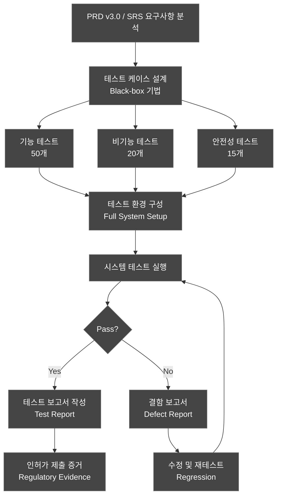
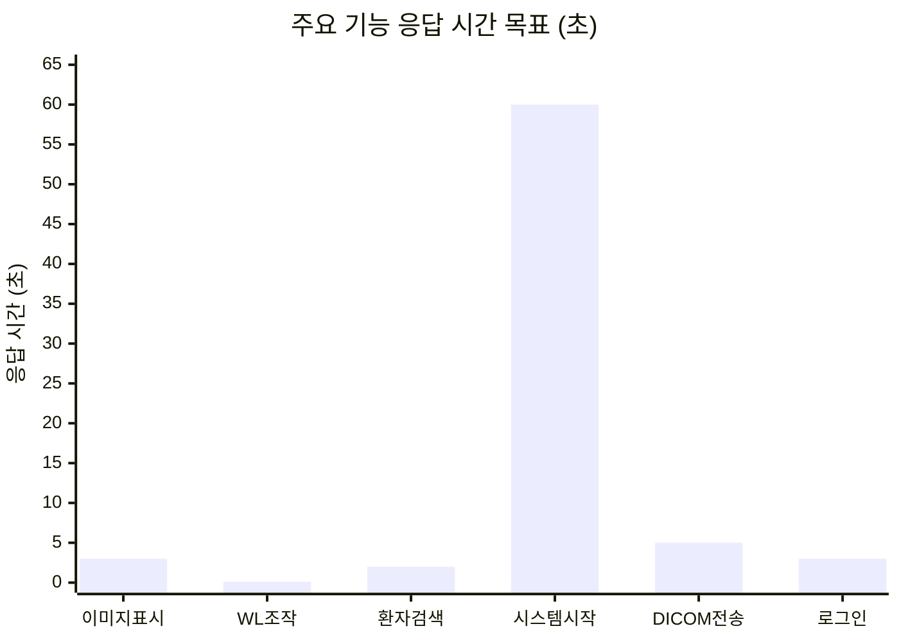
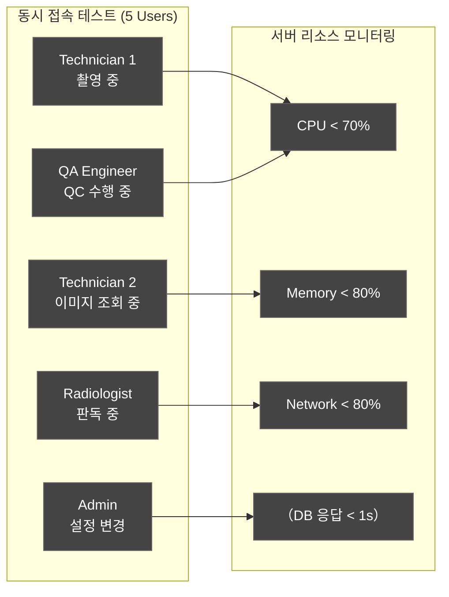
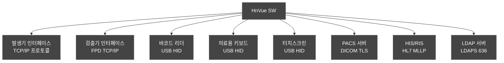
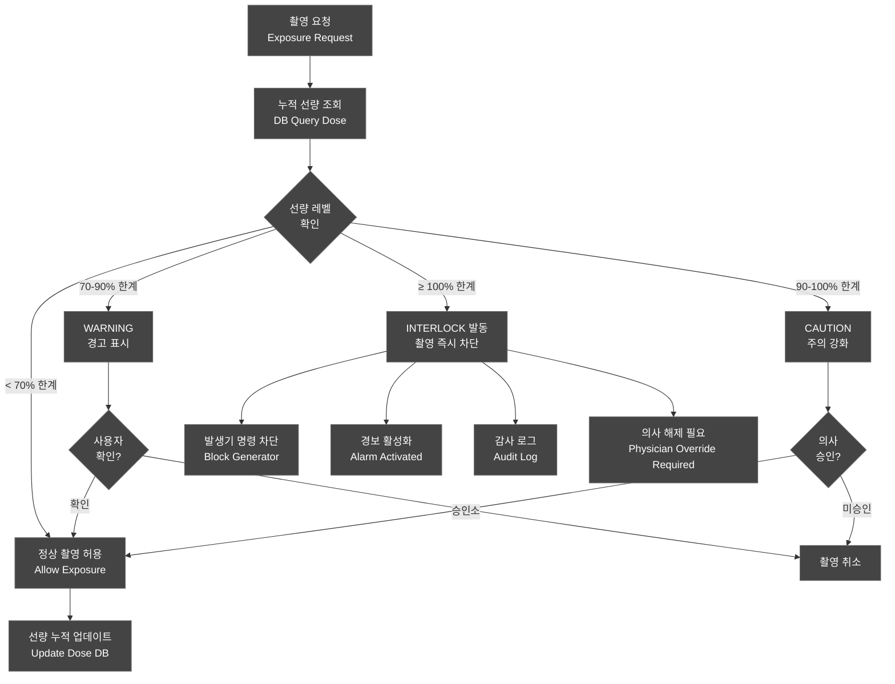
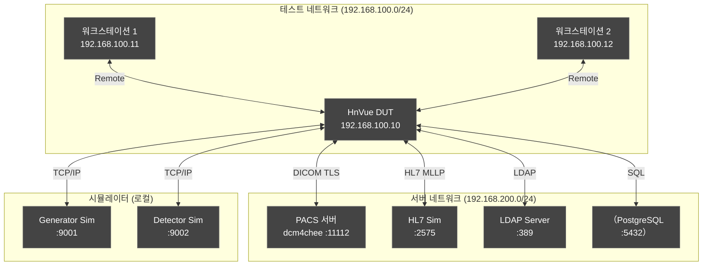
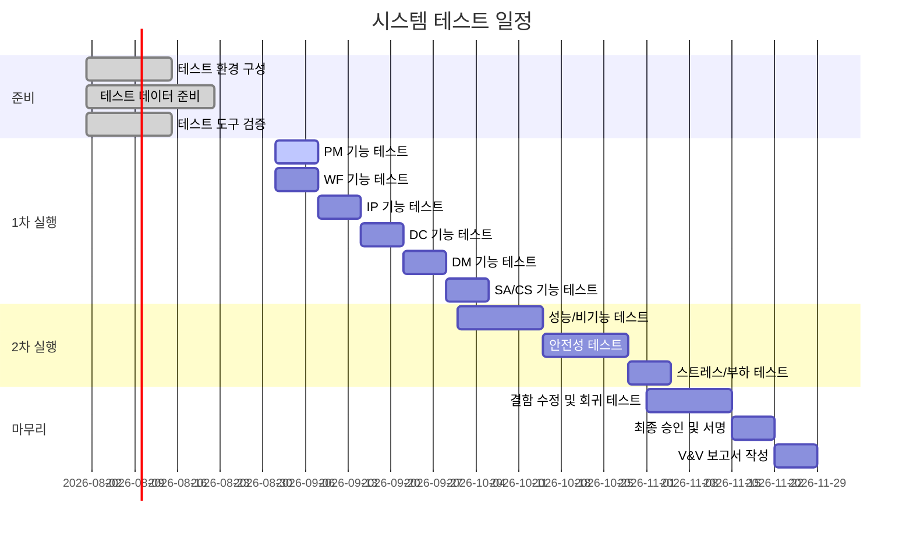

# 시스템 테스트 계획서 (System Test Plan)

---

## 문서 메타데이터 (Document Metadata)

| 항목 | 내용 |
|------|------|
| **문서 ID** | STP-XRAY-GUI-001 |
| **버전 (Version)** | v1.0 |
| **제품명 (Product)** | HnVue Console SW |
| **작성일 (Date)** | 2026-03-18 |
| **작성자 (Author)** | SW QA팀 (SW QA Team) |
| **검토자 (Reviewer)** | SW 개발 팀장 / RA Manager |
| **승인자 (Approver)** | 제품 책임자 (Product Owner) |
| **상태 (Status)** | Draft |
| **기준 규격** | IEC 62304:2006+AMD1:2015 §5.7 |
| **관련 문서** | PRD-XRAY-GUI-001 v3.0, SRS-XRAY-GUI-001, SAD-XRAY-GUI-001 |

### 개정 이력 (Revision History)

| 버전 | 날짜 | 작성자 | 변경 내용 |
|------|------|--------|-----------|
| v0.1 | 2026-02-20 | QA팀 | 초안 작성 |
| v1.0 | 2026-03-18 | QA팀 | 공식 발행 |

---

## 목차 (Table of Contents)

1. 목적 및 범위 (Purpose and Scope)
2. 참조 문서 (Reference Documents)
3. 테스트 전략 (Test Strategy)
4. 시스템 테스트 케이스 목록 (System Test Cases)
5. 성능 테스트 항목 (Performance Test Items)
6. 호환성 테스트 (Compatibility Test)
7. 안전성 테스트 (Safety Test — Dose Interlock)
8. 스트레스/부하 테스트 (Stress/Load Test)
9. 테스트 환경 (Test Environment)
10. 테스트 일정 (Test Schedule)

---

련 문서 (Related Documents)

| 문서 ID | 문서명 | 관계 |
|---------|--------|------|
| DOC-005 | 소프트웨어 요구사항 명세서 (SRS) | 시스템 시험 요구사항 출처 |
| DOC-011 | V&V 마스터 플랜 | 상위 시험 전략 및 시스템 시험 레벨 정의 |
| DOC-002 | 제품 요구사항 정의서 (PRD) | 시스템 수준 요구사항 참조 |

## 1.

## 1. 목적 및 범위 (Purpose and Scope)

### 1.1 목적

본 문서는 HnVue Console Software의 시스템 테스트 계획을 정의한다. IEC 62304:2006+AMD1:2015 §5.7 "소프트웨어 시스템 테스트 (Software System Testing)" 요구사항을 충족하기 위해 **전체 시스템 요구사항(PRD v3.0, SRS/FRS)** 에 대한 블랙박스(Black-box) 검증을 수행한다.

**Purpose:** Define system test plan to verify all system-level requirements (PRD v3.0, SRS) per IEC 62304 §5.7 using Black-box testing methodology.

### 1.2 범위

| 카테고리 | 케이스 수 | 설명 |
|----------|---------|------|
| **기능 테스트 (Functional)** | 50개 | PRD/SWR 기능 요구사항 검증 |
| **비기능 테스트 (Non-functional)** | 20개 | 성능, 호환성, 사용성 |
| **안전성 테스트 (Safety)** | 15개 | Dose Interlock, 안전 인터락 |
| **합계** | **85개+** | |

### 1.3 블랙박스 테스트 접근법

- **블랙박스(Black-box)**: 내부 구현을 알지 못한 상태에서 입력/출력 기반 검증
- **요구사항 기반**: PRD v3.0 및 SRS 요구사항 ID 기준 추적성 확보
- **시나리오 기반**: 실제 임상 워크플로우 시나리오 적용
- **경계값/동등분할**: 입력 범위의 경계 및 동등 클래스 커버

---

## 2. 참조 문서 (Reference Documents)

| 문서 ID | 문서명 | 버전 |
|---------|--------|------|
| IEC 62304:2006+AMD1:2015 | Medical Device Software — Software Life Cycle Processes | - |
| PRD-XRAY-GUI-001 | Product Requirements Document (제품 요구사항 문서) | v3.0 |
| SRS-XRAY-GUI-001 | Software Requirements Specification (SRS/FRS) | v3.0 |
| SAD-XRAY-GUI-001 | Software Architecture Design | v1.0 |
| ISO 14971:2019 | Risk Management for Medical Devices | - |
| IEC 62366-1:2015+AMD1:2020 | Usability Engineering | - |
| FDA 21 CFR Part 820.30 | Design Controls | - |
| IEC 60601-1 | Safety requirements for medical electrical equipment | 3rd Ed. |
| DICOM PS3.x | Digital Imaging and Communications in Medicine | 2023 |
| UTP-XRAY-GUI-001 | Unit Test Plan (DOC-012) | v1.0 |
| ITP-XRAY-GUI-001 | Integration Test Plan (DOC-013) | v1.0 |

---

## 3. 테스트 전략 (Test Strategy)

### 3.1 블랙박스 테스트 전략

### 3.2 테스트 케이스 설계 기법

| 기법 | 적용 케이스 | 비율 |
|------|-----------|------|
| 요구사항 기반 (Requirements-Based) | 전체 | 100% |
| 경계값 분석 (Boundary Value Analysis) | 입력 범위 존재 케이스 | 40% |
| 동등분할 (Equivalence Partitioning) | 입력 카테고리 케이스 | 30% |
| 시나리오 기반 (Scenario-Based) | 워크플로우 케이스 | 50% |
| 오류 추측 (Error Guessing) | 안전성/경계 케이스 | 20% |

---

## 4. 시스템 테스트 케이스 목록 (System Test Cases)

### 4.1 기능 테스트 — PM (Patient Management / 환자 관리) (10개)

| ST ID | 대상 PR/SWR | 테스트명 | 테스트 시나리오 | 사전조건 | 단계 | 예상결과 | Pass/Fail |
|-------|-----------|---------|--------------|---------|------|---------|---------|
| ST-PM-001 | PR-001 / SWR-PM-001 | 신규 환자 등록 정상 흐름 | 방사선사가 신규 환자를 수동 등록 | 시스템 정상 가동, 사용자 로그인 완료 | 1) 환자관리 메뉴 선택 2) 신규 등록 클릭 3) 정보 입력 후 저장 | 환자 등록 완료, ID 자동 생성, DB 저장 확인 | ☐ Pass / ☐ Fail |
| ST-PM-002 | PR-001 / SWR-PM-002 | 환자 검색 — 이름 검색 | 기존 환자 이름으로 검색 | 환자 DB 50명 사전 입력 | 1) 검색창에 이름 입력 2) 검색 실행 | 매칭 환자 목록 표시, 응답 < 2초 | ☐ Pass / ☐ Fail |
| ST-PM-003 | PR-001 / SWR-PM-003 | 환자 정보 수정 이력 관리 | 환자 정보 수정 후 이력 조회 | 환자 P001 등록 완료 | 1) 환자 선택 2) 정보 수정 3) 이력 탭 확인 | 수정 이력 기록 (변경 전/후, 담당자, 시간) | ☐ Pass / ☐ Fail |
| ST-PM-004 | PR-002 / SWR-PM-005 | Modality Worklist 자동 수신 | RIS에서 전송한 MWL 자동 표시 | HIS/RIS 시뮬레이터 연결, 오더 입력 | 1) 오더 전송 (HIS Sim) 2) MWL 화면 확인 | 30초 내 MWL 항목 자동 표시 | ☐ Pass / ☐ Fail |
| ST-PM-005 | PR-002 / SWR-PM-010 | 잘못된 환자 ID 입력 차단 | 올바르지 않은 ID 형식 입력 | 로그인 완료 | 1) 잘못된 형식 ID 입력 2) 저장 시도 | 오류 메시지 표시, 저장 차단 | ☐ Pass / ☐ Fail |
| ST-PM-006 | PR-003 / SWR-PM-015 | 환자 스터디 이력 조회 | 환자의 전체 검사 이력 확인 | 환자에 스터디 5개 연결 | 1) 환자 선택 2) 스터디 이력 탭 | 시간순 스터디 목록, 썸네일 표시 | ☐ Pass / ☐ Fail |
| ST-PM-007 | PR-001 / SWR-PM-020 | 환자 정보 삭제 제한 | 스터디 있는 환자 삭제 시도 | 환자에 스터디 연결 | 1) 환자 선택 2) 삭제 시도 | "삭제 불가: 연계 스터디 존재" 메시지 | ☐ Pass / ☐ Fail |
| ST-PM-008 | PR-002 / SWR-PM-025 | 긴급 환자 등록 — 정보 최소화 | 응급 상황에서 최소 정보로 빠른 등록 | 긴급 모드 활성화 | 1) 긴급 등록 버튼 2) 최소 필드 입력 3) 저장 | 15초 내 등록 완료, 나중에 정보 추가 가능 | ☐ Pass / ☐ Fail |
| ST-PM-009 | PR-003 / SWR-PM-030 | 환자 바코드 스캔 입력 | 바코드 리더로 환자 ID 입력 | USB 바코드 리더 연결 | 1) 바코드 스캔 2) 환자 자동 검색 | 바코드 데이터로 환자 자동 조회 | ☐ Pass / ☐ Fail |
| ST-PM-010 | PR-004 / SWR-PM-035 | 환자 데이터 내보내기 — CSV | 환자 목록 CSV 파일 내보내기 | Admin 권한 로그인 | 1) 환자 목록 선택 2) Export → CSV | 암호화된 CSV 다운로드, PHI 포함 여부 확인 | ☐ Pass / ☐ Fail |

### 4.2 기능 테스트 — WF (Acquisition Workflow / 촬영 워크플로우) (10개)

| ST ID | 대상 PR/SWR | 테스트명 | 테스트 시나리오 | 사전조건 | 단계 | 예상결과 | Pass/Fail |
|-------|-----------|---------|--------------|---------|------|---------|---------|
| ST-WF-001 | PR-010 / SWR-WF-001 | 전체 촬영 워크플로우 — 흉부 AP | 환자 선택 → 파라미터 설정 → 촬영 → 이미지 확인 | 환자 P001, 검출기/발생기 준비 | 1) 환자 선택 2) Chest AP 선택 3) 파라미터 확인 4) 촬영 5) 이미지 확인 | 전체 흐름 성공, DICOM 이미지 생성 | ☐ Pass / ☐ Fail |
| ST-WF-002 | PR-010 / SWR-WF-002 | 촬영 파라미터 kV 상한 경계값 | kV 최대값(150) 설정 후 촬영 | 파라미터 설정 화면 | 1) kV=150 설정 2) 촬영 실행 | 촬영 허용, 경고 없음 | ☐ Pass / ☐ Fail |
| ST-WF-003 | PR-010 / SWR-WF-001 | 촬영 파라미터 kV 초과 차단 (Safety) | kV 한계 초과 입력 차단 | 파라미터 설정 화면 | 1) kV=151 입력 시도 | 입력 차단, "허용 범위 초과" 메시지 | ☐ Pass / ☐ Fail |
| ST-WF-004 | PR-011 / SWR-WF-010 | 신체 부위별 기본 파라미터 자동 설정 | 신체 부위 선택 시 파라미터 자동 로드 | 프로토콜 DB 구성 완료 | 1) 신체 부위 선택 (Chest AP) 2) 파라미터 확인 | kV/mAs 자동 설정, 범위 내 | ☐ Pass / ☐ Fail |
| ST-WF-005 | PR-012 / SWR-WF-015 | 재촬영 기능 | 첫 촬영 후 재촬영 요청 | 첫 번째 촬영 완료 | 1) 재촬영 버튼 클릭 2) 재촬영 수행 | 기존 이미지 보존, 새 이미지 추가 저장 | ☐ Pass / ☐ Fail |
| ST-WF-006 | PR-013 / SWR-WF-020 | 촬영 이벤트 감사 로그 | 모든 촬영 동작 감사 기록 | 로그인 완료 | 1) 촬영 수행 2) 감사 로그 조회 | 촬영 시작/종료/파라미터 로그 기록 | ☐ Pass / ☐ Fail |
| ST-WF-007 | PR-014 / SWR-WF-025 | AED (자동 노출 제어) 모드 | AED 모드에서 자동 파라미터 조정 | AED 활성화 설정 | 1) AED 모드 활성화 2) 촬영 수행 | AED가 최적 파라미터로 자동 조정 | ☐ Pass / ☐ Fail |
| ST-WF-008 | PR-010 / SWR-WF-030 | 촬영 중단 — 응급 정지 | 촬영 중 즉시 정지 | 촬영 진행 중 | 1) 촬영 중 정지 버튼 2) 상태 확인 | 즉시 정지, 발생기 중단 명령 전송 | ☐ Pass / ☐ Fail |
| ST-WF-009 | PR-015 / SWR-WF-035 | 워크플로우 상태 표시 | 상태 바에서 현재 단계 표시 | 촬영 진행 중 | 1) 각 단계 수행 2) 상태 바 확인 | 단계별 상태 명확히 표시 | ☐ Pass / ☐ Fail |
| ST-WF-010 | PR-010 / SWR-WF-040 | 다중 시리즈 촬영 | 동일 환자 다중 부위 연속 촬영 | 환자 선택 완료 | 1) Chest AP 촬영 2) Chest LAT 촬영 3) Abdomen AP 촬영 | 3개 시리즈 각각 저장, 스터디 연결 | ☐ Pass / ☐ Fail |

### 4.3 기능 테스트 — IP (Image Processing / 영상 처리) (8개)

| ST ID | 대상 PR/SWR | 테스트명 | 테스트 시나리오 | 사전조건 | 단계 | 예상결과 | Pass/Fail |
|-------|-----------|---------|--------------|---------|------|---------|---------|
| ST-IP-001 | PR-020 / SWR-IP-001 | 윈도우/레벨 조작 | 마우스 드래그로 WL 조정 | 이미지 표시 중 | 1) 마우스 우클릭+드래그 2) WL 값 변화 확인 | 실시간 이미지 반응, WL 수치 표시 | ☐ Pass / ☐ Fail |
| ST-IP-002 | PR-021 / SWR-IP-002 | 이미지 회전/반전 | 이미지 방향 조작 | 이미지 표시 중 | 1) 회전 버튼 클릭 (90°) 2) 반전 버튼 클릭 | 이미지 정확히 회전/반전, 픽셀 손실 없음 | ☐ Pass / ☐ Fail |
| ST-IP-003 | PR-022 / SWR-IP-003 | 디지털 줌 — 최대 16× | 이미지 확대 최대값 | 이미지 표시 중 | 1) 스크롤로 줌 인 2) 16× 달성 확인 | 최대 16× 확대, 픽셀 아티팩트 없음 | ☐ Pass / ☐ Fail |
| ST-IP-004 | PR-023 / SWR-IP-010 | 측정 도구 — 길이 측정 | 2점 간 거리 측정 | 이미지 표시 중, 픽셀 간격 설정 | 1) 측정 도구 선택 2) 2점 클릭 3) 측정값 확인 | 측정값(mm) 표시, 오차 ±5% | ☐ Pass / ☐ Fail |
| ST-IP-005 | PR-024 / SWR-IP-011 | 측정 도구 — 각도 측정 | 각도 측정 기능 | 이미지 표시 중 | 1) 각도 도구 선택 2) 3점 클릭 | 각도값(°) 표시, 오차 ±1° | ☐ Pass / ☐ Fail |
| ST-IP-006 | PR-025 / SWR-IP-015 | 이미지 내보내기 — DICOM | 이미지 DICOM 파일로 내보내기 | 이미지 표시 중 | 1) 내보내기 메뉴 2) DICOM 선택 3) 저장 위치 지정 | 유효한 DICOM 파일 저장 | ☐ Pass / ☐ Fail |
| ST-IP-007 | PR-026 / SWR-IP-020 | 이미지 비교 — 2-up 레이아웃 | 이전/현재 이미지 나란히 비교 | 동일 환자 2개 이미지 | 1) 2-up 레이아웃 선택 2) 이미지 2개 로드 | 나란히 표시, 독립적 WL 조정 | ☐ Pass / ☐ Fail |
| ST-IP-008 | PR-027 / SWR-IP-025 | 영상 처리 프리셋 적용 | 신체 부위별 최적 처리 프리셋 | 프리셋 DB 구성 | 1) Chest AP 이미지 로드 2) 프리셋 적용 | 최적화된 WL, LUT 자동 적용 | ☐ Pass / ☐ Fail |

### 4.4 기능 테스트 — DM (Dose Management / 선량 관리) (5개)

| ST ID | 대상 PR/SWR | 테스트명 | 테스트 시나리오 | 사전조건 | 단계 | 예상결과 | Pass/Fail |
|-------|-----------|---------|--------------|---------|------|---------|---------|
| ST-DM-001 | PR-040 / SWR-DM-001 | 촬영 선량 자동 계산 | 촬영 후 DAP 자동 계산 및 표시 | 촬영 완료 | 1) 촬영 수행 2) 선량 정보 패널 확인 | DAP 값 자동 표시, 단위(mGy·cm²) | ☐ Pass / ☐ Fail |
| ST-DM-002 | PR-041 / SWR-DM-015 | DICOM RDSR 자동 전송 | 촬영 완료 시 선량 보고서 자동 생성/전송 | PACS 연결 완료 | 1) 촬영 수행 2) PACS에서 RDSR 확인 | RDSR DICOM 파일 PACS에 자동 전송 | ☐ Pass / ☐ Fail |
| ST-DM-003 | PR-042 / SWR-DM-020 | 선량 경고 알림 표시 | 누적 선량 70% 임계값 경고 | 누적 선량 설정 | 1) 반복 촬영으로 70% 도달 2) 경고 표시 확인 | WARNING 아이콘, 팝업 메시지 표시 | ☐ Pass / ☐ Fail |
| ST-DM-004 | PR-043 / SWR-DM-025 | 소아 선량 한계 자동 조정 | 소아 환자 등록 시 선량 한계 자동 감소 | 5세 환자 등록 | 1) 소아 환자 선택 2) 선량 한계 확인 | 성인 한계의 50% 자동 적용 | ☐ Pass / ☐ Fail |
| ST-DM-005 | PR-044 / SWR-DM-030 | 선량 보고서 — 기간별 조회 | 월별/분기별 선량 통계 조회 | 1개월치 촬영 데이터 | 1) 보고서 메뉴 2) 기간 설정 3) 조회 | 통계 테이블 및 차트 표시, CSV 내보내기 | ☐ Pass / ☐ Fail |

### 4.5 기능 테스트 — DC (DICOM/Communication) (7개)

| ST ID | 대상 PR/SWR | 테스트명 | 테스트 시나리오 | 사전조건 | 단계 | 예상결과 | Pass/Fail |
|-------|-----------|---------|--------------|---------|------|---------|---------|
| ST-DC-001 | PR-050 / SWR-DC-010 | 자동 DICOM 전송 — 촬영 후 | 촬영 완료 시 PACS 자동 전송 | PACS 설정 완료 | 1) 촬영 수행 2) PACS 전송 상태 확인 | 60초 내 PACS 전송 완료, Status=SUCCESS | ☐ Pass / ☐ Fail |
| ST-DC-002 | PR-050 / SWR-DC-020 | Worklist 자동 갱신 | 5분마다 MWL 자동 조회 | MWL 서버 연결 | 1) 새 오더 추가 (HIS Sim) 2) 5분 대기 3) MWL 화면 확인 | 새 오더 자동 반영 | ☐ Pass / ☐ Fail |
| ST-DC-003 | PR-051 / SWR-DC-030 | DICOM 이미지 원격 조회 | 타 장치 촬영 이미지 조회 | PACS에 이미지 저장 | 1) C-FIND로 스터디 검색 2) C-MOVE로 이미지 가져오기 3) 표시 확인 | 이미지 조회 및 표시 성공 | ☐ Pass / ☐ Fail |
| ST-DC-004 | PR-052 / SWR-DC-040 | HL7 환자 동기화 | HIS에서 환자 정보 변경 시 동기화 | HIS Sim 연결 | 1) HIS에서 환자 정보 수정 2) HnVue 확인 | 변경 사항 자동 반영 (30초 내) | ☐ Pass / ☐ Fail |
| ST-DC-005 | PR-053 / SWR-DC-050 | DICOM Echo 연결 테스트 | 관리자 화면에서 DICOM Echo 수행 | PACS 설정 | 1) 설정 → DICOM 설정 2) Echo 테스트 버튼 | SUCCESS 메시지, 응답 시간 표시 | ☐ Pass / ☐ Fail |
| ST-DC-006 | PR-054 / SWR-DC-055 | 전송 실패 자동 재전송 | 네트워크 오류 후 자동 재전송 | 네트워크 일시 차단 | 1) 네트워크 차단 2) 촬영 수행 3) 네트워크 복구 4) 전송 확인 | 큐에 대기 후 자동 재전송 성공 | ☐ Pass / ☐ Fail |
| ST-DC-007 | PR-055 / SWR-DC-060 | DICOM 암호화 전송 검증 | TLS 암호화 통신 활성화 | TLS 설정 완료 | 1) 패킷 캡처 시작 2) 이미지 전송 3) 패킷 분석 | 평문 데이터 없음, TLS 1.3 협상 확인 | ☐ Pass / ☐ Fail |

### 4.6 기능 테스트 — SA/CS (System Admin / Cybersecurity) (10개)

| ST ID | 대상 PR/SWR | 테스트명 | 테스트 시나리오 | 사전조건 | 단계 | 예상결과 | Pass/Fail |
|-------|-----------|---------|--------------|---------|------|---------|---------|
| ST-SA-001 | PR-060 / SWR-SA-010 | 사용자 계정 관리 | Admin이 신규 사용자 생성 | Admin 로그인 | 1) 사용자 관리 메뉴 2) 신규 사용자 생성 3) 역할 할당 | 사용자 생성, 역할 할당 완료 | ☐ Pass / ☐ Fail |
| ST-SA-002 | PR-061 / SWR-SA-020 | 시스템 설정 백업/복원 | 설정 백업 후 초기화 후 복원 | Admin 로그인 | 1) 백업 실행 2) 설정 초기화 3) 백업 복원 | 설정 완전 복원 | ☐ Pass / ☐ Fail |
| ST-SA-003 | PR-062 / SWR-SA-030 | 감사 로그 조회 — 기간별 필터 | 감사 로그 기간 필터링 | 30일치 감사 로그 | 1) 감사 로그 메뉴 2) 기간 필터 설정 3) 조회 | 해당 기간 로그만 표시, 내보내기 가능 | ☐ Pass / ☐ Fail |
| ST-SA-004 | PR-063 / SWR-SA-040 | 일일 QC — 자동 실행 | 시스템 시작 시 QC 자동 실행 | 시스템 재시작 | 1) 시스템 전원 켬 2) QC 진행 확인 | QC 자동 시작, 결과 표시 (Pass/Fail) | ☐ Pass / ☐ Fail |
| ST-SA-005 | PR-063 / SWR-SA-041 | QC 실패 시 촬영 차단 | QC 실패 시 촬영 기능 비활성화 | QC 실패 시나리오 | 1) QC 강제 실패 설정 2) 촬영 시도 | 촬영 버튼 비활성화, "QC 실패" 표시 | ☐ Pass / ☐ Fail |
| ST-CS-001 | PR-070 / SWR-CS-001 | 사용자 로그인 — 정상 | 유효한 자격증명으로 로그인 | 사용자 계정 등록 | 1) ID/PW 입력 2) 로그인 버튼 | 로그인 성공, 역할별 대시보드 표시 | ☐ Pass / ☐ Fail |
| ST-CS-002 | PR-070 / SWR-CS-002 | 계정 잠금 — 5회 실패 | 연속 5회 로그인 실패 | 활성 계정 | 1) 5회 연속 잘못된 PW 입력 | 5회째 계정 잠금, 잠금 메시지 표시 | ☐ Pass / ☐ Fail |
| ST-CS-003 | PR-071 / SWR-CS-010 | 자동 세션 만료 | 비활성 30분 후 자동 로그아웃 | 로그인 완료 | 1) 30분간 비활성 2) 임의 동작 시도 | 자동 로그아웃, 재인증 화면 표시 | ☐ Pass / ☐ Fail |
| ST-CS-004 | PR-072 / SWR-CS-030 | 역할별 메뉴 접근 제어 | Technician 역할 시스템 관리 메뉴 접근 차단 | Technician 로그인 | 1) 시스템 관리 메뉴 접근 시도 | 메뉴 비표시 또는 접근 거부 | ☐ Pass / ☐ Fail |
| ST-CS-005 | PR-073 / SWR-CS-040 | 저장 데이터 암호화 검증 | DB 파일 직접 접근 시 데이터 암호화 확인 | 테스트 환경 | 1) DB 파일 직접 열기 시도 2) 데이터 내용 확인 | PHI 데이터 암호화(AES-256), 평문 없음 | ☐ Pass / ☐ Fail |

### 4.7 비기능 테스트 — 성능 (Performance) (10개)

| ST ID | 대상 PR/SWR | 테스트명 | 테스트 시나리오 | 사전조건 | 단계 | 예상결과 | Pass/Fail |
|-------|-----------|---------|--------------|---------|------|---------|---------|
| ST-PF-001 | PR-100 / SWR-NF-001 | 이미지 표시 속도 | 촬영 완료 후 이미지 표시 시간 | 정상 시스템, 표준 이미지 | 1) 촬영 완료 2) 이미지 표시 시간 측정 | **< 3초** 내 이미지 표시 | ☐ Pass / ☐ Fail |
| ST-PF-002 | PR-100 / SWR-NF-002 | WL 조작 응답 속도 | 마우스 조작 → 이미지 업데이트 | 이미지 표시 중 | 1) WL 조작 2) 업데이트 시간 측정 | **< 100ms** 응답 | ☐ Pass / ☐ Fail |
| ST-PF-003 | PR-101 / SWR-NF-003 | 환자 검색 응답 시간 | 5만 건 DB에서 환자 검색 | 50,000명 환자 DB | 1) 이름 검색 2) 응답 시간 측정 | **< 2초** 내 결과 반환 | ☐ Pass / ☐ Fail |
| ST-PF-004 | PR-102 / SWR-NF-004 | DICOM 전송 처리량 | 연속 이미지 전송 처리량 | PACS 연결, 1GB 이미지 준비 | 1) 100장 연속 전송 2) 처리량 측정 | **≥ 100 Mbps** 전송 속도 | ☐ Pass / ☐ Fail |
| ST-PF-005 | PR-103 / SWR-NF-005 | 시스템 시작 시간 | 소프트웨어 시작 → 운용 준비 | 정상 PC 사양 | 1) SW 시작 2) 운용 준비 시간 측정 | **< 60초** 내 운용 준비 | ☐ Pass / ☐ Fail |
| ST-PF-006 | PR-104 / SWR-NF-006 | 동시 사용자 지원 | 다중 워크스테이션 동시 접속 | 5개 워크스테이션 설정 | 1) 5개 워크스테이션 동시 접속 2) 각 응답 시간 측정 | **5개 동시 접속**, 성능 저하 < 10% | ☐ Pass / ☐ Fail |
| ST-PF-007 | PR-105 / SWR-NF-007 | 메모리 사용량 | 장시간 운용 시 메모리 누수 | 시스템 준비 완료 | 1) 8시간 연속 운용 2) 1시간 간격 메모리 측정 | 메모리 증가 없음 (누수 없음) | ☐ Pass / ☐ Fail |
| ST-PF-008 | PR-100 / SWR-NF-008 | 대용량 이미지 처리 | 16-bit 4K 이미지 처리 속도 | 4K 테스트 이미지 | 1) 4K 이미지 로드 2) WL 조작 3) 응답 시간 측정 | WL 응답 **< 200ms** | ☐ Pass / ☐ Fail |
| ST-PF-009 | PR-106 / SWR-NF-009 | CPU 사용률 기준 | 평상시 CPU 사용률 | 정상 운용 중 | 1) 일반 운용 30분 2) CPU 모니터링 | **평균 < 50% CPU** | ☐ Pass / ☐ Fail |
| ST-PF-010 | PR-107 / SWR-NF-010 | 디스크 I/O 성능 | 이미지 저장/로드 I/O 속도 | SSD 환경 | 1) 100장 이미지 저장 2) 로드 시간 측정 | 저장 **< 1초/장**, 로드 **< 0.5초/장** | ☐ Pass / ☐ Fail |

### 4.8 비기능 테스트 — 사용성/호환성 (Usability/Compatibility) (10개)

| ST ID | 대상 PR/SWR | 테스트명 | 테스트 시나리오 | 사전조건 | 단계 | 예상결과 | Pass/Fail |
|-------|-----------|---------|--------------|---------|------|---------|---------|
| ST-CP-001 | PR-110 / SWR-NF-020 | 운영 체제 호환성 — Windows 10 | Windows 10 환경 정상 동작 | Windows 10 22H2 | 1) SW 설치 2) 전체 기능 테스트 | 모든 기능 정상 동작 | ☐ Pass / ☐ Fail |
| ST-CP-002 | PR-110 / SWR-NF-021 | 운영 체제 호환성 — Windows 11 | Windows 11 환경 정상 동작 | Windows 11 23H2 | 1) SW 설치 2) 전체 기능 테스트 | 모든 기능 정상 동작 | ☐ Pass / ☐ Fail |
| ST-CP-003 | PR-111 / SWR-NF-022 | 해상도 호환성 — 1920×1080 | FHD 해상도 정상 표시 | 1920×1080 모니터 | 1) SW 시작 2) 각 화면 확인 | 레이아웃 깨짐 없음, 텍스트 가독성 확인 | ☐ Pass / ☐ Fail |
| ST-CP-004 | PR-111 / SWR-NF-023 | 해상도 호환성 — 2560×1440 | QHD 해상도 정상 표시 | 2560×1440 모니터 | 1) SW 시작 2) 이미지 표시 확인 | 고해상도 이미지 선명하게 표시 | ☐ Pass / ☐ Fail |
| ST-CP-005 | PR-112 / SWR-NF-024 | 듀얼 모니터 지원 | 메인 + 서브 모니터 활용 | 듀얼 모니터 설정 | 1) SW 시작 (듀얼) 2) 이미지 서브 모니터로 이동 | 듀얼 모니터 정상 지원 | ☐ Pass / ☐ Fail |
| ST-CP-006 | PR-113 / SWR-NF-025 | 의료용 전용 키보드 호환성 | 방사선 방호 키보드 입력 | 의료용 키보드 연결 | 1) 키보드 연결 2) 모든 입력 테스트 | 모든 키 정상 동작 | ☐ Pass / ☐ Fail |
| ST-CP-007 | PR-114 / SWR-NF-026 | DICOM Viewer 호환성 | 타사 DICOM Viewer에서 저장 이미지 열기 | OsiriX, RadiAnt 설치 | 1) 이미지 저장 2) 타사 뷰어에서 열기 | 이미지 정상 표시 | ☐ Pass / ☐ Fail |
| ST-CP-008 | PR-115 / SWR-NF-027 | 다국어 지원 — 한국어 | 한국어 UI 전환 | 다국어 설정 | 1) 언어 설정 → 한국어 2) UI 확인 | 모든 UI 한국어 표시, 레이아웃 정상 | ☐ Pass / ☐ Fail |
| ST-CP-009 | PR-115 / SWR-NF-028 | 다국어 지원 — 영어 | 영어 UI 전환 | 다국어 설정 | 1) 언어 설정 → English 2) UI 확인 | 모든 UI 영어 표시, 레이아웃 정상 | ☐ Pass / ☐ Fail |
| ST-CP-010 | PR-116 / SWR-NF-029 | 터치스크린 지원 (선택) | 터치 입력으로 기본 기능 동작 | 터치스크린 모니터 | 1) 터치로 환자 선택 2) 터치로 WL 조작 | 터치 제스처 정상 동작 | ☐ Pass / ☐ Fail |

### 4.9 안전성 테스트 (Safety Test — Dose Interlock 포함) (15개)

| ST ID | 대상 PR/SWR | 테스트명 | 테스트 시나리오 | 사전조건 | 단계 | 예상결과 | Pass/Fail |
|-------|-----------|---------|--------------|---------|------|---------|---------|
| ST-SF-001 | PR-120 / SWR-SF-001 | **Dose Interlock — 한계 초과 차단** | 선량 한계 초과 시 촬영 즉시 차단 | 선량 한계 50mGy 설정 | 1) 누적 선량을 한계 이상으로 설정 2) 추가 촬영 시도 | **촬영 즉시 차단**, 경고 팝업, 로그 기록 | ☐ Pass / ☐ Fail |
| ST-SF-002 | PR-120 / SWR-SF-001 | **Dose Interlock — 경계값 경고** | 한계의 90% 도달 시 경고 | 선량 한계 설정 | 1) 누적 선량을 90%로 설정 2) 상태 확인 | **경고 아이콘**, "선량 주의" 메시지 | ☐ Pass / ☐ Fail |
| ST-SF-003 | PR-121 / SWR-SF-010 | **검출기 미준비 시 촬영 차단** | 검출기 미연결 상태에서 촬영 불가 | 검출기 연결 해제 | 1) 검출기 연결 해제 2) 촬영 시도 | **촬영 버튼 비활성화**, 상태 표시 | ☐ Pass / ☐ Fail |
| ST-SF-004 | PR-122 / SWR-SF-020 | **kV 상한 초과 입력 차단** | 허용 kV 초과 입력 차단 | 파라미터 입력 화면 | 1) kV=151 키보드 입력 시도 | **입력 차단**, 최대값(150) 자동 설정 | ☐ Pass / ☐ Fail |
| ST-SF-005 | PR-122 / SWR-SF-021 | **mAs 하한 미달 입력 차단** | 허용 최소 mAs 미달 차단 | 파라미터 입력 화면 | 1) mAs=0.0 입력 시도 | **입력 차단**, 최소값(0.1) 표시 | ☐ Pass / ☐ Fail |
| ST-SF-006 | PR-123 / SWR-SF-030 | **응급 정지 기능** | 촬영 중 즉시 중단 | 촬영 진행 중 | 1) 촬영 중 긴급 정지 버튼 클릭 2) 발생기 상태 확인 | **즉시 (<50ms) 정지**, 발생기 중단 확인 | ☐ Pass / ☐ Fail |
| ST-SF-007 | PR-124 / SWR-SF-040 | **QC 실패 시 시스템 잠금** | QC 실패 상태에서 진단 촬영 차단 | QC 강제 실패 설정 | 1) QC 실패 트리거 2) 촬영 시도 | **진단 촬영 차단**, QC 재수행 요구 | ☐ Pass / ☐ Fail |
| ST-SF-008 | PR-125 / SWR-SF-050 | **환자 ID 불일치 경고** | 선택된 환자와 워크리스트 불일치 | 워크리스트 항목 설정 | 1) 다른 환자 선택 후 촬영 시도 | **경고 팝업**, 환자 확인 요구 | ☐ Pass / ☐ Fail |
| ST-SF-009 | PR-126 / SWR-SF-060 | **소프트웨어 오류 시 안전 상태 전환** | 크리티컬 오류 발생 시 안전 상태 | 오류 주입 테스트 | 1) 크리티컬 오류 주입 2) 시스템 상태 확인 | **안전 상태(Safe State) 전환**, 오류 로그 | ☐ Pass / ☐ Fail |
| ST-SF-010 | PR-127 / SWR-SF-070 | **전원 차단 후 데이터 무결성** | 촬영 중 전원 차단 후 데이터 확인 | 촬영 진행 중 | 1) 촬영 중 전원 차단 시뮬레이션 2) 재시작 후 데이터 확인 | **저장된 이미지 무결성** 유지 | ☐ Pass / ☐ Fail |
| ST-SF-011 | PR-128 / SWR-SF-080 | **네트워크 단절 시 로컬 동작 유지** | PACS 연결 없이 로컬 촬영 가능 | 네트워크 차단 | 1) 네트워크 차단 2) 촬영 수행 3) 로컬 저장 확인 | 로컬 저장 성공, 복구 후 자동 전송 | ☐ Pass / ☐ Fail |
| ST-SF-012 | PR-129 / SWR-SF-090 | **Watchdog 타이머 — SW 행 감지** | SW 행(Hang) 시 자동 복구 | Watchdog 타이머 설정 | 1) SW 행 시뮬레이션 2) Watchdog 동작 확인 | **자동 재시작**, 안전 로그 기록 | ☐ Pass / ☐ Fail |
| ST-SF-013 | PR-130 / SWR-SF-100 | **소아 환자 과선량 이중 확인** | 소아 환자 선량 한계 초과 촬영 이중 확인 | 소아 환자(5세) 선택 | 1) 소아 환자 선택 2) 성인 파라미터 입력 | **이중 확인 팝업**, 강제 확인 요구 | ☐ Pass / ☐ Fail |
| ST-SF-014 | PR-131 / SWR-SF-110 | **방사선 노출 경고 표시** | 촬영 준비 중 방사선 경고 표시 | 촬영 파라미터 설정 완료 | 1) 촬영 준비 단계 확인 | **"방사선 주의" 경고 표시**, 명확히 보임 | ☐ Pass / ☐ Fail |
| ST-SF-015 | PR-132 / SWR-SF-120 | **감사 로그 불변성** | 감사 로그 수정/삭제 차단 | Admin 로그인 | 1) 감사 로그 수정 시도 2) 삭제 시도 | **수정/삭제 불가**, 오류 메시지 표시 | ☐ Pass / ☐ Fail |

**총 시스템 테스트 케이스: 85개** (기능: 50 + 비기능: 20 + 안전성: 15)

---

## 5. 성능 테스트 항목 (Performance Test Items)

### 5.1 응답 시간 (Response Time) 기준

| 기능 | 목표 응답 시간 | 측정 조건 | 허용 오차 |
|------|------------|---------|---------|
| 이미지 표시 (촬영 후) | < 3초 | 표준 14-bit 이미지, LAN | ±0.5초 |
| Window/Level 조작 | < 100ms | 드래그 입력 | ±20ms |
| 환자 검색 | < 2초 | 50,000명 DB | ±0.5초 |
| 로그인 인증 | < 3초 | 표준 네트워크 | ±1초 |
| PACS 전송 시작 | < 5초 | 1 Gbps LAN | ±1초 |
| 시스템 시작 | < 60초 | 권장 사양 PC | ±10초 |
| WL 프리셋 적용 | < 500ms | 저장된 프리셋 | ±100ms |

### 5.2 처리량 (Throughput) 기준

| 항목 | 목표값 | 측정 조건 |
|------|-------|---------|
| DICOM 전송 속도 | ≥ 100 Mbps | 1 Gbps LAN, 표준 이미지 |
| 이미지 처리 속도 | ≥ 10 frames/sec | 14-bit 이미지 연속 처리 |
| 동시 PACS 연결 수 | ≥ 3개 | 동시 C-STORE |
| 동시 사용자 수 | ≥ 5명 | 5개 워크스테이션 |

### 5.3 동시 접속 테스트 시나리오

---

## 6. 호환성 테스트 (Compatibility Test)

### 6.1 운영 체제 호환성 매트릭스

| OS | 버전 | 아키텍처 | 지원 여부 | 테스트 결과 |
|----|------|---------|---------|-----------|
| Windows 10 | 22H2 (Build 19045) | x64 | 필수 | ☐ |
| Windows 11 | 23H2 (Build 22631) | x64 | 필수 | ☐ |
| Windows 10 LTSC | 2021 | x64 | 선택 | ☐ |

### 6.2 해상도 호환성 매트릭스

| 해상도 | 비율 | 지원 여부 | 테스트 결과 |
|--------|------|---------|-----------|
| 1920×1080 | 16:9 | 최소 요구 | ☐ |
| 2560×1440 | 16:9 | 권장 | ☐ |
| 3840×2160 (4K) | 16:9 | 지원 | ☐ |
| 1920×1200 | 16:10 | 지원 | ☐ |

### 6.3 하드웨어 호환성

---

## 7. 안전성 테스트 — Dose Interlock 상세 (Safety Test — Dose Interlock Detail)

### 7.1 Dose Interlock 테스트 흐름도

### 7.2 Dose Interlock 경계값 테스트 매트릭스

| 테스트 | 누적 선량 | 한계 | 기대 동작 | 인터락 상태 |
|--------|---------|------|---------|-----------|
| ST-SF-INT-001 | 0 mGy | 50 mGy | 정상 촬영 허용 | CLEAR |
| ST-SF-INT-002 | 34 mGy | 50 mGy | 정상 촬영 허용 | CLEAR |
| ST-SF-INT-003 | 35 mGy | 50 mGy | WARNING 표시 (70%) | WARNING |
| ST-SF-INT-004 | 44.9 mGy | 50 mGy | WARNING 유지 | WARNING |
| ST-SF-INT-005 | 45 mGy | 50 mGy | CAUTION — 의사 승인 필요 (90%) | CAUTION |
| ST-SF-INT-006 | 49.9 mGy | 50 mGy | CAUTION 유지 | CAUTION |
| ST-SF-INT-007 | 50 mGy | 50 mGy | **INTERLOCK TRIGGERED** | **LOCKED** |
| ST-SF-INT-008 | 55 mGy | 50 mGy | **INTERLOCK TRIGGERED** | **LOCKED** |

---

## 8. 스트레스/부하 테스트 (Stress/Load Test)

### 8.1 스트레스 테스트 시나리오

| 시나리오 ID | 테스트명 | 지속 시간 | 부하 조건 | 합격 기준 |
|-----------|---------|---------|---------|---------|
| ST-LOAD-001 | **8시간 연속 운용** | 8시간 | 정상 사용 패턴 | 성능 저하 없음, 메모리 누수 없음 |
| ST-LOAD-002 | **최대 동시 사용자** | 1시간 | 5개 워크스테이션 동시 | 응답 시간 기준 준수 |
| ST-LOAD-003 | **최대 PACS 전송 부하** | 2시간 | 연속 100장 전송 × 10 회 | 전송 성공률 100% |
| ST-LOAD-004 | **DB 대용량 처리** | 30분 | 100만 건 조회 쿼리 | 쿼리 응답 < 5초 |
| ST-LOAD-005 | **네트워크 불안정 스트레스** | 1시간 | 패킷 손실 5%, 지연 100ms | 데이터 무결성 유지 |
| ST-LOAD-006 | **디스크 공간 최소 환경** | 30분 | 남은 공간 < 5 GB | 경고 표시, 동작 유지 |

### 8.2 스트레스 테스트 모니터링 지표

| 지표 | 측정 간격 | 허용 범위 |
|------|---------|---------|
| CPU 사용률 | 5분 | 평균 < 70%, 최대 < 90% |
| 메모리 사용량 | 5분 | 시간 경과에 따른 증가 없음 |
| 디스크 I/O | 1분 | 쓰기 속도 저하 < 20% |
| 네트워크 사용률 | 1분 | 대역폭 < 80% |
| 응답 시간 변화 | 각 요청 | 기준 대비 최대 30% 증가 허용 |

---

## 9. 테스트 환경 (Test Environment)

### 9.1 하드웨어 구성

| 구성 요소 | 사양 | 수량 | 용도 |
|---------|------|------|------|
| 테스트 PC (DUT) | Intel i9, RAM 32GB, SSD 1TB, Win11 | 1 | 주 테스트 대상 |
| 워크스테이션 (클라이언트) | Intel i7, RAM 16GB, Win10 | 4 | 동시 접속 테스트 |
| PACS 서버 | Intel Xeon, RAM 64GB, HDD 10TB | 1 | dcm4chee 실행 |
| 의료용 모니터 (2MP) | 2560×1600, IPS | 2 | 영상 표시 테스트 |
| 네트워크 스위치 | 1 Gbps Managed Switch | 1 | 네트워크 환경 |
| 네트워크 에뮬레이터 | tc netem / WANem | 1 | 네트워크 조건 시뮬레이션 |

### 9.2 소프트웨어 구성

| 소프트웨어 | 버전 | 용도 |
|-----------|------|------|
| HnVue Console | DUT | 테스트 대상 |
| dcm4chee-arc | 5.x (Docker) | PACS 시뮬레이터 |
| Mirth Connect | 4.x | HL7 시뮬레이터 |
| Wireshark | 4.x | 네트워크 패킷 분석 |
| JMeter | 5.x | 부하 테스트 도구 |
| DVTK (DICOM Toolkit) | 최신 | DICOM 검증 |
| Grafana + Prometheus | 최신 | 성능 모니터링 |

### 9.3 테스트 환경 구성도

---

## 10. 테스트 일정 (Test Schedule)

### 10.1 시스템 테스트 마일스톤

| 단계 | 기간 | 내용 | 산출물 |
|------|------|------|-------|
| **ST 준비** | M8 (4주) | 환경 구성, 테스트 데이터 준비, 도구 설치 | 환경 구성 보고서 |
| **ST 1차 실행** | M9-M10 (6주) | 기능 테스트 50개 실행 | ST 1차 결과 보고서 |
| **ST 2차 실행** | M10-M11 (4주) | 비기능/안전성 테스트 35개, 회귀 테스트 | ST 2차 결과 보고서 |
| **ST 완료/서명** | M11 말 | 결함 해결, 최종 승인 | ST 최종 보고서, V&V 보고서 |

### 10.2 시스템 테스트 전체 일정 (간트 차트)

### 10.3 테스트 역할 및 책임

| 역할 | 담당자 | 책임 |
|------|-------|------|
| **시스템 테스트 리더** | QA 팀장 | 전체 테스트 계획/조정, 최종 승인 |
| **기능 테스트 담당** | QA 엔지니어 2명 | 기능 테스트 50개 실행 |
| **성능 테스트 담당** | QA 엔지니어 1명 | 비기능/부하 테스트 20개 실행 |
| **안전성 테스트 담당** | QA 엔지니어 + RA | 안전성 테스트 15개 실행 |
| **DICOM 전문가** | SW 개발자 1명 | DICOM 통합 검증 지원 |
| **RA 담당자** | RA Manager | 인허가 관점 검토 및 승인 |

---

*본 문서는 IEC 62304 §5.7 요구사항에 따라 작성되었으며, FDA 510(k), CE MDR, KFDA 인허가 제출용 문서로 관리됩니다.*
*This document is prepared in accordance with IEC 62304 §5.7 requirements and managed as a regulatory submission document for FDA 510(k), CE MDR, and KFDA submissions.*

---
**문서 끝 (End of Document)** | STP-XRAY-GUI-001 v1.0 | 2026-03-18
