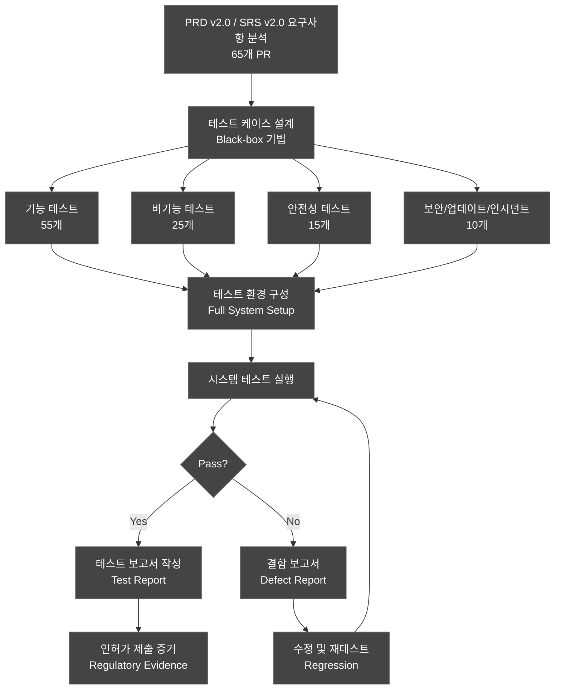
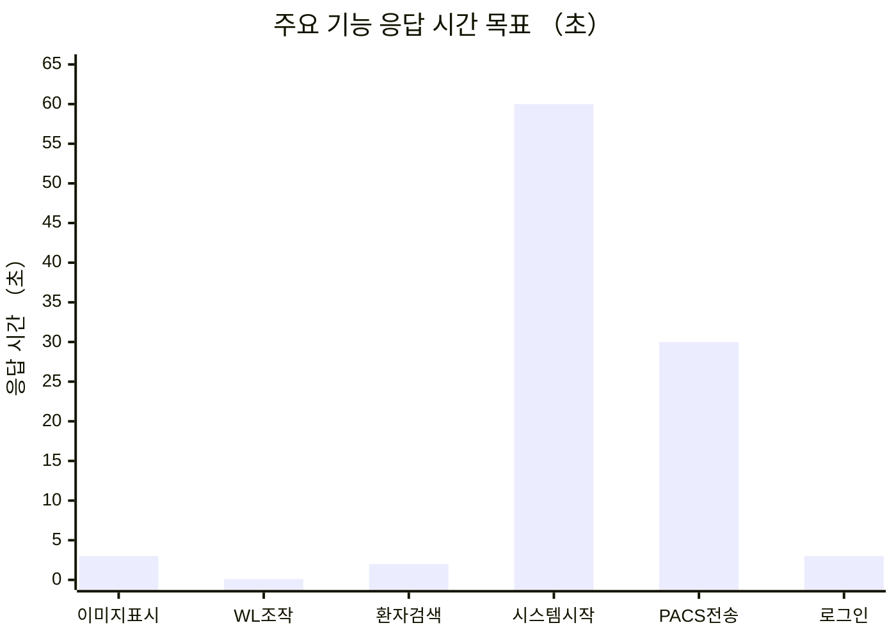
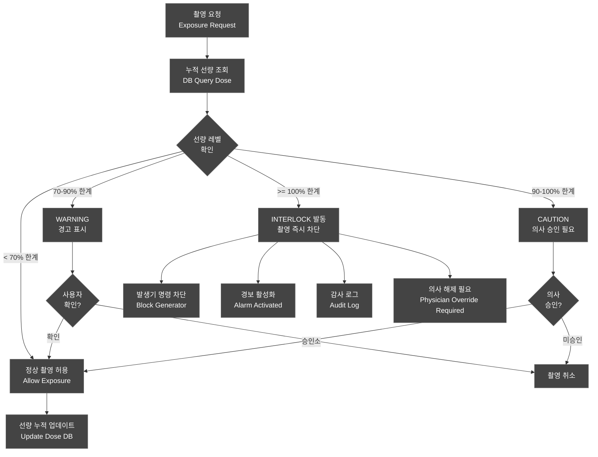
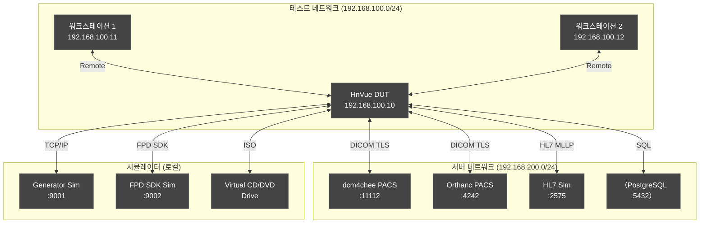
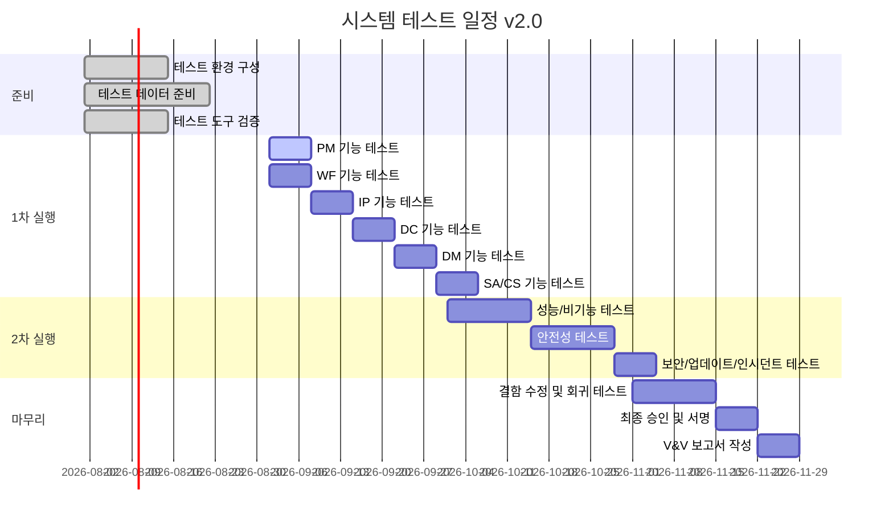

# 시스템 테스트 계획서 (System Test Plan)

---

## 문서 메타데이터 (Document Metadata)

| 항목 | 내용 |
|------|------|
| **문서 ID** | STP-XRAY-GUI-001 |
| **버전 (Version)** | v2.0 |
| **제품명 (Product)** | HnVue Console Software |
| **작성일 (Date)** | 2026-04-03 |
| **작성자 (Author)** | Software QA팀 (Software QA Team) |
| **검토자 (Reviewer)** | Software 개발 팀장 / RA Manager |
| **승인자 (Approver)** | 제품 책임자 (Product Owner) |
| **상태 (Status)** | Draft |
| **기준 규격** | IEC 62304:2006+AMD1:2015 §5.7 |
| **관련 문서** | DOC-002 PRD v2.0, DOC-005 SRS v2.0, DOC-004 FRS v2.0, DOC-032 RTM v2.0 |

### 개정 이력 (Revision History)

| 버전 | 날짜 | 작성자 | 변경 내용 |
|------|------|--------|-----------|
| v0.1 | 2026-02-20 | QA팀 | 초안 작성 |
| v1.0 | 2026-03-18 | QA팀 | 공식 발행 |
| v2.0 | 2026-04-03 | QA팀 | PRD v2.0 기준 65개 PR 커버 확대; 5클릭 워크플로우 end-to-end 검증 추가 (MR-003); PACS 30초 이내 전송 성능 검증 추가 (MR-002); CD Burning 시스템 테스트 추가 (MR-072); 인시던트 대응 시뮬레이션 테스트 추가 (MR-037); 업데이트 메커니즘 검증 추가 (MR-039); 3개+ PACS 벤더 상호운용성 검증 추가 (MR-021); 한/영 UI 전환 테스트 추가 (MR-045); 각 TC에 MR/PR/SWR 추적성 명시; SW → Software 확장 |

---

## 목차 (Table of Contents)

1. 목적 및 범위
2. 참조 문서
3. 4-Tier 체계 기반 테스트 전략
4. 시스템 테스트 케이스 목록
5. 성능 테스트 항목
6. 호환성 테스트
7. 안전성 테스트
8. 보안/업데이트/인시던트 시스템 테스트
9. CD Burning 시스템 테스트
10. 스트레스/부하 테스트
11. 테스트 환경
12. 테스트 일정

---

## 1. 목적 및 범위 (Purpose and Scope)

### 1.1 목적

본 문서는 HnVue Console Software의 시스템 테스트 계획 v2.0을 정의한다. IEC 62304:2006+AMD1:2015 §5.7 요구사항을 충족하기 위해 PRD v2.0 전체 65개 PR에 대한 블랙박스(Black-box) 검증을 수행한다.

v2.0에서는 MRD v3.0 4-Tier 체계를 반영하고, MR-072 (CD Burning), MR-037 (인시던트 대응), MR-039 (업데이트 메커니즘), MR-021 (3개+ PACS 벤더), MR-045 (한/영 UI 전환) 관련 시스템 테스트를 추가하였다.

### 1.2 범위

| 카테고리 | 케이스 수 | 설명 |
|----------|---------|------|
| **기능 테스트 (Functional)** | 55개 | PRD v2.0 65개 PR 기능 요구사항 검증 |
| **비기능 테스트 (Non-functional)** | 25개 | 성능, 호환성, 사용성 |
| **안전성 테스트 (Safety)** | 15개 | Dose Interlock, 안전 인터락 |
| **보안/업데이트/인시던트** | 10개 | MR-037, MR-039 신규 |
| **합계** | **105개+** | |

---

## 2. 참조 문서 (Reference Documents)

| 문서 ID | 문서명 | 버전 |
|---------|--------|------|
| IEC 62304:2006+AMD1:2015 | Medical Device Software — Software Life Cycle Processes | - |
| DOC-001 | Market Requirements Document (MRD) | v3.0 |
| DOC-002 | Product Requirements Document (PRD) | v2.0 |
| DOC-004 | Functional Requirements Specification (FRS) | v2.0 |
| DOC-005 | Software Requirements Specification (SRS) | v2.0 |
| DOC-032 | Requirements Traceability Matrix (RTM) | v2.0 |
| DOC-012 | Unit Test Plan (UTP) | v2.0 |
| DOC-013 | Integration Test Plan (ITP) | v2.0 |
| ISO 14971:2019 | Risk Management for Medical Devices | - |
| IEC 62366-1:2015+AMD1:2020 | Usability Engineering | - |

---

## 3. 4-Tier 체계 기반 테스트 전략

### 3.1 블랙박스 테스트 전략

### 3.2 Tier별 테스트 우선순위

| Tier | MR 범위 | 테스트 우선순위 | 케이스 수 |
|------|---------|---------------|---------|
| Tier 1 | MR-033-039, MR-050-054 | 최우선, 릴리즈 차단 기준 | 25개+ |
| Tier 2 | MR-001-010, MR-019-025, MR-072 | 높음 | 40개+ |
| Tier 3 | MR-011 이후 차별화 기능 | 중간 | 20개+ |

---

## 4. 시스템 테스트 케이스 목록 (System Test Cases)

### 4.1 기능 테스트 — PM (Patient Management) (10개)

| ST ID | MR | PR/SWR | 테스트명 | 사전조건 | 단계 | 예상결과 | Pass/Fail |
|-------|----|---------|---------|---------|----|---------|---------|
| ST-PM-001 | MR-001 | PR-001 / SWR-PM-001 | 신규 환자 등록 정상 흐름 | 시스템 가동, 사용자 로그인 | 1) 환자관리 메뉴 2) 신규 등록 3) 정보 입력 후 저장 | 환자 등록 완료, ID 자동 생성, DB 저장 | ☐ Pass / ☐ Fail |
| ST-PM-002 | MR-001 | PR-001 / SWR-PM-002 | 환자 검색 — 이름 검색 | 환자 DB 50명 사전 입력 | 1) 검색창에 이름 입력 2) 검색 실행 | 매칭 환자 목록 표시, 응답 < 2초 | ☐ Pass / ☐ Fail |
| ST-PM-003 | MR-001 | PR-001 / SWR-PM-003 | 환자 정보 수정 이력 관리 | 환자 P001 등록 완료 | 1) 환자 선택 2) 정보 수정 3) 이력 탭 확인 | 수정 이력 기록 (변경 전/후, 담당자, 시간) | ☐ Pass / ☐ Fail |
| ST-PM-004 | MR-001 | PR-002 / SWR-PM-005 | Modality Worklist 자동 수신 | HIS/RIS Sim 연결, 오더 입력 | 1) 오더 전송 (HIS Sim) 2) MWL 화면 확인 | 30초 내 MWL 항목 자동 표시 | ☐ Pass / ☐ Fail |
| ST-PM-005 | MR-001 | PR-002 / SWR-PM-010 | 잘못된 환자 ID 입력 차단 | 로그인 완료 | 1) 잘못된 형식 ID 입력 2) 저장 시도 | 오류 메시지 표시, 저장 차단 | ☐ Pass / ☐ Fail |
| ST-PM-006 | MR-001 | PR-003 / SWR-PM-015 | 환자 스터디 이력 조회 | 환자에 스터디 5개 연결 | 1) 환자 선택 2) 스터디 이력 탭 | 시간순 스터디 목록, 썸네일 표시 | ☐ Pass / ☐ Fail |
| ST-PM-007 | MR-001 | PR-001 / SWR-PM-020 | 환자 정보 삭제 제한 | 환자에 스터디 연결 | 1) 환자 선택 2) 삭제 시도 | "삭제 불가: 연계 스터디 존재" 메시지 | ☐ Pass / ☐ Fail |
| ST-PM-008 | MR-001 | PR-002 / SWR-PM-025 | 긴급 환자 등록 — 정보 최소화 | 긴급 모드 활성화 | 1) 긴급 등록 버튼 2) 최소 필드 입력 3) 저장 | 15초 내 등록 완료 | ☐ Pass / ☐ Fail |
| ST-PM-009 | MR-001 | PR-003 / SWR-PM-030 | 환자 바코드 스캔 입력 | USB 바코드 리더 연결 | 1) 바코드 스캔 2) 환자 자동 검색 | 바코드 데이터로 환자 자동 조회 | ☐ Pass / ☐ Fail |
| ST-PM-010 | MR-001 | PR-004 / SWR-PM-035 | 환자 데이터 내보내기 — CSV | Admin 권한 로그인 | 1) 환자 목록 선택 2) Export CSV | 암호화된 CSV 다운로드 | ☐ Pass / ☐ Fail |

### 4.2 기능 테스트 — WF (Acquisition Workflow) (12개)

| ST ID | MR | PR/SWR | 테스트명 | 사전조건 | 단계 | 예상결과 | Pass/Fail |
|-------|----|---------|---------|---------|----|---------|---------|
| ST-WF-001 | MR-003 | PR-010 / SWR-WF-001 | **5클릭 워크플로우 end-to-end — 흉부 AP** | 환자 P001, 검출기/발생기 준비 | 1) 환자 선택 2) Chest AP 선택 3) 파라미터 확인 4) 촬영 5) PACS 전송 | **5클릭 이내** 전체 흐름 완료, DICOM 이미지 생성 | ☐ Pass / ☐ Fail |
| ST-WF-002 | MR-003 | PR-010 / SWR-WF-001 | 5클릭 워크플로우 — 복부 AP | 환자 P001, 시스템 준비 | 동일 5클릭 흐름, 복부 AP | **5클릭 이내** 완료 | ☐ Pass / ☐ Fail |
| ST-WF-003 | MR-003 | PR-010 / SWR-WF-001 | 촬영 파라미터 kV 상한 경계값 | 파라미터 설정 화면 | 1) kV=150 설정 2) 촬영 실행 | 촬영 허용, 경고 없음 | ☐ Pass / ☐ Fail |
| ST-WF-004 | MR-003 | PR-010 / SWR-WF-001 | 촬영 파라미터 kV 초과 차단 (Safety) | 파라미터 설정 화면 | 1) kV=151 입력 시도 | 입력 차단, "허용 범위 초과" 메시지 | ☐ Pass / ☐ Fail |
| ST-WF-005 | MR-004 | PR-011 / SWR-WF-010 | 신체 부위별 기본 파라미터 자동 설정 | 프로토콜 DB 구성 완료 | 1) Chest AP 선택 2) 파라미터 확인 | kV/mAs 자동 설정, 범위 내 | ☐ Pass / ☐ Fail |
| ST-WF-006 | MR-003 | PR-012 / SWR-WF-015 | 재촬영 기능 | 첫 번째 촬영 완료 | 1) 재촬영 버튼 2) 재촬영 수행 | 기존 이미지 보존, 새 이미지 추가 저장 | ☐ Pass / ☐ Fail |
| ST-WF-007 | MR-003 | PR-013 / SWR-WF-020 | 촬영 이벤트 감사 로그 | 로그인 완료 | 1) 촬영 수행 2) 감사 로그 조회 | 촬영 시작/종료/파라미터 로그 기록 | ☐ Pass / ☐ Fail |
| ST-WF-008 | MR-003 | PR-014 / SWR-WF-025 | AED 모드 — 자동 파라미터 조정 | AED 활성화 설정 | 1) AED 모드 활성화 2) 촬영 수행 | AED가 최적 파라미터로 자동 조정 | ☐ Pass / ☐ Fail |
| ST-WF-009 | MR-003 | PR-010 / SWR-WF-030 | 촬영 중단 — 응급 정지 | 촬영 진행 중 | 1) 촬영 중 정지 버튼 2) 상태 확인 | 즉시 정지, 발생기 중단 명령 전송 | ☐ Pass / ☐ Fail |
| ST-WF-010 | MR-003 | PR-010 / SWR-WF-040 | 다중 시리즈 촬영 | 환자 선택 완료 | 1) Chest AP 2) Chest LAT 3) Abdomen AP | 3개 시리즈 각각 저장, 스터디 연결 | ☐ Pass / ☐ Fail |
| ST-WF-011 | MR-003 | PR-002 / SWR-WF-010 | PACS 자동 전송 — 30초 이내 | PACS 연결 완료 | 1) 촬영 완료 2) PACS 전송 시간 측정 | **30초 이내** PACS 전송 완료 (MR-002 충족) | ☐ Pass / ☐ Fail |
| ST-WF-012 | MR-010 | PR-010 / SWR-WF-003 | 다중 검출기 상태 표시 | 2개 FPD 연결 | 1) 검출기 목록 화면 2) 각 검출기 상태 확인 | 각 FPD 실시간 상태 (Ready/Error/Disconnected) 표시 | ☐ Pass / ☐ Fail |

### 4.3 기능 테스트 — IP (Image Processing) (8개)

| ST ID | MR | PR/SWR | 테스트명 | 사전조건 | 단계 | 예상결과 | Pass/Fail |
|-------|----|---------|---------|---------|----|---------|---------|
| ST-IP-001 | MR-012 | PR-020 / SWR-IP-001 | 윈도우/레벨 조작 | 이미지 표시 중 | 1) 마우스 우클릭+드래그 2) WL 값 변화 확인 | 실시간 이미지 반응, WL 수치 표시 | ☐ Pass / ☐ Fail |
| ST-IP-002 | MR-012 | PR-021 / SWR-IP-002 | 이미지 회전/반전 | 이미지 표시 중 | 1) 회전 버튼 클릭 (90°) 2) 반전 버튼 클릭 | 이미지 정확히 회전/반전, 픽셀 손실 없음 | ☐ Pass / ☐ Fail |
| ST-IP-003 | MR-012 | PR-022 / SWR-IP-003 | 디지털 줌 — 최대 16× | 이미지 표시 중 | 1) 스크롤로 줌 인 2) 16× 달성 확인 | 최대 16× 확대, 픽셀 아티팩트 없음 | ☐ Pass / ☐ Fail |
| ST-IP-004 | MR-012 | PR-023 / SWR-IP-010 | 측정 도구 — 길이 측정 | 이미지 표시 중, 픽셀 간격 설정 | 1) 측정 도구 선택 2) 2점 클릭 3) 측정값 확인 | 측정값(mm) 표시, 오차 ±5% | ☐ Pass / ☐ Fail |
| ST-IP-005 | MR-012 | PR-024 / SWR-IP-011 | 측정 도구 — 각도 측정 | 이미지 표시 중 | 1) 각도 도구 선택 2) 3점 클릭 | 각도값(°) 표시, 오차 ±1° | ☐ Pass / ☐ Fail |
| ST-IP-006 | MR-012 | PR-025 / SWR-IP-015 | 이미지 내보내기 — DICOM | 이미지 표시 중 | 1) 내보내기 메뉴 2) DICOM 선택 3) 저장 위치 지정 | 유효한 DICOM 파일 저장 | ☐ Pass / ☐ Fail |
| ST-IP-007 | MR-012 | PR-026 / SWR-IP-020 | 이미지 비교 — 2-up 레이아웃 | 동일 환자 2개 이미지 | 1) 2-up 레이아웃 선택 2) 이미지 2개 로드 | 나란히 표시, 독립적 WL 조정 | ☐ Pass / ☐ Fail |
| ST-IP-008 | MR-013 | PR-027 / SWR-IP-025 | 영상 처리 프리셋 적용 | 프리셋 DB 구성 | 1) Chest AP 이미지 로드 2) 프리셋 적용 | 최적화된 WL, LUT 자동 적용 | ☐ Pass / ☐ Fail |

### 4.4 기능 테스트 — DM (Dose Management) (5개)

| ST ID | MR | PR/SWR | 테스트명 | 사전조건 | 단계 | 예상결과 | Pass/Fail |
|-------|----|---------|---------|---------|----|---------|---------|
| ST-DM-001 | MR-029 | PR-040 / SWR-DM-001 | 촬영 선량 자동 계산 | 촬영 완료 | 1) 촬영 수행 2) 선량 정보 패널 확인 | DAP 값 자동 표시, 단위(mGy·cm²) | ☐ Pass / ☐ Fail |
| ST-DM-002 | MR-030 | PR-041 / SWR-DM-015 | DICOM RDSR 자동 전송 | PACS 연결 완료 | 1) 촬영 수행 2) PACS에서 RDSR 확인 | RDSR DICOM 파일 PACS에 자동 전송 | ☐ Pass / ☐ Fail |
| ST-DM-003 | MR-029 | PR-042 / SWR-DM-020 | 선량 경고 알림 표시 | 누적 선량 설정 | 1) 반복 촬영으로 70% 도달 2) 경고 표시 확인 | WARNING 아이콘, 팝업 메시지 표시 | ☐ Pass / ☐ Fail |
| ST-DM-004 | MR-030 | PR-043 / SWR-DM-025 | 소아 선량 한계 자동 조정 | 5세 환자 등록 | 1) 소아 환자 선택 2) 선량 한계 확인 | 성인 한계의 50% 자동 적용 | ☐ Pass / ☐ Fail |
| ST-DM-005 | MR-030 | PR-044 / SWR-DM-030 | 선량 보고서 — 기간별 조회 | 1개월치 촬영 데이터 | 1) 보고서 메뉴 2) 기간 설정 3) 조회 | 통계 테이블 및 차트 표시, CSV 내보내기 | ☐ Pass / ☐ Fail |

### 4.5 기능 테스트 — DC (DICOM/Communication) + 상호운용성 (10개)

| ST ID | MR | PR/SWR | 테스트명 | 사전조건 | 단계 | 예상결과 | Pass/Fail |
|-------|----|---------|---------|---------|----|---------|---------|
| ST-DC-001 | MR-002 | PR-050 / SWR-DC-010 | PACS 자동 전송 — 30초 이내 | PACS 설정 완료 | 1) 촬영 수행 2) PACS 전송 시간 측정 | **30초 이내** PACS 전송 완료 | ☐ Pass / ☐ Fail |
| ST-DC-002 | MR-025 | PR-050 / SWR-DC-020 | Worklist 자동 갱신 | MWL 서버 연결 | 1) 새 오더 추가 (HIS Sim) 2) 5분 대기 3) MWL 화면 확인 | 새 오더 자동 반영 | ☐ Pass / ☐ Fail |
| ST-DC-003 | MR-019 | PR-051 / SWR-DC-030 | DICOM 이미지 원격 조회 | PACS에 이미지 저장 | 1) C-FIND로 스터디 검색 2) C-MOVE로 이미지 가져오기 3) 표시 확인 | 이미지 조회 및 표시 성공 | ☐ Pass / ☐ Fail |
| ST-DC-004 | MR-025 | PR-052 / SWR-DC-040 | HL7 환자 동기화 | HIS Sim 연결 | 1) HIS에서 환자 정보 수정 2) HnVue 확인 | 변경 사항 자동 반영 (30초 내) | ☐ Pass / ☐ Fail |
| ST-DC-005 | MR-019 | PR-053 / SWR-DC-050 | DICOM Echo 연결 테스트 | PACS 설정 | 1) 설정 → DICOM 설정 2) Echo 테스트 버튼 | SUCCESS 메시지, 응답 시간 표시 | ☐ Pass / ☐ Fail |
| ST-DC-006 | MR-019 | PR-054 / SWR-DC-055 | 전송 실패 자동 재전송 | 네트워크 일시 차단 | 1) 네트워크 차단 2) 촬영 수행 3) 네트워크 복구 4) 전송 확인 | 큐에 대기 후 자동 재전송 성공 | ☐ Pass / ☐ Fail |
| ST-DC-007 | MR-034 | PR-055 / SWR-DC-060 | DICOM 암호화 전송 검증 | TLS 설정 완료 | 1) 패킷 캡처 시작 2) 이미지 전송 3) 패킷 분석 | 평문 데이터 없음, TLS 1.3 협상 확인 | ☐ Pass / ☐ Fail |
| ST-DC-008 | MR-021 | PR-050 / SWR-DC-010 | PACS 상호운용성 — dcm4chee | dcm4chee 실행 | 전체 DICOM 서비스 (C-STORE, C-FIND, C-MOVE) | dcm4chee와 완전 상호운용 | ☐ Pass / ☐ Fail |
| ST-DC-009 | MR-021 | PR-050 / SWR-DC-010 | PACS 상호운용성 — Orthanc | Orthanc 실행 | 전체 DICOM 서비스 | Orthanc과 완전 상호운용 | ☐ Pass / ☐ Fail |
| ST-DC-010 | MR-024 | PR-050 / SWR-DC-030 | DICOM Print Management | DICOM Print SCP 실행 | 1) 이미지 선택 2) DICOM Print 명령 | Print Job 전송 성공 | ☐ Pass / ☐ Fail |

### 4.6 기능 테스트 — SA/CS (시스템 관리/사이버보안) (10개)

| ST ID | MR | PR/SWR | 테스트명 | 사전조건 | 단계 | 예상결과 | Pass/Fail |
|-------|----|---------|---------|---------|----|---------|---------|
| ST-SA-001 | MR-039 | PR-060 / SWR-SA-010 | 사용자 계정 관리 | Admin 로그인 | 1) 사용자 관리 메뉴 2) 신규 사용자 생성 3) 역할 할당 | 사용자 생성, 역할 할당 완료 | ☐ Pass / ☐ Fail |
| ST-SA-002 | MR-039 | PR-061 / SWR-SA-010 | 시스템 설정 백업/복원 | Admin 로그인 | 1) 백업 실행 2) 설정 초기화 3) 백업 복원 | 설정 완전 복원 | ☐ Pass / ☐ Fail |
| ST-SA-003 | MR-035 | PR-063 / SWR-SA-030 | 감사 로그 조회 — 기간별 필터 | 30일치 감사 로그 | 1) 감사 로그 메뉴 2) 기간 필터 설정 3) 조회 | 해당 기간 로그만 표시, 내보내기 가능 | ☐ Pass / ☐ Fail |
| ST-SA-004 | MR-039 | PR-063 / SWR-SA-040 | 일일 QC — 자동 실행 | 시스템 재시작 | 1) 시스템 전원 켬 2) QC 진행 확인 | QC 자동 시작, 결과 표시 (Pass/Fail) | ☐ Pass / ☐ Fail |
| ST-SA-005 | MR-039 | PR-063 / SWR-SA-041 | QC 실패 시 촬영 차단 | QC 실패 시나리오 | 1) QC 강제 실패 2) 촬영 시도 | 촬영 버튼 비활성화, "QC 실패" 표시 | ☐ Pass / ☐ Fail |
| ST-CS-001 | MR-033 | PR-070 / SWR-CS-001 | 사용자 로그인 — 정상 | 사용자 계정 등록 | 1) ID/PW 입력 2) 로그인 버튼 | 로그인 성공, 역할별 대시보드 표시 | ☐ Pass / ☐ Fail |
| ST-CS-002 | MR-033 | PR-070 / SWR-CS-002 | 계정 잠금 — 5회 실패 | 활성 계정 | 1) 5회 연속 잘못된 PW 입력 | 5회째 계정 잠금, 잠금 메시지 표시 | ☐ Pass / ☐ Fail |
| ST-CS-003 | MR-033 | PR-071 / SWR-CS-010 | 자동 세션 만료 | 로그인 완료 | 1) 30분간 비활성 2) 임의 동작 시도 | 자동 로그아웃, 재인증 화면 표시 | ☐ Pass / ☐ Fail |
| ST-CS-004 | MR-033 | PR-072 / SWR-CS-030 | 역할별 메뉴 접근 제어 | Technician 로그인 | 1) 시스템 관리 메뉴 접근 시도 | 메뉴 비표시 또는 접근 거부 | ☐ Pass / ☐ Fail |
| ST-CS-005 | MR-034 | PR-073 / SWR-CS-040 | 저장 데이터 암호화 검증 | 테스트 환경 | 1) DB 파일 직접 열기 시도 2) 데이터 내용 확인 | PHI 데이터 암호화(AES-256), 평문 없음 | ☐ Pass / ☐ Fail |

### 4.7 기능 테스트 — 다국어 (한/영 UI 전환) (3개) 【MR-045 신규】

| ST ID | MR | PR/SWR | 테스트명 | 사전조건 | 단계 | 예상결과 | Pass/Fail |
|-------|----|---------|---------|---------|----|---------|---------|
| ST-LANG-001 | MR-045 | PR-115 / SWR-NF-027 | 한국어 UI 전환 — 전체 화면 | 다국어 설정 | 1) 언어 설정 → 한국어 2) 모든 주요 화면 확인 | 모든 UI 한국어 표시, 레이아웃 정상 | ☐ Pass / ☐ Fail |
| ST-LANG-002 | MR-045 | PR-115 / SWR-NF-028 | 영어 UI 전환 — 전체 화면 | 다국어 설정 | 1) 언어 설정 → English 2) 모든 주요 화면 확인 | 모든 UI 영어 표시, 레이아웃 정상 | ☐ Pass / ☐ Fail |
| ST-LANG-003 | MR-045 | PR-115 / SWR-NF-027 | 런타임 언어 전환 | 촬영 중 | 1) 한국어 설정 후 촬영 워크플로우 시작 2) 촬영 완료 전 영어 전환 | 전환 즉시 반영, 진행 중인 워크플로우 영향 없음 | ☐ Pass / ☐ Fail |

---

## 5. 성능 테스트 항목 (Performance Test Items)

### 5.1 응답 시간 목표 (v2.0 업데이트)

| 기능 | 목표 응답 시간 | 근거 MR | 측정 조건 |
|------|------------|--------|---------|
| 이미지 표시 (촬영 후) | **< 3초** | - | 표준 14-bit 이미지, LAN |
| Window/Level 조작 | **< 100ms** | - | 드래그 입력 |
| 환자 검색 | **< 2초** | - | 50,000명 DB |
| PACS 전송 완료 | **< 30초** | **MR-002** | 표준 이미지, 1Gbps LAN |
| 로그인 인증 | **< 3초** | - | 표준 네트워크 |
| 시스템 시작 | **< 60초** | - | 권장 사양 PC |
| 5클릭 워크플로우 | **≤ 5클릭** | **MR-003** | 환자 선택-PACS 전송 |

### 5.2 성능 테스트 케이스 (10개)

| ST ID | MR | PR/SWR | 테스트명 | 예상결과 | Pass/Fail |
|-------|----|---------|---------|---------|----|
| ST-PF-001 | - | PR-100 / SWR-NF-001 | 이미지 표시 속도 | **< 3초** | ☐ Pass / ☐ Fail |
| ST-PF-002 | - | PR-100 / SWR-NF-002 | WL 조작 응답 속도 | **< 100ms** | ☐ Pass / ☐ Fail |
| ST-PF-003 | - | PR-101 / SWR-NF-003 | 환자 검색 응답 시간 (50,000명 DB) | **< 2초** | ☐ Pass / ☐ Fail |
| ST-PF-004 | MR-002 | PR-102 / SWR-NF-004 | PACS 전송 완료 시간 | **< 30초** (MR-002 검증) | ☐ Pass / ☐ Fail |
| ST-PF-005 | - | PR-103 / SWR-NF-005 | 시스템 시작 시간 | **< 60초** | ☐ Pass / ☐ Fail |
| ST-PF-006 | - | PR-104 / SWR-NF-006 | 동시 사용자 지원 (5개) | 성능 저하 < 10% | ☐ Pass / ☐ Fail |
| ST-PF-007 | - | PR-105 / SWR-NF-007 | 메모리 사용량 (8시간) | 메모리 누수 없음 | ☐ Pass / ☐ Fail |
| ST-PF-008 | - | PR-100 / SWR-NF-008 | 대용량 이미지 처리 (4K) | WL 응답 **< 200ms** | ☐ Pass / ☐ Fail |
| ST-PF-009 | - | PR-106 / SWR-NF-009 | CPU 사용률 | 평균 < 50% CPU | ☐ Pass / ☐ Fail |
| ST-PF-010 | - | PR-107 / SWR-NF-010 | 디스크 I/O 성능 | 저장 < 1초/장, 로드 < 0.5초/장 | ☐ Pass / ☐ Fail |

---

## 6. 호환성 테스트 (Compatibility Test)

### 6.1 OS 및 해상도 호환성 (10개)

| ST ID | MR | 테스트명 | 예상결과 | Pass/Fail |
|-------|----|---------|---------|---------|
| ST-CP-001 | - | OS 호환성 — Windows 10 22H2 | 모든 기능 정상 | ☐ Pass / ☐ Fail |
| ST-CP-002 | - | OS 호환성 — Windows 11 23H2 | 모든 기능 정상 | ☐ Pass / ☐ Fail |
| ST-CP-003 | - | 해상도 — 1920×1080 (최소) | 레이아웃 정상 | ☐ Pass / ☐ Fail |
| ST-CP-004 | - | 해상도 — 2560×1440 (권장) | 고해상도 선명 표시 | ☐ Pass / ☐ Fail |
| ST-CP-005 | - | 듀얼 모니터 지원 | 듀얼 모니터 정상 지원 | ☐ Pass / ☐ Fail |
| ST-CP-006 | - | 의료용 전용 키보드 호환 | 모든 키 정상 동작 | ☐ Pass / ☐ Fail |
| ST-CP-007 | MR-021 | DICOM Viewer 호환성 (OsiriX, RadiAnt) | 이미지 정상 표시 | ☐ Pass / ☐ Fail |
| ST-CP-008 | MR-045 | 다국어 — 한국어 | 모든 UI 한국어 표시 | ☐ Pass / ☐ Fail |
| ST-CP-009 | MR-045 | 다국어 — 영어 | 모든 UI 영어 표시 | ☐ Pass / ☐ Fail |
| ST-CP-010 | MR-021 | 3개+ PACS 벤더 상호운용성 | dcm4chee + Orthanc + 1개 추가 | ☐ Pass / ☐ Fail |

---

## 7. 안전성 테스트 — Dose Interlock 포함 (15개)

### 7.1 Dose Interlock 테스트 흐름도

### 7.2 안전성 테스트 케이스 (15개)

| ST ID | MR | PR/SWR | 테스트명 | 예상결과 | Pass/Fail |
|-------|----|---------|---------|---------|---------|
| ST-SF-001 | MR-029 | PR-120 / SWR-SF-001 | **Dose Interlock — 한계 초과 차단** | 촬영 즉시 차단, 경고 팝업, 로그 기록 | ☐ Pass / ☐ Fail |
| ST-SF-002 | MR-029 | PR-120 / SWR-SF-001 | **Dose Interlock — 경계값 경고 (90%)** | 경고 아이콘, "선량 주의" 메시지 | ☐ Pass / ☐ Fail |
| ST-SF-003 | MR-010 | PR-121 / SWR-SF-010 | **검출기 미준비 시 촬영 차단** | 촬영 버튼 비활성화, 상태 표시 | ☐ Pass / ☐ Fail |
| ST-SF-004 | MR-003 | PR-122 / SWR-SF-020 | **kV 상한 초과 입력 차단** | 입력 차단, 최대값(150) 자동 설정 | ☐ Pass / ☐ Fail |
| ST-SF-005 | MR-003 | PR-122 / SWR-SF-021 | **mAs 하한 미달 입력 차단** | 입력 차단, 최소값(0.1) 표시 | ☐ Pass / ☐ Fail |
| ST-SF-006 | MR-003 | PR-123 / SWR-SF-030 | **응급 정지 기능** | 즉시 (<50ms) 정지, 발생기 중단 확인 | ☐ Pass / ☐ Fail |
| ST-SF-007 | MR-039 | PR-124 / SWR-SF-040 | **QC 실패 시 시스템 잠금** | 진단 촬영 차단, QC 재수행 요구 | ☐ Pass / ☐ Fail |
| ST-SF-008 | MR-001 | PR-125 / SWR-SF-050 | **환자 ID 불일치 경고** | 경고 팝업, 환자 확인 요구 | ☐ Pass / ☐ Fail |
| ST-SF-009 | MR-039 | PR-126 / SWR-SF-060 | **소프트웨어 오류 시 안전 상태 전환** | 안전 상태(Safe State) 전환, 오류 로그 | ☐ Pass / ☐ Fail |
| ST-SF-010 | MR-039 | PR-127 / SWR-SF-070 | **전원 차단 후 데이터 무결성** | 저장된 이미지 무결성 유지 | ☐ Pass / ☐ Fail |
| ST-SF-011 | MR-019 | PR-128 / SWR-SF-080 | **네트워크 단절 시 로컬 동작 유지** | 로컬 저장 성공, 복구 후 자동 전송 | ☐ Pass / ☐ Fail |
| ST-SF-012 | MR-039 | PR-129 / SWR-SF-090 | **Watchdog 타이머 — SW 행 감지** | 자동 재시작, 안전 로그 기록 | ☐ Pass / ☐ Fail |
| ST-SF-013 | MR-030 | PR-130 / SWR-SF-100 | **소아 환자 과선량 이중 확인** | 이중 확인 팝업, 강제 확인 요구 | ☐ Pass / ☐ Fail |
| ST-SF-014 | MR-003 | PR-131 / SWR-SF-110 | **방사선 노출 경고 표시** | "방사선 주의" 경고 표시, 명확히 보임 | ☐ Pass / ☐ Fail |
| ST-SF-015 | MR-035 | PR-132 / SWR-SF-120 | **감사 로그 불변성** | 수정/삭제 불가, 오류 메시지 표시 | ☐ Pass / ☐ Fail |

---

## 8. 보안/업데이트/인시던트 시스템 테스트 【v2.0 신규】

### 8.1 인시던트 대응 시뮬레이션 테스트 (MR-037)

| ST ID | MR | PR/SWR | 테스트명 | 사전조건 | 단계 | 예상결과 | Pass/Fail |
|-------|----|---------|---------|---------|----|---------|---------|
| ST-INC-001 | MR-037 | PR-073 / SWR-CS-002 | 보안 인시던트 탐지 — Brute Force 공격 | 인시던트 모니터링 활성화 | 1) 동일 계정 5회 로그인 실패 시뮬레이션 2) 인시던트 알림 확인 | 인시던트 탐지, 관리자 알림, 계정 잠금 | ☐ Pass / ☐ Fail |
| ST-INC-002 | MR-037 | PR-073 / SWR-CS-002 | 인시던트 대응 — 계정 격리 | 인시던트 탐지 후 | 1) 공격 탐지 2) 계정 자동 격리 3) 관리자 승인 후 복구 | 공격 계정 격리, 복구 프로세스 동작 | ☐ Pass / ☐ Fail |
| ST-INC-003 | MR-037 | PR-073 / SWR-CS-002 | CVD 프로세스 — 취약점 보고 수신 | CVD 프로세스 설정 완료 | 1) 테스트 취약점 보고 접수 2) 우선순위 평가 3) 패치 배포 절차 확인 | CVD 워크플로우 동작, 내부 보고서 생성 | ☐ Pass / ☐ Fail |

### 8.2 SW 업데이트 메커니즘 검증 (MR-039)

| ST ID | MR | PR/SWR | 테스트명 | 사전조건 | 단계 | 예상결과 | Pass/Fail |
|-------|----|---------|---------|---------|----|---------|---------|
| ST-UPD-001 | MR-039 | PR-060 / SWR-SA-050 | 서명된 업데이트 패키지 설치 — 정상 | 유효 서명 패키지 준비 | 1) 업데이트 패키지 다운로드 2) 서명 검증 3) 설치 진행 | 서명 검증 성공, 업데이트 설치 완료 | ☐ Pass / ☐ Fail |
| ST-UPD-002 | MR-039 | PR-060 / SWR-SA-050 | 변조된 업데이트 패키지 설치 차단 | 서명 변조 패키지 준비 | 1) 변조 패키지 다운로드 2) 설치 시도 | 서명 검증 실패, 설치 거부, 경고 표시 | ☐ Pass / ☐ Fail |
| ST-UPD-003 | MR-039 | PR-060 / SWR-SA-051 | 업데이트 실패 후 자동 롤백 | 업데이트 실패 시나리오 설정 | 1) 업데이트 시작 2) 중간 실패 주입 3) 롤백 완료 확인 | 이전 버전으로 자동 롤백, 시스템 정상 동작 | ☐ Pass / ☐ Fail |
| ST-UPD-004 | MR-039 | PR-060 / SWR-SA-050 | SW 무결성 검증 — 시작 시 자가 점검 | 시스템 재시작 | 1) 시스템 재시작 2) 무결성 점검 로그 확인 | 시작 시 무결성 검증 수행, 결과 로그 기록 | ☐ Pass / ☐ Fail |

---

## 9. CD Burning 시스템 테스트 【MR-072 신규】

| ST ID | MR | PR/SWR | 테스트명 | 사전조건 | 단계 | 예상결과 | Pass/Fail |
|-------|----|---------|---------|---------|----|---------|---------|
| ST-CB-001 | MR-072 | PR-WF-019 / SWR-CB-004 | CD Burning 정상 흐름 — DICOM Viewer 포함 | CD-R 삽입, 스터디 선택 | 1) 촬영 후 "CD 굽기" 선택 2) 뷰어 포함 옵션 선택 3) 버닝 실행 | CD에 DICOM 파일 + Viewer 정상 기록 | ☐ Pass / ☐ Fail |
| ST-CB-002 | MR-072 | PR-WF-019 / SWR-CB-004 | DVD Burning — 대용량 스터디 | DVD-R 삽입, 대용량 스터디 | CD 용량 초과 스터디 버닝 시도 | DVD 전환 안내, DVD에 정상 기록 | ☐ Pass / ☐ Fail |
| ST-CB-003 | MR-072 | PR-WF-019 / SWR-CB-010 | 버닝 감사 로그 — PHI 배포 이력 | 버닝 완료 후 | 감사 로그 조회 | 환자 ID, 스터디 UID, 담당자, 시간 기록 | ☐ Pass / ☐ Fail |
| ST-CB-004 | MR-072 | PR-WF-019 / SWR-CB-004 | 버닝된 CD 검증 — 이미지 무결성 | 버닝 완료된 CD | 1) CD 내 DICOM 파일 열기 2) DICOM Viewer 실행 | 모든 이미지 정상 열림, Viewer 자동 실행 | ☐ Pass / ☐ Fail |
| ST-CB-005 | MR-072 | PR-WF-019 / SWR-CB-004 | 버닝 중 오류 처리 — 드라이브 오류 | 드라이브 오류 시뮬레이터 | 1) 버닝 중 드라이브 오류 주입 2) 오류 처리 확인 | BurnException 표시, 로그 기록, 재시도 안내 | ☐ Pass / ☐ Fail |

---

## 10. 스트레스/부하 테스트 (Stress/Load Test)

| 시나리오 ID | 테스트명 | 지속 시간 | 부하 조건 | 합격 기준 |
|-----------|---------|---------|---------|---------|
| ST-LOAD-001 | **8시간 연속 운용** | 8시간 | 정상 사용 패턴 | 성능 저하 없음, 메모리 누수 없음 |
| ST-LOAD-002 | **최대 동시 사용자** | 1시간 | 5개 워크스테이션 동시 | 응답 시간 기준 준수 |
| ST-LOAD-003 | **최대 PACS 전송 부하** | 2시간 | 연속 100장 전송 × 10회 | 전송 성공률 100% |
| ST-LOAD-004 | **DB 대용량 처리** | 30분 | 100만 건 조회 쿼리 | 쿼리 응답 < 5초 |
| ST-LOAD-005 | **네트워크 불안정 스트레스** | 1시간 | 패킷 손실 5%, 지연 100ms | 데이터 무결성 유지 |
| ST-LOAD-006 | **디스크 공간 최소 환경** | 30분 | 남은 공간 < 5GB | 경고 표시, 동작 유지 |

---

## 11. 테스트 환경 (Test Environment)

### 11.1 하드웨어 구성

| 구성 요소 | 사양 | 수량 | 용도 |
|---------|------|------|------|
| 테스트 PC (DUT) | Intel i9, RAM 32GB, SSD 1TB, Win11 | 1 | 주 테스트 대상 |
| 워크스테이션 (클라이언트) | Intel i7, RAM 16GB, Win10 | 4 | 동시 접속 테스트 |
| PACS 서버 | Intel Xeon, RAM 64GB, HDD 10TB | 1 | dcm4chee + Orthanc 실행 |
| 의료용 모니터 (2MP) | 2560×1600, IPS | 2 | 영상 표시 테스트 |
| CD/DVD 드라이브 | USB 외장 CD/DVD-RW | 1 | CD Burning 테스트 |
| 네트워크 스위치 | 1Gbps Managed Switch | 1 | 네트워크 환경 |

### 11.2 소프트웨어 구성

| 소프트웨어 | 버전 | 용도 |
|-----------|------|------|
| HnVue Console | DUT | 테스트 대상 |
| dcm4chee-arc | 5.x (Docker) | PACS 시뮬레이터 1 |
| Orthanc | 1.x (Docker) | PACS 시뮬레이터 2 (상호운용성) |
| Mirth Connect | 4.x | HL7 시뮬레이터 |
| Wireshark | 4.x | 네트워크 패킷 분석 |
| JMeter | 5.x | 부하 테스트 도구 |
| DVTK (DICOM Toolkit) | 최신 | DICOM 검증 |
| Grafana + Prometheus | 최신 | 성능 모니터링 |

### 11.3 테스트 환경 구성도

---

## 12. Generator 에러 시스템 테스트

| TC ID | 테스트명 | 시나리오 | 합격 기준 | MR 추적 |
|-------|---------|---------|----------|--------|
| ST-GEN-001 | Generator 통신 끊김 시 사용자 알림 | 시리얼 분리 | 3s 내 "Generator 연결 끊김" 알림, 촬영 차단 | MR-031, MR-048 |
| ST-GEN-002 | Tube 과열 시 안전 차단 | 연속 촬영 → E36 | 촬영 차단 + 냉각 카운트다운 + 잔열 표시 | MR-031 |
| ST-GEN-003 | Generator 복구 후 정상 촬영 재개 | E01 후 재연결 | 재연결 후 5클릭 워크플로우 정상 완료 | MR-003, MR-031 |

---

## 13. 테스트 일정 (Test Schedule)

### 12.1 시스템 테스트 마일스톤

| 단계 | 기간 | 내용 | 산출물 |
|------|------|------|-------|
| **ST 준비** | M8 (4주) | 환경 구성, 테스트 데이터 준비 | 환경 구성 보고서 |
| **ST 1차 실행** | M9-M10 (6주) | 기능 테스트 55개 + 성능 25개 실행 | ST 1차 결과 보고서 |
| **ST 2차 실행** | M10-M11 (4주) | 안전성 15개 + 보안/업데이트 10개 + 회귀 테스트 | ST 2차 결과 보고서 |
| **ST 완료/서명** | M11 말 | 결함 해결, 최종 승인 | ST 최종 보고서, V&V 보고서 |

### 12.2 시스템 테스트 전체 일정 (간트 차트)

**총 시스템 테스트 케이스: 105개+**
- 기능:55 + 성능:10 + 호환성:10 + 안전성:15 + 보안/업데이트/인시던트:7 + CD Burning:5 + 스트레스:6

---

*본 문서는 IEC 62304 §5.7 요구사항에 따라 작성되었으며, MRD v3.0 4-Tier 체계, MR-072 (CD Burning), MR-037 (인시던트 대응), MR-039 (업데이트 메커니즘), MR-021 (3개+ PACS 상호운용성), MR-045 (한/영 UI 전환)를 반영한 v2.0입니다.*

---
**문서 끝 (End of Document)** | STP-XRAY-GUI-001 v2.0 | 2026-04-03
