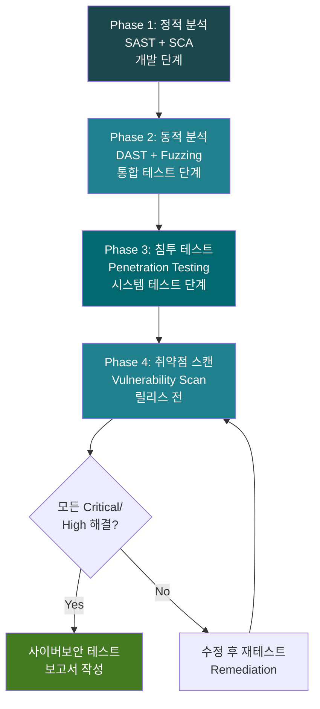
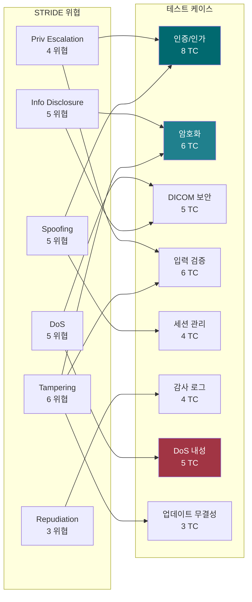
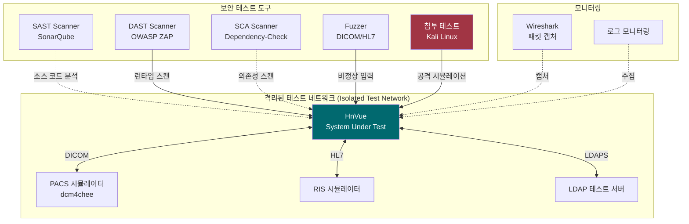
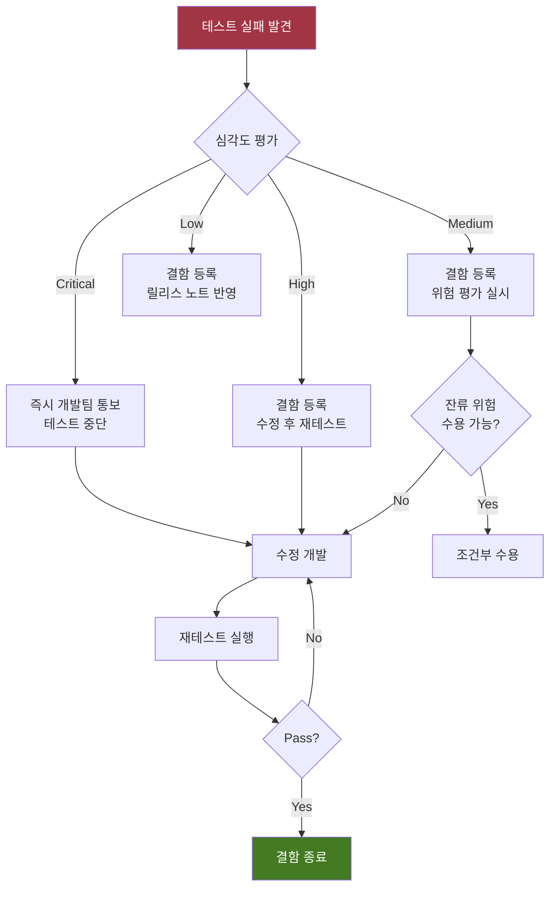
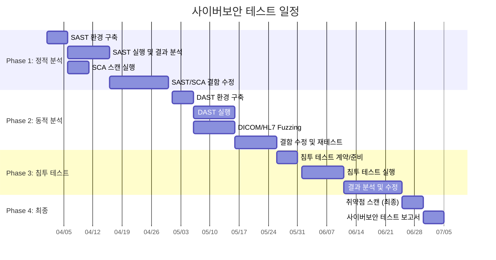

# 사이버보안 테스트 계획서 (Cybersecurity Test Plan)
## HnVue Console SW

---

## 문서 메타데이터 (Document Metadata)

| 항목 | 내용 |
|------|------|
| **문서 ID** | CSTP-XRAY-GUI-001 |
| **문서명** | HnVue Console SW 사이버보안 테스트 계획서 |
| **버전** | v1.0 |
| **작성일** | 2026-03-18 |
| **작성자** | 사이버보안 팀 (Cybersecurity Team) |
| **검토자** | SW 아키텍트, QA 팀장 |
| **승인자** | 의료기기 RA/QA 책임자 |
| **상태** | 승인됨 (Approved) |
| **기준 규격** | FDA Section 524B, FDA Premarket Cybersecurity Guidance 2023, OWASP, NIST SP 800-115 |

### 개정 이력 (Revision History)

| 버전 | 날짜 | 변경 내용 | 작성자 |
|------|------|----------|--------|
| v1.0 | 2026-03-18 | 최초 작성 — TM-XRAY-GUI-001 위협 모델 기반 | 사이버보안 팀 |

---

## 목차 (Table of Contents)

1. 목적 및 범위
2. 참조 문서
3. 사이버보안 테스트 전략
4. 테스트 범위
5. 테스트 케이스
6. 테스트 환경
7. 테스트 도구
8. 합격/불합격 기준
9. OWASP Top 10 매핑
10. 일정

---

련 문서 (Related Documents)

| 문서 ID | 문서명 | 관계 |
|---------|--------|------|
| DOC-016 | 사이버보안 계획서 (Cybersecurity Plan) | 상위 사이버보안 전략 |
| DOC-017 | 위협 모델링 보고서 (Threat Model) | 식별된 위협 및 대응 조치 |
| DOC-019 | SBOM (소프트웨어 부품표) | 취약점 스캔 대상 컴포넌트 |

## 1.

## 1. 목적 및 범위 (Purpose and Scope)

### 1.1 목적 (Purpose)

본 문서는 HnVue Console SW에 대한 **사이버보안 테스트 계획**을 수립한다. 위협 모델링 보고서 (TM-XRAY-GUI-001)에서 식별된 28개 위협에 대한 완화 조치의 유효성을 검증하고, FDA Section 524B 사이버보안 요구사항 충족을 실증한다.

### 1.2 범위 (Scope)

| 구분 | 내용 |
|------|------|
| **대상** | HnVue Console SW v1.x Release Candidate |
| **테스트 유형** | SAST, DAST, SCA, 침투 테스트, 퍼징 |
| **위협 모델** | TM-XRAY-GUI-001 (28개 위협, 28개 RC) |
| **범위 내** | GUI 애플리케이션, DICOM/HL7 인터페이스, 로컬 DB, 인증 체계 |
| **범위 외** | 병원 IT 인프라, HW 보안, Phase 2 클라우드 |

---

## 2. 참조 문서 (Reference Documents)

| 문서 ID | 문서명 | 관계 |
|---------|--------|------|
| TM-XRAY-GUI-001 | 위협 모델링 보고서 | 테스트 범위 도출 원천 |
| CMP-XRAY-GUI-001 | 사이버보안 관리 계획서 | 상위 계획 |
| SBOM-XRAY-GUI-001 | SBOM | SCA 대상 |
| VVP-XRAY-GUI-001 | V&V 마스터 플랜 §9 | 통합 V&V 프레임워크 |
| SAD-XRAY-GUI-001 | 소프트웨어 아키텍처 문서 | 테스트 대상 구조 |

---

## 3. 사이버보안 테스트 전략 (Test Strategy)

### 3.1 테스트 전략 개요

### 3.2 테스트 유형별 전략

| 테스트 유형 | 목적 | 시기 | 담당 |
|------------|------|------|------|
| **SAST** (Static Application Security Testing) | 소스 코드 취약점 식별 | 개발 단계 (CI/CD) | 개발팀 + 보안팀 |
| **SCA** (Software Composition Analysis) | SOUP/OTS CVE 스캔 | 빌드 시 자동 | 보안팀 |
| **DAST** (Dynamic Application Security Testing) | 런타임 취약점 식별 | 통합 테스트 단계 | 보안팀 |
| **Fuzzing** | 비정상 입력 처리 검증 | 통합/시스템 테스트 | 보안팀 |
| **침투 테스트** (Penetration Testing) | 실제 공격 시뮬레이션 | 시스템 테스트 단계 | 외부 보안 업체 |
| **취약점 스캔** (Vulnerability Scanning) | 알려진 취약점 탐지 | 릴리스 전 | 보안팀 |

---

## 4. 테스트 범위 (Test Scope)

### 4.1 STRIDE별 테스트 커버리지 매핑

---

## 5. 테스트 케이스 (Test Cases)

### 5.1 TC ID 체계

`CSTC-{Category}-{Seq:3}`

| 접두사 | 카테고리 |
|--------|---------|
| CSTC-AUTH | 인증/인가 (Authentication/Authorization) |
| CSTC-ENC | 암호화 (Encryption) |
| CSTC-DICOM | DICOM 네트워크 보안 |
| CSTC-INJ | 입력 검증 (Input Validation/Injection) |
| CSTC-SESS | 세션 관리 (Session Management) |
| CSTC-LOG | 감사 로그 (Audit Logging) |
| CSTC-DOS | 서비스 거부 내성 (DoS Resilience) |
| CSTC-UPD | 업데이트 무결성 (Update Integrity) |

### 5.2 인증/인가 테스트 (Authentication/Authorization)

| TC ID | 테스트 명 | STRIDE | 관련 TM | 방법 | 기대 결과 |
|-------|----------|--------|---------|------|----------|
| CSTC-AUTH-001 | Brute Force 로그인 시도 | S | TM-S-001 | 자동화 도구 (Hydra) | 5회 실패 후 계정 잠금 (15분) |
| CSTC-AUTH-002 | 기본 계정/비밀번호 사용 불가 확인 | S | TM-S-001 | 수동 테스트 | 기본 자격증명 로그인 실패 |
| CSTC-AUTH-003 | LDAP Injection 시도 | S,E | TM-S-001, TM-E-002 | 페이로드 주입 | 모든 LDAP 특수문자 이스케이프 |
| CSTC-AUTH-004 | 세션 만료 후 재사용 시도 | S | TM-S-003 | 만료 토큰 재전송 | 401 Unauthorized 응답 |
| CSTC-AUTH-005 | 역할 기반 접근 통제 (RBAC) 우회 시도 | E | TM-E-001 | 권한 없는 API 호출 | 403 Forbidden 응답 |
| CSTC-AUTH-006 | 비밀번호 복잡성 규칙 검증 | S | TM-S-001 | 약한 비밀번호 시도 | 대소문자+숫자+특수 12자 이상 강제 |
| CSTC-AUTH-007 | 다중 인증 (MFA) 우회 시도 | S | TM-S-001 | MFA 단계 건너뛰기 | MFA 없이 인증 불가 |
| CSTC-AUTH-008 | 관리자 기능 직접 접근 시도 | E | TM-E-001 | URL/함수 직접 호출 | 인증+인가 확인 후 차단 |

### 5.3 암호화 테스트 (Encryption)

| TC ID | 테스트 명 | STRIDE | 관련 TM | 방법 | 기대 결과 |
|-------|----------|--------|---------|------|----------|
| CSTC-ENC-001 | DICOM TLS 적용 확인 | I | TM-I-001 | Wireshark 패킷 분석 | TLS 1.2+ 암호화 확인 |
| CSTC-ENC-002 | HL7/FHIR TLS 적용 확인 | I | TM-I-001 | 패킷 분석 | 평문 전송 없음 |
| CSTC-ENC-003 | 로컬 DB 암호화 검증 | T | TM-T-002 | DB 파일 직접 읽기 | 평문 데이터 추출 불가 |
| CSTC-ENC-004 | 저장 시 PHI 암호화 (At Rest) | I | TM-I-001 | 파일 시스템 분석 | AES-256 암호화 확인 |
| CSTC-ENC-005 | 취약한 암호화 알고리즘 사용 탐지 | I | TM-I-001 | SAST + 구성 검토 | DES, RC4, MD5 미사용 |
| CSTC-ENC-006 | 인증서 유효성 검증 | S | TM-S-002 | 만료/잘못된 인증서 제시 | 연결 거부 |

### 5.4 DICOM 네트워크 보안 테스트

| TC ID | 테스트 명 | STRIDE | 관련 TM | 방법 | 기대 결과 |
|-------|----------|--------|---------|------|----------|
| CSTC-DICOM-001 | 미등록 AE Title 접속 시도 | S | TM-S-002 | 위조 AE Title로 연결 | Association Reject |
| CSTC-DICOM-002 | 비정상 DICOM PDU 전송 (Fuzzing) | D | TM-D-004 | DICOM Fuzzer | 크래시 없이 에러 처리 |
| CSTC-DICOM-003 | DICOM 대량 Association 요청 | D | TM-D-001 | 동시 100+ 연결 | Rate Limiting 적용, 서비스 유지 |
| CSTC-DICOM-004 | DICOM 영상 무결성 검증 | T | TM-T-001 | 전송 중 비트 변조 | 무결성 검증 실패 탐지 |
| CSTC-DICOM-005 | DICOM 메타데이터 최소 노출 확인 | I | TM-I-004 | C-FIND 응답 분석 | 불필요 태그 제외 |

### 5.5 입력 검증/인젝션 테스트

| TC ID | 테스트 명 | STRIDE | 관련 TM | 방법 | 기대 결과 |
|-------|----------|--------|---------|------|----------|
| CSTC-INJ-001 | SQL Injection (환자 검색) | E | TM-E-002 | SQLMap | 인젝션 차단, 매개변수화 쿼리 |
| CSTC-INJ-002 | SQL Injection (로그인) | E | TM-E-002 | 수동 페이로드 | 인젝션 차단 |
| CSTC-INJ-003 | Path Traversal (파일 접근) | I | TM-I-003 | ../../../ 페이로드 | 경로 이탈 차단 |
| CSTC-INJ-004 | Command Injection (시스템 명령) | E | TM-E-001 | OS 명령 주입 | 명령 실행 차단 |
| CSTC-INJ-005 | XML/HL7 Injection | T | TM-T-005 | 비정상 HL7 메시지 | 파싱 에러 처리, 크래시 없음 |
| CSTC-INJ-006 | 촬영 파라미터 범위 초과 입력 | T | TM-T-003 | 경계값 초과 파라미터 | 범위 제한 적용, 거부 |

### 5.6 세션 관리 테스트

| TC ID | 테스트 명 | STRIDE | 관련 TM | 방법 | 기대 결과 |
|-------|----------|--------|---------|------|----------|
| CSTC-SESS-001 | 세션 타임아웃 동작 확인 | S | TM-S-003 | 유휴 대기 | 설정 시간 후 자동 로그아웃 |
| CSTC-SESS-002 | 동시 세션 제한 확인 | S | TM-S-003 | 다중 로그인 시도 | 동시 세션 수 제한 |
| CSTC-SESS-003 | 세션 고정 (Session Fixation) 공격 | S | TM-S-003 | 사전 세션 ID 설정 | 로그인 시 세션 ID 재생성 |
| CSTC-SESS-004 | 로그아웃 후 세션 무효화 | S | TM-S-003 | 로그아웃 후 토큰 재사용 | 세션 완전 무효화 |

### 5.7 감사 로그 테스트

| TC ID | 테스트 명 | STRIDE | 관련 TM | 방법 | 기대 결과 |
|-------|----------|--------|---------|------|----------|
| CSTC-LOG-001 | 로그인/로그아웃 감사 기록 | R | TM-R-001 | 이벤트 발생 후 로그 확인 | 타임스탬프, 사용자, IP 기록 |
| CSTC-LOG-002 | 촬영 활동 감사 기록 | R | TM-R-001 | 촬영 실행 후 로그 확인 | 촬영 파라미터, 환자 ID, 시간 기록 |
| CSTC-LOG-003 | 감사 로그 변조 시도 | R | TM-R-002 | 로그 파일 직접 수정 | 무결성 검증 실패 탐지 |
| CSTC-LOG-004 | 설정 변경 감사 기록 | R | TM-R-002 | 설정 변경 후 로그 확인 | 변경 전/후 값, 변경자 기록 |

### 5.8 서비스 거부 내성 테스트

| TC ID | 테스트 명 | STRIDE | 관련 TM | 방법 | 기대 결과 |
|-------|----------|--------|---------|------|----------|
| CSTC-DOS-001 | TCP SYN Flood on DICOM Port | D | TM-D-001 | hping3 SYN Flood | 서비스 유지, 정상 연결 가능 |
| CSTC-DOS-002 | 대량 DICOM C-FIND 요청 | D | TM-D-002 | 자동화 쿼리 반복 | Rate Limiting, 서비스 유지 |
| CSTC-DOS-003 | 디스크 공간 소진 테스트 | D | TM-D-003 | 대용량 파일 전송 | 용량 경고, 자동 정리 |
| CSTC-DOS-004 | 메모리 소진 테스트 | D | TM-D-004 | 비정상 대량 요청 | OOM 보호, 서비스 복구 |
| CSTC-DOS-005 | 네트워크 단절 복구 테스트 | D | TM-D-005 | 네트워크 케이블 분리/연결 | 자동 재연결, 큐 재전송 |

### 5.9 업데이트 무결성 테스트

| TC ID | 테스트 명 | STRIDE | 관련 TM | 방법 | 기대 결과 |
|-------|----------|--------|---------|------|----------|
| CSTC-UPD-001 | 변조된 업데이트 패키지 설치 시도 | T | TM-T-004 | 서명 제거/변조 패키지 | 설치 거부, 경고 표시 |
| CSTC-UPD-002 | 다운그레이드 공격 시도 | T | TM-T-004 | 이전 버전 설치 시도 | 버전 롤백 차단 |
| CSTC-UPD-003 | 업데이트 서버 MITM 공격 | T | TM-T-004 | 프록시 인증서 제시 | Certificate Pinning, 연결 거부 |

### 5.10 테스트 케이스 요약

| 카테고리 | TC 수 | Critical | High | Medium |
|----------|-------|----------|------|--------|
| 인증/인가 (AUTH) | 8 | 3 | 3 | 2 |
| 암호화 (ENC) | 6 | 2 | 3 | 1 |
| DICOM 보안 | 5 | 2 | 2 | 1 |
| 입력 검증 (INJ) | 6 | 3 | 2 | 1 |
| 세션 관리 (SESS) | 4 | 1 | 2 | 1 |
| 감사 로그 (LOG) | 4 | 1 | 2 | 1 |
| DoS 내성 | 5 | 2 | 2 | 1 |
| 업데이트 무결성 (UPD) | 3 | 2 | 1 | 0 |
| **합계** | **41** | **16** | **17** | **8** |

---

## 6. 테스트 환경 (Test Environment)

### 6.1 테스트 환경 아키텍처

### 6.2 환경 사양

| 구성요소 | 사양 | 용도 |
|----------|------|------|
| SUT (System Under Test) | 배포 동일 사양 (i7, 32GB, Win 10 IoT) | 테스트 대상 |
| SAST Server | SonarQube Enterprise | 소스 코드 분석 |
| DAST Workstation | OWASP ZAP, Burp Suite Pro | 동적 분석 |
| Kali Linux | 최신 버전, Full Toolset | 침투 테스트 |
| Network TAP | 기가비트 미러링 | 패킷 캡처 |
| 격리 네트워크 | VLAN 격리, 인터넷 차단 | 테스트 안전성 |

---

## 7. 테스트 도구 (Test Tools)

| 도구 | 유형 | 버전 | 용도 | 라이선스 |
|------|------|------|------|---------|
| SonarQube | SAST | Enterprise 10.x | C#/.NET 코드 분석 | Commercial |
| OWASP Dependency-Check | SCA | 9.x | SOUP CVE 스캔 | Open Source |
| OWASP ZAP | DAST | 2.x | 웹 인터페이스 스캔 | Open Source |
| Burp Suite Pro | DAST | 2024.x | 고급 동적 분석 | Commercial |
| Nmap | Vulnerability Scan | 7.x | 포트/서비스 스캔 | Open Source |
| Wireshark | Network Analysis | 4.x | 패킷 분석, TLS 확인 | Open Source |
| SQLMap | Injection Test | 1.x | SQL Injection 자동화 | Open Source |
| Hydra | Brute Force Test | 9.x | 인증 공격 시뮬레이션 | Open Source |
| hping3 | DoS Test | 3.x | SYN Flood 등 DoS 테스트 | Open Source |
| DICOM Fuzzer | Fuzzing | Custom | DICOM 프로토콜 퍼징 | Internal |
| Metasploit | Penetration Test | 6.x | 침투 테스트 프레임워크 | Open Source |

---

## 8. 합격/불합격 기준 (Pass/Fail Criteria)

### 8.1 전체 합격 기준

| 기준 | 조건 | 비고 |
|------|------|------|
| **Critical TC Pass** | 100% (16/16) | Zero Tolerance |
| **High TC Pass** | 100% (17/17) | Zero Tolerance |
| **Medium TC Pass** | ≥ 95% | 1건 이하 편차, 위험 평가 필수 |
| **SAST 결과** | Critical 0건, High 0건 | Blocker/Critical 완전 해소 |
| **SCA 결과** | CVSS ≥ 9.0 CVE 0건 | 알려진 Critical CVE 없음 |
| **침투 테스트** | Critical/High 취약점 0건 | 외부 보안 업체 확인 |
| **OWASP Top 10** | 해당 항목 전체 Pass | 의료기기 관련 항목 |

### 8.2 테스트 실패 시 처리 절차

---

## 9. OWASP Top 10 매핑 (OWASP Medical Device Mapping)

| OWASP Top 10 (2021) | HnVue 관련성 | 관련 CSTC |
|---------------------|-------------------|-----------|
| A01: Broken Access Control | High — 역할 기반 접근 통제 | CSTC-AUTH-005, 008 |
| A02: Cryptographic Failures | High — PHI 암호화 | CSTC-ENC-001~005 |
| A03: Injection | High — SQL, LDAP, Command | CSTC-INJ-001~006 |
| A04: Insecure Design | Medium — 위협 모델 기반 | TM-XRAY-GUI-001 전체 |
| A05: Security Misconfiguration | Medium — 기본 계정/설정 | CSTC-AUTH-002, 006 |
| A06: Vulnerable Components | High — SOUP/OTS CVE | SCA 스캔 전체 |
| A07: Auth Failures | High — 인증 메커니즘 | CSTC-AUTH-001~004 |
| A08: SW/Data Integrity Failures | Critical — 업데이트 무결성 | CSTC-UPD-001~003 |
| A09: Security Logging Failures | Medium — 감사 추적 | CSTC-LOG-001~004 |
| A10: SSRF | Low — 서버 기능 제한적 | N/A |

---

## 10. 일정 (Schedule)

### 10.1 사이버보안 테스트 일정

### 10.2 마일스톤

| 마일스톤 | 목표일 | 산출물 |
|----------|--------|--------|
| M-CST-1: SAST/SCA 완료 | 2026-04-30 | 정적 분석 결과 보고서 |
| M-CST-2: DAST/Fuzzing 완료 | 2026-05-25 | 동적 분석 결과 보고서 |
| M-CST-3: 침투 테스트 완료 | 2026-06-24 | 침투 테스트 보고서 (외부) |
| M-CST-4: 최종 보고서 | 2026-07-04 | 사이버보안 테스트 보고서 |

---

*문서 끝 (End of Document)*
