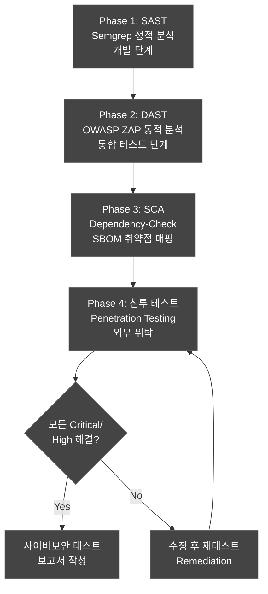
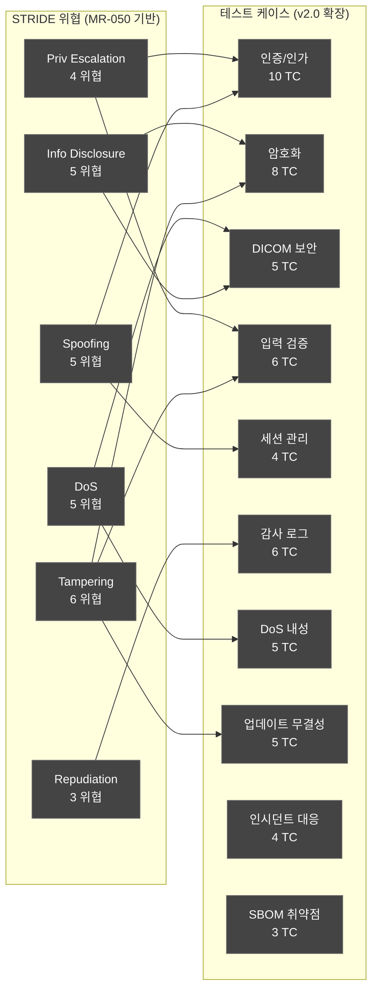
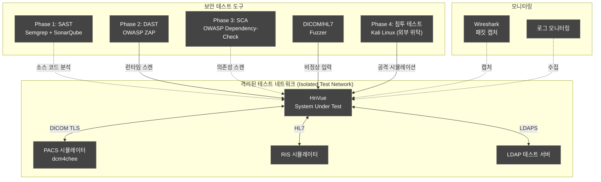
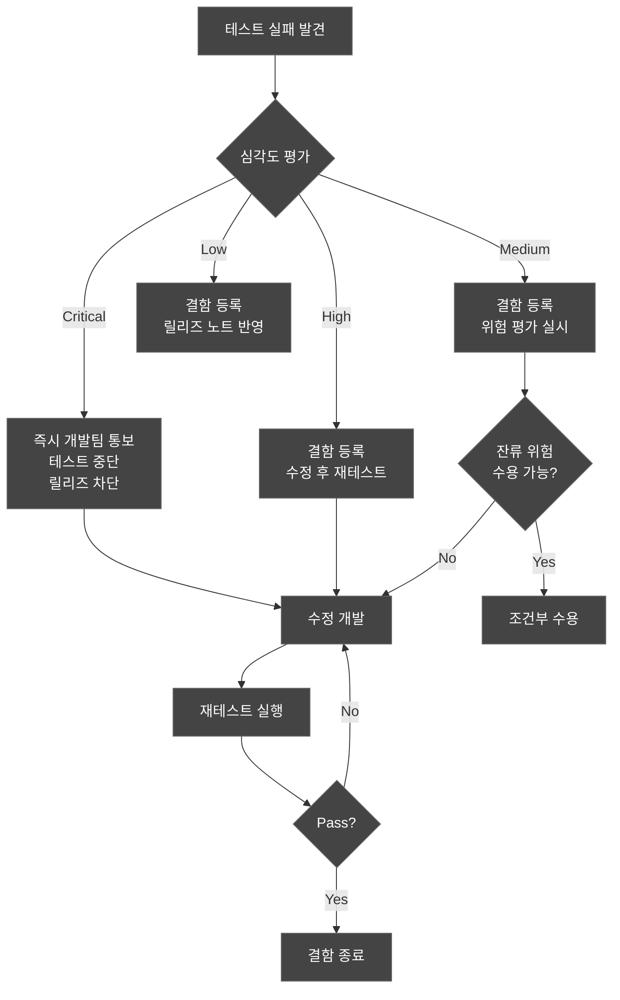
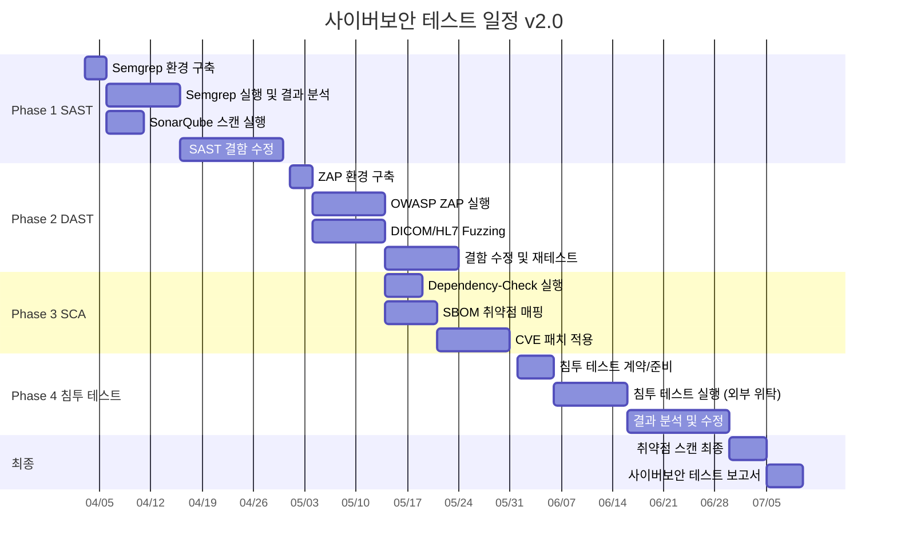

# 사이버보안 테스트 계획서 (Cybersecurity Test Plan)
## HnVue Console SW

---

## 문서 메타데이터 (Document Metadata)

| 항목 | 내용 |
|------|------|
| **문서 ID** | CSTP-XRAY-GUI-001 |
| **문서명** | HnVue Console SW 사이버보안 테스트 계획서 |
| **버전** | v2.0 |
| **작성일** | 2026-04-03 |
| **작성자** | 사이버보안 팀 (Cybersecurity Team) |
| **검토자** | SW 아키텍트, QA 팀장 |
| **승인자** | 의료기기 RA/QA 책임자 |
| **상태** | Draft |
| **기준 규격** | FDA Section 524B, FDA Premarket Cybersecurity Guidance 2023, OWASP, NIST SP 800-115, IEC 81001-5-1 |

### 개정 이력 (Revision History)

| 버전 | 날짜 | 변경 내용 | 작성자 |
|------|------|----------|--------|
| v1.0 | 2026-03-18 | 최초 작성 — TM-XRAY-GUI-001 위협 모델 기반 | 사이버보안 팀 |
| v2.0 | 2026-04-03 | 4 Phase 테스트 체계 재정의 (SAST→DAST→SCA→침투); STRIDE 기반 위협 매핑 강화 (MR-050); RBAC 우회 테스트 추가; PHI 암호화 검증 확대 (AES-256, TLS 1.3); 감사 로그 변조 방지 테스트 추가; SBOM 취약점 매칭 검증 추가; CVD 프로세스 검증 추가 (MR-037); 인시던트 대응 프로세스 테스트 추가 (MR-037); 업데이트 서명/무결성/롤백 테스트 추가 (MR-039); 각 TC에 MR/PR/SWR 추적성 명시 | 사이버보안 팀 |

---

## 목차 (Table of Contents)

1. 목적 및 범위
2. 참조 문서
3. 4 Phase 사이버보안 테스트 전략
4. STRIDE 기반 테스트 커버리지
5. 테스트 케이스
6. 테스트 환경
7. 테스트 도구
8. 합격/불합격 기준
9. OWASP Top 10 매핑
10. 일정

---

## 1. 목적 및 범위 (Purpose and Scope)

### 1.1 목적 (Purpose)

본 문서는 HnVue Console SW에 대한 사이버보안 테스트 계획 v2.0을 수립한다. MRD v3.0 4-Tier Tier 1 요구사항인 MR-033 (RBAC), MR-034 (PHI 암호화), MR-035 (감사 로그), MR-036 (SBOM), MR-037 (CVD+인시던트 대응), MR-039 (SW 무결성+업데이트 메커니즘), MR-050 (STRIDE 위협 모델링)의 유효성을 검증하고, FDA Section 524B 요구사항 충족을 실증한다.

v2.0에서는 4 Phase 테스트 체계를 정립하고, 보완 3건(인시던트 대응, 업데이트 메커니즘, STRIDE)에 대한 테스트 케이스를 추가하였다.

### 1.2 범위 (Scope)

| 구분 | 내용 |
|------|------|
| **대상** | HnVue Console SW v1.x Release Candidate |
| **Phase 1** | SAST — Semgrep 기반 정적 분석 |
| **Phase 2** | DAST — OWASP ZAP 기반 동적 분석 |
| **Phase 3** | SCA — OWASP Dependency-Check 기반 컴포넌트 분석 |
| **Phase 4** | 침투 테스트 — 외부 보안 업체 위탁 |
| **위협 모델** | STRIDE 기반 (MR-050), 28개 위협, 28개 RC |
| **범위 내** | GUI 애플리케이션, DICOM/HL7 인터페이스, 로컬 DB, 인증 체계 |
| **범위 외** | 병원 IT 인프라, HW 보안, Phase 2 클라우드 |

---

## 2. 참조 문서 (Reference Documents)

| 문서 ID | 문서명 | 관계 |
|---------|--------|------|
| DOC-001 | Market Requirements Document (MRD) | v3.0, 4-Tier 체계 |
| DOC-016 | 사이버보안 계획서 (Cybersecurity Plan) | 상위 사이버보안 전략 |
| DOC-017 | 위협 모델링 보고서 (Threat Model) | 식별된 위협 및 대응 조치 |
| DOC-019 | SBOM (소프트웨어 부품표) | SCA 대상 컴포넌트 |
| DOC-032 | RTM v2.0 | MR-036, MR-037, MR-039, MR-050 추적성 |
| FDA Section 524B | Cybersecurity Requirements for Devices | - |
| IEC 81001-5-1 | Health Software Cybersecurity | Clause 5.2, Clause 8 |

---

## 3. 4 Phase 사이버보안 테스트 전략

### 3.1 4 Phase 테스트 전략 개요

### 3.2 Phase별 전략 상세

| Phase | 도구 | 목적 | 시기 | 담당 |
|-------|------|------|------|------|
| **Phase 1: SAST** | **Semgrep** + SonarQube | 소스 코드 취약점 식별 | 개발 단계 (CI/CD 자동화) | 개발팀 + 보안팀 |
| **Phase 2: DAST** | **OWASP ZAP** + Burp Suite | 런타임 취약점 식별 | 통합 테스트 단계 | 보안팀 |
| **Phase 3: SCA** | **OWASP Dependency-Check** | SBOM 기반 CVE 취약점 매핑 | 빌드 시 자동 | 보안팀 |
| **Phase 4: 침투 테스트** | Metasploit, Kali Linux | 실제 공격 시뮬레이션 | 시스템 테스트 단계 | **외부 보안 업체 위탁** |

### 3.3 Phase 간 의존성 및 게이트

| 게이트 | 조건 | 다음 Phase 진입 기준 |
|--------|------|-------------------|
| Phase 1 → Phase 2 | SAST Critical 0건, High 0건 | Semgrep 결과 전체 해소 |
| Phase 2 → Phase 3 | DAST Critical 0건 | ZAP 결과 Critical 해소 |
| Phase 3 → Phase 4 | SCA CVSS ≥ 9.0 CVE 0건 | SBOM 고위험 취약점 패치 |
| Phase 4 → 릴리즈 | 침투 테스트 Critical/High 0건 | 외부 업체 확인서 수령 |

---

## 4. STRIDE 기반 테스트 커버리지 【MR-050 신규】

### 4.1 STRIDE 매핑 개요

### 4.2 STRIDE 위협별 테스트 TC 매핑

| STRIDE 카테고리 | 위협 ID | 위협 설명 | 테스트 TC |
|---------------|---------|---------|---------|
| Spoofing | TM-S-001 | 사용자 자격증명 위조 | CSTC-AUTH-001, 002, 006 |
| Spoofing | TM-S-002 | 디바이스/AE Title 위조 | CSTC-DICOM-001 |
| Spoofing | TM-S-003 | 세션 탈취/고정 | CSTC-SESS-001-004 |
| Tampering | TM-T-001 | 전송 중 DICOM 데이터 변조 | CSTC-DICOM-004 |
| Tampering | TM-T-002 | 로컬 DB 직접 변조 | CSTC-ENC-003 |
| Tampering | TM-T-003 | 촬영 파라미터 조작 | CSTC-INJ-006 |
| Tampering | TM-T-004 | SW 업데이트 패키지 변조 | CSTC-UPD-001-003 |
| Repudiation | TM-R-001 | 보안 이벤트 감사 로그 부인 | CSTC-LOG-001-003 |
| Repudiation | TM-R-002 | 설정 변경 감사 로그 조작 | CSTC-LOG-004-006 |
| Info Disclosure | TM-I-001 | 전송 중 PHI 노출 | CSTC-ENC-001, 002 |
| Info Disclosure | TM-I-002 | 저장 중 PHI 노출 | CSTC-ENC-003, 004 |
| DoS | TM-D-001 | DICOM Association Flood | CSTC-DOS-001, 003 |
| DoS | TM-D-003 | 디스크 공간 소진 | CSTC-DOS-003 |
| Elevation | TM-E-001 | RBAC 우회 권한 상승 | CSTC-AUTH-005, 007, 008 |
| Elevation | TM-E-002 | SQL/LDAP Injection | CSTC-INJ-001-004 |

---

## 5. 테스트 케이스 (Test Cases)

### 5.1 TC ID 체계

`CSTC-{Category}-{Seq:3}`

| 접두사 | 카테고리 |
|--------|---------|
| CSTC-AUTH | 인증/인가 (Authentication/Authorization) |
| CSTC-ENC | 암호화 (Encryption) |
| CSTC-DICOM | DICOM 네트워크 보안 |
| CSTC-INJ | 입력 검증 (Input Validation/Injection) |
| CSTC-SESS | 세션 관리 (Session Management) |
| CSTC-LOG | 감사 로그 (Audit Logging) |
| CSTC-DOS | 서비스 거부 내성 (DoS Resilience) |
| CSTC-UPD | 업데이트 무결성 (Update Integrity) |
| CSTC-INC | 인시던트 대응 (Incident Response) |
| CSTC-SBOM | SBOM 취약점 매핑 |

### 5.2 인증/인가 테스트 — RBAC 우회 포함 (10개)

| TC ID | 테스트 명 | STRIDE | TM | 방법 | 기대 결과 | MR | PR | SWR |
|-------|----------|--------|-----|------|---------|----|----|-----|
| CSTC-AUTH-001 | Brute Force 로그인 시도 | S | TM-S-001 | 자동화 도구 (Hydra) | 5회 실패 후 계정 잠금 (15분) | MR-033 | PR-070 | SWR-CS-002 |
| CSTC-AUTH-002 | 기본 계정/비밀번호 사용 불가 확인 | S | TM-S-001 | 수동 테스트 | 기본 자격증명 로그인 실패 | MR-033 | PR-070 | SWR-CS-001 |
| CSTC-AUTH-003 | LDAP Injection 시도 | S, E | TM-S-001 | 페이로드 주입 | 모든 LDAP 특수문자 이스케이프 | MR-033 | PR-070 | SWR-CS-001 |
| CSTC-AUTH-004 | 세션 만료 후 재사용 시도 | S | TM-S-003 | 만료 토큰 재전송 | 401 Unauthorized 응답 | MR-033 | PR-071 | SWR-CS-010 |
| CSTC-AUTH-005 | **RBAC 우회 시도 — Technician이 Admin API 직접 호출** | E | TM-E-001 | 권한 없는 API 호출 | 403 Forbidden 응답, 감사 로그 기록 | MR-033 | PR-072 | SWR-CS-030 |
| CSTC-AUTH-006 | 비밀번호 복잡성 규칙 검증 | S | TM-S-001 | 약한 비밀번호 시도 | 대소문자+숫자+특수 12자 이상 강제 | MR-033 | PR-070 | SWR-CS-020 |
| CSTC-AUTH-007 | **RBAC 우회 — 역할 파라미터 조작** | E | TM-E-001 | HTTP 파라미터 변조 | 역할 조작 차단, 정상 역할로 동작 | MR-033 | PR-072 | SWR-CS-030 |
| CSTC-AUTH-008 | **RBAC 우회 — URL 직접 접근** | E | TM-E-001 | Admin URL 직접 접근 | 인증+인가 확인 후 차단, 감사 로그 | MR-033 | PR-072 | SWR-CS-030 |
| CSTC-AUTH-009 | MFA 우회 시도 (구현 시) | S | TM-S-001 | MFA 단계 건너뛰기 | MFA 없이 인증 불가 | MR-033 | PR-070 | SWR-CS-001 |
| CSTC-AUTH-010 | 비활성 계정 로그인 차단 | S | TM-S-001 | 비활성 계정 로그인 시도 | 비활성 계정 거부, 메시지 표시 | MR-033 | PR-070 | SWR-CS-001 |

### 5.3 암호화 테스트 — PHI 검증 확대 (AES-256, TLS) (8개)

| TC ID | 테스트 명 | STRIDE | TM | 방법 | 기대 결과 | MR | PR | SWR |
|-------|----------|--------|-----|------|---------|----|----|-----|
| CSTC-ENC-001 | **DICOM TLS 1.3 적용 확인** | I | TM-I-001 | Wireshark 패킷 분석 | **TLS 1.3** 암호화 확인 (TLS 1.2 이하 차단) | MR-034 | PR-055 | SWR-DC-060 |
| CSTC-ENC-002 | HL7/FHIR TLS 적용 확인 | I | TM-I-001 | 패킷 분석 | 평문 전송 없음, TLS 적용 확인 | MR-034 | PR-055 | SWR-DC-060 |
| CSTC-ENC-003 | **로컬 DB AES-256 암호화 검증** | T | TM-T-002 | DB 파일 직접 읽기 | 평문 데이터 추출 불가, AES-256 확인 | MR-034 | PR-073 | SWR-CS-040 |
| CSTC-ENC-004 | **저장 시 PHI 암호화 (At Rest) — AES-256-GCM** | I | TM-I-001 | 파일 시스템 분석 | AES-256-GCM 암호화, IV 포함 확인 | MR-034 | PR-073 | SWR-CS-040 |
| CSTC-ENC-005 | 취약한 암호화 알고리즘 탐지 | I | TM-I-001 | SAST (Semgrep) + 구성 검토 | DES, RC4, MD5, SHA-1 미사용 | MR-034 | PR-073 | SWR-CS-040 |
| CSTC-ENC-006 | 인증서 유효성 검증 | S | TM-S-002 | 만료/잘못된 인증서 제시 | 연결 거부, 오류 로그 | MR-034 | PR-055 | SWR-DC-060 |
| CSTC-ENC-007 | **PHI 복호화 — 잘못된 키 사용** | T | TM-T-002 | 잘못된 복호화 키 제공 | DecryptionFailedException, 접근 거부 | MR-034 | PR-073 | SWR-CS-040 |
| CSTC-ENC-008 | 키 관리 — 암호화 키 노출 방지 | I | TM-I-002 | 설정 파일, 로그 분석 | 암호화 키 평문 미노출 | MR-034 | PR-073 | SWR-CS-040 |

### 5.4 DICOM 네트워크 보안 테스트 (5개)

| TC ID | 테스트 명 | STRIDE | TM | 방법 | 기대 결과 | MR | PR | SWR |
|-------|----------|--------|-----|------|---------|----|----|-----|
| CSTC-DICOM-001 | 미등록 AE Title 접속 시도 | S | TM-S-002 | 위조 AE Title로 연결 | Association Reject | MR-019 | PR-050 | SWR-DC-010 |
| CSTC-DICOM-002 | 비정상 DICOM PDU 전송 (Fuzzing) | D | TM-D-004 | DICOM Fuzzer | 크래시 없이 에러 처리 | MR-019 | PR-050 | SWR-DC-010 |
| CSTC-DICOM-003 | DICOM 대량 Association 요청 (DoS) | D | TM-D-001 | 동시 100+ 연결 | Rate Limiting 적용, 서비스 유지 | MR-019 | PR-050 | SWR-DC-010 |
| CSTC-DICOM-004 | DICOM 영상 무결성 검증 | T | TM-T-001 | 전송 중 비트 변조 | 무결성 검증 실패 탐지 | MR-034 | PR-050 | SWR-DC-010 |
| CSTC-DICOM-005 | DICOM 메타데이터 최소 노출 확인 | I | TM-I-004 | C-FIND 응답 분석 | 불필요 태그 제외 | MR-035 | PR-050 | SWR-DC-020 |

### 5.5 입력 검증/인젝션 테스트 (6개)

| TC ID | 테스트 명 | STRIDE | TM | 방법 | 기대 결과 | MR | PR | SWR |
|-------|----------|--------|-----|------|---------|----|----|-----|
| CSTC-INJ-001 | SQL Injection (환자 검색) | E | TM-E-002 | SQLMap | 인젝션 차단, 매개변수화 쿼리 | MR-033 | PR-060 | SWR-DB-010 |
| CSTC-INJ-002 | SQL Injection (로그인) | E | TM-E-002 | 수동 페이로드 | 인젝션 차단 | MR-033 | PR-070 | SWR-CS-001 |
| CSTC-INJ-003 | Path Traversal (파일 접근) | I | TM-I-003 | ../../../ 페이로드 | 경로 이탈 차단 | MR-033 | PR-060 | SWR-DB-010 |
| CSTC-INJ-004 | Command Injection (시스템 명령) | E | TM-E-001 | OS 명령 주입 | 명령 실행 차단 | MR-033 | PR-060 | SWR-DB-010 |
| CSTC-INJ-005 | XML/HL7 Injection | T | TM-T-005 | 비정상 HL7 메시지 | 파싱 에러 처리, 크래시 없음 | MR-033 | PR-052 | SWR-DC-040 |
| CSTC-INJ-006 | 촬영 파라미터 범위 초과 입력 | T | TM-T-003 | 경계값 초과 파라미터 | 범위 제한 적용, 거부 | MR-003 | PR-010 | SWR-WF-001 |

### 5.6 세션 관리 테스트 (4개)

| TC ID | 테스트 명 | STRIDE | TM | 방법 | 기대 결과 | MR | PR | SWR |
|-------|----------|--------|-----|------|---------|----|----|-----|
| CSTC-SESS-001 | 세션 타임아웃 동작 확인 | S | TM-S-003 | 유휴 대기 | 설정 시간 후 자동 로그아웃 | MR-033 | PR-071 | SWR-CS-010 |
| CSTC-SESS-002 | 동시 세션 제한 확인 | S | TM-S-003 | 다중 로그인 시도 | 동시 세션 수 제한 | MR-033 | PR-071 | SWR-CS-010 |
| CSTC-SESS-003 | 세션 고정 (Session Fixation) 공격 | S | TM-S-003 | 사전 세션 ID 설정 | 로그인 시 세션 ID 재생성 | MR-033 | PR-071 | SWR-CS-010 |
| CSTC-SESS-004 | 로그아웃 후 세션 무효화 | S | TM-S-003 | 로그아웃 후 토큰 재사용 | 세션 완전 무효화 | MR-033 | PR-071 | SWR-CS-010 |

### 5.7 감사 로그 테스트 — 변조 방지 포함 (6개)

| TC ID | 테스트 명 | STRIDE | TM | 방법 | 기대 결과 | MR | PR | SWR |
|-------|----------|--------|-----|------|---------|----|----|-----|
| CSTC-LOG-001 | 로그인/로그아웃 감사 기록 | R | TM-R-001 | 이벤트 발생 후 로그 확인 | 타임스탬프, 사용자, IP 기록 | MR-035 | PR-063 | SWR-SA-030 |
| CSTC-LOG-002 | 촬영 활동 감사 기록 | R | TM-R-001 | 촬영 실행 후 로그 확인 | 촬영 파라미터, 환자 ID, 시간 기록 | MR-035 | PR-063 | SWR-SA-030 |
| CSTC-LOG-003 | **감사 로그 변조 방지 — 직접 수정 시도** | R | TM-R-002 | 로그 파일/DB 직접 수정 | 무결성 검증 실패 탐지, 변조 거부 | MR-035 | PR-063 | SWR-CS-050 |
| CSTC-LOG-004 | **감사 로그 변조 방지 — 삭제 시도** | R | TM-R-002 | 감사 로그 레코드 DELETE 시도 | 삭제 차단, 변조 시도 자체 기록 | MR-035 | PR-063 | SWR-CS-050 |
| CSTC-LOG-005 | 설정 변경 감사 기록 | R | TM-R-002 | 설정 변경 후 로그 확인 | 변경 전/후 값, 변경자 기록 | MR-035 | PR-063 | SWR-SA-030 |
| CSTC-LOG-006 | **RBAC 우회 시도 감사 기록** | R, E | TM-R-001 | 권한 없는 동작 시도 후 로그 확인 | 모든 UNAUTHORIZED 접근 시도 기록 | MR-035 | PR-063 | SWR-CS-050 |

### 5.8 서비스 거부 내성 테스트 (5개)

| TC ID | 테스트 명 | STRIDE | TM | 방법 | 기대 결과 | MR | PR | SWR |
|-------|----------|--------|-----|------|---------|----|----|-----|
| CSTC-DOS-001 | TCP SYN Flood on DICOM Port | D | TM-D-001 | hping3 SYN Flood | 서비스 유지, 정상 연결 가능 | MR-019 | PR-050 | SWR-DC-010 |
| CSTC-DOS-002 | 대량 DICOM C-FIND 요청 | D | TM-D-002 | 자동화 쿼리 반복 | Rate Limiting, 서비스 유지 | MR-019 | PR-050 | SWR-DC-010 |
| CSTC-DOS-003 | 디스크 공간 소진 테스트 | D | TM-D-003 | 대용량 파일 전송 | 용량 경고, 자동 정리 | MR-039 | PR-061 | SWR-SA-020 |
| CSTC-DOS-004 | 메모리 소진 테스트 | D | TM-D-004 | 비정상 대량 요청 | OOM 보호, 서비스 복구 | MR-039 | PR-061 | SWR-SA-020 |
| CSTC-DOS-005 | 네트워크 단절 복구 테스트 | D | TM-D-005 | 네트워크 케이블 분리/연결 | 자동 재연결, 큐 재전송 | MR-019 | PR-054 | SWR-DC-055 |

### 5.9 SW 업데이트 서명/무결성/롤백 테스트 【MR-039 신규】 (5개)

| TC ID | 테스트 명 | STRIDE | TM | 방법 | 기대 결과 | MR | PR | SWR |
|-------|----------|--------|-----|------|---------|----|----|-----|
| CSTC-UPD-001 | **변조된 업데이트 패키지 설치 시도** | T | TM-T-004 | 서명 제거/변조 패키지 | 설치 거부, 경고 표시, 감사 로그 기록 | MR-039 | PR-060 | SWR-SA-050 |
| CSTC-UPD-002 | **다운그레이드 공격 시도 — 이전 버전 설치** | T | TM-T-004 | 이전 버전 패키지 설치 시도 | 버전 롤백 차단 (의도적 롤백 제외) | MR-039 | PR-060 | SWR-SA-050 |
| CSTC-UPD-003 | **업데이트 서버 MITM 공격** | T | TM-T-004 | 프록시 인증서 제시 | Certificate Pinning, 연결 거부 | MR-039 | PR-060 | SWR-SA-050 |
| CSTC-UPD-004 | **업데이트 실패 후 자동 롤백 검증** | T | TM-T-004 | 업데이트 중간 실패 주입 | 이전 버전으로 자동 롤백, 무결성 확인 | MR-039 | PR-060 | SWR-SA-051 |
| CSTC-UPD-005 | **SW 무결성 자가 점검 — 시작 시** | T | TM-T-004 | 시작 로그 확인 | 시작 시 무결성 해시 검증, 변조 탐지 | MR-039 | PR-060 | SWR-SA-050 |

### 5.10 인시던트 대응 프로세스 테스트 【MR-037 신규】 (4개)

| TC ID | 테스트 명 | 위협 | 방법 | 기대 결과 | MR | PR | SWR |
|-------|----------|------|------|---------|----|----|-----|
| CSTC-INC-001 | **보안 인시던트 탐지 — 반복 로그인 실패** | S | Brute Force 시뮬레이션 | 인시던트 탐지, 관리자 알림, 계정 잠금, 감사 로그 | MR-037 | PR-073 | SWR-CS-002 |
| CSTC-INC-002 | **인시던트 격리 — 공격 계정 격리 프로세스** | S, E | 공격 탐지 후 격리 절차 수행 | 공격 계정 자동 격리, 복구 워크플로우 동작 | MR-037 | PR-073 | SWR-CS-002 |
| CSTC-INC-003 | **CVD 프로세스 — 취약점 보고 접수 및 처리** | - | 테스트 취약점 보고 생성 | CVD 워크플로우 동작, 우선순위 평가, 패치 계획 수립 | MR-037 | PR-073 | SWR-CS-060 |
| CSTC-INC-004 | **인시던트 복구 — 시스템 복원 확인** | T | 인시던트 복구 절차 수행 | 시스템 정상 상태 복원, 복구 시간 기록 | MR-037 | PR-073 | SWR-CS-002 |

### 5.11 SBOM 취약점 매핑 검증 【MR-036 신규】 (3개)

| TC ID | 테스트 명 | 방법 | 기대 결과 | MR | PR | SWR |
|-------|----------|------|---------|----|----|-----|
| CSTC-SBOM-001 | **SBOM 생성 완전성 검증** | SBOM 파일 검토 | 모든 소프트웨어 컴포넌트 (SOUP 포함) SBOM에 기재 | MR-036 | PR-073 | SWR-CS-060 |
| CSTC-SBOM-002 | **SBOM 기반 CVE 취약점 매핑 — OWASP Dependency-Check** | Dependency-Check 실행 | CVSS ≥ 9.0 CVE 0건 (High CVE 패치 계획 수립) | MR-036 | PR-073 | SWR-CS-060 |
| CSTC-SBOM-003 | **SBOM 컴포넌트 라이선스 준수 검증** | 라이선스 스캔 도구 실행 | GPL/LGPL 등 라이선스 충돌 0건 | MR-036 | PR-073 | SWR-CS-060 |

### 5.12 테스트 케이스 요약 (v2.0)

| 카테고리 | TC 수 | Critical | High | Medium |
|----------|-------|----------|------|--------|
| 인증/인가 (AUTH) | 10 | 4 | 4 | 2 |
| 암호화 (ENC) | 8 | 3 | 3 | 2 |
| DICOM 보안 | 5 | 2 | 2 | 1 |
| 입력 검증 (INJ) | 6 | 3 | 2 | 1 |
| 세션 관리 (SESS) | 4 | 1 | 2 | 1 |
| 감사 로그 (LOG) | 6 | 2 | 3 | 1 |
| DoS 내성 | 5 | 2 | 2 | 1 |
| 업데이트 무결성 (UPD) | 5 | 3 | 2 | 0 |
| 인시던트 대응 (INC) | 4 | 2 | 2 | 0 |
| SBOM 취약점 | 3 | 1 | 1 | 1 |
| **합계** | **56** | **23** | **23** | **10** |

---

## 6. 테스트 환경 (Test Environment)

### 6.1 테스트 환경 아키텍처

### 6.2 환경 사양

| 구성요소 | 사양 | 용도 |
|----------|------|------|
| SUT (System Under Test) | 배포 동일 사양 (i7, 32GB, Win 10 IoT) | 테스트 대상 |
| SAST Server | Semgrep OSS + SonarQube Enterprise | Phase 1 소스 코드 분석 |
| DAST Workstation | OWASP ZAP + Burp Suite Pro | Phase 2 동적 분석 |
| SCA Server | OWASP Dependency-Check + SBOM 파서 | Phase 3 컴포넌트 분석 |
| Kali Linux | 최신 버전, Full Toolset | Phase 4 침투 테스트 (외부 위탁) |
| Network TAP | 기가비트 미러링 | 패킷 캡처 |
| 격리 네트워크 | VLAN 격리, 인터넷 차단 | 테스트 안전성 |

---

## 7. 테스트 도구 (Test Tools)

| 도구 | 유형 | Phase | 용도 | 라이선스 |
|------|------|-------|------|---------|
| **Semgrep** | SAST | Phase 1 | C#/.NET/C++ 정적 분석 | Open Source |
| SonarQube | SAST | Phase 1 | 코드 품질 + 보안 분석 | Commercial |
| **OWASP ZAP** | DAST | Phase 2 | 동적 취약점 스캔 | Open Source |
| Burp Suite Pro | DAST | Phase 2 | 고급 동적 분석 | Commercial |
| **OWASP Dependency-Check** | SCA | Phase 3 | SBOM CVE 매핑 | Open Source |
| Nmap | 취약점 스캔 | Phase 4 | 포트/서비스 스캔 | Open Source |
| Wireshark | 네트워크 분석 | 전 Phase | 패킷 분석, TLS 확인 | Open Source |
| SQLMap | 인젝션 테스트 | Phase 2 | SQL Injection 자동화 | Open Source |
| Hydra | Brute Force | Phase 2 | 인증 공격 시뮬레이션 | Open Source |
| hping3 | DoS 테스트 | Phase 2 | SYN Flood 등 DoS 테스트 | Open Source |
| DICOM Fuzzer | Fuzzing | Phase 2 | DICOM 프로토콜 퍼징 | Internal |
| Metasploit | 침투 테스트 | Phase 4 | 침투 테스트 프레임워크 | Open Source |

---

## 8. 합격/불합격 기준 (Pass/Fail Criteria)

### 8.1 전체 합격 기준 (v2.0)

| 기준 | 조건 | 비고 |
|------|------|------|
| **Critical TC Pass** | 100% (23/23) | Zero Tolerance |
| **High TC Pass** | 100% (23/23) | Zero Tolerance |
| **Medium TC Pass** | ≥ 95% | 1건 이하 편차, 위험 평가 필수 |
| **Phase 1 SAST (Semgrep)** | Critical 0건, High 0건 | Blocker/Critical 완전 해소 |
| **Phase 2 DAST (ZAP)** | Critical 0건 | High는 위험 평가 후 조건부 허용 |
| **Phase 3 SCA (Dependency-Check)** | CVSS ≥ 9.0 CVE 0건 | 알려진 Critical CVE 없음 |
| **Phase 4 침투 테스트** | Critical/High 취약점 0건 | 외부 보안 업체 확인서 수령 |
| **OWASP Top 10** | 해당 항목 전체 Pass | 의료기기 관련 항목 |
| **RBAC 우회 시도** | 모든 우회 시도 차단 | MR-033 Tier 1 요건 |
| **PHI 암호화** | 평문 데이터 0건 (전송+저장) | MR-034 Tier 1 요건 |
| **감사 로그 불변성** | 변조 시도 0건 성공 | MR-035 Tier 1 요건 |

### 8.2 테스트 실패 시 처리 절차

---

## 9. OWASP Top 10 매핑 (v2.0)

| OWASP Top 10 (2021) | HnVue 관련성 | 관련 CSTC |
|---------------------|------------|---------|
| A01: Broken Access Control | High — RBAC 우회 방지 | CSTC-AUTH-005, 007, 008 |
| A02: Cryptographic Failures | High — PHI AES-256, TLS 1.3 | CSTC-ENC-001-005 |
| A03: Injection | High — SQL, LDAP, Command | CSTC-INJ-001-006 |
| A04: Insecure Design | Medium — STRIDE 위협 모델 기반 | DOC-017 전체 (MR-050) |
| A05: Security Misconfiguration | Medium — 기본 계정/설정 | CSTC-AUTH-002, 006 |
| A06: Vulnerable Components | High — SOUP/OTS CVE (SBOM) | CSTC-SBOM-001-003 |
| A07: Auth Failures | High — 인증 메커니즘 | CSTC-AUTH-001-004 |
| A08: SW/Data Integrity Failures | Critical — 업데이트 무결성 | CSTC-UPD-001-005 |
| A09: Security Logging Failures | Medium — 감사 추적 + 변조 방지 | CSTC-LOG-001-006 |
| A10: SSRF | Low — 서버 기능 제한적 | N/A |

---

## 10. 일정 (Schedule)

### 10.1 사이버보안 테스트 일정 (v2.0)

### 10.2 마일스톤

| 마일스톤 | 목표일 | 산출물 |
|----------|--------|--------|
| M-CST-1: Phase 1 SAST 완료 | 2026-04-30 | Semgrep 정적 분석 결과 보고서 |
| M-CST-2: Phase 2 DAST 완료 | 2026-05-31 | ZAP 동적 분석 결과 보고서 |
| M-CST-3: Phase 3 SCA 완료 | 2026-05-31 | SBOM 취약점 매핑 보고서 |
| M-CST-4: Phase 4 침투 테스트 완료 | 2026-06-30 | 침투 테스트 보고서 (외부 업체) |
| M-CST-5: 최종 보고서 | 2026-07-10 | 사이버보안 테스트 최종 보고서 |

---

*본 문서는 FDA Section 524B, IEC 81001-5-1 요구사항에 따라 작성되었으며, MRD v3.0 4-Tier Tier 1 보안 요구사항 (MR-033~039, MR-050) 및 보완 3건 (인시던트 대응, 업데이트 메커니즘, STRIDE)을 반영한 v2.0입니다.*

---
**문서 끝 (End of Document)** | CSTP-XRAY-GUI-001 v2.0 | 2026-04-03
