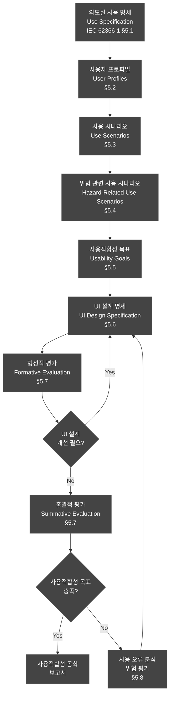
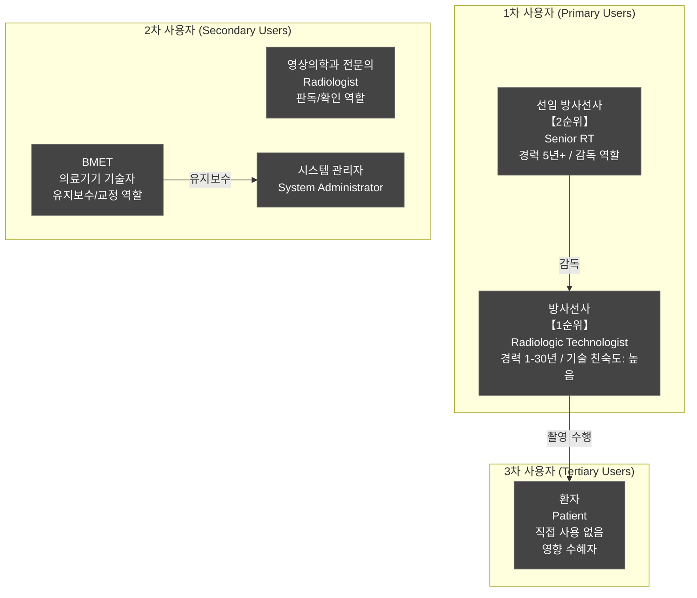
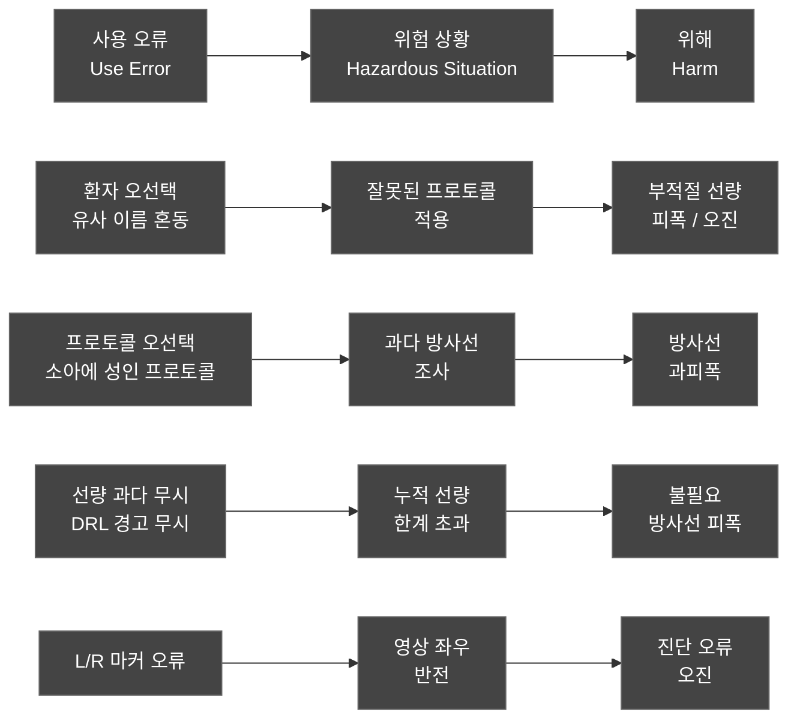
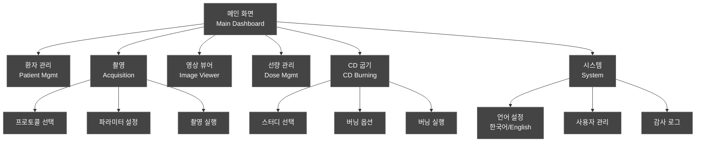
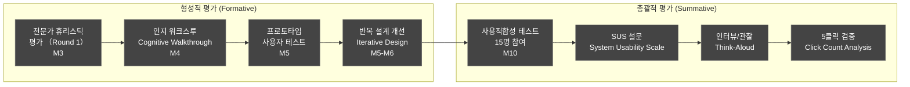
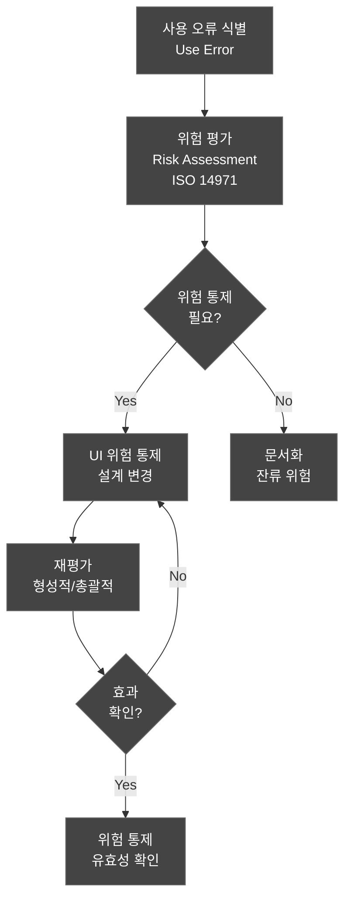
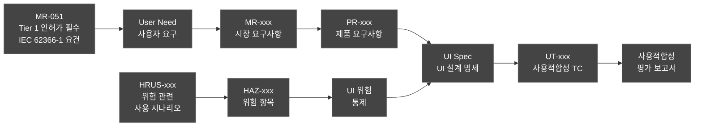

# 사용적합성 공학 파일 (Usability Engineering File)
## HnVue Console Software

---

## 문서 메타데이터 (Document Metadata)

| 항목 | 내용 |
|------|------|
| **문서 ID** | UEF-XRAY-GUI-001 |
| **문서명** | HnVue Console Software 사용적합성 공학 파일 |
| **버전** | v2.0 |
| **작성일** | 2026-04-03 |
| **작성자** | Human Factors Engineering (HFE) 팀 |
| **검토자** | 임상 자문위원, QA 팀장 |
| **승인자** | 의료기기 RA/QA 책임자 |
| **상태 (Status)** | Draft |
| **약어 규칙** | SW, HW, GUI, API, DB, UI, UX, OS 등은 풀 네임 사용 |
| **검토자** | 임상 자문위원, QA 팀장 |
| **승인자** | 의료기기 RA/QA 책임자 |
| **상태** | Draft |
| **기준 규격** | IEC 62366-1:2015+AMD1:2020, FDA Human Factors Guidance 2016, IEC 62366-2 (TR), AAMI HE75 |

### 개정 이력 (Revision History)

| 버전 | 날짜 | 변경 내용 | 작성자 |
|------|------|----------|--------|
| v1.0 | 2026-03-18 | 최초 작성 — IEC 62366-1 전체 프로세스 적용 | HFE 팀 |
| v2.0 | 2026-04-03 | IEC 62366-1 프로세스 완전 반영 (전 절 산출물 명시); 사용자 프로필 우선순위 재정의 (방사선사 1순위, 선임 방사선사, BMET); Use Specification 확장 (5클릭 워크플로우, CD Burning, 한/영 전환); 위험 관련 사용 시나리오 추가 (환자 오선택, 프로토콜 오선택, 선량 과다); 사용적합성 목표 개정 (5클릭 이내, 90% 성공률, 4시간 교육 후 독립 수행); 형성적/총괄적 평가 계획 강화; MR-051 추적성 명시; MR-072 CD Burning 사용 시나리오 추가; UI → User Interface, UX → User Experience 확장 | HFE 팀 |

---

## 목차 (Table of Contents)

1. 목적 및 범위
2. 참조 규격
3. 사용적합성 공학 프로세스 개요
4. 의도된 사용 명세 (Use Specification)
5. 사용자 프로파일
6. 사용 시나리오
7. 위험 관련 사용 시나리오
8. 사용적합성 목표
9. UI 설계 명세
10. 사용적합성 평가 계획
11. 사용 오류 분석
12. 추적성

---

## 1. 목적 및 범위 (Purpose and Scope)

### 1.1 목적 (Purpose)

본 문서는 HnVue Console Software에 대한 사용적합성 공학 파일 (Usability Engineering File, UEF) v2.0로서, IEC 62366-1:2015+AMD1:2020의 전체 사용적합성 공학 프로세스 산출물을 통합 관리한다.

v2.0에서는 MRD v3.0 Tier 1 요구사항인 MR-051 (IEC 62366-1 사용성 공학 프로세스)을 완전 반영하고, 5클릭 워크플로우 (MR-003), CD Burning (MR-072), 한/영 UI 전환 (MR-045) 관련 사용 시나리오와 사용적합성 목표를 추가하였다.

**핵심 목표**:
1. **사용 오류로 인한 환자 위해 방지**: 방사선 과피폭, 환자 오인, 프로토콜 오선택 등 안전 관련 사용 오류 식별 및 완화
2. **IEC 62366-1 프로세스 완전 준수**: 의도된 사용 명세 → 사용 시나리오 → 위험 분석 → UI 설계 → 평가의 전 과정 문서화
3. **FDA HFE Guidance 충족**: 510(k) 제출 시 Human Factors Engineering 증거 제공
4. **MR-051 Tier 1 충족**: MFDS 인허가 필수 요건

### 1.2 범위 (Scope)

| 구분 | 내용 |
|------|------|
| **대상** | HnVue Console Software v1.x Phase 1 |
| **인터페이스** | GUI 전체 (촬영 워크플로우, CD Burning, 다국어 전환 포함) |
| **사용자** | 방사선사 (1순위), 선임 방사선사, BMET, 영상의학과 전문의, 시스템 관리자 |
| **환경** | 병원 촬영실, 판독실, 관리실 |

---

## 2. 참조 규격 (Referenced Standards)

| 규격 | 제목 | 적용 |
|------|------|------|
| IEC 62366-1:2015+AMD1:2020 | 의료기기 사용적합성 공학 | 전체 프레임워크 |
| IEC 62366-2:2016 (TR) | 사용적합성 공학 가이드 | 방법론 참조 |
| FDA HFE Guidance (2016) | Human Factors Engineering for Medical Devices | FDA 제출 요건 |
| AAMI HE75:2009/(R)2018 | Human Factors Engineering | 설계 지침 |
| ISO 14971:2019 | 위험 관리 | 사용 오류 위험 연계 |
| IEC 62304:2006+AMD1:2015 | SW 생명주기 프로세스 | SW 개발 연계 |
| MRD-XRAY-GUI-001 | Market Requirements Document | MR-051, MR-003, MR-045, MR-072 |

---

## 3. 사용적합성 공학 프로세스 개요 (Usability Engineering Process)

### 3.1 IEC 62366-1 프로세스 흐름 (v2.0 완전 반영)

### 3.2 IEC 62366-1 프로세스 산출물 매핑

| IEC 62366-1 절 | 산출물 | 본 문서 섹션 | v2.0 변경 |
|---------------|--------|------------|--------|
| §5.1 | 의도된 사용 명세 | 4장 | CD Burning, 한/영 전환 추가 |
| §5.2 | 사용자 인터페이스 특성 식별 | 4장, 5장 | 방사선사 1순위, BMET 추가 |
| §5.3 | 알려진 또는 예측 가능한 위해 식별 | 7장 | - |
| §5.4 | 위험 관련 사용 시나리오 식별 | 7장 | 환자 오선택, 프로토콜 오선택, 선량 과다 추가 |
| §5.5 | 사용적합성 목표 수립 | 8장 | 5클릭, 90% 성공률, 4시간 교육 |
| §5.6 | UI 설계 및 구현 | 9장 | - |
| §5.7 | 사용적합성 평가 | 10장 | 형성적/총괄적 평가 계획 강화 |
| §5.8 | 사용 오류 및 잔류 위험 문서화 | 11장 | - |

---

## 4. 의도된 사용 명세 (Use Specification)

### 4.1 의도된 사용 (Intended Use)

HnVue Console SW는 **의료용 진단 X-Ray 촬영장치의 GUI Console Software**로서, 방사선사가 환자 선택, 촬영 프로토콜 설정, X-Ray 촬영 실행, 영상 확인 및 PACS 전송을 수행하는 데 사용된다.

v2.0 추가 기능:
- **5클릭 워크플로우**: 환자 선택 → 프로토콜 선택 → 파라미터 확인 → 촬영 → PACS 전송을 최대 5클릭으로 완료 (MR-003)
- **CD/DVD Burning**: 촬영 영상을 환자 배포용 CD/DVD로 굽고 DICOM Viewer를 포함 (MR-072)
- **한/영 UI 전환**: 한국어/영어 UI 실시간 전환 (MR-045)

### 4.2 사용 환경 (Use Environment)

| 환경 | 특성 | UI 영향 |
|------|------|---------| 
| **촬영실 (X-Ray Room)** | 조명 변동, 소음, 환자 이동, 방사선 방호복 착용 | 고대비 디스플레이, 대형 버튼, 장갑 착용 터치 지원 |
| **판독실 (Reading Room)** | 저조도, 조용, 의료용 모니터 | DICOM GSDF 준수, 정밀 윈도잉 |
| **관리실 (Admin Office)** | 일반 사무 환경 | 표준 데스크탑 인터페이스 |
| **CD 굽기 스테이션** | 환자 배포 영상 준비 영역 | CD Burning UI, 간단한 조작 |

### 4.3 5클릭 워크플로우 Use Specification

| 클릭 | 과업 | UI 요소 | 허용 시간 |
|------|------|---------|---------|
| Click 1 | 환자 선택 (Worklist) | 환자 목록 행 선택 | - |
| Click 2 | 프로토콜 선택 | 신체 부위/방향 선택 | - |
| Click 3 | 파라미터 확인 | "확인" 버튼 | - |
| Click 4 | 촬영 실행 | "촬영" 버튼 | - |
| Click 5 | PACS 전송 | "전송" 버튼 또는 자동 전송 | 30초 이내 |
| **합계** | **전체 워크플로우** | **최대 5클릭** | **MR-003 충족** |

### 4.4 CD Burning Use Specification

| 과업 ID | 과업 | UI 요소 | 기대 결과 |
|---------|------|---------|---------|
| CD-US-001 | 스터디 선택 | 스터디 목록 체크박스 | 선택된 스터디 확인 |
| CD-US-002 | CD Burning 시작 | "CD 굽기" 버튼 | 버닝 진행 상태 표시 |
| CD-US-003 | 뷰어 포함 여부 선택 | 옵션 체크박스 | 뷰어 포함/미포함 |
| CD-US-004 | 버닝 완료 확인 | 완료 알림 | 성공 메시지 표시 |

### 4.5 사용 빈도

| 사용자 | 사용 빈도 | 1회 세션 시간 | 일일 사용 횟수 |
|--------|----------|------------|------------|
| 방사선사 (1순위) | 매일 (교대 근무) | 8-12시간 연속 | 40-80회 촬영 |
| 선임 방사선사 | 매일 (관리 포함) | 8-12시간 | 40-80회 촬영 + 감독 |
| BMET (의료기기 기술자) | 월 1-2회 (유지보수) | 1-3시간 | 유지보수 점검 |
| 영상의학과 전문의 | 필요 시 (판독) | 가변 | 10-30회 확인 |
| 시스템 관리자 | 주 1-2회 | 30분-1시간 | 불규칙 |

---

## 5. 사용자 프로파일 (User Profiles)

### 5.1 v2.0 사용자 우선순위 재정의

### 5.2 방사선사 프로파일 상세 (1순위)

| 항목 | 내용 |
|------|------|
| **역할** | 촬영 계획, 실행, 영상 품질 관리, PACS 전송, CD Burning |
| **교육 수준** | 방사선학과 학사 이상, 방사선사 면허 보유 |
| **경력 범위** | 신입 (1년) ~ 경력 (30년) |
| **기술 친숙도** | 디지털 X-Ray 시스템, PACS 사용 경험 |
| **신체적 특성** | 방사선 방호복/장갑 착용 시 터치 사용, 서서 작업 |
| **인지 부하** | 다수 환자 순차 처리, 응급 대응 시 높음 |
| **핵심 과업** | 환자 선택 → 프로토콜 설정 → 촬영 → 영상 확인 → 전송 (5클릭) |
| **사용적합성 특이사항** | 장갑 착용 시 터치 인식, 고조도/저조도 환경 대응 |

### 5.3 선임 방사선사 프로파일 상세 (2순위)

| 항목 | 내용 |
|------|------|
| **역할** | 일반 방사선사 업무 + 품질 관리 감독, 프로토콜 커스터마이징, 신규 교육 |
| **교육 수준** | 방사선학과 학사 이상, 방사선사 면허, 경력 5년+ |
| **기술 친숙도** | 매우 높음, 시스템 설정 변경 가능 |
| **핵심 과업** | 일반 촬영 + 프로토콜 관리 + QA/QC 수행 |

### 5.4 BMET (의료기기 기술자) 프로파일 상세

| 항목 | 내용 |
|------|------|
| **역할** | 하드웨어/소프트웨어 유지보수, QC 교정, 장애 대응 |
| **교육 수준** | 의료기기 기술 교육 이수, 제조사 교육 필수 |
| **기술 친숙도** | 매우 높음 (기술적 진단 도구 사용) |
| **핵심 과업** | 시스템 진단, QC 교정 실행, 업데이트 적용 |
| **접근 경로** | 서비스 모드 (별도 자격 인증 후 접근) |

---

## 6. 사용 시나리오 (Use Scenarios)

### 6.1 5클릭 워크플로우 시나리오 (MR-003)

### 6.2 사용 시나리오 목록 (v2.0)

| 시나리오 ID | 시나리오명 | 사용자 | 위험 관련 | 빈도 | v2.0 변경 |
|------------|----------|--------|---------|------|---------|
| US-001 | **5클릭 표준 흉부 PA/LAT 촬영** | 방사선사 (1순위) | Yes | 매우 높음 | MR-003 추가 |
| US-002 | 응급 환자 즉시 촬영 | 방사선사 (1순위) | Yes | 높음 | - |
| US-003 | 소아 환자 촬영 | 방사선사 (1순위) | Yes (선량) | 중간 | - |
| US-004 | 촬영 영상 품질 확인/재촬영 판단 | 방사선사 (1순위) | Yes | 높음 | - |
| US-005 | Worklist에서 환자 검색/선택 | 방사선사 (1순위) | Yes (오인) | 매우 높음 | - |
| US-006 | DICOM 영상 PACS 전송 | 방사선사 (1순위) | No | 높음 | - |
| US-007 | 영상 윈도잉/측정 (판독) | 전문의 | Yes (진단) | 높음 | - |
| US-008 | 선량 보고서 확인 | 방사선사 (1순위) | Yes | 중간 | - |
| US-009 | 시스템 설정/사용자 관리 | 시스템 관리자 | No | 낮음 | - |
| US-010 | 네트워크 장애 시 오프라인 촬영 | 방사선사 (1순위) | Yes | 낮음 | - |
| US-011 | 촬영 프로토콜 커스터마이징 | 선임 방사선사 | Yes (선량) | 낮음 | 선임 RT 추가 |
| US-012 | 여러 환자 연속 촬영 (바쁜 외래) | 방사선사 (1순위) | Yes (오인) | 높음 | - |
| **US-013** | **CD/DVD Burning — 환자 배포용** | **방사선사 (1순위)** | **Yes (PHI)** | **중간** | **MR-072 신규** |
| **US-014** | **한/영 UI 전환** | **방사선사/관리자** | **No** | **낮음** | **MR-045 신규** |
| **US-015** | **BMET 유지보수 모드 — QC 교정** | **BMET** | **Yes** | **낮음** | **BMET 신규** |

---

## 7. 위험 관련 사용 시나리오 (Hazard-Related Use Scenarios)

### 7.1 사용 오류 → 위해 경로

### 7.2 위험 관련 사용 시나리오 상세 (v2.0 확장)

| HRUS-ID | 사용 오류 | 위험 상황 | 잠재적 위해 | 심각도 | 관련 HAZ | UI 완화 조치 |
|---------|----------|----------|------------|--------|---------|------------|
| HRUS-001 | **Worklist에서 환자 오선택 — 유사 이름 혼동** | 다른 환자 프로토콜 적용 | 부적절 선량, 오진 | Critical | HAZ-001 | 환자 확인 팝업, 사진 표시, 2차 확인, 색상 강조 |
| HRUS-002 | **소아 프로토콜 미선택 — 성인용 프로토콜 사용** | 소아에 과다 선량 조사 | 방사선 과피폭 | Critical | HAZ-002 | 나이 기반 자동 프로토콜 제안, 경고 팝업 |
| HRUS-003 | **kVp/mAs 수동 설정 오류** | 과다 또는 과소 방사선 조사 | 과피폭 또는 재촬영 | High | HAZ-003 | 범위 제한, 시각적 게이지, DRL 경고 |
| HRUS-004 | L/R 마커 미표시 | 영상 좌우 혼동 | 진단 오류, 수술 부위 오류 | Critical | HAZ-004 | 강제 L/R 선택, 미선택 시 촬영 차단 |
| HRUS-005 | 촬영 중 다른 환자 데이터 화면 | 영상-환자 불일치 | 오진, 치료 오류 | High | HAZ-005 | 촬영 모드 잠금, 환자 전환 차단 |
| HRUS-006 | **재촬영 시 누적 선량 미확인 — DRL 경고 무시** | 불필요한 추가 피폭 | 누적 방사선 피폭 | High | HAZ-006 | 누적 선량 실시간 표시, DRL 초과 시 촬영 필요성 확인 |
| HRUS-007 | 윈도잉 오류로 영상 판독 오류 | 병변 미발견 또는 오인 | 진단 누락, 오진 | Medium | HAZ-007 | 자동 프리셋, GSDF 보정, 리셋 버튼 |
| HRUS-008 | PACS 전송 실패 미인지 | 영상 유실, 재촬영 필요 | 추가 피폭, 진단 지연 | High | HAZ-008 | 전송 상태 아이콘, 실패 시 알림, 자동 재시도 |
| **HRUS-009** | **CD Burning 시 잘못된 환자 데이터 포함** | 다른 환자 PHI가 CD에 포함 | PHI 무단 공개 | High | HAZ-009 | 버닝 전 환자/스터디 최종 확인 팝업 |
| **HRUS-010** | **한/영 전환 후 UI 레이블 오인식** | 전환된 언어로 과업 오수행 | 조작 오류, 워크플로우 오류 | Low | HAZ-010 | 전환 직후 안내 메시지, 핵심 버튼 아이콘 병기 |

### 7.3 v2.0 신규 위험 시나리오 — 선량 과다 시나리오

| HRUS-ID | 상황 | 발생 조건 | 완화 조치 | 잔류 위험 |
|---------|------|---------|---------|---------|
| HRUS-006 | 재촬영 반복으로 DRL 초과 | 방사선사가 DRL 경고를 반복 무시 | ① DRL 70%: WARNING 배너 ② DRL 90%: 확인 팝업 필수 ③ DRL 100%: 의사 승인 필요 | 의사 승인 후 진행 가능 (Residual) |

### 7.4 사용 오류 심각도 매트릭스

| 발생 가능성 \\ 심각도 | 경미 (Minor) | 중대 (Serious) | 치명적 (Critical) |
|--------------------|------------|--------------|----------------|
| **빈번 (Frequent)** | Medium | High | **Critical** |
| **가끔 (Occasional)** | Low | Medium | High |
| **드문 (Rare)** | Low | Low | Medium |

---

## 8. 사용적합성 목표 (Usability Goals)

### 8.1 정량적 목표 (v2.0 개정)

| 목표 ID | 지표 | 목표값 | v2.0 변경 | 측정 방법 |
|---------|------|--------|---------|---------|
| UG-001 | **5클릭 워크플로우 과업 성공률** | **≥ 90%** | 목표 신규 추가 (MR-003) | 총괄적 평가 |
| UG-002 | 안전-필수 과업 성공률 (환자 확인, L/R 마커, DRL 대응) | **100%** | - | 총괄적 평가 |
| UG-003 | 치명적 사용 오류 발생률 | **0건** | - | 총괄적 평가 |
| UG-004 | 표준 촬영 사이클 시간 (환자선택→전송) | **≤ 5클릭** | 클릭 수 목표 추가 | 클릭 카운터 |
| UG-005 | SUS 점수 (System Usability Scale) | **≥ 78 (Good)** | - | SUS 설문 |
| UG-006 | **독립 수행 가능 교육 시간** | **≤ 4시간** | v2.0 신규 (4시간 교육 후 독립 수행 가능) | 교육 후 테스트 |
| UG-007 | 표준 촬영 과업 성공률 (전체) | **≥ 90%** | - | 총괄적 평가 |
| UG-008 | 사용자 만족도 | **≥ 4.0/5.0** | - | Likert 척도 |
| UG-009 | **CD Burning 과업 성공률** | **≥ 95%** | MR-072 신규 | 총괄적 평가 |
| UG-010 | **한/영 전환 후 과업 성공률 유지** | **≥ 90%** | MR-045 신규 | 총괄적 평가 |

### 8.2 정성적 목표

1. **4시간 교육 후 독립 수행**: 신입 방사선사가 4시간 교육 후 감독 없이 기본 촬영 워크플로우 수행 가능
2. **5클릭 이내 완료**: 표준 촬영 워크플로우를 5클릭 이내 완료 (MR-003)
3. **응급 상황 3클릭**: 응급 상황에서 최소 3클릭 이내 촬영 시작 가능
4. **시각적 피드백**: 시각적 피드백을 통해 시스템 상태 즉시 인지
5. **BMET 독립 유지보수**: BMET가 1시간 이내 QC 교정 독립 수행 가능

---

## 9. UI 설계 명세 (UI Design Specification)

### 9.1 정보 구조 — v2.0 CD Burning 추가

### 9.2 안전-필수 UI 요소 색상 체계

| UI 요소 | 색상 | 의미 | 예시 |
|---------|------|------|------|
| **방사선 경고** | Red (#FF0000) | 즉시 주의 필요 | DRL 초과, 과피폭 경고 |
| **주의/확인** | Amber (#FFA500) | 확인 필요 | 재촬영 권고, 파라미터 이상 |
| **정상/완료** | Green (#00AA00) | 정상 상태 | 촬영 완료, 전송 성공 |
| **정보** | Blue (#0066CC) | 참고 정보 | 환자 정보, 시스템 상태 |
| **비활성** | Gray (#999999) | 사용 불가/대기 | 비활성 버튼, 대기 상태 |

### 9.3 5클릭 워크플로우 UI 설계 원칙

| 원칙 | 내용 | MR |
|------|------|-----|
| 클릭 최소화 | 촬영 워크플로우 5클릭 이내 완료 | MR-003 |
| 자동 전환 | 촬영 완료 시 영상 확인 화면 자동 전환 | MR-003 |
| 기본값 자동 설정 | 신체 부위 선택 시 파라미터 자동 설정 | MR-004 |
| 단계 표시 | 워크플로우 진행 단계 상단 진행바 표시 | MR-003 |

### 9.4 알림 계층 (Notification Hierarchy)

| 수준 | 유형 | 표시 방법 | 사용자 조치 | 예시 |
|------|------|----------|----------|------|
| 1 (Critical) | 모달 알림 + 오디오 | 화면 전체 차단 팝업 + 경고음 | 확인 필수 | 방사선 과피폭 경고 |
| 2 (Warning) | 모달 알림 | 팝업, 배경 어둡게 | 확인/취소 선택 | 파라미터 범위 초과 |
| 3 (Caution) | 인라인 배너 | 화면 상단 노란 배너 | 무시 가능 | DRL 근접 알림 |
| 4 (Info) | 토스트 알림 | 화면 우하단 자동 소멸 | 무시 가능 | 전송 완료 알림 |

---

## 10. 사용적합성 평가 계획 (Usability Evaluation Plan)

### 10.1 평가 전략 (v2.0 강화)

### 10.2 형성적 평가 (Formative Evaluation) — v2.0

#### 10.2.1 전문가 휴리스틱 평가

| 항목 | 내용 |
|------|------|
| **평가자** | HFE 전문가 3명, 임상 전문가 2명 (방사선사 포함) |
| **시기** | 프로토타입 단계 (M3) |
| **기준** | Nielsen 10 Heuristics + 의료기기 특화 기준 + IEC 62366-1 §5.7 |
| **산출물** | 발견 사항 목록, 심각도 등급, 권고 사항 |

**의료기기 특화 휴리스틱 (v2.0 추가)**:
1. 환자 식별 정보가 항상 명확하게 표시되는가?
2. 안전-필수 조작에 확인 단계가 있는가?
3. 오류 상태에서 안전한 기본값으로 복귀하는가?
4. 선량 정보가 실시간으로 정확하게 표시되는가?
5. **5클릭 워크플로우가 직관적인가?**
6. **CD Burning UI가 PHI 보호를 안내하는가?**
7. **언어 전환 후 핵심 기능이 명확히 인지되는가?**

#### 10.2.2 인지 워크스루

| 시나리오 | 사용자 | 평가 포커스 |
|----------|--------|-----------|
| 5클릭 표준 흉부 촬영 | 신입 방사선사 | 학습성, 5클릭 달성 여부 |
| 응급 촬영 | 숙련 방사선사 | 긴급 상황 효율, 오류 방지 |
| 소아 촬영 (선량 과다 예방) | 중간 경력 방사선사 | 선량 안전 기능 인지 |
| CD Burning | 방사선사 (1순위) | PHI 보호 인지, 조작 용이성 |
| 한/영 전환 후 촬영 | 방사선사/관리자 | 전환 후 과업 연속성 |
| BMET 유지보수 | BMET | 서비스 모드 접근성, 진단 기능 |

### 10.3 총괄적 평가 (Summative Evaluation) — v2.0

#### 10.3.1 사용적합성 테스트 계획

| 항목 | 내용 |
|------|------|
| **참여자** | 방사선사 8명, 선임 방사선사 2명, BMET 2명, 전문의 2명, 관리자 1명 (총 15명) |
| **경력 분포** | 신입 (1-3년) 5명, 중간 (3-10년) 5명, 경력 (10+년) 5명 |
| **환경** | 시뮬레이션 임상 환경 (밸리데이션 환경 공용) |
| **시기** | Phase 1 M10 |
| **기록 방법** | 화면 녹화, Think-Aloud, 관찰자 메모, 클릭 카운팅 |

#### 10.3.2 총괄적 평가 과업 목록 (v2.0)

| 과업 ID | 과업명 | 안전-필수 | 합격 기준 | MR |
|---------|--------|---------|---------|-----|
| UT-001 | 시스템 로그인 | No | 성공률 100% | - |
| UT-002 | Worklist에서 환자 선택 (환자 오선택 방지) | Yes | 정확한 환자 선택 100% | MR-001 |
| UT-003 | 흉부 PA 프로토콜 설정 | Yes | 올바른 프로토콜 100% | MR-004 |
| UT-004 | 파라미터 확인 후 촬영 실행 | Yes | 안전 파라미터 확인 100% | MR-003 |
| UT-005 | **5클릭 전체 워크플로우 완료** | Yes | **5클릭 이내 완료 ≥ 90%** | **MR-003** |
| UT-006 | 촬영 영상 품질 확인 | Yes | 품질 판단 정확도 ≥ 90% | - |
| UT-007 | 재촬영 결정 및 실행 | Yes | 올바른 판단 100% | - |
| UT-008 | L/R 마커 적용 | Yes | 올바른 적용 100% | - |
| UT-009 | **선량 정보 확인 (DRL 경고 대응)** | Yes | 정확한 확인 및 대응 ≥ 95% | MR-029 |
| UT-010 | PACS 전송 및 확인 | No | 성공적 전송 100% | MR-002 |
| UT-011 | 영상 윈도잉 조절 | No | 적절한 윈도잉 ≥ 90% | MR-012 |
| UT-012 | 응급 환자 촬영 (3클릭 이내) | Yes | ≤ 3클릭, ≤ 15초 | MR-003 |
| UT-013 | DRL 초과 경고 대응 (선량 과다 시나리오) | Yes | 올바른 대응 100% | MR-029 |
| **UT-014** | **CD Burning — 환자 배포용 (MR-072)** | **Yes (PHI)** | **성공률 ≥ 95%, 확인 팝업 100% 표시** | **MR-072** |
| **UT-015** | **한/영 전환 후 촬영 워크플로우** | **No** | **전환 후 과업 성공률 ≥ 90%** | **MR-045** |
| UT-016 | 시스템 설정 변경 | No | 성공률 ≥ 90% | - |
| UT-017 | 감사 로그 조회 | No | 조회 성공 100% | MR-035 |

---

## 11. 사용 오류 분석 (Use Error Analysis)

### 11.1 사용 오류 → 위험 통제 흐름

### 11.2 사용 오류 분류

| 오류 유형 | 설명 | 예시 | 빈도 예상 |
|----------|------|------|---------|
| **인지 오류 (Perception Error)** | 정보를 잘못 인식 | 환자 이름 혼동 (HRUS-001) | Medium |
| **판단 오류 (Cognition Error)** | 잘못된 결정 | 소아에 성인 프로토콜 선택 (HRUS-002) | Low |
| **조작 오류 (Action Error)** | 잘못된 동작 | 잘못된 버튼 클릭 | Medium |
| **기억 오류 (Memory Error)** | 단계 누락 | L/R 마커 미적용 (HRUS-004) | Medium |
| **DRL 무시 (Violation)** | 의도적 절차 무시 | DRL 경고 무시 (HRUS-006) | Low |

### 11.3 FMEA 연계 (v2.0)

| HRUS-ID | 관련 FMEA 항목 | RPN (초기) | UI 위험 통제 후 RPN | 잔류 위험 |
|---------|--------------|---------|-----------------|---------|
| HRUS-001 | FMEA-PM-001 | 320 | 48 | 수용 |
| HRUS-002 | FMEA-WF-003 | 280 | 36 | 수용 |
| HRUS-003 | FMEA-WF-005 | 240 | 32 | 수용 |
| HRUS-004 | FMEA-IP-002 | 300 | 40 | 수용 |
| HRUS-006 | FMEA-DM-001 | 180 | 28 | 수용 |
| **HRUS-009** | **FMEA-CB-001** | **160** | **24** | **수용** |

---

## 12. 추적성 (Traceability)

### 12.1 추적성 체인 (v2.0 MR-051 명시)

### 12.2 MR-051 추적성 명시

| 요구사항 | MR-051 관계 | 본 문서 섹션 | 충족 증거 |
|---------|-----------|------------|---------|
| IEC 62366-1 §5.1 의도된 사용 명세 | MR-051 Tier 1 | 4장 | Use Specification 작성 |
| IEC 62366-1 §5.2 사용자 프로파일 | MR-051 Tier 1 | 5장 | 방사선사/선임RT/BMET 프로파일 |
| IEC 62366-1 §5.4 위험 관련 사용 시나리오 | MR-051 Tier 1 | 7장 | HRUS-001-010 정의 |
| IEC 62366-1 §5.5 사용적합성 목표 | MR-051 Tier 1 | 8장 | UG-001-010 정량적 목표 |
| IEC 62366-1 §5.7 형성적 평가 | MR-051 Tier 1 | 10.2장 | 형성적 평가 계획 |
| IEC 62366-1 §5.7 총괄적 평가 | MR-051 Tier 1 | 10.3장 | 총괄적 평가 계획 |

### 12.3 추적성 매트릭스 (v2.0 요약)

| 사용자 요구 | MR | PR | UI Spec | UT TC | HRUS |
|------------|-----|-----|---------|-------|------|
| 빠른 환자 선택 (5클릭) | MR-001, MR-003 | PR-001-003 | Worklist + 5클릭 UI | UT-002, UT-005 | HRUS-001 |
| 안전한 촬영 | MR-010, MR-029 | PR-010-015 | Acquisition UI | UT-003, UT-004, UT-009 | HRUS-002, 003, 006 |
| 정확한 영상 | MR-011, MR-012 | PR-020-027 | Viewer UI | UT-006, UT-011 | HRUS-007 |
| 선량 관리 | MR-029, MR-030 | PR-040-044 | Dose Panel | UT-009, UT-013 | HRUS-006 |
| CD Burning | **MR-072** | **PR-WF-019** | **CD Burning UI** | **UT-014** | **HRUS-009** |
| 한/영 전환 | **MR-045** | **PR-115** | **언어 설정 UI** | **UT-015** | **HRUS-010** |
| 쉬운 관리 | MR-039, MR-035 | PR-060-063 | Admin UI | UT-016, UT-017 | - |
| IEC 62366-1 준수 | **MR-051** | NFR-RG-008 | 전체 UEF | 전체 UT | 전체 HRUS |

---

*본 문서는 IEC 62366-1:2015+AMD1:2020 요구사항에 따라 작성되었으며, MRD v3.0 Tier 1 요구사항인 MR-051 (IEC 62366-1 사용적합성 공학 프로세스)을 완전 반영하고, MR-003 (5클릭 워크플로우), MR-072 (CD Burning), MR-045 (한/영 전환)를 추가한 v2.0입니다.*

---
**문서 끝 (End of Document)** | UEF-XRAY-GUI-001 v2.0 | 2026-04-03
