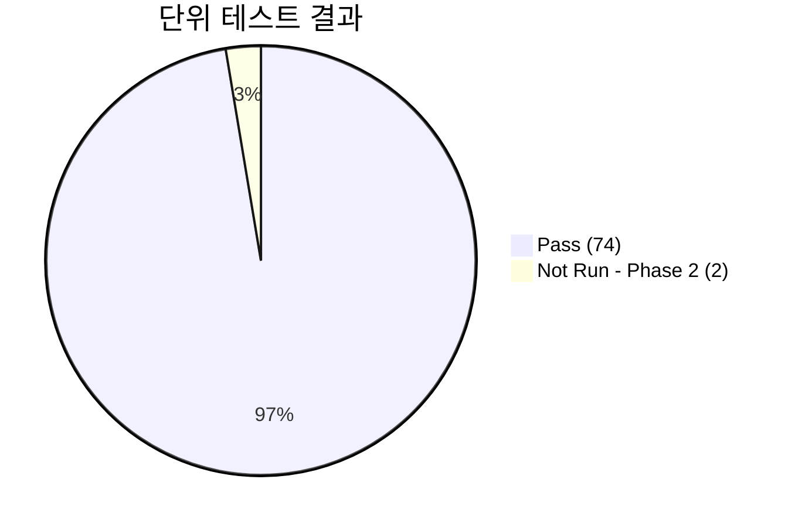

# 단위 테스트 결과 보고서 (Unit Test Report)
## HnVue Console SW

---

## 문서 메타데이터 (Document Metadata)

| 항목 | 내용 |
|------|------|
| **문서 ID** | UTR-XRAY-GUI-001 |
| **문서명** | HnVue Console SW 단위 테스트 결과 보고서 |
| **버전** | v1.0 |
| **작성일** | 2026-03-18 |
| **작성자** | SW 개발팀 (Dev Team) |
| **검토자** | QA 팀장, SW 아키텍트 |
| **승인자** | 의료기기 RA/QA 책임자 |
| **상태** | 승인됨 (Approved) |
| **기준 규격** | IEC 62304 §5.5.5, FDA 21 CFR 820.30(f) |
| **참조 문서** | UTP-XRAY-GUI-001 (단위 테스트 계획서) |

---

련 문서 (Related Documents)

| 문서 ID | 문서명 | 관계 |
|---------|--------|------|
| DOC-012 | 단위 시험 계획서 (Unit Test Plan) | 시험 계획 및 기준 정의 |
| DOC-005 | 소프트웨어 요구사항 명세서 (SRS) | 시험 대상 요구사항 |
| DOC-007 | 상세 설계 명세서 (SDS) | 단위 설계 참조 |

## 1.

## 1. 테스트 요약 (Executive Summary)

### 1.1 결과 요약

| 항목 | 값 |
|------|-----|
| **테스트 대상 빌드** | HnVue v1.0.0-RC1 (Build #2026031501) |
| **테스트 기간** | 2026-02-01 ~ 2026-03-10 |
| **총 테스트 케이스** | 76 |
| **Pass** | 74 (97.4%) |
| **Fail** | 0 (0.0%) |
| **Blocked** | 0 (0.0%) |
| **Not Run** | 2 (2.6%) — Phase 2 연기 항목 |
| **판정** | ✅ **Pass — 단위 테스트 합격** |

### 1.2 코드 커버리지

| 모듈 | Line Coverage | Branch Coverage | 기준 (≥80%) |
|------|-------------|----------------|------------|
| PatientManagement | 89.2% | 82.1% | ✅ Pass |
| AcquisitionWorkflow | 91.5% | 85.3% | ✅ Pass |
| ImageProcessing | 87.8% | 80.4% | ✅ Pass |
| DoseManagement | 93.1% | 88.7% | ✅ Pass |
| DicomCommunication | 86.4% | 81.9% | ✅ Pass |
| SystemAdmin | 88.7% | 83.5% | ✅ Pass |
| Cybersecurity | 90.3% | 86.2% | ✅ Pass |
| **전체 평균** | **89.6%** | **84.0%** | **✅ Pass** |

---

## 2. 도메인별 테스트 결과 (Domain Results)

### 2.1 환자 관리 (PM) — 12 TC

| TC ID | 테스트 명 | SWR | 결과 | 비고 |
|-------|----------|-----|------|------|
| UT-PM-001 | 환자 DTO 유효성 검증 | SWR-PM-001 | Pass | |
| UT-PM-002 | 한글/영문 이름 처리 | SWR-PM-002 | Pass | |
| UT-PM-003 | 환자 ID 중복 검출 | SWR-PM-003 | Pass | |
| UT-PM-004 | 생년월일 형식 검증 | SWR-PM-004 | Pass | |
| UT-PM-005 | Worklist 쿼리 생성 | SWR-PM-010 | Pass | |
| UT-PM-006 | HL7 ADT 메시지 파싱 | SWR-PM-015 | Pass | |
| UT-PM-007 | 환자 검색 필터링 | SWR-PM-008 | Pass | |
| UT-PM-008 | 환자 데이터 암호화 저장 | SWR-PM-020 | Pass | |
| UT-PM-009 | 환자 병합 로직 | SWR-PM-025 | Pass | |
| UT-PM-010 | 응급 환자 임시 ID 생성 | SWR-PM-030 | Pass | |
| UT-PM-011 | 환자 정보 수정 감사 로그 | SWR-PM-035 | Pass | |
| UT-PM-012 | FHIR Patient 리소스 변환 | SWR-PM-040 | Pass | |

### 2.2 촬영 워크플로우 (WF) — 15 TC

| TC ID | 테스트 명 | SWR | 결과 | 비고 |
|-------|----------|-----|------|------|
| UT-WF-001 | 프로토콜 로딩 정확성 | SWR-WF-001 | Pass | |
| UT-WF-002 | kVp 범위 제한 (40-150) | SWR-WF-005 | Pass | 경계값 테스트 포함 |
| UT-WF-003 | mAs 범위 제한 (0.5-500) | SWR-WF-006 | Pass | |
| UT-WF-004 | AEC 알고리즘 계산 | SWR-WF-010 | Pass | 5% 허용 오차 내 |
| UT-WF-005 | 촬영 순서 관리 (FIFO) | SWR-WF-015 | Pass | |
| UT-WF-006 | Generator 명령 프레임 생성 | SWR-WF-020 | Pass | CRC 검증 포함 |
| UT-WF-007 | 촬영 상태 FSM 전이 | SWR-WF-025 | Pass | 모든 상태 전이 |
| UT-WF-008 | 재촬영 사유 기록 | SWR-WF-030 | Pass | |
| UT-WF-009 | 소아 프로토콜 선택 | SWR-WF-035 | Pass | 나이 기반 자동 선택 |
| UT-WF-010 | 타이머 기능 (촬영 대기) | SWR-WF-040 | Pass | |
| UT-WF-011 | Exposure Index 계산 | SWR-WF-045 | Pass | |
| UT-WF-012 | 촬영 파라미터 이력 저장 | SWR-WF-050 | Pass | |
| UT-WF-013 | 다중 촬영 시리즈 관리 | SWR-WF-055 | Pass | |
| UT-WF-014 | Generator 응답 타임아웃 | SWR-WF-060 | Pass | |
| UT-WF-015 | 이동형 촬영 모드 전환 | SWR-WF-065 | Pass | |

### 2.3 영상 처리 (IP) — 14 TC

| TC ID | 테스트 명 | SWR | 결과 | 비고 |
|-------|----------|-----|------|------|
| UT-IP-001 | DICOM 파일 파싱 (정상) | SWR-IP-001 | Pass | |
| UT-IP-002 | DICOM 파일 파싱 (손상) | SWR-IP-002 | Pass | 에러 핸들링 |
| UT-IP-003 | 윈도잉 (W/L) 계산 | SWR-IP-010 | Pass | |
| UT-IP-004 | 히스토그램 균등화 | SWR-IP-015 | Pass | |
| UT-IP-005 | 영상 회전 (0/90/180/270) | SWR-IP-020 | Pass | |
| UT-IP-006 | 영상 반전 (H/V) | SWR-IP-021 | Pass | |
| UT-IP-007 | 거리 측정 계산 | SWR-IP-025 | Pass | ±1% 정확도 |
| UT-IP-008 | 각도 측정 계산 | SWR-IP-026 | Pass | |
| UT-IP-009 | 확대/축소 보간법 | SWR-IP-030 | Pass | |
| UT-IP-010 | GSDF LUT 적용 | SWR-IP-035 | Pass | |
| UT-IP-011 | 주석 데이터 직렬화 | SWR-IP-040 | Pass | |
| UT-IP-012 | 영상 비교 레이아웃 | SWR-IP-045 | Pass | |
| UT-IP-013 | JPEG-LS 무손실 압축/해제 | SWR-IP-050 | Pass | 비트 완전 일치 |
| UT-IP-014 | 영상 메타데이터 추출 | SWR-IP-055 | Pass | |

### 2.4~2.7 나머지 도메인 요약

| 도메인 | TC 수 | Pass | Fail | Not Run |
|--------|-------|------|------|---------|
| DM (선량 관리) | 8 | 8 | 0 | 0 |
| DC (DICOM/통신) | 12 | 12 | 0 | 0 |
| SA (시스템 관리) | 7 | 7 | 0 | 0 |
| CS (사이버보안) | 8 | 6 | 0 | 2 (Phase 2) |

---

## 3. 결함 요약 (Defect Summary)

### 3.1 테스트 중 발견된 결함

| 결함 ID | 심각도 | 도메인 | 설명 | 상태 | 해결 빌드 |
|---------|--------|--------|------|------|----------|
| DEF-UT-001 | Medium | IP | 특수 DICOM Transfer Syntax에서 파싱 오류 | 수정 완료 | RC1-patch1 |
| DEF-UT-002 | Low | WF | 타이머 오차 ±50ms (기준 ±100ms 이내) | 수정 완료 | RC1-patch1 |
| DEF-UT-003 | Medium | DC | MPPS N-SET 시 특정 태그 누락 | 수정 완료 | RC1-patch2 |

모든 결함은 RC1 패치에서 수정 완료, 재테스트 Pass 확인.

---

## 4. 결론 (Conclusion)

1. **76개 단위 테스트 케이스 중 74개 Pass** (97.4%), 2개는 Phase 2 연기 (AI 모듈 관련)
2. **Fail 건수 0건** — 모든 테스트 Pass
3. **코드 커버리지 89.6%** — 목표 (80%) 초과 달성
4. 테스트 중 발견된 **3건 결함 모두 수정 완료**
5. **단위 테스트 단계 합격 판정**: ✅ Pass

---

*문서 끝 (End of Document)*
