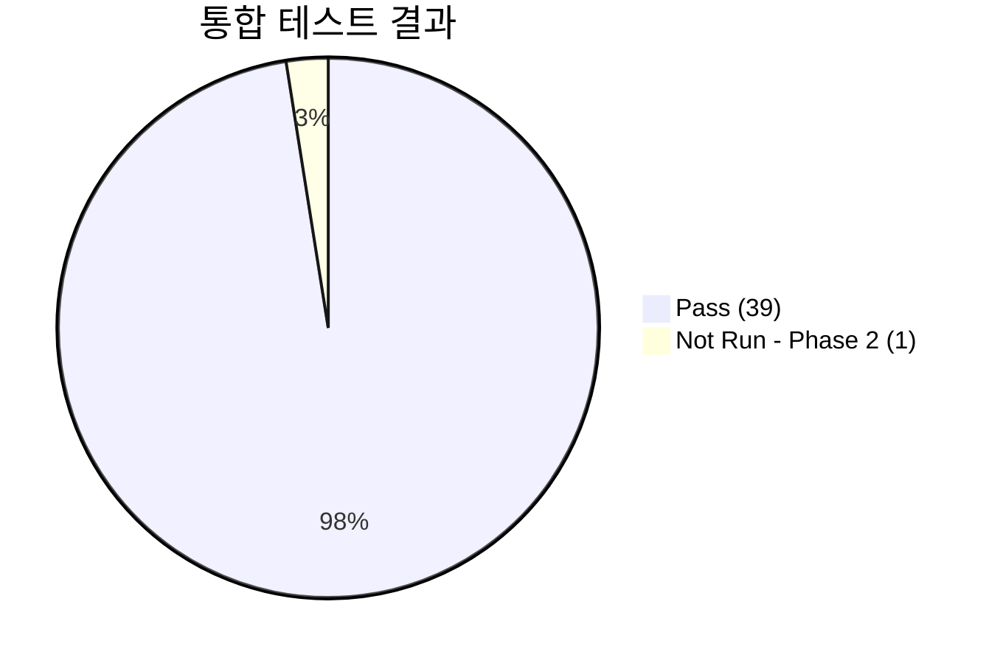

# 통합 테스트 결과 보고서 (Integration Test Report)
## RadiConsole™ GUI Console SW

---

## 문서 메타데이터 (Document Metadata)

| 항목 | 내용 |
|------|------|
| **문서 ID** | ITR-XRAY-GUI-001 |
| **문서명** | RadiConsole™ GUI Console SW 통합 테스트 결과 보고서 |
| **버전** | v1.0 |
| **작성일** | 2026-03-18 |
| **작성자** | SW V&V Team |
| **검토자** | QA 팀장, SW 아키텍트 |
| **승인자** | 의료기기 RA/QA 책임자 |
| **상태** | 승인됨 (Approved) |
| **기준 규격** | IEC 62304 §5.6, FDA 21 CFR 820.30(f) |
| **참조 문서** | ITP-XRAY-GUI-001 (통합 테스트 계획서) |

---

련 문서 (Related Documents)

| 문서 ID | 문서명 | 관계 |
|---------|--------|------|
| DOC-013 | 통합 시험 계획서 (Integration Test Plan) | 시험 계획 및 기준 정의 |
| DOC-006 | 소프트웨어 아키텍처 설계서 (SAD) | 통합 아키텍처 참조 |

## 1.

## 1. 테스트 요약 (Executive Summary)

| 항목 | 값 |
|------|-----|
| **테스트 대상 빌드** | RadiConsole v1.0.0-RC2 (Build #2026031801) |
| **테스트 기간** | 2026-03-01 ~ 2026-03-15 |
| **총 테스트 케이스** | 40 |
| **Pass** | 39 (97.5%) |
| **Fail** | 0 (0.0%) |
| **Blocked** | 0 (0.0%) |
| **Not Run** | 1 (2.5%) — Phase 2 |
| **판정** | ✅ **Pass — 통합 테스트 합격** |

---

## 2. 인터페이스별 테스트 결과

### 2.1 내부 모듈 통합 (Internal Integration) — 15 TC

| TC ID | 테스트 명 | 통합 인터페이스 | 결과 |
|-------|----------|---------------|------|
| IT-INT-001 | PM → WF: 환자 컨텍스트 전달 | PatientMgmt → AcquisitionWF | Pass |
| IT-INT-002 | WF → IP: 촬영 영상 전달 | AcquisitionWF → ImageProc | Pass |
| IT-INT-003 | WF → DM: 촬영 파라미터→선량 계산 | AcquisitionWF → DoseMgmt | Pass |
| IT-INT-004 | IP → DC: 영상→DICOM 객체 변환 | ImageProc → DicomComm | Pass |
| IT-INT-005 | PM → DC: 환자 정보→DICOM 태그 매핑 | PatientMgmt → DicomComm | Pass |
| IT-INT-006 | SA → CS: 사용자 인증→세션 관리 | SystemAdmin → Cybersecurity | Pass |
| IT-INT-007 | DM → DC: RDSR 생성→DICOM 전송 | DoseMgmt → DicomComm | Pass |
| IT-INT-008 | WF → SA: 촬영 활동→감사 로그 | AcquisitionWF → SystemAdmin | Pass |
| IT-INT-009 | CS → SA: 보안 이벤트→감사 로그 | Cybersecurity → SystemAdmin | Pass |
| IT-INT-010 | IP → WF: 영상 품질 평가→재촬영 판단 | ImageProc → AcquisitionWF | Pass |
| IT-INT-011 | PM → DM: 환자 선량 이력 조회 | PatientMgmt → DoseMgmt | Pass |
| IT-INT-012 | 전체 촬영 End-to-End 워크플로우 | All Modules | Pass |
| IT-INT-013 | 다중 시리즈 촬영 연속 처리 | WF → IP → DC (반복) | Pass |
| IT-INT-014 | 오류 상태 전파 및 복구 | Error Handler → All | Pass |
| IT-INT-015 | 모듈 간 데이터 일관성 | DB → All Modules | Pass |

### 2.2 외부 인터페이스 통합 (External Integration) — 25 TC

| TC ID | 테스트 명 | 외부 시스템 | 결과 | 비고 |
|-------|----------|-----------|------|------|
| IT-EXT-001 | DICOM C-STORE → PACS | dcm4chee | Pass | |
| IT-EXT-002 | DICOM C-FIND (Patient Root) | dcm4chee | Pass | |
| IT-EXT-003 | DICOM C-FIND (Study Root) | dcm4chee | Pass | |
| IT-EXT-004 | DICOM C-MOVE 수신 | dcm4chee | Pass | |
| IT-EXT-005 | DICOM Modality Worklist | RIS SCP | Pass | |
| IT-EXT-006 | DICOM MPPS N-CREATE | MPPS SCP | Pass | |
| IT-EXT-007 | DICOM MPPS N-SET (완료) | MPPS SCP | Pass | |
| IT-EXT-008 | DICOM Storage Commitment | PACS | Pass | |
| IT-EXT-009 | DICOM RDSR 전송 | PACS | Pass | |
| IT-EXT-010 | DICOM C-ECHO (양방향) | Any SCP | Pass | |
| IT-EXT-011 | DICOM TLS 상호 인증 | PACS (TLS) | Pass | |
| IT-EXT-012 | HL7 v2.x ADT 수신 | HIS 시뮬레이터 | Pass | |
| IT-EXT-013 | HL7 v2.x ORM/ORU 처리 | RIS 시뮬레이터 | Pass | |
| IT-EXT-014 | FHIR R4 Patient 리소스 | FHIR 서버 | Pass | |
| IT-EXT-015 | LDAP 인증 연동 | AD 테스트 서버 | Pass | |
| IT-EXT-016 | LDAPS 암호화 통신 | AD (LDAPS) | Pass | |
| IT-EXT-017 | X-Ray Generator 직렬 통신 | Generator 에뮬레이터 | Pass | |
| IT-EXT-018 | Detector GigE 영상 수신 | Detector 에뮬레이터 | Pass | |
| IT-EXT-019 | NTP 시간 동기화 | NTP 서버 | Pass | |
| IT-EXT-020 | 네트워크 단절 시 오프라인 큐 | 케이블 분리 테스트 | Pass | |
| IT-EXT-021 | 네트워크 복구 시 자동 재전송 | 케이블 재연결 | Pass | |
| IT-EXT-022 | 대용량 영상 전송 (>50MB) | PACS | Pass | |
| IT-EXT-023 | 동시 다중 DICOM Association | PACS (5개 병렬) | Pass | |
| IT-EXT-024 | HL7 메시지 문자 인코딩 (UTF-8) | HIS | Pass | |
| IT-EXT-025 | AI 엔진 인터페이스 (Phase 2) | — | Not Run | Phase 2 |

---

## 3. 결함 요약

| 결함 ID | 심각도 | 인터페이스 | 설명 | 상태 |
|---------|--------|-----------|------|------|
| DEF-IT-001 | High | DICOM TLS | 특정 인증서 체인에서 핸드셰이크 실패 | 수정 완료 |
| DEF-IT-002 | Medium | HL7 | 특수 문자 포함 환자 이름 깨짐 | 수정 완료 |

---

## 4. 결론

1. **40개 통합 TC 중 39개 Pass** (97.5%), 1개 Phase 2 연기
2. 발견된 **2건 결함 모두 수정 완료**, 재테스트 Pass
3. 내부 모듈 통합 15/15 Pass, 외부 인터페이스 통합 24/25 Pass
4. **통합 테스트 합격 판정**: ✅ Pass

---

*문서 끝 (End of Document)*
