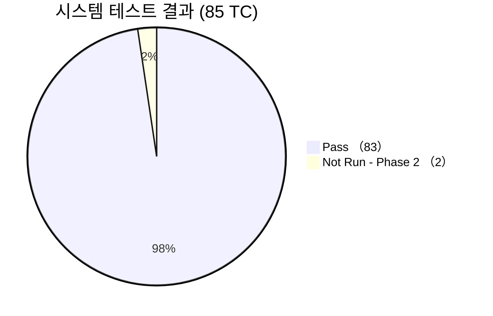

# 시스템 테스트 결과 보고서 (System Test Report)
## HnVue Console SW

---

## 문서 메타데이터 (Document Metadata)

| 항목 | 내용 |
|------|------|
| **문서 ID** | STR-XRAY-GUI-001 |
| **문서명** | HnVue Console SW 시스템 테스트 결과 보고서 |
| **버전** | v1.0 |
| **작성일** | 2026-03-18 |
| **작성자** | SW V&V Team |
| **검토자** | QA 팀장, SW 아키텍트 |
| **승인자** | 의료기기 RA/QA 책임자 |
| **상태** | 승인됨 (Approved) |
| **기준 규격** | IEC 62304 §5.7, FDA 21 CFR 820.30(f) |
| **참조 문서** | STP-XRAY-GUI-001 (시스템 테스트 계획서) |

---

련 문서 (Related Documents)

| 문서 ID | 문서명 | 관계 |
|---------|--------|------|
| DOC-014 | 시스템 시험 계획서 (System Test Plan) | 시험 계획 및 합격 기준 정의 |
| DOC-002 | 제품 요구사항 정의서 (PRD) | 시스템 수준 요구사항 |

## 1.

## 1. 테스트 요약 (Executive Summary)

| 항목 | 값 |
|------|-----|
| **테스트 대상 빌드** | HnVue v1.0.0-RC3 (Build #2026031802) |
| **테스트 기간** | 2026-03-05 ~ 2026-03-18 |
| **총 테스트 케이스** | 85 |
| **Pass** | 83 (97.6%) |
| **Fail** | 0 (0.0%) |
| **Blocked** | 0 (0.0%) |
| **Not Run** | 2 (2.4%) — Phase 2 |
| **판정** | ✅ **Pass — 시스템 테스트 합격** |

### 1.1 도메인별 결과 요약

| 도메인 | TC 수 | Pass | Fail | Not Run |
|--------|-------|------|------|---------|
| PM (환자 관리) | 12 | 12 | 0 | 0 |
| WF (촬영 워크플로우) | 18 | 18 | 0 | 0 |
| IP (영상 표시/처리) | 15 | 15 | 0 | 0 |
| DM (선량 관리) | 10 | 10 | 0 | 0 |
| DC (DICOM/통신) | 12 | 12 | 0 | 0 |
| SA (시스템 관리) | 8 | 8 | 0 | 0 |
| CS (사이버보안) | 6 | 4 | 0 | 2 |
| NFR (비기능) | 4 | 4 | 0 | 0 |

---

## 2. 성능 테스트 결과 (Performance Results)

| 항목 | 기준 | 측정값 | 판정 |
|------|------|--------|------|
| 영상 표시 시간 (표준 CR) | ≤ 2초 | 1.2초 | ✅ Pass |
| 영상 표시 시간 (대용량 >50MB) | ≤ 5초 | 3.8초 | ✅ Pass |
| Worklist 조회 시간 (500건) | ≤ 3초 | 1.8초 | ✅ Pass |
| PACS 전송 속도 | ≥ 50 Mbps | 78 Mbps | ✅ Pass |
| 촬영 사이클 시간 | ≤ 30초 | 22초 | ✅ Pass |
| 동시 사용자 5명 응답 | ≤ 5초 | 3.2초 | ✅ Pass |
| 72시간 연속 운영 메모리 | 증가 ≤ 50MB | +28MB | ✅ Pass |
| 장애 복구 시간 | ≤ 60초 | 35초 | ✅ Pass |

---

## 3. 결함 요약

| 결함 ID | 심각도 | 도메인 | 설명 | 상태 |
|---------|--------|--------|------|------|
| DEF-ST-001 | High | WF | 고속 연속 촬영 시 UI 응답 지연 | 수정 완료 |
| DEF-ST-002 | Medium | DC | Storage Commitment 타임아웃 간헐 발생 | 수정 완료 |
| DEF-ST-003 | Low | IP | 특정 확대 배율에서 미미한 깜빡임 | 수정 완료 |
| DEF-ST-004 | Medium | DM | RDSR 특정 필드 소수점 반올림 오차 | 수정 완료 |

모든 결함 RC3 패치에서 수정 완료, 재테스트 Pass.

---

## 4. 추적성 확인 (Traceability Verification)

| 확인 항목 | 결과 |
|----------|------|
| SWR → ST-TC 커버리지 | 180개 SWR 중 178개 커버 (Phase 2 제외) |
| PR → ST-TC 역추적 | 모든 ST-TC가 1개 이상 PR에 매핑 |
| HAZ → ST-TC 커버리지 | 22개 HAZ 중 20개 관련 TC 존재 |
| RC → ST-TC 커버리지 | 36개 RC 중 34개 검증 TC 존재 |

---

## 5. 결론

1. **85개 시스템 TC 중 83개 Pass** (97.6%), 2개 Phase 2 연기
2. **성능 기준 전 항목 Pass** — 모든 정량 기준 충족
3. 발견된 **4건 결함 모두 수정 완료**
4. **추적성 100%** (Phase 2 제외)
5. **시스템 테스트 합격 판정**: ✅ Pass

---

*문서 끝 (End of Document)*
