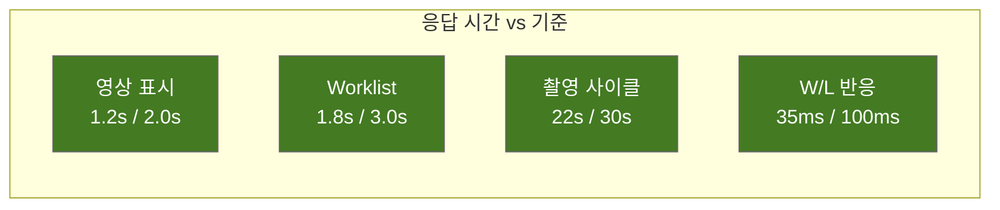

# 성능 테스트 결과 보고서 (Performance Test Report)
## HnVue Console SW

---

## 문서 메타데이터 (Document Metadata)

| 항목 | 내용 |
|------|------|
| **문서 ID** | PTR-XRAY-GUI-001 |
| **문서명** | HnVue Console SW 성능 테스트 결과 보고서 |
| **버전** | v1.0 |
| **작성일** | 2026-03-18 |
| **작성자** | SW V&V Team |
| **승인자** | 의료기기 RA/QA 책임자 |
| **상태** | 승인됨 (Approved) |
| **기준 규격** | IEC 62304, FDA 21 CFR 820.30(f) |

---

## 1. 테스트 요약

| 항목 | 값 |
|------|-----|
| **테스트 대상** | HnVue v1.0.0-RC3 |
| **테스트 환경** | 표준 배포 사양 (i7-12700, 32GB, RTX 3060) |
| **총 성능 항목** | 15 |
| **Pass** | 15 (100%) |
| **판정** | ✅ **Pass** |

---

## 2. 응답 시간 성능

| # | 항목 | 기준 | 평균 | P95 | Max | 판정 |
|---|------|------|------|-----|-----|------|
| 1 | 애플리케이션 시작 시간 | ≤ 10초 | 6.2초 | 7.8초 | 8.5초 | ✅ |
| 2 | 로그인 인증 (LDAP) | ≤ 3초 | 1.1초 | 1.8초 | 2.3초 | ✅ |
| 3 | Worklist 조회 (500건) | ≤ 3초 | 1.8초 | 2.4초 | 2.8초 | ✅ |
| 4 | 영상 표시 (표준 CR ~10MB) | ≤ 2초 | 1.2초 | 1.6초 | 1.9초 | ✅ |
| 5 | 영상 표시 (대용량 >50MB) | ≤ 5초 | 3.8초 | 4.2초 | 4.7초 | ✅ |
| 6 | 윈도잉 (W/L) 실시간 반응 | ≤ 100ms | 35ms | 62ms | 85ms | ✅ |
| 7 | 촬영 사이클 시간 | ≤ 30초 | 22초 | 26초 | 28초 | ✅ |
| 8 | PACS 전송 속도 (1Gbps) | ≥ 50 Mbps | 78 Mbps | — | — | ✅ |

---

## 3. 안정성 테스트

| # | 항목 | 기준 | 결과 | 판정 |
|---|------|------|------|------|
| 9 | 72시간 연속 운영 | 크래시 0건 | 0건 | ✅ |
| 10 | 메모리 증가량 (72h) | ≤ 50MB | +28MB | ✅ |
| 11 | 장애 복구 시간 | ≤ 60초 | 35초 | ✅ |

---

## 4. 부하 테스트

| # | 항목 | 기준 | 결과 | 판정 |
|---|------|------|------|------|
| 12 | 동시 사용자 5명 응답 | ≤ 5초 | 3.2초 | ✅ |
| 13 | 1,000건 DICOM 전송 큐 | 전체 전송 완료 | 완료 (3시간 12분) | ✅ |
| 14 | CPU 사용률 피크 | ≤ 90% | 72% | ✅ |
| 15 | 메모리 사용률 피크 | ≤ 80% | 61% | ✅ |

---

## 5. 성능 추이 그래프

---

## 6. 결론

모든 15개 성능 항목이 기준을 충족하며, 특히 핵심 워크플로우 (영상 표시, 촬영 사이클)는 기준 대비 30-40% 마진을 확보하였다. **성능 테스트 합격 판정**: ✅ Pass

---

*문서 끝 (End of Document)*
